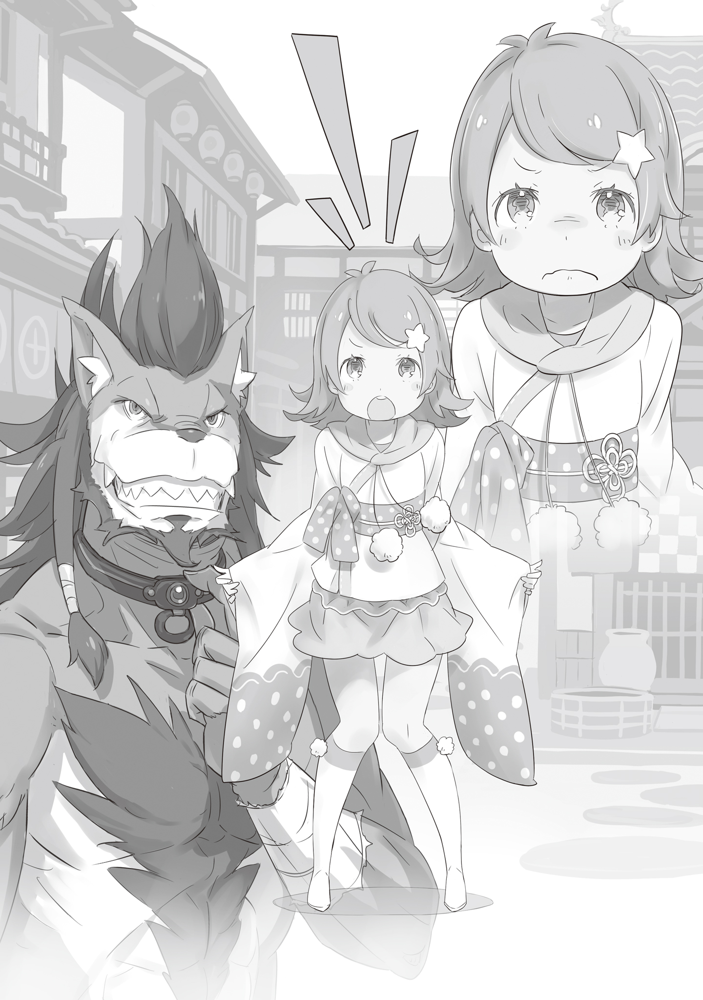

Рикардо пинал валявшиеся в переулке куски дерева, проклиная свою неудачу в поиске ребёнка, появившегося перед ним. Он сидел в тупике, все ещё мокрый после дождя, собираясь съесть только что купленное пирожное, когда возникла проблема, готовая его измучить.

— …!

Перед Рикардо молча стояла девочка, грязная с головы до ног. Её светло-фиолетовые волосы были растрёпаны, а одежда была изношена, словно потёртые бирки. В враждебном взгляде читалось недоверие к человечеству, что означало, что она, по-видимому, была сиротой из трущоб.

Дети без родителей не редкость. Богатые очень богаты, а бедные очень бедны. Это универсальное правило, и то же самое верно в Карараги, где процветает торговля.

— Чего тебе, малявка? Я только закончил работать и голоден… Мне не нужны проблемы.

— Ты, мелкая дрянь! Куда, черт возьми, ты сбежала? — закричал кто — то переулке.

Эти слова донеслись до ушей Рикардо, который старался не привлекать к себе лишнего внимания. В конце он вздохнул своим огромным ртом:

— О! Я нашёл тебя, малышка! Что с тобой… А? Кто ты, черт возьми?

Четверо бандитов, во главе с темнокожим мужчиной, ворвались в тупик. Когда бандит увидел ребёнка, его лицо исказилось от гнева, а после того как заметил Рикардо голос стал ещё громче. Но ярость быстро утихла, когда получеловек встал.

— Чего ты так побледнел? В чем дело? — спросил Рикардо.

— Такой размер… Что ты за получеловек, черт возьми?

— Разве не видно, что я собачий? Кобольд.

— Не бывает кобольдов с такими телами! Ты меня за дурака не держи!

Когда темнокожий мужчина закричал, Рикардо нахмурился, заткнув уши. Он уже сбился со счета, сколько раз слышал эту болтовню, это негодование. По правде говоря, хотя его рост был почти два метра, все его тело было покрыто коричневой шерстью, а черты собачьего лица не оставляли сомнений в том, что он был получеловеком-собакой.

Хотя ему пришлось признать, он был одним из самых высоких представителей собачьего народа.

— О нет, братец… Я не хочу стоять у тебя на пути. По правде говоря, эта малявка влезла, пока я ел. Это меня обеспокоили.

Сказав это твердо, он достаточно напугал бандитов. Фыркнув от их трусости, Рикардо попытался избежать дальнейшей головной боли.

— …

В последний момент, уходя из переулка, он бросил быстрый взгляд на ребёнка. Получеловек понятия не имел, что она сделала. Но судя по тому, как взбесились бандиты, сирота не отделается от них невредимой. Рикардо не был из тех, кто жалеет других.

Однако взгляд на эти бледно-голубые глаза сильно изменил его судьбу.

— В любом случае, вали отсюда! А, ты идёшь со мной! — сказал главарь девочке.

— Подожди секундочку, братец — произнёс Рикардо.

Глава банды схватил девочку за плечо и попытался вытащить её хрупкое тело. Однако в тот момент, когда она показала признаки отчаянного сопротивления, Рикардо вмешался. В узком переулке темнокожий мужчина испугался гигантской фигуры кобольда и отступил.

Прежде чем он успел открыть рот, Рикардо схватил её за голову и спрятал за свою спину.

— …

— Э-эй, что ты делаешь…? — выкрикнул бандит.

— У тебя в руке ошейник, не так ли? Это тот самый ошейник, который надевают на раба.

Указывая на руку мужчины, он ответил спокойным голосом. Эта рука сжимала ошейник, соединённый с железной цепью. В ответ они навострили взгляды.

И они наконец-то заметили. На шее высокого кобольда был такой же ошейник.

— Ты, пес, у тебя на шее… это рабский…

— Не поймите меня неправильно. Нет, мой рабский контракт уже истёк. Камень, символизирующий это, не светится, видите? Я отбыл свой срок. Я просто продолжаю носить его, чтобы не забывать те дни. Но моя личная история не имеет значения, важны ваши действия.

Пока мужчины слушали его рассказ, они полезли в карманы. Учуяв изменение атмосферы, Рикардо показал в сторону ребёнка и продолжил:

— Я бы не совал свой нос, если бы у нее уже был этот ошейник, но я волнуюсь, что она его еще не использовала… Это не то что можно снять без контракта, и неправильно заключить такую сделку в тёмном переулке. Кроме того…

— …Кроме чего, черт возьми?

— Вы, ребята, не разговариваете на карарагийском диалекте. Откуда же вы появились?

Сразу после того, как Рикардо рассмеялся от души, обнажив свои клыки, темнокожий мужчина перед ним двинулся. Отбросив ошейник в сторону, он выхватил кинжал свободной рукой. Одним плавным движением светящийся кончик кинжала блеснул возле толстой шеи Рикардо, готовясь к удару. Но прямо перед этим…

— Хохо, дилетант — просмеялся получеловек.

Большой мачете, прислонённый к стене, взмахнул, и шея мужчины хрустнула задолго до того, как он успел атаковать. Голова мужчины, поражённая железной плитой, полностью повернулась, а его тело врезалось в стену и рухнуло. Глядя на эту сцену, остальных бандитов парализовало.

— Поправка… Вы все дилетанты и очень глупые.

Мачете свернул ещё три раза. Соответственно, количество мужчин, которые перестали двигаться, также увеличилось на три. Этого было достаточно, чтобы закрыть занавеску на ссоре, что только и произошло в переулке, и, спрятав трупы в углу, кобольд обернулся.

Девочка все ещё стояла там, не сдвинувшись с места. Она смотрела на останки бандитов, не боясь, но с той же враждебностью, как раз перед тем, как чуть не стала рабом.

Это была не слабость, а чистый, мятежный дух — взгляд, который пробудил в Рикардо некоторый интерес.

— Эй, малышка. Ну и дела.

Он почесал голову, не зная, что сказать, когда вдруг почувствовал тепло в своей руке. Это была пирожное, которое он купил и собирался попробовать, прежде чем все это случилось.

— Хочешь немного поесть? Оно ещё тёплое.

— …Хочу.

Затем она быстро выхватила пирожное из рук Рикардо, и в то же время её живот заурчал, что вызвало улыбку у получеловека. Затем малышка, прищурившись, сказала:

— Я не малявка, я девочка. Не смей больше так меня называть, дядя.

И она бросила на Рикардо такой злобный взгляд, какого не удостаивались даже работорговцы.

— В последнее время стало опасно. Не думал, что они опустятся до того, чтобы порабощать маленьких детей. Имя и философия города-государства Карараги плачут.

Выходя из переулка, прежде чем возникли новые проблемы, Рикардо пробормотал свои мысли. Рядом с ним стояла маленькая девочка, поедавшая лакомство, которое, в конце концов, будет полностью съедено. Он не мог за это её винить.

− Не стыдно быть грязной. У тебя большой дух… Но попасть в эту банду болванов — большая ошибка. Как тебя поймали, малышка?

— …Неважно, не суй свой нос не в своё дело, дядя — сказала девочка.

Видя, что она идёт раздраженная этим вопросом, кобольд снова рассмеялся, заставляя её ещё больше хмуриться.

— И почему ты помог мне, дядя? Ты же знаешь, что я не смогу заплатить.

— Даже я не знаю… Это было совсем не случайно…

Он попытался уклониться от вопроса, грубо почесав голову. Девочке, похоже, не понравился этот ответ, но Рикардо говорил правду и не мог объяснить свои мотивы. Возможно, дело было в её светло-голубых глазах.

И пока кобольд размышлял, девочка коротко ахнула. В том направлении, куда она смотрела, к ней мчались два силуэта. Это были полулюди-Лисы, вероятно братья. Они, тяжело дыша, подбежали к ней и…

— С-слава богу, ты в безопасности… Тебя забрали вместо нас, что могло произойти… — отдышавшись сказал один из братьев.

— Заткнись. Я не знаю, о чем ты говоришь, ты, должно быть, путаешь меня с кем-то другим — резко ответила девочка.

— Конечно, нет! Как я могу ошибиться со своей благодетельницей?

Получеловек-Лис упорствовал, в то время как девочка продолжала оставаться равнодушной.

— Понятия не имею, о чем ты говоришь, но никогда не заходите из любопытства в такие переулки. Там слоняются другие, похожие на них. Кажется, они думают, что ловить получеловек… не проблема.

— Это…

— Я больше не хочу в это ввязываться. Убирайтесь домой и поплачьте со своей мамочкой. Я больше не буду это повторять.

С обиженным видом на холодные слова девочки братья-лисы ушли смирившиеся. После того, как они отошли достаточно далеко, она повернулась к Рикардо, который наблюдал за ними, скрестив руки.

— …Что c твоим лицом? — спросила девочка.

— Ничего. Просто дядя услышал то, что не имеет к нему никакого отношения.

— …Ты раздражаешь.

Рикардо погладил девочку по голове, которой это очень не понравилось, и она отмахнулась от его больших рук. Этот небольшое событие оставило кобольда в очень хорошем настроении. Убедившись, что братья ушли, он повернулся к ней.

— Это нормально? Ты в курсе, что чуть не стала рабом, помогая им?

— Да. Я сделала это, потому что хотела. Кроме того, если их семья узнает, что они связались с сиротой из трущоб, то получат куча проблем. Так будет лучше для меня и для них — спокойно ответила девочка.

— Ты очень взрослая для своего возраста, не так ли? Извини, но мне это очень нравится, малышка.

— …А ты мне не очень нравишься.

Девочка пробормотала это с надутыми губами. Рикардо ответил ей искренним смехом, наклонив голову, а затем девочка указала на его шею.

— Этот ошейник — доказательство того, что ты был рабом. Почему ты все ещё носишь его, даже после того, как твой контракт закончился?

— Разве ты не слышала? Чтобы никогда не забыть. Я тот, кто есть сегодня, потому что когда-то был рабом.

—Как глупо… Это тоже самое, что заковывать себя в кандалы.

После того, как Рикардо тихо произнёс своё оправдание, блеск, который девочка показала в переулке, вернулся ей в глаза. Её взгляд уставился прямо на него, кобольд почти прекратил дышать.

— Ты говоришь, как мои люди из трущоб… Ты был рабом так долго, что у тебя застряла психология неудачника, это сделало тебя трусом. Это просто отговорки, почему у тебя ничего не вышло, чтобы ты мог сказать, что теперь ты хоть немного лучше.

— Малышка…

— Вот в чем проблема. Тебе сейчас лучше? Вовсе нет, сейчас худшее что может быть, ведь что ты стоишь на месте, ничего не делая. Я не хочу быть такой.

Сказав это дрожащим голосом, девочка безудержно плакала. Несмотря на то, что её чуть не схватили работорговцы, несмотря на то, что она видела перед собой жестокое убийство, она не плакала, а теперь плачет из-за неопределённого будущего. Как будто не могла простить себе за то, что была ничем, и продолжала плакать, глядя на ошейник, который носил Рикардо.

— …Да. Я тоже ненавижу такое — ответил получеловек.

Сказав эти слова, он погладил девочку по голове, пока она плакала, и посмотрел на небо, чтобы собраться с духом и сделать то, что считал правильным.

— Вот теперь ты выглядишь прилично — улыбнувшись сказал Рикардо.

— …

После того, как ей привели в порядок волосы, которые она хотела отрастить, вымыли её тело, испачканное грязью, и переодели её рваную одежду в новую, красивую, она действительно стала похожа на приличную девушку.

Однако, услышав замечание Рикардо, она посмотрела на свой внешний вид и беспокойно жестикулируя спросила:

— Ч-что это…? Почему я должна так одеваться?

— Я уже все устроил. Потому ты начнёшь усердно работать в баре. Да, я бы вообще не смог работать, весь такой грязный.

— Р-работать…? Так внезапно?

— Разве ты не хочешь измениться в лучшую сторону? Тогда сможешь не просто говорить об этом как хотела. Кстати, как тебя зовут? Мне нужно знать, чтобы сказать владельцу.

Девочка была сбита с толку этим вопросом и запиналась. В конце концов, спустя некоторое время, она отвела взгляд, надув губы:

— У меня нет имени. Но я выросла в землянке, поэтому люди зовут меня Анастасия.

— …Гахахаха! Отлично! Это хорошее имя! Анастасия из землянки, да?! Я уверен, что ты станешь важной персоной с таким именем!

Затем, подтолкнув маленькую девочку, они вдвоём вышли из гостиницы и направились на оживлённую улицу. Среди толпы Анастасия закрыла глаза, как будто глядя на что-то чрезвычайно яркое

Рикардо показал свои клыки Анастасии и продолжил:

— Слушай, малышка. Это первый и последний раз, когда я помогаю тебе. Я не знаю, что делать дальше. Если ты действительно полна решимости, то все будет хорошо.

— …Зачем ты так много делаешь для меня, дядя?

Взгляд девочки выражал сильное сомнение и недоверие. Для Рикардо это было облегчением. Это была её реакция вместо слов благодарности.

— Это просто причуда. Но я думаю, что это окупится, если хочешь знать.

Он ответил, погладив девочку по голове, и произнёс с громким смехом своё заявление. После мытья её волосы были тонкими и мягкими, как будто представляя её нежно сердце. Даже тот факт, что они были слегка волнистыми, отражало её упрямый характер.

— Надеюсь, ты скоро добьёшься больших успехов. Когда это произойдёт, я буду гордиться, если ты вспомнишь обо мне — произнёс Рикардо.

— …Дядя.

— Хмм?

Позванный шёпотом, Рикардо ждал продолжения, которого так и не последовало. Но девочка побежала на другую сторону улицы, где повернулась на каблуках и крикнула:

— Сегодня я воспользуюсь твоей добротой! Но не забывай. Когда я стану большой шишкой, первое, что я сделаю, это куплю тебя. Я сниму этот рабский ошейник своими собственными руками!

Палец Рикардо невольно, бессознательно коснулся ошейника. Чувствуя его холодную, твёрдую поверхность, кобольд вспомнил, как когда-то был скован им. Несмотря ни на что, он проглотил воспоминания о тех днях, когда считал это мерзостью и улыбнулся.

— Я Рикардо никогда не забуду, что ты сказала, Ана.

Девочка, с надутыми щеками, и получеловек, который громко смеялся.

Так когда-то встретились женщина, которая возглавила крупнейшую торговую компанию в стране, и её первый соратник.

《Конец》
