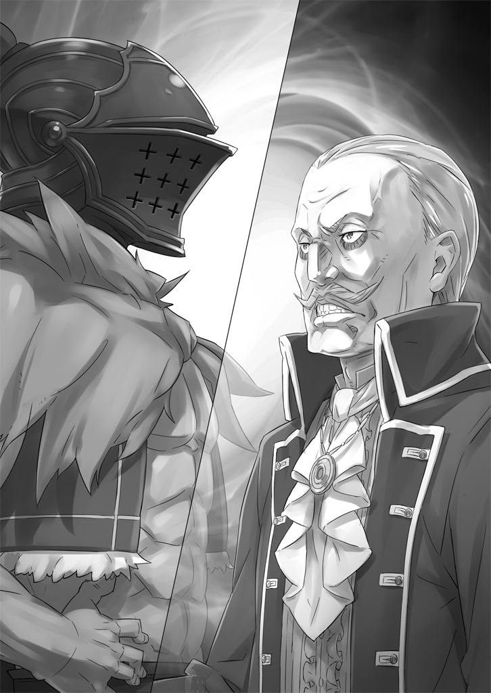
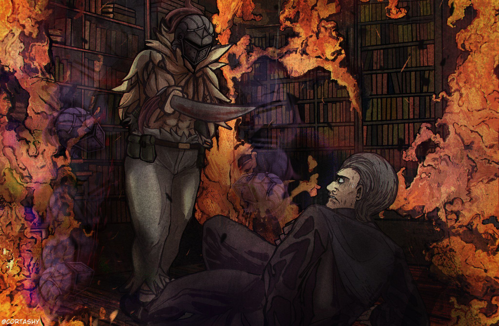
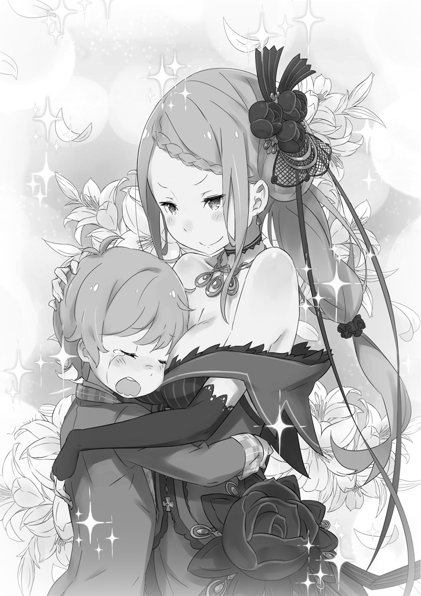

В этом мире, состоящем из единого протяженного континента, существует четыре государства, которые называют «Великими Державами».

Каждая из этих стран держит под контролем земли на севере, юге, востоке и западе, а все прочие малые страны существуют лишь как вассалы, находящиеся под покровительством гигантов.

Баланс сил между четырьмя державами поддерживается в хрупком, но идеальном равновесии. За исключением разве что относительно недавно возникшего Карараги, эта расстановка сил практически не менялась на протяжении почти тысячи лет.

На севере раскинулось Священное Королевство Густеко — край суровых морозов и неприступных горных хребтов, требующий и от людей, и от животных нечеловеческой стойкости ради выживания. Снега здесь лежат круглый год, а урожай дают лишь редкие, устойчивые к холоду культуры. Взамен страна живет животноводством и разработкой многочисленных месторождений магической руды, спящих в недрах скалистых гор. Добыча и обработка магических камней — вот основа государственной мощи Густеко.

Кроме того, на вершине священной горы Пардокия восседает один из Четырёх Великих Духов — обладающая колоссальной силой «Священный Зверь» Одгласс.

При основании Священного Королевства Густеко Одгласс заключила договор с заклинателем духов, который смог её подчинить, даровав тому титул «Святого Короля». С тех пор Священный Зверь неизменно участвует в избрании каждого нового правителя. «Святой Король» — глава государства — избирается не по праву крови или происхождения, а по воле Одгласс, которая лично указывает на преемника из числа граждан.

На западе лежат города-государства Карараги — по сравнению с тремя другими державами, это молодая, недавно возникшая страна.

Примерно четыреста лет назад западная часть континента напоминала пороховую бочку: множество мелких княжеств вели там бесконечные распри. Силы этих микрогосударств были примерно равны, и каждое из них, боясь объединенного удара соседей, жило в постоянном напряжении. Эта эпоха бесплодного противостояния длилась очень долго.

Положил этому конец один-единственный торговец, назвавшийся Хосином.

Человек без роду и племени, чье происхождение так и осталось загадкой, Хосин возвысился, опираясь лишь на своё красноречие, торговый талант и изобретательность. В итоге он сокрушил мелкие страны, мерившиеся военной силой, магией своей экономической мощи. Не принадлежа ни к одной из стран, он использовал поистине дьявольские уловки, чтобы в каждом государстве появилось что-то, связанное с ним.

В результате многие малые страны склонились перед Хосином, сменив статус государств на статус городов, и так родилась федерация — города-государства Карараги, где Хосин стал представителем всех городов.

С тех пор имя Хосина стало синонимом головокружительного успеха. Даже после его смерти в эти земли, словно следуя по его стопам, стекалось множество талантливых людей. Так Карараги превратились в мощную державу, с которой не решались связываться даже три древних империи.

На юге расположена Империя Волакия — страна с древнейшей историей, где испокон веков императоры ведут свой народ согласно доктрине «Богатая страна, сильная армия».

Император, стоящий на вершине, обладает абсолютной властью и единолично управляет всеми государственными делами.

Эта форма правления не менялась с момента основания. То, что Империя до сих пор не рухнула под гнетом какого-нибудь глупого правителя, объясняется жесточайшим законом престолонаследия.

Согласно обычаю, правящий император должен завести детей в разных уголках страны. Эти дети обязаны вступить в смертельную схватку за трон. Для кандидата в императоры поражение означает смерть. Эта политическая борьба, представляющая собой концентрированный сгусток ненависти и человеческой порочности, проходит через чудовищную резню, чтобы выявить единственного достойного наследника.

Уважение к такому государственному укладу глубоко проникло в сознание имперцев. Империализм, провозглашающий верховенство сильнейшего и господство Империи, воспринимается там как само собой разумеющаяся истина.

Хотя дипломатические отношения с другими странами существуют, Волакия, обладая плодородными землями и стабильным климатом, способна полностью обеспечивать себя сама и потому не проявляет активности в дипломатии. Зато амбиции по расширению территорий никуда не исчезли — Волакия веками продолжает оказывать давление на соседнее Королевство Лугуника, провоцируя бесконечные пограничные конфликты.

Именно поэтому земли барона Бариэля, расположенные на юго-западе Драконьего Королевства Лугуника, всегда находились под дамокловым мечом войны.

— Говорят, наш барон привёз себе новую жёнушку.

Для жителей земель Бариэль эта новость была лишь поводом для саркастичных пересудов в перерывах между полевыми работами.

К барону Лейпу Бариэлю, управляющему этими землями, народ не питал особо тёплых чувств. Точнее было бы сказать, что впечатление о нем сложилось крайне скверное.

Грабительские налоги, законы, начисто лишенные заботы о людях… Трудно испытывать симпатию к власть имущему, который не то что не пытается быть ближе к народу, но даже показывается на глаза крайне редко.

Такая глубокая пропасть между феодалом и его подданными вполне могла стать зерном восстания. И правда, за последние десять лет несколько заговоров действительно имели место быть.

Однако барон, которому не хватало добродетели для заботы о людях, с лихвой компенсировал это параноидальной бдительностью к чужому злому умыслу. В результате все заговоры были подавлены с показательной жестокостью, и отношения между бароном и деревней ухудшались день ото дня.

Поэтому даже его свадьба — событие, которое обычно празднуют всем баронством, — была для жителей чем-то чужим и далеким. Их совершенно не интересовала новая пассия барона, который, будучи уже в преклонных годах, решился на брак словно выживший из ума старик.

«Всё равно эта новая жена, наверное, такая же дьяволица. Будет забирать большую часть наших трудов, оставляя лишь жалкие крохи, чтоб мы не передохли с голоду», — думали они.

Смерть Лейпа и крах рода Бариэль из-за отсутствия наследников — вот единственная надежда, ради которой жили эти люди.

Такова была их первоначальная оценка её персоны.

Первая оценка до того, как они увидели женщину по имени Присцилла Бариэль.

— Ха. До чего же унылое, и вдобавок, начисто лишенное величия сборище.

Первое, что сделала эта женщина, едва открыв рот — бросила эту фразу, глядя на лучшее поле в деревне и его хозяина.

В голосе её звучало нескрываемое презрение, а слова были пропитаны высокомерием существа, взирающего на мир с недосягаемой высоты. Многие из тех, кто поднял головы, почувствовали трудно сдерживаемый гнев, но стоило им увидеть её, как все слова застряли в горле.

Перед ними стояла женщина в красном.

Её оранжевые волосы сияли, словно впитав солнечный свет, и были заколоты изящной балеткой. Алое платье бесстыдно выставляло напоказ тело, слишком пышное и соблазнительное для простой смертной. Губы, слегка тронутые помадой, изогнулись в насмешливой улыбке, а глаза, встретившие их взгляды, горели яростным пламенем.

Даже веер, которым она обмахивалась, и тот был красным. Вся она была воплощением багрянца.

От этого визуального удара, от осознания того, что перед ними особа невероятно высокого происхождения, все позабыли, как нужно реагировать.

Добавьте к этому тот факт, что женщина была прекрасна настолько, что эта красота затмевала даже её вызывающий наряд.

И мужчины, и женщины, находившиеся там, помимо своей воли затрепетали перед её великолепием.

— Чего уставились своими неотесанными зенками на меня? Неужто не ведаете о почтении, жалкие простолюдины?

Впрочем, и это восхищение было тут же смыто потоком оскорблений, сорвавшихся с уст девушки. Крестьяне, с опозданием осознавшие, как их унизили, опустили глаза. В глубине их душ закипал гнев, но они подавили его, не смея выпустить наружу.

Слова женщины были возмутительно оскорбительны. Но одного взгляда хватало, чтобы понять: пропасть между их положением непреодолима. Сопротивление не принесет никакой выгоды. Лучшей стратегией, как и всегда, было склонить голову перед бурей и ждать, пока она пройдет.

— Вот как. Ясно. Долгие годы безнадежности вырвали с корнем дух бунтарства, пропитав вас насквозь психологией побитых собак. Выходит, этот старый хрыч всё-таки чего-то стоит. Видимо, дрессировка через угнетение — его конёк.

— Я… я полагаю, вы благородная госпожа. По какому делу вы пожаловали сегодня в нашу деревню?..

Обведя взглядом склонившихся крестьян, женщина удовлетворенно кивнула. В этот момент хозяин поля решился подать голос.

Владея самым большим наделом и лучшей землей, он был своего рода представителем деревни, пусть и в масштабах этой нищеты. Только у него было право спросить дворянина цели визита.

— Не спеши, простолюдин. Понимаю, внезапное явление такой красавицы, как я, может шокировать, но я поступаю так, как желаю сама, и не потерплю, чтобы кто-то меня торопил. Считайте это неслыханной удачей и просто молча наслаждайтесь возможностью краем глаза лицезреть мою красоту.

Присцилла приблизилась к хозяину поля и заговорила вкрадчиво, почти касаясь его своим дыханием. Фермер в панике отпрянул, что было неудивительно.

Хотя разница в возрасте между ними была, как у отца с дочерью, густой аромат соблазна, исходящий от неё, заставлял забыть о годах, напоминая мужчине лишь о том, что перед ним женщина.

«Роковая женщина» — вот, пожалуй, самое подходящее описание.

— Хм, хм… Вот оно как.

Заставив фермера отшатнуться, женщина с видом полноправной хозяйки прошлась по окрестным полям.

Крестьянам только и оставалось, что, как она и велела, украдкой наблюдать за ней. Хотя никто не мешал им вернуться к работе, никто не осмелился пошевелиться.

Все боялись сделать что-то не так и привлечь внимание этой красной фурии.

— Ну, допустим. Для начала возьмём это, и это, и ещё эти два. Все они примерно одинаковы, так что просто осознайте, как вам повезло попасть под мою прихоть.

Осмотрев ближайшие поля, женщина удовлетворенно кивнула.

Затем она пронзила взглядом хозяина большого поля. Увидев, как тот дрожит, она одарила его улыбкой. Улыбкой, которая, несмотря на сквозящую в ней порочность, была до невозможности красива.

— Эй ты, простолюдин. Ты ведь владеешь самым большим наделом в этой деревне, верно?

— Д-да. Всё именно так.

— Глядя на твое поле, всё становится ясно. Оно убогое, но земли много. Ты напоминаешь одного барона, чьи амбиции не соответствуют его возможностям, подобно гнилому старому пню.

Лишь с задержкой до крестьян дошло, что полные презрения и насмешки слова относятся не к кому иному, как к самому Лейпу Бариэлю. Лица людей побледнели от такой дерзости.

Для них барон был небожителем. Привыкшие к такой иерархии, они даже помыслить не могли, что кто-то может стоять выше самого барона. Хотя, на самом деле, это была лишь их ошибка восприятия.

— Впрочем, твоё поле сойдет. Как раз подходящая ступенька для сравнения. Но истинным счастливчиком, которого озарит моё сияние, будет другой. Владелец тех четырех чахлых полей через дорогу, ты.

Женщина указала на наделы, которые по сравнению с землями богатого фермера выглядели истощенной пустошью. Их хозяин и сам выглядел столь же изможденным, а его семья едва сводила концы с концами, выживая лишь благодаря милосердию соседей.

Глядя на назвавшегося крестьянина, женщина в красном позволила жестокой эмоции мелькнуть в глазах.

Это была смесь презрения, отвращения и откровенно злобного высокомерия.

— Ну да ладно. Только полив водой иссохший росток, можно наглядно продемонстрировать разницу.

Потеряв интерес к замершему от страха крестьянину, она скучающим взглядом указала на скудное поле и начала что-то обстоятельно втолковывать мужчине.

Шёпот достигал лишь его ушей, и окружающие не могли знать, какие невозможные требования она выдвигает. Все лишь с жалостью смотрели на бедолагу, который кивал головой.

Закончив шептать, женщина удовлетворенно скрестила руки на груди. При этом её пышная грудь внушительно колыхнулась, заставив мужчин невольно сглотнуть, на что она лишь скосила глаза.

— Забыла сказать. Я — Присцилла Бариэль. Новая владелица земель барона Бариэля и всех окрестностей. Передайте это тем, кого здесь нет. Я великодушно прощаю сегодняшнюю дерзость, но лишь сегодня, ибо сегодня день, когда невежеству и глупости дозволено существовать.

Оставив крестьян с этими словами, прозвучавшими для них как приговор, женщина удалилась.

Позже жители узнали, что назвавшаяся Присциллой особа — действительно новая жена барона Лейпа Бариэля. Они так и не поняли, почему она явилась в свои владения без свиты, но её надменность живо напомнила им о тирании Лейпа.

А тот факт, что она оказалась молодой девушкой, поверг их в отчаяние — надежда на то, что барон одряхлеет и уйдет от дел, рассыпалась в прах.

«Теперь нас ждут долгие годы мучений под тем же злобным правлением», — думали они.

Каждый, кто видел Присциллу в тот день, испытывал тревогу и страх.

Однако спустя месяц они об этом забыли.

Причиной тому стал небывалый, просто невозможный урожай на поле того бедняка, на которое указала Присцилла.

— Честно говоря, принцесса, я прям удивлён. Не ожидал, что тебя тут так обожают.

Голос, произнесший эти фамильярные слова, звучал глухо и неразборчиво.

Звяканье металла о металл, примешивающееся к речи, было причиной этой глухоты: обладатель голоса имел привычку теребить застёжку своего угольно-чёрного шлема во время разговора.

Выглядел этот человек эксцентрично… да что там, попросту нелепо.

Голова, как уже было сказано, закована в глухой чёрный шлем, но эта тяжелая защита прикрывала лишь всё, что выше шеи. В остальном его тренированное тело было облачено в какой-то бандитский наряд, создающий впечатление дикости, а на ногах — и вовсе плетеные сандалии. Одно плечо прикрывала убогая накидка из мешковины, а за поясом, горизонтально за спиной, торчал грубый широкий меч.

С какой стороны ни посмотри — подозрительная личность, но была у него одна черта, выделяющаяся особенно ярко.

У человека в шлеме левая рука отсутствовала по самое плечо.

Странный наряд в сочетании с увечьем придавал мужчине жутковатую ауру одним лишь его присутствием.

Особенно когда он стоял рядом с этой женщиной.

— «Удивлён»? Что ты подразумеваешь под этим словом? Взгляни на мою красоту, неподвластную человеческому разумению. Совершенно естественно, что чернь и глупцы тянутся ко мне, как птенцы к корму. Разве нет, Ал?

— Не, ну, я просто сам себе надумал, знаешь ли. Был уверен, что ты, принцесса — из тех, кто палец о палец не ударит.

— В таком случае исчезла бы причина, по которой я оказываю тебе столь тёплый прием. Тебе не кажется?

— Твоя правда. Тут я маху дал, признаю.

Честно согласившись с доводами Присциллы, мужчина в железном шлеме своей мощной правой рукой почесал затылок прямо поверх металла. Он с любопытством огляделся вокруг, но его выражения лица под шлемом, естественно, никто видеть не мог.

Присцилла никак не отреагировала на поведение слуги. Она уверенным, твердым шагом двинулась вперед, и люди вокруг, заметив её, начали подавать голоса:

— А! Госпожа Присцилла!

— Госпожа Присцилла!

— Слава Солнечной Принцессе!

Стоило одному заметить её, как на эти крики из домов высыпала толпа. Крестьяне, все как один со светлыми лицами, наперебой восхваляли и славили Присциллу.

— Угу. Так и должно быть. Усердствуйте вволю, глупцы. Пока вы склоняете головы перед моим величием и повинуетесь, я не настолько бессердечна, чтобы лишать вас милости. Впредь ни в коем случае не пренебрегайте этим.

Слова Присциллы были обращены не к кому-то конкретно, а ко всем ликующим сразу.

Хотя она говорила не громко, её голос обладал силой проникать повсюду. Учитывая содержание её слов, Ала аж передёрнуло от такой заносчивости, но…

— Поняли!

— Всё ради госпожи Присциллы!

— Слава Солнечной Принцессе!

Вместо того чтобы возмутиться, жители с радостью принимали её высокомерную тираду.

Ал лишь крутил головой, силясь понять это несоответствие между характером своей госпожи и отношением к ней подданных.

Он был официально признан рыцарем Присциллы всего несколько дней назад. По некоей причине Присцилле потребовалось выбрать рыцаря, и она устроила боевой турнир, руководствуясь своими целями и прихотями.

Было объявлено, что рыцарем жены барона может стать любой, невзирая на происхождение. Турнир вызвал ажиотаж, и многие приняли в нём участие. Именно там Ал приглянулся Присцилле и получил свой статус.

Их отношения, которые ещё рано было называть связью госпожи и слуги, длились совсем недолго. Пока ему было дозволено находиться рядом, Ал внимательно наблюдал за своей хозяйкой, но так и не смог разгадать её.

Казалось бы, она проницательна, но свои сиюминутные идеи воплощает в жизнь мгновенно. С крестьянами она держится почти по-свойски, но иногда её профиль источает такой холод, что мороз бежит по коже. Тело, казалось бы, созданное из одной лишь женственности, таит в себе такую свирепость, что она способна выхватить меч у Ала, воспользовавшись малейшей брешью в обороне, и снести ему голову за долю секунды.

В итоге, проведя с ней несколько дней, Ал пока что так ничего и не понял о своей госпоже.

— Ну же, Ал. Чего застыл как истукан? Этим простолюдинам ты жутко интересен. Они гадают: «Что это за чудик рядом с такой прекрасной девой, как наша госпожа?».

— Так, может, ты сама им и объяснишь?

— Следи за языком. Я и сама не знаю, сколько ещё твои дерзкие выходки будут казаться мне забавными. Не стоит навлекать на себя скучную немилость.

Стоит немного расслабиться — и вот результат. Лицо, сиявшее довольством секунду назад, за мгновение сменилось взглядом, которым смотрят на мусор.

— А, понял, виноват. Если подумать, где это видано, чтобы слуга заставлял господина представлять его? Виноват-виноват, прошу пардону и простить, сёгун¹.

— Добро. Прощаю. Но позже ты объяснишь мне, что за «сёгун» такой.

Неожиданная фраза возымела эффект, и Алу удалось счастливо избежать гнева Присциллы. С облегчением выдохнув и убедившись в этом, Ал принялся рассказывать крестьянам о своем статусе — о том, как он стал служить Присцилле, щедро приукрашивая историю забавными небылицами.

— Госпожа Присцилла — удивительна. Для меня она богиня, спасшая меня, всё так.

Мальчик, заваривший чай с опаской и явной непривычкой к этому делу, именно так ответил на вопрос Ала. То, что его манера речи была слегка чудной, можно было списать на своеобразное очарование.

Разговор происходил в гостиной поместья барона Бариэля. Ал, небрежно развалившись на роскошном диване, который буквально обволакивал сидящего, всем своим видом демонстрировал, как самозабвенно он наслаждается перерывом.

— Ну, ты-то у нас в принцессе души не чаешь, так что я ожидал от тебя примерно такого ответа.

Усмехнувшись ответу мальчика, Ал поднял протянутую чашку чая. Затем он слегка запрокинул голову и ловко влил напиток в щель между шлемом и шеей.

Никогда не снимать шлем и не показывать своё истинное лицо — такова была неизменная манера поведения Ала. Поскольку снять «голову» он не мог, да к тому же был одноруким, его манеру трапезничать никак нельзя было назвать эталоном хороших манер. Он не мог приподнять шлем одной рукой, чтобы поесть, поэтому ему приходилось «пить» еду точно так же, как он пил чай.

— Мои манеры… Напрягает, что я такой невоспитанный?

Заметив на себе пристальный взгляд мальчика — Шульта — Ал задал вопрос низким, глуховатым голосом, отставляя чашку. Шульт, услышав это, на мгновение затаил дыхание.

Он был мальчиком с тонкими чертами лица. Бледная кожа, вьющиеся розовые волосы. Алые глаза не выражали ни капли напористости, и вкупе со всем остальным создавали настолько хрупкое впечатление, что его легко можно было принять за девочку. На вид ему было лет двенадцать-тринадцать, но телосложение отставало от возраста, из-за чего он выглядел максимум лет на десять.

Мальчишка, которого ещё вполне можно было назвать ребёнком, носил чёрную форму слуги и пытался изображать дворецкого. У некоторых его вид вызвал бы скорее жалость, чем умиление. И правда, Ал чувствовал некую болезненность в том, как Шульт изо дня в день пытался прыгнуть выше головы, стараясь соответствовать роли, что была ему не по плечу.

— Я ведь человек необразованный. Уж закрой глаза на моё незнание этикета, лады? Ты ж понимаешь.

Нарочито грубо скрестив ноги на стуле, Ал продемонстрировал свою неотесанность. Шульт, глядя на это, медленно покачал головой из стороны в сторону.

— Я столь же необразован, как и вы, господин Ал. Поэтому не считаю себя достаточно достойным, чтобы критиковать ваши манеры.

— Честность — это добродетель, а прямота — привилегия детей. Выглядеть ты стал чуть более стильно, но вот содержание пока отстаёт, да? Напомни, как давно ты здесь, учитель?

— Прошло ровно три месяца с тех пор, как меня подобрала госпожа Присцилла, всё так.

Шульт не отреагировал даже на ироничное «учитель». Требовать от бывшего деревенского сироты понимания таких тонкостей было бы слишком жестоко.

Этот юный дворецкий был сиротой, которого Присцилла привезла из деревни в своих владениях.

Говорят, что когда она притащила с собой истощённого мальчишку, заявив что-то вроде «если его отмыть, он засияет», хозяин поместья, Лейп, был в ярости. Однако Присциллу это, похоже, ничуть не заботило.

Так Шульт, под защитой невероятной удачи — всё-таки он приглянулся самой Присцилле — был обеспечен жильём, едой и одеждой, а заодно превращён в юного дворецкого.

— Хотя тут ещё поспорить можно, удача это или нет — попасться на глаза принцессе.

— Я очень благодарен за то, что госпожа подобрала меня. Если бы я остался в той деревне, то к этому времени уже лежал бы в земле.

— Какая милая, слепая преданность. Как по мне, так это только добавляет путаницы в попытках понять, что у принцессы на уме и что она вообще за человек.

Кажется, что благотворительность — последнее, чем она станет заниматься, но при этом она спасает сирот. С другой стороны, она помогает не всем подряд, и условия, по которым она выбирает, кого «подобрать», остаются загадкой.

В самом деле, кто же такая Присцилла? Богиня, в которую верят подданные и Шульт? Или же жестокая ведьма, от чьих поступков у Ала временами стынет кровь в жилах?

— Ведьма. Хех, Ведьма…

Произнеся слово, которое сам же и вспомнил, Ал невольно усмехнулся его банальности.

Слово «Ведьма» было известным табу в этом мире. И именно Ал, как никто другой, прекрасно знал, какую чудовищную угрозу несёт в себе то, что скрывается за этим словом.

— Господин Ал…

— М-м?

Шульт, заметив, что Ал погрузился в раздумья, с тревогой посмотрел на него и окликнул.

То, как он прижимал к груди серебряный поднос для сервировки, выглядело слишком женственно и вызывало странное чувство диссонанса.

— Вы ведь рыцарь госпожи, так? Вы будете её защищать. Можно верить, что вы — на её стороне, так ведь?

На вопрос Шульта, звучавший почти как мольба, Ал прикрыл глаза под шлемом.

Мальчик искал в словах Ала твёрдой уверенности, чтобы унять тревогу в сердце. Однако…

— С такой формулировкой вопроса ты от кого угодно получишь бодрый ответ: «Ага, положись на меня! Я самый сильный и лучший рыцарь!», будь он хоть другом, хоть предателем со скрытыми мотивами. Твой вопрос никуда не годится. Увы, мы вам перезвоним.

Ал заметил, что его ответ ранил Шульта.

Но даже видя это выражение лица, сердце Ала не кольнуло сочувствием.

Ал не испытывал ни малейшего колебания, предавая чистый взгляд ребёнка. Ради своей

Потому что повторять ту же ошибку, что и раньше, — вот единственное, что ему абсолютно непростительно.

— Что за вздор?.. Я уж думала, куда вы запропастились, а вы устроили тут мрачное чаепитие.

В тишину гостиной внезапно ворвался прекрасный голос, звучавший будто бы с небес.

Без стука, грубо распахнув дверь, в комнату вплыла хозяйка поместья, шелестя подолом роскошного платья. Скрестив руки под пышной грудью, она прищурила один глаз и заявила: — Шульт. Когда я желаю чего-либо, мой слуга обязан находиться рядом. Упускать такой момент, прохлаждаясь здесь, — это просто немыслимо. А уж проводить время с этим шутом, — и того хуже. Если ты, чьё единственное достоинство — миловидность, заразишься от него этой убогой неотесанностью, это будет совершенно невыносимо.

— Говоришь «единственное достоинство»… Принцесса, а ты умеешь рубить с плеча похлеще моего.

— Это факт. А озвученный мной, он становится истиной, наделённой ещё большей силой. Чем ещё ценен этот ребёнок? И всё же, по сравнению с прочим бесполезным сбродом, он хотя бы сносен. Впрочем, и эту оценку придётся пересмотреть, если он продолжит подводить меня.

Глядя на беседующую парочку в гостиной, Присцилла фыркнула и бросила эти слова с явным пренебрежением. Её высокомерие заставило Ала лишь криво усмехнуться, но Шульт побледнел как полотно.

— Я… Я буду стараться изо всех сил! П-поэтому… не бросайте меня… прошу!

— Не рыдай и не умоляй, это уродливо. Хотя я могу найти удовольствие даже в плачущем лице, но рассчитывать на подобное милосердие с самого начала — верх глупости. Мне не нужны бездарности в слугах. Продолжай доказывать свою ценность.

Шульт поспешно вытер глаза рукавом, услышав, как Присцилла безжалостно отсекла его дрожащий голос. Девушка кивнула, видя, как мальчик со всё ещё покрасневшими глазами отчаянно пытается поднять голову и выглядеть достойно.

— Вот так. Если у тебя нет духа, чтобы самому изменить своё положение, то такие, как ты — не более чем трупы. Труп, возвращаясь в землю, хотя бы становится удобрением, но от тех, кто притворяется живым, будучи мёртвым внутри, нет никакого толка. Не смей тратить мой воздух попусту. Дыши так, словно от этого зависит твоя жизнь.

— Никакой пощады… Шульт, если будешь так пыхтеть над каждым вдохом, помрёшь.

Ал одёрнул Шульта, который с серьёзным лицом начал глубоко дышать, и пожал плечами, обращаясь к Присцилле: — Принцесса, он же ребёнок. Думаю, можно проявить чуточку больше доброты.

— Бренность бытия обрушивается на всех без разбора — на взрослых, детей, мужчин и женщин. Разве голод выбирает, кого морить, большого или малого? Разве лапы чумы различают знать и чернь? В вопросах выживания все равны. Тебя не заперли в клетке за железными прутьями; полагаться на других в выборе своего жизненного пути ради дешёвого спокойствия — это лишь простая лень.

— Принцесса?

Присцилла, изрекающая суровые истины, на мгновение позволила раздражению отразиться на её прекрасном профиле. Алу показалось, что это раздражение относилось к последней части её собственной фразы.

Но прежде чем Ал успел понять, что именно это значило, выражение лица Присциллы изменилось.

— Все живые равны… Кроме меня, конечно.

— Принцесса…

Улыбка. Присцилла улыбнулась обворожительно и жестоко — самой бессердечной улыбкой в мире.

Это было её убеждение, которое Ал слышал уже не раз с тех пор, как стал служить ей рыцарем.

— Сей мир устроен так, чтоб был удобен для меня.

В этом была основа уверенности Присциллы, лучшие слова, украшающие само её существование.

Заявление, которое следовало бы поднять на смех, но, по какой-то неведомой магии, смеяться над ним совсем не хотелось.

— Ну же, Шульт. Всё в точности так, как я сказала. Вся суть этого мира в том, что он создан в угоду мне… А раз так, если у меня пересохло в горле, какое событие будет для меня «удобным»?

— Д-да! Я сейчас же налью чаю, вот как!

— Олух. Содержимое чайника уже давно остыло. Предлагать мне пить пойло, заваренное Алом, — это не просто неуважение, это бунт. Голову отрублю.

— Только не это, умоляю! Я сейчас же заварю свежий!

Прижав чайник к груди, Шульт пулей вылетел из гостиной.

Слушая удаляющийся топот маленьких ножек, Ал посмотрел на Присциллу, на губах которой играла улыбка, и пожал плечами:

— Принцесса, а у тебя и правда скверный характер.

— Дворецкий, способный выполнять работу с ледяным спокойствием — это хорошо, но наблюдать, как дитя паникует — тоже своего рода развлечение. Если бы мне нужен был только нормальный сервис, разве стала бы я подбирать сироту? Я решила пока даровать Шульту честь развлекать меня в моменты скуки.

— Не повезло парню… Только потому, что он привлёк твоё внимание.

— Какое ещё невезение? Он может общаться со мной, может лично прислуживать мне. Это такая удача, ради которой мужчины этого мира готовы были бы рвать глотки и плакать кровавыми слезами. Вряд ли найдётся дитя счастливее него.

Оправдывая то, как она загоняла Шульта, Присцилла негласно требовала и от Ала выразить такую же благодарность.

На этот жадный до почитания взгляд Ал лишь вяло отозвался: — Да-да, конечно.

— Непочтительный мужчина. Видно, ты забыл, что я чуть было не отрубила тебе голову по своей прихоти… Ну да ладно. Кстати, Ал.

— Чего изволите, Ваше Высочество?

— Как там твои козни?

Услышав ледяной тон, Ал перестал дышать и уставился на Присциллу.

Выгнала Шульта, дождалась, пока всё стихнет, и только потом сменила тему. Безупречно. Её умение между делом вбросить бомбу в пустой разговор поражало — эффект был такой, словно взрывная волна ударила прямо в лицо.

Если бы он заранее не прокрутил в голове такой сценарий, то сейчас выглядел бы жалко.

— Ну, «козни» — это сильно сказано. Пока я просто присматриваюсь, оцениваю обстановку. Ты заметила, что я вынюхиваю?

— И мои глаза, и мои уши, и я сама — не только прекраснее обычных людей, но и совершеннее функционально. К тому же, это мои владения и мой сад. Топот мышей и жужжание насекомых доносятся до меня сами собой, стоит мне только пожелать услышать.

— Раз ты считаешь тут всё своим, дедуле Лейпу впору расплакаться.

— Пусть этот старый мешок с костями плачет сколько влезет, пока не иссохнет. Мне всё равно.

На прекрасную супружескую любовь рассчитывать не приходилось, но такая открытая враждебность даже удручала. Впрочем, сейчас было не время беспокоиться о будущем этой странной семьи.

— И что будешь делать, раз тебе не нравится, что я тут ползаю? Высечешь меня?

Наказание вряд ли ограничилось бы этим, но и подозрение в измене — тоже проблема. В худшем случае придётся рассмотреть вариант использования козыря против Присциллы, но…

— Нет? Я не собираюсь впадать в истерику только из-за того, что кто-то обшарил мой дом. Вообще, в тот момент, когда я пригласила такого нечестивца, как ты, я что-то подобное и ожидала.

Однако её неожиданный ответ сбил прицел всей его осторожности.

— И тебя это устраивает?

— То, что самец раздувает ноздри, отчаянно пытаясь уловить мой остаточный аромат — это естественный ход вещей. Я не настолько мелочна, чтобы осуждать мужскую натуру, одурманенную моим очарованием. К тому же…

Присцилла бросила на растерянного Ала взгляд, полный пугающей чувственности: — Тот, чьё положение столь зыбко, как у тебя, не сможет выжить, если не выберет правильную сторону. А значит, винить тебя в том, что ты мечешься туда-сюда, чтобы оценить ситуацию, — такая же глупость, как запрещать птице летать.

— …

— Наёмник и бывший гладиатор, которого я знаю всего несколько дней. Верить в то, что твоя преданность уже безраздельно принадлежит мне… это удел мечтательных идиотов. Вопиющий отказ от мышления.

Слушая, как Присцилла с отвращением выплёвывает эти слова, Ал незаметно позволил напряжению, сковывавшему всё его тело, уйти.

По крайней мере, в её нынешних словах не было лжи. Он счёл это достаточным основанием для вывода.

— А я-то думал, ты скажешь что-то вроде: «Сравнивать меня с другими — это непочтительно. Просто смотрите на мой облик и позвольте моему величию ослепить вас», или типа того.

— Те, кто не уверен в себе — вот кто боится, что взгляд обратится к кому-то другому. У меня же есть непоколебимая уверенность, что я — единственная и высшая ценность в этом мире. А потому такие тревоги мне чужды.

Вынув веер из ложбинки на груди, Присцилла с громким щелчком раскрыла его и продолжила: — Нет никаких сомнений в том, что я — самый прекрасный самоцвет в мире, но понять, что я лучшая, можно лишь в сравнении с другими камнями. Чтобы осознать моё великолепие, необходимо сравнить меня с прочей серостью. Твои колебания, в конечном счёте, есть не что иное, как завуалированная хвала, подтверждающая моё величие. Ну как, шедеврально, не правда ли?

— Да уж, шедеврально.

Прикрыв рот раскрытым веером, Присцилла улыбалась так, что улыбка всё равно оставалась видна. Ал, помедлив долю секунды, согласился с её донельзя высокомерным высказыванием.

Присцилла не стала указывать на эту крошечную заминку. Она понимала, что это бессмысленно.

А вот Ал был потрясён настолько, что даже не заметил этого понимания с её стороны.

Это было удивление. Ему даже показалось, будто его ударили по голове.

Юная девушка, стоящая перед ним, вдруг предстала в ином свете, нежели раньше.

Кем же она ему привиделась?..

— Госпожа Присцилла! Я ужасно задержался! Я принёс чай!

— Долго!!

Прежде чем он успел сформулировать ответ в своей голове, дверь распахнулась, и в комнату влетел Шульт.

Рёв Присциллы встретил его на пороге. Сжимаясь от страха, Шульт начал дрожащими руками накрывать на стол. Рядом с ним Присцилла опустилась на свободный диван, смело закинула одну белую ногу на другую и стала ждать.

Глядя на свою госпожу, сидящую в такой абсолютно незащищённой позе, и на мальчика-дворецкого, красного как рак за работой, Ал продолжал погружаться в бесконечные раздумья.

От зловония, просачивающегося внутрь шлема, Ал невольно поморщился, хотя никто не мог этого видеть.

Это был уже второй раз, когда он входил в этот кабинет, но впечатления остались прежними.

Тяжёлый, затхлый воздух плохо проветриваемой комнаты и специфический запах старых книг. К этой комбинации он, казалось, привык, но когда к ней примешивался аромат парфюма, призванный скрыть запах тела, и вонь самого хозяина комнаты, въевшаяся настолько, что ничем её не замаскировать, — это было уже чересчур.

Как итог, в кабинете царила атмосфера, отбивающая у посторонних всякое желание переступать порог.

— Ты опоздал.

Настрой Ала, и так подорванный «ароматным» приветствием, упал ещё ниже от этого неприветливого голоса. Учитывая, что тащиться сюда ему пришлось через не хочу, мотивации уже не было. Будь перед ним кто-то, кому можно простить грубость, он бы давно сбежал через заднюю дверь.

Однако человек перед ним не отличался ни чувством юмора, ни великодушием, чтобы прощать подобные выходки.

— Ты опоздал.

Снова прозвучало то же самое слово, с той же интонацией, что и мгновение назад. В этом хриплом голосе сквозили презрение и оскорбление — старик требовал от Ала подобающей реакции.

Ему было мало просто упрекнуть; он не успокоится, пока не заставит собеседника подчиниться морально. Мелочная натура.

— Ты опозд…

— Прошу прощения за дерзость. Сами знаете, поместье огромное, а когда вызывают внезапно, приходится петлять, уточняя дорогу. Кстати, вы сейчас что-то сказали?

Когда он намеренно перебил третий упрёк своим ответом, в ответ раздалось откровенно недовольное цоканье языком.

Такая реакция немного успокоила раздражение Ала, и он наконец-то внимательно посмотрел на хозяина кабинета.

Старик, сидевший за столом из чёрного дерева в окружении книжных шкафов, загромождавших стены. Говорят, ему вот-вот стукнет семьдесят, но в его энергичном теле чувствовалась сила пятидесятилетнего. Волевой взгляд и черты лица играли в этом не последнюю роль, да и прямая спина вкупе с крепким сложением придавали ему вид человека весьма внушительного.

Фатальным недостатком было лишь то, что, вопреки этой благородной внешности, характер у него был эгоистичный и донельзя мелочный.

Старика звали Лейп Бариэль. Барон, владелец этих земель, и хозяин поместья Бариэль, взявший в жёны Присциллу. Для Ала он формально считался супругом госпожи, которой он служил, а значит, человеком, которого следовало уважать.

Впрочем, сам Ал вовсе не считал, что этот тип заслуживает хоть капли уважения.

— Слышал, ты таскаешься за «этим» повсюду, пользуясь предоставленной свободой, и чуть ли не каждый день шляешься по владениям.

— «Этим»? Это вы о ком?

— Пф… «Это» есть «это». Я говорю о моей жене, о ком же ещё!

— А, ну да. Нет, я просто уточнил. Матушка учила меня: если супруги перестают называть друг друга по имени, это верный признак, что любовь остыла.

Глядя на разъярённого Лейпа, Ал мысленно показал ему язык, а вслух ответил с напускным безразличием.

— Я слышал, ты из гладиаторов. У вас там что, есть родители?

— В Волакии не все гладиаторы рождаются на арене, знаете ли. Куда чаще туда попадают должники или преступники уже во взрослом возрасте. Если уж говорить о моих ровесниках, то тех, кто вырос там с пелёнок, обычно к этому возрасту уже давно разрубили на куски.

— Пф. Зрелище, которое так любят эти варвары-имперцы. Легко могу представить их дурной вкус.

В кои-то веки Ал был согласен с предвзятым мнением, которое выплюнул Лейп.

Честно говоря, вспоминать о временах гладиаторства ему не хотелось.

Ежедневные битвы не на жизнь, а на смерть, соперничество за воинскую славу — всё это было совершенно не в характере Ала. Сейчас он каждый день наслаждался покоем, радуясь тому, что сумел выжить и выбраться оттуда.

— Ладно, плевать мне на тебя. Речь о Присцилле. Что ты думаешь о том, что «это» каждый день разъезжает по владениям и творит что вздумается?

— Думаю, ей просто любопытно. В моем представлении… ну, или скажем так, это немного отличается от того, как обычно ведут себя родственники барона. Но, кажется, простолюдинам это очень даже зашло.

— «Зашло», говоришь. Пф, им просто в диковинку. Чистая случайность, что капризы и бредовые идеи «этого» принесли урожай на полях. И только из-за этого чернь поклоняется ей, словно «Божественному Дракону». Это было ожидаемо, но глупости есть предел!

Лейп с силой ударил кулаком по столу и заскрежетал зубами от ярости.

Видимо, популярность среди подданных задела его за живое. Алу, который сопровождал Присциллу в её ежедневных поездках, несложно было это представить. Даже если не брать в расчёт Присциллу, репутация самого Лейпа в деревнях была скверной. Не будет преувеличением сказать, что она валялась где-то на уровне плинтуса.

Неужели он позвал меня только чтобы поныть?

— Я не то чтобы выгораживаю принцессу, но тот случай с полями вряд ли был просто капризом. В какую бы деревню мы ни приехали, она везде добивается результата. Даже там, где условия земли совершенно другие. Хотя согласен, поверить в такую прозорливость трудновато.

— Какая ещё прозорливость? Чушь собачья. То, что «это» с собой приносит, куда ужаснее. Иначе с чего бы, по-твоему, о ней ходят слухи как о «Кровавой Невесте»?

Услышав это прозвище, Ал, пожимавший плечами, замер.

Увидев его реакцию, Лейп наконец-то довольно, и притом весьма уродливо, ухмыльнулся, словно добился своего.

«Кровавая Невеста» — дурная слава, преследующая Присциллу, ныне носящую фамилию Бариэль.

Присцилла — девушка, которой ещё нет и двадцати, но брак с Лейпом для неё далеко не первый. Он — восьмой.

А все предыдущие семь браков закончились трагически. Причина — смерть супруга. Иными словами, Присцилла уже семь раз пережила своих мужей.

Причины их гибели всегда были разными: кто-то пал в бою, кто-то умер от болезни, кто-то — от несчастного случая. И хотя подозрения в причастности к каждой из этих смертей падали на Присциллу, она умудрялась проскальзывать сквозь сеть обвинений и дожила до сегодняшнего дня.

Поэтому среди тех, кто знал правду, она была известна как «Кровавая Невеста», притягивающая несчастья. Ирония заключалась в том, что мужчины, несмотря ни на что, продолжали добиваться её, заворожённые красотой Присциллы настолько, что забывали о зловещих слухах.

Однако Ал считал, что Лейп в эту категорию не вписывается.

Одна из причин — преклонный возраст, когда плотские желания уже угасли. Но главное — в Лейпе не было той слепоты, порождённой страстью к чарам Присциллы. Это было очевидно по тому, как он избегал её и как вел себя сейчас.

Значит, у этого старика была иная цель, ради которой он взял Присциллу в жёны.

И причина эта заключалась в следующем…

— Если бы она не была кандидатом на предстоящих Королевских Выборах, кто в здравом уме стал бы держать такую лису у себя под боком? Стоит дать слабину — и она, не зная меры, сядет на шею. Тот турнир, на котором тебя сделали рыцарем, — из той же оперы.

— А вы, я погляжу, выражений не выбираете… Не боитесь, что я донесу принцессе и ваши отношения испортятся?

Лейп, не скупясь на грязные слова, с лёгкостью раскрывал свои ещё более грязные планы.

Королевские Выборы. Великое событие, сотрясающее Королевство Лугуника. Испытание ради будущего, дарованное «Драконом», чтобы избрать нового правителя на смену выкошенному болезнью королевскому роду. Лейп, которому было поручено охранять «Драконью Скрижаль» с пророчеством о будущем Королевства, узнал о Выборах ещё до того, как члены королевской семьи слегли от болезни.

Он сыграл на опережение: взял в жёны Присциллу, обладающую правом стать кандидатом, намереваясь посадить её на трон и тем самым прибрать к рукам всю власть в стране.

Замысел шит белыми нитками; любой, кто знал Лейпа, пришёл бы к такому выводу. Но чтобы он сам озвучил это так открыто… Неужели он не допускает возможности, что Ал проявит верность и выхватит меч ради защиты чести Присциллы прямо здесь и сейчас?

Глядя снизу вверх на ошеломлённого Ала, Лейп скривил губы в отвратительной ухмылке.

— Ты ведь не совершишь такую глупость, верно? Наёмники тем и живут, что хитростью ищут собственную выгоду. Ты, бывший гладиатор, ни за что не променяешь свою жизнь на такую дешёвую эмоцию, как праведный гнев.

— Вы меня насквозь видите…

Ал поднял руки, которые до этого покоились на рукояти меча, демонстрируя отсутствие враждебности.

— Но если так, чего вы хотите? Честно говоря, план у господина впечатляющий, но я не думаю, что смогу быть чем-то полезен.

— Вовсе нет. Изначально твоё место должен был занять человек, подконтрольный мне. На том турнире, где собрали всякий сброд, четверо лучших, кроме тебя, были моими людьми.

— Ох ты ж, договорной матч.

— И всё пошло прахом из-за её каприза. Её окружение должно состоять только из тех, кто поддерживает меня. Ты ведь понимаешь почему?

Если невозможно просчитать своеволие Присциллы, то, по крайней мере, её окружение должно быть таким, чтобы в нужный момент скорректировать курс. Логичный ход. Но в таком случае…

— А как насчёт слуги, Шульта? Принцесса ведь тоже его подобрала, разве нет?

— С этим пацаном у меня был тот же разговор, что и с тобой. Стоило пообещать роскошь, недоступную бывшему беспризорнику, как он ухватился за предложение без лишних вопросов. В конце концов, проницательность «этого» только на такое и годится.

— Хм-м.

Вспомнился Шульт, громко заявлявший, что всё делает ради Присциллы. Впрочем, Ал не чувствовал особого разочарования. Ставить себя на первое место — инстинкт любого живого существа. Если верность основана на хорошем отношении, то вполне естественно, что чаша весов склонится туда, где предложат условия получше. И Ал не был исключением.

— Я понял, чего вы ожидаете от меня. Тогда хотелось бы обсудить моё вознаграждение и дальнейшие действия.

— Хе-хе… Вот именно, так и надо. Не бойся, в накладе не останешься. Разумеется, это касается и Присциллы. Ради исполнения моего заветного желания мне нужно, чтобы она была здорова. И «это», и пацан, и ты — всё, что вам нужно делать, это просто получать счастье под моим крылом!

Лейп, довольный сговорчивостью Ала, рассмеялся, урча горлом.

Слушая этот громкий смех, Ал тихо пробормотал в адрес хозяина, которого решил предать: «Прости, принцесса».

Но даже в этот миг, когда он мысленно произносил эти слова, Присцилла в его голове победоносно улыбалась.

Рыцарь, назвавшийся Гиллианом Эндимионом, посетил владения Бариэль.

Он был статным красавцем с мужественным лицом и благородным взором. Сияющие золотые волосы сверкали на солнце, а худощавое, но тренированное тело разительно отличалось изяществом от грубого телосложения Ала. Отлично сшитый рыцарский мундир подчёркивал привлекательность юноши, а висящий на поясе драгоценный меч даже дилетанту казался вещью отнюдь не заурядной.

С головы до пят настоящий, первоклассный рыцарь — такое впечатление производил юноша по имени Гиллиан.

— Это третий сын дома Эндимион. Пока два его старших брата помогают отцу управлять землями, он, талантливый фехтовальщик, отправился в странствие, чтобы прославить своё имя как рыцарь. Сегодня он, по моей настойчивой просьбе, согласился погостить в нашем доме.

Человеком, представившим стоящего рядом красавца, был не кто иной, как Лейп Бариэль.

И, разумеется, старик не стал бы утруждать себя представлением гостя Алу или Шульту. Стоя напротив Лейпа, Гиллиана бесцеремонно разглядывала баронесса — Присцилла.

— Я поняла рассказ об этой посредственности, но не пойму, с какой целью ты представляешь сего мужа мне? Неужто ты, осознав свою дряхлость и скорый конец, впал в маразм и решил подыскать мне другого мужчину?

— Не говори глупостей. Кто в здравом уме откажется от такой прекрасной жены, как ты? Считай сегодняшнее событие его желанием и… проявлением моей небольшой заботы.

— Забота? Как на тебя не похоже.

Присцилла фыркнула, ни на йоту не веря предложению Лейпа. Казалось, было видно, как Лейп, внешне сохраняющий спокойствие, внутренне кусает губы от злости.

Но прежде чем Лейп успел взорваться, Гиллиан медленно шагнул вперёд.

— Прошу прощения за внезапный визит и за мою дерзкую просьбу.

Изысканные манеры и низкий красивый голос, способный очаровать любую женщину. Гиллиан тут же преклонил колено перед Присциллой.

— Однако с тех пор, как до меня дошли слухи о госпоже Присцилле в землях Бариэль, я жаждал дня, когда смогу встретиться с вами. Теперь я воочию убедился: вы — истинное воплощение небесной красоты.

— О как. А ты, я погляжу, обучен манерам. Моя красота и впрямь не от мира сего. И всё же я снизошла в этот бренный мир — какое противоречие. Воистину, грешная я женщина.

Присцилла, явно довольная дифирамбами Гиллиана, бросила взгляд на Ала. Стоявший позади неё и выполнявший роль слуги мужчина, вместо кривой усмешки лишь пожал плечами.

— Хорошо. Я дозволяю тебе коснуться моей кожи и исполнить рыцарский обет. Считай это счастьем, превосходящим твои ожидания.

— Да! Это великая честь.

С этими торжественными словами Присцилла грациозно протянула руку. Гиллиан коснулся её белых пальцев так, словно имел дело с хрупкой драгоценностью, и поцеловал тыльную сторону ладони, исполняя рыцарский этикет.

Если рассказать без контекста, то сцена выглядела точь-в-точь как иллюстрация из сказки.

— Итак, старый хрыч. Мужчина, которого ты привёл, угодил моему взору на первый раз, но чего ты добиваешься? Ты ведь говорил о заботе.

— Всё просто. В последнее время я был слишком занят делами и не мог сопровождать тебя в поездках по владениям. Меня всегда грызло беспокойство, что ты разъезжаешь повсюду одна.

— У меня есть Ал, хоть он и заменяет шута, а от твоего дряхлого присутствия была бы лишь помеха. Я не собираюсь работать сиделкой. Это называется «медвежья услуга».

В ответ на тщательно подбираемые слова Лейпа Присцилла не оставила и камня на камне.

На лбу Лейпа, уже начавшем лысеть, вздулись вены. И всё же старик удержал улыбку.

— Не говори так. Короче говоря, ради тебя я сегодня приставил к тебе этого видного юношу. Он джентльмен и знает, как обращаться с дамами. Уверен, он тебе понравится.

— Это слишком высокая оценка, но я приложу все усилия, чтобы ей соответствовать. Госпожа, если вам будет угодно, прошу, окажите мне эту честь.

Вместо Лейпа, чьё терпение вот-вот грозило лопнуть, инициативу перехватил сам Гиллиан.

В отличие от Лейпа, в искренности Гиллиана не чувствовалось фальши. Присцилла задумчиво наклонила голову то в одну, то в другую сторону, мельком глянула на Ала и сказала:

— Ну, будь по-твоему. Иногда и впрямь неплохо провести время, созерцая лицо приятного мужчины, а не пялиться на грубый железный шлем. Твоя предусмотрительность засчитана как благое дело.

— Вот и отлично… Сэр Гиллиан, я доверяю вам мою жену.

— Слушаюсь! Защищу её ценой своей жизни!

Фраза прозвучала слегка театрально и напыщенно, но Присцилле это, напротив, пришлось по вкусу.

У Гиллиана был собственный земляной дракон — великолепный экземпляр с синей шкурой. Этот превосходный зверь, к которому наверняка прилагалась родословная, также весьма порадовал эстетический вкус Присциллы.

Блестяще управляя драконом, Гиллиан усадил настойчивую Присциллу вместе с собой, и, сверкая белозубой улыбкой, они лихо умчались прочь от поместья.

— Наконец-то уехали. Заставила меня говорить такую тошнотворную лесть. Ненавистная девка.

Проводив взглядом удаляющуюся пару, Лейп наконец расслабил плечи и с отвращением выплюнул эти слова. Ал тихо хмыкнул, поражаясь быстроте перемены в его поведении, а затем посмотрел в ту сторону, где скрылись Присцилла и рыцарь.

— Гиллиан Эндимион, да? Это тоже одна из ваших пешек?

— Разумеется. Но в Гиллиана вложено куда больше усилий, чем в других. Я специально обратился к далекому дому Эндимион и потратил уйму времени на подготовку. В отличие от того турнира, где на происхождение закрывали глаза, лишь бы рука была тверда, здесь пришлось потрудиться, чтобы стереть любые нити, ведущие ко мне.

— Всегда выкладываетесь на полную ради козней. В этом я искренне уважаю вас.

— Пф. Ты из того же теста… За мной. Я расскажу, зачем свёл Гиллиана с «этим» и какова будет наша стратегия.

Лейп дёрнул подбородком, указывая направление, и, шурша полами мантии, зашагал обратно в особняк.

Следуя за ним, Ал на мгновение остановился и оглянулся в ту сторону, где исчезла Присцилла.

Разумеется, её фигуры уже нигде не было видно.

Плести интриги следует непременно в кабинете.

Возможно, у Лейпа был на этот счёт какой-то особый пунктик.

Вдыхая ртом воздух, пропитанный непривычным зловонием, Ал рассеянно размышлял об этом.

— Даже в моём рабочем кабинете неизвестно, где могут быть уши, но эта комната безопасна. Семья Бариэль поколениями использовала это помещение для тайных переговоров.

Изменения в выражении лица Ала должны были быть скрыты шлемом, но Лейп чутко уловил его внутреннее состояние и ответил на невысказанный вопрос. Нервы старика сейчас были на пределе.

Во многом на это влияло и то, что день его заветной мечты, день начала Королевских Выборов, стремительно приближался.

— В столице, наверное, сейчас сущая неразбериха?

— В королевском замке царит запоздалая паника. То, что короля и его родню не спасти, было очевидно уже давно. Вот он — результат их попыток отвести взгляд от проблем и откладывать вопросы выживания Королевства на потом. Сборище бездарностей, они ничего не понимают!

По ходу разговора голос Лейпа набирал громкость, а на лбу вздулись вены. Лейп, возмущённый настолько, что казалось, у него сейчас лопнут сосуды, совсем недавно объявил о том самом пророчестве.

Слухи о кончине короля уже поползли по городу, и высшая аристократия начала действовать, готовясь к выборам.

Факт оставался фактом: все они отставали от Лейпа на шаг, а то и на два.

— Разве вы не наслаждаетесь тем, что обвели вокруг пальца тех, кого всегда презирали?

— Я и сам думал, что буду наслаждаться. Но, оглядываясь на то, как эти бездарности холодно относились ко мне, я чувствую лишь ещё большее раздражение. Совет Мудрецов — курам на смех! Сборище маразматиков, которых подобрали исключительно по знатности рода и возрасту. Что главный бездарь Миклотов, что Бордо, у которого вместо мозгов одна дурь — так бы и скормил их кишки зверодемонам, всех до единого.

— О, да вы в ярости.

Слушать, как кто-то изливает желчь и ненависть — занятие скучное, хоть Ал сам и завёл этот разговор.

Отвечая без особого интереса, Ал перевёл взгляд в угол комнаты, где сжался Шульт. Мальчик, похоже, не понимал, зачем он здесь, и всё время держал своё бледное лицо опущенным.

— Хватит об остолопах из столицы. Это пустая трата времени. Куда важнее то, что долгожданные Королевские Выборы вот-вот начнутся. Нам нужно обсудить план действий.

— Насчёт того, что Принцесса — кандидат, вы уже доложили?

— Разумеется. Первым делом нужно дать им понять, что написанное на «Драконьей Скрижале» — правда. Нужно доказать, что кандидатка способна заставить жемчуг сиять. Изначально я хотел, чтобы Присцилла сделала это, первой заявив о своём участии в Выборах, но…

Тут Лейп сделал паузу, скривив лицо.

— Прямо во время доклада о пророчестве одна из аристократок высшего круга заставила жемчуг засиять. То, что там оказалась кандидатка, стало для меня единственным просчётом.

— Ого. Нашлась же такая везучая. И кто, кстати?

— Герцогиня Карстен… Круш Карстен. Девчонка, которая бесстыдно кичится титулом, доставшимся от отца. Известная чудачка, помешанная на варварском фехтовании и держащая при себе странного рыцаря. Как Жемчуг мог вообще выбрать такую… Впрочем, раз уж выбрана Присцилла, думать об этом бессмысленно.

В этот глубокий, прочувствованный вздох Ал мысленно вложил своё согласие и горько усмехнулся.

Кандидатки на Королевских Выборах способны заставить сиять драгоценный камень, «Драконий Жемчуг», реликвию Королевства Лугуника. Суть выборов в том, чтобы найти пятерых, удовлетворяющих этому условию, и заставить их бороться за трон.

Однако в условиях отбора кандидатов многое остаётся неясным. Ни общие черты, ни кровь, ни даже «Божественная Защита» пока не выглядят решающим фактором.

— Кстати, господин, а как вы вообще узнали, что принцесса — кандидатка?

— Я не обязан отчитываться перед тобой. Я и так сказал слишком много, не лезь не в своё дело. Ты должен просто следовать моим указаниям.

— Понял, принял…

Лейп прервал расспросы, и Ал послушно отступил.

Увидев, что Ал готов смиренно слушать, Лейп с шумом выдохнул через нос. Затем старик цокнул языком в сторону Шульта, сидящего в углу.

— А ты долго ещё будешь там сидеть? Я специально выделил время, чтобы поговорить с вами. Раз у тебя есть время жаться по углам, прояви хоть немного рвения.

— Д-да… Простите…

Лейп, восседающий за чёрным эбеновым столом в глубине комнаты, и стоящий перед ним Шульт. Ал заметил стопку книг, вытащенных из шкафа и сложенных на полу, и с размаху уселся прямо на них.

— Я не собираюсь зря затягивать разговор. Перейду к делу… Насчёт Гиллиана: я планирую сделать его рыцарем Присциллы.

— Так-так, стопэ. А что тогда будет с моим положением?

Ал поднял руку, прерывая мнение Лейпа и призывая притормозить.

— Меня вроде как держат в поместье на правах рыцаря Принцессы.

— Успокойся. Я не собираюсь выбрасывать тебя на улицу. Нельзя так просто разбрасываться ценными пешками, да и затыкать тебе рот было бы слишком хлопотно. Твоё положение будет отличаться от рыцарского, но место в поместье я тебе обеспечу. Об этом не беспокойся.

— Насчёт этого я особо и не переживаю, но какой смысл в такой замене рыцаря? Хотя, понятно, что пешка для господина — это тоже важно.

— Всё просто. Простолюдины любят красивую картинку: госпожа и верный ей рыцарь, выглядящий как рыцарь. Поскольку на трон претендует не член королевской семьи, поддержка народа не будет безусловной, как раньше. Глупой и примитивной черни нужен идол, понятный и способный вызвать восторг.

Слушая пламенную речь Лейпа, Ал неожиданно для себя приподнял бровь, впечатлённый.

Короче говоря, имиджевая стратегия. Подготовить красивого рыцаря и принцессу, чтобы изменить восприятие с первого взгляда. Учитывая, что кандидаты будут соперничать, это окажет влияние, которое нельзя игнорировать. Хоть это и мелочно, но…

— Честно, уважаю вашу готовность сделать всё что угодно, лишь бы хоть на немного повысить шансы на победу.

— Мне не слишком нравится, как ты это оцениваешь, ну да ладно. Как образ рыцаря для народа, Гиллиан подходит идеально. Признаю, Присцилла тоже, если судить только по внешности, привлекает взгляды до ужаса. Подготовка безупречна.

— А-а, есть только одна проблемка.

Ал, понимая, что портит настроение самодовольно ухмыляющемуся старику, всё же высказал свои опасения насчёт этого «безупречного» плана. Под недовольным взглядом Лейпа Ал потеребил застёжку на шлеме и сказал: — Отменит ли принцесса своё решение? Видите ли, я стал её рыцарем по её же выбору на том отборе, который она устроила. Немного беспокоит, пойдёт ли она на попятную.

— Что? И это всё? Не забивай голову ерундой.

Лейп фыркнул, отмахнувшись от опасений Ала, и постучал пальцем по столу.

— Красавец-рыцарь и эксцентричный тип в железном шлеме. Очевидно, кого выберет женщина. Или ты уверен, что нравишься женщинам больше, чем Гиллиан?

— Не-е, чего нет, того нет. В плане секса я полный ноль. Более того, есть вероятность, что я ему и в битве на мечах солью.

— Вот и я о том же.

Довольно кивнув на жалкий ответ Ала, Лейп скрипнул спинкой стула.

Ал в общих чертах понял замысел старика. Действительно, всё звучало логично. Вот только…

— П-простите…

В отличие от Ала, согласившегося с рациональностью плана, робко поднял руку молчавший до этого Шульт.

— Чего тебе? Тоже хочешь придраться к моему плану?

— Я не в том смысле! П-просто… А как же госпожа?..

Съёжившись под суровым взглядом Лейпа, Шульт сглотнул и продолжил: — С госпожой Присциллой ведь не случится ничего плохого, да? Вы ведь… Вы ведь продумываете всё это, чтобы сделать её королевой… верно?

— И это всё?.. Не неси чепухи. Я уже сто раз говорил о своей цели. Зачем мне самому вредить Присцилле? Она нужна мне.

Лейп с раздражением сплюнул и цокнул языком в ответ на детское беспокойство Шульта.

— Моя задача — проложить ей путь к трону. Более того, даже если она откажется, я заставлю её участвовать в выборах. Считайте, что от вас требуется то же самое.

— Ну, зная характер принцессы, трудно представить, чтобы она отказалась от выборов.

Она примет брошенный вызов, да и вообще, это девица, которая без тени смущения заявляет, что весь мир принадлежит ей. Если есть законный способ получить страну, она, естественно, им воспользуется.

Невольно представив Присциллу, на всех парах мчащуюся к трону, Ал усмехнулся.

— Вот как. Х-хорошо, я рад…

Шульт тоже облегчённо выдохнул, услышав ответ Лейпа. Пусть он и переметнулся в прислужники Лейпа ради награды, но, похоже, не утратил чувства долга перед подобравшей его Присциллой. Присцилла займёт трон, а он получит свою награду. Для него это был бы идеальный исход.

Однако эти чувства обоих были безжалостно растоптаны следующими словами Лейпа, раскрывшего финальную стадию плана:

— Девчонка она неуправляемая, но если превратить её в марионетку с помощью проклятия, можно будет вертеть ей как вздумается. Я посажу на трон куклу, и Королевство, считай, будет у меня в руках.

— А?..

Не в силах переварить смысл сказанного, Шульт издал хриплый звук.

Старик злобно усмехнулся и пожал плечами, глядя на реакцию Шульта.

— Чего? Ты не расслышал? Её чёртово самомнение только мешает. До начала выборов я ещё мог смотреть на это сквозь пальцы, но теперь, когда важность каждого шага возрастает, я не могу пустить всё на самотёк. Как только пройдёт её официальное представление в королевском замке, я лишу её разума и сделаю своей марионеткой.

— И вы так легко сможете провернуть такое дельце?

— Вам такого и не вообразить. В этом мире спрос на невообразимые мерзости велик. У меня давно налажены связи с нужными людьми, которые могут предоставить услуги «проклинателей».

Это были не пустые фантазии, козни Лейпа были вполне реальны. Лишить Присциллу личности с помощью проклятия. Вероятно, это вполне осуществимо.

— Э-это не то, о чём мы договаривались! — срываясь на фальцет, вскрикнул Шульт, в отличие от Ала, принявшего факт спокойно. — Вы же говорили, господин, что с госпожой ничего не случится!

— Я не говорил, что «ничего». Я сказал, что не причиню вреда. Если она пострадает, о троне можно забыть. Поэтому портить её здоровье я не собираюсь. В чём проблема?

— Если она перестанет быть сбой… тогда какой в этом… смысл…

Лейп с неприязнью посмотрел на дрожащего Шульта. Жестокий блеск в его глазах говорил о том, что он взвешивает полезность мальчишки и вызываемое им раздражение.

— Хватит пороть чушь, пацан. Ты повёлся на награду и уже предал её. У тебя нет никакого права теперь беспокоиться о ней. Или что? Ты тоже попал под чары её красоты? Позор мужчине, если он поддался дьявольскому обаянию продажной девки… Впрочем, я понял.

Похотливо ухмыляясь, Лейп встал и приблизил лицо к Шульту через стол.

— Хочешь позабавиться с ней? Я позволю, но только после того, как она сядет на трон. Не понимаю, что хорошего в этом куске мяса, но ты, видимо, слюни на неё пускаешь?

— !..

Это было запредельное женоненавистничество и оскорбление Присциллы.

Лицо Шульта залилось краской от этих слов, и его тонкая рука потянулась к Лейпу.

Но Лейп с лёгкостью уклонился и, схватив лежащую на столе трубку, с размаху ударил ею Шульта в грудь. Вскрикнув от боли, Шульт покатился по полу кабинета.

— Поднимать руку на меня, своего хозяина, в моём же доме… Вот что бывает с невоспитанными дворнягами.

Лейп, безжалостно ударивший ребёнка, с высоты смотрел на корчащегося на полу Шульта.

В движениях Лейпа была резкость, неожиданная для старика, которому скоро семьдесят. Амбиции, которые он лелеял долгие годы, наполняли его тело пугающей энергией.

— Сгори дотла. Пусть твои внутренности обуглятся, а дым повалит из всех щелей. Вид твоего жалкого конца станет искуплением за это оскорбление.

Направив трубку на Шульта, Лейп собрался привести приговор в исполнение, глядя на него как на раздавленное насекомое.

Всплеск маны сотряс воздух в кабинете, и проявляющаяся разрушительная сила уже готова была растерзать маленькое тельце, превратив существование по имени Шульт в горстку пепла в пламени…

— Ты что творишь?

— Сами напросились…

За мгновение до того, как Шульта испепелило, Ал бросил люэдао в короткую трубку, сбивая прицел. Лейп, едва успевший отскочить от удара клинка, с досадой скривил губы.

— С чего бы тебе защищать этого сопляка? Тебе нужно было просто молча смотреть! Мы же договорились!!

— Не злитесь так, босс, а то сосуды точно лопнут. Да нет, я и сам не знаю, чего это моё тело так дёрнулось…

Ал дурачился перед разъярённым Лейпом, но говорил чистую правду.

Он и сам не понимал, почему защитил Шульта. Рациональнее было бы использовать слова Лейпа в своих интересах.

Но сейчас Ал заступился за Шульта, возразившего Лейпу, и пошёл против старика.

Зачем? Почему? Он не знал.

— Господин Ал, вы тоже…

Позади Ала, разыгрывающего шута, простонал Шульт, глядя на него.

— Шульт, если больно, можешь поплакать, слышишь? Я никому не скажу.

— Вы ведь тоже… любите госпожу Присциллу?..

— …

Игнорируя болтовню Ала, Шульт выдавил из себя эти слова.

И в тот момент, когда Ал их услышал, его словно током ударило.

С длинным, очень длинным вздохом Ал наконец всё понял.

— А, чёрт, ну я и дурак… Неужели я не замечал такой простой вещи?

Как только он это осознал, ответ на все сомнения пришёл сам собой.

— Осознал, что спятил? Тогда немедленно отойди от…

— Понял я. Наконец-то понял. Я идиот? Нет, я точно идиот. Надо было сразу догадаться.

Ал покачал головой и, пожимая плечами — всё так же одной рукой сжимая люэдао — произнёс:

— Я не смогу нормально спеться и строить козни со старикашкой, который не врубается насколько принцесса секси!

— Вот же крети-и-ин!!

В тот же миг левая рука Лейпа выдернула ящик стола и швырнула его в Ала. Разрубив летящий ящик своим мечом, Ал пнул ногой стопку книг в сторону Лейпа и закричал: — Шульт! Немедленно вали из комнаты! С остальным я разберусь!

— Угх… кх, так точно!

Морщась от боли, Шульт изо всех сил рванул к двери и, не оглядываясь, выбежал из комнаты. Правильное решение. Но Лейп лишь рассмеялся над этим выбором.

— Вы непроходимые тупицы! Почему, думаете, я позвал в кабинет только вас? Все остальные слуги в поместье — уже мои сторонники. Конец сбежавшего мальчишки предрешён!

— Предусмотрительно. Но ещё не факт, да? Если взять вас в заложники…

— Думаешь, сможешь меня одолеть, молокосос? Я в молодости не просто так на поле боя гремел. В ратном деле я и Бордо не уступлю!

Боевая аура, исходящая от ревущего Лейпа, доказывала, что это не блеф.

Короткая трубка в руках старика — «метеор». Его эффект, вероятно, усиление магии владельца — простой, но именно поэтому против него нет контрмер.

Сравнив их боевую мощь, Ал мгновенно пришёл к выводу, что преимущество не на его стороне. А значит…

— Условия соблюдены… Пора без колебаний разыграть свой козырь.

— Идиот…

— Того, что я идиот, я не отрицаю. Я на тебя не в обиде. Тебе просто не повезло… Хотя нет.

Ал осёкся и, вложив в голос циничную усмешку, произнёс:

— Просто звёзды не сошлись.

— !..

Сразу после этих слов Лейп, отбросив всякие колебания, вскинул трубку и высвободил магию.

Мана, потекшая по ладони Лейпа, обрела подавляющую мощь. Сила магии, вырвавшаяся из наконечника «метеора», возросла более чем в пять раз по сравнению с обычной.

Удар пришёлся прямо в торс болтающего чепуху рыцаря в шлеме, и центр его запрокинутого тела взорвался. Тошнотворный запах горящей плоти, разлетающиеся куски мяса и внутренностей забрызгали книжные полки.

Шлем с головой внутри и люэдао с грохотом покатились по полу. Лейп со скукой взирал на это кровавое месиво.

— Какой ещё козырь. Чушь. Всё это — полная чушь.

Пересекая залитый кровью кабинет, Лейп направился к выходу. Шанс невелик, но если сбежавший мальчишка встретится с Присциллой, будут проблемы. Надо найти его и прикончить как можно скорее.

С этими мыслями он протянул руку к дверной ручке кабинета.

— Просто звёзды не сошлись.

— А!?

В тот же миг Лейп, онемев от услышанного голоса, обернулся.

Там, спиной к нему, стоял мужчина. Однорукий мужчина в железном шлеме, сжимающий люэдао…

— Э? Ты куда делс…

— ГО-А-А!!

Не слушая голос придурковатого мужика, Лейп пропустил магию через трубку и снова испепелил его.

Вырвавшееся пламя сожгло мужчину дотла, и истошно кричащий шлем вновь разлетелся на куски.

Жуткая картина вновь запятнала пол кабинета, и Лейп попятился от непонимания происходящего.

— Ч-что? Что это сейчас, что произошло…

Заметив, что дрожит, Лейп глубоко вдохнул. На лбу выступил обильный холодный пот. Грубо утирая его рукавом, старик поднял лицо, пытаясь осмыслить ситуацию.

— Просто звёзды не сошлись.

И снова раздался голос того мужчины.

— Просто звёзды не сошлись.

Он слышал. Этот голос снова бил по барабанным перепонкам.

— Э? Ты куда делся?

Перед ним мужчина, потерявший врага из виду, оглядывался по сторонам. Затем мужчина обернулся, заметил сидящего сзади на полу старика и мгновенно перехватил люэдао. Однако…

— Чего это. Боевой дух растерял? Судя по виду… в этот раз ты

Словно сочувствуя, сказал мужчина и присел на корточки перед осевшим на пол стариком.

Пускающий слюни старик даже не поднял глаз на этого мужчину.

— Секунду назад был таким бодрым, а тут резко состарился, как полагается. Не знаю, сколько раз мы это провернули, но неужели ты спёкся на двузначном числе? Хотя… проверить всё равно не выйдет.

— …бей…

— А?

Услышав шёпот, мужчина в шлеме склонил голову набок.

Чтобы мужчина его услышал, старик медленно-медленно поднял лицо и произнёс: — Убей, меня…

Старик умолял об этом так, словно смерть была единственным спасением.

Услышав эту мольбу, мужчина опустил плечи, будто испытывая разочарование.

— Бедолага. Если человек не способен оценить очарование и миловидность, мне с ним не по пути.

Мужчина в шлеме встал, закинул люэдао на плечо и прицелился в шею старика.

Клинок безжалостно рассёк воздух, и голова старика, разбрызгивая свежую кровь, взлетела в воздух.

Таким образом, кошмар старика…

— Просто звёзды не сошлись.

…не закончился.

Ал вышел из кабинета, таща за собой Лейпа: волосы старика полностью выпали, а глаза глубоко запали в орбиты.

Бормоча какой-то бред и пуская слюни, старик окончательно лишился рассудка.

— М-да, от этого даже меня воротит, что ж такое-то…

Волоча за собой тяжелое тело старика, Ал сам ужасался содеянному.

Обезвредить врага, не убивая его, да ещё и так, чтобы он не представлял угрозы в долгосрочной перспективе — это, безусловно, оптимальное решение. Но сильно ли это отличается по степени злодейства от того, что замышлял сам Лейп?

— Ну, чувство вины перед дряхлым пердуном и перед красоткой всё-таки разное. Если так думать, то становится легче.

Быстро найдя себе оправдание, Ал потащил тело в сторону зала особняка. Поскольку положиться ему было не на кого, Шульт мог сбежать только наружу, однако…

— Господин Ал!

Стоило Алу приблизиться к парадной лестнице, соединяющей холл первого этажа со вторым, как снизу раздался голос. В холле собралось множество слуг, а перед дверьми стоял Шульт. Более того, рядом с мальчиком…

— Кажется, пока меня не было, вы тут устроили порядочный шум.

Присцилла, вернувшаяся домой в сопровождении рыцаря, стояла, уперев руки в бока, и излучала совершенно излишнее величие. Она подняла взгляд на второй этаж, где находился Ал, и, недовольно фыркнув, произнесла:

— Эй, Ал. Долго ещё намерен смотреть на меня свысока? Это дерзость. Спускайся живо и доложи в подробностях, что тут стряслось.

— А, понял. Иду, если смогу.

— Ответ звучит так, будто ты вовсе не собираешься идти.

Присцилла прикрыла один глаз, прощая шутливую выходку Ала на верхней площадке лестницы. Однако в диалог госпожи и слуги бесцеремонно вмешался мужчина, на лице которого читалась ярость.

— Прошу, подождите, госпожа! Этот мужчина в шлеме… Разве вы не видите, что он сделал с господином Лейпом?!

— М-м? О-о. Если приглядеться, Ал действительно тащит какую-то развалину. Что случилось? Неужто старый хрыч, отчаявшись от собственной глупости, наконец решили повеситься?

Реакция Присциллы на замечание Гиллиана была донельзя бестактной. Тот опешил, а Ал, горько усмехнувшись такому отношению хозяйки, приподнял Лейпа повыше: — Не, он не умер. Поправка: тело не умерло. Но вот разум, похоже, скоропостижно скончался.

— Внезапная смерть, значит. Ну, возраст есть возраст. Со старыми деревьями такое случается.

— Разве можно отмахиваться от такого подобными словами?!

Гиллиан яростно запротестовал против Присциллы, которая, казалось, была готова принять такое объяснение. Он шагнул вперёд, закрывая собой Присциллу, обнажил свой рыцарский меч и направил острие на Ала, стоявшего на лестнице.

— Ты, подозрительный тип! Я терпел тебя только потому, что слышал, будто ты слуга госпожи. Но, похоже, ты — безумец, которого нельзя было упускать из виду. Ты сотворил ужасное с господином Лейпом.

— Да говорю же, не умер он в конце драй…

— Я не позволю направить твои ядовитые клыки на госпожу Присциллу. Отныне обязанность защищать госпожу переходит ко мне!

Разгоряченный Гиллиан выглядел как настоящий рыцарь справедливости. С другой стороны, Ал, глядевший на него сверху вниз, в своём наряде и с живым трупом Лейпа в руках, выглядел так, будто уверенно шагал по «злодейскому пути».

Слуги в зале, затаив дыхание, следили за развитием событий. Впрочем, искренне за Ала переживал, пожалуй, только Шульт. Все остальные были пешками Лейпа, и даже если бы Алу удалось прорваться через Гиллиана, дальнейшие перспективы выглядели довольно мрачно.

Козыря на руках нет, условия не те. «И что теперь делать?» — размышлял Ал.

— Похоже, ты осознал, что положение твоё невыгодно. Тогда прими свою участь и дай себя зарубить достойно. Не знаю, какие порочные замыслы ты вынашивал, но покой госпожи Присциллы отныне буду охранять я. Я дарую ей неизменно мирные дни и благословлю её путь!

Воодушевлённый собственной речью, Гиллиан сделал выпад, намереваясь одним стремительным ударом снести Алу голову.

Однако, как раз перед тем, как он успел оттолкнуться ногой для рывка…

— «Неизменно мирные дни», говоришь?.. Скука.

Голос Присциллы прозвучал невыразимо скучающе.

А в следующий миг она, ударом в спину, разрубила Гиллиана «Мечом Света», возникшим у неё в руке.

— Что?..

Гиллиан, не ожидавший атаки, издал изумленный возглас и рухнул на лестницу, получив глубокую рану на спине. Присцилла пнула его тело, переворачивая лицом вверх, и приставила острие меча к самому носу тяжело дышащего красавца.

— Я всё гадала, какими словами ты попытаешься меня очаровать, но ты оказался скучен не только в пути, но даже в своей звёздной сцене. И в довершение всего ты хочешь подарить мне «неизменный покой»? Поистине, посредственность не знает границ.

— Что… ты…

— Какой прок от того, что завтрашний день будет таким же, как вчерашний? Неизменность — это лишь скука. Показывай мне всегда нечто новое. А если не способен на это — стань трупом, сгний, превратись в удобрение и поскорее исчезни с моих глаз. Ничтожество.

Присцилла безжалостно обрушила жестокие слова на человека, который питал к ней добрые чувства.

Гиллиан, вероятно, не понял и половины того, что она говорила. И шанса понять это ему уже не представится никогда.

— Офигеть…

Тело Гиллиана, распростёртое на ступенях, внезапно извергло пламя. Огонь, источником которого стала сама рана, охватил красивого мужчину по имени Гиллиан Эндимион в свои испепеляющие объятия, не давая ни единого шанса на спасение.

Огонь сжёг ему горло, и Гиллиан сгорел заживо, не сумев издать даже крика.

— Принцесса, может, потушишь его, пока особняк не занялся?

— Глупец. Это пламя, порождённое «Мечом Света». Оно сжигает лишь то, что я решу сжечь.

Логика была непостижимой, но ковёр на лестнице действительно не загорелся от пламени, пожирающего Гиллиана. Убедившись, что это факт, Ал лишь потрясённо выдохнул, поражаясь, насколько Присцилла находится за гранью здравого смысла.

К слову, «Меч Света», который она держала в руке, снова исчез, будто его и не было.

— Ну, удивляться фокусам принцессы теперь уже просто глупо. Лучше скажи, что делать со всем этим бардаком, включая этого горящего парня?

— Запах горящей плоти отвратителен, сколько ни вдыхай. Эй вы, уберите здесь всё. Живо.

Получив приказ Присциллы, слуги без колебаний принялись убирать обугленные останки Гиллиана. Наблюдая за их расторопностью, Ал кое-что понял. А именно: — Значит, ты уже давно раскусила замыслы этого старикашки?

— Он не скрывал, что хочет воспользоваться мной, чтобы захватить власть в стране. А раз так, то шаги этой развалины было легко предугадать. Оторвать крылья и лапки мошкаре прежде, чем она начнёт назойливо жужжать над ухом — разве это не очевидно?

— Жесть. Уровень совсем другой.

Ал невольно рассмеялся, видя, как многолетние амбиции старика превратились в фарс, и как легко Присцилла играла им на своей ладони.

Лейп не смог завоевать не только сердца подданных, но и истинную преданность никого из тех, кто находился в особняке. Единственный союзник, которого Присцилла ещё не переманила на свою сторону, теперь превратился в горстку угольков.

Если подумать, возможно, для Лейпа было счастьем потерять рассудок, сохранив при себе свои амбиции.

— Кстати, раз уж ты так тщательно подготовила ответный удар, почему не сказала нам об этом? Из-за этого я тут устроил дурацкий спектакль.

— У тебя нет таланта к интригам подобного рода, на это больно смотреть. Шульт такой же. Каждый раз, глядя на меня, он впадал в панику, так что всё было написано на лице. Знал бы ты, каких трудов мне стоило сдерживать смех.

— А, э-э… г-госпожа…

Шульт подбежал к подножию лестницы, где, отбросив Лаепа в сторону, мирно беседовали Ал и Присцилла. Присцилла скрестила руки на груди, подчеркивая свой бюст, отчего Шульт начал смущённо отводить взгляд, явно колеблясь.

Возможно, он собирался извиниться за то, что на какой-то момент оказался на стороне тех, кто плёл интриги против Присциллы. Но в такой ситуации одно неверное слово могло навлечь гнев госпожи.

«Надо будет его прикрыть, если что», — только успел подумать Ал, слегка напрягшись, как…

— Как хорошо, что вы целы-ы-ы… я, я… я так волновался…

— Хм.

Глядя на заплаканное лицо Шульта, Ал поразился собственной глупости.

Сколько можно мерить своими глупыми стереотипами чистое сердце ребёнка, которому едва исполнилось десять лет?

Жалкий старик, который судил обо всём предвзято, наклеивая ярлыки и не пытаясь увидеть суть вещей, в итоге остался в одиночестве и был раздавлен — и Ал только что видел это своими глазами.

— Шульт, право слово, очаровательное дитя. Так и быть, разрешаю тебе испачкать моё платье.

— Уа-а!

Присцилла прижала к себе рыдающего Шульта и с довольным видом вытерла мокрое от слёз лицо мальчика подолом своего платья. Затем, всё ещё прижимая к груди ошеломленного паренька, она оглянулась на Ала.

— Завидую…

— Вполне естественно. Кстати, ты молодец, что выбрал меня. Хвалю.

— Между стариком и сексапильной милашкой я выберу милашку. Кто угодно так поступит. И я тоже.

— Твоя прямота мне не претит. Итак…

Присцилла бросила взгляд на Лейпа, чьи глаза, смотревшие в пустоту, казались стеклянными, и тихо фыркнула: — Какая жалость, мой формальный супруг столь печально утратил дееспособность как барон. Будущее земель Бариэль под угрозой. При таком раскладе у меня нет иного выбора, кроме как взять на себя всю полноту власти как представителю дома. Верно я говорю?

— Верная жена, унаследовавшая волю любимого мужа и сражающаяся на непривычном поприще правителя… Слепая преданность прекрасной девы — это ли не сценарий, способный вышибить слезу? Я сейчас расплачусь.

— Как складно говоришь.

— Ты тоже не отстаёшь.

Похожие друг на друга госпожа и слуга рассмеялись, на мгновение довольные тем, что ситуация в доме урегулирована.

Тем временем Шульт, всё ещё зажатый в объятиях Присциллы, хлопал глазами, не понимая происходящего. Присцилла обеими руками обхватила голову мальчика и, взъерошив ему волосы, сказала: — Ну же, что с тобой, Шульт? Смейся. Твоя обожаемая госпожа сейчас в добром расположении духа. А раз так, ты ведь понимаешь, что должен делать верный паж?

— Д-да! П-понял, так точно!

Услышав слова Присциллы, Шульт выпрямился, добросовестно перевёл дух, а затем громко рассмеялся.

Он прижал ладони к щекам, создавая искусственную улыбку, и завопил во весь голос, пока тот не начал срываться: — Ха-ха-ха-ха-ха, всё так!

— Вот и славно. А раз мы закончили, ты ведь догадываешься, чего я желаю теперь?

— Чаю, всё так!

— Угу!

Присцилла достала из-за пазухи веер, с резким щелчком раскрыла его и начала спускаться по лестнице. Ал последовал за ней, а рядом зашагал продолжающий смеяться Шульт.

— Поистине, какое упоение. Так и должно быть. Ибо…

Слушая звонкий голос смеющейся девушки, Ал наконец осознал, почему выбрал именно её.

Всё очень просто. Он тоже, как и все, был всего лишь очарован её дьявольской натурой.

— …сей мир устроен так, чтоб был удобен для меня.

《Конец》
