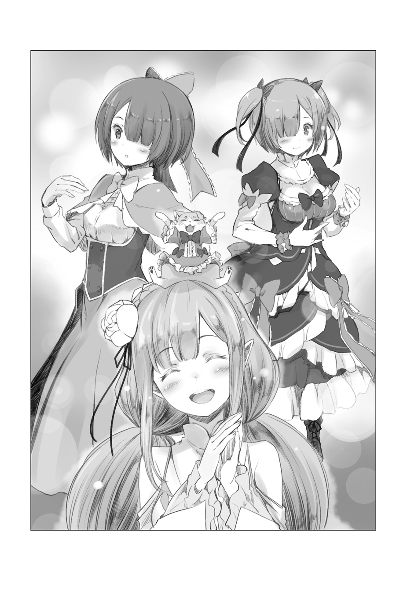

???: Ааааах….

Зевнув по причине утренней сонливости, девушка вытерла слезинки с уголков глаз тыльной стороной ладоней.

Она была обладательницей длинных серебряных волос и прекрасных аметистовых глаз. Её внешность была прелестной, словно внешность феи, но слегка помятая ночнушка придавала ей непристойного шарма.

Ночнушка слегка сползла, обнажив её стройные, светлые плечи… почти.

???: Так не пойдёт, Госпожа Эмилия. Ваши глаза покраснеют, если вы продолжите их так тереть.

Руки быстро протянулись из-за спины, не дав ночнушке соскользнуть, а её рукам — потереть глаза. На сей совет девушка, Эмилия, ответила сонным “ммм”, а затем… “Мм… да, ладно. …но я не думаю, что это было бы настолько плохо”.

Рем: Важно заботиться даже о мелочах. Ещё ваши волосы должны быть расчёсаны, даже если это займёт много времени. Рем начинает понимать страдания Господина Пака.

Эмилия: Хмф, ты такая злая…

Сидя на стуле, Эмилия с недовольным видом надула щеки. Позади Эмилии, водя расчёску по её серебряным волосам, стояла голубоволосая девушка — Рем.

Это было ранним утром, после пробуждения Эмилия находилась в гардеробной особняка, где Рем занималась уходом за её волосами.

-- Для Эмилии каждое утро начиналось с того, что кто-то заботится о её волосах.

Взваливать уход за волосами на плечи других… это было не потому, что Эмилия была ленивой, а потому, что окружающие не оставляли её одну. По правде говоря, можно было сказать, что окружающим казалось, что Эмилия была безразлична к своему внешнему виду из-за лени.

Рем: Если вы сами не хотите заботиться о себе, пожалуйста, позвольте Рем или Господину Паку делать это за вас.

Эмилия: …Ладно.

Рем упрекала её, нежно проведя щёткой по волосам, и Эмилия неохотно кивнула.

Рем была хороша во всех делах в особняке, у неё были первоклассные навыки не только в выполнении различных работ в поместье, но и в уходе за жильцами. Одно лишь прикосновение Рем к волосам Эмилии вызывало у той удивительное чувство покоя. Не успела она опомниться, как её вновь одолело искушение заснуть.

Рам: Госпожа Эмилия, раз уж вам удалось встать, не стоит снова ложиться. В конце концов, даже Рам хочет спать.

Эмилия: Мммф… Ах, простите. Ммм, вы правы, но я очень хочу спать.

Рам: Рам, конечно, вас понимает. Прикосновения рук Рем божественны.

Это говорила девушка, чья грудь вздымалась от гордости, её внешность была схожа с внешностью Рем как две капли воды — розовые волосы и светло-красные глаза были их единственной разницей — старшая сестра Рем, Рам.

В отличие от Рем, Рам в сторонке наблюдала за укладкой волос Эмилии, хотя это и не казалось особенно странным. Сёстры, Рам и Рем, всегда так распределяли свои обязанности.

Рем: Сестра, если ты не перестанешь так меня нахваливать, Рем покраснеет… Госпожа Эмилия, Рем закончила.

Щёки Рем слегка покраснели от комплимента Рам, она слегка похлопала Эмилию по плечу. Пока они разговаривали, серебряные волосы, которые Рем собрала, были заплетены в красивую косу.

Эмилия: О, спасибо. …Ммм, я уверена, Пак тоже обрадуется. Это очень удобно.

Рем: Подобное — не более чем работа, которую ждут от Рем. Но редко бывает, чтобы Господина Великого Духа не было здесь, пока Госпожа Эмилия делает прическу.

Великого Духа, о котором беспокоилась Рем, звали Паком, маленький кошачий дух, что заключил контракт с Эмилией. Будучи самопровозглашённым родителем Эмилии, маленький кот постоянно давал ей наставления и часто подталкивал к тому, чтобы она заботилась о своей внешности. В результате он всегда присутствовал утром, во время выбора причёски, и во время выбора одежды, но…

Эмилия: Кажется, вчера он слишком долго не спал. Он допоздна игрался с Субару, поэтому сегодня он спит. Иногда я просто не могу быть в нём уверена.

Рам: С Барусу, говорите? С его работой, которую он должен сделать сегодня, у него ещё хватает наглости засиживаться допоздна.

Эмилия слегка улыбалась, несмотря на эти слова, а Рам недовольно свела брови. Увидев, как Рем кивнула в знак согласия со словами сестры, улыбка Эмилии стала ещё глубже.

Рам: Значит, игра поздней ночью с Барусу — причина того, что Господин Пак всё ещё отдыхает. …Если он создаёт проблемы не только себе, но и всем вокруг, то это ещё больше ставит под сомнение его компетентность.

Рем: Но, Сестра. Благодаря Субару, Сестра и Рем могут выбрать утреннюю одежду для Госпожи Эмилии.

Рам: Это правда. По крайней мере, Барусу может считать это своей заслугой.

Эмилия: Вы считаете это заслугой Субару? Почему же?

Когда Эмилия повернула голову в сторону сестёр, Рем ответила “Видите ли…” на её замешательство и продолжила.

Рем: Выбор одежды для Госпожи Эмилии всегда был работой Господина Пака, в конце концов. Ни у Сестры, ни у Рем никогда не было возможности давать какие-либо советы в этой теме. Но сегодня всё будет иначе.

Рам: Что касается выбора одежды, Госпожа Эмилия не высказывает ничего по этому вопросу, верно? Другими словами, всё зависит от Рам и Рем. Честно говоря, это слегка волнительно.

Эмилия: Я… я вижу. Мне не совсем понятно…

Эмилия почувствовала себя немного растерянной, когда сёстры заволновались. Обычно выражения лиц сестёр не сильно менялись, но, когда они серьёзно обсуждали одежду Эмилии, она заметила на их лицах следы удовольствия.

Как заметила Рам, Эмилия не имела ни малейшего представления о том, что ей следует надеть. Если бы сёстры могли повеселиться, выбирая ей причёску и одежду, она сочла бы это прекрасным, однако…

Эмилия: Немного грустно чувствовать себя обделённой… о, я знаю!

Рам: Госпожа Эмилия?

Не имея возможности участвовать в обсуждении сестёр, Эмилия нарушила молчание, когда её глаза внезапно вспыхнули. Выражение лица Рам смягчилось, когда она заметила внезапную перемену в Эмилии, а полуэльфийка с гордостью посмотрела на Рам.

Рам и Рем переглянулись, поскольку поведение Эмилии свидетельствовало о том, что её посетило вдохновение.

Эмилия: У меня только что появилась очень хорошая идея. Слушайте, слушайте.

Рам: …Рам не уверена, что хочет это слышать, но что вы придумали?

Эмилия: Ну, я очень рада, что вы так стараетесь для того, чтобы выбрать мне наряд, но разве вы двое не носите всегда один и тот же наряд горничной? Мне кажется, что это немного грустно.

Не заметив нерешительности Рам, Эмилия уверенно подняла палец вверх и продолжила.

Эмилия: Поскольку мы уже здесь, я подумала, что мне хотелось бы посмотреть, что вы носите, кроме нарядов горничной.

Рем: Субару — это одно, но, чтобы Госпожа Эмилия предлагала это…

Эмилия: О, Субару говорил вам то же самое? Думаю, теперь я немного лучше понимаю, о чём он думал. Ведь это так весело — видеть всю вашу милую одежду.

Рам: Хотя в случае с Барусу, его скрытый мотив был очевиден, так что его идея была отклонена.

Ни одна из сестёр не смогла отказать Эмилии, после того как она предложила это с такой восторженной улыбкой.

Глядя на стоящих бок о бок Рам и Рем, Эмилия в восторге сжала руки и выглядела глубоко впечатлённой. Это было неудивительно, ведь они были одеты совсем не так, как она видела их раньше.

Эмилия была знакома с сёстрами вот уже три или четыре месяца, но никогда не видела их в чём-то другом, кроме нарядов горничных. Она не знала, как выразить им свою благодарность.

Эмилия: Спасибо, спасибо!

Рам: Госпожа Эмилия, такой ответ говорит о плохом влиянии Барусу на вас.

Эмилия: Ммм, я пыталась немного подражать ему. Но я действительно так счастлива!

Слегка вздохнув, когда Эмилия смотрела на это, сцепив руки, Рам повернулась к ней. Подол её юбки приподнялся, пока она кружилась, она сверкнула милой девичьей красотой.

Нынешняя одежда Рам, по сравнению с нарядом служанки, который оставлял обнажёнными большую часть плеч и спины, была гораздо менее откровенной. Однако женственный наряд, основу которого составлял мягкий белый цвет, очаровывал совершенно иначе, по сравнению с её обычной чёрной одеждой служанки.

Снятый головной убор горничной, и большая лента, которая только усиливала эффект.

“Честно говоря, это довольно неловко. Этот образ просто не подходит Рам” — сказала Рам, позируя и проводя рукой по волосам, создавая совершенно очаровательный образ. Эмилия смотрела, восхищённая; она начинала понимать, как весело выбирать наряды для других.

Рем: Как и ожидалось от Сестры. Что бы она ни надела, её красота будет сиять ещё ярче.

Рам: Спасибо. Но ты так же хорошо выглядишь, Рем. Рам очень гордится тем, какая милая у неё младшая сестра.

Когда Рем похвалила внешность сестры, Рам слабо улыбнулась и коснулась её щеки.

В отличие от наряда Рам, который был сшит с расчётом на мягкую пышность, одежда Рем изобиловала оборками, создавая милую атмосферу, не похожую на ту, что подошла бы Беатрис, другой жительнице особняка. Левый и правый хвостики дополняли эффект. Сочетание нежных глаз Рем и её наряда сияло ярким блеском.

Эмилия: Ммм, всё так, как я и предполагала. Это ужасное расточительство, что вы обе постоянно носите только наряды горничных. Мы тут кое-что обнаружили, вам не кажется?

Рам: Наша форма соответствует воле Господина Розвааля, поэтому Рам остаётся только согласиться с его мнением. Однако, благодаря Госпоже Эмилии, мы смогли увидеть Рем такой очаровательной… По крайней мере, Рам хотела бы так сказать.

Эмилия: Ты действительно не всё нам рассказываешь, Рам. Ты согласна, Рем?

Рем: Рем рада, что может видеть Сестру в своей форме каждый день. Работа, прогулки, покупки, сражения, служба… это — всё, что нам нужно.

Эмилия: Но всё это наряды для горничных…

Рем пересчитала это на пальцах, но все они были более или менее одинаковыми нарядами для горничных.

Услышав такой ответ, Эмилия забеспокоилась, что, возможно, Рем на самом деле не так уж и заинтересована, но Рем показала редкую улыбку и продолжила “Шучу, Госпожа Эмилия. Рем действительно понравилось смотреть на милую одежду Сестры”.

Эмилия: …Правда? Приятно слышать. Но ты так же выглядишь очень мило, Рем.

Рем: Большое спасибо. Однако нам, наверное, пора возвращаться к работе.

Пока Рем отвечала, она взглянула на дверь гардеробной. Находящийся там магический кристалл времени стал тёмно-зелёным, давая понять, что пора начинать утро.

Рам и Рем должны были перейти к работе в особняке, а Эмилии нужно было провести свой день с низшими духами.

Эмилия: Очень жаль. Но я полагаю, что мы не сможем продолжать эту игру вечно.

Рам: Да, это верно. Кроме того, если мы сейчас же не переоденемся, не исключено, что Барусу может появиться и неправильно понять, что происходит. Рам очень не хотела бы, чтобы Барусу увидел её в таком состоянии.

Эмилия: Ахахах, очень жаль его. О, но разве ты не хочешь показать Розваалю этот наряд?

Рам: ……Рам может представить, что Розвааль скажет по этому поводу.

Она засомневалась всего на мгновение, но после покачала головой, словно очищая её от сожалений. Рем, похоже, согласилась с сестрой и начала распускать свои волосы.

Это было прискорбно. Но ничего нельзя было поделать. Это был тот самый момент.

???: Прости, прости, Лия. Я проспал. Смогла ли ты нормально проснуться?

Эмилия: Ах, Пак.

Зелёный кристалл, висевший на груди Эмилии, ярко засветился; в следующее мгновение свет явил миру маленького духа. Маленький кот потёр глаза и оглядел гардероб.

Пак: О, что это? Не только Лия, но и вы сегодня одеты очень мило.

Удивлённо моргая круглыми глазами, Пак прошептал эти слова без толики злобы. Услышав эти слова, сёстры, которые всё ещё переодевались, посмотрели друг на друга, а затем обе перевели взгляд на Эмилию.

Рам: Как-то не очень приятно, быть увиденной Господином Паком…

Рем: Это довольно странно. Рем чувствует то же самое, что и Сестра. Как вы думаете, как мы должны поступить?

Эмилия: Хм, я даже не знаю, что сказать… А, я знаю!

Поскольку сёстры смотрели на неё кисло и жалобно, Эмилия крепко задумалась, а затем хлопнула в ладоши. Раскрыв одну руку, она усадила парящего Пака на ладонь.

Пак: В чём дело, Лия? Ты выглядишь немного… хм, ты похожа на дитя, которое балуется.

Эмилия: Видишь ли, Пак. Я немного лучше понимаю, как чувствует себя Пак. Поэтому я подумала, что было бы неплохо, если бы Пак тоже лучше понимал, как чувствую себя я.

Пак: Это важно — понимать друг друга. Но у меня плохое предчувствие… Эй, стой, подожди!

Видя, что улыбка Эмилии становится всё шире, на лице Пака проявилось редкое беспокойство. Но Эмилия не дала ему времени. Рам и Рем тоже не стали ждать.

--- В тот день атмосфера за обеденным столом в поместье Розвааля немного отличалась от той, что была обычно.

Каждое утро все обитатели поместья собирались вместе на завтрак. Среди них были и хозяин поместья, и Беатрис, и мальчик-слуга тоже не был исключением. Однако…

Беатрис: Братец, ты прекрасно выглядишь. Даже если это не твой обычный вид, он заставляет сердце Бетти таять…

Пак: Ха-ха, спасибо, Бетти. Но, если ты не будешь привлекать слишком много внимания к тому, как я выгляжу, это поможет сохранить то немногое чувство гордости, которое у меня осталось.

Из всех собравшихся Беатрис была ещё более взволнована, чем обычно, когда прижимала Пака к своей щеке. На руках у Беатрис Пак выглядел совсем не так, как обычно.

С лентами по всему телу, с прекрасным платьем из платка и кружев, маленький кот, который обычно окутан только в серый мех, теперь был прекрасно украшен.

Субару, ничего не зная об этой ситуации, смотрел на Пака широко раскрытыми глазами. Повернувшись к Эмилии, которая сидела рядом с ним, он прикрыл рот, словно пытаясь говорить сдержанно.

Субару: Эй, что там происходит? Я толерантно отношусь к идее наряжать домашних животных, но сделала ли это ты, Эмилия-тан?

Эмилия: Хм, ну…

Криво улыбнувшись по причине вопроса Субару, Эмилия взглянула на того, кто был во главе стола. Там, наблюдая за тем, как Беатрис и Пак обнимаются, был Розвааль, а две служанки тихо выстроились позади него. Обе они заметили быстрый взгляд Эмилии и подняли руки.

Эти руки показывали знак, который Субару назвал «Лиса»…

Субару: Эмилия-тан?

Когда Субару растерянно повторил свой вопрос, Эмилия высунула кончик языка. Ответ был секретом, оставшимся с утра в гардеробе, между сёстрами и ею самой, так что…

Эмилия: Субару, я не могу тебе рассказать.

Эмилия ответила лишь милым подмигиванием.

《Конец》
