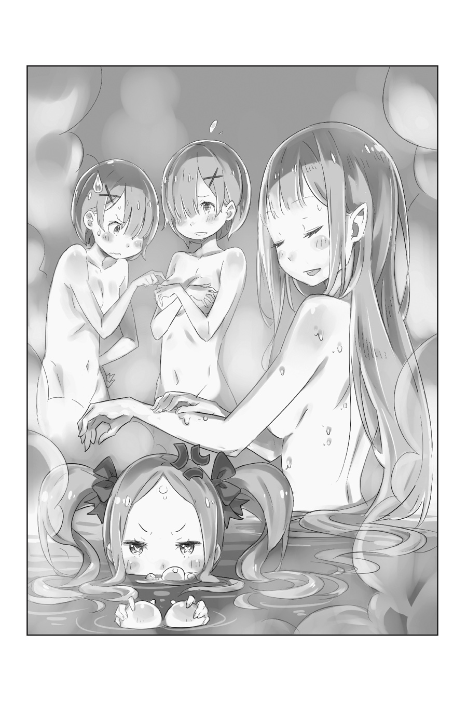

???: …Мм..

Медленно, начиная с кончиков пальцев ног, длинные, белые ноги скользили в горячую, тускло-мутную воду. Её бедра на мгновение задрожали от жара в ванной, она тихонько мурлыкнула от тепла и позволила своим конечностям погрузиться в воду.

???: Аххх…

Собрав свои длинные серебряные волосы в руках, она опустила тело в горячую воду и глубоко вздохнула.

Она была прекрасна. Лунный свет отражался в её серебряных волосах, а голубовато-фиолетовые глаза были словно драгоценные камни. Её белая кожа, чистая, словно свежевыпавший снег, слегка покраснела. Увидевший такое зрелище, восхитился бы таким великолепием в независимости от того был бы он мужчиной или женщиной.

Её звали Эмилия, и она была прекрасной девой, чья прекрасная внешность была даром её эльфийского рода.

Эмилия: Купаться в ванне, достаточно большой, чтобы поместилось всё тело, всегда приятно…

Облокотившись на краю ванны, Эмилия блаженно шептала, в то время как её щеки покраснели.

В такой большой ванной, как эта, легко поместились длинные, вытянутые ноги Эмилии. Как и следовало ожидать, в особняке маркграфа Розвааля, ванная была такой же большой, как и общественная баня. Правда, Эмилии было не совсем ясно его положение в обществе, но тот факт, что он позволил ей остаться в своём особняке, изо дня в день болезненно напоминал ей о том, что он — важная персона.

Он был её защитником, он был её сторонником — она должна была соответствовать ожиданиям Розвааля. Осознание этого было одной из причин, по которой она каждый день вела непривычный образ жизни, стремясь добиться успехов в учёбе.

Однако, даже вечно осторожная Эмилия, в своей одежде, купающаяся в одиночестве, была простой девушкой — нет, красивой девушкой.

Эмилия: Хм… Кажется, я немного прибавила в весе.

Её голос задрожал, когда она подняла руку из ванной и сжала между пальцами белое плечо. Возможно, это было результатом регулярного питания в рамках её жизни в особняке; возможно, она переедает. По сравнению с прежней жизнью, жизнь в особняке не давала ей столько возможностей двигаться. Учитывая это, набор веса был вполне естественным.

Эмилия: Такими темпами Пак снова начнёт жаловаться…

По правде говоря, Эмилию не слишком беспокоило её здоровье. Другое дело Пак, кошачий дух, связанный с Эмилией контрактом. Он беспокоился об этом больше, чем сама Эмилия, и постоянно напоминал ей о необходимости заботы о себе.

Пак, который заменил ей родителей и проводил с ней время как с родной дочкой, заботился о ней слишком сильно, и часто указывал ей, как поступать в ситуациях, что происходили в её жизни. Она, конечно, была ему благодарна, но иногда эти маленькие лекции её утомляли.

Эмилия: После ванны сделать растяжку и причесаться, сделать маникюр и…

Пересчитав по пальцам всё то, что она пообещала Паку выполнить после принятия ванны, Эмилия почувствовала себя немного меланхолично. Возможно, то, что её ежедневная рутина стала казаться ей утомительной, означало то, что она выбивается из колеи.

Инцидент в столице — кража её эмблемы, и день, потраченный с целью её возвращения. Это произошло всего несколько дней назад; возможно, она всё ещё была истощена физически и умственно.

Эмилия: Мне нельзя быть такой. Сейчас не время для размышлений.

Эмилия попыталась отбросить мысли о прошлом, приложив обе ладони к щекам.

Путь, который она выбрала для себя, был не настолько прост, чтобы позволить лёгкой усталости замедлить её. Она отставала изначально. Чтобы наверстать упущенное, ей нужно было пройти через настоящую битву.

И вот, пока Эмилия восстанавливала свою мотивацию…

???: О боже, Госпожа Эмилия?

Дверь, ведущая в гардеробную, распахнулась, и кто-то вошёл в ванную. Эмилия повернулась, чтобы посмотреть на автора слов, и увидела приближающуюся розововолосую девушку, чьё обнаженное тело было скрыто полотенцем.

Она была более миниатюрной, но её безупречная кожа и очаровательное лицо подходили Эмилии. Отсыревшее от пара полотенце прилипло к ней, и стало видно, что её тело хорошо сложено, несмотря на её нежность. Глядя на Эмилию, она слегка наклонила голову.

???: Это большая редкость, увидеть вас принимающей ванну в такое время. Может быть, будет лучше, если мы придём позже?

Эмилия: Нет, всё в порядке. Я бы не сказала ничего такого грубого.

???: Ясно. Большое спасибо. Рем, заходи.

Пока Эмилия всё ещё отмокала в ванной, ей ответила девушка — Рам, слегка склонив голову, не меняя выражения лица. Затем Рам повернулась в сторону раздевалки и позвала другую девушку — свою младшую сестру.

Рем: Сестра, всё в порядке, поскольку Госпожа Эмилия была здесь до нас, но что бы ты сделала, если бы тут был Субару? Такого бы не произошло.

С этими словами появилась почти такая же похожая, синеволосая сестра Рам и последовала за ней в купальню.

По сравнению с Рам, её глаза казались немного мягче, но в остальном они были очень схожи. Черты её лица и тонкие формы соответствовали сестре, но грудь Рем была, пожалуй, больше.

Тело Рем так же было прикрыто полотенцем, Рам повернув голову к ней ответила…

Рам: Если так рассуждать, то это правда. Если бы ванну занимала не Госпожа Эмилия, а мальчик, что остался в особняке…

Рем: Если бы Субару смотрел на Сестру своими грязными глазами, Рем бы просто не смогла такое вынести.

Рам: Если бы такое произошло, Рам бы просто выколола ему глаза. Его последний взгляд стал бы его прощальным подарком от Рам.

Эмилия: Не нужно говорить такие страшные вещи. Субару — хороший мальчик.

Рам: Возможно, ваша оценка этого мальчика немного ошибочна.

Откровенно ответив на замечания младшей сестры и Эмилии, на тот момент уже вспотевшая Рам, мягко опустила одну ногу в ванну. Когда она расположилась по диагонали перед Эмилией, обычно бесстрастное лицо Рам слегка расслабилось.

Заметив это, Эмилия слабо улыбнулась.

Рам: …В чём дело, Госпожа Эмилия? Вы выглядите весьма довольной.

Эмилия: Ммм, ну разве что самую малость. Похоже, даже Рам смогла немного расслабиться в ванной.

Рам: Рам не кукла, в конце концов. Хотя не буду отрицать, что Рам красива, словно кукла.

Сказав это жестоким голосом, Рам быстро изменила выражение лица. Эмилия пожалела о том, что заставила её смутиться, но вот в ванну напротив Рам вошла Рем.

Рем: То, что сестра всегда решительна, конечно, замечательно, но Рем думает, что Рам теряющая бдительность в ванной, выглядит не менее замечательно.

Эмилия: О, ты хочешь сказать, что так происходит всегда?

Рем: Да, это маленький секрет сестры.

Рем говорила с редким для неё юмором в голосе. В некотором смысле, даже в большей степени, чем Рам, Рем была склонна возводить стены между собой и другими. Эмилия, имея такое впечатление о ней, была неожиданно рада такому обращению.

Рам: …Рем. Давай без лишних слов об этом.

Рем: Прости, сестра. Рем просто не смогла не говорить о том, какой замечательной является сестра.

Рам: Ну, думаю, ничего не поделаешь. Рам такая сестра, которой любой бы похвастался, не задумываясь.

Рам всегда была добра по отношению к Рем, но сегодня она казалась особенно доброй. В сочетании с отношением Рем Эмилия почувствовала, что это прекрасная перемена.

Эмилия: Думаете, когда вы голые в ванной, можно позволить себе забыть о неважных вещах и говорить свободно…?

Рам: Госпожа Эмилия, в чём дело?

Эмилия: О, о боже… Я думаю, может быть… Я только что поняла что-то удивительное… что-то вроде настоящей правды о мире…

Рем: Сестра, сестра, это ужасно. Кажется, у Госпожи Эмилии кружится голова.

Рам: Рем, Рем, это ужасно. Госпожа Эмилия кажется полусонной.

Эмилия: Даже если я в ванной!?

Когда к ней отнеслись так, будто у неё кружится голова и она уже наполовину спит, Эмилия от удивления погрузилась под воду. Она игриво пускала пузыри, затем выдохнув поднялась из-под воды.

Эмилия: Ммм, вы всегда такие злые…

Рем: Госпожа Эмилия, мне кажется, что Субару отравил ваше воображение.

Эмилия: П… правда? Этого не может быть… Хм, я не думаю, что такое могло бы произойти…

После того, как Рем указала на это, Эмилия стала выглядеть обеспокоенной. После беспорядков в столице, что произошли несколько дней назад, этот мальчик был принят в особняке в роли слуги.

Его высказывания и действия часто казались Эмилии непонятными, и он, казалось, удивлял её каждый раз всё больше и больше, когда они встречались. Конечно, не было исключено, что она попала под влияние этого странного мальчика, но…

Эмилия: Вы говорите такое, но вы обе проводите с ним гораздо больше времени, верно? Если пребывание в ванне и нагота не меняют ситуацию, то, может быть, вы меняетесь из-за Субару?

Рем: Это…

Рам: Абсолютно невозможно.

Когда Эмилия попыталась перевести стрелки, близнецы ответили в унисон. Это выглядело как резкий ответ, но он не был сделан вследствие сильного чувства неприятия. Даже с точки зрения Эмилии, так или иначе, отношения близняшек с Субару были неплохими. Они почти наверняка скоро привыкнут друг к другу.

Эмилия: Хотя я не уверена, что было бы правильно позволять ему оставаться здесь слишком долго и погрязнуть в наших проблемах…

[……]

Услышав печальный шёпот Эмилии, близнецы лишь сузили глаза, ничего не сказав.

Будущее, ожидавшее Эмилию, было битвой за судьбу страны, битвой за трон — Королевские Выборы. Кража её эмблемы в столице была попыткой помешать кандидатуре Эмилии. Любой человек в окружении Эмилии, несомненно, мог бы снова попасть в подобную смертельно опасную ситуацию. Она сомневалась в том, что можно позволить себе тащить за собой такого легкомысленного, добродушного мальчишку.

Рам: Возможно, это не то, о чём вам стоит беспокоиться, Госпожа Эмилия.

Эмилия: Рам?

Рам: Независимо от того, что думает об этом Барусу, если он не окажется полезным в качестве слуги, его попросят уйти в ближайшее время. Это решение было оставлено на наше усмотрение, так что, пожалуйста, не беспокойтесь об этом.

Эмилия: …Спасибо.

Эмилия выразила благодарность Рам за то, что она прервала её мрачные мысли, сказав это. Её намеренно резкие слова были предназначены для защиты сердца Эмилии. Если понадобится, она сыграет роль злодея, чтобы пощадить Эмилию.

Эмилия: Похоже, Рам и Рем действительно добры, когда голые.

Рам: Пожалуйста, перестань добавлять «когда голые».

Рем: Да, Госпожа Эмилия. Сестра всегда добра, даже когда не является голой.

Когда Эмилия и Рем ответили немного отстранённо, Рам глубоко вздохнула. Затем, когда они втроём собрались в ванной, появилась тень действительно редкого четвёртого участника.

???: …о, ради всего святого. Одна проблема за другой.

Открыв дверь гардеробной, в купальне появилась девочка в элегантном платье. Её волосы кремового цвета были собраны в косы, а её милая внешность была почти как у куклы. Её покрасневшие, пухлые щёки выглядели словно фрукты, и она смотрела на троих в ванной круглыми, выпученными глазами.

Рам: В чём дело, Госпожа Беатрис? Это из-за Барусу?

Беатрис: Совершенно верно, и это приводит меня в ярость, я полагаю. Он совершенно отвратительный человек! 'Пересечение Дверей' на него абсолютно не действует, так что это единственное место, где я могу спастись, я полагаю.

Рам: В конце — концов, даже Барусу не посмеет вломиться в купальню.

Беатрис: Я тоже так думаю. Полагаю, мне просто-напросто придётся провести здесь некоторое время.

С надменностью, которая, казалось, не соответствовала её внешности, Беатрис сложила свои короткие руки и встала в углу купальни. Однако Эмилия поднялась из ванны и подошла к Беатрис.

Посмотрев на обнажённую Эмилию, Беатрис сделала раздражённое лицо.

Беатрис: …Что тебе нужно? Бетти здесь только для того, чтобы провести некоторое время и только для этого, я полагаю.

Эмилия: Не говори так. Ты уже пришла в купальню, Рам и Рем тоже здесь, разве не хорошо было бы если бы Беатрис тоже приняла ванну?

Беатрис: Это было бы совсем нехорошо! Я не могу понять, почему ты так говоришь. Это, абсолютно, не смешно.

Беатрис попыталась отогнать Эмилию взмахом руки, как будто отгоняла насекомое.

Столкнувшись с таким упрямством, Эмилия обычно соблюдала дистанцию, но сегодня полуэльфийка была немного другой. Она оглянулась и увидела, как две головы кивнули ей.

Беатрис: …Подождите, я полагаю. Что означает этот сигнал?

Эмилия: О, ничего. …Ах! Беатрис, Пак тоже моется!

Беатрис: О!? Где, я полагаю!?

Попавшись на старый трюк, Беатрис посмотрела в направление, в которое указала Эмилия.

В следующее мгновение Эмилия подхватила маленькое тело Беатрис на руки и швырнула его в ванну. С криком «Няа!» Беатрис полетела в воду.

Беатрис: О чём ты думала… Неважно, чего-то подобного всё равно недостаточно, в самом деле!

Дуга, по которой летела Беатрис, остановилась в воздухе. Используя магию, она остановила своё брошенное тело в воздухе. Она неспешно начала двигаться к краю ванны, но…

Рам: Ну же, Госпожа Беатрис, не будьте такой.

Рем: Останьтесь с нами ненадолго. Рем всегда хотелось попробовать помыть волосы Госпожи Беатрис.

Беатрис: Вы… вы не посмеете!

Рам и Рем схватили каждый по рукаву платья Беатрис, когда она пыталась улететь. Раздался всплеск, а затем Беатрис, насквозь промокшая, выплеснула воду изо рта и уставилась на троицу.

Беатрис: Вы все трое попали под влияние этого странного мальчишки!

Слушая слова Беатрис, которые были чем-то средним между криком и рёвом, Эмилия улыбнулась. Улыбаясь, она подумала, что, возможно, это было правдой, и продолжила наслаждаться временем в купальне.

В тот день в ванной Особняка Розвааля девичьи голоса звучали эхом ещё некоторое время.

《Конец》
