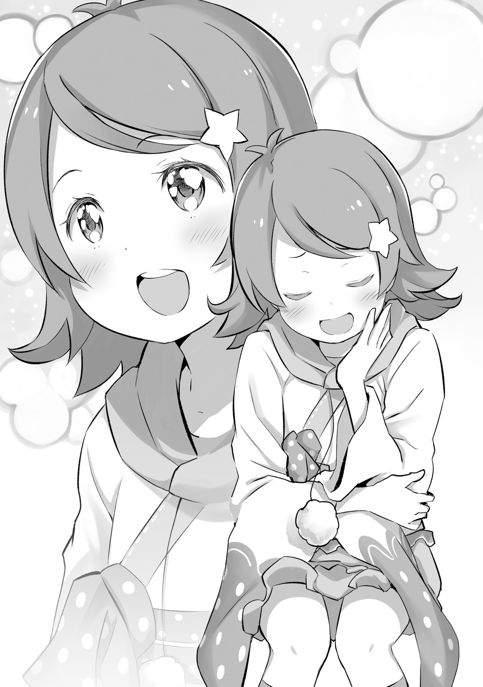
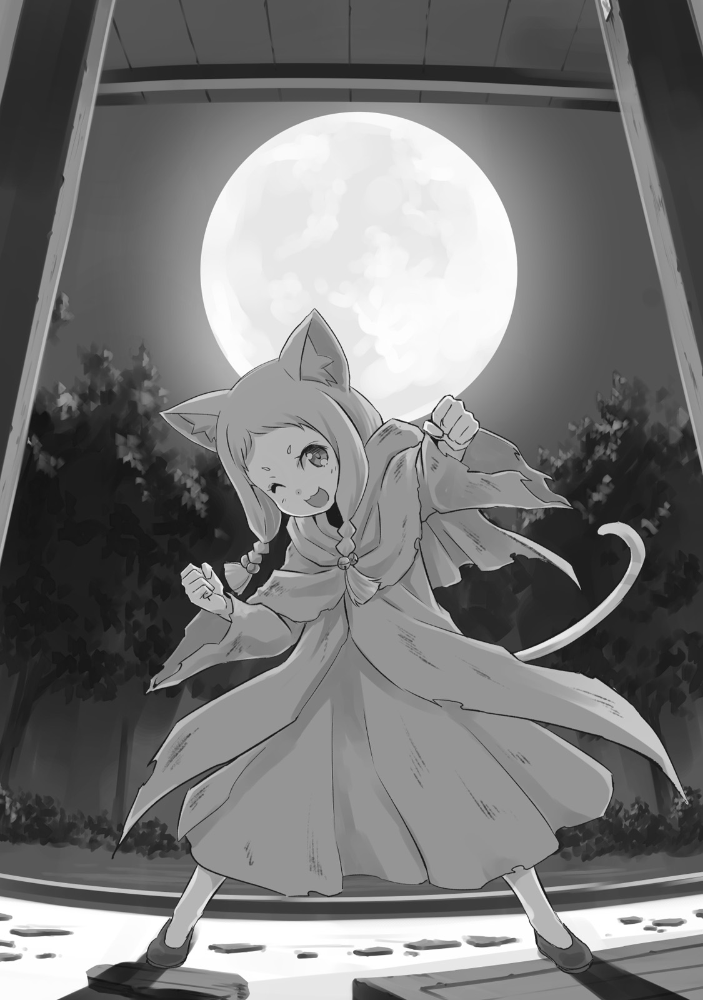
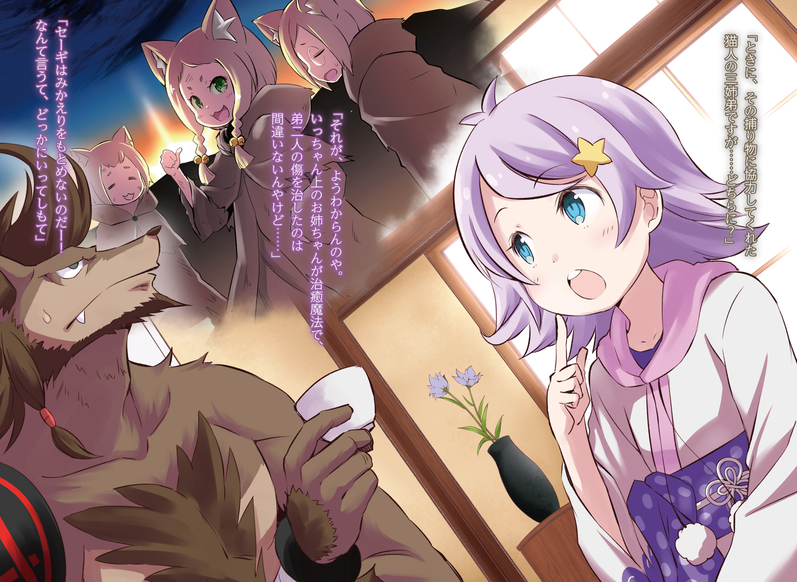

«Хосин из Пустошей» — имя легенды, известной всему миру.

Начало его истории восходит к событиям четырехсотлетней давности, когда западная часть мира была лишь руинами, а множество малых стран боролись за господство.

Маленькая страна, не имевшая сколь-либо выгодного расположения и стоявшая на грани поглощения другими странами, — самый первый клочок земли, на котором Хосин установил свой флаг, решив начать действовать, была несчастной землёй «Карараги».

Легенды гласят, что Хосин никогда не был человеком, наделенным талантом к боевым искусствам.

Он был необычайно мудрым, прекрасно умел вести переговоры и знал, как направлять людские сердца.

Хосин сблизился с правителем Карараги, управляя страной из тени. В мгновение ока он наладил дружеские отношения с другими странами, расширяя свой круг влияния, иногда используя хитрость, иногда — дружбу, а иногда — своё деловое чутьё.

Когда соседние страны осознали, что Карараги действует за кулисами, стремясь к господству над западными землями, было уже слишком поздно.

Большинство малых, незначительных стран уже находилось под властью Карараги, а благодаря непостижимым манёврам Хосина, ставшего лидером этого великого союза, никто уже не мог их остановить.

Так закончилась эпоха войн и соперничества между влиятельными фигурами, и под именем «Хосин из Пустошей» была основана Федерация Городов-Государств Карараги.

— Ха-а… Сколько бы раз я ни слушала, легенда о Хосине всегда по-настоящему завораживает. — произнёс детский голос.

Это была девочка лет одиннадцати-двенадцати, с милыми, очаровательными чертами лица, ростом чуть ниже среднего для своего возраста, но при этом она была куда привлекательнее своих сверстников.

Мягкие фиолетовые волосы, светло-бирюзовые глаза, сияющие любопытством, и бледная, чистая кожа. С такой внешностью её легко можно было принять за благородную девушку из хорошего места.

Однако эта девочка — Анастасия — не была из такой знатной семьи.

— Хм? Чего? Невежливо так пялиться на чужое лицо.

Внезапно Анастасия с сомнением посмотрела на лицо перед собой. В её взгляде не было черты очарования маленькой девочки, но проглядывали несвойственные возрасту хитрость и настороженность.

Учитывая происхождение, неудивительно, что она была сообразительной. Получеловек широко раскрыл пасть и, оскалив клыки, рассмеялся:

— Да ничего. Просто подумал, что малявка, которую я подобрал в том переулке, стала довольно влиятельной особой. Молодец, молодец.

— Опять старое вспоминаешь? Дядя, тебе часто говорят, что ты зануда?

— Раз ты так говоришь, значит, ты куда большая зануда. Снова и снова просишь меня рассказать одну и ту же историю, Ана! Готовься, я тебе ещё лет эдак несколько буду припоминать всякое прошлое.

Анастасия угрюмо надула губки, но большая мозолистая ладонь взъерошила её волосы. Она не оттолкнула руку, но её лицо и глаза всё равно выражали недовольство, на что получеловек невольно усмехнулся.

Он ничего не имел против сопернического и неукротимого духа. Если бы она не была такой, то все его поступки не имели смысла.

— Довольно. Старики вечно говорят об одном и том же, так что ради тебя я потерплю.

— Ого, как сильно сказано. Где ты такому научилась?

— Слышала от хозяйки таверны и от посетителей. Жалею только, что не смогла допросить мертвецки пьяного старика и выведать его слабости, прежде чем уволилась оттуда.

Обменявшись шутками и высовывая язык, Анастасия вывернулась из-под руки, трепавшей её по голове, и направилась к дверям. На ходу она быстро и аккуратно поправила причёску и кимоно.

— Перерыв окончен. Дядя, Тюден-сан тебя уволит, если ты и дальше будешь прогуливать работу.

— Страшно-то как. С твоими заработками прокормить кого-то огромного как я, будет непросто.

— А с чего это я должна тебя обеспечивать!?

— Разве не очевидно? Ты ведь собираешься выкупить меня и сделать своим, так?

Улыбнувшись и показав острые клыки, он коснулся своей шеи широкими пальцами. Ошейник — напоминание о днях его рабства — обвивал шею, сделанный из холодного, грубого металла. То, что должно было служить орудием повиновения, теперь стало свидетельством их клятвы.

Анастасия затаила дыхание от этого жеста, напомнившего ей об обещании, и тут же кивнула:

— …Да, это верно, но именно поэтому будет плохо, если ты загнёшься где-нибудь на обочине, прежде чем я накоплю достаточно денег. Так что береги себя как следует!

Быстро ответив, Анастасия снова показала язык и выскочила из комнаты. Слушая топот её удалявшихся шагов, он улыбнулся и посмотрел в окно.

За окном было пасмурное небо, и его отражение в слегка запотевшем стекле.

Огромное телосложение, которое не могло полностью поместиться в окне комнаты, и облик зверя, ничуть не похожий на Анастасию. Его кожа была покрыта тёмно-коричневым мехом, демонстрируя величие получеловека, не похожего на обычных людей.

Рикардо Велкин — гигант, даже среди кобольдов, а также наёмный телохранитель, связанный с Торговой Компанией Тюден. Кроме того, он выступал в роли своего рода сторонника и опекуна Анастасии.

Однако часть про «опекуна» Анастасия Хосин никогда бы не признала открыто.

Штаб-квартира Торговой Компании Тюден располагалась во Втором Городе Городов-Государств Карараги, Банане.

В Карараги было десять крупных городов, пронумерованных от одного до десяти. Каждый город функционировал подобно маленькой стране: им управлял мэр, и действовали свои городские законы, что позволяло им существовать как своего рода федерации.

В городе Банане Торговую Компанию Тюден можно было считать организацией среднего уровня. Имея в качестве материнской компании одно из самых выдающихся предприятий Карараги — Торговую Компанию Регрет, — она находилась под её руководством как дочернее подразделение.

Компания не ограничивала ассортимент продаваемых товаров и особенно успешно торговала импортными вещами, поэтому те, кто часто бывал в Банане, обычно посещали торговую Компанию Тюден.

По этой причине, пока ворота города были открыты, и торговцы одновременно въезжали внутрь, перед компанией всегда выстраивалась очередь. Из-за этого напряжённый график у персонала был обычным делом.

— Анастасия! У меня мелочь заканчивается! Быстрее неси медный и серебряный ящик! — приказал один из сотрудников.

— Да! — ответила девочка.

— И не только их! Ещё…

— Мешок из грубой ткани, верно? Поняла!

Осыпаемая громкими приказами, Анастасия тащила деревянные ящики своими тонкими ручками. Они были набиты монетами, предназначенными исключительно для расчётов. Медный ящик содержал медные монеты, а серебряный, соответственно, был полон серебряных. Оба были довольно громоздкими для маленькой девочки, но она никак не могла просто бросить всё на пол.

Анастасия была не сотрудником, занимающимся торговлей, — нет. Она работала помощницей, бегающей повсюду, чтобы подсобить персоналу.

Как ей и велели, Анастасия, используя свои маленькие хитрости, бросала тяжёлые ящики с деньгами к ногам сотрудника.

Торговая площадка Компании Тюден была местом, куда торговцы из других городов заезжали прямо на своих повозках, запряжённых крупными волкоподобными животными — лигерами, — и могли совершать сделки прямо на месте.

Здесь было выстроено множество длинных столов, за которыми персонал и торговцы вели переговоры, обмениваясь товарами, деньгами и тому подобным.

Каждый сотрудник отвечал за свои категории товаров. Сегодня работник, которому помогала Анастасия, был назначен ответственным за одежду, аксессуары и текстиль. Денежные потоки, как входящие, так и исходящие, были огромны, а оценка товаров, которую им приходилось проводить, также вызывала головокружение.

— Следующий! Разделяй толпящихся покупателей! Не трать больше времени, чем нужно! — приказал работник.

— Из изречений Хосина! «Время и деньги равноценны!» — в ответ произнесла девочка.

У неё даже не было времени увидеть, как сотрудник кивнул в ответ.

Анастасия нырнула под длинный стол, обошла очередь сзади и принялась её организовывать, одновременно сверяя товары на грузовых платформах повозок. Очередей было несколько, и другими занимались такие же помощники как она. Однако все они работали медленнее неё.

Анастасия выполняла вдвое больше работы, чем помощники вдвое старше её, но не гордилась этим. Даже если окружающие завидовали ей, она не обращала на них внимания, так что это было вполне естественно.

Разобравшись со своей очередью, Анастасия поспешно осмотрелась по сторонам, раздумывая, не взяться ли ей за работу в других рядах…

— …! Эй, ты! Что делаешь?!

Посреди очереди, которой занимался другой помощник, мужчина подпрыгнул от удивления, услышав гневный крик Анастасии. Это был человек тощего телосложения, которого она не узнала; он собирался стащить груз, делая вид, что берёт каталог.

Когда мужчина понял, что его попытка воровства провалилась, он тут же попытался сбежать. Оттолкнув помощника, который пытался его остановить, он рванул к выходу с торговой площадки.

— Не дам уйти!

— С дороги, мелюзга!

Однако Анастасия, раскинув руки, преградила ему путь быстрее, чем он успел убежать. Мужчина плюнул на сопротивление, помощницы, сжал руку в кулак и занёс его над головой. Прямо перед тем, как он собирался её ударить:

— Ты слишком много себе позволяешь, не так ли! — произнёс мужской голос.

Мускулистая рука взметнулась, и от удара бедолага подлетел в небо. Через мгновение он рухнул обратно на землю и, обездвиженный распластался на торговой площадке…

Получеловек, который отправил вора в полёт, был, — Рикардо Велкин.

Услышав удивленный крик мужчины, Анастасия робко открыла глаза и резко изменилась в лице.

— Дядя!

— Молодец, что заметила вора, Ана. Отлично сработано, но безрассудство до добра не доводит. Представь, если бы тебя ранили из-за такого. Это была бы глупая и большая потеря для тебя. Ведь больше всего ты ненавидишь то, что не стоит своих усилий, так?

Сказав это подбежавшей к нему Анастасии, Рикардо громко рассмеялся. Затем он поднял вора за шкирку и потащил прочь.

— Сюда, вот так. Ну и хватило же у тебя духу выкинуть такое там, где я стою на страже. Готовься попрощаться с одной своей рукой.

— …Эта малявка, сделала ненужную вещь и помешала мне… — прокашлил вор.

Не обращая внимания на угрозу Рикардо, мужчина свирепо посмотрел на Анастасию. Он был готов наброситься на неё в любой момент. Внезапно, Она медленно подошла к нему, и влепила сильную пощёчину.

Звонкий шлепок разнёсся по торговой площадке, ошеломив и мужчину, и окружающих.

— Унижать себя глупыми поступками, и затаить обиду за то, что тебя на этом поймали, — это отвратительно. Где твоё достоинство теперь, после того как маленькая девочка влепила тебе пощёчину? Ты жалок!

Пока Рикардо Велкин с довольной улыбкой наблюдал за Анастасией, вор подавился словами, сумев лишь выдавить «Гх» в ответ на обжигающую критику своих действий со стороны девочки. — А затем торговая площадка взорвалась одобрительными возгласами.

— Хорошо сказано! — сказал один из торговцев.

— Приятно было это услышать! — согласился второй.

— Так вору и надо! — поддержал третий.

— Спасибо, спасибо. — поблагодарила девочка.

Улыбаясь и стараясь казаться приветливой в ответ на одобрительные возгласы толпы, Анастасия снова стала обычной девочкой своего возраста, какой и была. Смена её настроения оживила обстановку ещё больше, а Рикардо тем временем вывел вора наружу.

— По идее, я должен бы оторвать тебе одну руку и вышвырнуть из города, но…

Дойдя до задворков торговой площадки, Рикардо небрежно швырнул мужчину на землю. Тот побледнел, услышав грозную угрозу, и пополз на четвереньках. Однако, получеловек, щёлкнув пальцем по собственной бороде, сказал:

— …На сегодня я тебя отпускаю. Не могу придумать ничего хуже того, что сейчас сделала с тобой эта малявка, так что… Уверен, у тебя появились кое-какие мысли, мнения или что там ещё на этот счёт. Смотри, чтобы твоя рожа больше здесь никогда не появлялась.

Мужчина мгновенно убрался прочь, когда Рикардо отогнал его жестом. Проводив его взглядом, пока тот не скрылся из виду, кобольд зевнул и двинулся обратно, чтобы продолжить охранять торговую площадку.

— Неужели ты думаешь, что тот воришка исправится? — произнёс мужской голос.

— …А, это ты, Тюден. Наблюдал?

Услышав обращённый к нему голос, Рикардо обернулся и увидел стоявшего позади него пухлого мужчину с лисьими глазами. Это был человек, одетый в хорошо сшитое кимоно цвета индиго, — Тюден Агри, представитель Торговой Компании Тюден.

Мужчина провёл рукой по нижней части своего кимоно, а его лисий взгляд устремился в ту сторону, куда убежал вор.

— У нас принято отрубать ворам рабочую руку, а затем выгонять их из города… Неужели вы, сторожевой пёс компании, Рикардо-доно, этого не знаете?

— Благодаря Ана-бо всё обошлось как попытка кражи. К тому же, возможно, она нанесла ему удар куда более жестокий, чем потеря руки. Будь я на его месте, то боялся бы этого гораздо больше.

— Значит, при подходящей возможности любой может вернуться на путь истинный, да? Ты же знаешь, что такого не бывает, Рикардо-доно.

— Конечно, даже я это знаю. — …Я запомнил его черты. В следующий раз, когда он попытается провернуть что-то нехорошее в этих краях, заберу его рабочую руку, да и вторую тоже. Этого хватит, не так ли?

Когда Рикардо прорычал это низким голосом, Тюден мгновение молчал, а затем кивнул.

— Превосходно. Я на миг встревожился, подумав, что «Гончий Пёс» Рикардо потерял хватку.

— Прекрати, это смущает. Теперь я домашний пёсик с ошейником компании, так? Гав, гав.

— Что ж, было бы спокойнее, будь ты действительно, по-настоящему нашим домашним пёсиком… Ну да ладно, полагаю, пока что меня это устраивает.

— То, как ты это сказал, меня немного беспокоит…

Шмыгнув носом, Рикардо хмуро ответил Тюдену. Увидев выражение его лица, мужчина с лисьими глазами с досадой покачал головой и продолжил: — Кстати говоря…

— …Что такое?

— Мне нужно поговорить с тобой кое о чём важном. Это касается одного довольно хлопотного дела. За подробностями пройдём ко мне в кабинет.

Услышав от Тюдена явные признаки чего-то зловещего, Рикардо нахмурился ещё сильнее.

— Говоря по опыту, разговоры, начинавшиеся подобным образом, ещё ни разу не касались дел, которые можно было бы назвать «мелочью».

— В последнее время участились случаи нападений на караваны в окрестностях Банана. Доводилось тебе о них слышать?

Когда Рикардо Велкин, чувствуя себя неловко, вошёл в кабинет, Тюден сразу перешёл к делу.

Рикардо скривился и ответил:

— Типа того. — Его большие уши тоже уловили слухи об ущербе, нанесённом караванам на окраинах.

— Но я лишь мельком слышал. Если речь о чём-то за пределами города, то это не входит в круг обязанностей телохранителя компании. К тому же, нападают на торговцев извне… они не входят в число тех, кого я должен защищать.

— Совершенно верно. Однако эти торговцы извне — важные партнеры нашей компании. Более того, их груз в скором времени станет нашими товарами. Если его разграбят разбойники, да к тому же торговцы станут избегать Банан, ущерб будет огромен.

— …Ты ведь не собираешься просить меня разобраться с этими разбойниками, бандитами или кем они там являются?

Хотя у Рикардо и было громкое прошлое, он не любил, когда из-за этого на него возлагали слишком большие надежды.

Если это банда, нападающая на караваны, то их численность должна быть не менее пятидесяти человек. А то и все сто. Сражаться с такой толпой в одиночку — затея для дураков.

— Если у них полно народу, то это абсолютно невозможно, даже если пошлют меня. Разве можно драться с ними в одиночку?

— О, насчёт этого можешь не беспокоиться.

С хитрым выражением лица Тюден усмехнулся в ответ на опасения Рикардо.

— На этот раз Городской Совет Банана тоже считает это проблемой… Наша компания вместе с Торговой Федерацией соберут деньги и людей. А вам, Рикардо-доно, предстоит возглавить группу, найти эту банду разбойников и уничтожить их. Вот, собственно, и всё.

— …Всё равно это невыполнимая задача, знаешь ли.

Рикардо проворчал, но в глубине души понимал, что пути к отступлению отрезаны.

В Карараги, в силу истории её становления, торговцы имели значительное влияние в городах. Большинство членов Совета, управляющего городом, были влиятельными купцами или главами торговых компаний. Тюден Агри был одним из них. Раз он так говорил, значит, предложение уже, скорее всего, внесено, и осталось только получить согласие Рикардо как исполнителя.

— Поставить кобольда вроде меня во главе этого сброда? О чём ты вообще думаешь?

— Талантливому человеку дают должность, где он может его проявить. Это естественный порядок вещей, не так ли? — уверено ответил Тюден и разложил на столе карту. Это был план окрестностей Банана, на котором несколько торговых путей были помечены красными отметками.

— Вот окрестные торговые пути и места нападений на караваны. Среди атакованных караванов выживших нет. Для банды разбойников они действуют довольно тщательно.

Глядя на карту, Рикардо сосредоточил взгляд на областях рядом с местами нападений — лесу и каменистом поле. Если банде разбойников с достаточной численностью нужно было укрытие, то весьма вероятно, что они устроили свою базу где-то в этом районе.

Пока они вдвоём продолжали разговор, уставившись в карту…

— Прошу прощения, я принесла чай.

С этими словами в комнату вошла Анастасия Хосин, держа поднос с дымящимися чашками. Она поставила две чашки рёкутя ( Японский зелёный чай ) перед Рикардо и Тюденом.

— Что, Ана, в официантки подалась? А как же работа подсобницы? — спросил Рикардо.

— Самое напряжённое время прошло, мне сказали принести вам чай и после этого взять перерыв. Важнее другое: почему вы вдвоём уставились на карту?

Анастасия, не забывшая прихватить чашку и для себя, склонила голову набок, дуя на свой рёкутя. Рикардо указал пальцем на карту в ответ на её вопрос.

— Говорим о том, что в районе этих красных кружков куча народу гибнет. А Тюден только что взвалил на меня задачу решить эту проблему.

— Э-э, дядя разберётся? С ним всё будет в порядке?

— О, ты беспокоишься обо мне?

Увидев, как Рикардо обрадовался и растянул губы в улыбке, Анастасия покачала головой:

— Не-а.

— Не то. Поиск преступников — это же работа, где нужно шевелить мозгами. Ты с этим справишься?

— Беспокоиться не о чем, — вмешался Тюден. — Я попросил Рикардо-доно размозжить головы преступникам, как только их найдут. А это как раз его специализация, верно?

— А, тогда хорошо. Какое облегчение.

Рикардо выдохнул, глядя, как эти двое нашли общий язык, но потоки воздуха были настолько сильными, что обрушились на них обоих, отчего Анастасия возмущённо воскликнула:

— Дядя!

Он ткнул пальцем ей в ответ.

— Слушай, это тебе не игрушки. Сейчас взрослые будут вести важный разговор, так что детям вроде тебя лучше пойти на улицу и ловить бабочек.

— Бабочки и гроша ломаного не стоят, так что я ни за что не буду за ними гоняться. Лучше расскажите мне подробности. Может быть опасно, если я ничего не буду знать, так ведь?

— Почему незнание о разбойниках снаружи должно быть опасно для подсобницы внутри города? — спросил Рикардо.

— Ну, почему бы и нет? — сказал Тюден. — Возможно, Рикардо-доно на какое-то время будет полностью занят этим делом, так что пусть Анастасия тоже послушает.

В отличие от колеблющегося Рикардо, Тюден был на удивление благосклонен к любопытству Анастасии. Он с самого начала был впечатлён её потенциалом, поэтому иногда проявлял такую мягкость.

Что касается Рикардо, он действительно не хотел посвящать Анастасию в кровавые подробности этого мира. Хотя окружающие наверняка посмеялись бы над его чрезмерной опекой.

— …Хм-м. Понятно, значит, и за городом не всё так просто, да?

Выслушав то же объяснение, что и Рикардо, Анастасия равнодушно прокомментировала. «Ну да, чего ещё ждать», — подумал Рикардо, услышав ответ, какой и дал бы ребёнок, не знающий жизни.

Однако, вопреки его мыслям, Анастасия внезапно спросила:

— Кстати говоря…

— А какой груз везли жертвы в своих повозках?

— Груз? — переспросил Тюден. — Согласно отчётам, похоже, перед приездом в Банан они везли драгоценности и антиквариат. Также пострадали караваны с изделиями из магических камней, магической рудой, оружием и доспехами.

— Ага, вот как? …Как-то странно.

Анастасия склонила голову набок, бормоча себе под нос.

— Так, хватит, — прервал её Рикардо. — Тюден, тебе тоже не следует заставлять ребёнка слушать такие странные вещи.

Рикардо заметил это почти неслышное бормотание, но он счёл более важным выпроводить её, чем продолжать разговор. Анастасия выглядела расстроенной, но Тюден неохотно приказал ей уйти.

— Да что с тобой!? Ты вредный, Дядя!

Держа свою недопитую чашку чая, Анастасия показала язык, когда её выставили из комнаты. Рикардо закрыл дверь, проводив её взглядом, и пожал плечами.

— Право слово, вы так её опекаете, — заметил Тюден.

— Говори что хочешь. Да, верно, опекаю. Потому что я такой. И поэтому не позволю всяким дурным типам приближаться к городу, где живёт Ана. И с этой работой тоже быстро разберусь.

Не желая терпеть насмешки, Рикардо оскалил клыки и уставился на карту. Почувствовав зловещую ауру, исходящую от его огромного тела совсем рядом, Тюден Агри выдохнул, а его щёки слегка напряглись.

— «Гончий Пёс» полностью оправдывает своё имя, да уж. Страшно, но в то же время я искренне рад, что вы на нашей стороне.

…Спустя несколько дней после этих событий в Торговой Компании Тюдена.

В таверне на западной окраине Банана, облокотившись на стойку, одна девочка без умолку жаловалась хозяйке заведения.

— И вот так он меня бросил. Отнёсся как к обузе, дядя такой злой…

— Вот оно что. А я-то думаю, куда эта собачья морда пропала на столько дней. Так вот в чём дело… Значит, поэтому ты, Анастасия, пришла сюда, чтобы заливать горе?

— Ага. У меня сердце разбито. Хозяйка, утешь меня. И ещё молочка, пожалуйста.

Девочкой по имени «Анастасия», которая просила добавки молока, была, как вы все знаете, Анастасия Хосин. Несмотря на то, что хозяйку беспокоили ещё до открытия таверны, она отнеслась к просьбе юной девочки с добротой и нежностью.

Для неё Анастасия была милой работницей, трудившейся в заведении, пока не уволилась три месяца назад. Хоть и не так, как Рикардо Велкин, но хозяйка тоже дорожила девочкой.

Поэтому она закрывала глаза на то, что Анастасия приходит в таверну во время подготовки к открытию, и была не прочь выслушать её жалобы.

— Но, знаешь, немного неожиданно, — сказала хозяйка. — Я-то думала, в ваших отношениях только Рикардо волнуется о тебе. А ты, оказывается, так по нему скучаешь, когда его нет.

— Потому что дядя — мой. Я уже забила его ошейник, так что он не должен уходить туда, куда я не могу дотянуться. А он этого не понимает, ну вот как так…

Даже сейчас на широкой шее Рикардо висел ошейник со сломанным замком.

Раньше он сковывал его, а теперь был не более чем безделушкой. Однако даже избавившись от рабского статуса, Рикардо продолжал носить его как напоминание о прошлом.

И именно это так сильно не нравилось Анастасии.

Когда-нибудь она обязательно выкупит Рикардо за достойную цену. А после, снимет этот ошейник своими руками и выбросит его. Это было одно из многих желаний Анастасии.

— Благодаря дяде и хозяйке моя мечта стала намного ближе. Поэтому я должна стараться изо всех сил. Стараться ещё больше, чем когда-либо.

— Мечта Анастасии? Какая же? Можно спросить?

— Моя мечта — стать великой, как господин Хосин! А для этого сейчас — время копить силы, мудрость и деньги.

При виде девочки, с энтузиазмом рассказывающей о своей мечте, хозяйка едва сдержала улыбку.

Многие торговцы восхищались легендой о «Хосине из Пустошей». Наверное, каждый мальчик, родившийся в Карараги, хоть раз мечтал о такой же головокружительной карьере.

Но когда об этом мечтала девочка, которую она знала, это было нечто особенное.

— Ну вот! И хозяйка тоже смеётся! В этом вы с дядей одинаковые!

— Прости, прости. Но мне кажется, что это не останется просто мечтой. Ведь тебя взяла к себе крупная торговая компания Тюдена… Если так пойдёт и дальше, и ты станешь женой господина Тюдена, то как минимум будешь важной шишкой в городе, верно?

— Я — невеста господина Тюдена? Да нет, такого не будет. Точно не будет.

Беззаботно смеясь, девочка, похоже, не осознавала, насколько она хороша собой. Прелестная уже сейчас, Анастасия со временем превратится в прекрасную женщину.

И когда это случится, слова хозяйки перестанут быть шуткой.

— Знаешь, Анастасия, сейчас ты, может, не поверишь, но запомни хорошенько. Ты милее обычных девочек, поэтому могут найтись люди с дурными мыслями. Если почувствуешь что-то такое, сразу же обращайся к Рикардо или господину Тюдену.

— Э-э, но, хозяйка, это ведь…

— Просто запомни, и всё.

Услышав это предупреждение, произнесённое с серьёзным выражением лица, Анастасия послушно кивнула:

— Хорошо.

Почувствовав, что нравоучения могут продолжиться, Анастасия залпом допила свою добавку молока.

— Спасибо за угощение. У меня сегодня ещё есть работа, так что я пойду.

Оставив на стойке три медные монеты за молоко, Анастасия спрыгнула со стула. Хозяйка на мгновение расстроилась, но тут же помахала рукой маленькой спинке, направляющейся к выходу.

— Анастасия, заходи в следующий выходной, ладно?

Услышав редкий для хозяйки карарагский диалект, Анастасия вышла из таверны.

— Хм-м, времени ещё полно… Дяди нет, что же делать? — потянувшись на улице, задумалась Анастасия, не зная, чем себя занять.

Сегодня был выходной, раз в неделю — полный день отдыха. Хозяйке она сказала, что есть дела, но на самом деле планов не было никаких. А идти помогать на торговую площадку — она знала, что там на неё посмотрят косо.

— Опять скажут, чтобы не лезла, и будет неловко… Ладно, пойду-ка я поем чего-нибудь на улице.

Расправив худенькие плечи, Анастасия шагнула в суетливый поток людей на улице. С тех пор как у неё появился свой кошелёк, её тайным хобби стала уличная еда.

В те времена, когда она жила в переулках, еда с уличных лотков была врагом, дразнившим её голод. А теперь она может наслаждаться ею — значит, жизнь и правда наладилась.

— Хм… — Идя по улице и уплетая купленный пирожок, она вдруг почувствовала на себе чей-то взгляд.

Обернувшись в ту сторону, Анастасия встретилась глазами с грязным мальчишкой, который смотрел на её руку. Она сразу поняла, кто это.

«Гиена» — обитатель городских трущоб, самой бедной части города. «Гиенами» называли тех, у кого не было ни дома, ни еды, кто рылся в мусоре в отчаянных поисках пропитания. Говорили, это прозвище существует ещё со времён Хосина.

И Анастасия раньше тоже была такой «Гиеной». Не зная, доживёт ли до завтра, она не могла оставаться равнодушной к судьбе других, и взгляд мальчика тронул её. Однако…

— …Как глупо.

Запихнув в рот остатки пирожка, Анастасия демонстративно показала мальчику пустую обёртку. Ошеломлённый таким напором, тот поспешно скрылся в переулке. Какой безвольный.

Это поведение — как у птенца, который ждёт с открытым клювом, чтобы его покормили, — больше всего выводило Анастасию из себя. …Хотя именно благодаря такой «подкормке» она и оказалась там, где сейчас.

Анастасия это понимала, и из — за этого её сердце сжималось от боли, вызванной как её собственными поступками, так и словами.

Рикардо был рядом с ней. Но, возможно…

— А-а?!

Воспользовавшись тем, что она задумалась, кто-то сзади шарил у неё за пазухой. Анастасия инстинктивно отмахнулась, но было поздно. Она увидела лишь, как маленькая тень, выхватившая её кошелёк, проворно прыгнула в переулок. Обокрали. И так просто.

«Сам виноват, если тебя обокрали» — эту истину Анастасия, бывшая «Гиена», знала наизусть. Обычно она, возможно, смирилась бы, но в этот раз что-то не давало ей покоя.

— А ну стой!

Бросившись в погоню за убегающей тенью, Анастасия тоже влетела в переулок. Она давно не бегала по разбитым дорогам закоулков, но это было место, где она провела годы, едва научившись ходить. Тело помнило, как бегать.

Быстро нагнав вора, Анастасия использовала звук шагов и крики, чтобы завести его туда, куда ей было нужно. Загнав в тупик, она увидела, как тень, попавшаяся в её ловушку, с досадой обернулась.

— Ну давай, возвращай кошелёк. Опыт у нас с тобой разный.

— Ч-что ещё за опыт… В такой чистой и красивой одежде…… Такому человеку, как ты, я не…!

Даже скажи она, что раньше была в таком же положении, он бы не поверил. Да и смысла говорить в этом нету.

Подойдя ближе к мальчику, злобно смотрящему на неё, Анастасия сделала движение, чтобы забрать у него свой кошелёк. Помимо хорошего физического состояния, она также владела навыками самообороны, которым научилась в торговой компании.

Вернуть кошелёк обратно не составило бы труда. Однако…

— …Правда. Как я могу терпеть критику от такой мелюзги, которая говорит со всеми свысока.

— …?!

Услышав мужской голос за спиной, Анастасия попыталась обернуться.

Но не успела — твёрдый и резкий удар по голове свалил её на землю. Руки и ноги ослабели, сознание начало быстро уплывать.

— Хех, хорошо сработано. А теперь хватай этот кошелёк и сваливай отсюда!

Сквозь туман донеслись голоса, и она смутно поняла, что её заманили в ловушку. Чья-то ловушка, но чья? Грубый голос показался ей знакомым.

…Этот голос, похожий на проклятие, она, кажется, уже слышала на торговой площадке.

Тем временем… Охота на бандитов, которую вёл отряд наёмников под предводительством Рикардо Велкина, зашла в тупик.

Они и вправду обнаружили шайку разбойников в местах, отмеченных на карте, но эта группа оказалась слишком мала, чтобы стоять за теми самыми нападениями на караваны. Заметив отряд Рикардо из нескольких десятков человек, разбойники в панике разбежались кто куда; вряд ли они осмелятся пакостить в будущем.

Однако иных результатов добиться не удалось, и от настоящих виновников не осталось ни следа, ни духу.

— В пещере, что нашли в лесу, их тоже нет. Учитывая узость входа, я на неё особо и не надеялся, но всё же…

Получая один за другим отчёты о неудачах и расставляя крестики на карте, Рикардо заметно мрачнел.

Отчасти сказывалась плохая слаженность наспех собранного отряда, но отсутствие нужного результата он списывал на собственную никчёмность. Впрочем, ещё больше его беспокоила явная необъяснимость происходящего.

— Сменили место для засады? Напрягает меня, что всё это совпало с тем, как мы взялись за их поимку…

Городской Совет, отвечающий за управление городом, отнюдь не был монолитным. Не исключено, что кто-то в тайне покровительствует бандитам, желая устранить неугодных членов Совета. Если это так, дело примет ещё более серьёзный оборот.

Однако его не покидало чувство, что за всем этим кроются куда более сложные и глубокие мотивы.

— Рикардо, из Банана выходит караван. На всякий случай, осмотри его.

— Понял.

Заместитель окликнул Рикардо, глухо ворчавшего в палатке разбитого лагеря. Выйдя из шатра, он увидел, как по вечернему тракту неспешно движется длинная вереница из десятка с лишним собачьих повозок.

Караван сопровождало множество крепко сложенных охранников, так что его вполне можно было назвать весьма крупным.

— В такую даль, да ещё и на ночь глядя? Больно уж вы торопитесь.

— Если подстраиваться под солнышко да упускать выгоду — так и по миру пойти недолго. Хосин нас с небес на смех поднимет, а нам такого позора не надобно.

— Ну, тут не поспоришь. …И всё же, охрана у вас более чем внушительная.

— Слыхали, что в этих краях нынче неспокойно. Вы-то, господа, тоже тут не просто так прохлаждаетесь, верно?

Здоровяк, возглавлявший караван, наигранно развёл руками. Рикардо не стал утруждать себя ответом. Вместо этого он подошёл к одной из повозок и откинул брезентовый полог.

На платформе стояла железная клетка, внутри которой находился «товар» — плотно набитые туда люди.

— …Работорговля, значит.

— Вам это не по душе, господин? Этот ошейник ведь знак того, что вы когда-то тоже были рабом.

Мужчина ткнул пальцем в шею Рикардо, глядя на зияющую дыру там, где раньше красовался драгоценный камень. Наличие этого камня на ошейнике определяло статус раба. Пустое место в случае Рикардо служило доказательством того, что он — освобождённый.

— Работорговля — это такой же законный бизнес. Если вы ничего не нарушаете, я не стану лезть не в своё дело.

Презрительно фыркнув на рабов с безжизненными, потухшими глазами, Рикардо отошёл от повозки. Затем он бросил главе каравана:

— Счастливого пути. Извиняйте, что задержали. Мы, конечно, следим за порядком на дорогах, но вы там поосторожнее. Если нарвётесь на тех самых разбойников из слухов, они вас не просто ограбят — они с вас мясо до костей сдерут.

— Страсти-то какие. Постараемся быть начеку.

Мужчина нервно рассмеялся, отдал команду, и караван тронулся с места. Рикардо отступил от дороги, приказав своим наёмникам проводить отъезжающих долгим взглядом.

— А у тебя занятная морда, Волк.

Прозвучал мерзкий, вязкий голос охранника, шедшего в самом хвосте колонны.

Это был могучий детина. Он был выше даже Рикардо, чей рост перевалил за два метра. Хотя в ширине плеч он уступал кобольду, судя по изобилию рубцов на теле, боевого опыта ему было не занимать.

Но главной и самой пугающей чертой его внешности были четыре руки, росшие из плеч — верный признак того, что перед ними представитель племени Многоруких.

— Многорукого реже встретишь в Карараги, чем в Империи.

— У-фу-фу, и то верно. Большинство моих собратьев перебралось в Волакию, но мои предки продолжили свой род здесь, в Карараги. Я, так сказать, их потомок.

Мужчина зловеще усмехнулся, сверкая огромными глазами на выкате и демонстрируя своё оружие: в каждой из четырёх рук он сжимал по тяжёлой секире. Рикардо не понравилась его улыбочка, но ещё больше ему не понравился его наряд.

Несмотря на мощную ауру бывалого воина, незнакомец был облачён в лёгкий кожаный доспех, защищавший лишь самые уязвимые места. Голову его целиком скрывал капюшон из звериной шкуры, внешний вид которой вызвал у Рикардо сильнейшее отвращение. И причина была совершенно очевидна.

— Занятно? Ещё бы, у-фу-фу. Ведь это шкура твоего сородича из племени Урфинов. Так сложно было аккуратно содрать кожу с убитого…

— Ты явно ошибся, приятель, но я обычный получеловек-пёс… из племени кобольдов. Просто в детстве жрал слишком много, вот и вымахал в такую детину.

— У-фу-фу-фу! Я знаю. Ваш род Урфинов стоит на грани вымирания, вот вас и научили так отвечать. Врать всем скопом ради выживания своей крови… разве это не благороднее, чем просто сгинуть, как те же Они? Что скажешь?

С издёвкой незнакомец склонился и посмотрел на Рикардо снизу вверх. Тот не поддался на провокацию. Скрестив руки на груди, он лишь дёрнул подбородком вслед удаляющимся повозкам.

— Ты отстаёшь от своих. Охранник, так? Прекращай болтать попусту и занимайся делом.

— …Как жаль. Ох, как же это огорчает. У-фу-фу, очень жаль.

Противно протянув слова, он убрал все четыре секиры за спину. Затем он смерил Рикардо пучеглазым взглядом с головы до пят. И бросил:

— Меня зовут Дидли. Буду рад поболтать с тобой об этой шкуре, если нам доведётся ещё где-нибудь пересечься.

— Ну и катись, Дидли. Увольте. В следующий раз, как увижу, так и захочется тебе башку с плеч снести.

— У-фу-фу-фу-фу!

Словно слова Рикардо пришлись ему по душе, Дидли судорожно закивал. Затем, упруго отталкиваясь ногами, он побежал вслед за повозками и, поравнявшись с ними, тихонько зашагал дальше.

Рикардо не отрывал от него настороженного взгляда, пока он не скрылся вдали, а после с громким хрустом размял шею.

— Ну и жуть…

— Работорговцы всегда такие… хотел бы я сказать, но этот тип прямо из ряда вон выходящий. Звать Дидли, знаешь такого?

— Лично я не в курсе, но кто-то из наших может знать. Расспросить?

— К охоте на разбойников он, скорее всего, не причастен… но мне чисто ради интереса. Такие напыщенные идиоты дурно влияют на детскую психику. Если встречу его в свой законный выходной, прирежу.

Заместитель округлил глаза, услышав раздражённое бурчание Рикардо, а потом прыснул от смеха.

— Что смешного?

— Да просто думаю, как сильно ты изменился. Среди наёмников это сейчас самая популярная байка. Говорят, тот самый «Гончий Пёс» без памяти втрескался в какую-то малолетку.

— Болтуны проклятые… совсем заняться нечем.

Легонько толкнув глупо хихикающего зама, Рикардо тяжёлой походкой направился обратно в шатёр.

Нужно было снова заняться поиском бандитских укрытий. Если так пойдет и дальше и они ни с чем не вернутся, не стоит удивляться, если Тюден поднимет их на смех или начнёт подгонять.

— Да и Ана точно надуется, если я так надолго её одну оставлю.

Стоило ему это произнести, как он тут же помрачнел, вспомнив насмешку своего заместителя.

Если так пойдёт, неудивительно, что подобные слухи будут плодиться и дальше. Быть «по уши влюблённым» — сильное преувеличение, но то, что она постоянно занимала его мысли, он признавал и сам. Именно поэтому…

— Хорошо бы она сидела смирно и не искала себе на голову неприятностей.

Перед тем как юркнуть в шатёр, Рикардо устремил взгляд на угасающее солнце.

Небо, окрашенное в бледно-пурпурные тона, где смешались наступающие сумерки и уходящий закат, было такого же поразительного оттенка, как волосы той самой девочки, образ которой вспыхнул в его мыслях.

— И всё же мольбы Рикардо Велкина оказались напрасными — Анастасия Хосин оказалась в самой отчаянной ситуации за всю свою жизнь.

— М-м, м-м-м!

С крепко стянутым во рту кляпом, её руки и ноги были туго связаны. Девочка даже не могла оторваться от пола; классическое похищение.

«Плохо, это очень-очень плохо», — Анастасия мысленно кричала, изо всех сил извиваясь всем телом.

Она сразу же поняла, что находится в ненормальном положении. Мгновенно оценив обстановку, Анастасия также отчётливо вспомнила всё, что произошло до потери сознания. Для человека, которого только что взяли в плен, она сохраняла просто невероятное хладнокровие. Хотя поможет ли это выбраться из столь скверного положения — уже совсем другой вопрос.

Анастасия помнила человека, который ударил её перед тем, как она потеряла сознание.

Голос принадлежал мужчине, который несколько дней назад пытался совершить кражу на торговой площади. Анастасия разгадала его замысел, а Рикардо повалил вора на землю. Затем она отвесила пощёчину его жалующейся физиономии, и ей отчётливо запомнились аплодисменты зевак. Она догадалась, что именно из-за той мелкой обиды он решил сотворить с ней такое.

— Почему из-за выходки этого дядьки…

В Карараги к ворам применялись суровые меры. Согласно законам, этот человек, как минимум, должен был лишиться основной руки. И если после всего он пытался отомстить ей, то его упорству можно было только позавидовать. Ей бы очень хотелось посоветовать направить эту страсть в другое русло.

— …

Перестав обвинять Рикардо за случившееся, Анастасия наконец вернула себе самообладание.

В любом случае, если она и дальше будет так шуметь — это, вероятно, ничего не даст. Анастасия не видела в комнате ни одного окна и не могла представить, чтобы её голос было слышно снаружи. Похититель с самого начала вряд ли бы запер её там.

Судя по эху, комната была не такой уж и большой. Пол был холодным и твёрдым, сделанным из камня, но хижину явно возвели прямо на скале, а не уложили каменными плитами. И, судя по всему, землю не выровняли, поэтому работу похитителя можно назвать небрежной во многих отношениях.

— Какая же цель у этого мужчины ?

Закончив осмотр комнаты, мысли Анастасии стали блуждать в поиске ответа.

Если это был тот вор, то мотивом похищения определённо являлась месть. Но дело в её исполнении. Вряд ли он просто захотел попугать девочку и отпустить, зайдя так далеко. Убийство после «урока»… тоже маловероятно, если только этот воришка не был мелким, вспыльчивым человеком.

— В рабство продадут?

Продажа работорговцам — вариант с самой высокой долей вероятности.

Начнём с того, что работорговля не была чем-то необычным не только в окрестностях Банана, но и во всех Городах-государствах Карараги. Рабочие руки ценились на вес золота, поэтому на них был спрос: от работы прислугой до обслуживания дорог.

Во времена, когда Анастасия жила в трущобах, случаи поимки работорговцами были не редки. Даже с учётом законов Банана, порабощение трущобных «Гиен» игнорировалось. Поэтому между работорговцами существовало негласное соглашение не трогать детей, одетых в приличную одежду…

— Хватило же им наглости!

Но, совершив ошибку, обратного пути нет. Торговая компания «Тюден» спонсировала её, и вдобавок, с ней всегда был Рикардо. Услышав о том, что её похитили работорговцы, он определённо разорвёт обидчика на куски.

Анастасия не забегала вперёд — это была объективная истина. Что ж, возможно, она была несколько высокомерной.

— Я говорю правду! Высший сорт! Вы сами все поймете, когда посмотрите на нее!

Неожиданно раздался приближающийся голос, который периодически срывался.

В темную комнату вошел худощавый мужчина. Анастасия запомнила это лицо и голос, сразу опознав того самого воришку с торговой площади.

Вслед за мужчиной в комнату вошли ещё двое крупных парней. В отличие от вора, они больше походили на огромные древесные стволы на фоне усохшей ветки.

— Мы не сомневаемся в тебе. Просто люди часто совершают ошибки, когда оказываются загнанными в угол.

— В-вы мне верите? Зачем мне так рисковать? В-вот, посмотрите… это она.

Испугавшись одного из великанов, вор стал нервным и взвинченным. Увидев, как он дрожащим пальцем указывает на неё, Анастасия тут же притворилась, будто была без сознания всё это время.

Кто-то склонился над Анастасией. Затем послышалось:

— А она и правда высший сорт. Милая мордашка; если подрастёт, станет просто красавицей. Это не просто выигрыш, это джекпот.

— Э…

Мужчина, небрежно схватив её за голову и насильно поднял. Из-за этого девочка издала тихий писк. Тем не менее, он не заметил, что она притворялась, и возобновил свой осмотр. Судя по ходу разговора, этот человек и был работорговцем. Назвав её «высшим сортом», он напомнил Анастасии слова, что ей сказала хозяйка таверны перед уходом с прошлой работы. Ошибкой было не придать значения этим словам.

Если бы она только могла, то попросила прощения при встрече, но…

— Т-так… мы договорились, да? Да?

— Да, ты сказал, что хочешь стать частью нашей гильдии, и пообещал сувенир в подарок. Ага, и тебе удалось добыть такой чудный товар. Нам это на руку!

— Так…!

— Н-но только при одном условии: эта девчонка — просто бездомная собака без всяких поводков со стороны!

— Э-э…

В ту же секунду, когда он охнул, раздался глухой удар, и что-то впечаталось в стену. Анастасия услышала сдавленный вскрик и звук падения — это работорговец ударил воришку.

Удар был наказанием от работорговца — любитель своевольно нарушил их негласное правило.

— А-а-а! А-а-а-а-а-а-а-а! Б-больно… Как же больно-о-о-о!

— Кончай визжать. Из-за тебя девчонка может проснуться и испугаться.

Как только её отпустили, она почувствовала, что работорговец обернулся к вору. Приоткрыв глаза, дабы оценить ситуацию, Анастасия увидела, как он смотрит на лежащего мужчину. Наступив на живот бедолаги, тот закричал от боли:

— Уяснил? У нас, работорговцев, тоже есть свои правила. Мы выживаем лишь благодаря пробелам в городских законах. Думаешь, такой неуч как ты сможет работать с нами? Как думаешь?

— А-ах-хх, к-каш-шш… Я-я т-так… с-с-сож-жжале…

До Анастасии достиг скрип костей. Из уголка рта вора текла кровь; он умолял о пощаде. Работорговец, присев на корточки, приблизил лицо к вору.

— Ты многому научился. Можешь быть свободен. Мы научим тебя здешним правилам, как только перейдём к делу, так что можешь быть уверен, — пообещал работорговец.

— С-сп-спасибо…

Подумав, что его простили, вор уже собирался рассыпаться в благодарностях, но тут же прервался. Звук щёлкающего металла и вопрос «Что?» совпали. Парень дрожащим пальцем притронулся к собственной шее и, ощутив ледяное, твёрдое прикосновение металла, сменил выражение лица на полное отчаяния:

— П-п-почему… зачем вы надели на меня р-р-рабский ошейник?

— Я же говорил тебе, что научу правилам? Лучший способ их усвоить — стать рабом. Хоть ты и хлюпик, зато молод. И проживёшь долго, если, конечно, повезёт.

— Но вы ведь сказали… кха!

От удара ноги по голове он отключился; его глаза закатились. Убедившись, что вор в отключке, работорговец закован его в кандалы и бросил на пол.

— Вот же ж, поэтому-то непрофессионалы и бесят. А-ах… нам просто повезло получить товар первого сорта. Тот, кто нарушил правила, теперь раб, так что нам это пойдет только на пользу.

— Я думаю, это доставит кучу хлопот этим двоим, как только они станут рабами.

До этого молчавший напарник грубо добавил к словам работорговца. Последний задумчиво протянул «Ах…» и повернул взгляд на Анастасию:

— Пардон, но для меня рабы не люди. Это товар. Не хуже куска мяса или рыбы.

Бросив напоследок фразу, работорговец вышел из хижины вместе со своим крупным напарником. Дверь снова заперли на засов, и два силуэта скрылись из виду.

В темноте и безмолвии Анастасия шумно выдохнула застоявшийся воздух; все это время она задержала дыхание. Учащённое сердцебиение; по спине текли капли пота. Хорошо, что они ничего не заметили.

— В любом случае…

Работорговец оказался настоящим знатоком своего дела.

Теперь вор стал товаром, но она не испытывала радости от этого. Отомщён он сейчас или потом, для неё это не имело никакого значения.

Спустя несколько часов, как полагала Анастасия, наступила ночь.

Она всё ещё лежала на холодном каменном полу, мучимая непреодолимым желанием несколько раз перевернуться, но ей приходилось сдерживать себя, поскольку:

— Почему же… почему всё обернулось именно так? Проклятие… черт бы всё побрал…

Пришедший в себя вор беспрерывно бормотал себе под нос всякую чушь и скулил, не в силах поверить в реальность происходящего. Заметив, что девочка проснулась, он обязательно зальёт её бранью. Ввиду этого, дабы не производить лишнего шума, Анастасия заставила себя не переворачиваться.

Кстати говоря, в прошлом она никогда не думала жаловаться на твердую поверхность земли; для нее не было проблемой заночевать на ней. Анастасия и не думала списывать своё нежелание на то, что за это время комфортной жизни она успела расслабиться. В конце концов, в этом не было ничего плохого. Она даже немножечко этим гордилась.

Если человек вкусил достойную жизнь, то вполне естественно, что он не захочет возвращаться к прежнему животному существованию на дне пищевой цепи. Никто не обязан быть мальчиком для битья, и никто не заслуживал послушной жизни на дне пищевой цепочки. Главное верить и следовать за своими мечтами, пусть даже они тянуться до небес!

— Эй, я знаю, что ты уже проснулась! Открой глаза!

Вор подполз поближе к девочке, словно ему было больше нечего рассказать себе. Очевидно, что, судя по тону голоса и кипящей злости внутри, этот мужчина хотел навредить ей. Его рука схватила веревку, что стягивала рот Анастасии, и одним рывком сняла её:

— Я проснулась! Ты уже извел меня своими воплями!

— Ты проснулась! Т-ТЫ ПРОСНУЛАСЬ! ЭТО ИЗ-ЗА ТЕБЯ… ВЕДЬ ЭТО ИЗ-ЗА ТЕБЯ МЕНЯ В ЭТО ВТЯНУЛИ…!

— Полегче. Не стоит поднимать на меня руку. Уверенна, тебе известно о том, сколько за меня дадут деньжат? Так-что, если умудришься испортить товар… то тот работорговец точно разберется с тобой!

— А-а… кх… у-уг-гг, гх-хх!

Как только вор услышал слова «разберется с тобой», его пыл моментально остыл. Очевидно, воспоминания о недавних побоях и пинках вновь всколыхнулись в его голове; он окончательно повесил нос и обхватил голову руками.

— Где мы?

— …

— И у тебя нет ничего полезного при себе?

— …

Разговор зашел в тупик — от него не было никакого толку. Устав вести беседу с воришкой, лишившимся всякой воли и надежды, девочка попыталась медленно сесть. Выкрутив онемевшее тело от того, что толком и не удалось уснуть, она принялась пробираться к двери лачуги.

— Слишком… бесполезно.

Оставив пессимистические возгласы без ответа, Анастасия попыталась кое-как опереться о стену, но тут же обнаружила, что дверная ручка (которую она кое-как нащупала) не поддается. Неужели ей нужно было просто попробовать развязать стягивающую запястья верёвку об землю?

Это случилось в тот момент, когда Анастасия подумала об этом.

— Шурх, шурх… хм, там есть кто живой?

— ?!

Незадолго до того, как начать бороться понапрасну, она услышала голос по ту сторону двери. Откровенно говоря, голос прозвучал так непринужденно, что Анастасии стало ясно: он не имеет никакого отношения к работорговцам.

— Я здесь! Спасите! Меня поймали работорговцы!

— Э-эй, кто-то правда здесь! Ничосе~! Как Хетаро и говорил! Хватит и того, что я здесь~!

Через мгновение послышался глухой топот шагов по ту сторону двери. Анастасия уже начала сомневаться в том, что будет дальше, но вдруг её осенило: она моментально бросилась в угол к дверям. В следующее же мгновение:

— А-ай-я-я! Атака Мими~!

Деревянная дверь, сопровождаемая голубовато-белой вспышкой света и пронзительным криком, вылетела вовнутрь хижины; сбитая с петель с оглушительным треском, она разлетелась в щепки.

— Вот! Есть попадание! Ура-ура! Ха-ха!

— …

Применённый крайне жестокий метод оставил Анастасию без слов. Однако, несмотря на то, что это был не самый безопасный и гуманный способ, та самая миниатюрная фигурка, наверное, даже ростом ниже, чем Анастасия, стоящая теперь у входа, пританцовывала от счастья.

И под светом луны она увидела, что перед ней не человек: кот! А если говорить про двуногую прямоходящую кошачью расу — то она определённо зверолюд кошка!

— Оба-на! Связали так связали… Ну ладно-ладно, счас отпущу!

Задорно хихикнув, девочка-кошка распустила верёвки на ногах и руках Анастасии, на время парализовавшие её тело. Кошачьи когти с лёгкостью вспороли крепкую верёвку.

— Эм-м… спасибо?

— Угусь! Благодарочка это очень важно! Хетаро и Тиви тоже самое часто говорят: Мими тоже не забывает говорить благодарочки. Молодец-молодец, держи по головке…

— Ох-х-х! Хватит уже, прекрати, я так смеяться сейчас начну… так кто же ты?

Кошечка с оранжевым мехом принялась с большим энтузиазмом гладить волосы Анастасии, пока она не прервала ласки и не спросила напрямую. Та похлопала большущими глазами и выдала:

— Хи-хи, вот мы и перешли к делу… хм, Мими — гизон! Да, гизон!

— Гизон… ?

Это слово ей ни о чём не говорило. Может, это её имя? Нет, а как же тогда самоназвание «Мими»?

— Сестренка… не гизон, а благородный вор.

Вдруг вопрос Анастасии развеялся совсем с другого конца. Голос, спокойный и серьёзный, так же принадлежавший к расе кошек, донёсся из открытой входной двери. В проёме показалась новая мордашка, также небольшая по габаритам. Даже с учётом видовых особенностей, сходство с первой девочкой было как две капли воды.

— Извини за эту путаницу. Я Хетаро, а Мими — это моя старшая сестра… а теперь следуй за нами. Хетаро почтенно поклонился — паренёк оказался очень рассудительным на фоне своей странноватой сестры; горделиво раздутая Мими все ещё маячила у него над душой.

Хоть и незнакомые кошачьи зверолюди, от них явно не исходило никаких злых умыслов. А значит:

— Вот, из изречений господина Хосина! «Решительность — лучший меч», — я иду с вами.

Мужчине нужна харизма, а женщине — решительность. Анастасия приняла решение довериться совершенно незнакомым «благородным ворам» только из-за того, что, во-первых: их поведение было крайне чудаковатым. Во-вторых: опыт и знания подсказывали девочке, что эти дети — явно не головорезы-работорговцы.

— Пошли, парниша, надо идти быстрее!

Хетаро уже собирался забрать не только ее, но и дрожащего от ужаса воришку.

— Д-да ты сдурел! С-сбежать… а если меня найдут — это же верная смерть… У-У МЕНЯ НЕТ ВЫХОДА! Я не… хочу подыхать…

— Ну же…

— Бессмысленно. Говори что хочешь — не поможет. Прямо по жизни могут идти лишь те, кто решил следовать своему собственному пути.

Анастасия остановила Хетаро, пытавшегося переубедить мужчину, и направилась к выходу из хижины. Он всё ещё пребывал в нерешительности, но тогда его так же похлопала по плечу Мими:

— Хм-м… вот облом! Как жаль… ну ладненько… но мы можем спасти только тех… КТО РЕАЛЬНО ХОЧЕТ ПОМОЩИ И ТЯНЕТ К НЕЙ РУЧКИ!

Крайне удивительно, но она тоже согласилась с мыслями Анастасии и схватила Хетаро за руку. Он наконец-то отстал от парня и рванул прочь за ней.

— И где мы?

— Мы на окраинах… вроде это была городская свалка… как же там, гора выброшенного? О! Гора Брошенных! Эти работорговцы часто сюда заглядывают…

— Точно! Мими сама все разузнала, и вот! ВРЕМЯ ПОБЕЖДАТЬ!

Горой Брошенных обычно называли большую территорию для мусора и отходов. Она мало привлекала обычных жителей Банана: здесь никто долго не задерживался, и это идеальное место для лагеря работорговцев.

Посмотрев на тусклый месяц на ночном небе, девочка тяжело выдохнула; она начала просчитывать возможный путь в город. Если оценивать расстояние, до городских трущоб ещё ого-го; может, бегать она умела лучше, но вот тягаться с котами… шансов у неё ноль!

Вздумает позвать на помощь во весь голос — лишь созовёт весь сброд работорговцев; тут только тихо сматывать удочки…

— Куда? Мы ещё не закончили… маленьким непослушным девочкам так быстро убегать… ай-ай!

С небес неожиданно обрушился низкий голос, сломавший все её робкие надежды.

— !!

Услышав неожиданный звук, Анастасия в ужасе замерла, и в следующее мгновение с грохотом приземлилась гигантская туша, внешний вид которой отнял у неё дар речи. Исполин был закутан в звериную шкуру; из его плеч торчали четыре руки. Это был многорукий представитель одноимённой расы. Мужчина со скошенными глазами — тот самый второй работорговец, чей приторный голос Анастасия уже слышала.

— Рабам положено быть бодрыми. Бодрые рабы — это вообще класс. Но вот слишком много прыти — не к добру. Может, тебе стоит остыть?

— Х… и-и…

Глядя на мужчину, подносящего своё лицо всё ближе и ближе, Анастасия чуть не закричала. Вернее сказать, не из-за самого мужчины. Причиной страха стало нечто чуждое, находившееся в его руке.

— А, это? Испугалась, наверное. Извиняй-извиняй. Зацени: он же проводил взглядом вас, когда вы бежали, не так ли? А вот смотреть, как сбегают твои сокамерники, — значит вообще ничего не смыслить в манерах!

Посмеиваясь, мужчина покачал то, что было в его руке, — голову того самого воришки. Его гримаса исказилась от ужаса — вероятно, бедняга до самого конца так и не осознал причины своей смерти.

Затем мужчина небрежно отшвырнул от себя кровоточащую голову. И его окровавленная рука потянулась к шее Анастасии…

— БОЛЬШАЯ УДАРНАЯ АТАКА~!

— Обана…!

В последний момент, прежде чем рука схватила Анастасию, Мими со светящейся от маны ногой нанесла удар. Левой нижней рукой здоровяк с лёгкостью заблокировал удар, а верхней левой перехватил тело Мими.

— У-у-у?! Э-э? Да откуда у него столько ручонок? Нечестно!

— Верно-верно, нечестно. Уж простите. Тот, у кого больше рук, — тот и сильней. Это ведь очевидно, правда?

— Отпусти мою старшую сестру!

Вместо болтающейся и казавшейся беззаботной Мими Хетаро ловко заскочил многорукому за спину. Однако здоровяк легко увернулся, будто у него и на затылке были глаза; застигнутый врасплох, Хетаро не сумел уйти из-под удара двух правых рук и угодил в западню.

— Нечестно! Нечестно!

— М-м-м! Извини, сестра, извини…

Барахтающаяся изо всех сил Мими и Хетаро, остро осознавший разницу в их силах. Гигант, обездвиживший их четырьмя своими руками, бросил на Анастасию предвкушающий взгляд. «Эй, самое время валить, у меня руки заняты!» — словно говорил его насмешливый взор.

—Только полный идиот мог бы в это поверить…

— Ну да, ну да. Быть слишком умным порой чертовски обидно. Взамен этого идиота мы раздобыли парочку сносных кошколюдей. Отличный улов, как ни крути.

Растягивая губы в мерзкой ухмылке, мужчина рассмеялся, в то время как Анастасия почувствовала, как работорговец подошёл к ней сзади. И вновь связанная по рукам и ногам, на этот раз она точно станет товаром.

Поэтому перед тем как в рот ей снова воткнут кляп…

— Запомни одну вещь.

— М-м?

— Посмеешь тронуть меня, и нагрянет злобный, ужасный волк. Я… та ещё заноза в заднице.

Приняв этот вызов, мужчина залился радостным смехом и пожал плечами:

— У-фу-фу-фу! Замётано, замётано. Что ж, тогда… с нетерпением буду ждать встречи с ним!

Мужчина не воспринял угрозу Анастасии всерьёз, списывая это на обычное упрямство поверженного противника. Однако вызов брошен. Поединок, который изначально был обречён на провал, она никогда бы не начала.

Но как бы бесцеремонно ни дёргали её за плечо, с какой бы силой ни вбивали кляп, волоча по полу… огонь боевого духа, полыхавший в её глазах, не угасал ни на мгновение.

В легендах о «Хосине из Пустошей» есть история о бескровном освобождении крепости.

Гласит она, что Хосин в одиночку проник во вражеский форт и одним лишь своим красноречием убедил правителя открыть крепкие ворота и был принят в качестве союзника. О том, как именно он проник внутрь, существует несколько версий.

Кто-то говорит, что он открыто постучал в парадные ворота, кто-то — что спрятался в доставленном грузе, а некоторые и вовсе утверждают, что он притворился мёртвым, застав всех врасплох. Но, несмотря на разногласия о том, как именно он вошёл, исход во всех версиях одинаков.

…Хосин без единой капли крови заставил открыть врата, спас маленькую страну Карараги, и так зародилась легенда.

Впоследствии, использовав это как трамплин, Хосин ввязался в войны между государствами, борющимися за власть. И так он заложил основу истории рождения городов-государств Карараги.

Вспоминая эту историю, Анастасия с восхищением думала о том, что легендарный герой всё-таки был выдающимся человеком. В одиночку проникнуть на вражескую территорию — сколько же смелости и уверенности в успехе для этого нужно?

Хосин, как известно, не владел боевыми искусствами и не имел иного оружия, кроме собственного языка, в чём был очень похож на неё. Разница, пожалуй, заключалась лишь в том, что Хосин вряд ли когда-либо совершал оплошность, из-за которой на его шею надевали рабский ошейник.

— …

Ощущая холодный и жёсткий металл, Анастасия тяжело вздохнула, в полной мере осознавая разницу в калибрах между собой и великим героем.

Сейчас у неё не было сил отшучиваться, что у них с Рикардо теперь парные украшения, но наличие ошейника всё же давало ей определённое чувство спокойствия. Ведь это означало, что они имеют дело с «солидными» работорговцами. Можно, конечно, поспорить, бывают ли в работорговле вообще солидные и сомнительные подходы, но разница на самом деле была колоссальной. Это различие в общих чертах определялось наличием специального ошейника.

Этот ошейник являлся одной из разновидностей артефактов под названием «Метеор». Через драгоценный камень он соединялся с вратами маны своего владельца. Благодаря этому хозяин мог одним лишь усилием воли причинять рабу острую боль в качестве наказания, и в большинстве случаев работорговцы использовали это для контроля над «товаром».

Если бы таких устройств не было, бандитам пришлось бы усмирять рабов с помощью грубой силы. В таком случае риск повредить товар неизбежен, поэтому чем опытнее и благоразумнее был работорговец, тем бережнее он обращался со своими пленниками.

Так что ошейник — это показатель «качества» дельцов. По крайней мере, за свою жизнь можно было не переживать. Именно в этом крылась причина спокойствия Анастасии и основание не прекращать лихорадочно искать выход из положения.

— М-м, м-м-м!

А ещё существовало одно… нет, целых два обстоятельства, поддерживающих её боевой дух. Это были двое кошколюдей, запертых с ней в одной хижине и так же носящих ошейники.

— М-м-м! М-м-м-м!

Обладая бездонным запасом энергии, Мими уже несколько часов безостановочно извивалась, пытаясь избавиться от пут. Тихо лежавший рядом с ней Хетаро тоже вовсе не сдавался.

— …

Его молчание было не признаком отчаяния — просто мальчик в это время обдумывал их положение. Как и у Анастасии, в его ожидающем удобного случая взгляде не было ни капли смирения или покорности.

Хетаро, выжидающий, как тигр перед прыжком, и полная сил Мими — ни один из них не опускал лапки. В таком случае надежда была и у Анастасии. И не простая надежда, а очень большая и пушистая.

— Нада гаг-то дядьке…

Нужно было дать Рикардо знать, где она и в какой беде оказалась. Только так Анастасия могла бы заставить открыться врата этого форта работорговцев.

— Ого.

Пока троица отчаянно искала пути к побегу, перед ними вновь показались их захватчики.

— Слыхал от Дидли, что обменять того придурка на двоих котят — это отличная сделка.

Отворив дверь и оглядев помещение, хорошо одетый здоровяк презрительно хмыкнул. Этого крупного мужчину, вероятно, главаря банды, она видела ещё вчера вечером.

Тогда Анастасии не удалось рассмотреть его лицо, но сегодня он предстал перед ней во всей красе в своём увешанном звенящими цацками наряде. Главарь привёл с собой нескольких охранников, среди которых затесался и тот самый четырёхрукий гигант. Заметив взгляд Анастасии, он зловеще ухмыльнулся и помахал ей рукой. Главарь, трое бойцов да ещё и берсерк — слишком уж внушительная свита для простой проверки «товара».

— Ну так, я ж слышал, что вы прошлой ночью буянили. А я мужик осторожный. Оттого мой бизнес и процветает… Эй, ты.

Главарь любезно ответил на невысказанный вопрос Анастасии. Он дёрнул подбородком, и один из охранников отцепил цепи, привязывавшие Анастасию и её спутников к стене. Впрочем, об их освобождении не шло и речи.

— Перекладываем товар по другим ящикам. Пора сворачивать дела в Банане и менять точку.

Главарь грубо дёрнул за цепь Анастасии, намекая, что пришло время отгрузки. Их вывели из хижины и уже чуть было не запихнули в кузов припаркованной снаружи собачьей повозки. Но в этот самый момент…

— М-м-гх!

— Воу! Стой!

Мими, которую так же вывели из хижины, вырвалась из рук охранника. Котёнок подпрыгнул, намереваясь наброситься прямо на главаря. То, что она метила в лидера, было скорее инстинктом, нежели тактикой. Тем не менее, выбор был верным — лицо бандита на мгновение напряглось.

— Я же говорил: буянить нехорошо.

Однако контратака Мими с треском провалилась. Вклинившийся четырёхрукий здоровяк ударил её двумя руками одновременно. Девочку впечатало в землю так, что она даже не успела сгруппироваться, и её крошечное тело отскочило от удара.

— Гя-а-а!..

— Эй, Дидли! Не перебарщивай! Кому она нужна испорченной!

Глядя на распластанную по земле Мими, главарь хлопнул здоровяка по спине. Гигант — тот самый парень по имени Дидли, — пожав своими вдвое превышающими обычные плечами, отступил.

— Уж прости, малявка. Но так же нельзя, верно? Нам совсем ни к чему портить ценный товар. Будешь вести себя тихонько, и никто тебя не обидит.

— О-о, я не попадусь на это, злодей!

Когда главарь присел на корточки и заговорил с ней до тошноты ласковым голосом, Мими бесстрашно ответила. От удара кляп вылетел, и теперь, когда её рот был свободен, девочка вовсю демонстрировала свой неукротимый нрав.

— Злодеи всегда получают по заслугам! И пусть вы поймали Мими, на вашем пути всё равно встанут Хетаро и Тиви!

— А ты бойкая девчонка, даже после побоев… Будет славно тебя приструнить.

— Чего… Мигя-а-а!

Не успев договорить, Мими истошно взвизгнула, а её шерсть встала дыбом. Девочка кричала, широко раскрыв глаза от боли. Виной тому был рабский ошейник: главарь задействовал его одним лишь желанием, наказывая пленницу.

— …!

Глядя на корчащуюся в агонии сестру, её младший брат Хетаро скривился, словно испытывая ту же самую боль. Наконец, когда тело Мими обмякло, мужчина снова грубо заткнул ей рот кляпом и поднялся на ноги.

— И какого хрена ты позволил ей вырваться, придурок? Совсем расслабился? Может, и тебе надеть такую игрушку на шею? Сразу бы в тонус пришёл.

— П-простите! Больше такого не… гх!

Главарь влепил звонкую пощёчину оплошавшему охраннику, и тот, стерпев удар, крепче перехватил Мими. Наблюдавшая за всем этим в тишине Анастасия отчётливо осознавала, в лапы к каким опасным людям они угодили. Высокая координация, свирепость и отличные боевые навыки. Аж тошно становится.

— Короче, надумаете бежать — будет так же больно. Урок вы, думаю, усвоили… Ну что, пора в путь. Попрощайтесь со своей родиной напоследок.

Услышав издевательский тон, Анастасия мельком окинула взглядом окрестности.

Вокруг, куда ни глянь, были лишь горы строительного мусора — настоящая свалка. У неё не возникло абсолютно никаких сентиментальных чувств.

— По лицу вижу, что прощаться тебе особо не с чем. Тогда погнали… Эй, поосторожней!

Главарь толкнул опустившую голову Анастасию, намереваясь запихнуть её в драконью повозку. Не удержав равновесия от резкого толчка, девушка рухнула на землю.

— Чего это ты? Я же легонько. Так не пойдёт, будь покрепче.

Охранник рывком поднял Анастасию, упавшую лицом вперёд. Встав на ноги, она мотнула головой и незаметно спрятала от их взглядов плотно сжатую ладонь. И вот так, с невозмутимым видом, она уже собиралась шагнуть к собачьей повозке… как вдруг…

— …!

Почувствовав леденящий душу холод, Анастасия вздрогнула и подняла глаза. Прямо перед ней стоял Дидли и смотрел на неё сверху вниз своими выпученными глазищами. Под его пронзительным взором мороз пробежал по коже. От сковавшего её страха, что он всё заметил, кожа под рабским ошейником нервно зазудела. Её ждало такое же наказание ошейником, как и Мими… Но это предчувствие…

— У-ху-ху-ху.

Было развеяно поведением самого Дидли, который лишь изогнул губы в тихой усмешке. Он не проронил ни слова о её выходке и вернулся к наблюдению за окрестностями, как и остальные охранники. Анастасия оторопела, однако её снова подтолкнули в спину, и она послушно забралась в кузов.

Внутри фургон повозки был разделён перегородкой, хитро устроенной так, чтобы снаружи ничего не было видно. Скорее всего, это сделали для того, чтобы отделять «легальных» рабов, соответствующих правилам торговли, от незаконно добытых. Разумеется, Анастасия и остальные относились ко второй категории, и если бы их обнаружил патруль, для торговцев всё обернулось бы скверно.

— …

В отличие от хижины, здесь имелось оконце. Из-за скрытой перегородки места внутри оставалось мало, и Анастасия с котятами сидели настолько впритирку, что их положение напоминало консервную банку.

— Ну, сидите внутри тихо. У меня, знаете ли, сердце кровью обливается, когда приходится обижать детишек.

Постучав себя по шее, главарь напомнил им про ошейники и опустил тент кузова.

За мгновение до того, как работорговцы скрылись из виду, Анастасия успела заметить последнюю, едва уловимую улыбку Дидли. Этот четырёхрукий парень пугал тем, что, казалось, видел всех насквозь, но при этом было совершенно неясно, что у него на уме.

— Сестрёнка, сестрёнка…

— Мукю…

В тесном ящике Хетаро беспокоился за упавшую в обморок Мими. Девочка всё ещё не пришла в себя, но её жизни ничто не угрожало. Таков уж был эффект ошейника. Куда важнее было другое…

— Бьяк тьи ябо жналь… ?

Кляп Хетаро был снят. Как только Анастасия озадаченно склонила голову, мальчик, заметив это, обнажил свои острые передние зубы и тихонько клацнул ими.

— Наши зубы намного крепче человеческих. И сестрёнке, когда она проснётся, я тоже скажу, чтобы… Эм.

Хетаро запнулся — видимо, представил, как Мими тут же начнёт буянить, стоит ей избавиться от тряпки. Прямо перед глазами встала картина: она поднимает крик, и её снова вырубают ошейником. Их руки и ноги связаны, а на шеях висят артефакты подчинения.

Скорее всего, Хетаро сейчас ломал голову именно над тем, как со всем этим справиться. Впрочем, у Анастасии уже были кое-какие идеи насчёт выхода из ситуации.

— Джа начява… пха. Сперва нам надо сверить данные.

— Как?

Хетаро удивлённо уставился на Анастасию, которая ловко извернулась, закинула руки и стащила с себя кляп. Чтобы показать мальчику, как она это сделала, девушка разжала скованные в деревянные колодки ладони. Там блеснул маленький кусочек железа, который она незаметно подобрала, когда намеренно упала перед погрузкой в повозку.

— Я знатно испугалась, подумав, что тот амбал заметил, как я специально споткнулась, чтобы подобрать её…

Истинные намерения Дидли, закрывшего на это глаза, оставались для неё загадкой. Тем не менее, эта его прихоть стала её спасением. Условия были суровыми, но всё необходимое уже находилось на руках: Мими с Хетаро, она сама и пейзаж за окном.

Главарь работорговцев с его броской внешностью, карта окрестностей города, всё ещё отчётливо стоявшая в памяти, и, конечно же, Рикардо. Если удастся связать всё это воедино, у них обязательно получится «захватить форт».

— Слушай, хотела спросить… Твоя рана на щеке, она не болит?

От вопроса Анастасии лицо Хетаро заметно напряглось. Увидев такую реакцию, девушка поняла, что нащупала правильную ниточку, и её губы тронула милая, но чертовски хитрая улыбка.

— Рикардо, я тут порасспрашивал, и знаешь что… этот Дидли тот ещё отморозок.

Доложил об этом вернувшийся заместитель Рикардо, который сверлил взглядом карту в своём шатре. Восседая на слишком маленьком для его огромного тела стуле, капитан нахмурился и раздражённо щёлкнул клыками.

— Да это любой поймёт, стоит лишь раз взглянуть на этого «Шкуродёра».

— Метко ты его окрестил — «Шкуродёр». И впрямь, прозвище что надо. Поговаривают, он пользуется дурной славой как раз за то, что сдирает кожу со своих убитых противников.

— Я, конечно, догадывался, что у него весьма больные вкусы, но чтоб настолько…

Вспомнив это четырёхрукое чудовище, Рикардо с отвращением сморщил нос. Одно дело, если бы он носил обычные звериные шкуры, но та кожа, в которую он кутался, была содрана с убитых полулюдей.

Сомнительно, что подобная «коллекция» ограничивается парочкой экземпляров. Наверняка у него их десятки — хватает, чтобы менять наряды под настроение или погоду.

— Вообще он родом откуда-то с севера, но недавно заявился в наши края — продать свои услуги и заодно имя себе сделать. На данный момент он работает, кажется, по эксклюзивному контракту с этой… торговой компанией «Разкул», с которой мы недавно пересеклись.

— Имя сделать? С такой-то смазливой рожей? Но погляди-ка, кто-то оказался на редкость осведомлённым об этом ублюдке.

— Говорят, этот кто-то однажды сцепился с ним в таверне. Бедолаге оторвали ухо. Считай, легко отделался.

Рикардо был полностью солидарен с пожавшим плечами заместителем. Потерять только ухо при встрече с таким монстром — большая удача. Густой запах крови, исходящий от Дидли, ясно давал понять: обычным наёмникам с ним не тягаться. Он с лёгкостью свернёт человеку шею одной рукой. А раз рук у него целых четыре, разница в силе была очевидна.

— И страшная же у тебя сейчас физиономия, «Гончая». Но даже если ты весь кипишь от жажды крови, с нашей работой это ведь никак не связано, верно?

— Да знаю я. Тц, пойду-ка пройдусь.

Скрывая раздражение, он оставил заместителя в шатре и вышел наружу. Взглянув на ночное небо над лагерем, Рикардо от нечего делать принялся теребить пальцами свой ошейник. Им никак не удавалось выйти на след разыскиваемой банды воров, и Рикардо не мог скрыть разочарования от того, что его звериный нюх начал притупляться. Вдобавок ко всему, его и без того паршивое настроение умудрился испортить этот мерзавец, одним своим видом действующий на нервы.

Дидли — многорукий, который сдирает кожу с его сородичей и натягивает на себя. И то, как этот тип с наглой ухмылкой назвал Рикардо «Волком», было пропитано такой липкой злобой, что аж тошнило. Не верить россказням Рикардо о собственной расе и искренне называть его волком — кроме Дидли, так поступала только Анастасия…

— Чего это… аж усы дрожат. А?

Пригладив усы и почувствовав странное предчувствие, Рикардо удивлённо приподнял бровь. Откуда-то неподалёку послышались голоса, похожие на перебранку. Ноги сами понесли его в ту сторону.

— Послушай, шкет. Здесь опасно. Давай-ка шуруй обратно в город.

— Но я же говорю, у меня разговор к вашему ответственному лицу, сэр! Прошу вас, пропустите меня!

С усталым голосом грубоватого наёмника контрастировал необычайно вежливый детский голосок. Приглядевшись, Рикардо увидел, что на лужайке с часовым спорит совсем крошечный мальчик-котёнок из расы кошколюдей.

— Из-за чего шум? Здоровый мужик, а с ребёнком грызёшься, смотреть тошно.

— А, капитан Рикардо… Да вот, гоню этого шкета домой, а он ни в какую не слушает…

Часовой тут же виновато закланялся перед вмешавшимся Рикардо. Фыркнув, капитан перевёл взгляд на мальчика. Это был маленький котёнок-получеловек со смышлёным личиком.

— Эй, малец, я тут за главного. Выкладывай, раз у тебя дело какое.

— Вы и есть ответственное лицо, сэр?

Мальчик, облачённый в лохмотья, округлил глаза, услышав тон Рикардо. Затем он поспешно отвесил вежливый поклон, опустился на колени прямо там, где стоял, и склонил голову.

— У меня к вам огромная просьба! Пожалуйста, спасите моих сестру и брата, сэр!

— Твоих брата и сестру? О чём ты вообще?

— Работорговцы, сэр. Их схватили работорговцы… Я хочу, чтобы вы помогли их вызволить!

— …А, вот оно что. Жалко ребят, конечно, но…

Слушая мольбы ребёнка, Рикардо озадаченно почесал затылок, проникаясь к нему сочувствием. Его брат с сестрой — наверняка такие же кошколюди. Если они столь же юны, то для работорговцев это идеальная добыча. Судя по лохмотьям мальчика, они были беспризорными «гиенами» из трущоб, а захват таких отбросов никак не нарушал законы города Банан.

Обращаться за помощью к Рикардо было попросту бессмысленно — он ничем не мог им помочь.

«Эх, если бы мы сейчас не были на задании…» — мелькнула в душе Рикардо искра милосердия. Но вдруг:

— Пожалуйста, взгляните на это, сэр!

Не дав Рикардо шанса отказать, мальчик стянул с себя рваную рубаху. Увидев его щуплую грудь и живот, капитан невольно ахнул. Вся его кожа была усеяна багровыми кровоподтёками, и эти синяки складывались в отчётливый рисунок.

Присмотревшись повнимательнее, Рикардо понял, что этот рисунок в виде карты до боли напоминал карту окрестностей Банана — ту самую, которую он сверлил взглядом буквально несколько минут назад.

— Малец, эти раны… погоди-ка, это что, карта?

— Кто-то наносит раны телу моего брата или сестры, сэр. Благодаря нашей Божественной Защите… Сила «Божественной Защиты Трети» позволяет нам делить раны и усталость на троих… И эти отметины — результат.

— Нарисовать карту из собственных ран… Вот это сила духа. Ясно, значит, они пытаются сообщить, где находятся… Но постой.

Брат и сестра, пойманные работорговцами, вырезали у себя на телах карту, чтобы передать свои координаты. Подобная сообразительность поражала, но одного этого было недостаточно, чтобы заставить Рикардо броситься на подмогу. Однако именно в этот момент его брови поползли на лоб.

Эта карта означала нечто большее.

— Эта карта…

Карта окрестностей Банана была не просто похожа на ту, что висела в шатре у Рикардо — она была её точной копией.

На коже мальчика были отмечены даже точки, где разыскиваемая банда воров нападала на караваны, а также те места, где, по подозрениям наёмников, могли укрываться бандиты. Чтобы нарисовать такое, нужно было своими собственными глазами изучить ту самую карту из шатра Рикардо, никак иначе. Были лишь два отличия от его бумажной версии. Во-первых, свежая отметка стояла на лагере рядом с Бананом — то есть прямо на нынешней базе их отряда наёмников. И во-вторых, вдоль тракта, тянущегося от города, появились странные путевые пометки.

— Это место, этот тракт, а ещё те самые точки засад бандитов… Если всё это связать воедино…

— Командир Рикардо?.. Э-э… вау!

Часовой неуверенно окликнул Рикардо, который нахмуренно и не моргая изучал живую карту на теле мальчика. Капитан внезапно схватил часового за плечо и, свирепо оскалив клыки, взревел:

— А ну немедленно собирай всех офицеров в моём шатре! Эти малявки только что преподнесли нам шикарный куш!

Мальчик, назвавшийся Тиви, продемонстрировал всем присутствующим багрово-чёрную карту, проступившую прямо на его коже. Поддерживая за плечо стоящего на столе ребёнка, Рикардо обвёл эту кровавую схему пальцем, чтобы показать её наёмникам.

— Слушайте сюда внимательно! Эта карта на животе мальца — следы того, что кто-то прямо сейчас вырезает на телах его похищенных брата и сестры. Зрелище, конечно, жуткое, но благодаря ему мы можем прояснить кое-что крайне важное.

— Ты хочешь сказать, это местонахождение работорговцев, схвативших его родню? Спору нет, пацаны проявили невероятную смекалку, но нам-то до этого…

— …нет никакого дела, — неловко оборвал фразу заместитель. Впрочем, эту жестокую мысль разделяли почти все присутствующие.

Вне зависимости от их личного отношения к работорговле, истинной целью отряда наёмников оставалось выслеживание банды разбойников. И как бы сильно они ни сочувствовали маленькому Тиви, отступать от контракта было нельзя. Но, поймав эти взгляды своих людей, Рикардо решительно помотал головой.

— А вот и нет. Самое важное здесь — это куча вот этих отметок. Тут показаны и места нападений на торговые караваны, и те самые укрытия разбойников, которые мы прочёсывали впустую. Вам не кажется это странным?

— Это, конечно, не укладывается в голове, но… к чему ты клонишь?

— А вот к чему. Точки засад караванов и логова, которые мы обчистили без толку, помечены крестиком. Зато маршрут движущихся прямо сейчас работорговцев выделен кружками… Думаю, вы уже смекаете, что именно пытается сказать нам автор этого художества.

— … Да ладно, Рикардо! Ты же не хочешь сказать, что…

Увидев на морде Рикардо свирепый, почти хищный оскал, заместитель всё осознал и широко распахнул глаза. Многие из наёмников ещё не сложили два и два, поэтому капитан рявкнул так, чтобы слышал каждый:

— Наша мишень — это не какая-то банда из кустов. Это работорговцы, промышляющие грабежом под видом разбойников… А если точнее — «торговая компания налётчиков»!

Группировка, которая притворяется обычным странствующим караваном, чтобы без подозрений нападать на других торговцев!

Неудивительно, что они каждый раз натыкались на пустые укрытия в поисках мифической банды. Никаких прячущихся по лесам разбойников попросту не существовало. Все эти преступления были делом рук хорошо вооружённого отряда, маскировавшегося под торговцев и нападавшего на случайных попутчиков на тракте.

Собачьи повозки и грузы отбирались подчистую, а самих людей превращали в рабов. После этого эти «налётчики» спокойно сбывали награбленное вместе с новыми невольниками в других городах, путешествуя и ведя дела по всей стране — таков был их изящный метод.

— И эти самые «налётчики»… не так давно покинули Банан и сейчас ползут где-то здесь. Учитывая среднюю скорость тяжело гружённой собачьей повозки, подозреваемый остаётся только один.

— Неужто торговая компания «Разкул»?!

Заместитель досадливо цокнул языком, осознав, что речь идёт о той самой группе, которая пару часов назад прошла мимо их лагеря и о которой они недавно говорили. На его лице отразилась паника от мысли, что они могут упустить добычу, но Рикардо успокаивающе покачал головой.

— Без паники. Я же говорю: эта живая карта до мельчайших подробностей показывает их маршрут. Очень скоро им придётся остановить повозки, чтобы разбить лагерь на ночь.

А как только они узнают точное место привала, в дело вступит «Гончая», и они докажут, что не зря едят свой хлеб.

— Сворачивайте шатры! Немедленно выступаем в погоню за «Разкулом»… вернее, за нашими налётчиками!

Когда заместитель выкрикнул этот приказ, вмиг оживившиеся наёмники бросились врассыпную выполнять поручение. Проводив их взглядом, Рикардо крепко и по-отечески похлопал по плечу Тиви, выполнившего свою задачу до самого конца.

— Малец, ты отлично продержался. Ты огромный молодец.

— Ради брата и сестры… это… меньшее, что я мог сделать…

Тихо выдохнув это, Тиви полностью лишился сил. Рикардо бережно подхватил обмякшее крошечное тельце: мальчик буквально пылал от жара, его дыхание было прерывистым. И это было неудивительно. От такого количества нанесённых ран боль, должно быть, была поистине адской. И если уж мальчику досталась только малая доля этой агонии, то реальные страдания, которые сейчас наживую переживали его брат и сестра, просто не поддавались описанию.

Именно поэтому они обязаны были бросить на их спасение абсолютно все силы.

— Ана, я в точности получил твоё послание, — нежно взяв Тиви на руки, Рикардо произнёс имя девушки, которой сейчас здесь не было.

Той самой девчонки, что по одной лишь памяти воссоздала точнейшую карту. Той, кто своим умом связал воедино существование разбойников и работорговцев. Той, кто в условиях рабства умудрился велеть доставить эту кровавую весточку в конкретный лагерь прямо к «дядьке».

Девушки, ставшей главным творцом этой победы.

— Мы обязаны вытащить тебя целой и невредимой… А уж потом я обстоятельно вытрясу из тебя ответ на то, какого чёрта ты вообще позволила этим жалким торгашам себя поймать!..

Почему девушка, которая должна была находиться в безопасности за высокими стенами города, угодила в столь отчаянное положение?

В тот момент Рикардо даже в голову не могло прийти, что всё это — дело рук того самого человека, которого он когда-то имел неосторожность упустить.

Столкновение отряда наёмников «Гончей» с «торговой компанией налётчиков» началось глубокой ночью.

Заброшенная деревня вдоль тракта, соединяющего города, часто служила местом стоянки для порядочных караванов, где торговцы могли перевести дух и дать отдых своим ездовым собакам.

В этом месте, когда-то бывшем фермерским поселением, всё ещё сохранились раскиданные тут и там пустующие дома. Наличие целых крыш над головой делало эту деревню более чем привлекательной для привала.

И именно потому тот факт, что эти ублюдки-работорговцы беззаботно и в открытую разбили здесь лагерь, вызвал у отряда Рикардо поистине неистовую ярость.

— …

Под покровом ночной тьмы Рикардо вместе с сорока отпетыми головорезами своего отряда бесшумно взял заброшенную деревню в кольцо.

В лагере уже горели дозорные костры, оттуда доносились вульгарные голоса распивающих выпивку разбойников. На привязанных к коновязям собачьих повозках красовалось клеймо искомой торговой компании — ошибиться было невозможно.

Вырезанная на коже Тиви карта оказалась безупречно точной. Снова и снова прокручивая в голове отчаянный голос мальчика, оставленного в шатре перед началом операции, «Гончая» отдал приказ заместителю и распределил людей по ключевым точкам вокруг деревни.

Убедившись, что все на местах, заместитель коротко кивнул командиру. Приняв сигнал, «Гончая» запрокинул голову, распахнул зубастую пасть и…

— А-у-у-у-у-у!

Звериный вой разорвал тишину, взмывая ввысь, словно силясь дотянуться до огромной луны, раскинувшейся на ночном небе.

В следующее же мгновение «лапы» и «клыки» Гончей — его подчинённые — сорвались с мест и бросились в атаку. Началась бойня.

— У-о-о-о!

— Заткнись, придурок!

Рикардо одним взмахом своего гигантского тесака отразил атаку и разрубил надвое обезумевшего от внезапности мужика, бросившегося на него.

Массивная глыба железа впилась налётчику прямо в голову, и его череп лопнул, словно перезрелый фрукт. Увидев, как оседает на землю труп, разбрызгивая вокруг кровь и мозги, бежавшие следом бандиты разом подавились собственными криками.

— И-ик…

— Чего встали, идиоты?!

Остолбенеть и потерять способность соображать, испугавшись вида столь эффектно размазанного товарища — удел слабаков самого низшего сорта.

Рикардо располовинил следующего ударом наотмашь, третьему кулаком напрочь свернул шею. Четвёртого он со всей силы пнул в грудь, впечатав в стену, и, пока бедолага хватал ртом воздух, сокрушил ему макушку рукоятью тесака, отправляя на тот свет.

Эти преступники умело маскировались под честную торговую компанию, чтобы нападать на дорогах на другие караваны. Но их мнимая угроза оказалась пустым звуком, стоило им самим оказаться в роли жертв.

— Рикардо! Как у тебя дела?!

К капитану, презрительно отпихнувшему ногой очередной труп, подбежал заместитель, стряхивая кровь с меча. Окинув взглядом кровавую баню, устроенную «Гончей», он приложил ладонь ко лбу и тяжело вздохнул.

— Я за тебя, конечно, не переживал, но это уже перебор. Ты решил перерезать их всех подчистую?

— Ещё не хватало сдерживаться с такой мразью. Будь моя воля, я бы им всем руки-ноги поотрубал да сварил бы живьём в кипящем масле!

— Понимаю твои чувства, но подумай о последствиях. Нам ведь ещё перед Городским Советом отчитываться. Если мы вырежем здесь всех до единого и просто заберём добычу, всё это будет выглядеть крайне сомнительно!

— Ну и чёрт с ними, скажут вспороть себе брюхо в качестве извинений — вспорю! Но только после того, как мы со всем этим закончим. Если мы не вытащим Ану и родню того мальца, вся наша миссия коту под хвост!

Разъярённый Рикардо буквально прорычал это в лицо заместителю, переживающему из-за бюрократии Совета.

В конце концов, раскрыть истинную личину этой компашки удалось лишь благодаря смекалке Анастасии и невероятной стойкости Тиви и его родни. Эти дети пошли на немыслимые жертвы, и Рикардо чувствовал себя обязанным отплатить им за это сполна.

Услышав его ответ, заместитель со страдальческим выражением возвёл очи к небу.

— Ах, чёрт возьми! Вот поэтому я так не хотел работать с тобой в паре. Остальные парни тоже заражаются от тебя этой агрессией… Дай бог, чтобы после вас осталось достаточно тех, кто сможет дать показания…

— Ладно-ладно, так уж и быть, не буду бить по головам. Выживут — сгодятся для трибунала, идёт? Но сейчас меня волнует кое-что поважнее…

— Я понял. Речь о том ублюдке, «Шкуродёре»?

Дидли «Шкуродёр». Без сомнения, этот четырёхрукий монстр являлся главной боевой силой компании налётчиков.

На такого, как он, не подействует ни внезапная засада, ни дешёвые трюки. Это противник совершенно иного калибра.

— С этим психом могу справиться только я. Проследи, чтобы остальные к нему даже не совались.

— Это ясно, мы лишь напрасно потеряем людей. Именно поэтому, с минуты на минуту…

Всем наёмникам был отдан чёткий приказ: подать пронзительный сигнал в свисток, как только кто-нибудь обнаружит Дидли. Как только Рикардо лично разберётся с ним, исход боя будет предрешён.

Именно поэтому Рикардо, ожидая звука свистка, постоянно держал свои заострённые волчьи уши востро. Однако…

— Э-э-э-ге-ге-е-ей! Господи-и-ин во-о-олк! Выходи-и-и-и!

Его мерзкий, тягучий и неоправданно весёлый крик прорезал насквозь пропитанный запахом крови воздух над ночной деревней.

Внезапная атака «Гончей» в одно мгновение нанесла сокрушительный удар по компании «Разкул».

Мертвецки пьяные или мирно спящие налётчики были без труда перебиты наёмниками; их ряды разом поредели на целую треть. Однако те, кому удалось пережить этот первый, смертоносный удар, как раз и были истинным костяком «торговой компании налётчиков». Впрочем, даже они оставались не более чем мелкой рыбёшкой, если им противостоял Рикардо.

Правда, это было применимо лишь в том случае, если им противостоял именно капитан наёмников.

— Чёрт! Совсем страх потеряли, ублюдки!..

Разкул яростно скрежетал зубами, стоя перед трупами наёмников, которых только что зарубил его телохранитель.

В спальню главаря — единственный более-менее уцелевший дом в этой заброшенной деревне — ворвались пятеро наёмников. И все пятеро уже превратились в трупы, сражённые мастерским владением меча его приспешника. Тем не менее лязг стали и предсмертные вопли, доносящиеся со всех концов деревни, ясно давали понять, что это не просто выходка кучки безумцев.

— Это не тупые разбойники… Это те самые бездельники, которых мы встретили на тракте.

До ушей Разкула уже доходили слухи о том, что Городской Совет Банана нанял отряд наёмников для борьбы с участившимися нападениями на караваны. Именно поэтому он поспешил свернуть свои дела в городе и, оставив наёмников и дальше впустую прочёсывать округу, решил сменить место промысла. Но как, чёрт возьми, они вышли на его след?..

— Босс, что будем делать с остальными?

— У нас же есть Дидли. Нам и пальцем шевелить не придётся — эти идиоты сами передохнут. У меня есть дело поважнее.

При упоминании имени этого четырёхрукого берсерка телохранитель тут же послушно заткнулся. Наверняка этот монстр сейчас с великим наслаждением носится по полю боя, снося наёмникам головы.

Но сейчас первоочередной задачей было выяснить причину всего этого балагана. Если в ходе их отработанной до автоматизма рутины вдруг случается осечка, значит, корень проблемы нужно искать в чём-то «необычном».

Разкул, поглаживая браслет на своём запястье — артефакт, связанный с камнями в рабских ошейниках, — взял с собой телохранителя и направился к хранилищу «товара». И вот…

— Девчонка была в этом ящике, верно?

Встав перед нужной собачьей повозкой, он приказал приспешнику открыть дверцу. Как только та распахнулась, в нос ударил густой, удушливый запах крови. Разкул нахмурился, не понимая, что там могло произойти.

— …

Из темноты фургона донёсся чей-то судорожный вздох. Забравшись внутрь и вглядевшись во тьму, главарь понимающе хмыкнул, оценив открывшуюся перед ним картину.

— Вон оно что. Значит, эти малявки обладают какой-то «Божественной Защитой»… А вы не промах.

Маленькая девочка-кошка, чей живот был залит кровью, и мальчик-котёнок с точно такими же ужасными ранами. А перед ними, загораживая их своим телом, непреклонно стояла девушка. Разкул был искренне впечатлён.

С такой выдающейся внешностью и подобной силой воли она являлась поистине исключительным экземпляром, пожалуй, лучшим из всех «товаров», что когда-либо попадали ему в руки.

— Со связанными руками и ногами вы провернули неплохой трюк. А эти раны… никак подобрали кусок стекла на свалке?

— А ты, смотрю, держишься уверенно. Разве за мной не пришёл большой страшный волк? — с усмешкой отозвалась девушка.

— Наша бешеная псина уже, наверное, развлекает его. …Ты лучше о другом подумай. Этот убыток дорого вам обойдётся.

В ответ на её браваду Разкул демонстративно поднял левую руку с браслетом. Одним лишь усилием воли он мог заставить рабов биться в агонии. И эта угроза была отнюдь не пустой — девочка-кошка уже успела испытать это на своей шкуре.

Девушка заметно напряглась, живо представив себе эту боль. Увидев это, Разкул вытащил из-за пазухи искривлённый кинжал — один из своих любимых пыточных инструментов.

Разумеется, он не собирался калечить саму девушку и снижать её товарную стоимость. Этот клинок предназначался для котят, прячущихся за её спиной.

— Слушай сюда, леди. Запомни: ответственность за твои косяки не обязательно ложится только на тебя. Сегодня ты усвоишь этот урок накрепко.

Главарь кивнул, и телохранитель вытянул руки, собираясь скрутить Анастасию. Разкул планировал вдоволь поиздеваться над котятами прямо на её глазах, чтобы впредь она сто раз подумала, прежде чем сопротивляться. А как только Дидли перебьёт всех наёмников снаружи, с этим переполохом будет покончено.

— Говоришь, нести ответственность за свои поступки…

— А?

Едва слышный голос девушки заставил Разкула, в мыслях уже занятого разгребанием последствий этой ночи, обратить на неё внимание. Повернувшись, он увидел, что она смотрит на него пронзительным, немигающим взглядом.

В этих светлых бирюзовых глазах таилась какая-то необъяснимая, всепоглощающая сила…

— В таком случае… за то, что натворил ты, ответственность понесёшь ТЫ САМ! — твёрдо и решительно отрезала Анастасия.

В это же мгновение маленькая девочка-кошка бодро вскочила на ноги перед самым лицом опешившего работорговца, расплылась в хитрой улыбке и завопила:

— Зло в этом мире всегда получает по заслугам!

И с этим победным кличем пятка котёнка со всего маху впечаталась прямо в физиономию Разкула.

В течение этой единственной секунды ситуация внутри фургона изменилась до неузнаваемости.

— …

По сигналу Анастасии Мими вскочила и, несмотря на свой окровавленный и израненный вид, мощным пинком отшвырнула Разкула. В то же мгновение он должен был наказать её с помощью своего браслета. От разряда боли, пронзившего её через врата маны, маленькое тельце Мими судорожно задрожало. Однако этого было недостаточно, чтобы остановить её «справедливость». А всё потому, что львиную долю наказания взял на себя Хетаро.

«Божественная Защита Трети», которой обладали тройняшки, позволяла им разделять боль и другие ощущения между собой. Обычно урон распределялся поровну, но они могли сознательно изменять эти пропорции.

Когда на их телах вырезали карту или когда сестра получала наказание, Хетаро мог перенаправить все сто процентов её страданий на самого себя.

— Я не такой сильный, как сестрёнка… поэтому это всё, что я могу сделать.

Хетаро произнёс эти слова, когда согласился на план Анастасии вырезать карту прямо на их телах, и его решимость поистине ослепляла. Даже сейчас, истекая кровью и мучаясь от жуткой боли, он продолжал брать на себя обрушившееся на сестру наказание, защищая её до самого конца.

— О-о! Хе-я-я!

Отвечая на чувства брата, Мими резво носилась вокруг, демонстрируя боевую мощь, намного превосходящую любые ожидания. Приспешники растерялись, увидев падение своего босса.

Воспользовавшись этой секундной заминкой, Мими метнулась к ним и своей коротенькой ножкой с такой силой пнула одного из охранников, что тот впечатался в стену и вырубился. Эти люди были личной охраной Разкула, а значит, просто не могли быть слабаками. Однако боевой потенциал разбушевавшейся девочки-кошки многократно возрос, подпитываемый её собственным боевым ражем.

— Ха!

Опомнившись при виде поверженного товарища, второй приспешник выхватил с пояса оружие. Сверкнул однолезвийный клинок, известный как «катана», и в воздухе просвистел невероятно быстрый и смертоносный удар.

Но Мими играючи уклонилась от него и…

— Ай-яй-я-я!

Ударом хвоста она заставила противника отшатнуться, а затем нанесла мощнейший удар головой прямо ему в живот. Пока враг ловил равновесие, она осыпала его горло градом ударов своими короткими ручками и ножками, а под конец с силой швырнула на пол, лишив сознания.

— Выкусите! Это великая побе-е-еда Мими!

Разобравшись и с охраной, и с самим Разкулом, Мими гордо встала прямо на месте боя.

Наблюдая за этим зрелищным сражением, Анастасия лишь изумлённо хлопала глазами. Она рассчитывала только потянуть время и даже представить не могла, что Мими уложит их всех подчистую.

— В любом случае, это успех!

Всё ещё поражаясь результатам, превзошедшим все её ожидания, Анастасия стянула браслет с бесчувственного Разкула. Бежать сейчас было бессмысленно — по крайней мере, пока их руки и ноги были закованы в колодки. Куда разумнее было обеспечить свою безопасность прямо здесь и просто дождаться, пока на помощь примчится страшный волк.

— О-о, ошейники снялись! Я и у Хетаро тоже сняла!

— Отлично! Как я и думала, с помощью браслета их можно расстегнуть. А теперь…

Используя браслет как ключ, Анастасия избавила себя и детей от ошейников. А затем, недолго думая, застегнула их на шеях Разкула и двух его приспешников.

— А… Ах ты ж… Думаешь, такая выходка сойдёт тебе с рук… Ги-а-а!

Пришедший в себя Разкул, обнаружив на своей шее ошейник, злобно прохрипел угрозу. Однако Анастасия без колебаний активировала наказание через браслет, и он снова провалился в небытие.

Управлять артефактом оказалось не так-то просто, поэтому случайным импульсом она ударила не только главаря, но и валявшихся рядом приспешников. Впрочем, теперь их безопасности точно ничто не угрожало.

— А дальше дело за дядькой… Я в тебя верю, так что не подведи…

Наблюдая за тем, как Мими перевязывает раны Хетаро, Анастасия поглаживала браслет и тихо молилась, чтобы следующим, кто распахнёт дверцу этого фургона, оказался знакомый ей человек.

— Ги-а-а! — Ой, ошибочка.

Она случайно потеряла контроль над артефактом, и вопль в очередной раз наказанного Разкула гулким эхом разнёсся по фургону.

Привлечённый невероятно громким и привлекающим к себе внимание голосом, Рикардо прибыл на место и увидел целое море крови.

— Аха-а, ты всё-таки пришёл ко мне, господин волк!

Тяжело дыша от возбуждения, берсерк уставился на Рикардо. Вокруг него валялась целая гора трупов в таком ужасном состоянии, что ни один из них не сохранил своего первоначального вида.

Но даже в этой чудовищной груде искалеченных тел Рикардо с первого взгляда кое-что распознал.

— Вот эти, эти, а ещё вот те. Это ведь не мои парни… Это твои товарищи.

— Ой, правда, что ли? Они так раздражающе носились у меня под ногами, что я просто не выдержал и прикончил их. Знаешь, бывает же такое?

— Такого обычно не бывает, не сравнивай нас, ублюдок!

Получив дурацкий ответ от человека, поднимающего залитую кровью секиру, Рикардо не стал церемониться. «Шкуродёр» Дидли поправил своей четвёртой рукой натянутую на голову меховую шапку и уставился на Рикардо выпученными глазами.

— Я так и думал. Тот страшный волк, о котором говорила девчонка… Это ведь о тебе, да?

— …Так это ты позволил малявке Ане выкинуть тот трюк. И это не прихоть какая-то, а непроходимая тупость. И какой результат? Вашу шайку вот-вот полностью перебьют. В желании выпендриться и заставить кого-то посмеяться должна же быть хоть какая-то мера!

— Да-а? А мне казалось, что главное — это то, что мы сможем поиграть с тобой, господин волк.

Что ж, типичная логика обезумевшего берсерка.

Нанять Дидли только за его физическую силу, совершенно наплевав на то, что у него с головой беда — явная ошибка нанимателя. Такое полное отсутствие логики в действиях противника встречалось редко, так что винить за это самого берсерка, наверное, было жестоко.

— Рикардо…

Пришедший вместе с ним заместитель подал голос, и Рикардо махнул своим гигантским тесаком в сторону остального сражения:

— Если я возьму этого урода на себя, наши парни справятся со всем без проблем, да?

— …Но то же самое можно сказать и об их стороне.

— Заткнись и дуй туда. И молись, чтобы я вышел победителем.

Грубо прогнав нервничающего заместителя, Рикардо остался один на один с Дидли. Берсерк всё это время спокойно ждал, пока тот уйдёт, что вызвало удивление у капитана. Он вздёрнул бровь.

— Чёрт возьми, ты, оказывается, куда более сдержанный, чем я думал. Я уж думал, ты тут бешеный, а ты, походу, натренирован, как хорошая псина.

— Если начать трапезу с плохих манер и испортить весь вкус блюда… не будет ли это досадной ошибкой? Я — Дидли. Многорукий, который любит наслаждаться лакомством в идеальных условиях.

— Вот как? У меня нет никаких «вкусных» и «невкусных» критериев для убийств… Кстати, ты ведь не сделал ничего лишнего с Аной, а?

— Если бы я что-то сделал… Это придало бы нашей драке пикантности?

— Это придало бы тебе скорейшее купание в кипящем масле, ублюдок.

Обменявшись этими язвительными любезностями, Рикардо одним рывком сократил дистанцию. Встречая атаку, Дидли обрушил свои четыре секиры под разными углами прямо на гигантское тело волка.

Подняв ветер, Рикардо низко пригнулся, уворачиваясь от удара первой секиры, огромным тесаком отбил две следующие, и за долю секунды до того, как его настигнет последний удар, нанёс стремительный пинок, отбросивший «Шкуродёра» назад.

— Получа-а-а-ай!

С диким ревом Рикардо обрушил удар огромным тесаком на голову отшатнувшегося берсерка. Удар, способный расколоть надвое огромный валун, встретился с выставленными над головой Дидли двумя секирами. Металл заскрежетал о металл, во все стороны полетели искры.

Воспользовавшись этим столкновением грубой силы, многорукий берсерк попытался нанести удар своими оставшимися двумя конечностями. Заметив надвигающиеся с двух сторон лезвия, Рикардо рефлекторно отбил их нагрудником своего доспеха.

Грудная клетка издала жалобный звук, сила удара прошила тело волка насквозь, достав до самых внутренностей. Сплюнув кровь, скопившуюся в горле, Рикардо, используя импульс от удара Дидли, мощно отпрыгнул назад и закашлялся.

— Ха-ать… тьфу! Твою мать, а ты не так уж плох!

— И ты молодец, господин волк, просто молодец! Но давай… теперь сражаться всерьёз!

В ответ на оскорбления и выплевывание кровавой мокроты Дидли лишь мерзко улыбнулся на все лицо. И тут же гигантская фигура исчезла из виду, словно растворившись в воздухе, четырёхрукий монстр нырнул в объятия ночной тьмы.

— С такими габаритами — и прячешься?!

Абсолютно не ожидавший такого скрытного манёвра от Дидли, Рикардо вперил напряжённый взгляд во тьму, продолжая ругаться.

Он никак не ожидал, что этот выскочка с его показной агрессивностью сможет так мастерски скрыться. В поле зрения берсерка не было, а его запах был скрыт от обоняния густым ароматом разлитой крови.

Если эта кровавая баня была задумана именно для этого, то его тактическое мышление оказалось пугающе высоким.

— …Хрясь!

В то же мгновение Рикардо взмахнул огромным тесаком, следуя за звуком рассекаемого воздуха. Три удара сошлись в одну точку. Парировать сразу три огромные секиры одним тесаком — истинное доказательство мастерства Рикардо.

Однако если бы хоть одна из четырех секир нашла цель, это означало бы, что тактика Дидли оказалась удачной.

— Гкх…

Четвёртый клинок впился ему в левое плечо, разрубая толстые мышцы и похожую на стальную проволоку шерсть. Брызнула алая кровь, боль и гнев Рикардо слились в оглушительном зверином рыке.

— У-ха-а-а! Одной секирой тебя не свалить!

Издав радостный крик, обезумевший от возбуждения берсерк ловко отпрыгнул назад и скрылся во тьме. Ни единого звука приземления, ни шелеста примятой травы, его умение скрываться в темноте затмило бы и диких зверей.

Действительно, настоящее воплощение ночного кошмара.

Монстр с четырьмя руками, убивающий и натягивающий кожу убитых врагов, сеющий смерть… И вправду, довольно жуткий.

— Как тебе? Как тебе?! Понравился тебе мой танец?!

Звук отталкивающихся от земли ног никак не совпадал с тем местом, откуда доносился мерзкий голос. Жуткая техника, разрывающая связь между звуком шагов и голосом. Глаза не видели во тьме, уши были сбиты с толку звуками, нос утопал в смраде крови… У Рикардо просто не осталось инструментов, чтобы отследить ныряющего во мрак великана.

Ближе. Дальше. Ползком. Скачками. То слева, то справа, то снизу, то сверху. Против этой безжалостной лавины переменчивых и сокрушительных атак Рикардо постепенно получал всё новые и новые ранения. Ему удавалось отбивать лишь три из четырёх смертельных выпадов, и каждая пропущенная четвёртая атака секиры наносила урон, приближая тот миг, когда он останется без головы.

— Да пошёл ты на хрен, сучий потрох!.. Чёрта с два, я остановлю твой грёбаный танец, отправив тебя на тот свет!

С неистовым рёвом Рикардо схватил свой исполинский тесак на изготовку и сделал мощный прыжок назад, выставляя перед собой оружие.

Прижавшись спиной к уцелевшей стене, он сузил возможные векторы атаки: теперь бить могли только спереди или с боков. Он лишил Дидли преимущества неожиданного направления удара.

В ответ на столь взвешенное решение капитан-полулюдей услышал заливистый смех берсерка:

— У-фу-фу-фу-фу! Ожидаемо! Весьма ожидаемо! Вот только…

— Ах ты!..

В ту же секунду силуэт Дидли материализовался прямо перед Рикардо. Но находился он за гранью досягаемости оружия. Его целью оказался отнюдь не ближний бой.

Пущенные в полёт секиры по смертоносной дуге рванули прямо на Рикардо, превратившись в настоящие диски гибели.

Это был верный бросок секир, предназначенный для ликвидации противника, зашедшего в тупик после попыток остановить его неуловимую маскировку — чтобы защититься от четырёх лезвий одновременно с разных направлений, необходимо иметь четыре руки.

— Я прикончу тебя, и потом покажу твою меховую шапку той малышке! Интересно, какое лицо она сделает?!

— …

Мерзкий смех и тошнотворная перспектива его жутких намерений сорвали крышку котла терпения Рикардо. Волк разинул пасть.

Чтобы сокрушить козырь врага, Рикардо раскрыл свой собственный.

— ГРА-А-А-А-А-А-А-А!!!

Сотрясая пространство своим невероятным, полным острых клыков, звериным рёвом, Рикардо издал сокрушительный вой, устремлённый прямо перед собой.

Завибрировал воздух, под воздействием акустических волн срывая клочья земли. Шквал звука, напоминающий ударную волну, обрушился на летящие секиры, разбрасывая их в разные стороны, а затем врезался в фигуру самого Дидли, покрывая её кровавой пеленой.

— Э? Чего?..

Дидли непонимающе моргнул, склонив голову в замешательстве, его лицо было обезображено и залито собственной кровью.

— А НУ-КА ПОЛУЧА-А-А-АЙ!!!

С рёвом Рикардо мгновенно оттолкнулся от земли, замахнувшись гигантским тесаком, и с беспощадной мощью обрушил его на берсерка.

Тесак врезался в толстую шею Дидли, отбрасывая его гигантское тело прочь, унося вместе с меховой шапкой в полёт, сопровождаемый вспыхнувшим цветком багровой крови.

— …гха…

Хруст костей смешался со звуком разрываемой плоти. Рухнувший на землю четырёхрукий монстр с разбитой головой лежал неподвижно.

— …Отличный удар… Аж до дрожи проняло…

Разорванная глотка Дидли выдавила слова с улыбкой, и этот смех, смешанный со стоном, стал последним звуком, слетевшим с его губ.

Так бесславно пало самое зловещее крыло банд, угрожавших городу Банан — «Торговой компании налётчиков».

На следующий день после инцидента Рикардо в компании ещё кое-кого находился в кабинете главы торговой компании «Тюден». Усевшись на диван и отхлёбывая зелёный чай, он, наконец-то выдохнув после завершения своего отчёта, заговорил:

— Ну, в общем, эту шайку-лейку мы выкорчевали с корнем. Девчонку Ану забрали в целости и сохранности. Наши потери… да тьфу на них, пустяк.

— Кажется, так и есть. Хотя, стоит признать, по ходу дела возникла куча непредвиденных осложнений…

Внимательно выслушав обо всех перипетиях прошедшей ночи, Тюден — тот самый человек, сидевший напротив, — глубокомысленно закивал. Но этот уклончивый и не слишком бодрый ответ заставил Рикардо недовольно сморщить нос.

— Чего мямлишь? Небось опять хочешь мне что-то высказать?

— Конечно, я хочу тебе кое-что высказать! Дядька, ты вообще понимаешь, как я перепугалась из-за тебя?! Штраф! Вычесть у него из зарплаты! Господин Тюден, вы обязаны строго его наказать!

— Ух… да извинялся я уже… Ана…

Слушая звонкие и негодующие вопли девчонки прямо над ухом, Рикардо скривился так, будто у него заболел зуб. Тюден же лишь вздохнул и с усталым видом пожал плечами. И на этот раз капитану действительно было за что раскаиваться.

Разгром «Торговой компании налётчиков» увенчался ошеломляющим успехом исключительно благодаря смекалке Анастасии. Но когда Рикардо узнал, с чего всё началось и почему она вообще угодила в лапы работорговцев, то понял, что отныне перед ней у него нет права голоса.

Кто бы мог подумать, что обычный порыв жалости обернётся такой катастрофой! В том, что Анастасия оказалась в такой чудовищной опасности, был виноват только он один, расхлёбывая последствия собственной неосторожности.

— Но если посмотреть с другой стороны… именно благодаря этому мы смогли раздавить компанию «Разкул»…

— Виноват!

— Да, простите, виноват! Обещаю, впредь такого больше не повторится…

Столкнувшись с пыхтящей от праведного гнева Анастасией, капитан виновато прижал уши и поник. Глядя на эту комичную сцену, Тюден не выдержал и расхохотался.

— Ну и ну, вы двое… Хорошо-хорошо, я всё понял. Пожалуй, признаем, что всё случившееся — огромная заслуга Анастасии. Что же до вас, господин Рикардо… скажем так: ваши успехи уравновесили ваши промахи, и мы в расчёте.

— Эй, господин Тюден, вы слишком мягки с ним! Дядька же совсем на шею сядет!

— Зато у тебя появится отличный повод самой взять его в ежовые рукавицы.

— А, ну да. Я его быстро перевоспитаю!

Получив от Тюдена своеобразную «охранную грамоту», Анастасия самодовольно скосила глаза на Рикардо. Во взгляде девочки мелькало пугающее предвкушение грядущих наказаний, но в то же время это был взгляд той самой юной героини, что в одиночку «захватила вражеский форт». Рикардо, как ни странно, переполняла гордость за то, что его первоначальная оценка её характера оказалась абсолютно верной.

— И всё же, Анастасия… догадаться, что эти работорговцы и есть те самые неуловимые бандиты? Невероятно. Как тебе это в голову пришло? Неужели они при тебе проболтались?

— А, э-э-э, да там ничего особенного. Помните того мужика, который у них за главного был? У него все руки были увешаны такими блестящими цацками, и я одну узнала.

— Узнала какое-то украшение?

— Ага. Вспомнила, что видела его на витрине Окома. Помните клиента, который торговал этими безделушками? Говорили же, что на него разбойники напали, так ведь? А потом я подумала… А что, если дядькины парни не могут найти бандитов именно по этой причине? Да и странно это как-то… разбойники ведь обычно нападают на то, что можно быстро сбыть, а красть такие приметные украшения — глупо.

— …

Слушая Анастасию, которая говорила об этом так обыденно, будто речь шла о какой-то мелкой удаче, Тюден лишь потрясённо глотнул воздух.

Рикардо, стоящий рядом, тоже не мог найти слов от такой гениальной цепочки умозаключений. Но страшнее всего было не то, что она случайно угадала правду — куда больше пугало то, как она смогла доставить этот ответ прямо Рикардо.

— И ещё эти трое, что попались вместе со мной… Ой, то есть брат и сестра. Так вот, когда ту девочку ударили, я заметила, что у пацанёнка, её брата, тоже щека покраснела. И поняла — это у них какая-то «Божественная Защита», они так связаны. И раз они обмолвились о ещё одном брате, что остался снаружи…

— …Значит, чтобы эта карта проступила на том мальчишке… ты заставила их вырезать её прямо на живом человеке, который был рядом?!

— Очень повезло, что я до этого успела краешком глаза взглянуть на карту. Иначе нарисовала бы с ошибками.

Для Анастасии нарисовать точную, безупречную карту, которую она увидела лишь на секунду, было делом плёвым. Как и отследить пройденное расстояние и направление движения повозки работорговцев — просто по положению солнца на небе через крохотную щель в тенте, по углу падения лучей да по подсчёту оборотов колёс, приплюсовав это к нанесённой на кожу схеме.

К тому моменту, когда в дело вмешалась «Гончая», исход был уже решён, если не брать в расчёт неучтённую переменную в виде Дидли. И абсолютным архитектором этой победы стала именно эта девчонка — Анастасия.

— Поразительно. И всё это — сидя в тесном фургоне пленницей…

— Да что там. Доски в фургоне с той стороны, где светило солнце, нагревались, а ещё я начала считать время сразу после полуденного колокола. Сложить два и два — и координаты на карте у нас в кармане, так ведь?

— Э… ага, так точно…

Рикардо неуверенно кивнул. Может, по отдельности каждое из этих действий не представляло из себя ничего сверхъестественного.

Считать про себя секунды, вычислять стороны света по углу наклона солнца, придумывать идеальный план побега, восстанавливать в памяти сложную карту и при этом вырезать её на чужом живом теле. Заниматься всем этим одновременно — для нормального человека задача невыполнимая. А тут она провернула всё это в одиночку! Как это вообще назвать?

— Что ж… ты и впрямь невероятна, как я и предполагал. Даже более того.

— М?

Пока девочка в невинном непонимании склоняла голову, Тюден выглядел крайне довольным собой. Именно этот мужчина когда-то приметил её талант и забрал эту девочку-зазывалу из трактира в свою компанию. И сейчас, убедившись, что его вложения окупились с лихвой, а его чутье не подвело, он не мог не улыбаться.

Впрочем, Рикардо, глядя на растущие ожидания начальника, почувствовал укол беспокойства. Не слишком ли опасным это могло стать для самой девчонки?

Словно желая разрядить обстановку, он громко хохотнул и по-дружески грубовато потрепал её по голове:

— Да уж, этого и впрямь никто не мог предвидеть! Что Ана сама обезвредит босса банды, да ещё и наденет на него ошейник, пока я тут собирался на её спасение — это надо было видеть!

— Да я не специально! Я решила: снаружи опасно, надо обезопасить себя внутри… Да и вообще, он же работорговец! Получил то, что заслужил… Хватит! Ты мне всю прическу испортишь!

Когда Рикардо наконец добрался до фургона, его взору предстала эпичная картина: Анастасия сидела поверх главаря налётчиков с надетым на того рабским ошейником, блестяще отплатив ему той же монетой. Раб, заковавший в цепи своего работорговца — месть слаще не придумаешь.

— Я-то дал слово, что когда-нибудь отдам себя тебе в руки с потрохами, но, похоже, малость поспешил с обещаниями.

— И не надейся спрыгнуть! Ты пообещал — изволь выполнить, хоть сдохни! Что за отговорки!

Анастасия, густо покраснев от возмущения, начала кричать, на что Рикардо лишь усмехнулся, обнажив клыки.

В своём отчёте он предусмотрительно опустил тот факт, что стоило Анастасии увидеть примчавшегося ей на помощь Рикардо, как она с громким рёвом бросилась ему на шею. О таком позоре лучше умолчать.

Наблюдая за их перепалкой, Тюден улыбался, словно вся его деловая строгость куда-то улетучилась. Раз уж тема соскользнула с её подвигов на личные разборки, пришло время заканчивать разговор.

— Кстати, о тех детках… О кошколюдях, что помогли в вашей поимке разбойников… где они?

Напоследок Тюден вспомнил о тех, кто столько раз упоминался в разговоре, но так и не явился. Рикардо и Анастасия одновременно нахмурились.

— Да в том-то и проблема, не пойми куда они делись. Старшая девочка использовала магию лечения и подлатала мелких, это мы точно видели, но потом…

— Закричали: «Справедливость не требует награды!» — и просто исчезли…

— …Прошу прощения, что?

Тот же самый вопрос мучил и самого Рикардо с Анастасией.

Эта чудаковатая троица, сыгравшая столь грандиозную роль в разгроме банды, отказалась от любых вознаграждений или благодарностей и просто гордо растворилась в лучах утреннего солнца. Точнее, они ведь добрались с ними до ворот города… значит, эти дети точно бродят где-то здесь, в Банане.

— Герои справедливости… Они хоть понимают, что это вообще значит, мелюзга эта?

— Уверена, понимают. И то, что их «справедливость» и смелость спасли мне жизнь — тоже абсолютная правда. Да и… я уверена, мы ещё обязательно с ними встретимся.

Эта шумная семейка не из тех, кто может надолго спрятаться. Стоит их только поискать, как они тут же найдутся. Но, очевидно, Анастасия имела в виду совсем другое.

Скрестив руки на груди, Рикардо взглянул на мягко улыбающуюся девочку и бросил лишь короткое:

— Ну, наверное.

Закончив, Анастасия с наслаждением потянулась, расправляя затёкшую спину:

— Что ж, раз уж мне выдали лишний выходной за этот кошмар… я пошла обратно за работу!

— Э, стой, погоди! Вчера чуть на тот свет не отправилась, а сегодня уже полна сил…

— Я же почти весь день просто провалялась на полу фургона. А ты, дядька, если уж работаешь вышибалой в компании — то давай, вышибай! И чтоб без таких промахов, как в этот раз, уяснил?!

Схватив Рикардо за покрытую шерстью руку, маленькая девочка силой вытолкала громилу-наёмника за дверь.

Его скромное желание просто накидаться элем после отчёта и упасть спать мертвецким сном, разумеется, было напрочь проигнорировано не знающим усталости ребёнком.

— Из-за этой твоей эпичной лажи твоя рыночная цена явно просела! А значит, день, когда я тебя полностью выкуплю, наступит уже очень скоро!

Ярко и радостно сияя улыбкой, эта девчонка абсолютно открыто фантазировала о покупке людей, словно на рынке торговалась за мешок картошки.

Чувствуя себя абсолютно обезоруженным этой детской улыбкой, Рикардо, как поверженный зверь, мог только тяжело и обречённо вздохнуть.

И, раз уж ему эта перспектива, к его собственному удивлению, даже не казалась такой уж отвратительной — пожалуй, его и впрямь можно было назвать размякшим стариком.

Погружённый в эти философские мысли, почёсывая затылок, Рикардо послушно плёлся вслед за Анастасией.

《Конец》
