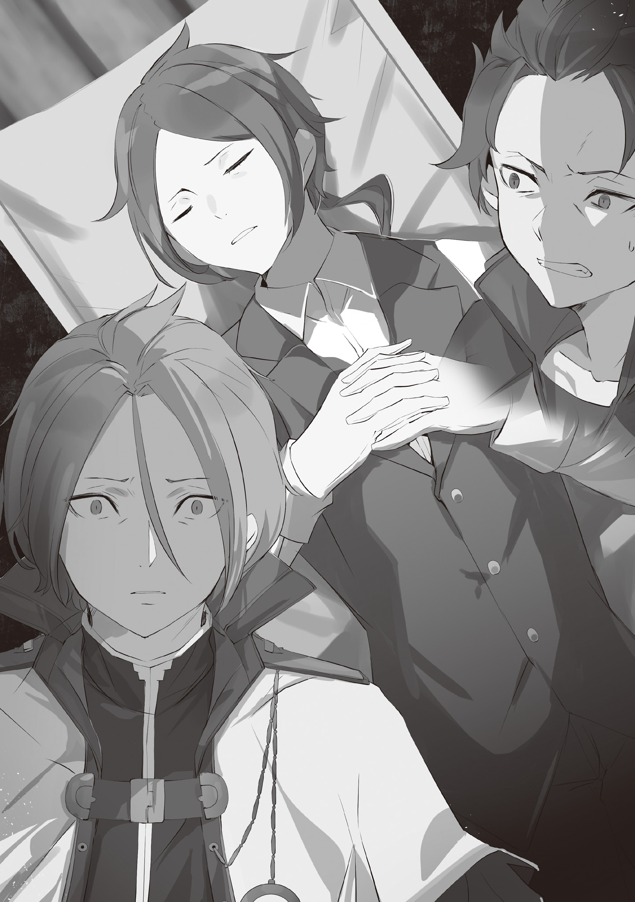
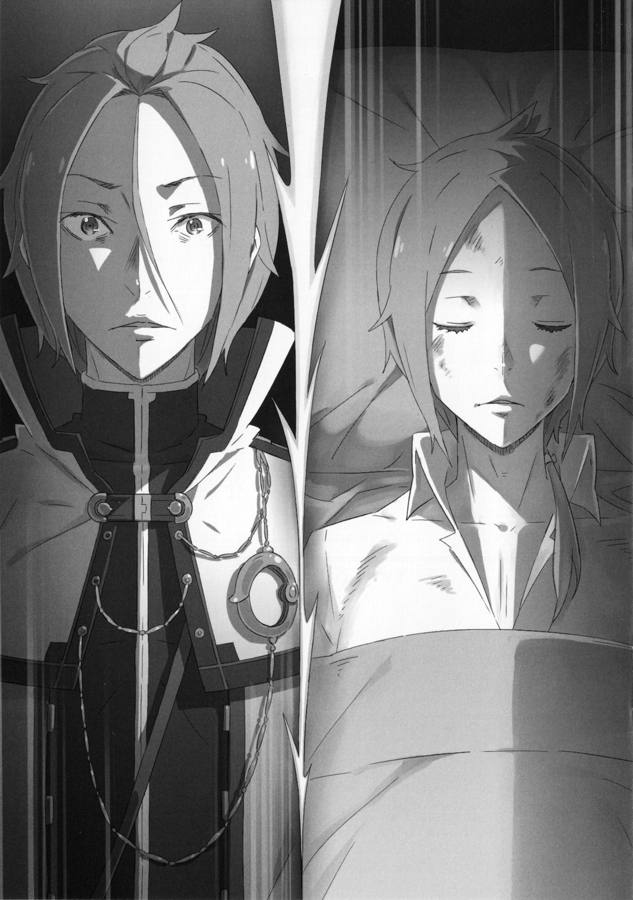

…Забыть или быть забытым — что из этого трагичнее?

Даже если бы он серьёзно задумался над этим вопросом, это было бы бессмысленно, но он не может перестать думать об этом. Другие люди указывали Юлиусу на то, что он слишком много думает, но это была привычка, глубоко укоренившаяся в его сердце.

Это та привычка, от которой у других болит голова. Однако, хотя он и думал, что, возможно, избавился от этой привычки, он всё же был отчасти благодарен судьбе за то, что это оказалось не так.

Хотя он и сам знает, что находится в крайне нездоровом состоянии, но это точно…

Анастасия: […Нацуки-кун, ты узнаешь кого-нибудь из этих детей?]

Оглядев комнату со всех сторон, Анастасия встала посреди комнаты с серьёзным взглядом и спросила.

Женщина в кимоно спросила черноволосого подростка Нацуки Субару, который тоже осматривался в чистой и белой комнате. Он подпёр подбородок рукой и, немного подумав, тихо пробормотал.

Субару: […Нет, извини. На этот раз я не увидел ни одного знакомого лица.]

Анастасия: [О? Этот ребёнок похож на получеловека, не узнаешь?]

Субару: [Я не помню, как выглядят все, но я не думаю, что каждый получеловек связан с Анастасией-сан…наверное.]

Анастасия: […Хм, вот как? В любом случае, большое тебе спасибо.]

Субару неуверенно почесал щеку, и Анастасия поблагодарила его. Однако от этой фразы благодарности выражение лица Субару стало ещё более растерянным.

Для него естественно быть смущённым. В конце концов, прямо сейчас они вообще не достигли никаких успехов.

Однако упорство в этом направлении определённо принесёт положительные результаты и возможно даже спасет кого-то… Точно так же, как память Субару спасла его.

Юлиус: […]

Сосредоточившись Юлиус затаил дыхание и оглядел комнату, точно так же как и Анастасия с Субару ранее.

Это палата лечебного учреждения, в которой находится большое количество раненых пациентов. Между кроватями были лишь узкие промежутки, и не будет преувеличением сказать, что вся палата была полностью заполнена людьми. Однако пациенты не высказывали недовольства… Нет, это были не просто жалобы, которые не были слышны.

По сравнению с многочисленными пациентами на больничных койках, в палате царит пугающая тишина, настолько тихая, что посторонним людям становилось не по себе.

Это не потому, что пациенты плохо спали ночью. За окном уже светило солнце, и день близился к концу.

Однако пациенты на больничных койках действительно все ещё спят.

Они спали, не в силах проснуться. Это трудно объяснимое состояние вызвано…

???: [Синдром “Спящей красавицы”, вызванный Полномочием “Обжорства”…]

Анастасия: [Это болезнь, которую уже много лет обнаруживают по всему миру… Я никогда не могла бы и подумать, что истинной причиной могут быть отвратительные действия Культа Ведьмы. Даже если теперь правда о её происхождении известна, это трудно назвать хорошей новостью.]

Услышав этот нечаянный шёпот, Анастасия вздохнула, не скрывая своего негодования.

Как она и сказала, пациенты в этой палате… Нет, большинство пациентов, размещённых во всей больнице, являются жертвами Полномочия “Обжорства”.

Принадлежащее им “Имя” было отнято “Обжорством”. Более того, человек, у которого было отнято имя, впадал в глубокий сон и не мог ни прийти в сознание, ни проснуться.

Даже когда кто-то громко окликал их, даже когда кто-то протягивал руку, чтобы встряхнуть их и привести в сознание, они не подавали признаков того, что откроют глаза и снова взглянут на мир после казалось бы бесконечного сна. Но беда, постигшая их, заключается не только в этом.

Анастасия: [Люди, чьи “Имена” были украдены, забыты окружающими… Это кажется чрезвычайно жестоким, даже когда просто подумаешь об этом… Даже я забыла некоторых людей, это просто ужасно.]

Юлиус: […]

Анастасия: [Ах, простите, Юлиус-сан. Я не хотела, чтобы это прозвучало так… злобно?]

Юлиус: […Всё в порядке, я понимаю.]

Анастасия обернулась и нахмурилась, одновременно извиняясь, а Юлиус слегка покачал головой. Мгновение колебания было вызвано не болью от раны на теле, а тем, что он обратил внимание на то, как она его назвала.

В последний раз она обращалась к нему так официально, словно к постороннему, когда они впервые встретились.

И это слегка отчуждённое обращение, как и то, что она только что сказала, не содержал в себе злого умысла. В глубине души Юлиус знал, что она была более чем внимательна к нему.

Однако реальность беспомощности холодно предстала перед его глазами.

Юлиус: [Но мы не совсем беспомощны. …Его существование — неопровержимое доказательство.]

Сказал Юлиус Анастасии, которая все ещё извинялась и указал на подростка, стоявшего рядом с ней.

Нацуки Субару… Единственный человек, на которого не распространяется Полномочие “Обжорства”, он уникальный прецедент. Только он помнит о людях, которые были подвержены Полномочию “Обжорства”.

Поэтому они вдвоём сопровождали его вот так, осматриваясь в поисках жителей Пристеллы, которые стали “Безымянными”. Чтобы несчастные жертвы, забытые всеми и пребывающие в постоянном сне, не остались позади.

Анастасия: [Хотя это доставило Нацуки-куну много хлопот, я надеюсь, ты сможешь понять. Никто, кроме тебя Нацуки-кун, не может этого сделать…]

Субару: [Я вовсе не нахожу это сложным. Должно быть, где-то рядом есть люди, у которых есть возможность воссоединиться со своей семьёй… Если бы только я видел больше людей раньше.]

Юлиус: [Никто не ожидал, что все так обернётся. Ты сделал всё, что мог, и не стоит сожалеть об этом.]

Субару: […Если бы ты был на моем месте, ты бы оставил всё как есть, если бы осознавал, что кто-то даже не может осознать, что потерял кого-то близкого себе?]

Субару не принял эту пустую банальность и уставился на Юлиуса своими чёрными глазами. От этого взгляда у Юлиуса перехватило дыхание, затем он опустил плечи и вздохнул.

Юлиус: [Действительно, я об этом как-то не подумал. Будь я на твоём месте, я бы не смог расслабиться и на мгновение.]

Субару: [Тогда и у меня то же самое. Даже если я знаю, что сожалеть об этом уже слишком поздно…]

Юлиус: […Я хочу сделать как можно больше.]

Субару энергично кивнул в унисон с Юлиусом.

Юлиус действительно понимал сожаление, которое испытывал Субару в глубине души. …Это чувство неудачи, с которым ему приходится мириться стискивая зубы и проглатывать из-за своей слабости. Пока он сокрушался о том, что это ему не по силам, он определённо чувствовал то же самое, что и Субару.

Однако Юлиус не хотел таким образом задевать другие раны, нанесённые этим нападением Культа Ведьмы, поэтому он не говорил об этом намеренно…

Анастасия: […Ладно, давайте перестанем выглядеть такими мрачными. Нам пора идти в следующую палату.]

Не желая накалять обстановку, Анастасия хлопнула в ладоши и предложила следующий шаг. Ни у Юлиуса, ни у Субару не было причин возражать ей, и они послушно подчинились.

Как раз в тот момент, когда три человека вышли из палаты полной молчания.

???: […Извините! Пожалуйста, уступите дорогу!]

Молодой целитель, одетый в белое, запаниковал, ведя за собой людей с носилками, и приблизился к группе, стоявшей в коридоре.

Спустя полдня после разгрома Культа Ведьм по всему городу продолжали появляться сообщения о раненых и “Спящих красавицах”. Особенно это касается тех, кто был в состоянии “Спящей красавицы”, у них нет возможности позвать на помощь, и до тех пор, пока люди поблизости их не заметят, их будет нелегко найти.

Несмотря на то, что больница работает на пределе своих возможностей, все ещё наблюдается постоянный приток новых пострадавших.

Человек на носилках, похоже, тоже недавно обнаруженный пострадавший…

Субару: [Эй…, подожди!]

Субару отступил в сторону, уступая дорогу, но когда он увидел, кто лежит на носилках, он вскрикнул от удивления. Он остановил носилки и уставился на человека, лежащего на них.

Юлиус и Анастасия уставились друг на друга из-за потрясенного лица Субару.

Юлиус: [Субару, ты видел его раньше?]

Субару: […]

На вопрос Юлиуса Субару медленно поднял голову. Эмоции в его чёрных глазах сменились с удивления на гнев, а с гнева на печаль.

Юлиус был сбит с толку и не мог понять причину серии изменений в облике Субару.

Однако ответ был быстро озвучен самим Субару.

Точный ответ таков…

Субару: [Этого парня зовут Йешуа. Юлиус, он твой брат.]

..Забыть или быть забытым — что из этого трагичнее?

Даже если бы он хорошенько задумался над этим вопросом, это было бы бессмысленно, но он все равно не может удержаться от сравнения этих двух трагедий.

Боль от того, что тебя забыли, и боль от того, что ты даже не знаешь, что или кого ты забыл, — что из этого более мучительно?

Юлиус: [Мой позор, я забыл, каким сильным ты был…]

После того, как Субару ударил его по голове, Юлиус горько улыбнулся, размышляя о боли.

На самом деле, когда он почувствовал, что спасён, его сердце действительно было глубоко ранено. ..словно он был самым невезучим человеком в мире. Даже если он не чувствовал, что позиционирует себя таким образом.

Юлиус: [В чем же правда? Если это так, то каким же посмешищем я был бы… Мне искренне жаль, что так беспокою тебя и заставляю смущаться из-за того, что твой старший брат поднимает такой шум у твоей кровати…]

Сказав это, Юлиус склонил голову к лицу спящего молодого человека, который спокойно лежал на больничной койке… К своему младшему брату, к которому он не испытывал особой привязанности.

Йешуа Юклиус. Кажется, так звали младшего брата Юлиуса. Честно говоря, этот факт нанёс серьёзный урон духу Юлиуса.

Полномочие “Обжорства” лишило Юлиуса его “Имени”. Хотя он сохранил сознание, окружающие полностью забыли о его существовании. Его воспоминаний об этом человеке полностью исчезли, хотя он все ещё обладает воспоминаниями о других людях и знакомых.

Более того, этим забытым человеком был его брат, что было выше его воображения.

Это было слишком шокирующе, и сердце Юлиуса было измучено и изранено этой поражающей новостью…

Рикардо: […Что случилось, младший братик отругал тебя?]

Юлиус: […Это ты, Рикардо.]

Когда Юлиус печально посмеялся над собой, к нему обратился Рикардо, огромный получеловек с чертами собаки.

Он молча вошёл в палату и сел рядом с Юлиусом, который сидел у кровати своего брата. Затем, морща нос…

Рикардо: [Так вот в чём дело. Он пахнет как ты. Похоже, вы действительно братья.]

Юлиус: [Ты чувствуешь одинаковый запах от нас?]

Рикардо: [Мой нюх не настолько хорош, чтобы я мог сделать верное заключение лишь по запаху воздуха. Но поскольку вы оба пахнете одинаково, я могу только предположить, что у вас одинаковая кровь и вы ели одни и те же продукты в детстве.]

Юлиус: [Нет, получить такой ответ — уже достаточное счастье…Спасибо.]

Слова Рикардо заставили Юлиуса проникнуться определенным чувством родства в его сердце.

Между Юлиусом и его братом, который не может проснуться, существовала невидимая братская связь. Юлиус хотел собрать эти осколки информации и убедиться, что между ними точно существует определённая связь.

Рикардо: [Это не та проблема, которую можно решить, собирая кусочки, чтобы изменить всю картину.]

Юлиус: […Ты видишь меня насквозь. Но то как ты ко мне относишься…]

Рикардо: [Я забыл тебя. Поскольку для меня это наша первая встреча, пожалуйста, позаботься обо мне в будущем. Мне тоже было столько же, сколько тебе, когда я встретил Анастасию, хотя с тех пор я конечно и стал взрослым. Я могу сказать, что ты определённо один из нас, хотя и не помню тебя.]

С этими словами Рикардо протянул свою широкую ладонь и положил её на голову Юлиуса.

Юлиус какое-то мгновение не мог среагировать, просто так, позволив его грубой ладони немного потрепать его по голове.

Юлиус: […Рикардо, это…?]

Рикардо: [У тебя как раз подходящая высота головы, и выражение твоего лица как раз подходит для того, чтобы я мог это сделать. На мой взгляд, вы с юной леди очень похожи.]

Юлиус: [Такой способ выражения несколько груб.]

Грубые слова Рикардо заставили Юлиуса криво улыбнуться, но он и не подумал о том, чтобы отмахнуться.

Когда он дотронулся до своей головы, Юлиус мельком взглянул на другую руку Рикардо, которой не было на голове… Правая рука ниже локтя отсутствовала.

Из-за того, что у Рикардо не хватало части правой руки, он выглядел асимметрично. Это был момент, когда только сам Юлиус был свидетелем того, как ему отрубили руку. …Это травма, которую он получил, защищая Юлиуса.

Даже этот печальный факт был неестественно размыт в его памяти.

Рикардо: [Глупый мальчишка! Почему у тебя такое выражение лица из-за чего-то, что уже не имеет значения? Неужели ты не можешь мыслить более позитивно? Даже я забыл о том, что моя правая рука в некоторой степени связана с тобой. Разве это не счастье?]

Юлиус: [Это было бы ближе к безответственности, чем к позитивному мышлению, разве не так?]

Рикардо: [Правда? Моя рука — это моя собственная проблема, верно? Если ты хочешь поговорить о безответственности, то, в конце концов, если ты считаешь, что несёшь ответственность за мою руку, то разве это не я был бы безответственным?]

Юлиус сначала хотел сказать ему, что его логика слишком абсурдна, но потом это было полностью опровергнуто.

Рикардо дерзко улыбнулся Юлиусу, который смотрел на него широко раскрытыми глазами…

Рикардо: [Ха-ха-ха! Как тебе такое? Вот как “сражаются” взрослые, страшно, правда?]

Юлиус: […Ты действительно совсем не изменился. Даже если ты потерял руку, даже если ты меня не помнишь, ты всё тот же.]

Рикардо: [Когда люди живут долго, они, естественно, учатся размышлять в таком ключе. То же самое относится и к тебе. Хотя это может быть немного сложно, но нехорошо всегда быть погруженным в неприятности и негатив. В конце концов, Ана-сан доверена тебе.]

Рикардо обнажил свои острые клыки, и его глаза были полны серьёзности. Встретившись с бесстрастным взглядом получеловека с близкого расстояния, Юлиус энергично кивнул.

Рикардо сказал это, потому что знал, что Юлиус направлялся к Сторожевой башне Плеяд вместе с ней. Это было путешествие, чтобы позаимствовать мудрость у “Мудреца”, чтобы с помощью новой информации спасти большое количество жертв в городе.

В «Железном Клыке» полно тяжелораненых, они не могут последовать за своей госпожой Анастасией в это опасное путешествие.

Поэтому….

Рикардо: [Я никогда не забуду о том, что я только что сделал. Ты тоже не должен забывать об этом.]

Юлиус посмотрел прямо в глаза Рикардо и выдохнул.

Возможно, это первый раз, когда он вот так серьёзно и с глазу на глаз разговаривает с Рикардо. Он всегда был спокоен и был убеждён, что сможет защитить Анастасию.

Теперь он должен переложить эту ответственность на других. Довериться незнакомому рыцарю, которого не существует в его памяти.

Он также должен откликнуться на это искреннее пожелание. …Пока его все ещё называют “Лучшим” рыцарем.

Юлиус: [Я искренне принимаю твоё доверие. Хотя это не очень приятно говорить, но…]

Рикардо: [Позаботиться о твоём брате? Мы останемся в этом городе, так что ты можешь быть уверен в его безопасности.]

Юлиус: [Хм, на тебя действительно можно положиться.]

Даже если он не закончил предложение, собеседник может понять смысл и дать ответ. Юлиус на мгновение насладился этим счастьем и вынул блокнот из кармашка.

Рикардо: […? Что это?]

Юлиус: [Я намерен записывать то, что я пережил, и слова, которые говорил в том числе… Оказавшись в такой ситуации, я впервые осознал, насколько благородными и ценными были эти мгновения.]

Юлиус ответил Рикардо, записывая слова на белоснежной бумаге.

Это звучит иронично, потому что о нём забыли, и он не хочет больше ничего забывать. Однако, если просто смотреть на негативную сторону вещей, то это всё равно, что стоять на месте.

Он больше не остановится, Он больше не будет страдать от глубокого отчаяния, Он больше не будет оплакивать себя.

…Ещё более десяти лет назад Он принял это решение.

Юлиус: [Итак, это своего рода записная книжка для выполнения обещаний, которая принадлежит лично мне.]

Рикардо: [Да, это не шутка?! Видя тебя таким, я чувствую, что могу расслабиться.]

Заметив, как уголки губ Юлиуса слегка приподнялись от твёрдости его слов, Рикардо тоже улыбнулся и потёр руку, которую он так и не убрал с головы рыцаря. Юлиус поправил свои волосы, растрёпанные большой рукой Рикардо и взял перо.

Он должен записать свои мысли об этом моменте как о незабываемом переживании, чтобы больше никогда не забывать его.

《Конец》
