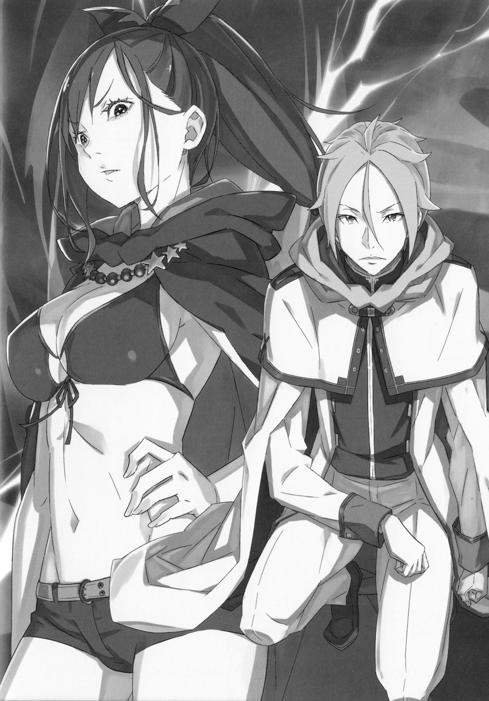
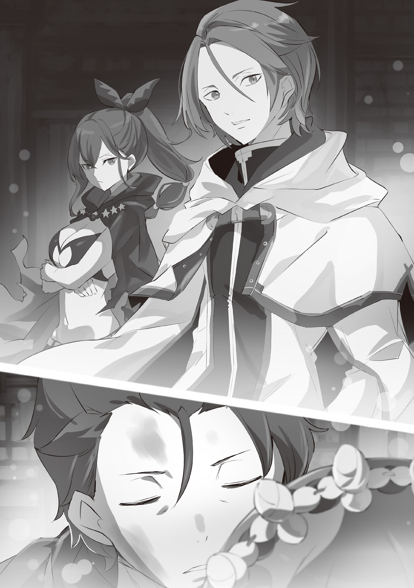

Приземлившись на песок, Юлиус тут же перекатился, оглядываясь по сторонам. К счастью, несмотря на внезапное падение, меч остался в его руке. Драконьей повозки, за которую он держался, рядом не было.

— Кх… Кхгх…

Глаза жгло от песка, и он с досадой скрипнул зубами. Юлиус понимал, что произошедшее было несчастным случаем, но горькое чувство вины не давало ему покоя. Не в силах совладать с сожалением, он резко взмахнул мечом, разгоняя песчаную завесу.

— Госпожа Анастасия…!

Выкривая её имя, Юлиус надеялся на ответ. Он понимал, что сильно рискует, поднимая шум. Всё же, вокруг простирались полные зверодемонов Песчаные дюны Аугрии. Совсем недавно они видели, как эти твари умело притворялись цветущим лугом.

Однако сейчас важнее было найти товарищей, которых раскидало по округе после того, как небо разверзлось, чем бояться привлечь внимание хищников.

Если он столкнется со зверодемонами, то упорные тренировки наконец принесут плоды. Он сразит хоть сотню, хоть тысячу. Необходимость воссоединиться с остальными была сильнее любого страха…

Юлиус не мог допустить новой потери в этом, и так трещащем по швам, мире.

— …лиус!

Откуда-то издалека донесся зов. Он замер, вслушиваясь, а затем резко оттолкнулся от песка и ринулся к тени, проступающей сквозь песчаную бурю.

Это была драконья повозка. Та самая, что везла их через все долгие странствия. А на козлах…

— Госпожа Эмилия! Вы целы?

— Да! Беатрис, Мейли и… Рем тоже здесь, все целы и невредимы!

— Это…

Он хотел сказать «замечательно», но вдруг осекся.

В её голосе сквозила недосказанность. Раз она назвала всех по именам, значит, кого-то не хватает.

Те, кого не назвали…

— Госпожа Анастасия, леди Рам, и… а где Субару? Его тоже нет?

— …И Патраш.

Вместе с земным драконом Субару исчезли три человека. От этой новости у Юлиуса словно почва ушла из-под ног.

Именно они…

— Эмилия! Может они где-то здесь?! Я чувствую их едва-едва, в самом деле!

— Зверодемоны на подходе. Что будем делать?

Грызя губы, Юлиус увидел как из-за повозки показались две девочки, Беатрис и Мейли, каждая со своим докладом. Первая была связана контрактом с Субару, а вторая отвечала за зверодемонов.

— Мы разделились, но были совсем рядом. Значит, и Субару с остальными, возможно, тоже…

— Нет, госпожа Эмилия, поблизости их нет! Эта трещина в небе — искажение пространства. А значит…

— …Их отнесло далеко? Если бы всех разбросало, то мы бы разлетелись кто куда… Скорее всего, Субару и остальные тоже вместе…

Девушка опустила взгляд. В её голосе звучала надежда, но эта догадка была лишь слабым проблеском в темноте.

По иронии судьбы, пропали именно те, чья боевая мощь сомнительна. Однако Анастасия и Рам — сообразительные девушки, а Субару в сложной ситуации всегда может проявить себя.

И всё же ситуация была очень тяжелой…

— …Эй!

С тревогой вглядываясь в даль, Эмилия и Юлиус разом подняли головы.

В тот же миг они ощутили резкое, подавляющее давление чужого присутствия, и прежде чем кто-либо среагировал, раздался оглушительный удар.

Со страшным грохотом повозка резко накренилась. Эмилия потеряла опору, а Беатрис и Мейли вскрикнули, застигнутые вихрем песка.

Так что первым её увидел именно Юлиус.

— …

На крыше повозки стояла женщина.

Её длинные чёрные волосы были собраны в хвост, на плечи накинут тонкий плащ, а смелый наряд открывал белизну кожи. Медленно повернувшись, она скользнула по ним взглядом.

Он застыл, увидев её зелёные глаза с плавающими в них красными точками. Он никогда прежде не видел столь холодного, бесчувственного взгляда, не замечавшего ничего вокруг.

Что нужно пережить, чтобы твой взгляд стал таким?

— …Ах…

Стоя перед застывшим рыцарем, женщина склонила голову набок. Из её горла вырвался высокий, хрипловатый голос — совсем не в тон её утонченной, холодной внешности. Но даже в нем не чувствовалось никаких эмоций, ни капли дружелюбия или враждебности.

Нет… всё же было кое-что. Разочарование.

— …Досадно…

— Что?

С трудом выговорив что-то понятное, она не дала Юлиусу задать вопрос и развернулась к ним спиной. Он напрягся, увидев как женщина едва согнула колени.

Предыдущий удар означал, что она спрыгнула откуда-то сверху. Нет, не откуда-то… Это было очевидно.

Она прыгнула с их цели, Сторожевой Башни Плеяд. Значит…

— Стой!

— Ах! — вскрикнула женщина, когда Эмилия, не дав ей прыгнуть, схватила её за ноги.

Потеряв равновесие, она сорвалась с крыши, ударившись лицом о песок, а полуэльфийка кубарем покатилась по нему.

— Госпожа Эмилия?!

Не сразу придя в себя, Юлиус бросился к ним. Добравшись, он замер.

— …

Они лежали на песке, друг напротив друга. Женщина протянула руку к лицу Эмилии, словно собиралась ударить.

Он мгновенно ощутил опасность. От её ладони веяло «смертью». Ещё мгновение, и голова полуэльфийки просто исчезнет.

Поэтому Юлиус должен был немедленно вмешаться, но…

— Пожалуйста, послушай. Мои товарищи пропали.

— …

— Они нам очень дороги, понимаешь? Мне нужна любая зацепка. Если ты хоть что-то знаешь, пожалуйста, скажи. Ты…

Эмилия умоляюще смотрела на женщину своими фиолетовыми глазами. Лицо незнакомки слегка изменилось: она нахмурилась и вздохнула.

Затем она медленно опустила руку и, чуть помедлив, сказала:

— …Пошли.

— Э?

— …

Встав, женщина резко бросила эту фразу и, не говоря больше ни слова, повернулась спиной. Не удостоив их даже взглядом, она двинулась прочь, исчезая в песчаном вихре.

Опомнившись, Юлиус бросился к Эмилии. Беатрис и Мейли тоже подбежали к ним, но девушка уже быстро поднялась на ноги.

— Эмилия! Ты цела…?

— Все в повозку! Нужно догнать её!

— …Мы забудем о братце и остальных?

— Нет, конечно нет, но эта женщина явно что-то знает! Так что…

— Мы не можем её упустить, если хотим получить ответы! Согласен, поехали!

Доверившись Эмилии, Юлиус ловко забрался на козлы. Девушка же помогла Беатрис и Мейли сесть в карету.

К счастью, дракон не отцепился. Рыцарь направил повозку вслед за женщиной, которая с невероятной легкостью шагала по песку.

— Юлиус и леди Эмилия! Вы целы.

— Госпожа Анастасия!

Увидев пропавшую Анастасию и остальных в Сторожевой Башне Плеяд, он почувствовал облегчение и… глубокое удовлетворение.

Несколько часов назад, в погоне за черноволосой женщиной, они достигли Башни. Распахнув огромную дверь, она впустила их внутрь вместе с каретой и вновь исчезла. Юлиус и остальные, в тревожном ожидании прочёсывая Башню, наконец снова увидели её.

Она вернулась с Анастасией, Субару, Рам и Патраш.

— Как я рад, что вы все целы…

— Простите, что заставили волноваться. Нам и самим досталось, ведь мы, мягко говоря, не бойцы… Но…

Анастасия, вся в песке, говорила с ним и остальными, нет-нет да поглядывая на женщину.

Её прекрасное лицо по-прежнему не выражало ничего, ни один мускул не дрогнул, взгляд был пуст и холоден. Но одна деталь была необычной…

— Она…

— Кажется, её интересует Нацуки.

— Субару?

Юлиус проследил за её взглядом. Она смотрела на Субару и Рам, которые лежали без сознания на спине Патраш. Они обнимались… вернее, Субару обнимал Рам. Их тела были в ранах. Похоже, что пока группа была порознь, им пришлось нелегко, и Субару, наверное, прикрывал Рам собой. Это последствия…

— Всё произошло под землёй. Там мы встретили ужасного зверодемона, и Нацуки с леди Рам сражались, но стали проигрывать… И тут появилась она.

— В Башню мы попали тоже благодаря ей… Вам удалось с ней поговорить?

Анастасия покачала головой в ответ.

— Я пыталась, но это был скорее монолог. Эта женщина хотела забрать лишь Нацуки, но я её остановила, сказав, что он расстроится, если нас не будет рядом.

— И она согласилась?

— Строго говоря, она нас сюда привела. И в конечном счёте, очень сильно помогла…

В Анастасии сквозила крайняя усталость, граничащая с истощением. Видя это, Юлиус ощутил стыд за то, что вместо радости от встречи сыпал вопросами.

— Госпожа Анастасия, ваша безопасность — превыше всего. Я несколько раз рвался из Башни, чтобы найти вас…

— Ах, всё прекрасно, я поняла. Не нужно объяснений, я и так знаю, что ты поступил бы именно так. Теперь мы благополучно воссоединились, и нет смысла зацикливаться на мелочах. Гораздо важнее…

Анастасия замолчала, устремила взгляд в потолок и вздохнула:

— Мы добрались до неприступной Сторожевой Башни Плеяд… Думаю, мы можем гордиться собой.

— Что правда, то правда. Такого даже Райнхард не смог… Знай мы всё раньше…

— Не надо «знай мы», Юлиус, это плохая привычка. Конечно, везде есть свои плюсы и минусы… но ты видишь только второе. Так нельзя.

Вспоминая путешествие и сожалея о своих решениях, он уже хотел извиниться за некомпетентность, но Анастасия его перебила.

С серьёзным выражением на милом личике, она пригрозила ему пальцем.

— Такие мысли портят всё хорошее. И… даже я не понимаю мотивы той женщины. К тому же, двое из лагеря леди Эмилии в таком состоянии…

— …Нам нужно быть начеку.

— Вот это другое дело!

Довольно кивнув, Анастасия ободрила Юлиуса, и тот в ответ поклонился. Затем он подошёл к женщине, что неотрывно смотрела на Субару

Она лишь мельком взглянула на него. Он опустился на одно колено и произнес:

— Благодарю вас за помощь. Благодаря вам мои друзья в безопасности, я снова рядом с моей госпожой, и у меня неоплатный долг перед вами за это.

— …

— Если возможно, не могли бы вы назвать ваше имя?

Юлиус вежливо обратился к ней, но женщина промолчала и отвернулась. Она не немая, она просто не хотела с ними говорить. Или… может она заговорит только с Нацуки Субару?

— Интересно, ответила бы она тебе?

Он обернулся, посмотрев на Субару и остальных. Эмилия и Беатрис с облегчением радовались их возвращению.

— Юлиус, помоги пожалуйста! Я хочу осмотреть их раны, но Субару не отпускает Рам…

— Похоже, с ними всё в порядке, но как же сильно…

— Обычно Субару кажется таким слабым, а сейчас он такой сильный…

Эмилия и Беатрис пытались разнять их, но безуспешно. Придя им на помощь, Юлиус невольно ощутил восхищение — даже потеряв сознание, Субару всеми силами продолжал защищать Рам.

— Кто же сейчас…

…больше похож на рыцаря?

Эта мысль засела глубоко в его сердце.

《Конец》
