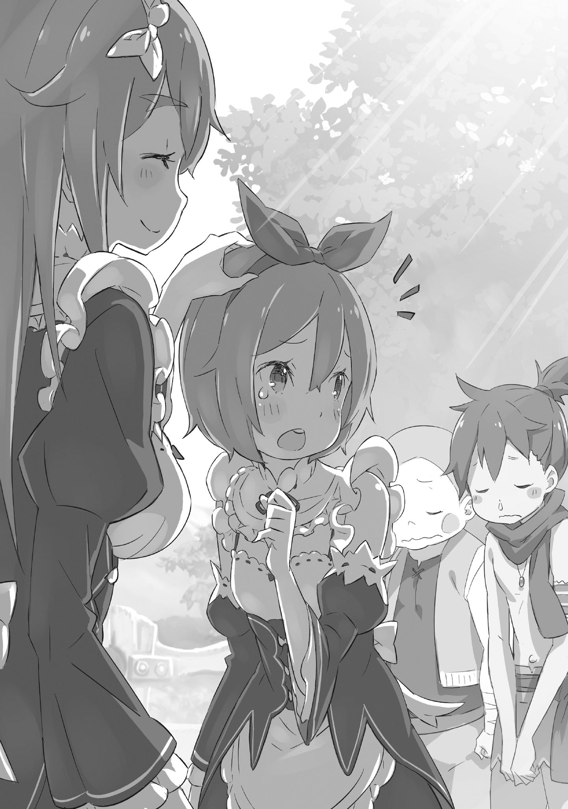

Фредерика Бауманн начала служить горничной в поместье графа Розвааля L. Мейзерса в возрасте около одиннадцати лет.

Отработав десять лет без перерыва, двадцатиоднолетняя Фредерика справедливо гордилась своим профессионализмом.

Честно говоря, если учесть все факторы, включая преданность графу Розваалю, немногие из нынешних и бывших слуг семьи Мейзерс могли с ней сравниться.

…Разве что одна девушка, о которой мир забыл. Но сейчас не время говорить о ней.

В любом случае, Фредерика, благодаря своему богатому опыту, была прекрасной наставницей для молодых горничных. Она обучила множество новичков тонкостям профессии и правилам этикета.

Число горничных, прошедших обучение под её руководством, было не сосчитать по пальцам рук и ног. Но даже для Фредерики этот случай был особенным — её ученица оказалась настолько талантливой, что Фредерика затруднялась с выбором программы обучения.

— Сестрица Фредерика, я закончила! Что делать дальше? — с лучезарной улыбкой спросила девочка, подбегая к Фредерике. Сначала она отчиталась о выполненной работе, а затем, мило склонив голову, стала ждать дальнейших указаний.

Рыжеватые пряди обрамляли её милое личико с нежными, словно у феи, чертами. Длинные, стройные ноги и руки обещали, что со временем она превратится в настоящую красавицу. Фредерика невольно вздохнула.

— Ой, какая же ты милая… — пробормотала она.

— …? Сестрица Фредерика? — переспросила Петра.

— А, ничего, Петра, — поспешила сказать Фредерика. — Просто я удивилась, что ты так быстро управилась.

Прикрыв рот рукой, Фредерика спрятала улыбку восхищения. Эта очаровательная, смышлёная девочка так ею восхищалась! Нужно было быть осторожнее и не выдавать своих чувств.

Вместо этого следовало сказать что-то вроде: «Так, я не могу просто стоять и удивляться. Петра, ты прекрасно справилась. Ты очень способная… как твой наставник, я горжусь тобой».

— Хи-хи… Я старалась, — ответила Петра.

Фредерика ласково потрепала Петру по голове, украшенной красной ленточкой. Петра, улыбаясь, словно от щекотки, не отстранилась.

…Воистину очаровательна. Рам стоило бы поучиться у неё.

«Вот эта девушка всегда вежлива и называет меня «Сестрицей»… Гораздо приятнее», — подумала Фредерика.

— Эм, сестрица, а что мне теперь делать…? — снова спросила Петра.

— Хм, ну… — задумалась Фредерика. — Если в особняке больше дел нет, может, сходим в деревню? Твоим друзьям наверняка понравится, как мило ты выглядишь в униформе.

— Ммм… если вы так считаете, сестрица Фредерика, — согласилась Петра.

— Вот и отлично. Тогда в путь! — сказала Фредерика.

На мгновение в глазах Петры мелькнуло сомнение, но она быстро взяла себя в руки и приняла предложение Фредерики.

В этом тоже проявлялась её неподражаемая «взрослость».

Взяв Петру за руку, Фредерика вновь порадовалась, какая замечательная ученица ей досталась.

Для Петры Лейт решение стать горничной в особняке Господина Розвааля было серьёзным и смелым шагом.

Отношения лорда с деревней Алам были доброжелательными, но не настолько, чтобы позволять себе фамильярность или непочтительность. Несмотря на юный возраст, Петра это понимала и считала неправильным использовать свою молодость как оправдание для снисходительного отношения со стороны взрослых.

Раньше она часто прибегала к такой тактике. Но теперь Петра осуждала своё прежнее поведение и старалась быть честной.

Она стремилась к таким же достижениям, как и взрослые.

Поэтому ссылаться на свой возраст было бы нелогично. Так она рассуждала.

Такой была Петра. Но, несмотря на всю свою взрослость, перед тем, как войти в особняк, она испытывала вполне понятный страх. Ей было всего двенадцать. Совершенно нормально волноваться и бояться, покидая родительский дом и начиная «работать».

Её мучили страхи: «А вдруг старшая горничная будет надо мной смеяться?», «А вдруг я не понравлюсь хозяину?», «А вдруг меня завалят работой, с которой я не справлюсь?».

Но Петра быстро поняла, что все эти опасения были напрасны.

Высокая, красивая, златовласая, безупречная старшая горничная легко, даже слишком легко, развеяла все её страхи.

Как только они с Фредерикой прибыли в деревню, Петру тут же окружили друзья — Лукас, Милд, Мейна и другие ребята, с которыми она всегда проводила время.

— Хорошо проведи время, — сказала Фредерика. — Друзья — это очень важно. Я бы не хотела, чтобы они обижались на меня за то, что я тебя у них забираю.

Фредерика видела, как Петра, окружённая друзьями, расстроилась, что ей придётся отказаться от игры из-за работы.

Фредерика взмахом руки словно сняла с Петры невидимые оковы. Лукас и остальные тут же увлекли её за собой, показывая деревню.

— О, Петра, ты такая милашка! — воскликнул кто-то.

— У тебя такая же униформа, как у госпожи Рам. Прелесть! — добавил другой.

— Бабушка, а еда уже готова? — раздался детский голос.

Видя Петру в униформе горничной из особняка, жители деревни улыбались и высказывали своё мнение. Некоторые комментарии были не совсем такими, как она ожидала, но в основном её хвалили.

Честно говоря, это её немного успокоило. В особняке было две формы: элегантная, которую носила Фредерика, и другая, более открытая; Петра выбрала вторую.

Разумеется, она умолчала о том, на кого именно хотела произвести впечатление своим выбором.

Однако она не могла просто наслаждаться похвалами.

«Неудивительно, что все так встревожены», — подумала Петра.

Помимо того, что Петра пошла работать в особняк, деревня Алам была погружена в тревожное ожидание.

Это было связано с тем, что половина жителей ещё не вернулась из эвакуации — в деревне было непривычно тихо. Даже на лицах взрослых, которые хвалили Петру, она видела тень беспокойства, которую они пытались скрыть от детей.

«Немного обидно, что со мной обращаются, как с ребенком…» — с грустью подумала Петра.

Но с этим ничего не поделаешь. Она сможет жаловаться, когда достигнет таких же успехов, как и взрослые. А на это потребуется время.

«Ладно, я буду стараться изо всех сил на работе в особняке», — подумала Петра, укрепляясь в своей решимости.

— Вы все меня видели, а мне пора возвращаться к работе. Я пойду поищу сестрицу Фредерику, — объявила Петра Лукасу и остальным.

Она должна была уйти; она не могла остаться здесь и играть, напоминала она себе. Однако…

— Ой, Петра, ты уже уходишь? — послышался разочарованный голос.

— Работа — это скучно, давай лучше играть! — предложил другой ребенок.

— Нам будет так одиноко, пока Субару не вернет всех остальных, — сказал третий.

— …Не будьте эгоистами, — ответила Петра. — Субару и госпожа Эмилия так стараются ради всех жителей деревни. Я тоже должна помогать.

Петра отчитывала Лукаса и остальных, которые пытались её удержать, будто не понимая, что действительно важно.

У неё не было времени на детские уговоры. Новая должность обязывала Петру смотреть на вещи по-взрослому. И она хотела, чтобы её друзья тоже это поняли.

Она больше не могла оставаться прежней. Несмотря на это…

— Фу, как скучно, — буркнул Лукас.

— Петра, я хотела тебя спросить… — начала Мейна.

— А «Сестрица» — это та высокая женщина? Она, конечно… — начал Милд, и лицо Петры вспыхнуло ярким румянцем.

По пути обратно в особняк Фредерика с досадой прикоснулась к щеке.

Одной из причин её недовольства были неудачные покупки.

В деревне Алам, половина жителей которой находилась в «Святилище», нельзя было рассчитывать на широкий ассортимент, и с этим ничего не поделаешь.

Недостающие товары она добудет сама. Но была и другая, более серьёзная проблема.

— Хммм…

Петра шла рядом, надув щёки и всем своим видом выражая недовольство.

Возможно, это субъективное мнение старшей «сестры», но даже сердитая, Петра выглядела очаровательно. Однако любоваться этим не решало проблему.

— Петра? Что-то случилось? Почему ты такая хмурая? — спросила Фредерика.

— Я? Хмурая? Не говорите так, сестрица. У меня всё хорошо, — ответила Петра, хотя было очевидно, что это не так.

Фредерика решила не настаивать. Когда они уходили из особняка, настроение у Петры было отличное. Значит, что-то произошло в деревне.

Там она оставила Петру с друзьями, надеясь, что девочка немного развеется…

— Ты не поссорилась с друзьями? — осторожно спросила Фредерика.

— ……

Петра молча отвернулась. Это было первое, что пришло Фредерике в голову, и, судя по всему, самое вероятное объяснение. Похоже, она угадала.

— Петра, — обратилась к ней Фредерика.

— ……

— Петра, послушай меня, — настояла Фредерика.

Петра проигнорировала первое обращение, но на второе вынуждена была отреагировать.

Фредерика шагнула вперёд, преграждая ей путь. Петра нерешительно остановилась, отвернулась и начала теребить свои короткие каштановые волосы. Милый жест. Нет, нет, милостью займёмся потом.

— Петра, я знаю, ты это уже много раз слышала, но друзья — это очень важно, — начала Фредерика.

— Это… Но… — пробормотала Петра.

— В детстве я жила в необычном месте, — сказала Фредерика, стараясь донести свою мысль до Петры. — Там не было детей моего возраста, и я часто чувствовала себя одиноко.

Она вспомнила, как часто играла в одиночестве. Когда она попала в особняк, где было так много людей, она сначала растерялась.

— Но жизнь в особняке — это то, чем я дорожу, — продолжила Фредерика. — Мне очень повезло. И я хочу, чтобы ты тоже это поняла.

— Сестрица… — прошептала Петра.

— Я бы не хотела, чтобы ты жертвовала чем-то важным ради работы в особняке, — сказала Фредерика. — Друзья — это настоящее сокровище. Поэтому, Петра…

Фредерика понимала, что это непросто. Но Петра не должна была выбирать между друзьями и работой. Фредерика в это верила. Ведь…

— Насколько я могу судить, ты — необыкновенная девочка, Петра, — закончила Фредерика.

— ……

Во время разговора Петра нервно сжимала фартук и смотрела в пол. Но, услышав последние слова Фредерики, она резко подняла голову и встретилась с ней взглядом.

В её больших, круглых глазах блестели слезы.

— Но, сестрица Фредерика… Они все были злые… и поэтому… — начала Петра.

— Вы поссорились. Могу я спросить, из-за чего? — спросила Фредерика.

Они дразнили её из-за униформы? Обижались, что она не может играть? Или дело было в том, что половина жителей деревни ещё не вернулась?

Фредерика испытывала неловкость, пока Петра молчала. Наконец, девочка тихо произнесла:

— О… Они… Они сказали, что у сестрицы Фредерики… страшный рот…

— ……

Фредерика была поражена словами Петры, в глазах которой стояли слезы.

Неужели причиной ссоры стали её клыки, которых она так стеснялась?

— П-прости меня… Я, наверное, была слишком самонадеянна… — пробормотала Фредерика.

— Нет! — воскликнула Петра, перебивая её. — Это не ваша вина, сестрица! Это они виноваты! Сестрица Фредерика — красивая, добрая и… и они…

Петра, краснея, изо всех сил защищала Фредерику.

— ……

Фредерика, широко раскрыв глаза, смотрела на Петру.

Кто же эта маленькая, милая девочка? Настоящий ангел!

И тут Фредерика вдруг заметила…

— Петра, посмотри, — сказала она.

— А…? — отозвалась Петра.

Фредерика погладила Петру по голове и показала назад. Петра медленно обернулась и широко раскрыла глаза. Там, с виноватым видом, стояли дети из деревни.

На их лицах было написано раскаяние и желание извиниться.

— Пойди, помирись с ними, — сказала Фредерика. — Они же твои друзья.

— Сестрица Фредерика… — прошептала Петра.

— И, если они не против, можешь меня представить? — спросила Фредерика. — Если они твои друзья, я бы тоже хотела с ними подружиться.

Фредерика улыбнулась и подмигнула. Петра вытерла слезы рукавом, её лицо озарилось радостью, и…

— Да! Я всем расскажу, какая сестрица Фредерика замечательная! — воскликнула она.

Крепко держа Фредерику за руку, Петра бодро зашагала вперёд. Фредерика, слегка удивлённая её энергией, последовала за ней.

Что ж, это были друзья её милой Петры.

…И эта встреча волновала её гораздо больше, чем любой приём в высшем обществе. Слегка улыбаясь от волнения, Фредерика нежно сжала руку Петры.

《Конец》
