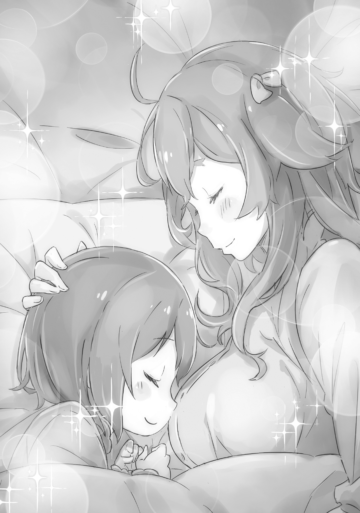

Случай этот произошел вечером, когда после долгого рабочего дня горничные могли наконец отдохнуть.

Фредерика и Петра, сняв униформу, наслаждались теплом вечерней ванны.

— Сестрица Фредерика, а вы с самого начала всё делали правильно, без единой ошибки? — неожиданно поинтересовалась Петра.

— А? — удивленно взвизгнула Фредерика, и ее голос отразился от стен ванной комнаты.

Обучение Петры искусству быть горничной под руководством Фредерики проходило удивительно гладко: девочка схватывала всё на лету. При этом она всегда оставалась милой и внимательной к окружающим.

Фредерика размышляла об успехах своей ученицы, когда та задала этот неожиданный вопрос.

Признаться, Фредерика была удивлена. Удивление быстро переросло в веселье. Конечно, в начале своего пути она была далека от идеала.

— Сестрица Фредерика? Чему вы улыбаетесь? — спросила Петра.

— Ха-ха! Просто твой вопрос показался мне забавным, — ответила Фредерика. — Я тоже начала работать примерно в твоем возрасте. И, как и ты сейчас, поначалу я была совершенно некомпетентна. Нет, я была даже хуже, чем ты.

— Что? Не может быть! Вы же не серьёзно? — с недоверием проговорила Петра.

Несмотря на ответ Фредерики, Петра решила выразить своё сомнение, что еще больше позабавило Фредерику.

— Мне льстит твоя вера в мой профессионализм, — сказала Фредерика. — Но было время, когда я была зеленой новичкой и мне приходилось многому учиться у своего наставника.

— …Наставник сестрицы Фредерики… — задумчиво прошептала Петра, с трудом представляя себе такое.

Видя растерянность Петры, Фредерика, задумчиво потерев щеку, предложила: — Хм… Мне немного неудобно, но, может, рассказать тебе о моих первых шагах в профессии горничной?

— …! Да, пожалуйста! Хочу услышать о ваших неудачах! — с восторгом воскликнула Петра.

— Н-не надо так говорить! Эх, ты… — пробормотала Фредерика.

Из-за того, как Петра это сформулировала, появилось ощущение, что Фредерика собирается раскрыть какие-то интимные тайны.

Конечно, они обе были наги, но это было совсем не то.

И, правда, ей было стыдно вспоминать о своих первых провалах, сравнивая себя с такой способной ученицей, как Петра.

— Не радуйся раньше времени, — сказала Фредерика. — Я уже почти пожалела, что завела этот разговор…

— Нет-нет! — воскликнула Петра. — Уже поздно отступать! Вы рассказали мне все мои секреты, теперь моя очередь!

— Из тебя выйдет настоящая проказница, — подумала Фредерика, уступая настойчивости Петры. — Надо будет пожаловаться Субару.

Теперь ей приходилось удовлетворить любопытство Петры, глаза которой горели от нетерпения.

— Так, с чего же начать… — протянула Фредерика.

— Начните с вашего учителя! — предложила Петра. — Расскажите, каким он был.

— Человек, который меня обучал… — начала Фредерика.

Предложение Петры помогло ей справиться с замешательством. Однако эта тема вызывала у неё сложные эмоции.

Старший домоправитель. Фредерика была наставницей для Петры, а для неё наставником был он. Но говорить о нём было тяжело.

— Может быть, в другой раз? — предложила Фредерика.

— Сестрица Фре-де-ри-ка, — настойчиво протянула Петра.

— Л-ладно, — сдалась Фредерика под её умоляющим взглядом. — Но для начала я должна тебя поправить. Меня обучал не горничная, а домоправитель. Мужчина.

— Домоправитель? — переспросила Петра.

— Домоправитель — это тот, кто управляет дворецкими и горничными, — объяснила Фредерика. — Эта должность требует компетентности и доверия. Поместье Мейзерс стало моим первым местом работы, и он был там главным.

Фредерика старалась говорить спокойно и объективно, но в её голосе всё же проскальзывали жёсткие нотки.

— Мужчина… домоправитель… — прошептала Петра.

— Его звали Клинд, — сказала Фредерика. — Он долгое время был домоправителем у моего господина… Идеальный слуга, надо сказать. У него было чему поучиться. Но тебе я бы посоветовала держаться от него подальше.

— С-сестрица Фредерика… Вы меня пугаете…

— Прости, я не хотела, — ответила Фредерика. — Просто, зная его предпочтения… ты определенно в его вкусе, Петра. Так что лучше избегай его.

Щеки Фредерики запылали, и причина была не в температуре воды. Петра с беспокойством смотрела на неё. Фредерика, опустив взгляд, нежно коснулась щеки Петры.

— Петра, Клинд — очень опасный человек, — тихо сказала Фредерика. — Внешне он может показаться безупречным, но на самом деле у него грязные, извращенные мысли. Он… он любитель молодых девушек!

(Примечание: Лоликонщик)

— И… Извращенец?! — в ужасе прошептала Петра.

— Именно! Поэтому он так трогательно обо мне заботился, когда я была новичком… — продолжала Фредерика. — Я принимала это за обычную доброту. Но спустя несколько лет его отношение ко мне кардинально изменилось…!

Вспоминая об этом, Фредерика кипела от злости. Это случилось как раз во время её взросления: она вытянулась, её формы стали более округлыми.

Тело девочки становилось телом женщины. И отношение Клинда к Фредерике изменилось. Видя внезапную холодность домоправителя, она сначала беспокоилась, думая, что чем-то его обидела. Но, когда истина открылась, тревога сменилась негодованием.

Привязанность превратилась в неприязнь, и их отношения так и остались натянутыми.

Петра молча наблюдала, как Фредерика багровеет от гнева.

Она подплыла ближе и крепко обняла её.

— Мне тоже не нравится домоправитель, который вас обучал! — воскликнула Петра.

— Правда? Это… прекрасно… Хотя нет, «прекрасно» — не то слово… Вернее? Правильнее? Логичнее…? — бормотала Фредерика.

— Неважно! — сказала Петра, улыбаясь. — Он мне не нравится! Теперь мы с вами одного мнения!

— Да… наверное… Пусть будет так, — согласилась Фредерика.

Она всё ещё сомневалась, правильно ли поступила, рассказав об этом Петре. Но, видя, как девочка встревожилась, решила оставить эту тему.

К тому же…

— Сестрица Фредерика, а можно мне сегодня с вами поспать? — спросила Петра.

— Ох, какая же ты ласковая, — улыбнулась Фредерика. — Ну, хорошо. Неси свою подушку.

Петра была настолько милой, что Фредерика не могла ей отказать.

Выслушав рассказ о Клинде, Петра сделала для себя важный вывод: если так будет продолжаться, Фредерику рано или поздно «уведёт» какой-нибудь мужчина.

Петра очень уважала Фредерику.

И хотя их знакомство длилось всего несколько дней, Петра уже сильно привязалась к ней.

Если бы глубина чувств измерялась временем, то её любовь была бы поверхностной. Но чувства не подвластны времени. Любовь… и уважение.

Конечно, время может усиливать чувства.

Видя реакцию Фредерики в ванной, Петра поняла, что Фредерика испытывает сильные, глубокие и противоречивые чувства к человеку, которого Петра никогда не встречала.

Это напоминало ей, как мать жалуется на отца. Но при этом мать любит его.

В любом случае, человеческое сердце — загадочная вещь. Особенно, если сам человек не до конца понимает свои чувства.

Именно поэтому Петра приняла твёрдое решение: она займет в сердце Фредерики место, которое сейчас принадлежит тому мужчине.

Петра постучала в дверь: — Сестрица Фредерика, можно войти?

— Да, входи, — ответила Фредерика.

Всем прислуге, проживающей в особняке, предоставлялись отдельные комнаты. У Петры тоже была своя комната, рядом с комнатой Фредерики, но она еще не привыкла спать одна в этом огромном доме.

Поэтому, с первого дня, она каждую ночь просилась к Фредерике.

— Добрый вечер, Петра, — сказала Фредерика привычным голосом. — Ты сегодня позже обычного.

Петра вошла в комнату, держа в руках подушку. Фредерика в белой ночной сорочке выглядела потрясающе. Распущенные светлые волосы и женственные формы, обрисованные тонкой тканью, делали её похожей на сказочную принцессу.

Она улыбнулась Петре своими изумрудно-зелеными глазами.

— Да, — ответила Петра. — Я заходила в столовую, посмотреть, не тронута ли еда.

— Еда госпожи Беатрис? — уточнила Фредерика.

Петра промолчала, нервно сжимая подушку.

На столе в столовой всегда оставляли еду, которую можно было есть в холодном виде. Это было для Беатрис, загадочной обитательницы особняка, на случай, если она проснется ночью.

Петра знала о её существовании, но никогда не видела и даже не была уверена, что она действительно живет в особняке.

— Субару попросил меня… — начала было Петра.

— Господин Субару, — поправила её Фредерика.

— А, извините, — сказала Петра.

Она спрятала лицо в подушку, смутившись своей оплошности. Обычно она специально не называла Субару по званию, но в этот раз это была ненамеренная ошибка.

— Ничего страшного, привыкнешь, — успокоила её Фредерика. — Мне тоже потребовалось время.

— У вас тоже были с этим трудности? — удивилась Петра.

— Конечно. Я же говорила, что у меня плохая память, — ответила Фредерика. — Мне было очень сложно привыкнуть к этикету.

Фредерика говорила очень правильно и чётко. Петра не могла представить, что когда-то у неё были с этим проблемы.

Фредерика, словно угадав её мысли, нахмурилась: — Похоже, я зря начала этот разговор…

— А какие именно у вас были трудности? — спросила Петра. — Вы тоже путались в обращениях, как я?

— Ну… если бы только в этом… — пробормотала Фредерика, смущённо потирая руки.

Петре стало еще интереснее, какие тайны скрывает Фредерика.

Они некоторое время молчали, глядя друг на друга.

— Обычно я тоже говорю с людьми просто, без всяких званий и титулов, — призналась Фредерика. — Но в официальной обстановке… я старалась придерживаться этикета…

— Что вы имеете в виду? — спросила Петра.

— Я… Я пыталась подражать одной знакомой, которая меня воспитала, — ответила Фредерика. — И… получалось очень… архаично.

— Архаично? — переспросила Петра.

— Ваша покорная служанка, Фредерика Бауманн, рада приветствовать вас в поместье Мейзерс, — с серьезным видом произнесла Фредерика, несмотря на то, что была одета в ночную сорочку.

Эти слова прозвучали настолько необычно, что Петра на секунду опешила.

А потом расхохоталась.

— Ха-ха-ха! Фредерика…! «Вас»…!

— Мне было так стыдно… — сказала Фредерика. — Я долго не могла избавиться от этой привычки.

— «Покорная служанка»… «Вас»…! — сквозь смех повторяла Петра.

— Хватит смеяться! — сказала Фредерика. — Уже ночь, не шуми. Давай спать ложись!

Петра никак не могла успокоиться, и Фредерика показала на кровать. Петра подошла и забралась под одеяло.

Положив свою подушку рядом с подушкой Фредерики, она похлопала по ней и сказала: — Приветствую вас.

— Пе-тра, — укоризненно сказала Фредерика.

— Хи-хи! Спокойной ночи! — сказала Петра и, закрыв глаза, притворилась, что спит.

Фредерика вздохнула, погасила свет и тоже легла.

— Как бы хотелось, чтобы утром еды уже не было, — пробормотала Петра с закрытыми глазами.

Она надеялась, что кто-то проснется ночью и съест оставленную еду.

— Я тоже на это надеюсь, — ответила Фредерика.

Петра прижалась к Фредерике и мгновенно уснула.

И ей хотелось, чтобы завтрашний день был таким же счастливым.

И чтобы этот Клинд заболел.

《Конец》
