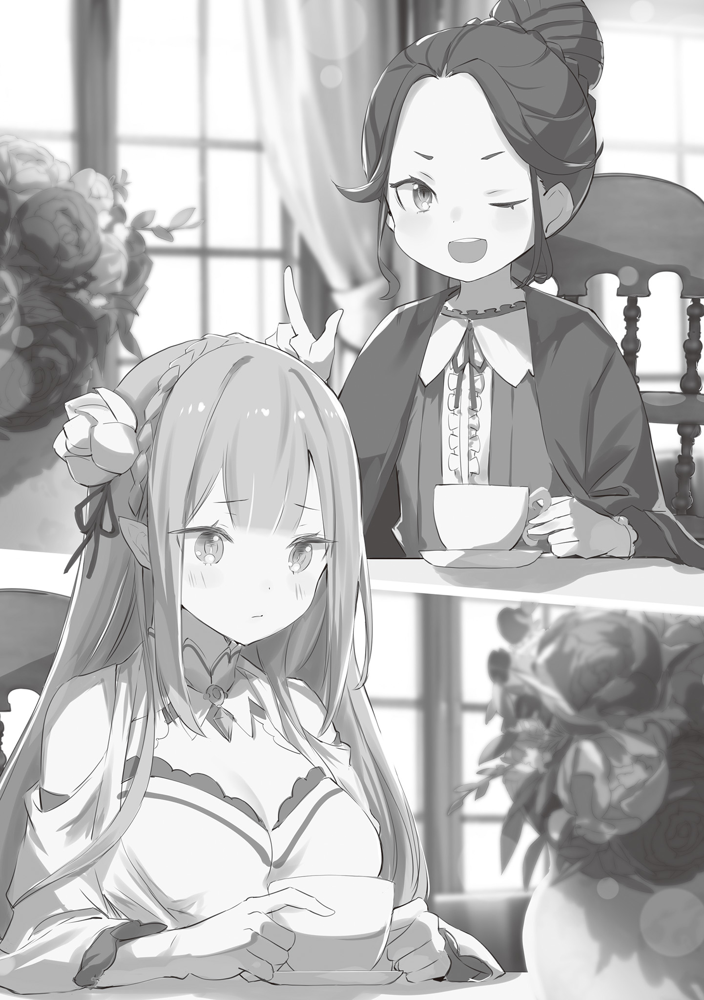
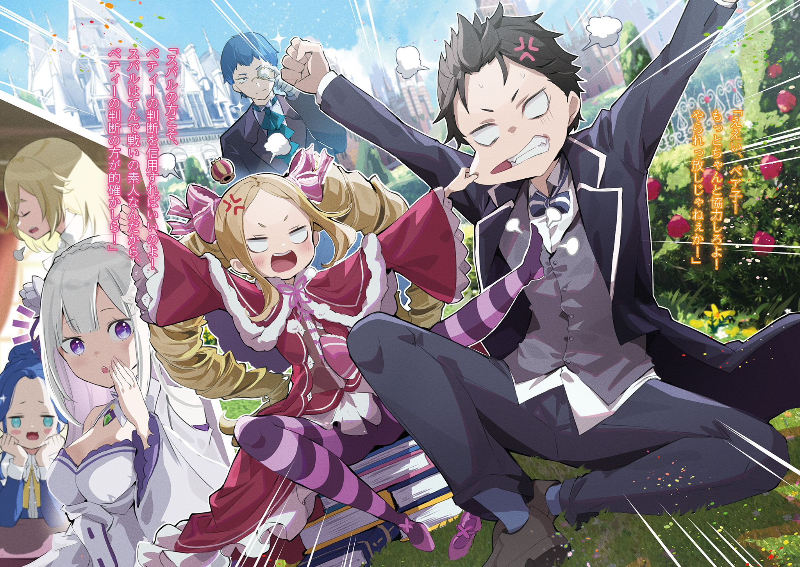
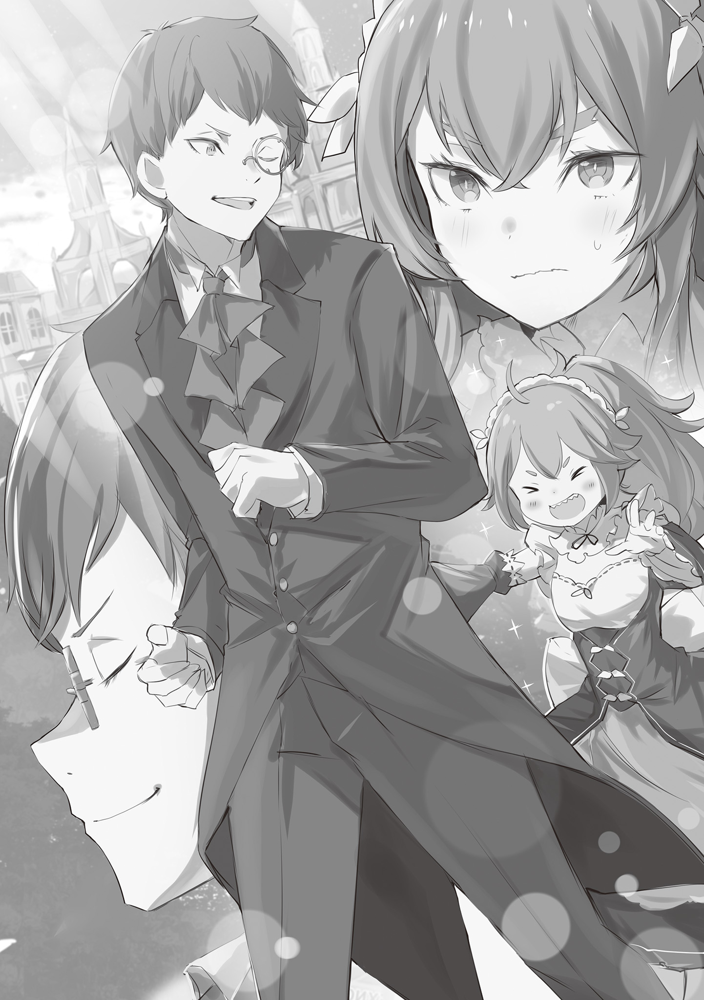

— Уоа-а-а-а-а!!

— Кьяй-ай-ай-ай-ай, я полагаю?!

Раздались неистовые вопли, и две фигуры взмыли в воздух.

Большая и маленькая — они держались за руки, разделяя общую судьбу. Кто-то мог бы счесть это трогательным, но в данной ситуации подобное было неуместно.

Ведь промедление с решением привело к тому, что обоих постигла одна и та же участь.

— Гяфун!

— Гяфун!

Издав такой звук, они закатили глаза и, обмякнув, рухнули на землю с тихим «фью».

Их ловко уложили одним махом — мальчика и маленькую девочку, лишённых даже сил на контратаку. Рядом с ними бесшумно, не издав ни единого звука шагов, возникла тень.

— К сожалению, это совершенно несерьёзно. Ребячество.

Так безжалостно оценил поверженную парочку спокойный голос. Обладатель этого голоса и сам был личностью с безмятежной аурой, полностью соответствовавшей впечатлению от его тона.

Аккуратно подстриженные тёмно-синие волосы, утончённые черты лица, проницательный, умный взгляд, подчёркнутый таким интеллектуальным аксессуаром, как монокль. Высокая, стройная фигура застыла в столь захватывающе красивой позе, что являла собой воплощение некоего совершенства.

Это впечатление особенно усиливал его невозмутимый профиль, на котором не было ни единой капельки пота. Контрастируя с ним, у его ног, задыхаясь и обливаясь потом, лежали мальчик и маленькая девочка — Субару и Беатрис.

Распластавшись на земле, двое, на которых смотрели сверху вниз, слабо приподнялись.

— Гх… кха-кха… н-нечего и сказать…

— Говорить, что Бетти, Великий Дух Беатрис ребячится!.. Надо же было такое ляпнуть, в самом деле… С-сейчас же заставлю тебя пожалеть об этом, я полагаю…

— Даже в ваших возражениях нет единства. В таком состоянии вы определённо не сможете достичь цели. Разочарование.

Медленно покачав головой, мужчина, само воплощение спокойствия, произнёс эти слова, и Субару с Беатрис понуро опустили взгляд.

Ответить было нечего. По крайней мере, в таком плачевном состоянии.

Это Субару и Беатрис попросили его о тренировках. Но, честно говоря, они думали, что способны на большее. Их самомнение было разбито вдребезги, и от этого было ужасно неловко.

Однако…

— На этом закончим? Поражение.

— Кх, да что ты говоришь! Ещё не всё!

— Если думаешь, что это конец, то ты глубоко ошибаешься, в самом деле!

На прозвучавшее предложение сдаться Субару и Беатрис вскрикнули одновременно.

В отличие от предыдущего раза, когда их слова расходились, теперь их объединял по крайней мере боевой дух. На их громкие заявления человек с моноклем — Клинд — слегка прищурился и кивнул.

— Превосходно. Тогда, прошу, ещё раз. Наставление.

— Эта твоя самоуверенность тебя и погубит, Клинд! Давай, Беако!

— Конечно! Зададим ему как следует, я полагаю!

Поднявшись, Субару и Беатрис, с поразительно похожими хитрыми ухмылками, бросились на неторопливо принявшего стойку Клинда, пытаясь нанести хоть один ответный удар.

— Неуклюжесть.

— Гяфун!

— Гяфун!

Но их бесхитростная атака была легко прочитана, и оба снова взлетели в воздух.

— Ах! Их опять одолели…

Эмилия, то радуясь, то печалясь, всплескивала руками и хлопала глазами, глядя, как Субару и Беатрис, с криками «Уяа-а-а-а-а?!», снова отлетают в сторону.

С начала этой тренировки прошло всего около десяти минут, но чтобы посчитать, сколько раз Субару с Беатрис уже успели поваляться на земле, не хватило бы и пальцев обеих рук. Судя по всему, Клинд умело управлялся с ними, но смотреть на это было боязно — как бы они не поранились.

— Эмили, такие изменения не происходят мгновенно, знаешь ли. Во всём важны ежедневные усилия… будь то этикет или учёба, разве не так?

— Анна…

Такой совет на реакцию Эмилии дала девочка с невозмутимым выражением лица.

Услышав слова той, кто выглядел на лет десять младше её, Эмилия тихо вздохнула и понуро опустила плечи.

Она не могла ничего возразить. Она знала, что девочка абсолютно права.

— Но я всё равно волнуюсь… Хотя, если они так стараются, то, наверное, ничего не поделаешь.

— Это одна из добродетелей Эмили. Однако беспокойства излишни. Ты так не думаешь, Фредерика?

— Да, вы правы, госпожа Аннероза.

На вопрос девочки ответила стройная горничная с длинными золотистыми волосами — Фредерика, чьи прекрасные изумрудные глаза и пленительная красота производили сильное впечатление.

Сопровождая Эмилию и прислуживая на чаепитии, она, готовя чай, посмотрела на сад. Именно там и проходила тренировка Субару и Беатрис, которая с самого начала занимала все их разговоры.

Заметив, с каким пониманием отнеслись к ситуации Аннероза и Фредерика, Эмилия слегка наклонила голову.

— То есть я слишком сильно волнуюсь?

— Да. Но думаю, это неизбежно. Ведь госпожа Эмилия общалась с Клиндом всего несколько дней во время той самой путаницы.

— Путаницы… В тот раз я допустила о-о-очень постыдную ошибку…

Разговор зашёл о незабываемых оплошности и опыте Эмилии.

Ещё когда она жила с Паком в Великом Лесу Элиор, Розвааль пришёл, чтобы рассказать ей о скорых Королевских Выборах и о том, что она является кандидаткой. Выслушав его, Эмилия, стремясь освободить всех в заледеневшем лесу и деревне, твёрдо решила участвовать в Выборах.

С этой решимостью Эмилия покинула родной дом, но из-за небольшого недоразумения ей пришлось некоторое время провести не в особняке Розвааля, а в поместье его родственницы, Аннерозы.

И к тому же…

— В наряде горничной, выполнять работу горничной… я ведь не горничная, я была о-о-очень груба, да?

— Вовсе нет, госпожа Эмилия. В тот момент, в силу занимаемого положения, я не могла вам этого сказать, но вам очень шло… Я бы даже хотела увидеть вас в том образе снова.

— Правда? Раз уж Фредерика так говорит, то мне спокойнее. Точно. Недавно, когда я рассказывала об этом Субару, он тоже сказал, что хотел бы увидеть меня в форме горничной…

— Не стоит показывать это Нацуки Субару. Он воспользуется твоей добротой.

Однако слова Фредерики, которые, казалось, списывали прошлую ошибку, прервала девочка, разделявшая с ней те же воспоминания, — Аннероза Милоад.

Она улыбнулась озадаченной Эмилии и спросила:

— Это тебя устраивает? То, что Эмили и Нацуки Субару — кандидатка на трон и её рыцарь… то, что у них отношения госпожи и слуги, — это факт. И именно поэтому необходимо провести между вами явную черту. Эмили и так легко вводит окружающих в заблуждение, так что мы не хотим давать Нацуки Субару ненужных надежд.

— Госпожа Аннероза, это ведь отношения госпожи Эмилии и господина Субару, так что нам, пожалуй, не стоит слишком вмешиваться…

— Воздержись, Фредерика. Не вводить кавалеров в заблуждение — это проявление такта истинной леди, знаешь ли.

Резко отрезала девочка, и горничная растерянно опустила брови.

Однако не было сомнений, что Аннероза говорила это из лучших побуждений к Эмилии. О необходимости серьёзно задуматься об отношениях госпожи и слуги с Субару ей говорили все в особняке.

Поэтому в последнее время она старалась сдерживаться и не хвастаться каждому встречному: «Это мой рыцарь». Хотя, на самом деле, ей очень этого хотелось.

— К тому же, Анна права. То, что я ввожу окружающих в заблуждение, — это недостаток, над которым нужно работать. Ведь из-за этого я тогда и стала горничной.

— Нет, тот случай — оплошность нашего дома. Более того, для меня это стало поводом встретиться с Эмили и завязать такие отношения. Это очень важный акт нашей истории.

— Анна…

— Я до сих пор помню. Как Эмили показала мне тот прекрасный снежный пейзаж в качестве прощального подарка…

Закрыв глаза, Аннероза говорила с восхищённым видом.

Однако, в отличие от неё, Эмилия виновато опустила брови.

— Прости, Анна. Это ведь Пак тогда сделал, а сейчас он о-о-очень надолго заснул, и я не смогу показать тебе то же самое.

— Я вовсе не настаивала!

— Вот как?

Когда оказалось, что её извинения были неуместны, Эмилия удивлённо округлила глаза.

В ответ Аннероза, приложив руку ко лбу, сказала: «Право слово, Эмили…» — и Эмилии показалось, что, несмотря на свою юную внешность, девочка ведёт себя как крайне достойная леди.

Если сравнивать их манеру держаться, то было непонятно, кто из них старше.

Конечно, Аннероза, выживавшая в мире аристократов, где бурлят интриги и хитросплетения, уже девять лет, и Эмилия, до недавнего времени беззаботно проводившая дни в неизменном лесу, были закалены совершенно по-разному.

В любом случае…

— Господин, вероятно, рассматривает всё это, как хорошую возможность для обучения и в таких вещах.

Угадав намерения своего хозяина, Фредерика вздохнула, глядя на девушек.

Её господин, большой любитель всевозможных хитроумных планов, предпочитал окольные и двусмысленные выражения и указания. Нынешнее событие, скорее всего, было частью его очередной проделки.

И всё же, она твёрдо верила — хорошо это или плохо, — что он плетёт свои интриги так, чтобы всё привело к должному результату.

— Уяа-а-а-а-а!!

— Уяа-а-а-а-а!!

— Ах! Опять их одолели!..

С громкими воплями Субару и Беатрис снова взмыли в воздух. Эмилия в панике металась, глядя на очередные кувыркания и падения.

Думая, сколько ещё раз придётся увидеть такую картину во время этой «тренировки на выезде», Фредерика рассеянно устремила взгляд в синее-синее небо.

Это случилось примерно через месяц после того, как проблема Святилища была решена.

— Левел-ап?

— Да! Я думаю, это то, что нам нужно!

Так, раскинув руки, Субару с жаром объяснял свою идею удивлённой Эмилии.

Место действия — кабинет на верхнем этаже нового особняка Розвааля, пришедшего на смену сгоревшему. Там Субару настойчиво доказывал необходимость немедленно приступить к тренировкам во имя светлого будущего.

— Битва за битвой!.. Мне и самому тошно это говорить, но ты ведь тоже чувствуешь, что уровень наваливающихся проблем и врагов неуклонно растёт, да?

— Это, конечно, потому, что я приложил некоторые уси~и~илия.

— Легче не стало! Совесть совсем потерял!

Пожавший плечами в ответ на такой крик был Розвааль, чьё раскаяние скрывал макияж, так что его и не разглядеть.

Розвааль, который, похоже, планировал всё ещё с того самого дня, когда Субару был призван в другой мир, и когда в столице на Эмилию обрушились несчастья, даже сейчас, после признания вины и извинений, не позволял другим ослаблять бдительность.

Более того, казалось, что его злонамеренность, граничащая с дурачеством, с каждым днём лишь усиливается.

Однако…

— Розвааль, не надо так подшучивать над Субару. А то мы ведь так и не узнаем, можно ли тебе доверять, понимаешь?

— Бетти того же мнения, я полагаю. Впрочем, видеть, как тебя отчитывает в лицо эта полудья… кхм, Эмилия, — это весьма забавно, в самом деле. Так тебе и надо, я полагаю.

— М-м-м.

Утихомирить расходившегося Розвааля смогли двое: Эмилия, искренно призывавшая к раскаянию, и Беатрис, стоявшая рядом с Субару с видом его абсолютной союзницы.

Эмилия, повзрослевшая в Святилище и ступившая на путь становления прекраснейшей из девушек, и Беатрис, покинувшая Запретную Библиотеку и ставшая более активной, похоже, были естественными врагами Розвааля. И сейчас Розвааль, который с лёгкостью парировал Субару, лишь мямлил в ответ на их слова.

Как бы то ни было…

— Дурацкие шутки Роз-чи в сторону, моё предложение серьёзно. Чтобы противостоять будущим угрозам, нам срочно нужен левел-ап!

— То есть, вы хотите отточить свои навыки и овладеть новыми техниками, так?

— Да, именно! Как ожидалось, Фредерика, ты всё понимаешь с полуслова!

Наконец-то его поняли, и Субару протянул руку, чтобы «дать пять» последней из собравшихся в кабинете — Фредерике. Она, слегка приподняв руку и криво усмехнувшись, ответила ему. Она добрая. Лучшая горничная.

— Нет, титул лучшей горничной я хочу отдать Рем, так что… самой выдающейся… это звучит не очень! Сойдёмся на превосходнейшей горничной!

— Любая из этих оценок слишком высока для меня. Но я с благодарностью приму ваши слова, господин Субару.

Прикрыв рот рукой и изящно улыбнувшись, Фредерика уклонилась, оставив Субару ни с чем.

И хотя всё это сопровождалось такими лёгкими перепалками, предложение Субару было совершенно серьёзно. Конечно, в основе всего лежала непреложная истина — мальчишеское стремление стать сильнее, — и это было его искреннее желание.

— Я официально стал рыцарем Эмилии-тан, да ещё и заключил контракт с милой Беако, так что я теперь и заклинатель духов! Пора бы как следует подтянуть и разум, и тело!

— Но ведь, если говорить о тренировках, Субару и так каждый день старается. Вы с Гарфиэлем всегда так дружно занимаетесь на площадке.

— То, что мир в глазах Эмилии-тан выглядит таким добрым, это просто супер-мило, но реальность тех тренировок далека от идеала…

Выражение Эмилии было мягким, но действительность сильно от них отличалась.

Как она и сказала, с момента переезда в основной особняк, Субару пытался получить левел-ап у Гарфиэля — недавно присоединившегося к лагерю бойца.

Новичок, на которого возлагались большие надежды, был воином, специализирующимся на рукопашном бое, так что для лагеря Эмилии, где преобладали маги, он был долгожданным пополнением. Особенно для Субару, не отличавшегося ни в магии, ни в боевых искусствах, он казался идеальным учителем.

— Но когда мы попробовали тренироваться вместе! Оказалось, что мы сделаны из настолько разного теста, что я совсем за ним не поспеваю… К тому же, он меня жутко переоценивает.

— Бетти лично не видела, но слышала, что ты одолел его вместе с тем земляным драконом, в самом деле. Это большое дело, я полагаю.

— Победить-то мы победили, но нас было четверо…

Точнее говоря, после последовательных атак Отто и Рам, Субару ослабил его, а Патраш нанесла добивающий удар. Приписывать победу исключительно Субару было бы некрасиво даже до того, как выяснилось, что Гарфиэлю всего четырнадцать.

— Если биться в открытую, я ему и в подмётки не гожусь. Он и сам это должен понимать, но поддаваться совершенно не умеет…

— Может быть, он затаил оби~и~иду за поражение в Святилище и под предлогом тренировки пытается уби~и~ить тебя.

— Если за той его улыбкой скрывается такое, я вообще людям доверять перестану!

Услышав такую оценку простодушного Гарфиэля, Субару оскалился на Розвааля.

Если он так и будет обращать всё в шутку, дело не сдвинется с места. Пока Беатрис сверлила взглядом Розвааля с рычанием «гр-р-р-р», Субару посмотрел на Фредерику.

— Вот почему я хочу как-то изменить ситуацию. Например, если Фредерика скажет Гарфиэлю, чтобы он был помягче… Фредерика?

— …

— Что-то случилось, Фредерика? Ты аж до ушей покраснела…

Перед искавшим помощи Субару, Фредерика молчала, а её лицо было почти багровым.

Субару и Эмилия забеспокоились, увидев её в таком состоянии, но сама Фредерика лишь покачала головой, слабо пробормотав: «Нет, нет…».

— Неумение Гарфа поддаваться… возможно, это моя вина.

— А? Почему? Ты что, с детства вбивала ему в голову что-то вроде: «Настоящий мужик должен сражаться с противником в полную силу!»?

— Вовсе нет… Просто в детстве, в Святилище, кроме меня и Гарфа, других детей не было…

— Не было, и что дальше?

— Я постоянно… заставляла его играть со мной.

— По-моему, это о-о-очень мило, что вы так дружны, разве это плохо?

— Нет, я имею в виду…

Не понимая, отчего смущается Фредерика, Эмилия невинно переспросила. По растерянному виду горничной Субару примерно понял, в чём дело.

Фредерика и Гарфиэль — брат и сестра, но между ними есть разница в шесть-семь лет. Сейчас это, может, и не так заметно, но в детстве разница в возрасте, даже между мальчиком и девочкой, играет большую роль.

— Это как разница между первоклассником и семиклассником…

Более того, учитывая, сколько лет прошло с тех пор, как Фредерика покинула «Святилище», она играла с Гарфиэлем, когда он был ещё младше первоклассника.

Само собой, влияние первого опыта неизмеримо. Иначе не существовало бы пословицы «Тигр полос не меняет».

— То есть Гарфиэль стал таким из-за не знающей меры сестры…

— В-вы так говорите! В ваших словах чувствуется злой умысел! То, что это моё влияние, — правда, но ваша формулировка!..

Впрочем, даже если бы присяжные признали правоту Фредерики, от этого реальность, к сожалению, не изменилась.

В любом случае, в качестве спарринг-партнёра для Субару Гарфиэль не подходил из-за разницы в силе. Небольшие травмы Гарфиэль мог залечить магией, но всему есть предел.

— Тренировки, во время которых ломаешь себе кости, слишком сильно давят и на тело, и на дух. С другой стороны, учиться у Отто этому стилю Сувен мне гордость не позволяет!..

— Ну вот, опять капризничаешь. Отто, наверное, хорошо объясняет.

— Я понимаю! Но даже если научусь, шансов применить это будет так мало, что я просто не буду знать, что с этим делать!

К слову, стиль Сувен для отпора хулиганам, передававшийся в семье Отто, уже доказал свою неэффективность против Гарфиэля, так что он был далёк от тех техник, которые искал Субару.

Субару нужны были средства противостояния угрозам, которые будут возникать в будущем — в идеале, конечно, сила, подобная мощи Райнхарда, непобедимого для любого врага.

— Понятно, что это чересчур, поэтому мне хотя бы нужны какие-нибудь мелкие приёмчики, чтобы выиграть время, задержать противника, пока не прибежит Гарфиэль.

— Довольно скромное желание, в самом деле.

— Вполне разу~у~умная мысль, ты адекватно оцениваешь свои силы.

Услышав пожелания Субару, Беатрис и Розвааль высказали свои мнения. Эмилия же, услышав то же самое, мило задумалась, промычав: «Хм-м-м».

— Эмилия-тан, ты чем-то недовольна?

— Н-нет, не то чтобы. Просто, когда Субару будет в опасности, я его защищу, я хочу, чтобы Субару и на меня полагался.

— Вообще, в той ситуации, которую я представлял, я круто сражался с внезапно появившимся сильным врагом, защищая Эмилию-тан, стоящую у меня за спиной…

Собственно, именно официальное назначение рыцарем Эмилии и натолкнуло его на эту мысль. Если же всё закончится тем, что он будет полагаться на силу Эмилии, это будет не просто искажением первоначальной идеи, а чем-то гораздо более порочным.

— В общем! Я мальчик, поэтому хочу стать достаточно сильным, чтобы защитить Эмилию-тан! К тому же, я заключил контракт с Беако, так что мне нужны и новые приёмы, и вторая форма, и всё такое!

— Субару такой шумный, я полагаю. Если так уж хочется вторую форму, можешь посадить Бетти себе на плечи, в самом деле.

— Да это похоже на какую-то детскую игру!

Возражая, он посадил Беатрис себе на плечи и стал кружить её, радостно визжащую. Глядя на эту сцену, Розвааль хлопнул в ладоши и сказал: «Я~я~ясно».

— Я понял желание Субару. Его чувства мне не то чтобы не поня~я~ятны.

— Значит, у тебя есть кто-то на примете?

— Пожалуй, да~а~а. Как насчёт того, чтобы попросить Рам?

— Можно, конечно, но будет ли она меня нормально учить…

Рам, которой Субару безмерно доверял и в плане способностей, и в плане отношений, в то же время, по его мнению, не очень подходила на роль наставницы из-за своего характера. Была даже опасность, что, получив разрешение мучить Субару под предлогом обучения, она безжалостно воспользуется этим правом.

В худшем случае, в отличие от Гарфиэля, у которого можно было чему-то научиться, ломая кости, с Рам можно было просто натерпеться боли и ничему не научиться.

К тому же, это была всего лишь хотелка Субару, но…

— Какое-то время я не хочу лезть к Рам со своими проблемами. Я хочу, чтобы она побыла с Рем.

— Субару…

После возвращения из Святилища сёстры Рам и Рем наконец встретились, но воспоминания о её драгоценной второй половинке всё ещё не вернулись к ней.

Поэтому их отношения сейчас находились в процессе восстановления, и Рам делала шаги навстречу.

— Понятно, понятно, это весьма~а~а похвально. Однако, в таком случае, это становится пробле~е~емой. Найдётся ли у нас ещё кто-то, кто мог бы обучить Субару…

— Ах, если хотите, я могу попробовать? В последнее время у меня столько сил, что это может быть опасно, но я буду о-о-очень стараться поддаваться.

— Если меня забьют до смерти или искалечат тонкие ручки Эмилии-тан, со стороны это будет выглядеть совсем уж плохо…

Вместо задумавшегося Розвааля предложила идею Эмилия, но существовала опасность, что Субару будет убит её изящными ручками, да и к тому же это было вопросом гордости.

Субару, который хотел стать сильнее ради Эмилии, будет просить Эмилию его учить — как-то это неправильно.

— «Когда-нибудь стань достаточно сильным, чтобы победить меня!» — такая героиня-наставница мне тоже не не нравится, но я хочу всегда круто выглядеть перед Эмилией-тан!

— Даже без этого я думаю, Субару всегда крутой…

— Гьяа-а-а! Любовь меня убивает!

И вот, когда Субару разрывался от противоречий из-за невинных слов Эмилии, лишённых всякого злого умысла, случилось следующее.

— Господин, вы ведь уже всё решили, не так ли? Перестаньте, пожалуйста, издеваться над господином Субару и госпожой Беатрис.

Так сказала Фредерика, остро взглянув на профиль Розвааля.

На её слова Субару и Эмилия удивлённо произнесли «А?», а сам Розвааль закрыл жёлтый глаз и озорно сощурил голубой, пробормотав: «Раскусили?».

— Раскусили, говоришь? Эй, ты что, издевался? А я ведь серьёзно.

— Субару, говорить ему бесполезно, я полагаю. Этот человек с давних пор сохраняет молодость, подшучивая над другими, в самом деле. Такое уж он существо, я полагаю.

— А? Правда? Значит, обычные его дурачества…

— Эмилия-тан верит!

И предвзятое мнение Беатрис, и простодушная вера Эмилии очаровательны. Обе были невероятно милы, так что Субару решил просто наблюдать.

Как бы то ни было, на такое замечание Розвааль, откашлявшись, сказал:

— Что касается просьбы Субару, то, как и сказала Фредерика, у меня есть идея. Место, вроде центра профессиональной подготовки как раз для таких случаев.

— Ч-что, есть настолько удобное место?! Это храм смены профессий или что-то вроде того?

— …? Я не очень понимаю, что такое храм смены профессий, но это место, где господин Субару совсем недавно был на попечении.

— Место, где я был на попечении совсем недавно…

Это был не храм, где достигшие определённого уровня могли сменить профессию, а место из недавних воспоминаний. Субару тут же открыл рот со звуком «А».

Это было место, где до переезда в новый особняк Розвааля временно укрывались люди, бежавшие из Святилища, и Субару с остальными, потерявшие свой дом…

— Ты про дом Анны? Значит, наставник…

— Эта маленькая девочка будет меня тренировать?.. Да что ни говорите, а я не могу так просто согласиться с тем, что та девчонка — хороший спарринг-партнёр… Ай-ай-ай!

— Конечно нет. Это Клинд, Кли-инд.

Эмилия потянула за ухо Субару, который сделал удивлённое лицо.

Получив не столько наказание, сколько ожидаемый упрёк, Субару кивнул с «А-а-а».

— Клинд, значит. Нет, пока мы были у Аннерозы, мы немного разговаривали, но я его не очень хорошо знаю.

— Клинд — это мой давний слуга, с которым меня связывают до~о~олгие отношения. Ну, подробности лучше знает Фредерика. Верно?

— Фэ?! Д-да, это так. К сожалению.

Вынужденная ответить, Фредерика слегка взволнованно кивнула. Субару, с интересом посмотрев на её реакцию, вспомнил образ стройного красавца с утончённым лицом.

— И всё же, центр профессиональной подготовки, да? То, что настоящий дворецкий хорош во всём… такая концепция звучит круто, как в манге или играх.

— Прости, я не очень понимаю, о чём ты. Но то, что Клинд хорошо объясняет, — это правда. Я тоже у него училась.

— Хм, Эмилия-тан училась… Э? Когда? Почему?

Эмилия подтвердила способности Клинда, но неужели за время их недавнего пребывания у них был какой-то контакт, который мог бы породить такую уверенность?

В ответ на вопросительный взгляд Субару Эмилия покачала головой.

— На самом деле, до того, как я пришла в предыдущий особняк, меня несколько дней принимали за горничную, и в это время я училась у Клинда и Фредерики работе горничной.

— …Эмилия-тан работала горничной? В костюме горничной?

— Да, так и было. Хоть и недолго, но я старалась.

Гордо выпятив грудь, сказала Эмилия. Субару, медленно переварив её слова и поняв ситуацию, рухнул на колени.

— Почему! Почему меня там не былооа-а-а-а!!

— Э-э?! Что случилось, Субару?! Ты вот-вот расплачешься…

— Упустить Эмилию-тан в костюме горничной… я не достоин быть рыцарем…!

— Это как-то связано?!

Эмилия растерянно хлопала глазами, глядя на рыдающего и всхлипывающего Субару.

Однако, это не шутка, Субару сожалел, что его там не было. Эмилия в костюме горничной, должно быть, была прекрасна, как богиня.

— Точно! Ты ведь можешь надеть его и сейчас…

— Эм, нет, так нельзя. Костюм горничной — это рабочая форма горничных, так что я не могу его носить, ведь я не горничная.

— Гуа-а-а-а-а-а-а!

Последовал безжалостный ответ, и Субару рухнул на пол.

Эмилия была смущена чрезмерной реакцией Субару, а Беатрис и остальные лишь вздыхали. Вот такими были кандидатка на трон и её рыцарь, сердце их лагеря.

— Ну и ну, это стоит того, чтобы их поддерживать. Ты так не ду~у~умаешь?

— …В отличие от господина, я бы предпочла ощутить это в несколько другой форме.

На хитрый взгляд Розвааля Фредерика ответила кривой усмешкой.

Не обращая внимания на этих двоих, Беатрис присела рядом с отчаявшимся Субару.

— Ну же, не стоит на этом зацикливаться, я полагаю. Если хочешь увидеть костюм горничной, т-т-так и быть, Бетти может надеть его для тебя, в самом деле.

— Угх, Беако… Твои чувства мне приятны, но это не одно и то же.

— Как ты смеешь, я полагаю!

Беатрис, которая собиралась его утешить, была отвергнута и возмущённо надулась.

Несмотря на всё это, можно сказать, что курс действий определился.

— Левел-ап… так это называлось? В этом вопросе, пожалуй, доверимся Клинду. Кстати говоря, госпожа Эмилия, не желаете ли отправиться в дом Милоад вместе с ними?

— Я тоже?

— Да. Теперь Субару официально стал вашим рыцарем. Думаю, сейчас самое время научиться вести себя как знатная особа.

— «Знатная особа», — Эмилия задумчиво повторила незнакомое слово и кивнула, — Поняла. Я тоже буду учиться у Клинда?

— Конечно, Клинд бы справился, но вам, госпожа Эмилия, больше подойдёт учиться на живом примере. Я имею в виду Аннерозу.

— О, у Анны?

— Уверен, она тоже будет рада встре~е~ече. Чтобы я заработал очков… ой, то есть, всё ради ваших добрых отношений, коне~е~ечно же.

Так предложил Розвааль, вставив нарочито исправленную фразу. Услышав это, Эмилия просияла, сложила руки на груди и радостно улыбнулась.

За её спиной всё ещё продолжалась перепалка Субару и Беатрис, и впечатление от этой крайне неорганизованной компании никак не проходило…

— Рассчитываю, что ты смо~о~ожешь удержать поводья.

— …Я?

— Роль сопровождающей в дом Милоад. Ты ведь подходишь, не так ли?

Опустив веко, хозяин снова посмотрел на неё своим голубым глазом. Вздохнув на озорной вид Розвааля, Фредерика снова посмотрела на Субару и остальных.

Чувствуя, что бремя немного тяжеловато, она, ничем не выдав своих мыслей, поклонилась.

В общем, вот так Субару и остальные оказались в доме Милоад.

Кстати, Гарфиэль, которого забраковали в качестве спарринг-партнёра для Субару, выглядел несколько удручённо, а Отто, заваленный бумажной работой вместо Розвааля, не сопровождал их в этой поездке.

— Говорят, тебе тоже многому нужно научиться. В следующий раз, когда встретимся, давай оба станем настолько сильными, что не узнаем друг друга. …Через два года, в королевской столице Лугуники!

— Вы что, собираетесь тренироваться до самого конца Королевских Выборов?!

Стоит добавить, что такой разговор состоялся перед их отъездом.

Как бы то ни было…

— Вот поэтому я хочу, чтобы ты потренировал меня… нет, меня и Беако.

— А?! И Бетти тоже, я полагаю?

— Естественно, мы с Беако — одно целое. И в болезни, и в здравии, и в шторм, и в бурю, и умрём мы вместе!

— Даже в шутку это не смешно, в самом деле!

Едва прибыв, не успев даже перевести дух, Субару тут же попросил Клинда о тренировках.

Его энтузиазм впечатлил даже сопровождавшую их Фредерику. По крайней мере, в желании Субару стать сильнее не было и капли лжи.

— К своему стыду, я не знаю значения слова «левел-ап», но…

— О, Фредерика? Хе-хе, не волнуйся. Это, как говорит Рам, слово из «языка Субару».

— Язык господина Субару, значит…

С улыбкой глядя на почему-то гордую Эмилию, Фредерика подумала, что «язык Субару» звучит коротко и ясно, вполне в духе её младшей сестры Рам.

Кстати о сёстрах, она беспокоилась, не доставляет ли Рам хлопот Петре, оставшейся в особняке.

Схватывающая на лету Петра всего за месяц практически закончила обучение на младшую горничную, но это был первый раз, когда она оставалась без непосредственного присмотра Фредерики.

— Как бы это сказать, касательно педагогических талантов Рам я полностью согласна с господином Субару.

— А? Фредерика, ты, может быть, беспокоишься о Петре?

— Да, простите. Мне очень жаль, если вы подумали, что я рассеянна, но я никак не могу отделаться от беспокойства, оставляя их с Рам вдвоём присматривать за особняком.

Нахмурив брови, Фредерика высказала свои опасения. Но, услышав её слова, Эмилия приложила палец к губам:

— Думаю, не стоит так сильно волноваться… Рам так вредничает только с некоторыми, вроде Субару, Отто или Гарфиэля.

— …Может показаться, что эта девочка ненавидит мужчин.

Однако на самом деле Рам вовсе не ненавидела мужчин.

Фредерика и Рам были знакомы давно, и, что удивительно, поведение Рам ничуть не изменилось с тех пор, как ей не было и десяти лет. Она одинаково относилась и к мужчинам, и к женщинам.

Проблема Рам была в том, что она ставила себя несколько выше других.

— В этом отношении Петра — человек, который может найти общий язык с кем угодно… Действительно, возможно, я чересчур разволновалась.

— М-м, думаю, ты права. Хотя, я сама всё время беспокоюсь о Субару и остальных, поэтому, наверное, говорю совсем не убедительно.

Слегка высунув язык, Эмилия, задумавшись, пробормотала это. Однако Фредерика в душе высоко ценила такую самооценку Эмилии.

У Эмилии совершенно не было присущего практически всем высокомерия.

Раньше это, казалось, было связано с её неуверенностью в себе, но после возвращения из Святилища это превратилось в добродетель, которую следовало бы назвать скромностью или сдержанностью.

При этом она была жадна до роста. Это станет её сильным оружием в будущем, когда она будет штурмовать высоченную стену Королевских Выборов.

Однако это оружие было и у других кандидаток на престол. Более того, в некоторых случаях окружение с самого рождения способствовало его развитию.

Пока что она лишь поднялась на ту же сцену…

— Поэтому дядя и отправил Эмили в мой особняк, не так ли?

— Да, это так, госпожа Аннероза.

Аннероза, прочитав мысли Фредерики, сказала это, опустив чашку.

Глава дома Милоад, ещё совсем юная, не достигшая и десяти лет, обладала умом и рассудительностью, несоразмерными её милой внешности. Причиной тому было её воспитание, не позволившее ей остаться обычной девочкой.

Честно говоря, Фредерика иногда жалела её из-за этого. Однако сейчас, видя, как она с достоинством сидит за чаепитием с Эмилией, ей подумалось, что такое чувство было сродни неуважению.

Или же…

— Господин знал, что госпожа Аннероза станет такой?

Розвааль L. Мейзерс, плетущий всевозможные интриги и заговоры.

Этот стратег, использовавший в качестве пешек в своих замыслах даже жителей собственных земель, включая Святилище, которое он защищал из поколения в поколение, признал своё поражение перед Субару и Эмилией, извинился за прошлые поступки и пообещал не повторять их впредь.

Однако Фредерика не думала, что Розвааль настолько легко сдастся, отказавшись от всего, что он строил до сих пор.

Тот, кто по-настоящему стремится чего-то достичь, никогда легко не отступит.

Неутомимая настойчивость и упорство в достижении цели — вот, по мнению Фредерики, самые важные качества для исполнения «желания».

Существовал ли кто-нибудь, кто мог бы сравниться в этом с Розваалем?

И если Розвааль не жалел ничего ради своей цели, возможно, он учёл в своих планах даже такую фигуру, как девочка по имени Аннероза.

Неужели он мог хладнокровно использовать даже дочь своего друга, родственницу, которую он опекал с самого её рождения?

— Уняа-а-а-а-а?!

— Кх!

Возможно, из-за того, что она погрузилась в такие размышления, очередной крик заставил Фредерику вздрогнуть.

Посмотрев, она увидела, что в саду дома Милоад Субару и Беатрис терпят двадцатое по счёту поражение от Клинда.

Хотелось бы сказать, что они хорошо стараются, но, просто бездумно бросаясь вперёд, они вряд ли получат от Клинда проходной балл. К тому же, он не станет им всё подробно и вежливо объяснять. Таков уж был Клинд.

— Ах, вот опять! Повезло, что они не поранились…

— Эмили, это не так. То, что Субару и Беатрис обходятся без травм, — это не удача. Это Клинд.

— А, Клинд?

Эмилия, беспокоящаяся за упавшую парочку, удивлённо округлила глаза, услышав объяснение Аннерозы.

Наверное, в это было трудно поверить. Но всемогущий дворецкий Клинд был на такое способен.

Не причинять вреда ученикам и позволять им бросать вызов снова и снова, пока их дух не сломлен.

Он делал это потому, что считал это своей ролью, которую от него ожидали.

— Гарф бы так не смог, это как раз тот наставник, который нужен господину Субару.

— Клинд такой удивительный человек…

Эмилия восхищённо вздохнула, и Фредерика, глядя на её удивление краем глаза, прищурилась.

Если говорить о доверии, Розвааль больше всего ценил Рам. Хотя в последнее время его восприятие изменилось, и можно было заметить, как Розвааль отступает под её натиском, тем не менее, в плане доверия её позиция была непоколебима.

Однако, если говорить о доверенном лице в смысле способностей, то это, несомненно, был Клинд.

Всемогущий дворецкий, давно связанный с Розваалем и представляющий ценность во всевозможных ситуациях. Когда-то Фредерика слышала, что Розвааля и Клинда связывали не отношения господина и слуги, а контракт.

Это были воспоминания из детства, когда она, желая привлечь внимание усердно работавшего Клинда, расспрашивала его обо всём подряд.

— Стыд… Как же стыдно вспоминать…

— Фредерика, что-то случилось? Твоё лицо о-о-очень красное.

— Не обращай внимания, Эмили. Такое иногда случается. У Фредерики довольно сложный характер.

Приложив руку к горящей щеке, горничная боролась со своим стыдом.

Не обращая на неё внимания, Аннероза повернулась к Эмилии и сказала:

— Итак, в письме от дяди было сказано, чтобы я обучила Эмили манерам знатной особы. Поэтому несколько дней тебе придётся сопровождать меня на светские приёмы и вечера. Ты не против?

— Да, всё в порядке. Но, Анна, ты уверена? Я ведь…

— Семья Милоад — это побочная ветвь семьи Мейзерс. Разумеется, мы не расходимся во мнениях с дядей. И в Королевских Выборах мы поддерживаем Эмили.

Сказав это, Аннероза добавила: «Впрочем».

— Даже если бы не дядя, я всё равно поддержала Эмили…

— Анна… спасибо. Но, пожалуйста, выслушай идеи и остальных кандидаток на престол. Это о-о-очень важно, нельзя принимать чью-то сторону лишь потому, что он твой друг.

— Разве это не тот момент, когда растроганная Эмили должна была обнять меня?!

Аннероза, ожидавшая совершенно другой реакции на свои вроде бы хорошие слова, растерялась.

Её выбили из колеи, но Эмилия не имела в виду ничего плохого. Заставлять собеседника задуматься, даже если поспешное решение шло ей на пользу, было свидетельством её доброты.

— Хе-хе, прости. Но раз уж Анна так говорит, я тоже воспользуюсь этой возможностью и как следует поучусь, хорошо?

— Хм… Да, так и сделаем. Предупреждаю, в светском обществе твои обычные расслабленность и мягкость, Эмили, будут неуместны. Нужно быть решительной!

— Решительной… М-м, постараюсь! Решительной!

Кажется, Эмилия слегка напрягла мышцы лица, отчего её щёки немного напряглись. Вероятно, это была её версия «решительности». Путь предстоял долгий.

Но, глядя на её трогательные старания, Аннероза, приложив руку к щеке, пробормотала: «Эмили такая старательная и милая…» — и была совершенно очарована.

Итак, планы девушек определились…

— Скоро и там должно что-то произойти.

Аннероза, стряхнув с лица расслабленное выражение и вновь обретя вид главы дома, пробормотала это. Не поняв её мыслей, Эмилия склонила голову набок. И тут…

— Эй, Беако! Тебе вообще-то надо со мной сотрудничать! Мы же всё время проигрываем!

— Субару, лучше бы ты доверял суждению Бетти, в самом деле! Субару ведь совсем несведущ в битвах, так что решения Бетти точнее, я полагаю!

— Бред! Нечего строить из себя ветерана, просидев взаперти четыреста лет!

— К-к-как ты смеешь, в самом деле!.. Всё, с Субару покончено, я полагаю!

Посреди сада Субару и Беатрис, упав на землю, начали ссориться.

Похоже, разбор полётов перерос в столкновение мнений. Спор накалялся, и они принялись сваливать вину друг на друга.

Если так и дальше пойдёт, то финал возможен только один.

— Всё кончено! Кончено, в самом деле! Бетти совершила огромную ошибку, я полагаю!

— Ты!.. Ладно-ладно! Если ты так решила, то и мне всё равно! Дура ты, Беако! Упёртая! Не прощу, пока не извинишься!

— Это слова Бетти, в самом деле! Субару, для твоего же блага, не думай, что тебя утешат, даже если ты будешь плакать, я полагаю!

— Считай, что я сказал то же самое!

Слово за слово, и Субару с Беатрис отпустили руки друг друга.

Развернувшись, они пошли в противоположные стороны, оставив посреди сада своего оппонента, Клинда.

— О-ой… они поссорились…

— С такой координацией это было лишь вопросом времени. Впрочем, это была милая ссора.

— Что ты говоришь! В ссорах нет ничего милого. Но и чего-то страшного тоже нет. Нужно срочно их помирить…

— Госпожа Эмилия.

Эмилия, встревоженная детской ссорой Субару и Беатрис, собиралась встать. Но Фредерика мягко удержала её за плечо и покачала головой.

Чувства Эмилии были понятны, но сейчас был не её выход. Это было испытание, которое Субару и Беатрис должны преодолеть самостоятельно.

— Фредерика, почему?

— Господин Субару и госпожа Беатрис только недавно заключили контракт… они всё ещё узнают друг друга. Вы не должны вмешиваться в то, что произошло между ними в такой ситуации, госпожа Эмилия. Наверняка, вы всё решите за них.

— …И это плохо?

— А если их мнения столкнутся, когда Эмили не будет рядом?

Взгляд аметистовых глаз Эмилии метнулся к Аннерозе. Встретив её взгляд, девочка указала рукой в сторону исчезнувших Субару и Беатрис.

— Эти двое ведь и дальше будут жить как единое целое, не так ли? Как бы ни были дружны люди, живя вместе, у них всегда будут возникать разногласия. Но ведь Эмили не сможет каждый раз мирить их, правда?

— …Поэтому я не должна помогать им мириться?

— По крайней мере, в этот раз, да. Присутствие Эмили, похоже, слишком много значит для Нацуки Субару. Что, впрочем, естественно. Поэтому…

Оборвав фразу, Аннероза перевела сузившиеся глаза на Фредерику. Эмилия, проследив за её взглядом, нахмурилась: «А?».

Однако Фредерика знала свою роль, поэтому она спокойно согнулась в поклоне.

— Прошу прошения за свою дерзость, но я собираюсь отправиться к ним вместо вас, госпожа Эмилия. Всего лишь небольшой совет, просто выслушаю их мнения…

— Значит, Фредерика пойдёт… Тогда я спокойна.

— …

— Позаботься о Субару и Беатрис, пожалуйста. Они оба о-о-очень хорошие и сильно любят друг друга, просто немного разошлись во мнениях.

Ей так просто доверили подобное дело, что Фредерика испытала скорее удивление, чем облегчение. Однако Эмилия, не заметив удивления горничной, вздохнула.

Похоже, она искренне верила, что Фредерика справится.

— Нужно оправдать ожидания Эмили, верно?

— …Когда вы делаете такое лицо, вы очень похожи на господина.

Аннероза, заметив смешанные чувства Фредерики, злорадно улыбнулась. На что она, хоть это и было крайне неуважительно для слуги, ответила колкостью.

Как и ожидалось, Аннероза скорчила гримасу отвращения: «Ме».

— Хе-хе, странно. Анна и Розвааль совсем не похожи.

— Ах, Эмили! Ведь правда! Ведь правда же!

— М-м, да. …Может, только немножко взгляд похож?

— Если уж утешаешь, то утешай до конца, пожалуйста!

Аннероза, услышав невинные слова Эмилии, жалобно вскрикнула дрогнувшим голосом.

Глядя на эту трогательную перепалку, Фредерика, приподняв подол юбки, сделала реверанс.

— Тогда я исполню свою роль.

— Фредерика. Остановка.

Покинув чаепитие Аннерозы и Эмилии, она собиралась исполнить возложенные на неё обязанности, но была окликнута бесшумно подкравшимся мужчиной.

Спокойный, холодный голос, не знавший эмоциональных всплесков.

Фредерика закрыла глаза и, не оборачиваясь, ответила:

— В чём дело? Мне нужно идти успокаивать тех двоих, что рассорились из-за твоих выходок.

— Это весьма кстати. Прекрасно. Однако с каких пор горничные дома Мейзерс изменили свои обычаи и не считают грубостью не смотреть в лицо собеседнику? Сомнение.

— Кх!.. Будь любезен, прекрати язвить!

Выслушав упрёк за своё поведение, Фредерика, оскалившись, повернулась. Прямо перед её носом, оказалось лицо мужчины в монокле, отчего она невольно отшатнулась.

— Т-ты слишком близко!

— Прошу прощения. Неожиданность. Забыл, что ты так выросла. Упущение.

— …Эта колкость и есть то, что ты хотел сказать?

Фредерика, прижав руку к груди, посмотрела на него, гадая, не нарывается ли он на ссору.

К её досаде, на Клинда с его невозмутимым выражением такие взгляды не действовали. Сколько она его помнила, ей почти никогда не удавалось заставить его непроницаемое лицо измениться.

Кажется, когда она была совсем маленькой, он иногда ей слегка улыбался. Но это было лишь проявлением дурной натуры Клинда восхищаться маленькими детьми, и не более того.

На самом деле, с тех пор как Фредерика начала превращаться из девочки в женщину, их отношения с Клиндом неуклонно ухудшались. То, что её сердце сейчас так сильно забилось, должно быть, было от удивления и отвращения. Наверное.

На грубый вопрос Фредерики Клинд спокойно покачал головой: «Нет».

— Уверен, нет нужды говорить тебе, наблюдавшей со стороны, но ссора господина Субару и госпожи Беатрис — это минутная несдержанность… Слова, вырвавшиеся у них, были сказаны сгоряча. Вспыльчивость.

— …Я понимаю. Честно говоря, я и сама удивляюсь, насколько они дружны.

Сказанное Клиндом было фактом, который Фредерика ежедневно наблюдала в поместье Розвааля.

До своего перевода незадолго до Королевских Выборов она также работала в особняке вместе с Рам. Изредка замечая Беатрис за пределами Запретной Библиотеки, Фредерика общалась с ней исключительно по служебным вопросам и держалась на расстоянии из почтения.

И вот эта самая Беатрис покинула Запретную Библиотеку, играет с Субару, как ребёнок, приходит на каждый приём пищи и непринуждённо разговаривает с Фредерикой.

…Это было просто чудо.

Отношения, породившие это чудо, ни в коем случае не должны разрушиться.

— Поэтому господин и ожидает от тебя смягчения ситуации. Просьба.

— Да, потому я их и сопровождаю. В обучении новичков это обычное дело.

Ответив так, Фредерика пожала плечами, гадая, кто из них — она или он — оказался в более невыгодном положении.

Большая ссора Субару и Беатрис, возникновение подобных проблем было ожидаемо.

Изначально дом Милоад служил не только для приёма и трудоустройства обездоленных полулюдей, которых приводил Розвааль, но и как место обучения новичков необходимым навыкам.

Естественно, их подготовкой занимался Клинд, но не менее важную роль играл слуга, занимавший следующее по рангу место. Во время пребывания в доме Милоад эту роль исполняла Фредерика, и, вероятно, именно с ней он дольше всего работал в паре.

Клинд своими строгими методами обучения доводил подопечных до предела, а Фредерика утешала их, успокаивала и помогала с новыми силами приступить к заданиям. Это была стандартная схема.

Ссора Субару и Беатрис была частью этого.

— Я знаю, что мне нужно делать. …Собственно, что ты хотел сказать?

Фредерика с подозрением посмотрела на Клинда, который напомнил о роли и так ей известной.

Намеренно напоминать о должностных обязанностях и насмехаться над некомпетентностью Фредерики — даже такой человек, как Клинд, не опустился бы до подобной низости.

Он был предан работе и безупречно исполнял свои обязанности. Поэтому нельзя было его винить.

— …На сей раз это я попросил господина прислать тебя. Признание.

— …А?

Поэтому неожиданно произнесённые слова стали для Фредерики громом среди ясного неба.

Она, округлив глаза, пристально посмотрела на Клинда. Тот, с обычным непроницаемым выражением лица, прищурил глаза за моноклем.

— Недавно, когда господин останавливался в нашем доме, ты сразу же уехала подготавливать новый особняк. Из-за этого нам не удалось спокойно поговорить. Внимание.

— Специально, чтобы поговорить со мной?..

Всё ещё удивлённая, Фредерика пыталась понять истинные намерения Клинда. Однако не нашлось ни одной зацепки. Зачем же он специально вызвал Фредерику?

Клинд, видя её замешательство, выдержал паузу и сказал.

Это было…

— Фредерика, я рад, что Святилище освобождено. Поздравление.

— А-а…

— Я знаю, ради чего ты покинула свой дом и, находясь под покровительством господина, училась у меня. Поэтому я хотел донести это должным образом. Завершение.

Сказав это, Клинд едва заметно опустил кончики бровей.

Это была практически неуловимая улыбка, которую могла заметить лишь та, кто за многие годы привыкла к его неизменному выражению лица и внимательно наблюдала за малейшими колыханиями в его мимике.

— …

Выражение, которое она не видела уже несколько лет и не думала увидеть вновь.

Это была поистине мимолётная улыбка, которую могла заметить лишь та, кто когда-то хвостиком бегала за Клиндом, радостно крича: «Братец, братец!».

От этой улыбки ладонь, прижатая к груди, снова уловила гулкое биение сердца…

— Кх!.. До чего же неприятный мужчина!

Фредерика повысила голос, словно пытаясь скрыть возникшее в ней на мгновение чувство.

Услышав это, мягкость, определённо присутствовавшая на лице Клинда, исчезла. Он испустил нарочитый вздох: «Хм».

— Почему ты не можешь даже спокойно принять поздравления? Твоё упрямство меня просто поражает, и от него у меня раскалывается голова. Хочется проклясть свою неспособность тебя исправить. Бессилие.

— Да-да! Конечно! Тебе, должно быть, очень больно от того, какой я стала. Пф! Так тебе и надо!

— Ха.

Фыркнув и по-детски отвернувшись, она тут же пожалела об этом, ведь Клинд, о ужас, усмехнулся ей в ответ.

Лицо вспыхнуло, в таком состоянии оборачиваться было уже нельзя. Фредерика, сохраняя порыв, с которым отвернулась, попыталась вернуться к своей первоначальной цели.

А именно, к примирению Субару и Беатрис.

— Всё-всё, разговор окончен! Я пойду к ним… А!

Но в тот момент, когда она, вопреки элегантному образу горничной, собиралась уйти широким шагом, Фредерика заметила на себе чей-то взгляд, подняла голову и изумлённо расширила глаза.

— Эм, а-ха-ха, здрасьте…

— Вот потому-то Бетти и говорила, что надо идти так, чтобы нас не заметили, в самом деле!..

Из крытой галереи, соединяющей сад и особняк, за спорящими Фредерикой и Клиндом издалека наблюдали Субару и Беатрис, прижавшись друг к другу со смущёнными выражениями лица.

Эти двое, которые совсем недавно сильно поссорились, не успел никто и оглянуться, вновь взялись за руки.

— Г-господин Субару, госпожа Беатрис, ваши руки…

— Руки? А, мы помирились. Немного погорячились и наговорили лишнего… да, Беако?

— Ну, раз уж Субару извинился, я его простила, я полагаю. Бетти как раз подумала, что была слишком невнимательна к чужому мнению, в самом деле.

Они ответили, подняв сцепленные руки перед дрожащей Фредерикой.

В отличие от предыдущих случаев работы с новичками, она могла лишь ошеломлённо пробормотать «в-вот как», глядя на то, как легко помирились эти двое.

Конечно, их примирение — это хорошо. Изначальной целью было улучшить их отношения без вмешательства Эмилии, так что это не было проблемой.

А проблема была, если уж на то пошло, в другом…

— Эй, Фредерика… ты что, с Клиндом поссорилась?

— Бетти может выслушать вас, я полагаю. Нужно идти на компромиссы, в самом деле.

— …Кх!

Как и ожидалось, когда речь зашла о недавней ссоре, Фредерика потеряла дар речи.

Хотелось сказать многое. Например, что она не желает слышать это от тех, кто только что ссорился, или кто виноват в том, что всё так обернулось, но это было бы просто срывом злости.

— Господин Субару, госпожа Беатрис, я рад, что вы снова взялись за руки. Удача.

Клинд, выступив вперёд вместо Фредерики, потерявшей дар речи от нахлынувших эмоций, похвалил тех двоих, кто самостоятельно преодолел возникшую проблему.

Услышав это, Субару и Беатрис с польщёнными выражениями спросили: «П-правда?»

— Если вы научились идти на уступки, ситуация изменится по сравнению с предыдущей. Тогда станет виден и следующий этап. Удивительная скорость роста. Потрясение.

— Эй, слышала, Беако? Клинд дрожит от нашего роста.

— Хе-хе, это естественно, я полагаю. Если за дело берутся Бетти и Субару, любая преграда рушится в мгновение ока, в самом деле. Страх и дрожь — это только начало, я полагаю.

— Хью-ю, такая маленькая, а такая хвастунья!

То, что они без тени сомнения приняли откровенную лесть, — это свидетельство того, что они, как и Эмилия, добры до глубины души. Обнаружив неожиданное сходство между госпожой и слугой, Фредерика, тем не менее, нисколько не избавилась от стыда за то, что её невольно унизили.

Как бы то ни было…

— Тогда давайте подумаем о следующем шаге. Мой способ для этого? Метод проб и ошибок.

— О, вот об этом я и хотел сказать. Не только полагаться на Беако, но и мне самому было бы неплохо научиться пользоваться каким-нибудь приспособлением.

— Т-ты думаешь, что на одну лишь Бетти нельзя положиться?..

— Нет, не подумай! Просто я не хочу быть обузой, а тоже хочу стать твоей силой!..

— Субару!..

От решимости Субару, сжавшего кулак, глаза Беатрис восхищённо засияли.

То, что они так дружны, — это хорошо, но одной лишь Фредерике кажется, что Беатрис, которая раньше казалась такой величественной и умной, порядком растеряла свою мудрость? Или это её уязвлённые чувства заставляют её так думать?

— Желаете приспособление, значит. Не меч и не лук, а приспособление. Оригинально.

— Даже если я сейчас начну в поте лица тренироваться с мечом, я не могу себе представить, что смогу тягаться с Райнхардом или Юлиусом. Лучше уж специализироваться на чём-то таком… выучить приём, который удивит с первого взгляда, это позволит действовать в более разнообразных ситуациях…

— Понятно, интересная мысль. Нестандартно.

— Ха-ха… ну, идея «убийства при первой встрече» пришла мне от парня, которого я и вспоминать не люблю.

— Откуда бы ни пришла идея, то, что ты нашёл способ её использовать, — это заслуга Субару, я полагаю. Бетти тоже, как п-п-п-партнёр, гордится тобой, в самом деле.

Продолжая этот фарс, Субару и Беатрис строили планы на будущее.

Со своим вдумчивым подходом Клинд, вероятно, найдёт для Субару и остальных наилучшее решение. И действительно, вскоре дворецкий поднял палец.

— Возникло несколько кандидатов. Давайте возьмём их из нашей кладовой. Сокровища.

— О, серьёзно? Тогда, раз уж так, мы тоже пойдём.

— Бетти своими глазами убедится, подходят ли они Субару, я полагаю.

Субару и Беатрис, полные энтузиазма, последовали за Клиндом.

Они направлялись в кладовую дома Милоад, где хранилось всевозможное снаряжение для обучения слуг боевым искусствам. Там, вероятно, и собирались подобрать подходящее оружие для Субару…

— Фредерика, когда закончишь изливать свой гнев, возвращайся к госпоже Аннерозе и госпоже Эмилии. Гостеприимство.

Так легко отвлечь внимание Субару и остальных и невозмутимо сказать подобное — вот что делало этого мужчину таким несносным. Проводив его взглядом, пока тот не скрылся из виду, Фредерика вздохнула.

По плану, эта «тренировка на выезде» в особняке Милоад должна была продлиться десять дней.

— То есть, десять дней с Клиндом… Это тоже замысел господина?

Неужели и этот стыд, и это негодование — часть какого-то плана ради будущего? Неужели Розвааль хотел, чтобы Фредерика, угадав его мысли, сама нашла наилучшее решение?

А раз так…

— …Поняла. Если господин того желает, то и я приму вызов, дабы вырваться из скорлупы. Да, Петра и Гарф тоже стараются, я не могу просто топтаться на месте, это было бы недостойно.

Приняв такое решение, Фредерика укрепилась в своих намерениях.

Приехать сюда в роли простого дополнения, сопровождающей, словно сторонний наблюдатель, было большой ошибкой.

В лагере Эмилии, отстающем от других, тот, кто не способен двигаться вперёд, не сможет участвовать в битве. Необходимо развитие, то есть…

— …Левел-ап, вот что.

Стоило произнести это вслух, как её, казалось, наполнило силой, пробуждающей дух.

Черпая энергию из этого слова, Фредерика подавила своё сердце, которое ещё недавно трепетало, как у слабого ребёнка, и пошла вперёд, стремясь обрести непоколебимость.

Королевские Выборы только начались.

…И лагерь Эмилии, участвующий в них, тоже только начинал свой путь.

Кстати, в результате этой десятидневной «тренировки на выезде» Субару ступил на путь необычного рыцаря, что в одной руке сжимает ладонь маленькой девочки, а в другой — хлыст. А Эмилия, посетившая множество вечеров и приёмов вместе с Аннерозой, стала известна не как «серебровласая полудьяволица», а как гроза светских приёмов.

А тем временем, пока Фредерика, воодушевлённая принятым решением, усердно трудилась, Розвааль в своём особняке чихнул и пробормотал:

— Она всегда была склонна к самовнушению, не та~а~ак ли?

Но слышавшая эти слова розоволосая горничная никому о них не рассказала, так что до ушей Фредерики они не дошли.

«Конец»
