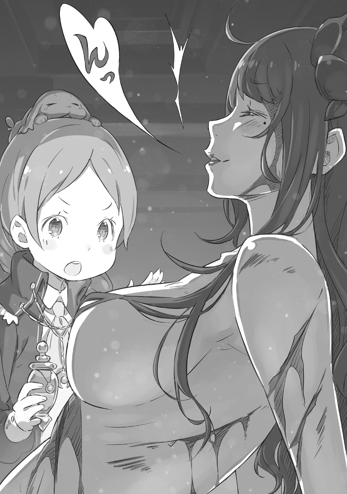

Вместе с чувством тяжести распространялась опасная аура, трущобы столкнулись с ситуацией молчаливого напряжения.

«……»

В угрожающей атмосфере бежали столичные стражники с мечом в руке.

Когда они бежали, облачённые в металлические доспехи, в окрестностях раздавался металлический скрежет креплений стальной брони. Одно дело, если бы это был один человек, но, когда их было десять или двадцать, шум стоял страшный. Жители трущоб, у которых и так не было хорошего впечатления о стражниках, теперь встретили их откровенно недоброжелательно.

С другой стороны, стража тоже не испытывала особой доброжелательности к несговорчивым жителям трущоб. Им было очень трудно иметь дело с враждебными, грязными жителями. Но обстоятельства не позволяли им задавать вопросы, применяя грубую силу, или заставить их уйти.

Поэтому вполне естественно, что между стражниками и жителями существовала пропасть, препятствующая полезному сотрудничеству. Этого разрыва было достаточно, чтобы во время недавнего крупного инцидента они не смогли работать вместе над его разрешением. И от этого не выиграли ни стражники, ни жители, а только те, кто нёс ответственность за инцидент.

???: ……Воняяет.

Толкнув старую дверь, наружу хлынул затхлый запах гниющего дерева.

Скривив лицо от вони, силуэт, зажав нос, медленно пробирался в здание. Была уже ночь, но в этих развалинах, ставших домом для крыс, не горел свет. В кромешной тьме, полагаясь на свет звёзд, проникающий сквозь пустые оконные рамы, тень пробиралась всё дальше и дальше внутрь, двигаясь вперёд без страха.

Это была маленькая тень. Тряся густыми голубыми волосами, заплетёнными в косу, то влево, то вправо, шум её беззаботных шагов был ужасно лёгким. Действительно, тот, кто издавал этот звук, был лёгок, как ребёнок.

…Нет, не как ребёнок. Это и был ребёнок. Девочка лет двенадцати-тринадцати.

«Эээй, ты здееесь?» — воскликнула девочка, оглядывая разрушенную комнату. Несмотря на то, что она называлась комнатой, в стене было более, чем несколько дыр. Осмотр всего этого помещения не занял много времени.

Конечно, она быстро нашла то, что искала. Однако не глазами, а носом.

???: Фуу. Тут пахнет не только старым домом, но ещё и кровью, не тааак ли?

Как только она подошла к самой дальней комнате, девушка скорчила гримасу, когда запах крови проник в её ноздри. Затем, когда она толкнула дверь, тошнотворная вонь быстро усилилась.

И в центре этого красного зловония она обнаружила покрытую кровью человеческую фигуру, рухнувшую на пол…

???: …Тебе действительно нужно перестать спать в таких грязных местах, как ээто.

???: …Мне немного обидно, что ты так поражена этим.

???: Конечно, меня это поражаает. В конце концов, снаружи поолный переполох. Похоже, что все бегают и ищут тебя, понимааешь?

На слова маленькой девочки, пожавшей плечами, труп на полу — нет, спавшая тень, коротко ответила «ясно» и встала со своего места. Это была черноглазая, черноволосая очаровательная красавица, полностью покрытая кровью.

Красавица обратила изящную кровавого цвета улыбку к девочке и произнесла: «Что важнее, Мейли, послушай. У меня была чудесная встреча».

Мейли: Да, да, я послушаю твою истоорию. Но прежде нам нужно привести тебя в поряядок, Эльза.

И назвав друг друга по имени, Эльза и Мейли, тёмные сестры, завершили своё свидание.

Руины, в которых пряталась Эльза, были одним из убежищ, подготовленных в столице. Мейли — это одно дело, но Эльза действительно была не в том положении, чтобы останавливаться в гостинице. Если сказать, что бумаги с её именем и описанием были распространены постом стражи, то можно понять причину.

Как бы то ни было, убежище в результате оказалось доступным. Несколько таких убежищ было подготовлено в близлежащих городах и деревнях, они были очень ценны своим местоположением. Однако…

Мейли: Ну, мы больше не сможем использовать это место. Запах крови очень сильный, и, хотя сейчас слишком темно, чтобы увидеть это, я уверена, что кровь здесь повсююду.

Эльза: О Боже. Это звучит почти так, словно ты говоришь, что я использовала её не рационально.

Мейли: А как ещё это должно звучаать? Это же Эльза, в конце концов, так что, это ты танцевала здесь вся в ранах, верно? Несомненно, кровь летела отовсюду.

Эльза: Ты говоришь, как ребёнок, который пришёл посмотреть, как обстоят дела… Ну, я не буду этого отрицать.

Мейли вздохнула, услышав весёлые, хихикающие слова Эльзы. Затем девочка мягко протянула руку между пышными холмами-близнецами обнажённого тела Эльзы. Там была вырезана длинная, вертикальная, болезненного вида рана, которая даже сейчас всё ещё быстро кровоточила.

Мейли: ……Похоже, это боольно.

Эльза: Да, это больно. Но разве это не замечательно?

Мейли: Не думай, что я соглашусь с таким извращённым мнеением. Но, независимо от того, прекрасно это или нет, я соглашусь, что это страанно. Твоё «благословение» не работает?

Эльза: Возможно, «это» такой вид ранения. Я не смогла заставить его использовать «Меч Дракона», так что это должна быть обычная рана, но… Похоже, этот парень действительно обладает такой силой.

Кровотечение действительно остановилось, но не было никаких признаков того, что рана закрывается. Для естественной способности к заживлению это был обычный результат, но обе девушки понимали, что благословление здесь не действует.

Препятствием к этому была сила того, кто нанёс Эльзе эту рану.

Мейли: Итак? Ты сражалась со Свяятым Меча? Эльза: Да, точно. Он был таким же, как в слухах… Нет, даже лучше.

Мейли: Ничего себе, праавда? А внутренности его живота также были лучше, чем в слухах?

Эльза: Ну, мне тоже интересно. В конце концов, я ничего не смогла с ним сделать. А-ха-ха.

Почему она улыбается после одностороннего поражения, Мейли не могла понять. Однако это было не всё, чего Мейли не могла понять.

Мейли: ……Есть кто-то, кого даже Эльза не может победиить.

Долгий вздох Мейли подтвердил неожиданность этого факта.

Мейли: Так или иначе, поскольку Эльза могла убить всех до этого момента, я была уверена, что ты сможешь убить кого угодно, кроме “Маамы”…

Эльза: Ты переоценила меня. Даже я проигрывала, не так ли? Это было несколько лет назад, но, в конце концов, я так же проиграла мальчику в кимоно из Империи Волакия.

Мейли: Этот парень был просто сопровождающим; ты отлично устранила цель… Кроме того, я изучила этот инцидент, и, похоже, он самый сильный человек в империи, ты знааешь.

Эльза: О Боже. В таком случае я проиграла и сильнейшему в королевстве и в империи. Чудесно, как чудесно.

Эльза испустила тёплый вздох, а её щеки покраснели. Закатив глаза от реакции Эльзы, Мейли достала из-под одежды маленькую бутылочку и начала наносить белую слизь в ней на раны Эльзы.

Слабый, раздражающий запах наполнил воздух, и Эльза слегка зарычала в глубине горла, когда её раны были покрыты слизью.

Эльза: Что это?

Мейли: Это слизь от водяного слизняка. Если ты заполнишь ей рану, она заживёт очень быыстро. Даже небольшое количество ядовито, но ты всё равно не умрёшь по-настояяящему.

Эльза: Совершенно верно. Пожалуйста, продолжай. Как закончим, нам нужно будет оставить это место позади, так?

Мейли: Было бы проблематично, если бы стражники нашлии нас. А если ты их убьёшь, у нас будет ещё больше проблеем.

Эльза: О, но в таком случае, не более ли вероятно, что Святой Меча появится вновь?

Мейли: Ну, тогда я тем более проотив.

Упрекая Эльзу в потворстве своим желаниям, Мейли отметила: «Всё сделано». Закончив наносить слизь, она спрятала бутылку обратно в свою одежду и подняла с пола рваные лохмотья Эльзы.

Мейли: Ты не сможешь носить это боольше.

Эльза: В конце концов, теперь это просто кусочки ткани. Я, конечно, не возражаю против этого…

Мейли: Если ты просто собираешься надеть эти лохмотья, я действительно не хочу, чтобы меня видели гуляющей с тобоой.

Эльза: Как холодно.

Мейли: Если ты не хочешь, чтобы тебе это говорили, то хотя бы оденься, пожааалуйста.

Между ними была разница в десять лет, но по их взаимодействию невозможно было определить, кто из них старше. Приняв точку зрения Мейли, обнажённая Эльза задумалась. И затем…

Эльза: Подожди здесь немного.

Мейли: …?

Сказав это, Эльза, всё ещё полностью раздетая, быстро вышла из комнаты. Мейли посмотрела ей вслед, а затем решила немного прибраться в комнате, пока ждала свою подругу.

Это было, хотя бы в теории, убежище. У Эльзы, возможно, была отложена сменная одежда. Пять минут спустя надежды Мейли рухнули.

…Вдалеке послышалось несколько ужасных криков, и она выбежала из укрытия.

???: Есть опасения, что в этом районе скрывается опасный человек, поэтому, пожалуйста, будьте настороже. Если вы беспокоитесь, я могу проводить вас до вашего дома…

Эльза: Нет, всё в порядке. Спасибо за всё, что вы сделали. Вы очень добры.

???: Ах, это. Это ничего… Эм… пожалуйста, будьте осторожны.

Молодой стражник оторвал взгляд от улыбки Эльзы и покорно поклонился. Он застонал где-то в глубине своего горла. Причиной этому было очарование, исходящее от всего тела Эльзы. Она всегда была окутана соблазнительным воздухом, но сейчас это было особенно заметно.

К счастью для стражника, он не понял, что она была под «кайфом» от запаха крови. Если бы он понял и указал на это, он тоже стал бы частью её «кайфа».

Провожаемая этим удачливым стражником, Эльза постепенно вышла на главную дорогу.

Мейли: …Ты слишком легкомыыысленна. Даже несмотря на то, что ты была так близка к тому, чтобы тебя окружиили.

Мейли, сидевшая рядом с Эльзой и державшая её за руку, проговорила свои мысли вслух и надула щёки. Эльза слабо улыбнулась и легонько ткнула пальцем в эти надутые щёки.

Эльза: Тебе не нужно мне это говорить. Единственная причина, по которой меня не допрашивали, была ты. Ты мне очень помогла.

“Правильно, ты должна быть благодаарна“ — гордо ответила Мейли после того, как её ткнули в щёки.

Ускользнуть от стражников, которые услышали шум и собрались в укрытии, было, в конце концов, результатом хитрости Мейли. Она заставила Эльзу одеться, привела себя в порядок, притворилась её сестрой и предприняла меры, чтобы ускользнуть от подозрительных взглядов стражи.

Очевидно, просто переодеться и вести себя как сёстры было бы недостаточно, чтобы избежать подозрений, но…

Эльза: С моими волосами и глазами, так сильно отличающимися от описания, в конце концов, у них не было возможности заподозрить меня.

Мейли: Почти любаая часть тела зверодемона может быть полезной, если знать, как с ней обращааться. Их можно взять только у живого зверодемона, так что, вероятно, это невозможно ни для кого, кроме меняя.

Когда Мейли гордо протрубила в свой собственный рожок, её волосы изменили цвет с голубого на каштановый. То же самое изменение произошло и с волосами Эльзы, не оставив на ней ничего общего с женщиной в документах стражников. Оставалось только ожидать, когда стражник будет одурманен соблазнительностью Эльзы и позволит ей пройти.

Между тем, сейчас на Эльзе была испачканная мужская одежда. Она была немного великовата, но, надетое на её длинные, стройные конечности, оно казалось, и так хорошо сидело.

Мейли: Проблема в том, как ты заполучила эту одеежду. Ты вызвала ещё одну суматооху?

Эльза: Я подумала, что если я буду ходить обнажённой по улице, то кто-нибудь появится сам по себе… Очень жаль, что их было больше, чем я ожидала. Все они оказались джентльменами низкого качества.

Мейли: Ты говоришь об их одеежде или, возможно, об их животаах?

Естественно, все мужчины, которых собрала Эльза, лежали в лужах крови. Ей было относительно трудно найти одежду, которая не была бы испачкана кровью. Если бы вся одежда была непригодна для использования, это разрушило бы весь план.

Эльза: Итак, что ты собираешься делать теперь? Переехать в другое убежище?

Мейли: Объявления о розыске распространяются, так что лучше на некоторое вреемя покинуть столицу. Ну, по крайней мере, пока ситуация не поутихнет, было бы лучше залечь на дно; думай об этом, как о наказании за то, что перешла чертуу.

Эльза: Залечь на дно… Тратить время на то, чтобы ничего не делать, действительно больно.

Мейли: Это наказаание. Конечно, оно болезненноее.

Они были вместе достаточно долго для этого. Она сразу поняла, как мучить Эльзу. Увидев, что Эльза выглядит несчастной, как и ожидалось, Мейли изобразила радостное удовлетворение, но эта радость длилась недолго.

“Отправляйтесь в район простолюдинов и заберите её багаж из гостиницы, в которой останавливалась Мейли. Затем сбегите из столицы”… Таков был план, но всё пошло не так, как ожидалось.

Мейли: О, пока никого нет, надо позвать Теневого Льва и покатааться.

Эльза: Ничего не поделаешь. У нас есть приказы от «этого человека». Похоже, они знают, что я потерпела неудачу. Хотя я не уверена, откуда они наблюдали.

Сказав это, Эльза помахала конвертом, зажатым между пальцами, взад-вперёд. Конверт был смешан с багажом, за которым они отправились в гостиницу. Внутри был единственный листок бумаги с инструкциями, и они обе вздохнули, увидев содержимое, адресованное Мейли. Эльза и Мейли не могли воспротивиться приказам, содержащимся в этих инструкциях. Обе девушки были обучены таким образом.

И в соответствии с содержанием инструкций…

Мейли: …Следующей целью, похоже, будет особняяяк маркграфа.

Эльза: Я понимаю. Моё имя включено в список?

Мейли: Только моёё. На этот раз Эльза получает передышку. Тебе следует спокойно отдохнууть.

Закончив читать инструкции, Мейли сложила их, и бумага внезапно начала стираться в пыль. Увидев, что её унесло ветром, Мейли ткнула в Эльзу пальцем.

Мейли: Ты понимаешь, Эльза? Ты должна быть хорошей девочкой и ждать меня, хорошоо?

Эльза: Я понимаю. Я буду тихонько что-нибудь вязать. Что бы ты хотела?

Мейли: То, что сейчас больше всего у Эльзы на умее.

Эльза: Хорошо, тогда я сделаю куклу Святого Меча и буду ждать тебя.

Мейли: Я думаю, что буду немного колебаться, ставить ли его в один ряд с другими куклааами.

Эльза напевала себе под нос, планируя начать вязать куклу. Глядя на Эльзу, плечи Мейли поникли, и она устало вздохнула, что, казалось, не соответствовало её внешности. Эльза увидела это и наклонила голову в сторону Мейли.

Эльза: Мне пойти с тобой? Всё-таки я как твоя старшая сестра.

Мейли: Неет, спасибо. Я бы не вынесла, если бы оказалась воспринята младшей сестрой такой разгильдяяйки, как ты.

Эльза: О Боже, это совсем не мило.

На дерзкий ответ Мейли Эльза тоже многозначительно улыбнулась. Непродуктивный разговор между ними продолжался до тех пор, пока они не разошлись в разные стороны за пределами столицы… Единственным свидетелем всей истории опасных сестёр была луна, плывущая в ночном небе.

《Конец》
