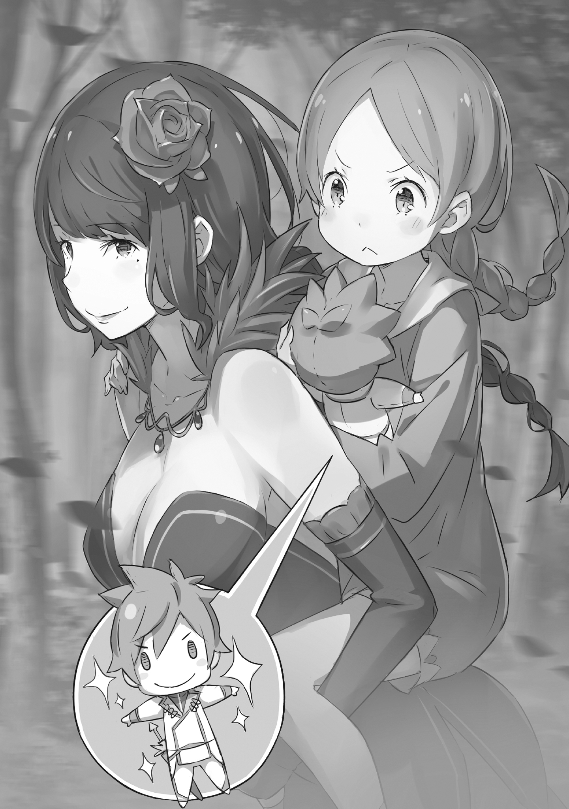

???: Охохох…

Это был смех, который окутывал тёмную, соблазнительную атмосферу.

Голос был затуманен удовольствием и дрожал от возбуждения, которое она не могла скрыть. Это чувство сквозило не только в голосе, но и в её пружинистом шаге.

Она была красивой молодой женщиной с длинными чёрными волосами. Её волосы были заплетены в косу, а фиолетовое украшение для волос каким-то образом довершало впечатление опасности. Чёрная одежда, которую она носила, обнажала линии её чувственного тела, даже просто её существование обладало дьявольским очарованием, окутанное густой соблазнительностью.

Она была кубком со смертельным ядом, к которому нельзя было не протянуть руку, даже зная о болезненных последствиях. Такова была истинная природа этой соблазнительной красоты, и она представляла собой опасность, несравнимую ни с одним мужчиной, но…

???: Пожалуйста, можешь прекратить этот противный смех? Ты хочешь меня разозлиить?

…это совершенно не подействовало на девочку, давно привыкшую видеть красавицу, а теперь посылающую ей неодобрительный взгляд.

Девочка была ещё молода, лет одиннадцати-двенадцати. Как и у красавицы, её волосы были заплетены в косу, и наряду с прекрасной внешностью, соответствующей её возрасту, в ней также было немного очарования.

Её звали Мейли Портрут, и, хотя она всё ещё была далека от того, чтобы быть неотразимо очаровательной, она была красивой девушкой, которая заставляла задуматься о её будущем потенциале очаровывать мужчин.

Однако это была надежда, которую можно увидеть, заглянув на несколько лет в будущее, но сейчас в её облике не было и намёка на это, когда она неодобрительно надула щёки. Красавица, идущая рядом с Мейли, казалось, чувствовала то же самое.

???: Даже если ты задержишь дыхание, чтобы попытаться напугать меня, я нисколько не испугаюсь.

Мейли: В том-то и дело. Несмотря на то, что ты девушка, Эльза, ты слишком раадостна. Как ты можешь вот так ходить в темноте с таким спокойным лицом, я не понимааю. Это просто неправдоподообно.

Эльза: С другой стороны, у тебя, я полагаю, слишком мало выносливости для человека твоего возраста. Это результат того, что ты постоянно зависишь от своих питомцев, понимаешь? Небольшая прогулка пойдёт тебе на пользу.

Говоря с лицом, лишённым злобы, и пожимая плечами, красавица, Эльза, предложила это Мейли. С усталым выражением, проступившим на её юном лице, она ответила: «Почему ты кажешься такой весёлой в последнее вреемя?».

Эльза: До этого ты приходила мне на помощь, не так ли, Мейли? Меня просто забавляет, что на этот раз наши позиции полностью поменялись местами. Не расстраивайся.

Мейли: Хмф! У тебя действительно ужасный характер, Эльзаа!

Эльза: Это действительно очень неожиданное мнение.

Когда Мейли громко раскритиковала её, Эльза склонила голову, словно озадаченная. Обменявшись таким колким разговором, они вдвоём двинулись по крутой горной тропинке. В конце концов, в настоящее время они пересекали горы, чтобы совершить побег.

Причина, по которой Эльза и Мейли сбегали, тем более глубокой ночью, была проста. После того, как работа провалилась, они убегали от враждебных преследователей с сорванной вечеринки.

Из-за этого они вдвоём пробирались по звериной тропе, в одежде, которая не подходила для пеших прогулок.

Мейли: Интересно, почему ты выглядишь так, будто хорошо проводишь вреемя?

Было трудно разглядеть её в тусклом свете, так как Мейли переводила дыхание, положив руки на колени. Услышав укоризненный голос девочки, Эльза со спокойным выражением лица приложила палец к губам.

И, увидев отражение Мейли в глазах, достаточно тёмных, чтобы можно было подумать о кромешной тьме, она очаровательно улыбнулась.

Эльза: Я же сказала, не так ли? Просто забавно, что мы находимся в совершенно противоположном положении, в котором были в тот раз. Кроме того, после стольких лет я снова смогла побыть тебе старшей сестрой, так что, возможно, я была немного рада и этому тоже.

Мейли: Даже если бы ты не пришла, Эльза, я смогла бы позаботиться об этом самааа…

Эльза: Ты могла бы сама пересечь эти крутые горы? Или, может быть, у тебя были какие-то другие способы побега? Если так, то извини, что побеспокоила тебя.

Мейли: Хмф…

Несмотря на то, что они говорили с сарказмом, Мейли нахмурилась без особой злобы. То, что она была спасена действиями Эльзы, раздражало, но, тем не менее, было фактом.

На этот раз задание, данное Мейли, состояло в том, чтобы навести хаос в особняке некоего дворянина. Не вдаваясь в подробности, Мейли сделала всё возможное, используя те навыки, которыми обладала… По правде говоря, немного поиграться во время работы было её дурной привычкой, и на этот раз она тоже немного поиграла. То, что роль, которую она играла, была связана с провалом работы, она не могла отрицать.

Мейли: Похоже, что собачки тоже умерли из-за этого; всё это было действительно неудаачно.

Эльза: Мейли?

Мейли: Я устааала. Перерыв, давай сделаем перерыыв.

Лениво накручивая волосы на палец, Мейли села на ближайшее поваленное дерево. Не ругая её за вялое состояние, Эльза встала возле упавшего дерева и присоединилась к ней, чтобы отдохнуть.

Мейли: Похоже, что все собачки сгорели. Эта магия… Ты тоже его виидела?

Эльза: Да, хотя всего лишь мельком. Я слышала о нём. Сильнейший маг в королевстве, эксцентричный человек, который овладел всеми видами магии.

Мейли: Для кого-то настолько великого, он довольно страанный, хмм.

Сказав это, Мейли согласилась с этим мнением. Она видела его лишь мимолётное мгновение, но этот маг летел по небу и швырял огненные шары в лес, словно дождь. Против этого у зверодемонов не было ни единого шанса.

Мейли: Так что? Разве этот странный парень не соответствует твоим вкусам? У тебя слабость к сильным людям, Эльза, не таак ли?

Эльза: О боже, это звучит так, будто я легкомысленный человек. Моё хобби — просто красивые кишки. Только так получилось, что они чаще встречаются среди сильных людей.

Мейли: Да-да, конеечно.

Даже указав на это, не было похоже, будто для Мейли это имело значение.

Эльза: К сожалению, пользователи магии на самом деле не трогают мои сердечные струны. Должно быть, их тренировки действительно отличаются от воинов. По моему нынешнему опыту вскрывать живот пользователя магии просто не так интересно.

Мейли: Хммм. Но я бы хотела, чтобы ты когда-нибудь отплатиила этому чудаку за это. Если этого не произойдёт, то я буду чувствовать себя слишком плохо из-за всех собачек, которые погиибли.

Эльза: Все зверодемоны были теми, кого ты подобрала во время этой миссии, не так ли? Они успели тебе понравиться?

Мейли: Нет, не все. Я просто хотела сказаать это.

Мейли говорила это, потому что сказать было больше нечего, и, когда она кивнула, выражение лица Эльзы показало, что та поняла.

Эльза: Так что, оставить всех своих друзей было просто забавой?

Мейли: Временами мне просто хочется притвориться обычной деевочкой. Как ты думаешь? Я выгляжу обыычной?

Слегка коснувшись своих волос, она взялась за юбку своего наряда. В отличие от её обычного наряда, этот создавал впечатление чего-то более близкого к одежде деревенского ребёнка, просто и без намёка на украшения.

Она сама очень гордилась своей работой, но Эльза ответила на вопрос равнодушным «Хм, да».

Эльза: Наряд, который ты всегда носишь, симпатичнее, не так ли?

Мейли: Я не спрашивала, мило это или нет, разве не таак? Мне подходит этот образ или неет?

Эльза: То же самое и с твоими волосами; я думаю, что твой естественный цвет выглядит лучше, чем, когда они окрашены.

Мейли: Эльза, ты действительно не из тех, кто слушает, когда кто-то говорит, не таак ли?

На неуместную критику Эльзы Мейли угрюмо вздохнула. Обмен репликами между ними выглядел так, будто их разница в возрасте полностью поменялась местами, но для них двоих это было обычным делом.

Дело не в том, что они были лучшими друзьями, и не в том, что они понимали природу друг друга. Несмотря на это, у них было нечто, что можно было бы назвать доверием. Это были своего рода псевдо-сестринские отношения.

Эльза: Кстати говоря, когда мы говорили о сильных и слабых, я кое-что вспомнила.

Мейли: Чтоо же?

Эльза: Ты помнишь, мы говорили об этом в столице, верно? Пока я ждала, то кое-что связала.

Сказав это, Эльза бросила что-то в её сторону. Рефлекторно поймав предмет, Мейли обнаружила, что это хлопок, завёрнутый в мягкую ткань, плюшевая кукла ручной работы Эльзы. Безупречно воспроизводя знакомую фигуру, с рыжими волосами и белой кожей, с мечом на поясе, Мейли, как всегда, была впечатлена мастерством Эльзы.

Мейли: Ужее? Могу я задать вопрос, неужеели это…?

Эльза: Это «Святой Меча». Я сама думаю, что он довольно хорошо сделан. Это благодаря тому, что я вижу, как он горит в моих глазах.

Мейли: И это несмотря на то, что тебя чуть не убили; Эльза, ты действительно странная деевушка.

В сложившихся обстоятельствах Мейли могла только фыркнуть и прижать куклу к груди. После этого она немного пошевелила ногами, пока Эльза внезапно не повернулась спиной к Мейли.

Всё ещё стоя к ней спиной, Эльза присела на корточки и быстро отметила: «Ну, а сейчас…».

Мейли: …Что такоое?

Эльза: Твои ноги слишком устали, чтобы ходить, верно? Тебе не нужно скрывать это или пытаться вытерпеть. У тебя, должно быть, просто была плохая обувь. Нам нужно перебраться через гору, пока не стало ещё хуже.

Мейли тихо застонала от пульсирующей боли в ногах.

Эльза: Что?

Мейли: Просто делать в точности то, что говорит Эльза, не так уж и веесело.

Резко отведя взгляд, Мейли с угрюмым видом вывалила своё недовольство на спину Эльзы. По правде говоря, тот факт, что Эльза вообще была здесь, стал источником недовольства для Мейли.

После предыдущей работы Эльзу следовало отправить в убежище для восстановления сил. Не из доброты, а из презрения она пришла сюда, чтобы помочь Мейли.

Тот факт, что она предвидела мою неудачу и прибежала, чтобы помочь мне сбежать, было тем, что подтверждало это.

Мейли: Это слишком тщеславно, Эльза, даже для тебяя.

Эльза: Может быть, ты уже перестанешь говорить, как маленький ребёнок, и мы продолжим?

Мейли: Хмф.

Эльза: Остаться в горах и быть искусанной насекомыми тоже не очень весело, согласна? Но если ты можешь контролировать даже жуков, это совсем другое дело.

Мейли: Хорошоо.

Ругаясь, они бы ничего не добились, так что Мейли решила быть серьёзной в этом вопросе. Слезая с поваленного дерева, на этот раз она забралась Эльзе на спину. Держа Мейли за ноги, Эльза снова встала.

Мейли: Я надеюсь, ты понесёшь меня нежнее, чем мой теневой львёнок, который катает меня очень грубо, хорошоо?

Эльза: Конечно. Я обязательно сделаю всё, что в моих силах.

Отреагировав таким образом, Эльза бросилась бежать. Ускоряясь так, как будто пыталась обогнать ветер.

Мейли: Слишком быстро, слишком быстро, слишком быстро, я сказаала! Прекрати это, Эльзаа!

Только пронзительный крик Мейли на некоторое время задержался в темноте ночи.

Мейли: Эльза, остановись…

Когда Мейли прошептала это Эльзе, прошло более десяти минут с тех пор, как она начала бежать.

До сих пор она кричала ей, чтобы та остановилась, бесчисленное количество раз, но Эльза, которая до сих пор ни разу не показывала и намёка на замедление, остановилась… Скорее всего, это было связано с эмоциями, вложенными в голос.

По правде говоря, этот сигнал не был шуткой. Это была необходимая остановка. Доказательством было…

Эльза: Похоже, они действительно окружают нас со всех сторон.

Остановившись, Эльза прошептала это в ответ на враждебность, обрушившуюся на них со всех сторон. Словно в подтверждение этих слов, из кустов донёсся звук, как будто на что-то наступили, и они задрожали.

И то, что показалось из кустов, было чернотелым, красноглазым, четвероногим зверем…

Мейли: Может, это выжившая собаачка?

Глядя поверх спины Эльзы, глаза Мейли округлились, когда она увидела зверя. Яростно рычащий чёрный зверодемон был таким же, как и те, кого она наняла полдня назад, и которых, как думала, уничтожили. Один из другой стаи, или, может быть, выживший, которого не выследили, и он сбежал глубоко в горы.

……

Вольгармы не закончились на нём одном; другие точки света, смешанные с тенями, пристально следили за ними обеими. Их число было не так уж велико, но, если они были выжившими, это всё упрощало.

Эльза: Может быть, мы прикончим их?

Мейли: Не говори такие нецивилизованные веещи. Если я здесь, они не станут атаковаать. Не беспокойся об этом, просто дай мне поговорить с ниими.

Стукнув Эльзу по затылку за враждебность, она подтолкнула её подойти поближе к вольгарму. Эльза послушно выполнила приказ, идя прямо к настороженному зверю.

Вольгарм показал себя, но он не мог определить, как вести себя по отношению к Мейли. Благословение, которым обладала Мейли, «Пользователь Зверодемонов», заставило зверодемона повиноваться ей. Для них присутствие Мейли, как и рог у них на лбу, вызывало инстинкт, которому трудно было не подчиниться.

Мейли: На этот раз нам с вами не повезло. Но, даже если вы сейчас вернётесь на свою территорию, этот страшный пользователь магии просто выследит всех ваас. Так что было бы разумнее спрятаться в гораах.

……

Мейли: Как только численность стаи восстановится, вы сможете забрать свою территорию у других животных. Иногда важно просто спокойно вытерпеть всё, понимаешь? Эльза, ты ведь тоже это осознаёшь, праавильно?

Эльза: Не смешно слышать, как тебе читают лекцию вместе со зверодемонами.

От угрюмого тона Эльзы бравада Мейли немного поубавилась. Затем зверодемон, который молча слушал слова Мейли, повернулся и исчез обратно в кустах.

Остальная часть стаи также расступилась, и зверодемоны снова растворились в ночи.

Эльза: Ты ведь не сказала им, чтобы они отомстили, не так ли? Хотя, прикажи ты им это, то вся стая сражалась бы, пока их не уничтожат.

Зверодемон, у которого сломан рог, подчинится тому, кто его сломал, и выполнит любой его приказ. Мейли могла делать, по сути, то же самое, не ломая рога. Следовательно, именно так, как сказала Эльза, она могла бы приказать вольгармам завершить работу, в которой она потерпела неудачу, даже зная, что это верная смерть.

Однако…

Мейли: Если бы я это сделала, то стала чувствовать себя виноваатой. Я провалила задание, так что это мне расплачиваться за него должным ообразом.

Эльза: Это правда. Я тоже должна отомстить «Святому Меча», иначе я никогда не буду чувствовать себя в порядке из-за этого.

Мейли: Кстати, мне не очень нравится, когда ты сравниваешь меня с собой.

Наблюдая, как зверодемоны исчезают обратно в горах, Мейли произнесла: «Ну вот», — и легонько похлопала Эльзу по спине.

Между передышками и столкновениями с зверодемонами, было слишком много остановок при пересечении гор.

Мейли: Теперь я действительно хочу найти место, где я смогу нормально отдохнуть, как моожно скорее. Мои ноги очень болят от того, что ботинки натирают иих.

Эльза: Вотри в них немного слюны, и они будут в порядке, я думаю. Может быть, ты хочешь, чтобы я их лизнула?

Мейли: Я — не ты, Эльза, так что им не станет лучше так проосто!

Повысив голос на абсурдное сочувствие Эльзы, она была поражена от всего сердца ненадёжностью своей сестры. На этот раз ей посчастливилось помочь, но, если так будет продолжаться и дальше, в следующий раз настанет её очередь снова помогать старшей сестре.

Если это произойдёт, она решила, что в следующий раз попросит плюшевую куклу вольгарма.

…Прижимая к груди куклу, которую подарила ей сестра, Мейли решила это в глубине души.

……

Эльза, снова бегущая по горным тропинкам, приняла решимость своей младшей сестры со слабой улыбкой.

Даже если кто-то и подумает, что местами было немного грубо и извращённо, то в этом и заключается индивидуальность их сестринских отношений. Взаимно неудобная, слегка безумная сестринская любовь, которая пахла кровью, между сёстрами-убийцами.

《Конец》
