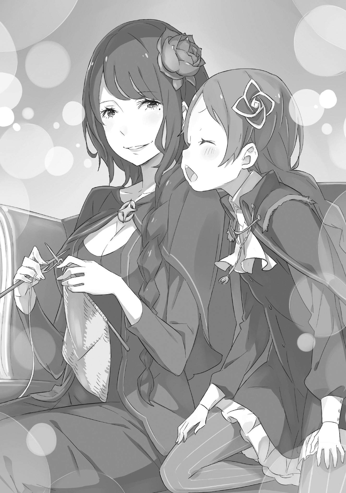

Английский перевод: Eminent Translations

Перевод и редактура: Gradient

— Впервые я увидела её посреди ужасного, пропитанного кровью зрелища.

Молча, дитя одиноко сидело на земле посреди луга, превратившегося в море крови. Её круглые глаза были широко раскрыты, а редкие тёмно-синие волосы уже заметно отросли. Кожа, с лёгким румянцем, характерным для маленьких детей, была перепачкана грязью и сажей, а нагое тело прикрывали жалкие, грязные лохмотья.

Одного взгляда на дитя — облачённое лишь в клочок ткани, измазанный грязью и испражнениями — хватало, чтобы понять: она росла не в нормальных условиях. Но вся жуть происходящего бросалась в глаза ещё сильнее…

— Ведь всё вокруг этого дитя сейчас было густо залито тёмной кровью.

К счастью, ни капли этой крови не вытекло из тела самого дитя.

Виной всему были куски плоти, разбросанные повсюду на залитом кровью лугу.

— Эта область была известна как «Демонический Край», место обитания бесчисленных стай зверодемонов.

Зверодемоны — это враги человечества, существа жатвы и разрушения, чья основная цель на уровне инстинктов — убийство других живых существ. Их опасность несравнима с обычными дикими зверями, среди них есть даже те, что владеют магией. В отличие от зверей, их нельзя приручить, и с ними невозможно найти общий язык.

Поэтому Зверодемоны — враги человечества, а области, где они собираются в стаи и устраивают свои логова, становятся известны как «Демонические Края», куда людям путь заказан.

Эта область тоже стала «Демоническим Краем» несколько лет назад, когда местные жители покинули её. В лесу обитает множество зверодемонов, и считается, что для слабого войти туда — верная смерть… Поэтому то, что вокруг ребёнка разбросаны истерзанные трупы, не было чем-то странным, скорее, в порядке вещей для этих мест.

Странно было то, что все эти разбросанные останки принадлежали не людям, а зверодемонам.

— И всё это — дело рук одного-единственного ребёнка.

— Какой радушный приём, даже больше, чем я ожидала. Вообще-то, я не собиралась причинять тебе вреда, но…

Фигура, стоявшая посреди луга, усеянного трупами зверодемонов, обернулась к ребёнку.

Это была высокая, бледнокожая девушка с длинными черными волосами, заплетенными в косу. На вид ей было около пятнадцати, изгибы её тела только начинали обретать женственность, и она была окутана порочным очарованием, свойственным лишь незрелому возрасту.

Один взгляд её глубоких чёрных глаз заставил бы многих мужчин невольно сглотнуть.

Её красота и соблазнительные манеры были таковы, что, если бы не окровавленные клинки кукри в её руках, какой-нибудь мужчина легко мог бы принять её за первоклассную куртизанку и наброситься на неё.

Однако сама черноволосая девушка, похоже, не придавала особого значения своей красоте, что было верно и для ребёнка, стоявшего перед ней.

Покрытая кровью дитя продолжала злобно смотреть на девушку, которая и обагрила её самой «жизнью» зверодемонов.

Во взгляде дитя не было и намёка на благодарность за спасение от стаи зверодемонов. И неудивительно, ведь для дитя зверодемоны не были врагами. Семьёй… хотя и семьёй они точно не были.

По крайней мере, к ним она испытывала чувства, несравнимые с теми, что вызывала стоящая перед ней девушка. Поэтому во взгляде дитя не было дружелюбия, а в ненависти таилась сильная жажда убийства.

Слишком жестокие чувства для ребёнка, слишком свирепый блеск глаз — всё это было доказательством того, сколько горя оно успело хлебнуть за свою короткую жизнь.

Многие бы пожалели её за такую ужасную жизнь. Но выражение лица девушки нисколько не менялось. Ни капли милосердия, ни тени сочувствия в её душе.

Обе, дитя и девушка, стояли глаза в глаза, игнорируя обстоятельства, определившие их первую встречу.

— Ты злишься, что я разорила твоё логово? Если будешь так себя вести, то и вправду будешь неотличима от зверодемона, как я и слышала. Та самая Королева, что по слухам повелевает зверодемонами… хотя скорее Принцесса, чем Королева.

— Гр-р-р-р!

— Если ты не можешь говорить, то, вероятно, не понимаешь, что я говорю. К твоему несчастью, мне приказано забрать тебя. Поэтому, даже если ты против, я заберу тебя живой. Если не будешь сопротивляться, обойдётся малой кровью.

— У-у-у! У-у-у-у!

— Значит, ты не понимаешь. Ну что ж, покажи мне, как ты собираешься сопротивляться.

Девушка слегка улыбнулась и склонила голову набок, глядя на дитя, кричащее, словно в истерике. Косичка медленно соскользнула с её утончённого плеча, и, словно по этому сигналу, дитя громко хлопнуло в ладоши.

В тот же миг, будто только и ждав этого сигнала, на луг выпрыгнула гигантская тень.

Скрученные рога, львиная морда, гигантское тело, покрытое густой чёрной шерстью, вцепившееся когтями зверя в землю — это был Гилтилоу, несравненно свирепый зверодемон, именуемый Чёрным Королём Леса.

— …!

Оглушительный рёв; дыхание, подобное взрывной волне, ударило девушку спереди, неся тяжёлый звериный запах. Она широко раскрыла глаза, поражённая появлением зверодемона и его подавляющей аурой, а затем возбужденно облизнула губы.

— Какой большой у тебя друг, оказывается. Прекрасно, просто прекрасно!

Несмотря на смертельную опасность прямо перед ней, девушка и бровью не повела.

Видимо, это сильно разозлило Гилтилоу. Он замахнулся когтистой лапой и нанёс разящий удар, намереваясь одним махом прикончить её. Коготь, несущийся с яростью бури, был так остр, что мог разрезать сталь, и в следующий миг девушка была разорвана в клочья — или, по крайней мере, должна была быть.

— Это нехорошо. С девушками нужно быть нежнее.

— …!

Девушка грациозно улыбнулась, когда передняя правая лапа чудовища отлетела со свистом рассекаемой плоти. В наказание за свою самонадеянность лишившись правой лапы, зверь мгновенно осознал, что перед ним добыча, которую нельзя недооценивать, склонившись к девушке, зверодемон приготовился атаковать со всей силы. В ответ на это девушка изящно отпрыгнула назад и приготовила окровавленный кукри.

— Тело, несравнимое по размеру с человеческим… Интересно, что же таится внутри него?

В лесу, где обитают ужасающие зверодемоны, появилась Королева Зверодемонов.

Этот слух появился несколько месяцев назад, его пустил торговец, едва унёсший ноги из леса. Заблудившись и спасаясь от дождя, мужчина вошёл в лес, где подвергся нападению зверодемонов, и уверял, что видел человеческую девочку, которая командовала этой стаей.

Над этим слухом посмеялись, сочтя его невозможным, но он, обрастая подробностями, распространился по соседним деревням и его часто травили за выпивкой как своего рода байка. Не имея возможности проверить правдивость слуха, месяцы текли бесцельно.

— Вот и конец, верно?

Как и сказала улыбающаяся девушка, поверженный зверодемон потерял большую часть своей жизненной силы.

Схватка была игрой в одни ворота. Девушка увернулась от каждой из яростных атак ревущего зверя, наносимых со всей силы, и ответным ударом клинка кромсала его плоть раз за разом.

У зверодемона, потерявшего правую лапу в первом же столкновении, ловить было уже нечего. Тут же клинок искромсал его хвост, задние лапы, спину, поясницу, и последний слабый крик, который он издал, казалось, был мольбой о смерти.

Конечно, такое понимание никогда не могло быть достигнуто между человеком и зверодемоном, поэтому желание Гилтилоу осталось неуслышанным. В результате жизнь зверодемона была обречена на то, чтобы девушка играла с ней, как кошка с мышкой, до самого конца.

— Плохой цвет — результат диеты, не так ли? Или это особенность именно этого экземпляра? Пахнет ужасно, но я бы хотела сравнить его с другим… Можешь позвать ещё одного?

Спросила девушка, исследуя внутренности только что убитого Гилтилоу своим кукри, покрытым его внутренностями. Но дитя не ответило; оно лишь продолжало смотреть на девушку с неизменной ненавистью.

— К сожалению, у дитя не осталось никаких других способов сопротивления.

Каким бы жалким ни был его конец, Гилтилоу был последним козырем в руках дитя. Теперь, когда его не стало, у дитя не осталось никаких ходов.

— Вот как, значит, это конец… Какая жалость.

Увидев ответ в безмолвной ненависти дитя, девушка вздохнула, не скрывая своего разочарования.

Увидев, что она начала идти к ней, дитя застыло. Кукри в её руке за это короткое время унёс жизни почти сотни зверодемонов, в числе которых был и зверодемон, который правил лесом. И если этот клинок будет направлен на него, то дитя будет обречено.

Однако…

— …Ах.

— Не волнуйся, я же сказала, что заберу тебя с собой? Не то чтобы меня совсем не интересует твоё нутро, но оно не настолько привлекательно, чтобы я ослушалась приказа. Успокойся.

— Уао! Уао-о! Аоуоао!!

— …Знаешь, мне больно, когда меня так ненавидят. Шрамы на сердце заживают не так уж быстро.

Подняв его, девушка столкнулась с тем, что дитя боролось изо всех сил. Но из-за истощения и недоедания у него было мало сил, чтобы противостоять своей похитительнице.

И поэтому лучшее, что оно могло сделать, чтобы остановить девушку, — это кричать так громко, как только могло.

— Р-р-раа! Ао-о-о! Уао-о-о-о!!

— Я понимаю твоё желание убить меня, но с такой-то силой это совершенно невозможно. Даже если ты укусишь меня за шею, это будет просто щекотно. …Сначала тебе стоит сосредоточиться на том, чтобы поправиться.

Дитя впилось зубами в её белую шею, но со слабой челюстью и едва окрепшими зубами оставить хотя бы следы зубов — это всё, на что оно было способно.

Словно подтверждая свои слова, девушка, будто от щекотки пожав плечами, с дитём на спине покинула залитый кровью луг, а позже и весь «Демонический Край».

Всё это время дитя продолжало впиваться зубами в шею девушки.

С неугасающей ненавистью и неисчезающей жаждой убийства в сердце, оно отчаянно, отчаянно пыталось перегрызть ей глотку.

Это продолжалось бы бесконечно, пока в нём теплилась жизнь—

— Уао-о.

— …Хм? Что случилось?

Неожиданно почувствовав прикосновение губ к своему затылку, черноволосая женщина — Эльза — наклонила голову.

Её коса, качнувшаяся от этого жеста, пощекотала нос Мейли, и та от зуда отдёрнула голову.

Затем она сказала всё ещё удивлённой Эльзе:

— Да ничего~о~о. Просто немного вспомнила прошлое. О том, как при первой встрече с тобой, Эльза, я пыталась загрызть тебя насмерть, кусая вот та~а~ак, я ведь права~а~а?

— …Ах да, возможно, такое и было. Но тогда ты была такая маленькая, что это было просто щекотно, будто щенок резвился.

— Я же тогда старалась изо все~е~ех своих детских сил! Ведь я была уверена, что меня убьют самой ужасной смертью, да и всех моих зверодемонов ты тогда уже перебила~а~а!

Надув щёки, Мейли плюхнулась на диван и обняла колени. Увидев этот протестующий взгляд, Эльза нетипично пожала плечами, развалившись на диване.

— Я ведь с самого начала ясно сказала, что пришла не убивать тебя.

— Кто бы поверил этому, увидев, как ты разрубала всех моих зверодемонов?! Ты и правда с тех пор ни капельки не измени~и~илась!

— Если уж на то пошло, Мейли, то это ты сильно изменилась. Когда мы впервые встретились, ты толком и говорить не могла, а теперь у тебя язык развязался.

— …А ведь это для меня больное ме~е~есто… В том, что ты сказала это не из злого умысла, и есть вся суть Эльзы, да~а~а?

Эльза могла только смотреть в замешательстве на надувшую губки Мейли. Для Эльзы, не способной понимать человеческое сердце, чувства других были непостижимы.

Однако слова Эльзы не были ошибочны.

Действительно, в самом начале их встречи — до того, как её привели в деревню — Мейли была словно зверь, неспособная говорить на человеческом языке. Она не то чтобы не знала слов, она их забыла.

Маленькая девочка тогда жила в дикой природе без помощи взрослых. Для этого нужны были не слова, а сила. И, к счастью, эта сила была у Мейли с самого рождения.

Правда, сама Мейли не могла сказать, было ли это спасением или проклятием.

— Если бы не это, может, и Мама не обратила бы на меня внимания~я~я…

— Но если бы не это, я бы и не пришла за тобой. Ты бы так и осталась совсем одна в том лесу.

— Думаю, меня бы сначала съели зверодемоны. Эльза, ты и вправду ду~у~урочка! — хихикнула Мейли.

— Ах, какая ты язвительная. К тому же, ты всё ставишь с ног на голову.

— Правда~а~а? Ну тогда, какой тут может быть другой смысл?

— То, что я не пришла бы за тобой, означает, что я бы не встретилась с тобой, верно? Мне бы тоже было грустно. Мейли мне как младшая сестра. Поэтому и приказ того человека — не такое уж и зло.

Глаза Мейли широко раскрылись, услышав такой неожиданный ответ от Эльзы; всё, что она могла сделать, — это смотреть на неё в недоумении.

В ответ на её взгляд Эльза, как ни в чём не бывало, склонила голову набок:

— Что такое?

— …Сначала такая странная первая встреча, а теперь ещё и эти слова… Эльза, ты всё~таки ужа~а~асно странная.

— Я и сама знаю, что я не обычная, и именно потому, что я не обычная, я могу здесь находиться. Мы с тобой одного поля ягоды, две сестры не от мира сего.

— Какая глу~у~упость…

Мейли резко отвернулась и бросила эти слова Эльзе. Губы Эльзы тронула лёгкая улыбка в ответ на такое поведение Мейли, она осторожно протянула руку и коснулась её синей косички.

— Ты стала так хорошо заплетать косички. А ведь когда мы впервые встретились, твои волосы были в полном беспорядке.

— Просто… ты хорошо научила меня этому. Эльза, тебе давно пора что-то сделать со своей привычкой сваливать всё на меня, когда мы вместе!

— Что в этом плохого? У тебя ведь лучше получается.

— Будешь так беззащитно шею подставлять — не удивляйся, если тебя в один прекрасный день загрызут насмерть!

Мейли надула щёки, пока возилась с растрёпанной косичкой Эльзы.

— Всё в порядке. Ты же больше не кусаешься, верно?

— Я только что укусила тебя~я~я!

— Ты просто баловалась. Это совсем не так, как тогда.

— …Эльза, и ты тоже уже не такая, как тогда, не так ли? Неужели ты больше не хочешь распороть мой живот?

Это было сказано в отместку, но всё равно прозвучало как-то странно.

На эти слова Эльза, немного задумавшись, ответила:

— Пожалуй, да. Не то чтобы меня совсем не интересовало твоё нутро, но… оно не настолько привлекательно, чтобы разрушать это спокойное время рядом с тобой. Не беспокойся.

— …Хм~м~м, понятно. Хах.

Мейли изо всех сил старалась отвечать без эмоций и отвечала только ленивым поддакиванием. Но она села немного ближе к Эльзе на диване и продолжила их бессмысленный разговор.

Издали и не скажешь, что тут пахнет кровью — это был трогательный миг между сёстрами.

《Конец》
