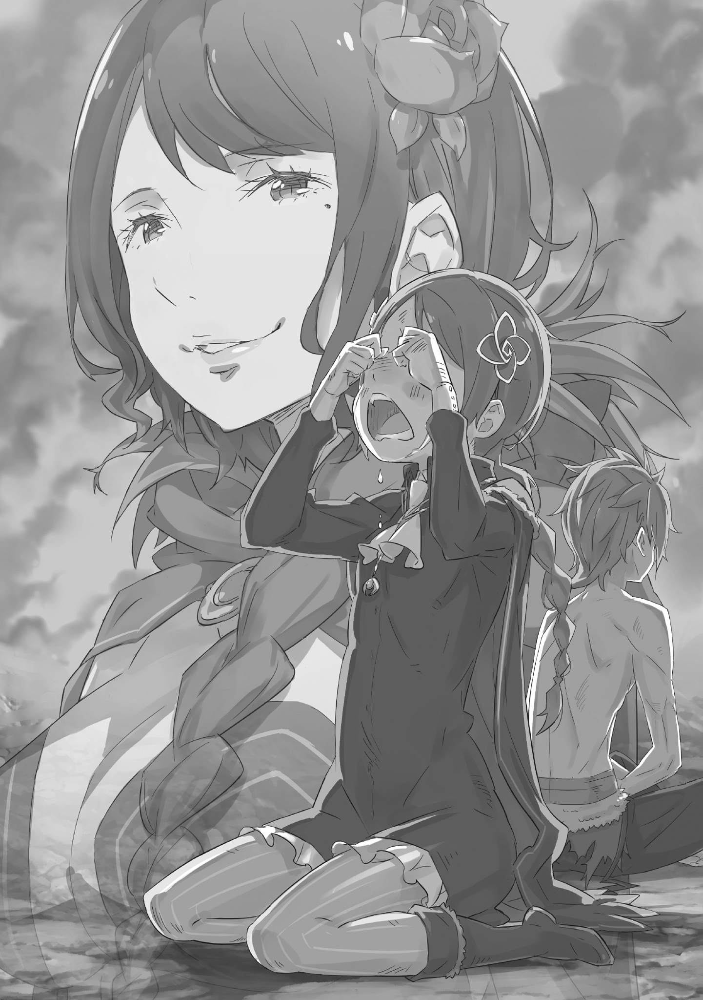

Английский перевод: Eminent Translations

Перевод и редактура: Gradient

Перед руинами дотла сгоревшего особняка девочка с заплетёнными в косу волосами застыла на месте.

Ветер, несущий запах гари, развевал её тёмно~синие волосы, а взгляд девочки скользил по обугленным руинам. Она не наклонялась, чтобы что~то искать, лишь позволяла взгляду бесцельно блуждать по пепелищу.

— …Ты так ни черта и не высмотришь.

Голос раздался из-за спины девочки. Голос был грубым, но в нём проскальзывала странная нотка заботы. Осознав это, девочка слегка улыбнулась, так и не обернувшись. Эта забота показалась ей смехотворной.

В конце концов, эта девочка и обладатель голоса ещё совсем недавно пытались убить друг друга. Проявлять заботу к противнику сразу после боя — это было чересчур непоследовательно.

— …Эй, не забивай себе голову всякой ерундой. Попробуешь выкинуть какую-нибудь глупость — и мои клыки разорвут тебя, и мне плевать ребёнок ты или ещё кто.

— Какой ужасный блеф, особенно от тебя, Братец-Ти~и~игр.

— А?

— Братец, ты ведь добр к женщинам и детям, пра~а~авда? Поэтому~у~у… я думаю, что ты из тех, кто даже подумать не сможет не пожалеть такую девочку, как я, не та~а~ак ли~и?

На замечание девочки он оскалил клыки и скорчил недовольное лицо. Он не возражал — то ли потому, что она попала в точку, то ли потому, что решил, что спорить с ней — пустая трата времени?… Вероятно, ни то, ни другое.

Он и рад бы отмахнуться, да не мог — и это было даже по-своему мило.

— Не волну~у~уйся. Я ведь не собираюсь творить зло, во~от. Да и чтобы собрать зверодемонят, нужна подготовка, а даже если я их позову~у… братец ведь тут же их убьёт, да~а?

— Хех, не строй из себя всезнайку, будто всё понимаешь.

— И тем не менее~е… моим собеседником сейчас выступаешь ты, братец, пра~авда?

— Это потому, что некому доверить присмотр за тобой, кроме крутого меня.

Признав недостаток союзников и боевой силы, парень — Гарфиэль, — скрестив руки на груди, топнул ногой и тяжело опустился на выжженное поле, где когда-то был сад.

Затем, как и девочка, он посмотрел на руины сгоревшего особняка — особняка Розвааля. Краем глаза заметив промелькнувшее в его зелёных глазах чувство, девочка обворожительно улыбнулась.

— Братец-Тигр, похоже, тебе очень неуютно, я права~а~а?

— Это потому что… Чёрт, да ты же прекрасно всё понимаешь!… Мерзкая малявка.

— Какая гру~у~убость. К тому же, мы с тобой не так уж сильно отличаемся по возрасту, не так ли? Так сказал тот братик со страшными глазами.

— Чёрт побери, Капитан, какого хрена ты болтаешь с пленной?!

Сидя со скрещенными ногами на выжженной траве, Гарфиэль скривился. Мысленно он видел беззаботное лицо черноволосого парня, а перед глазами — ненавистную ухмылку девчонки.

Но, оставив это в стороне…

— …Договор был в том, чтобы дать тебе посмотреть на это место под моим надзором.

— Да, всё ве~е~ерно.

— И что, тебе от этого хоть немного полегчало, а?

Беспокойство парня всё ещё сквозило за его раздражёнными словами. В ответ на эту грубоватую заботу, девочка вновь позволила губам дрогнуть в улыбке.

— Кто зна~а~ает?

Она почувствовала, что её уклончивый ответ, хоть она и не осознавала этого, был похож на манеру её старшей сестры.

От таких сентиментальных мыслей девочка — Мейли Портрут — улыбнулась, прищурив глаза.

Среди обугленных обломков ту, кого она искала, было не найти.

Хотя она должна была знать это с самого начала.

— Эльза, ты бессме~е~ертная? — спросила Мейли, подперев щеки руками и уперев локти в колени.

В ответ слушательница нахмурилась, стёрла тыльной стороной ладони брызги крови со щеки и ответила:

— И снова внезапный вопрос.

— Да вовсе и не внезапный, пра~а~авда? Тебя же окружила толпа, ты вся в крови… а в животе торчит такое толстое копьё, но тебе как будто всё нипочём~ё~ём

В животе женщины, куда указывала Мейли, и впрямь торчало копьё.

Рана была сквозная — копьё пронзило живот и вышло из спины. Оно повредило несколько жизненно важных органов, а количество вытекшей крови давно превысило смертельную норму — для любого было очевидно, что ранение смертельное. По крайней мере, должно было быть.

Но несмотря на такую рану, черноволосая женщина сохраняла невозмутимость. –Хотя нет, не совсем. Её щеки раскраснелись, а дыхание стало горячим.

Она чувствовала каждое мгновение боли и каждую потерянную каплю крови. Но вся эта боль лишь возбуждала Эльзу.

— Какая ты… нечистая — заметила Мейли.

— Ох, как неприятно слышать такое от девочки, которая обычно окружена зверодемонами

— Я слежу, чтобы они всегда купались, между прочим! И речь не о чистоте тела, а о чистоте разума… Мне смотреть больно, так что скорее вытащи это копьё!

Перед скривившейся Мейли Эльза выдернула копьё, торчавшее у неё в животе. Зажимая уши от мерзкого хлюпающего звука, Мейли оглядела залитое кровью пространство вокруг.

В тёмном, грязном заброшенном доме тут и там валялись около двадцати неузнаваемых трупов.

В тот день Мейли и Эльза вместе отправились на задание — устранить каких-то людей по неизвестным причинам. Отсюда и море крови вокруг них.

Мейли обеспечивала прикрытие с тыла, а основная ударная роль — устраивать врагам кровавую баню — отводилась Эльзе. Это разделение ролей уже прочно устоялось, хотя изначально они стали работать в паре почти случайно.

— Мы так слаженно работаем вместе, но… я ведь почти ничего не знаю об Эльзе, не та~а~ак ли?

— Тут и скрывать особо нечего. Если спросишь — я отвечу.

— Ну тогда я спрошу… Почему твоя рана на животе та~а~ак быстро затягивается?

Перед Мейли, воспользовавшейся предложением, стояла Эльза, опираясь на выдернутое копьё, воткнутое в пол. Когда Эльза провела ладонью по своему окровавленному животу, раны там уже не было — виднелась лишь красивая, гладкая белая кожа.

— Это просто неестественно!

— Верно, признаю, это ненормально. Это… результат проклятия.

— Проклятия? — тут же отозвалась Мейли.

— Хотя есть страны, которые попытались бы назвать это благословением.

Эльза поглаживала живот, где исчезла рана, и в её голосе послышалась редкая для неё лёгкая резкость. Чутко уловив эту интонацию, Мейли поняла, что затронула тему, о которой Эльзе не хотелось говорить.

Поняв это, она немного поколебалась. Но любопытство взяло верх.

— Значит, это… благословение или проклятие, ты с ним родилась?

— Нет. У меня тоже было обычное человеческое тело, пока я не достигла примерно твоего возраста. Но после того, как меня поймали на краже в моей родной стране, меня продали в рабство.

— И… потом?

— Человек, который меня купил, был немного странным. Он не очень интересовался девушками… зато он обладал пугающим талантом к проклятиям.

Услышав слово «проклятия», Мейли опустила глаза, обрамленные длинными ресницами.

Среди приспешников Мейли, которая была «Укротительницей Зверодемонов», было много зверодемонов, использовавших в качестве оружия способности, схожие с проклятиями. Однако проклятия — это, по сути, техника для лишения жизни других, своего рода запретное искусство.

Хотя было трудно представить, что именно они как-то связаны с бессмертием Эльзы.

— В Густеко есть проклятие, называемое «Проклятой Куклой». Слышала о таком?

Мейли покачала головой, услышав незнакомый термин.

— Проще говоря, это проклятое искусство, предназначенное для причинения вреда человеку. Выбираешь цель, которую хочешь убить, и наносишь проклятую метку, предназначенную для этой цели, на человека, которого хочешь превратить в «Проклятую Куклу». Когда проклятие активируется, человек, ставший «Проклятой Куклой», превращается в бессмертную куклу, которая ни за что не умрёт, пока не убьёт свою цель.

— …Разве это не потряса~а~ающе? В смысле, можно ведь создать кучу бессмертных людей. Это оставило бы нас без рабо~о~оты! — прокомментировала Мейли.

— Да, ты права. Но это не такое уж и удобное проклятие.

Эльза меланхолично улыбнулась невинной жестокости Мейли.

— Во-первых, человек, ставший «Проклятой Куклой», теряет собственное «я», всякое самосознание и становится неспособен ни на что, кроме убийства цели. Во-вторых, убив цель, «Проклятая Кукла» тут же погибает следом за своей целью.

— Ах, ну тогда от неё никакой пользы… А? Но погоди?…

Мейли мило надула губы, когда из объяснения Эльзы возникло странное противоречие.

Согласно рассказу Эльзы, она была одной из этих «Проклятых Кукол». Однако, если следовать этому же объяснению, у Эльзы не должно быть самосознания, и она должна существовать лишь для убийства цели.

— Но ты можешь нормально разговаривать… Или, может, Эльза всё-таки не в своём уме? Это многое объя~я~ясняет!

— Ох, мне обидно, если ты думаешь, что всё так и есть… Просто я… особенная «Проклятая Кукла».

— А? Особенная? Что ты имеешь в виду~у~у?

— Я же говорила? Человек, который меня купил, был сумасшедшим и обладал ужасающим талантом к проклятым искусствам.

То ли не собираясь подробно рассказывать об этом «покупателе», то ли по какой-то другой причине, Эльза прервала своё объяснение на этом.

Затем она качнула своей длинной косой, и сказала:

— Знаешь, есть и другие «Проклятые Куклы» с бессмертными телами, вроде меня. И эти девушки пробовали разные способы убить себя… например, вбивали себе кол в грудь или пили человеческую кровь, их, похоже, даже прозвали дурным именем «Вампиры».

— Бессмертная «Проклятая Кукла»…

Мейли почувствовала, как холодок пробежал по спине, услышав эти слова.

— Не умираешь?… — спросила Мейли.

— Не могу умереть — ответила Эльза.

Мейли почувствовала, что эта небольшая разница в словах, кажется, и составляет саму суть существования Эльзы.

— Эльза, ты тоже хочешь умереть так же, как и те девушки из твоего рассказа, что жаждали смерти?

Она должна была задать этот вопрос. Эльзу резали мечами, пронзали копьями, сжигали её внутренности. Возможно, она просто хотела умереть, как нормальный человек?

На вопрос Мейли Эльза лишь сделала недоумевающее лицо.

— Почему? — спросила она, склонив голову с искренне удивлённым видом.

— …Что значит «почему»? У тебя был именно такой тон!

— Правда? Тогда, видимо, я ввела тебя в заблуждение. Я никогда не хотела умереть. Возможно, потому что я не прожила так долго, как те, кого называют «вампирами»… В основном же, у этого тела есть свои многочисленные преимущества.

— Преимущества~а~а?

— Запах крови, разорванной плоти, внутренностей — всё это заставляет меня чувствовать себя живой… И это тело даёт мне массу возможностей это почувствовать. Я довольна этим телом.

Нежно улыбнувшись, Эльза бросила копьё, на которое опиралась. Затем, обращаясь к присевшей девочке, она добавила:

— Вот почему… тебе не нужно так волноваться.

— Волноваться? Мне? За Эльзу?

— Да. Ты подумала: «А что, если она хочет умереть?» — и тебе стало одиноко, верно? Ты ведь так боишься одиночества, Мейли.

— Н-Не говори таких глупосте~е~ей! — крикнула Мейли, покраснев, когда Эльза погладила её по голове.

Называть её одинокой — это просто глупость, да и вообще, руки Эльзы все в крови, от них волосы слипнутся! Эльза так и не научилась быть внимательной к таким вещам.

— Ну вот, волосы же испачкались! К тому же, Эльза, твои собственные волосы… А-а-а, ну во~о~от! Как ты можешь быть такой неуклю~ю~южей? Невероятно!

Мейли схватила косу Эльзы, растрепавшуюся в бою. Хотя коса была такая же, как у Мейли, ведь сама Эльза заплела её ей перед заданием.

Трудно поверить, что при такой ухоженной внешности Эльза так безразлична к своему внешнему виду.

— Раны на теле могут зажить, но неряшливость во внешнем виде никуда не денется~я~я, так что будь аккуратнее, хорошо~о~о?

— Да, но, раз ты всегда со мной, то об этом можешь позаботиться и ты. Так что мы квиты, верно?

— Не пытайся так выкрутиться~я~я!

Пытаться заплетать волосы в такой залитой кровью обстановке было почти невозможно. Задание было давно закончено. Раз раны Эльзы затянулись, следовало бы поскорее убираться отсюда.

Поднявшись, Мейли хорошенько потянулась, а затем взяла Эльзу за руку и пошла прочь из здания. Если она этого не сделает, то Эльза может устроить переполох в людном месте.

Да, именно для того, чтобы этого не допустить, она взяла её за руку. В этом не было никакого глубокого смысла.

— Веди себя прилично, хорошо? А иначе я точно когда-нибудь умру раньше тебя, Эльза, с твоим-то бессмертным телом!

Эти слова, сказанные не глядя друг на друга, были наполовину ответом, наполовину поддразниванием. Услышав это, Эльза лишь на мгновение округлила глаза, прежде чем к ней вернулась её обычная улыбка.

— Кто знает?

— Глупая Эльза~а~а… Это я должна была умереть перво~о~ой.

Вспомнив их давний разговор, Мейли облекла эти сентиментальные чувства в слова.

Глубоко в сгоревших руинах особняка Розвааля Эльзу раздавило и обратило в пепел бушующее пламя.

Насколько знала Мейли, Эльза переживала разрубание на куски, отрубание головы и раздавленное сердце. Но её ещё не обращали в пепел.

Эльза искала место для смерти, хотя сама этого и не осознавала.

Она искала ощущения жизни в плоти и крови других потому, что утратила собственную, естественную полноту того, что следует называть «жизнью». Вот так теперь она думает.

Если так подумать, то, возможно, для Эльзы было счастьем умереть здесь.

По крайней мере, Эльза была не из тех, кто станет слабохарактерно рыдать и вопить перед смертью.

— Братец-Тигр, уже хватит. Спасибо. Я дово~о~ольна.

Вместо того чтобы стать пленницей, Мейли пришла сюда, чтобы запечатлеть в памяти особняк, где Эльза встретила свой конец и упокоилась с миром. Это был её долг как сестры Эльзы.

Это было сделано. Оставалось лишь, неся это в себе, смотреть, как будут развиваться события дальше…

— Мне плевать.

— А?…

Сидя в сгоревшем саду, Гарфиэль, отведя взгляд от Мейли, продолжил с каким-то раздражённым выражением лица.

— Если хочешь поплакать — плачь. Я и слова не скажу.

От его резкого тона Мейли опешила, а затем попыталась рассмеяться.

Рассмеяться не получилось. Почему-то что-то горячее хлынуло из глаз, и Мейли, закрыв лицо руками, взглянула на небо.

И так, спрятав лицо, она открыла рот к небу. Гарфиэль ничего не сказал, пока горечь изливалась из её уст. Ничего не говоря, они вдвоём какое-то время оплакивали черноволосую женщину, упокоившуюся в выжженных руинах особняка.

— И о событиях этого дня они вдвоём больше никогда не разговаривали и никому не рассказывали больше необходимого.

《Конец》
