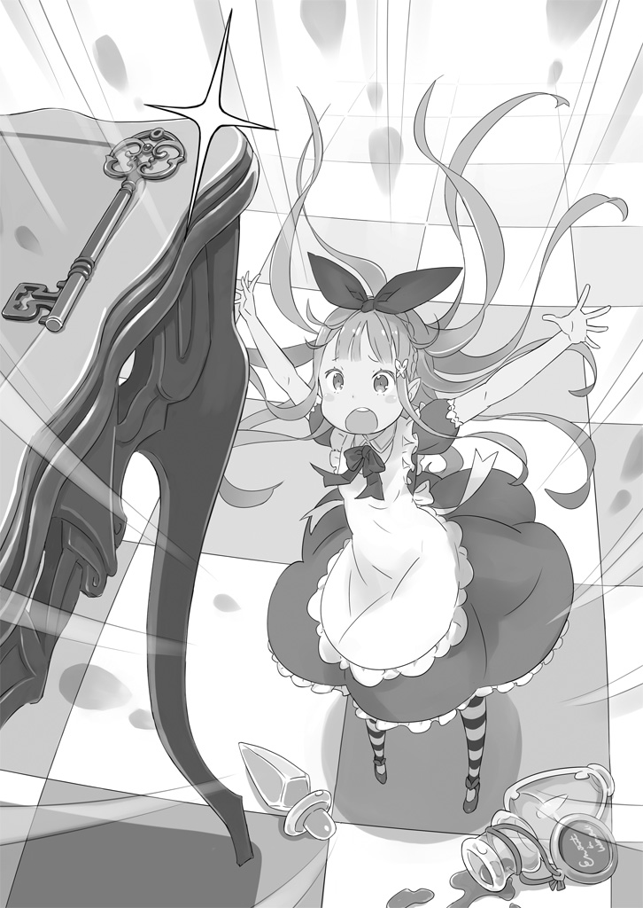
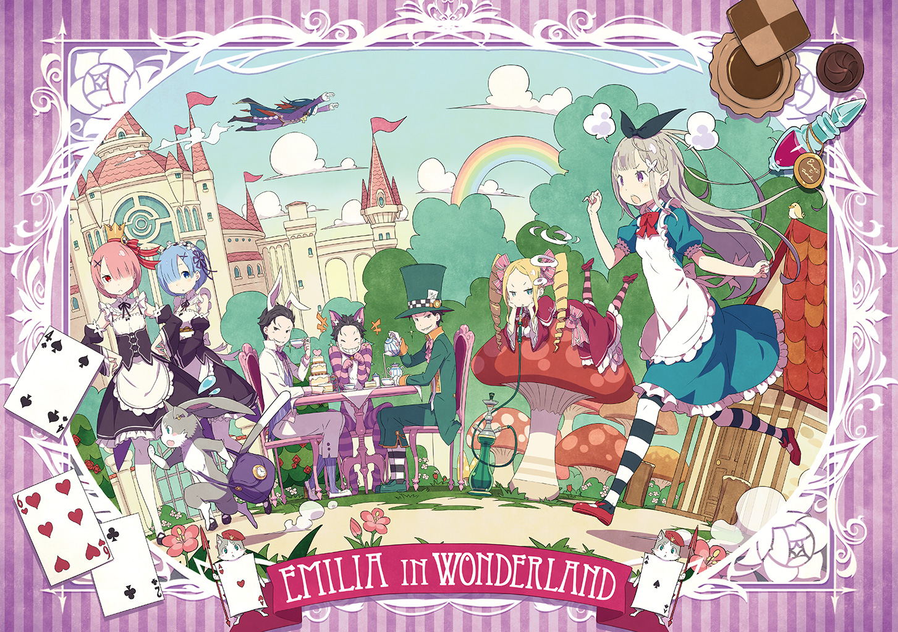

— А в конце он сказал: «Это твоё сердце!» — воскликнул Субару, оскалившись и драматично щёлкнув пальцами.

— Ух ты, как здорово! — воскликнула Эмилия, смеясь и хлопая в ладоши.

Они болтали во дворе особняка Розвааля в тени дерева, наслаждаясь лёгким ветерком и историями из родного мира Субару.

Пока Субару рассказывал истории, активно жестикулируя и мастерски их преподнося, Эмилия, сама того не замечая, погружалась в мир его удивительных рассказов. Она была искренне впечатлена его способностью менять голос и изображать как мужчин, так и женщин.

— Ты знаешь так много историй! И все они мне незнакомы. Я очень впечатлена.

— Я тоже благодарен своей памяти и тому, что родился на Земле. Думаю, немного впечатлить Эмилию-тан — это задание, которое мне поручил сам Андерсен.

— Зи-имля? Андерсен?

— Это название космического корабля, на котором я жил, и известного автора сказок, который там жил.

Субару подмигнул склонившей голову Эмилии, но, похоже, что она не совсем поняла то, что он сказал, поэтому смущённо улыбнулась и сделала вид, что всё поняла, решив, что это, вероятно, что-то, что ей не нужно понимать.

Прошло две недели с тех пор, как Субару разрешил инцидент с зверодемонами после переезда в поместье Розвааля. Его раны зажили, он вернулся к работе дворецкого и иногда находил время, чтобы поболтать с Эмилией о разных вещах во время недолгих перерывов.

Эмилия, уставшая от непривычной ей учёбы, была благодарна за внимание Субару. А кроме того, его рассказы были ещё и очень интересными, так что её нельзя было винить за то, что она просила ещё и ещё.

— Ну что ж… теперь, когда история закончена, хоть мне и не очень хочется, но я должен вернуться к работе. А ты как, Эмилия-тан? — спросил Субару, вставая и отряхивая брюки.

Эмилия прислонилась к дереву, её серебряные волосы мягко развевались на ветру, и на мгновение задумалась.

— Я ещё немного побуду здесь, — наконец решила она.

— Хорошо. Увидимся позже. Клянусь, Рам мне голову отрубит, если найдёт меня здесь!

После шутливого замечания Субару Эмилия наблюдала, как он спешно направляется обратно к особняку, и сладко зевнула.

— Хм-м-м.

Прошлой ночью она никак не могла остановиться и читала всю ночь напролёт. Вот почему она сразу начала чувствовать сонливость, наслаждаясь лёгким ветерком в спокойном одиночестве.

— Может, мне стоило вернуться с Субару… — прошептала Эмилия слабым голосом, ссутулившись.

Она закрыла глаза, думая, что не должна этого делать, и приятная дремота медленно окутала её.

И вот так сознание Эмилии…

— Ой, нет, нет! Я не успею, если не потороплюсь!

Эмилия, которая была на грани засыпания, напугано подскочила от этого внезапного причитания.

— А? Что?

— Я в беде! Это серьёзно! Я не знаю почему, но мне нужно поторопиться!

Эмилия огляделась, и обнаружила источник голоса, удивлённо распахнув глаза. Пока она сидела в полудрёме прислонившись к дереву, мимо неё пробежал серый кот, ходящий на двух ногах, — тот, кого она привыкла видеть, котёнок-дух, который был её семьёй.

— Пак? Почему ты материализовался… о, подожди!

По какой-то причине Пак, который обычно был размером с ладонь, теперь был размером с младенца. Конечно, он мог менять свой размер по своему желанию, но делал он это довольно редко.

Услышав его беспечный нетерпеливый голос, Эмилия поспешно встала, думая, что что-то случилось. Но Пак даже не обратил на неё внимания, и…

— Я сейчас выберу бездонную дыру! — Пак пробежал вокруг Эмилии к задней части дерева, а его шаги издавали очаровательные звуки. А потом…

— Хайя!

Она услышала энергичный голос и почувствовала, как присутствие Пака удаляется.

— Эй! Пак, почему ты меня игнорируешь? Ну и дела.

Эмилия тоже поспешно переместилась за дерево, потрясённая необычным поведением своего отца. Но Пака нигде не было видно, а вместо него в земле зияла дыра. Она задалась вопросом, не туда ли прыгнул Пак после своего крика.

— Откуда здесь дыра? …Может быть, Субару спрятал здесь сокровище…? — Основываясь на своей предвзятости, она решила, кто виноват, а затем нерешительно заглянула в дыру.

Тёмная дыра была настолько глубокой, что она не видела дна, и когда она начала чувствовать, что её затягивает внутрь, она ахнула.

— Па-а-ак! Ты меня слышишь? Если ты меня слышишь, то, пожалуйста, ответь мне! — крикнула она в дыру, но её голос эхом отозвался впустую.

Не зная, что делать, она повернулась, чтобы позвать кого-нибудь из особняка. Но потом…

— Это повлияло бы на развитие истории, так что, в любом случае, вни-и-из!

— А?

В тот момент, когда тело Эмилии потянуло назад, ей показалось, что она услышала ещё один голос. Она вздрогнула, когда почувствовала, что её тянут за плечо, но это удивление вскоре сменилось шоком от падения.

— Подождите, нет! Я сейчас расплющусь!

Падая в дыру головой вперёд, Эмилия ужаснулась при мысли о том, что сейчас разобьётся. Она тут же оттолкнулась от стены и восстановила своё восприятие верха и низа, затем схватилась за подол юбки, которую поднимал ветер, и тут же начала думать о контрмерах — но прежде чем она успела что-либо придумать, её остановило что-то мягкое.

— И-ик… а-а?

Эмилия, чувствуя, что её окутала куча чего-то похожего на бумагу, начала раскидывать её во все стороны и успешно выползла из всей этой волокиты.

Она стряхнула то, что прилипло к её одежде и волосам, и поняла, что это сухие листья. Похоже, опавшие листья, скопившиеся на дне ямы, защитили её от удара при падении.

— Ха-а… Я так испугалась.

Эмилия почувствовала облегчение, но оно длилось недолго, и она беспокойно огляделась.

Похоже на внутреннюю часть дупла, так что я внутри дерева, которому сотни лет? Но опять же, я ведь упала в дыру в земле, а не в дупло дерева.

— О! Пак!

Хмурясь от сомнений, Эмилия заметила котёнка, выглядывающего в проход в дальнем конце этого пространства. Пак испуганно подпрыгнул на месте, когда Эмилия заговорила.

— Ой, я опоздаю, если не потороплюсь. Я в беде, — дерзко сказал он, многозначительно взглянув на своё запястье, на котором ничего не было.

— У тебя там ничего нет! Хватит шутить, я на тебя злюсь. Стой, где стоишь!

Когда Эмилия отбросила сухие листья и побежала, Пак поспешно бросился бежать от неё со всей мочи. Она удивилась тому, как быстро он может бежать, и хотя ситуация была неподходящей, она была впечатлена и подумала, что он удивительный.

Пак, бежавший со всех ног, исчез из виду в коридоре, которому, казалось, не было конца. Тем не менее, Эмилия упорно бежала, каким-то образом сумев пройти через проход, и прыгнула в ярко освещённую комнату.

— Хм-м… Что это за место? И где Пак?

Эмилия тихо вздохнула и была ошеломлена снова изменившимся пейзажем. Это была милая комната, наполненная яркими вещами. На столе, над камином и на подоконнике стояли цветы, которых она раньше никогда не видела.

— Интересно, чья это комната… Что, если они рассердятся на меня, если узнают, что я вошла без разрешения?

Хотя Эмилия находилась в загадочной ситуации, у неё были реалистичные опасения. Она обыскала комнату в поисках Пака и её владельца. Однако она не могла долго осматриваться, так как комната была небольшая, из-за чего она быстро опустила плечи, так и не найдя Пака. И это была не единственная причина.

— Там есть дверь, которая, кажется, ведёт наружу, но моё тело слишком большое, чтобы пройти через неё…

Даже Эмилия не могла скрыть своего шока от этого. Она не осознавала, что была намного больше других. Это правда, что девушки в особняке, Рем, Рам и Беатрис, были меньше Эмилии и были милыми, но…

— Нет, нет. Даже Беатрис не сможет пройти через такую маленькую дверь. Значит, человек, который её сделал, был очень невнимательным.

Эмилия, которая была на грани депрессии, вдруг взбодрилась от внезапно появившейся идеи и огляделась, чтобы посмотреть, нет ли чего-нибудь ещё. Всё, что она нашла, — это ключ и странный пузырёк с лекарством.

Ключ, вероятно, от той плохо сделанной двери.

А на бутылочке с лекарством была этикетка с надписью: «С любовью для Эмили»

— …Анне?

Она вспомнила, что единственный человек, который называл её так, был одним из родственников Розвааля и её гораздо более молодой подругой, с которой она недавно познакомилась.

Я не знаю, почему подарок от неё находится в этой комнате, но Аннерозе никогда бы не сделала мне ничего плохого.

Эмилия сразу поверила в это.

— Я возьму это.

Итак, Эмилия проглотила зелье, не сомневаясь в нём. Выпив всё, она заметила свою оплошность.

— Что, если это лекарство, которое нужно наносить на тело? — Но произошедшая тут же перемена в миг развеяла её беспокойство.

— Ох, уа, уау.

Размеры комнаты менялись с каждой секундой. Стол, который доходил ей только до пояса, быстро стал таким большим, что ей приходилось смотреть на него снизу вверх. Подоконник и ваза тоже сильно увеличились.

— Нет… это, моё тело стало меньше.

Эмилия сразу заметила причину изменений и широко распахнула глаза, глядя на мир, который стал невероятно большим. А потом она потрогала своё тело здесь и там и с облегчением обнаружила, что её одежда тоже уменьшилась.

— Люди подумают, что я странная, если буду ходить голой. Но теперь я могу пройти через ту дверь.

Я всегда знала, что Аннерозе удивительная.

Эмилия совершенно забыла о разгадке этой маленькой тайны и в торжестве сжала кулак. Затем она с энтузиазмом положила руку на ручку двери.

— Ах, — разочарованно сказала она, поняв, что дверь заперта. Она оставила ключ на столе, поэтому теперь не могла до него дотянуться.

— Нет смысла расстраиваться. Хорошо, я сделаю всё возможное, чтобы забраться туда.

Достоинством Эмилии было то, что она не унывала, но в то же время выглядела смелой и безрассудной, закатывая рукава, чтобы бросить вызов ножке стола. Внезапно её аметистовые глаза заметили что-то, лежащее рядом. Там была белая тарелка с аккуратно положенной на неё выпечкой. Рядом с тарелкой лежала записка, и, подняв её, она увидела: «Для того случая, если вы попадёте в беду из-за подарка моей леди. Страховка»

Эмилия могла вспомнить только одного человека, который писал в такой своеобразной манере.

— Ой, ой, ой? Неужели неуклюжая леди забыла ключ?

Пока Эмилия думала, что делать, взяв выпечку, она подняла голову, услышав голос сверху. На неё со стола смотрел Пак, размахивая своим длинным хвостом, с ключом в лапе.

Пак посмотрел на неё своими большими круглыми глазами с улыбкой, которая выглядела странно по-человечески.

— Ты совсем никудышная. Сохраняться перед выбором — это же основа основ, знаешь ли. Жизнь — не сладкая штука. В отличии от той выпечки!

— Извини. Я не понимаю, о чём ты говоришь. И не думаю, что ты сказал что-то остроумное, — ответила Эмилия Паку, у которого на лице было самодовольное выражение, своим обычным тоном.

Но ей показалось, что она разговаривает с Субару, и она в недоумении наклонила голову.

Пак сегодня ведёт себя прямо как Субару.

— Оставим это в стороне, хватит валять дурака и дай мне ключ. А если мы скоро не вернёмся в особняк, то все будут волноваться.

— Тебе следует побеспокоиться о себе, а не о себе. Когда ты вглядываешься в бездну, бездна вглядывается в тебя, знаешь ли…

— Вот так.

— Мя-я-яу!

Эмилии не нравилось поведение Пака, так как он казался чрезмерно самоуверенным, поэтому она приказала своим малым духам сдуть его порывом ветра. Подхваченный им, Пак столкнулся с окном и уронил ключ, который Эмилия поймала, скользнув по полу. Затем она сразу же отперла дверь.

— Ладно, Пак. Хватит дурачиться, мы возвращаемся. Скорее залезай в свой кристалл… Пак?

Эмилия оглянулась, разговаривая с ним, как будто ругая ребёнка, но её лицо помрачнело, когда она поняла, что Пака больше нет у окна. Казалось, он снова спрятался.

— Боже. Сегодня ты доставляешь мне сплошные хлопоты.

Эмилия сердито вышла за дверь. Её встретил луг и большой лес, который был виден за ним. Хотя её удивил пейзаж, которого она никогда раньше не видела, она всё же направилась к лесу. Но…

— Сколько бы я ни шла, я никак не могу приблизиться к лесу…

Лес был прямо перед её глазами, но как бы она ни старалась, расстояние между ней и лесом, казалось, не уменьшалось. Расстояние, которое она могла пройти, стало меньше теперь, когда её тело уменьшилось.

— Я ещё и проголодалась… о, подожди.

Эмилия, которая выглядела обеспокоенной, вспомнила, что завернула выпечку и взяла её с собой. То, что она достала, мгновенно пленило её и разожгло аппетит своим сладким ароматом.

— Спасибо, мистер Клинд.

Она поблагодарила мужчину, который написал письмо, и который также служил дворецким Аннерозе в главном особняке семейства Мейзерс. Выпечка была пышной, как будто только что испечённой, и она не могла не заёрзать на месте от вкуса, который словно танцевал у неё на языке. Она неохотно съела всё за один укус.

— Хм-м? А?

Когда Эмилия, насладившись сладостью выпечки, огляделась вокруг, она заметила, что пейзаж изменился — она поняла, что её тело увеличилось и вернулось к прежнему размеру. Наконец-то она поняла, что означает «Для того случая, если вы попадёте в беду из-за подарка моей леди. Страховка».

Это убедило её, что Клинд — удивительный человек.

— Как я и думала, мистер Клинд действительно удивительный… и лес теперь совсем рядом благодаря ему!

Как только она стала больше, лес оказался в пределах её досягаемости. Хотя лес всё ещё был большим даже после того, как она выросла, она чувствовала себя гораздо менее напуганной, чем раньше.

Эмилия победно сжала кулак и с вызовом посмотрела на лес.

— Хорошо, моё приключение начинается здесь.

Она произнесла фразу, которая могла бы стать последней репликой в аниме, а затем побежала к лесу.

— Очевидно, её приключение на этом не закончилось.

Оно не закончилось, но её ноги остановились. Это случилось, когда она шла по тускло освещённому лесу с помощью света, исходящего от малых духов.

— Стой, где стоишь. Я не хочу, чтобы кто-то вроде тебя шёл дальше, я полагаю.

Снова раздался голос сверху, и Эмилия огляделась, ища его обладателя. Затем она заметила фигуру, лежащую на ветке, и невольно прикрыла рот рукой.

На ветке лежала Беатрис, которая сонными глазами смотрела на Эмилию. Девочка встряхнула своё нарядное платье и нежно кремовые волосы, которые были заплетены по бокам её большой головы в причёску, напоминающие две большие пружинки, а затем выпустила дым из трубки во рту и усмехнулась.

— Довольно недисциплинированная девчонка, раз пришла к Бетти с грязными ногами. Бетти хочет видеть лица твоих родителей, я полагаю.

— Беатрис, ты…

— Хмф. Уже слишком поздно, даже если ты заметила, с кем связалась и с кем была так груба. Ну, если ты готова покаяться, то Бетти возможно прости…

— Тебе нельзя курить трубку, ты ещё маленькая! Тебе нельзя этого делать, пока ты не станешь взрослой! Субару сказал, что курение мешает людям расти!

Эмилия обрушила на Беатрис своё рациональное мнение после того, как стала свидетельницей курения юной девочки. Беатрис удивилась и выронила трубку изо рта. А потом сердито посмотрела на неё нахмурив брови.

— К-какое оскорбление, я полагаю! Ты, должно быть, сошла с ума, раз обращаешься с Бетти как с ребёнком! Бетти — уважаемая леди! Трубка — это привилегия леди и взрослых!

— Довольно по-детски быть одержимой желанием быть взрослой…

— Гр-р-р! Я полагаю!

Беатрис, лицо которой стало совершенно красным от гнева, топала ногами на ветке, закатывая истерику.

Но как разумный взрослый человек, Эмилия не могла игнорировать проступок Беатрис. Кроме того, Эмилия находилась в положении, когда должна была взойти на престол целого Королевства.

Я никогда не отступлю.

— О боже, вы двое. Хватит. А то вы так все лесные цветы распугаете.

Внезапно в их спор вмешался таинственный человек. Это был черноволосый парень, протянувший руку к Эмилии и успокаивающе смотрящий на Беатрис на ветке.

И хотя это было очевидно, Эмилия легко узнала его сзади.

— Субару?

— Нет, это не так, леди. Я не Субару, я Чеширбару!

Чеширбару обернулся и поднял большой палец вверх, сверкнув белыми зубами. Как ни посмотри, это был Субару. Но если присмотреться повнимательней, то можно было заметить, что на его голове были кошачьи ушки. У него были уши и там, где они обычно должны быть, так что выглядело так, будто у него четыре уха. Это было немного жутковато.

— Аргх… появился кто-то, кого Бетти не любит, я полагаю.

— Если ты действительно так думаешь, то уходи отсюда, Беако. Этот Чеширбару появляется в неожиданных местах и в неожиданные моменты. Я могу смотреть на твою жизнь с раннего утра до позднего вечера, знаешь ли?

— Быть под наблюдением весь день слишком проблемно! Аргх, не думай, что ты выиграл, я полага-а-аю!

— Я полага-а-а-а-а-а-аю!… — Её резкие прощальные замечания эхом отозвались, когда она неловко перелетела над ветвями и вскоре исчезла из виду.

Увидев это, Чеширбару оглянулся на Эмилию и сказал:

— Ха, я снова запугал жалкую лоли. Хотелось бы узнать, каково это — быть побеждённым.

— Я ещё не закончила ругать Беатрис. И эти уши, вы все надо мной подшучиваете, не так ли? Я сейчас рассержусь.

— Твоё сердитое лицо тоже милое… ай, ай, ай, ты их оторвёшь, если будешь так сильно тянуть!

Эмилия обратила свой праведный гнев на Чеширбару и потянула его за кошачьи уши, но то, что, по её мнению, было подделкой, оказалось пушистым и тёплым на ощупь и как следует прикреплённым к его голове.

Чеширбару присел на корточки со слезами на глазах перед удивлённой Эмилией.

— Я не знаю, на что ты сердишься, но если ты будешь продолжать злиться, то все будут тебя бояться. Тебе следует наслаждаться своей непобедимостью и использовать самое сильное оружие девушки — её улыбку.

— Я не совсем понимаю, о чём ты говоришь, но… да. Ты прав.

Эмилии сказали, что другие будут бояться её, если она продолжит злиться, что заставило её почувствовать себя виноватой и сменить тон.

Увидев расстроенную Эмилию, Чеширбару поднял голову и нахмурился.

— Что ж. Когда тебе грустно, нужно веселиться и устраивать шумные вечеринки. Я приглашаю тебя на чаепитие!

— Чаепитие?

— Ага. Оживлённое, шумное и безумное чаепитие в глубине леса!

После того, как Эмилию пригласил Чеширбару с несколько тревожным приглашением, он вывел её из леса. Пройдя немного, она увидела открытое пространство и небольшой домик в лесу. В доме, который сливался с лесом, в саду стоял огромный стол, чтобы множество людей могли сидеть вместе и веселиться.

И за столом сидели гости сами чаепития —

— …О, это ты, Чеширбару. Так ты всё таки пришёл.

— Значит, теперь будет не два парня. Я рад, что это больше не будет похоже на похороны…

Чрезвычайно мрачно выглядящая пара… точнее, два мрачно выглядящих Субару сидели там. Это сюрреалистическое зрелище застало Эмилию врасплох, заставив её забыть о мрачности.

— Т-три Субару? Чеширбару, что происходит?

— Я не знаю, о чём ты говоришь. Те, что там, — это Шляпник Субару и Мартовский Субару. Первый в шляпе, а у второго заячьи уши. Их легко различить, правда?

По подсказке Чеширбару Эмилия проверила, и у двоих, которые повесили головы, были свои причуды: шляпа и заячьи уши. И всё стало ещё запутаннее, когда к ним присоединился Субару с кошачьими ушами. Оставив Эмилию, у которой кружилась голова от вида трёх Субару, Чеширбару сел на стул, как будто это было само собой разумеющимся, и пожал плечами, глядя на двух других Субару с глазами, как у дохлой рыбы.

— Эй, ну же, — бодряще сказал Чеширбару.

— Не будьте такими мрачными. То, что никто не приходит после того, как мы рассылаем приглашения, не ново для нас.

— Но разве не нормально надеяться, что сегодня всё будет иначе? — ответил Шляпник Субару.

— Может быть, у них плохая связь, и они не смогли сообщить нам, что опоздают?

— Ну, мы пригласили всех ещё вчера, и прошла целая ночь, — добавил Мартовский Субару.

— Но даже если кто-то придёт, я, Мартовский Субару, — хороший парень, который скажет, что он сам только что пришёл.

— Не стоит так говорить, я ведь могу и влюбиться в тебя, — сказал Чеширбару.

— Влюбиться, влюбиться, — передразнил Шляпник Субару.

— Моя эра может наступить. Это будет новый виток для меня, — ответил Мартовский Субару.

Три Субару, подняв головы, начали быстро обмениваться какой-то ерундой друг с другом. Похоронная атмосфера тут же исчезла, и её сменило странное, сумбурное, шумное настроение.

Он не обманул.

Это действительно оживлённое, шумное и безумное чаепитие.

— О да! Для вас двоих, печальных, жалких и беспомощных, я сегодня как следует пригласил гостя. Вы уже можете начать аплодировать мне за мою прекрасную игру.

— Ну и кто же этот твой гость? — спросил Шляпник Субару.

— Уверен, ты нагонишь пафоса, а потом приведёшь Беако, которая всё время бездельничает в лесу, верно? Я прекрасно знаю, насколько ты на самом деле бесполезен.

— Ну, даже Беако — это лучше, чем никто, — добавил Мартовский Субару.

— Ну хорошо, тогда давайте положим кучу сахара в чай Беако и поспорим на то, как долго она сможет это терпеть! Я ставлю на пять минут!

— Заманчивое предложение, но это не так. Сегодня я привёл не Беако, а другую девушку. И она супер-красивая. Ходячий оазис, который я нашёл в лесу, который сможет исцелить наши иссохшие сердца — её зовут Эмилия-тан!

Как только волнение достигло своего пика, Чеширбару указал в сторону леса. С глазами, сияющими ожиданием, Шляпник Субару и Мартовский Субару посмотрели в том направлении.

Но…

— «««Там никого нет!!!»»» — закричали все трое.

Эмилия, опасаясь быть вовлечённой, давным-давно убежала оттуда.

— Я очень устала…

Эмилия была уверена, что привыкла разговаривать с вечно энергичным Субару, но неудивительно, что иметь дело с тремя неумолкающими Субару было для неё слишком. Ей было неловко из-за этого, но она быстро отказалась от участия в чаепитии и в одиночестве вышла из леса.

К счастью, от места Безумного чаепития Субару до выхода из леса было рукой подать, и когда она впервые за несколько часов окунулась в тёплый солнечный свет, её тело и разум освежились.

— И теперь есть гораздо более обнадёживающий ориентир, чем раньше.

То, к чему Эмилия направилась без колебаний, выйдя из леса, было высокое здание перед ней — насколько она знала, оно было идентично королевскому замку, который она видела в столице Лугуники.

Это замок. Значит, внутри должен быть кто-то надёжный.

Эмилия больше не думала о том, как она упала в яму и как странно, что здесь есть замок. Всё, о чём она думала, — это желание сделать что-то, что она пока не могла точно определить, ну, ещё и материнский инстинкт хорошенько отшлёпать Пака.

— Я пришла. Хорошо, мне нужно с кем-нибудь поговорить…

Эмилия дошла до замка и огляделась в поисках людей, не замечая даже того, как странно, что замок окружён целым садом цветущих цветов. А потом…

— Суд! Сейчас начнётся суд!

Она наткнулась на серого кота, который переходил клумбу, громко крича. Пак, который пропал после того, как ударился о окно, появился вновь. И вот так он побежал в замок, даже не заметив её.

— И снова ты так делаешь, Пак! И суд… боже, сейчас не время играть!

Эмилия надула щёки на Пака за то, что он её игнорирует, а затем тоже вошла в замок. Белый свет, распространившийся перед ней, заставил её зажмуриться, как только она вошла внутрь. Она робко убрала руку от лица, и вид перед её глазами был…

— Так это… суд?

Это было огромное место. Потолок был настолько высоким, что его не было видно, и он был окружён огромными трибунами. Все места были заполнены зрителями, а вокруг царил громкий гул.

— Снести ей голову.

В дальнем конце зала сидела розоволосая девушка, которая вынесла жестокий приговор.

Она была одета как обычно в своё платье горничной, но украшение для волос на её голове было заменено короной — это была Рам.

Рам с холодным выражением лица смотрела на место для свидетелей. И перед её взглядом лежала Беатрис, которую по какой-то причине связали и бросили на землю, кричащую с ужасно покрасневшим лицом.

— Б-Бетти требует пересмотра дела, на самом деле! Это государственная тирания, я полагаю! Бетти подставили!

— Снести ей голову.

— Это всё, что ты можешь сказать, я полагаю!? Я требую адвоката!

Хотя Беатрис умоляла, что её ошибочно осудили, Рам даже не слушала и была полна решимости казнить её. Если приглядеться, то можно было заметить, что к Рам нежно прижималась голубоволосая девушка.

Младшая сестра, Рем, коснулась плеча старшей сестры и сказала:

— Эй, сестрёнка. Может, тебе стоит выслушать мисс Беатрис… и если дело только в выпечке, то Рем испечёт её снова.

— А как насчёт чувств Рам, которая с нетерпением ждала выпечки, испечённой Рем, но у Рам её отняли? Этому унижению не будет конца, пока голова виновницы не будет выставлена на всеобщее обозрение, а её череп не будет превращён в чашу.

— Какая жестокость из-за выпечки! — закричала Беатрис.

— Ты, Они! Дьявол! Король демонов Шестого неба!

Чем больше оскорблений она выкрикивала, тем больше преступлений она совершала. К ним добавилось и оскорбление её величества, и атмосфера в зале суда создавала впечатление, что все уже смирились с тем, что её казнят.

Встревоженная напряжением в воздухе, Эмилия крикнула, чтобы предотвратить кровопролитие.

— Подождите! Я считаю, что это очень жестокое наказание, я против!

— О, так ты собираешься защищать Бетти? Ты действительно не знаешь своего места, дитя, раз осмеливаешься противостоять королеве Рам. Ха-ха-ха.

На просьбу Эмилии ответил Пак, словно она была каким-то пустяком.

Пак, с молотком в руке, словно он руководил судебным процессом, приказал Эмилии встать на место для свидетелей.

— Я не знаю, о чём идёт речь, но Беатрис не такая уж плохая девочка. Слишком жестоко отрубать ей голову. И что с тобой случилось, Рам?

— Как смеет эта девчонка так фамильярно разговаривать с Рам. Но если то, что ты говоришь, правда, то кто ещё мог съесть выпечку Рам?

— Бетти не знает, кто её съел… но Бетти чувствует слабый аромат сладостей, исходящий от этой девочки, я полагаю. Бетти хорошо чувствует такие вещи.

— Беатрис!?

Беатрис, связанная и лежащая на полу, безжалостно выдала Эмилию, стоящую на месте для свидетелей в её защиту. И на самом деле Эмилия действительно съела выпечку. Она хотела возразить, что её сделал Клинд, но тут же почувствовала враждебный сдвиг в атмосфере зала суда.

— Подождите, подождите! У меня очень плохое предчувствие!

— …Ну, если эта девушка действительно виновна, то она бы просто наблюдала, как мисс Беатрис обезглавливают, — сказала Рем.

— Но она вышла вперёд, а это значит, что… она не выдержала мук совести?

— Разве вы не можете принять это за доказательство моей невиновности!?

Эмилия побледнела, думая, что её сейчас признают виновной. Но добрая младшая сестра, которая стояла рядом со своей безжалостной старшей сестрой, снова протянула руку помощи несчастной подсудимой.

— Сестрёнка, сестрёнка. Не может быть, чтобы она была виновна…

— Это так. Если Рем так говорит, то это может быть правдой.

Рам, казалось, была готова признать, что вышла из себя из-за вмешательства Рем. Эмилия кое-как успокоила своё сердце, думая, что выбралась из беды. Но потом…

— Это верно! — воскликнул Чеширбару.

— Сказать, что Эмилия-тан — виновница, — это абсолютно ложное обвинение!

— Милота — это справедливость! — крикнул Шляпник Субару.

— Красивые девушки — это сокровище! Эмилия-тан — моя вайфу!

— Давай ещё доведём Беако до слёз! — добавил Мартовский Субару.

— Нам нужно довести её до отчаяния!

С трибун послышались шумные голоса, и все взгляды обратились к источнику шума. Как и ожидалось, шумели три последовательные звезды: Субару с кошачьими, заячьими ушами и в шляпе.

Похоже, чаепитие закончилось.

— Субару, вы знакомы с этой леди? — спросила Рам трёх Субару, которые стояли рядом друг с другом.

Все трое оскалили зубы и заговорили:

— Да, мы её знаем! — сказал Чеширбару.

— Мы вместе устраивали чаепитие! — сказал Шляпник Субару.

— Я бы сказал, что наши отношения глубже, чем вы можете себе представить! — сказал Мартовский Субару.

— Понятно, — сказала Рем, удовлетворённо кивнув, услышав ответы трёх Субару. Затем она посмотрела на Эмилию и очаровательно, восторженно улыбнулась.

— Снесите ей голову.

— Что-а-а!?

— Хорошо. Снести ей голову.

— Подождите! Подождите секунду! Эй, разве это не странно!? Что случилось!?

Эмилия запаниковала и взмолилась, но ни королева Рам, ни министр Рем не собирались её слушать. Дверь в зал суда распахнулась с громким стуком, и вошла большая группа Паков — одетых как солдаты, множество Паков хлынули внутрь. Слева, справа и во всех направлениях были Паки.

— Ой, какие милые!

Эмилия одновременно испытывала счастье и страх, окружённая Паками, одетыми в доспехи, или как садовники, или в странные карточные костюмы.

— Су-Субару!

— Почему всё так обернулось? — удивился Чеширбару.

— Кто-нибудь, пожалуйста, докопайтесь до причины вынесения этого жестокого приговора. Это наше единственное желание.

— Боже, Субару, ты идиот!

— «««Хи-хи-хи,»»» — захихикали три Субару.

Эмилия беспомощно оказалась поглощённой группой Паков, набросившихся на неё, наблюдая за тем, как три Субару озорно высовывают языки.

— Эмилия-тан, земля вызывает Эмилию-тан.

— М-м-м, м-м-м…

Сознание Эмилии пробудилось от ощущения, что кто-то трясёт её за плечо и зовёт по имени.

Её длинные ресницы затрепетали, перед тем, как она открыла глаза и несколько раз моргнула. Затем она подняла взгляд и поняла, что прямо перед ней знакомое лицо.

— …Субару?

— Да, это я. Я был в шоке, знаешь ли. Тебя не было в комнате, когда я зашёл туда, чтобы позвать тебя. Я не ожидал, что ты просто так уснёшь здесь. Ты, должно быть, очень устала.

Субару на долю секунды улыбнулся, и тут Эмилия вышла из оцепенения. Она поспешно огляделась, убедилась, что это двор особняка Розвааля, и облегчённо вздохнула.

— Я рада…

— Хм-м? Что случилось? Тебе, случаем, не приснился кошмар? Что ж, если это так, то можешь прыгнуть в мои объятия. Я буду нежно качать тебя на руках столько, сколько ты захочешь.

— Извини, я не понимаю, о чём ты говоришь.

Субару, который широко раскинул руки, в миг печально опустил плечи, а Эмилия, глядя на него, непонимающе наклонила голову.

Кажется, мне что-то снилось, но я не могу вспомнить, что именно. Но мне кажется, что это был очень беспокойный сон. Настолько беспокойный, что я рада, что смогла вернуться.

— В любом случае, я рад, что нашёл тебя. Скоро ужин, так что давай вернёмся. Я сохраню в секрете между нами то, что ты пропустила свои дневные занятия.

— Ну… Конечно, спасибо. Я буду внимательнее в следующий раз.

Эмилия встала с помощью руки Субару, затем отряхнула одежду и выпрямила спину. И при этом ей показалось, что ей нужно что-то ему сказать.

— Субару…

— Да, что такое?

Эмилия немного подумала, глядя на лицо Субару, после того как он повернулся к ней. А потом…

— Если ты устроишь чаепитие, я обязательно приду, даже если никто другой не придёт.

— Почему ты сделала такое печальное предположение о гипотетической ситуации!?

Эмилия рассмеялась, глядя на отчаянно кричащего Субару.

Если бы её спросили почему, то всё, что она могла бы сказать, это:

— Кажется, что я видела одинокого Субару в Стране чудес.

《Конец》
