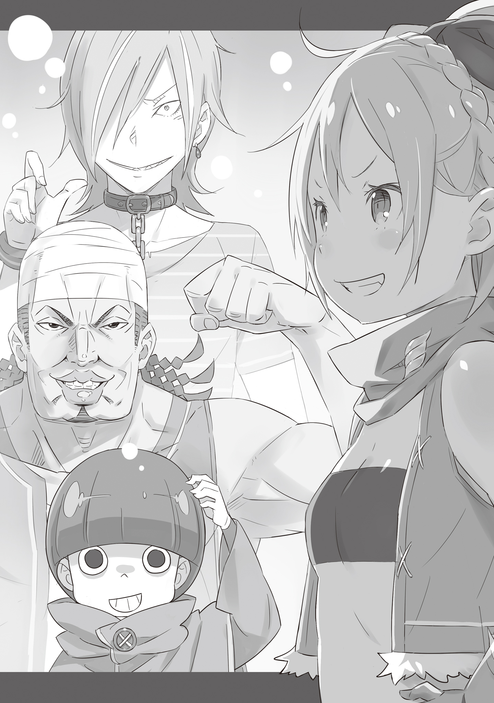

Английский перевод: Phantaminum#0097, Ice_Occultism

Русский перевод: Перакстаз

— Много времени прошло с тех пор, как в этом особняке собиралось столько людей, — с улыбкой отметила пожилая женщина, глядя на людей, собравшихся в гостиной.

Когда она подавала каждому гостю чёрный чай, её походка была почти пританцовывающей. Впрочем, в её изысканных жестах и неспособности объективно чувствовать настроение не было ничего необычного.

В данный момент, к сожалению, нельзя сказать, что в комнате царила достаточно мягкая атмосфера для полноценного чаепития.

Семь человек вошли в комнату, хотя четверо из них были такого положения, что никогда в жизни не попали бы в подобный дом.

— Так и будете хмуриться? Честно говоря, мне тоже потребовалось время, чтобы привыкнуть, так что я не имею права особо говорить…

Девочка, выглядевшая ещё более беззаботно, чем пожилая женщина, разливавшая чай, засмеялась. Она была блондинкой с красными глазами и ярко выраженным клычком, но её самой отличительной чертой была детская внешность. Возможно, через несколько лет она могла бы стать по-настоящему красивой женщиной, особенно если бы носила соответствующую одежду: её нынешние вкусы были слишком плебейскими.

— Как жаль, что леди Фельт сняла платье, как только мы вернулись… — послышался печальный мужской голос.

— Эта одежда слишком удушающая, и ходить в ней до жути раздражает. Прости, бабушка, но я не собираюсь носить такие платья в доме. Только если это неизбежно.

— О, юный господин, вы слышали? Леди Фельт сказала, что начнёт носить эти платья.

— Да, слышал. И я очень рад знать, что она наконец-то начала исполнять ваши желания.

— Не смей так ухмыляться! Я сделаю это только когда должна! Только если необходимо!

Говорящими о молодой Фельт были пожилая леди и красноволосый рыцарь Райнхард.

Этот особняк был резиденцией Райнхарда, построенной в дворянском квартале Королевской Столицы. За последние два месяца Фельт полностью освоилась здесь, но обитатели особняка постоянно пытались заставить её заниматься новыми делами.

В этот рутинный обмен мнениями вклинилась большая тень — старик Ром.

— Простите, что прерываю эту непринужденную беседу… Но давайте поговорим о том, что здесь действительно важно. Я уже начинаю жалеть этих явно неловких негодяев.

Он указал подбородком на троицу парней, пытавшихся стать как можно меньше. В группу входил один коротышка, один парень среднего роста и один высокий, и все они были одеты в лохмотья, которые не соответствовали шику, подобающему дворянскому особняку. К тому же все трое были в синяках, а средний был ещё и в нокауте. Тогда двое других обменялись взглядами, и самый высокий из них произнес:

— Э-э-э… В итоге мы плывем по течению, но… Что это за группа? Я понимаю, что Святой Меча хочет сделать так, чтобы мы вписались в общество, но при чём тут старик из дома с добычей и эта мелочь?

— Гастон, ты придурок! Обрати внимание, мать твою! Я даже не хочу задаваться вопросом, почему, но разве ты не видишь, что эта мелочь — их главарь? Будь осторожен, чёрт возьми!

— Ты тоже тупой как камень. Кого ты назвал мелочью? Если хотите поговорить по секрету, делайте это наедине.

Коротышка зашипел от нетерпения, а потом затих, услышав недобрый юмор Фельт. Она фыркнула, почёсывая свои светлые волосы.

— Раздражает объяснять… Райнхард, быстренько введи их в курс дела.

— Есть, леди Фельт. Вы должны знать, что король Лугуники, а также вся королевская семья погибли?

— …Погибли?

— Я слышал слухи об их смертях, но это всё на самом деле не имеет к нам никакого отношения, так что меня это никогда не волновало…

В повседневной жизни обитателя трущоб нет места для оплакиваний королевской семьи. Райнхард сощурился на секунду, а затем продолжил своё объяснение:

— Другими словами, в отсутствие короля Совет Мудрецов решил избрать нового монарха. Исходя из этого, в рамках подготовки к обновлению пакта с Драконом новый король будет выбран из нескольких кандидатов.

— И какое отношение это имеет к вам?..

— Леди Фельт, стоящая среди нас, является одной из избранных дев, претендующих на королевский трон. Я же — её верный рыцарь, а Ром-доно — её единственная семья

— …Что?

Объяснение Райнхарда было достаточно кратким, ведь он раскрыл только самые важные детали, но этого оказалось достаточно, чтобы ошеломить обоих мужчин. Фельт понравилась такая реакция, и она злобно улыбнулся, прежде чем они повернулись к ней, повысив голоса.

— Этот ребёнок — кандидат на то, чтобы стать королём?! Самым важным человеком в Королевстве?!

— Почему так происходит, почему она должна быть кандидатом? Она просто грязная собака из трущоб! Просто невоспитанная соплячка, работающая воровкой по найму!

— Конечно, мы не можем игнорировать её прошлые проступки, и мы намерены выплатить её прошлым жертвам заслуженную компенсацию. Моя задача — поддерживать её во всем, включая подобные детали, — спокойно ответил Райнхард.

Фельт не нравилось, что её преступное прошлое вот так раскрывалось, но она ещё больше надулась, услышав комментарий Райнхарда. Было очевидно, что в их отношениях между госпожой и рыцарем образовался вакуум, который ещё предстояло заполнить. Ром подхватил реплику и продолжил:

— По крайней мере, похоже, что все опасения, которые у вас могли возникнуть, уже обсуждались. Если это так, то Фельт изначально вообще не хотела быть кандидатом и решилась на это только недавно. Да ведь?

— Сейчас я не собираюсь продолжать говорить, что у меня не было выбора. Правда в том, что да, я решила стать королём, чтобы набить морду этим ублюдкам. И я не собираюсь отказываться от своих слов.

Услышав утверждения Фельт, бандиты неуверенно переглянулись. Для них это был шокирующий поворот, и они недоумевали, в какую же запутанную ситуацию попали. И тогда…

— …К чёрту всё. Если хочешь быть королём, то это твоя собственная грёбаная проблема.

…За спинами двух неудачников послышался голос человека, ранее потерявшего сознание, но теперь медленно поднимавшегося на ноги. Он недоверчиво заговорил, перед этим бросив острый взгляд на Райнхарда.

— Ты не такой как та пара, выглядишь как самый тупоголовый. По крайней мере, у тебя хватает смелости говорить, даже после того как Райнхард вырубил тебя, — прокомментировала Фельт.

— …Чё? Так вот почему у меня так болит шея, черт возьми… Это был ты, Святой Меча?!

— О, так ты вообще не заметил… Я больше не впечатлена.

Спокойное лицо Райнхарда нейтрализовало любую возможную враждебность со стороны парня среднего роста. Разрыв в силе между ними был настолько велик, что парень напоминал скулящего неудачника. Как бы то ни было, разговор перешел к вопросу, заданному тремя бандитами.

— Итак, причина, по которой мы привели вас сюда… — начал рыцарь.

— Погоди, Райнхард. Не тебе надо вести с ними этот разговор. Это должно исходить непосредственно изо рта Фельт.

Райнхард тут же прислушался к словам старика Рома, который устремил свой взгляд на внучку. И вот Фельт шагнула вперёд и оказалась лицом к лицу с троицей, которая недоуменно оглядывала её.

— Причина проста. Как уже сказали, я участвую в соревновании за трон этого Королевства. Я не собираюсь проигрывать. На самом деле я хочу любой ценой победить.

— Ха! Ты оторвана от реальности. Что ты знаешь о мире, если родилась и выросла в трущобах? Разве ты не недооцениваешь этих дворян, а? — заговорил средний.

— …

Тот, кто до этого момента находился в обмороке, горячо возразил ей, хоть в его словах и было немного грусти. Его спутники смотрели в его сторону, намекая на что-то из прошлого. Однако, независимо от обстоятельств, Фельт вообще не собиралась менять своего мнения.

— Ты прав, но я не позволю запугать себя чем-то подобным. То, что работало для меня раньше, может больше не работать, но я не намерена менять свою суть. Я буду побеждать своим путем, и для этого мне нужны люди, которые мне помогут.

— И ты хочешь взять этих помощников из трущоб? Если всерьёз думаешь, что мы завиляем хвостиком, если дашь нам немного денег, то глубоко ошибаешься. Не смотри на нас свысока.

Уже предвидя предстоящее опровержение, средний хлопнул кулаком по столу и продолжил:

— Похоже, немного лишних денег всерьёз могут порушить мышление человека. Если всё, что ты хочешь сделать, так это показать своё превосходство, оказав услугу беднякам из трущоб, я скажу тебе, что мы этого не примем.

— А по какой причине?

— Ты знаешь почему… Потому что ты мне не нравишься, мелочь.

В завершение своего бунта мужчина показал средний палец. Двое других тоже в одно мгновение протрезвели и посерьёзнели, глядя на Фельт так, словно соглашались со своим другом.

Райнхард молчал. Он был удивлен таким упрямством. Никак он не мог ожидать, что трио так решительно откажется от предложения.

— Эээ, слыхал, дедушка Ром? Я знала, что это правильные люди.

— Да… Нам не нужны те, кто беден не только деньгами, но и духом.

Несмотря на отказ, девочка и её дед обменялись улыбками, что удивило не только Райнхарда, но и бандитскую троицу. Тогда Фельт показал свой торчащий клык и повернулась к ним.

— Мне нравится, из чего вы сделаны, парни: не делаете того, чего не хотите, несмотря на награду, только потому, что вам это не нравится. Это как раз в моём духе.

— …Что ты хочешь сказать? — спросил средний.

— Знаешь, я ненавижу это Королевство.

Фельт вдруг посмотрел на преступника, одетого в чёрно-белое.

— Я считаю идиотами тех, кто говорит о патриотизме, и мне невыносимо смотреть из трущоб на серое небо. Мне всегда хотелось сорвать чистую красивую одежду с этих богатых ублюдков, которые считают себя великими только потому, что им посчастливилось родиться в богатстве. Что ж, я всё ещё хочу это сделать.

— Я не знаю, нормально ли для человека, который хочет стать королём, говорить подобное… — неуверенно сказал один из первоначальной пары бандитов.

— А вам не кажется, что было бы интересно посмотреть, что за страна возникнет, если кто-то вроде меня станет королём?

Фельт рассмеялась над удивлением бандитов и продолжила, прежде чем троица успела подумать.

— Я серьёзно верю, что у нас одна суть. Конечно, у нас разные характеры, и я не такая, как вы, чтобы смиряться с жизнью в трущобах, но…

— Тогда что у нас общего? — спросил средний.

— Мы одинаковые, потому что явились из одного и того же места и ненавидим одни и те же вещи. Я не изменилась, но ко мне пришла возможность, и я всё ещё ненавижу этих бесполезных ублюдков, которые не могут ничего, кроме как отдавать приказы всем вокруг. И я стану королём, не меняя в себе ни крупицы.

Её заявления совершенно не подобрали кандидату на престол. Она вызвала недовольство многих присутствующих на церемонии открытия Отбора, но содержание её речи осталось неизменным. В конце концов, даже если её слова остались без внимания тех, кто смотрел на неё сверху в удовольствии от того, что сохранили статус-кво, они нашли отклик у тех, кто выражал то же разочарование, что и она.

— …

Выражения лиц трёх бандитов изменились. Ответа они ещё не нашли, но Фельт уже дала подсказки.

— Я не хочу делать вам одолжение или сделать вас своими подданными. Всё, что я могу предложить, так это немного развлечься, понимаете? Представьте, если мы сможем выдернуть ковёр из-под ног этих ублюдков наверху? Разве это не было бы действительно весело? Давайте сделаем это. Вместе.

— Ты серьезно… И ты думаешь, что станешь хорошим королём, делая лишь это?

— Ну, я знаю, что так не выйдет. Но ведь стоит попытаться осушить немного этого застоявшегося болота. Если все те, кто ненавидит то же, что и я, объединятся, то, возможно, мы сможем сделать что-то очень большое. Голоса, которые до сих пор оставались неуслышанными, теперь могут быть услышаны именно потому, что я стала кандидатом на престол!

Смеясь от удовольствия, девочка представляла себе оптимистичное будущее. Её немного детская идея не была ни правдоподобной, ни реалистичной. У неё были более простые и мудрые способы жить достойно. А потому…

— …Я Рачинс.

— Я Гастон, нежен и силён.

— Я-я Кэмберли… Для справки, я ещё тебе не доверяю, ладно?!

Три бандита переглянулись и по очереди представились.

Приняв это за согласие, Фельт повернулась к Рому и похлопала по его большой руке. Следуя его примеру, она схватила со стола печенье и воскликнула:

— Отлично, тогда решено! Давайте отпразднуем и поедим бабушкины сладости, поедим, поедим, поедим! Они отличные. Чай, наверное, уже остыл, но у сладкого всё тот же вкус.

— Тск, я почти забыл, что она просто чёртова мелочь… Интересно, а не подписались ли мы на это, не подумав? — с улыбкой сказал Рачинс, глядя на Фельт, неаккуратно поедающую печенье.

— Леди Фельт особенный человек. Только сегодня я поняла, почему юный господин так ей предан.

В ночном коридоре поместья Астрея шёл тайный разговор. Этот коридор освещался лишь лунным светом, струящимся через окно, но во встрече не было и намёка на романтику, это было лишь совещание между господином и его слугами.

— Всё, что я делаю, так это следую велению судьбы… Хотя я должен признаться, что счастлив знать, что она является человеком, достойным моего меча, и, возможно, я немного предвзят…

— Леди Фельт очень интересная юная леди, которую вы подобрали. Ты так не думаешь, дедуля?

Даже если говорили двое, присутствовало трое: Райнхард и пожилая пара слуг, что приглядывали за своим юным господином с самого его детства, и были ему как семья.

— Пожалуй, это немного поспешно, но я думаю взять леди Фельт с собой в главную резиденцию. Теперь, когда Королевский Отбор начались всерьёз, ей нужно многому научиться. Мне потребуется ваша помощь в нехватающей реорганизации Дома.

— Вам не стоит так беспокоиться об этом, юный господин… Если бы только глава семьи и его предшественник были осторожнее.

— Как и ожидалось, ты так строга, бабушка. Не хочешь ли ты сказать что-нибудь в адрес своих предыдущих товарищей по оружию?

— О, простите мою дерзость. Дедуля, тебе стоит останавливать меня, когда я слишком разволнуюсь.

Устыдившись своей грубости, пожилая служанка прикрыла рот рукой. А пожилой мужчина рядом с ней приложил ладонь ко лбу, демонстрируя не свойственное его возрасту озорство.

— Значит… Юный господин думает вернуться в главный особняк?.. Мне будет одиноко. Когда вы планируете уезжать?

— Думаю, трёх дней будет достаточно, чтобы собраться, но дольше я не задержусь. Мне очень жаль, что приходится разлучать вас с леди Фельт. И…

Райнхард сделал секундную паузу и посмотрел в сторону небольшой комнаты по другую сторону стены.

— Насчет его жены не беспокойтесь, вы можете оставить её на наше попечение. Что касается господина Хейнкеля… Вы уверены, что мы можем оставить всё так, как есть?

— Да. Я не могу оспорить его право. Всегда доставляю вам столько хлопот.

— Юный господин старается быть как можно лучше. Мы очень гордимся вами.

Это были слова искреннего доверия, без намерения утешить Райнхарда. Чувствуя, словно он был спасён этими словами, Райнхард посмотрел на бледный круг луны, цепляясь за него, и будто желая, чтобы что-то существовало за его пределами.

— Кэрол, Гримм. С этого момента всё станет труднее. Я очень благодарен вам.

— Я к вашим услугам, — ответила Кэрол.

— …Юный господин, — проскрипел Гримм.

Услышав ответ от пары, названной по именам, Святой Меча повернулся и пошёл по коридору, зная, что двое пожилых людей, что много лет служили роду Астрея, всё ещё кланялись за его спиной.

…И, несомненно, этот день будет тем, что символизировало начало всего.

《Конец》
