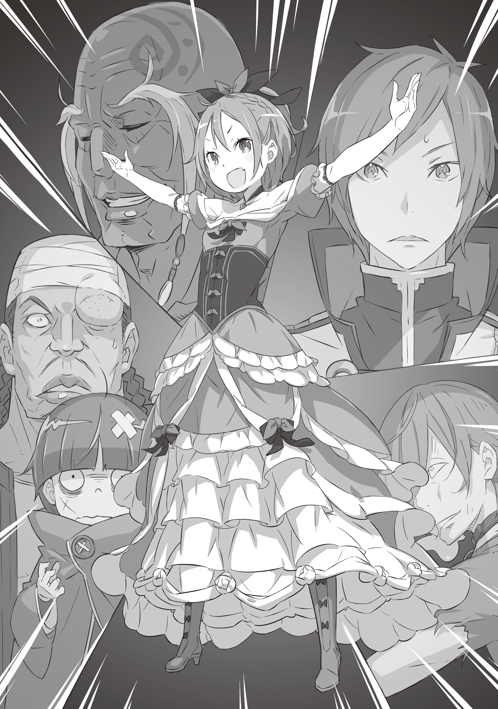

Английский перевод: Phantaminum#0097, Ice_Occultism

Русский перевод: Перакстаз

Сидя в драконьей повозке и закинув ноги на скамью, я вздохнула и решила всё же растопить лед.

— Итак, в итоге всё прошло ровно так, как ты планировал.

Послушайте, за всю свою жизнь я, кажется, ещё никогда не была так расстроена. Меня нарядили в отвратительное и неудобное платье и ни с того ни с сего бросили на встречу, которая не имела ко мне никакого отношения, и даже не потрудились ничего объяснить.

Тем не менее, у красноволосого передо мной нашлось несколько слов.

— Леди Фельт, даже если вы не на публике, вы должны стараться держаться с достоинством. Настоящая леди должна вести себя так даже среди близких друзей или в одиночестве.

— Что ж, мне бы хотелось, чтобы эти леди просто взорвались! И неужели у тебя хватило наглости, чтобы мне в лицо назвать себя моим близким другом? Перестань придуриваться, пошёл отсюда!

Я уже потеряла счёт тому, сколько раз Райнхард придирался ко мне по поводу этикета, изящества и прочих красивых вещей, но я не перестану демонстрировать ему свое недовольство и надутое лицо. Хуже всего то, что теперь я втянута в это дело под названием Королевский Отбор или что-то в этом роде, и мне придётся проводить слишком много времени рядом с этим ублюдком, раз уж во всей этой затее он назначил себя моим рыцарем.

— Я вроде как плыву по течению, надо было лучше подумать… Я уже жалею, что придётся так долго возиться с твоим дерьмом.

— Думаю, было бы проблематично выбрать любого другого рыцаря, кроме меня, леди Фельт. Что касается Отбора, то ваша неизвестная родословная и воспитание в трущобах — крайне деликатные вопросы. По крайней мере, я не могу представить никого другого, кто был бы достаточно смел, чтобы поддержать вас во время встречи…

— Эй, я всё это знаю! Именно поэтому я называю тебя проклятым ублюдком! Я уверена, что многие из этих рыцарей и вычурных дворян считают, что у тебя не все дома!

— Успокойся, Фельт-чан. Я знаю, что это пустая трата времени говорить тебе успокоиться, но истерика до добра не доведёт.

Единственная причина, по которой я не была в ещё более скверном настроении — обладатель хриплого голоса, прервавшего разговор, дедушка Ром, который сидел рядом со мной, заставляя повозку выглядеть ещё меньше.

— Ага, ладно, хорошо, но у меня на уме есть вещи, которые должны быть сказан-… Ладно, хорошо, забудьте, это просто оправдания.

— Тебе не надо строить из себя крутую передо мной, Фельт-чан.

— Я сделаю это, когда дела пойдут совсем плохо. Я не могу жаловаться на всё, когда так называемый Королевский Отбор только начался.

Мне приятно, что дедушка Ром всегда беспокоится обо мне, но я не могу полагаться на него вечно… Я знаю, сегодня я немного посплю, пристроившись на его больших руках. Затем дедушка Ром погладил меня по голове и повернулся к Райнхарду.

— Святой Меча Райнхард ван Астрея… Я думаю, что это первый раз, когда мы можем спокойно поговорить лицом к лицу.

— Верно, когда я тогда нашёл вас в доме с добычей, вы уже были без сознания. Кстати, как вы? Когда я узнал, что вы сбежали из кордегардии, я заволновался.

— Ага, я вижу, что ты беспокоишься… К счастью, я жив. Но я не тот, кто сейчас важен, это Фельт-чан. Ты… Ты правда хочешь сделать её Королём?

Дедушка Ром спросил это серьёзным и низким тоном, словно угрожая Райнхарду. Я чувствовала, что он вложил в руку больше силы, и это создало впечатление, что он бы набросился на Райнхарда в зависимости от его ответа. В моей голове мелькнуло желание предупредить, что он будет безуспешен, но…

— Да, хочу. Леди Фельт была избрана инсигнией, официально став кандидатом на престол. Я её рыцарь и с радостью отдам свою жизнь, чтобы её амбиции могли быть исполнены.

— Это, мягко говоря, странно, что кто-то вроде Святого Меча, так одержим такой маленькой девочкой, как Фельт… Надо сказать, что она маленькая даже по сравнению с девочками её возраста.

— Эй, дедушка Ром!

Я начала было суетиться, но дедушка Ром удержал мою голову в своих огромных руках и продолжил, повернувшись к Райнхарду:

— Я не хотел над тобой издеваться, я серьезно. Теперь, когда ты участвуешь в Королевском Отборе, всё, что может случиться, это не просто детские игры. Я не могу отпустить тебя в это путешествие, для начала не доверяя твоим спутникам. Поэтому нам нужно честно поговорить со Святым Меча. Понимаешь?

— Полностью. Могу ли я звать вас Ром-доно?

— Можешь звать меня дедушкой, если хочешь, но я могу представить, что это не совсем твой вкус. Так что, ты собираешься рассказать мне свои истинные намерения?

Дедушка Ром скрестил руки, меняя позу на скамье, и я сделал то же самое, глядя прямо в раздражающее лицо Райнхарда. Однако через несколько секунд он снял меч с пояса и протянул его мне, стоя на коленях.

— …И что я должна с этим делать?

— Прежде всего, я хочу продемонстрировать свою абсолютную преданность леди Фельт. Это доказательство того, что леди Фельт моя госпожа, и что мой меч принадлежит ей и только ей. Мы можем продолжить разговор после того, как это будет принято.

— Ну же, Фельт, возьми его. Кажется, что это правильно.

С одобрением дедушки Рома я взяла меч. Он был тяжелее, чем я думала, а на его белых ножнах был след когтей, словно гигантское животное наложило на него свои лапы.

— По легендам, сам Священный Дракон Волканика выгравировал свои когти на этих ножнах.

— Волканика? Дракон из легенд? Ты шутишь, да?

Если это была правда, то выходило, что мечу были сотни лет. Если он поколениями передавался по наследству вплоть до сегодняшнего дня, значит, он был настоящим сокровищем. Но у меня дрожали руки, когда я держал его, и это было не из-за того, насколько он ценен и сколько денег стоил. Затем…

— Выходит, что нет большего доказательства преданности, чем вручение такого меча Фельт-чан, так?

— Именно. Это Драконий Меч Рейд, и только Святой Меча способен достать его из ножен в трудную минуту. Поскольку в каждом поколении есть только один Святой Меча, я уверен, что вы понимаете всю важность моего жеста, когда я вручаю его леди Фельт.

— Думаю, что понимаю. Давай-ка взглянем… Эээ, — проговорила я.

Если это и вправду был столь великолепный меч, то мне хотелось взглянуть на его клинок и проверить остроту. Но когда я попыталась достать его из ножен, он не сдвинулся ни на миллиметр. Словно меч слился со своими ножнами.

— Эй, он не вытаскивается! Этот меч сломан или что-то в этом роде!

— Как я и сказал, леди Фельт, этот меч может быть обнажён лишь во времена нужды. Сейчас даже я не смогу его вытащить.

Я не была особо уверена в том, что это правда, но если дедушка Ром ничего не сказал, то это, по крайней мере, был не обычный меч. Я бросила попытки рассматривать его и просто положила его себе на колени, глядя на Райнхарда

— Ладно, хорошо, меч со мной. Так что можешь начать говорить.

— О моей мотивации и истинном намерении за тем, чтобы поддерживать вас на пути становления новым Королём Лугуники, верно?

— Да-да, именно. Это первый шаг, без этого мы не-

— Я знаю истинную причину, по которой старая Королевская Гвардия была распущена.

— ..!

Я правда не понимала, что Райнхард пытался сказать, но по реакция дедушки Рома стало ясно, насколько это важно. Ведь у него был шокированный вид, широко раскрытые глаза и дрожащий голос.

— Как… Как ты-?

— Думаю, вы знаете ответ на этот вопрос, Кромвель-доно.

— Да… Так ты знаешь ещё и обо мне… Тогда ты также должен знать, что игнорируешь желание этого человека?

— Если это то, что выбрала судьба, то пусть будет так.

Когда Райнхард ответил, дедушка Ром выдавил из себя фальшивую улыбку человека, не желающего смириться с поражением. Я понятия не имела, почему, даже если я и была предметом разговора.

— Фельт-чан, этот молодой человек тебя не предаст. Скорее, он не может тебя предать. Я это гарантирую.

— Что ты имеешь виду? Просто так? Чёрт, ты должен объяснять, чт-

Когда я попыталась повысить голос и возразить, дедушка Ром закрыл мой рот своей рукой и опять погладил меня по голове. Он знал, что я не могу злиться на него, когда он делал это.

— Ты моя внучка, моя единственная семья. Поверь мне, Фельт-чан.

— …Ты мухлюешь.

Он мне ничего не сказал, но также и не дал ничего спросить. Поэтому единственное, что я могла сделать, так это смотреть на его лицо, сдерживая слёзы. Сквозь туманный взгляд я увидела лишь дедушку Рома с самым счастливым видом за весь день.

— …Завидно.

Мне показалось, что кто-то сказал что-то в этом роде, но я не была уверена, что это не просто моё воображение. В конце концов, в это же время я довольно громко чихнула.

— Хмпф!

— Ого, всё было сметено, да, дедушка Ром?

— Ага, ничего не осталось, но так даже лучше. В другом случае мы бы, вероятно, хотели бы всё починить или заново отстроить.

— Как ответственный за произошедшее, я рад это слышать, — сказал Райнхард.

— Мы не пытаемся снять с тебя вину, так что брось быть таким самодовольным, — ответила я.

Я говорила с дедушкой Ромом и Райнхардом, стоя перед горой обломков. Это было то место, где раньше стоял дом с добычей. Возвращаясь из замка, я приказала драконьей повозке приехать сюда.

— Вы, ребят, оставите всё так или что-то построите на этом месте? — спросила я Райнхарда.

— …Прямо сейчас всё общественное строительство в Столице остановлено. Кто-то говорит, что это из-за экономического кризиса, но лично я не верю, что это единственная причина.

— Если оставить здесь кучу мусора, то, естественно, что мусор начнёт сюда стягиваться, а? Меня действительно тошнит от вас — людей, что смотрят сверху вниз… Чёрт подери.

Из ярости я пнула валявшийся на земле осколок. Было видно, что Райнхарду тоже было неприятно, так что он просто смотрел в никуда. Но, внезапно, он ступил вперёд и громко сказал:

— …Кто здесь?

В той стороне, куда он говорил, я увидела три не очень скрытных тени. Приглядевшись, я поняла, что это были три побитых парня: мелкий, обычный и высокий. Они были в синяках и кровоподтёках, словно только что выбрались из драки. Видя это, Райнхард бросил настороженность и на самом деле показал немного беспокойства.

— Они избиты? Что-то должно было случиться…

— Заткнитесь нахуй! Отдайте все свои ценности, если хотите жить, сейчас же!

Кричавший был парнем посередине, тот, у кого был обычный рост. Он угрожающе шёл вперёд с ножом в руке.

— Успокойся, Рачинс! Сейчас не время…

— Вы грёбаные идиоты, сейчас единственное возможное время! Мы проебались, используя имя Рассела, они точно убьют нас троих! Нам нужны деньги, чтобы свалить отсюда!

Этот парень выглядел отчаявшимся, и не похоже было, что он готов говорить со своими спутниками. Он снова повернулся к нам, направив на нас свой нож и подходя всё ближе и ближе. Честно говоря, я думаю, что могла бы что-нибудь сделать по этому поводу, но…

— …Достаточно.

…Райнхард был быстрее меня и ударил придурка. С учётом того, что раньше он прорезал ткань, используя только руку, я правда подумала, что он обезглавит парня прям здесь, но, к счастью, тот лишь вырубился.

— …Что?

Видя, что их друг был в мгновение ока вырублен, они были ошеломлены. Нож, который держал средний, закрутился в воздухе и был как ни в чём не бывало схвачен Райнхардом. И лишь тогда придурки поняли, с кем имели дело.

— Красные волосы и небесно-голубые глаза… Святой Меча Райнхард ван Астрея?!?!

— Вы издеваетесь?! Почему кто-то вроде него должен был появиться прямо сейчас?!…

— Если вы знаете, кто я такой, то это становится проще для всех нас. Ваш друг просто без сознания, его жизни ничего не угрожает. Я обещаю ничего больше не делать, если вы сейчас покинете это место. Что скажете?

Бедолаги тряслись от страха. По тому, как говорил Райнхард, казалось, что он даёт им возможность поджать хвост и сбежать, но по факту это была лишь завуалированная угроза. Настоящая проблема в том, что этот паршивец искренне считал себя хорошим парнем, и это бесило меня до глубины души. Хотите знать, почему? Это именно то, что богатые любят делать с бедными, то, что Королевство делает с простым сбродом.

— Обожди секундочку, Райнхард.

До того, как я успела подумать об этом, я уже всунула свой нос между ними. Райнхард был немного удивлён, но я перешагнула бессознательно свалившегося на земле бандита и повернулась двум другим.

— Этот парень на земле сказал, что вам надо сбежать. Какого чёрта вы натворили?

— Угх…

Когда им задали этот вопрос, они выглядели побежденными, как будто достигли дна. Такова реальность тех, кто живет в самом низу… Вот, что делает с этими людьми Королевство.

— Внимательно посмотри, Райнхард. Ты видишь, чем на самом деле являются трущобы? Ты пытался быть хорошим парнем и отпустить их без вреда, но это не приведёт ни к чему хорошему. Здесь наши жизни стоят меньше рисового зёрнышка. Ставлю на то, что завтра же они станут собачьей жратвой.

— Я чувствую тоже самое, леди Фельт. И что вы тогда предлагаете?

— То, что я сказала в замке. Я ненавижу это Королевство. Я хочу целиком сжечь его до тла. И когда я говорю “целиком”, я имею в виду тех, кто сверху, — сказала я, показывая на отдалённый замок, — …и тех, кто снизу, — сказала я, показывая на обломки дома с добычей.

Наконец, я показа на трёх придурков перед собой и сказала:

— Идите со мной, вы трое. Давайте перевернём вверх тормашками то дерьмо, которое вы зовёте жизнью.

— Леди Фельт?!

О Боже, Райнхард даже немного пискнул, восхитительно , — не могла не подумать я.

Но не только он был удивлен, очевидно, бандиты тоже были шокированы. Ну что ж, если они не поняли, мне ничего не остается, как разъяснить им.

— Я разрушу это Королевство. И построю на его место новое, улучшенное. Но как я собираюсь это сделать, если не могу изменить жизни трёх негодяев, живущих в трущобах?

Никто ничего не говорил. Но я не жалела о том, что позвала трио присоединиться ко мне, и я не собиралась менять своё мнение. В конце концов, я могла положиться на поддержку единственного члена моей семьи.

— Молодой человек, я предлагаю тебе просто принять это. Когда идея появляется в её голове, эта девочка не изменит своего мнения. К тому-же, ну не смешно ли?

Дедушка Ром пошёл в сторону Райнхарда и бросил в него эти слова, а затем поднял с земли бессознательного парня.

— Смешно?..

— Она трущобная собака. Воплощение величайшего позора Королевства! Первые компаньоны, которых она выбирает, это троица полунищих воров! Если для тебя это не смешно, Святой Меча, то я не знаю, что смешно.

— Не то чтобы это ложь, дедушка Ром… Но есть более приятные способы это сказать, знаешь ли!

Сложив руки за головой, я рассмеялась в ответ на его слова. И тогда он повернулся к бандитам и продолжил:

— Идите с нами, вы трое. Даже если вы просто хотите скрыться от Рассела, если он и правда дышит вам в затылок. В это время вы узнаете Фельт-чан и сами решите, что хотите делать со своей жизнью.

Закончив говорить, дедушка Ром пошёл прочь из трущоб, направляясь к драконьей повозке.

— Эй, стой! Я ни черта не понял из того, что ты говорил!..

— Я тоже, но мы не можем просто бросить Рачинса! Я иду с ними!

Высокий сомневался, но когда мелкий побежал за дедушкой Ромом, он определился и последовал за ним. По какой-то причине вид этой парочки заставил моё сердце немного подпрыгнуть. И тогда я повернулась к Райнхарду.

— А ты? Собираешься просто стоять тут или чё?

В ответ он лишь закрыл глаза и повернулся ко мне, стоя на месте до тех пор, пока я не решила тоже пойти к повозке, размышляя о том, как объяснять присутствие этих троих товарищей бабушке и дедушке, ждавших нас.

— …Леди Фельт… Если я не ошибаюсь, вы действительно должны стать… Тогда, я…

К сожалению, я уже была слишком далеко, чтобы расслышать шёпот Райнхарда, так что я не смогла уловить, что он сказал.

《Конец》
