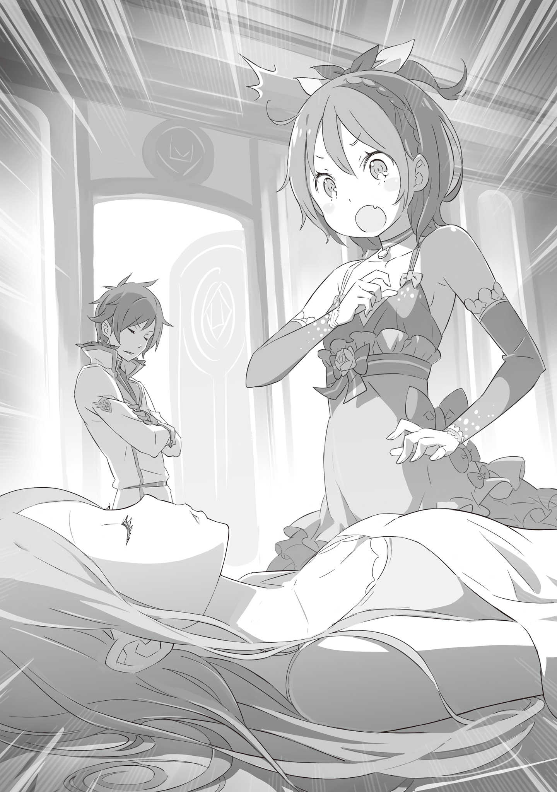

«Я победила!» — мелькнула мысль, когда я, сжав кулаки, перемахнула через огненно-красную макушку.

Мои ноги отпружинили от стены, тело взмыло к потолку. Я ухватилась за свисающий светильник, использовала его как маятник и рывком бросила себя вперед. Идеально. Стоило босым пяткам коснуться красного ковра, как я врубила полную скорость и…

— Есть! Сегодня победа за мн… уи-и-и?!

Триумфальная фразочка оборвалась позорным визгом. Меня схватили за шкирку, и я беспомощно задрыгала ногами. Воротник врезался в горло, и я повисла, словно нашкодивший котенок, издав этот дурацкий писк.

— Госпожа Фельт, леди не подобает издавать такие звуки.

Перед глазами возникло лицо того, кого я, по всем расчётам, должна была оставить глотать пыль далеко позади. Назло ему я сипло выдавила: — Гхе!

Тот, кто с таким самодовольным видом смеялся над моим поведением, был до тошноты неприятным типом с рыжими волосами и голубыми глазами — Райнхард. Всё ещё удерживая меня на весу, этот гад посмотрел на потолок.

— И всё же, суметь проскользнуть мимо меня спустя всего несколько дней… весьма впечатляюще.

— Нефиг притворяться, что хвалишь, пока сам красуешься! И вообще, я тебе не бродячая кошка, а ну пусти!

— Значит, мы можем считать, что победа снова за мной?

Райнхард с безмятежной улыбкой наблюдал, как я бессильно болтаю ногами. Вырваться было нереально. От отчаяния я вцепилась в собственные волосы, взлохмачивая их.

— Дерьмо!

В этом крике смешалось всё: гнев, обида, чувство собственной никчемности и ещё куча всего

С тех пор как этот чопорный рыцарь поймал меня и запер в своём особняке, прошло около десяти дней.

Он выдвинул издевательское условие: «Если сумеешь сбежать так, чтобы я не заметил — ты свободна». С тех пор десятки моих планов потерпели крах. У этого гада глаза что, по всему дому рассованы? Стоило мне приблизиться к выходу, как он вырастал из-под земли.

«Ладно, тогда свалю, пока он на работе», — думала я. Ага, разбежалась.

— Ну же, госпожа Фельт. Если будете всё время хмуриться, испортите своё прелестное личико.

Передо мной, сидящей на стуле с недовольной миной, опустилась тарелка со свежей выпечкой.

Сладкий аромат ударил в нос, и живот предательски заурчал, даже не спросив разрешения. Я рефлекторно схватилась за него и поймала добрую улыбку старушки, принесшей угощение.

Райнхард называет её просто «нянечкой». Эта бабуля готовит, убирает и вообще тащит на себе весь дом. Ей уже явно за шестьдесят, спина согнута, но я побаиваюсь её едва ли не больше, чем самого хозяина. Хотя, может, дело в том, что мне просто неловко грубить той, кто так искренне улыбается.

— Сегодня печенье. Вы ведь любите его, госпожа Фельт?

Я перевела взгляд с тарелки на старушку. Её морщинистое лицо просияло ещё больше, когда она пододвинула ко мне сладости. Черт, если так просят, отказать невозможно. Я схватила еще теплое печенье и целиком запихнула в рот.

Хрустящая корочка лопнула, язык обволокло сладкой начинкой.

— М-м-м…

Щеки сами собой разъехались от улыбки. Ничего не могла с этим поделать.

Меня бесило, что меня заперли здесь, что наряжают в кукольные платья и заставляют спать на перинах, но вот еда… С помоями из трущоб это не шло ни в какое сравнение.

— Слышь, баб, а может, когда я буду сбегать, пойдёшь со мной, а?

— О-хо-хо, какое лестное предложение… Но если я уйду, дедушка ведь с голоду умрёт. Молодой господин-то сам справится, а вот старик мой…

— Тц, не прокатило.

Получив вежливый отказ, я снова надулась.

Дедушка — это её муж, здешний садовник. Занимается двором, таскает продукты и почти всегда молчит. Как-то раз я ходила с ним в город, и это была пытка — он не проронил ни слова. Я пыталась смыться по дороге, но этот дряхлый с виду старикашка каждый раз оказывался именно там, куда я бежала. В итоге я выдохлась, и он приволок меня обратно, буквально таща за ногу…

— Нехорошо доставлять хлопоты двум старикам. Ай-яй-яй, как не стыдно.

— Да ты и сама, бабуль, каждый раз, как я пытаюсь улизнуть, швыряешь меня обратно в комнату без всякой жалости…

Эти двое — монстры. Даже когда Райнхарда нет, сбежать мне не дают нянька и садовник. Их движения, реакции — это не уровень обычных людей. Это потому что они служат ему? Неужели все слуги в дворянских домах такие звери?

— Кстати, рыжего с утра не видать. В замке торчит?

— Верно, у молодого господина появились неотложные дела… Но он скоро должен вернуться. Вам, наверное, одиноко, но потерпите, старая няня пока побудет с вами.

— Да не одиноко мне! Всё, я доела.

Облизав остатки крошек с пальцев, я встала из-за стола. Хотелось, конечно, вылизать тарелку, но в прошлый раз бабуля устроила из-за этого такую панику, будто мир рухнул.

— У меня уборка и другие дела по дому, так что развлекать вас не смогу… но прошу, не делайте ничего опасного. Молодой господин будет ругаться.

— Не маленькая, сама разберусь. Спасибо за хавчик!

Махнув рукой, я вышла из столовой и бесцельно побрела по коридорам. Хотя «бесцельно» — не совсем то слово. За десять дней я изучила каждый угол.

Двери наружу заперты наглухо. Окна после моего первого побега переделали так, что они открываются ровно на щель для проветривания. Разбить стекло? Слишком шумно, меня повяжут через секунду.

— Но я всё равно сбегу, зуб даю…

Конечно, здесь тепло и уютно. Но у меня есть причина вернуться. Причина, по которой я обязана вернуться.

— Старик Ром… как он там?

Единственный член моей семьи, пусть и не по крови. Десять дней назад я вляпалась по полной, втянула его, и его ранили. Райнхард скрутил меня сразу после заварушки, и я понятия не имею, жив ли он. Старик крепкий, такого просто так на тот свет не отправишь, но когда я спрашиваю Райнхарда об этом, он каждый раз уходит от ответа.

— Надо бы проверить, но как проскочить мимо этих…

Бормоча под нос, я замерла посреди коридора. Мой взгляд зацепился за дверь в самом конце крыла. Обычная, ничем не примечательная дверь. Но что-то в ней было не так.

— Эта комната… она же всегда заперта.

На ней всегда висел здоровенный амбарный замок, всем своим видом вопивший «Не входить!». Но сейчас замка не было. Я потянула за ручку, и дверь бесшумно подалась.

Быстрый осмотр по сторонам — никого. Я скользнула внутрь. По привычке крадучись, заглушая шаги, я погрузилась в прохладный сумрак.

Первое, что бросилось в глаза — в комнате было темно.

На дворе стоял белый день, но плотные шторы наглухо перекрывали доступ свету. Внутри — шаром покати: кроме сиротливой кровати в центре, никакой мебели. Лишь слабый огонёк свечи у изголовья разгонял мрак.

— Чего? Скука смертная. Я-то думала, тут сокровища заныканы или типа того… А?

Разочарованно шагнув внутрь, я вдруг ахнула. Серьёзно, сердце чуть рёбра не пробило. Зрелище, представшее передо мной, выбивало почву из-под ног.

На кровати спала женщина.

Я опешила от абсолютной, мёртвой тишины. Я не слышала ни звука дыхания и была уверена, что комната пуста. Даже глядя на неё в упор, я ничего не ощущала.

От неё не исходило человеческого присутствия.

— Ч-что это за баба…

Я подобралась ближе, но ощущение пустоты не исчезло. Труп? Кукла? Нет, не то. На щеках и губах играл здоровый румянец — она определенно была жива.

Живая, но совершенно «пустая».

— Я… не врубаюсь. Кто она вообще такая? Эй… Райнхард, урод такой, он что, не только меня, но и других девок похищает и…

— Это чудовищное недоразумение. Должен заметить, столь низкая оценка меня глубоко ранит.

Голос раздался прямо за спиной. Я подпрыгнула так, что все волоски на теле встали дыбом. Уперевшись рукой в матрас, я перемахнула через кровать и уставилась на дверь.

Там стоял Райнхард.

Прислонившись к косяку, он с редким для него виноватым выражением лица взъерошил чёлку.

— Стоило лишь на мгновение оставить дверь незапертой… Это моё упущение.

— Не похоже это на тебя. Кстати, может, проговоришься, кто эта дамочка? А то пока что в моих глазах ты выглядишь как конченый злодей, похищающий женщин.

— Это моя мать.

Он ответил просто. Без малейшей заминки.

Ответил-то ответил, но, услышав это, я лишь выдавила тупое «Ха?» и снова уставилась на женщину в постели.

Длинные золотистые волосы, рассыпанные по подушке, утонченные черты лица, сногсшибательная красота. На вид ей едва ли больше двадцати. Скажи он, что это его сестра, я бы ещё поверила. А так — ложь, причём какая-то совсем уж корявая.

— Поздравляю. Теперь ты в моих глазах суперзлодей, который не только людей ворует, но ещё и брешет как…

— Понимаю, поверить трудно, но это правда. У матушки болезнь «спящей красавицы». Она спит, не старея. Прошло уже, кажется, семнадцать лет.

— Сем… надцать?!

У меня отвисла челюсть. Если это не шутка… Мне сейчас четырнадцать. Значит, она спит ещё с тех пор, когда меня даже в проекте не было. Стоп, а тогда…

— Райнхард, а тебе сколько?

— Девятнадцать… — Райнхард пожал плечами и, глядя на спящую мать, криво улыбнулся. — У меня остались воспоминания о ней только до двух лет.

От этой его улыбки мне почему-то стало тошно. Внутри всё сжалось.

— И что, ты просто держишь больную мать взаперти, в тёмном углу особняка, и даёшь ей дрыхнуть? Гениально. Ты же дворянин, у семьи Астрея денег куры не клюют. Так вылечи её, чёрт возьми!

— Увы, горькая правда в том, что лекарства не существует… Происхождение болезни неизвестно. Тем не менее, мы держим её здесь, в столичной резиденции, чтобы мы могли немедленно отреагировать, если найдём лекарство.

— Не отвечай так спокойно, будто мы тут погоду обсуждаем…

Наверное, он уже сотни раз проговаривал этот текст. Ответ Райнхарда был сухим, отточенным и заготовленным заранее, и именно это подлило масла в огонь моего гнева.

— Это же твоя семья! Ты наверняка что-то делаешь, выворачиваешься наизнанку, а тут я лезу со своими советами, ни хрена не зная. Ты, по идее, должен разозлиться на меня!

— Факты остаются фактами. Ваши доводы, госпожа Фельт, вполне резонны. И я полагаю, что моего объяснения на этот счёт достаточно.

— Ах так, ну и ладно!

Разговаривать с этим твердолобым болваном — только нервы себе портить. Я повысила голос, почти перешла на крик, но мать Райнхарда даже ресницей не повела. Впечатав образ спящей красавицы в память, я решительно прошла мимо кровати к выходу.

— Госпожа Фельт.

Райнхард мягко, но настойчиво поймал меня за запястье. Я обернулась, скалясь так, словно готова откусить ему руку, но он, казалось, даже не заметил моей агрессии.

— Я был бы вам крайне признателен, если бы вы сохранили увиденное в тайне. И прошу вас больше не заходить в эту комнату.

— Да ты…

— И ещё. Спасибо вам за ваше беспокойство.

Я застыла как вкопанная, пытаясь переварить его последнюю фразу. Но когда смысл дошёл, кровь прилила к глазам.

Этот гад! Он прекрасно понял, почему я взбесилась и почему пыталась спровоцировать его на эмоции.

— Райнхард, ты, сука, настоящий урод!

Выплюнув ругательство, я стряхнула его ладонь и пулей вылетела из комнаты. Рыцарь вышел следом, аккуратно запер дверь на ключ и тут же пристроился рядом, как ни в чем не бывало.

Мне даже смотреть на него не надо было, чтобы знать: он наверняка идет с этой своей тошнотворной вежливой улыбочкой. Бесит!

— Кстати, госпожа Фельт. Сегодня утром я посетил караульное помещение столичной стражи.

— Ну и чё?

— Тот пожилой человек, что был с вами… Кажется, после недавнего переполоха он сбежал из-под стражи прямо во время лечения. Мы не знаем, где он сейчас.

Услышав это, я невольно затормозила. Райнхард бормотал дежурные извинения, что-то вроде «прошу прощения за недосмотр», но я его уже не слушала.

Старик Ром сбежал от стражи. Смылся.

— Сбежал, значит… Жив-здоров и на свободе.

— Вообще-то, я планировал сначала обеспечить его безопасность, а потом уже доложить вам, что с ним всё в порядке…

— Ха! Да не надо мне этого. Мою семью так просто не возьмёшь! Тебе, дворянчику с белыми ручками, не понять живучесть тех, кто вырос в трущобах.

Я с размаху тыкнула Райнхарда кулаком в грудь и зашагала дальше, мурлыкая под нос незатейливый мотивчик. Настроение взлетело до небес. Идущий рядом рыцарь тоже, кажется, слегка расслабил плечи.

Глядя на его точеный профиль, я вдруг подумала вслух: — А всё-таки вы с той женщиной похожи. С матерью твоей.

— Правда?

Лицо Райнхарда мгновенно озарилось — и на этот раз радость была совершенно искренней. Я слегка опешила от такой реакции, но кивнула: — Ага. Разрез глаз, нос — один в один. Насчёт того, мать она тебе или нет — свечку не держала, но в то, что вы родственники, поверю.

— Выходит, вы всё ещё считаете меня злодеем, похищающим молодых девушек?

— Плевать, серийный ты похититель или святоша, но меня-то ты реально взаперти держишь!

Впрочем, совсем скоро я отсюда свалю и вернусь к старику.

С такими мыслями я, брызжа слюной, продолжила орать на Райнхарда, который тут же скорчил мину невинно обиженного, и вернулась к своему главному занятию на сегодня — выискиванию шанса для побега.
