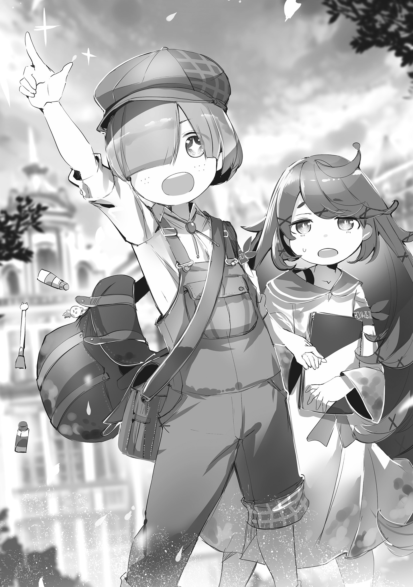
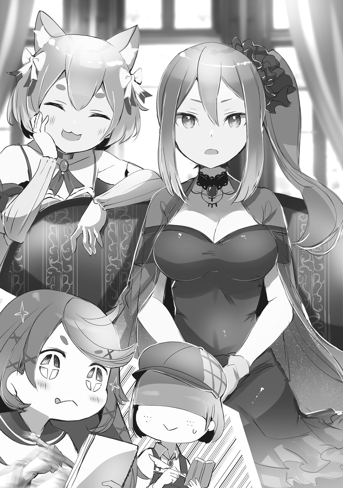
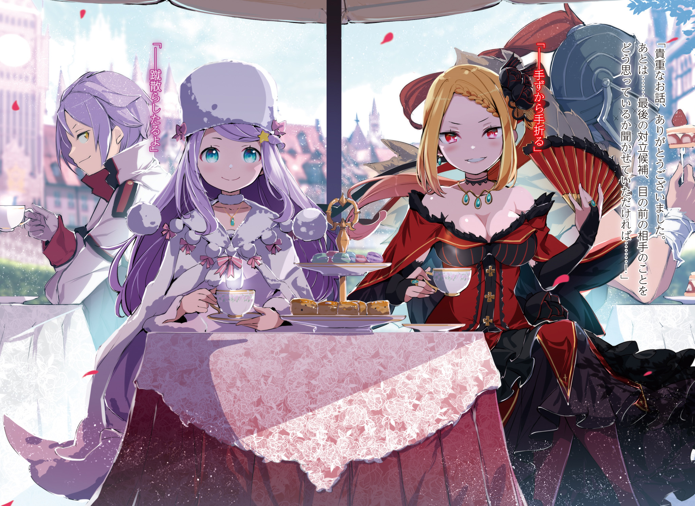
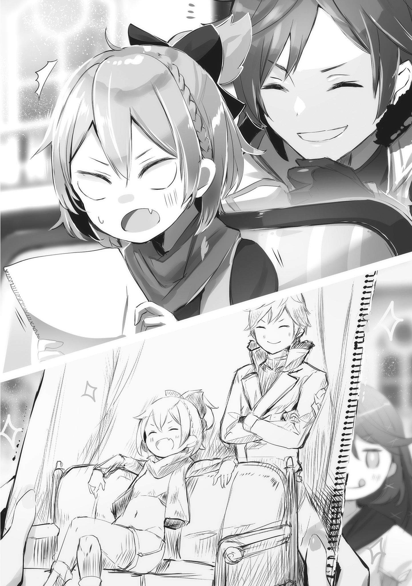
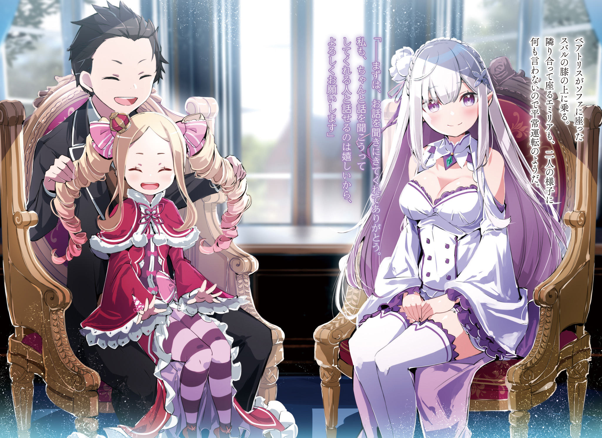
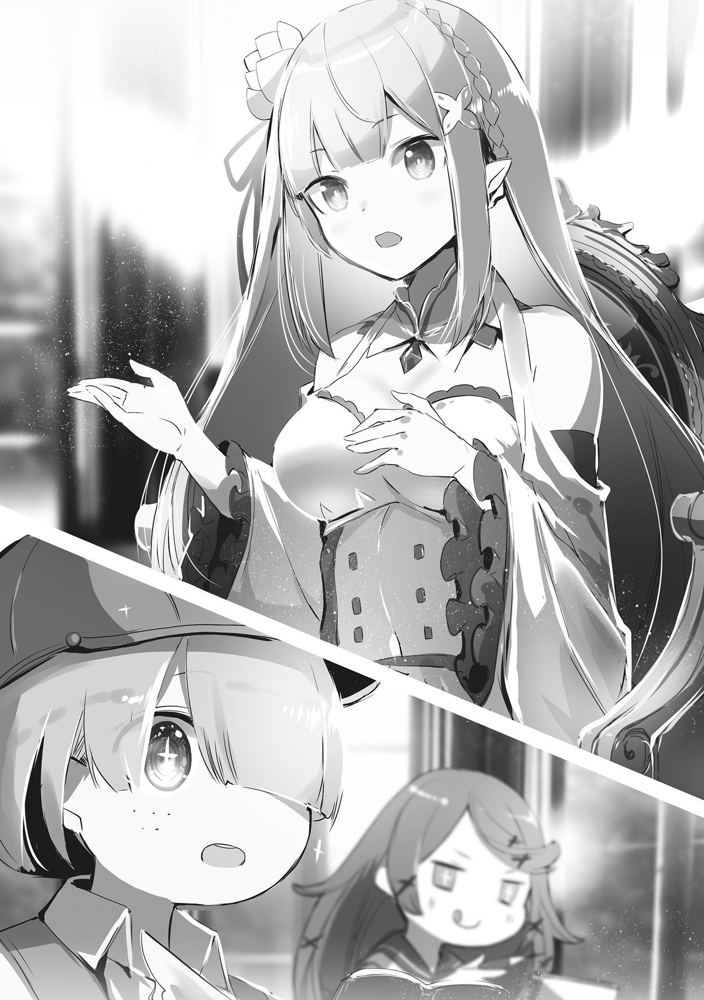

База: Goldkills

Перевод и редактура: mentalrebel

— Шорти! Шорти Меган!

Впереди шел мужчина, его ботинки громко стучали по коридору. Из-за этих шагов и хриплого голоса люди вокруг вдруг начали переглядываться, однако быстро утратили интерес, как бы говоря: «О, опять двадцать пять».

Это было явление каждодневное, довольно привычное, то, о чем даже говорить не стоит.

Мужчина, о котором идет речь, шагал вперед, не обращая внимания на людей вокруг, а затем открыл дверь с такой силой, что чуть было не проломил стену…,

— …Шорти Меган! Вот ты где!

— Ась? Да, да, да, да, да, я здесь, я здесь, Шорти Меган на месте, жив-здоров.

Дверь отворилась, и в комнате мальчик, Шорти, буквально вскочил от звука мужского голоса.

На нем была большая круглая шляпа, что полностью покрывала голову, а оба его глаза были закрыты челкой. Одет он был в поношенную рабочую одежду, а на ногах его находились изношенные ботинки, единственным преимуществом которых была долговечность.

Таким он был не из-за личного чувства красоты или желания быть уникальным, вне мировых тенденций, а из-за отсутствия всего необходимого: интереса, богатств и, прежде всего, времени.

Все это было очевидно по тому факту, что он никогда не ходил домой, а вместо этого ночевал в своей рабочей комнате, которая всегда была завалена разными бумагами.

Мальчик… Шорти Меган вытер рукавом слюну со своего рта и поспешно повернулся лицом к вошедшему мужчине.

— Мо-, Мо-, главный редактор Морган? Какими ж вы судьбами?

— Да, эт я! Я Морган Франц, главный редактор «Вестника Драконьей Нации», а Шорти — мой человек, мой репортер, мои конечности. Я прав?

— Агась, я ваш человек, ваш репортер и ваши конечности тоже.

— Да-да! Однако! В лучшем случае ты лишь мизинец на моей ноге! Если ты хотел опубликовать такую статью, других пальцев я бы тебе не доверил, а то было б слишком рисково!

Это был начальник Шорти, главный редактор Морган Франц, — и он злился, его характе́рное лицо с орлиным носом покраснело. Франц был ответственен за публикацию газеты, которая выпускалось в пределах Королевства Лугуника, «Вестник Драконьей Нации», а еще он был бесстрашным работником, что ничего не знал об уступках.

Высокий, громкий, дерзкий главный редактор был настоящим новостным наркоманом, что внимательно следил за всеми странностями в Королевстве и пускал слюни при виде каждодневных событий.

Была только одна причина, почему помешанный на новостях главный редактор потрудился навестить Шорти, этого ничтожного репортеришку. Значит, он увидел его статью.

— Получается, вы проделали весь этот путь, чтобы… да! Это ваша похвала, я польщен!

— Похвала? С чего бы? Взгляни на мое лицо! На лицо мое, говорю! Семьдесят процентов… нет, восемьдесят процентов моего орлиного носа краснющее. Вот насколько я зол!

— Начальник! Он на сто процентов ярко-красный!

— Раз так, то эта статья разозлила меня гораздо сильнее, чем я думал!

Со словесным напором темный краснолицый Морган швырнул в Шорти кипу бумаг. Она влетела в грудь маленького репортера и упала на пол. Это была статья, которую Меган писал всю ночь, его труд ценой крови, пота и слез, — и вот как к нему отнеслись. Другими словами…,

— Вы хотите, чтобы я ее подправил?

— Идиот! Статья отклонена! Какова ж твоя наглость! Во-первых, кого приведет в восторг массовое нашествие гигантских крыс под столицей Королевства? Было интересно, появятся ли по ходу дела какие-нибудь сюрпризы, но заключительные слова снова полная лажа! Ну-ка, повтори их!

— …Если вы хотите узнать остальное, то вам придется убедиться в этом лично!

— Цыц! Не отправляй любопытного читателя в опасное подземелье! Просто позови стражников и попроси разобраться с крысами! Что, если какие-нибудь читатели заболеют или даже умрут, когда будут бросать вызов гигантским крысам?

— Здесь речь об ответственности?

— Идиот! Проблема в том, что мы потеряем читателей!

Шорти поднял свою статью с пола, а Морган тыкнул пальцем в его нос.

Мегану были по душе идеи Франца, даже несмотря на то, что основывались они на ценностях, которые можно было назвать лишь зависимостью от газет. И все потому, что Шорти тоже был новостным наркоманом.

Вот почему эта статья стала результатом его собственной практической работы.

— Моя работа большущая, в ней опрашивались жители трущоб и подробно описывались стаи гигантских крыс, что сильно расплодились под столицей Королевства. И что, теперь все это отклонено?

— Ясен пень! Спину прямо, подбородок вверх! …Таков девиз «Вестника Драконьей Нации»!

— …Мы не публикуем ничего, что не заставит ваше сердце содрогнуться!

— Именно так!

Шорти выпрямился, на что Морган в него плюнул. Меган, маленький репортеришка, огорченно стиснул зубы, когда лицо его покрылось большим количеством слюны.

Честно говоря, Шорти часто спрашивал себя, правильно ли было делать такое в своих интервью.

— Но, если ты что-то начал, то бросить на полпути — значит понести убытки…!

— Всегда ценил твою стойкость, но на этот раз она проявилась в плохом свете. Кстати о плохом, у меня сложилось такое же впечатление и о иллюстрации в этой статье!

— Чего? Даже о иллюстрации? Но разве она не потрясная?

— Нарисовано даже слишком хорошо! Это похоже на орду… орду гигантских крыс, что вот-вот зашевелятся!

Выхватив статью из рук Шорти, Морган распахнул настежь иллюстрацию для печати.

Пред глазами Шорти возникла орда крыс… Точнее, реалистичный рисунок орды крыс. Он был настолько реален, что кто-то даже мог бы учуять крысиный запах.

Шорти же, напротив, переполняли воспоминания из той страшной встречи с оравой крыс — ощущения, что были как визуально, так и обонятельно выверены.

— Уххх…

— Не блюй на свою же статью! Знаешь, а ведь у многих читателей будет такая же реакция. Лулулала сделала эту иллюстрацию, я прав?

— Тсс, она где-то здесь…

Шорти, борясь с тошнотой, указал дрожащим пальцем в угол комнаты.

Проследив за движением его пальца, Морган спросил: «Серьезно?», и тут глаза его расширились. Средь гор бумаг… там была девочка, что рассеянно водила кисточкой по стопке.

— Оооо?! Так вот ты где, Лулулала!

— …на месте…

— Что ты делаешь в этом бардаке? Здесь воня… ой-ой, ты воняешь! Воняешь-то как! Ты что, не мылась с тех пор, как вернулась из подземелья? О~ох, угхх!

Девочка… Лулулала бросила взгляд на Шорти, который, сдерживая рвоту, зажал свой нос, и замолчала. Однако, вопреки безэмоциональному выражению лица, она продолжала что-то рисовать в тетрадке на своих коленях.

Художник-иллюстратор для статей «Вестника Драконьей Нации» — вот кем она была.

И еще…,

— Лулулала настоящее сокровище… Она может перенести на рисунок что угодно. Даже что-то странное она может сделать просто сногсшибательным. Это что, обида? Ты чего такой жалостливый, Шорти?!

— Э! А, ну, нуу…

— Что за хмурый взгляд, Меган.

Шорти удивился такой внезапной переменой отношения, отчего, чтобы скрыть это, попытался улыбнуться дружелюбно. Однако, когда Морган заметил это, щеки его покраснели так же, как и нос.

— Мы должны вызывать у читателей эмоции, трогать их прямо за душу. Но как же мы это сделаем, если даже в чувствах-то своих честно не можем признаться! А я-то вижу! Вижу, что ты не можешь в них признаться!

— Ах…

— Меган! Почему? С какой целью, ради чего ты пришел работать в «Вестник Драконьей Нации»? Неужто для того, чтоб за крысиными хвостами гоняться, да заставлять читателей из Королевской столицы хмурить свои бедные брови? Мм? Говори!

— Н-нет!

Тут же Шорти решительно возразил Моргану, возразил его вызывающим словам.

Отбросив всякую подавленность, Меган впился глазами в своего начальника, который был выше его на сантиметров сорок. Маленький репортер разгорячился, словно в огне, он стер дружелюбную улыбку и положил свои настоящие, истинные чувства на язык.

И вот, на вопрос, почему же он пришел работать в «Вестник Драконьей Нации»…,

— Я, я так хочу писать статьи, статьи, которые изменят сердца людей… изменят сам мир! Я ведь не для того стал репортером, чтобы брать за душу только тех, кто ненавидит крыс!

— Ну так в чем же дело? Почему ты только и делаешь, что попусту тратишь драгоценное время и талант Лулулалы, да спишь в куче бумаг!

— Н-ну… нуу… я…

От слов своего начальника Шорти стиснул зубы и посмотрел на свою напарницу. Лулулала вечно забывала о еде и сне, посвящая всю себя рисованию. Такой талантливый художник-иллюстратор заслуживал гораздо, гораздо большего.

Нет, прежде всего, сам Шорти, его пыл, требовал работенки получше.

— …

Шорти проглотил язык, его окатила волна страсти к своему делу.

Краем глаза он заметил статью на стене рабочей комнаты. Ее написал не Шорти, однако она все равно была наклеена там, словно что-то важное, значимое.

Ее содержание было идеальным примером того, что Шорти представлял себе как «статью, что изменит сам мир».

Он так хотел написать нечто подобное…

— …Королевские Выборы.

— Что?

Одна бровь Моргана дернулась — вот насколько неожиданными были слова Шорти. Маленький репортер сразу же заметил перемену в голосе своего начальника.

Он содрогнет сердце главного редактора — своего первого читателя.

— Я… я возьму интервью у Кандидаток Королевских Выборов! Их реальные голоса, их настоящие лица — мы услышим и познакомимся с ними. Эти женщины, они ведь сейчас будоражат все Драконье Королевство, все жители только о них и думают, переживают, волнуются.

— …

— Что думаете?

Шорти, который так энергично рассказывал о своей идее, забеспокоился, ведь Морган ответил ему лишь молчанием.

Безрассудно. За такое он мог получить выговор. Однако все его страхи были развеяны широкой ухмылкой главного редактора.

Шорти расширил глаза, и вдруг Морган схватил его за плечо своей большой ладонью.

— Хорошо! Очень хорошо, Шорти! Вот это я понимаю!

— Ааай-яй! Мое плечооо!

Его кости заскрипели, он вскрикнул от боли. Впрочем, вместе с криками Шорти вдруг загорелись глаза Моргана.

— Да-да! Люди только и думают о Королевских Выборах! Уже пару месяцев прошло с того, как их объявили, и поначалу все только об этом и говорили, но со временем шумиха стихла. Так давайте же тогда сами попробуем вернуть внимание народа к Королевским Выборам… Неплохо! Весьма неплохо!

— С-спасибо!

— Цыц, идиот! Ты ж еще ничего не сделал, отставить радость!

— Агась, да, в точку! Идиот! Я идиот!

На радостях Морган поднял Шорти, однако на такой эмоциональный ответ тут же уронил, плюнул в него и поднял палец вверх.

— Тогда не стой на месте, Шорти, в темпе, в темпе! Не дай кому-то себя переплюнуть! Возьми интервью у Кандидаток Королевских Выборов и приложи все усилия, чтобы эта газета вышла в свет! А статью про крыс я заменю.

И вот так Морган схватил статью про гигантских крыс и опрометью выбежал из комнаты. От его силы и резкости разлетелись все бумаги, а заодно и взъерошилась длинная челка Шорти.

В комнате, после того как утихла бумажная буря, Шорти пылко сжал кулаки.

Он, конечно, чувствовал, что сболтнул чего не к месту, однако страсть в его сердце все еще была неподдельной, настоящей.

— Я сделаю, я смогу, я изменю сам мир! Лулулала, тебе наконец-то будет чем заняться!

— …на.

— А? Это мне?

Шорти пыхтел от воодушевления, его нос опух. И вот, когда он повернулся в ее сторону, Лулулала вырвала лист из своей тетрадки для рисования и протянула ему.

…Там был нарисован Шорти, у которого от воодушевления аж кровь из носа потекла.

— Блин, а не лучше ли было просто сказать об этом?

Он поспешно засунул салфетку в нос, а затем аккуратно сложил рисунок и положил в карман. Следом Шорти схватил свой интервьюерский инвентарь и стал готовиться к будущим свершениям.

— От гигантских крыс к Кандидаткам Королевских Выборов… трудновато нам будет, но мы постараемся, постараемся, чтобы интервью прошло на ура! Да начнется наш великий путь! За дело, Лулулала!

— …покеда.

— Какой «покеда»?! Мы вообще-то вместе идем!

Лулулала свернулась калачиком, чтобы чуток вздремнуть, однако Шорти взял ее на спину — он также не забыл про ее художественные принадлежности. И вот так, довольно неуклюже, они покинули административное здание «Вестника Драконьей Нации».

— …тише.

— Нет, медлить нельзя! Говорят, Кандидатки просто неотразимы, поэтому, уверен, творчество твое покажет себя на все сто! Дело нам предстоит грандиозное… нет, величайшее!

Их приключения начались. Шорти отчаянно взывал к своей холодной напарнице.

Шажки его были тяжелыми, а напарник — вялым, но даже так глаза Шорти сияли. Сегодня такой прекрасный день. День, чтобы написать статью. Статью, которая перевернет сам мир.

— Смотри, Лулулала… какое голубое небо! Оно освящает наш путь!

— …облачное оно какое-то…

— А ты не глазами смотри, а сердцем, сердцем!

«Вестник Драконьей Нации» знают как небольшую газету в Королевстве Лугуника.

Она освещает самые разные события, которые, соответственно, приносят самые разнообразные эмоции: от новостей довольно радостных, скрашивающих мирную жизнь граждан, до происшествий болезненных и печальных, в которых кто-то где-то потерял свою жизнь.

Впрочем же, какие бы эмоции это ни приносило, в «Вестнике Драконьей Нации» был стержень, столп, основа всего. А именно…,

— Мы не публикуем ничего, что не заставит ваше сердце содрогнуться! Так гласит девиз нашей организации, Лулулала.

— …буу, буу.

— Может, прекратишь уже пускать слюни и послушаешь меня? Знаю-знаю, это твоя привычка, но в местах, куда мы с тобой пойдем, так делать не положено.

Маленький репортер воодушевленно поднял свой кулачок, однако у его напарницы не было ни мотивации, ни интереса.

Они вышли из административного здания и по пути зашли в ресторан, чтобы поговорить о предстоящем интервью. Шорти строил планы, разжевывал их вслух, а Лулулала лишь молча слушала.

— Мы будем обходить Кандидаток. Ну и вот, у меня к тебе вопрос, насколько хорошо ты разбираешься в Королевских Выборах?

— …выборы? Королевские?

— Почему ты выглядишь так, будто вообще даже не понимаешь о чем я?! Блин-блин-блин, как так! У тебя ж работа с газетами связана! Тебя что, дела общества вообще, что ли, не интересуют? Кошмар, какой кошмар! Стой, а лицо-то мое испуганное зачем рисовать? Ты меня пугаешь!

Как вы уже поняли, Лулулала зарабатывала себе на жизнь иллюстрациями для газет. И хотя к рисованию у нее был талант, на деле она чудачка, которую не волновало ничего, кроме искусства.

И Шорти предстояла большая работа с этой хлопотной напарницей.

— Сейчас я расскажу тебе, моя дорогая напарница, о грядущей теме нашего интервью. Если хочешь, можешь не слушать, просто это поможет мне собраться с мыслями.

— …мгм.

У него получилось найти с ней общий язык. Шорти, на радостях, прочистил горло легким кашлем и принялся рассказывать Лулулале о Королевских Выборах и его Кандидатках.

— Начнем с того, что Королевские Выборы — это церемония, в которой избирается следующий правитель. Она была объявлена в Королевском Замке примерно шесть месяцев назад. Через три года из пяти Кандидаток будет выбран Король… Так что сейчас у нас в стране полным ходом идет борьба за то, кто станет Королем.

А историю о том, как Король и его род массово заболели, по праву можно считать одним из самых последних и незыблемых случаев Великой Катастрофы в Королевстве Лугуника.

Как итог, сейчас Королевство осталось без Короля, и вместо него государственными делами заправляет Совет Мудрецов. Тем не менее, ситуация по-прежнему плачевная. И чтобы решить эту проблему…,

— Борьба за трон, или сокращенно — Королевские Выборы. Пять Кандидаток — герцогиня Круш Карстен, президент Анастасия Хосин, баронесса Присцилла Бариэль, Фельт-сама и Эмилия-сама.

— …а немного ли?

— Нет, не много, если учесть сроки… Мы же не знаем, сколько Кандидаток останется в день, когда объявят окончательное решение.

Лулулала наклонила голову, похоже, она не понимала истинный смысл слов Шорти.

Если в борьбе за трон от Кандидатки требуются определенные качества, то нетрудно предположить, что между ними может разгореться война — вплоть до убийств.

— Я в том смысле, что нельзя называть себя Кандидаткой Королевских Выборов, если в тебе нет серьезной решимости. Ну, то есть, все пять Кандидаток всегда должны быть готовы сделать что-то из ряда вон выходящее.

Кандидатки претендовали на пустующий трон. У всех них, должно быть, просто запредельные амбиции.

— Плюс ко всему, они — женщины… Нет, думаю, лучше сказать — героини. Круш-сама носит титул «Валькирия», Анастасия-сама занимает видное место в Городах-государствах Карараги… А Фельт-сама, как я слышал, заправляет бедными районами. А! И еще, что самое важное, ее поддерживает «Святой Меча».

— …«Рыцарь из Рыцарей»?

— Агась… О, а ведь Лулулала когда-то рисовала господина Райнхарда.

Реакция Лулулалы напомнила Шорти об одной из ее предыдущих работ.

Однако речь идет не об интервью. Она случайно встретилась со «Святым Меча», когда прогуливалась по столице в свой выходной, и он любезно согласился, чтобы его нарисовали.

Что интересно, Лулулала очень загорелась этой идеей и с воодушевлением вложила в кисточку всю себя. Готовый рисунок получился отменным.

Теперь он надежно хранится в папке-скоросшивателе Шорти на работе.

В общем…,

— Если господин Райнхард присягнул ей на верность, значит, Фельт-сама личность очень выдающаяся. И осталась только…

— …мм?

— Эмилия… -сама… она…

Страх охватил все тело Шорти, когда он попытался рассказать о последней Кандидатке.

Он побледнел и затрясся, что очень озадачило Лулулалу, но если бы она знала причину, то испугалась бы не меньше.

Кандидатка Эмилия — полуэльфийка с серебряными волосами и аметистовыми глазами, по описанию точно «Ведьма Зависти», которая в прошлом почти уничтожила мир.

Поговаривают, она — дьявол с жутким и жестоким Духом, холод которого может оледенить все вокруг. По слухам, эта полуэльфийка навсегда заморозила земли на севере Королевства и ради забавы устраивает снежные бури, портя жизнь обычному народу.

Конечно, на самом деле Эмилия не «Ведьма Зависти»… но была достаточно опасна, чтобы ходили слухи, что она — ее второе пришествие.

…Кроме Шорти наверняка были и другие репортеры, которые хотели сделать такой же материал.

Но «Эмилия» — главная причина, по которой ничего из этого не вышло.

Если это интервью с Кандидатками, то, разумеется, нужны все пять. Но вот опрашивать Эмилию или нет — вопрос смелости интервьюера.

Самой большой преградой для интервью станет его страх перед сребровласой полуэльфийкой — Шорти был в этом уверен.

— …

На страх маленького репортера Лулулала стала водить кисточкой по своей тетрадке.

Особого толку от того, что она рисовала, не было, но ее спокойствие удивило Шорти и помогло ему прийти в себя.

— Изменю… сам мир…

Он стиснул зубы, когда вспомнил вызов, который бросил главному редактору.

Шорти не собирался забирать свои слова назад. Он не просто стиснул зубы, а вкусил свою мечту.

— Отставить страх. Я справлюсь, Лулулала. Я сделаю свою работу.

— …мхм, вот еще.

— Ой-ой. О как, о как, да уж, теперь буду знать.

Она протянула ему готовый рисунок. Шорти с улыбкой посмотрел на зарисовку того, каким бледным он был, и убрал ее в сумку.

— Последняя — баронесса Бариэль, или же — Присцилла-сама. Ее прозвали «Кровавой Невестой», ведь за плечами у нее столько неудачных браков. Она молода и красива, а потому часто выходила замуж, но все ее любовные связи заканчивались трагично… Она трагическая женщина.

— …трагическая.

— На своих землях за ней закрепилось доброе имя. Люди любят ее и называют «Принцессой Солнца». Думаю, характер у Присциллы-сама мягкий, как тепло огня, поэтому люди вокруг нее всегда искренне улыбаются.

Судя по всему сказанному, Присцилла Бариэль — это та, чью судьбу Шорти поддерживал больше всего.

Женщина cо множеством трудностей на пути, которые она должна преодолеть, чтобы завоевать славу.

Ее история успеха и героизма тронет сердца всех читателей.

— О нет-нет, так нельзя. Нужно быть объективным, ведь иначе это будет некрасиво к той Кандидатке, которая первой согласилась на наше интервью.

— …мм…?

— Герцогиня Круш Карстен.

Он вздрогнул, предвкушая скорое интервью.

Круш Карстен — важная фигура в Королевстве и самая предпочтительная Кандидатка на сегодняшний день.

— По правде сказать, я думал, что получить от нее добро будет самым сложным, даже эмоционально. Но не ожидал, что она так сразу откликнется.

Как-никак, Карстен — самая влиятельная и знатная в Королевстве, женщина большой чести.

Шорти казалось нормальным, если ему прямо на пороге откажут в интервью для газеты, которая выходит для всеобщего развлечения. Тогда бы он десятки, нет, сотни раз просил об интервью, дожидаясь, когда же наконец собеседник потеряет терпение…

— …это бы сработало?

— Не знаю… Круш-сама настолько мужественна, насколько это вообще возможно для женщины. Она вынудила собственного отца уйти в отставку, когда он еще мог работать и работать, Круш-сама очень амбициозная.

В противном случае она не стала бы герцогиней, носящей титул «Валькирия».

Возможно, она согласилась на интервью, чтобы использовать Шорти, тогда он станет лишь жалкой добычей.

— Даже если противник — знать среди знати, с сотней битв за плечами, нужно быть себе на уме…

Для начала они раскроют истинное лицо первой Кандидатки Королевских Выборов, Круш Карстен.

Даже если их первое интервью окажется последним, Шорти Меган будет бороться до конца. …С мрачной решимостью в сердцах они были готовы к работе.

Но, как оказалось, мрачные опасения Шорти не оправдались.

Герцогиня Круш Карстен согласилась дать интервью «Вестнику Драконьей Нации» не из враждебности и не потому, что хотела навести шороху.

На самом деле…,

— Значит, вы уже два года работаете вместе… Несмотря на юный возраст, вы хорошо справляетесь.

— Что вы, что вы, в этом нет ничего такого, ха-ха-ха…!

Юный репортер покраснел от внезапной похвалы и пониже опустил козырек своей шляпы.

В ответ зеленоволосая красавица улыбнулась, изящно прикрыла рот рукой и сказала: «Какой скромный».

Восхищаясь ее манерами, Меган почувствовал, как его прямо-таки поглощает дух этого места… точнее, дух его собеседницы. В душе он волновался, ведь ему еще только предстояло тяжелое интервью.

Шорти и Лулулала прибыли в особняк семьи Карстен, который располагался в Дворянском Районе столицы Королевства. Их провели в просторную гостиную, где они, выглядя как-то по-дурацки, уселись на премягкий диван.

Напротив них сидела очаровательная женщина, точно дева небес, отчего ему захотелось потереть глаза, он хотел понять сон это или нет.

Именно, дева небес — она была достойна такого описания. Пышные зеленые волосы Круш доходили до спины, а элегантное платье подчеркивало все стройности ее тела… Одной лишь красоты Карстен хватало, чтобы Меган разучился мыслить ясно.

— …кх.

— Лулулала-сан, с тобой все в порядке?

— Ваше беспокойство дорогого стоит, но она всегда себя так ведет, поэтому, прошу вас, просто не обращайте внимания…

Шорти стало не по себе, когда Круш наклонила голову и обеспокоенно посмотрела на нее. Но он сказал правду: Лулулала, которая увлеченно рисовала кисточкой, была далеко не обычной.

Она от природы следовала своим желаниям. Говоря проще, если Лулулала находила великолепный сюжет для рисунка, уже никто и ничто не могло ее остановить, даже Шорти.

Но в таких-то ситуациях ее зарисовки и получались по-настоящему восхитительными.

— …пожалуйста.

— Это мне? И на нем… я, да?

Глаза Круш расширились, когда она любезно приняла рисунок Лулулалы.

Глаза маленького репортера, в которых, если приглядеться, отражалась прекрасная Кандидатка — вот что из себя представляла эта зарисовка. Даже по меркам Шорти, который часто видел рисунки Лулулалы, это была неплохая работа. Умение его напарницы реалистично рисовать то, что находится прямо перед глазами, проявилось во всей красе.

— Так бы и повесил в своей комнате…

Разумеется, его бормотание услышала Круш и издала: «А?». Шорти, чтобы исправить ситуацию, в спешке начал искать нужные слова.

— Да, я тоже так думаю. У нее очень здорово получилось, уверена, и Ферри-чан захочет повесить его в своей комнате.

— Ах, это да, это точно…! Надеюсь, так и будет!

В такт своим чувствам он кивнул, его веки распахнулись. И тут, по иронии судьбы, появилось новое лицо, которое прошипело «Ня-хи-хи» и село рядом с Круш.

Пополнение на сцене — страшно симпатичная особа.

Если «красивая» — хорошее описание для Круш, то «милая» — как раз под стать ей, ведь ее жесты, взгляд, обаяние и изящество были столь утонченны, что глаз не оторвать.

Но не стоит недооценивать Шорти, он — репортер газеты, а потому давно провел расследование, чтобы выяснить, кто эта девушка… нет, кто-то, похожий на девушку.

— Р-Рыцарь Феликс Аргайл-доно?

— Да, но так ко мне не обращаются. Мне бы хотелось, чтобы ты называл меня Феррисом, но можешь звать и Ферри-чан.

— О, нууу, эээ, тогда — Феррис-доно.

— Хихихи, как мило.

Феликс… нет, Феррис поднес палец к губам и улыбнулся, — мужчина, он был мужчиной. Его озорное лицо и жесты могли говорить обратное, но он все равно оставался мужчиной.

Круш Карстен, Кандидатка Королевских Выборов, и Феррис, ее Рыцарь.

И вот, эти двое — хозяйка и слуга — станут героями интервью Шорти и Лулулалы.

— Феррис, лишний раз не подтрунивай над репортерами.

— Хорошоооо. Прошу прощенья, Круш-сама, но вас так хорошо нарисовали, неужели вы им позировали?

— Из-за того, как ты это сказал, я чувствую, будто сделала что-то постыдное… нет, я не позировала. Просто Лулулала-сан мастак своего дела и видит все до мелочей.

Круш опровергла слова Ферриса и посмотрела на Лулулалу.

Тотчас же маленькая художница, завороженная красотой ее янтарных глаз, принялась за второй рисунок.

Не желая отставать, Шорти слегка кашлянул и сказал,

— Т-теперь, когда Кандидатка Круш-сама и ее Рыцарь Феррис-доно здесь, могу я задать пару вопросов для нашего интервью?

— Да, для меня большая честь, что вы прибыли сюда. Не уверена, что оправдаю ваши ожидания, но благодарна за внимание.

С изящной осанкой Круш поклонилась Шорти, который так тщательно подбирал слова.

Он был сражен ее красотой, поклоном, да и вообще всем. Все его тело охватила дрожь, отчего он издал странное «Ух».

— Ой, Круш-сама была слишком вежливой, теперь он напуган. Спокойствие, только спокойствие.

— Спокойствие… Хочешь сказать, мне нужно быть самой собой?

— Ммм, нуу, не совсем так, но сойдет. Репортер-кун, а тебе лучше набраться смелости.

— Х-хорошо.

Круш и Шорти кивнули его словам.

Феррис явно имел власть над всеми здесь. Тем временем Лулулала, которая просто занималась своим делом, похоже, решила на втором рисунке изобразить хозяйку и слугу вместе.

— Кхм, Круш-сама, вы ведущая Кандидатка, и прошло уже несколько месяцев с начала Королевских Выборов, поэтому я хотел бы узнать, как продвигаются ваши дела.

— Пожалуйста, будь самим собой.

— Э-это, это все, что я пока могу…

Дамские манеры и краса Круш поразили Шорти, ведь все его ожидания, все то, что он про нее узнавал, оказалось другим.

Амбициозная герцогиня, также известная как «Валькирия», была воином, воином, который сместил даже собственного отца. И все же сейчас перед ним стояла словно совсем другая женщина. Единственное, что все-таки сходилось с его ожиданиями, — это ее красота.

И вот, перед Шорти, которого охватили эмоции, Круш слегка опустила уголки глаз и,

— Думаю, говорить о том, что я единственно достойная Кандидатка, как-то неправильно. Мне еще многому предстоит научиться, поэтому для Королевского Трона я не то, чтобы сильно гожусь.

— Круш-сама?

— А? В-вы серьезно? О, но опускать руки и сдаваться вы не собираетесь, да?

Он не мог поверить своим ушам, только что Круш заявила, что не уверена в себе и недостойна трона, да от такого даже сам Феррис впал в ступор.

Их первое интервью началось сразу же с неожиданностей. Круш Карстен, ведущая Кандидатка Королевских Выборов, призналась маленькому репортеру, что лежит у нее на сердце…

— Нет, не поймите меня неправильно.

Величественный голос Круш разбил смятение маленького репортера и ее Рыцаря. Шорти сам удивился тому, как быстро успокоился.

У него аж дыхание перехватило, он был так ею заворожен, будто все его душевные порывы были ей подвластны.

— Я все еще учусь и… если в чем я и превосхожу других Кандидаток, так это в семейных корнях. Но Королем мне это стать не даст, вот почему я усердно работаю над собой.

— Усерднее некуда…

— Так пусть же тогда неопытная я в конце концов стану той, кто превратится Короля достойного, со всей ответственностью на плечах. Пусть же мои последователи и вассалы протянут мне руку помощи в том, что я не умею и не могу.

— …Круш, -сама.

Круш нежно улыбнулась и положила руку на плечо своему Рыцарю. Феррис повернулся к своей госпоже и на глазах его выступили слезы.

Шорти очень проникся этой трогательной сценой и тоже почувствовал тепло в глазах.

— …Это так продуманно и благородно. Кхм, думаю, стоит сменить тему. Не могли бы вы рассказать нам о победе над «Белым Китом»? О подвиге, в котором объединили усилия все Кандидатки Королевских Выборов.

— О, раз уж на то пошло…

— Вильгельм ван Астрея, человек, без которого мы бы не справились и который больше всех вложился в победу над «Белым Китом», числится в нашем лагере.

Слова Круш разожгли огонь в Феррисе, отчего он заговорил. Хотя Шорти и удивился его напору, именно это он и хотел услышать.

— Да-да, я и об этом спросить хотел! У двух главных героев песни «Любовь Демона Меча» и «Белого Кита» очень тесная связь и…

— А, точ-ня-к! Дайте мне буквально пару секунд! Я сейчас же приведу сюда старика Вила!

С этими словами Феррис перепрыгнул через стол и выбежал из комнаты, а Шорти вдруг занервничал, он что, сможет взять интервью лично у «Демона Меча»? Глядя на его реакцию, Круш хихикнула.

— О, нет-нет, то есть, извините! Я не забыл, что вы главное лицо нашего интервью, Круш-сама!

— Не стоит извиняться. Если речь идет о моих последователях или им подобных, то, думаю, это синоним интервью со мной. К тому же, я считаю, что история Вильгельма должна получить бóльшую огласку.

— Н-ну, раз вы так говорите… О, есть еще кое-что, что я хотел бы у вас спросить.

Шорти, даже с некой наглостью, захватил внимание Круш и направил его на свои слова.

Он подумал, что если Ферриса не будет рядом, то сможет услышать ее искреннее мнение. Несколько месяцев прошло с начала Королевских Выборов, произошло много событий, которые вызвали переполох в стране, и…,

— Круш-сама, какой лагерь вас сейчас больше всего интересует?

— Хм…

Она задумалась. Но ее колебания и раздумья в миг прекратились, похоже, она быстро пришла к ответу.

Хотя Круш и должна была говорить о своих противниках, она улыбнулась.

А затем…,

— …Думаю, лагерь Эмилии-сама требует особого внимания.

Вот что она ответила.

— Ух… все совсем не так, как я ожидал, от начала и до конца интервью было очень добрым.

Устало пробормотал маленький репортер, покидая особняк семьи Карстен.

Но устал он не физически, а умственно. И хотя то, чего Шорти изначально опасался, оказалось напрасным, все же благоговейный страх был больше, чем он себе представлял.

Зато с уверенностью он мог сказать, что итог стоил того, чтобы устать душой и телом.

— Не думал, что история Вильгельма-доно будет такой долгой, но…

Шорти хотел как можно больше узнать о победе над «Белым Китом», поэтому Вильгельм, с разрешения своей госпожи, спокойно поведал ему. Маленький репортер не ожидал, что большая часть рассказа «Демона Меча» будет о любви к своей жене, предыдущей «Святой Меча», которую убил «Белый Кит».

— …кх.

Они вернулись в район обычных граждан и остановились перед фонтаном на площади. Тут Лулулала, что так бодро работала кистью, раскраснелась — в ее новой тетрадке уже вот-вот закончатся страницы.

Видимо, этому поспособствовали Круш и Феррис.

— Что ж, думаю, это нормально. В конце концов… не всегда все должно соответствовать слухам.

Мужественная и амбициозная герцогиня с тягой к фехтованию — вот кто такая Круш. С ее-то славой она может показаться высокомерной аристократкой, даже несмотря на то, что семья Карстен славится тем, что знает свое дело.

Но на самом деле Круш всегда была мягкосердечной, осознавала свои недостатки и прекрасно умела давать отпор, не жертвуя собственными амбициями.

— Кто бы в итоге ни стал Королем, я хочу, чтобы он был именно таким…

— …твое мнение.

— Что? Нет, нет, нет, вовсе нет! Репортеры должны быть объективными и неподкупными!

Когда Лулулала услышала, что Шорти бормотал себе под нос, он в панике стал отнекиваться. Однако она ничего не ответила и продолжила рисовать.

Шорти вздохнул и пониже опустил свою шляпу.

— В любом случае, я подытожу то, о чем мы говорили, ведь наша обязанность — рассказать, что слухи, а что реальность…

— …на.

Лулулала потерла пальцем нос и протянула Шорти новый рисунок. Тот посмотрел на него и поднял брови.

Как и ожидалось от Лулулалы, она гений в рисовании иллюстраций для газет.

…Там был красивый портрет Рыцаря и госпожи, которые склонились друг к другу, держась за руки.

— Да, получилось просто замечательно. Держишь планку, Лулулала!

— …счастливый… из-за красивых женщин…

— Да ты что, не смотрю я на них так, и вообще, Феррис-доно — мужчина, ясно тебе?

И хотя его расстроило то, с каким презрением она на него посмотрела, задело его репортерскую душу, он не имел претензий к содержанию интервью и качеству рисунка. …Впрочем, это было только первое интервью.

— У нас еще много работы впереди… Чем дальше, тем бдительнее мы должны быть.

— …реально?

— Не делай вид, что удивлена! Я говорю всерьез! Потому что… следующая Кандидатка для нашего интервью родом из другой страны.

Лулулала выглядела так, будто никогда и не слышала о других странах, но Шорти уже привык к тому, что она ничего не знала, поэтому часто ее посвящал.

Тем не менее, на этот раз она должна была разделять с ним то же волнение.

— Анастасия Хосин-сама — президент крупной Торговой Компании в Городах-государствах… Она одна из самых влиятельных людей в Карараги. Чтобы претендовать на трон Королевства, она проделала долгий путь от своей страны до нашей… Чувствуешь это?

— …я мылась.

— Да я не про твой запах! И вообще, если бы ты плохо пахла, то это было бы неприлично по отношению к Круш-сама!

В первую очередь, спрашивать Лулулалу было ошибкой, ведь ее нос могли обмануть пары красок. У Шорти был нюх на конфликты, но его еще нужно было оттачивать и оттачивать.

В этом и заключалось распределение их обязанностей, маленькому репортеру еще предстояло сыграть свою роль.

— До сих пор, если и были какие-то вмешательства со стороны других стран, то только от Империи Волакия на юге. К слову, до Королевских Выборов ходили слухи, что члены Совета Мудрецов тайно ездили в Волакию, чтобы подписать пакт о ненападении.

Все полагали, что именно с югом стоит быть начеку. Но Анастасия, ставшая Кандидаткой, могла оказаться неожиданной угрозой уже с запада.

К тому же…,

— Чувствуешь-чувствуешь это? Есть что-то подозрительное в том, кто поддерживает Анастасию-сама, — в Юлиусе Юклиусе.

— …он мылся?

— Он тот, кого называют «Безупречным Рыцарем»! Я бы очень разочаровался, если бы он не мылся! Хотя если он и правду грязный, очень надеюсь, что он все-таки помоется!

Конечно, было бы куда спокойнее, не будь у него этого чутья.

Однако неизвестно, почему и с какой целью многообещающий талант, которому, как он слышал, доверяют даже в рыцарском братстве, решил посадить на трон Короля влиятельного человека из другой страны?

Семья Юклиусов — это семья рыцарей, которая существует вот уже несколько поколений, и не было даже случая, чтобы Королевство Лугуника хоть сколь-нибудь в них сомневалось. Так что оставалось только одно…

— Либо господин Юлиус страшно амбициозен, либо он просто предатель…

— …о как.

— Будет очень плохо, если все действительно так… Что же эти двое замышляют? Именно это я и постараюсь выяснить.

Шорти сжал кулаки, в нем загорелась решимость.

После интервью с Круш он стал увереннее, у него появилась новая цель. Меган хотел разобраться в Королевских Выборах.

Слухи о Круш не совпадали с реальностью. Вот почему нельзя было точно понять, кто может стать хорошим Королем.

Поэтому «Вестник Драконьей Нации» станет пособием, он откроет всем глаза, расскажет об истинной сути вещей.

— …Нет, не «Вестник Драконьей Нации», а мы.

— …крутецки…

— Да! Мы уже начали свое дело. А значит, нужно делать до конца. Мы справимся. Именно поэтому…

Шорти достал из сумки новую тетрадку для рисования и протянул красноносой Лулулале. Ее глаза заблестели, она взяла ее.

Лулулала была полна любви к жизни, а Шорти — целеустремленности.

И, с этим настроем…,

— …Что бы ни задумала Анастасия-сама, какие бы планы ни скрывала, совершенно неважно. Меня не обвести вокруг пальца всякими словами, я во что бы то ни стало докопаюсь до ее истинных намерений!

— Мои намерения? Разумеется, я хочу себе все Королевство.

— Уххх…

Слова девушки, которая поставила локти на стол и подперла подбородок рукой, заставили Шорти распахнуть глаза.

Ее мягкое, нежное поведение, озорное лицо, чем-то напоминающее морду благородной кошки, и слова лишили Шорти всякой решимости.

Еще никогда он не видел, чтобы на попытки разгадать истинные мысли отвечали с широкой улыбкой.

— Что такое? Как-то ты очень необычно отреагировал, мне нравится.

— Анастасия-сама, думаю, шутить здесь не к месту, это неприлично.

— Ах, на меня злятся. Мой Рыцарь такой серьезный.

Девушка, которая в ответ высунула язык… Анастасия Хосин, молодая глава крупной Торговой Компании Хосин, внешне олицетворяла собой слово «милый».

Длинные волнистые волосы светло-фиолетового цвета и меховая одежда, которую она носила даже в жару. Несмотря на невысокий рост и хрупкий вид, ее светло-бирюзовые глаза скрывали бунтарский дух, а обаяние просто очаровывало.

Она была столь же красива, как и Круш, отчего Шорти задумался, по каким критериям отбирают Кандидаток.

Он подумал: да не может быть, они что, выбирают Кандидаток по внешности?

— Хм? Чего ты на меня так смотришь, думаешь о чем-то? Если есть что на уме, говори.

— Ничего такого, просто мне интересно, как это работает, ведь и вы, Анастасия-сама, и Круш-сама такие красивые.

— А?

Анастасия прикрыла рот рукой и удивленно раскрыла глаза. Шорти издал «Ох» и мысленно отругал себя за свои неосторожные слова.

Тем не менее, она рассмеялась, а мужчина рядом с ней кивнул.

— Полностью согласен. Анастасия не только умна и деловита, но еще и очень привлекательна.

— Если ты не будешь серьезен, то зря потратишь время и силы репортеров.

— Мм… Прошу прощения. Я должен быть внимательней.

— А! О, ээ, простите, мне так трудно понять, что здесь происходит! Ха-ха-ха…

Шорти извинился за свои слова, погладил шляпу и натянуто улыбнулся.

А что еще ему оставалось? Перед ним — Анастасия, вторая Кандидатка на Королевские Выборы, и ее Рыцарь Юлиус Юклиус.

…Интервью с Кандидатками проходит гораздо лучше, чем ожидалось.

Хотя, может, какой-нибудь Кандидатке с тайнами это интервью и не понравится, но две из них уже согласились без проблем.

С тремя другими, скорее всего, будет сложнее.

— Вот тут-то нам и нужна удача, ну… ну пожалуйста…!

К счастью, Анастасия приехала в столицу по делам и согласилась на интервью. Юлиусу, ее Рыцарю, тоже разрешили присутствовать.

Лулулала, которая стояла сейчас перед этими двумя, наверняка думала так же.

— И кстати… это нормально, что интервью у нас будет на улице?

— Хм, ну, мы могли бы пригласить вас в наш магазинчик, но тогда бы вы, репортеры, очень нервничали. Я не хочу, чтобы люди подумали, будто бы мы заставляли вас писать статью, которая бы нас устроила.

Анастасия улыбнулась и посмотрела на городскую суету.

Это была веранда кафе на главной улице. Именно Анастасия выбрала это место для интервью.

Шорти не хотел писать о них ничего плохого. Но решение Анастасии провести интервью в общественном месте показало ее силу и дальновидность, чего не было у Круш, которая действовала более прямолинейно.

— Вы и правда хотите себе все Королевство?

— Я не скрываю своих целей: я уже заявила об этом перед другими Кандидатками и Советом Мудрецов. …Интересно, обратит ли на меня внимание тот ребенок, если скажу что-то порезче.

— Тот ребенок… О, вы о Лулулале?

Анастасия взглянула на Лулулалу, которая сидела, неуклюже обхватив колени, и что-то рисовала кисточкой: интервью она даже не слушала.

Впрочем, Лулулала всегда так работала.

— Ей лучше всего работается именно так… Если вы не против, давайте не будем ее отвлекать.

— …че пристали.

— Лулулала! Сейчас же извинись! Извинись… и расслабь шею.

— …Как же вы быстро рассорились, я даже и слова сказать не успела.

Шорти попытался опустить голову Лулулалы, но не смог: ее шея была удивительно сильной. От этого Анастасия рассмеялась.

В любом случае…,

— Что ж, должен сказать, она очень сосредоточена. Шорти-доно, могу я взглянуть на ее работу? Кстати, мой брат тоже рисует.

— Ваш брат… О, что ж, если вы не будете с ней говорить, думаю, она не будет против.

— Потому что разговор ее отвлечет?

— Ну, просто когда в такие моменты я пытался с ней поговорить, она меня не замечала от слова совсем, и мне от этого становилось только хуже.

Даже если это часть работы, тяжело, когда тебя игнорируют несколько часов, а то и дней.

Юлиус, скорее всего, расценил реакцию Шорти как знак профессионализма Лулулалы. Он сказал: «Понял» и прошел за ее спину, чтобы посмотреть на рисунок.

Это было просто любопытство или он хотел проверить, нет ли там ничего такого, что могло бы подорвать репутацию Анастасии? Его восхищенное «Ого» должно было сбить Шорти с толку?

— У тебя богатое воображение. Может, тебе лучше стать писателем?

— О чем это вы? Я репортер, моя работа — рассказывать о том, что я вижу и слышу, как оно есть. Я не писатель, который фантазирует о том, чего на самом деле нет.

— О? Ну, пусть будет так, пусть так.

Шорти почувствовал, что Анастасия как будто играет с ним на каждом шагу. Если он продолжит поддаваться ее уловкам, интервью не получится.

Возможно, то, что она хочет себе все Королевство, всего лишь шутка.

— Что? Думаешь, я вру? Я говорю серьезно.

— А…?

— У тебя хватило духу на интервью с Кандидатками, так? Если я буду тебя обманывать, это будет неуважением к твоему труду.

— …

Шорти замолчал, когда Анастасия сложила руки перед лицом и посмотрела на него. Он был поражен, ему было приятно узнать, что она не хочет его обмануть.

Круш привлекла Шорти тем, что призналась в своей неопытности, что она находится на пути становления. Анастасия же показала нечто другое, что захватывало и вызывало желание узнать о ней побольше.

— Хорошо, ответите ли вы на пару моих откровенных вопросов…!

— Так неловко быть искренней и открытой, но для вас это шанс написать хорошую статью… поэтому добавим немного изюминки…

— Изюминки? О чем в-…

Шорти не успел договорить, ведь внезапно раздался громкий и четкий звук шагов. …Тут он впервые узнал, что даже звук ботинок может содрогать сердца.

Однако это чувство полностью исчезло, когда на сцену вышла она .

— …Какая наглость — говорить обо мне, лисица.

Шорти невольно напрягся, когда неописуемый жар обжег его уши.

На улице появилась красавица, ее голос и взгляд были полны магии, которая пленяла сердца всех вокруг. И он тоже попал под ее чары.

Она заметила, что Шорти смотрит на нее слишком пристально, и насупила брови.

— Что такое? Как невежливо — пялиться на мое лицо.

— Ааа! Про-, простите… Я не хотел…

— Разумеется, всех пленяет моя красота. Если уж смотришь, то смотри с достоинством.

Багровоглазая, пышногрудая красавица предстала перед ними с веером в руке.

Она была невероятно красива, с ослепительно-оранжевыми волосами, украшенными драгоценностями, и платьем цвета крови, подчеркивающим ее фигуру.

И тут…,

— Позвольте представить ее, репортеры. …Она — принцесса. И еще такая же Кандидатка, как я.

Когда Анастасия со спокойствием сказала это, Шорти про себя подумал: «Я и так знал, кто она».

— …

Шорти был на грани. Ему казалось, что его сердце вот-вот остановится, и единственное, что он сейчас слышал — это как Лулулала неустанно водила кисточкой по бумаге.

…Шорти искренне завидовал Лулулале, которая могла просто уйти в себя.

— Я-я так рад нашей встрече, а погодка сегодня солнечная, да? Как же мне отблагодарить вас за то, что вы пришли… Ах, солнце слепит мне глаза, да-а-а…

Шорти выдавил из себя искреннее и честное приветствие, которое смешалось со словами о погоде. Если это вся его возможная грубость, то парнем он был хорошим. В этой ситуации даже бы его начальник Морган переживал, а ведь Шорти — лишь начинающий репортер, но, конечно, так оправдываться он не собирался.

— Репортер-сан неплохо-таки выкрутился. А ты так не считаешь, принцесса?

— Что ж, этот ребенок забавный, но соглашаться с тобой я не буду, это отвратительно.

— Как же с тобой тяжело, но от тебя я подобного и ожидала.

Анастасия улыбнулась и прикрыла рот рукой, на что другая девушка с укором нахмурилась, тихо фыркнула и качнула своей пышной грудью. От такого поворота мысли Шорти разбежались в разные стороны, и обе девицы сразу же заметили его волнение. Та, кто сидела напротив Анастасии… это Присцилла Бариэль. Получается, на этом интервью будет аж целых две Кандидатки…,

— Э-это так неожиданно, я-я… М-меня даже никто об этом не предупредил…

— Я приношу вам глубочайшие извинения, это был план Анастасии-сама, хотя, конечно, я понимаю, что вы навряд ли их примите, Шорти-доно, мисс Лулулала.

— Да нет, что вы, что вы, господин Юлиус. Эй, Лулулала… Лулулала?

Хоть Юлиус извинился от имени своей госпожи, Шорти все равно был им восхищен. И вот, когда его сердце учащенно билось, а руки тряслись, маленький репортер повернулся к своей напарнице, дабы разделить все те душевные переживания, но ответила она ему не словами, а свежей работой.

…На ее рисунке был изображен бледный Шорти с пеной у рта.

— Весело тебе, значит!

— А? О, неплохой-таки рисунок. Можно я заберу его, чтобы вспоминать о сегодняшнем дне?

— Н-ну, забирайте… Если вас, конечно, мое лицо на нем не смущает…

Анастасия неожиданно высоко оценила сей шедевр. Хотя Шорти было не по себе от того, что его ошарашенное лицо останется у нее, он все-таки отдал рисунок. Лулулала же обрадовалась тому, что ее работа понравилась Анастасии. Так или иначе…,

— Совместное интервью уже началось? Я почему-то думаю, что принцесса не дружит с интервью на месте, но я рад, что пока все получается.

Странный мужчина, который сидел позади Присциллы, рассмеялся и пожал плечами. С ним они уже успели познакомиться, и он отличался от того же Юлиуса. Мужчина, Ал, выглядел как какой-то разбойник, а лицо его скрывал черный-черный шлем. Как и Юлиус, который служил Анастасии, Ал был Рыцарем Присциллы, но сам он от этого титула отмахивался.

— Я — клоун принцессы. Всегда не любил рыцарей. О, и я сейчас не про тебя, «Безупречный»-сан, без обид. Ну, я в общих чертах пояснил, так сказать.

— Не чувствую, что вы хотели меня задеть. А мне вот нравятся рыцари. Я сейчас говорю в общих чертах, как и Ал-доно.

Ал и Юлиус обменялись парой слов, сидя за спинами своих хозяев. Шорти заметил, что Анастасия и Присцилла язвительны друг к другу, но эти Рыцари — точно нет.

— Обнадеживает… Если бы еще и вы, Рыцари, спорили, я бы, наверное, не выдержал.

Анастасия одурачила репортеров, но они были готовы закрыть на это глаза.

— …Понятно, ты хочешь, чтобы это интервью отличалось от того, что было до нас.

Мысли Шорти полностью захватила Присцилла. Она скрестила руки на груди и заговорила, гордо выпятив свою грудь и оглядывая всех по очереди: Шорти, Лулулалу, Ала, Юлиуса и, наконец, Анастасию.

— Все равно тебя не понимаю, лисица, почему именно я?

— Хм… Уверена, и другие Кандидатки согласились бы на мое предложение: Фельт-чан или Эмилия-сан точно. И все же…

— …

— Я посчитала, что принцесса лучше всех поймет смысл моего предложения.

Анастасия мягко улыбнулась и приложила палец к губам. В наступившей тишине щеки Шорти расслабились.

…Шорти Меган возьми себя в руки.

— Что ж, неважно. Есть люди, которые говорят, что мелкие пакости не зло, но я, в отличие от них, не такая твердолобая. У планов лисицы есть свой смысл.

— О? Ого. Принцесса умеет уступать? А эта бизнесменша не пальцем деланная.

Когда Присцилла свела эту тему на нет, Ал свистнул и похвалил Анастасию. Настя ответила: «Ну и хорошо», на что Юлиус прижал руку к груди и,

— Благодарю за понимание. Итак, Шорти-доно, я понимаю, что вы удивились, но не могли бы вы продолжить интервью?

— А? О, да, конечно! Просто я сильно нервничал, у меня аж ноги тряслись, но мне, как журналисту, надо стоять на своем! Спасибо, что привели меня в чувства!

— Да-да, только слишком вопросами нас не дави.

— Дети всегда трудолюбивы. Постарайся.

Под ответы Анастасии и Присциллы Шорти пришел в себя и вернулся к интервью. Разные вопросы мигом начали приходить ему в голову. Прежде всего, Шорти решил задать Присцилле тот же вопрос, что уже задавал Анастасии.

— Что ж, первым делом я хочу задать вопрос вам, Присцилла-сама. Я уже спрашивал об этом Анастасию-сама, но вас — еще нет. Что вы планируете делать после того, как станете Королем?

— Хо, а что ответила лисица?

На вопрос репортера Присцилла приподняла бровь и взглянула на Анастасию, которая тут же махнула рукой и,

— Я ответила так же, как и в замке. Если, конечно, принцесса не забыла.

— Твои банальные хотелки живы, пока жива твоя жадность, лисица.

Присцилла раскрыла веер, который достала из своей груди, и сказала это, на что Настя лишь махнула рукой. Шорти был просто поражен амбициями Анастасии, но продолжил,

— Общественности интересно мнение всех Кандидаток, так что, Присцилла-сама, какие у вас планы?

Борьба за то, кто станет следующим Королем, уже началась, поэтому жителям Королевства, включая Шорти, хотелось побольше узнать о характерах и планах Кандидаток. Информацию можно легко передать, но также легко можно изменить ее форму, цвет и запах. Три Кандидатки уже согласились на интервью… Шорти заметил, что их репутация отличалась от того, что было на самом деле. Присцилла, например, вовсе не была хрупкой дамой, на которую обрушилось множество трагедий и несчастий. Она — сильная личность с величественным характером и ярко-красным одеянием, будто пламя или свежая кровь. …Так что же она планировала для Королевства?

— …Ничего.

— А?

Шорти, который уже предвкушал, каким будет ответ, опешил. Снова и снова он прокручивал ответ Присциллы в своей голове.

— Н-ничего? Ничего… Это значит…

— Прими это как данность. Меня не особо интересует Королевство и все, что с ним связано. …Просто все в этом мире с самого его начала принадлежит мне.

— …

— Но гармонию природы, думаю, нарушать не стоит. Поэтому я, быть может, позабочусь о деревьях, но сей мир прекрасен и так. …Ведь создан он в угоду мне. Так что если победа будет за мной, то будет вам и процветание Королевства.

Присцилла, опираясь подбородком на руку, спокойно ответила репортеру. Это прозвучало как шутка, как идея, которая не сбудется, как фантазия, которую не мог вообразить даже самый влиятельный человек. Но Шорти понимал, что Присцилла не шутит, и не потому, что она его пугала, а потому что он просто всем сердцем чувствовал это.

— Как всегда, идеи принцессы заставляют ужаснуться… Если бы все было так, как ты говоришь, весь мир был бы всецело за тебя.

— В этом я серьезна, лисица. Все остальные дела по Королевству можно решить и без вашего восхождения на трон. Хотя твоя жадность — это большая-большая проблема. …Вот почему ты — мой враг.

— Ну и ну, как ты меня высоко оцениваешь, спасибо. Я тоже считаю тебя врагом, принцесса.

Несмотря на спокойный вид, ответ Анастасии был резким. Так как на это интервью пришли две Кандидатки, можно было подумать, что общаться они будут просто, расслабленно, но подобные мысли быстро улетучились.

— Вот почему мне нужно побыстрей перейти к делу…!

Что касается предыдущего заявления Присциллы, то нужно подобрать правильные слова, чтобы люди поняли их правильно, но это лишь вопрос добра и зла — драматизировать факты не стоит. Все Кандидатки ясно говорили о своих намерениях. И вот,

— Что вы думаете о других Кандидатках?

— Сейчас наиболее перспективной считают Круш-сан, так? Она занимает хорошую позицию, но вопрос только в том, сколько поддержки получит ее политика.

— Та выскочка из трущоб строит из себя невесть что. Она руководит толпой дураков, у которых амбиций выше крыши — да так, что они уже даже под ноги свои не смотрят. Если она и дальше будет такой «одаренной», то и сил на нее тратить не стоит.

Анастасия и Присцилла ответили на вопрос Шорти. Раз Кандидатки друг друга не перебивали, значит, разногласиям тут не место. Репортер поспешно записал в памяти их ответы. Круш и Фельт. Получается, осталась только…,

— …Что вы думаете о пятой Кандидатке, о Эмилии-сама?

— …Не заслуживает внимания.

Кандидатки ответили одновременно, из-за чего Шорти на секунду замер, но затем заговорил,

— П-почему вы так считаете?

— Наверное, не мне говорить, ведь я из Карараги, но происхождение Эмилии-сан большая проблема. Полуэльфийка… С серебряными волосами и аметистовыми глазами, прямо-таки пример черт, которые создадут много бед.

— Дело не в ее способностях, какова бы ни была природа, обычный люд очень невежественен, ведь судит он только по тому, что сам хочет видеть и слышать.

Несмотря на разные слова, Кандидатки говорили об одном и том же. В Королевских Выборах положение Эмилии было довольно противоречивым, даже мрачным. Это чувствовал и сам Шорти.

— Я наслышан, что Эмилия-сама вместе с вами, Анастасия-сама, а также Круш-сама, сыграли важную роль в победе над «Белым Китом», одним из Трех Великих Зверодемонов, и еще над Архиепископом Греха…

— Это дело рук не самой Эмилии-сан, а ее Рыцаря, строго говоря. Да и раны от «Ведьмы Зависти» не так малы, чтобы их можно было залечить только этим. Я ведь правильно говорю, Юлиус?

— Как ни печальна эта ситуация, но да.

Когда Анастасия обратилась к нему, Юлиус покачал головой, опустил глаза с длинными ресницами и,

— Мы не знаем, как сильно людей взяла за душу битва с «Белым Китом» и Архиепископом Греха, но, как и сказала Анастасия-сама, многого ждать не стоит.

— Да уж. Если ты не получишь за все это признание, то на кой черт вообще было это делать? Просто чтобы ничего не получить?

— Ал-доно, думать в таком ключе…

— Неправильно? Это называется мыслить трезво. Хотя какая разница, что мы с тобой думаем? Главное, чтобы мы со своими принцессами были согласны, ведь так?

Юлиус нахмурился, ведь Ал вел себя лицемерно. Но тот лишь постучал правой, единственной которая у него была, рукой по своему шлему. Сухой металлический звук как бы символизировал суровую реальность, с которой придется столкнуться Эмилии, и Шорти прочувствовал ее на себе. Однако…,

— Всегда есть и победители, и проигравшие, но вот условия победы каждый определяет сам для себя, поэтому это не тот вопрос, на который можно легко ответить.

— Принцесса?

— Нет сомнений, эта полудьяволица нам не соперник в Королевских Выборах. Но неужели все Кандидатки настолько глупы, что так и не догадались о кое-чем? Не верю.

Мнение Ала, последователя, отбило мнение Присциллы, его госпожи. Он очень удивился, наклонил голову и сказал: «Эй-эй»,

— Мне что это сейчас, в спину выстрелили? Вы со мной не согласны, принцесса?

— Способ один, но итог — разный. То же самое можно сказать и о мышлении этой полудьяволицы.

— Принцесса, вы пытаетесь сказать, что она не хочет стать Королем или что? У нее какая-то другая цель?

— Нет, тогда бы все это не имело смысла. К тому же…

В голосе Ала чувствовалось волнение и растерянность. Шорти хотел было задать вопрос, но не смог, ведь он был всего лишь Шорти… Этот ничтожный репортеришка просто ничто по сравнению с Присциллой.

— Если все и дальше будет так продолжаться, то…

— Хмм?

Присцилла фыркнула и сузила глаза, когда в дело вмешалась Анастасия. Они, как Кандидатки, были одного мнения об Эмилии. И вот, секунду спустя, Анастасия продолжила:

— Любопытно, да? Для Эмилии-сан и ее лагеря эта игра с самого начала обречена на провал, но они все равно решили встать на доску. Как-то забавно выходит. Получается, у них есть какой-то план, чтобы все изменить? Так вот что ты имела в виду, принцесса.

— Лисица, если ты борешься только из-за каких-то гнусных циферок, то ты недостойна отражаться в глазах моих.

Ее улыбка и насмешка противоречили друг другу, но Шорти, как ни странно, проникся. Почему-то эмоции Анастасии и Присциллы казались ему ожидаемыми.

— Блин, ощущение, будто на меня наступили. Лучше бы принцесса наступила на меня, чем на мои чувства.

— Ал-доно, мы же перед репортерами. Как Рыцарь, будь осторожен в своих словах.

— Спасиб, что напомнил, но я не Рыцарь и быть им не особо хочу.

— Жаль. Очень жаль.

Ал погремел шлемом, чтобы поставить в этом разговоре точку, и за этим не стояло никакой злости. А может, Шорти ошибался и здесь…

— Большое вам спасибо за ответы. А теперь… Если не сложно, расскажите, как вы относитесь к Кандидатке перед вами…!

— …А ты не из робкого десятка, репортер-сан.

Шорти задал нешуточный вопрос, от которого Ал удивился, а Юлиус усмехнулся, но не задать его было нельзя. Обе Кандидатки сидели друг напротив друга: отличная возможность показать свои истинные чувства. Видимо, Анастасия и Присцилла ждали этого вопроса, ведь посмотрели друг другу в глаза и одновременно заговорили…,

— …Я хочу ее рукой разрубить.

— …Я хочу ее вышвырнуть куда подальше.

Они обменялись «любезностями», которые даже можно было принять за высшую похвалу.

— А-а-а, по-моему, я из-за всех этих нервов пару лет жизни потерял…

— …ты просто устал.

Лулулала, обхватив одной рукой колени, похлопывала бледного Шорти по спине, когда он сел рядом с ней. Она была к нему очень внимательна, возможно, понимая, сколько усилий он вложил в это интервью.

На самом деле интервью выдалось просто замечательное, о чем говорило переполнявшее Лулулалу вдохновение. Количество рисунков Анастасии и Присциллы с разных сторон было рекордным, а главный редактор Морган остался доволен их качеством. Конечно, были еще работы с Юлиусом и Алом, последователями Кандидаток, но…

— Что-то здесь не так, Лулулала… Ты как-то слишком сильно внешностью Кандидаток увлеклась, не думаешь?

— …ты не прав.

— Если сравнить количество рисунков Кандидаток, господина Юлиуса и Ала-доно, то как-то не очень убедительно получается! Ала-доно ты вообще только один раз нарисовала!

— …рисую только то, что содрогает мое сердце, прям как ты и говорил нашему начальнику.

Лулулала использовала девиз «Вестника Драконьей Нации» как предлог, чтобы увильнуть от обвинений Шорти. Это значило, что Ал содрогнул ее сердце только один раз…

— …я нарисовала его, потому что он выглядел таким серьезным.

— Ал-доно… Да, он выглядел очень серьезным.

Лулулала нарисовала момент, когда он разошелся во мнениях с Присциллой. Шорти был в шоке, когда услышал ответ Ала о другой Кандидатке… об Эмилии.

— Когда мы закончим с Кандидатками, можно взяться за их Рыцарей. Мне вот было бы интересно узнать побольше о лагере Эмилии-сама и ее Рыцаре.

— …ближе к делу.

Шорти усмехнулся тому, как Лулулале не терпелось перейти к главной теме.

— Ты просто помешана на рисовании красивых людей! Мне кажется, от следующей Кандидатки ты вообще с ума сойдешь.

— …кто же она?

— Я же говорил тебе уже, хватит притворяться! …Нет, не от Кандидатки, а от ее Рыцаря. Да брось, ты же не могла забыть то, о чем я тебе недавно говорил!

— …я тебя не слушала.

— Э… Почему! То, что ты меня не слушаешь, это так-то очень плохо!

На память своей напарницы Шорти надеяться не мог, поэтому ворчал и кратко писал пером о том, что было на интервью, чтобы ничего не забыть. Они неожиданно взяли интервью еще и у Присциллы, из-за чего Кандидаток осталось всего две. Следующая, к кому они поедут, это…,

— …Фельт-сама. У нее тоже пестрое прошлое, но ее затмила Эмилия-сама.

— …пестрое!

— К твоим рисункам это дела не имеет, я имею в виду и правда пестрое! Как бы это попонятнее сказать-то… Фельт-сама — сирота, которая выросла на бедных улицах столицы Королевства. …То есть она такая же, как мы, Лулулала.

Тут Шорти посмотрел Лулулале, которая держала на коленях тетрадь для рисования, прямо в глаза. Сейчас они, репортер и художник, работали в «Вестнике Драконьей Нации», но так было не всегда. Шорти и Лулулалу бросили родители, и они оказались на улице, среди бедных детей, которые копались в мусоре, чтобы выжить. В такой-то обстановке можно было легко стать злодеем или заняться нелегальщиной, но, к счастью, они избежали такой судьбы. Их талант и пыл заметили, из-за чего они получили работу в вестнике. Такая же история была и у Фельт. …Хотя поднялась по карьерной лестнице она значительно выше, им о таком только мечтать и мечтать.

— Про Фельт-сама ходит куча слухов, многие из которых вранье враньем. Уж я-то ей вопросов назадаю, вот увидишь… Но больше всего меня интересует ее Рыцарь!

— …святой!

— Агась! «Святой Меча» Райнхард ван Астрея… То, что он поддерживает Фельт-сама, играет большую-большую роль.

Для большинства читателей «Вестника Драконьей Нации» Кандидатки были как облака — они их видели, многое слышали про них, но дотянуться и узнать получше не могли. Хотя было так, кстати, и при жизни Короля. Поэтому, если народ и поддерживал какую-то знаменитость, то это был кто-то, чье имя чаще всего на устах, а Райнхард, «Святой Меча» этого поколения, был известен по всему Королевству. Жители столицы интересовались им больше, чем самим Королем, а для людей за пределами столицы разница становилась еще заметней, ведь у них не было возможности увидеть Королевскую Семью, ну или хотя бы полюбоваться высоким королевским замком.

— Очевидно, Фельт-сама использует влияние господина Райнхарда, чтобы победить на выборах — ведь большинству хватает только репутации «Святого Меча»… Вот почему!

— …вот почему, что?

— Мы будем смотреть на все объективно, его влияние и репутация — не повод! Посмотрим же, что из себя на самом деле представляет Фельт-сама!

Шорти решительно сжал свои кулачки, — Лулулала понимала, как далеко он готов зайти. И вот, с вялым видом и неторопливыми движениями, она взяла в руки тетрадку для рисования. К счастью, пока для них все шло гладко, не сказать, что по плану, но все же гладко. С этой секунды они будут работать еще усерднее. Как бы ни ослеплял общественное мнение «Святой Меча», железное, нет, стальное сердце Шорти, сердце настоящего журналиста… все равно билось как не в себя.

— …Добро пожаловать во владения семьи Астрея, репортеры.

Их встретил яркий человек — красивый мужчина с огненно-красными волосами и глазами цвета ясного неба. Шорти уже видел его на рисунке Лулулалы, и там он был просто потрясающим. Теперь этот «Рыцарь из Рыцарей» приветствовал их, но одет он был совсем не по-рыцарски.

— Г-господин Райнхард…?

— Да, это я. Спасибо, что приехали к нам из столицы.

Молодой мужчина… Райнхард кивнул Шорти, который забыл обо всем и от удивления попятился назад. «Рыцарь из Рыцарей» был одет в белую рубашку и черные брюки — легкий, простоватый вид, без формы, которая бы указывала на его положение Рыцаря или члена Королевской Гвардии. Он улыбался им с полотенцем на шее, а на его поясе не было легендарного «Драконьего Меча», можно сказать, синонима «Святого Меча».

Но, если приглядеться, меч можно было заметить на земле рядом с Райнхардом. Это значило, что он на время отбросил титул «Святого Меча», а то, что он делал прямо перед тем, как поприветствовать Шорти и Лулулалу, еще раз подтверждало это…

— …вы садом занимаетесь?

— А, да. Я ухаживаю за садом и клумбами. Сегодня утром наконец-то распустились бутоны, я дождался…

— …красивые.

Райнхард ответил на вопрос Лулулалы, которая наклонила голову, и указал рукой на клумбу: великолепное зрелище, он был горд собой. Цветы распустились красными, белыми и желтыми лепестками. В этом саду бросались в глаза не только разноцветные клумбы, но и ухоженные деревья с кустарниками — сразу видно, что работал мастер. Как и следовало ожидать от «Святого Меча», он оказался талантлив и в садоводстве…

— Приди в себя, приди в себя, приди в себя! Кхм, да, впечатляет, но почему этим занимаетесь вы? Вы ведь «Святой Меча», а не какой-то там садовод!

— …э, не поняла, это ты сейчас на «Святого Меча» наезжаешь?

— Вовсе нет!

Шорти пожаловался на то, что «Святого Меча» заставили заниматься ерундой, но Лулулала тут же вставила ему в нож спину, словно выдернула из-под него ковер, выкинула на произвол судьбы. Райнхард лишь посмеялся над их разговором, снял перчатки и…

— Понял. Наверное, ухаживать за садом не подходит «Святому Меча». Тогда чем, по-вашему, я должен заниматься?

— Дайте-ка подумать… Раз господин Райнхард так знаменит, что в Королевстве все его знают, можно объехать с нами всю страну, поторговать вашим лицом и именем, заручиться поддержкой влиятельных дворян и еще много-много всего.

— …Ах, да, Фельт-сама.

Когда Райнхард спросил у Шорти, чем ему лучше заниматься, тот сразу выдал все, что пришло в голову. Но то, что «Святой Меча» сказал после, выбило репортера из колеи. Шорти невольно издал «А?» и проследил за взглядом Райнхарда. …Кто-то стоял позади Шорти и Лулулалы. Это была девушка-служанка, которая встретила их в соседнем городе и провела до владений семьи Астрея. По пути в особняк они болтали обо всем подряд. Эту девушку с невероятно красивыми золотыми волосами, черной лентой на голове, решительными красными глазами и торчащим изо рта клыком Райнхард назвал…

— Э-э-э, а-а, о.

— Пффф, он от шока щас в обморок упадет. Ха-ха-ха, только посмотрите на его лицо!

Девушка рассмеялась и показала пальцем на Шорти, который морщился с пустыми глазами, а еще открывал и закрывал рот. Тут Лулулала решила тоже посмотреть на своего напарника…,

— …смешное.

— А вот и нет! Мне сейчас вообще не до смеха!

Шорти громко ответил на бессердечные слова Лулулалы, а девушка смеялась настолько, что из глаз у нее пошли слезы. В эту секунду Райнхард вздохнул и сказал…,

— Фельт-сама, я думаю, пора прекратить, пожалуйста. Шорти-доно и Лулулала-сан вымотаются, если вы будете шутить так и дальше.

— Лааадно-лааадно. Я думала, что мы уже начинаем ладить, но ты все еще ворчишь и ворчишь на меня.

— Теперь я стараюсь давать вам больше свободы, поэтому и не стал мешать тому, чтобы вы их встретили.

— За мной все время присматривали Флам и Грассис, так что никакая это не свобода.

В ответ на улыбку Райнхарда девушка высунула язык. …Она относилась к «Святому Меча» очень грубо, но он все равно ее уважал. Прежде всего, ее имя, которое сказали уже много раз, нельзя было не узнать…,

— …Для меня большая честь познакомиться с вами, Фельт-сама.

— Хе-хе, да ничего такого, ой, уши зачесались.

Шорти сдержал удивление и поклонился, на что она ответила почесыванием уха. На первый взгляд Фельт казалась обычной городской девушкой, но на самом деле она — четвертая Кандидатка, поэтому к ней нужно было относиться с большим уважением…,

— …нате.

— Лулулала!

Когда Шорти тяжело дышал от волнения, Лулулала вдруг протянула Фельт листок из тетрадки. Кандидатка приподняла бровь, посмотрела на ее рисунок, а затем…,

— Пхахаха, ха-ха-ха! Ты только посмотри, Райнхард, взгляни-ка!

— Это… ха-.

Райнхард выдохнул, глядя на рисунок, который показала ему Фельт. От странной реакции «Святого Меча» у Шорти внутри все сжалось.

— Что ты там нарисовала, Лулулала?!

— Ха-ха-ха-ха!

Фельт смеялась в истерике, а Райнхард держался изо всех сил. Когда взгляд Шорти начал блуждать, «Святой Меча» показал ему рисунок.

…На нем был изображен не кто иной, как Шорти… Шорти, который распахнул глаза, разинул рот и в ужасе смотрел на Фельт.

— …это шедевр.

— Ну спасибо!

В отчаянии Шорти громко «поблагодарил» Лулулалу, которая с кисточкой в руках хвасталась своим новым рисунком.

— Еще раз большое спасибо, что нашли для нас время.

— А выглядишь так, будто не рад. Ну ладно, раз уж ты меня рассмешил, я не против.

— Спасибо…

Коротко ответил Шорти, когда его провели в гостиную особняка Астрея. Из-за недавнего позора он совсем запутался, как вести себя с Фельт. Разумеется, когда общаешься с Кандидаткой, всегда волнуешься, но сейчас волнение было куда сильнее, чем с тремя предыдущими.

— …? Что случилось?

— Нет-нет, ничего.

— Судя по взгляду, что-то все-таки случилось.

Фельт наклонилась вперед и посмотрела Шорти в лицо, отчего его щеки невольно напряглись. Он был разочарован. Чтобы стать Кандидаткой, нужно обладать качествами, которые выделяют тебя среди других и помогают управлять страной. Фельт, например, переоделась в слугу и подкараулила Шорти и Лулулалу — такое у других Кандидаток вряд ли бы получилось. …К сожалению, к Фельт Шорти относился иначе. Из-за своего происхождения она уступала другим Кандидаткам в компетентности. Шорти не мог не разочароваться, это было неизбежно. Она была явно хуже трех предыдущих Кандидаток. Скорее всего, Фельт и Эмилия будут отсеяны, и за трон останутся бороться Круш, Анастасия и Присцилла. Так что, какими бы ни были последние две Кандидатки, можно считать, что основную работу они уже проделали.

— А не рановато ли еще делать обо мне выводы?

— Ах…

— Знаю я этот взгляд. Ты разочарован.

Шорти замер, когда губы Фельт скривились, а глаза заострились. Задача интервьюера — узнавать чужое мнение, а он повел себя просто отвратительно.

— …Кх.

Шорти хотел было извиниться, но передумал. В этом не было смысла, лучше просто продолжить интервью.

— Вы хорошо знаете этот взгляд из-за жизни в трущобах?

— А? Неожиданный вопрос… Знаешь, мне даже нравится, когда люди на меня так смотрят.

— Вот как.

— Получается, жизнь в трущобах сделала меня сильнее? Думаю, да.

Фельт не обиделась на дерзкий вопрос Шорти о ее прошлом, а наоборот, приняла его с дружелюбием. Она подперла подбородок рукой, скрестила ноги и посмотрела в окно. Столица Королевства, где она выросла, была далеко-далеко. Шорти заметил в ее красных глазах сложные чувства и,

— Вы скучаете по столице и трущобам?

— Хм? Не, даже вспоминать трущобы не хочу. Терпеть их не могу.

— А?

— Просто настроение поднялось. Не скучаю по трущобам, наоборот, рада, что больше не живу там. …А вы двое скучаете, что ли?

Фельт почесала голову и улыбнулась. Шорти хотел ответить «Вы правы…», но поперхнулся и,

— Стоило сказать вам раньше, мы с Лулулалой тоже из трущоб…

— Не переживай, я знала. Ты, кстати, прав — жизнь в трущобах научила меня читать людей. Ну, как-то ж надо было карманы у недалеких обчищать.

— Вы ведь не забыли, что мы репортеры…?

— Я именно поэтому с вами честно и говорю. Не хочу вам врать или говорить, чего громкого. Пишите там у себя в газете все, что душе угодно.

Когда Фельт гордо призналась в своих преступлениях, Шорти разочаровался еще сильнее: это точно не пойдет ей на руку на выборах. Он тоже был родом из трущоб, поэтому и не хотел распространять ее старые грешки, ведь люди там делали это не со зла, а чтобы выжить. Именно такое воровское будущее могло быть у Шорти и Лулулалы, но им, как и Фельт, повезло.

Так как же он будет гордиться своей работой, если раскроет ее преступления, от которых ей было никуда не деться?

— Все равно запишу, чтобы не забыть. Потом решу, стоит ли добавлять это в статью… А? Где моя ручка…

— Эта? Полезная вещь, да? Готова поспорить, ее можно продать за неплохие деньги.

— А я думал вы исправились!

Фельт улыбалась и крутила любимую ручку Шорти, которую незаметно выхватила из его руки. Он был удивлен, как тихо у нее все получилось.

— …Фельт-сама, из-за вас Шорти-доно и Лулулала-сан в ступоре.

Тут, открывая дверь в гостиную, вмешался Райнхард. Он нес серебряный поднос с чашками чая. И вот, когда он поставил его на стол между Фельт и Шорти…,

— То, что вы этого не скрываете, Фельт-сама, несомненно, ваша сильная сторона, но не стоит говорить об этом так открыто. Кхм, ручка.

— Тц, опять лезешь со своими проповедями? Короче, я…

— Так сказал Ром-доно и Эццо.

— Гх…

Похоже, последние слова Райнхарда сильно повлияли, ведь Фельт ахнула и расстроенно протянула ему украденную вещь Шорти. «Святой Меча» рассмеялся и вернул ручку законному владельцу.

— Держите и, пожалуйста, угощайтесь чаем. Я еще только учусь варить его вкусно, поэтому…

— Нет-нет-нет, вы что, вы что! Чай от «Святого Меча»! Да такое не каждому суждено попробовать! Я бы с радостью забрал его домой и просто смотрел, как он испаряется!

— …тупецки.

— Это просто шутка, я хотел поднять всем настроение!

Лулулала привела Шорти в чувства. Покричать иногда было полезно, чтобы прийти в себя. Но кричать слишком часто Шорти не хотел, поэтому кашлянул и,

— Извините, что не подождал вас, господин Райнхард. Мы уже начали говорить.

— О, не волнуйтесь, я вас слышал.

— Правда? Фух… Стоять, чего?! Вы нас слышали? С кухни?

— А-а-а, блин, задолбали! Мы так никогда интервью не начнем, а у меня сегодня и другие дела есть.

Казалось, Шорти мог вечно болтать с Райнхардом, но раз у Фельт были дела, пора действовать. Нужно было узнать, что она будет делать, когда…,

— Кхм, итак, что вы собираетесь делать, когда станете Королем, Фельт-сама?

— Я развалю скрытые обычаи этой страны.

— А?

Как только Шорти услышал мгновенный ответ Фельт, он перестал писать в блокнот. Она сказала, что развалит…,

— Скрытые обычаи этой страны…?

— Все то, что люди приняли, как должное, все то, что я видела, слышала, о чем говорят, и что мне не нравится — трущобы, например.

— …

— Потому что так, мол, должно быть, и так мы должны думать. Неудивительно, что беднякам так тяжко живется в трущобах. Мне не нравится, что те, кто родился наверху, навсегда остаются победителями, а те, кто внизу, навсегда неудачниками.

Фельт высказывала свои мысли одну за другой, а Шорти медленно переваривал их. Если убрать лишние эмоции, то это были просто слова девушки-сироты, выросшей в трущобах, о ее горькой зависти к тем, кто родился выше. Но в ее глазах и голосе чувствовалась гораздо большая решимость.

— А может, ты и не ждал от меня большего, а?

— …Кх.

— Хе, если знать, куда бить — можно понять, в чем суть. Мне бы было куда проще, если б я не болтала лишнего и думала головой. Но по факту от меня почти никто ничего не ждет. Ну, я ж ведь маленькая девчонка из бедного района, не такая уважаемая, как другие Кандидатки, и все такое.

Тут Фельт замолчала, но затем покачала головой и,

— Хотя, думаю, у сестрицы полудьяволицы ситуация похуже меня будет, но я сейчас не про это. …От меня почти никто ничего не ждет, а раз так, то и терять мне нечего.

— Поэтому вы и развалите наши скрытые обычаи?

— Пока не ударишь проблему по лицу, она не уйдет. Для начала я просто попробую их развалить. Думаю, мир не просто так дал мне этот шанс. И пока не попробую, не узнаю, может, от меня начнут ждать гораздо большего.

Фельт говорила это прямо, грубо и безо всяких прикрас. Ее нелепые и расплывчатые аргументы были до боли знакомы Шорти, ведь он тоже вырос в трущобах. А возможно, даже и Лулулале, если она вообще ее слушала.

Шорти разочаровался в Фельт. Прямо перед интервью он понял, что у нее не было и шанса победить на Королевских Выборах. У Фельт не было тех качеств Короля, которыми обладали Круш и остальные Кандидатки. Но если говорить о том, безнадежна ли она, то нет. …В Фельт была решимость человека, готового принимать вызовы, и воля реформатора, жаждущего перемен. В отличие от тех, кто уже достиг совершенства и создан для величия, она только начала свой путь. Скорее всего, она не догонит других Кандидаток к Королевским Выборам. Но если когда-нибудь она сформируется как личность, то общественность увидит…,

— День, когда все скрытое развалится. Настанет ли он?

— Господин Райнхард…

Райнхард пришел к тому же выводу, что и Шорти. «Святой Меча» посмотрел своими голубыми глазами на репортеров, а затем на Фельт, которая сидела перед ним.

— На самом деле Фельт-сама идет к своей цели даже сейчас. Например, я — часть того, что она пытается развалить.

— …вы хотите избавиться от «Святого Меча»?

— Неважно. Райнхард, хватит.

— Но мне бы хотелось, чтобы все знали, что я один из первых, за кого взялась Фельт-сама, поэтому, пожалуйста, давайте не будем этого скрывать.

— Чего… О чем ты вообще говоришь, дурень?

Райнхард нежно улыбнулся, на что Фельт ответила очень сурово. У них были довольно своеобразные отношения. Другие Кандидатки хорошо ладили со своими Рыцарями, а между Фельт и Райнхардом чувствовался разлад. Они не враждовали, но между ними явно была какая-то буря.

— Шорти-доно, я ухаживаю за садом и клумбами, потому что мне так приказала Фельт-сама.

— С-серьезно?

— Да. Она велела мне вырастить цветы. К сожалению, у меня есть «Божественная Защита Садоводства», поэтому это не так сложно, как могло бы быть…

Райнхард замолчал и взглянул на свою ладонь: на ней была защитная перчатка, чтобы работать в саду. Перед встречей с гостями он хорошо вымыл руки, и, хотя грязи не было, на них все равно оставались следы его труда. Так или иначе, Шорти считал садоводство «Святого Меча» пустой тратой времени и сил.

— По ходу дела я кое-что понял: может, только такими мелочами и можно что-то изменить.

— Засранец… Стоило мне похвалить твои клумбы, как ты сразу возомнил о себе невесть что.

— Мне всегда приятно слышать от вас похвалу, Фельт-сама.

Райнхард спокойно ответил своей госпоже, которая оперлась подбородком на руку. Удивился не только Шорти, но и сама Фельт, которая затем посмотрела на репортера как-то горько, будто жалела о том, что вообще его сюда привела.

— Вы смотрите на меня!

— Черт, я уже не вижу смысла в этом интервью. Мое терпение не вечно.

— Не волнуйтесь, тираж «Вестника Драконьей Нации» один из самых больших в столице. Уверен, Ром-доно и Эццо знают, что делать.

— Эй! Не вздумай писать то, что говорит этот дурень!

Фельт сверкнула своим острым клыком и обозвала Райнхарда. Как она вообще относится к «Святому Меча», если заставляет его ухаживать за садом, работать официантом, а потом еще и называет дурнем?

— Фельт-сама, почему вы так относитесь к господину Райнхарду…?

— А? А ты что сам не понимаешь? …Это же просто Райнхард.

— …Ах.

— Ни больше, ни меньше. Он меня не слушает и много говорит. Честно, голова от него уже болит.

Фельт скрестила руки и громко выдохнула через нос, а Райнхард, который стоял позади нее, опустил глаза и промолчал. В эту секунду Шорти осознал, что на него тоже повлияли эти «скрытые обычаи». Он думал, что понимает расклад Королевства: разницу между аристократическими и бедными районами, разделение на дворян, простолюдинов и нищих, а также последствия всего этого. Но на каждом интервью Шорти все больше убеждался, что он не так умен, как думал. Наконец, он понял Фельт. …Иллюзии Шорти и других людей о Райнхарде ван Астрея — это как раз то, что развалит Фельт, потому что ей это не нравится.

— Фельт-сама, как вы думаете, как сейчас обстоят дела на Королевских Выборах?

— …

Фельт посмотрела на Шорти и сузила глаза. Репортер выпрямился и встретил ее взгляд. Разочарование Шорти ушло, на его место пришло предвкушение. Что же покажет в будущем эта бедная сирота из трущоб? Шорти подумал, что, возможно, это и стало тем решающим толчком, который заставил Райнхарда поддерживать Фельт.

— Ну, думаю, остальные Кандидатки тоже хороши. Когда я впервые увидела их в замке, то вообще не знала, что они из себя представляют…

Фельт родилась и выросла в трущобах, но начала учиться лишь тогда, когда решила участвовать в Королевских Выборах и переехала в особняк семьи Астрея. Шорти прошел через то же самое: он не умел ни читать, ни писать и многое-многое другое. Она тоже выбрала не сдаваться и работать над собой.

— Сейчас верх держит герцогиня, а за ней — торговка. Пусть сестрица полудьяволица и помогла с китом, дела у нее не особо лучше. Про женщину в красном не знаю, но…

— …

— По части славы я так же хороша, как она, если не лучше. Будущее не радует, поэтому за эти три коротких года мне нужно наверстать все, что я упустила — и я буду стараться.

Шорти удивился, как точно она оценила свою ситуацию. Фельт понимала, что без труда не обойтись, поэтому не собиралась плыть по течению, а решила бороться за победу. Путь ей предстоял нелегкий, и она это прекрасно понимала.

— Вы уже решили, как будете бороться?

— Повторять за другими Кандидатками я не собираюсь. Буду делать то, что могу только я. Вот почему…

— Хм?

— Я навожу мосты на черном рынке. После интервью у меня важная встреча с тем, кто всем там заправляет.

— Чего?!

Воскликнул репортер, отчего Фельт истерически рассмеялась. Райнхард, который стоял позади нее, приложил руку ко лбу… Шорти тоже захотел так сделать. …Одна из Кандидаток работает с черным рынком, чтобы выиграть на Королевских Выборах.

— Да мне ж никто не поверит…!

Даже если Шорти расскажет об этом своему начальнику Моргану, тот, скорее всего, решит, что он все придумал. Тем не менее, Фельт призналась в этом как-то быстро, казалось, толком не подумав.

— …

Пока Шорти размышлял, Лулулала рисовала. Хоть ее и сильно привлекал Райнхард, она все же сделала пару работ с Фельт. Наконец-то она поняла, как важно быть иллюстратором новостей, и усвоила правило: рисовать все, что касается работы; к сожалению, это было не так. Просто Лулулале очень понравилась Фельт. Так же, как Шорти, она изменила свое мнение о ней. Раз Лулулала рисовала ее, да еще и качественно, значит, Фельт была хороша. И вот…,

— Ну и? Что еще ты хочешь у меня спросить?

— Кхм, что вы думаете о других Кандидатках, Фельт-сама?

— Так я ж уже сказала, они хороши.

Для каждой Кандидатки у Фельт была своя оценка. Она, без сомнений, тоже отличный стратег. Если возможно, Шорти хотел бы поговорить с кем-то еще из лагеря Фельт. В конце концов, Кандидатка почесала щеку и сказала:

— Хоть я с ней совсем не общалась, но та герцогиня очень грозная. Она единственная, кто не осудил меня в замке. Мне сказали, что она всегда была главной Кандидаткой, но я все равно оставалась начеку… И все же, думаю, она смотрела на меня так не из-за этого.

— Круш-сама… Понял, а как насчет Анастасии-сама и Присциллы-сама?

— Торговка… Анастасия видит возможности. На днях я влезла к ней в долги, так что не знаю, говорить это или не говорить, но я уверена, что это стоило больше, чем та цена, которую я ей теперь должна. Я доверяю ей, в сделках она не жадничает. А вот насчет той женщины в красном…

Тут Фельт замолчала и недовольно сморщила нос.

— Не знаю, хорошо это или плохо, но я надеру ей зад.

— Это чересчур! …Присцилла-сама ведь очень эмоциональная!

— Хе-хе, ну да, и? Осталась только…

Эмилия. Фельт нужно было время, чтобы ответить. Но, в отличие от того, как она говорила о Присцилле, теперь враждебность пропала, даже несмотря на то, что Эмилия была полуэльфом. Затем Фельт улыбнулась и посмотрела на Шорти, который с волнением ждал ответа.

— Тебе нужно встретиться с сестрицей полудьяволицей лично. Тогда ты поймешь, что слухам нельзя верить.

— И все?

— Ну, ненависти у меня к ней нет, все-таки я ей многим обязана.

Фельт сложила руки за головой и оставила мнение об Эмилии при себе. Из-за этого Шорти подумал, что, возможно, между ними была какая-то связь.

Он уже настраивался на интервью с последней Кандидаткой. Лагерь Эмилии с самого начала считался сложнейшим в эмоциональном плане…

Их работа близилась к концу.

В эту секунду…,

— …нарисовала.

Лулулала громко вырвала еще один листок из своей тетрадки. Фельт сразу же загорелась: «Покажи, покажи!». Должно быть, ей очень понравился прошлый рисунок Лулулалы. Глаза Фельт засверкали, она подумала: интересно, какое лицо у Шорти на этот раз…

— Кх…

— Это…

Фельт помрачнела, а Райнхард удивился и рассмеялся. Шорти тоже украдкой взглянул на рисунок, чтобы узнать, что нарисовала Лулулала, и ухмыльнулся.

…На нем была изображена Фельт, которая развалилась на диване, а за ее спиной стоял и улыбался Райнхард. Это было краткое мгновение их неловких взаимоотношений как госпожи и рыцаря.

…Великая идея и капелька вдохновения вылились в интервью с Кандидатками. Шорти старался изо всех сил, и вот — скоро все закончится. Осталось взять последнее, самое трудное интервью. Эмилия, по слухам, была вторым пришествием страшной и злой «Ведьмы Зависти», которая почти уничтожила мир. Конечно, Шорти прекрасно знал, что слухам нельзя доверять. Но про Эмилию говорили плохо везде. Даже Лулулала, которая не интересовалась ничем, кроме рисования, вздрагивала при упоминании «Ведьмы Зависти», так что страх жителей Королевства… точнее, страх людей по всему миру, был вполне объясним. Из-за этого кандидатура Эмилии на Королевских Выборах совсем-совсем не приветствовалась. Так почему же она хотела стать Королем? Чтобы выяснить это, Шорти и Лулулала отправились в особняк Маркграфа Мейзерса…

— Меня зовут Нацуки Субару; я — грозовой шторм и ваш непобедимый проводник!

С возгласом он поднял правую руку к небу, а левую положил на бедро. Шорти опустил глаза, когда его поприветствовал парень с короткими черными волосами и злыми глазами. Какой странный способ приветствия , — подумал Шорти. То, что загадочное имя черноволосого юноши совпадало с именем того, кого он искал, похоже, сейчас не имело значения. Поэтому Шорти отреагировал не сразу. …Как репортер нынешнего времени, он прекрасно знал, кто такой Нацуки Субару.

— …

Шорти растерянно стоял у драконьей повозки. Он и Лулулала собирались отправиться в «Промышленный Город» Костуул — один из пяти крупнейших городов Лугуники, недалеко от которого находился особняк Розвааля L. Мейзерса. Их план был прост: поехать в Костуул и взять там интервью у Эмилии. Но в самом начале пути их ждал…

— Вы Нацуки Субару-доно?

— А? Ну да, я Нацуки Субару. Вы двое приехали взять интервью у Эмилии-тан… нет, стоп, я же теперь ее Рыцарь, у Эмилии-сама.

— Так и знал! Это ведь вы помогли победить Белого Кита и Архиепископа Лени, да?

— Ух!

Шорти невольно подался вперед, отчего черноволосому юноше… Субару пришлось попятиться назад. А восторг репортера только усиливался: он надул нос и подходил все ближе и ближе.

— Я столько всего о вас слышал! Можно вам задать парочку вопросов?

— Конечно, но вы же вроде к Эмилии-тан ехали, а не ко мне, так что лучше сначала ее поспрашивайте.

— Я слышал, что вы обошли все лагеря Кандидаток, чтобы попросить их о помощи, и в итоге победили великого врага! Похоже, вам доверяют… Расскажите, как вы так научились вести переговоры! Ай!

От любопытства Шорти дышал все чаще и медленно подходил к Субару. И тут кто-то ударил маленького репортера по затылку. Шорти обернулся и увидел Лулулалу, которая затем опустила глаза и показала ему свою помятую тетрадку.

— Больно же! Ты меня прям твердым и острым углом ударила!

— …ага, в себя приди, а то еще сильнее тебя стукну.

От необычного выговора Лулулалы Шорти вздрогнул. Он вдруг осознал, что натворил, и резко повернулся обратно. Субару улыбался Шорти: мгновенно покраснела не только шея репортера, но и его лицо.

— Я-я ужасно перед вами извиняюсь…! Мне очень-очень стыдно! Я совсем потерял голову!

— Да все нормально. Честно говоря, я испугался, но прочувствовал твой восторг.

— В-вы прощаете меня? Ох, спасибо вам большое! Господин Нацуки…

Репортер был тронут добрыми словами Рыцаря. И вот, когда Шорти уже собрался пожать руку Субару, что-то прилетело ему в живот…

— …Ты, отошел от Субару, я полагаю!

— А-а-а…!

Внезапно раздался чей-то голос, и невидимая ударная волна с легкостью отбросила тело Шорти. Субару в шоке развернулся и увидел невысокую девушку.

— Здесь нужно быть начеку, в самом деле. Без Бетти у Субару бы уже закончились все жизни, я полагаю.

— Б-Беако, ты…

— Хм, похоже, ты так мне благодарен, что аж дар речи потерял, в самом деле. Если не словами, то покажи свою благодарность Бетти действиями и отношением, я полагаю.

Следом девушка в платье с роскошными кудрями протянула руку растерянному Субару, но он в ответ лишь ущипнул ее за красные щеки.

— Кха! Ты что, в самом деле, делаешь, Субару?! Бетти тебе только что жизнь спасла, а ты с ней так обращаешься, я полагаю!

— Ты дурында! Хотя мою жизнь и правда можно смахнуть, как какой-то листик, сейчас не тот случай! Это два интервьюера!

— В самом деле?

Девушка надула щеки и посмотрела на Шорти, которого снесло ветром. Беспомощный репортер врезался в изгородь из растений, после чего Лулулала побежала вытаскивать его за торчащую ногу. Субару тоже в панике бросился к Шорти.

— Т-ты в порядке, Шорти-сан? Прости! Моя Беако облажалась!

— В-все нормально, все нормально… Репортеры «Вестника Драконьей Нации» часто летят головой вперед, я уже привык…

— Звучит не очень весело! В любом случае… Хоп!

Субару вытащил Шорти из изгороди вместо слабенькой Лулулалы. Репортер весь облепился листьями, некоторые из которых застряли в его длинной челке.

— Эй, Беако, извинись перед ним. Скажи: «Прости, я полагаю!».

— Н-но этот мелкий сам виноват, я полагаю!

— А ты оправданий не придумывай!

Субару отругал девушку на глазах у Шорти. Когда репортер увидел, как эта упрямица отворачивает лицо, он вмешался со словами: «Все в порядке!»,

— Не ссорьтесь! Со мной же ничего не случилось!

— Нееееее, я сто пудов заставлю ее извиниться! Во имя хорошего воспитания! Давай, Беако!

— Нгхнгх-нгхнгх… От Бетти извинений не будет и точка, в самом деле…!

Субару заставлял девушку извиниться, но она сопротивлялась всеми силами. Они были словно родитель и дитя, однако тут Шорти осознал, что им кого-то не хватает.

Кого-то, кто все это время молчал, ведь не знал, что делать…

— …Нацуки-сан, Беатрис-чан, что вы делаете в присутствии наших гостей?

Тупиковую ситуацию разрядил мягкий, но тревожный голос. Субару и девушка обернулись и издали «О». …Там стоял седоволосый человек в зеленой одежде. При виде него девушка по имени Беатрис опустила глаза.

— Э-это не то, что ты думаешь, я полагаю! Ты все неправильно понял, в самом деле…

— Неправильно понял что? Что наш важный гость весь в листьях?

— Какой ты вредный, нет бы просто нас простить, я полагаю! Хмф…

Беатрис надула губы и отвернулась, а Субару гладил ее по голове, но тоже выглядел виноватым. Шорти удивился: стоило появиться этому седоволосому человеку, как эти двое сразу успокоились.

— Прошу простить за причиненные неудобства. Я поговорю с ними.

— А, нуу, ничего страшного. А вы…?

— Меня зовут Отто Сувен. Я в одном лагере с этими двумя…

Человек… Отто гордо и разочарованно пожал плечами. Субару и Беатрис дулись за его спиной, говоря: «Тоже мне!». Но тут вдруг Шорти затрясся всем телом и…,

— О-… Отто Сувен-доно?

— …? Да, это я, а что-то не так…?

— Ах! Изви-, простите нас!

Отто наклонил голову, когда Шорти опустился на колени. Затем репортер потянул за рукав Лулулалу, которая стояла, как вкопанная, и заставил ее тоже встать на колени.

— Лулулала, Лулулала, встань на колени! Если у него будет плохое настроение, он откусит нам голову!

— Я не кусаюсь! А что вы вообще про меня знаете?

— Вы воинственный министр внутренних дел, который угрожал влиятельному дворянину в своем родном городе, из-за чего вас там теперь разыскивают, вы человек, который расправился с бандитами в Горном Хребте Джина, а еще вы сожгли особняк Маркграфа, чтобы получить повышение…

— Ужас!

Отто ужаснулся, но не стал говорить, что всего этого не было. Другими словами, слухи не врали. Шорти поначалу не верил им, но стоило увидеть министра лично, как он сразу же изменил свое мнение. Скорее всего, Отто Сувен утихомирил Нацуки Субару, который победил Белого Кита и Архиепископа Лени, потому что полностью подчинил его себе.

— Прошу, пожалуйста, только не убивайте нас…

— Эй-эй, Отто, ты… За что ты так с ними?

— Не буду я никого убивать! А ты, Нацуки-сан, не подыгрывай, а лучше помоги мне! Я совсем не контролирую ситуацию!

Субару и Отто оживленно разговаривали, а между ними стоял и трясся маленький Шорти. При виде этой троицы Беатрис вздохнула и посмотрела на Лулулалу, которая стояла на коленях и что-то быстро рисовала.

…Беатрис поняла, что Лулулала рисует ее, поэтому красиво махнула волосами.

— Ну хоть Бетти порисуй во всей ее красе, в самом деле.

— …угу.

Ответила Лулулала, размахивая кисточкой.

…Хотя начало было не таким, как ожидалось,

— Еще раз добро пожаловать!

Выйдя из драконьей повозки, Субару снова поднял руку и поприветствовал репортеров. Про этого черноволосого юношу много говорили, так он еще и был очень дружелюбным. Шорти, правда, никак не мог понять, какая была связь между Субару и Беатрис, которые все время держались за руки.

— Я так заэксайдился*, когда услышал, что кто-то хочет взять интервью у Эмилии-тан. В конце концов, имэйдж* и пиар* могут сыграть большую роль на выборах.

— Заэксайдился… Имэйдж… Пиар…?

— Это слова, которые иногда использует Нацуки-сан. Можно сказать, что это нацукийский язык, хотя сам он говорит, что это язык его родины, но…

— Ну, я так выражаю свои мысли и чувства. Можете не заморачиваться и просто не обращать внимания.

* Excited — заволновался; image — имидж, облик, образ; PR — взаимодействие с общественностью.

С улыбкой сказал Субару, а Отто кивнул ему. Похоже, черноволосый юноша был очень рад этому интервью.

— Не ожидал, что нас будут встречать такие важные люди.

— Эмилия-тан тоже хотела прийти, но все ее отговорили — решили, что вы можете испугаться.

— Да ладно, серьезно?!

Для Шорти уже то, что Субару, Рыцарь одной из Кандидаток, приехал за ними, было большой неожиданностью, но еще больше он удивился, когда узнал, что их хотела встретить и сребровласая полуэльфийка.

— О, вижу ты напряжен, но Эмилия-тан на самом деле не такая, как о ней говорят.

— Даже если так, людям свойственно верить слухам, я полагаю. В самом деле, Эмилии и Субару еще учиться и учиться.

— Вот-вот, Нацуки-сану и Эмилии-сама нужно хоть иногда учиться на своих ошибках.

Грустно сказал Отто и потер пальцами переносицу. Тут Шорти захотел кое-что спросить у министра внутренних дел, Субару и Беатрис…,

— Что Эмилия-сама за человек?

Вопрос репортера прозвучал неискренне: слишком уж он резко подводил к сути дела, чтобы его можно было случайно задать по пути в особняк.

— …

Шорти затаил дыхание, ожидая худшего.

— …Ну, она просто ангел. Милая и трудолюбивая, если говорить скромно, то — ангел воплоти.

— А?

После секунды раздумья Субару ответил именно так.

— Субару… Что теперь думать репортеру, я полагаю? Он точно не ожидал такого ответа, в самом деле.

— А я думал, что именно такой ответ он и хотел… А что бы сказала Беако?

— Это очевидно, я полагаю. Эмилия — тугодумка с бесконечной верой в добро, в самом деле.

— По-моему, мнение Беако и реальность не совпадают.

Беатрис резко дернула Субару за рукав. Шорти стоял в ступоре, но тут Отто почесал щеку и,

— Я понимаю, почему ты это спросил, Шорти-сан. Я прекрасно знаю, как народ видит Эмилию-сама.

— А-а-а! Пожалуйста, только не злитесь!

— Я и не собирался! В общем! Эмилия-сама не такая, как о ней говорят, и скоро вы сами в этом убедитесь.

Отто поделился своим мнением об Эмилии, на что Субару кивнул и сказал: «Да»,

— Нам нужно импрувнуть хир имэйдж*, чтобы все узнали, как на самом деле прекрасна Эмилия-тан. Поэтому, Шорти-сан, пожалуйста, напиши хорошую статью.

* Improve her image — улучшить ее образ (мнение людей о ней).

— Я-я буду писать только о том, что вижу и слышу. И даже если мне будет угрожать воинственный министр внутренних дел, я не передумаю…

— Не буду я тебе угрожать! Интересно, что обо мне будут говорить, когда закончатся Королевские Выборы?

— Нечего просто так гадать, я полагаю.

Отто понимал, что может случиться все, что угодно. Шорти заметил, что все трое сильно волнуются: они хорошо относились к Эмилии, и их не устраивало, как о ней думает большинство из-за того, что она — полуэльфийка с серебряными волосами и аметистовыми глазами. Если все и правда так, как они говорили…,

— …Настоящая Эмилия-сама.

Все предыдущие интервью с Круш, Анастасией, Присциллой и Фельт так и говорили, что слухам нельзя верить. Значит, то же самое было и с Эмилией? Чем больше он об этом думал, волновался и предвкушал, тем сильнее…,

— Не могу дождаться нашей встречи.

— …ч-чего, ты меня пугаешь.

Пробормотал репортер и сжал кулаки, его услышала только Лулулала, в которой мигом разгорелся интерес. Она удивилась и начала быстро размахивать кисточкой. Шорти, Лулулала, Субару и остальные направились в особняк Маркграфа, где их ждала Эмилия. …Но по пути они попали в странную ситуацию.

— …О? Вы, ублюдки, зашли не туда.

Раздался громкий голос, и из травы резко выскочила тень. Грозный человек с золотыми волосами и острыми клыками. Шорти от испуга распахнул глаза и издал «Ах!».

— Разбойник!

— Это просто ужасно, в самом деле… Конец света, я полагаю…

— Но почему? Почему же такой беспредел рядом с большим городом?

…Шорти застыл, а Субару и Беатрис схватились друг за друга и упали на землю. Тут светловолосый разбойник улыбнулся и,

— Хе, а вы быстро врубились, что к чему. Если не хотите пострадать, быро выворачивайте карманы.

— А-а-а! Пожалуйста, пощадите нас, пощадите нас, пожалуйста…!

Глядя на дрожащего Субару и остальных, злой разбойник облизнул губы. Шорти встал перед Лулулалой, чтобы ее защитить, и посмотрел на Отто в надежде, что тот поможет. И тогда…,

— Достаточно, негодяй.

Зазвучал еще один голос, похожий на звон серебряного колокольчика. Шорти удивленно расширил глаза, пытаясь понять, что происходит, а разбойник развернулся с жутким лицом и издал «А?». Следом раздался шорох, и появилась красивая девушка с блестящими серебряными волосами и аметистовыми глазами, напоминающими драгоценные камни. Незабываемая внешность… При виде нее Шорти забыл, как дышать. Под взглядами всех вокруг она уверенно указала пальцем на разбойника.

— Я не могу закрыть глаза на твои злодеяния. Убирайся прочь от Субару и остальных.

— Ха! Не указывай мне, что делать, да кто ты, черт возьми, такая? …Не может быть!

— Да, правильно, я, э-э-э, нет. Я… я…

— …?

Бравада девушки быстро улетучилась на глазах у разбойника, который стоял начеку. Она нахмурила свои прекрасные брови, немного постояла, а затем медленно подошла к Субару.

— …Субару-Субару, а что я там дальше должна говорить?

— …«Я — Эмилия, следующая Кандидатка на трон Королевства Лугуника».

— …А, точно. Да, хорошо. Эм-м-м…

Обменявшись парой слов с Субару, который все еще был на земле, девушка вернулась в исходную позицию, слегка откашлялась и продолжила.

— Я — Эмилия, следующая Кандидатка на трон Королевства Лугуника, и я несу возмездие во имя Луны*!

* Отсылка на Сейлор Мун.

— А-А-А, а-а-а! Вот черт! Это Кандидатка Эмилия-сама! Этого не может быть!

Разбойник испугался и опустился на землю, на что девушка легкомысленно кивнула и посмотрела на застывшего Шорти и остальных.

— Что ж, думаю, на этом все. Кто-нибудь из вас ранен?

Девушка улыбнулась… нет, если то, что она сказала, правда, то сомнений уже не оставалось, — об этом говорила и ее внешность.

— Э-Эмилия-сама?

— …! Да, я просто случайно оказалось рядом…

Девушка… Эмилия гордо выпятила грудь и ответила репортеру, но затем сразу же присела на корточки, схватилась за живот и издала «Ух». Субару бросился к ней и закричал: «Эмилия-тан!»,

— Что случилось? Ты в порядке?

— Ах, все хорошо. Просто когда я соврала, у меня вдруг заболел живот…

— Это… Наверняка это потому, что Субару заставил тебя делать то, для чего ты не годишься, в самом деле. Субару, хватит…

— Не время сдаваться! Мы зашли так далеко! Нужно довести дело до конца…

Субару и Беатрис подняли кипиш. Тут Шорти задумался, как ему реагировать-то, ведь он их прекрасно слышал. Лучшим выходом из этой ситуации был…

— И правда пора прекратить этот балаган!

Это был Отто Сувен, который уже не мог молчать. К удивлению всех вокруг, он решительно подошел к Субару.

— Нацуки-сан! Я думал, ты отказался от этого плана! Так почему?!

— Он слишком потрясный, чтобы от него отказываться! Отважная Эмилия-тан спасла нас от злого разбойника! Это реконструкция того, как мы с ней познакомились!

— Эй, Субару, но я что-то такого не помню…

— Даже Эмилия-сама не понимает, о чем речь! Может, хватит уже говорить о своих мечтах?

— Мое знакомство с Эмилией-тан было мечтой наяву, а не какой-то там «мечтой».

Отто схватил Субару за воротник, и тут вмешалась Эмилия. Пока Шорти стоял в стороне, ему стало ясно одно:

…Эмилия ровно такая, как о ней говорили Субару и остальные.

— Вы оба, не ссорьтесь! Отто-кун, Субару хорошо все продумал, так что не сердись на него!

Эмилия кричала на Отто, который тряс Субару туда-сюда. Ее искренность полностью разрушила образ холодной и жестокой «Ведьмы». Скорее, Эмилия была обычной девушкой, которую просто втянули в эти дела.

— Эй, Беатрис… Получается, все зря?

— Разумеется, я полагаю. Этот план был глупым с самого начала, ведь Эмилия не умеет врать, в самом деле. Как и ожидалось, все пошло наперекосяк, я полагаю.

— Херово, вышло как в «Слишком Продуманной Газзорене».

Разбойник… точнее, парень, который притворялся разбойником, поднял голову и почесал свои светлые волосы, а рядом с ним недовольно скрестила руки и вздохнула Беатрис.

— Эм-м, а вы все из одного лагеря?

— Думаю, смысла скрывать нет. Да, из одного. Крутой я — Гарфиэль Тинзель, «Сильнейший Щит». И никакой я не разбойник.

Парень… Гарфиэль сверкнул острыми клыками и гордо назвал свое имя. Его выступление в роли разбойника было очень убедительным, ведь он источал боевой дух. Шорти с облегчением понял, что Гарфиэль им не враг. В любом случае, все это было частью плана Эмилии и ее лагеря, чтобы произвести впечатление…

— …показуха.

— Тс-с! Тс-с, Лулулала! Я тоже хотел это сказать, но быстро передумал!

Шорти резко повернулся и остановил Лулулалу. Затем маленький репортер оглянулся на Эмилию и остальных, которые только-только закончили спорить. Черноволосый юноша упал на землю, а полуэльфийка протянула ему руку, чтобы помочь встать. Отто лишь косо посмотрел на них, а затем поправил шляпу и склонил голову перед Шорти.

— Мне жаль, что вам пришлось это увидеть. А по поводу…

— Нет! То есть, я ничего не видел! …Ладно, видел, но мне же нужно было как-то на это все отреагировать…!

— Да, ты прав. Ну что ж, единственное, что я сейчас могу сказать — мне очень жаль, что так вышло.

Уже в десятый раз за день министр внутренних дел жаловался и тер пальцем переносицу. Хотя они познакомились совсем недавно, Шорти уже понял, что Отто делает в этом лагере. Скорее всего, разные слухи, похожие на легенды, ходили вокруг Отто, потому что он всегда защищал своих друзей.

— Оттобро, Капитан и Эмилия-сама просят прощения. Может, хватит тебе уже бухтеть?

— Как эгоистично… Для начала ты, Гарфиэль, и все, кто с этим согласился, получите от меня выговор.

— Гх! Мы ткнули палкой в змею!

Гарфиэль стиснул клыки, жалея о своем поступке. Шорти понял, что Отто в лагере Эмилии не только сопровождающий, но еще и советник, но вот в чем он еще не был уверен, так это в том…,

— Простите. Никто не хотел вам навредить…

— А, э-э, да, я понимаю.

— Правда? Я ооочень рада.

Эмилия улыбнулась и с облегчением похлопала себя по груди. Всего несколько минут назад Шорти подумал, что хотел бы поскорее встретиться с ней и поговорить. Но при виде Эмилии его мысли разбежались. «Ведьма», которая воскресла в наше время, заморозила леса своей родины и просто так принесла снег на землю Маркграфа Мейзерса. …Что же Эмилия-сама за человек?

— Видишь, все как мы и говорили, в самом деле. А ты нам не верил, я полагаю.

Беатрис подошла к репортеру, надула губы и сказала это. По мнению Шорти, про нее можно было рассказать куда больше, чем рассказывали они.

— …?

Эмилия с любопытством наклонила голову, когда услышала, что про нее говорят. Шорти просто поглощала ее легкость и беззаботность.

— Гости, пожалуйста, не ошибитесь. Рам и остальные были против этого балагана, так что все на плечах Эмилии-сама и Барусу.

Служанка, которая принесла им чай, сказала это ужасно холодным тоном. Шорти и Лулулалу привели в гостиную, где она появилась без всякого приветствия и сразу обратилась к ним. Маленький репортер так испугался, что ничего ей не ответил, а то, что Лулулала размахивала кисточкой, говорило о том, что эта горничная была далеко не обычной.

— Ну уж очень сварливая эта горничная. …Из-за ее тона я даже подумал, что она гораздо больше походит на «Ведьму», чем Эмилия-сама.

— …нарисовала.

— А? Уже? Да-а, очень пугающе.

Рисунок служанки, которая уже вышла из гостиной, четко передавал не только ее опрятность, но и грозность, которую бы не получилось описать словами. И хотя эта работа вряд ли пойдет в статью, Шорти точно ее сохранит. И вот, когда они наслаждались гостеприимством…

— Извините, что заставила ждать. Субару нужно было переодеться.

В гостиную вошла Эмилия, а с ней были Субару и Беатрис, которые держались за руки. Идеальная пара — Кандидатка и ее Рыцарь.

— А Беатрис-сама, значит…

— Бетти и Субару — единое целое, в самом деле. Нашу прекрасную связь не разорвет никто и ничто, я полагаю.

— Да. Без шуток, если я буду слишком долго без Беако, то просто взорвусь и умру. А, и эта информация оф де рекорд*. Так что…

— Вы имеете в виду не писать об этом? Хорошо.

* Off the record — не для записи (только между нами).

Субару сел на диван, а Беатрис — на его колени. Эмилия ничего им не сказала, так что, судя по всему, они так уже делали; Шорти тоже промолчал. Похоже, Субару не шутил. Тут маленький репортер склонил голову перед Эмилией и остальными.

— Еще раз спасибо, что нашли время для интервью. Мы уже расспросили остальных Кандидаток…

— Значит, мы последние.

— Да. И чтобы не возникло недопониманий, хочу сказать, что мы не выбирали, с кем первым делом проводить интервью…

Тут Шорти замолчал, околдованный дивной картиной, раскинувшейся перед его взором.

— …Прежде всего, спасибо вам, что пришли. Я ооочень рада поговорить с теми, кто готов меня выслушать.

— …

Затем Эмилия глубоко поклонилась, и Субару рядом с ней сделал то же самое. Другие Кандидатки были вежливы, но не настолько. Это был первый раз, когда им поклонились с благодарностью. И это говорило не столько о скромности и вежливости Эмилии, сколько о том, что дела у ее лагеря были плохи, поэтому возможность дать честное интервью — для них большое событие.

— Эмилия-сама…

— Да, что такое?

— Почему вы решили участвовать в Королевских Выборах?

Шорти задал вопрос так, будто только что его придумал. Возможно, он был слишком прямолинейным и грубым, чтобы задавать его Эмилии, которая с большой вежливостью согласилась на интервью. Но было понятно, почему Шорти задал этот вопрос. …Положение Эмилии, как полуэльфа, было просто ужасно. Несмотря на то, что она Кандидатка, любому, кто ее увидит, станет понятно, что она проиграет. Даже ради интервью с таким молодым, ничем не проявившим себя мальчишкой им пришлось вежливо поклониться. Надежды не было. Так почему же она участвовала? Вопрос Шорти, несомненно, раскроет ее цели.

— …Поначалу я хотела совсем не этого.

Ответила Эмилия с улыбкой на лице, а затем осторожно положила руку на грудь и сузила свои аметистовые глаза.

— Я жила в лесу, пока за мной не пришел Розвааль. Тогда я узнала о Королевских Выборах и о том, что Короля больше нет… Я не знала, справлюсь ли с такой большой ответственностью. Я просто эгоистично согласилась на это.

— Эгоистично?

— Я согласилась не ради Королевства, а ради семьи.

Она стыдливо высунула язык. Такой честный ответ, если бы кто-то его услышал, мог повредить ее шансам на победу. Но раз она сказала «поначалу», значит, теперь все было иначе.

— Другими словами, теперь вы думаете по-другому?

— Да… Теперь со мной Субару и Беатрис, а еще Рам и Отто-кун, Гарфиэль и Фредерика, Петра-чан, Рюдзу-сан и Розвааль. Они верят в меня, многого ждут и поддерживают, даже если я бываю безнадежна.

Эмилия снова провела пальцами по своей груди: только сейчас Шорти заметил, что она трогала кристалл на шее, который потрескался и потерял свой цвет, но она все равно с нежностью прикасалась к нему.

— Все были так добры ко мне, я многому научилась и поняла, как важно, кто станет Королем. Вот почему ты, Шорти-кун, и все остальные так переживаете за это. И все же…

— …

— Я сделаю все возможное, чтобы люди поняли, кто я такая на самом деле и зачем участвую в выборах.

— …

— Я не хочу, чтобы кому-то еще говорили: «У тебя ничего не получится» или «Ты не сможешь быть кем-то другим, кроме того, что мы о тебе думаем». Вот и все.

Сказала Эмилия, глядя на Шорти своими аметистовыми глазами. Хоть и с запинками, но ее решительные слова задели репортера за живое. Шорти стало стыдно: он хотел быть объективным и неподкупным, но все равно был предвзят. Эмилия, полуэльфийка с серебристыми волосами и аметистовыми глазами, сталкивалась с гораздо большим количеством предвзятых мнений, чем он мог себе представить. Но она не жаловалась, а просто приняла такой расклад и двигалась вперед. …Эмилия будет бороться за тех, кого необоснованно ущемляют, за тех, кто страдает от того же, что и она. Люди всегда делятся на категории, и из-за этого кто-то оказывается выше, а кто-то ниже. Эмилия не была «Ведьмой Зависти», которая когда-то чуть не уничтожила мир. Тех, кто родился в бедных районах, у кого родители были преступниками, или тех, кто просто был нищим, называли «слабыми», а люди часто бывают очень жестоки к «слабым». Шорти, который был родом из трущоб, знал об этом не понаслышке.

— Эмилия-сама, вы хотите сказать, что спасете нас?

Это был нескромный вопрос Шорти от имени «слабых». Еще минуту назад он не знал, почему Эмилия участвует в Королевских Выборах, а теперь бессовестно пытался поднять флаг спасения от ее лица. А что, если она выпятит грудь и кивнет? В любом случае, заранее узнать ответ невозможно. Поэтому…

— Я не могу обещать, что кого-то спасу, все-таки дело серьезное.

— …

— Если двум людям что-то нужно, будет хорошо, если они это поделят. Но если нет, то только один получит свое, так? Я не смогу помочь всем.

— Тогда как же нам спастись?

— Э-э… Помочь вам я вряд ли смогу, но было бы странно, если бы вы ничего не могли с этим сделать. Когда я стану Королем, я не позволю, чтобы кто-то запрещал вам бороться за свои права.

— …

— Да, двери должны быть открыты для всех, это честно и справедливо.

Эмилия кивнула, она не взяла свои слова обратно, а просто дала прямой ответ на вопрос Шорти. Репортер мысленно изменил свое мнение о сребровласой полуэльфийке. И тут, рядом с Эмилией…

— Э-Эмилия-тан, ты потрясающая…

— А-а-а! Субару! Не вытирай свои слезы о платье Бетти, в самом деле!

— Э-это не слезы, а сопли… Ай!

— Это еще хуже, я полагаю!

Беатрис ударила головой Субару, который вытирал глаза и нос ее платьем. Из-за Рыцаря Эмилии и его спутницы обстановка резко изменилась, но оно и к лучшему. Шорти выслушал Эмилию, теперь настало время Субару.

— Нацуки Субару-доно, почему вы стали Рыцарем Эмилии-сама. Вы разделяете взгляды Эмилии-сама?

— Я? …Если вспомнить, как все начиналось, то это была тайная цель.

— Т-тайная цель?

Без намека на сожаление ответил Субару и поднял палец. От такого Шорти удивленно округлил глаза, а Беатрис покачала головой, но не стала его останавливать.

— Я случайно встретил Эмилию-тан на улице, влюбился по уши и побежал сломя голову за ней, чтобы помочь.

— То есть, все из-за этого? Н-но, Субару-доно, вы ведь еще победили Белого Кита и Архиепископа Лени…

— Ну, я старался быть крутым ради девушки, которая мне нравится.

Субару почесал щеку и застенчиво улыбнулся; он не врал и не шутил. Другими словами, он стал Рыцарем и добился великих успехов, потому что влюбился в Эмилию…

— А вы не испугались, когда увидели Эмилию-сама?

— Я испугался, какая она милая. И пугаюсь до сих пор, например, когда вижу ее утром или когда совсем не ожидаю ее увидеть.

— Боже, опять ты так шутишь.

Эмилия протянула руку и легонько потрепала Субару за ухо. Ее щеки слегка покраснели от его болезненного «Ай, ай!».

— Это все шутки, в статье об этом писать не нужно. Субару, ты увлекся.

— А я думаю, что все-таки нужно, так я проверю, есть ли у меня с кем пободаться за любовь… Хм-м, сейчас важнее улучшить репутацию Эмилии-тан, так что разве это не плохо, что она заигрывает со мной, хм-м?

— Я не заигрываю. И кстати, я все еще не припоминаю, чтобы спасала тебя, Субару…

— Если я начну рассказывать, мое сердце не выдержит.

Эмилия надула губы, когда Субару оправдывался, схватившись за свое ухо. Беатрис, которая сидела у него на коленях, смотрела на них с недовольством, а репортер разинул рот, но затем сжал кулаки. С одной стороны, Шорти был рад послушать Эмилию, но с другой он кое о чем задумался. …Почему только здесь?

— …

Почему только здесь Эмилия могла рассказать о своих взглядах? Ее слова тронули Шорти до глубины души. Он искренне считал, что ее мысли, цели и решимость достойны похвалы. Но так думал только Шорти, ведь он лично пообщался с Эмилией, слышал ее голос, смотрел ей в глаза. Передать эти чувства читателям «Вестника Драконьей Нации» будет не так-то просто. И это вина не Эмилии, а Шорти. Если бы он писал настолько хорошо, что мог бы передавать все увиденное, ему бы не пришлось так переживать. К сожалению, Шорти не был хорошим писателем. Наверняка это получилось бы у главного редактора Моргана, когда тот еще работал репортером. Из-за своей безграмотности Шорти не донесет до читателя саму суть. Это было худшее, что могло случиться с репортером, ведь от этого многое зависело. Так что же делать Шорти Мегану? Репортер «Вестника Драконьей Нации» осознавал свою никчемность, но все равно держал перед глазами правду, которую должен был донести до других.

— …Ах.

Шорти погряз в переживаниях, но все же взглянул на Лулулалу, которая, будто в поисках спасения, с серьезным лицом вкладывала всю душу в свою кисточку. Как обычно, она рисовала и не обращала внимания на интервью, так что он не ждал от нее ни поддержки, ни утешения. Шорти сглотнул слюну, глядя на ее новую красивую работу. И тут, в порыве чувств, он выхватил у Лулулалы тетрадку для рисования.

— …кх!

— Прости, Лулулала! Мне нужно кое-что посмотреть!

Лулулала удивилась так, будто у нее только что оторвали половину тела. Шорти растерянно схватился за лоб и пролистал целую дюжину рисунков, которые были сделаны за это интервью… точнее, с тех пор как они встретились с Субару и остальными. Тут маленький репортер тихо пробормотал: «Да, так и знал».

— Лицо Эмилии-сама.

Шорти посмотрел на один из рисунков и кивнул. Затем он резко повернулся к Лулулале, которая медленно пыталась вернуть свою тетрадку, и крепко обнял ее.

— …а?

— Спасибо тебе, Лулулала, спасибо! Благодаря тебе! Благодаря тебе я понял! Да! Без тебя бы у меня ничего не получилось!

Шорти говорил спасибо Лулулале, которая застыла с широко открытыми глазами. Она — выход из этой ситуации. Шорти благодарил небеса за то, что у него есть такая напарница. Он наконец-то взял себя в руки и продолжил свою работу.

— Эмилия-сама, Субару-доно! Пожалуйста, расскажите о себе побольше… Нет, не только о себе, но и обо всех!

— О себе? Не о Королевских Выборах?

Субару и Беатрис одновременно наклонили голову, из-за чего Шорти улыбнулся, а затем решительно кивнул. Он понял идеалы и взгляды Эмилии, поэтому теперь ему было нужно, чтобы их поняли другие…

— Для начала, пожалуйста, позвольте мне проникнуться вами!

— Шорти! Шорти! Шорти Меган, ты где?

Громкий голос и тяжелые шаги, следом за которыми дверь в кабинет с силой распахнулась. Тут же в комнате закружились бумаги, отчего Шорти, который спал в них, вскочил на ноги, огляделся по сторонам и увидел у двери высокого орла.

— О, главный редактор Морган! Да! Да, да, да, да! Я здесь, Шорти Меган на месте, я проснулся!

— Да, эт я, Морган Франц, главный редактор «Вестника Драконьей Нации»! А ты — идиот! Конечно же, ты проснулся: звонок же был! Работа началась!

— Ой-ой, простите!

Маленький Шорти схватился за шляпу, чтобы ее не сдуло от криков Моргана. Попутно он прогнал остатки сонливости и сосредоточился на работе…

— А? Извините, а что я сегодня должен делать?

— Чего-чего, Шорти? Ты не знаешь, что нужно делать?

— Да, простите! Так что же?

— Ты идиот! Твоя задача на сегодня — отдохнуть! Кто много работает, тот много отдыхает. Понял меня, Меган? Вот.

Тут Морган ткнул чем-то в лицо Шорти, от чего тот упал назад, схватился за нос и поднял глаза.

— Это, это, это, это…

— Да, эт копия «Вестника Драконьей Нации»! И, что еще важнее, в ней есть одна статейка! Угадай какая!

— Моя статья о Королевских Выборах!

Шорти резко выхватил из рук Моргана газету «Вестник Драконьей Нации». …В его глазах вспыхнул огонь, он тяжело задышал, даже упал на колени.

— Ты хорошо поработал, Шорти Меган!

— Наконец-то, наконец-то, наконец-то моя статья…

— Да, радуйся! Шорти Меган! Какой там девиз у «Вестника Драконьей Нации»?

— …! Мы не публикуем ничего, что не заставит ваше сердце содрогнуться!

Даже как-то машинально ответил Шорти красноносому Моргану. Репортер твердо встал на ноги и выпрямил спину, на что главный редактор погладил свой орлиный нос и кивнул.

— …Это отличная статья.

— О…

— В ней есть тезисы каждой из Кандидаток, но основное внимание уделяется их личностям. Никто до этого не описывал их так подробно, как ты! Это настоящий прорыв! Возможно, тем, кому больше интересны сами Королевские Выборы, это и не так сильно понравится, но…

Тут Морган замолчал, но затем с силой похлопал застывшего Шорти по плечу.

— Но даже они раскроют рты, когда прочитают заключительные слова. «Следите за новыми новостями о Кандидатках в следующем выпуске!» …Так ты хочешь продолжить?

— Д-да, хочу! Т-точнее нет! Н-ну, если вы, главный редактор, разрешите, то… Ай!

— Ты идиот! Где твой пыл, Шорти, где твоя решимость, где характер? Да кто вообще тебе запретит?

Морган развернулся и, из-за того что был очень воодушевлен, даже не заметил, как случайно толкнул маленького Шорти в кучу документов.

— Молодец, Шорти, ты это заслужил! Я получил письма с благодарностями от Кандидаток. Выбор — продолжать или не продолжать — я оставляю за тобой.

— О, спасибо, но… Главный редактор, это интервью…

— Мм…? А, я понял, о чем ты. Я оставляю этот выбор за тобой и Лулулалой!

Следом Морган приклеил статью Шорти к стене, внимательно посмотрел на нее, а затем взглянул в угол комнаты.

— Рисунки просто отличные вышли. Я знал, что не ошибся, когда выбрал вас двоих!

С этими словами главный редактор вышел из комнаты, громко топая большими ногами. Характер у Моргана был еще тот, поэтому он и стал начальником большой команды репортеров.

— Блин, да как мне… Оп! Спасибо, Лулулала!

— …незшт.

Лулулала помогла Шорти выбраться из кучи бумаг, а затем они посмотрели на стену, где была их статья.

…Шорти написал о том, что видел и слышал на интервью, а еще в этой статье были рисунки Лулулалы: Круш, которая мягко улыбалась, Анастасия и Присцилла за столом, а также Фельт со «Святым Меча». Все эти работы были настоящими произведениями искусства. Но больше всего Шорти приглянулся…

— …всем он так понравился…

— Хм, вот как. Да, заслуженно.

Шорти с гордостью улыбнулся Лулулале. Всем очень понравился рисунок с Эмилией, Субару и остальными из их лагеря. Он не знал, за сколько можно было бы его продать, но зато точно знал, что это — шедевр.

— …что такое?

— Я не так хорош, как хотелось бы.

— …?

— Моих писательских способностей не хватило, чтобы передать решимость Эмилии-сама, ее целеустремленность и все, что она нам рассказывала. До читателя это так просто не донесешь.

Предвзятость, стереотипы и многое-многое другое, что мешало Эмилии в жизни, плохо повлияли не только на нее, но и на статьи о ней. К сожалению, Шорти никак не мог это изменить, потому он задумался. …Как же можно выпутаться из этой беды?

— Вся та показуха была, конечно, м-мда, но я быстро сосредоточился на важном.

— …показуха.

— Я посмотрел на все под другим углом и понял, что… Эмилия-сама не имеет ничего общего с «Ведьмой Зависти».

— …

Предвзятость Шорти разбилась о показуху, которую устроил ее лагерь, а значит — они добились своей цели.

Эмилия подходила к таким вопросам очень серьезно. Прямая и честная, она и без выборов должна была понравиться многим в Королевстве. Эмилия стремилась к справедливости и даже подкрепляла свои слова действиями. Предубеждения не всегда зло, но важно видеть, как обстоят дела на самом деле. Вот почему Шорти не был полностью на стороне Эмилии. Однако его задача как журналиста — прислушаться к ней и показать, что ее доводы заслуживают внимания, а для этого нужно убедить читателя, что Эмилия не «Ведьма Зависти», а совсем другой человек.

— В общем, эта статья была про цели Кандидаток и о том, кто они такие. В следующий раз я копну глубже.

— …так значит…

— Да, ты рада, Лулулала? Тебе предстоит нарисовать еще кучу всего красивого.

Шорти пожал плечами, а Лулулала замолчала с безэмоциональным лицом. Однако он улыбнулся, когда заметил в ее взгляде намек на радость. Они уже давно знали друг друга. …Больше десяти лет они вместе, еще со времен трущоб. Без Лулулалы Шорти не стал бы репортером «Вестника Драконьей Нации» и жил бы сейчас гораздо беднее или давно бы умер.

Однажды Лулулала разрисовала белую каменную стену… Ее рисунок впечатлил Шорти настолько, что он решил, что не даст ей остаться в трущобах. Возможно, им двигала та же страсть, что и Субару, который боролся ради любви. Когда речь заходила о репортажах, в мире было слишком много всего, что разжигало огонь внутри Шорти, поэтому он не мог сидеть сложа руки. Вот почему…

— У нас еще много всего впереди, так что давай и дальше работать вместе, Лулулала.

— …ничего не поделаешь.

— Да, это точно, ничего не поделаешь. Без тебя бы я так и остался начинающим репортером.

Шорти поправил шляпу и улыбнулся Лулулале, которая устало опустила плечи. Да, это было только начало. К счастью, Кандидатки легко согласились на новые интервью, ведь статью про Королевские Выборы приняли с распростертыми объятиями. Особенно это касалось лагеря Эмилии. Большую роль сыграло то, что Рыцарь Субару высоко оценил «Вестник Драконьей Нации», а потому помогал: рассказал о своих достижениях, но больше всего…

— Не ожидал, что они так всполошатся из-за «Пользователя Маленькой Девочки».

— …почему же, почему.

— Т-ты же не думаешь, что они теперь злятся на меня?

Все Рыцари Кандидаток носили титулы, которые отражали их заслуги. Поэтому Шорти решил, что и Субару нужен такой. Его связь с Беатрис… Субару сам сказал, что без ее помощи ему несдобровать. Именно так Шорти и придумал ему титул «Пользователь Маленькой Девочки». Но обратная связь на него оказалась какой-то чересчур громкой и неожиданной. Кто знает, может, в будущем имя Нацуки Субару будут помнить вместе с этим титулом.

— Ч-что мне делать, если они откажутся давать из-за этого интервью…

— …уже поздно.

— Да знаю я! Просто не хочу отдавать эту работу кому-то другому.

Чем больше он об этом думал, тем сильнее чувствовал, что поступил неправильно, у него аж кровь от этого в жилах стыла. Заметив, как Шорти побледнел, Лулулала взяла кисточку и в очередной раз принялась рисовать его волнения.

— Кстати, Лулулала… А зачем ты так часто меня рисуешь? Ты ж ведь сама сказала, что рисуешь только то, что тебе интересно, разве нет?

— …ты знаешь.

— Не знаю! Просто странное это чувство, когда осознаешь, что есть куча рисунков с моим лицом, которые сделала ты!

Шорти закричал на свою напарницу, которая лишь наклонила голову. Тем временем кисточка в ее руке двигалась без остановки. Сейчас лучше сосредоточиться на текущей проблеме, а именно…

— Ох, как же я боюсь того, что будет дальше… Может, принести им подарок с извинениями? Но если они не сердятся на меня, значит, я просто доставлю хлопот… Что же мне делать!

— …работай.

— Ну вообще-то это наша общая проблема!

Лулулала только отмахнулась своей маленькой ручкой, как Шорти снова закричал. Позади них, среди гор документов, письменные отчеты вдруг медленно-медленно наклонились. Шорти и Лулулала стали первыми, кто провел интервью с Кандидатками в самом центре неоднозначных Королевских Выборов, которые будут длиться еще очень долго и затронут не только Лугунику, но и соседние страны…

— А…?

— …кх.

Шорти и Лулулалу завалило кучей документов, но они и дальше счастливо проводили время в стенах своего кабинета. Впрочем, это уже совсем другая история. …Теперь же пробил час истории другого времени и места.

К слову, выпуск «Вестника Драконьей Нации» с их статьей стал самым продаваемым за все время, множество читателей с замиранием сердца ждали новых новостей о Кандидатках.

Конец.
