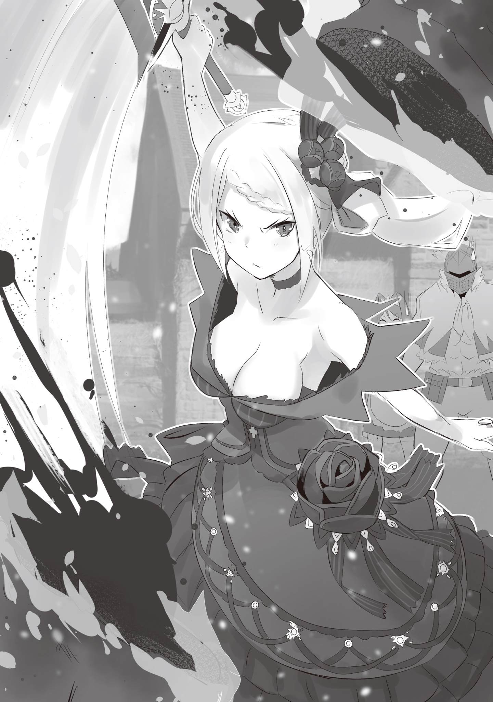
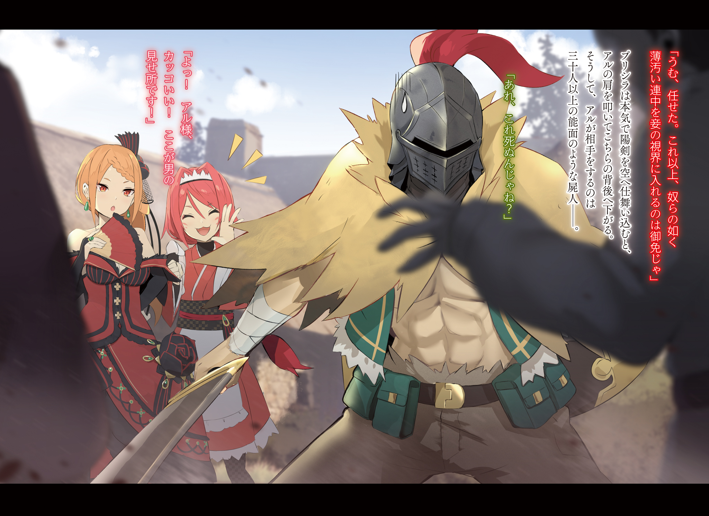
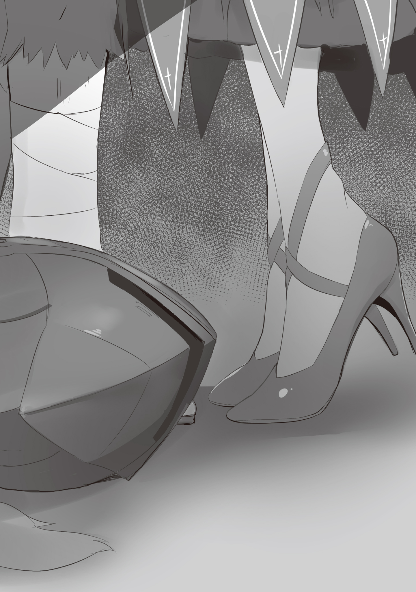
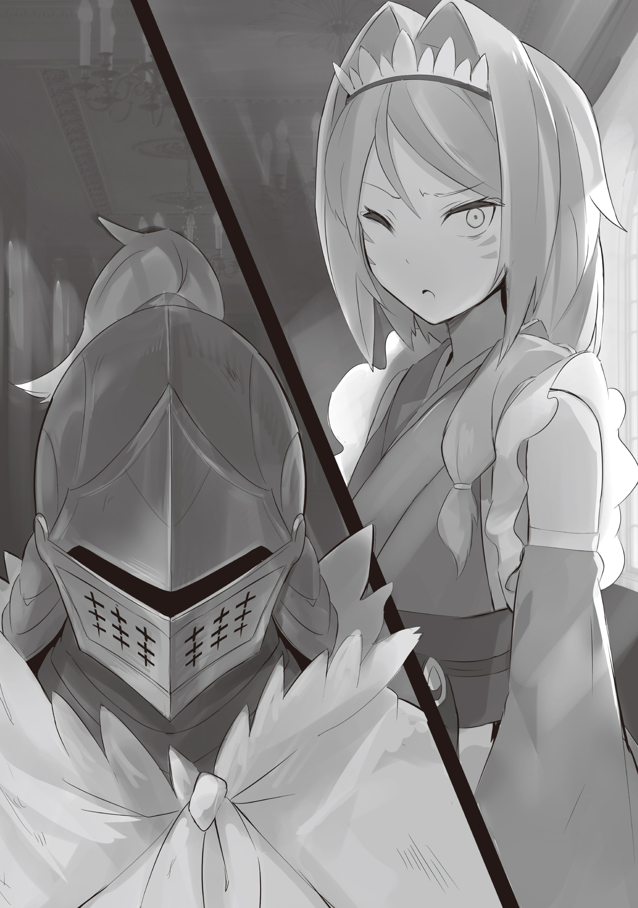

Анлейт: Negimiso

Юноша в отчаянии мчался по холму.

Задыхаясь и обливаясь потом, юноша бежал по тёмной тропинке, не обращая внимания на свой внешний вид. Даже когда ветки касались его щёк и шеи, оставляя жгучие красные царапины, его это не волновало.

Сейчас он был в отчаянии. Он бежал быстрее, чем когда-либо за всю свою жизнь.

Если бы он не бежал, его бы поймали. Он был бы пойман. Пойман тем, что он видел, пойман тем, что заставило его бросить всё, чтобы сбежать; пойман лицами, которые он знал, но тем, чего он не знал.

— Проклятье… Проклятье!..

Разочарование и страдание хлынули с его губ, и горькие слёзы выступили в уголках глаз. В голове пронеслись пейзажи его родной старой деревни — воспоминания о месте, которое он только что покинул.

Это была сельская местность, где не было ничего. Ему это не нравилось. Именно поэтому он уехал оттуда, как только ему исполнилось пятнадцать лет.

После этого он скитался с места на место, набирался опыта, упорно преодолевая трудности, и в конце концов стал взрослым. Когда он наконец нашёл место, где мог бы осесть, ему вдруг пришла в голову мысль о родной деревне.

Его родители, которые до последнего были против того, чтобы он покидал деревню. Его брат, который тайно помогал ему во время побега из дома. Девушка, которая была его подругой детства, и которая выразила сожаление, когда он прощался с ней.

«Как у меня хватило наглости думать об этом спустя столько времени», — мыслил он про себя, но его работа шла гладко. Он мог принять вызывающий вид и вернуться в триумфальном настроении. В итоге впервые за много лет юноша отправился в свою родную деревню.

А теперь он бежал по холмам в полутьме, чувствуя вкус крови в горле.

Почему всё обернулось именно так? Что он мог с этим сделать?

Он знал только одно: он не мог оставить это место, этот район, эту родную деревню в одиночестве.

Он не мог оставить свою семью, брата, подругу детства в таком ужасном состоянии…

— Кто-то… кто-то должен!..

«Сделать что-нибудь…» — сохраняя эту мысль в своём сердце, он продолжал бежать.

Туда, где солнце выглядывало из-за холмов, он продолжал бежать.

Словно в погоне за солнцем, он продолжал бежать.

…«Солнечная Принцесса» из домена Бариэль.

Причина, по которой Присцилла Бариэль вызывала такое восхищение у своего народа, заключалась в её характере и способностях, а также в её сияющей красоте без всякого преувеличения.

Раньше правление домена Бариэль было деспотичным по отношению к своему народу.

Лейп Бариэль, муж Присциллы и человек, умерший до начала Королевских Выборов, не был совсем уж некомпетентным, но это был пожилой мужчина с холодным сердцем, которому, казалось, совершенно не хватало сострадания.

Поэтому после его смерти, Присцилла, взяв на себя его обязанности по управлению территорией, явилась как спасительница для людей, живших в тяжёлых условиях. Она была самим солнцем, освещавшим тьму, в которую они были погружены.

Вот почему, в знак уважения, народ почитал Присциллу как Солнечную Принцессу.

— Лично мне кажется, что в смысле отсутствия сострадания Принцесса и Лейп примерно одинаковы, — пробормотал про себя мужчина, прислонившись к перилам в коридоре, соединяющего два здания, пока смотрел вниз на прихожую особняка.

Он имел очень эксцентричную и своеобразную внешность.

Легко одетый в грубую одежду поверх достаточно тренированного тела, в необычной обуви, известной как дзори, и без левой руки ниже плеча — в народе таких называли «однорукий». Однако больше, чем однорукостью, он выделялся чёрным железным шлемом, закрывавшим всю его голову.

Эксцентричный наряд, отсутствующая рука и шлем, скрывающий его лицо — это был мужчина, которого Присцилла Бариэль держала при себе и назначила на роль шута — Ал.

На первый взгляд это звучало как оскорбление, но сам Ал был доволен тем, что ему дали титул «шута». Он предпочитал его, чем положение первого и главного рыцаря Присциллы — положение, которое непременно стало бы объектом сплетен.

Дело не в том, что он не любил Присциллу. Ему просто не нравилось звание рыцаря. В конце концов, рыцари были бесполезны.

— Наоборот, Принцесса всегда желанна. Она не сердится, когда я пялюсь на её декольте, ещё и прощает меня за это.

— И снова я слышу от вас такую похабщину. Мне доложить Госпоже~?

— Упс.

Ал, разговаривая сам с собой, обернулся, услышав дразнящий голос. Позади него стояла девушка, одетая в красно-белую одежду слуги…

— А, это просто ты, Яэ. Некрасиво подслушивать, когда кто-то разговаривает сам с собой.

— Теперь я сожалею, что подслушивала, потому что это было вульгарно.

— То, о чём я сейчас говорю, это проблема совести подслушивающего. Тема моей совести — для другого раза.

— Э-э~? Так нечестно~, — сказала девушка и протестующе отвернулась.

Это была Яэ Тэндзэн — одна из горничных, что прислуживали Присцилле в особняке Бариэль; она также являлась коллегой для Ала.

Со светлой кожей, стройными конечностями и длинными рыжими волосами, убранными назад — она была красивой девушкой лет двадцати. А ещё у неё были озорные глаза, которые производили впечатление кошачьих.

Как человек, которого Присцилла назначила главным камергером, ведь ей нравились необычные вещи, она была довольно странной личностью. О её странности можно было судить по тому, как быстро она смогла принять чудаковатую внешность Ала, и как просто она общалась с ним.

Так или иначе…

— Все эти люди приехали сюда ради Принцессы, да? Они никогда не уходят, не так ли? — отметил Ал и дёрнул подбородком в сторону прихожей внизу.

Там было то самое зрелище, на которое Ал смотрел только что: жители домена толпились вокруг особняка, а слуги были заняты своими делами, пытаясь справиться с ситуацией.

Если подумать, такое большое скопление людей вокруг особняка владыки домена можно было бы расценить как акт вооружённого восстания, но…

— Чувства людей, которые приносят подарки, и чувства людей, которые просят встречи с ней только для того, чтобы поприветствовать её… Поскольку Госпожа не из тех, кто пренебрегает такими вещами, я также восхищаюсь ею, знаете ли, — хвасталась Яэ, стоя рядом с Алом и наблюдая за происходящим внизу.

Как она и говорила, люди, собравшиеся в прихожей, были там не по злому умыслу, а из уважения к Присцилле. В самом деле, вход в особняк был уставлен подарками, доставленными со всех уголков домена, а просьбы об аудиенции с Присциллой сыпались нескончаемым потоком.

Если особняк человека, наделённого властью, был вот так доступен для широких масс, это неизбежно посеяло бы семена проблем. Именно поэтому нужно было очень осторожно реагировать на людей, входящих в особняк…

— И несмотря на всё это, почему ты, главный камергер, не курируешь ситуацию? Во имя и ради безопасности Принцессы, которой ты так восхищаешься, разве это не та часть, где ты должна работать на полную катушку?

— Но они продолжают приходить один за другим, и не похоже, что этому есть конец. Кроме того, Яэ-чан хочет работать только за ту сумму, которую ей платят. А ещё, это же может быть хорошей возможностью для других горничных стать более профессиональными?

— И что из этого правда? Какая хитрая служанка…

Это был именно тот случай, когда говорят вещи на одном дыхании. Видя бессовестное отношение Яэ, высунувшей язык, Ал положил палец на соединительную часть шлема, и начал возиться с металлической фурнитурой, заставляя её звенеть.

Это была его привычка, когда он о чём-то думал, но он обнаружил, что прикасается к шлему чаще, чем обычно. Ал понимал, что нервничает, ведь Королевские Выборы официально начались.

— Выбивать кого-то из колеи и играть с ним — моя фишка, но в последнее время выбивают из колеи именно меня, и это не очень приятно.

— Верно, вы довольно честный человек, если не считать внешность. Это выручает, потому что с вами легко общаться.

— Под этим ты подразумеваешь, что меня легко дразнить, верно?

— Разве между этим есть разница?.. — Яэ наклонила голову набок в знак любопытства.

— Страшно, что ты думаешь, что разницы нет. — Ал пожал плечами и покачал головой.

Однако его несколько удивило, что его оценили как честного человека, не считая внешности. Помня о том, что он служил Присцилле, трудно было принять это за комплимент. Те части личности, в которых алая девушка видела ценность, были эфемерными и неоднозначными до крайности.

Она вполне могла отрубить ему голову в тот момент, когда сочла бы Ала скучным.

— Тем не менее, мне кажется, вы слишком легкомысленно и насмешливо относитесь к Госпоже.

— Бояться Принцессу — это единственно правильный выбор… Хм?..

Это произошло сразу после того, как Яэ увидела его внутренние мысли, несмотря на то, что не могла видеть выражение его лица и реакцию на то, что она сказала об этом. Внизу резко стало шумно, и внимание Ала снова сосредоточилось на прихожей.

Пока он размышлял, в чём дело, его внимание привлёк юноша, пробивающийся сквозь толпу. Он был весь покрыт потом и грязью — Ал мог сказать, что юноша явно нечистый, с одного только взгляда.

Поскольку это особняк владыки домена, все люди были одеты подобающим образом. Это тот минимум внимания, который они способны проявить; юноша же отличался от них. Другими словами…

— Если только он не полный идиот или у него нет здравого смысла…

— Возможно, это что-то срочное, и ему нужно поговорить об этом, если он так торопится~.

Отвечая в непринуждённой манере, Яэ погладила свои рыжие волосы и сузила угольно-чёрные глаза. В этот момент, видя, что атмосфера беззаботности вокруг неё исчезла, Ал неосознанно коснулся металлической фурнитуры своего шлема.

Затем потрёпанный юноша встал перед служанкой и закричал:

— Пожалуйста, позвольте мне встретиться с владельцем особняка!.. Мой дом, моя родная деревня кишит живыми трупами!!!

Крик юноши разнёсся по всей округе, и в шумной прихожей мгновенно воцарилась тишина. В этот момент он упал на колени, тяжело дыша, и слёзы, которые он больше не мог сдерживать, начали падать на пол.

Увидев юношу, рухнувшего на пол, и капли, скатившиеся по его щекам, двое коллег произнесли:

— Похоже, это тот тип просьбы, который нравится Госпоже~.

— …Я позову Принцессу.

Вот так, на фоне Яэ, на лице которой была нечитаемая улыбка, Ал позволил застёжке своего шлема издать металлический звон.

— Я… я вернулся в родную деревню четыре дня назад. Сначала, поскольку прошло несколько лет с тех пор, как я вернулся домой, я подумал, что именно поэтому моя семья относится ко мне отстранённо, — мало-помалу юноша начал рассказывать о том, что с ним произошло, стоя на коленях на полу.

Место, где он сейчас находился, было уже не прихожей, а большим залом, который в последнее время всё чаще использовался для аудиенций с жителями домена. В зале, пол которого был полностью покрыт алым ковром, находились члены частной армии домена Бариэль — Багрового Фронта. Каждый из них носил ярко-красное снаряжение и был выстроен вдоль левой и правой стен комнаты.

В зале, где преобладал красный цвет, на роскошном кресле восседала девушка в пылающе-красном платье. Это была та, кому красный цвет больше всего подходил в этом особняке, — сама Присцилла Бариэль.

Находясь под кроваво-красным взглядом Присциллы, юноша, пришедший с просьбой, изо всех сил пытался объяснить ситуацию, продолжая сбивчиво говорить:

— Что мне показалось странным, так это неестественность ответов, которые я получал от них. Наши разговоры были непоследовательными, и они говорили о вещах, которые не совпадали с моими воспоминаниями…

— Значит ты говоришь, что это нельзя списать на забывчивость. Но называть их живыми трупами из-за этого кажется диким, — подколол объяснение юноши тот, кто был единственным человеком, имеющим отношение к особняку, но который не носил красный цвет, — Ал.

Включая Багровый Фронт, стоящего в боевой готовности, главного камергера Яэ, стоящей позади Присциллы, и молодого слуги Шульта, стоящего рядом с Присциллой — чьи малиновые глаза завоевали её расположение — каждый человек, имевший отношение к большому залу, был одет в «красное» в характерной манере.

Среди них, существование Ала было аномалией: он выглядел как человек, которому здесь не место. Видимо, юноша получил такое же впечатление от Ала, так как направил на него вопросительный взгляд.

— К-конечно, причина не только в этом. Я видел… решающую сцену…

— Ага, решающую сцену. Что ты видел?

— Э… это…

Цвет исчез с его лица, взгляд юноши блуждал по залу, когда его попросили рассказать подробнее. Это было выражение человека, напуганного воспоминаниями в своей голове, его тело было охвачено страхом. Делая беззвучные выдохи через пересохшие губы, юноша не мог произнести следующие слова.

Или это была реакция на то, что если он скажет это, его любовь к родной деревне могла угаснуть вместе со словами.

Однако…

— Не молчи, простолюдин, — вмешалась Присцилла, устремив взгляд на окаменевшего юношу, который уже почти перестал говорить. Его плечи дрожали от бессердечного тона её голоса.

— Если ты проиграешь своей трусости, твои губы больше никогда не пошевелятся. Так самонадеянно рассчитывать на мою милость — возмутительно нелепо.

— A…

Яростные слова, в которых не было ни капли доброты, обожгли своим палящим жаром зажатое сердце юноши. В следующий момент, видя, как бушует шторм в его сердце и как жалко проявляется его отчаяние, Ал проникся симпатией к юноше. Поэтому он пожал плечами в сторону Присциллы и обратился к ней со словами:

— Принцесса, не стоит усугублять травму, когда он так ослаблен. Ты всегда можешь сказать это по-другому, верно?

— Нет никакого «другого способа» сказать это. Есть только правда. Слушай, простолюдин.

Презрительно фыркнув на Ала, который пытался давать ей советы, Присцилла скрестила руки, тем самым подчёркивая свою пышную грудь. И сидя в такой позе, она пронзила взглядом задеревенелого юношу:

— Если ты будешь молчать, то риск, которому ты подвергался, бегая день и ночь, и сожаление о родной деревне, которое подтолкнуло тебя к этому, сойдут на нет. Спроси своё сердце, приемлемо ли это.

— …

— Что такое? Ты уже бросил один раз свою деревню. Забыть об этом раз и навсегда и продолжать жить своей жизнью можно считать одним решением. Можно ли назвать его мудрым или трусливым — меня не волнует.

Сохраняя свирепость своих слов, Присцилла без колебаний испепелила сердце юноши, превратив его в выжженное поле. Она не возражала, даже если в результате от него осталась бы лишь кучка пепла.

Однако, в ответ на её палящие слова, юноша открыл глаза.

— Так что же ты будешь делать? Ты трус?

— Я трус… И я не мудрый. Но я не стану подлецом, — ответил юноша на заданный вопрос, подняв голову. Как будто она знала ответ с самого начала, Присцилла великодушно кивнула в знак согласия.

В результате слова Ала были использованы как ступенька, и от этого у него появилось ощущение зуда в животе.

Поэтому нагловатая ухмылка, которой одарила его Яэ, вызвала у него раздражение. По сравнению с ней, Шульт, который стоял рядом с Присциллой с нервным выражением лица, выглядел более обаятельным.

— Ночью в тот день, когда я вернулся домой, я не мог уснуть, потому что постоянно чувствовал, что что-то не так. Даже не поужинав вместе с семьёй, я лежал в своей комнате… Потом я заметил, как кто-то вышел из дома. Казалось, они не хотят, чтобы их видели, поэтому мне стало любопытно, и я пошёл за ними, и… — продолжил своё объяснение юноша, с выражением лица, свидетельствующим о его решимости. Затем, после недолгого колебания, он произнёс решающие слова, которые окончательно закрепили вопрос: — …Я увидел, как жители деревни, у которых отваливались конечности, пришивали их обратно.

— …

— Сначала я подумал, что принял это за что-то другое, но нет. Они пытались приклеить свои гниющие руки и ноги обратно к телу и вернуть его в прежнее состояние. Я… видел, как это происходило.

«Я видел нечто, что не должен был». В историях был только один путь к концу, который ждал такого свидетеля. Однако юноша пошёл против законов повествования, и каким-то образом сумел сбежать с места событий.

— Я наступил на ветку, и они заметили меня. Но я бежал, спасая свою жизнь, и смог уйти, воспользовавшись проходом, который вёл в сторону холмов с задней стороны моего дома. Затем я продолжал бежать и бежать…

И вот так, запыхавшись, он пришёл просить о помощи Присциллу, владычицу домена.

— Скажите, а откуда взялось название «живые трупы»? Вы хотите сказать, что они сами себя так называли?

— …Давным-давно в моей родной деревне ходила история о мёртвых телах, которые передвигались и нападали на людей. Из-за этого, когда родители ругали своих детей, они предупреждали их, что придут живые трупы. Вот откуда это пошло.

— То, что все считали суеверием, на самом деле оказалось явью. Вы пришли к такому выводу, ясно~.

Спокойно указав на шаги, которые юноша пропустил в своём заключении, Яэ добавила к нему дополнительную информацию. После чего она мельком взглянула на лицо Присциллы сбоку, перед тем как замолчать. Ал тоже ничего не сказал.

Они понимали, что именно Присцилла должна решить, что делать с обращением юноши.

Тем не менее, в комнате также присутствовал тот, кто был не в состоянии принять рациональную точку зрения, как они.

— Госпожа Присцилла… — взывая к своей госпоже слабым голосом, Шульт устремил на неё слезящиеся глаза. Молодой, добросердечный мальчик с сочувствием отнёсся к словам скорбящего юноши, который искал милостыни у Присциллы.

Это была просьба, которая могла вызвать недовольство Присциллы, и за неё грозило бы наказание.

Однако, когда Присцилла посмотрела на Шульта, она лишь запустила пальцы между локонами его розовых волос, лаская его. Она ласкала его и ничего не сказала. Только благодаря этому одному действию на лице Шульта появилось выражение облегчения.

— И что же ты хочешь от меня? Ты сообщил мне, что твою родную деревню заполонили живые трупы и передал срочный доклад о продолжающемся кризисе. Что ты ищешь взамен?

— Прошу, верните мой родной дом… Нет…

Прикусив губу, юноша покачал головой. Он попытался найти надежду в вопросе Присциллы, но сам понял, что это была мольба, лишённая реальности.

Присцилла была не из тех людей, которые пытаются исполнить безнадёжное желание. В данный момент ответ, который она искала, не был неосязаемой несбыточной мечтой.

То, что уже произошло, изменить невозможно. Неважно, кто это или что — это был акт гордыни, который никогда не может быть прощён.

Следовательно, юноша не просил её спасти их.

— Пожалуйста, уничтожьте живых трупов. Моя родная деревня… Моя семья, мой брат, моя подруга детства… Пожалуйста, позвольте им уйти на покой… Я прошу вас, — произнёс юноша, опустив голову, своё желание, которое хоть и было горестным, но требовало решимости, чтобы быть произнесённым.

— …

Услышав это, какой ответ даст Присцилла? Посмотрев на свою госпожу изнутри шлема, Ал сразу же увидел ответ с одного только взгляда. Все, кто находился в комнате и служил ей, тоже всё поняли.

А всё потому, что Присцилла садистски смягчила уголки своих красных губ, изобразив довольную улыбку.

Деревня юноши, Коффлтон, была одной из отдалённых деревень, расположенных на самом юге домена Бариэль.

По словам юноши, который сказал, что устал от её пустоты, деревня не имела никаких отличительных черт. Предусловия также отличались от Радримы — другой деревни, которую Присцилла посещала в прошлом.

Тогда она охотилась за отличительной особенностью Радримы — ярко-красными цветами, известными как Куренай. Однако, в отличие от Радримы, в Коффлтоне не было ни одного привлекательного аспекта.

Поэтому, будто это один из тех странных инцидентов, которые были обычным явлением в домене, с этим можно было бы легко справиться, просто послав часть Багрового Фронта, но…

— Интересно, почему это снова превратилось в личный визит Принцессы? — ворчал Ал внутри Драконьей Повозки, которую тянул алый Земляной дракон, и разглядывал её экстравагантный интерьер.

Под действием Божественной Защиты Уклонения от Ветра в карете было очень уютно, потому что она не чувствовала ветра и не тряслась от скорости, с которой неслась. Однако, поскольку Ал с самого начала не был заинтересован в поездке, само путешествие без неудобств было для него крайним неудобством.

Перед Алом, у которого были такие сильные чувства насчёт поездки, Присцилла закрыла один глаз со словами:

— Ты что, недоволен моим решением? Очень смело рискуешь жизнью ты, Ал.

— Почему одна жалоба делает из меня безрассудного человека? Мне кажется, или в последние дни ко мне относятся сурово?

— Глупец. Моя точка зрения всегда справедлива. Если ты считаешь, что с тобой так обращаются, то это потому, что твои заслуги только того и стоят. Перекладывать вину на меня — верх глупости.

Изящно скрестив длинные ноги, Присцилла прикрыла рот веером, который вытащила из декольте.

— Да, да, — Ал махнул рукой. — Вообще-то, не кажется ли тебе, что приезд самой владычицы домена, да ещё и без личной армии, — плохой ход? Ну, если мы против обычных жителей, то они могут преклониться перед твоей властью. Но судя по тому, что мы слышали, мы против зомби, верно? Интересно, будет ли власть над этими людьми с губчатым мозгом реально работать?

— И снова ты использовал слова, которые мне неизвестны. Что ты подразумеваешь под словами «зомби» и «губка»?

— А-а, мёртвые тела, которые ходят вокруг, называются зомби. Губка — это, как бы сказать, предмет, который используют, когда моют посуду. Проще говоря, я имел в виду, что она вся сухая и дрянная.

— Хм. Если отбросить «губку», мне нравится, как звучит «зомби».

Смягчив уголки губ в хорошем настроении, Присцилла сузила свои кроваво-красные глаза.

— Итак, ты спрашивал, почему я решила посетить это место. Ты не можешь представить причину?

— Единственная причина, которую я могу придумать, это то, что ты заинтересовалась этим. Может ли быть другая?

— Возможно. Конечно, главная причина в том, что мне стало интересно. Однако она не единственная. Пока вопрос не будет решён, ты будешь оценивать мои намерения. Если не сможешь получить ответ до того, как всё разрешится, ожидай, что отношение к тебе ухудшится.

— Это что, викторина? Если за это существует наказание, то я бы хотел, чтобы была и награда.

— Как хищно. Отлично. Когда ты успешно выяснишь мои намерения, я позволю тебе лизать мои ноги.

— Это твоя последняя тенденция или что-то в этом роде, Принцесса? Я начинаю задумываться, стоит ли мне серьёзно уже лизнуть твои ноги.

Это награда или наказание? Это может быть наградой для тех, у кого своеобразные интересы, но, по сути, это вид наказания. Хотя, если он думал об этом как о возможности приблизиться к ногам Присциллы, то Ал мог бы изо всех сил стараться представить это как награду.

— Эм~, я прошу прощения за то, что вынуждена прервать ваш эротический разговор, но… — раздался голос, который нерешительно вклинился в разговор между Алом и Присциллой. Голос исходил от Яэ, что всё это время сидела рядом с Присциллой внутри кареты.

Слегка приподняв руку, она изобразила легкомысленную улыбку и кокетливо наклонила голову.

— Почему вы взяли меня с собой? Обычно с вами всегда Шульт-чан и господин Ал, как цветы на каждой руке… Один из них — плотоядное растение, но так было бы и при обычных обстоятельствах.

— Плотоядное растение… Нет, ещё есть вероятность, что Шульт-чан может быть им, хотя и едва ли…

— Ах, естественно плотоядное растение — это вы. Я дала вам мягкий и снисходительный рейтинг.

— Верно…

Пока его плечи опускались от безжалостной оценки Яэ, Ал внутри испытывал те же сомнения, что и она.

На этот раз Присцилла не взяла Шульта с собой в поездку в Коффлтон. Это было редкостью для неё, ведь обычно он следовал за ней повсюду, куда бы та ни пошла.

Это был первый раз, когда вместо Шульта она взяла с собой Яэ из особняка.

— Изначально ведь я была нанята только Господином… Хотя он уже покоится, я была нанята им просто в качестве прислуги в особняке, чтобы служить госпоже. Моё положение сейчас похоже на работу вне того, на что я была нанята?..

— Другими словами, что? Ты хочешь сказать, что желаешь подать в отставку, потому что с тобой обращаются так, что это не соответствует твоим условиям работы?

— Я никогда такого не говорила~. Просто, с моей точки зрения, я предпочитаю не работать вне рабочего времени и контракта, так что если бы это было навязано мне, неважно, что…

— Ты хотела бы получить достойную награду, да? Не беспокойся. Я вознаграждаю труд обычных людей. В конце концов, это было моё решение, чтобы ты сопровождала меня… Ты думаешь, что я могу обмануть тебя?

— …

На мгновение воздух внутри кареты запах горелым, и Ал напрягся в ответ. Испугавшись низкого тона Присциллы, щёки Яэ тоже слегка затвердели.

Однако она тут же вернулась в своё обычное состояние и приложила обе ладони к щекам.

— Вовсе нет! Ни за что, ни за что! Конечно нет! Как безрассудно сомневаться в вас! Всё, что я сделала, это изложила свою позицию. Если вы так считаете, то нет проблем. Я ваш верный пёс. Я с радостью буду поливать ваш драгоценный цветок, а также ваше плотоядное растение~.

— Просто говорю, но если не кормить плотоядные растения насекомыми, есть данные исследований, что они будут явно слабее, чем если бы им давали только воду…

— Не вмешивайся, Ал. Сейчас нет необходимости в твоих знаниях о плотоядных растениях. Ну что ж, если у тебя изменилось сердце, ты должна показать это своими действиями, Яэ. Что ты знаешь о Коффлтоне? — бросила Присцилла вопрос в сторону Яэ, порицая ворчащего Ала.

В ответ на это она схватила прядь своих рыжих волос и, щекоча их кончиками губы, доложила:

— Э-э~, я не могу дать вам никакой конкретной информации. А, юношу, который рассказал вам о живых трупах, зовут Аррай Денкутс. Он второй сын Харона Денкутс и Монэ Денкутс, а их старший сын — Риддл Денкутс… Хм, полагаю это всё~. В деревне нет ничего примечательного, так что~…

«Мне жаль, что я не смогла быть вам полезной», — добавила она в качестве извинения, но то, что она сказала, было вполне достойно удивления. Конечно, это не было похоже на произвольное заявление. Всё было основано на правде.

В каждом городе и деревне в пределах домена проводились опросы, чтобы узнать количество жителей, а также их имена. Естественно, эти записи передавались владыке домена, Присцилле. Однако Яэ, главный камергер, легко выдала нужную информацию, как будто знала всё об этом.

Те, кто компетентен, будут использованы соответствующим образом. Она была загадочной девушкой, но именно поэтому Присцилла использовала её по максимуму.

— …О, похоже, мы прибыли~.

Как только разговор подошёл к концу, Драконья Повозка постепенно остановилась. Когда водитель, державший вожжи, почтительно открыл дверцу кареты, прохладный ветерок приветствовал всех троих.

И больше ничего, что можно было бы назвать приветствием.

— Куда ни глянь — здесь нет ничего, кроме ферм и полей…

— Потому что это такое место. В деревне всего восемьдесят восемь жителей, она меньше, чем территория нашего особняка.

Глядя на деревню с вершины холма, Ал и Яэ обменялись впечатлениями о пейзажах сельской местности.

Это звучало красиво, когда её называли зелёной и пасторальной, но одного взгляда было достаточно, чтобы воспринять её как заурядную деревню — место, которое было слишком однообразным для молодёжи. Было понятно, почему юноша покинул свою родную деревню.

— Здесь так мало домов, они крошечные и расположены близко друг к другу. Но…

Остановившись на середине предложения, Ал наблюдал за деревней издалека. Хоть она и была относительно далеко, но с того места, где он находился, всё ещё могла быть видна повседневная жизнь. Дым поднимался в воздух от мест, где готовили еду, а по улицам ходили люди.

Слухи о том, что её оккупировали живые трупы, сильно противоречили тому, как она выглядела.

— Сейчас это похоже на обычную деревню. В моём представлении зомби не будут вот так работать, стирать или готовить.

— Сорок лет назад солдаты-трупы, которые бушевали в Королевстве Лугуника, очевидно, были не в том состоянии, чтобы жить обычной жизнью. Пока их тела гнили, единственное, что они делали, это продолжали нападать на живых. Но говорят, что солдаты-трупы сильных людей были сильны, как при жизни.

Получив слова Ала, Яэ ответила, используя знания, которые она почерпнула, собирая по крупицам. В любом случае, быть использованным кем-то даже после смерти звучало ужасающе.

— Ну, могло быть и хуже, потому что они хотя бы умирают. Если их голова перестанет работать, то они, вероятно, не будут знать о своём несчастье.

— Забавное у вас предположение~.

Пока Ал в глубокой задумчивости трогал металлическую фурнитуру своего шлема, Яэ насмешливо посмотрела на него. Не ответив на это, Ал повернулся к Присцилле, которая всё это время молчала, чтобы понять, что они будут делать дальше.

— Есть вероятность, что парень, который пришёл в особняк, мог быть не в своём уме. Может быть, нам стоило бы вместо этого исследовать его… Принцесса?

На его зов никто не ответил: Присцилла молча смотрела на непримечательную деревню внизу. Однако в этих кроваво-красных глазах плескалась лютая ненависть и ярость, перетекающая в мерцающее пламя.

Её эмоции были зажжены её убеждениями, что явно отличалось от того, что чувствовали Ал и Яэ.

— Мне плевать, кто они и откуда, но чтобы сделать такое у моих ног… — оставив эти слова, скривив губы, Присцилла быстро пошла вперёд. Видя, как она идёт непоколебимой походкой, Ал и Яэ на мгновение застыли на месте, а затем поспешили догнать её.

— Эй, Принцесса! Я понимаю, что ты в бешенстве, но почему так внезапно?!

— Ты поймёшь, если посмотришь. Ты почувствуешь запах, если понюхаешь. Если прислушаешься, ты услышишь тварь, которая манипулирует своими нитями, играя с куклами… Всё это я буду рассматривать как оскорбление по отношению ко мне.

— Бессмыслица какая-то!

Манеру речи Присциллы было трудно понять, и Алу требовалось время, чтобы упростить её слова в своей голове. А сейчас Присцилла шла очень быстро, поэтому не давала ему достаточно времени на это.

Уверенно спустившись с холма, Присцилла вошла в Коффлтон, деревню, о которой шла речь, ничуть не замедлив шаг. Заметив Присциллу и двух её спутников, мужчина, стоявший у входа в деревню, поднял брови.

— Ой, как редко здесь бывают гости со стороны. Да ещё в таком наряде, зачем вы пришли в деревню…

— Умолкни.

Слегка приподняв руку, мужчина, который разговаривал с ними дружелюбным тоном, широко раскрыл глаза.

В следующее мгновение багровым драгоценным мечом, который Присцилла вытащила из пустоты, мужчина был разрублен по диагонали от плеча.

— …кха, — мужчина издал короткий крик, и сразу после этого его тело охватило пламя.

Меч Света Присциллы был волшебным мечом, один взмах которого испепелял всё, что резал. Неугасимое адское пламя сжигало само существование тех, с кем оно вступало в контакт, пока не оставалось ничего, кроме пепла.

Словно доказывая это, тело мужчины мгновенно превратилось в чёрные угли…

— Эй-эй-эй?! Серьёзно, что ли?! Сжечь первого же жителя деревни до смерти?!

— Если быть точным, я думаю, что он был зарезан до смерти, но в любом случае, это не имеет значения. Э-э~.

Наблюдая за актом насилия, произошедшим прямо перед ними, даже Ал и Яэ не смогли скрыть своего недоумения. Однако Присцилла, даже не взглянув на своих удивлённых спутников, презрительно фыркнула на почерневший труп мужчины.

— «Зомби» не должен разговаривать со мной так бесцеремонно. Я предоставляю свою защиту людям, однако, я не опущусь так низко, чтобы предоставлять её такой подделке, как ты. Знай своё место.

— Но он разговаривал, и у него была общительная улыбка! Он действительно зомби?!

По крайней мере, Ал считал сгоревшего до смерти мужчину человеком. Кроме того, он отнёс его к категории дружелюбных людей, поэтому убийство мужчины без вопросов можно было бы назвать трагедией не иначе.

— Я повторюсь, но думаю, что он был зарезан до смерти… Ах, другие жители деревни…

Рядом с Алом, который хватался за голову, щёки Яэ дрогнули, когда она огляделась вокруг. Их окружали жители деревни, которые переговаривались между собой, заметив присутствие незнакомых гостей.

Присцилла невероятно быстро расправилась с мужчиной, поэтому они не успели узнать о судьбе первого жителя деревни. Правда, вокруг валялся кусок пепла в форме человека, так что это был лишь вопрос времени, когда они поймут что произошло.

— Эм~, слушайте, это…

Пытаясь найти способ сказать что-то такое, что могло бы смягчить ситуацию, Яэ ломала голову в поисках оправдания. Однако Ал понимал Присциллу лучше, чем она, по крайней мере, с небольшим отрывом в полшага.

— Принце…

— Хмф.

Но даже с этим он не мог поспеть за действиями Присциллы, которая была уже далеко впереди него.

Жители деревни предрешили свою судьбу в тот момент, когда беззащитно подошли к ним. Безжалостным взмахом Меча Света Присциллы, маленький пожилой мужчина, стоявший впереди, был срублен и сразу же вспыхнул огнём.

— А… А-А-А-А-А-А!!!

Увидев резкое проявление насилия прямо перед своими глазами, один житель впал в панику. Однако крик тут же затих. Человек, издавший его, был обезглавлен, и крик оборвался.

— Видишь, Ал. Тот парень дал верный отчёт.

— В чём?! Сейчас я не могу думать об этом иначе, как о продолжающейся сцене, где высший руководитель, приняв неверное решение, теряет рассудок и начинает затыкать людям рот!

— По какой причине в этом месте нет ни одной женщины или ребёнка? Почему нас окружают только хорошо сложенные мужчины?

Крутнув в руке свой багровый меч, Присцилла толкнула остриём клинка в грудь безголового мужчины. Естественно, из-за того, что удар был нанесён в верхнюю часть тела оно… не рухнуло.

Причина, по которой на поверхности отрубленной шеи не было крови, заключалась в том, что Меч Света прижёг образовавшиеся раны, но не только поэтому. Что-то начало извиваться из шеи безголового тела, и труп попытался ухватить руками Присциллу.

— Тц!.. — щёлкнув языком, Ал с силой ударил безголового мужчину. Тело легко отбросило назад, но оно быстро восстановило положение, приземлившись на землю руками и ногами.

— Фу, — выразил Ал отвращение к тошнотворному зрелищу, глядя прямо на поверхность отрезанной шеи.

В ране мужчины извивались щупальца, похожие на бесчисленные корни растения. Словно водоросли, танцующие в воде, извивающиеся щупальца попытались наброситься на Ала… но вдруг загорелись.

— Не думай, что ты останешься в безопасности, когда уже коснулся острия Меча Света. Сгори в пепел, подделка.

На глазах у Присциллы, выплюнувшей эти слова, мужчина издал слабый предсмертный крик и распался на кучу пепла. Тем временем окружающие жители деревни не убегали, а смотрели на «внешнего врага» глазами, лишёнными всяких эмоций.

Убедившись, что интуиция Присциллы неоспоримо верна, Ал вытащил с пояса Меч Синего Дракона.

— Чёрт возьми, это действительно зомби! Отойди назад, Принцесса!

— Хорошо, я оставлю это тебе. Не хочу, чтобы эта мерзость больше попадалась мне на глаза.

— Э? Ты серьёзно?

Попытавшись выглядеть круто, Ал полагал, что Присцилла поможет ему избавиться от зомби, — его надежды были выброшены в окно.

Присцилла действительно убрала свой Меч Света в небо, похлопала Ала по плечу и встала за его спиной. В итоге Ал имел дело с более чем тридцатью живыми трупами, лишённых эмоций…

— Я ведь умру от этого, не так ли?

— Йо! Господин Ал такой крутой! Вот где вы должны показать нам свою мужественность! Если вас эффектно истерзают до смерти, я скажу Шульту-чан, что вы умерли благородно~!

— Хватит дурачиться, помоги мне!

— Что-что~?

Приняв стойку с Мечом Синего Дракона, Ал рявкнул на главного камергера, которая лениво подбадривала его. Как по команде, человек впереди, держа в руках сельскохозяйственный инструмент, замахнулся на Ала.

В следующее мгновение чёрное лезвие вонзилось прямо в лоб мужчины.

Его шея отпрянула назад от силы удара, и он приостановил свои шаги. Однако голова тут же отскочила назад, как пружина, и он возобновил свои действия, пытаясь ударить Ала своим сельскохозяйственным инструментом.

Отрубив обе руки мужчины Мечом Синего Дракона, Ал сразу же нанёс ему ответный удар по шее, туловищу и коленям.

— Наконец-то один готов… После стольких усилий!

— Ва-а, я уже чувствую себя подавленной. Не слишком ли неэффективны мои навыки против этих энергичных персон?

После того, как Ал, тяжело дыша, наконец завалил одного зомби, Яэ бросила на него взгляд. В её руке было зажато чёрное лезвие — тот самый кунай, который торчал у мужчины во лбу.

Кунаи были кинжалами, уникальными для запада, и у неё было много другого оружия, спрятанного под красной униформой горничной. Таким образом, её истинная ценность как служанки Присциллы заключалась в умении сражаться.

Невозможно было удержаться от того, чтобы не пожаловаться на сложившиеся обстоятельства. Стиль боя Яэ заключался в атаке на жизненно важные точки после засады противника, что было совершенно неэффективно против зомби, поскольку ни голова, ни сердце не служили им слабыми местами.

— Принцесса! Эй, Принцесса!

— Не чирикай, как птица. Ты принижаешь моё превосходство. Если ты мой сопровождающий, ты должен оставаться достойным.

— Разве ты сама не видишь своими красивыми глазами? Я умру от этого, эй!

Высказывая свои претензии, Ал продолжал рубить одного, затем двух зомби, прокладывая себе путь среди врагов, и всё время пребывая на грани смерти.

Зомбированные жители нападали на него все разом, и он отчаянно пытался найти выход из смертельной ситуации. Тем не менее это был лишь вопрос времени, пока его не одолела бы разница в численности.

И всё же Присцилла просто наслаждалась наблюдением за отчаянной борьбой Ала…

— Господин Ал, продолжайте в том же ду~хе. Единственное, что я могу сделать, это поддержать вас.

— Заткнись!

По какой-то причине Яэ бросила в него слова поддержки, как будто она не имела к этому никакого отношения, поэтому Ал прикрикнул на неё, чтобы та прекратила.

С двумя людьми за спиной, которые игнорировали ситуацию, беспрецедентная битва Ала на смерть продолжалась.

Лишь спустя несколько десятков секунд Присцилла снова достала Меч Света, чтобы спасти Ала, который уже в самом деле был готов умереть.

— И всё же, подумать только, что это реально была деревня зомби… — бормоча про себя, Ал перевернул ногой труп убитого им жителя деревни. Выражение лица после смерти было далеко от мирного, так что всё, что он мог сделать, это помолиться за него.

Потому что в отличие от обычных трупов, ставших жертвами клинкового оружия, тело, лежащее перед ним, было в ужасном состоянии, покрытое глубокими ранами и разрубленное на куски.

Повреждение трупа до такой степени было бы сложно увидеть, не будь за это ответственен какой-то псих. Разумеется, у Ала не было таких намерений, и он мог оправдаться, что сделал это по необходимости.

— И вообще, количество сожжённых тел в десять раз больше, чем разрубленных, так что мне даже не нужно оправдание для этого, — произнёс Ал, оглядывая окрестности и обнаруживая повсюду груды обгоревших тел.

Пока он отбивался от волны деревенских жителей, количество трупов в результате достигло пятидесяти, но девяносто процентов из них были обгоревшими, а количество деревенских жителей, которых зарубил Ал, в итоге оказалось довольно малым. Во время средней фазы битвы Ал мог только подбадривать вместе с Яэ танец багрового меча Присциллы.

Это было самым оптимальным решением, так как жители деревни, превращённые в живые трупы, обладали ненормальным количеством жизненной силы, и они свободно передвигались даже после того, как обычно слабые места, такие как шея и сердце, были уничтожены. По счастливой случайности зомби оказались беззащитны перед пламенем Меча Света, а убийство их любым другим способом потребовало бы жестокости рубящего удара.

Ненормальная живучесть и вид тела, сжигаемого дотла. Всё больше и больше своим поведением они походили на тех зомби, о которых знал Ал. Если быть точным, слово «паразиты» подошло бы больше, чем зомби, но…

— Чтобы было легче понять, я буду называть их зомби… В любом случае, согласно наблюдениям Принцессы, среди зомби женщин или детей — нет. Если только их тайно не превратили в еду внутри деревни…

— Пожалуйста, перестаньте думать о таких страшных вещах~! Говорю же, я уже нашла их!

Пока Ал сравнивал лица почерневших трупов с тем, что было в его воспоминаниях, Яэ, что было ушла самостоятельно осмотреть деревню, вернулась, закончив с этим. Она скорчила гримасу при словах, которые пробормотал Ал, а затем сделала жест рукой за спину.

Там стояли женщины и дети, которые, по всей видимости, были жителями Коффлтона.

— Днём каждого из них, как говорят, принуждали оставаться внутри сараев и складов. По их словам, монстры, выглядевшие точно так же, как их семья, заставляли их продолжать жить в нормальных условиях…

— Они…

Честно говоря, это было довольно жуткое требование. Даже если бы зомби были идентичны членам семей жителей деревни, то внутри они всё равно уже были совершенно другими. Вдобавок к этому, они приказали оставшимся жителям вести себя так, будто всё осталось по-прежнему. Ал мог только подумать: «Как у вас язык повернулся выдвигать такие требования?»

Однако всё, что могли сделать жители деревни, — это подчиниться. Хуже того, поскольку конечности зомби разваливались на части, их также заставляли пришивать те обратно.

— Я думал, что довольно устойчив к подобным историям…

— Я не могу видеть ваше лицо из-за шлема, но я не смогла бы работать в среде, где мои коллеги и бровью бы не повели на такое — это слишком страшно. Так что всё в порядке, даже если вы боитесь, господин Ал.

— Не то чтобы я испугался. Хотя, это правда ужасающе.

Улыбаясь, Яэ произнесла что-то такое, будто пытается утешить его, на что тот хрустнул шеей. После этого она бросила на него взгляд: «Что нам делать?» — задавая вопрос о том, как им поступить с жителями деревни.

Яэ беспокоило то, как они собираются сообщить жителям о судьбе членов их семей. Помимо того, что они были превращены в зомби, они ещё и сгорели в кучу пепла. Должны ли Ал и Яэ рассказать им правду?

Столкнувшись с трудной проблемой, которую он вряд ли представлял в своей жизни, Ал безмолвно возился с металлической фурнитурой своего шлема, когда…

— Ясно. Значит, это выжившие жители деревни, — вернулась Присцилла, которая ходила к Драконьей Повозке, оставленной на вершине холма, и окинула взглядом выживших.

— Принцесса, — Ал поспешно схватил её за плечо. — Я знаю, что ты чувствуешь. Но потерпи, пожалуйста. Если мы скажем им, что ты с радостью расправилась с ними, женщины и дети придут в ярость, и в итоге у нас будет ещё около двадцати обгоревших трупов.

— За кого ты меня принимаешь? Неужели ты думаешь, что я перед жёнами, потерявшими своих мужей, перед детьми, потерявшими своих отцов, и перед сёстрами, потерявшими своих братьев, буду вываливать правду и смеяться над ней?

— …

По правде говоря, он действительно думал, что она так и сделает, но проглотил свои слова, прежде чем они вырвались изо рта.

Тем временем Присцилла двинулась к оставшимся в живых жителям деревни. Впереди них стояла девушка, которая бесцельно смотрела на Присциллу и, казалось, набиралась смелости, чтобы спросить:

— Эм… Скажите, а Аррай в порядке?

— Аррай?..

— Это юноша, который пришёл в особняк, чтобы дать отчёт об этом. Аррай Денкутс.

Когда Ал наклонил голову, услышав имя человека, о котором спрашивала девушка, Яэ напомнила ему об этом, прошептав на ухо. Это имя он услышал, когда находился в повозке на пути в Коффлтон. Если девушка так беспокоилась за его безопасность, то…

— В порядке. Это ты позволила ему сбежать из деревни?

— Всё, что я сделала, так это отвлекла самозванцев… Но я рада, что он в безопасности.

Девушка с облегчением погладила себя по груди, услышав, что Аррай в порядке. Должно быть, она искренне волновалась за юношу, настолько, что готова была подвергнуть себя опасности ради него.

Но в конечном итоге её действия привели к тому, что Присцилла узнала об этом тайном вторжении.

— Я дам тебе награду. Подойди ближе.

— Э, ах… Да…

Одобрив вклад девушки, Присцилла поманила её. Та сделала один шаг к Присцилле, будучи в замешательстве от такого высокомерного призыва, и тогда…

— Не прикуси язык.

— М!..

В следующее мгновение, не колеблясь ни секунды, Присцилла прильнула к губам девушки.

Впервые встретившись, без объяснений и между двумя женщинами — Присцилла перепрыгнула через эти факторы на одном дыхании; жители деревни сзади были ошеломлены таким внезапным поступком, который можно было бы расценить как насилие, если посмотреть под другим углом. Конечно, не только они были поражены.

— Эй-эй-эй-эй! Что всё это значит?!

— Хк! Господин Ал!

— А-а?! Что такое… стоп, воу?!

Когда Ал призвал обсудить определение награды, Яэ окликнула его, изменившись в лице. Сразу после того, как он ссутулил брови, услышав своё имя, Присцилла отпустила губы девушки.

Держа в белых зубах гротескное щупальце.

— …

Тут же Присцилла вытащила щупальце из тела девушки. Оно было длиной около метра, и сразу же неистово попыталось ударить своим острым как бритва кончиком Присциллу…

— Ора-а-а!

Но оно было заблокировано Мечом Синего Дракона Ала. Одним ударом щупальце, которое казалось толстым, как корни дерева, без труда было разрублено пополам, и то начало корчиться в агонии на земле. Словно рыба, прыгающая в поисках кислорода, оно отчаянно пыталось выжить.

— Однако ты недостойно жизни.

С этими словами извивающееся щупальце охватило пламя её драгоценного меча. Как и зомби-жители деревни, оно перестало двигаться, как только сгорело дотла.

— Значит, вот в чём суть зомби. Они паразиты… нет, паразитические существа? — Ал в ужасе сглотнул, глядя на щупальце, которое превратилось в пепел на земле.

Он вспомнил инородное существо, которое извивалось на поверхности отрубленной шеи мужчины. Это означало, что то же самое, что было внутри зомбированных мужчин, гнездилось также и в телах женщин и детей.

Однако девушка не превратилась в зомби. В чём же была разница между ними?

— Может это зависит от их телосложения или крови~? Проще говоря, возможно, они просто не могут контролировать тела женщин и детей?

— Несмотря на это, похоже, они гнездятся в них с целью подняться на сушу. Омерзительно, — выплюнула Присцилла и сузила глаза на Яэ, которая ухаживала за кашляющей девушкой.

Затем она изменила положение Меча Света в своей руке и взмахнула багровым цветом по испуганным жителям.

— Ах…

В то же мгновение выжившие упали: их всех начало рвать на землю. Присцилла хмыкнула на реакцию Ала, который был ошарашен тем, что происходило перед ним.

И нежно погладив лезвие своего багрового меча, она сказала:

— Мой Меч Света режет то, что я хочу резать, и сжигает то, что я хочу сжечь.

— …То есть, ты разрезала и сожгла только щупальца внутри их тел?

— Быстро схватываешь. Ты заслужил похвалу от меня.

— На секунду я подумал, что ты повырезала всех выживших тоже, и ужаснулся…

В любом случае, если бы не Меч Света Присциллы, им наверняка пришлось бы сделать что-то близкое к этому. Даже хуже, им пришлось бы целовать каждого выжившего и вытаскивать из них паразитов.

— Хотя наградой был бы поцелуй с Принцессой. Тогда моей наградой, вместо того, чтобы позволить мне лизать твои ноги, стало бы это. Как тебе такой расклад?

— Глупец. Это правда, что мои губы — славное сокровище. Однако то, что я подразумевала под наградой — была её жизнь. В результате того, что она отдала предпочтение чувствам, а не жизни, весь этот инцидент стал известен. Это, несомненно, похвальное усилие.

Вздохнув от слов Ала, Присцилла высоко оценила действия девушки.

— Любовь девушки смогла остановить трагедию, да? Звучит слишком хорошо, чтобы быть правдой, но я рад, что не было большего ущерба, чем этот…

— Нет, ещё слишком рано испытывать облегчение.

Присцилла покачала головой в ответ на вывод, который был сделан о степени ущерба, нанесённого Коффлтону, тем самым отвергая мысль о том, что всё закончилось. Уловив нотку напористости в её голосе, Яэ на мгновение прекратила проверку жителей деревни и обернулась.

— Это как-то связано с Драконьей Повозкой, которая уехала после того, как Госпожа что-то приказала водителю?

— Конечно. Я направила Драконью Повозку к Багровому Фронту в особняке. Они хорошо экипированы, и я дала им команду исследовать ещё три деревни, кроме Коффлтона, недалеко от бассейна реки Тенрилл, — ответила Присцилла, и расправив свой алый веер, направила его на реку, протекающую рядом с деревней.

Осознав истинный смысл этого жеста, Ал и Яэ вздрогнули от скрывающегося в нём подтекста.

— То есть, Госпожа считает, что река — это источник инфекции.

— Хотя из моих поверхностных знаний следует, что заражение передаётся путём укуса от зомби.

— У них не было привычки кусать людей. Кроме того, они прилагали усилия, чтобы слиться с толпой, верно?

— Точно.

В этом заключалась чёткая разница между зомби, которых знал Ал, и жителями деревни, которых контролировали паразиты. Они пытались не нападать на людей, а занять их место, и защитить свою собственную территорию.

Как будто они хотели забрать не тело жертвы, а саму её жизнь.

— Если это так, то паразиты совсем не милашки.

— Следите за тем, чтобы никогда не пить из реки. Если возможно, даже не прикасайтесь к ней. Урожай, выращенный на речной воде, тоже должен быть сожжён.

— Ты тщательно подходишь к этому вопросу. Если так, то нам также следует быть осторожными с насекомыми у кромки воды, потому что кровососущие типы нередко встречаются в этих местах. Я часто слышал о болезнях, распространяемых ими.

— Так или иначе… — с низким голосом сказала Присцилла, сузив кроваво-красные глаза, и сделала паузу.

В тот же миг по позвоночнику Ала пробежал холодок… Нет, что-то близкое к этому, но это был не холодок. Ему было не холодно. Ему стало жарко. Обжигающее тепло коснулось его позвоночника, проходя сквозь него.

В ноздрях мелькнул запах гари — тот же запах, который он уловил в повозке. Этот воздух, окутывающий Присциллу Бариэль, был доказательством её суждений и решения о том, что делать с теми, кто несёт ответственность за хаос на её землях.

А именно…

— …кто бы это ни был, я заставлю их заплатить за эту глупость. Поистине, своими жизнями.

Багровый Фронт быстро начал действовать по приказу Присциллы.

Как и велела им их госпожа, солдаты, все в красной экипировке, собрались в бассейне реки Тенрилл, чтобы продолжить расследование в трёх других деревнях.

В результате выяснилось, что две деревни также были захвачены паразитами, и в обмен на обеспечение безопасности женщин и детей Багровый Фронт избавился от заражённых мужчин.

— Даже с твоим Мечом Света ты не можешь спасти мужчин, как сделала это с женщинами и детьми?

— Меч Света не всесилен. Даже если он способен уничтожить инородное тело, находящееся внутри, он не может заполнить оставшуюся после него дыру. Если говорить твоими словами, то мозгу, превращённому в «губку», нет спасения.

— Понятно. — Ал взялся за подбородок, получив ответ Присциллы.

Другими словами, паразиты укоренились в мозгу мужчин и постепенно получили контроль над их телами. Поскольку их мозг был первым, что было захвачено, их воспоминания и действия становились всё более расплывчатыми и неясными с течением времени.

Происходящее снова совпало с показаниями, которые юноша дал в особняке Бариэль.

— Кстати о парне, который пришёл в особняк. Он, вроде бы, говорил, что ничего не ел и выбежал из деревни, как только увидел ребят, пришивающих себе конечности, да? Надеюсь, он не пил воду…

— Женщины были очень осторожны, потому что были сосредоточены на том, чтобы вывести его в целости и сохранности~. Они давали ему кипячёную воду, консервы… Держали его подальше от источника инфекции.

— Они проделали отличную работу. Видимо, он любим ими.

Ал присвистнул, впечатлённый тем, как много сделали женщины, чтобы обеспечить безопасность юноши. Благодаря их усилиям он остался невредим, и девушка, которая рисковала своей жизнью ради него, тоже была в безопасности, благодаря Присцилле. Деревня была почти разрушена, потеряв всех мужчин, кроме одного, но она не потеряла всё.

Её ещё можно было восстановить. Непременно.

— Что ж, если нам удалось избежать конца с плохим послевкусием, то… Принцесса, о чём ты думаешь, так пристально глядя на карту?

— Не кажется ли тебе, что здесь что-то странное? Вблизи бассейна реки Тенрилл есть четыре деревни, однако только три из них были затронуты «зомби». Одна деревня осталась незатронутой.

В доме старосты деревни, который теперь был необитаем и находился в центре Коффлтона, Присцилла обратилась к Алу с вопросом, глядя на карту на столе.

— А-а-а, — застонал в ответ Ал. — Может быть, они постились и не пили воды? Я слышал, что есть какая-то религия, которая занимается подобными вещами. Они говорят, что не есть, не пить, не развлекаться — это символ их веры.

— Если это причина, по которой они не пострадали, то это уже будет другая проблема. Я сделала предположение о потоке воды… Деревня, которая осталась незатронутой, расположена выше по течению. — Присцилла указала на карту, разделив верхний и нижний потоки реки на незатронутые и затронутые соответственно.

Вода естественным образом течёт вниз, поэтому если бы кто-то отравил её, то пострадавшая территория находилась бы ниже этой точки, то есть в нижнем течении.

— Из-за этого я отправилась исследовать связь между Коффлтоном и незатронутой деревней, — появилась Яэ на пороге, открыв дверь дома старосты деревни; её рыжие волосы струились за спиной. Непринуждённо держась, она протиснулась между Алом и Присциллой, и отметила место на карте.

— Для чего это?

— Здесь находится водяная мельница. В лесу на берегу реки заготавливают древесину, которую потом отвозят вниз по течению на лодке. Думаю, водяная мельница использовалась в основном для помола, но что-то тут не чисто.

— Ясно, это служит прикрытием для их плана.

Яэ кивнула Присцилле, поскольку её ответ попал точно в цель.

— Подождите… — Ал поднял правую руку, видя, что обе уже пришли к какому-то выводу. — Извините, что прерываю ваше волнение со схемами, прикрытиями и прочим, но вы уже решили, что это всё такое? Вы полностью уверены, что эта зомби-катастрофа — что-то вроде террористического акта?

— Естественно. Каким бы тугодумом не был человек, что бы он подумал об этом, если не искусственно созданный кризис? Не глупи, Ал. Ты ведь понимаешь разницу между шутом и дураком?

— …Тот, кто заставляет других смеяться, и тот, над кем смеются.

— Первый подаёт большие надежды. Однако второй останется бесполезным до конца, если его активно не использовать. Не забывай об этом.

Несмотря на то, что Присцилла сказала эти слова в такой запрещающей манере, это было довольно заботливо с её стороны. Однако у Ала была своя причина, по которой ему не нравилась сложившаяся ситуация.

Ведь происходящее «восстание зомби» в домене Бариэль было тем, о чём он никогда раньше не слышал.

— Господин Ал, у вас страшное лицо. Это нехорошо~, улыбнитесь!

— Моего лица ведь даже не видно.

Ал хмыкнул в ответ на подбадривание Яэ. Как будто она думала, что он дуется из-за разговора с Присциллой. После этого он указал пальцем на карту, на которую смотрела Присцилла.

— Если водяная мельница — это прикрытие, то значит ли это, что ты подозреваешь её управляющего или торговцев древесиной?

— Будет разумно начать выдвигать подозрения основываясь на этом. Яэ, кто их представитель?

— Эдда Рейфаст, — сразу ответила Яэ, даже не обращаясь к записям. — Говорят, что она героическая женщина, которая объединяет буйных мужчин~. Есть шанс, что Госпожа сможет найти с ней общий язык.

— Хм. Если отбросить возможность того, что этот человек сможет поладить со мной, то мы «выполнили» первое условие, — сказала Присцилла, и закрыла один глаз на мгновенный ответ Яэ.

Услышав её слова, Ал и Яэ наклонили головы, спросив: — Условие?

— Да. — Присцилла смягчила свои красные губы, в ответ на их реакцию. — Среди этих «зомби» были одни только мужчины. Если рассматривать все прецеденты, что произошли до сих пор, то вероятность, что мозг той героической женщины, или кем бы она ни была, стал «губкой» — очень мала.

— А-а, понятно. Это точно.

— Однако… — Присцилла оборвала себя на полуслове и закрыла второй глаз.

Находя её молчание неуютным, Ал попытался окликнуть её, но…

— Неважно. Всё будет после того, как я увижу правду своими глазами.

— …

Для Присциллы было очень характерно решать всё самой, прежде чем дать ему что-то сказать.

Она определённо знала о тревогах Ала, но никогда не обращала на них ни малейшего внимания. И несмотря на это, когда она заметила, что тот не последовал за ней, спросила:

— Что ты делаешь, Ал? Следуй за мной как верный пёс, — и говорила так, будто это было само собой разумеющимся, на что Ал ничего не мог с собой поделать.

— Может мне серьёзно полизать эти белые ноги?.. Как собака, тяжело дыша.

— Вагх~. Господин Ал ужасен~.

Пока он пытался следовать за спиной, величественно идущей вперёд, рыжеволосая служанка рядом с ним выразила своё отвращение. Касаясь металлической фурнитуры своего шлема, Ал с тоской вспоминал о молодом дворецком с розовыми волосами, которого здесь не было.

Первое впечатление Ала от Эдды Рейфаст было скорее «железнокровной», чем «героической женщиной».

Можно было подумать, что по её венам, под смуглой кожей, текла не красная кровь, а чёрное масло. Пухлое тело, толстые конечности, тяжёлый макияж, который, казалось, был больше нацелен на доблесть, чем на красоту, а также меховое пальто поверх наряда, который выглядел так, будто мог разорваться в любой момент.

С одного взгляда можно было понять, что её эстетическое чувство отличается от обычного.

— Значит, ты — госпожа Присцилла Бариэль, — сказала Эдда, глядя вниз на Присциллу, которая сидела на кресле в приёмной. Причина, по которой Эдда смотрела на неё сверху вниз, заключалась не в высоте кресла, а в их разном телосложении.

Присцилла не была невысокой женщиной, но Эдда была настолько высокой, что даже Алу приходилось поднимать голову вверх до такой степени, что у него болела шея. Впрочем, даже Присцилла не рассердилась бы на…

— Голову опусти. За кого ты меня принимаешь?

— Ты будешь злиться на это?! Из-за роста?! Разве это не то, с чем ничего нельзя поделать?!

— Чего ты галдишь? Если кто-то имеет наглость смотреть на меня сверху вниз, его всего лишь нужно похоронить наполовину в пол. Моё недовольство было вызвано тем, что не было ни одного механизма, открывающего пол.

— Никто не будет делать такие масштабные приготовления, даже если бы у них было мышление законченного параноика! Если не быть наполовину погребённым под полом, ты можешь вызвать недовольство важного гостя… Как тяжело жить!

— Какой шумный. На этот раз ты странно невыносимый и надоедаешь то тем, то другим.

— Ну, это… Я беспокоюсь о тебе.

Он почувствовал, как его слова застряли в горле, когда Присцилла ещё глубже зарылась в диван, и закрыла уши руками.

Ал и правда беспокоился о ней. Однако его беспокойство не было достаточной причиной, чтобы остановить Присциллу. Рядом с собой он увидел, как Яэ вздохнула.

Как и ожидалось, Присцилла фыркнула: «Хм», — а затем снова повернулась лицом к Эдде.

— Я пришла сюда только ради одного. Либо твоя лесопилка, либо водяная мельница, которой ты управляешь, используются кем-то для организации своего гнусного плана. Ты знала об этом?

— Гнусный план, ага…

— Начиная с Коффлтона, три деревни, расположенные в бассейне реки Тенрилл, уже пострадали от него. Кто-нибудь из ваших работников заявлял, что чувствует себя плохо, госпожа Эдда~?

Эдда подняла свои густые брови, когда Присцилла обратила внимание на эту проблему, и приложила свой, похожий на гусеницу, палец к губам, когда её спросила Яэ. Такая реакция явно говорила о том, что она что-нибудь знает об этом.

«Не стоит так выглядеть перед Присциллой», — сказал бы ей Ал, будь он в своём обычном состоянии духа, но сейчас он был недостаточно спокоен, чтобы быть внимательным к Эдде.

Поэтому он сделал вид, что не заметил, как мутные глаза Эдды стали причиной раздражения Присциллы.

— Твой взгляд и лицо говорят о том, что ты понимаешь, что происходит.

— Это только между нами…

Возможно, смирившись с тем, что ей не удастся избежать допроса Присциллы, Эдда ответила сразу. Вероятно, это была одна из её способностей — уметь выбирать наиболее оптимальный вариант для выживания.

Если бы она прикинулась глупой ещё раз, Присцилла безжалостно направила бы против неё свой Меч Света. Видя, как кровопролития удалось избежать, Ал почувствовал облегчение, что ситуация не должна сводиться к…

Тут всё произошло по его неосторожности.

— Ох…

Ал вдруг почувствовал, как опора под его ногами пошатнулась, и он больше не может стоять твёрдо. Сразу посмотрев вниз, он понял, почему.

Пол исчез; вместе с ковром, диваном и даже столом для приёма гостей, — пол раскрылся вниз. Под действием силы тяжести, тело Ала начало падать прямиком в тёмное подземное пространство.

— Принце…

— Простите, господин Ал!

В тот момент, когда он начал падать, Ал попытался окликнуть Присциллу, но был сбит ударом по плечу. Оглянувшись, Ал увидел, что человеком, который оттолкнулся от его плеча, чтобы ухватиться за потолок, была Яэ. Оказавшись в таком же затруднительном положении, как и он, она едва избежала падения в кромешную тьму, уцепившись за светильники на потолке.

В обмен на это, Ал потерял равновесие, и стало ясно, что ему не удастся избежать падения. Поэтому, чтобы хотя бы найти единственную фигуру, которую ему нужно было подтвердить, он начал искать краем глаза…

— … — Его взгляд пересёкся с красными глазами алой девушки, и он наконец начал падать.

Падать, падать, падать… Тело Ала падало вниз головой в подвал.

Издав беззвучный крик, Ал беспомощно погружался в глубокие густые тени.

Под полом была огромная, бездонная тьма.

Внезапно открывшийся пол поглотил всё в свою пропасть, которую следовало бы назвать бездной.

В темноту ушли красный ковёр, большой диван, стол для приёма гостей, чашки, в которых ещё оставался чай, и один человек в чёрном шлеме, чьи запоздалые суждения не позволили ему вовремя среагировать.

Наблюдая за тем, как мужчина с протяжным криком исчезает в пустоте, алая девушка, против которой был составлен заговор — Присцилла Бариэль — сузила свои прекрасные глаза, не уступающие по изысканности драгоценному камню.

— Ты была небрежна.

— …Небрежна, говоришь?

Голос позади окликнул Присциллу, когда её взгляд задержался на пропасти, и она обернулась на его обладательницу.

Там стояла, скривив губы цвета крови, Эдда — женщина, что устроила заговор против Присциллы и её спутников. Присцилла непоколебимо смотрела на эту уродливую улыбку, ничуть не изменив выражения лица.

— Я не думаю, что кто-то в здравом уме стал бы направлять свою враждебность ко мне в столь прямолинейной манере.

— Правда?

— Вдобавок ко всему, ты взвесила, что я небрежно отнеслась к твоим возможностям. Ты заслуживаешь десяти тысяч смертей.

— Пра-а-авда?

Даже когда Присцилла безжалостно подтвердила её вину, тело Эдды, напротив, дрожало от неуместного восторга. Её смуглая кожа цвета железа продолжала дрожать с каждым мгновением, что только усиливало недовольство Присциллы.

Не колеблясь, Присцилла протянула руку в пустое пространство, намереваясь вытащить свой багровый драгоценный меч, ножнами которого выступало само «небо», однако…

— Госпожа!

Одновременно с этим восклицанием, чёрные лезвия просвистели в воздухе, и звук пронзаемой плоти разнёсся по комнате.

То, что летело по воздуху, было кунаями — ножи, пришедшие с запада, — а та, кто их бросила, была Яэ, которая позаимствовала плечо Ала, чтобы избежать внезапного падения. Брошенные ею кунаи проткнули лбы врагов — двух мужчин, что появились из потайной двери в стене позади Эдды.

Хотя длина лезвий была невелика, этого хватило, чтобы пробить голову и потревожить мозговое вещество, пронзая их жизни.

Получив один из клинков по центру шеи, Эдда тоже не стала исключением.

— Упс~. Простите, Госпожа. Я случайно сделала это по рефлексу.

Ловко приземлившись на ноги рядом с Присциллой, Яэ извинилась за то, что завалила троих, используя свои ножи. Услышав эти слова, Присцилла опустила руку.

— Я не возражаю. Хотя я бы предпочла казнить их сама, для меня это не настолько важно, чтобы пренебрегать верностью своего камергера. Что важнее…

— Э-э-э, с такой высоты господин Ал… Вау, я даже не могу увидеть дна~.

Присцилла скрестила руки рядом с Яэ, а та нахмурилась, вглядываясь в бездну.

Неудивительно, что у неё было такое лицо, ведь дна тёмной пропасти было совершенно не видно. Яэ бросила один из своих кунаев в отверстие, чтобы проверить глубину, но никакого звука удара об землю слышно не было. Учитывая глубину ямы и тот факт, что это была ловушка, сделанная специально для заманивания врагов, невозможно было сказать, какие ещё ловушки лежат на самом дне.

В общем, не оставалось другого выбора, кроме как думать, что шансы Ала на выживание были близки к нулю.

— Госпожа, мне очень тяжело это говорить, но похоже, что господина Ала больше нет~… — сообщила Яэ, закончив анализ ловушки.

— Хм. Что заставило их подумать устроить засаду против меня?

— Госпожа? — Яэ вопросительно наклонила голову.

Присцилла смотрела на пронзённых кунаями Эдду и её подчиненных, сосредоточившись на их телах и изучая их намерения, не отражая на лице ни малейшего намёка на беспокойство о благополучии Ала.

Она выглядела настолько безразличной, что казалось, будто само его существование было уже забыто.

— Госпожа, я не думаю, что господин Ал сможет покоиться с миром, когда с ним так обращаются~.

— Глупости. Ни у меня, ни у тебя нет времени на такие пустяки. В первую очередь, не кажется ли тебе это странным?

— Странным?

— Если целью было причинить мне вред, то почему ловушка была активирована, когда я отошла от пропасти? Их цель не была бы достигнута. Если так, то это нелогично.

Яэ напрягла щёки, тоже почувствовав неладное, когда услышала слова Присциллы.

Она была права. Присцилла изначально стояла над пропастью. Если целью был лагерь Присциллы — нет, сердце лагеря, Присцилла, — то ловушка не имела бы смысла, если бы в неё попала не она.

Несмотря на это, враг намеренно запустил ловушку таким образом, чтобы не втянуть в неё Присциллу…

— Это, знаешь ли, потому что я не хотела оставлять никаких повреждений на твоём теле.

— !..

Присцилла и Яэ подняли головы, внезапно услышав знакомый низкий голос.

В поле их зрения оказалась огромная фигура, медленно поднимающаяся на ноги, с кунаем, всё ещё торчащим из шеи. Её толстые, похожие на гусениц пальцы вцепились в рукоять клинка и грубо выдернули его. Она вела себя так, словно не обращала внимания на человеческое тело, но, как ни странно, из раны не вытекала кровь.

Причину этого можно было легко понять, учитывая всё, что произошло до сих пор.

— Может ли быть, что вы — живой труп?

— Мне обидно от твоих слов. Я просто передвигаюсь в бескровном теле, — нагло ответила Эдда, или вернее, живой труп Эдды, и несчастно улыбнулась.

В её выражении лица не было даже намёка на агонию, и если бы не рана на шее, она ничем бы не отличалась от живого человека с уродливым лицом. Однако зияющая дыра в её шее всё также была на виду, и, глядя на которую, можно было усомниться в своём чувстве реальности.

Столкнувшись с живым трупом, Яэ непринуждённо переместилась перед Присциллой, чтобы защитить её, но, не обращая внимания на соображения своего камергера, Присцилла презрительно фыркнула в сторону Эдды.

— У меня такое же мнение, как и у тебя. «Живой труп» не звучит для меня привлекательно. Отныне ты будешь называть себя «зомби».

— Подождите, Госпожа, разве сейчас время для этого?!

— Независимо от времени или ситуации, я всегда буду той, кто я есть. Если нарушить это, тогда это буду не я. Хотя, полагаю, это непредвиденная ситуация.

Присцилла обычно говорила так, как будто видит всё, но в этот раз она ясно дала понять, что не может предвидеть происходящее. Когда Яэ выразила своё удивление по этому поводу, Присцилла пожала белоснежными худыми плечами.

— Их можно было бы назвать просто «отвратительными», если бы это были существа, способные только говорить и подражать людям. Однако состояние этих «зомби», несомненно, этим не ограничивается. Ты сказала, что не хочешь оставлять на моём теле никаких повреждений, верно?

— Да, так и есть.

— Понятно. Иными словами, твоя следующая цель — моё тело.

Тёмно-красные губы Эдды искривились в ещё более зловещую улыбку.

В следующее мгновение двое мужчин, с торчащими во лбу кунаями, поднялись и набросились на Яэ и Присциллу.

Очевидно, что они тоже были живыми трупами.

Яэ использовала свои длинные ноги, чтобы пнуть одного мужчину, который попытался схватить её, а второго взяла за воротник и ловко перекинула через спину. В результате её усилий, два живых трупа исчезли на дне пропасти.

Однако…

— У меня ещё много пешек, знаешь ли. Ты думала, что сможешь убежать от меня?

— Угх~!..

В тот момент, когда Эдда разразилась хохотом, все двери в комнате разом распахнулись.

Из входа и скрытых дверей, а также из открывшегося потолка, начало появляться подкрепление. Яэ напрягла щёки, пересчитывая оставшиеся кунаи и отмечая подавляющее число мужчин, стоявших перед ней.

— Похоже, мы в смехотворно невыгодном положении~. Госпожа, есть ли у вас какие-нибудь хорошие идеи, что делать?

— Камергер должен представлять мне свои идеи. Полагаться на меня — это первое, что ты должна сделать? Стыд.

— Но Госпожа~!..

Яэ ударяла кунаем по приближающимся живым трупам, пробивая их руки, ноги и шею, разрубая врага за врагом, и нагромождая трупы, от которых исходил гнилостный запах. Однако сколько бы раз она ни валила их на землю, трупы продолжали вставать на ноги.

Видя, что Яэ постепенно загоняют в угол, Присцилла вздохнула.

— Яэ, оставь меня и отойди. А затем отправляйся искать Ала.

— Что?! Госпожа, разве вы не забыли о существовании господина Ала?

— Я лишь сказала, что у нас нет времени на такие пустяки. Не ворчи из-за такой глупости. Если это всего лишь щель для твоего побега, то я открою её. Ты должна преклонить колени в почитании.

— Преклонить колени?.. Ик!

Сразу после того, как Присцилла продемонстрировала своё высокомерие, багровая вспышка пронеслась по горизонтали.

Яэ рефлекторно опустилась на колени, и драгоценный меч Присциллы безжалостно пронёсся над её головой по широкой дуге. Из красного отблеска меча вырвался огонь, и живые трупы, оказавшиеся на его траектории, теперь корчились от боли, превращаясь в пепел.

— Ты должна идти.

— Госпожа, будьте осторожны, пожалуйста~!

Уже подпрыгнув до потолка, Яэ скользнула на чердак. Таким образом она быстро покинула приёмную, ставшую полем боя, и Присцилла осталась там одна.

— Хм. — Увидев, что Яэ удалось вырваться, Присцилла ещё дважды, а затем трижды взмахнула багровым мечом, окутывая пламенем тех, кто пытался приблизиться к ней. Однако…

— Кажется, конец близок.

— Верно.

Эдда рассмеялась, спокойно наблюдая за отчаянным сражением своих подчинённых. Она смотрела на драгоценный меч в руке Присциллы, блеск которого потускнел, и не осталось и следа от силы его мерцающего пламени.

— Похоже, солнце затенилось. Как обычно, этот меч всё ещё плохо подчиняется моей воле, — сказала Присцилла и небрежно подбросила меч в воздух. Тот обезглавил живого трупа, стоявшего позади неё, и исчез, как будто его засосало небо. Меч, ножнами которого было само «небо», вернулся в «небо».

И затем живые трупы окружили Присциллу, которая теперь была безоружна.

— Я не хочу причинить тебе вред. Ты будешь хорошо себя вести и последуешь за нами?

— Не позволяй этим мерзостям даже пальцем меня тронуть. Также ты должна обслуживать меня с вежливостью.

Скрестив руки, Присцилла подняла свою пышную грудь, словно выставляя её напоказ, и выдвинула такие требования. Услышав это, Эдда вскинула брови, а затем её лицо расплылось в улыбке.

И сохраняя свою широкую ухмылку, «героическая женщина» продолжила:

— Мне нравится твоя напыщенная речь. Она больше всего подходит для руководителя Рая.

На дне глубокой, тёмной бездны, Ал с отчаянием смотрел на своё покрытое нечистотами тело.

— Серьёзно, что ли?.. Мне капец повезло выжить, эй.

Поморщившись на неустойчивую землю, а также на её тёплое ощущение в руках, Ал вытер свои грязные руки о штаны и соскрёб грязь, попавшую в щели его шлема.

Пока он это делал, Ал, попытавшись оглядеть окружающую обстановку, прищёлкнул языком на беспросветную тьму. На мгновение он приостановил удаление грязи со шлема, и достал белый камень из одного из мешочков на животе.

Это была лагмитовая руда — особый камень, который излучал свечение при внешнем воздействии.

Он имел другие характеристики, нежели камни маны, и был удобным предметом, поскольку мог служить источником света без огня. Ал стукнул им по шлему, и тусклое белое свечение озарило пространство.

— Фу, — произнёс он, посмотрев на первое, что попало в поле его зрения. — Не то чтобы я простодушно подумал, типа мне повезло не умереть, но…

Он находился на дне пропасти — ловушки в гостиной особняка Рейфаст, проложенной под полом, с механизмом, позволяющим его открывать. Целью врага, очевидно, была гибель тех, кто попадал в ловушку, но Алу удалось избежать худшего исхода.

Это не значит, что он ловко увернулся от ловушки и уберёг себя от опасности. Ал выжил только потому, что ему повезло приземлился прямо на подушку, и удар от падения был поглощён ею.

Однако подушкой была…

— …Гора гниющих тел… Как же сильно воняет.

Надеясь, что то, что забивало щели и металлические крепления его шлема, на самом деле было «грязью», Ал нахмурился, глядя на участь людей, которые послужили ему подушкой.

Количество трупов не укладывалось ни в десять, ни в двадцать.

Вполне возможно, здесь была и часть работников лесопилки, которой управляла Эдда. На каждом из трупов была одежда, и ни один из аксессуаров не был взят, так что их точно не убили из-за денег. С телами обошлись грубо, но то, что трупы стали трупами, вероятно, было неспроста.

— Значит, недолговечность — это их недостаток. Такими темпами я не думаю, что бизнес живыми трупами смог бы процветать. Он полон элементов, которые не понравились бы высшему классу.

Примечание переводчика: ハイソ (хай-со) — это сокращение от ハイソサエティー (высшее общество). Это устаревшее слово.

Поскольку она уже сделала первый шаг, можно было гарантировать, что Эдда Рейфаст связана с живыми трупами. Учитывая её влияние и финансовую мощь, был также хороший шанс, что она являлась организатором.

Если это так, то безопасность Присциллы, которая осталась наверху, вызывала бы беспокойство, но…

— Эта Яэ… позаботилась о том, чтобы остаться там, даже если бы это означало сбить меня вниз, так что она, вероятно, делает свою работу как надо. Да и без посторонней помощи Принцесса сможет как-нибудь разобраться сама, но… А?..

Пока Ал осматривал окрестности, полагаясь на свет лагмитовой руды, он почувствовал странное присутствие, исходящее со стороны горы тел. Повернувшись лицом, Ал наклонил источник света.

И тут же его взгляд встретился со впадинами глазниц.

— Воу?! — Он невольно отступил назад.

— А-а-а-А-А-А-а-а-а-а!

С долгим, протяжным стоном мертвеца, изуродованное тело начало извиваться. Оно вытянуло руки, обнажив под ободранной плотью сырую кость, и набросилось на Ала, чтобы утащить его в бездну ада.

На мгновение его реакция задержалась, и Ал затаил дыхание. Уже было слишком поздно — труп протянул пальцы, чтобы проколоть его кожу…

— …бх.

— А?

В следующее мгновение сверху упал кунай, безжалостно пронзая гнилую голову мертвеца.

В тот момент Ал никак не мог знать, что это был тот самый кунай, который Яэ бросила из приёмной, чтобы измерить глубину пропасти.

Однако же, благодаря непостижимой удаче, Алу едва удалось спасти свою жизнь.

Видимо, даже движущиеся трупы отличались по качеству, так как после пробития головы тело перестало двигаться. Сгнившая рука отвалилась, и даже не издав ни единого стона, мертвец молча рухнул.

Однако Ал избежал только первой опасности.

— Да вы шутите…

На глазах у бормочущего Ала гора тел начала содрогаться, и он смог увидеть, что её гнилое мясо и гнилая жидкость пропитали грязную землю. Задумавшись над истинной сущностью «грязи» в своём шлеме, Ал медленно отступал назад, пока едкая вонь заполняла его ноздри. Он изо всех сил старался не привлекать к себе внимание «этого».

Но несмотря на его отчаянные попытки перед лицом смерти, ему помешало неожиданное появление.

— Вах?!

Словно в насмешку над тем, что Ал старался не провоцировать трупы, оно рухнуло прямо на гору тел, забрызгав окрестности огромным количеством гнилой плоти. В белом свете лагмита отразился ещё один посторонний объект, падающий сверху, но на этот раз это были два человека.

Если Ал правильно разглядел, у одного из них из головы торчал кунай.

Другими словами, их убила Яэ. Это было доказательством того, что она изо всех сил боролась наверху, но время неудачное.

— Во… воа-а-а!!!

Столкновение падающих людей с дрожащей горой тел породило ещё более крупные движения. Настолько большие, что казалось, будто сама гора начинает двигаться.

Массы человеческих тел сливались друг с другом, образуя единое целое, гротескное до такой степени, что тела уже не походили на свою нормальную форму. Собравшись в огромный комок живых трупов, оно начало катиться в сторону Ала.

— Э-это уже не шутки!!.

Повернувшись спиной к надвигающемуся скоплению трупов, Ал побежал что есть силы.

Из всего, что он пережил в своей жизни, неустойчивость земли и плохая видимость этого места были одним из худших опытов, которые он когда-либо испытывал. Так отчаянно бежать, спасая свою жизнь, он не делал с тех пор, как ночью удрал из Колизея на Острове Гладиаторов… Но тогда его преследователями были люди, какими бы страшными они ни были, а то, что катилось за ним сейчас, было совершенно иной природы.

— Канализация? Станция водоочистки?! Отсюда вообще есть выход?!

Дзори были несовместимы с грязной водой, но Ал смог продолжить бег, не спотыкаясь в ногах. Поскольку широкий проход продолжался прямо вперёд, не было других проходов, в которые он мог бы свернуть, чтобы пропустить скопление тел. В этом месте такая стратегия была неприменима.

Продолжать бежать, не имея ни карты, ни хоть малейшего представления о том, где находится выход, было всё же не очень прагматично.

Убегать стоило, если этому месиву из трупов удастся выдохнуться, но у Ала не было шансов победить в борьбе на выносливость против кучи трупов, которые уже закончили свою жизнедеятельность.

Вдобавок к этому…

— Гх, серьёзно?!

Краем глаза он заметил несколько силуэтов. Они шли, протягивая руки вперёд и пошатываясь на ногах, в типичном стиле зомби. Подумав, что, возможно, говорящие зомби, которых он видел в Коффлтоне, были редким типом, Ал стиснул зубы, видя как неразумные зомби преградили дорогу.

Конечно же, зомби, что стояли у прохода, никак не могли не заметить Ала и массу тел, которая приближалась с громким шумом воды и гнилостным запахом. Зомби у передних ворот, скопление трупов у задних.

Примечание переводчика: 前門の虎、後門の狼 Ал имеет в виду поговорку: («тигр у передних ворот, волк у задних»). Это означает, что даже если кому-то удастся избежать катастрофы, ему придётся столкнуться с другой.

Если его схватит один из зомби, его жизнь была бы в опасности, а если до этого его раздавит массой тел, его жизнь также была бы под угрозой. В этом месте не было ни одного надёжного союзника, который мог бы спасти Ала из кризиса.

Чтобы спасти свою жизнь, он должен был напрячь все силы… Использовать всё, что у него было.

— Чёрт, я не знаю ни ширины, ни длины этого места! Я в невыгодном положении, но смогу ли я завернуть его в?!.

Столкновение с нагромождением трупов, которое приближалось к нему, и зомби, которые становились всё ближе, стремительно надвигалось. Ал лихорадочно оглядывал окружающую местность, прикусив губу под шлемом.

Затем он набрался решимости и выкрикнул:

— Чтоб вас! Расширяйся, область!!!

Как только он крикнул, пространство вокруг Ала на мгновение исказилось, словно его скрутили и изогнули.

Как будто он получил вмешательство потустороннего существа, подобно ощущению искривлённости, когда смотришь на мир сквозь пузырьки, плавающие на поверхности воды, — такая причудливая сцена пропитала пространство, заполненное до краёв густым зловонием.

Затем,

Затем, затем,

Затем…

— Прямо здесь мы планируем создать Рай для нашего Творца.

Сказав это, Эдда взглянула на лицо Присциллы, сидя на полу посреди комнаты. В ответ на её взгляд, Присцилла подпёрла рукой подбородок, элегантно скрестила ноги и пробормотала:

— Ха-а, твоя беседа нисколько не заинтересовала меня. Как собираешься выкручиваться?

— Как холодно. Но последовательность в твоём отношении ценна. Ты высокомерна по отношению ко всем, независимо от того кто это, а также обладаешь необходимой властью и позицией… Определённо идеал, я бы сказала.

— Ясно. Я поняла большую часть того, что ты задумала.

— О-о, неужели?

По-видимому, не подозревая об утечке какой-либо информации, Эдда вопросительно наклонила свою толстую шею набок. Направив настороженный взгляд на этот жест, в котором не было ни капли очарования, Присцилла украдкой посмотрела за окно.

В особняке Эдды Рейфаст Присцилла находилась в самой внутренней комнате.

Её руки были развязаны, и она могла свободно ходить по комнате. Хотя это был третий этаж, но у неё также была возможность сбежать через окно. Однако за пределами комнаты находились бдительные стражи, и только взглянув за окно, она увидела более десяти живых трупов, охранявших территорию.

Солнце уже один раз затенилось. После того как оно зашло, должно было пройти время, чтобы оно снова взошло.

Даже Присцилла не думала, что ей удастся голыми руками прорваться сквозь толпу трупов. В первую очередь, ей совершенно не хотелось пытаться вырваться из массы мертвецов в поте лица.

— Когда придёт время покинуть этот особняк, я уже решила, что буду триумфально шествовать спереди.

— Какие смелые слова. Но, возможно, ты сможешь исполнить это желание, потому что…

— Потому что ты замышляешь завладеть моей головой, а также моим телом, используя этих мерзких паразитов?

— …Фу-фу.

Получив испепеляющий взгляд сузившихся багровых глаз, большое тело Эдды задрожало. Затем она поставила на стол прозрачный стакан, слишком маленький для её толстых пальцев.

Внутри стакана была налита янтарная жидкость. По слабому аромату Присцилла могла сказать, что это был алкогольный напиток отличного качества. Однако он не вызвал у неё соблазна попробовать себя.

Стакан был поставлен туда после их разговора. Учитывая то, о чём они говорили, не может быть, чтобы это был обычный напиток.

— Ты умная. Так что тебе не нужны объяснения, верно?

— Деревни, которые окружают реку Тенрилл, были осквернены тем мерзким ядом, который вы в неё подсыпали. Наверняка ведь и этот ликёр испорчен тем же веществом, я права? Какой скучный и бездарный сброд.

— Мне жаль. Чтобы загладить свою вину, я приготовила для тебя особый напиток.

«Особый напиток». Редко бывает, чтобы такое предисловие прозвучало настолько пусто в отношении Присциллы.

Если вспомнить деревни, которые пользовались водой из реки Тенрилл, а также тяжёлую ситуацию, когда жители этих деревень один за другим превращались в живые трупы, то не оставалось места для сомнений в том, что паразиты — виновники этого — попали в организм через воду, проглоченную из реки.

Присцилла знала об этом ещё со времён происшествия в деревне Коффлтон, но была только одна проблема.

Ранее считалось, что единственной целью паразитов были взрослые мужчины, а для женщин и детей они оставались безвредны.

Причина, по которой они контролировали Эдду Рейфаст и охотились за телом Присциллы в качестве своей следующей цели, заключалась в том, что…

— Среди определённых пород насекомых и крыс, есть некоторые виды, которые предпочитают строить гнёзда группами. Что необходимо для поддержания порядка в гнезде? Ответ ясен, даже если у этих животных в голове лишь мизерные крупицы мозга.

— …О-о? И что это?

— Королева.

Рассматривая текущую ситуацию как занимательную, Присцилла впервые улыбнулась с тех пор, как вошла в особняк.

Существа, которые строят свои гнёзда группами, отдавая предпочтение размножению и расширению гнезда, поставят королеву на самую вершину своего общества. Идея о том, что самки необходимы для выведения потомства, казалась неизменной логикой, независимо от размера живых существ.

Не король, а королева. Довольно странный способ существования, но он совпадал с текущей ситуацией.

Другими словами…

— Видимо, даже вы, отвратительные паразиты, способны принять логику королевы, несмотря на отсутствие жизни в ваших телах. Для всех вас размножение должно быть несбыточной мечтой.

— Ой, кто знает. Мы очень быстро развиваемся. Сначала труп, способный двигаться только после того, как мозги сгниют, затем это тело-паразит, сохранившее свой интеллект и мыслительный процесс… Если так пойдёт и дальше, мы сможем получить контроль над нашими носителями, пока они остаются полностью живы.

— Ты хочешь сказать, что когда-нибудь в будущем вы создадите естественно рождённого «зомби»? Какую ужасную эру милленаризма вы затеваете! Это и есть ваш желаемый Рай, и ты просишь меня стать его руководителем?

Примечание переводчика: Милленаризм (лат. mīllēnārius — «содержащий тысячу») — мировоззрение или убеждения (религиозные, политические) религиозной, социальной или политической группы или движения, связанные с верой в грядущую фундаментальную трансформацию общества, после которой «всё изменится».

— Я не позволю тебе отказаться. Ты ведь знаешь, что это бесполезно, даже если бы ты отказалась, верно? Служанка, которой ты дала сбежать, ещё не поймана, но это тоже вопрос времени.

Даже сейчас Яэ с трудом удавалось убегать, а трупы, расставленные вокруг особняка и его окрестностей, строго охраняли территорию. Лес, окружавший особняк, был в первую очередь местностью, где подчинённые Эдды, работавшие на её лесопилке, могли передвигаться как угодно. Даже с быстротой Яэ она оказалась бы в невыгодном положении.

Пока Присцилла спокойно анализировала ситуацию, Эдда посмеивалась над ней.

— Му-фу-фу. Тебе не обязательно выражать такую неприязнь ко мне. Даже если я говорю такие вещи, я не то чтобы совсем другой человек. Просто я изменила порядок своих приоритетов.

— Не говори ерунды. Смерть — вот как это называется.

— …Гу-фу.

Выдохнув сырой запах из своих толстых губ, Эдда издала низкий, гортанный звук и засмеялась. Услышав этот отвратительный смех, Присцилла нахмурила изящные брови.

Затем она мягко взяла стакан с алкоголем тонкими бледными пальцами…

— М-м…

— Ты выпила это, даже не пытаясь пролить тайком? Послушная, не так ли? — удивилась Эдда, когда Присцилла опрокинула стакан с янтарной жидкостью и облизнула губы. Похоже, ей трудно было поверить, что та следовала её указаниям, не сопротивляясь.

Однако не было никаких признаков того, что были разыграны какие-то дешёвые трюки. Присцилла не выплеснула содержимое стакана на пол, а выпила его целиком.

Это означало, что такие же паразиты, что были сейчас в Эдде, проникли и в тело Присциллы.

— Рано или поздно эффект начнёт потихоньку проявляться. Когда это произойдет, мы сможем общаться более дружелюбно. Давай также поговорим о нашем Творце.

— Снова это имя. Кажется, вы все очень преданы ему.

— Ну, это потому, что наш Творец — это наш Творец. Он наш родитель… Если быть точным, благодаря нашему Творцу я смогла переродиться в нынешнюю меня. Создать Рай, где наш Творец мог бы жить в мире — вот миссия, которая была возложена на нас.

— Построить Рай для своего Творца, ясно… Как бесконечно скучно.

Присцилла пожала плечами в сторону Эдды, которая говорила со зловещим оттенком благоговения в голосе, наклонившись к алой девушке. В глазах Эдды на мгновение мелькнула враждебность, когда та услышала слова Присциллы, но она исчезла так же быстро, как и появилась.

Когда Присцилла снова подпёрла рукой подбородок, Эдда встала перед ней, глядя в её прекрасное лицо, и сказала:

— Что бы ты ни говорила, это не звучит убедительно после того, как ты убежала от нас, испугавшись того, что мы сделаем. Это будет очень красивое зрелище, когда кто-то такой высокомерный, как ты, будет предан служению нашему Творцу.

— Хо-о, твой садистский вкус не так уж плох для такой уродины, как ты. Я наконец-то нашла компромиссный вариант для глупостей Яэ. Есть шанс, что ты и я сможем найти общий язык, — так она сказала.

— Ах, правда? Тогда, значит ли это, что теперь ты хочешь подружиться со мной?

— Не смей произносить такой бред. Я казню тебя собственными руками. Это будет стоить того, чтобы увидеть, как ты будешь дрожать своей жирной, выпуклой тушей, умоляя пощадить свою жизнь и проливая при этом слёзы. Ну, как тебе это? Если я смогу получить от этого удовольствие, то ты, конечно же, согласишься с моими предыдущими словами?

Присцилла сложила губы в изящной улыбке. Быть жестоко прекрасной — такова её истинная сущность.

Эдда впервые вздрогнула, словно её охватил ужас от существования Присциллы. Будто не веря в то, что действительно её боится, она бросила взгляд на собственную ладонь.

Тело Эдды уже было преобразовано, освободив ту от всех страданий и тягот этого мира. Несмотря на это, что за дрожь сейчас прошла по её телу?

Сузив глаза, Присцилла посмотрела на Эдду, которая должна была иметь преимущество перед ней. Она вытащила веер из своего декольте, прикрыла им рот и произнесла это.

Её фирменная фраза, а также абсолютный принцип, в который она верила без сомнений. То есть…

— Тебе стоит запомнить это. Сей мир всегда меняется в угоду мне.

— …

— Поэтому, сколько бы усилий ни было вложено в твои начинания, ты встретишь свой конец, испепелённая в прах. А пока ты должна тратить своё время с умом. Пока не началось представление моего шута, — заявив это, Присцилла направила кончик своего веера в пол и больше ничего не сказала.

Больше ничего не нужно было говорить.

Когда Яэ Тэндзэн вошла в подвал, всё уже было позади.

— Хья~, от этого запаха у меня нос сводит.

Гнилая плоть смешалась со сточными водами, создавая жуткую вонь, от которой Яэ скривилась. Казалось, что её сознание слабеет от одного только запаха.

Поскольку она хорошо видела в темноте, у Яэ не было с собой никаких источников света. Однако зрелище, открывшееся во тьме, было похоже на адскую картину, что заставило ту пожалеть о том, что прошла обучение по улучшению ночного зрения.

Трупы, трупы и ещё больше трупов. Куда бы она ни посмотрела — направо или налево — всюду были горы мёртвых тел.

За всю свою жизнь, она видела трупы не так уж редко, но смотреть на такое количество тел, лишённых человеческого достоинства, было для неё зрелищем не частым. Это не походило на пытки и унижения, как если бы их признали никчёмными и отбросили в сторону; горы жалких жизней, встретивших свой трагический конец, были разбросаны по земле.

— Разве я не супер преданна, повинуясь приказам Госпожи в такой ситуации~? Но ведь редкие возможности случаются только раз на десять тысяч, так что…

Примечание переводчика: 万一 («редкая возможность» в данном контексте) использует кандзи 万 (десять тысяч) и 一 (один).

Яэ пришла сюда, чтобы найти своего упавшего коллегу, но, тем не менее, шансы на то, что он выжил, были невелики. Она и так с трудом добралась до подземного пространства, а уж после того, как она наконец спустилась в пропасть, ей надоела его глубина.

Протянувшись от пола особняка на десятки метров вниз, высота была такой, что даже Яэ могла упасть и разбиться насмерть.

Идея создания такой зоны под полом вызывала у неё сильную неприязнь, стоило только подумать об этом. Тела, лежавшие повсюду, скорее всего, были ценной рабочей силой, теми, кто участвовал в тяжёлой работе по созданию ловушки. Живые трупы никогда ни на что не жаловались, так что можно сказать, что они были нужными людьми в нужном месте, в смысле рытья собственных могил.

— Ну~, как коллега по работе, я думаю, он провалился в плане внимательности к своей внешности. В этом смысле господин Ал был равен живым трупам, но его чистоплотность всё-таки чуточку лучше, чем у них~.

Из-за этого чаша весов едва ли склонилась бы в пользу того, насколько Яэ нравился Ал как коллега. Однако, честно говоря, она не была впечатлена почти равным сравнением между ним и живыми трупами…

— …Значит, если поставить меня бок о бок с зомби, то получится равный матч?.. Я не буду счастлив, даже если выиграю такое соревнование.

— Вай!

Идя по краю прохода, чтобы как можно меньше пострадать от гнилой жидкости, Яэ удивлённо подняла лицо, когда услышала голос, раздавшийся из ниоткуда, и ещё больше удивилась фигуре, появившейся в темноте.

С походкой, напоминающей походку призрака, тот, чьи ноги отвратительно шлёпали по полу, пока он приближался, был…

— …Господин Ал, это вы? Можно ли вам подходить ко мне? Вы случайно не превратились в живой труп?

— Я был укушен и поцарапан. Сейчас нет никаких симптомов, о которых я знаю, но я не могу просто сказать, что это ерунда. Я знаю много случаев: одна царапина и всё кончено.

— Судя по тому, что мы с Госпожой выяснили, вы не заразитесь через раны. Если только вы не пили воду… Честно говоря, я бы не хотела общаться с теми, кто пьёт воду из этой среды, даже если это не живой труп~.

— Хоть я и из тех, кто когда-то выживал на мутной воде, но если бы мне предложили здешнюю, я бы ответил: «нет, спасибо», — сказав это, из темноты вышел однорукий мужчина в угольно-чёрном шлеме.

Он был в ужасном состоянии, покрытый грязью с ног до головы, но одного взгляда было достаточно, чтобы понять, что ни одна из его ран не была смертельной. Не было видно и травм от падения.

— Может ли господин Ал летать или что-то подобное? Я слышала, что Маркграф Запада умеет это делать~.

— Меня тоже называют шутом, но я другой тип по сравнению с ним. Мне просто повезло. В тот момент, когда я упал, там была подушка, сделанная из горы мёртвых тел…

— У-ух~, вы действительно называете это «везением»?

— «Это дёшево, пока ты не умираешь», — есть такой принцип в моём родном городе.

Примечание переводчика: 死ななきゃ安い («Это дёшево (или приемлемо), пока ты не умираешь») происходит от главного героя Чипа (Guilty Gear), так что это не настоящее высказывание.

Закончив разговор, Ал прислонился к стене и опустился на пол.

— …

Хоть они и обменивались шутками, но Яэ видела, что Ал сильно измотан. С момента падения в пропасть прошло несколько часов, и если он постоянно двигался, не зная, жить ему или умереть, это было бы вполне естественно.

Что важнее…

— Эти… груды тел вокруг нас, которые были живыми трупами… Вы их?..

Если её предположение было верным, то некоторые из них раньше были рабочей силой — жертвами для создания этой подземной области. Однако было также довольно много трупов, которые, судя по всему, использовались для других целей: ей виделась большая разница между состояниями их тел.

Короче говоря, всюду были разбросаны как обладающие интеллектом живые трупы, которых Яэ видела в особняке на поверхности и в деревне Коффлтон, так и не имевшие таковой ходячие мертвецы.

Общим у этих тел были рваные раны, которые они получили от клинка большой ширины.

— А-а-а, устал, — протяжно выдохнул он. — Отлично постарался выжить, Ал. Реально, хорошая работа. И спасибо Господу…

Яэ прищурилась, пристально глядя на скрытое за шлемом лицо.

Если предположить, что такое ужасное зрелище в этом подземелье он устроил сам, то для неё это стало бы большой неожиданностью.

С точки зрения Яэ, Ал был не настолько искусен. Как фехтовальщик — он второсортный, а поскольку одна из его рук была потеряна, то и как воин он в лучшем случае был бы лишь вполовину хуже. Также было трудно представить, что он преуспел в непрерывных сражениях, поэтому ей было сложно сказать, в чём Ал хорош. В действительности она воспринимала его как создателя настроения.

«Самое большее, чего я могу от него ожидать, это чтобы он послужил щитом для Присциллы, когда ситуация станет критической», — так считала Яэ. Подумать только, он был способен уничтожить орду живых трупов, даже если они были не в лучшем состоянии.

— Сила любви, да?

— Не говори таких страшных вещей… А как там Принцесса? Она в безопасности?

— Примерно так, но, кажется, образовалась проблемка~.

— А-а-а? — с подозрением протянул Ал.

Пожав плечами в ответ, Яэ объяснила события, произошедшие после его падения в пропасть.

Что Эдда Рейфаст устроила заговор, и что вся территория контролировалась ордой живых трупов. А также, что Присцилла была захвачена врагом, и теперь Яэ и Ал были единственными, кто мог свободно передвигаться…

— Тем не менее, их в разы больше нас. Одной бы мне наверняка удалось сбежать, если хорошо постараться~, но к тому времени, как я вернусь с подкреплением…

— …паразиты, скорее всего, уже проникнут в тело Принцессы.

— Если это произойдёт, тогда нет смысла делать это… Вот что я думаю~.

«Что же нам делать?» — добавила она напоследок.

Однако мер, которые они могли предпринять, было не так много. Против орды живых трупов у них имелось всего две карты в руке. С выживанием Ала повезло, но было трудно представить, что это кардинально изменит ситуацию, и внимание Яэ было сосредоточено за пределы особняка — на украшенных красными знаками Багровом Фронте, что сейчас патрулировал деревни у реки Тенрилл и уничтожал живых мертвецов.

Если бы их вызвали, то кучка живых трупов для них оказалась бы сущим пустяком. Проблема заключалась в большой вероятности того, что сознанием Присциллы завладеют паразиты и она превратится в марионетку, пока Багровый Фронт будет пробиваться к ней.

Единственное, что лезло в голову Яэ как решение ситуации, это сомнительные контрмеры вроде надежды на необычайно высокую степень самосознания Присциллы. Полагаться на это, чтобы сделать свой ход, она отказалась ещё на этапе раздумий.

Игнорируя такие метания Яэ, Ал спросил:

— Почему ты пришла искать меня? Если твоя цель — спасти Принцессу, то лучшим вариантом было бы улизнуть и вызвать Багровый Фронт, нет?

— …Сначала я думала так же. Честно говоря, я совсем не ожидала, что вы останетесь живы после такого падения~. Но Госпожа…

— Принцесса что?

— Сказала мне искать вас. Она также сказала, что у неё нет времени на такие пустяки, и я подумала, насколько же Госпожа вам доверяет… Господин Ал?

Яэ вспомнила смелый приказ Присциллы, отданный ей в тот момент, когда она уходила с поля боя. Честно говоря, это был плохой ход, которому она не видела смысла подчиняться, если бы это не была идея Присциллы.

В целом же всё оказалось не напрасным, потому что Ал остался жив, но Яэ понятия не имела, как это связано с тем, что произойдёт в будущем.

С такими мыслями о ситуации она взглянула на Ала вдруг почувствовав, как настроение вокруг него изменилось.

— Господин Ал?

Он ничего не ответил.

Медленно поднявшись с земли и смотря в пол, Ал возился с креплениями на шлеме, заставляя их звенеть — тихий и слабенький металлический звук.

Яэ часто видела эту его привычку, но сейчас она производила на неё немного иное впечатление, чем обычно…

— …Эта женщина… Она действительно сделала это.

В его бормотании слышался отголосок удовольствия, что ещё больше смутило её. Затем, на глазах у растерянной Яэ, Ал начал медленно идти, прихрамывая.

Он направился в ту сторону, откуда пришла Яэ, — по тропинке, ведущей к особняку на поверхности.

— Господин Ал, там же наверху много врагов~!

— Яэ, разве ты не понимаешь?

— А? Про что вы…

— Ты думаешь, что Принцесса может сделать скучный ход, который окажется безрезультатным? Глупый ход, который людям вроде нас сразу покажется плохим?.. Я не думаю, что она примет такие меры.

— Это…

Яэ не смогла найти слов, услышав точку зрения Ала, и начала сомневаться в собственных действиях. Он был прав. Она сама думала, что искать его бессмысленно.

Несмотря на это, почему она выполнила приказ Присциллы? Потому что…

— В конечном итоге, мир всегда работает так, как удобно Принцессе.

Таким образом, если Присцилла выбрала Ала решить эту ситуацию, то это был лучший ход, который только можно было сделать.

Образовалась тишина.

Вытащив из-за пояса Меч Синего Дракона, Ал продолжил идти по тропинке, ведущей к поверхности, всё так же прихрамывая. Поспешно догоняя его, Яэ спросила:

— Что вы собираетесь делать? Там много врагов, вы слышали? Господин Ал, вы хотите победить всю сотню один?

— Даже не сотня, а двое на одного для меня будет достаточно опасно. Я знаю, на что ты способна. Но опыта в подобных ситуациях у меня во много раз больше.

— Когда «сто на одного», вы хотите сказать?

— Когда я в меньшинстве, говорю. Одновременно сражаться против сотни одному и иметь сто врагов — две разные вещи, Яэ.

— …

— Если это сотня на одного — шансов на победу нет, но что если это будет сто раз один на один? Конечно, я буду в невыгодном положении, но не кажется ли тебе, что есть небольшой шанс, например, один из десяти тысяч?

Нападать таким образом, когда много врагов, было верным решением, но учитывая разницу в силе между ними и противниками, это казалось ей абсурдной сказочкой.

Однако человек, стоящий перед Яэ, говорил о такой мизерной вероятности, словно пройти сквозь игольное ушко, настолько уверенно, как будто в прошлом он успел уже и звёзд с неба насбивать.

— Один из десяти тысяч — это так же хорошо, как ничего… К тому же, если такая возможность и была, то я уже использовала её. Я думала, что вероятность выживания господина Ала — один из десяти тысяч~.

— В таком случае мне нужно сделать так, чтобы сработала вероятность одного из двадцати тысяч. В душе я тоже мальчик, потому это заводит меня. Пока вероятность не равна нулю, я буду выкручиваться.

Перед собеседниками появилась винтовая лестница, ведущая на наверх. Если идти по ней, они окажутся на поверхности, но там их ждал ад похуже ада из толпищ живых трупов.

— Пока я буду шуметь, тебе следует выскользнуть из особняка и отправиться за Багровым Фронтом. В любом случае все заражённые люди должны быть уничтожены.

— …Вы действительно собираетесь это сделать?

— Не заставляй меня повторяться. Я не хочу прерываться во время своей фирменной фразы.

С этими словами Ал ступил на первую ступеньку винтовой лестницы. Посчитав, что попытаться остановить его снова было бы некрасиво, Яэ лишь отвесила ему вежливый поклон.

— Мне… очень понравилось быть с вами и Госпожой.

— Не говори так, будто прощаешься с нами навсегда. Это принесёт несчастье.

Закончив этот краткий обмен, она шустренько обогнала Ала и побежала.

Неизвестно, какой скрытый трюк он припрятал в рукаве, но Яэ решила, что примет его желание, даже если это было обычной бравадой с жизнью на кону.

Она призовёт Багровый Фронт и уничтожит с их помощью всех живых трупов. Ради того, чтобы избавиться от виновников этого гнилостного запаха, от которого у неё сводило нос, и не дать им покинуть их грязное гнёздыще.

Бежав с такими мыслями, Яэ услышала позади себя напоследок тихое бормотание Ала.

Это были слова, смысл которых она никак не могла уловить…

— Расширить область, начать мысленный эксперимент.

Обезглавив живой труп перед собой, он, не оборачиваясь, вонзил меч в торс врага, появившегося позади него. С силой его повернув, он легко расчленил туловище гнилого трупа, и оно покатилось по полу.

Дальше, дальше, Ал продолжал разделывать трупы один за другим. Прошло некоторое время с тех пор, как он начал это делать, и особняк был переполнен ними.

С самого начала трупы просто ходили вокруг, так что он мог утверждать, что лишь убирал ненормальность из нормальности.

В любом случае труп есть труп, и так оно и должно быть.

Однако если бы дело дошло до этого, Ал начал бы сомневаться в том, что он делает.

— Я не то чтобы изгоняю их или успокаиваю их души. Это операция, в которой искореняются все те, кто попал в тупик судьбы… Звучит слишком иронично, учитывая, что это делаю я.

Или, возможно, даже это было тем, чего ожидала Присцилла, всё как на ладони. Обладательница багровых глаз, которые будто видели всё насквозь, и чувства в её обильной груди были за пределами понимания Ала.

И всё же Присцилла, которая никогда не взвешивала свою судьбу ни на чьих других весах, кроме своих собственных, выбрала Ала, чтобы сдвинуть ситуацию с тупика на доске, и невозможно было изменить правду, что она действительно выбрала его для этого.

Как и невозможно было изменить истину о глупости Ала, раз тот прилагал все свои силы только из-за этого.

— Так-с, убивая и убивая, я уже завалил сто тридцать четыре из них… Эта Яэ… Она же просто на глаз оценила. Это намного больше, чем сто на одного. Но скоро…

— Скоро моё терпение лопнет.

— …

Вытерев гнилую жидкость, которой был измазан Меч Синего Дракона, о занавески, Ал обернулся и увидел гигантскую тень, стоявшую в конце прохода. Огромная фигура, которую трудно было назвать человеческой, уродливые черты лица, и доносящийся до барабанных перепонок голос, что действовал ему на нервы…

— Между нами говоря, не следует ли тебе переименовать себя из «героической женщины» в «грязь»?

— Это ты посмел их убить? Ты хоть представляешь, через какие трудности я прошла, чтобы подготовить такие количества? Каждый был частью драгоценной рабочей силы для Рая.

— Трудности? Всё, что ты сделала, это дала им попить водички. Не веди себя так, будто ты прошла через те же трудности, что и марафонец, когда всего лишь стояла на водяной станции, жируха.

Строительство Рая, или что ещё, Ала не интересовало, что скажет главарь живых трупов. К сожалению, он не помнил, чтобы его приучали спокойно слушать речь злодея.

Потому…

— Я убью тебя и заберу Принцессу домой. Совсем скоро, на полном серьёзе, я буду лизать эти белые, длинные ноги.

— Какой вульгарный. Я не позволю тебе встать на пути нашей миссии.

Эдда злобно рассмеялась над Алом, который направил на неё Меч Синего Дракона, говоря о своих непристойных желаниях.

В следующее мгновение смуглая кожа Эдды вздулась, и под её тесной, натянутой одеждой зашевелились необычные бугорки. Одежда тут же разорвалась, обнажив кожу, которую Ал не был рад видеть, — и на свет появились отвратительные фигуры.

Это было скопление множества живых трупов, которые Эдда приняла в свою огромную тушу. Руки и ноги мертвецов торчали из неё неестественным образом, а их лица, издававшие слабый вой, были прикреплены к животу и спине.

Чувствуя отвращение к ненормальному и чудаковатому зрелищу перед собой, Ал скривил губы под шлемом и прищёлкнул языком.

— Мерзость.

— Я сделаю тебя частью себя и использую это, чтобы сломать боевой дух той женщины! А потом с помощью её статуса и красоты на земле будет построен Рай!..

— ?!

Подпрыгнув с огромной силой, что игнорировала её большой вес, гигантское тело Эдды быстро приблизилось к Алу. Вероятно, это стало возможным потому, что она использовала неестественную силу мышц тел, которых приняла в себя. Летая по воздуху и поливая всё вокруг фекальными жидкостями, вытекающими из всех частей её тела, — она, несомненно, была самым страшным врагом, с которым только можно было столкнуться.

Если к скоплению трупов, на которое он наткнулся под землей, прикрепить хоть один свободомыслящий разум, то получилось бы именно так — обнаружил только что для себя Ал и отскочил далеко от чудища, что стало самим воплощением «уродства».

И затем в его голове возникло видение не приближающегося врага, а дамы в беде, что находилась прямо впереди.

«…А-а, ради всего святого, почему я должен проходить через такой ужасный опыт? Это, несомненно, потому, что нам не посчастливилось пересектись».

Поэтому…

— У-у-умри-и-и-и!!!

Навстречу летел гигантский труп, разбрасывая по сторонам грязную слюну, рассеивая гнилостное зловоние и протягивая к нему бесчисленные руки.

Видя это собственными глазами, Ал слегка пожал плечами и произнёс:

— Что для меня, что для тебя выпала несчастливая звезда.

— Ты опоздал, Ал. Как долго ты собираешься заставлять меня ждать? Даже у непочтительности есть свои пределы.

— …Неужели это действительно подходящие слова для храброго, достойного похвалы меня, который наконец-то прибыл сюда после окончания смертельной битвы?

Открыв дверь, грязный Ал получил такой недобрый приём и опустил плечи.

Девушкой, что уставилась на Ала, и элегантно скрестила ноги, оказалась Присцилла, которая взяла на себя роль дамы в беде в самом сокровенном месте особняка. Однако она не подавала никаких признаков того, что её задело опасное положение, и не отличалась от своей обычной надменности; самая что ни на есть Присцилла Бариэль.

— Видимо, я такой же законченный идиот, раз меня это скорее радует, чем огорчает…

— Для мужчин неизбежно вставать предо мной на колени. Не нужно стыдиться этого. Напротив, ты должен знать это как естественный закон. Что случилось с той грубиянкой?

— Было тяжело, будто реально шанс на победу только один на десять тысяч… В общем, я подумал, что ты сама захочешь прикончить это. Я сделал так, чтобы оно не двигалось, и оставил там.

— Хм, это хорошо. Ты заслужил похвалу от меня, — проговорила Присцилла, неторопливо встав со своего места и уверенно проходя мимо Ала. Поворачивая шеей вслед за её грациозной фигурой, он со вздохом пошёл за ней.

Затем, выйдя из самой внутренней комнаты в особняке и пройдя немного вперёд, они прибыли к…

— …У-у… a-а… у-у…

— Хмф. Какой же у тебя сейчас смехотворный вид, в самом деле.

Под ногами Присциллы лежало то, что когда-то было Эддой Рейфаст.

Её состояние можно было описать одним словом: ужасное. Тело, представлявшее собой мешанину из трупов, и так не отличалось бы красотой, но, наряду с этим, гнилая плоть по всему телу была содрана, и теперь она напоминала гусеницу с оторванными конечностями.

Ал описывал толстые пальцы Эдды как гусеницы, но когда в них превращается всё тело, ему это уже не звучало смешно.

— Я планировала наблюдать, как ты будешь позорно реветь, умоляя сохранить свою жизнь, и наслаждаться этим, однако… этого не случится с нынешней тобой.

— Ты… Что… это… было… Всё… просто… Вот так…

«Став живым трупом, я отделила себя от страданий и тягот мира людского», — хвасталась когда-то Эдда. Сейчас же её голова качалась из стороны в сторону в отказе, а зубы дрожали от страха перед тем, что с ней случилось.

Зная, что слова Эдды были обращены к Алу, который довёл её до такого жалкого состояния, Присцилла ничего ей не ответила и выхватила из воздуха свой прекрасный багровый меч. Хотя красное свечение всё ещё не вернулось с тех пор, как его однажды убрали, но…

— Даже если солнце затенится, тлеющий жар не угаснет. Лёгкой смерти не будет, но я уже сказала, что сожгу тебя дотла. От своих слов я не отступлюсь. Здесь и сейчас ты превратишься в прах, мечтая о своём Рае.

— В… любом случае… ты тоже… как я…

Что она пыталась сказать, не желая признавать поражение, было уже не узнать: остриё меча вонзилось в лицо, вынудив ту замолчать. Её лицо с широко раскрытыми глазами начало постепенно краснеть светом от жара, и в конце концов она загорелась.

Начавшись с Эдды и перейдя на пол и стены, пламя распространялось всё шире — оно просило дров, чтобы превратиться в большой огонь, который испепелит сам особняк.

— …Принцесса, с твоим телом ничего не происходит? — спросил Ал, глядя на растущий пожар.

Трудно представить, что Эдда и другие живые трупы ничего с ней не сделали, пока та находилась в плену. Насколько он видел, не было никаких следов того, что ей причинили физический вред, а поведение было таким же, как обычно.

Поэтому он не хотел думать, что паразиты, создающие живых трупов, пробрались даже внутрь Присциллы, но…

— Они же что-то сделали с тобой, да? Например…

— Ты о хамском обращении, когда моё безупречное тело хотели превратить в «зомби»?

— … — Ал рефлекторно замолчал, поймав на себе взгляд Присциллы. Он ещё мог понять, если бы в её алых глазах был гнев. Однако в том взгляде обитала нечитаемая эмоция, словно затишье в море после бури, что сбивало его с толку.

Видя реакцию Ала, Присцилла смягчила губы и с улыбкой промолвила:

— Не волнуйся. Даже если предположить, что инородное тело сейчас разъедает меня изнутри, ты конечно же знаешь метод его удаления, верно?

— «Метод удаления»?.. А…

Алу вспомнились события в деревне Коффлтон.

Присцилла поцеловала девушку, заражённую паразитом, и силой вытащила щупальце из её тела. Если это тот самый метод, то можно было бы аналогично удалить паразита, укоренившегося в теле хозяина.

Однако…

— З-здесь нет ни Яэ, ни Шульта-чан? И ты только что сожгла последнего человека того же пола, что оставался…

— Глупец. Даже если бы осталась несгоревшая часть, кто посмел бы доверить мои губы губам, прогнившим в двух смыслах? Хватит уже, и приготовься! Или тебе всё равно, что со мной станет?

— Нет, это…

Присцилла уставилась на него, и Ал начал медленно отступать. Вопреки этому, она легко сокращала образовывающееся расстояние уверенными шагами, и вскоре Ал оказался загнанным в угол, прижавшись к стене.

— По… подожди, Принцесса! Видишь ли, особняк горит, сейчас не время для…

— Ты храбро рисковал своей жизнью ради меня. Это награда за твои старания. Не двигайся.

Ал медленно покачал головой, но Присцилла вела себя так, словно этот отказ ничего для неё не значил. Касаясь его, что был с головы до ног покрыт грязью, к которой противно даже прикасаться, её бледные пальцы зацепили обод его шлема.

А потом…

— Сколько бы раз я ни смотрела, у тебя всё такие же злые глаза…

Продолжая её слова, пронзительный звук удара чёрного шлема об пол эхом разнёсся по горящему особняку.

— Как и ожидалось от Госпожи~. Сама Госпожа в безопасности, как и

её союзник. Это просто фантастика!

— Разумеется. Впрочем, слышать слова похвалы приятно. Хвали меня столько, сколько захочешь.

— Ха-ха~.

Вернувшись в личную комнату Присциллы в особняке Бариэль, Яэ склонилась перед ней, получив приказ позаботиться о её ногтях.

План Эдды Рейфаст — человека, командовавшего живыми трупами — уже был разрушен, поэтому им оставалось только зачистить живые трупы, оставшиеся в окрестностях, и решить дело раз и навсегда.

С самого начала и до конца Присцилла разрешила почти все проблемы в одиночку. Конечно, Яэ гордилась тем, что тоже помогла ей в этом, но это была лишь малая толика её помощи.

Всё произошло будто на ладони у Присциллы и закончилось, так и не покинув её границ. Всё, включая Эдду и живые трупы, а также ожесточённую борьбу Яэ и Ала… Это немного пугало.

— Твои руки бездействуют, Яэ.

— Ой, простите, Госпожа… Я немного задумалась.

— Хо-о, думать о своём, пока ты заботишься обо мне, — непочтительно. О чём же ты думала?

— Э~м, видите ли, вот о чём. Это было, когда я вернулась с Багровым Фронтом и встретилась с Госпожой и господином Алом перед горящим особняком. Разве тогда он не выглядел излишне беспокойным? Нет, если сказать, что он всегда неспокоен, то это правда, однако~…

Конечно можно было подумать, что в нём всё ещё сохранялось возбуждение от того, что ему удалось выбраться живым из кризиса жизни и смерти. В конце концов, он выжил против огромного количества живых трупов. Действительно, будто прорвался сквозь узкую возможность одного из десяти тысяч.

По правде говоря, когда она увидела этих двоих перед особняком, Яэ была уверена, что этот момент удивил её больше всего в своей жизни. Она почти хотела похвалить себя за то, что не показала этого на своём лице.

Просто у Яэ было ощущение, что состояние Ала невозможно было объяснить обычным «возбуждением».

— Это потому что он идиот.

Ответ Присциллы мог показаться ответом на подозрения Яэ, но на самом деле нет. Это был поверхностный ответ, который не проникал в суть темы, но не похоже, чтобы она собиралась продолжать говорить об этом.

— Всё, Госпожа, я закончила. Как всегда, ваши ногти невероятно красивы.

Всё ещё чувствуя, будто она в тумане, и не имея возможности высказать свои подозрения дальше, Яэ закончила уход за ногтями Присциллы. Её слова не были лестью, ведь врождённая красота алой девушки действительно сияла даже сквозь кончики её пальцев.

Всё её тело, независимо от того какая часть, было олицетворением красоты. До такой степени, что Яэ с трудом в это верилось, как такой же женщине.

— Мне позвать Шульта-чан прямо сейчас? Он мог бы разделить с вами постель, как всегда…

— Не сегодня. Возможно, я делаю это на всякий случай, но я подожду и посмотрю, как пройдёт ночь. Я сожгла инородное тело, попавшее внутрь меня из стакана ликёра, однако нет необходимости пугать его.

— Понятно… Живые трупы были слишком амбициозны, пытаясь украсть ваше тело таким образом~.

С силой багрового меча, Присцилла могла свободно сжигать всё, что хотела. Вполне естественно, что любая субстанция, попавшая в её тело, немедленно уничтожалась. Нетрудно было представить, как она немедленно подожжёт паразита, сразу после того, как демонстративно поднесёт к губам предложенный ей стакан.

— Что ж, Госпожа, вы, должно быть, устали, поэтому я сейчас уйду. Даже господин Ал выглядел уставшим, так что отдохните хорошенько, пожалуйста.

— Угу. Яэ, ты хорошо поработала.

В тот момент, когда Яэ собиралась покинуть комнату после поклона, Присцилла произнесла слова признательности. Услышав это, Яэ ещё ниже поклонилась и исчезла перед своей госпожой, не оставив за собой ни даже звука шагов.

Уже потом Яэ с удивлением осознала, что Присцилла впервые так естественно отметила её старания.

Сама Присцилла признала то, что она сегодня сделала, как большую и трудную задачу. Вынужденная исполнять работу, неподходящую для простого камергера, на Яэ тоже наваливались чувство усталости и удовлетворения с одинаковой скоростью.

Если говорить честно, сегодня был худший день, но это было не так уж… плохо. Яэ считала, что с того дня, как она начала работать в особняке Бариэль под началом Присциллы, сегодня был самый захватывающий день в её жизни.

— В самом деле, какая же я невезучая~… Но…

Сжимая и разжимая ладони, Яэ издала небольшой вздох.

Это было весело. Неплохо. Трудно было не пожелать, чтобы таких дней становилось больше.

Вот почему…

— Достаточно.

В глубине ночи, где луна была скрыта за облаками, а песни насекомых не были слышны, кто-то окликнул Яэ сзади.

Остановившись на месте и затаив дыхание, Яэ успокоила дрожь в сердце и обернулась.

Она узнала голос. Но она не помнила, чтобы он звучал так холодно.

В первую очередь думая об этом и о подозрительности текущей ситуации, Яэ нацепила свою обычную улыбку.

— Господин Ал~? Что вы здесь делаете посреди ночи?

Он молчал.

— Я была уверена, что вы сегодня устали, поэтому думала, что вы решили отдохнуть. Или вы не можете заснуть, ведь всё ещё взволнованы, потому что зарубили слишком много людей? Если это так, то я не думаю, что вам стоит здесь находиться. Другие камергеры могут простить вас, даже если вы с ними что-то сделаете, но дальше…

— Будет комната Принцессы. Да, я знаю.

Прерванная тихим тоном голоса, Яэ на мгновение замолчала. Но затем она снова нацепила ту же улыбку.

Ещё нет. Ещё не конец. Он ещё не знал. Она ещё могла спасти ситуацию.

Она ещё могла сделать так, чтобы эти дни, это время, ещё не закончились.

— Тем более, если вы понимаете. Конечно~, если пробраться в спальню женщины, она будет прекрасна, но сделать это с Госпожой очень сложно, как вы, наверное, сами догадываетесь. Если хотите, то должна ли я пойти с вами~? Видите ли, с вашим усердием сегодня, возможно, вы выглядите немного привлекательнее для меня, совсем немного…

— Ты много говоришь, когда у тебя проблемы. Но это бесполезно. Я не создам ни единой возможности.

— …

— Я повторяю ещё раз. Дальше находится комната Принцессы. Зачем ты идёшь туда так поздно?

В ответ на слова Ала, который казался совершенно убеждённым, Яэ коротко вздохнула и опустила плечи. От слабого покачивания головы, её связанные рыжие волосы холодно колыхнулись в ночи.

«Значит, это конец», — покорно сделала вывод Яэ в своём сердце, не знающем когда сдаваться.

Её попытка обмануть его не подействовала, поэтому он, скорее всего, не станет слушать и её оправдания. Ал знает всё.

— Я думала, что у меня прекрасно получается скрывать это, так как же вы узнали?

— Не волнуйся, у тебя всё было идеально. Просто это я жульничаю, играю нечестно и всё такое. Хотя, это был ответ, в который я не хотел верить…

— Как всегда, ваши слова сложны и непонятны такому необразованному человеку, как я~.

Кажущийся легкомысленным, Ал был тем, кто хоть и вёл себя как шут, но всегда держался рядом с Присциллой, будто оберегал её. Он всегда был бдительным по отношению к Яэ и опасался её.

Была ли эта враждебность вызвана тем, что он догадался о её цели, или чем-то другим, она не знала. Так и не выяснив причину, отношения между Яэ и Алом подошли к концу.

— …Если вы закроете глаза на эту ситуацию, я не причиню вам никакого вреда, господин Ал~?

— Может быть, я бы и послушал, если бы не было ничего, что можно взять взамен.

— Вот как~. Да, жаль, — она опустила уголки своих бровей. — Но в таком случае…

Яэ сделала вид, будто собирается сменить тему, и одновременно взмахнула рукой. В следующее мгновение брошенный клинок полетел прямо к Алу и вонзился ему в грудь.

— Гху, — застонал он от боли.

— Я не держала на вас зла, господин Ал.

Когда он упал, потеряв сознание — клинок вонзился в его сердце — Яэ произнесла слова, которые уже не могли послужить ему утешением.

Убедившись, что Ал окончательно умер от её непоколебимого удара, Яэ коротко выдохнула и повернулась к нему спиной, пытаясь продолжить своё продвижение к комнате госпожи.

У Присциллы очень тонкое чутьё. Не было никакой гарантии, что она не почувствует спор между Алом и Яэ, и не проснётся. Ей было стыдно в этом признаться, но Яэ ничего бы не смогла сделать, если бы Присцилла проснулась. Вот почему, прежде чем…

— …Я лишь хотела выполнить свою задачу~.

К её шее прижали Меч Синего Дракона, и Яэ беспомощно уронила кунай. Бросив мимолётный взгляд за спину, она увидела мужчину в угольно-чёрном шлеме, стоявшего позади неё.

Кунай, который должен был вонзиться ему в грудь, упал на землю, и Яэ увидела, что кончик лезвия застрял в куске дерева, который Ал спрятал под одеждой в области груди.

Как будто он знал, куда она целилась, когда бросала кунай.

— Разве я не говорил тебе? Я сжульничал. Время, когда ты убьёшь меня, — всё.

— Я не понимаю… Если скажу, что сдаюсь, вы остановитесь?

— Если ты действительно собиралась перейти на нашу сторону, то я это рассматривал… До сегодняшнего утра.

Яэ знала, что просила слишком многого, когда адресовала ему вопрос, но то, что Ал ответил с горечью, показалось ей странным.

Он сказал, что пришёл бы к другому выводу, если бы это было до сегодняшнего утра. Он сказал, что мог бы подумать над предложением Яэ.

Однако сейчас беспокоиться уже было не о чём. Причиной служило…

— Среди кучи гнилых, грязных трупов Присцилла выбрала меня. Поэтому я выберу её в ответ… Яэ Тэндзэн. Ты — женщина, которая убьёт Присциллу. Я не позволю тебе убить её дважды.

— …У меня не вышло даже один раз?

— Верно. Чтобы закрепить это, я пресеку все неопределённости в зародыше.

Услышав слова Ала, которые она не могла понять, Яэ почувствовала, как страх поселился на её коже. Это не было направлено на враждебность, которая заставила бы человека представить свою смерть. Чувство было направлено на ненормальную одержимость, которую питал Ал, что-то непостижимое для других людей.

Не из чувства долга, не из-за того, что это была её работа, она решила, что должна положиться на свои инстинкты и мастерство, и любой ценой убить этого человека.

— Прости. Ни тебе, ни мне просто не пове… Нет…

— Ум!.. — В мгновение ока Яэ повернула своё тело, стремясь нанести удар по горлу противника клинком, выскочившим из рукава.

В тот момент, когда сверкающее чёрное лезвие уже почти достигло своей цели, раздался голос.

Голос…

— …выпала несчастливая звезда…

На следующий день один камергер из особняка Бариэль уволился с работы по семейным обстоятельствам.

Это был крайне невежливый способ уйти, поскольку камергер ни словом не обмолвился об этом своей госпоже, Присцилле. Однако, когда та получила отчёт, она лишь сказала: «Ясно», — и больше ничего.

По слухам, которые распускал мужчина в железном шлеме, служивший Присцилле, уволившийся камергер был ужасно огорчён чрезвычайным происшествием, что случился в домене Бариэль днём ранее.

Другие камергеры, все её коллеги, очень сочувствовали ей, но по мере того, как один за другим они погружались в работу, которую приносили их суетливые дни, интерес к бывшей коллеге постепенно угасал.

И только молодой дворецкий с розовыми волосами продолжал сожалеть о том, что не смог с ней попрощаться.

Как просто такой случай и не более, её существование будет навсегда скрыто в тени истории.

Необычное событие в домене Бариэль произошло и было улажено. Это что-то вроде лишнего дополнения к этому.

В глубине тёмной, сырой области виднелся небольшой силуэт. Он представлял собой одинокую девочку с детской внешностью, заключённую в жёсткие ограничители.

В темноте девочка не шевелила ни единым мускулом, спокойно ожидая, пока пройдёт время.

Вскоре рядом с ней начали собираться крысы, издавая слабое шарканье. Хоть это и были крысы, если бы их было всего одна или две, то они всё равно выглядели бы мило. Однако о количестве крыс в этом месте не могло быть и речи.

Сотня, двести, тысяча, может быть, даже две тысячи крыс окружили пленённую в темноте девочку, и стояли на месте, не издавая ни единого писка.

Если бы такое количество крыс работало вместе, то они могли бы сожрать маленькую девочку за несколько минут, не оставив после себя ни одной косточки. Однако цель сбора крыс была отнюдь не в том, что они рассматривали её как добычу.

Скорее наоборот. Крысы не рассматривали её как добычу, а почитали как нечто особенное.

Это была верность, направленная на королеву, которая могла быть установлена только господством инстинкта, — плод немыслимой нещадности, воплощённый в жизнь: крысы, потеряв свободу воли, смотрели на девочку глазами, похожими на глаза «трупа».

На самом деле описание их верности как нечто, направленное на королеву, было не совсем верно. Вместо того чтобы быть направленным на королеву, оно было скорее направлено на бога — «Творца», который создал их.

Получив контроль над всем, используя всё, что можно использовать, и создав Рай, мы поприветствуем нашего Творца.

Понимая неожиданную хаотичность подобных действий своих дорогих детей, девочка, однако, продолжала молча ждать, пока пройдёт время.

А до тех пор…

— Размышления: Требуются.
