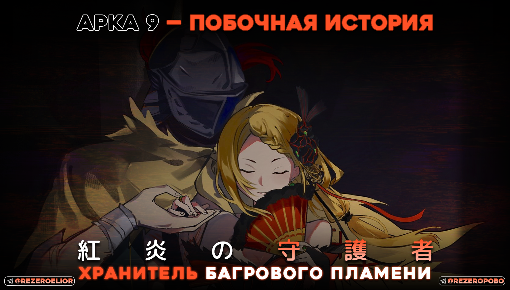
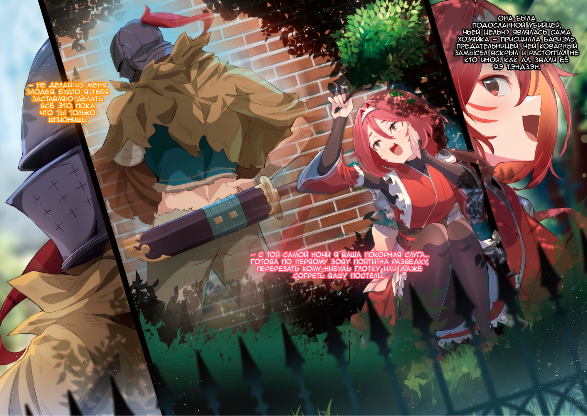
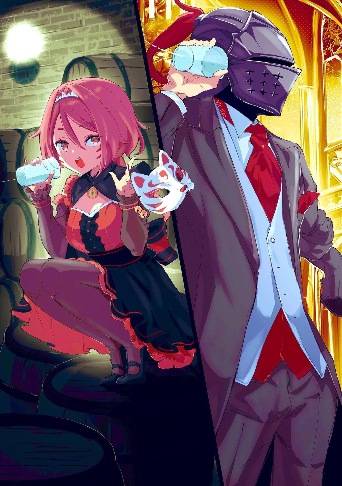
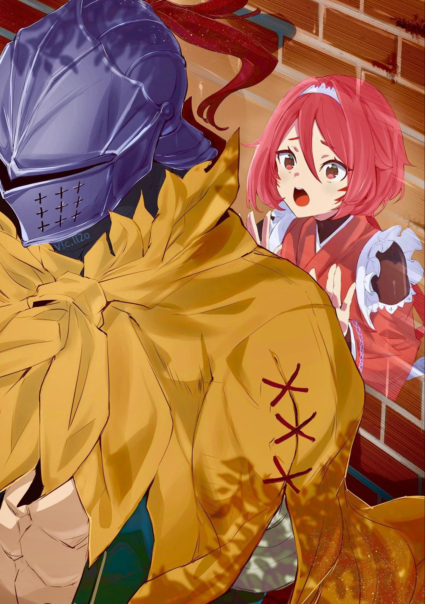
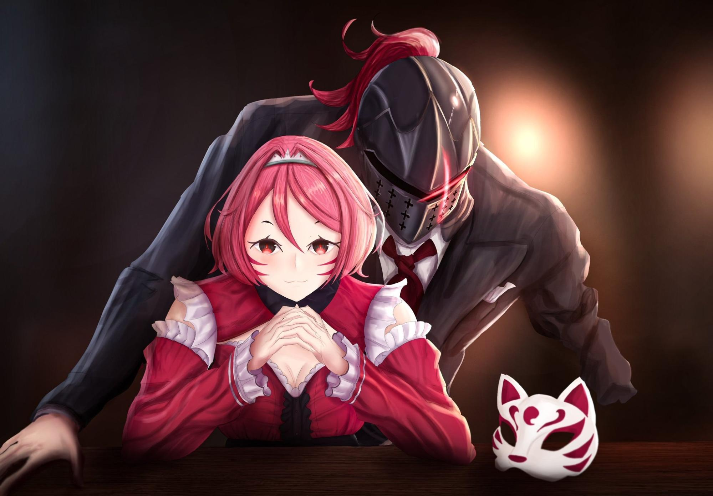

1

— Господин Ал, вам меня хорошо слышно~?

— Ого, оно работает, — удивлённо буркнул Ал, когда из бокала донёсся звонкий девичий голосок.

До последнего он сомневался в этой затее. Конечно, Ал понимал принцип работы и догадывался, чем всё кончится, но стоило применить эту штуковину на деле, как он изумился, словно мальчишка. И от этого внезапного ребяческого восторга стало даже неловко.

— К слову о неловкости. Наряд вам очень идёт, так что выше нос~! Ой, хотя… когда вы делаете так… пожалуй, вид и правда дурацкий~.

— Не читай мои мысли. И вообще, я тут не по своей воле.

— Обстоятельства прижали, да~? Понимаю-понимаю~.

Ал тяжело вздохнул под этот кокетливый щебет и мысленно посмотрел на себя со стороны. Собеседница била не в бровь, а в глаз. Его разбойничье тряпьё вызывало разве что упрёки в полном отсутствии вкуса, но сегодня на нём красовался строгий смокинг. А на голове был грубый железный шлем — настоящий писк весенней коллекции Лугуники. Вишенкой на торте служил пустой бокал, который он прижимал к виску… кхм, шлему. На безлюдном балконе одинокий человек самозабвенно беседовал с воздухом…

— Дело даже не в глупости. Я выгляжу как подозрительный тип.

— А вы не поздновато спохватились~?

— Да заткнись ты.

Ал огрызнулся на собеседницу, которая ловила каждый его недовольный вздох, а в ответ молола чепуху. Он покосился на зал. Оттуда долетал приглушённый гул толпы.

— Ну и?

— В дальнем правом углу. Седовласый усач, весьма представительный.

— Седой, усатый, представительный. Понял.

Ал пристроил бокал у края балконных перил, поправил воротник и шагнул обратно в духоту праздника. Гости прятали лица за масками, так что пришлось изрядно покружить в толпе, но нужный человек всё же нашёлся. Ал назвал себя и увлёк незнакомца в коридор. А затем…

— Просто звёзды не сошлись.

Едва они свернули в пустынное крыло особняка, маски слетели. Мужчина в мгновение ока растерял джентльменский лоск и резким выпадом нацелился на кадык Ала. Тот ушёл с линии удара, выхватил кинжал и вогнал сталь врагу под рёбра. Лезвие, которым он оборвал чужую жизнь, было смазано ядом. Ал подхватил обмякшее тело и уволок труп на задний двор.

— Блядь… Аж шесть раз. Силён, гад.

Один-единственный противник высосал из него все соки. От мысли, сколько ещё таких крутится вокруг, разболелась голова. Ал вернулся к условленному месту на балконе, забрал оставленный бокал и снова прижал его к шлему.

— Блестящая работа, я в вас и не сомневалась~! Но расслабляться рановато, это ещё не конец~.

— …

— Ой, что с вами? Вы тут? Слышите меня? Ниточка натянута, значит, звук идёт… Алло-о~?

Ал ей не ответил. Он размышлял о том, как вообще докатился до жизни такой. Бал-маскарад в особняке Бариэль был в самом разгаре, а ему приходилось марать руки в чужой крови.

2

Всё началось дней десять назад, задолго до того, как ему пришлось напялить этот непривычно строгий смокинг.

— Госпожа Присцилла изволила провести *маскарадную* ночь!

— *Маскарадную*?..

— Именно! — с сияющими глазами подтвердил очаровательный юный дворецкий, любимчик хозяйки особняка.

Алые глаза мальчишки светились детским восторгом. Ал постучал пальцами по заклёпкам шлема. Очередная прихоть госпожи его не удивила.

— Ну, с балом-маскарадом всё понятно, но откуда… А, ладно. Раз уж пошло в ход иноземное словечко, к гадалке не ходи — опять всё из-за меня.

— Вовсе нет, я сам попросил! Сказал, что безумно хочу на такое посмотреть! Когда госпожа Присцилла обмолвилась о праздниках, где все прячут лица, я просто не сдержался…

— Понятно. То, что принцесса души в тебе не чает — не новость, да и сама она подобные забавы обожает. Всё сходится.

По правде говоря, зная её нрав, Ал не удивился бы, вздумай она устраивать подобные балы каждую неделю. Но ляпни он это вслух — и её гнева точно не миновать, так что благоразумнее было прикусить язык. Как бы то ни было, объяснения Шульта всё расставили по местам.

— Выходит, теперь вы тут все спины гнёте с этой подготовкой.

Ал огляделся. Кроме застывшего перед ним мальца, остальные слуги носились по поместью как заведённые. Он слабо представлял, скольких трудов стоит организация маскарада, но внезапная гулянка явно не обещала слугам лёгкой жизни. И всё же, несмотря на свалившуюся гору хлопот, ни на одном лице не мелькнуло и тени обиды или недовольства.

— Серьёзно, эта её способность вызывать слепую преданность — жуткая штука.

— Госпожа Присцилла такая добрая и прекрасная, её все обожают!

Шульт вступился за госпожу даже в ответ на это безобидное брюзжание, а затем, подпрыгивая от нетерпения, умчался помогать остальным. Ал проводил его взглядом. Паренёк оставался сущим ребёнком и как дворецкий пока не блистал, но его искренняя наивность обладала поразительной силой: стоило ему оказаться рядом, как окружающие сами начинали лезть из кожи вон.

— Стало быть, чары Шульта в действии… Любопытно, в какого сердцееда он вырастет? Будет сводить с ума старших девиц?

Стоило ему вслух выдать столь сомнительное пророчество, как до него донеслось:

— Ай-ай-ай, некрасиво говорить такие пошлости о невинном мальчике~.

— …

Ал прищурился. В саду, где он только что болтал с мальчишкой, никого не было. Но столь сочащийся ехидством голос никак не мог быть игрой его воображения. Он неспешно подошёл к пышной клумбе с алыми цветами и тяжело привалился спиной к кирпичной ограде. Затем, не оборачиваясь, бросил через стену:

— Эй, не высовывайся. Не хватало ещё, чтобы по округе поползли слухи, будто вокруг поместья госпожи Присциллы по ночам бродит дух казнённой за измену безголовой служанки Холлоу[^1].

— Вообще-то сейчас день, ножки у Яэчки на месте, да и не припомню я, чтобы мне рубили голову за неверность~… Впрочем, то, через что прошла я, пожалуй, было даже пострашнее.

Девушка бросила шпильку без привычной игривости. Ал скривился под шлемом. Собеседница, которая пряталась за кирпичной стеной в саду, обладала гибким станом и лукавыми раскосыми глазами. Прежде она служила здесь горничной, но уволилась по семейным обстоятельствам. Впрочем, прятаться в тени её заставляла вовсе не потеря работы. Она была подосланной убийцей, чьей целью являлась сама хозяйка — Присцилла Бариэль. Предательницей, чей коварный замысел вскрыл и растоптал не кто иной, как Ал. Звали её Яэ Тэндзэн.

— С той самой ночи я ваша покорная слуга… Готова по первому зову пойти на разведку, перерезать кому-нибудь глотку или даже согреть вашу постель…

— Не делай из меня злодея. Будто я тебя заставляю делать всё это. Пока что ты только шпионишь.

— Раз «пока что», значит~…

— До третьего пункта не дойдёт.

— Пропустили второй и сразу вцепились в третий… Всё-таки вы типичный мужчина~!

Она играючи отбила выпад безупречной логикой, так что Алу оставалось лишь прикусить язык. Спорить дальше вышло бы себе дороже, и он благоразумно решил перевести разговор в другое русло. Яэ ведь тоже прекрасно понимала, чем рискует, крутясь возле особняка. И всё же презрела опасность и вышла на связь…

— Кстати, у вас сегодня на удивление шумно~. Недавно вон Шульт мимо пробегал~… Как всегда, милашка. Прямо затискать хочется!

— И не поспоришь, но ты ведь припёрлась не от тоски по пацану? Что стряс…

— На госпожу готовится новое покушение.

Ал не договорил. От внезапного ледяного холода в её голосе и от самих этих слов он невольно прищурился. Повисла тишина. Ал дал новости осесть в голове. Звучало скверно, но, положа руку на сердце, ничего удивительного в этом не было. Сейчас Присцилла входила в пятёрку кандидаток на престол, от которых зависело будущее королевства Лугуника. Да и без этого своим нравом она легко наживала врагов. Неудивительно, что многие считали эту женщину с её пронзительным умом и тяжёлым взглядом помехой и мечтали устранить. Но раз уж предупреждение исходило от Яэ, дело принимало совсем иной оборот.

— Значит, империя наносит новый удар? Откуда узнала?

— На базе, где я раньше пряталась, кто-то наследил. Должно быть, сменщик Яэчки сунулся туда пополнить запасы~.

— Ну и ну. Для элитного имперского синоби это как-то чересчур топорно.

— Зря вы так. Вам, может, и трудно понять, но действовать в тени на чужой земле — задачка архисложная~.

Она явно надула губы из-за столь небрежной оценки, протянула капризное «К тому же~…» и закончила:

— На родине никто и помыслить не может, что я жива, не говоря уже о моей измене. Так что это вполне естественный промах.

Она сказала это мягко, но в тихом шёпоте звякнула сталь, способная убить одним лишь звуком. Горло обожгло фантомным холодом лезвия. Ал прищурил один глаз.

Яэ не врала. Она была непревзойдённым гением из скрытой деревни синоби империи Волакия — той, кому доверяли важнейшие задания с нуждой в стопроцентном успехе. А на случай провала в саму её душу впечатали команду оборвать собственную жизнь, чтобы она не выдала ни крупицы сведений о родине… Именно в душу. Но Ал грубо взломал и переписал эту установку собственной силой. Подобное считалось невозможным, поэтому винить Волакию за просчёт не приходилось.

— Кто бы мог подумать, что малышка Яэ после адских тренировок, которые она преодолела играючи, падёт душой и телом перед потрёпанным мужиком из королевства и предаст отчизну…

— Хватит шить мне то, чего не было. Шутка так себе.

— Может, и так~… Ну так вот, насчёт следующего покушения~…

— Ты говоришь об этом так буднично, словно мы поездку на ярмарку планируем.

— Почти наверняка всё случится на приёме, который устраивает госпожа. Кажется, вы упоминали маскарадную ночь?

От такого прогноза Ал невольно схватился за голову. Разумеется, пышный приём с толпой гостей — лучшая возможность нанести удар. К тому же бал-маскарад, где каждому полагается скрывать лицо, казался идеальным подарком судьбы для Волакии — шансом отомстить за Яэ. Но голова у него раскалывалась вовсе не от этого рокового совпадения.

— Я прямо вижу, как предлагаю принцессе всё свернуть из-за опасности, а она меня и слушать не желает…

— Госпожа ведь никогда не отступает от задуманного~.

— Вот и я о том же. Мы в дерьме.

Ал постучал пальцами по заклёпкам шлема и понурил плечи. Он живо представил расплату за испорченное настроение Присциллы. Если госпожа просто одарит его пинком изящной туфельки — это ещё сойдёт за награду. Но если она разгневается всерьёз и обнажит «Меч Света», с ней уже будет не сладить. И всё же…

— С другой стороны, лучше уж знать, когда они нагрянут, чем сидеть в неведении.

— …

— Я, конечно, попробую образумить принцессу, но особо не надейся на это. Придётся бросить все силы на то, чтобы перерезать их прямо на приёме. Тебе тоже найдётся работёнка.

Ал отогнал тоску и настроился на деловой лад, но в ответ повисла тишина.

— Яэ?

Она молчала, и он окликнул её снова:

— Ты чего затихла? Только не говори, что дрогнуло сердце при мысли о схватке с бывшими товарищами…

— Нет-нет, вовсе нет. Просто подумалось… Вы всё-таки страшный человек~.

— С чего вдруг?

Решив, что она снова за своё, Ал отмахнулся от девушки. Некогда было тратить время на пустую болтовню. Он уже принялся прикидывать в уме план подготовки, когда за его спиной…

— Вы и правда очень страшный человек.

Но брошенная вслед фраза так и не долетела до его ушей.

3

Итак, вернёмся в ночь маскарада — к моменту, когда Ал разделался с убийцей и вышел на связь с Яэ. Как и следовало ожидать, Присцилла пропустила его предостережения мимо ушей, и бал всё-таки состоялся. Алу пришлось примерить роль не шута при госпоже, а признанного всеми «рыцаря». Гадкое ощущение. И дело было даже не в самой роли — а в том, что *ему* приходилось играть в «рыцаря».

— Алло~? Господин Ал~?

— Да здесь я, прости. На второй линии висел.

Голос девушки отзывался дрожью в донышке бокала. К его ножке крепилась почти невидимая нить. Через дальние закоулки поместья она тянулась прямиком к пальцам Яэ. Вся эта система работала по принципу ниточного телефона. Ещё до начала торжества Ал раскинул нити по особняку, наладив надёжную и скрытную связь.

— Нашлась бы пара зеркал связи — не пришлось бы так корячиться.

— Не говорите так, будто это сущий пустяк~! Хоть их на рынке и больше, чем других метеоров, на дороге они не валяются. Особенно сейчас! Я ведь осталась без работы и теперь ваш карманный альфонс~!

— Вообще-то «альфонсами» бывают только мужики, так что следи за языком.

— А? Почему так?

— А кто ж его знает? Чудеса японского языка[^2].

В этом выражении прослеживались нравы той эпохи, когда оно только зародилось. Но смысла думать об этом не было — дальше собственных догадок Ал всё равно бы не ушёл, а потому просто отмахнулся от этой мысли. Куда важнее было другое.

— Он оказался крепким орешком… Что там у нас? Это последний?

— М-м-м~, мне бы очень хотелось вручить вам медальку, но~… если верить моим глазам, там ещё человек восемь~.

— Восемь?!.. Ты вообще одна припёрлась! Тебя что, просто как пушечное мясо закинули?

— Сказали бы лучше, что я сто́ю всех девятерых! Яэ Тэндзэн — мила, надёжна и гарантирует результат, даже если работает в одиночку.

От столь безрадостной перспективы у Ала перехватило дыхание, и её кокетливое щебетание пролетело мимо ушей. Впрочем, сил отшучиваться у него всё равно не нашлось. Говорила-то она правду. Наводнившие бал убийцы явились по душу Присциллы. Но они и подумать не могли, что их так легко раскусят. И дело было вовсе не в заранее собранных сведениях.

— Все эти уловки маскировки выдают себя не в походке и не в поведении, а в кончиках волос да в уголках глаз. Я в таких делах толк знаю~. Особенно когда кто-то уж слишком старательно молодится~.

— Ну, последнее к синоби вообще никаким боком, но всё равно спасибо, выручаешь.

Своим чутьём Яэ легко обесценивала чужие годы тренировок. Алу было даже жаль потраченных ими усилий, но раз уж целью всех этих стараний стала жизнь Присциллы, разговор короткий. Он без малейших угрызений совести пошёл бы на любую подлость, лишь бы отвести угрозу от неё.

— И всё же я не уверен, что смогу живенько раскидать ещё восьмерых. Давай, подсоби.

— Ого~, грязная работа~. А мне ведь приказали на глаза не попадаться…

— Ну так выкрутись как-нибудь. Ради чего всё затевалось-то? К чему вообще весь этот маскарад?

— Уж точно не ради резни~.

«И ведь не поспоришь», — подумал Ал. Он неторопливо размял затёкшую шею, настраиваясь на следующую схватку. Ещё восемь. Хотелось бы, конечно, переложить часть мороки на Яэ, но львиную долю работы всё равно придётся делать самому. Раз уж взялся играть в «рыцаря» — пусть и без малейшей охоты, — изволь соблюдать приличия.

— И всё-таки-и-и~, — протянула Яэ.

— Чего ещё?

— Раз уж у нас бал-маскарад, я надеялась, что вы появитесь в какой-нибудь маске. А вы опять притащились в своём шлеме~. Какая досада.

Ал решил не слушать дальше ворчание из бокала и молча опустил его на столик. Мало того что пришлось влезть в дурацкий костюм, так ещё и шлем снять? Вот уж хрен вам. Да и вообще, если и вспоминать тему сегодняшнего вечера…

— Некоторые носят маски с самого рождения.

4

Маскарад в поместье Бариэль протекал чинно и мирно. На приём к «Принцессе Солнца» съехалось множество гостей. В просторных залах особняка слуги сбивались с ног и старались угодить каждому приглашённому. Слаженность и безупречная выучка прислуги производили впечатление даже на искушённую знать. Гости искренне, без тени дежурной лести, восхищались тем, как хозяйке удаётся добиваться от подчинённых такой слепой преданности.

На любом званом вечере хозяева обязаны держать торжество под контролем, но вместе с тем получают редкий шанс явить свету своё могущество и размах. Скудное угощение или череда лакейских оплошностей неминуемо обернутся пересудами о слабости рода. Фамильная честь покроется несмываемым пятном, а недруги получат повод для нападок. Но если из страха перед неудачей вовсе запереться в четырёх стенах и отказаться от приёмов, презрения света тоже не избежать.

В конце концов, дворянское общество — бесконечная ярмарка тщеславия, и её завсегдатаи прекрасно знают, что лишь эти пышные бескровные баталии удерживают мир от настоящей резни.

— Поэтому я рад, что всё проходит гладко! — с облегчением выдохнул Шульт.

Мальчик с живым любопытством наблюдал за пёстрой толпой и другими слугами. Те деловито сновали среди знати. Кстати, Шульту досталась маска белого кролика: Присцилла выбрала её лично из множества других и объявила, что она ему очень к лицу. Маска не просто закрывала верхнюю половину лица — макушку венчали пушистые ушки. Выглядело это умилительно, пусть и сам Шульт немного смущался.

— Но раз госпожа Присцилла сказала, что мне идёт, значит, так оно и есть!

Слово госпожи — непреложная истина. В маленьком мире Шульта иначе и быть не могло. Он всем сердцем верил, что его прекрасная и мудрая госпожа всегда права. Затея с маскарадом поначалу казалась спонтанной, а подготовка отняла уйму сил, но стоило заиграть музыке — и гости принялись наперебой осыпать хозяйку похвалами. Пусть их лиц под масками почти не удавалось разглядеть, что слегка огорчало, они явно были в восторге.

— Госпожа Присцилла просто невероятна!

Шульт понимал, что задирать нос обычному слуге не пристало, но удержаться от гордости всё равно не мог и расправлял худенькие плечи. Впрочем, вся его гордость без остатка принадлежала госпоже, так что ничего дурного в этом не было.

— Кстати, господина Ала что-то не видать…

Не найдя взглядом мужчину — одного из немногих, кем мальчик восхищался почти так же сильно, как госпожой, — он повертел головой. Тот должен был явиться в своём шлеме, пусть и в непривычно строгом костюме. Шульт втайне надеялся, что по столь торжественному случаю Ал примерит какую-нибудь диковинную маску, и даже немного расстроился, когда тот наотрез отказался. Но раз уж Ал так дорожил своим шлемом, значит, на то были веские причины. Обычно рыцарь Присциллы держался чуть поодаль и лениво присматривал за госпожой, которую то и дело брали в кольцо гости. И то, что сейчас его нигде не было видно, казалось странным.

— Мальчик, уделишь мне минутку?

— А! Да! Чем могу служить, почтенный гость?

Размышления прервал незнакомец в маске с чёрными перьями. Он тихо спросил, где найти уборную, и Шульт с готовностью закивал:

— Прошу за мной!

На столь пышном приёме мальчику не доверяли разносить напитки и тяжёлые подносы, поэтому для него было настоящим счастьем принести пользу хотя бы так.

— Вот! Уважаемый гость, уборная зде… а?

Указав рукой на нужную дверь, мальчик живо обернулся и озадаченно склонил голову набок. Человек, которого он только что вёл за собой, бесследно исчез.

— Ой-ёй… Уважаемый гость, где же вы? Ах, неужели я шёл слишком быстро и оставил вас позади?!

Шульт понимал, что из-за желания выполнить работу безупречно ноги сами собой прибавили ходу. Мальчик решил, что совершил непоправимую оплошность, и побледнел. Пусти он всё на самотёк, и тут же поползут слухи, будто слуги госпожи Присциллы не способны даже проводить гостя в уборную. Это подпортит её репутацию и доставит немало бед остальной прислуге.

— К тому же… к тому же гость ведь не сможет терпеть вечно! Нужно скорее его най…

— Ах~, милый дворецкий, не переживай ты так~.

— Ой-ой-ой!

Шульт уже приготовился со всех ног броситься на поиски, но чьи-то руки обхватили его со спины и оторвали от пола. Мальчик изумлённо захлопал глазами и попытался оглянуться. Позади стояла улыбающаяся дама в бальном платье и маске кошки.

— Тот господин передал, что нужда отпала и помощь ему больше не требуется. Он встретил знакомых и откланялся.

— П-правда? Какое облегчение! Сестрица… ой, то есть благородная госпожа, спасибо вам огромное!

— Пустяки~, мне только в радость~.

— Вы такая добрая! Я так тронут!.. Простите?

Поблагодарив собеседницу, Шульт немного растерялся. Женщина почему-то не спешила его отпускать. Она по-прежнему крепко прижимала мальчика к себе, но с идеальной чуткостью — так, чтобы не причинить ни капли боли.

— Эх, как жаль… Но если не отпущу, ты совсем засмущаешься. Придётся потерпеть~, — с лёгким вздохом произнесла она и наконец опустила его на ковёр.

— Эм-м… с-спасибо?

— Ах, какой прилежный, воспитанный мальчик! Ну же, ступай обратно в зал. А не то госпожа забеспокоится, если потеряет тебя из виду.

— Госпожа Присцилла всегда полна уверенности, даже когда меня нет рядом! Она просто потрясающая!

— И всё же~.

Дама заботливо оправила на Шульте костюмчик дворецкого и мягко развернула его. Получив нежный толчок в спину, мальчик тихонько охнул и зашагал вперёд. У поворота он оглянулся и увидел, что незнакомка ласково машет ему рукой. Шульт махнул в ответ, но тут же смутился — негоже дворецкому вести себя как несмышлёныш — и скрылся за углом. И лишь тогда в голову пришла внезапная мысль…

*Эта гостья… кажется, она чем-то похожа на госпожу Яэ…*

Она тоже служила в особняке Бариэль, но уволилась по семейным обстоятельствам. Шульт восхищался ею, пусть они и не успели толком проститься. Мимолётное сходство отозвалось в душе грустью. Мальчик поспешил обратно к гостям…

Прямо за окном этого коридора покачивался задушенный невидимой нитью человек. У его ног лежала маска с чёрными перьями.

5

— Короче, Шультику грозила беда, но я его спасла! Яэчка очень довольна~… Наконец-то удалось вдоволь потискать его.

Ал тяжело вздохнул. Отчёт о выполнении задачи плавно перетёк в рассказ о её странных слабостях. То, что она уберегла любимчика Присциллы от наёмников заслуживало похвалы, вот только сама она была точно такой же убийцей.

В итоге восьмерых синоби они поделили поровну. Мало того что Яэ перечеркнула его скромное намерение взять большую часть на себя, так ещё и успела удовлетворить собственные потребности. Её нельзя было назвать психопаткой — смертями она не упивалась. Просто с её воспитанием убийство было чем-то повседневным. Как бы то ни было…

— Попотеть пришлось, но всех своих я уложил. Теперь-то всё?

— М-м-м, ну-у-у, как бы это сказать…

— Чего мнёшься? Говори давай.

— Конечно, среди наших со мной сравнится разве что старейшина, так что эти берут числом, а не умением, тут уж спор-пору нет. Но…

— Спор-пору нет, и дальше что?

— Раз эти пришли после того, как я оплошала, то, чтобы не разбрасываться людьми зазря, они должны были составить план, который дотянет хотя бы до уровня Яэчки. Логично?

Ал притих. Вопрос прозвучал с девичьим легкомыслием, но заставил крепко призадуматься… А ведь и правда. Пусть собеседница и набивала себе цену, он на собственной шкуре знал, что в родной деревне она действительно считалась лучшей из лучших. Со своей способностью перекраивать правила мира Ал повидал всякого, но эта особа входила в тройку опаснейших противников, которые загнали его в угол. Из-за этого ей самой пришлось пережить ад, который он вовсе не собирался ей устраивать, но…

— Это всё лирика, но в твоих словах есть логика. Если только в империи людские жизни не считают за мусор и не надеются остудить кипящий котёл, бросая туда по крошечной льдинке.

— В империи жизнь стоит ровно одну жизнь. Я как-то удостоилась аудиенции у Его Превосходительства Императора, и он изволил сказать, что людям надлежит умирать эффективно.

— М-да. С этим типом мы бы точно не поладили…

Мысли об императоре, шансов на встречу с которым всё равно не было, пришлось выбросить из головы. Ал сосредоточился на главном… Бросать на задание, где спасовала Яэ, людей с ещё более низкими шансами на успех значило лишь бессмысленно плодить трупы. В империи требовали результатов, соразмерных цене потраченных жизней. А раз так, те убийцы служили приманкой. Иными словами, их план был не так прост, как думала Яэ.

— Есть мысли, к чему готовиться?

— Между королевством и империей заключён пакт о ненападении под Королевские Выборы, так ведь? Чтобы никто не пикнул о нарушении, исполнители обязаны убить себя сразу после выполнения задания. А раз так, наш прижимистый дедуля ни за что не пожертвует молодняком или ценными бойцами, так что мастерство отходит на второй план. М-м-м, вариантов тьма-тьмущая, боюсь, круг не сузить~, — промурлыкав ответ, Яэ наотрез отказалась тыкать пальцем в небо.

Синоби славились умением подстраиваться под любые условия, а значит, их планы были бесконечно разнообразны. Тот же кинжал, которым Ал убивал их, вместе с ядом на его лезвии изготовила Яэ.

— Убойнейшая штука~! Свалит даже синоби с железной устойчивостью к ядам после тренировок. Фирменный рецепт милашки Яэ с экстрактом дзиранме~!

— Я как-то шутки ради ткнул в него пальцем — и познал ад.

— Аха-ха-ха! Господин Ал, ваше бессмертие вовсе не повод творить подобные глупости~.

По её тону сложно было понять, восприняла ли она его всерьёз. Но Ал доверил этому клинку собственную шкуру, так что желание убедиться в убойности оружия выглядело вполне разумно. Дрянь вышла поистине чудовищная: хватало царапины, чтобы умереть мгновенно. И, похоже, пускать его в ход придётся снова.

— Яэ, ты правда без понятия, какой у них план?

— Не знаю. Что будете делать?

— Ответ очевиден.

Голос собеседницы внезапно стал непривычно сухим. Ал же лихорадочно просчитывал следующие шаги. Если уж пускать в ход свой чит[^3], чтобы сорвать чужие планы…

— Придётся перебирать методом тыка.

Он тяжело зашагал обратно в банкетный зал. Тот был до отказа набит безликими гостями в масках. Он собирался создать там хаос — везде, куда только сможет дотянуться.

— Эль Дона.

Грянуло немыслимое безумие, непоправимое для всех и каждого… Кроме него самого.

6

Хамаяру Уэдзуми, синоби из Империи Волакия, поручили устранить Присциллу Бариэль. Он не знал ни мотивов, ни истинной подоплёки приказа, да и не стремился узнать. Вышколенный с малых лет, Хамаяр был идеальной марионеткой, которая была лишена даже тени собственной воли. А потому и сейчас не задавал лишних вопросов. И всё же некоторые детали внушали опасения: пугающая сила самой цели, а также судьба Яэ Тэндзэн, которая провалила то же задание. Гибель такого же синоби, как и он сам невольно тревожила душу.

— Подумать только, любимица старика Ольбарта…

Ольбарт Дарккенн — «Третий» из прославленных «Девяти Божественных Генералов» империи по прозвищу «Порочный Старик» — стоял на вершине иерархии волакийских синоби. И даже он безоговорочно признавал Яэ исключительным гением. Теперь же на смену погибшей отправили Хамаяра и ещё девятерых синоби. Отряду смертников не оставили права на ошибку.

Работать на чужой земле всегда тяжело: ни подкрепления, ни надёжных союзников. Однако судьба неожиданно улыбнулась им. В особняке цели гремел пышный приём — более того, маскарад, где гости прятали лица. Наученные горьким опытом предшественницы, синоби безупречно подготовились и нашли лазейку. Ею стал тайный подземный ход прямо под особняком Бариэль.

Покойный супруг Присциллы, Лейп Бариэль, был человеком коварным, но в то же время и параноиком. Под поместьем имелся тайный проход, о котором не ведала ни единая живая душа. Чтобы сохранить секрет, барон заставил замолчать и строителей, и архитектора. После смерти Лейпа о нём не должен был никто узнать, но они раздобыли чертежи и воспользовались проходом.

Рыцаря Присциллы — того самого, что расправился с Яэ, — отвлекут девять синоби. Они сыграют роль приманки, а Хамаяр выполнит задание. Таким был их идеальный, безукоризненный план. Вернее… он должен был стать таковым.

— Просто звёзды не сошлись.

Во мраке подземелья, где не должна была ступать ничья нога, кроме его собственной, проступил силуэт странно одетого мужчины. Его лицо скрывал угольно-чёрный стальной шлем, а левый рукав парадного костюма, который он надел ради маскарада, был завязан узлом. Перед Хамаяром предстал тот, на чьё имя неизбежно натыкаешься, собирая сведения о Присцилле Бариэль — загадочный человек по имени Ал, которого считали её первым рыцарем.

— Как ты…

— Спрашиваешь, как раскрыл вас? Не боись, твои дружки не раскололись. Просто я переломал и перепробовал всё, что только можно… Короче, перебрал кучу вариантов и вычислил, откуда ты выскочишь. Так сюда и добрался.

— …

— Нихрена не понял, да? Ну сорян, такой уж у меня баг[^4].

Хамаяр решил, что Ал не просто паясничает и увиливает от прямого ответа — скорее, он жил по каким-то своим, совершенно чуждым законам логики. В таком случае и нелепый наряд был не плодом дурного вкуса, а имел особый смысл.

—Раз встал у меня на пути — пощады не жди.

Отступать Хамаяру всё равно было некуда. Девять синоби уже погибли, и он был обязан принести смерть, соразмерную этой жертве.

— Я, между прочим, тебя щадить тоже не…

Ал шагнул к противнику. Он собирался что-то сказать, но из мрака подземелья метнулась тень и впилась в него прежде, чем слетело последнее слово.

— Чег… — в горле Ала застрял изумлённый хрип, и кромешная тьма тут же поглотила его вскрик.

Тень буквально оторвалась от пола и бросилась на жертву. Она приняла облик смоляного зверя. Такой была техника Хамаяра — власть над порождением тени, призрачным волком.

С самого раннего детства синоби скармливал собственную тень этому ненасытному созданию, и они росли бок о бок. Лишённый глаз, носа и любых иных черт, что могли вызвать хоть каплю жалости, пожиратель теней креп вслед за хозяином, пока не вымахал в огромного четвероногого монстра. Ожившая тень — вот чем он являлся.

Обычно зверь спал в тени синоби. Он умел просачиваться сквозь малейшие щели, и таким образом помог хозяину исполнить множество кровавых контрактов. Венцом карьеры Хамаяра должно было стать последнее дело — убийство Присциллы Бариэль. Он перешагнул сорокалетний рубеж: задания важнее этого ему уже никогда не доверят. Хамаяр пришёл сюда, чтобы вместе со своей теневой половиной поставить яркую точку в своей жизни. И теперь…

— Я не позволю какому-то чудаку мне помешать!

Призрачный волк яростно хлестал хвостом и извивался. Зверь вбивал Ала в камень и безжалостно терзал его плоть. Их парный натиск не оставлял жертве ни шанса на сопротивление. Для Хамаяра это было основой основ — незыблемой формулой победы, что не требовала никаких ухищрений.

— Гх-х-х!

С глухим рыком чудовище терзало врага, выжидая, когда добыча окончательно ослабнет и перестанет сопротивляться. Задача Хамаяра сводилась к одному: помочь зверю и поскорее оборвать чужую жизнь. Он был не хозяином призрачного волка, а его верным напарником. Но в этот раз прийти на выручку не удалось.

— Стальные нити… Не может быть!

Хамаяр отскочил назад и скрипнул зубами. С его левой руки тяжёлыми каплями стекала кровь. Чутьё спасло ему жизнь — вскинутое предплечье защитило шею. Но от кончиков пальцев до самого локтя плоть буквально размолотило в кашу. Как и подобало синоби, он усилием воли вытеснил болевой шок на задворки сознания и напряг мышцы, пережимая разорванные сосуды. Но следом за болью накатила слепая ярость. Ведь тончайшие стальные нити принадлежали к числу тайных искусств синоби, которым в нынешнюю эпоху владел лишь один человек — Яэ Тэндзэн по прозвищу…

— «Багровая Сакура-а-а-а-а»!!!

— Ой, ну будет вам… Зачем же так кричать~?

Его рёв раскатился под сводами подземелья, и в полумраке соткался девичий силуэт — тонкий, смертоносно гибкий, словно та самая стальная струна. Девушка, которую отправили в королевство и сочли погибшей после провала задания, стояла прямо перед ним. В нарядном платье, она прятала лицо за кошачьей маской — и всё же ошибки быть не могло. Она выжила. И преспокойно скрывалась на чужой земле. У Хамаяра помутилось в глазах.

— Почему синоби, который провалил задание, всё ещё дышит?!

— Давайте без лишней драмы~. Мы ведь старые знакомые! Раз оба живы, могли бы мило улыбнуться, пожать друг другу ручки и сказать: «Сколько лет, сколько зим!». Хотя~… кажется, вашей левой руки больше нет, я её на ленточки распустила.

— «Багровая Сакура»…

— Выходит, рукопожатие отменяется, да~? Эх, никто меня с самого детства никогда не любил…

Стальные нити заплясали вокруг неё. Яэ картинно надула губки. Её манеры, жесты, легкомысленный тон — всё это бесило Хамаяра до зубовного скрежета.

Он прекрасно помнил её ещё со времён первых тренировок в деревне. Хамаяр был вдвое старше. Пока малышка Яэ делала лишь первые робкие шаги, он уже проливал кровь на настоящих заданиях, но все без умолку шептались только о ней. Ей не исполнилось и десяти, когда она постигла «Метод Потока» — технику контроля тела через манообращение. Меньше чем за год девчонка освоила десяток сложнейших техник, на каждую из которых у других уходили годы. Но главным её триумфом стало покорение искусства стальной нити, что не давалось никому на протяжении столетий. Одарённая, она по праву слыла чудо-ребёнком и признанным гением — синоби среди синоби. И всё же…

— Тебе дан невероятный талант, но в тебе нет ни капли нашей сути! Тебе лишь бы глупо хихикать! Ни к чему не относишься серьёзно, никакой отдачи!..

— Понимаю. У вас и у всей деревни есть свой образ идеального синоби. Но мне жутко не нравится, когда от меня ждут того, чего вы сами не сумели достичь. В конце концов, я просто делаю то, что умею. Разве бездарность остальных — моя вина?

— Ты переметнулась к врагу из страха за собственную шкуру и смеешь оправдываться?!

Нелепые отговорки не остудили Хамаяра — напротив, лишь плеснули масла в костёр его ярости. За что? Почему? Возмущению мужчины не было предела. Почему небеса избрали именно её? Зачем даровали саму суть их искусства женщине, которая не была верна пути синоби? Хамаяр дрожал от смеси зависти и жгучей обиды.

Яэ задумчиво протянула: «М-м-м…» — словно сытая кошка. Она лениво шевелила тонкими пальцами и перебирала невидимые стальные нити.

— Раз уж я и правда сдалась, спорить глупо… Но во избежание недопонимания позвольте кое-что прояснить.

— К чему этот трёп?

— Я сдалась вовсе не потому, что цеплялась за жизнь. Мне ведь не позволили даже оборвать её. Господин Хамаяр… я отступила не перед «смертью». Я склонилась перед «страхом».

От её ледяных слов мужчину прошиб озноб, и вся злость мигом испарилась. Какой бы ветреной ни казалась Яэ, она прошла через беспощадную муштру. Её учили подавлять любые эмоции. Она обладала несгибаемой волей. Девушка не проронила бы ни слова под страшнейшими пытками. Она не врала. Его сердце это знало.

— Взгляните, он поднимается. Тот, кто стал воплощением моего «страха».

Сразу после этих театральных слов звук, что сотрясал студёный воздух подземелья, внезапно стих. Смолкло тяжёлое дыхание призрачного волка, который до того рвал жертву на куски. Однако зверь, что прежде всегда бесследно уходил в тень хозяина после расправы над добычей, почему-то остался на месте. Причина крылась в следующем…

— Ну и ну… Наконец-то ты начал слушаться.

Мужчина плавно поднялся с земли. Призрачный волк покорно опустил морду. Хищник словно признал собственное бессилие, выражая абсолютную покорность добыче.

— Но как?..

— Кто знает? На то он и господин Ал.

Хамаяр уловил в голосе девушки неприкрытую радость и почувствовал, как в груди закипает новая вспышка ярости. Он резко повернулся к девушке, собирался сорваться на крик…

Но стоило перехватить её взгляд — полный благоговейного трепета, с каким она смотрела на силуэт во тьме, — как он всё понял. Яэ Тэндзэн сломалась. Он списал её странное поведение на прежнее легкомыслие, привычное ещё по деревне, но ошибся. Она не лгала. Её сломил «страх». Он разбил вдребезги волю девушки, вытравил саму её суть. И виновником этого стал…

— Яэ, не лезь. У меня к нему есть дельце.

— Как пожелаете.

С почтительным поклоном Яэ втянула стальные нити и послушно отступила во тьму. Она действительно собиралась исполнить приказ Ала от и до, не вмешиваясь в схватку. Вот он — шанс. Теперь, когда призрачный волк непостижимым образом подчинился врагу, у искалеченного, потерявшего руку Хамаяра не оставалось надежды выстоять против неё. Но раз Ал сам велел ей отойти в сторону, всё менялось.

Менялось. Должно меняться. Точно… меняться. И всё же… меняться.

— У-о-о-о-о-о-о!!!

Паника выжгла всякое чувство долга. Хамаяр позволил ей безраздельно завладеть рассудком. В эту атаку он вложил весь свой путь синоби. Ал даже не шелохнулся. Он лишь лениво ослабил воротник парадного костюма.

— Просто звёзды не сошлись.

7

Перенесёмся в Священную Волакийскую Империю. А именно в Хрустальный дворец в её столице, Рапгане. Величественная резиденция императора возвышалась над городом незыблемым символом процветания и сокрушительного могущества. Покои верхних этажей предназначались лишь для высших должностных лиц. И этот просторный кабинет не был исключением: здесь трудился Чиша Голд — «Четвёртый» среди «Девяти Божественных Генералов».

— И всё-таки в этих завалах можно запросто сгинуть от переутомления! Поразительно, как Чиша умудряется часами, днями и годами напролёт пялиться в документы.

— К моему сожалению, я вовсе не нахожу этот объём работы непосильным. К тому же мои обязанности не исчерпываются одними бумагами.

— Хочешь сказать, это ещё цветочки? Да вы с Его Превосходительством точно загоните себя в могилу, зуб даю!

Одетый в кимоно юноша не стеснялся нести такую околесицу, за которую любого другого немедленно обвинили бы в оскорблении Его Величества. С его-то положением и титулом подобные речи вполне тянули не просто на дерзость, а на подготовку мятежа. И всё же никто не спешил призывать его к ответу за слова. К его выходкам здесь давно привыкли.

— Ой-ёй, ты так нахмурился из-за сущего пустяка! Неужто и правда выдохся? Зачастую ты принимаешь это за прелюдию к спектаклю или хотя бы за пролог. А раз тебе уже тошно, значит, нашей долгой дружбе пришёл конец!

— Пусть приходит, я буду только рад. Если благодаря этому хотя бы часть забот перепадёт той же Аракии, империи это пойдёт на пользу.

— Ха-ха-ха, да о чём ты вообще?! Если я начну чаще играть с Аней, империя падёт за пару дней. А если мы ненароком разнесём её в щепки, Его Превосходительство наверняка рассердится!

— И чтобы этого избежать, в жертву приносят меня. Какая досада.

«Четвёртый» лишь утомлённо покачал головой. Юноша же проигнорировал кресло для гостей и взгромоздился на край рабочего стола. Он всячески мешал Чише сосредоточиться назойливой болтовнёй…

Чиша действительно устал. Но сделать перерыв прямо сейчас — значило пойти на поводу у юноши, что раздражало. Продолжить же корпеть над бумагами без продыху и впрямь довести себя до истощения — значило подтвердить дурацкое пророчество. Ни один из исходов его категорически не устраивал.

— Тогда я предпочту не отвлекаться.

— А по-моему, развлекать меня, когда мне скучно и хочется поболтать, — прямая обязанность Чиши!

Зная наперёд, что покоя ему всё равно не видать, хозяин кабинета попытался вернуться к разбору документов. Собеседник уже недовольно надул щёки. Вдруг раздался стук.

— Господин Чиша, вам доставлено письмо.

Солдат с конвертом в руках всё-таки прервал работу. Чиша велел положить послание на стол, жестом отпустил вестового и прищурился. Он разглядывал печать. Именно это письмо должно было известить об успехе или провале плана, который держался в строгой тайне.

— Какая-то у тебя злодейская рожа.

Юноша не удержался от бестактного замечания, хотя Чиша даже бровью не повёл. Оставив без внимания чужую пугающую проницательность, он вскрыл конверт и уже потянул бумагу, чтобы узнать исход замысла, как вдруг…

— Тц!

С глухим рыком прямо из письма на него метнулся чёрный зверь. Каким-то непостижимым образом в конверт умудрились запечатать кошмарного теневого волка. Оскалив клыки, он метил адресату прямо в глотку. Смоляные челюсти щёлкнули у самой шеи неестественно бледного Чиши…

— Какая досада! Я ведь только что предсказал, что Чиша помрёт от переутомления!

Нелепая шутка юноши слилась со звуком убираемого клинка: тот покинул ножны и вернулся обратно со скоростью молнии. Словно вспышка грозы, росчерк стали рассёк воздух, и призрачный волк развалился надвое. Оправдывая собственное имя, он осыпался маревом. Чиша коснулся шеи, до которой зубы так и не успели добраться.

— А тебя ненавидят! Ну, при такой-то работёнке неудивительно — карма настигла!

— Слышать подобное именно от тебя вдвойне прискорбно.

Юноша за долю секунды спас Чише жизнь, но даже не подумал набивать себе цену. Он просто отпил чаю, словно ничего и не произошло. Чиша сухо усмехнулся: юноша, как назло, был прав.

— Не думал, что клыки призрачного волка обратятся против меня.

Погибшая тварь служила оружием убийцы, который по его личному приказу отправился в королевство. Причина, по которой зверь набросился на Чишу, лежала на поверхности: это была демонстрация силы. Подобных волков выводили по особой методике, и подчинялись они исключительно хозяевам. Зверь ринулся в атаку только потому, что такова была воля хозяина. Иными словами, синоби его предал. Тот, кто обязан был хранить верность долгу и выполнять любой приказ ценой собственной жизни, стал предателем.

— И то, что его спустили на меня, я считаю не местью, а открытой угрозой.

Вряд ли враг всерьёз рассчитывал, что призрачный волк убьёт Чишу. Пусть он и считал себя чиновником до мозга костей, хозяин кабинета всё же был одним из «Девяти Божественных Генералов». Даже без вмешательства юноши отбиться от зверя он смог бы.

— Хотя поцарапать он меня смог бы.

— О-о? Неужто настал миг, когда ты снизойдёшь до благодарности?

— Мои нравоучения — уже щедрое одолжение, и на большее тебе рассчитывать не стоит.

Чиша мягко велел собеседнику прикусить язык и скомкал чистый лист, к которому был привязан волк. Поскольку никаких условий на бумаге не значилось, ценности она больше не представляла. В этой кричащей пустоте сквозили категорический отказ от любых переговоров и безумная, беспредельная гордыня.

Противник ясно давал понять: будь перед ним хоть сам Чиша Голд, уступать он не намерен. Пустой лист служил одновременно и объявлением войны, и требованием сложить оружие — предвестием беспощадной схватки до полного истребления одной из сторон. Именно так Чиша истолковал послание. И что хуже всего — ему придётся пойти на мировую.

— Я брошу в бой личные силы. Боюсь, скрыть подобное от Его Превосходительства уже не выйдет. Чего ещё ждать от его сестры… Или же за этим стоит её хранитель?

Она была уязвимостью Винсента Волакия, несмываемым пятном на чести семьдесят седьмого императора. А в свете надвигающегося «Великого Бедствия» — ещё и угрозой, способной нарушить хрупкий баланс. Потому Чиша и стремился во что бы то ни стало убрать Присциллу Бариэль с доски. Впрочем, он догадывался, что это будет непросто.

Что ж, оставалось сделать всё возможное. Дабы встретить грядущий час катастрофы во всеоружии, «Белый Паук» день и ночь ткал паутину…

*Чтобы не дать «Мечу-Волку» Священной Империи Волакия пасть.*

Ведь «Белый Паук» берёг своего господина. Прямо как хранитель того багрового пламени.

8

— Маскарадная ночь прошла с оглушительным успехом! Госпожа Присцилла осталась довольна, и я прямо лопаюсь от гордости!

Шульт усердно хлопотал в зале, сиял от похвалы хозяйки и чувства образцово исполненного долга. Алу, который хлебнул кровавой изнанки этого празднества, было почти физически больно смотреть на такую ослепительную детскую невинность. Впрочем, раз уж Присцилла в кои-то веки осталась довольна — уже хорошо. Правда, из-за возни за кулисами он толком не увидел самого маскарада, но попрекать его за это вряд ли станут.

— Ах да, госпожа велела передать, когда я вас разыщу! «Шут, кончай уже метаться на задворках. Из-за своей суеты ты так и не насладился торжеством…» — так и сказала!

— А, угу, понял. Отличная пародия, Шульт.

— Ой, вы меня смущаете! Но мне ещё есть куда расти, я буду стараться!

Подражать госпоже явно было его любимым номером. Ал потрепал раскрасневшегося мальчишку по голове. Затем он вышел в сад, где всё ещё витал дух недавнего веселья. Как и десять дней назад, накануне бала, Ал привалился к кирпичной стене. Он глухо стукнул о кладку затылком шлема. И тогда…

— Наверное, глупый вопрос, но… Госпожа ведь так ничего и не узнала о той ночи?

— Похоже на то. Вряд ли ей известны все детали, но мою беготню она засекла… А у тебя как дела?

— Уэ-э-э… Если госпожа меня раскроет, вы ведь накажете меня?

— Ага, именно так и сделаю. Так что прячься на совесть, как подобает синоби, если жизнь дорога.

Они стояли по разные стороны стены и переговаривались через неё. Ал бросил взгляд на особняк, где слуги наводили порядок после ночного торжества.

— Так что там с зачисткой?

— Я расчленила все трупы и пустила их на удобрения для леса. А вот что до господина Хамаяру…

— Что с ним?

— Скончался. Похоже, призрачного волка уничтожили. Жизни теневого зверя и «Повелителя Теней» связаны неразрывно: погибает один — тут же гибнет и второй. Такова цена этой силы.

— Так вот почему он столько раз облажался… Слушай, если знала, могла бы и предупредить.

— Э-э? Так вы же не спрашивали~!

Ал живо вообразил её раздражающе милую мордашку и протяжно, тяжело вздохнул. В подземном ходе он попросту растоптал волю Хамаяру. Ал заставил синоби отправить своего питомца к тому, кто нанял его для убийства Присциллы. За это Хамаяру поплатился жизнью. Именно на такой исход Ал и рассчитывал. Оставалось лишь уповать на то, что заказчик усвоит урок и поймёт: овчинка выделки не стоит. И всё же, после того, как стёр чужую личность, Ал невольно задумался.

— Слушай, Яэ… У тебя с головой как?

— Ну вот опять~… Что за манеры? Взять в оборот такую милашку, как Яэ, и осыпать её грубостями — как так можно~!?

— Ладно, признаю, прозвучало не очень вежливо. Но всё же…

Ал потратил уйму сил, действуя методично и расчётливо, лишь бы подчинить Хамаяру. Однако вылепить из него столь же покорную куклу, какой стала Яэ, так и не вышло. И если трезво взглянуть на вещи, надлом убийцы выглядел куда естественнее. Почему же разум Яэ вывернулся столь причудливым образом, что заставил её смириться с незавидной участью?

— Вы ведь сами сделали меня женщиной, а теперь бросаетесь такими словами~…

— Ты женщиной родилась, я тут вообще ни при чём.

— Так мы можем это исправить прямо сейчас. Хотите~?..

— Жуть какая, больше не говори так. Мороз по коже.

Ал потёр шею. Он мог поспорить, что сейчас она состряпала невинную, обольстительную мину. Яэ то и дело вворачивала в разговор подобные провокации… Своего рода защитная реакция: чутьё подсказывало ей, что это вернейший способ привязать его к себе. И ведь была права. Пойди Ал на поводу — и уже не смог бы использовать её с прежней расчётливостью. Потому глухая оборона против её чар оставалась для него единственным спасением.

— В любом случае, пока ты не дотягиваешь до принцессы по части эротичности, я не поведусь.

— Всё дело в груди, да~? В груди~? Все вы, мужчины, одинаковые~!

— Без комментариев.

Отрицать очевидное Ал не стал, ведь формы Присциллы и впрямь были её неоспоримым достоинством. Помявшись секунду, он всё же заставил себя произнести то, что должен был.

— В этот раз ты здорово меня выручила. Спасибо.

— Ого… Сам господин Ал снизошёл до благодарности? Неужели завтра с неба польётся огненный дождь?

— Сказать спасибо я способен. За кого ты меня вообще держишь?

— За чудовище?

— …

Сухой, напрочь лишённый чувств ответ, который она подала под видом шутки, заставил Ала затаить дыхание. Не дождавшись его слов, Яэ — лица которой он так и не видел — тихо продолжила.

— Господин Ал, вы — чудовище. И я знаю это. Мы с господином Хамаяру закончили по-разному лишь потому, что по-разному переносим страх.

— Хамаяру боялся сильнее?

— Наоборот. До встречи с вами я вообще не знала, что такое «страх».

Насколько Ал помнил, Яэ выросла в деревне синоби. С малых лет она играючи проходила через жестокие тренировки и не ведала поражений. Для неё попросту не существовало ничего пугающего в этом мире. И именно он выжег в её душе неведомое доселе чувство…

«Агрессор Владений» — так называлось особое состояние при активации его Полномочия. Откуда взялся этот баг в его силе, он понятия не имел: уже давно не осталось никого, кто мог бы растолковать это ему. Сам Ал считал, что виной всему стали неуверенность и отсутствие чёткой цели. Совсем недавно Полномочие постоянно сбоило, меняя местами «Жертву» и «Агрессора». Но стоило решить во что бы то ни стало сделать Присциллу королевой, как колебания прекратились. Прекратились ровно до той секунды, пока ему не пришлось сойтись в смертельном бою с Яэ.

Яэ была сильна. Настолько сильна, что Ал, несмотря на всю решимость, дал слабину — и загнал девушку в положение «Агрессора Владений». Это была бесконечная петля, чистая системная ошибка Полномочия. Она перемолола в прах даже безумную одержимость Лейпа Бариэля. Яэ избежала его участи, но сполна познала «страх». А потому…

— Я боюсь вас. Кроме вас, в этом мире меня больше ничего не пугает. От одной мысли пойти вам наперекор меня трясёт, а к глазам подступают слёзы. Поэтому я буду вам подчиняться.

— Яэ…

— Я сделаю всё, что прикажете. Буду слушать вас. Буду служить. Буду угождать. Только прошу… больше не пугайте меня.

Ал зажмурился. В надрывной мольбе сквозила тяжесть того, что он втоптал в грязь собственными руками. Ещё совсем недавно, пока долг убийцы не заставил девушку обнажить клинок, между ними не стояла эта стена по имени «страх». Прежняя лёгкость, простое и непринуждённое общение — всё обратилось в пепел. Между привычным комфортом и борьбой за будущее Присциллы Ал выбрал второе.

— Верно. Впредь даже не думай идти против меня. Будешь послушной девочкой — пальцем не трону.

Слова прозвучали настолько дёшево и по-злодейски, что Ал едва не скривился в нервном смешке. Но смеяться нельзя было ни в коем случае. Пришлось до крови прикусить щёку изнутри. Осознавать себя настоящим злодеем оказалось чертовски паршиво. Возможно, потому что осознание это пришло слишком поздно.

— Слушаюсь, господин Ал, — прозвучал покорный шёпот из-за кирпичной кладки вслед за его тяжёлым вздохом.

Прижимая ладонь к тяжело вздымающейся груди и тщетно пытаясь унять «страх», Яэ безропотно следовала за своим сердцем. И беззвучно клялась в вечном повиновении человеку по ту сторону стены.

[^1]: Это прямая игра слов на тему знаменитой готической повести Вашингтона Ирвинга «Легенда о Слипи Холлоу». Её главным антагонистом является Безголовый всадник, который по ночам терроризирует жителей одноимённого поселения. Ал иронично переиначивает «Безголового всадника из Холлоу» в «безголовую служанку Холлоу». Но это ещё не всё. Упоминание «казни за неверность (измену)» отсылает к исторической британской сатире. В старой Англии на вывесках пабов и постоялых дворов часто встречался образ «The Headless Maid» (также известный как «The Silent Woman» или «The Good Woman»). На вывеске изображали женщину без головы, а подпись гласила, что женщина или служанка может быть абсолютно «хорошей», «тихой» и «верной» (не способной на измену, сплетни и предательство) только в одном случае — если у неё нет головы.

[^2]: В оригинале здесь обыгрывается японское сленговое слово ヒモ (химо). Его буквальное значение — «шнурок», «верёвка» или «нить», однако в разговорной речи оно используется исключительно в значении «альфонс» или «нахлебник» — то есть неработающий мужчина на полном содержании у женщины. Яэ ошибочно использует это слово применительно к себе, решив, что оно означает просто «находиться у кого-то на содержании» («Я ведь осталась без работы и сижу на вашей ниточке»).

[^3]: Чит (от англ. cheat — мошенничество, обман) — в видеоиграх: код, уловка или программная лазейка, позволяющая обойти правила и получить нечестное преимущество.

[^4]: Баг (от англ. bug) — программная ошибка, скрытый сбой или дефект в коде, приводящий к странному, непредвиденному поведению системы.
