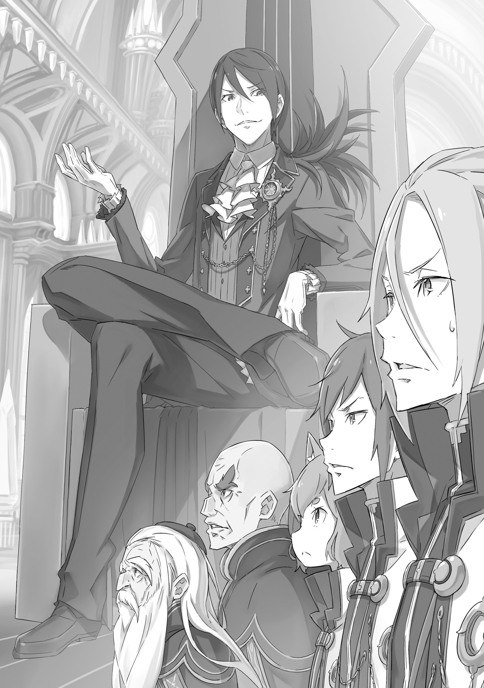
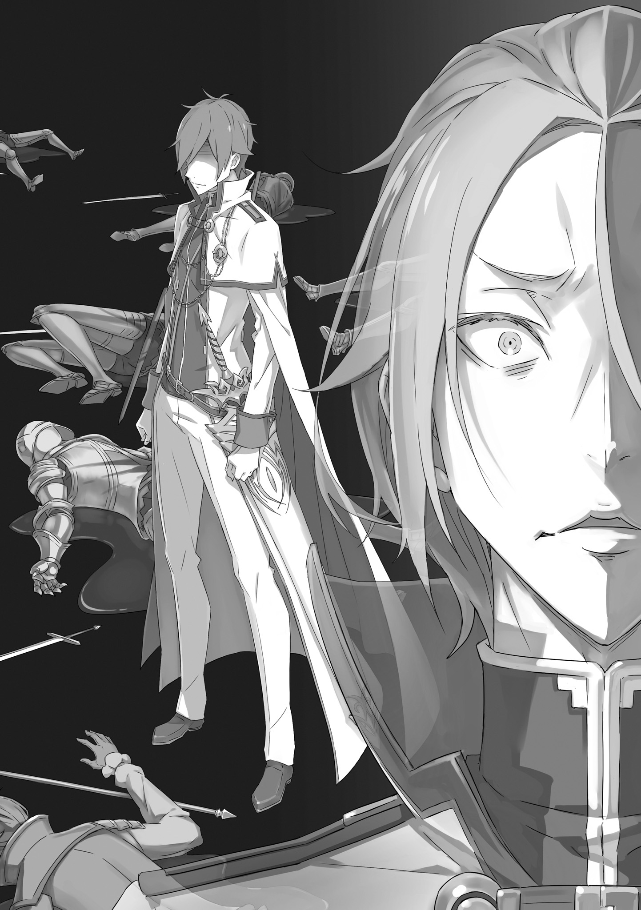
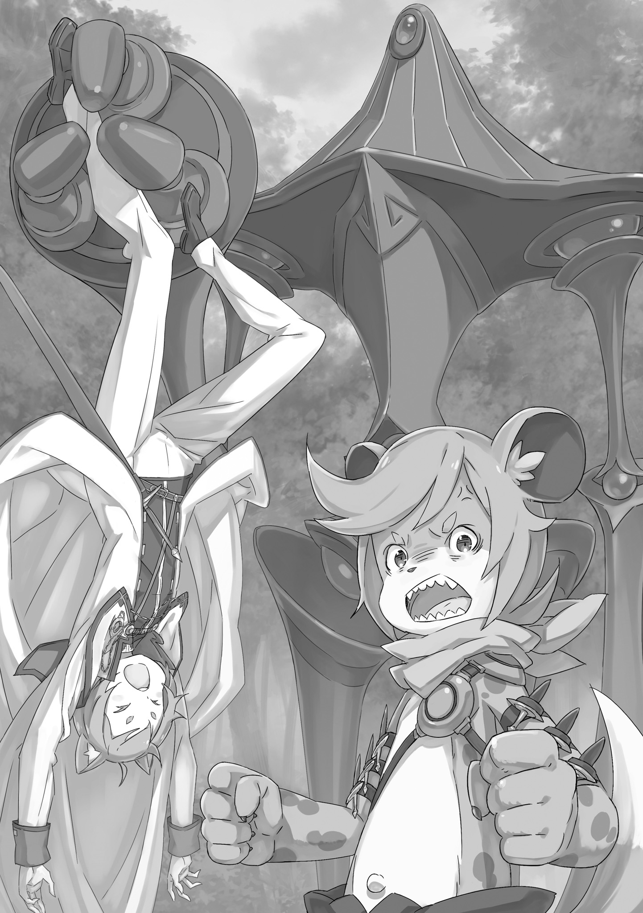
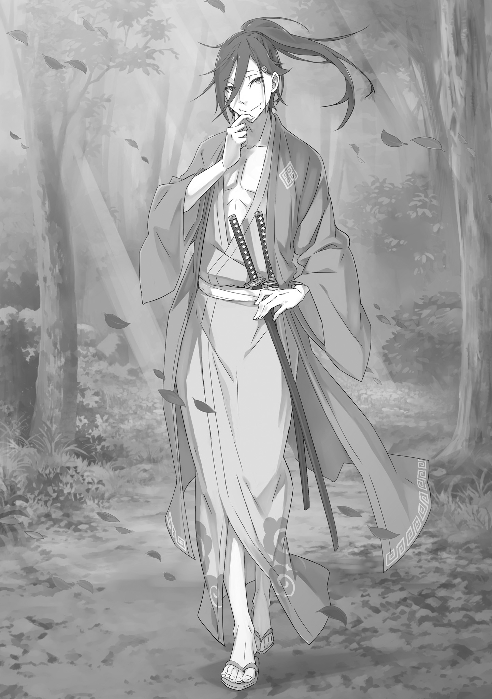
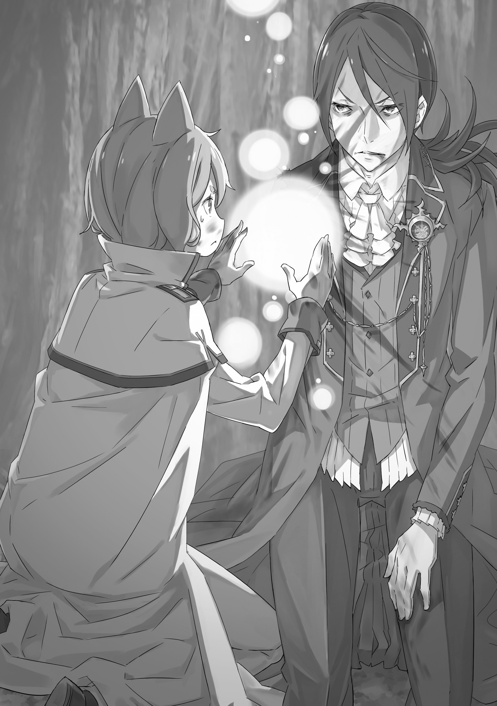
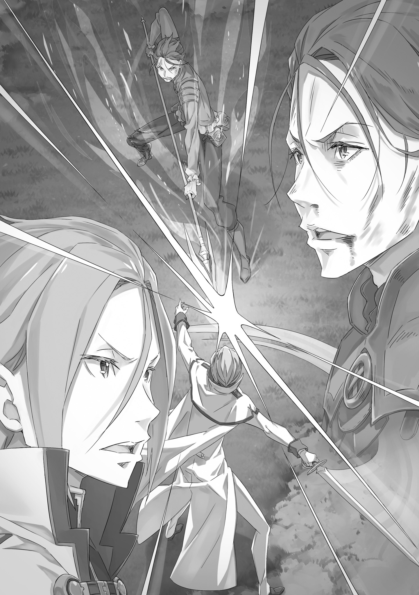
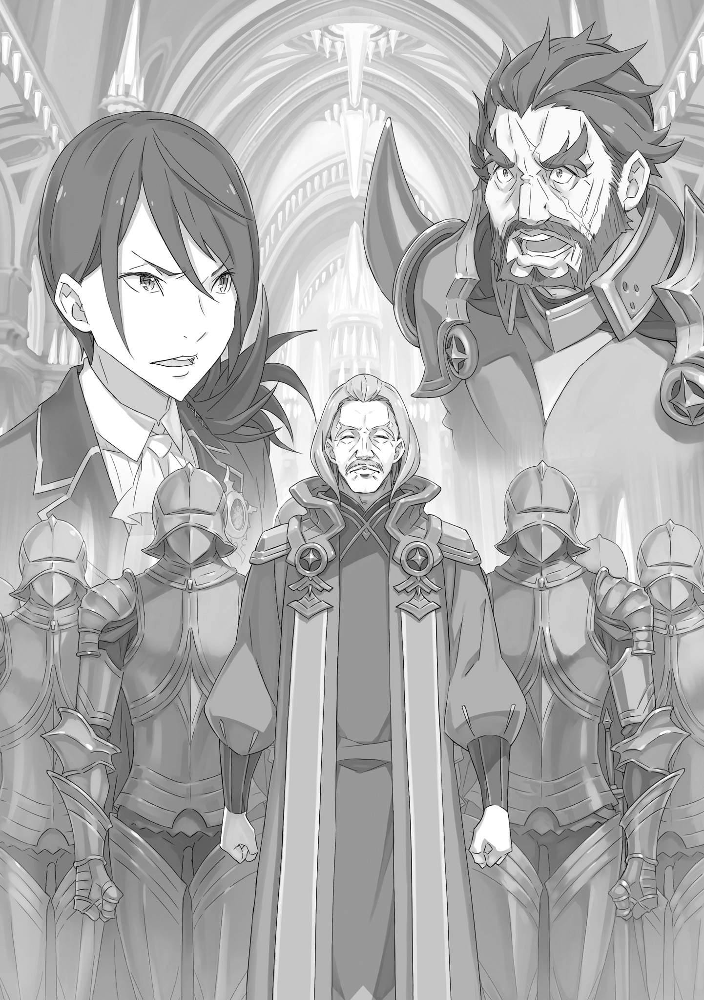

Приквел к Королевским Выборам: Имперская дипломатия кровопролития

『王選前日譚 流血の帝国外交』

— Есть только одна причина, по которой я вызвал вас сюда.

У человека, который сейчас говорил, было лицо, похожее на скалистый утес. Это был крупный мужчина с коротко постриженными зелеными волосами. Его мощные мускулы были облачены в броню. Шея и плечи мужчины были невероятно большими по сравнению с плечами обычного человека; это был тот-кто излучал боевой дух так, как мог только тренированный и дисциплинированный воин.

Он усадил свое огромное тело в тесное кресло, с которого обычно смотрел таким взглядом, что большинство людей упало бы на колени.

Мужчину звали Маркос Гилдарк. Он был рыцарем Королевства Лугуники и капитаном рыцарей королевской гвардии. Его называли самым сильным в стране, испытанным в бою, старым боевым псом. История этого человека и его умение владеть мечом заставили всех согласиться с тем, что он был вторым по силе бойцом в королевстве. Также его было очень сложно вывести из себя, но в этот момент…

— Капитан, пожалуйста, не надо быть таким жестоким. Может показаться, что Ферри ничего не делает, но он очень занят!

Было просто немыслимо, что кто-то осмелился так легкомысленно обратиться к Маркосу. Собеседник капитана непринужденно улыбнулся ему, ничуть не смущенный каменным взглядом.

— Феликс.

— Хм! Я хочу, чтобы Вы наконец-то начали называть меня Феррис. «Феликс» звучит мужеподобно.

— Так и должно быть, — сказал Маркос с твердым выражением. — Потому что ты мужчина, и это твое имя.

Разочарованный Феликс был существом с льняными волосами, а также кошачьими ушами того же цвета.

Феликс Аргайл, называвший себя Феррисом, был рыцарем королевской гвардии и вел себя как скромная дева. Таков был его истинный характер. В данный момент он занимался тем, что недовольно поджимал губы, глядя на Маркоса.

— Я больше не маленький ребенок-не делай вид, что можешь говорить мне все, что хочешь, даже если это правда. Ферри не понравится капитан, если он откажется слушать.

— Ты всегда много говорил. Возьми урок у тех двоих, рядом с тобой, и хоть раз держи язык за зубами.

— Ока-ай, — сказал Феррис без малейшего раскаяния в голосе. Он выпрямился и посмотрел по сторонам. Двое стояли по бокам от него, выдерживая испепеляющий взгляд Маркоса. Один из них выглядел подавленным, в то время как другой сохранял серьезное выражение лица.

— Вот это да, ребята, — пробормотал Феррис себе под нос, щелкнув языком.

Маркос уловил слова, но предпочел не отвечать. Вместо этого он сказал:

— Я счастлив, что у меня есть такие прекрасные подчиненные.

Это был хороший способ уйти от темы. Маркос выпрямился и вернулся к первоначальной теме разговора.

— Давайте перейдем к делу. Я отправляю вас троих в качестве телохранителей одной важной персоны. Ваша цель — Империя Волакия.

Прозвучал скептический вопрос.

— Мы сопровождаем ВИП-персону? В империю?

Говоривший был красив и светловолосый, он приподнял одну бровь. У него было красивое лицо, но на нем было выражено недоверие.

— Сэр, у меня сложилось впечатление, что мы не должны беспокоиться, вступая в контакт с империей.

— Я слышу, что ты говоришь, но это действительно выше нашей зарплаты, не так ли, Юлиус? Пусть начальство попотеет по мелочам. Есть еще вопросы?

Красивый молодой человек, Юлиус Юклиус, взглянул на рыцаря справа от себя и пробормотал:

— Я думаю, что все еще есть основания сомневаться в выборе команды.

Рыжеволосый молодой человек, стоявший рядом с ним, кивнул и вступил в разговор:

— Согласен. Работа телохранителя — это одно, но я озадачен тем, что меня ввязывают в политику. Обычно мне запрещено даже приближаться к границе.

— В договоре ничего конкретно не говорится о том, что Райнхарду ван Астрея запрещено что-либо делать. Более того, они хотели тебя видеть в составе телохранителей.

— Так ли это, сэр?

Молодой человек с рыжими волосами — Райнхард ван Астрея — с сомнением посмотрел. Юлиус и Феррис выглядели такими же озадаченными, как и он.

Маркос кивнул им троим, а затем с глубоким, серьезным вздохом добавил:

— Император Священной Империи Волакия желает видеть вас лично.

И на этом все закончилось.

— Райнхард, Феррис. Что вы думаете об этом?

Спросил Юлиус, когда они покинули комнату капитана.

Феликс удивлено посмотрел на Юлиуса.

— Это секретно же. Ты довольно опрометчиво поступаешь, говоря про это.

— Не волнуйся. Я знаю, что тут никого нет. Если тебе все еще не верится, спроси у Райнхарда.

— Хорошо, только не ждите от меня слишком многого… Да. Единственные люди вокруг находятся на первом этаже казармы или снаружи.

— Я могу рассчитывать на тебя, — сказал Феррис, подергивая ушами.

Феррис очень доверял Юлиусу и Райнхарду, прекрасно понимая, что на способности этих двоих можно положиться.

— В любом случае, эта миссия меня смущает, — продолжал он. — Королевство и империя ведут очень напряжённые отношения, и зачем им звать святого меча? Плохая шутка выходит.

История между Королевством Лугуника и Империей Волакия.

Волакия была довольно большим королевством, а назвать ее дружелюбной никак не поворачивался язык. Борьба между ними продолжалась более четырехсот лет. Из четырех наций, которые делили карту между собой, Лугуника и Волакия были с самой богатой военной историей. Они всегда воевали с друг другом, рисуя и перекраивая кровью границы на протяжении веков, и единственное, что, наконец, положило этому конец, был договор Лугуники с Драконом.

Королевство было на стороне Дракона, дабы запечатать Ведьму, после чего народ получил изобилие и процветание. Их благодетель защищал страну, сдерживая угрозу империи, что привело к прекращению военных действий.

— Стычки продолжаются и по нынешний день. Просто сейчас нет крупных сражений.

— Да, и я слышал, что во время Войны Полулюдей их долго держали в плену. А еще поговаривают, что империя вызвала буйство дракона Вальгрена, верно? — спросил Феррис.

— Ну, они никогда не признавали причастности к этому, но по королевству бродили странные подозрительные личности, которые, как некоторые поговаривают, вызвали дракона.

— В империи были укротители небесных драконов. Я бы не удивился, если бы они провернули такое.

Феррис выпрямился и нахмурился. Укротители небесных драконов были людьми, способными приручать существ, называемых небесными драконами, которыми обладала только империя. В отличие от наземных драконов, которые относились дружелюбно к людям, небесные драконы были злобными и гадкими, не питавшими никакой привязанности к человечеству. Если бы империя могла приручить таких монстров, возможно, они смогли бы приручить еще более могущественных драконов.

— Если слухи верны, вполне возможно, что огромная армия из них может напасть на Лугунику. И тогда только ты сможешь их победить, Райнхард.

— Если до этого дойдет, будьте уверены, я выложусь на полную — ответил Райнхард. Он слабо улыбнулся, а после его лицо приняло серьезный вид.

Юлиус наблюдал, как они подшучивают друг над другом, и в конце концов заметил:

— Они всегда были и будут враждебны к нам.

— Я не понимаю, почему Совет старейшин так легко согласился с просьбой империи, — сказал Юлиус. — Есть какие-нибудь мысли на этот счет?

Совет старейшин был авторитетным и значимым органом, который был у руля королевства и вел политику.

Естественно, рыцари королевства были не в том положении, чтобы отказываться от таких приказов. Но сомнения были неизбежны. Таким образом, Юлиус хотел узнать, о чем думает Райнхард, учитывая, что он был тем человеком, которому дали имя по приказу.

Райнхард подмигнул и сказал:

— Конечно, в этой миссии есть много раздражающих факторов. Но приказ есть приказ. Если моя помощь им нужна, я помогу. Но если они что-то задумали, то молчать я не стану.

— Да, что бы ни замышляла империя, они вряд ли посмеют напасть на тебя.

— Ваша позиция не слишком оптимистична, не так ли, Райнхард?

Юлиус и Феррис, стоявшие напротив рыжеволосого мужчины, переглянулись и пожали плечами. Молодой фехтовальщик обладал выдающимися способностями. Это был иной уровень силы, подобающий тому, кто унаследовал благословение и имя Святого меча. Это был никто иной, как Райнхард, чья доблесть и честь в бою была на высшем уровне. Ему были негоже человеческие страхи.

— Королевство ходит по очень тонкому льду, и они посылают Святого Меча вместе с главой Совета Старейшин в империю… Должно быть, они и вправду взяли за шею капитана, — задумчиво произнес Юлиус.

— Думаю, нам просто нужно убедиться, что все идет нормально, — сказал Феррис с иронической улыбкой.

Но что может пойти дальше не так и какие неприятности могут ожидать их в ближайшем будущем?

Осознавая всю важность предстоящей миссии, Юлиус начал молиться о защите будущего мира в королевстве.

Это было началом кризиса для Лугуники.

Все началось примерно четыре месяца назад, когда чума разорила королевский дворец. Зараза распространялась с бешеной скоростью, поражая каждого на своем пути. Таким образом, Королевство осталось без своего короля — более того, без наследника. По сей день трон оставался пустым.

Дипломатические отношения с империей были очень важны. Лугуника оказалась в невыгодном положении, поэтому действия Волакии могли повлиять на будущее королевства.

— Хм. Защита королевства должна находиться на первом месте, а уже после политические вопросы, — пробормотал старик, поглаживая свою длинную седую бороду. Промедление в ответе может показать нашу слабость перед империей.

Человек, говоривший сейчас, был одет в роскошные одеяния. Его взгляд был необычно мудрым: это был Миклотов МакМахон, один из самых мудрых людей в Лугунике. Он был председателем совета и по совместительству самой важной персоной в стране.

Юлиус, сидевший напротив Миклотова, покачал головой.

— Нет, сэр, я не согласен. Совет старейшин и все его члены сделали все возможное для этого королевства.

— И все же этого было недостаточно.

Гигант рядом с Миклотовым не дал Юлиусу утешить его. Его резкие слова адресованы ему самому, а не кому-то еще. И он, возможно, говорил правду. В конце концов, он тоже был членом совета.

Бордо Зелгеф когда-то был одним из немногих легендарных воинов королевства. Несмотря на преклонный возраст, он был бодр и активно вел политическую деятельность. Сидя рядом, Бордо и Миклотов походили на кого-то загадочного и мистического, недосягаемого, возвышающегося над королевством. Они оба были очень властны и от них шла аура власти, что доставляло Юлиусу дискомфорт. Это были как раз те ВИП-персоны, которых Юлиусу, Райнхарду и Феррису надо было сопроводить и охранять ценой собственных жизней. Они играли огромную дипломатическую роль в переговорах.

Вспомнив о важности задания, Юлиус выпрямился, как и подобало рыцарю. В конце концов, он ехал в одной карете с двумя членами совета старейшин и от этого нервничал. Карета была специально сделана для важных персон. Но назвать поездку комфортной было сложно.

Однако…

— Хммм? Юлиус, что случилось? Как себя чувствуешь?

— Юлиус является лучшим драконьим всадником. Не думаю, что стоит беспокоиться о нем.

Спутники Юлиуса сидели по обе стороны от него, болтая так, словно ничего не произошло.

Эти три рыцаря сидели напротив двух членов Совета. Сложно сказать, что было на уме Ферриса и Райнхарда, но их поведение не было похоже на игру. У каждого из них был более богатый опыт в общении со значимыми людьми, чем у Юлиуса.

Феррис был рыцарем на службе у герцогини Круш Карстен.

— И что ты лыбу давишь Юлиус, что случилось? — Спросил Феррис.

— Все хорошо, — Юлиус пожал плечами. — Но меня не покидает чувство постоянного беспокойства.

— Вот это новость. Это значит, ты можешь беспокоиться, — беспечно сказал Феррис.

— Хм — буркнул Бордо, скрестив руки на груди.

— Беспокоиться… Слабо сказано. Рыцари уже не те, что раньше. — Его взгляд остановился на сабле Юлиуса.

— Тонкое оружие у тебя. Вы думаете, этого достаточно, чтобы защитить нас? Позвольте мне прояснить одну вещь: то, что станет со мной, не имеет большого значения, но, если что-нибудь случится с мастером Миклотовым, вы ответите за это головой.

— …

— У тебя хоть духу хватит постоять за себя? Было время, когда я за такое поведение убивал.

Юлиус спокойно продолжал слушать брань Бордо. Его не пугало положение людей напротив. Скорее, в этих словах была определенная истина. Было ошибкой высказывать свои опасения в присутствии тех людей, которых он должен был защищать, заставляя их нервничать.

— Рыцарь королевской гвардии говорит не словами, а поступками. Этому нас научил капитан Маркос.

Ответил не Юлиус, который молчал, а Райнхард.

— Маркос, а? …Щенок действительно смог пробить себе дорогу в этом мире.

— Хо-хо-хо! Нам стоит завершить этот разговор, мастер Бордо. — Миклотов нахмурился и рассмеялся. Затем его морщинистое лицо приняло задумчивое выражение, и он провел рукой по бороде.

— Мы попросили самого капитана Маркоса выбрать рыцарей для этой миссии.

— Вы оказываете нам честь, — скромно сказал Юлиус, кланяясь. Райнхард и Феррис точно так же поклонились.

«Ферри считает себя очень идеалистичным», — пробубнил Феррис себе под нос.

— Это одно из лучших качеств Юлиуса, — ответил Райнхард.

Он бросил взгляд на кошко-мальчика. — Это то, чему я хотел бы у него научиться.

Юлиус был известен под прозвищем «Безупречный Рыцарь», прозвище, которое отражало, насколько высоко ценились его навыки. Однако он был очень скромен, чтобы признать такой титул.

— Мм, теперь вы можете увидеть Хрустальный Дворец. — Миклотов с улыбкой ответил на поклоны молодых рыцарей и выглянул в окно. Они проследовали за его взглядом и увидели огромное здание, возвышающееся в небо.

Хрустальный дворец был императорским замком Волакии, находившемся в столице империи Рапгане. Дворец был построен полностью из магических камней. Это было грандиозное здание, выражавшее всю мощь империи.

Юлиус восхищенно выдохнул, впервые увидев это здание, столь же величественное, как и слухи о нем.

— Святые угодники! — Воскликнул Феррис.

— Я слышал разные истории, но этот замок построен в довольно вычурном стиле…

Юлиус резко вздохнул. — Феррис, я не верю твоей реакции. Каждый миллиметр этого замка был построен с особой тщательностью, ты же видишь это?

— Ферри просто ненавидит твои странные навязчивые идеи, Юлиус. — Феррис прижал уши, показывая, что разговор его больше не интересует. Юлиус подмигнул ему, вызвав у Миклотова сердечное “хо-хо-хо”.

— Может быть, он и выглядит очень запутанно, но является очень функциональным. — Сказал старейшина.

— В империи живут несколько очень опытных архитекторов. Хрустальный дворец не только красив, но и обеспечивает оборону высокого уровня.

— Я слышал, что в нужный момент камень из Хрустального дворца может усилить магию в тысячи раз… Это правда? — Спросил человек с пурпурными волосами.

— Я и не знаю этого. Если у нас будет такая возможность, может быть, мы спросим Его Превосходительство лично?

Беспечное замечание Миклотова заставило Юлиуса раскаяться в своем ребячестве. Любопытство взяло верх над ним. Это не прибавит Бордо уверенности в нем.

— Я думаю, что это правда, у них должны быть скульпторы, знающие толк в волшебных камнях. Понимаешь? — Феррис, забыв про волнение Юлиуса, бросил острый взгляд на Райнхарда, тот улыбнулся и расстегнул воротник мундира.

На его бледной коже игралось с лучами солнца металлическое ожерелье. Оно было сделано с добавлением могущественного кристалла, который слабо излучал свет.

— Колье, — заметил Феррис. — Оно из империи?

— Я не знаю, есть ли такое в империи, — сказал Райнхард, касаясь рукой ожерелья. Одно можно было сказать наверняка: он надел его не по своей воле. Райнхард был вынужден носить эту побрякушку в путешествии.

— Ожерелье подчинения, верно? Это действительно действует на тебя, Райнхард?

— Это заставляет чувствовать меня сонливо. Я не могу точно сказать, насколько ограничена моя сила, но оно точно работает, поскольку я не могу использовать способности во всю силу.

Это заставило Юлиуса понять, как сильно Империя нервничает из-за Райнхарда. Ожерелье подчинения, которое Райнхард был вынужден носить, было не столько предметом, ограничивающим способности владельца, сколько ограничивающим его свободу. Это практически граничило с рабством. Откровенно говоря, требовать, чтобы кто-то, приглашенный в качестве специального посланника, носил такую вещь, считалось совершенно бестактным и вопиющим.

— Я понимаю, если я надену это ожерелье, то это может повлиять на переговоры между странами.

— …Мне действительно тошно, из-за того, что ты так ограничиваешь свою свободу, — сказал Юлиус. — Но я восхищен твоей решительностью.

— Ведите себя, как вам угодно, — вмешался Феррис. — Но это все еще ошейник. Он резко пожал плечами. После на одном дыхании продолжил: — Но представьте, что, если это заговор, тут находятся два члена Совета Старейшин и Святой Меча, не так ли? Вдруг они хотят убить Райнхарда или что-то в этом роде?

— Но это, несомненно, означало бы войну, и Дракон не стал бы сидеть сложа руки… Я хотел бы в это верить, но меня мучают сомнения.

— Да. Мы не можем рассчитывать на Божественного Дракона. Мы можем полагаться только на свою силу! Так что слушай, Райнхард: убедись, что ты уничтожишь всю империю, прежде чем они доберутся до тебя. Совсем один.

— Защита — это девиз рыцаря, Феррис. Если они нападут первыми, это одно дело, но первый напасть я не могу из-за сомнений. — Райнхард слабо улыбнулся.

— Знаешь, я очень рад, что ты не сказал, что не можешь их уничтожить… — Феррис обнял его за узкие плечи и вздрогнул. Юлиус прислушивался к разговору и готовился к очередной порке от Бордо.

— Рыцари Королевской гвардии должны…

Но старика перебил хихикающий Миклотов: — Мм, ты собираешься сделать им выговор? Я помню твое поведение, когда ты сам был лишь юным рыцарем.

Бордо сделал кислую мину и замолчал. Он повернулся к окну, и приближающийся Хрустальный дворец отразился в его глазах. «Святой Меча», «Безупречный» и «Синий»… Правда, это напомнило мне обо всех неприятностях, которые у нас были тогда".

Но никто не слышал, что он бормотал про себя; его слова были сметены быстро проходящим пейзажем.

Империя Волакия была большим государством, расположенным на юге. Она имела плодородные земли и хороший климат. Температура почти не менялась в течение года и не вызывала дискомфорта. Это была гарантия населению, что голод обойдет их стороной.

Империя Волакия воспитывала у своего народа силу духа, и это учение глубоко отражалось в управлении страной и ее политике.

Сильные стояли выше, чем слабые. Сам император не был исключением.

Действительно, так называемый обряд Императорского отбора, по которому избирался правитель Волакии, был апогеем этой философии. Волакийские императоры брали много жен со всей страны, чтобы те рожали детей. Эти имперские отпрыски были затем натравлены друг на друга в кровавой борьбе за трон, причем последний оставшийся в живых становился императором.

Уничтожь своих братьев, убей своих сестер и стань правителем. Это казалось диким, но именно так императорская семья подавала пример, и именно эта непреклонная доктрина давала императорам железную власть над народом.

Таков был путь этой земли, и таков был дух, необходимый для установления сильной империи…

«Подними голову. Я даю разрешение.» — Этот голос пробирал любого человека до души и вызывал дрожь.

Но это не была обычная дрожь, которую можно было почувствовать при радости или удовольствии. Юлиус чувствовал тоже, что и при встрече со Старейшинами. Но на совершенно другом уровне.

Ничего не говоря, Юлиус медленно поднялся с колена. Перед ним стояли двое старейшин, а рядом с ним — двое его товарищей-рыцарей, тоже поднявших головы. Юлиус окинул их быстрым взглядом, затем снова посмотрел на возвышение перед собой. На троне, расположенном в дальнем конце красной ковровой дорожки, восседал человек, излучавший несравненное величие. Юлиусу перехватило дыхание.

Человек на троне был красив и молод, у него были черные волосы и миндалевидные глаза. Вероятно, ему было лет двадцать пять, он был одет в красно-черное одеяние. Казалось, что он собирался избежать показухи, учитывая явное отсутствие украшений и аксессуаров. Несмотря на это, его элегантная фигура поражала воображение.

В этом мире было много людей, которые могли подчинить себе окружающих. Многие из них достигли больших успехов, получили важные должности, соответствующие их огромным ресурсам и острому уму, но юноша перед глазами Юлиуса был редкой драгоценностью даже среди драгоценных камней, существом, отполированным до совершенства…

Таков был семьдесят седьмой император Волакии — Винсент Волакия. Юлиус и другие дипломаты от королевства были сопровождены в приемный зал Хрустального дворца Рапганы, где они склонили колени перед императором и поклонились, как того требовал этикет для императорской аудиенции.

Трон, как и сам дворец, был сделан из магического камня высочайшего качества. За ним величественно реяло знамя с государственным гербом Волакии: волк, пронзенный тремя мечами. Солдаты в доспехах выстроились по обе стороны, в зале сохранялась абсолютная тишина. Каждый из них излучал гордость и боевой дух. Из-за этого Юлиус нервничал и был насторожен, стараясь вести себя как можно аккуратнее.

Но император не обращал внимания на Юлиуса и смотрел сквозь него.

— Миклотов, ты так постарел с тех пор, как я видел тебя в последний раз. — Выражение его лица не изменилось, когда он произнес колкое замечание вместо приветствия.

— Хм, — сказал Миклотов со вздохом. — А вы только лучше стали. Теперь мне совершенно ясно, как я сильно постарел… Даже волосы цвет потеряли…

— Никогда не видел и намека на цвет твоей шевелюры.

— Ты же знаешь, что делает возраст с человеком. Я вот подумываю уйти на покой. — Миклотов погладил свою белую бороду, мягко отклоняя замечание императора.

— Ха. — Винсент усмехнулся, зная, что Миклотов не собирается этого делать. — Если вы откажетесь от вашего поста, это, несомненно, будет тяжелым ударом для Лугуники. Хотя нас такое в Империи устроит. Давайте прекратим прощупывать друг друга. Преподнеси мне свое сердце, Миклотов.

— Довольно грозный приказ от Вашего Превосходительства.

— Плохая игра слов пользы не принесёт. Будьте бдительны, иначе можете запятнать свою репутацию.

Разговор был шутливый, фамильярный, но в нем чувствовалось напряжение, как будто два великих фехтовальщика сошлись в поединке, когда Миклотов прощупывал почву легкой шуткой, а Винсент отвечал резким выпадом. От этого разговора атмосфера в комнате замирала. Но в этот момент очевидного тупика другой старейшина взял на себя смелость вступить в бой-и начать его с козырей.

— Этот принц еще более беспечен, чем я слышал. Я ожидал от императора более утончённого и высокомерного поведения.

Он решил критиковать императора, прямо в лицо.

Говоривший был Бордо, стоявший на колене рядом с Миклотовым. Его замечание и в самом деле вызвало провокацию, а затем волну возмущения в зале для аудиенций. Вряд ли стоило даже ожидать, что имперские солдаты проигнорируют такой выпад. Они вскочили со своих мест и приставили мечи к шее.

Это была очень дерзкая выходка, и если он ошибся в своих словах, то будет кровавая бойня…

— А что такое? Я полагал, что вы более смелые и атакуете меня, не задумываясь— никогда не думал, что вы такие добрые. — Бордо огляделся по сторонам, после фыркнул и встал. Люди, окружившие его, имели мощное телосложение. И все же Бордо возвышался над ними. Имперский рыцарь, стоявший ближе всех к старику, внезапно понял, что его цель смотрит на него сверху вниз, и слегка задрожал от силы, которую излучал Бордо; кончик его меча задрожал. Через мгновение перепуганный солдат успокоился и его меч стабилизировался.

— Достаточно. Вспомните, где вы находитесь.

Всего лишь за несколько секунд до кровавой бойни, вмешался император. Боевой пыл солдат мгновенно испарился, и после секундного колебания они вложили мечи в ножны. Если бы император подождал еще несколько секунд, началась бы жестокая битва.

Однако это его не беспокоило.

— Очень любезно с вашей стороны, Ваше Превосходительство. Ваши предсказатели сказали вам быть любезным с нами?

— Наши предсказатели очень мудры, но мы не будем танцевать под их дудку. И советоваться с ними о твоей судьбе.

— О-хо?

— Кто может быть настолько глуп, чтобы потерять самообладание из-за тявканья шавки? Или, может быть, это связано не столько с недостатком подготовки, сколько с недостатком интеллекта? Если так, то тем больше причин его жалеть.

— Как ты смеешь!.. — Бордо пришел в ярость, когда его насмешку парировали. Он явно рвался в бой, и имперские солдаты в комнате снова оживились.

Нельзя допустить, чтобы ситуация переросла в физическое насилие.

— Этот разговор только что был из «Гильотины Магрицы». Разговор между высокоразвитым старейшиной и отцом-королем…

— Что? — Спросил Бордо, сбитый с толку неожиданным шепотом, который опередил его гнев.

Винсент, однако, ответил: «Хм». Теперь на Юлиуса легла тяжесть взгляда императора. — Похоже, среди этой своры необразованных дворняг есть несколько довольно воспитанных и сдержанных людей.

— Примите мои глубочайшие извинения, Ваше Превосходительство. С моей стороны было очень глупо вмешиваться в разговор императора.

— Прощен. Мы милосердны ко всем, кроме самых презренных. Даже к собакам… и псам… среди вас.

— Мастер Миклотов, — сказал Бордо, бросив кислый взгляд не только на Винсента, но и на Миклотова, — я зря переживал.

— Ммм. Это утомительно для тебя, я понимаю… Но не напрягайся сильно. Мы не можем себя вести так, как вели себя раньше.

— Я все еще могу раздавить эту глисту одной рукой.

Кровь Бордо закипела, и Миклотов мог только улыбнуться. Затем Бордо демонстративно перестал улыбаться, сложил ладонь в кулак перед грудью и поклонился Винсенту. — Я унизил Ваше Превосходительство. Я прошу прощения за свое скудоумие.

— Тогда я забираю свои слова назад о твоем сходстве с шавкой, советник «Бешеный Пес». — Так называемого Бешеного Пса, похоже, совсем не позабавило это имя. Его раздражение, без сомнения, было огромным.

Внезапно к нему обратились с этим старым прозвищем и тем фактом, что его истинная личность была раскрыта. И, возможно, обида на самого себя за то, что он раньше не понял, что император игрался с ним.

Тем не менее…

— Ну что ж, теперь, когда все эти недоразумения улажены, давайте поднимем вопрос, по которому вы оказались тут.

В только что закончившейся битве умов «Бордо» оказался хуже всех, но только его выходка разрядила обстановку. Миклотов аккуратно шагнул в проем, перехватывая инициативу в разговоре. Винсент подмигнул старику, великодушно опустив голову.

— Мы благодарны Вам, Ваше Превосходительство. Мы прибыли в надежде заключить пакт о ненападении между нашим королевством и вашей империей.

Раздался какой-то беззвучный вздох, когда он раскрыл свои истинные намерения. Впечатление, произведенное Миклотовым, совершенно изменилось. Аура доброты, которую он излучал, исчезла, а взгляд стал холодным. Даже Юлиус и остальные, знавшие, что сейчас произойдет, инстинктивно затаили дыхание при внезапной перемене ауры старейшины. Его прямота была шокирующей.

Лишь несколько человек в зале не проявили особой реакции на это предложение: сам Миклотов, Бордо, стоявший рядом с ним— и сидевший напротив них император, Винсент.

Император молчал, глядя на мудреца, который смотрел на него снизу вверх. Темные глаза правителя обладали такой силой, что казалось, одним взглядом он мог спалить все, что пожелает. Но старец выдержал этот взгляд не затмив его.

— Все члены королевской семьи были поражены болезнью, — объявил император. — Это пошатнуло королевство.

— Кто может сказать наверняка?

— Не пытайся это скрыть, слух уже распространился.

Про смерть короля и смерть королевской династии публично не говорилось. Однако всех молчать не заставишь. Слухи о слабом здоровье короля давно разошлись по всей округе и оставался вопрос времени, когда все узнают, что правитель умер от болезни. Было невозможно, чтобы Волакийская империя, шпионящая за королевством этого не знала.

— Это не похоже на тебя, того, кого все называют мудрецом. Застигнут врасплох и на шаг позади. Как только станет известно, что ваша королевская семья находится в тяжелом положении, ценность дипломатических миссий вашей страны резко упадет. Действительно, они почти ничего не стоят.

— Скажи мне, когда королевская родословная будет уничтожена, что станет с контрактом со Святым драконом? Без поддержки дракона королевская семья будет не более чем влюбленными дураками.

В словах императора не было злобы. Он просто изложил реальность правящей семьи Лугуники. По крайней мере, кое-что из того, что он сказал, было фактом и всеобще признанным мнением. Королевская семья Лугуники была слишком добросердечна, чтобы ставить себя выше народа. Но отдачи от доброты не было и все хотели более проницательного правителя. И все же именно эта элементарная порядочность дала им уважение простых людей.

Сам Юлиус прекрасно знал об этих фактах. Ведь раньше он охранял принца королевской семьи.

— Эй ты, кошка-девочка. Если тебе есть что сказать, говорите это ртом, а не глазами.

Юлиус не мог говорить; его страхи оправдались, когда взгляд императора упал на коленопреклоненного Ферриса. Обычно мальчик был таким добродушным, но сейчас его взгляд, направленный на Винсента, был полон эмоций. Слова Винсента явно разозлили его. Воспоминания об ушедших королевских особах были очень тяжелы для Феликса.

Все еще стоя на колене, Феррис сказал:

— При всем моем уважении, будь они живы или мертвы, я не позволю клеветать на королевскую семью, даже если это слово императора.

Тщательно подобранные слова удерживали его в рамках приличия, но кипевший гнев выдавал себя. Винсент видел его гнев.

— Думайте, что хотите, Ваше Превосходительство. Но каждый член королевской семьи был честным человеком и достойным. Я сам служил принцу и отдал бы за него жизнь…

Винсент спокойно прервал Ферриса, барабаня пальцами по подлокотнику трона. — Храбрость, верность, преданность… Никто так не дорожит этими достоинствами, как те, у кого нет других очевидных талантов. Они говорят, что преданность может вдохновить человека на то, чтобы отдать свою собственную жизнь. Однако… — Он перевел взгляд своих темных глаз на шеренгу имперских солдат. И затем…

— Ты, вон тот лакей. — Да, ты.

— Сэр!

Император указал на одного из солдат, который ранее обнажил свой меч Бордо. Мужчина шагнул вперед и низко поклонился.

Прежде чем он поднялся, император сказал:

— Возьми свой меч и отруби себе голову.

— Чтооо?! — Феррис издал возглас крайнего удивления. Но Винсент проигнорировал его, снова постучав по подлокотнику.

— Я повторюсь. Возьми свой меч и отруби себе голову. Неужели ты не можешь этого сделать?

— С-сэр! — Горло человека задрожало от безумного приказа императора. Не прошло и секунды, как он опустился на колени и снял шлем. На вид это был крепкий парень лет двадцати с небольшим. Стиснув зубы, он вытащил меч из ножен и приставил его к своей шее. Его мышцы напряглись—

— Я не собираюсь стоять и смотреть на это.

За мгновение до того, как голова молодого человека покатилась по красной дорожке, кто-то остановил его. Это был Райнхард, который двигался со скоростью молнии. Он только что стоял на колене, а потом пролетел несколько футов в мгновение ока, перехватывая меч воина. Видел ли кто-нибудь это быстрое движение?

Увидев впечатляющее зрелище Святого Меча, Винсент перестал барабанить пальцами.

— Хм. До нас доходили слухи, но… Хм, ну, слухам не всегда можно доверять. Мы очень недооценили вас.

— Простите меня за то, что тороплюсь… И за то, что не оправдал ваших ожиданий.

— Совсем наоборот. Вы превзошли все возможные ожидания.

Райнхард поклонился, затем отпустил меч, которым рыцарь хотел убить себя. Солдат с облегчением опустился на колени, а Райнхард вернулся на свое место перед троном, кивнув Феррису. Ошеломленный столь быстрым развитием событий, Феррис наконец пришел в себя. Винсент подпер подбородок рукой, наблюдая за происходящим.

— Не стоит выставлять свою преданность на всеобщее обозрение.

Послушание — это привилегия правителя, который твердо и уверенно контролирует ситуацию. Тот, кто цепляется за верность, глуп.

— !!!!!!!!!!!!!!!!! — Феррис едва мог говорить.

— А ты, солдат, можешь отойти. На сегодня с нас довольно. Я против мучения полукровок.

Наследие Ферриса было более чем ясно из его кошачьих ушей и тела. Он почувствовал себя униженным, но был слишком умен, чтобы спорить с Винсентом дальше. Он поклонился, хотя ему очень хотелось сделать что-нибудь еще, и снова опустился на колено. Такова была гордость Ферриса, целителя, способного спасти жизнь. Похоже, император понял даже это в ходе одного-единственного обмена репликами.

— Какая забавная компания, — сказал Винсент. — Мне сказали, что меня посетит группа послов из королевства, но, возможно, они прислали нам клоунов по ошибке?

— Если Ваше Превосходительство так хочет, то мы можем вас развлечь.

— Как бы великодушно не было мое сердце, я не из тех, кто наслаждается зрелищем анархии.

— Ваша просьба была услышана. Решение будет вынесено позднее. — Император Винсент взмахом руки приказал Миклотову и остальным покинуть аудиенц-зал.

Все это были отвлекающие маневры и обходные пути; они почти не говорили на эту важную тему. Так, по крайней мере, чувствовал себя Юлиус, но Миклотов послушно кивнул и еще раз низко поклонился.

— Мы ценим, то, что вы уделяете нам так много своего драгоценного времени, и будем ждать вашего решения с нетерпением. — Он давно привык к высокомерию императора и готов был вежливо удалиться. Остальные были разочарованы, но последовали примеру. Они уже собирались последовать за солдатом, который вывел их из зала для аудиенций, когда…

— О да, совершенно верно. — Одна фраза Винсента остановила всех. Юлиус и все остальные остановились перед дверью зала аудиенций. Затем все пятеро повернулись, и голос продолжил: — Мы (императоры) не повторяем два раза, верно? — Император выглядел скучающим на своем троне.

Последовал неприятный звук.

— Хргхх… гхх…

Сабля была в крови, когда сталь погрузилась в землю.

Молодой человек с мечом в руке застонал, кашляя кровью, затем рухнул там, где стоял. Акт был исполнен с жестокой учтивостью. Сначала он отошел от своего поста, чтобы не запачкать красный ковер. Рана оказалась смертельной.

— Чт… почему?!

Казалось, молодому человеку удалось спастись, сохранив свою жизнь, но теперь он решил ее выбросить. Феррис сглотнул, полностью осознав, что только что произошло, и попытался броситься к упавшему мальчику. Но другие имперские рыцари выхватили мечи и преградили ему путь.

— Что?..

— Вот что значит иметь власть в Волакии. Вам лучше не забывать об этом. — После этого Винсент развернулся. Жестокие слова императора были направлены в спину подавленного Ферриса. Происходящие заставляло сердце сжиматься сильнее, и Юлиус чувствовал тоже самое.

Философия Волакии и Лугуники никогда не сойдется во взглядах.

Пропасть, разделявшая их народы, стала колоссальной, отражаясь в медленно растекающейся по полу крови.

— …Я мог бы спасти его! Я мог… спасти…

Покинув зал аудиенций, они проходили по коридорам дворца.

Феррис выглядел подавленным и шептал себе под нос:

— Если бы они меня не остановили, я мог бы спасти его… В этой смерти нет никакого смысла.

Его худые плечи дрожали, а ушки были прижаты к голове, голос был хриплым от разочарования. Он стыдился самого себя, и Юлиус понимал, что не может поддержать его. Феррис был целителем и не мог с этим смириться. Любая попытка Юлиуса утешить его, была бы бестактной. Он все еще пытался подобрать нужные слова в голове, когда…

— Я уверен, что это было в новинку для вас и довольно неожиданно.

Он удивился словам проводника.

Некоторое время Юлиус молчал, обдумывая слова Имперского солдата. С тех пор как они пересекли границу, им пришлось видеть множество солдат и рыцарей империи, и никто прежде не был похож на проводника. Возможно, все дело было в их воинственном характере, который исходил от большинства солдат империи, но он, как ни странно, не исходил от человека, стоявшего перед ними.

Эта разница в характере, по-видимому, отражалась и на уникальной внешности этого человека. Волакийские войска всегда были с ног до головы одеты в железные и стальные доспехи, показывая свою мощь и крепкость. А у проводника было открыто лицо. Он был высок, его серо-каштановые волосы были зачесаны назад. Его опущенные глаза и нежная улыбка излучали доброту, но то, как он вел себя, показывало, что он не прост, и с ним нужно быть осторожным.

Хоть его снаряжение и отличалось от других рыцарей, но точно было понятно, что с ним шутить не стоит. Также было понятно и то, что ему разрешено носить другое снаряжение из-за его высокой должности.

Юлиус внимательно изучил его взглядом и ответил:

— Да, мы были крайне удивлены этому. Я надеюсь, в Империи такое приветствие не является нормой?

— Приветствие? Не совсем, но и ты не так уж далек от истины… Может быть, для вас это было захватывающее зрелище?

— Дело не в том, насколько это было захватывающе… — Пробормотал Феррис, влезая в разговор. Юлиус решил пропустить его замечание мимо ушей, продолжив разговор с проводником. Спокойный, почти беззаботный ответ дал ему некоторое представление о сущности этого человек.

— Вы генерал? — Спросил Юлиус.

— О, а вы довольно хорошо осведомлены. Да, после рядового идет рядовой первого класса. После этого идет звания генерала третьего класса, затем генерала второго класса и, наконец, генерала первого класса. При достижении звания генерала можно не носить доспехи.

— Мне рассказывали, что генералы первого класса имеют колоссальный опыт, и их всего девять. Девять, так называемых Божественных Генералов.

«Граждане империи, будьте сильны.» — Это было единственное и самое важное учение в Волакии. Из-за этого родословная не играла никакую роль, то есть каждого судили на основе его индивидуальной силы. Все руководящие посты занимали только способные люди, Волакийская Империя превыше всего ценила могущество и власть.

Эти девять Божественных Генералов имели ранг, примерно равный капитанам рыцарских орденов в Лугунике. И если Юлиус не ошибался, то человек, стоявший перед ними, был одним из них…

— Похоже, притворяться больше не имеет смысла, так что признаюсь, я один из этих девяти. Балрой Темегриф, приятно с вами познакомиться.

— …Значит, наш надзиратель идет прямиком от девяти генералов. А вы умеете быть гостеприимны. Когда Бордо услышал, что один из самых сильных бойцов в Волакии был их личным гидом, глубокие морщины выступили на его лбу.

Балрой невозмутимо похлопал себя по лбу и ответил:

— Боже милостивый. Это только показывает, как высоко император ценит вас.

Феррис, наконец, не в силах больше терпеть, вмешался:

— У вас, людей, есть чувство того, что значит ценить кого-то? От унижения опустошенной чумой королевской семьи Лугуники до бессмысленного самоубийства, все, что произошло в зале, казалось, было для того, чтобы ущемить полулюдей?

Неудивительно, что он не мог принять это как проявление уважения со стороны империи.

Как уже говорилось ранее… Балрой, почувствовав напряжение в воздухе, подмигнул и хрустнул костями шеи.

— Может быть, это и увлекательно для посетителей, но для нас это обычная работа.

— Обычная работа? Ты что, сдурел?

— Думаю, что эта реакция вполне естественна. — Юлиус попытался сдержать слишком прямолинейный ответ Ферриса. Балрой снова был невозмутим. Он указал на Волакийский герб, украшавший его легкую броню.

— Взгляд пронзенного волка говорит, что он ещё не умер. Вот как обстоят дела в Волакии. Бейся до последнего вздоха и не проси пощады.

— А какое отношение это имеет к тому, что происходило в зале?

— Все очень просто. Тот солдат, который покончил с собой, никогда не покинул бы ту комнату живым. Он замахнулся своим мечом на советника Зелгефа, но было видно, что он боялся этого. В этот момент он и умер.

Юлиус и все остальные онемели, услышав, как Балрой так беспечно и безнравственно говорил о жизни и смерти. Не обращая внимания на реакцию окружающих, генерал быстрым шагом направился вперед.

— Он показал трусость и слабость, и это означало, что смысла в его жизни больше нет, соответственно мы не могли больше рассчитывать на него. Если бы он не смог покончить с собой, тогда остальные помогли бы ему это сделать. Тогда возникает вопрос: «Что случилось бы с его семьей, если бы он не подчинился приказу императора?» Трусость — это болезнь, для распространения которой нужен лишь маленький огонек, один трусливый человек — маленькая искра, поэтому болезнь нужно истреблять под корень.

— Они же не станут всерьез использовать его семью в качестве рычага давления?

— Трусость распространяется, как лесной пожар. Народу империи не нужны солдаты, которые боятся своей же тени. Впрочем, я не могу просить, чтобы вы поняли наши действия. Вы можете нам не верить или не понимать, но это так.

— Тогда тебе повезло. Потому что я абсолютно не верю вам, — твердо ответил Феррис. Его отвращение к империи становилось все больше, как снежный ком, спущенный с горы.

— Великолепно, — ответил Балрой, а после громко рассмеялся. — Упс, вот мы и в ваших покоях.

Их диалог продолжался довольно долго, поэтому они быстро добрались до своих комнат, и время генерала в качестве их проводника подошло к концу.

Покои в Хрустальном Дворце, как и все остальное здание, казалось, было последним словом элегантности. От мебели до ламп — все, что украшало комнату, было самого высокого качества. Юлиус восхищался помещениями, которые, по-видимому, были спроектированы людьми, не знакомыми со словом «простота».

— Представляешь, — сказал Балрой, все еще стоя в дверях. — Наконец-то я познакомился со знаменитым Святым Меча, а он почти не говорит ни слова.

— …Мои извинения. Я просто хотел свести к минимуму вероятность задеть и обидеть вас.

— К чему такая скромность…

— Когда я что-то делаю, мне часто кажется, что это напрасно заставляет людей волноваться. — По этой причине Райнхард хранил молчание, пока Балрой не сделал ему это неожиданное замечание.

Балрой слегка расширил глаза, услышав ответ Райнхарда, но вскоре уже хихикал где-то глубоко в горле.

— Генерал Балрой?..

— О небеса, простите меня. Я называю это скромностью, но думаю, что возьму свои слова обратно. Вы понимаете свою собственную силу, я вижу это.

— Ты слишком доверяешь мне. И этот титул «Святого Меча» мне не слишком по душе.

— Ты так говоришь, но не отрицаешь, что ты самый сильный. — Балрой щелкнул пальцами. — Так ведь?

Рыжеволосый мужчина слабо улыбнулся, но ничего не ответил. Его молчание было достаточным подтверждением.

Естественно, Райнхард ван Астрея был самым сильным человеком в мире. Он полностью осознавал свою силу, но не считал себя идеалом. Он все еще не был доволен собой. Именно это мешало ему признать свой титул.

— Ну, благослови меня Господь… Страна значенья не имеет; сильнейшие всегда идут своим путем.

— Вы имеете в виду кого-то еще, генерал Балрой?

— О, не стоит беспокоиться. Наш номер один такой же, вот и все.

Казалось, он обдумывал что-то еще, когда в глазах Балроя появилось сложное чувство. Хотя, возможно, только Юлиус заметил этот сумбур эмоций на его лице. Может быть, потому что он сам ощущал тоже.

— Сейчас он уехал из города по делам, но, я надеюсь вам удастся с ним пообщаться. Думаю, тебе будет интересно. Вы удивитесь, насколько хорошо понимаете друг друга.

— Надеюсь, мне выпадет такая возможность.

Дискуссия между Балроем и Райнхардом закончилась раньше, чем Юлиус успел высказать свои опасения.

Балрой, выполнив свою работу и удовлетворив свое любопытство, сказал:

— В таком случае, как бы мне ни хотелось утомлять вас, я вынужден попросить вас задержаться здесь на некоторое время. Когда Его Превосходительство примет решение, вас вызовут. Правда, не знаю, будет ли это тронный зал или временная резиденция.

— Я просто надеюсь, что это будет не тюрьма или поле.

— Ха-ха-ха. Я обязательно дам знать Его Превосходительству.

Юлиус говорил в основном в шутку, и Балрой получив его ответ со смехом удалился. Когда он исчез, рыцари были наконец предоставлены самим себе. Юлиус почувствовал, как напряженная атмосфера наконец-то развеялась.

— Итак, Господин Миклотов. Как ты думаешь, как прошли наши переговоры? — Бордо, удобно устроившись на диване, начал разговор. Он указал на стул перед собой, и Миклотов сел. — Я никогда раньше не разговаривал с императором, поэтому не могу сказать наверняка. Он мне показался очень убедительным. И он не выглядел так, будто его устроила идея пакта о ненападении.

— Ммм. Ты хорошо сыграл свою роль, Бордо. А вот я разочарован своей игрой слов и ее провалом. Я надеюсь, мы не слишком разгневали императора, хотя наша молодежь пыталась это предотвратить.

— Мы, сэр? — Юлиус удивленно приподнял бровь, когда на него упал понимающий взгляд главного мудреца. Меньшее, что мог сказать Юлиус, — это то, что он не считает, что внес какой-то вклад в переговоры. Впрочем, судить об этом ему было трудно; так же, как и Бордо было трудно понять реакцию Винсента.

Хотя Феррис воспринял похвалу Миклотова как сарказм. Уши его все еще были прижаты к голове, и он с мрачным выражением лица кивнул в сторону Миклотова.

— Мне очень жаль, сэр. Я позволил своим чувствам встать выше долга… Я впустую потратил время в тронном зале.

Миклотов покачал головой.

— Ничего подобного. Никто не осудит тебя за то, что ты сделал. На самом деле, я сам был тронут тем, что вы защищаете королевскую семью.

Юлиус чувствовал то же самое. Но самым удивительным было то, что Бордо скрестил руки на груди и кивнул. — Человек не может быть патриотом, если пренебрегает королем и его семье. Ты говорил за всех нас. Тебе нечего стыдиться, малыш.

— На самом деле, император Винсент был бы гораздо более взволнован, если бы мы не спорили с ним. С этой позиции я думаю, что ваши действия никак не могли повлиять на переговоры.

— Если… Если ты так говоришь… — У Ферриса был подавленный вид, но он удивился, когда ему простили его эмоциональную вспышку.

Затем Миклотов повернулся к Юлиусу и Райнхарду.

— И не было никаких проблем с тем, как вы оба говорили и действовали. Прекрасное воспитание нашего сэра Юлиуса и доблесть нашего сэра Райнхарда, кажется, произвели впечатление на императора.

— Да. Ха! Похоже, мы отлично справляемся с переговорами.

— Боюсь, я уже достаточно стар, чтобы видеть последствия ваших действий, мастер Бордо… — Миклотов мрачно посмотрел на своего коллегу, который, казалось, забыл о своем напряженном разговоре с Винсентом. Старейшина сделал вид, что ничего не заметил и окинул взглядом комнату.

— Я не могу здесь расслабиться. Хоть один из генералов ушел, но последствия от его присутствия в виде маны все еще витают вокруг, из-за чего меня начинает тошнить.

— Да… Камни, используемые для строительства Хрустального Дворца, включают в себя ряд магических кристаллов очень редких пород. Плотность маны, проходящей через этот замок, очень высока. Мы должны быть осторожны, чтобы не напиться.

— Мне кажется, будто они сделали это специально.

Магические камни и кристаллы были нужны для хранения маны. Именно из огромного числа этих камней и был построен Хрустальный Дворец, невообразимое количество маны циркулировало внутри сооружения. При такой плотности было бы невозможно использовать магию обычным способом; а в некоторых случаях это бы убивало заклинателя.

— Это значит, что нужно привыкнуть к этому окружению, чтобы использовать магию в их среде, — задумчиво произнес Юлиус. — Уже одно это говорит о том, насколько сильна оборона Хрустального Дворца.

— Мы находимся в совершенно неравном положении по сравнению с имперскими войсками, которые все привыкли к такому количеству маны…

Юлиус обдумывал строение Хрустального Дворца. Феррис посмотрел грустно в сторону, когда Юлиус повернулся к Райнхарду.

— А ты как думаешь? — спросил он.

— Я? Я не уверен… только ты настолько внимателен, Юлиус. И твой анализ только что казался мне очень продуманным.

— Не в этом дело! Забудь о Юлиусе! — Взорвался Феррис.

— Я просто пошутил, — подмигнул Райнхард. Самому Юлиусу фраза «забыть о Юлиусе» показалась довольно бессердечной, но он воспринял ее как знак близости Ферриса и не стал отвечать. Тем временем Райнхард осмотрел комнату, словно хотел охватить взглядом весь замок. — Честно говоря, мне все равно на ману. Я никогда не практиковал магию, и плотность маны не причиняет мне вреда.

— О, совершенно верно. Но меня всегда удивляло то, что ты не можешь использовать магию.

— Все хорошо! — Райнхард выдавил из себя улыбку. — Иногда мне кажется, что я ничего не могу сделать. — Эти слова прозвучали немного резко. Они показали, что Райнхард отнюдь не относится к их положению легкомысленно, и Юлиус поймал себя на том, что он восхищается Райнхардом.

— К тому же, — добавил Райнхард, проводя пальцами по металлическому ожерелью на шее, — сейчас мои силы все равно подавлены. Теперь я чувствую себя по-настоящему бесполезным.

— Ммм, кажется, я понял. Выходит, твоя самооценка связана с твоей силой.

— Феррис, мне кажется, ты заходишь слишком далеко.

— Это была шутка, просто шутка!

Юлиус, почувствовав, что Феррис перегибает палку, устрашающе взглянул на него.

Пристально посмотрев на него, Феррис хлопнул себя по лбу. По крайней мере, это наводило на мысль, что он наконец-то начал забывать о том, что произошло в зале для аудиенций. С облегчением увидев это, Юлиус решил воздержаться от нагоняя. Он посмотрел на Райнхарда, который был расстроен замечанием Ферриса.

— Мм? Райнхард, на что ты смотришь?

— На город. Отсюда можно получить представление о столице.

— Понятно, значит берешь дело в свои руки. — Юлиус присоединился к Райнхарду, глядя в окно.

Гостевые покои располагались на верхнем этаже Хрустального Дворца, с которого было видно почти половину столицы. В отличие от столицы Лугуники, которая раскинулась по кругу с замком в центре, Рапгана была окружена стенами, которые образовывали квадрат вокруг города. И в отличие от столицы королевства, где богатые и бедные были четко разделены, положение граждан империи мало отличалось от одной части города к другой. Его развитие было совершенно противоположно Лугунике, где аристократия и простолюдины жили в контрастных царствах света и тени.

— Совсем не похоже на наш дом. — Высказался Юлиус.

— Да… Тут даже климат другой… но основная причина заключается в отличительной политике. Конкуренция между людьми действительно может привести к процветанию. — Ответил Райнхард.

— Райнхард, — вмешался Юлиус. — Ты думаешь, это правильно?

— Возможно, но нельзя угнетать слабых и убивать их. — Ответил «Святой Меча».

Это была его единственная реакция на имперский образ жизни…

— Я буду молиться за твои взгляды.

…и именно этот идеал заставлял Юлиуса с гордостью называть Райнхарда, Святого Меча, своим другом.

Миновало уже несколько часов после разговора с генералом.

Долгое ожидание не могло повлиять на дух и готовность рыцарей. Никто в комнате не думал об этом, а Юлиус стал мастером играть в воображаемые шахматы — пешки, как солдаты, выстроились в ряд, словно на поле боя. Это означало, что он не считал время ожидания потраченным впустую, но …

— Как-то слишком тихо здесь.

Было очень интересно играть в воображаемую игру. Однако, лица остальных показывали, что было у них на уме. Райнхард и Миклотов, как и Юлиус, не жалели времени на ожидание. Удивительно, но даже Бордо был доволен, тихо медитируя на диване.

Однако Феррис не мог усидеть на одном месте:

— Чего они там ждут!? Неужели они нас решили замучить ожиданием?! Мы сидим здесь уже целую тучу времени!

— Феррис, довольно! Я все понимаю, но мы все находимся в одинаковом положении. Ваше поведение здесь отразится непосредственно на нашем королевстве.

— Если бы болтовня Ферри была бы проблемой, они бы уже напомнили о себе.

— Хм…

— Но вместо этого мы спокойно ждем! Как вы думаете, Император забыл он нас?

Хоть это и было маловероятно, но пессимистическая вспышка Ферриса заразила Юлиуса. Целью этой миссии было предложить империи пакт о ненападении. Империя желала торговаться в позициях силы, и не колеблясь сделает все, что улучшит их положение, включая психологическую войну. С этой точки зрения затянувшаяся задержка и отказ признать Ферриса могли быть преднамеренными уловками.

Как бы то ни было, если ситуация не изменится в ближайшее время…

Но как только он начал беспокоиться, раздался стук в дверь.

— Мне срочно нужно с вами поговорить.

Феррис удивленно посмотрел на Юлиуса. Он кивнул ему и пригласил гостя войти.

Появился солдат в полном обмундировании.

— Приношу вам свои извинения за то, что отвлек, — сказал он, преклоняя колено.

— Все хорошо. С чем вы пришли?

— Сэр, я получил указание привести одного человека.

— Только одного, говоришь?

— Да, сэр. Мне велели привести «Святого Меча» — Райнхарда ван Астрея.

На лице Юлиуса промелькнуло легкое удивление. Но его реакция не была единственной, все в комнате были удивлены, включая самого вызываемого. Райнхард вопросительно склонил голову на бок.

— Точно ли Император Винсент звал меня?

— Да, сэр. Его Превосходительство желает поговорить с вами. Можете ли вы пройти со мной?

— Я согласен, но… — Райнхард бросил быстрый неуверенный взгляд на Миклотова. Это был вызов от самого императора; они не могли рисковать и отказаться. Но их представителем, в конце концов, был Миклотов. Райнхард не стал отвечать без его одобрения.

Старец спокойно кивнул.

— Твое присутствие было условием этих переговоров с самого начала. Иди к Его Превосходительству и постарайся быть вежливым.

Райнхард был готов идти к императору. Однако, когда он направился к выходу вслед за охранником в доспехах, рыжеволосый мужчина бросил взгляд на Юлиуса. Смысл его взгляда был достаточно прост: в отсутствие Райнхарда единственными рыцарями, оставшимися в комнате, будут Юлиус и Феррис. А Феррис едва ли считался, если оценивать силу в бою, из этого выходило что Юлиус был единственным охранником. Райнхард понимал, что Юлиус не сделает что-то опрометчивое, но в чужой стране надо всегда быть наготове.

— Интересно, что императору нужно от Райнхарда, — сказал Феррис, когда молодой человек вышел, посматривая на дверь, которую он закрыл за собой.

— Хороший вопрос, — пожал плечами Юлиус. — Если бы он просто хотел поговорить, то мог бы это сделать при нас. Но император Винсент намеренно разделяет нас с Райнхардом… Кто как думает, чего он хочет?

Юлиус и Райнхард были рыцарями королевской гвардии. Но Райнхард унаследовал титул Святого Меча еще до того, как ему исполнилось десять лет, и всем было известно, что с тех пор он получал приказы непосредственно от лидеров королевства, выполняя множество секретных заданий, о которых он не мог говорить. И одна из них была…

— Сторожевая Башня Плеяд в дюнах Аугрии.

— Феррис, Я…

— Да знаю я, знаю. Ты тщательно подбирал слова, Юлиус.

Кроме того, Феррис никогда бы не подумал критиковать Райнхарда за что-то подобное. Феррис махнул рукой и постарался говорить беззаботно, но Юлиус видел его натянутую улыбку. Феррис не так хорошо контролировал свои эмоции, как ему казалось. Возможно, его совершенный физический контроль ослабевал среди этой эмоциональной сферы.

На мгновение Юлиус замолчал. Феррис говорил про миссию, которую поручили Райнхарду. Задание было очень важным и могло повлиять на судьбу королевства, ему необходимо было разыскать всезнающего мудреца, в надежде найти лекарство от чумы, опустошавшей королевскую семью Лугуники.

Четыреста лет назад Ведьма зависти повергла мир в беспросветный хаос. Этот всезнающий мудрец был одним из трех героев, которые запечатали ее. Мудрец все еще жил, обитая в Сторожевой Башне Плеяд в дюнах Аугрии, которая находилась на берегу океана.

Этот старый провидец был последней надеждой королевской семьи — Надеждой, которая была доверена Райнхарду.

Но он провалил свою миссию.

— Итак, королевская династия вымерла, и мы потеряли нашу гарантию, что договор с Божественным Драконом не будет расторгнут, — сказал Юлиус. — И именно поэтому мы здесь, в империи.

— Из-за этого Райнхард винит себя.

Юлиус помолчал.

— Может быть, ты тоже себя осуждаешь, Феррис. Или я ошибаюсь? — Он посмотрел на кошко-мальчика, который размышлял о душевном состоянии Райнхарда. Оба близких друга Юлиуса страдали от неспособности спасти королевскую семью. Райнхард, потому что он провалил важную миссию. И Феррис, потому он был лучшим лекарем Лугуники — исцеление болезней и заживление ран было его гордостью. Оба чувствовали то, что королевская семья погибла потому, что они не были достаточно сильны. Юлиус вспомнил, что Маркос сказал ему лично перед самым отъездом в империю.

Его вызвали к капитану за день до их отъезда. Там ему было приказано не спускать глаз с Райнхарда и Ферриса.

Юлиус был полон решимости не выпускать своих друзей из виду во время этой поездки, и не только из-за приказа Маркоса.

— Обвинять себя…? Конечно. Просто подумай о том, кто такой я. — Феррис почти растянул губы в улыбке, когда говорил. Но улыбка была пропитана самоиронией и грустью, или скорее болью. Его пожирали чувства. Как главный целитель королевства и друг покойного принца, ему было крайне больно обо всем этом вспоминать.

— Феррис, ты не должен винить себя. Это была не твоя вина.

— …Довольно знакомые слова, звучащие как утешение.

Юлиусу пришлось признать, что он недостаточно проницателен. Ему очень хотелось сказать то, что проникнет в душу и снимет всю тяжесть Ферриса.

Но момент не дал ему шанса сделать еще одну попытку.

— Хм?

Юлиус поднял бровь, когда уши Ферриса дернулись. Они оба заметили перемену одновременно. Они посмотрели друг на друга.

Юлиус… — начал Феррис, и Юлиус кивнул ему в ответ.

Подняв правую руку, он укутал ее ярким светом. Это был великий дух гнева, с которыми Юлиус заключил договор. Когда их проводили в их комнату, Юлиус послал этого духа, чтобы тот следил за ситуациями в замке. Дух и получеловеческая кровь, которая текла в жилах Ферриса дала о себе знать, и оба они напряглись.

— Похоже, во Дворце что-то происходит.

— Как-то все стало слишком шумно. — Бордо, почувствовав реакцию двух рыцарей, открыл глаза. Он посмотрел на главного старейшину. — Господин Миклотов?

— Что-то не понятное. Как будто находимся в улье. Мне не нравится, что это началось с уходом Райнхарда.

— Согласен, — сказал Юлиус. — Имперских войск за нашей комнатой тоже нет.

За дверью должны были стоять солдаты. Но Юлиус уже не чувствовал стоявших поблизости стражников. Из этого можно было сделать вывод, что во дворце начался переполох.

— …У меня плохое предчувствие, — сказал Юлиус после короткой паузы. — Пойду посмотрю, что там происходит. Мастер Миклотов, Лорд Бордо, пожалуйста, оставайтесь здесь. Феррис будет… хм.

— Все в порядке.

Учитывая то, что могло случиться, Юлиус волновался и боялся оставлять одного Ферриса в качестве телохранителя. Но его колебания развеял Бордо, который медленно поднялся на ноги. Он, скрестив свои большие и крепкие руки на груди, посмотрел на двух молодых рыцарей из-под густых бровей.

— Иди и убедись, что снаружи безопасно, — сказал он. — Я сам защищу старейшину.

— Боюсь, что со мной обращаются как с багажом… Но с мастером Бордо мне не о чем беспокоиться. Идите оба, и посмотрите.

— Но, сэр…

— Перестань волноваться, — настоял Бордо, храбрость которого была почти осязаема.

— Убедись, что все в порядке.

Юлиус обменялся молчаливым взглядом с Феррисом, и они, переполнившись духа, вышли из комнаты.

Выйдя в коридор, он обнаружил, что охранники действительно исчезли. Не успев этого осознать, они обнаружили источник шума -люди хаотично бегали по замку.

— Я так и знал. Они как будто потеряли голову. Думаешь, на императора было совершено покушение?

— Осторожней с такими заявлениями. Отложи на время свои шутки.

— Ладно.

Несмотря на неуместное поведение Ферриса, они отправились выяснять, что же тут происходит. Мысль об убийстве была ничем иным, как болтовней Ферриса, но суматоха действительно граничила с паникой. И не без причины…

— Юлиус! Я чувствую запах крови! — Лицо Ферриса помрачнело. Теперь он уже не шутил, и опасения Юлиуса подтверждались с каждой секундой.

Наконец они подошли к источнику шума. Это была толпа имперских солдат, столпившись перед входом в комнату, от которых исходил смрад жажды крови.

— Делайте все, что можете! Просто откройте ее! Сбейте с петель!

Солдаты кричали, стоя перед закрытой дверью. Она была заперта изнутри; солдаты ударили по ней массивным тараном без видимого эффекта. Два удара затем три и наконец с оглушительным грохотом огромная железная дверь влетела внутрь, сорвавшись с петель.

— Ааааа. Мы сделали это!!

Солдаты радостно закричали, но внезапно их голоса замерли. Молчание распространилось на всех солдат. Их повергло в шок то, что они увидели.

Юлиус и Феррис подошли сзади. Они вдвоем заглянули в комнату за спину стражников и увидели…

— Невозможно… — Бессознательно выдохнул Юлиус.

Комната была разрушена, кровь покрывала пол из-за чего тот стал скользким и играючи отражал лучи света. Среди павших людей Юлиус узнал Балроя Темегрифа. Балрой, один из девяти Божественных генералов, самых могущественных воинов во всей империи, лежал неподвижно в луже крови. Рядом с ним могущественно возвышался Райнхард.

Рыжеволосый Святой Меча был единственным в залитой кровью комнате, находившимся без единой царапины.

Когда Юлиус увидел сцену в комнате, его глаза округлились, а дыхание участилось. Он сразу же понял, что их ждут неприятности. Балрой, один из военачальников страны, которая превыше всего ценила физическую силу, лежал, истекая кровью у ног Райнхарда. Любой бы подумал, что могучий воин из другого государства совершил это деяние. Юлиус пришел бы к такому же выводу, если бы речь шла не о Райнхарде, а о ком-нибудь другом.

Что-то здесь явно было не так.

— Феррис! Помоги Балрою!

— Хорошо!!!!!

Юлиус приказал Феррису осмотреть Балроя.

Сцена, что открылась перед ними, была пугающая и удивительная, но там были раненые, и Феррис не колебался. Он перепрыгнул через кровь, чтобы приблизится осмотреть раны людей в комнате. Даже если раны были серьезными, пока люди не были мертвы, Феррис мог им помочь.

— Что еще они собираются сделать с генералами?! Остановите его!

— Не двигайся, мразь!

Солдаты остановили кошко-мальчика прежде, чем он успел приблизиться к жертвам.

Наконец отойдя от ужаса, они обнажили мечи, окружив Юлиуса и Ферриса. Несколько охранников ввалились в комнату и направили свои клинки на Райнхарда.

Один из мужчин опустился на колени рядом с Балроем, тряся его за окровавленные плечи.

— Генерал Балрой, вставайте! Генерал! Черт! Вы проклятые ублюдки!!!

Имперские солдаты пылали жаждой убить своих гостей. Комната превратилась в пороховую бочку, готовую вот-вот взорваться.

— Юлиус…! — Сказал Феррис, прекрасно осознавая всю серьезность ситуации. Но Юлиус тоже не знал, что делать дальше. Бросить оружие и сдаться? Но, учитывая убийство на глазах, выбрасывать оружие было бы очень глупо.

— В моем замке слишком громко. Что происходит?

— Хргх? — Юлиус напрягся, пытаясь уловить совершенно неожиданный голос. Феррис, чей слух был лучше, чем кого бы то ни было, стоял с широко распахнутыми глазами, как будто не мог поверить в то, что слышал.

Солдаты сделали то же самое: это не мог быть никто другой.

Это был император, Винсент Волакия во плоти.

Раздался громкий синхронный стук каблуков, когда солдаты уступили дорогу своему правителю. Путь был проложен благодаря автоматической преданности людей, и император неторопливо шел по нему. Когда он увидел, что происходит в комнате, он поднял брови на своем холодном лице.

Комната, полная крови, Балрой и другие солдаты на земле, и Райнхард, стоящий над ними…

— …Я вижу.

Он кивнул, как будто все это имело для него смысл, и пристально посмотрел на Райнхарда. Райнхард выпрямился и приложил руку к груди. И наконец он заговорил:

— С вашего позволения, Ваше Превосходительство. Позвольте мне объяснить…

Крик разъяренного солдата оборвал его. — Ваше Превосходительство! Эти люди не колеблясь убили нашего генерала в стенах священного замка! Это объявление войны Королевством Лугуника направленное на наше государство, Волакийскую империи!

Косвенные улики, безусловно, подтверждали это. Ярость имперских гвардейцев было легко понять. Но было одно обстоятельство, которое нельзя было упускать из виду. А именно то, что, если бы все это было правдой, Лугуника и Волакия были бы в состоянии войны. А этого нельзя было допустить.

Маловероятно, что Винсент так же быстро придет к таким выводам, как и его подданные, но нельзя было исключить такую возможность. Был шанс, что он сам подстроил эту ситуацию. Тогда бы это было бы преднамеренный предлог для войны.

— Вы правы! — Если все так, как кажется, то эти люди, должно быть, сошли с ума. Совершить этот акт варварства перед нашим носом —если они сделали это в здравом уме, то приговор уже вынесен. Император Винсент…

Вопреки самым худшим представлениям Юлиуса, император с почти скучающим выражением лица продемонстрировал неестественность ситуации. По крайней мере, это убедило его в том, что Его Превосходительство не намерен производить никаких опрометчивых арестов. В отсутствие Миклотова и Бордо их действия здесь окажутся особенно важными для предотвращения открытой войны. Позиция императора, по крайней мере, давала им свободу действий.

Но затем этот тонкий луч надежды был разбит.

— Ваше Превосходительство!

Резкий рев донесся от Райнхарда, который бросился на Винсента. Святой меч схватил императора за руку и быстрее, чем мог видеть глаз, отскочил назад в комнату. Все, включая Юлиуса и Ферриса, были в шоке.

Райнхард крепко держал Винсента сзади. Эмиссар Королевства Лугуника захватил императора Волакии в заложники в его собственном замке; всякая надежда на мирное разрешение этой проблемы исчезла.

— Черт бы вас побрал, отойдите от… — яростные требования императорской гвардии были прерваны.

— Ах ты, чертов мятежник! Твой гнев, столь отвратительный, что даже луна и звезды прячут от тебя свои лица! Если ты так страстно желаешь моей смерти, то пусть твоя запятнанная сталь попробует на вкус мою кровь!

— …?!

Их прервал император, чье декламационное слово разнеслось по комнате. Казалось, он провоцирует своего пленителя; волна страха пробежалась по рядам его людей. Но это не было истинным намерением императора, и только один человек из присутствующих понимал это: Юлиус.

Юлиус не произнес ни слова, но в следующее мгновение взгляд правителя Волакии остановился на молодом рыцаре. Император говорил довольно странно. Похоже, это было какое-то испытание.

Юлиус заскрежетал зубами, когда на него внезапно свалилась тяжкая ноша императорских ожиданий.

Слова Винсента были взяты из старинного текста «Гильотины Магрицы», из эпизода, в котором старый король обманул своего вероломного вассала, позволив схватить себя наемному убийце.

Цель императора, быстро меняющаяся ситуация, присутствие Райнхарда — этому могло быть только одно объяснение.

Юлиус практически без колебаний крикнул:

— Райнхард, в окно!

Райнхард без колебаний, все еще держась за левую руку Винсента, бросился назад через окно, разбив его спиной, когда таранил его. Солдаты попытались последовать за ним, но у них не было ни единого шанса. Движение Райнхарда отвлекло солдат, которые держали Юлиуса на расстоянии. Это был самый подходящий момент.

— Ало! Эйк! — Крикнул Юлиус. В одной из его поднятых рук появилось зеленое свечение, а в другой желтое. В мгновение ока свечение усилилось, и волна маны обрушилась на имперские войска.

Сильный ветер отбросил их к стене, и они быстро рухнули на пол, где груды земли удерживали их неподвижно. Стражники могли кричать, но не были в состояние пошевелиться.

Юлиус больше не думал о них.

— Феррис!

— А? Что??? Аааааа!

Феррис был слишком потрясен этой головокружительной чередой событий и не заметил, как Юлиус схватил его за тонкую руку и потащил к разбитому окну, через которое сбежал Райнхард.

— Осторожно, не прикуси язык!

— Подождите, подождите, Стойте, стойте все! Аааа?!

Но Юлиусу было безразлично предложения Ферриса.

Мужчина схватил его в объятия и бросился через окно. С Эхом протяжного крика Ферриса позади них началось невообразимое бегство. Они убили военного генерала, похитили императора, так еще и убежали с ним через окно.

Казалось, что хуже уже быть не может.

Плохие новости достигли ушей Миклотова и Бордо.

— Трое ваших рыцарей убили Балроя Темегрифа, одного из девяти Божественных Генералов, затем похитили Его Превосходительство и бежали. Это серьезные и беспрецедентные события. Нам придется взять вас обоих под стражу. Надеюсь, у вас нет возражений?

Так провозгласил человек, возглавлявший имперские войска, что теснились вокруг него.

Это был большой и мощный рыцарь, чье покрытое шрамами лицо, говорило о долгой истории сражений и большом боевом опыте. Он был облачен в золотые доспехи, а волосы отросли, как львиная грива. Его звали Гоз Ральфон, и он был еще одним из девяти знаменитых Божественных Генералов Волакии.

Миклотов слушал Гоза и наблюдал за десятком или более солдат, находившихся рядом с ним, которые находились в повышенной боевой готовности. Быстро почувствовав разницу в силе между ними, он бросил взгляд на лысого гиганта рядом с собой и провел пальцами по своей длинной бороде.

— Мм, я бы сказал, что нет. Я только надеюсь, что ты не будешь слишком груб с этими старыми костями.

— Конечно. Хотя вы понимаете, что в зависимости от того, как будет развиваться ситуация, мы не можем обещать, что всегда будем такими милосердными. В случае, если с нашим императором что-нибудь случится, мы отправим ваши головы обратно в ваше королевство без ваших шей под ними. Лучше потратьте свое время, молясь, чтобы ваши рыцари не сделали ничего плохого.

Несмотря на то, что он был во главе команды солдат, явно жаждущих крови, сам Гоз был в высшей степени благоразумен. Однако, в самой глубине души он чувствовал себя так же, как и охранники позади него. На самом деле, его чувства, возможно, горели даже сильнее. Миклотов, зная, что все, что он скажет, может просто подлить масла в огонь, кивком выразил свое согласие, а затем наблюдал, как Божественный генерал повернулся к ним своей огромной спиной.

Не сказав больше ни слова, Гоз удалился, оставив Миклотова и Бордо на попечение нескольких человек, которым было поручено следить за ними. С охраной, выставленной как внутри, так и снаружи, роскошные покои внезапно приобрели вид тюремной камеры. Напряженность в воздухе исходила от злобных взглядов, которые имперские солдаты продолжали бросать на двух стариков.

В глазах Волакийцев эти двое были не более чем соучастниками похищения их императора и не заслуживали ничего лучшего.

Также неизвестно было, вернутся ли трое беглецов, чтобы попытаться освободить Миклотова и Бордо.

— Если мы действительно замышляли что-то против империи, то обменяем головы двух старейшин на самого императора… Ну, нельзя сказать, что это неразумный обмен.

— Из-за вас у нас будут неприятности, господин Миклотов.

— Хо-хо-хо. Извини, просто вырвалось.

Миклотов задумчиво пробежал пальцами по бороде, но ничего не сказал.

Бордо посмотрел на него, нахмурив свои огромные брови. Он сел рядом с Миклотовым и оглядел собравшихся вокруг солдат.

— Что вы обо всем этом думаете, господин Миклотов?

— Непостижимо — вот слово, которое я бы выбрал. События приняли необъяснимый оборот, причем с огромной скоростью.

— А ты не думаешь, что мальчики, которых мы взяли с собой, просто полные идиоты?

— Если бы это было так, то вина лежала бы на капитане королевской гвардии, который выбрал их, и на нас самих, позволивших им сопровождать нас. Я очень надеюсь, что это не так…но я не думаю, что это убедит хотя бы кого-то.

— Генерал мертв, а император похищен… Хм, тут не до смеха.

Император и девять Божественных генералов были апостолами, незыблемой имперской системы Волакии и было немыслимо, чтобы им так легко угрожали какие-то эмиссары, допущенные из другой страны.

— В таком случае, я полагаю, император сам может быть организатором того, что здесь происходит. Я не знаю, почему они взяли его, но, кажется, они знают больше нашего.

— Нам просто нужно доверять. Никогда в жизни я не был так расстроен.

Бордо вздохнул. Миклотов промолчал, погруженный в свои мысли. Казалось, он игнорирует Бордо, но великан ничего не сказал об этом. Они уже давно знали друг друга. Бордо доверял мудрецу больше, чем кому-либо другому в Королевстве Лугуника.

Если случится худшее, Бордо использует свое массивное тело в качестве щита Миклотова.

— Не уверен, что смогу выиграть для нас много времени… — Он дотронулся рукой до своего морщинистого, старческого лица и тихо вздохнул. Если бы у него была такая же сила воли как у молодых рыцарей, с которыми они путешествовали, он смог бы найти выход их тупика, в который они попали.

— Остается надеяться, что рыцари этого поколения справятся со своей задачей…

Спрыгнув из окна, рыцари оказались в саду.

Периметр вокруг Хрустального Дворца был очень хорошо охраняем, поэтому, чтобы сбежать, им нужно было не попасться на глаза стражников. По мере распространения слухов о том, что император был похищен, войск становилось все больше, а их настрой более яростным. Чтобы побег был успешным, необходимо было покинуть замок.

Словно тени, что не попадались на глаза, они перепрыгивали стены замка с помощью своей силы и магии ветра. Выбраться было куда проще, чем пробраться внутрь дворца.

Оказавшись за замком, они побежали в сторону леса, минуя шумный город. Убедившись, что вокруг никого нет, они наконец остановились.

— Похоже, мы все целы, — сказал Юлиус. Он поручил духу воздуха Ало, отслеживать любые изменения в атмосфере, и Иру — Духу огня, следить за источниками тепла. Они убедились, что к ним никто не приближается.

— Фух, — простонал Феррис, находясь в объятиях Юлиуса. — Что произошло?

— Твои жалобы ни на что не повлияют, Феррис. И мы не можем ожидать, что ситуация исправиться сама по себе.

— Да, конечно, ты прав, я знаю. Ну же, отпусти меня уже. — Феррис поджал губы, а после встал на землю.

Райнхард тоже отпустил Винсента, которого нес также, как Юлиус Ферриса. Сняв меч с бедра, он преклонил колено в самом почтительном поклоне, на который был способен.

— Император Винсент, я приношу свои искренние извинения за мою дерзость и за все неудобства, которые я причинил вам.

— Все хорошо, это было необходимым. Ваши действия сошлись с моими ожиданиями. Но я хотел бы спросить: как же так вышло, что я не чувствовал ветра на такой огромной скорости?

— Сир, это из-за благословения безветрия, как у сухопутного дракона.

— Меня беспокоит, что ты обладаешь такими навыками. Но это уже другая тема.

Винсент обратил свои темные глаза на Юлиуса. Его взгляд был острым, как меч, и это заставило Юлиуса выпрямиться. Император отряхнул свою темную одежду и сказал:

— Ты понял мои намерения, я удивлен.

— Я благодарен, Ваше Превосходительство… Однако, если бы “Гильотина Магрицы” не появилась в тронном зале, я сомневаюсь, что смог бы установить связь. Я очень впечатлён остротой вашего ума. Хотя мы не можем быть уверены, что никто другой в комнате не догадался.

— О, будьте уверены. Никто из толпы в той комнате не представляет ценности ни одной буквы. Самым важным было то, что я покинул это место.

Голос Винсента был тихим, совершенно невозмутимым; его глаза были полузакрыты.

Тщательно проанализировав, о чем, возможно, думал правитель Волакии, Юлиус наконец обратил свой взгляд на события замке, с которых началась вся эта заварушка: ужасное зрелище Райнхарда и Балроя посреди лужи крови.

— Райнхард, я хочу, чтобы ты рассказал мне о том, что произошло.

Феррис решил вставить свои две копейки.

— Да, Ферри задавался тем же вопросом! Я думал, что он, должно быть, напал на тебя первым, но как это вообще началось? Выкладывай все начистоту!

Глаза Райнхарда опустились, он поднял с земли свой меч, своего постоянного спутника, и вернул оружие на место у бедра.

— Поверь мне, я хочу рассказать тебе все, но… Я в замешательстве. Все произошло очень быстро.

— Ты хочешь сказать, что он напал так внезапно что ты среагировал, не успев обдумать?

— Феррис, не перебивай, — сказал Юлиус, на что мальчик-кот ответил: “ Хорошо” — и замолчал. Фиолетововолосый рыцарь оглядел Райнхарда с головы до ног и сказал:

— Я не Феррис, но мне кажется, что у тебя нет никаких ран. Сомневаюсь, что на тебя напали. Не то чтобы я думал, что ты не сможешь победить Балроя, не получив ни царапины, но…

— Это правда, даже если бы мои силы не были ограничены этим ожерельем. — Райнхард опустил пальцы на шею, дотронувшись до ожерелья. Пока он с ним, он не сможет использовать всю свою силу. Каким бы могущественным не был Райнхард, все же трудно было представить его побеждающим одного из лучших генералов Волакии без единого синяка.

— Значит, вы хотите сказать, что мастер Балрой пал не от вашей руки?

— Н… не знаю. Вы ведь помните, что меня вызвали на разговор. Они привели меня в большую комнату, а после велели ждать Его Превосходительство. Но…

— Но Его Превосходительство так и не пришел, — закончил Юлиус.

Ободренный молчанием императора, Райнхард продолжал:

— Мастер Балрой уже был там. Другие солдаты, которых вы видели на полу, тоже были там. Они что-то говорили о том, что будут телохранителями Его Превосходительства, но…

Все остальные молчали.

— В одном я уверен точно: на мгновение я почувствовал, как что-то окутывает мое сознание. Я ощутил, будто с моей памяти исчезло несколько секунд моей жизни, а после… Когда я вышел из этого состояния, то уже все случилось.

— …Значит, ты на несколько секунд погрузился в сон, а когда проснулся, все были мертвы?

Райнхард тщательно подбирал слова, но Феррис смотрел на ситуацию более прямолинейно. После его бестактного заключения получеловек сказал:

— Хммм.

Как будто ему все это было сложно принять.

— Мне очень жаль, но я должен согласиться, что это звучит совершенно бредово.

— Ты заметишь, что мне не очень-то везет с объяснениями. — Райнхард мало что мог противопоставить в ответ беспощадной оценке Ферриса. Юлиус выглядел таким же встревоженным, но по другой причине.

— Я не думаю, что все это было случайно. Райнхард, я думаю, что тебя заманили в ловушку.

— Да…

И, конечно, обвинили в убийстве одного из генералов империи.

— Обитатели замка убеждены, что это сделали вы, в этом не стоит даже сомневаться. — Вмешался Винсент. — Учитывая, что ты лишился возможности объясниться, когда похитил меня и сбежал.

— Подожди, — сказал Феррис, поднимая бровь.

— Мне неприятно говорить это такому важному человеку, как вы, сэр, но если Райнхарда подставили, то скорее всего преступник из империи? Вы не можете вести себя так, будто вам все это безразлично.

— Вы предлагаете мне серьезно заняться расследованием, а не заниматься пустыми домыслами? Именно вы сказали, что показания этого человека очень сомнительны и не внушают доверия. Как он смог бы убедить меня такой историей? Позвольте мне внести ясность: люди империи не являются друзьями Святого меча.

— Ага…

Лицо Ферриса напряглось от резкого опровержения Винсента. Правитель Волакии, конечно, был прав. Единственная причина по которой Юлиус и Феррис поверили объяснениям Райнхарда, заключалась в том, что они очень давно знали его и доверяли. Однако для окружающих ситуация выглядела безнадежной.

Но все же…

— …Мне очень интересно, зачем вы пришли в эту комнату? Юлиус?

— Нас с Феррисом очень смутило то, что за Райнхардом пришли, якобы по вашему зову.

— Тебе интересно, почему я так поступил?

— …Да, Ваше Превосходительство. Также это вы сами процитировали «Гильотину Магрицы», неявно приказав нам взять вас… Могу только представить, что у вас есть какой-то глубокий замысел, который таким, как мы, будет не понятен.

— Ты хочешь поверить в это? …Ну, в прочем не важно. Вы имеете на это полное право.

Винсент, закрыв один глаз, тихо фыркнул. Как только он это сделал, напряжение в роще немного спало; Феррис поймал себя на мысли, что выдыхает воздух, о котором даже не подозревал. Невидимые трения между рыцарями Лугуники и императором Волакии исчезли. По крайней мере, Феррис так считал.

— Святой Меча, я полагаю, что ты взял меня в плен, чтобы прикрыться.

— Как скажете, Ваше Превосходительство. Я никогда не сталкивался с такой ненавистью, как в той комнате.

— Это была настоящая ненависть. Действительно. Я думаю, что было бы очень удивительно, если бы кто-нибудь в непосредственной близости от этой комнаты не захотел убить вас.

— Как я уже сказал, я никогда не сталкивался с подобным.

Это было естественным объяснением того, что казалось безрассудным поступком со стороны Райнхарда — взять Винсента в заложники. Это было все равно, что объявить, будто все солдаты империи, выстроившиеся у дверей, — ничто перед Райнхардом.

— Наглый человек. Ты, кажется, не знаешь страха. — Замечание Винсента могло быть воспринято, как оскорбление и он тут же обронил его. Затем он повернулся и встретился взглядом с золотистыми глазами Юлиуса.

— Я выбрал это место из-за пульса в моем Хрустальном Дворце.

— Что? Пульс? А?

— Я не горю желанием делиться с вами подробностями. И у нас нет на это времени.

Юлиус нахмурился, удивляясь, почему правитель Волакии упомянул о времени или его отсутствии. Внезапно его духи, которые патрулировали местность, одновременно сообщили ему о том, что кто-то вторгся к ним.

— Ну вот, а теперь утройте достойное шоу, прежде чем я отвернусь от вас — сказал им Винсент с садистской улыбкой. Почти до того, как он закончил говорить, Юлиус, подняв глаза, увидел врага над головой. Откуда-то из-за деревьев к ним устремился враждебный шар.

— Яаааааа!!

Сверху донесся слабый крик, исходящий от чего-то, вращающегося с огромной скоростью. Повернувшись на бок, враг походил на серебряный диск и направлялся прямо на Юлиуса…

— Ши!

Он в мгновенье обнажил меч, встретив диск в воздухе. Лязгнула сталь и Юлиус ощутил вибрацию в руках. В последний момент он успел защититься.

Юлиус с силой взмахнул все еще покалывающими руками, отталкивая врага назад. Его противник ударился об землю встав на четвереньки и уставился на него снизу вверх. В этих глазах были и настороженность, и ненависть.

— А-а-а, чертово дерьмо! Это было больно, эй! Эй, эй, эй, эй! Эй!

Черт бы вас побрал! — Брань исходила от маленького похожего на ребенка получеловека.

Все его тело было покрыто коричневой шерстью с черными пятнами. Его рот был полон острых клыков, а лицо напоминало морду людей-собак — это был молодой человек-гиена. Его глаза вспыхнули яростью, а все его тело лязгало сталью. Скорее всего, это было из-за того, что по всему телу было очень много оружия.

Казалось, именно его густой мех не давал лезвиям его же оружия причинить ему вред. Но была и другая причина, она заключалась в том, что он был чрезвычайно искусен в обращении со всеми инструментами, которые он носил. Он излучал дикую энергию, поэтому его нельзя было недооценивать. Это был дух чудовищно могущественного воина.

— Черт возьми, а это очень больно… О, Ваше Превосходительство, вы тут! Чёрт! Старый Гоз был прав, вы, Лугунские говнюки, не трусы, но, чёрт возьми!

— Человек-гиена, с ног до головы покрытый оружием… Мастер Груви Гамлет, я полагаю, — сказал Юлиус.

— Нгаааа?! Да пошел ты, через чур много знаешь! — Он почесал затылок и сердито фыркнул. Но и не отрицал этого. Это было все равно что признать, что он действительно тот, за кого себя выдает.

— Ваше Превосходительство, этот человек… — Сказал Райнхард.

— …Кажется, он знаком с вашим другом, — ответил Винсент. — Один из девяти Божественных Генералов. Он кричит и орет достаточно громко, чтобы выделиться даже среди пестрых и элитных рядов девятки.

— Да император, черт возьми, все верно! Вы умеете сделать мужчине комплимент! — Воскликнул Груви. Он обеими руками разглаживал шерсть на лице, пристально глядя на своих противников.

— Я слышал, вы, придурки, убили Балроя. Позвольте мне сказать кое-что, он был хорошим человеком. Он слишком много смеялся, и я всегда считал, что он слишком худой для своего положения… Но он был хорошим человеком.

— Мы приносим вам наши искренние соболезнования в связи с его потерей, — сказал Юлиус.

— Но мы просим вас выслушать. Мы хотим сказать, что смерть мастера Балроя вызывает ряд вопросов без ответа.

— Не пытайтесь даже оправдаться! Я даже слушать не буду, придурки! Могуро! — рявкнул он, выкрикнув слово, которое Юлиус и остальные не узнали. Но вскоре они поняли, что это значит.

— Ииик?!

— Феррис?!

Юлиус повернулся на крик и увидел парящего в воздухе Ферриса. Его схватили за ногу, и он висел вниз головой. Новый нападавший, казалось, был коричневый-минеральный гуманоидный получеловек, появившийся из-под земли. Юлиус сразу понял кто схватил Ферриса.

Волакия была домом для самых разнообразных полулюдей, включая множество необычных кровей, неизвестных в Лугунике. Среди них были существа под названием Стальной народ, у которого вместо тел из плоти и крови были минералы. Один из них входил в число девяти генералов Волакии. И звали их именно так…

— Могуро Хагане!

Камни земли стали сыпаться с этого огромного существа, будучи почти в три метра ростом. Его тело состояло из металла, за исключением суставов, которые в свою очередь представляли что-то вроде магических камней, ярко-зеленого цвета. Существо было похоже на большую каменную куклу, будто созданную с помощью темной магии чем-то нечеловеческим. Устрашение, исходящее от Могуро, мало чем отличалось от того, что испускал Груви: это была угроза, пропитанная мощью.

Он вышел из-под земли… полностью избегая патрулей духов.

Под землей можно было приблизиться, не будучи обнаруженным стихией ветра или огня. Тайные способности Могуро застали их врасплох.

— К-к-помогите мнииии!

Закричал Феррис, приплясывая в воздухе. Могуро выглядел достаточно сильным, чтобы раздавить стройную фигуру получеловека в их руках. Юлиус и Райнхард должны были вернуть мальчика до того, как это произойдет.

Пока Юлиус пытался придумать стратегию, Винсент добавил свой взгляд на происходящее. — Посылать номера шесть и восемь из девяти генералов — плохой способ вернуть себе императора.

Девять Божественных Генералов Волакии, как следовало из названия, были группой людей. Они носили номера от одного до девяти, причем девятый считался самым слабым, а первый — самым сильным. В какой-то степени им повезло, что их преследовали шестой и восьмой номер.

— Боюсь, что лучшие воины империи были бы слишком сильны для нас, — вежливо ответил Юлиус, обнажая меч.

— Райнхард! — Они имели дело с двумя из девяти генералов Волакии; вряд ли это был момент для спокойного разговора.

Эти противники стремились вернуть императора и, вероятно, планировали арестовать Юлиуса и его спутников.

— Мы не дадим им делать то, что взбредёт в голову, — крикнул Юлиус, шагнув вперед и выставив перед собой меч. Он целился в конечность Могуро, держащую Ферриса на вытянутой руке. Если бы он смог просто его освободить, то у них был бы шанс убежать.

Нанесение вреда или убийство двух из девяти генералов значительно усложнило бы их и так плохое положение, даже если бы эти двое преследовали их. Поэтому Юлиусу придется сражаться с предельной осторожностью…

Но когда Груви увидел уклончивый удар, он тут же повернулся к Юлиусу. — Эй, эй, эй, что не так с тобой? Почему ты думаешь, что можешь победить, придурок?

Преследователи восприняли это половинчатое нападение, как оскорбление. Это не только не улучшило ситуацию, но и оказалось серьезным просчетом, который только подлил масла в огонь.

Атака полетела с огромной скоростью, целясь в тыл Юлиуса. На этот раз удар был нацелен, намереваясь нанести смертельную рану: это ничего не имело общего с первым ударом в битве, который предназначался для того, чтобы держать его на расстоянии. Груви вытащил из-за пояса два маленьких топорика и накинулся на Юлиуса. Он намеревался нанести удар по шее и бедрам.

— Я не дам тебе причинить вред моему другу!!!

Почти в то же мгновение Райнхард прикрыл спину Юлиуса, ловя удары обоих топоров. Один из ударов Святого меча угодил Груви в запястье, в то время как он твердо встал в мощнейшую оборонительную стойку.

— Ай-ай! Да пошел ты!

Райнхард поджал губы, когда Груви отчитал его в качестве компенсации за предотвращенное нападение. Ярость человека-гиены не давала Святому мечу возможности объяснить правду.

В тот же миг Юлиус нанес удар, который пришелся в крепкую руку Могуро. Удар пришелся точно по запястью его правой руки, той, что все еще сжимала Ферриса. Но с резким звуком удара его меч просто отскочил. Тела стальных людей были такими же твердыми, как и выглядели. Вероятно, для того чтобы причинить вред Могуро, понадобится резак по металлу.

— Хргх…

— Ииик?!

Сначала столкновение с Груви, а теперь его атака на Могуро. Правая рука Юлиуса все еще покалывала от двух ударов, когда он отвел меч назад, и в этот момент огромная фигура Могуро нанесла невероятно мощный удар. Гейзер земли вырвался вперед, будто взорвавшись, и крик Ферриса затих. Услышав это, Юлиус не попятился назад, а бросился в центр Могуро, чтобы избежать атаки, ударив мечом во внутреннюю и заднюю часть бедер существа. Но атака не принесла эффекта. Фиолетововолосый рыцарь приблизился так близко, как только осмелился, чтобы добраться до внутренней части ног Могуро, и танец мечей между ним и металлическим воином начал казаться вихрем.

Юлиус один за другим врезался в жизненно важные точки противника, с некоторым трудом уклоняясь от ударов Могуро, демонстрируя свое мастерство фехтовальщика. Юлиус мало что знал о стальных людях, но их подавляющая угроза и сила, которая, очевидно, могла лишить его жизни даже мимолетным ударом, студила кровь в его жилах.

Он не гордился тем, что столкнулся лицом к лицу с одним из сильнейших бойцов Империи. У него не было ни малейшего шанса насладиться собственным искусством фехтования или восхититься силой своего врага. Он проводил этот момент на пределе своих возможностей…

— Ты сильный. Я удивлен.

В отличие от Юлиуса, который нуждался в каждой капли своей концентрации и мастерства просто, чтобы удержаться, у Могуро все еще были силы, чтобы отпустить слова благодарности. По правде говоря, боевой стиль Стального народа не предполагал никакой подготовки или дисциплины. Генерал просто наносил размашистые удары в манере, которая была естественной, будто пытаясь раздавить небольшое животное. Могуро стал одним из девяти Божественных генералов просто благодаря огромной врожденной силе. Это было своего рода природное преимущество, которое стояло совершенно отдельно от таланта или гения.

— Чуть серьезнее!!

С этими словами Могуро замахнулся на Юлиуса, резко поднимая руку. Рыцарь уклонился от удара, в этот момент земля взорвалась от силы удара. Но сам Юлиус никогда не был целью Могуро. Генерал стремился разорвать землю под ним.

— Что???

Через мгновение после того, как его кулак приземлился в землю, Могуро начал сверлить ее, вращая свое огромное тело с невероятной скоростью. Он врывался и двигался по земле так, словно это была вода и преодолевал ее, при этом все еще держа Ферриса.

Это показывало колоссальную прочность Могуро, что позволяло генералу выполнять такие приемы. Любой человек, который был вынужден сделать то же самое, непременно бы умер, а его плоть бы оторвалась от его конечностей, кости были бы сломаны, а органы превращены в кашу.

Вот в какой опасности оказался Феррис. Юлиус поправил рукоять сабли и крикнул:

— Райнхард!

Он собирался прекратить свои бесполезные атаки на Могуро. Райнхард, все еще сражавшийся с Груви, мгновенно понял, чего хочет Юлиус и подлетел к нему. Они поменялись местами, когда Райнхард нанес удар ногой прямо в торс Могуро. Поменявшись противниками, клинок Юлиуса встретил топоры Груви лоб в лоб. Битва снова приобретала обороты.

— Грх!!

Тело Могуро в большинстве своем находилось под землей, но в этот раз он летел по воздуху. Подумать только, что этот человек запустил его так легко, несмотря на то, что металлическое существо весило много сотен килограмм. Это был подвиг, который показывал, что Райнхард гораздо больше, чем простой фехтовальщик.

У Райнхарда были действительно выдающиеся способности.

Меч, который он носил, был самым мощным клинком в Лугунике, он обнажал его только против самых необычных противников. Именно поэтому Райнхард часто сражался с пустыми руками. Удар, который он только что нанес, показал, что он был вполне оправдан в этом.

— У него безумно рыжие волосы, безумный удар ногой… Даже я не ожидал, что Святой Меча окажется насколько силен!

— Конечно, можно придумать что-нибудь получше. Такая вульгарность ему не к лицу.

— Я не собираюсь повторять! Я даже не слушаю тебя, говнюк! — Оружие Груви снова столкнулось с оружием Юлиуса. Как и стиль вихревого боя Могуро, двуручный подход Груви казался скорее диким инстинктом, чем отточенной техникой. Возможно, он выработал свою тактику в бою, основываясь исключительно на том, что лучше всего подходило ему.

Когда они рубанули друг друга, Груви взмахнул топориками в воздухе, немедленно вытаскивая следующее оружие. Из-за пояса он достал пару похожих на перчатки предметов, которые прикрывали его кулаки. Он пустил в ход покрытый металлом кулак, и Юлиус перехватил его гардой. Он двинулся к бедрам своего противника, надеясь воспользоваться открывшимся отверстием и сдержать движения Груви…

— Ого!

Но мгновение спустя раздался порыв ветра, и Юлиус с криком боли упал на спину. Удар пришелся ему в живот, и его рыцарский мундир был залит кровью.

Он был ранен. Его глаза расширились, когда он осознал, как он был поражен, его реакция побудила Груви широко открыть рот и рассмеяться.

— Га-ха-ха! Тебе нравится? Волшебные костяшки. В перчатках есть магические камни, которые могут стрелять заклинаниями. Это просто большие глыбы маны и после одного удара они превращаются в красивые камни. Тем не менее, их более чем достаточно, чтобы выбить всю дурь из говнюка!

— Волшебные костяшки…

Юлиус никогда не слышал о таких вещах; он был поражен, обнаружив в них большую мощь. Даже если бы они были инертны большую часть времени, такое оружие было бы очень эффективным, если бы один удар мог решить битву.

Хотя рана на боку рыцаря была неглубокой, она доставляла проблем и была достаточной, чтобы задержать его. Несомненно, это будет иметь большое значение против такого опытного противника, как Груви. Если это действительно так…

— О-хо?

— Прости, но ты не единственный, кто держит туз в рукаве.

Груви приподнял бровь при виде внезапной перемены, которую продемонстрировал Юлиус. Царапины вокруг раны на животе засветились мягким голубым светом, и кровотечение прекратилось. Тем временем красный свет окутал его меч, а зеленый и желтый-тело Юлиуса. Четыре света исходили от высших духов, каждый из которых обладал своей стихией и силой.

— Так ты заклинатель духов! И их так много… Черт, ты, должно быть, очень хорош!

— Мне приятно это слышать. Похоже, это первое, в чем я преуспел за весь день, роль переговорщика мне не по душе.

— Хех!

Груви раздраженно щелкнул языком, как будто это была шутка. Юлиус, однако, не шутил. Все, что он сказал, было правдой.

Куа, дух воды, залечил его раны, а Дух огня, заставил его саблю раскалиться докрасна. А с появлением духов воздуха Ало и Земли Аке физические способности рыцаря улучшились. Именно эта комбинация принесла Юлиусу прозвище “рыцарь духа”.

— Бууууннггг!

Юлиус, одетый в светлое, стоял лицом к лицу с Груви, когда что-то огромное и длинное врезалось между ними. Это была рука Могуро, оторванная по локоть. В какой-то момент Юлиус понял, что это левая рука, которая держала Ферриса. Потом он оглянулся.

— Прости, что заставил тебя ждать, Феррис.

— О, с-слава богу! О боже! Почему ты так долго? Эта фигня железная чуть не убила меня! Я был напуган до полусмерти!

— Ну прости.

Вырвавшись из рук Могуро, Феррис прижался к Райнхарду, громко жалуясь. Святой меч лишь слабо улыбнулся, а Юлиус с облегчением вздохнул.

Во всем мире Райнхард, возможно, был единственным человеком, который был способен разрушить твердый сплав с помощью пустых рук.

— Черт побери, Могуро! Не стой так близко с ним.

— Ошибаешься. Я, Груви, не твой миньон.

— Мне плевать, кем ты себя возомнил!

Груви подошел к руке и сильно пнул ее. Могуро перехватил ее в воздухе и прижал к плечу, от которого она была оторвана. В одно мгновение рана зажила. Говорили, что люди стального народа способны исцелять любые повреждения, причиненные самим себе, пока их мозг и сердце остаются нетронутыми. В сочетании с выносливостью их тел, они казались почти непобедимыми.

Столкнувшись с тем, что произошло, воины королевства и империи стали более настороженно относиться друг к другу. Теперь, когда они действительно начали выкладывать свои карты на стол, шансы выйти из ситуации нормально казались нулевыми.

— С меня довольно, ваше представление затянулось. — Это замечание исходило от императора, который до этого момента держался на расстоянии от поля боя.

Бурлящая страсть среди сражающихся немедленно остыла.

Невозможно было понять, как у него так резко вышло остановить конфликт. Любой из них мог одолеть Винсента — один с мечом, другой с магией. Так почему же правитель Волакии завладел их душами одним лишь словом?

— Здорово, Могуро. А как ты думаешь, что это значит «вернуть меня»?

— В-Ваше Превосходительство? Ну, эээ…

— Вы думаете это поле боя подходит для вашего ребячества?

Тон голоса Винсента был непоколебим. И все же все присутствующие поняли, что этот человек поставил ультиматум.

Столкнувшись с кипящим гневом императора, Груви и Могуро мгновенно изменили свое отношение. Их рвение к битве, ощущение, что у них есть все время в мире, исчезло. На его месте встала аура воинов, которая не призывала больше бездельничать. Это была аура двух из девяти Божественных Генералов, сильнейших бойцов Империи.

— Ладно, Могуро, больше никаких игр.

— Понятно.

Теперь, когда они были на одной волне, Груви и Могуро приготовились броситься на своих противников. Юлиус напрягся, готовясь к перемене в битве. Но…

— Юлиус! — Крикнул кто-то сзади, и Юлиус бросил взгляд назад. Райнхард стоял рядом с Феррисом. Голубые глаза Святого меча были прикованы к его товарищу-рыцарю. Юлиус сразу же прочел их намерения и понял еще до того, как Райнхард успел заговорить. Он на мгновение задумался, но потом ответил:

— Вы не возражаете, если я оставлю это вам?

— Если они вернут императора, мы проиграем. Но Могуро все усложняет. Так…

С этими словами Райнхард встал перед Юлиусом. Способность Могуро путешествовать под землей и таким образом избегать духов Юлиуса была опасна. Юлиус не хотел сводить глаз с металлического существа, но ему пришлось это сделать. Райнхард намеревался выиграть время.

— Я оставлю тебе одного из моих духов. Используй его для того, чтобы вернуться ко мне…

— А я думал, ты скажешь, что будешь скучать. — Райнхард слегка улыбнулся. Однако, на его лице не было огорчения от того, что ему пришлось занять арьергард.

Его спокойствие возмутило Груви, который громко щелкнул языком.

— Пфах! Ты все ещё хочешь войны с нами, Святой меч. Мне надоело играть. Я никогда больше не смогу смотреть в глаза своим приятелям, если мы позволим вам, придуркам, просто помыкать нами!

— Боюсь, произошло серьезное недоразумение…но я не думаю, что ты в настроении слушать.

— И какой теперь у тебя будет план, чтобы заставить меня слушать?

— Собью тебя с ног и заставлю слушать.

— Ты умрешь первым!

Наполненный яростью Груви и молчаливый Могуро одновременно атаковали Райнхарда. Груви снова вытащил свои топоры, в то время как Могуро думал сделать удар из-под земли. Райнхард, вздохнув, бросился им навстречу.

Юлиус наблюдал, как они обменялись первыми ударами, затем подбежал к императору, который просто стоял рядом. Он схватил его за руку.

— Простите мою дерзость, Ваше Превосходительство!

— А? Ч-что? Ты уверен, что с Райнхардом все в порядке?

— Мы должны ему доверять! Мы вдвоем должны вытащить Его Превосходительство отсюда!

Феррис был взволнован, но он принял краткое объяснение с кивком и начал двигаться глубже в лес. Юлиус побежал за ним, таща императора за собой.

— Эй, осел! Вы не можете обращаться с Его Превосходительством так, словно он…

— Прости, но я не думаю, что кто-то из нас может позволить себе повернуться спиной к врагу.

Груви отвлекся на убегающую троицу, но Райнхард не позволил ему пуститься в погоню. В одиночку святой меч сдерживал воющего человека-гиену и безжалостно атакующего Могуро. Поскольку Райнхард был тем, кем он был, Юлиус искренне верил, что с ним все будет в порядке.

— Райнхард, оставайся в живых!

Рыцарь все еще должен был сказать несколько слов другу, которого он оставил одного на поле боя.

Они бежали по лесу, вслушиваясь в лесной массив.

Двое из девяти Божественных генералов слишком сильно их задержали. Но существовала опасность, что их могли окружить, поэтому они стали бежать глубже в лес.

— Заставлять Императора бежать… Это очень бестактно. Давай ты меня понесешь, как это делал Райнхард.

— Возможно это и так, но у меня нет благословения безветрия и вам будет не так удобно. Также, если на нас нападут, будет сложнее отбиться.

— Хм. А ты за словами в карман не полезешь, я смотрю.

Когда они бежали по лесистой чаще, фиолетововолосый рыцарь заметил, что все наконец пришли в себя.

Юлиус поспевал за Феррисом с поразительной лёгкостью. Однако выносливость Ферриса беспокоила Юлиуса: он никогда не отличался особыми физическими показателями, а тут еще и постоянный стресс, который свел его силы на нет, из-за чего он постоянно оглядывался через плечо.

— Феррис, ты должен смотреть вперед. Мы не можем позволить себе сделать привал.

— Я… Со мной все в порядке… А как же Райнхард? С ним будет все хорошо? Мы находимся на территории империи. Как мы найдем друг друга?

— Я оставил духа сопровождать его. Сомневаюсь, что у нас возникнут какие-то проблемы с этим. Сейчас у нас проблема в виде убийц, которые напали на мастера Балроя и охотятся за жизнью Его Превосходительства.

Юлиус попытался успокоить Ферриса, пытаясь вернуться к теме о Хрустальном дворце. Так как эта беседа была прервана ранее, но бегом уже ничего нельзя было решить… Однако, было понятно то, что Бордо и Миклотов им не помогут.

К тому же, у них не было никаких гарантий, что Миклотов и Бордо все ещё в безопасности.

— С Гозом во главе никто не пойдет на необдуманные действия. В первую очередь это из-за того, что, если с ними что-то случиться, вы сможете мне отплатить той же монетой.

— …Тогда, на одну головную боль меньше, — сказал Юлиус. — Но еще много вещей не может уложиться в меня в голове. Могу ли я у вас кое-что спросить?

— Смотря, что спросишь. Хотя мне кажется тебе интересно знать про «пульс» Хрустального Дворца, я угадал?

Юлиус был поражён проницательностью Винсента.

— Да, совершенно верно.

— Я думаю, ты знаешь, что замок сделан из огромного количества магических камней и кристаллов. И ты также знаешь, что некоторые из его защитников используют свою силу.

— Да, я слышал об этом.

Хрустальный Дворец славится своими как наступательными, так и оборонительными возможностями. Плотность его маны и тщательно рассчитанное положение магических кристаллов были вещами, о которых Юлиус только недавно узнал. Но он не мог понять, какая связь между этим и словами Императора.

— Хрустальный Дворец хранит огромное количество маны, просто существуя. Получив эту информацию, ты ждешь дальнейших объяснений.

Тон императора был саркастическим. Юлиус на мгновение задумался над его словами.

— …Ты хочешь сказать, что… Хрустальный дворец…

— Живой? Да.

Рыцарь почувствовал, что оказался в ступоре. Хрустальный Дворец, центр столицы Рапганы и символ всей Волакийской империи, был не просто неприступной крепостью и скоплением огромного количества маны, так еще и представлял из себя что-то наподобие духа… К нему нахлынули мысли, а выводы напрашивались сами собой.

Винсент усмехнулся, наблюдая за реакцией Юлиуса.

— Теперь есть еще одна причина, по которой нельзя вас отпускать живыми.

— Эй, т-ты… сам ответил на вопрос!

— Отвечая на любой твой вопрос, что ты мне задашь, он безусловно коснется чего-то очень важного для Волакии… Это вполне естественно. Вы прекрасно знаете, кто я, поэтому не смешите меня.

— Гррр…!

Лицо Ферриса покраснело от насмешек Винсента. Он не знал, насколько серьезен император на самом деле, но на то, что он сказал, глаза закрывать было нельзя. Когда он говорил, его слова были словно врата в глубины Волакийской империи. Слушайте беззаботно, и с вами может случиться все, что угодно.

— Если у Хрустального Дворца действительно есть пульс… Значит, он мог повлиять на сознание Райнхарда.

— Смышленый, однако пока что стоит воздержаться от своих доводов. Но мне интересны и мысли Ферриса тоже.

— Ваше Превосходительство!

Винсент подтвердил подозрения Юлиуса и склонил разговор в сторону Ферриса. Он явно демонстрировал то, насколько он спокоен, однако, возможно, это был маленький трюк императора для преодоления таких стрессовых ситуаций. Его поведение действительно влияло на попутчиков. Во всяком случае, это гораздо больше располагало к беседе, чем упорно отрицать, что за ними кто-то гонится, или впадать в крайний пессимизм.

Пульс Хрустального дворца, смерть Балроя и поразительная перемена, произошедшая с Райнхардом. Если все это каким-то образом связано с покушением на жизнь императора, то проблема в том, что им придется вернуться во дворец и…

Но мысли Юлиуса резко прервались. Он замер.

— Юлиус?

Феррис быстро остановился рядом с ним. Винсент тоже остановился в нескольких шагах позади, его проницательные черные глаза изучали рыцаря. Но воин никак не отреагировал ни на зов Ферриса, ни на взгляд Винсента.

У него сейчас были другие проблемы.

— Ооо. Уже заметил меня? И с такого расстояния в придачу?

Беззаботный голос из глубины леса донесся до Юлиуса и его компании. Феррис удивился и выпучил глаза, повернувшись к источнику шума. Когда речь шла об обнаружения чьего-то присутствия, интуиция Ферриса ничуть не уступала интуиции Юлиуса. Его чувства обострились до предела — он задействовал свои уши, нос и глаза для поиска врага. Однако то, что реакция кошко-мальчика была столь запоздалой, говорило о том, что враг умел очень хорошо скрывать свое присутствие.

Обойдя опавшие листья и направившись к группе, молодая на вид фигура вышла. Это был молодой человек, довольно своеобразной внешности. Его одежда была смесью ярко-синего и приглушенного персиково-розового цвета, очень похожая на ту, что носили жители городов-государств.

Карараги — города-государства на Западе. Он носил зори ручной работы или тростниковые сандалии. Его темно-синие волосы были собраны на затылке, а улыбка была очень дружелюбной. Однако на бедре у него висели две катаны, походившие на тот же стиль Карараги.

На первый взгляд он казался всего лишь мальчишкой, который любил необычно наряжаться. Его лицо было слегка женственным с мягкими чертами и это все усиливала его стройная фигура. Но аура этого человека сразу же рассеяла подобные впечатления. То, что противостояло Юлиусу сейчас, было чем-то за гранью его воображения.

Молодой человек остановился в нескольких футах от фиолетововолосого рыцаря, пристально глядя на него. Затем, словно не понимая, о чем думает Юлиус, он воскликнул и хлопнул себя рукой по колену:

— С такого расстояния я вижу, как ты красив! И твой друг тоже довольно неплох! Мы втроем смотрелись бы чудесно!

— А… Еще один… Ты тоже один из девяти генералов? Ай, какой у тебя номер?!

Молодой человек, казалось, был очень доволен ситуацией, но Феррис, совершенно уставший от постоянных нападок, сделал раздраженное лицо. Было почти завидно, что получеловек до сих пор не осознал, с кем столкнулся. Фехтовальщик перед ними был просто чудовищем.

— Феррис, иди к Его Превосходительству. Быстро!

— …Юлиус?

Рыцарь подтолкнул сбитого с толку Ферриса к Винсенту. Затем он, вытащив с пояса меч, шагнул вперед так, что Феррис и император оказались позади него. Синяя мантия… Это был признак самого сильного из девяти Божественных генералов.

— Сесилус Сегмунт, как я понимаю, — тихо произнес Юлиус.

— Да, да, это я! Ах, неужели я настолько знаменит? Даже чужеземец знает, кто я такой. Как это хлопотно! Ха-ха-ха! — Сесилус потер голову и рассмеялся, но в его смехе не было ни капли беспокойства.

При этих словах Феррис незаметно спрятался за спину Юлиуса.

— Сесилус? Значит, он…

— О, ты не слышал обо мне, милый? Какой позор. Давай тогда я представлюсь: «Синяя Молния Волакии». Даже барды поют обо мне!

— Синяя Молния… Ты имеешь в виду несравненного воина империи?! Чудовище, которое уничтожило целую армию во время ритуала имперского отбора в одиночку?!

— Чудовище — это как-то грубо. Лучше так: Сесилус Сегмунт, звездный актер, стоящий на сцене этого мира!

Даже у Ферриса не нашлось на это ответа. Он был знаком с титулом этого человека и не знать его было почти невозможно.

Во время последнего обряда Императорского отбора этот человек вступил в союз с Винсентом, который тогда был всего лишь еще одним кандидатом на трон, и многое сделал для подавления гражданской войны, охватившей империю. В частности, он уничтожил вражескую армию, которая пришла за Винсентом. Тот факт, что он был всего лишь подростком, когда сделал это, вскоре распространился не только по всей Волакийской империи, но и по всему миру. Такое признание причисляло Синюю молнию Волакии к самым могущественным из ныне живущих воинов.

Сесилус был ответственен за большее количество смертей, чем кто-либо.

Но на его лице не было и следа той кровавой истории. Он небрежно помахал Винсенту, который остался позади Юлиуса.

— Вы можете расслабиться, Ваше Превосходительство! Я здесь, и вам не о чем беспокоиться, я мигом верну вас домой. Можете наслаждаться шоу, пока я развлекаюсь с этими двоими.

— Глупость. Твои дерзкие речи всегда были ни о чем, сколько раз я тебе говорил, чтобы ты думал прежде, чем что-то ляпнуть. Безнадёжный тупица… Но, должен признать, я уважаю твою дерзость.

Юлиус почувствовал, как по его щеке скатилась капелька холодного пота. Первая половина ответа императора, казалось, была обращена к Сесилусу, но последняя прозвучала как предупреждение Юлиусу. Или, может быть, это было просто воображение рыцаря?

Если Сесилусу удастся украсть у них императора, то у Лугуники не будет шанса защитить себя. В этот момент меч Юлиуса решит быть или не быть войне.

— Ине, Несс, — пробормотал он. — Одолжите мне свою силу.

Юлиус поднял меч перед лицом и закрыл глаза, словно в молитве; белое и черное сияние окутало его. Это были его последние два великих духа, из тех четырех, что он уже использовал.

Сесилус, широко раскрывший глаза, осторожно сдвинул ножны своих клинков и произнес:

— Ты настоящий заклинатель духа? Я слышал, что таких, как ты, много на севере, но в Волакии вас очень мало. Очень впечатляет — противник, который может использовать технику, с которой я не знаком? Шикарная сцена, которую разделят два мощных игрока, это будет воистину прекрасно. Так давай же устроим мощнейшею схватку.

— Тебе не кажется, что ты слишком торопишься? Я знаю многие трагедии, кульминацией которых являлась гибель героя. Только твой меч определит, какую ты роль сыграешь.

— Браво, какая красивая игра слов!

Сесилус с приятной улыбкой и полным спокойствием обнажил один из мечей, висевших у него на поясе. Затем он небрежно шагнул к Юлиусу и исчез.

Мгновение спустя, быстрее молнии, он нанес мощнейший удар, который превосходил все ожидания.

— Хгрхх!

Юлиус отразил удар поднятой рукояткой меча. Он не отклонял его сознательно; это было на уровне инстинктов, дарованных ему Высшим Духом. Юлиус был вынужден использовать свой козырь при первом же ударе.

— Боже мой! Тебе удалось это заблокировать? Вы, воины королевства, гораздо способнее, чем я думал.

Юлиус, ощутивший сильную боль в руке заметил, насколько Сесилус был удивлен. Генерал мгновенно расширил расстояние между ними. Его движения были поистине молниеносными. Такая скорость, безусловно, соответствовала его титулу.

— А ну-ка, попробуй, попробуй еще раз! Докажи, что первый раз не был просто удачей.

— Я могу только попросить тебя не слишком давить на меня, — сказал Юлиус, заставляя говорить себя увереннее, стиснув зубы. — Улыбка на лице Сесилуса дрогнула, и голубая молния снова ударила в Юлиуса. Сабля прыгала в руке Юлиуса с каждым ударом. Едва успев заблокировать один удар, раздался лязг второго.

— Чудесно, чудесно! Два, три, пять, шесть, семь! Ты заблокировал их всех! Это точно не везение. Становится очень даже интересно.

Раздался резкий звук удара ногой о землю, и в следующее мгновение меч вспорол воздух. Юлиус снова смог на инстинктивном уровне отпарировать удар, слыша, как смех Сесилуса то приближается, то отдаляется. Удары сыпались со всех сторон, требуя от рыцаря максимальной концентрации. Движения и удары генерала были слишком быстрыми, не оставляя Юлиусу возможности контратаковать. Физические улучшения, которые давались ему высшими духами, не могли длиться вечно.

Наблюдая за тем, как Юлиус держал оборону, Феррис начал потеть.

— Э-это выглядит плохо… У милой малышки Ферри нулевые боеспособности…!

— Наше спасение в том, что Сесилус просто развлекается. Но это еще не все. Этот мечник такой же дурак, как и любой из них. Комедия заключается в том, что он не хочет им быть.

— А?

Феррис был сбит с толку словами Винсента. Сесилус, мгновенно отдалившись от Юлиуса, быстро продемонстрировал точность слов императора.

Молодой человек в кимоно склонил голову набок и, шаркнув сандалиями по земле, сказал:

— Что-то со мной не так, я не настолько быстр как обычно, может на меня наложено какое-то заклятие?

— Просто отвратительный трюк от человека, который ничего не может сделать лучше. Когда я стараюсь изо всех сил думать, что в наших способностях все еще есть такая пропасть, у меня по спине пробегают мурашки. Может быть, вы могли бы немного подшутить над бедным фехтовальщиком и его пустяками …?

— Хм? О боже, нет! Преодоление подлого трюка — это как раз то, что определяет главного героя; это то, что делает его главным героем! Если моя молния замедлилась, то мне нужно просто уйти глубоко в себя и снова сделать ее быстрее! Однако из уважения к твоему боевому духу, я пощажу твою голову-а-а-а-а-а-а-а!

Все еще готовый сражаться до конца, Сесилус рванулся вперед со скоростью, которая была бы непостижима для обычного наблюдателя. Удивительно, но он действительно казался еще быстрее, чем раньше. Его меч был как стрела, которая шла к сердцу Юлиуса кратчайшим путем.

Но сабля Юлиуса оказалась там первой, встретив лезвие, которое должно было пронзить его грудь.

— А?

— Продолжая меня дальше недооценивать, я буду очень счастлив воспользоваться любым преимуществом.

Сесилус с изумлением наблюдал, как с громким треском катана, что была у него только что в его руке, разлетелась вдребезги. Отбросив в сторону сломанную половинку меча, молодой человек беззвучно удивился. Сесилус смотрел на оружие, которое перехватило его катану: сабля Юлиуса сияла разноцветным светом.

— Это самая странная и интересная вещь, которую я видел в своей жизни!

— Это духовный меч Аль Клариста. Ему не хватает оттенка, но нет ничего, что этот свет не может разрушить.

— Ух ты, это таааак круто!

Успешно разбив оружие противника, Юлиус продолжил атаку на своего глубоко впечатленного противника. Если бы его Радужный удар мог нанести хотя бы одну рану, все обернулось бы значительно в его пользу. Сесилус, однако, уже отбросил меч без лезвия и увернулся от приближающейся атаки, сделав сальто назад. Голубая молния Волакии ловко уклонилась с легендарной скоростью. Сверкая глазами, молодой человек восторженно зааплодировал Юлиусу.

— Браво, брависсимо! Конечно, это было только мое пятое по силе оружие, но ты не только заблокировал, но даже уничтожил мой меч! И сделать это с помощью своей техники, меня это злит…

— Сесилус. Вам было приказано обеспечить безопасное возвращение императора. Что там насчет твоего оружия? Ты же знаешь, что моя жизнь так же важна для Волакии, как и твои собственные интересы.

— Ха-ха-ха, простите, Ваше Превосходительство. Мой основной и второй меч были на заточке. Честно говоря, я проспал, и, когда я выпрыгнул из кровати, я взял, что попало под руку.

Винсент, стоя со скрещенными на груди руками, сумел лишь слегка засмущать Сесилуса. Затем этот самый выдающийся из девяти Божественных генералов обнажил свой второй меч, а его лицо приняло жесткое выражение.

— Это мой третий меч; и все-же я сниму сандалии. Как вам такое?

— После всего, что я сказал, Ты все еще считаешь разумным дерзить мне?

— Вы же прекрасно меня знаете, Ваше Превосходительство! Кроме того, когда я действительно становлюсь серьезным, большинство противников не выдерживают даже нескольких секунд… Боже, они не выдерживают и мгновения ока. Я знаю, что это хорошее шоу для зрителей, но мне скучно. Пожалуйста, позвольте мне решить, как провести свой час на сцене.

Более дерзкий ответ вождю империи трудно было себе представить. Но Винсент, все еще скрестив руки на груди, пропустил этот вопрос мимо ушей, лишь утвердительно кивнув.

Сесилус широко улыбнулся.

— Я знал, что могу рассчитывать на вас, Ваше Превосходительство! Я знал, что вы поймете.

— Я должен сказать, когда мы скрестим клинки, его ждет та же судьба что и «пятый» меч.

— Прекрасно. Значит, я не буду касаться твоего клинка. А отрежу тебе запястье, например, прежде чем ты успеешь заблокировать удар, хотя ты настолько красив, что жалко тебя калечить.

— А это, однако, любезно с твоей стороны. Может, проявишь еще большую доброту? Потом продолжим схватку, а сейчас мы спокойно разойдемся?

— Ах, ты так говоришь, будто тебе неинтересно. Ты не выберешься из этой ситуации, какими бы красивыми ни были твои слова.

Юлиус знал, что это не сработает. Жажда битвы росла с каждой минутой, и рыцарь сомневался, что Сесилус позволит ему выиграть еще немного времени.

Как он и сказал, Сесилус снял сандалии и босиком вышел на лесную тропинку. Если снятие обуви сделало его еще быстрее, то Юлиус не был уверен, сколько еще ударов он сможет заблокировать. Он разыграл свою козырную карту, использовал свой особый ход, и все же…

Рыцарь Лугуники принял боевую стойку.

— Полагаю, это сигнал, — сказал Сесилус, направляя свой меч на фиолетововолосого мужчину.

Мгновение спустя, массивная фигура растянулась между ними, опрокидывая деревья.

— Гуоннг, гуогогунг!

Эта огромная туша издавала странные крики, когда она отряхивалась от пыли и взмыла в воздух. Наконец она остановилась, распростершись орлом на лесной подстилке. В приступе сильного кашля драгоценный камень выпал из его тела.

Существо, облаченное в естественную броню, было трудно забыть; это был Могуро Хагане.

— Могуро?! Что же с тобой случилось? И зачем тебе понадобилось портить мне представление?

Сесилус, раздраженный, окликнул стального человека откуда-то сверху. Могуро услышал его и, повернув то, что, по-видимому, было их головой, сказал:

— Гхнрр, Сесилус, рад, что вы здесь. Враг очень сильный, мы проигрываем.

— Послушай. Извини, но я очень занят, добивайте свою жертву, и… Подожди, ты только что сказал, что ты и Груви проигрываете?

— Да. Думаю, мы не сможем победить. Вот и все.

— Большинство людей назвали бы это низостью! Ха, ха, ха, вы, ребята из Лугуники, действительно нечто! — Совершенно не обращая внимания на упрямую попытку Могуро поддержать их гордость, Сесилус взволнованно пнул его ногой. Вскоре за ним последовал Груви, не менее разъярённый.

— Ого! Ба! Нга?!

Человек-гиена хрюкал и стонал, подпрыгивая на земле, пока не остановился, ударившись о Могуро. Груви прислонился спиной к ноге стального человека и неуверенно поднялся на свои.

— Надо отдать ему должное, он действительно здорово бьет, черт возьми! Это королевство… ублюдок ненормальный! Он вообще человек?!

Сесилус, широко ухмыляясь, ходил туда-сюда вокруг разъяренных людей, забрасывая их вопросами:

— Боже мой, он действительно тебя так сильно отделал?! Скажи мне, Груви, скажи мне: что он за противник? Насколько сильно он тебя избил?! Вам удалось хотя бы нанести один удар?

Но Груви отказывался подыгрывать; он просто продолжал смотреть назад сквозь деревья.

— Заткни свою пасть, ты, помешанный на битвах псих! Ты так и будешь стоять и смотреть!

И тут, прямо оттуда, куда смотрел Груви, появилась знакомая фигура…

— Юлиус, Феррис, с вами все в порядке?

Мужчина, что только что вышел из-под поваленных деревьев, несомненно, был Райнхард. Его белая форма королевской гвардии развивалась на ветру. На рыжеволосом мужчине не было ни единой царапины, достойной упоминания. С первого взгляда было ясно, что он сразился сразу с двумя из девяти Божественных генералов и одолел их без какой-либо сложности.

При виде Райнхарда Юлиус выдохнул. Аура, которую излучал святой меч, была почти такой же, как у Сесилуса и остальных.

Однако, как ни странно, у Юлиуса это вызвало смешанные чувства. Он слегка встряхнул рукой, пытаясь справиться с болью, и его лицо растворилось в улыбке.

— Ты умудрился прийти очень вовремя, как раз перед тем, как нам бы стало очень плохо. Феррис сможет залечить мои раны позже, я уверен. Не беспокойся обо мне.

— Я? Х-хорошо, я разберусь с этим. Ферри лучше всех разбирается в таких вещах! Я не такой крутой, как вы, ребята, но я могу постоять за себя, когда дело доходит до исцеления!

Когда Юлиус заметил панический отклик Ферриса, он увидел, как радужное мерцание исчезло с его сабли.

— Минуточку, — сказал Сесилус, надув щеки. Он понял, что его противник теперь — сам Райнхард ван Астрея!

— Не слишком ли ты торопишься, ведя себя так, будто наша битва окончена? На поле боя даже секунда невнимательности может стоить тебе жизни. Разве ты этого не знаешь?

— Спасибо за предупреждение. Но с моей стороны было бы нечестно прибавлять силы в этой битве. Я возьму перерыв.

Сесилус удивленно выгнул бровь.

Когда сильнейший боец империи был в недоумении, Юлиус подбородком указал на Райнхарда — сильнейшего бойца королевства и сказал:

— Поскольку ты утверждаешь, что являешься главным героем этой драмы, твой законный двойник — Райнхард. Ибо я верю, что именно он заслуживает титула, на который вы претендуете.

— Ах, ха-ха, я вижу, что ты хочешь сказать. Ты думаешь, я сойду с ума от этой маленькой насмешки? Ха-ха-ха, пожалуйста! — Сесилус слегка улыбнулся во время диалога.

Винсент, все еще скрестив руки на груди, испустил долгий, тихий вздох.

— Ты можешь.

— И я так и сделаю! Хорошо, отлично, давайте посмотрим, насколько хорош этот Новичок!

Сесилус воспринял замечание императора как намек, принял боевую стойку с третьим мечом и быстро исчез. Он говорил совершенно непринужденно во время их подшучивания, но теперь доблесть синей молнии Волакии была полностью продемонстрирована. Юлиус не увидел даже хвоста Сесилуса, когда генерал рванулся вперед. Удар, словно гром с неба, обрушился на шею Райнхарда с силой урагана.

— О, ты, должно быть, шутишь…

— Прошу прощения. Он оказался прямо у моих ног, так что я просто решил воспользоваться им.

Сесилус изумленно уставился на Райнхарда, который только что извинился за то, что провернул такой трюк. В руке святого меча была катана, вернее, то, что от нее осталось. Это был пятый по силе меч Сесилуса, тот самый, что разбил Юлиус.

Этого единственного обмена репликами было достаточно, чтобы передать несравненную силу Райнхарда. Сияя глазами, генерал снова исчез. Он атаковал настолько быстро, что это уже и молнией было сложно назвать. Начало появляться множество образов Сесилуса, пока не стало казаться, что Райнхард сражается с армией в сотню человек. Это было за пределами того, с чем Юлиус смог бы справиться. Это было последнее, что мог сделать Сесилус…

Святой меч не отступал ни на дюйм, парируя наступающие атаки ничем, кроме обнаженного клинка собственного сломанного оружия противника. Райнхард отклонялся, уносился прочь и защищался от каждого удара. Имея только половину меча, который ему приходилось держать кончиками пальцев, чтобы не порезаться, Райнхард защищался от того, что, по сути, было заколдованным мечом. Такая сила была действительно чем-то из царства кошмаров. И если Юлиус видел все именно так, то, что думал об этом враг, Божественный полководец?

И все же… даже перед лицом такой страшной силы…

— Думаешь, ты сможешь справиться с этим?!

Сесилус нанес сокрушительный удар крест-накрест, но теперь его голос дрожал.

Каждый способ нападения, который он пробовал был полностью отбит. Может быть, это было изумление или даже страх; и то, и другое было бы уместно, когда он столкнулся с Райнхардом.

Но на самом деле дрожь в его голосе была вызвана не избытком эмоций. Это было из-за столкновения с ним лицом к лицу…

— Больше…

— Думаю, самое время контратаковать. — Сказал Райнхард.

Сесилус облизнул губы и напряг талию, готовясь двинуться дальше.

— Быстрее!!!

Это было всего лишь мгновение, мгновение ока в разгар грозы, но оно не ускользнуло от Райнхарда. Он быстро описал дугу ногой, целясь в стройное тело Сесилуса. Его удар рассек воздух столь красиво и… столь мощно, что один удар расколол большое дерево пополам.

В битве мечей удар ногой был бы хорошей идей, но выбрать его во время такого столкновения титанов было безумием.

— Если ты оставишь свой дорогой меч в ножнах, это будет стоить тебе жизни! — Воскликнул Сесилус. Райнхард держал Меч Дракона у бедра и именно туда целился противник. Это был рубящий удар, рассчитанный на то, чтобы поймать приближающийся удар. Даже Райнхард не мог победить в битве против клинка одной лишь ногой. Поэтому он решил повернуть талию и бедро, изменив угол удара в воздухе.

— Что????

Со щелчком, похожим на удар хлыста, нога, нацеленная ему в грудь, внезапно нацелилась на нежную шею Сесилуса.

— …!

Этот удар лишил Божественного генерала сознания, и …

глаза мужчины на мгновение закатились. Мечник упал на землю, как марионетка с перерезанными нитями.

Сильнейший боец империи с глухим стуком рухнул на землю. Это лишило дара речи двух оставшихся членов девяти Божественных Генералов. Юлиус и Феррис, конечно, тоже были удивлены. Для них победа Райнхарда не была удивлением, но то, как он одолел Сесилуса было самым настоящим шоком.

— Бросить вызов противнику, не понимая его истинной силы, и закончить вот так… С меня довольно. Быть побежденным, не имея даже шанса использовать свою силу на полную, не соответствует принципам империи.

Винсент казался человеком обособленным: не слишком удивленным и не особенно удрученным. И это несмотря на то, что его собственный генерал, один из самых сильных воинов, только что потерпел поражение.

Отношение правителя Волакии, близкое к скуке, не изменилось. Вместо этого он обратил свое внимание на двух других генералов, все еще ошеломленных, и сказал:

— И что же вы двое надеялись сделать? Цифры и мастерство подвели вас. Если вы хотите потратить свои жизни в попытке вернуть меня, я не буду останавливать вас, но…

— Черт побери, тебе и не нужно объяснять! Могуро!

— Понял. Принял.

Могуро подхватил Сесилуса, прислонив его к своему массивному телу.

Груви, нахмурившись, указал на другой конец леса.

— Вы выиграли эту битву, ублюдки. Но если хоть волосок упадет с головы Его Превосходительства, я буду резать тебя до тех пор, пока не останется только этот волосок!

— Ферри считает, что прикончить тебя сейчас будет куда безопаснее.

— Правда? Хотел бы я на это посмотреть, что у тебя выйдет, остроухий сопляк!

— Пожалуйста, не надо, так безопаснее для нас. Я так думаю. — Могуро попытался успокоить Груви, однако искры между ними были видны. И все же беглецы решили, что лучше всего будет вернуться, когда Феррис бросил им вызов.

— Груви, Могуро. Скажите этому дураку, чтобы он использовал свои лучшие мечи в любых инцидентах и что еще одно поражение принято не будет. И в следующий раз, когда вы появитесь, ведите себя так, будто знаете, что делаете. Это имеет большое значение для меня.

— …Да, Ваше Превосходительство, мы поняли.

Груви печально кивнул на прощальные слова императора. Затем Юлиус и остальные покинули поле боя, не теряя бдительности. До того момента, как они скрылись из виду, рыцари чувствовали своими спинами пристальный взгляд двух божественных генералов.

— Где я? Где я нахожусь?

— Ооо, ну наконец-то проснулся.

Сесилус попытался подняться с земли, но в этот момент в глазах потемнело, а голова закружилась. Оглядевшись, он увидел огромную тушу, глядящую на него сверху вниз, это был Могуро Хагане.

Сесилус Сегмунт моргнул, глядя на своего товарища — он никогда не мог понять, о чем думает Могуро, и склонил голову набок, недоумевая, что же произошло. Но острая боль в шее напомнила ему об этом.

Сесилус сражался с молодым рыжеволосым мужчиной, сражался с ним лицом к лицу…

— Я проиграл? — Я?! Меня, победил этот никто?!

— Что значит никто? Это был Святой Меча Лугуники.

— Святой Меча? Этот тот, который убил дракона? Он еще жив?

— Той истории четыреста лет, а это его потомок.

Груви и Могуро решили разделить минутное раздражение и изумление Сесилуса. Однако, Груви кивнул, подтверждая высокопарные слова Могуро. «Да» — сказал он. — Не могу поверить, что нас всех одолели, черт возьми. Трое из девяти Божественных генералов Волакийской империи… побеждены одним мерзким маленьким дерьмом!

— О! Кстати, где Его Превосходительство? Что с ним случилось?!

— Мы ничего не смогли сделать, нам оставалось лишь смотреть, как Императора уводят. Мы были бессильны.

— Складывается ощущение, что Королевство хочет войны.

Сесилус осмотрел свою дрожащую руку, все еще продолжая разговор с генералами. Генералы полностью разбиты? Ситуация настолько плохая, насколько можно себе представить? Император Волакии исчез?

Это было непостижимо, а поверить в это было еще сложнее… И причиной этому было то, что Сесилус не сумел их остановить. Впервые в жизни он почувствовал себя униженным и беспомощным. Мечник заскрежетал зубами от стыда. А ведь когда он услышал, что рыцари из Лугуники ответственны за убийство Балроя и похищение императора, он загорелся…

— Мы должны сейчас же вернуть Его Превосходительство. Я думал, что будет все легко, но я чертовски был не прав. Наверное, это самое худшее что происходило с императором.

— Ты только сейчас это понял, идиот?! Слушай, нам велели собрать остальных генералов и укрыться в столице! Гоз теперь за главного, старый псих!

— Аррр, как ужасно, просто кошмар!

Сесилус замахал руками, злясь на себя. Однако после недолгих стенаний он испустил долгий, глубокий вздох.

— Фух, нет ничего лучше, чем хорошенько покричать, чтобы успокоиться… Однако, есть одна большая проблема… и заключается она в том, что даже все вместе взятые солдаты неровня Святому Меча…

— Где доказательства?

— Простая дедукция. Имперская армия стояла передо мной, когда я разрубил их на куски… Если этот человек способен провернуть тоже, что и я, думаешь, у солдат есть хоть малейший шанс?

На этом Могуро замолчал.

Хотя слова Сесилуса были сказаны легко, они были правдивы и не содержали преувеличения. Поговаривали, что во время ритуала Императорского отбора он уничтожил армию. Даже если бы их было больше, он лёгкостью мог бы с ними расправиться. Обычный пехотинец не имел не каких шансов против него. Так же, как и против Райнхарда.

— Даже если мы выставим всю армию против них, то мы все равно не сможем победить его. Нам надо сделать так, чтобы никто не вступал в бой против него.

— Ты хочешь сказать, чтобы все рыцари просто бездействовали?

— Да, потому что у них нет шансов. Это наша битва!!!!

Все, что находилось в столице Волакии, было его собственностью.

Это включало в себя город и его ресурсы, жизнь каждого солдата, каждого простолюдина-все, что там было. Империя Волакия была богатой страной, полной чудесных и прекрасных вещей. И все же Винсент чувствовал, что такое изобилие не оправдывает того, чтобы тратить его впустую. Это было одно из его самых человеческих качеств.

— И все же, проиграть им… Ах, так это и есть потеря. Но я все еще жив, и обязательно одержу победу. Судьба на моей стороне!!!

Он был уверен, что стоявший между ним и Императором — Святой Меча, снова встретится с ним. Впервые за двадцать лет своей жизни Сесилус Сегмунт столкнулся с кем-то, кого не смог победить. И выходит, когда он победит, то сможет быть точно уверен, что судьба благоволит ему.

— Ху-ху-ху… Ха-ха-ха! А-ха-ха-ха-ха!

— Сукин ты сын … тише! Я сказал, Заткнись, говнюк!

— Я не могу больше здесь валяться. Мне нужно забрать свои вещи у кузнеца.

Сесилус снова надел сандалии, мягко постукивая носками по земле и улыбаясь.

— Вещи…? — Могуро с любопытством склонил голову набок.

— Угу! — Сказал Сесилус, энергично кивая. — Мои лучшие мечи. Теперь, когда я знаю, что имею дело со Святым Меча Лугуники, было бы глупо не принимать его всерьез.

Его лицо расплылось в улыбке, в глазах промелькнула неподдельная радость, а голос чуть дрогнул.

Одолев генералов, Юлиус и остальные благополучно выбрались из леса. Однако опасение того, что им могли устроить засаду, никак не уходило, но:

— О чем бы не думали мои люди, обычным пехотинцам не дадут влезть в бой с вами, дабы не допустить больших потерь. Хотя какое-то скучное бегство у нас выходит.

Это было заявление человека, который доверял тактике своих подчиненных, а не очевидному развертыванию всей армии, чтобы вернуть его. Юлиус тоже понимал это умом, но с духовной точки зрения это было невыносимо для солдат. Быть способными подавлять эмоции и склонять солдат к желаемому результату — возможно, это было еще одним преимуществом имперских обычаев.

В любом случае…

— Похоже, у нас есть время перевести дух.

Райнхард слегка опустил плечи, хотя был сосредоточен на том, что происходило по ту сторону закрытой двери. Группа оказалась в небольшом караульном помещении где-то за лесом. Оно располагалось на краю гор к северу от империи. К счастью, тот, кто обычно занимал это скромное жилище, отсутствовал, так что не было необходимости объяснять, кто они и что делают. Хотя, стоит сказать, что это место было плохой заменой имперскому замку. Райнхард был прав; это была всего лишь остановка, где можно было перевести дух.

— Я бы не стал относится к таким противникам легкомысленно, — добавил Святой Меча. — Люди, преследующие нас, действительно очень сильны… И не дадут нам покоя.

— Очень сильные? Если даже ты так говоришь, Райнхард, это вызывает у меня тревогу.

Райнхард прислонился спиной к двери и вынес свой вердикт исходя из предыдущих битв. Феррис лишь нахмурился. Юлиус был более чем согласен с саркастическими высказываниями Ферриса. Его взор упал на Райнхарда, на котором не осталось и следа от битвы. Будто он и не участвовал. Однако, Святому меча показалось, что он был в пыли и решил отряхнутся.

— Я тоже не привык слышать такие вещи от тебя, Райнхард.

— И ты тоже, Юлиус? Это было не так просто, как могло показаться. Если бы я сделал хоть одну ошибку, я не знаю, что бы случилось. Эти трое… Тем более, что последний… От одной мысли о них у меня кровь стынет в жилах.

В его словах не было фальши несмотря на то, что он одолел врага одним ударом ноги. Он искренне восхищался силой и мастерством своих противников. Райнхард был из тех, кто мог понять и уважить силу противника, при этом не завышая себя. Вот что делало его таким.

— И что ты будешь делать теперь?

Его прервал Винсент, сидевший на плохо сколоченном стуле караульного помещения. Это была всего лишь грубая деревяшка, но, судя по тому, как Винсент сидел на стуле, она внезапно стала легендарной. Атмосфера уже не походила на маленькую лачугу, а больше походила на тронный зал — вот что значит быть истинным правителем Волакии.

Винсент спокойно скрестил свои длинные ноги и посмотрел на троих ошеломленных рыцарей.

— Вы похитили меня и даже победили несколько божественных генералов. Вы намерены и дальше сеять хаос и смятение в империи, используя мою жизнь как щит? Или, может быть, вы хотите уничтожить мой народ?

— Мы не настолько умны, чтобы справиться с таким. Если бы так было, то не сносить нам головы, а нам хочется этого избежать. Если и должен случиться трагический поворот, то пусть в середине, а не в конце.

— Хм. Умный способ выразить это.

В заключительной главе «Гильотины Магрицы» главный герой и его сообщник, отец, король были убиты на одноименной гильотине. Однако Юлиус не собирался следовать старому примеру так буквально.

— Тогда нам стоит быть готовыми ко всему, — сказал Феррис. — Юлиус, дай мне осмотреть твои раны, я их вылечу. И ты тоже, Райнхард. Не волнуйся, я закончу на раз два.

Он взял за рукав Юлиуса, который только что почувствовал прилив вдохновения, и усадил его в кресло. Следуя инструкции, Юлиус закатал рубашку, чтобы показать болезненную рану на боку, которую нанес ему Груви. Казалось бы, у него была бесконечная коллекция порезов от сражения с Сесилусом.

— Боже… Не могу поверить, что ты можешь выглядеть таким спокойным с этими ранами…

— Первое, чему учат рыцарей — это не выражать эмоции. Ни в коем случае воин не должен проявлять слабость. Пока он стоит перед тем, что должен защищать, его воля должна быть непоколебимой.

— Да, да, очень благородно и все такое…

Чудовищное зрелище проявлялось в каждой ране Юлиуса, и не успевал он почувствовать теплоту синего сияния, как все следы исчезали. Он скрутился, чтобы проверить наиболее серьезные травмы из них. Осталась лишь небольшая боль.

— Ох как хорошо. Теперь я снова могу сражаться, чтобы защитить тебя, — воскликнул Юлиус, хваля быстроту и мастерство исцеления.

— Не увлекайся только. Ты не отделался только внешними повреждениями. Ты продолжаешь превышать свои пределы, используя духов, и это калечит твои внутренности — эта проблема намного серьезнее.

— От тебя ничего не скроешь, — улыбнулся Юлиус.

— А ты и не должен ничего скрывать от меня. — Феррис снова нахмурился.

Он легонько ткнул Юлиуса в лоб, в то место, где находились врата Юлиуса — это было связующее место всей маны, текущей через его тело. Договор фиолетово-волосого рыцаря с высшими духами позволял ему превосходить возможности своего тела; это был один из его тузов. Именно эта тактика позволила ему справиться со скоростью Сесилуса, но это стоило ему повреждению внутренних органов. К счастью, Феррис обнаружил даже эти неуловимые повреждения и смог их вылечить.

— Ты должен быть в отличной форме, иначе у тебя не получится меня защитить. Что это за взгляд, Ваше Превосходительство?

— Ммм, я просто удивляюсь, почему зверочеловек, который даже не умеет пользоваться мечом, получает лавры рыцаря. Я также был несколько удивлен, обнаружив, что ты больше, чем просто украшение. Похоже, у всех троих есть свои навыки. В этом и заключается надежда на победу.

— Ваше Превосходительство, — сказал Юлиус, поворачиваясь к Винсенту.

У него были сомнения, но он решил, что настало время для серьезного разговора.

— Я думаю, что теперь нам никто не помешает. Я был бы рад узнать, о чем думает Ваше Превосходительство. Вы действовали хладнокровно по отношению к Божественным генералам, которые якобы спасли вас. Мне кажется, вы уже поняли, что происходит.

— Да. Некоторые из моих предшественников были достаточно тщеславны, чтобы верить, что они могут подчинить своей воле весь мир, но я не настолько горд. И я не обманываюсь, полагая, что весь мир каким-то образом находится под моим контролем.

— Вы очень увилисто говорите, Ваше Превосходительство, — сказал Феррис, склонив голову набок. — Как вас понимать?

— Я полагаю, что император говорит нам, что при сложившейся ситуации ему выгоднее сотрудничать с нами. Я вас правильно понял? — Спросил Райнхард, подводя итог.

Винсент безмятежно кивнул и скрестил руки на груди, вызвав скрип табурета. — Вы, жители Лугуники, знакомы с традиционной заповедью Волакии?

— Императорский Путь…- Сказал Юлиус. — Учение о том, что граждане должны быть сильными. Я удержусь от комментариев по этому идеалу, но он, безусловно, приносит плоды империи.

— Так оно и есть. И это относится ко всем в Волакии, включая императора. Всякое положение и всякая честь приобретаются через силу, и через силу они могут быть отняты.

Юлиус и остальные дружно подняли брови, услышав, как Винсент описывает имперскую систему. Почему он объясняет им образ жизни империи именно сейчас? Однако довольно скоро они это выяснили.

— Ты думаешь, кто-то пытается поднять восстание в надежде захватить трон?

— Отличная догадка, звереныш. В других обстоятельствах можно было бы заподозрить иностранного убийцу. Однако в империи все по-другому. Для тех, кто живет здесь, приходится часто встречаться с тем, что твою жизнь хотят забрать.

Феррис не поверил своим ушам.

— Н-но даже если тебя убьют и трон опустеет, нет никакой гарантии, что заговорщик займет его место. Разве кто-нибудь примет правителя, пришедшего к власти подобным образом?

— Тут ты ошибаешься, Феррис, — ответил Юлиус. — Ты думаешь так, будто все еще в Лугунике… То, что описали, — это именно то, как здесь все устроено. Феррис нахмурился, но ни Райнхард, ни Винсент не возразили ему.

— Точно. Его можно было бы терпеть, даже принять. Каждый должен доказать свою ценность силой. Это относится к трону тоже.

— На самом деле, если вы думаете об обряде Императорского отбора, то это образец силы.

В Волакии власть перешла к тому, кто остался в живых после ритуала, характеризовавшегося кровопролитием, когда сыновья и дочери последнего императора убивали друг друга, пока единственный оставшийся в живых не занял трон верховной власти. Это делало императора символом самого слова «сила».

— Ненастоящий…- Феррис почти прошептал это слово и замолчал.

— В любом случае, мы понимаем, что тот, кто хочет отнять жизнь Вашего Превосходительства, вероятно, находится в пределах империи. Но тогда чем же объясняется смерть Балроя? Какое он имеет отношение к вашему убийству?

— Можно представить себе сколько угодно возможностей. Возможно, Балрой узнал о планах заговорщиков, а может быть, они надеялись уничтожить одну из моих пешек. Хотя он был самым слабым из девяти Божественных генералов. Если это было задумано как удар по силе, то его смерть оказалась неэффективной в этом отношении.

— Они поступили опрометчиво. После того, что случилось с мастером Балроем, Хрустальный дворец был в смятении. И это только усилило подозрения.

Если уж на то пошло, было ли вообще выгодно делать все это в присутствии эмиссаров из Лугуники? Присутствие гостей из другой страны означало бы, что замок будет находиться в еще большей боевой готовности, чем обычно. Зная это, зачем кому-то это было нужно…?

— Было бы странно, если бы моя голова была бы их единственной целью. Но если добавить к расчетам ситуацию, в которой вы все сейчас находитесь? Тогда их истинная цель начинает проясняться.

— Наша ситуация…?

Юлиус на мгновение замолчал. Затем он нахмурил свои прекрасные брови, когда его мысли наткнулись на возмутительную возможность. Он встретился взглядом с императором.

— Ваше Превосходительство, вы хотите сказать, что ваши враги хотят развязать войну между Волакией и Лугуникой?

Как казалось большинству людей, рыцари из Лугуники убили одного из Божественных генералов, а затем скрылись с императором. Они понимали, что один маленький неверный шаг мог легко привести две нации к войне. Если это было истинной целью тех, кто хотел убить Винсента…

— Это было бы такое достижение, которое сделало бы человека достойным трона. Возможно, это была поспешная идея, но потенциально эффективная, поскольку Лугуника лишилась защиты дракона. Было немало тех, кто выступал за нападение на королевство.

Юлиус стиснул зубы, услышав слова императора. Если бы сейчас началась война, она привела бы к ошеломляющим потерям. Даже думать о том, чтобы допустить такой ход событий было не простительно.

— Если виновные сделают так, что смерть Балроя будет выглядеть как твоя вина, и если им удастся устранить и меня, то война станет неизбежной. Похоже, что Божественные генералы еще не вовлечены, но мы должны представить, что эти предатели будут догадываться, что мы это выясним. Вы трое обязаны меня защитить.

— Какая мерзкая улыбка…

Несмотря на явную и реальную угрозу его жизни, Винсент ухмыльнулся, как будто был в приподнятом настроении. Юлиус не стал отчитывать Ферриса за его кислый шепот. Ему и самому хотелось воскликнуть, что это сродни какой-то жестокой шутке. Юлиус и его друзья, присягнувшие на верность Королевству Лугуника, теперь сражались, защищая императора Волакии, —кто бы мог подумать, что настанет такой день?

— Если все это правда, то мастер Балрой был выбран в качестве катализатора для начала этой войны. Конечно, любой мог бы послужить той же цели?

— Да, если бы они принадлежали к соответствующему сословию. Один из девяти Божественных генералов — человек, который мог стоять на собственных ногах, не обладая при этом большим влиянием. Идеальная мишень, к несчастью для него.

— Я… Понятно, — обескураженно сказал Юлиус, глядя в землю. Он обменялся с Балроем всего несколькими словами, но тот казался настоящим солдатом, и нетрудно было представить, сколько он тренировался, чтобы стать тем, кем он был. Хуже того, как он проложил себе путь вверх по кровавой лестнице, даже вступив в ряды девяти Божественных генералов, он был убит. Это было почти…

— Неестественно, — пробормотал фиолетово-волосый рыцарь.

— Юлиус?

Мужчина положил руку на подбородок и погрузился в раздумья. Он мысленно вернулся в огромную комнату, где этот человек встретил свой конец. Что-то было не так. В надежде точно определить, что это было, он решил подтвердить последовательность событий.

— Райнхард. После того, как вы вошли в этот чертог, как раз перед тем, как был убит мастер Балрой, ты упомянул, что твое время было украдено. Я все верно понял?

— Да, именно так. Для меня загадка, что это было … Я в полном замешательстве, потому что даже толком не помню, что произошло…

— Не волнуйся, я тебя не виню. Почему наши враги не пошли за тобой, Райнхард?

— …? Наверное, потому что одной моей смерти было бы недостаточно? Если бы они захотели начать войну, была бы необходима смерть императора Винсента…

— В таком случае они могут просто убить тебя и мастера Балроя и ослабить обе стороны одним ударом.

В крайнем случае Райнхард был таким же сдерживающим фактором, как и сам дракон. Юлиус предположил, что он не единственный, кто так думает. Конечно, Феррис, по крайней мере, согласился бы с ним. Действительно, одного Святого меча было бы достаточно, чтобы довести любую войну до конца. В этом случае…

— Должна же быть какая-то причина, по которой они могли нацелиться только на мастера Балроя.

— Ты думаешь, война между Лугуникой и Волакией была не единственным их планом? Почему они убили только одного из своих?

— Нет. Нет, все не так. Аааа, возможно все было наоборот…

Феррис был сбит с толку предположениями Юлиуса, но Винсент сразу же понял, что это означает. Тонкая улыбка скользнула по лицу правителя Волакии, и его черные глаза впились в Юлиуса. Молодой человек нахмурился, холодок пробежал по его спине, но он ответил пронзительным взглядом.

— Тогда скажи мне. По вашим рассуждениям, с какой целью эти разбойники напали на Балроя, а не на вашего Святого меча? С какой целью они вели наши страны к войне, оставляя Святого меча в живых?

— Ну, я думаю… Юлиус почувствовал, что у него пересохло во рту, когда он начал отвечать; он сглотнул один раз. Затем, чувствуя за спиной Райнхарда и Ферриса, он дал Винсенту свой ответ — свое объяснение, почему Балрой, а не Райнхард был убит.

— Смерть Балроя Темегрифа, одного из девяти Божественных генералов, была частью их плана с самого начала.

В Рапгане, столице Волакийской империи, царил хаос. Император был похищен, и один из прославленных девяти Божественных генералов был убит. Подобные события были, мягко говоря, ужасны.

В зале, расположенном далеко от Хрустального дворца, несколько человек провели секретное совещание.

— Император очень проницателен. Я думаю, что он уже все знает, Мы должны взять это в расчет.

Ответа не последовало.

— Начинаешь жалеть, что мы не прикончили его в замке? В столице, с достаточным количеством войск, у нас был бы шанс, но… Ну-ну.

— С меня хватит, Темегриф, прекращай ныть!

Высокая, стройная фигура говорила, прежде чем их прервали.

Голос принадлежал привлекательному мужчине, который провел руками по каштановым волосам, а его миндалевидные глаза были опущены. Этот человек был именно тем, кого прикончили в Хрустальном Дворце и несомненно той персоной, что вызвала переполох в Империи.

Там стоял Балрой Темегриф, в полном здравье.

Человек, который перебил Балроя, показывал на него дрожащим пальцем и выдал:

— А всему виной твое безрассудство! Что мы не так сделали, что устроили такую погоню в нашей стране?

— Ты же не можешь ударить кого-то в спину, когда идешь на него спереди, правда? Что касается чужеземцев, то я удивлен, что они доставили нам столько хлопот. Они оказались гораздо умнее, чем мы думали.

— Для целой группы Божественных генералов полное поражение — это позор нации. Если бы восьмирукий был еще жив, нас бы никто не смог так опозорить и унизить.

— Навевает ностальгию, но он давно мертв.

Балрой пожал плечами, услышав печальный тон собеседника. Это был Герой Волакии.

— В любом случае, пора перестать заглядывать в прошлое. А восьмирукий не очень красиво ушел, если я не прав, то поправьте меня.

Ответа не последовало.

— Он должен был защищать столицу, но вместо этого предал город одному из архиепископов греха, а затем погиб в бою… Как говорят легендарные герои, это был не очень хороший конец.

Другой мужчина сжал кулак и глубоко вздохнул…

— Император не должен возвращаться в Хрустальный дворец.

— Оставьте это моим людям. Большинство людей не смогут к ним приблизиться из-за приказа Гоза. Мы должны прикончить его, во что бы не стало, чтобы на нас не упали подозрения.

— Подозрения? Вы и я — мятежники. Не будьте так наивны, назад дороги нет.

— Ха-ха-ха, это была просто шутка. Имперский юмор. Я провел достаточно времени с Его Превосходительством, чтобы понимать, если вы играете и проигрываете, вы не проживете достаточно долго, чтобы сделать это снова.

Балрой усердно трудился, как один из девяти Божественных генералов, и все они были под знаменем Винсента Волакии. У него не было никаких иллюзий относительно получения милости от безжалостного правителя. Этот человек был холоден, жесток и умен, но он был достоин того, чтобы претендовать на власть.

— Должен сказать, мне жаль Его Превосходительство.

Они не могли знать, кто будет сидеть на троне, когда все закончится. У него не было личной ненависти к Винсенту. На самом деле, у него были причины быть ему благодарным. У Балроя тоже не было причин сомневаться в его лояльности. Значит ли это, что человек, с которым он сейчас в заговоре, пользуется у него большей преданностью и доверием, чем даже император? Не совсем. Это было просто логическое завершение идеалов Балроя, того, что было в его сердце. Император, которого он знал, не осудил бы враждебность, порожденную такой причиной, но вместо этого понимающе кивнул бы. После этого вопрос заключался лишь в том, какая из их философий будет преобладать.

— Ладно, ладно, давай приступим. Выясняю, где он сейчас… Мы с тобой оба знаем, что именно это решит нашу ссору.

— Конечно!

Другой мужчина в ярости стукнул кулаком по столу. Затем он взял со стола переговорное зеркало и куда-то указал, давая указания боевым расчетам. Хотя он не был Божественным генералом, этот человек излучал мощную ауру. Именно по этой причине Балрой был с ним в сговоре. Его честолюбие и авторитет сочетались в нем идеально.

— Ну что ж. Пожалуй, мне самому лучше поторопиться, решил Балрой, подняв копье, прислоненное к стене, и начал медленно удаляться.

— Куда это ты собрался?

— Хочу подышать свежим воздухом.

Он помахал своему сообщнику, не замедляя шага. Легкий изгиб его губ можно было принять за насмешку над самим собой, но ему не хотелось, чтобы кто-то еще это заметил.

— Не смей ничего принимать самостоятельно.

— Самостоятельно? — Спокойно ответил Балрой. — Не говори глупостей. Если бы я хотел просто посидеть, я бы никогда не заговорил с тобой.

Тон был весьма сдержан, но другой мужчина почувствовал, как его горло сжалось от страха. Балрой вдруг понял, что своими словами нечаянно напугал мужчину своей кровожадностью. Однако он решил не извиняться и просто покинул здание. Его встретило ржание лошади. Его лицо изменилось, когда он услышал знакомый оклик своего друга. Балрой глянул на него с улыбкой.

После долгой паузы он заговорил:

— Как насчет того, чтобы отправиться в путь, Кэриллон?

У подножия широкого горного хребта, расположенного в нескольких километрах к северу от Хрустального дворца, находились беглецы, осматривая друг друга внутри караульного помещения, лишенного своих обычных обитателей.

Райнхард и Феррис обменялись взглядами, пока Юлиус излагал свою гипотезу о том, что на самом деле произошло во дворце сегодня утром.

— А что если мастер Балрой подстроил собственную смерть?.. Может быть, он в сговоре с заговорщиками?

— Если смерть одного из Божественных генералов была лучшим способом привести все в движение, то самым простым решением было бы привлечь одного из девяти в качестве союзника. Удары в спину и засады, устраиваемые друзьями, для жителей империи сродни хлебу насущному. Неразумно поворачиваться спиной без должной осторожности.

Зажечь искру восстания — тоже немалый подвиг.

— Значит, лучший ход — сделать генерала, который должен “умереть", твоим союзником с самого начала? Но это…

— Это наиболее правдоподобная тактика. Если преступление можно повесить на вас всех, тем лучше. Остальные генералы возьмут на себя то, чтобы уничтожить вас. Тем более, если ты случайно убьешь меня где-нибудь в процессе… Если выяснится, что рыцари из Лугуники убили Божественного генерала и императора Винсента, они натравят всю империю на преступников.

Даже сейчас они балансировали на грани именно такого развития событий. Если их враги создадут правильные условия, то заговорщикам больше ничего не нужно будет делать. Они могут рассчитывать на то, что преследующие их генералы заставят нарушителей молчать.

Однако…

— Были две вещи, на которые они не рассчитывали. Во-первых, что Его Превосходительство не был убит там, во дворце…

— И во-вторых, что твой Святой меч может сравниться даже с Сесилусом.

— …Вы хотите сказать, что Райнхард действительно помешал их планам?

Задал вопрос Феррис, а Юлиус кивнул с немалой долей гордости. Если бы там не было Райнхарда, Винсент вполне мог потерять голову из-за наемного убийцы. Юлиус и Феррис наверняка были бы убиты преследующими их генералами. Именно благодаря Райнхарду этого не случилось, поэтому оставался луч надежды на мир между королевством и империей.

— Теперь у нас есть множество кусочков этой головоломки. Что нам нужно сделать, так это доставить Его Превосходительство обратно в Хрустальный дворец и раскрыть истинную личность наших врагов. Это потребует тщательного планирования.

— Согласен, — сказал Винсент, — немногие на это способны.

— Но прежде, позвольте мне сказать вам несколько слов похвалы. Отлично сработано.

— Да, молодец, Юлиус, — добавил Райнхард.

— Мы с Феррисом никогда бы этого не поняли.

Юлиус чувствовал, что все это было немного чересчур, но сейчас ситуация стала проще, и он смог вздохнуть с облегчением.

Теперь, когда они точно знали, каковы условия их победы, они понимали, что их враги будут отчаянно пытаться остановить их. Среди этих врагов был и Балрой Темегриф. Трём рыцарям понадобится использовать всё, что у них есть против него.

— Ах. Я знал, что это будет не так просто, — будучи на стороже, Юлиус огляделся вокруг.

— О, ради всего святого! Ты ещё не перевёл дух! — Простонал Феррис.

Теперь, когда они поняли, что победа потребует возвращения Винсента во дворец, они вышли из караульного помещения. К несчастью, группа остановилась как вкопанная, когда почувствовала, что их окружают бесчисленные враждебные существа.

— Их так много. Не могу поверить, что я этого не заметил… Они действительно застали нас врасплох.

Райнхард, как и Юлиус, огляделся по сторонам и нахмурился, поняв, что их застали врасплох. Это выражение досады было необычно для него, но его недовольство собой было вполне объяснимо.

Их так много, что не заметить их было невозможно.

— Десять-двадцать… Я бы сказал, не меньше пятидесяти.

— Ого, это не очень хорошая новость. Я и не знал, что твои духи умеют считать, Юлиус.

— Хорошо это или плохо, но они отличные ученики, а я — гордый учитель.

— Хм, не то хвастовство, на которое я надеялся…

Феррис быстро спрятался за спинами Юлиуса и Райнхарда. Когда Юлиус велел своим высшим духам подтвердить количество аур, окружающих караульное помещение, он обнаружил, что их было во много десятков раз больше их собственного. Однако это были не Волакийские войска. Юлиус был уверен, что это убийцы, посланные теми, кто охотился за ними.

Убийцы скрывали свое присутствие. Даже если он напрягал своё зрение, следуя указаниям своего духа, он все равно ничего не мог разобрать.

— Похоже, даже хваленый Святой меч не может ускользнуть от ценных охотничьих собак империи.

— Вы хотите сказать, что знаете, кто они, Ваше Превосходительство? — Спросил Феррис.

— Тогда, может быть, вы им хорошенько объясните, что мы разделяем одну и ту же судьбу?

— Я очень в этом сомневаюсь. Если они вступили в союз с мятежниками, то им будет все равно, одобряю ли я то, что они делают. Это достаточно очевидно, учитывая, как они отбросили свою роль шпионов и информаторов, чтобы превратиться в простых убийц.

Винсент скрестил руки на груди и с подобающей ему властностью оглядел окружающие их ауры.

— Можно предположить, вас уговорили на это с помощью пустых обещаний. Что вам сказали? Что, когда меня сместят с трона, отношение к самому слабому племени изменится? Вас купили по дешевке.

— Гм, Ваше Превосходительство… Если разговор с ними не сработает, может быть, мы могли бы по крайней мере… Не дразнить их и не злить? Просто маленькая идея Ферри.

Провокация Винсента, несомненно, усилила угрожающее давление, которое окружало их.

Эти люди пришли убить императора, того, кто правил их страной. После слов Винсента остатки нерешительности исчезли из их умов… Внезапно они услышали скрежещущий, щелкающий звук. Этот звук… Этот звук был признаком того, что их приготовления завершены.

— Это устрашающие и сильные противники. Покажите мне, как вы будете защищать правителя Волакии.

— Как прикажете.

— Мне как-то не по себе от этого! — Воскликнул Феррис.

Он был последним из четверых, кто заговорил перед тем, когда враг сделал свой ход. С невероятной скоростью кто-то летящий на крыльях из натянутой кожи приблизился к караульному помещению. У него были ноги и руки, как у человека, но также и несколько важных отличий. Крылья были одним из них, как и щупальца, и… соединённые глаза. Все эти различия имели некое сходство: все они были частями одного жука.

— Они из клана «Клетка Насекомого». Они приручили этих страшных жуков. Может быть, они так и не выглядят, но они сильнее, чем кажутся.

Враг приблизился с огромной скоростью, и Райнхард вступил в бой.

Клан «Клетка Насекомого» был небольшой группой, которая существовала только в Волакии, племя, которое включало в себя широкий спектр полулюдей.

С юных лет члены клана поглощали насекомых с особыми способностями, перенимая качества этих существ с течением времени. Они делились своим ОД — источником всей жизни с насекомыми, объединяя с ними души, чтобы разделить их тела и получить силу насекомых. Именно это и привело к их чудовищному внешнему виду. Когда люди этого клана высвободили силу насекомых, они сами превратились во что-то очень похожее на жуков. Атаки были словно механическими: не содержали ни страсти, ни эмоций. Люди клана охотились на могущественных людей, и они делали это хладнокровно, жестоко и беспощадно. Они танцевали в небе на крыльях, стреляли ядовитыми дротиками из трубок во рту, использовали свои мутировавшие руки, как серпы, чтобы рубить свою добычу, кололи рогами, которые могли пробить сталь, и даже бросались вперед, полагаясь на свои собственные тела, заключенные в непроницаемые панцири. Все уникальные движения, которые ни один нормальный человек не смог бы выполнить, и все же…

— Ну, хорошо. Я никогда раньше не видел подобных атак. Наверное, было бы невежливо называть это «очень интересным».

Для ассасинов это, должно быть, было похоже на кошмар, потому что все их атаки были отражены. Райнхард использовал своё невероятное мастерство ног, чтобы держать их всех на расстоянии, несмотря на их преимущество в полете. Святой меч швырнул их отравленные дротики вниз в середине полёта. Своими руками он отражал их рассекающие ветер серпы и бронебойные рога, в то время как он встретил их сокрушительные удары и заставил их пошатнуться одним ударом. Райнхард никогда раньше не видел подобных нападений, но они его ничуть не запачкали.

— Невозможно… — простонал один из мужчин с рогами, растущими из его плеч. Его покушение на жизнь императора было хладнокровно остановлено. Голос убийцы, похожий на жука, дрожал от удивления, когда он смотрел на Райнхарда.

— Это наши самые секретные и смертоносные методы, но ты относишься к ним… Как к пустышкам… Как?!

— Мне очень жаль. Я просто полагаюсь на интуицию.

— Что…?!

Лицо мужчины застыло в еще большем недоумении. В следующее мгновение Райнхард подтащил к себе двух схваченных им противников и швырнул их на человека с огромными серпами и рогами. Враг с ядовитыми щупальцами попытался воспользоваться случаем, чтобы подобраться к Райнхарду сзади, но сверкнула сабля и разрубила смертоносного противника пополам.

— Райнхард, это объяснение мне не очень помогло.

Яд брызгал от извивающегося кусочка щупальца; Юлиус взмахнул ветром, выпустив его ударом своего меча, а затем пронзил шатающегося убийцу насквозь. Мужчина рухнул на землю. Юлиус ударил его по лицу рукоятью меча, отправив насекомо-подобного в бессознательное состояние. Одолев единственного противника, Юлиус обернулся и обнаружил, что тем временем Райнхард сражался с пятью убийцами клана «Клетка Насекомого» и одолел их всех. Рыжеволосый рыцарь описал способность, которая позволяла ему так легко справляться с незнакомыми нападениями клана, как простую интуицию, но это был слишком скромный термин для благословения первого взгляда. Это позволило Райнхарду инстинктивно понять, как реагировать, чтобы защитить себя от атак, которые он видел в первый раз. Одним словом, это было почти как увидеть нападение до того, как оно произошло.

Благословение было бесполезно, если человек не мог отреагировать на атаку, которая была воспринята, но физические способности Райнхарда были таковы, что не было атаки, на которую он не мог бы ответить. Так же было ещё кое-что… Дважды виденное благословение… Когда рука-серп снова двинулась на него, он легко уклонился от нее, хотя она и была выпущена из слепой зоны. Это был эффект дважды видимого благословения, которое позволило ему ответить с гораздо большей скоростью на атаку, с которой он столкнулся однажды ранее. Эти два навыка не позволяли нанести Райнхарду вред ни новой атакой, ни повторной. Немногие могли бы быть лучшей партией против клана «Клетка Насекомого», группой, которая гордилась силой своих атак. Если бы святой меч не был с ними, как долго могли бы продержаться Юлиус и остальные?

— Это довольно удивительно… — Пробормотал Винсент, наблюдая за разворачивающейся перед ним сценой. Рука-нож Райнхарда, которая могла резать более эффективно, чем Живая сталь, рассекала приближающихся членов клана, когда они летели на него один за другим. Для императора, возможно, боевой танец Святого меча, наряду с его рыжими волосами, нарисовал сцену трагически мчащихся к пламени мотыльков. Тем не менее, враг был многочисленным роем. В конце концов количество противников даст о себе знать.

— Юлиус! Возьми Ферриса и Его Превосходительство! — Крикнул Райнхард, продолжая отражать смертоносный шквал атак. Было ясно, что он намерен задержать их.

— Довольно элегантно, но неизбежно, — заметил Винсент. Уничтожение врага не было условием их победы. Юлиус знал, что ему делать.

— Ваше Превосходительство, сюда! — Крикнул он.

— Значит, мне снова придется бежать. Вы ведь не боитесь тех, кто лучше вас, не так ли?

— Не жалуйтесь! Ферри и Юлиус тоже бегут!

Таким образом, полет обратно в хрустальный дворец начался заранее, с Винсентом на прицепе. Раздалось яростное хлопанье крыльев; большая часть клана была остановлена Райнхардом и не могла преследовать их. Некоторые, однако, были в состоянии преследовать их по небу.

— Ире! Ало! — Юлиус взмахнул мечом, призывая красных и зеленых великих духов. Ревущий пожар поднялся в небо. Он обжог крылья их преследователей, которые с криком повалились на землю.

— Хргх…

Даже на земле члены клана людей-насекомых боролись и тщетно пытались дотянуться до своей цели. Однако Юлиус не обращал на них внимания. Рыцарь побежал догонять Ферриса и императора, которые были впереди него. Юлиус не мог не испытывать некоторого сочувствия к убийцам, которые столь отчаянно старались продолжить преследование. Если то, что сказал Винсент, было правдой, то эти существа присоединились к восстанию в надежде получить более высокий статус для своего народа. Он не был согласен с их методами, но не мог сказать, что их желание, которое побудило их к таким действиям, было неправильным.

— Неужели ты позволишь этому дешевому чувству заманить тебя в ловушку и позволить им достичь своих целей?

— Ваше Превосходительство…

Винсент поспевал за Юлиусом, осматривая его глазами. Когда правитель Волакии увидел, какой эффект произвели его слова, он холодно заявил:

— Это и есть истина. Милосердие, сострадание, порядочность — все это лишь способы, которыми сильные демонстрируют свое превосходство над слабыми. Рыцарство пытается приукрасить этот факт, как нечто большее, но, когда все сказано и сделано, это только показывает, что истинное бескорыстие невозможно.

Слова Винсента были подобны безжалостному лезвию, рассекающему сочувствующее сердце Юлиуса. Однако рыцарь не хотел оспаривать то, что император назвал его чувства дешевыми сантиментами.

— Ваше Превосходительство… Полегче с Юлиусом, ладно?

В этот раз Феррис взял инициативу и заговорил, замыкая их шествие. Его дыхание начинало сбиваться, но его взгляд был по-прежнему нерушим, а взгляд направлен на Винсента.

— Вы можете подумать, что Юлиус большой, серьезный парень. Однако в душе он всего лишь ребенок, и то, как вы выбиваете его из колеи своим разговором, делает вас никем иным, как задирой.

— Как ты доказал в тронном зале, ты, конечно, не стесняешься критиковать меня, звереныш. Возможно, это лишь доказывает, что ты действительно дикарь. Неужели ты забыл о своей учтивости, когда покинул утробу матери?

— Я был очень избалован, если позволите, сир, тем, кого не так легко было обидеть грубыми высказываниями. Наш король ни в малейшей степени не подходил на роль правителя, и все же, Ваше Превосходительство… Он был лучшим человеком, чем вы когда-либо будете.

Это была провокация гораздо более серьезная, чем та, которую высказал Бордо в тронном зале, и она едва не стоила старику головы. Но Винсент только прищурился, услышав слова Ферриса. Затем он расплылся в легкой улыбке.

— Пусть никто больше не говорит, что вы лишены мужества. Вы спровоцировали меня, чтобы отвлечь мое внимание от вашего друга.

— Бедный малыш Ферри не понимает, что вы имеете в виду! — Феррис приложил палец к щеке и сделал вид, что не понимает, о чем говорит император. Уже одно это выдавало истинные намерения Ферриса — он пытался защитить Юлиуса. Был ли его ход стратегически умным или просто порожден дружбой. Хотя скорее всего, это было вторым.

— Спасибо, Феррис, — сказал Юлиус.

— Я же сказал мяу! Я не понимаю, о чем ты говоришь! Послушай меня!

Феррис надул щеки в притворном раздражении. Хотя ему пришлось довольно быстро расслабить их, чтобы он мог сделать еще один вдох, когда троица продолжила свой полет. Юлиус, поглядывая одним глазом на Ферриса, решил отбросить все сомнения по поводу того, что они оставили позади, и сосредоточиться на будущем. Сейчас им нужно продолжать двигаться вперед.

— Мы должны добраться до Хрустального дворца…

Чтобы добраться до замка, группе предстояло вновь пересечь лес. Строение уже было видно вдалеке. Если они сумеют преодолеть дворцовые стены верхом на ветре, то легко смогут скрыться от глаз императорских войск. Однако, пока Юлиус обдумывал план, произошло нечто неожиданное…

Наивная стратегия рыцаря была рассечена на части, как правая рука Винсента, которая отлетела от плеча.

Легкая, будто воздух, тонкая словно прутик рука императора взвыла в воздух. Мгновенье спустя она упала на траву, оставив Винсента сбитого и шокированного от всего происходящего. Вслед за оторванной рукой хлынула река крови, пропитав красно-темное одеяние Императора.

— Ваше Превосходительство!

Спустя время он пришел в себя, когда Юлиус его поднял. Феррис с бледным лицом взял руку Винсента и быстро начал читать исцеляющее заклинание. Однако сейчас было не время и не место.

— Феррис! Мы должны вернуться в лес!

— Что? … А?

— Мы не знаем, откуда была произведена атака на Его Превосходительство! Я никого не вижу! Должно быть, это дальнобойная атака из-под засады! — Развернувшись, Юлиус бросился в лес. Феррис последовал за ним.

Прогремела еще одна атака, задев кошачьи уши Ферриса и врезалась в дерево позади. Неважно, что это было, но оно смогло пробить ствол первого дерева, а также и того, что находилось за ним. Именно тогда Феррис наконец понял, что происходит.

— Снайпер?! — воскликнул получеловек. Словно в подтверждение сказанного, несколько деревьев треснули под новым ударом.

Удар, унесший руку императора Волакии, был очень точным. Дальность, скрытая магическая атака. Убийца, скорее всего, был расположен так, чтобы следить за дорогой обратно в Хрустальный дворец, и когда беглецы с такой готовностью показались, убийца выстрелил. Кто бы это ни был, они были осторожны и внимательны, их точность была пугающе хороша. Если бы они целились на дюйм или два выше, то снесли бы голову Винсенту.

— Им, кажется, даже все равно, пойдем ли мы в лес…!

— Это потому, что им больше не нужно скрывать себя. И все эти выстрелы… Сколько их там всего?

Феррис на бегу схватился за голову, в то время как Юлиус крепко держал императора. Снайперские выстрелы преследовали их. Справа налево они двигались с пугающей скоростью и точностью; Юлиус старался бежать как можно аккуратнее, чтобы не нанести еще больше вреда императору. Винсент был бледен, находясь в бессознательном состоянии, вызванным потерей крови. Если они не остановят кровотечение, он умрет. Юлиус должен был сделать выбор, и как можно скорее.

— Феррис! Спрячься под деревом и займись лечением Его Превосходительства! Я займусь этими убийцами!

— Ты думаешь, что сможешь это сделать???

— Я должен! Жизнь императора важна для нас, от нее зависит наша судьба.

На минуту Феррис ощутил тяжелую ношу ответственности, лежащую на нем, но все же кивнул. Юлиус посадил Винсента в тени большого дерева, и Феррис немедленно приступил к лечению.

Вскоре рука была на месте. Кошко-мальчик был лучшим среди целителей, способным вылечить даже смертельные ранения, если пациент все еще был жив. Это было полем битвы Ферриса — нет, Ферриса Аргайла, лучшего целителя Лугуники.

Тем временем Юлиус Юлиус ринулся в свою собственную битву.

— Ирэ, Куа, Ало, Аке, Ине, Несс. Мои духи, дайте мне свою силу, — прошептал Юлиус, вытащив саблю, гордо держа ее перед собой.

Вокруг оружия заплясали шесть разноцветных огоньков. Каждый из них излучал слабое свечение… Но под пологом леса, что закрывал солнце, они казались ослепительно сияющими и прекрасными. Шесть стихий, шесть великих духов, дарующих рыцарю свою силу — вот истинная сила рыцаря духов.

— Иди и убей их! — Крикнул Феррис, и Юлиус рванулся на столкновение с ветром, преследующим его по пятам. Снайперские выстрелы рвали землю позади него, когда он мчался по лесу. Враг был очень силен, но этого было недостаточно, чтобы остановить Юлиуса. Возможно, они знали, что он был самой большой угрозой, поэтому выстрелы были переведены на него. Даже уклоняясь от выстрелов Юлиус с облегчением понял, что привлек внимание снайперов. Теперь Феррис был в безопасности на какое-то время и мог заняться исцелением Винсента.

Юлиусу оставалось только сыграть свою роль.

Летевшие пули задели щеку и край подошвы рыцаря, позволив ему увидеть, что они из себя представляли. Это были бесцветные шары света… Снаряды представляли собой простые сферы маны, не пропитанные никаким элементом.

Это делало их сродни неэлементальной атаке волшебных костяшек Груви. Однако эти стрелки оказались гораздо более искусными, целясь именно в руки, ноги и жизненно важные органы Юлиуса с почти невероятной точностью. Их скорость была намного больше, чем у тяжелого лука, и способность снайпера целиться в движущегося врага казалась почти нечеловеческой. В голове Юлиуса мелькнула мысль, что этот убийца может быть одним из девяти Божественных генералов. В конце концов, они были самыми способными бойцами Волакии. Если так, то в этот момент был только один человек, который намеренно целился в Его Превосходительство.

— Балрой Темегриф!

Этот человек не испытывал способности Юлиуса и не пытался просто вывести его из строя. Рыцарь Лугуники был вовлечен в настоящую дуэль с одним из девяти генералов. Представив себя в поединке с одним из лучших бойцов Империи, Юлиус почувствовал, как его сердце дрогнуло. Хватит ли его собственных способностей для такого противника?

Юлиус считался третьим по силе рыцарем Королевской гвардии королевства Лугуники. Несмотря на то, что он был ранжирован сразу после Райнхарда и Маркоса, когда дело доходило до силы, фиолетово-волосый юноша понимал, насколько это было далекое третье место. Его способности все еще росли, и Юлиус не знал, насколько он может сравниться в силе с одним из сильнейших Волакии. Поэтому, дрожал ли он от возбуждения или от ужаса, никто не мог сказать наверняка. Однако в одном Юлиус был уверен наверняка.

— Рука, что сейчас сжимает этот меч… Этот горящий меч.

Он чувствовал тяжесть, которую нес, и он знал, с каким страхом он шел на своего врага… Временами он сомневался в своем мастерстве владения меча и в том, что действительно заслужил титул, который ему дали.

Это сражение, несомненно, даст ответ или, по крайней мере, намек на него.

Юлиус вышел из-за густых деревьев в глубине леса. В тот момент, когда он это сделал, сама его плоть отреагировала на град невидимых световых атак с физическим усилением, подаренным ему Ине, Высшим Духом света. Это была та же самая карта, которую он разыграл в битве с Сесилусом и она существенно улучшила реакцию Юлиуса. В тот момент, когда его обостренные чувства обнаруживали атаку, он поднимал свой меч, чтобы блокировать ее со скоростью мысли.

Он отослал шары света прочь быстрыми, маленькими движениями своей огненной сабли. Юлиус парировал один удар, потом другой, затем следующий…

Блокируя каждую из атак, рыцарь попытался определить местонахождение снайпера. Как только Юлиус выйдет из леса, он окажется на открытой равнине. До стен столицы не будет никаких препятствий; он будет легкой добычей.

Но снайпер будет не единственным, кто выиграет от лучшего обзора. Кроме того, это сделало бы местонахождение убийцы более очевидным. Если бы Юлиус мог просто обнаружить местонахождение снайпера, это позволило бы ему контратаковать своей собственной магией. Таким образом, рыцарь Лугуники сделал свой выбор. Он откажется от инициативы, но все равно двинется на равнину, зная, что будет на заднем плане. Будет ли эта стратегия хороша или плоха, Юлиус узнает, только если переживет атаку своего противника…

— Неплохо, неплохо. Но это работает только в том случае, если твой враг находится на той же высоте, что и ты.

Юлиус услышал эти слова, словно ветер, выйдя на луг. Однако, тратить время на этот голос было бесполезно. В тоже мгновенье его настигло несколько снайперских выстрелов, каждый из которых был сделан с разных мест, и Юлиусу потребовалось все его мастерство, чтобы защититься от них.

Используя все свои возможности в фехтовании и магии, он смог отразить большую часть лучей света, которые летели в него. Несколько выстрелов, от которых он не смог защититься, задели его левое плечо, правую ногу и бедро. И все же Юлиус скорее удивился, чем огорчился. Он больше не сомневался, что снайпером был Балрой. Но даже в этом случае Юлиус считал, что стрелявших должно быть больше, чем один. Если подумать о выстрелах, сделанных в императора, а теперь и в него самого, сомнений почти не оставалось. Иначе как могли бы снаряды прилететь сразу с нескольких сторон?

Однако…

— Я не могу себе представить, чтобы на свете было много людей, способных так метко стрелять.

Весь залп обрушился на Юлиуса в мгновение ока. То, что вокруг была группа людей, которые могли не только мощно и точно атаковать, но и поддерживать такую невероятную координацию, было немыслимо.

Единственным выводом было то, что у Балроя был какой-то туз в рукаве.

— Я должен выяснить, что это, или я никогда не доберусь до него.

Чудовищно меткие удары наносились слишком быстро, не давая рыцарю отдышаться. Их многочисленные направления означали и то, что он не мог определить местоположение снайпера. Дрожащими пальцами Юлиус поправил рукоять меча и приготовился встретить невероятно отточенную технику этого охотника.

Он напомнил себе, что на его нетвердых плечах лежат судьбы королевства и империи.

Пока Райнхард сдерживал насекомоподобных убийц, Юлиус устремился к тому, кто стрелял. Укрывшись в лесу, под тенью большего древа, Феррис полностью рассчитывал на боевые навыки своих товарищей. Он занимался исцелением смертельно раненного Винсента, лежавшего перед ним.

Император потерял свою правую руку и очень много крови, прежде чем Феррис смог начать лечение. Феррис продвинулся в восстановлении руки, но даже его невероятные способности не могли восстановить потерянную кровь императора и его истощенную жизненную энергию. Феррис решил положиться на тактику, которая включала в себя большой упор на способность человеческого тела самовосстанавливаться.

— Умоляю тебя, не умирай! Это было бы очень глупо.

— …Не кричи мне прямо в ухо. Дикий зверь.

— …посмотрите на себя — наконец-то проснулись, и первое, что вы говорите, это какая-то гадость.

Феррис был совершенно ошеломлен неожиданным замечанием Волакийского правителя.

Винсент был на пороге смерти, от его выносливости ничего не осталось. И все же каким-то образом ему удалось вернуться в сознание. Очевидно, зверочеловеку-целителю не нужно было беспокоиться о том, что Винсент просто поддастся отчаянию. Если у человека слабое сердце, это может отразиться и на теле. Феррис знал по опыту, что жизнь дает свой свет только тем, кто хочет, чтобы ее пламя продолжало гореть.

Бледный Император Винсент ухмыльнулся, увидев явное облегчение на лице мальчика — кота.

— Похоже, твои страхи рассеялись. Если я умру, война между империей и Королевством станет неизбежной. Тяжелая ноша для плеч, без сомнения.

— Угу, очень, так что еще раз, пожалуйста, не умирайте, Ваше Превосходительство. Это был бы глупый способ начать глупую войну.

— Ты считаешь, что война — это глупо?

Хладнокровная улыбка Винсента не изменилась от замечания Ферриса. В темных глазах императора отражался молодой рыцарь, который даже не потрудился вытереть кровь, забрызгавшую Императора.

— Это, должно быть, очень вас огорчает. Если бы королевская семья Лугуники была в добром здравии, а завет с драконом — в безопасности, тебе не пришлось бы спасать мою жизнь.

— …

— Твои способности целителя поражают. На данный момент я полностью серьезен. Но быть неспособным использовать эти навыки в интересах тех, кому ты был наиболее предан… Нет слов, чтобы описать, насколько это мучительно.

— …! Не смейся надо мной! — Получеловек решил пропустить это мимо ушей, но в конце концов не смог этого сделать. — Ты говоришь, что я не хочу тебя спасать? Что ты знаешь обо мне? — Голос мальчика-кота дрогнул.

Хотя его руки были полны целительной силы, в его глазах кипел гнев, когда он смотрел на своего пациента.

Винсент был прав. Как он и сказал, Феррис не смог помочь в излечении чумы, и его способности были бессильны против таких болезней. Многих, кого он хотел спасти, умирали на его глазах, и это очень сильно печалило его. И все же, теперь он был здесь и делал это. Его сила не смогла спасти принца, но этого человека, будь он проклят, он мог спасти…

Когда он закрывал глаза, ему часто виделась улыбка короля. Как давно? Как давно он желал счастья, где Феррис и его хозяин были благословлены вместе. Но этому не суждено было сбыться, и его бесполезность заставляла целителя временами желать умереть…

— Не смей смеяться надо мной, император Волакии!!! Я — целитель принца и Короля!!! Они были добры ко мне… Так как же я могу выбрать одних, но отвергнуть других???

— …

Винсент молчал. Феррис понимал, что поддался эмоциям, но не жалел об этом. Молодой целитель не стал жаловаться на то, что он бомбардировал императора своими словами, нагромождая неуважительные слова одно за другим. В этот момент он чувствовал только любовь к тем двум людям, которые вызывали у него огромное восхищение одной лишь мыслью. Это было самое важное в жизни Феликса Аргайла. Именно это он и подтвердил своими едкими словами в адрес правителя целой империи.

— Если только я не ошибся в своей догадке, этот выстрел был сделан Балроем Темегрифом, — внезапно предложил Винсент, выдохнув слова одним долгим вздохом.

— Что?

Феррису потребовалась секунда, чтобы понять, что сказал император. Балрой был одним из девяти Божественных генералов. Вполне логично, что Винсент знает, как сражался этот человек.

— Даже если ваш второй рыцарь раскусил его трюк, один человек вряд ли сможет одолеть его. Двое могли бы справиться запросто.

— Двое? Но Райнхард…

Феррис бросил взгляд в сторону караульного помещения и подумал о Райнхарде. Святой меч все еще был там, в одиночку сдерживая более пятидесяти убийц. Феррис верил, что Юлиус и Райнхард вместе смогут одолеть любого противника, кто бы это ни был. Но в тот момент шансы Райнхарда присоединиться к ним казались примерно равными шансам жука против ботинка.

— Тебе уши для украшения нужны, звереныш?

— Украшения…?

— Я сказал, что двое справятся. Присутствие или отсутствие Святого меча ситуацию не изменит.

С этими словами Феррис посмотрел на свои маленькие, слабые руки. У Ферриса было только одно оружие: кинжал с львиной гривой, который он получил от своего хозяина. Он не знал, как им пользоваться, и не обладал никакими навыками фехтовальщика. Если император думал, что Феррис будет достойным противником для одного из девяти генералов, то он думал напрасно.

— Ты можешь сослаться на страх, — сказал Винсент, насмешливо фыркнув.

— В таком случае тебе нужно быть только пассивным наблюдателем, смотрящим за развитием событий.

Когда император увидел, что глаза Ферриса расширились, он продолжил:

— Может быть, мне стоит использовать слово «посторонний», а не «наблюдатель»? Похоже, это твоя специальность. Цена вашей слабости была тем, что вы были наиболее лояльны ко всему. Похоже, вы готовы заплатить ее снова.

— С меня довольно! Отлично! Просто отлично! Действовать — это все, что я должен делать, не так ли? Принять меры? Отлично!

Такая манера речи, которую использовал Винсент, вызвала у Ферриса сильнейший гнев. Однако объектом его гнева был не только император — это была его собственная нерешительность. Он продолжал придумывать оправдания, почему он не мог делать вещи; оправдания делали все так легко. Но они были позорными.

Он потратил все свое время, гоняясь за людьми, которые не боялись таких вещей, и все еще просто следовал за ними по пятам.

— Тогда слушай внимательно, скотина ты этакая. Вам нужно только рискнуть своей жизнью.

Увидев, что Феррис клюнул на приманку, Винсент поманил его к себе только что прикрепленной правой рукой. Лицо Ферриса исказилось, когда он услышал стратегию Волакийского правителя. Император улыбнулся, увидев этот взгляд, и впервые в нем не было презрения. Выражение его лица было как у мальчишки, который придумал какую-то гадкую пакость. Улыбка… Жестокая и красивая.

Сабля отбила приближающийся шар света. Светящаяся сфера с грохотом отскочила , и Балрой мгновенно сбежал со своего местонахождения.

— А ты хорош. Ах, как приятно иметь достойного противника.

Рыцарь двинулся прямо на Балроя. За его спиной был лес, а он нёсся через равнину. Этот человек из Королевства Лугуника, который называл себя Юлиусом Юклиусом, оказался врагом, заслуживающим искреннего уважения. Его искусство владения мечом и магии духов было превосходным. Только по силе он, вероятно, мог бы подняться до второго ранга божественного генерала в Империи. Возможно, он смог бы достичь еще более высокого положения. Однако он был слишком честен и учтив в бою.

— В империи важна лишь сила. Только сильнейший имеет права голоса. По сравнению с этим, ваше рыцарство полный бред!!!

Если бы они скрестили мечи в поединке один на один, даже Балрою было бы трудно одолеть Юлиуса. Но весь фокус боя заключался в том, чтобы максимально использовать свои собственные силы, не позволяя врагу использовать свои. Сила Балроя заключалась в стрельбе на дальние расстояния, и он собирался использовать её как можно лучше. Более того, Божественный генерал, стреляя со спины своего небесного дракона, мог двигаться быстрее скорости звука.

— Победа любой ценой. Не злись на меня — я просто делаю то, что нужно.

Он был всадником, способным взлететь в небо на крыльях своего дракона. Балрой был одним из немногих в Волакии, кто мог управлять небесным драконом. Крылатые существа были темпераментны и отказывались даже от седла. Другими словами, всадники драконов играли со смертью. Не было ни поводьев, ни ремня — ничего, что могло бы остановить их падение, если бы они соскользнули. Даже попытка выполнить эту задачу требовала редкого чувства равновесия и доверия к своему партнеру-дракону, которое могло привести к смерти.

Сидя на спинах парящих драконов, они могли внезапно обрушиться с неба на своих врагов. Критически важные для военной мощи Волакии, эти войска были искусны в атаке, поддержке и передаче сообщений. Более того, Балрой Темегриф привнес в профессию еще кое-что уникальное. А именно…

— Я могу использовать магию света, дабы согнуть свет вокруг себя, и магию ветра, чтобы рассеять мою ауру. А теперь, как думаешь, ты сможешь найти меня и Карийона здесь?

Используя магию, он мог преломлять свет так, чтобы заставить себя и своего дракона стать частью местности, сделав себя практически невидимым, что позволяло ему летать там, где он хочет. Конечно, за такое была и своя цена. Во время использования этой способности он не мог слышать окружение, но это была небольшая цена для того, кто был снайпером, находившимся в постоянном движении.

Невидимый, ненаходимый, неблокируемый. Это уникальное сочетание таланта верховой езды на драконе и исключительной способности к магии света принесло Балрою прозвище волшебного снайпера. Его действия принесли честь императорской армии и, в конечном счете, привели этого человека в ряды Божественных генералов.

А теперь он отбросил весь свой престиж, чтобы обратить сердце и душу против императора. И все это в благодарность тому, кто научил его жить, кто помог ему наладить связь с драконом.

Всё, что сейчас делал Балрой, было оплакиванием брата, что отправился в Королевство Лугуника, обещая свершить великие дела, и который больше не вернулся…

И все же, нельзя слишком долго затягивать предварительные переговоры… Но тут Балрой поднял бровь: его цель отклоняла все его выстрелы. Это был первый раз, когда он сражался с магом духа в настоящем бою, и он обнаружил, какими страшными противниками они были. Отличия от обычных магов заключалось в том, что они могли использовать духов, чтобы пользоваться атмосферной маной. Поэтому, им не нужно было ее копить. Компромисс заключался в том, что максимальное количество маны, которое они могли использовать за один раз, было продиктовано духом, с которым они заключили сделку, но…

Юлиус отбил еще один шар света. Он явно усиливал свое собственное тело великим духом; именно это позволяло рыцарю проявлять такие сверхчеловеческие реакции. На самом деле, если бы дело дошло до состязания в выносливости, именно Балрой подвергся бы наибольшему риску. Мятежный генерал тренировался только для коротких, острых сражений.

Как и всегда, снайпер прятался в одном месте, удерживая своих противников прижатыми в течение нескольких часов или даже дней. Но на эту схватку было отведено определенное время. Он не мог долго оставаться на одном месте.

Он снова посмотрел вниз и увидел Юлиуса, стоящего спиной к лесу, как бы говоря: «Ты не пройдешь». Балрой знал, что раненый император где-то там, как и рыцарь с кошачьими ушами. Истинный враг Балроя тоже не мог быть далеко — рыжеволосый Святой меч, сильнейший рыцарь мира — Райнхард ван Астрея.

— Когда Сесилус вернулся, я подумал, что он может расправиться с вами.

Главная неопределенность в этом плане было то, что сделал сильнейший воин и величайший оптимист Волакии. Балрой мог быть безжалостным, не останавливаясь ни перед чем, но в конце концов, именно сейчас он хотел это сделать сам. С этой точки зрения он мог бы практически аплодировать трем приезжим рыцарям за то, что они ушли от Сесилуса живыми. Это гарантировало ему возможность отомстить и то, что его брат смог бы упокоиться с миром.

— Хм…? — Балрой перехватил своё копье, чтобы крепче его взять, но был застигнут врасплох чем-то происходящим снизу. Из-за деревьев к Юлиусу выбежала маленькая фигурка. Со своего места на спине дракона он быстро увидел, что это был мальчик с кошачьими ушами. Он никогда не обращал на него внимания; он явно не был бойцом. Балрой был не из тех, кто наслаждается ненужным убийством, поэтому он изо всех сил старался не целиться в него, но сейчас…

— Вот как устроено поле боя… Я позволю тебе сделать это все для меня!

Победа доставалась смелым. Тому, кто не колебался, торжествовал, ибо богиня победы больше всего любила тех, кто был наиболее жесток.

— … ! — Рыцарь что-то крикнул Юлиусу.

Его голос был заглушен потоком воздуха, и Балрой не расслышал, что он сказал, но Юлиус слышал, и его лицо изменилось.

Балрой был не единственным, кто мог извлечь выгоду из изменения обстоятельств. Он двинулся, чтобы нанести удар прежде, чем его противники смогут создать какое-либо преимущество против него.

— Карийон!

Он послал своего напарника-дракона, падающего с облаков на землю. Мужчина заботился о своем Карийоне еще до того, как она вылупилась из яйца, их души были связаны. Связь между всадником и его драконом была очень похожа на связь между членами клана клетки насекомых и их жуками. За память о том, кто дал им такую возможность и указал путь, Балрой и Карийон отомстят как одно целое.

Рассекая воздух, они нырнули в голубое небо, словно стрела, выстраиваясь в линию, готовые пронзить Юлиуса и Ферриса… Балрой направил шар света на ближайшего противника.

На равнину брызнула кровь, и тело жертвы полетело по воздуху, как тряпичная кукла. Свет прошел через его спину и вышел из правой стороны груди, разрывая кости и органы.

— Простите.

Балрой больше не чувствовал вины за убийство. Встать между ним и его целью означало лишиться жизни. Он понимал, насколько жестоким это было. Вот почему он не отводил глаз от этого зрелища.

Но это обязательство, этот идеал снайпера, погубит его…

— Что…?

Внезапно, тело мальчика-кота, который должен был умереть, мгновенно было охвачено невероятным светом. Он сиял так ярко, что обжигал глаза генерала; это был взрывной бело-голубой свет, который Балрой не распознал как свет исцеляющей магии, находящейся за пределами всякого понимания. Тем не менее, он инстинктивно был насторожен, приказывая своему партнеру-дракону быстро подниматься. Им нужно было набрать высоту для того, чтобы приготовиться к очередному заходу…

— К-Карийон?

Балрой чуть не задохнулся от изумления, когда его дракон сделал то, чего он никак не мог ожидать. Его пальцы не смогли коснуться выступов на ее спине — тех, за которые обычно держался мужчина, и, когда дракон закрутился в небе, Балрой освободился.

Внезапная вспышка дракона поставила снайпера в тупик, но вскоре причина стала ясна.

Небо, голубое пространство, в которое должно было направиться существо, было омыто вихрем радужных оттенков. Карийон хлопала крыльями, пытаясь убежать от цветов, но даже дракон, летящий быстрее звука, не мог лететь быстрее скорости света. Она была окутана радугой и сброшена с небес ее ударной волной.

— Карийон…

Его дракон, его любимая партнерша, постепенно падала с воздуха со сломанными крыльями. Балрой больше ничего не мог сделать, чтобы дотянуться до нее. Он смотрел, как существо падает прямо у него на глазах.

Дракон падал все ниже и ниже, пока не рухнул на землю.

А Балрой мог только смотреть.

— Ферри выманит их, а ты найдёшь и разберёшься с ними!

Юлиус, занятый своей обороной, побледнел, когда услышал крик Ферриса, выбежавшего из леса. Почему фиолетововолосый рыцарь ничего не ответил? Возможно, потому что преданность Ферриса была настолько очевидна. Или, может быть, потому что выстрел, пронзивший его маленькое тело, был сделан слишком быстро.

— Феррис!

Балрой немедленно среагировал и начал действовать, чтобы устранить эту новую переменную в битве. Раненый Феррис лежал на траве, истекая кровью. Даже Юлиус с первого взгляда понял, что рана смертельна. Однако вспыхнувшее исцеляющее заклинание сразу же закрыло тяжелую рану, исцеляя повреждения Ферриса прямо у него на глазах. Он знал, что если Феррис решил встретиться с врагом лицом к лицу, то у него должен был быть план.

— Я заметил его!

Буквально за секунду до выстрела воздух за спиной Ферриса задрожал. Юлиус мгновенно понял, что это результат уникальной стратегии Балроя: использовать магию света и ветра, чтобы сделать себя невидимым. И вдруг Юлиус понял, что делает его враг…

— Аль Клаузерия!!

Судя по ране своего друга и по тому, где в небе заколебалась волна, Юлиус направил саблю и, полагаясь на силу своих высших духов, создал вихрь магии. Шесть разных цветов соединились в одну прекрасную радугу. Полярное сияние вихрем заполнило небо, и разноцветный лабиринт поглотил противника Юлиуса. Магическая конструкция представляла собой стену света, состоящую из шести элементов, что означало, что она была способна отразить любой вид магии, который мог быть направлен против нее. Она была совершенно неприступна также и для физических атак. Само собой разумеется, что любого, кто попытается ударить её в лоб, ждет серьезный урон. В результате дракон попал в радужный лабиринт, а затем быстро начал падать.

— Она проявляется как радуга, и никто не может увидеть, что находится на ее конце.

Стена исчезла, и в тот же миг раздался глухой удар небесного дракона о землю. Это было ужасное зрелище: крылья существа были сломаны, а чешуя покрыта кровью. Таков был результат того, что дракон врезался в землю со скоростью звука. Судя по его прерывистому, неглубокому дыханию ему оставалось жить всего минуту, а может и меньше.

— Значит, это была ловушка?

Там была и человеческая фигура, волочащая свои ноги, его собственное дыхание вырывалось судорожными вздохами. Этот человек точно так же ударился о землю за мгновение до своего дракона. Это был Балрой Темегриф. Юлиусу потребовалось всего мгновение, чтобы понять, что произошло. Дракон сбросил своего партнера со спины прежде, чем заклинание Юлиуса поймало бы их, спасая его. Балрой тоже это понимал. Поэтому он проковылял мимо Юлиуса прямо туда, где лежал его любимый дракон. Мужчина находился рядом со своим партнером последние несколько секунд его жизни.

— Спасибо за все, Карийон. Скажи Майлзу, пусть подождет меня.

Балрой погладил неподвижное существо по носу, нежно улыбаясь ему. Затем воин выпрямился во весь рост и тяжело вздохнул.

— Извините, что заставил вас ждать. Я не должен этого делать.

— У мастера состоялось прощание с его любимой спутницей. У меня тоже есть собственный земляной дракон, который многое для меня значит. Я не хотел бы быть настолько невежливым, чтобы обрывать такой драгоценный момент.

— Хех! Посмотрите какой благородный… Но я думаю, что должен поблагодарить тебя. Дашь мне минутку, чтобы как следует проводить Карийону. А теперь слушай…

Балрой повернулся, его голубые глаза смотрели прямо на Юлиуса. Его волосы были растрёпаны, а по лбу стекала кровь. Он избежал заклинания рыцаря, но упал достаточно сильно и от этого выглядел еще хуже. Бледное лицо генерала и обильный пот говорили о его внутренних повреждениях и сломанных костях. Было ясно, если немедленно не помочь, то ему конец.

— Не думай, что я хочу просить тебя об исцелении или о чем-то подобном. Всё так как оно есть. Во всей империи нет ни одного доктора, который смог бы меня вылечить. Да даже если бы они и были, я бы отказался.

— Но почему…? — Спросил Юлиус.

— Вы действительно хотите спросить почему, сэр-рыцарь? Всё очень просто. Это империя, а я один из девяти Божественных генералов, а ты мой враг.

Юлиус полагал, что этот был закончен, но Балрой говорил голосом полным сил. В его руках было копье, его любимое оружие, и он вращал его с пугающей скоростью, принимая боевую стойку. Это был не тот человек, которого можно было игнорировать, даже если он находится на грани смерти. Балрой продолжал свое восстание против императора Винсента с величайшей решимостью. Даже если его жизнь будет спасена, а мятеж провалится, его будет ждать только казнь.

— Значит, ты будешь сражаться до самого конца, рискуя своей жизнью?

— Нет ничего более священного, чем это… Скажем так, я не знаю, когда сдаваться. Все, чего я хочу, — это попасть этим копьем в свою цель. Это все. Это все, что мне нужно.

Наконечник копья излучал убийственное намерение, и аура Балроя стала напряженнее, чем раньше. Юлиус почувствовал его непоколебимую гордость воина и на мгновение восхитился этим человеком. Затем, секунду спустя, Юлиус встал в стойку со своей саблей, готовый к бою.

— Как воин, я признаю твое мастерство. Но Райнхард — мой друг. Ради моего королевства и моих товарищей я не могу позволить тебе достичь своей цели. Тогда все, что осталось для нас — проверка мастерства!

По мере того, как боевая аура Юлиуса становилась все более четкой и сосредоточенной, неистовое возбуждение противника начинало вырываться из его души. Они встретились взглядами.

— Юлиус Юклиус, рыцарь Королевской гвардии королевства Лугуника.

— Балрой Темегриф, девятый из девяти Божественных генералов империи Волакия.

Как было принято среди воинов, они оба объявили свои имена и титулы, а затем началась битва. Балрой сделал первый ход, ударив копьем так быстро, что атака была почти незаметна. Возникло ощущение, что наконечник копья исчез, а мгновение спустя оно уже летело Юлиусу прямо в грудь. Копьё было быстрее, чем это было возможно для человека, изрешеченного ранами, но Юлиус отбил этот удар в сторону вспышкой своего меча. Его защитные рефлексы оставались обостренными его светлой магией, и рыцарь не хотел претендовать на победу только с помощью усиливающих способностей. Однако…

— Это просто еще одна сторона твоего мастерства, а? — воскликнул Балрой, по-видимому, понимая мысли Юлиуса, даже когда он наносил удар за ударом.

Рыцарь парировал каждый удар копья, отталкиваясь от земли, чтобы преследовать Балроя. Юлиус мчался по равнине, отражая каждый удар, когда он приближался. Искры летели всякий раз, когда сталь встречалась, и удары явно наносили урон им обоим. Юлиус чувствовал, что каждый обмен репликами отнимает у него частичку жизни, поскольку его сосредоточенность и дух были истощены. Вообще говоря о копье, то было два способа атаковать им: колоть и метать. Это было похоже на меч, но удары чаще наносились остриём. Они представляли собой серию атак, направленных на определенную точку или точки, требуя от противника тратить огромное количество внимания, чтобы сохранить свою защиту. Ни один из них не мог долго выдержать эту битву, и они оба это знали. Так что после нескольких коротких обменов и изучения друг друга, борьба началась всерьез.

Лязг! Когда Юлиус отразил встречный выпад и приблизился, чтобы продолжить атаку, Балрой поймал меч древком своего копья. Однако он не смог полностью заглушить удар и отлетел назад. В это мгновение настроение битвы изменилось. Это случилось ещё до того, как Юлиус успел заметить, что что-то приближается. Из наконечника копья, на которое указал Балрой, вырвалась волшебная ракета бесцветного света. Это была та же самая атака, которую использовал генерал, стреляя на своем драконе. Заряд, прицеливание и стрельба заняли так мало времени, словно это был талант, или искусство. Снаряд беззвучно и без предупреждения влетел Юлиусу в грудь. Юлиус увидел в глазах Балроя яростное желание убить и усилил свою реакцию, пока она не стала настолько же быстрой, как молния. Лезвие его сабли лишь слегка задело магическую ракету, сбив ее с курса так, что она столкнулась только с плечом Юлиуса. По крайней мере, рыцарь избежал смертельной раны…

— Н-да! Хгх…

Именно в этот момент удар пришелся ему в грудную клетку, заставив его внутренние органы содрогнуться, а кровь подниматься и выходить изо рта, издавая страшный стон. Он избежал магического снайперского выстрела. И все же, что-то пронзило его грудь с ужасающей силой. Отчаянно пытаясь осмыслить случившееся сквозь туман боли, Юлиус подумал о возможности второго снайперского выстрела. Пряча второй выстрел за первым, он гарантировал, что один из выстрелов попадет, даже если первый был парирован. Простой, но чрезвычайно эффективный трюк. Если бы кто-то столкнулся с противником, обладающим необходимыми средствами для защиты от магических снарядов, такой трюк был бы тем более вероятен, чтобы уничтожить их. К сожалению, дальше все стало только хуже.

— Твоя жизнь принадлежит мне!!! — Закричал Балрой и перешел в наступление, продолжая свою уловку смертельным третьим выстрелом. Этот последний удар последовал за предыдущим со сверхъестественной быстротой. Оружие Божественного генерала было направлено прямо между бровей его жертвы. Удар был направлен в сердце и голову — две жизненно важные точки. Это было движение, которое, казалось, могло даже убить одного из, якобы, бессмертных вампиров. Казалось, что снайперские выстрелы докажут это. Однако в последний момент лицо Балроя окаменело. Юлиус, отброшенный назад выстрелом в сердце, держался на ногах. Это само по себе было достаточным потрясением для Балроя; более пристальный осмотр груди рыцаря выявил нечто очень странное. Феррис был ранен точно так же, но раны Юлиуса были гораздо легче. Юлиус подготовил вторую линию обороны: слой брони из элементов земли на его теле.

— Мое копье … он все еще мог…!

Балрой был впечатлен только такой борьбой, такой силой, но он все еще был на волосок быстрее. Обмануть смерть — не означает полностью избежать атаки. Он вложил всю свою силу в руки, которые держали его копье, и ноги, которые ринулись вперед, сделав решительный выпад, пытаясь пробить защиту Юлиуса. Даже рыцарь Королевства Лугуники не выжил бы с раздробленным черепом. Единственный роковой выпад — вот что решило бы, за кем была бы победа.

— Аль Клариста, — произнес Юлиус.

Враг избежал смертельного удара Балроя, который отшатнулся чтобы не упасть, — человек, который даже сейчас среагировал на последний выпад генерала и сумел произнести заклинание. Когда он нашёл время? Почему Балрой позволил ему это? Почему, почему, почему?.. Если все так, то почему его собственный удар был таким медленным? Наконечник его копья должен был появиться раньше, но он был стерт этим рыцарем, который излучал такое яркое, многоцветное сияние. Не было даже ощущения металла на металле; не было никакого сдвига, поскольку сталь была отрезана. В конце концов, чувства Балроя не позволили ему даже отодвинуться или продвинуться дальше. Исход поединка был решен в тот краткий миг, когда атака столкнулась с обороной.

— Ну, разве это не сюрприз?

Мерцание радуги пронзило левую сторону груди Балроя, сверкающие цвета опалили его душу. Но… что наполняло сердце Балроя? Это было восхищение врагом, что только что привел его к поражению. Когда все было кончено, действия мятежника казались такими тупыми и медленными не из-за страха проиграть, и не только из-за его воображения. Тело Балроя было окутано слабым светом. Это было сияние темной магии, встречающей и противостоящей светлой магии. Светлая магия укрепляла его собственное тело, темная ослабляла тело его противника — Юлиус использовал одновременно такой тонкий и сложный маневр. Кто знал, что в королевстве есть такой грозный противник?

— Подумать только, я даже не добрался до своей настоящей цели… Предполагаю, что я действительно… потерял хватку…

Балрой выронил копье и отступил на шаг, после чего меч рыцаря пронзил его грудь. Однако кровь не выступила.

Свет, короткий и интенсивный, прижег рану и испепелил внутренние органы человека, и сам его дух. Балрой неуверенно двинулся дальше, пока не добрался до неподвижной фигуры своего любимого дракона. Ему удалось опуститься рядом с ней, прислонившись к ее огромной фигуре, и выдохнуть. Позади него рыцарь Юлиус вложил меч в ножны.

— Лорд Балрой, что толкнуло вас на такой заговор?

Молодой человек, казалось, решил, что драка окончена — наивная идея. Даже без копья Балрой был способен атаковать смертельно точным магическим снарядом. Но нет, никто не мог сказать, что он не знал, когда побеждён. Он был способен победить. В крайнем случае Юлиус должен был так думать.

— Ты ведь не будешь тянуть время, правда? Не могу сказать, что ожидаю от тебя понимания.

— Ты чуть не разрушил империю и не развязал войну с моим королевством. Вы правы, я не понимаю. Не понимаю я и твоей одержимости Святым мечом — Райнхардом.

— Это достаточно легко объяснить. Если кратко, то речь шла о… мести.

Глаза Юлиуса расширились от удивления, как будто он никогда не ожидал этого. Казалось, его шокировала не мелочность, а сама идея. Этот человек, по-видимому, никогда не предполагал, что Святой меч может навлечь на себя чью-то недобрую волю. По мнению Юлиуса, Райнхард был выше таких банальных трагедий, как превращение в объект мести.

— Мне кажется, что у тебя есть… довольно невинные представления о мире…

— … Я слышал тоже самое от своих друзей. Стараюсь работать над улучшением этой части меня.

— Хорошо, приятно слышать. В любом случае, тебе просто стоит прикончить одного из плохих парней, как я…

Затем Балрой рассмеялся над возмутительно откровенным обменом репликами, его веселье перешло в тонкие, пронзительные вздохи. Его сознание постепенно погружалось в сон, и он пытался удержать его достаточно долго, чтобы сказать что-то еще. Но что именно, он не знал. Возможно, слова ненависти.

— Есть ли какие-нибудь последние слова, которые вы хотели бы оставить Райнхарду?

Балрой тяжело вздохнул.

— … Это было бы просто подло с моей стороны. Неудачник должен просто идти своей дорогой. Но я действительно сочувствую твоему хорошенькому ушастому другу, так как я…

Юлиус, казалось, качал головой, как бы останавливая это извинение, но Балрой поймал себя на том, что думает о несчастной молодой женщине, единственной бедной и невинной, которая оказалась вовлеченной в это дело. Такие вещи, как успех или неудача восстания, начатого человеком, который нанял его, и жив ли Винсент или мертв — все это не имело значения для Балроя. Вот почему у него хватило сил пожалеть тех, кого он сам убил в ходе всего этого. Соболезнования или нет, но затуманенные глаза Балроя позволили ему увидеть приближающуюся фигуру. Оно приближалось к нему по траве. Человек остановился рядом с Юлиусом.

— Не хочу тебя огорчать, но Ферри так легко не сдается.

— …Ха. — Балрой посмотрел на нее, ее белая одежда была запачкана кровью, но ее движения не показывали признаков каких-либо ран.

Феррис вздохнул, увидев Балроя. Юлиус, Феррис и рыжеволосый Святой меча, Райнхард. Трех человек Балрой не мог превзойти. Умирающий Божественный генерал знал о слухах, о мерзких слухах, ходивших по другим землям и говоривших о том, что Волакийская Империя защищена барьером, воздвигнутым дьяволами. Однако королевство Лугуника, казалось, состояло из одних только необычных и страшных персон.

— Передайте от меня Его Превосходительству одну вещь… Скажите ему, что если он продолжит в том же духе, то от королевства останется лишь пыль.

— Должен сказать, что у меня сложные чувства по поводу передачи этого сообщения… Но хорошо.

В горле Балроя заурчало; то, что он намеревался сделать, было последней шуткой в своей жизни, но предельно серьезной. У него было отчетливое ощущение, что Юлиус действительно передаст Винсенту сообщение, причем дословно. Тогда он был уверен, как один из девяти Божественных генералов, что его последние слова дойдут до императора.

— Я рад, что… в конце концов… Я действительно не убивал ни женщин, ни детей…

Балрой вздохнул и понял, что застеснялся больше, чем думал. Мужчина посмеивался над собой, когда в отдалении на фоне его сомкнутых век возникло знакомое лицо. Он увидел, что это лицо человека, которому он обязан жизнью: его старшего брата, который воспитал его. Он посмотрел вниз.

— Извини, Майлз. Думаю, это конец для меня.

Балрой пробормотал что-то таким тихим и слабым голосом, что его невозможно было расслышать, а затем испустил последний вздох. Он прошел полный круг: история, начавшаяся с инсценировки его смерти, закончилась его фактической кончиной. По крайней мере, среди его подчиненных вряд ли найдется кто-то, кто окажется таким же непревзойденным противником, как Балрой для рыцарей. Конечно, это не означало, что другие убийцы, с которыми они столкнулись, как и клан “Клетка насекомых”, с которым столкнулся Райнхард, не представляли угрозы.

— Но Юлиус, с тобой и Райнхардом мы будем в порядке. Тебе тоже так не кажется?

— Я сделаю все, что в моих силах, чтобы оправдать вашу веру в меня. Но до этого…

— …до этого, что? Эй, в чем дело?!

Феррис искоса взглянул на Юлиуса. Маг-дух повернулся к своему другу с невинным жестом, глядя на место снайперской раны Ферриса. Он дотронулся до этого места пальцами. Спина и грудь молодого получеловека были пропитаны кровью; не было никаких сомнений, что снаряд прошел сквозь него. Но когда Юлиус вытер кровь, осталась только бледная кожа, гладкая и мягкая. Даже шрама не осталось.

— …Это меня успокаивает. Если ты вернешься хоть с одной царапиной, я не знаю, как смогу снова встретиться с герцогиней Карстен.

— Хм! Но это не значит, что ты можешь просто лапать меня! Это ты только что сунул руки в мою кровь, так что не вини меня, если ты заболеешь!

— Твоя безопасность превыше всего. Действительно…

Когда Феррис вбил себе в голову, что может послужить приманкой, у него не было времени остановить его, когда он выбежал из дома. В мгновение ока он был ранен снайперским выстрелом Балроя и рухнул, весь в крови. Тогда Юлиус втянул Балроя в бой, не желая, чтобы добытая Феррисом возможность оказалась напрасной, но едва ли он мог скрыть свое желание бежать к раненому другу. Может быть, он и верил, что у Ферриса есть какой-то план, но…

— Я никогда не хотел бы, чтобы тот, кем я дорожу, рухнул у меня на глазах. Не могу выразить, как я рад.

— Мне очень приятно слышать это от тебя. Это так похоже на тебя, Юлиус.

Феррис принял слова другого рыцаря со смущенной улыбкой и почесал щеку. Юлиус заметил малейшую перемену в его поведении по сравнению с предыдущим мгновением. Феррис получил, казалось бы, смертельную рану, был весь в крови и все же казался совершенно бодрым — возможно, что-то изменилось в его сердце?

— Феррис, я сомневаюсь, что мне нужно спрашивать, но Его Превосходительство, Император Винсент…?

— Полностью исцелен и отдыхает под деревьями. По крайней мере, он, вероятно, все еще там и я не думаю, что у него еще хватит духу сбежать.

— Ясно. Еще одно облегчение.

Юлиус снял свой плащ и протянул его мальчику-коту. Он едва ли прошел через битву невредимым, но, хотя бы, не был пропитан кровью и изрешечен дырами, как Феррис. По крайней мере, он покроет его плечи. Пока целитель натягивал плащ, Юлиус повернулся к Балрою, вознося еще одну безмолвную молитву за него. Он был ужасным врагом с поразительным мастерством, воином, чья потеря остро ощущалась.

— Спасибо за помощь, Феррис. Если бы ты не сделал того, что сделал, не думаю, что я смог бы победить его. Фух, мне еще столько всего нужно узнать.

— Ферри чувствует себя немного странно, понимая, что он точно знал, что тебе нужно, даже не говоря об этом… Ну, Ферри не более странный, чем ты, Юлиус.

Фиолетововолосый мужчина не ответил на это довольно двусмысленное признание. Вместо этого он просто прищурился. Балрой предал императора и устроил заговор с целью восстания, но Юлиус не думал, что ему удастся объяснить причину этого. Сам Балрой об этом не говорил, и он будет уважать его желание. Не имело значения, был ли падший врагом или членом его собственного королевства. Впрочем, если бы он мог что-то сказать…

Они направлялись прямиком в Хрустальный дворец, оказавшись на главной улице Рапганы. Это был выбор Винсента, его заявление о победе: Балрой Темегриф пал, клан насекомых был побежден, а восстание закончилось неудачей.

Реакция жителей столицы была очевидна. Его Превосходительство, несмотря на все свое самообладание, был весь в крови, а его и без того бледные щеки потеряли цвет. Под покровом тьмы Винсента можно было принять за бездомного. Это вызвало недоверие со стороны населения столицы.

Однако горожане пришли в себя и склонили колени перед императором, шедшим вальяжным шагом. Мгновенье спустя все, кто находились неподалеку от главной улицы, пришли чтобы преклонить колени. Это можно было назвать импульсом, что распространялся от человека к человеку.

— Ух ты! — Воскликнул Феррис от чувств, вызванных этим зрелищем.

Винсент чуть было не улыбнулся, но вместо этого на его лице появилась обычная насмешка, и он повернулся к Феррису.

— Смотри, как мое королевство реагирует на меня, это страх.

— Как они должны реагировать? Ты имеешь в виду то, как они все съеживаются от страха перед тобой?

— Сила и страх — вот истинный метод управления! Будучи в таком состоянии, никто не посмеет кинуть в меня камень.

— …Никто бы из них не бросил камень в короля, потому что они слишком сильно его любят, — сказал Феррис, быстро отводя взгляд, но Винсент только фыркнул. Любой, кто слушал их, мог бы подумать, что их расхождения во мнениях доходят до самых верхов соответствующих наций. Король Лугуники был любим своим народом, а император Волакии внушал ему страх. Что на самом деле было лучшим способом править, покажет только история. Однако одно можно было сказать наверняка: Винсент, появляясь в удручающем состоянии перед своим народом выглядел очень впечатляюще. Худощавый мужчина не колебался и ни на кого не опирался.

— Я дам вам шанс развлечь Его Превосходительство, — пробормотал Райнхард, почти не обращая внимания на разговор и внимательно осматривая окрестности. — Хотя я сомневаюсь, что даже враги императора решатся на такой шаг при таком количестве свидетелей.

Райнхард сражался в арьергарде против более чем пятидесяти членов клана насекомых, и вышел оттуда без единого синяка на теле, ни единого пятнышка, достойного упоминания на одежде. Когда он присоединился к остальным, его сообщение о том, что он не убил ни одного бойца, было одновременно ободряющим и ужасающим. Это было великолепно — иметь такого союзника.

— Балрой должен был стать козырной картой наших врагов, и он пал. Я был бы удивлен, если бы у них было что-то или кто-то более мощный в запасе, но… Мне кажется, сейчас они спешат уничтожить все следы своего предательства, — сказал Юлиус.

— Вы полагаете, что они сдались?

— Я считаю, что это их последняя возможность сделать это, если они хотят минимизировать ущерб.

Главной в этом мятеже была скорость. Теперь, когда Балрой потерпел поражение и все, что было известно об их планах рухнуло, было бы невыгодно, если кто-то все еще упорствовал в попытках захватить власть… Сейчас они могут уничтожить доказательства мятежа, либо бежать в чужую страну.

— Ферри не обрадуется этому, когда его застрелит кто-то из-за них.

— Без твоего храброго поступка мы бы никогда не избежали войны.

Я горжусь тем, что могу называть тебя своим другом.

— Это и есть моя награда, Юлиус? Ферри много слышал от вас о дружбе, но вы должны знать, что стать моим другом будет куда тяжелее.

Юлиус уловил шепот, а также его истинный смысл. Для Ферриса слово «друг» очень много значило.

Разговаривая, они прошли по дороге, заполненной горожанами, демонстрировавшими свою лояльность, а затем миновали ворота замка. Проталкиваясь мимо толпы дрожащих имперских солдат, они наконец вернулись в Хрустальный дворец…

— Его Превосходительство вернулся?!!

Когда группа вошла в большой зал дворца с Винсентом во главе, они услышали ревущий голос. На втором этаже комнаты стоял статный мужчина в золотых доспехах, его лицо украшали шрамы. Когда этот человек увидел внизу императора, он спустился по ступенькам со скоростью, которая не соответствовала его размерам, и опустился на колено перед Винсентом.

— Ваше Превосходительство, слава богу, вы в безопасности! Вассалы здесь! Пехотинцы тоже!

— Замолчи ты, обезьяна. Или ты забыл, что я говорю тебе каждый раз, когда ты открываешь рот? Ты ставишь императора в неловкое положение! Ты должен был держать рот закрытым.

— Сэр! Но … Ваше Превосходительство! В замке все еще неспокойно…

— Это уже второй раз. Закрой свой рот, Гоз Ральфон.

Таким образом, Винсент заставил замолчать одного из девяти Божественных генералов. Человек в золотых доспехах съежился под холодным, как снег, и режущим, словно острие меча, взглядом.

— Предполагаемая смерть Балроя, одного из девяти Божественных генералов, и все, что случилось со мной, было делом рук заговорщиков, которые стремились повесить все на Королевских рыцарей Лугуники. Балрой объединил свои силы с этими бесстыдными предателями.

— Балрой… неужели он действительно так поступил? — спросил Гоз с дрожью в голосе.

— Мне больно это говорить, но все так, как сказал Его Превосходительство, — заверил его человек, только что вышедший из-за спины Императора. С ним было несколько имперских солдат. При его появлении Винсент скрестил свои тонкие руки на груди.

— Итак, ты здесь, Беллстетз. Как необычно видеть Императорского премьер-министра, еще и в сопровождении.

Старик встретил ядовитый тон Винсента спокойным покачиванием головы.

— Как же я мог бездействовать, Ваше Превосходительство?

Судя по тому, что было известно о его имени и титуле, нельзя было ошибиться, этот человек — Беллстетз Фондальфон, имперский премьер-министр. Если девять Божественных генералов были в зените военных сил страны, то премьер-министр точно так же стоял на вершине ее бюрократии. Как человек, который контролировал всю администрацию страны, он был вторым по силе после императора. Что делало все это еще более странным, чем то, что его раньше не видели в зале для аудиенций…

— Прежде всего, Ваше Превосходительство, позвольте мне выразить мою безграничную радость в связи с вашим благополучным возвращением. И этим рыцарям, которые наверняка приложили все усилия, чтобы доставить вас сюда в целости и сохранности, я тоже выражаю благодарность.

— Довольно любезностей. Скажи нам, о чем ты хочешь рассказать? — Приказал Винсент.

Беллстетз выглядел обеспокоенным, как будто мимо него пронесся прохладный ветерок.

— Вы действительно цените краткость, Ваше Превосходительство. Но излишняя поспешность может обернуться против того, к чему мы стремились.

— Ты смеешь мне перечить? Знай, что это может стать твоим последним днем государственной службы, дряхлый пес, если я еще раз тебе это скажу.

— Я не собирался вам перечить, Ваше Превосходительство. — Взгляд Винсента стал холоднее, но Беллстетз хитро встретил его в ответ. — Я про то, что мы строим поспешные планы.

Когда император нахмурился, услышав такой ответ, премьер-министр жестом подозвал к себе одного из своих телохранителей. В руках он держал деревянную шкатулку, протягивая ее Винсенту. Приложив руку к контейнеру, Беллстетз открыл крышку.

— Феееееееее! — воскликнул Феррис, увидев содержимое коробки. Но это была вполне понятная реакция. Юлиус, стоявший рядом, нахмурился от увиденного.

В коробке лежала голова мужчины средних лет. Ее шея была перерезана, лицо исказила гримаса глубокого сожаления. Винсент, изучая бледное и бескровное лицо, смотрел на Беллстетза, прикрыв один глаз.

— Я смиренно представляю Вашему Превосходительству голову виконта Грамдарта Холстоя, вассала, чье сердце было преисполнено предательством. Все это произошло по наущению Холстоя. Он признался во всем в письменной записке прежде, чем броситься на меч в своей резиденции.

— А ты как всегда быстр, Беллстетз.

— Признаюсь, после того как пришло сообщение о смерти генерала Темегрифа, наступили довольно напряженные моменты. Когда я услышал, что вскоре после этого в особняк Холстоя прибыл небесный дракон, то вполне естественно было расспросить одного из его людей о том, что происходит в доме. Я прошу прощения у Вашего Превосходительства за то, что действовал по собственной инициативе.

— Ваша инициатива очень ценна. — Винсент взял листок бумаги, который ему протянул Беллстетз. Он взглянул на нее, потом снова на голову в коробке. — Вы говорите, что все, что произошло, было по его вине?

— Действительно. Цареубийство, в котором хотели обвинить рыцарей Лугуники, а затем узурпация трона ради мести … Его амбиции были, можно сказать, имперскими — им недоставало только должной предусмотрительности.

— Ты веришь в это, несмотря на то, что он смог обратить одного из девяти Божественных генералов на свою сторону?

— Что еще можно сказать о мятеже, который провалился?

Непоколебимое мнение Беллстетза, казалось, окончательно утвердило Юлиуса в его мыслях. С рыцарей Лугуники были сняты все обвинения, их невиновность была доказана. Войны между империей и Королевством удалось избежать. Вопрос был решен. Однако… Воздух был пропитан беспокойством.

Источник беспокойства, несомненно, исходил от Винсента. Не расслабляясь ни на мгновенье, император выдохнул.

— Беллстетз…

— Ваше Превосходительство? — с улыбкой ответил Беллстетз.

— Я приказываю тебе: не двигайся. — произнес император, схватив ножны, которые внезапно появились, паря в воздухе.

Из висящих в воздухе ножен он вытащил меч, алый, как гранат, от рукояти до края. Это был фантастического окраса клинок, прекрасный настолько, что мог очаровать любого. И, не колеблясь ни секунды, император изо всех сил прижал его к шее Беллстетза, который стоял неподвижно, как камень.

Скорость меча и тонко отточенная режущая кромка легко могли отправить голову старика в полет. Но Алый меч не ощущал вкуса крови. Беллстетз, вместо того чтобы быть обезглавленным, продолжал улыбаться. Старик медленно коснулся рукой своей шеи.

— Не смешная шутка вышла, Ваше Превосходительство.

— Меч Света — не такая уж тривиальная вещь, чтобы его можно было выхватить в шутку. Он режет то, что мы хотим разрезать, и сжигает пламенем то, что мы хотим сжечь. — внезапно огонь вырвался из меча в руке императора и прыгнул на ящик в руках солдата. Человек уронил шкатулку, но она даже не подпалила ковер, потому что пламя не коснулось деревянного отделения, а поглотило только то, что находилось внутри. Голова человека, который, как было сказано императору, предал своего сюзерена, была полностью сожжена и превращена в пепел.

— Воистину, меч служит только императорам, — сказал Беллстетз, прищурившись. — Это действительно прекрасно и… ужасно.

— Своим пламенем клинок испытывает тех, кто будет владеть им. Но есть способ справиться с этим, — сказал Винсент, взмахнув мечом. Затем он протянул его Беллстетзу.

— Попробуй! Разве ты не хочешь знать, смогут ли твои старые кости править империей?

— …Опять вы шутите, Ваше Превосходительство. Эти стремления находятся за пределами моей немощной, состарившейся плоти.

Премьер-министр поклонился в пояс, не дотрагиваясь и пальцем до сверкающего меча, отказываясь от возможности бросить вызов клинку. — Вы можете поручить мне разобраться с беспорядком, возникшим в результате этих событий. Вы, Ваше Превосходительство, должны прежде всего думать о своем здоровье.

Затем, сказав что-то своим солдатам, Беллстетз собрал пепел и удалился. Глядя ему вслед, Юлиус почувствовал, как его плечи поникли. Феррис вздохнул от явного облегчения. Почему сейчас была такая напряженная атмосфера? Разве они не должны быть друзьями?

— Многое может случиться в стенах замка. Думаю, посторонним вроде нас не понять происходящее в этом дворце. Райнхард… Я восхищен тем, что ты не вмешался.

Юлиус также заметил, что взмах меча Винсента нес в себе готовность убивать, но Райнхард, казалось, видел нечто большее. Из тех, кто был там, возможно, только он, сам Винсент и Беллстетз, стоявший неподвижно, поняли, что в этой комнате не будет никакого убийства.

— Хм. И подумать только, я чуть не схватил тигра за хвост, — поддразнивающе пробормотал Винсент, когда премьер-министр скрылся из виду. Он небрежно отпустил свой меч, и алый клинок исчез, словно поглощенный тем же самым разреженным воздухом, из которого он появился.

Это легендарное орудие, которое, как говорят, передавалось от одного правителя империи Волакии к другому, было очень интересно Юлиусу. Однако в этот момент едва слышный шепот Винсента вызвал еще большее беспокойство. Разговор между императором и премьер-министром, самоубийство виконта — все это указывало на одного человека, как на истинного виновника…

Юлиус нерешительно шагнул к Винсенту.

— Ваше Превосходительство, простите меня заранее за то, что я собираюсь спросить. Это является ужасным нарушением этикета, но…

— Я прибыл! Мне очень не хотелось заставлять вас ждать моего торжественного появления. Покорный слуга вашего Превосходительства -Сесилус Сегмунт прибыл в хрустальный дворец, чтобы отомстить за вас.

Однако Юлиуса прервал голос, подобный удару молнии. Появился молодой человек в кимоно, пробираясь сквозь толпу в Большом зале Хрустального дворца так быстро, что казалось, он может опалить землю под ногами. Это был Сесилус с широкой улыбкой на лице и развевающимися густыми голубыми волосами.

Когда он увидел, что Юлиус и остальные с удивлением повернулись к нему из рядов имперских солдат, он воскликнул:

— Да-ха! Вот ты где, я нашел тебя, наконец-то нашел! Вы, конечно, дали мне повод для беспокойства — я искал вас по всей столице после того побега. А потом я получаю известие, что вы вернулись в замок с Его Превосходительством, покрытым кровью. Этого я вам не прощу, Королевские рыцари Лугуники! Наложить руки на Его Превосходительство! Эта ярость будет моим топливом, а унижение от моего поражения — моим катализатором, и вместе они пробудят мои скрытые способности.

— Посмотри сюда, придурок.

— Что это такое? В момент, когда я произношу величайший монолог своей жизни, такой, что даже Его Императорское Превосходительство не смог бы меня остановить…

Произнося свою речь он повернулся к Винсенту, и их глаза встретились. Когда Сесилус увидел, что к нему обратился император, его глаза расширились, и он остановился на полуслове.

— Чтооооо? Ваше Превосходительство, разве вы не попали в жестокую ловушку, где вас подвергли позорной смерти, а после ваша голова была представлена, как стимул, чтобы вдохновить меня на величайшие подвиги в фехтовании?!

— Воистину, ваша клоунада достигла новых высот, — сказал Винсент, фыркнув в ответ на драматические излияния воина. Сесилус, однако, быстро оправившись от шока, повернулся к Юлиусу и остальным.

— Нет, нет, и еще раз повторяю: нет! Однако это счастье, что Его Превосходительство все еще жив! Давайте позабудем о представлении этой снесенной головы, а Ваше Превосходительство воспользуется этой возможностью, чтобы понаблюдать за моей техникой с близкого расстояния! Ибо я вырву с корнем этих дерзких упырей, что осмелились предстать перед вами!

— Нга?!

Перевозбужденный Сесилус обнаружил, что его за воротник схватила массивная рука. Она принадлежала огромному молчаливому защитнику, стоявшему рядом с Его Превосходительством, — Гозу Ральфону. Не говоря ни слова, как велел император, он разрушил драматическое представление Сесилуса. Самый могущественный воин Империи бесполезно дрыгал ногами, как кошка, которую держат за шкирку.

— Минуточку, Гоз, друг мой! Почему ты меня останавливаешь?! Посмотри туда! Эти рыцари стоят перед нами, зная, что вся империя ополчилась против них! Они знают, что им будет легче противостоять мне одному, чем всем присутствующим здесь мужчинам.

— Почему ты ничего не говоришь, Гоз?! Знаешь, когда твое суровое лицо смотрит на меня, мое тело начинает нервничать!

Гоз, не обращая внимания на борьбу Сесилуса в воздухе, взглянул в сторону Винсента. Император просто кивнул. Разрешение говорить, предположил один из них.

— В этом жарком разговоре нет смысла, так что успокойся.

— Как я могу успокоиться?! Вот же они, даже тот самый рыжеволосый, на которого я держу такую обиду! Вы не можете себе представить, как смотрел на меня кузнец, когда я отправился за своими первым и вторым лучшими мечами. Если я не использую их сейчас, то когда еще предстанет возможность?!

— Я восхищаюсь вашим энтузиазмом, но у Его Превосходительства и так все под контролем. Читай по моим губам: все кончено.

— Э-э?

Сесилусу так не терпелось выхватить оружие, что казалось, он получил самый неожиданный удар. Мужчина казался все более и более потрясенным, когда ему в общих чертах рассказали о том, что произошло. Наконец он рассеянно оглядел их, остановив взгляд на Райнхарде.

— Гм, тогда как насчет того, чтобы уладить все между нами?

— Мне кажется, дуэль можно перенести на другой раз, — ответил Райнхард с кривой улыбкой. — Возможно в следующий раз, когда меня не будет дома… кхм… эта ситуация. — Он прошелся пальцем по ошейнику.

— Ах, да, действительно. — сказал Сесилус, кивая. — Но … это значит, что я окончательно побежден.

Отчаянный крик сильнейшего мечника империи завершил специальную дипломатическую миссию между Империей Волакия и Королевством Лугуника.

— И что же нам теперь делать со всем этим?

Феррис задумчиво приложил палец к губам, когда он и остальная группа отъезжали от Рапганы в Драконьей карете. Они направлялись к границе между империей и Королевством, откуда можно было попасть домой.

Вопрос Ферриса был адресован двум членам Совета старейшин, сидевшим напротив него так же, как и по пути сюда. Все это время Миклотов и Бордо находились в заключении у имперских солдат. Их обоих благополучно отпустили, и теперь вся королевская делегация возвращалась в Лугунику.

Хотя это было большим облегчением, но неоднократные просьбы двух пленников о дополнительных деталях остались без ответа.

— Хм.. — отозвался Миклотов, затем продолжил. — Я понимаю, юный Феррис, почему ты считаешь, что еще не все потеряно, но я верю, что мы поступим так, как сказал Его Превосходительство. Все эти события были исключительно внутренними делами империи. Поэтому мне сказали, что королевская делегация будет вознаграждена соответствующе.

— Соответствующее вознаграждение… Значит ли это, что мы получаем пакт о ненападении? — спросил кошко-мальчик, выглядя немного счастливее после этих слов. Миклотов молча кивнул.

После того, как все было улажено и Миклотов с Бордо были отпущены, Винсент снова собрал их в своем зале для аудиенций. После чего он немедленно согласился на пакт о ненападении, который они просили. Бюрократические формальности, конечно, остались, но их цель была достигнута.

И все же, почему-то группа не чувствовала, что они могут от всего сердца праздновать.

— Все это мне не сильно нравится, — заметил Феррис.

— Смирись с этим, — ответил Бордо, скрестив мускулистые руки. — Нам может не нравиться, как именно это произошло, но мы получили то, что хотели. Это можно назвать победой. У нас есть наш пакт о ненападении, даже если он имеет ограничение по времени. Это просто означает, что мы точно знаем, сколько времени у нас есть, чтобы вернуть королевство в нужное русло. — его брови были изогнуты, и он, казалось, пытался убедить себя так же, как и Феррис.

Юлиус кивнул, заметив хмурое выражение на лицах Ферриса и Бордо. Однако причина его беспокойства была иной.

— Ты выглядишь обеспокоенным, Юлиус, — сказал Райнхард рядом с ним, словно видя его насквозь.

— Да, — честно ответил рыцарь, заглядывая товарищу в глаза. — Не думаю, что я был бы очень убедителен, если бы попытался это отрицать. По правде говоря, меня всё ещё кое-что интересует относительно Волакии. Кое-что, если можно так выразиться, и я сожалею, что оставил это незаконченным.

— Если ты о чем-то сожалеешь, дай нам знать. Учитывая наше положение, я не думаю, что мы будем возвращаться сюда регулярно.

Наличие пакта о ненападении не означало улучшения отношений между двумя странами. Более того, Юлиус был членом королевской гвардии. Ему не следовало покидать столицу. Но тревога, которая оставалась в сердце этого человека, не касалась ни одной из этих вещей.

— Ты о чем-то сожалеешь, Юлиус? О, что это такое? Может быть, ты хотел бы попробовать покататься на небесном драконе? Или ты про тот странный красный меч, который был у Его Превосходительства?

— Феррис, я не ребенок…

— Значит, все это тебя совершенно не интересовало?

— …Гм. В любом случае, это было не то, что я имел в виду. — понимая, что ему вряд ли удастся выиграть этот спор, Юлиус просто проигнорировал замечание Ферриса. Вместо этого он повернулся к Миклотову, что поглаживал свою бороду, сидя напротив него.

— Господин Миклотов. Возможно ли, что Его Превосходительство сам дергал за ниточки, и именно он стоит за всем, что произошло за эту поездку?

При этих словах старый советник перестал поглаживать бороду. Он прищурился, спокойно встретив взгляд Юлиуса.

— Что вы имеете в виду? — ему ответил не Миклотов, а Райнхард. — Император Винсент дергает за ниточки чего именно?

— Все. Все это. Предательство мастера Балроя, Грамдарт Холстой, который якобы руководил попыткой переворота — что, если весь заговор был частью расчетов императора Винсента?

— Э-это невозможно, не так ли? Я имею в виду, просто подумайте об этом — если бы Феррис не обработал раны Его Превосходительства, я гарантирую, что он бы умер. Если бы Его Превосходительство знал, что будет восстание, то еще до того, как оно началось, он мог бы сказать…

— Винсент Волакия — совершенно разумный человек, — прервал его Миклотов, снова начав поглаживать свою бороду. Юлиус поднял брови и задал еще один вопрос.

— Значит, господин Миклотов, вы тоже знаете, что он замышлял?

При этих словах Миклотов скривил губы в тихой улыбке, но ничего не ответил. Однако Юлиус с удивлением понял, что молчание само по себе было ответом — самым красноречивым из возможных.

— На самом деле император не хотел войны между Королевством и Империей. В его интересах было бы заключить пакт о ненападении, о котором мы просили. Но… была причина, по которой он не мог сделать это слишком легко.

«Граждане империи, будьте сильны.» Это было то самое учение, которое управляло преемственностью Волакийской империи.

Лугуника потеряла свой договор со Святым драконом. Из-за этого баланс сил в холодной войне резко сменился. Война, которая так долго была между двумя нациями; империя не могла быть готова к нападению. С точки зрения ее граждан, пакт о ненападении, безусловно, был бы неприемлем. Если, конечно, не было какого-то оправдания. Такая причина, которая бы вынудила вступить в переговоры с Королевством…

— Выходит, он намерено все подстроил так, чтобы наша делегация попала в ловушку попытки государственного переворота?

— Очевидно, что, если бы шестеренки не закрутились именно так, результат был бы совсем другим, — сказал Райнхард. — Я уверен, что Его Превосходительство очень тщательно следил за тем, чтобы все шло по плану. Несомненно, у него были агенты среди мятежников, которые настаивали на определенных действиях и контролировали ход событий.

— Но кто бы это мог быть? Вы думаете о Грамдарте Холстом?

Пока они вдвоем обсуждали предложение Миклотова, советник обратил свой спокойный взгляд на Юлиуса, который сидел, погруженный в раздумья.

Кто-то, кто будет следовать приказам Винсента, подстрекать к мятежу и все же сохранять контроль над событиями. У Юлиуса возникло подозрение: он знал кого-то в таком положении. Когда он размышлял о том, что произошло, ему казалось, что это целая цепь невероятных случайностей. Но самым странным была безусловная уверенность Винсента Волакии в успешности плана. Если бы кто-то хотел списать это на инстинкт, тогда больше нечего было бы сказать. Но что, если это не так? Что, если у его беспочвенной уверенности все-таки было твердое основание?

— Балрой Темегриф…

Один из девяти Божественных генералов и самый высокопоставленный военный офицер, присоединившийся к восстанию против императора. Именно он, подумал Юлиус, был той ядовитой пилюлей, которую император подсыпал во время переворота.

Феррис и Райнхард потеряли дар речи, когда услышали имя, названное Юлиусом. Они вспомнили о выстреле, что оторвал руку Винсенту. Почему рука? Человек с таким мастерством, как у Балроя, целящийся в беззащитного противника, легко мог бы снести ему голову.

— Феррис, я полагаю, что твои способности к исцелению уже были частью расчетов императора… Но этот последний вздох Балроя — он был настоящий.

Генерал-предатель утверждал, что его мотивом была месть Райнхарду. В его последних словах не было лжи. Юлиус был убежден, что Балрой все подстроил именно так, чтобы убить Райнхарда. Возможно, Винсент даже знал об этой жажде мести и использовал ее, чтобы вовлечь Балроя в игру, в которую он сам хотел играть.

— Император Волакии твердо верит в то, что он видел и думал, он верит, что небеса избрали его. Я повторяю: он человек совершенной рациональности, а также непоколебимого оппортунистического суждения.

Миклотов, казалось, косвенно подтверждал вывод, к которому пришел Юлиус. По правде говоря, этот вердикт потряс его до глубины души. Рыцарь духов был уверен в этом после недолгого пребывания у императора. Винсент Волакия был несравненным стратегом и превосходным правителем, чьей способности к расчетам и схемам следовало опасаться. Именно он больше, чем кто-либо другой, воплощал образ жизни Священной Волакийской Империи.

— Само королевство должно быть таким. У вас, молодые люди, была такая мысль? — Тихо спросил Миклотов. Его вопрос был адресован трем королевским стражникам, сидевшим напротив двух старейшин. Он хотел знать, что они думают о Волакийской империи, завидев ее воочию.

Все трое ответили только молчанием. Но это не было молчанием, лишенным ответа. Когда Юлиус посмотрел по сторонам на Ферриса и Райнхарда, он не увидел в их глазах никакого сомнения. Оба они уже были уверены в ответе на этот вопрос. В каждом из них было сердце, которое никогда не будет поколеблено. Осознание собственной судьбы, которое они несли с юных лет, абсолютная преданность королевской линии, хотя и угасшая. Непоколебимая воля следовать за человеком, которому они были обязаны всем, хотя этот человек ушел…

Интересно, думал он, есть ли у самого Юлиуса что-нибудь подобное в его собственной жизни?

— Ммм. Понимаю, понимаю. Отличные ответы, все.

Старший, сидевший напротив них, улыбнулся, видимо, приняв коллективное молчание трех молодых людей за ответ. Они были ошеломлены, но Бордо покачал головой с понимающим выражением на лице.

— Вы никогда не меняетесь, сэр Миклотов. Я знаю, что ваши глаза могут видеть многое — иногда даже слишком много! Как далеко вы заглянули в будущее на этот раз?

— Только то, что человек может видеть, когда он слишком стар, чтобы стоять прямо, и знает, что ему осталось совсем немного жизни. Единственное, что я могу сказать, это то, что ростки следующего поколения начали прорастать в королевстве. Ммм. Это была действительно очень важная миссия.

Именно тогда, слушая их обоих, Юлиус понял, что он и его друзья не были случайностью в качестве послов из королевства. Именно им было рекомендовано принять участие из числа членов королевской гвардии. Да, Райнхард был приглашен империей, но в широком смысле все они были там по одной и той же причине. Им троим предстояло испытать империю на себе, почувствовать Волакию на своей шкуре.

Все присутствующие рыцари — Райнхард и конечно же Юлиус с Феррисом, вероятно, имели большое будущее в качестве членов королевской гвардии. Это был опыт, на который они могли бы опираться в грядущие дни. Возможно, Винсент даже специально попросил Райнхарда о присутствии, чтобы выставить его против девяти Божественных генералов…

— Невозможно… — сказал Юлиус, и это слово застряло у него в горле, когда его осенило. Бесчисленные маневры, расчеты и заговоры лежали за этой миссией в Волакийскую империю. Винсент, конечно, приложил руку к этим событиям, но как насчет королевства? Какую роль это сыграло? Может быть, сам Миклотов знал, что произойдет, еще до того, как они уедут?

— Ты слишком доверяешь мне, мой дорогой Юлиус.

Он даже не удивился, когда Миклотов, казалось, прочел его мысли. Старец спокойно улыбнулся и посмотрел в окно. Бордо тоже задумчиво посмотрел на Юлиуса, скрестив руки на груди. Очевидно, оба советника преподали все уроки, которые собирались преподать сегодня.

— Берегись, Юлиус, иначе эти морщины вокруг твоих бровей прилипнут! — Сказал Феррис, указывая себе между глаз для большей выразительности. Юлиус понял, что не может оставаться серьезным перед лицом расслабленного мальчика-кота.

— Похоже, в тени, где мы их не видим, соткано великое множество паутин. Но я полагаю, что прежде всего мы должны радоваться тому, что все мы благополучно возвращаемся домой.

— Да, это уж точно. К тому же Райнхарду наконец-то удалось снять ошейник покорности. Как у тебя дела? Держу пари, это здорово-снять эту штуку, а?

— Да, замечательно. Как будто меня освободили от самого клаустрофобического заключения. Я знаю, что вы оба беспокоились обо мне — с этого момента я смогу двигаться и действовать свободно.

— Да или нет, но ты все равно смог победить сильнейшего бойца Волакии — вот это наш Райнхард! — сказал Феррис, и Святой меч засмеялся, поднимая воротник рубашки рядом с его теперь уже голой шеей.

Юлиус кивнул.

— Да, вы правы. Вы оба. Размышления могут подождать, пока мы не вернемся домой.

— Значит, ты все еще размышляешь? Неужели не можешь немного успокоиться?

— Так же, как и я, — ответил Юлиус.

Двое других, зная, что их друг никогда не изменится, переглянулись и приветливо пожали плечами. Юлиус со своей стороны смотрел в окно кареты, направляя свой взор на небо.

Там нет никаких границ. Королевство и империя могут столкнуться друг с другом на суше, но синева продолжается вечно.

— Но тогда, даже если так…

Были и другие границы, невидимые. Вещи, похороненные в мыслях или в образе жизни отдельных людей. Теперь он знал, как функционирует империя; он видел одиночество ее императора, открыл величие его силы, и теперь рыцарь возвращался домой в свое королевство.

«Что же это будет за королевство в ближайшие дни? Это был жизненно важный вопрос, который не мог остаться без ответа в стране, где не было короля. И, когда его страна вступит в это еще неведомое будущее, какую пользу принесет ей этот опыт?»

Юлиус позволил своим мыслям блуждать, глядя на небо. Очень скоро ответ на этот вопрос придет к нему в виде встречи с молодой женщиной. Встречи, которая направит его вперед.

Королевский отбор, который определит следующего короля Лугуники, — до него оставалось всего несколько месяцев, приближался с каждым мгновением.

В тот же день, в то же время. В Хрустальном Дворце, в Имперской столице Рапгана.

— Отличная работа, вы, обезьяны.

Услышав это мрачное заявление, они преклонили колени и медленно подняли глаза. На красной ковровой дорожке почтительно склонились солдаты, которым не было равных в империи: Девять Божественных генералов. Некоторые из них были массивными, а другие имели звериные черты или выглядели нечеловечно, но все они кланялись одному человеку в этом мире: семьдесят седьмому императору Священной Волакийской империи — Винсенту Волакия.

Во всем своем величии, подперев подбородок рукой, Винсент восседал на троне. В его правой руке лежал металлический ошейник, с магическим кристаллом в центре. Он являлся ошейником подчинения, использованным для связывания. Это был лишь один из немногих артефактов, разбросанных по всему миру. Но этот ошейник имел дополнительную ценность, которая делала его уникальным среди остальных: он висел на шее Святого Меча.

— Могуро Хагане. — свесив ошейник с пальцев, Винсент позвал одного из девяти генералов вперед. В ответ один из присутствующих, чье тело было покрыто сплавом из металла и руды, поднял глаз на императора. Винсент кивнул. Затем он перевел взгляд на потолок большой комнаты — нет, на весь Хрустальный Дворец.

— Я допускаю, что на этом пути были некоторые трудности, но я знаю, что у тебя был шанс обменяться ударами со Святым мечом. Как думаешь, сколько ты смог взять?

— Два попадания. Может быть три.

Голос раздавался по всему чертогу, как будто сам Хрустальный Дворец отвечал на поставленный вопрос.

Однако никто из присутствующих не отреагировал на очевидный источник звука. Это не означало, что они не были удивлены — просто их удивил не голос говорящего, а то, что он сказал.

— Три попадания?.. Это какая-то чушь собачья. Что за оружие использует этот парень?

— Мы знали, что он превзойдет все, с чем мы когда-либо сталкивались. Именно поэтому мы смогли подготовить нашу козырную карту. Но даже так…

— Этот человек является самой большой угрозой, поэтому главный наш приоритет — его устранение.

Один генерал был впечатлен, другой колебался, а третий был обеспокоен. Голоса принадлежали Груви, Гозу и Могуро соответственно. В сознании каждого из них были очевидные, неоспоримые и смертельно опасные факты о Райнхарде ван Астрея. Каждый видел вопрос о том, как поступить со Святым Меча, как самый важный вопрос, стоящий перед ними.

— Боже мой, мне стало интересно, действительно ли он так силен, как вы говорите, — в этот раз голос не исходил от трех генералов, что говорили раньше. Его источником был человек, одетый в белое от макушки головы до ступней ног. Он был бледен и складывалось мнение, что все цвета на его фоне померкли.

Он был единственным из присутствующих, кто не встретился лицом к лицу с делегацией из Лугуники. Нет, это было не совсем так. Он уже сталкивался с ними — только не с нынешним лицом.

— Что именно ты имеешь в виду, Чиша Голд? Вы хотите сказать, что все мы вместе можем неверно оценить угрозу, которую представляет враг? Если это так, то вина частично лежит и на вас.

— Да сгинет эта мысль. Однако, что касается того, правильно ли для меня принять на себя какую-либо вину…

— Не прикидывайся дураком. Действовать в качестве двойника Его Превосходительства в мирное время, оказывается только тогда, когда это наиболее необходимо — ваша наглость невероятна… Представьте себе, если бы что-то случилось с Императором!

— Такое невозможно даже вообразить. Если только вы не заявляете о недостатке веры в проницательность и мудрость Его Превосходительства.

Человек в Белом — Чиша Голд, в конце концов встретился взглядом со становящимся все более разгневанным Гозом. По размеру они не шли ни в какое сравнение, но по росту были почти одинаковы. Теперь, когда оба генерала стояли на колене, они могли вести это состязание взглядов всего в нескольких дюймах друг от друга.

— Достаточно. Вы как бабки на рыночной площади. Это было мое решение. Если у вас есть возражения, выскажите их лично мне.

Противостояние было прекращено тем самым человеком, который вдохновил его: самим императором. Гоз почтительно опустил голову.

— Ваше Превосходительство! — воскликнул он. — Если этот план действительно был вашим собственным замыслом, то я его полностью поддерживаю! Я, Гоз Ральфон, готов поставить свою жизнь на…

— Закрой свой рот.

После третьего за этот день приказа заткнуться Гоз замолчал, но было отчетливо слышно, как скрипели его зубы. Как только Винсент стал удовлетворен, Чиша обратился к нему.

— Ваше Превосходительство, позвольте выразить вам мою глубокую признательность. Впрочем, я и сам был очень напуган, если можно так выразиться. Я никогда не думал, что потеря руки может быть частью этого акта. Если бы я только знал…

— Ты бы поступил иначе?

— …Скорее всего. Я вовсе не хочу сказать, что тороплюсь получить пулю в лоб, — робко ответил Чиша, положив руку на подбородок.

Винсент издал горлом какой-то звук. К тому времени, когда генералы поняли, что это был смех императора, он уже продолжил говорить.

— Как я уже сказал, это была необходимая цена. Без нее мир с королевством не мог бы быть куплен. В любом случае, есть все шансы, что этот дикий зверо-мальчик заметил бы разницу между тобой и мной.

— И по этой причине, Ваше Превосходительство, вы рисковали своей жизнью?

— Вот почему я сказал этому человеку, чтобы он не целился ни в сердце, ни в голову. Кажется, этого было достаточно.

— Как скажете, Ваше Превосходительство.

Чиша положил руку себе на грудь и низко склонил голову. На этом обмен репликами между императором и его двойником был завершен.

— Эй, Ваше Превосходительство, я должен спросить… Если вы даже не сказали об этом Чише, значит ли это, что вы единственный, кто знал обо всем, что происходило? Мы с Могуро ничего не слышали о том, что должно было случиться…

— Вы с Могуро знали двадцать процентов. Чиша — пятьдесят. Молчаливый Гоз — десять процентов. А что касается этой шумной, недисциплинированной, неуважительной твари — ноль.

— Сесилус… Даже сейчас, — нехарактерное для Могуро слово сочувствия вырвалось из его уст. Самый сильный человек в империи даже не был вызван на эту аудиенцию. Синяя Молния Волакии ничего не знал о происходящем. Впрочем, это было не потому, что император ему не доверял.

— У этой твари свой образ жизни. Столкнувшись с правильным врагом, он отдаст ему все силы.

— Эй, эй, если все дело было в том, чтобы он победил, тогда…

— Однажды он проиграл. Это больше не повторится. При любых других обстоятельствах я не дал бы ему даже второго шанса потерпеть поражение.

Винсент, все еще держа подбородок в ладонях, поджал губы. Хищная ухмылка сказала Груви и Могуро все. Даже поражение Сесилуса было предвидено императором.

Сильнейший боец Волакии, который никогда не знал ничего, кроме победы, познал вкус поражения в битве со Святым мечом из Королевства Лугуника. Такой опыт выковал бы из Сесилуса Сегмунта фехтовальщика, равного Райнхарду ван Астрея.

Сесилус безжалостно относился к собственной жизни, как к одной из карт, которые держал в руке. В этом была сила Винсента Волакии; в самом деле, это был идеал Волакийского императора.

Винсент моргнул, оглянув своих слуг, трепетавших от страха перед ним. Император всегда закрывал лишь один глаз. Закрой он сразу оба, и кто знает, что произошло, если бы кто-то покусился на его жизнь? Вот что значит быть на вершине этой империи. Он сидел, проявляя осторожность, ставшую его второй натурой.

— Прекрасная работа, Балрой Темегриф. — воину, который полностью оправдал свое доверие, взяв всю вину на себя, император произнес слова похвалы, неслышные никому другому. Он даже почувствовал легкий укол сожаления, из-за того, что горячее желание Балроя не исполнилось. Как бы было хорошо, если бы все шло точно по его расчетам, как считали съежившиеся перед ним генералы. Это вызвало улыбку на лице Винсента, улыбку, которую никто не видел.

Винсент знал волшебные слова, сказанные когда-то мастером «мира».

— Этот мир принадлежит нам…
