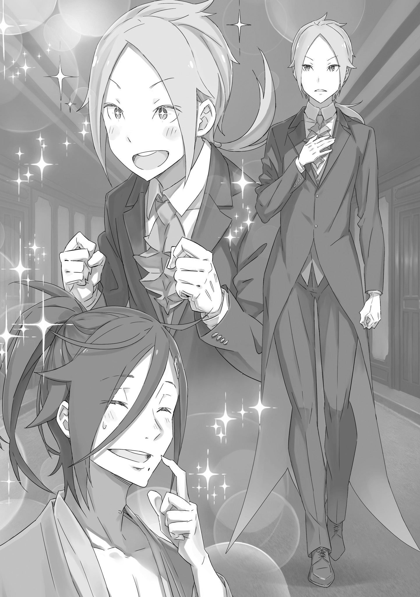
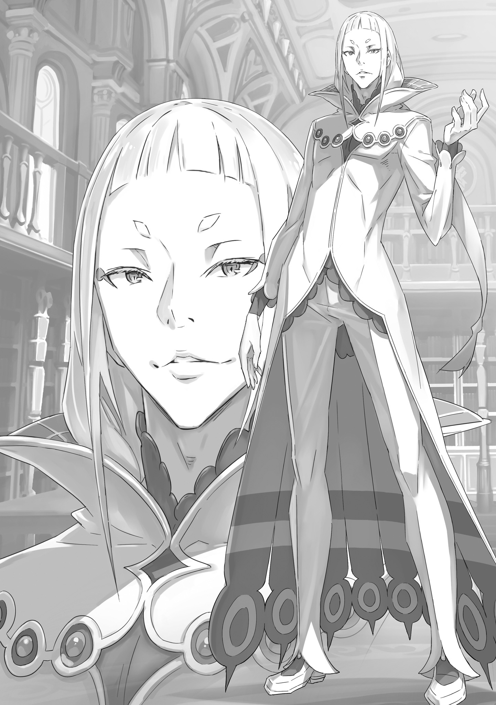
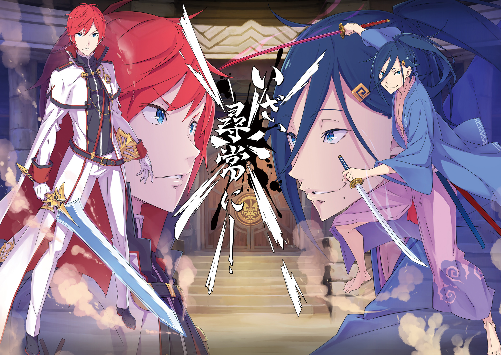
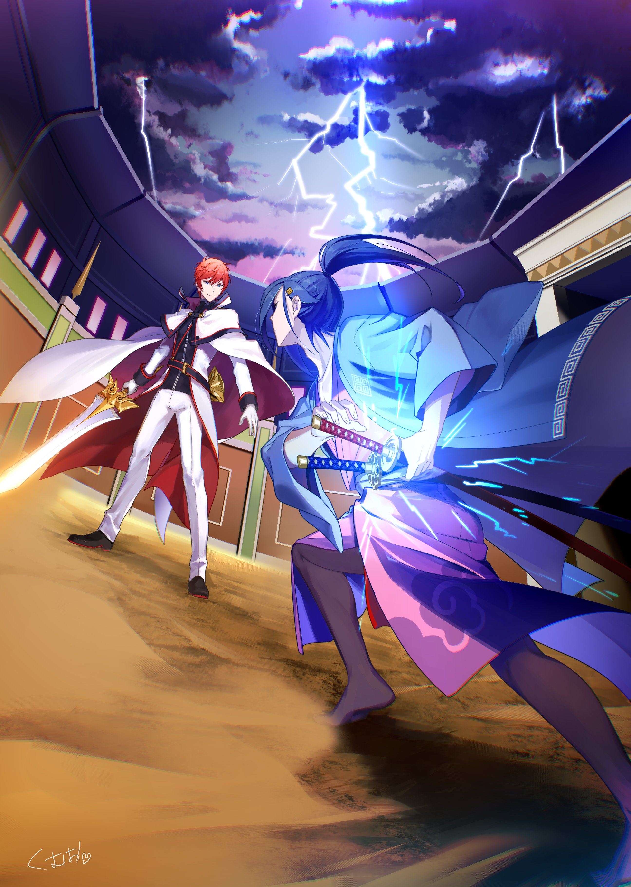
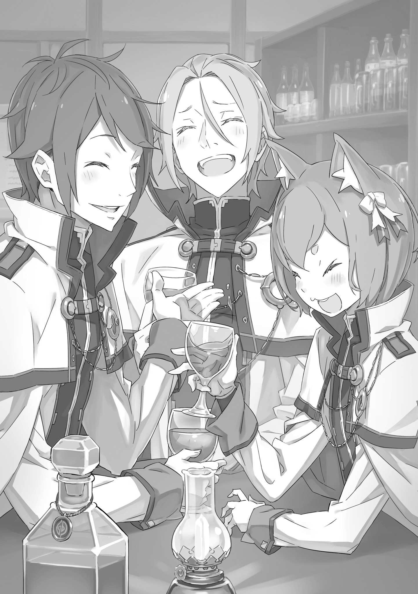

Приквел к Королевским Выборам: Танец серебряного цветка Святого Меча и Синей Молнии

『王選前日譚 剣聖と雷光の銀華乱舞』

Существует такое оружие как меч Дракона.

В мире есть множество знаменитых клинков, но все они меркнут по сравнению с этим… Он является самым святым из Святых мечей. Самым волшебным из волшебных.

Он считается самым уникальным, самым острым и самым красивым во всем мире.

Такова суть реликвии Дружеского Королевства Лугуники — Меч Дракона Рейд.

Ходят слухи, что этот клинок зачарован кровью тысячи сраженных им драконов.

Клинок, несущий благословение, дарованное самим Богом Меча.

Тщательно отточенный, выкованный, закаленный неизвестным кузнецом, из лучшей стали.

Вокруг меча ходит очень много легенд.

Но ясно только одно: Меч Дракона Рейд — самый сильный в мире так же, как и его владелец.

Только Святой меча может взять его в руки, и только самые достойные враги могут когда-либо увидеть его.

Как только Меч Дракона обнажен, о поражении можно и не думать.

Проводя каждый день на границе в карауле, сторож заскучал.

Молодой человек зевнул и прикрыл рот рукой. При этом на его глазах накатились слезы. Если представить королевскую армию в виде лестницы, то он был в самом низу. В нем не было ни мотивации, ни морального духа.

Своим положением гвардейца он был обязан родителям, но отсутствие у него энтузиазма не ускользнуло от внимания начальства. Поэтому он оказался на такой низкой должности.

Отношения между Королевством и Империей никогда не были теплыми, ни за тысячу лет, ни даже больше, с тех пор как были основаны эти две нации. Книги по истории были завалены их территориальными стычками. Возможно, поэтому присутствие такого безответственного мужлана на границе казалось странным…

— Да… Сегодня также спокойно, как и всегда, — заметил молодой человек, всматриваясь в небо с наблюдательной вышки. Уже много столетий между империей и королевством не было никаких сражений, достойных упоминания. Служба в качестве пограничника была настолько проста, насколько это было возможно для Джобса, и за те месяцы, что он был назначен на эту должность, все его ежедневные отчеты состояли из одних и тех же двух слов: «Все тихо». Чтобы избавить себя от необходимости каждый день составлять новый отчет, бездельник уже подготовил отчеты на весь следующий месяц.

Последние несколько месяцев в столице, похоже, происходили какие-то неприятности, но здесь, на границе, они мало что значили для него. Ему казалось непосильным бременем даже читать письменные приказы, которые он получал из столицы, и по большей части он просто бегло просматривал их. Был только один, который запомнился ему.

— «Усилить бдительность в отношении Волакийской империи». Да, но как?

Они не посылали ему кого-то в помощь, так что ему было непонятно, как он должен выполнять эти приказы. Хотя преданный коллега и предложил удвоить вахту, но с теми людьми, которые были, они едва могли поддерживать график дежурства, который у них уже был. И вот сегодня он дежурил, наблюдая, как и всегда.

— Хм…?

Молодой человек вдруг перевел взгляд с облаков на дорогу и нахмурился. Сначала он подумал, что ему что-то мерещится. Но сомнения стражника быстро развеялись.

Облако пыли приближалось к контрольно-пропускному пункту прямо по дороге из империи. Оно двигалось с огромной скоростью, напоминая быстрого земляного дракона. Нет, даже нечто быстрее. Пока молодой человек, застыв на месте, наблюдал за происходящим, облако пыли уже пронеслась мимо контрольно-пропускного пункта.

— Ого! Эй, подожди…!

Это была пограничная застава. У солдат была обязанность проверять каждого кто хотел попасть в королевство. И все же этот вихрь пронесся мимо, даже не заметив аванпост. Это было несанкционированное пересечение границы, явное преступление.

Но…

— Хи-хи, пора менять караул!

— А? — застигнутый врасплох, молодой человек обнаружил, что облако пыли уже удалилось на приличное расстояние, чтобы его можно было разглядеть. Еще больше сторожа поразил голос одного из его товарищей, который поднимался по лестнице снизу. Молодой человек обернулся и увидел своего спутника, пристально смотрящего на бледного мальчика.

— О… — сказал первый.

— Что это за взгляд? Подождите… Что-то случилось?

— Неееа, э-э-э…. — молодой человек не смог найти слов для ответа. Если он доложил бы, что просто пропустил нарушителя, то, по его мнению, его бы ждало гораздо худшее наказание, чем просто назначение в какой-нибудь богом забытый уголок границы.

Страх сковал его язык надолго. Наконец ему удалось выдавить:

— …нет, ничего. Все хорошо. Все тот же скучный мир.

В конце концов ленивый гвардеец никогда не упоминал о том, что видел, ни своему товарищу, ни в письменном отчете. Запись покажет, что в этот день на границе между Королевством и Империей абсолютно ничего не произошло.

Небольшое отступление: несколько месяцев спустя этот молодой пограничник будет сдан своим товарищем за ложное донесение и невыполнение служебных обязанностей. Его переведут охранять тюрьму, — но это уже совсем другая история.

Пара в белых мундирах привлекла всеобщее внимание на улице.

По торговой улице в квартале простолюдинов столицы Лугуники шел красивый, элегантно выглядевший мужчина. К нему присоединилась молодая девушка, прекрасная, как распустившийся цветок, — пара редкостной красоты. Более того, оба они были рыцарями королевства, судя по их униформе. Белые плащи, которые они носили, символизировали их статус членов королевской гвардии, элитной группы самых опытных и хорошо обученных рыцарей в стране.

Но только один из них считал это главным источником гордости для рыцаря. В этот момент вторая шла сзади, сложив руки за спину и весело подпрыгивая худыми плечами.

— «Королевская гвардия» — звучит как милое название, но на самом деле это так скучно.

Говорившая и озиравшаяся по сторонам широко раскрытыми глазами, была светловолосая, с кошачьими ушами целительница. Молодая женщина — или, по крайней мере, кто-то похожий на нее… Это был Феррис.

Феррис, вытянув руки, зевнул.

— Быть спокойным — это хорошо, но зевать? Ты стал слишком расслабленным. А также я сомневаюсь в твоем замечании о том, что это “скучно”. Нам надлежит вести себя так, чтобы не навлечь позора на этот мундир.

Этот упрек исходил от человека, который шел рядом с Феррисом и ни в коем случае не пропустил битву мальчика-кота с зевком.

— О, ты это видел, да? — сказал Феррис, высунув язык. — У тебя глаза как у ястреба, Юлиус. Неужели ты никогда не устаешь, наблюдая за всем так пристально?

— Это часть моей работы… Нашей работы. И вообще, наша скука — это хорошая новость для людей.

— Только ты мог произнести такой лозунг. — Феррис пожал худыми плечами, криво усмехнувшись бдительности своего напарника. В ответ Юлиус позволил себе улыбку, которую видели только его друзья.

Так уж случилось, что они вдвоем патрулировали столицу в целях общественной безопасности. Королевская гвардия большую часть времени проводила взаперти в замке. Впрочем, подобные маршруты, проверяющие столицу из непосредственно помогающие предотвратить любое преступление, оказались для них еще одной важной задачей. Рыцарские мундиры этой пары выделялись даже на расстоянии; они надеялись, что одним своим присутствием произведут устрашающий эффект.

— Я чувствую себя как пугало в поле. Но у нас есть одно преимущество — мы можем ходить, где хотим! А еще мы красивые!

— Есть и такие, кто не остановил бы свою руку в непосредственной близости от рыцаря, привлекательного или нет. Это придает смысл тому, что мы делаем. Ах, не то чтобы я отрицаю твою привлекательность…

— Разве ты не такой прилежный и способный? Ферри чувствует, как колотится его сердце!

— Если радость заставляет твое сердце биться быстрее, то, похоже, ты чувствуешь то же самое, что и я, когда говорю с тобой.

Феррис смущенно почесал щеку, его кошачьи глаза метались туда-сюда.

Юлиус и Феррис знали друг друга с тех пор, как последний вступил в ряды рыцарей, а ведь еще не прошло и года.

Несмотря на то, что они были мало знакомы, они быстро подружились, стали ближе, чем многие другие коллеги. Они, хорошо ладили, но Юлиус чувствовал, что истинной силой их дружбы было уважение друг к другу. Рыцарь духов восхищался теми, кто делал то, что не мог он, а также теми, кто не жалел сил, чтобы стать лучше. То же самое он чувствовал и по отношению к Райнхарду.

— И все же я полагаю, что мое уважение к Райнхарду немного другое.

— Хм? Ты что-то сказал?

— Нет, я просто подумал, что рынок наполнен слухами о королевской семье. Я сомневаюсь, что пройдет много времени, прежде чем королевские выборы станут общеизвестными.

После того, как Юлиус сменил тему, голос Ферриса стал звучать подавленно.

Слухи, ходившие по всей столице, были связаны с исчезновением королевского рода. Официальное сообщение из замка гласило, что король Рандхал Лугуника прикован к постели болезнью, но выздоравливает. На самом деле, он был уже мертв, и та же самая болезнь, которая унесла его, также убила всех членов семьи. В результате вся правящая родословная была полностью уничтожена.

Никто не знал, откуда поступала эта информация, но, несмотря на это, большая часть слухов содержала поразительное количество правды, и не было ничего необычного в том, чтобы услышать множество голосов, оплакивающих будущее нации. Охваченная тревогой горстка людей уже приблизилась к двум королевским гвардейцам.

Возможно, именно поэтому мы здесь.

Маркос, капитан королевской гвардии, был не только храбрым воином, но и проницательным мыслителем, внимательным к такого рода деталям.

— Мудрость капитана не перестает меня удивлять. По слухам, скоро начнутся королевские выборы, и я сомневаюсь, что нам удастся избежать участия в нем. Особенно тебе, мой друг…

— Ммм, Миу… у меня есть на это право. Ферри не остановится ни перед чем, чтобы помочь Леди Круш! — хрупкий получеловек сжал кулак, а его лицо покраснело от решимости.

Хотя Феррис был присягнувшим рыцарем гвардии, формально он был верен герцогине Круш Карстен. Герцогиня, считавшаяся одной из самых талантливых женщин в стране, была выбрана в качестве одной из кандидаток на так называемый королевский отбор, который определит следующего короля Лугуники. Как только все пять кандидатов будут собраны, Феррис должен будет поддержать свою леди в качестве ее рыцаря.

“Герцогиня Круш Карстен…”. Юлиус знал о ней, хотя и мало. Она была широко признанным гением высоких идеалов.

Фиолетововолосый молодой человек, безусловно, мог посочувствовать положению женщины, поскольку она в столь юном возрасте унаследовала титул главы знатного поместья и теперь балансировала с будущим королевства, потенциально лежащим на ее плечах. Без сомнения, она была самым подходящим кандидатом на трон. Кроме того, Круш и Феррис поддерживали тесные связи с бывшей королевской семьей; трон, несомненно, имел немалое значение для них обоих.

Как друг Ферриса, Юлиус не испытывал ничего, кроме восхищения преданностью кошко-мальчика своей госпоже. И все же оставалась тень сомнения, словно игла, колющая его сердце.

Юлиус подавил это ощущение.

— Просто будь внимателен, чтобы не перегореть. Слишком большая самоотдача сама по себе может быть ядом. Не забывай заботиться и о себе.

— Да, конечно. Юлиус, ты такой заботливый, — голос Ферриса звучал более обеспокоенно, чем обычно.

— Я знал, что ты это скажешь. Но все же, как твой друг … — Юлиус оборвался на полуслове.

— …?

— В чем дело? — Феррис озадаченно посмотрел на него. Юлиус, казалось, зациклился на шумном ресторане на другой стороне улицы или на том, что происходило внутри. Здание было типичным, такое же, как и многие другие маленькие заведения на торговой алее, отличаясь тесным интерьером с прилавком и несколькими столами, за которыми можно было присесть. Посетителей было немного, а для ланча было уже слишком поздно. Однако один из посетителей выделялся, хотя и стоял спиной к рыцарям. Этот человек был одет в короткую куртку, выкрашенную в ярко-синий цвет; его волосы цвета индиго были завязаны сзади на затылке. Под курткой он носил необычную одежду, называемую кимоно, типичную для народа Карараги. На ногах этого человека было что-то вроде сандалий, которые были приобретены в том же месте, что и кимоно.

Если бы это было все, то этот человек мог бы быть просто еще

одним необычно одетым путешественником. Но было в нем что-то странное.

— А? Разве это не…

Глаза Ферриса расширились, когда он заметил человека, на которого смотрел Юлиус. Рыцарь духов не ответил, потому что он был бы слишком потрясен.

На поясе у человека висели два меча — это была безошибочно отличительная особенность его внешности. И все же Юлиус хотел бы, чтобы это была ошибка, потому что он был слишком удивлен, увидев здесь этого человека.

— Аааа! Как же вкусно. Боже мой, еда в столице всегда такая вкусная! Молодой человек вежливо кивнул и поставил пустую миску на стойку, даже не заметив, что два ошеломленных рыцаря наблюдают за ним.

— Очень любезно с вашей стороны, сэр, — ответил клерк, довольный пустой миской и аппетитом, с которым путешественник ел. — Не часто увидишь, чтобы парень вот так набрасывался на еду. Как я понимаю, вы были довольны?

— Я мог бы сказать, что количество пищи было немного скудным, но ее вкус более чем компенсировал это. Я привык к ярким, смелым вкусам, поэтому все мелкие детали приготовления пищи королевства — это удовольствие для моего рта. — молодой человек полез в карман кимоно за кошельком, продолжая этот дружеский разговор с клерком.

Глаза клерка расширились, когда он увидел медную монету, которую дал ему синеволосый человек.

— А? Эй, мистер, это…

— Ах, я уверен, что у меня в кошельке не осталось иностранной валюты, так что не волнуйтесь, если это будет слишком много.

Молодой человек поднялся со своего места, улыбаясь ошеломленному лавочнику. Он собрал разбросанные вещи у своих ног и уже собирался уходить с той же беззаботной уверенностью, когда…

— А?

Он заметил, что на него смотрят две пары глаз, и остановился. Человек с катанами обменялся долгими взглядами с Юлиусом и Феррисом, явно задумавшись, а затем хлопнул в ладоши.

— Теперь я вспомнил! Да, вы те самые люди, которым удалось сбежать от меня живыми!

Юлиус и Феррис обменялись взглядами, услышав такой восторженный голос молодого человека и увидев его блестящие глаза. Мужчина в кимоно помахал им рукой и неторопливо подошел, словно приветствуя своих лучших друзей.

— Привет, привет, давно не виделись! Синяя молния Волакии, Сесилус Сегмунт, снова появляется перед вами!

Сесилус стоял с совершенно искренней улыбкой. Самый сильный боец империи, очевидно, прибыл в королевство без приглашения, без вызова и совершенно беззаботно.

Столица Лугуники поделена на 5 слоев.

Самый верхний слой располагается в центре города и представляет собой Королевский Замок Лугуники. Находясь на высоте, он открывает великолепные виды на целый город. Только самые важные люди и члены Совета Мудрецов имели право проживать здесь. Следующим слоем шел Благородный Квартал. Он до краев был заполнен людьми, у которых имелось право жить в столице. Эта часть города была заселена в основном домами менее благородных людей и поместьями более высших слоёв общества, которые придавали этому месту картину элегантности.

Ниже Благородного Квартала располагается Купеческий Округ, который вносит основной вклад в суету в столице. Еще ниже находится Обычный Район, где проживает большая часть населения столицы. И, наконец, район, где царила нищета. Такие места отнесены к окраинам Обычного Района, близ стен, защищающих город.

Дом Юлиуса располагался в Благородном Квартале. Семья Юклиус имела средне-благородный статус, их сдержанность и прямолинейность были отличительными чертами. Однако…

— Ох, какой чудный дом! Я думаю, что мне здесь будет очень комфортно.

Эта атмосфера отчужденности была разбита специфическим громкоголосым гостем. Смотрящий на передний зал Сесилус, выходя из главной двери, выглядел очень довольным. Его глаза сконцентрировались на прислуге, члены которой были очень удивлены, увидев столь нежданного гостя.

— Ох! В этих краях даже форма горничных выглядят иначе! Женщины Лугуники никогда не забывают быть элегантными, даже если они просто обслуживающий персонал! Ах, это вызывает слезы на моих глазах. Прекрасно, восхитительно!

— С-спасибо за Вашу хвальбу. Это честь…

Сесилус решительно кивнул.

— Они даже отвечают мне с вежливостью и скромностью! Такое почтение заставляет мое сердце биться чаще. Хотя, честно признаться, кошкодевочки — это самое прекрасное, что есть в Лугунике.

Дальше он вспомнил о Юлиусе, которого оставил у двери, и полетел обратно за ним.

— Господи, что я делаю, оставляя хозяина дома позади? Я просто был очень поражен, пожалуйста, продолжай вести меня.

— Я ценю ваше внимание, мастер Сесилус. Но ведь дом такого размаха для вас не такой уж и сюрприз? Уверен, вы и раньше видели горничных.

— Да, конечно, мои доходы не малы… Но я трачу все свои деньги на развлечения. Это оставляет у меня достаточно шаткие финансы, которых едва хватает для найма горничных.

Фехтовальщик тряхнул рукавом в сторону нахмурившегося Юлиуса. Какими же должны быть эти “развлечения”, чтобы они оставляли Сильнейшего мечника целой страны в сомнительном финансовом положении?

— … Так уж получилось, что я коллекционирую как новые мечи, так и мечи старого образца, — объяснил Сесилус, -таким образом у меня всегда есть готовый реквизит, и это мой единственный недостаток.

— Итак, вы собираете лезвия. Понимаю, это имеет смысл… — сказал Юлиус, кивая, когда его взгляд скользнул по двум мечам у бедра Сесилуса. Один был в красных ножнах, другой — в голубых, и он задавался вопросом о них с того момента, как они воссоединились в торговом квартале. В немалой степени это было связано с тем, что оба лезвия, казалось, излучали безмерную жестокость и жажду крови, которые все еще можно было обнаружить, даже когда они были полностью закрыты ножнами. Это ошеломляющее чувство силы было доказательством того, что это были зачарованные или священные клинки, а не обычные или средние.

— Самыми исключительными предметами моей коллекции являются мой меч номер один, Мурасамэ, и мой меч номер два, Масаюмэ. У меня не было возможности показать их вам в империи, но оба — зачарованные клинки с долгой и легендарной историей.

— Я вижу, что это хобби имеет некоторую практическую пользу. Это очень информативно.

— Да, но для их приобретения требуются большие деньги, не говоря уже об их содержании. Не то чтобы я когда-либо восхищался этому.

Аура мечей угрожала поглотить их владельца, но Сесилус использовал свой собственный бойцовский дух, чтобы подавить силу, исходящую от двух видов оружия. Чтобы владеть такими впечатляющими инструментами, требовался не менее внушительный владелец. Юлиус прикоснулся к своему клинку и задумался, способен ли он на такое. Его меч имел историю в качестве ценной реликвии семьи Юклиус. Сколько времени он потратил на то, чтобы овладеть им, научившись максимально использовать его…

— Сэр, вы бы хотели стать моим гостем?

Вопрос исходил от молодого человека, который вышел из дома и прервал их разговор. Прекрасные черты лица молодого человека производили впечатление мягкости.

— Ой, — сказал Сесилус, приподняв бровь, когда молодой человек подошел, — А вот и тот, кто чем-то похож на вас, мастер Юлиус…

— Мой младший брат Йешуа. Йешуа, это мастер Сесилус. Он останется с нами на несколько дней в качестве моего гостя. Прошу прощения за отсутствие предупреждения…

— Я понимаю. Друг моего брата — друг этого дома. Фиолетоволосый молодой человек, Йешуа Юклиус, слабо улыбнулся и склонил голову.

— Боже милостивый, — сказал Сесилус, покачивая головой, будучи принятым так вежливо, — Я приношу свои самые скромные извинения за такое внезапное навязывание. Понимаете, я очень плохой планировщик и даже не подумал зарезервировать гостиницу для моей маленькой поездки. Мастер Юлиус был так добр, предложив мне помочь… У вас такой хороший старший брат, мастер Йешуа; я почти завидую!

— Так вы понимаете, сэр?! Вы видите, какой замечательный человек мой старший брат!?

— Гм?!

Младший брат Юлиуса наклонился к Сесилусу, который предложил несколько точное объяснение обстоятельств вместо надлежащего приветствия. Йешуа и его манера поведения внезапно и полностью изменились, совершенно игнорируя иностранного гостя, когда тот страстно сжал руки в элегантные кулаки.

Через мгновение стройный молодой человек продолжил говорить с Сесилусом более знакомым тоном.

— Если вы настолько хорошо разбираетесь в людях, что видите моего брата таким, какой он есть, то я приветствую вас с распростертыми объятиями. Пожалуйста, оставайтесь столько, сколько пожелаете. Мастер Сесилус, откуда вы? Это странный наряд, разве это не кимоно из Карараги? Я знаю их по книгам, но никогда раньше не видел ни одного своими глазами!

— Ах, так ты узнал их? Я влюбился в него с первого взгляда во время своей первой поездки в Карараги. После этого у меня было одно сделанное на заказ. Знаешь, главный герой должен прилежно относиться к своей внешности. Вот чем «Синяя молния» намерена и должна быть!

— Синяя молния…?

Это заставило Йешуа остановиться, прервав прекрасную ритмичность разговора.

Юлиус заметил это и многозначительно покашлял.

— Йешуа, мастер Сесилус устал от путешествий. Прежде всего мы должны позволить ему отдохнуть в комнате для гостей.

— О, да, конечно. Мне очень жаль, старший брат. Я немного перевозбудился… — Йешуа почесал щеку и покраснел, смущаясь, что забыл о своем поведении. Юлиус натянуто улыбнулся младшему брату, а затем повернулся к Сесилусу.

— Прошу прощения за невнимательность моего брата, мастер Сесилус. Он обычно не такой…

— Боже мой, я не против. Мы сможем поговорить чуть позже. У меня полно времени, чтобы побаловать его.

— Д-да, конечно! Большое спасибо, сэр. Хорошо, я сейчас же уйду в свою комнату, старший брат.

— Хорошо. Увидимся за ужином.

Йешуа поклонился и вернулся в свою комнату в сопровождении одной из служанок. Сесилус внимательно наблюдал за ним, когда он уходил, и заговорил только после того, как молодой человек скрылся из виду.

— Хм. Этот твой младший брат… С ним что-то не так физически… Ты можешь рассказать?

— Назовите это интуицией, основанной на том, как он говорит и ходит. Не похоже, чтобы какая-то его часть была в особенно плохой форме. Это больше похоже на то, что он вообще слаб. Я подозреваю, что родился таким.

Сесилус скрестил руки. Юлиус был ошеломлен острым наблюдением. Всего за несколько минут Сесилус определил врожденную болезнь, поразившую Йешуа. Младший брат Юлиуса обладал слабым телом. Он изо всех сил пытался выполнять даже самые простые повседневные задачи. В наши дни он был более способным и энергичным, но в прошлом юноша был склонен к лихорадке, которая заставляла его проводить большую часть своего времени в постели. Даже в его нынешнем состоянии требовалась значительная осторожность, когда он путешествовал очень далеко. Так что…

— Мастер Сесилус, если бы вы были так любезны, возможно, вы могли бы развлечь Йешуа некоторыми историями о Волакии?

— Волакия, говоришь?

— Мой брат никогда не был за пределами Лугуники. Он стремился получить все знания, на которые можно было надеяться, из книг. Теперь я бы хотел, чтобы он узнал о вещах, которые нельзя найти в книгах.

— Понятно… Тебе ведь небезразличен твой брат, не так ли?

Юлиус ответил на восхищенное замечание Сесилуса лишь улыбкой. Рыцарь духов действительно заботился о своем младшем брате. Йешуа был частью семьи, и это делало его драгоценным; он был дорогим младшим братом. Однако Юлиус чувствовал, что этот конкретный приступ внимания исходил от чего-то другого. Он хотел расширить кругозор Йешуа. Возможно, он думал, что ожидание и зависть, с которыми Йешуа иногда смотрел на него, были чем-то неуместными. Несмотря на…

— Боюсь, вы будете ограничены везде, кроме этого дома, мастер Сесилус. Таким образом, я считаю, что из Йешуа получится отличный собеседник для вас.

— Хо-хо, как прекрасно ты о нём говоришь. Если твой брат — книжный червь, за которого ты его выставляешь, может, я сам узнаю что-нибудь полезное. Мне это нравится!

— Я рад это слышать… Чему вы хотели бы научиться из любопытства?

— Дарить крутые речи и самые яркие слова, чтобы провожать врага — естественно!

Резкий ответ поставил Юлиуса в тупик. Это должно было быть шуткой? После этого он провел волакийца, который пришел с минимальным багажом, в комнату для гостей, изложил для него несколько основных правил во время его пребывания и дал ключи.

— Но ты интересный человек, — мягко сказал Сесилус, беря ключ и ставя свои сумки. Юлиус, не ожидая этого комментария и приподнял бровь. Божественный генерал пожал плечами и ответил:

— Не верите мне? Вы, добрый мастер Юлиус, способны на удивительно смелые действия ради того, кто выглядит и ведет себя так же, как и вы.

— Конечно, не больше вас, мастер Сесилус, тот, кто пробежал мимо сторожевого поста, чтобы прийти сюда и вызвать на дуэль Святого Меча.

— Мои действия призваны ошеломлять мир. Но забудьте об этом.

Мужчина в кимоно не переставал улыбаться, сидя на кровати и пристальна наблюдая за Юлиусом.

— Та ушастая красавица, с которой вы были… Ее мнение казалось гораздо более объективным и правильным. Не говоря уже о том, что я принимаю вас за того, кто обычно неуклонно следует пути праведности. Я ошибся?

Юлиус не ответил.

— Это, конечно, просто мое небольшое личное наблюдение, и всегда возможно, что ты просто более сумасшедший человек, чем кажешься… Но у меня есть интуиция, и я ей доверяю, даже если она не всегда логична.

Юлиус издал легкий вздох, слушая, как говорил Сесилус. Он согласился, что «ушастая красавица» Феррис имеет на это право. До горького конца Феррис выступал против того, чтобы Юлиус скрывал Сесилуса в своем особняке. В отличие от рыцаря с фиолетовыми волосами, он не пытался сделать что-то подобное, не умолял его не раскрывать присутствие волакийца другим рыцарям. Этого было достаточно, чтобы усомниться в лояльности Юлиуса королевству — так зачем же он это сделал?

— Я подумал, что это был вопрос, который может не дать вам спать по ночам, не говоря уже о том, пожалуется ли на меня ваш маленький друг.

— … Если бы вы начали действовать силой, мастер Сесилус, ни Феррис, ни я не смогли бы вас остановить. Разве мой ответ в закусочной не развеял никаких сомнений?

— Я не боюсь. Я думаю, вы прекрасно знаете, мастер Юлиус, что я вряд ли смогу убить вас двоих. Эти мечи годятся лишь для небольшого грохота.

Юлиус не смог ответить на убедительный ответ Божественного Генерала. Но это было, конечно, не потому, что он закрыл свое сердце, намереваясь не открывать то, что было внутри. Все было с точностью до наоборот. Слов не было потому, что Юлиус не мог их подобрать. У него не было ответа на вопрос, который задал Сесилус. Это была проблема.

— Ой. Я доставил тебе неприятности? Прости. Как я мог быть таким легкомысленным по отношению к хозяину дома, в котором остановился?

Юлиус обнаружил, что необычный гость с тревожной быстротой разглядывал его смущенное состояние. С этими словами имперский фехтовальщик снял оружие и растянулся на кровати.

— А теперь, думаю, я сделаю то, что вы предложили, и немного отдохну. Бежать сюда из империи было своего рода ещё то занятие…

— Отлично. Надеюсь, ты в скором времени освежишься. Я позову тебя, когда будет готов ужин. И я очень надеюсь, что ты будешь осторожен…

— Чтобы никто не узнал, что я самый могущественный красивый мечник Империи Волакия? Я буду настороже.

Сесилус снисходительно махнул рукой Юлиусу, который кивнул ему в ответ. Молодой рыцарь только что вышел из комнаты и собирался уже закрыть за собой дверь, когда снова услышал голос Сесилуса.

— Я с нетерпением жду возможности провести с тобой несколько дней, мой дорогой сообщник.

Эти слова подошли бы герою какого-нибудь рассказа и тронули Юлиуса в самое сердце.

Прошло несколько дней с момента прибытия Сесилуса в дом Юлиуса, и пока всё обходилось без серьёзных инцидентов. Не было каких-либо взрывов или чего-нибудь подобного, о чём можно было бы побеспокоиться, однако он часто устраивал всякие споры.

Сесилус Сегмунт был именно таким человеком, которого себе представляешь, узнав о его репутации. Пускай он и был сильнейшим воином Империи Волакия, но не обладал ни воинской честью, ни достоинством, которых можно было бы ожидать от такого уважаемого человека. Он всегда был самим собой.

Мечник был хорошо знаком со служанками и, как просил Юлиус, частенько беседовал с Йешуа. Действия Сесилуса нередко были очень резкими, но полное отсутствие злобы в них не позволяло другим в доме плохо отзываться о них. Таким он был спустя пару дней.

— Не могу поверить, что ты настолько доверчив, Юлиус.

— С позволения, это очень суровая оценка.

Идя вдоль рыцарских казарм фиолетововолосый рыцарь сухо улыбнулся Феликсу, который в ответ зашипел. Юлиус рассказал кошко-мальчику обо всех событиях, произошедших за последние несколько дней. Теперь Феликс был точно уверен, что его друг проглотил наживу врага с её сладкой лестью. Несмотря на это, он послушно следовал просьбе друга и сопротивлялся искушению раскрыть присутствие Сесилуса в стране.

— Что ж, до возвращения Райнхарда осталось где-то два или три дня, но вы правда думаете, что он будет драться с этим парнем?

— Я намерен выступить их посредником на этом поединке. Мне действительно хочется считать, что Сесилус сдержит своё слово и вернётся домой, как только получит то, ради чего пришёл сюда. Неизвестно что он сделает пока не достигнет своей цели.

— Даже если он впадёт в ярость, Райнхард единственный, кто сможет его остановить. Сесилус действительно опасный гость, но ты правда уверен в этом, Юлиус? Мяу, можно сказать, что ты продаёшь Райнхарда.

Юлиус ничего не ответил.

— Я имею в виду, что ты держишь это в секрете от него и всех остальных. Ты хочешь натравить на него сильнейшего воина Волакии. Очевидно, что он подумает, что вы в сговоре.

— Сговорились с мастером Сесилусом? О да, я полагаю, что это именно так и выглядит!

Юлиус кивнул, вынужденный пересмотреть свои действия с другой точки зрения. Конечно, он с самого начала понимал, что его действия поставят под сомнение его верность королевству, но он никогда не думал, что это может выглядеть как предательство Райнхарда.

— Я никогда не думал, что у мастера Сесилуса есть шансы победить.

— Ох…

Феррис нахмурился. Он услышал искренность в словах Юлиуса. Его уши поникли.

— Не ожидал такого. Не слишком ли ты сильно веришь в Райнхарда? Ты не только веришь в его победу, но и исключаешь другой исход событий.

— Если ты так выразился, то полагаю, что ты прав.

Он скрывал одного из Божественных генералов у себя дома и пытался тайно устроить дуэль со Святым Мечом. Однако в его действиях никогда не было злого умысла против своего друга. Рыцарь-пользователь духов всегда доверял Райнхарду и всегда был уверен, что рыжеволосый мечник никогда не ошибается в своих намерениях.

— А что насчёт вас, Феррис? Вы представляете себе поражение Святого Меча?

— Ферри не позволяет себе такого, но его предположения, мяу, сильно отличаются от Ваших.

Юлиус задумчиво нахмурил брови, застигнутый врасплох глубиной ответа Ферриса. Однако прежде, чем он успел расспросить его, получеловек посмотрел на волшебный кристалл времени на стене коридора.

— Пора, — сказал Феликс, указывая на меняющий цвет магический кристалл. — Капитан хотел видеть нас. Поговорим позже.

Юлиус не хотел оставлять эту тему позади, но он знал, какими должны быть его приоритеты. Он и Феррис поспешили во внутреннее помещение казармы, в капитанскую часть.

— Войдите.

Их приветствовал мягкий голос, когда дуэт объявил о своем присутствии, постучав в дверь. Они послушно вошли и оказались лицом к лицу с рыцарем, который выглядел настолько грубым и неровным, что его можно было счесть за валун. Короткие зеленые волосы обрамляли его угловатое лицо, а доспехи едва сдерживали мускулы. Это был Маркос Гилдарк.

— Юлиус Юклиус здесь, сэр.

— И Ферри тоже здесь, кхм, сэр.

— Ты имеешь в виду Феликса Аргайла? Сколько раз я говорил, что при рапорте ты обязан говорить своё полное имя?

Грубым голосом он сделал замечание Феликсу и махнул рукой, как бы приглашая рыцарей в свой кабинет.

— Чем мы можем вам помочь, капитан? Знаете ли, Ферри очень занят.

— Вы могли бы научиться вести себя как рыцарь… Ах, неважно. Вы сегодня не единственные, кто заняты. Не знаю, настолько ли у вас забитый график, как и у меня, поскольку вам еще поработать от имени герцогини Карстен и приготовиться к отбору.

— Боюсь, что Ферри не понимает, о чём, мяу, вы говорите.

— Я имею в виду ваш маленький побочный бизнес целителя. Меня не волнует, что вы делаете с этой силой, пока она не мешает вашим служебным обязанностям. Даже если ты сходишь с ума, пытаясь заработать для герцогини больше сторонников.

— Хей! Вы знали, что я только что пытался сбить вас с толку! — Феррис не одобрил слова Маркоса, видя его отговорки, но капитан отклонил возражение. Он опустил плечи; получеловек знал, насколько безжалостным может быть старший рыцарь.

— Да, да, это то, что я делаю, и поверьте мне, я много над этим работаю. Так что, пожалуйста, не давайте мне кучу других дел в роли королевского рыцаря.

— Боюсь, я не могу это принять во внимание. Официально вы назначены в Королевские рыцари. Если вы решите использовать свое свободное время, чтобы помогать герцогине, это ваша прерогатива, но, когда вы мне понадобитесь, вы будете работать как рыцарь Королевской гвардии, несмотря ни на что. Понятно?

— Бу, — ответил Феррис, дуясь на слова капитана. Маркос проигнорировал наглый жест и повернулся к Юлиусу. После этого взгляд капитана стал почти невыносимым. Такой взгляд мог сломить человека с нечистой совестью.

— Поскольку королевский отбор близок, напряжение становится слишком сильным в некоторых частях страны. Здесь, в замковом городе, до нас доходят слухи о кончине Его Превосходительства и другие, которые даже утверждают, что вся королевская семья умерла от болезни. Я уверен, что ты слышал о них, Юлиус.

Тема, которую поднял Маркос, не имела ничего общего с Сесилусом. Конечно, нет. Если бы слухи о присутствии волакийца дошли так далеко, Юлиус не стал бы их отрицать. Он признался бы во всем, прекрасно зная, что расплатится за это своей головой. Желание Юлиуса подарить Сесилусу матч-реванш, которого он хотел, было, в конце концов, просто личным решением. Можно сказать, желание чего-то, чего не было у него самого. Желание прикоснуться к краю плаща, принадлежавшего тому, кто так беззастенчиво жил в соответствии со своими собственными принципами…

— Юлиус?

— …Простите меня, сэр. Как вы говорите, капитан, в массы распространяются слухи. Многие опасаются за будущее монархии. Мне больно это говорить, но ваши опасения могут быть полностью оправданными.

— Если бы душевное спокойствие людей можно было купить за одну униформу королевской гвардии, то это стоило бы своей цены. Но подобное положение еще более ужасно.

Хотя Юлиусу потребовалось слишком много времени, чтобы ответить, Маркос, казалось, не беспокоился, а лишь взглянул вниз. Действительно, именно по приказу капитана стража стала чаще патрулировать столицу. Это принесло свои плоды: общественный порядок восстановился и люди казались спокойнее.

— Но это еще не все, — добавил капитан, словно читая мысли Юлиуса.

Лидер королевской гвардии — человек, стоявший на вершине иерархии рыцарей королевства, — был самим воплощением того, каким, по мнению людей, должен быть рыцарь. Он был другом обиженных и всегда делал все возможное, чтобы защитить других. Таким образом, даже если бы этот человек сделал все, что мог, то пожалел бы обо всем, что не было сделано. Даже если никто не критиковал и не обвинял капитана, самым строгим мерилом для него оставались собственные идеалы. С ним не всегда было легко жить, особенно для него самого. Таков путь Маркоса Гилдарка.

— Было много глупого ворчания. Королевская гвардия должна продолжать охранять столицу, в то время как остальная часть рыцарского корпуса будет действовать в других частях страны.

— Значит, мы должны продолжать делать то же самое, сэр?

— Я бы не стал звать вас сюда, дабы сказать, что ничего не изменилось. Как говорит Феликс, мы заняты.

Маркос, отложив в сторону собственные чувства, чтобы поддержать разговор, положил бумагу на стол и пододвинул к ним. Это был какой-то отчет.

— Это с одного из контрольно-пропускных пунктов на границе между королевством и империей.

— …! — Феррис чуть не задохнулся. Что касается Юлиуса, то он взял бумагу без видимой реакции.

— Спасибо, сэр.

Маг духов пробежался глазами по отчету. Он не имел никакого отношения к Сесилусу. Вместо этого в нем указывалось, что разрешение на въезд в страну было предоставлено некоторым посланникам из империи.

— Два посланника из Волакии приехали в Лугунику.

— Ха, так вот и все. Посланники, конечно, конечно. Посланники из империи … Погодите, что?! Для чего они здесь?!

Лицо Ферриса претерпело несколько быстрых изменений, когда он понял, что это не имеет ничего общего с несанкционированным проникновением Сесилуса.

— Отличный вопрос, — сказал Маркос, кисло глядя на него. — Мне очень жаль, как я поступил с вами после того, как вы на днях прошли весь путь в империю и обратно, но мы снова связаны с имперцами. Если бы я поступил по-своему, то использовал все силы королевской гвардии для решения этого вопроса, но, к сожалению, сейчас я больше никого не могу задействовать.

— Подождите, подождите, подождите, это не успокаивает! Не говорите мне, что вы собираетесь отправить Ферри и Юлиуса одних, чтобы встретить угрозу, от которой вам нужна вся охрана?! Это безумие!

Облегчение Ферриса от того, что это не имеет ничего общего с Сесилусом, быстро исчезло, и он начал терять самообладание. Юлиус, честно говоря, согласился с ним. Это было слишком сложно для них двоих. Но нельзя было игнорировать и «причастность к империи».

— В прошлый раз это тоже было безумием, но Райнхард как-то помог нам в этом, понимаете? Вы просто ошиблись парнями. Как насчет того, чтобы Ферри сделал что-то еще, а вместо этого Райнхард займется этим делом?

— Придирки ни к чему не приведут. Я не могу назначить кого-то, кого здесь нет. И в любом случае не забегайте вперед. Я не говорю, что вам двоим придется столкнуться со всей мощью Волакийской Империи в одиночку.

— Но мы знаем, что назревает бой, и мне этого достаточно, чтобы знать, что вы ошиблись!

— Будет ли бой на горизонте — зависит от вас двоих. И я рассчитываю, что ты заметишь, что этого не произойдет.

Феррис, схватившись за голову, попятился назад. Юлиус схватил его, и капитан только пожал плечами.

— Мои приказы для вас на этот раз просты. Сопровождайте посланников и помогайте им делать то, для чего они пришли сюда. Затем выведите их отсюда с как можно меньшими проблемами. Это все.

— Другими словами, это примерно зеркальное отражение той позиции, в которой мы находились раньше, сэр, — резюмировал Юлиус, все еще крепко держась за Ферриса, глаза которого горели.

Прошел месяц с тех пор, как Юлиус и остальные отправились в империю в качестве посланников. Теперь, всего через несколько недель, роли поменялись местами. Было трудно не чувствовать, что здесь работает нечто большее. Особенно учитывая явную возможность того, что всё, что произошло во время их визита в империю, было организовано императором.

— Мы понимаем, что нам предстоит встретиться и сопровождать эмиссаров Волакии, сэр. Но зачем они сюда прибыли?

— Думаю, проще всего спросить их самих. Призови их сюда и…

— В этом не будет необходимости.

Новый голос, казалось, скользнул в уши трех рыцарей, и лицо Маркоса стало жестким. Капитан смотрел на высокую стройную фигуру, прислонившуюся к двери офиса.

— Прошу прощения, — сказала фигура, подняв руку, пока Юлиус и Феррис недоумевали, когда она успела появиться.

— Но боюсь, что я слышал кое-что из того, что вы говорили. У меня слишком хорошие уши, если можно так выразиться.

Мужчина засмеялся, но это не было похоже на смех, скорее кашель. У него был очень необычный внешний вид: белые волосы, бледная кожа и белый халат, покрывавший все его тело. В совокупности это создавало впечатление, что весь цвет сошел с него. Даже само его присутствие казалось неоднозначным, как будто его на самом деле не было. Мужчина перевел взгляд с Юлиуса на Ферриса, которые стояли по стойке смирно.

— Могу я предположить, что эти двое будут хорошими рыцарями, которые будут сопровождать меня?

— …Да, это они. Юлиус, Феликс. Это один из эмиссаров Волакийской Империи, Мастер Чиша Голд.

— Очень приятно познакомиться.

С безупречной вежливостью мужчина, Чиша Голд, — бесцветно улыбнулся и склонил голову.

— Мастер Чиша, если мне не изменяет память, вы один из Девяти Божественных Генералов, не так ли?

— Так и есть. Хотя я являюсь только четвертым среди них.

— Зачем вы здесь? Должно быть, пригласить генерала с иностранным визитом — это серьезное дело, верно? — Феррис стремился не показывать, что знал, что коллега Чиши, Сесилус, уже въехал в страну без разрешения.

— В самом деле, — сказал Чиша, его губы расплылись в ухмылке.

— Нам не хотелось бы, чтобы вы думали, что Девять Божественных Генералов — всего лишь посыльные для империи, но нынешнюю озабоченность вряд ли можно оставить кому-либо. Итак, я пришел.

— Воу, поговорим о вступлении, которое вызывает у меня плохое предчувствие, — нахмурился Феррис. Юлиус почувствовал ту же волну тревоги в своем сердце, то же чувство, что и кошко-мальчик. Это было что-то достаточно важное, чтобы вытащить высокопоставленного генерала из империи и потребовать сотрудничества королевской гвардии. Должно быть, это глубоко затронуло отношения между двумя странами.

— Так вы собираетесь открыть нам большой секрет? Мастер Чиша, почему вы здесь?

— Я прошу вашего сотрудничества в обеспечении безопасности одного человека.

— «Одного человека», — повторил Юлиус. Зловещее поведение Чиши только усиливало его беспокойство. А потом, словно в такт звуку тревожных звонков в его голове, Чиша продолжил:

— Так получилось, что некий персонаж из империи нанес неофициальный визит в королевство. Я здесь, чтобы заставить его вернуться домой… Или, если потребуется, избавиться от него…

В то же самое время возле дома Юлиуса…

Внимательно осмотрев комнату, Сесилус нащупал мечи на бедре. Все оружие требовало тщательного ухода, но катаны нуждались в большей заботе, чем другие.

Два клинка, Мурасамэ и Масаюмэ, требовали огромного внимания, как и подобало двум величайшим произведениям искусства Мастера меча. Самым важным для поддержания Зачарованных мечей в хорошем состоянии была не полировка и не хонингование. То, что они искали, было уважение к тому, кем они являлись.

Зачарованные клинки требовали крови и смерти.

— Хорошо, хорошо, да. Еще несколько дней до возвращения Святого меча, по крайней мере, мне так сказали, — пробормотал себе под нос Сесилус, стуча ногами по полу. Над ним в комнате для гостей горел свет, указывая на присутствие жильца. Скорее всего, Йешуа.

Йешуа был младшим братом Юлиуса, мальчик интересовался внешним миром и его героями; он был одним из тех, кто мог бы стать прекрасным зрителем в будущем. Он питал немалую привязанность к Сесилусу, ведь каждый великий человек сцены нуждался в публике.

Было ужасно обидно, что у мальчика не было таланта самому стоять на сцене. Его старший брат, Юлиус, был гораздо более перспективен в этом отношении. Он обладал элегантностью, необходимой, чтобы блистать в главной роли.

— Упс, хе-хе. Я здесь не для того, чтобы устраивать прослушивания. Хотя я с нетерпением жду дуэли со Святым мечом, я не могу забыть другую причину, по которой я пришел.

Он легонько хлопнул себя по щеке, отвернулся от дома и неторопливо зашагал прочь. Юлиус строго-настрого запретил ему выходить на улицу, но он и не думал сбавлять скорость. Он сделает именно то, что хочет. Величайший из Божественных генералов действительно был воплощением имперского образа жизни.

Таким образом, Голубая молния покинула особняк, не заботясь ни о ком другом. Этот человек никому ничего не сообщил, и совершенно незаметно сильнейший воин Империи проник в столицу.

Вернуть незваного гостя из империи или избавиться от него…

Феррис посмотрел на Юлиуса, когда Чиша объявил о цели своего нежданного визита в Лугунику. Даже Юлиус смог заметить тревогу в этих золотистых глазах. Проблема, которую призвал решить посланник из Волакии, вызвала у них большое беспокойство.

— … Капитан, мы будем сопровождать мастера Чишу в его усилиях по задержанию этого пропавшего человека. Правильно ли я понимаю, что это наш долг?

Лицо Юлиуса почти не изменило свой оттенок; рыцарь-пользователь духов выглядел совершенно невозмутимым. Феррис был глубоко потрясен. Однако Маркос, похоже, не заметил необычно широко распахнутых глаз Ферриса.

— Вот так, — Капитан кивнул, — Ты будешь работать с Мастером Чишей, пока его дела здесь не закончатся.

— Понятно, сэр. Феррис, я полагаю, у тебя нет возражений?

— А? О, ммм… Нет, мы, конечно, сделаем все возможное..?

— Вы не очень уверены в этом. Скажи это без сомнений в глазах.

После того, как получеловек с трудом согласился, приказы были официально отданы. Юлиус подошел к Чише и протянул руку для пожатия.

— Я Юлиус Юклиус, рыцарь из Королевской гвардии. Приятно познакомиться.

— Да, и мне тоже. Это будет мой первый визит в Королевство Лугуника. Мне не хотелось беспокоить тебя, но я уверен, что мне обязательно понадобится твоя помощь.

Чиша пожал руку Юлиусу, а затем и руку Ферриса. Рыцарь с фиолетовыми волосами наблюдал, как его товарищ-рыцарь нерешительно принял это, затем повернулся к Маркосу.

— Хорошо, капитан. Если это всё, то позвольте отклониться и начать работу с Мастером Чишей.

— Это всё. Убедитесь, что ваше поведение и действия не порочат честь королевской гвардии.

Тон Маркоса стал более формальным, в присутствие божественного генерала. Это последнее замечание, казалось, было направлено прежде всего Феррису, но в любом случае все трое молча покинули комнату.

Чиша заговорил первым, когда они благополучно вышли из офиса Маркоса.

— Боже мой, он даже страшнее, чем говорят слухи. Я думал, что у меня вот-вот пойдёт холодный пот.

Волакиец имел в виду Маркоса, но из уст одного из Девяти Божественных Генералов это было похоже на проявление слабости.

— Согласен, у капитана страшное лицо, но разве об этом может говорить один из генералов империи? Я думал, что любая слабость или страх не принесут пользы твоему народу.

— Ты ранишь меня этими словами… Хотя должен признать, что нынешнее положение вещей в империи меня не устраивает… Можно сказать, что мне просто повезло оказаться там, где я сейчас.

— Вы просто оказались одним из высокопоставленных генералов вашей страны? Вы слишком скромны! Талант часто определяет нашу судьбу. Разве вы не живое доказательство этого, Чиша?

— Должен сказать, что нахожу эту мысль довольно одинокой. — Сказал Чиша, покачав головой. Он больше не отвечал на испытующий взгляд Юлиуса и повернулся, чтобы посмотреть в окно коридора.

— Я горжусь элегантностью нашей имперской столицы, но должен сказать, что ваша столица полна своих прелестей. Если бы я мог бродить по улицам этого города на досуге…

— Мне кажется, или у вас очень много мыслей о наслаждении просмотром достопримечательностей нашей столицы? Я надеюсь, вы сможете спокойно завершить миссию и вернуться домой.

— Я ценю ваше внимание. Конечно, ни один рыцарь не смог бы расслабиться зная, что имперский воин, как я, свободно гуляет по улицам столицы. Но сейчас нам лучше сосредоточиться на деле.

— Вы абсолютно правы. Я бы не смог расслабиться, зная это. — Феликс пожал плечами и бросил взгляд в сторону Юлиуса. Цель этого взгляда была показать презрение со стороны Ферриса за то, что Юлиус спрятал такого проблематичного гостя. Но в золотистых глазах Феликса был не выговор другу, а тревога, открывавшая путь к его эмоциям.

И действительно, получеловек был в замешательстве. Чиша прибыл сюда задержать незаконно проникшего в Лугунику воина. Феррис знал, кто отвечает всем требованиям… Нет, он был уверен!

Феррис с самого начала был против всего этого. Он был зажат между крепкой дружбой и верностью королевству. Это показывало, насколько кошко-мальчик ценил их дружбу.

Юлиус же видел внутреннюю агонию в глазах своего товарища. Своим, как всегда, спокойным и уверенным взглядом он стремился снять этот груз с плеч Феликса.

— Мастер Чиша, как насчёт обговорить где-нибудь эту ситуацию, например, в моём доме. Он находится прямо тут, в столице.

— Ты… Ч-чего? — глаза Феликса расширились в непонимании. Естественно, он был сильно удивлён рискованным предложением Юлиуса. Юлиус собирался привести Чишу туда, где находился главный виновник торжества. Для Ферриса это было как удар в спину. Он никак не мог предположить такой поворот событий.

Однако рыцарь просто подмигнул Феликсу, показывая, что всё идёт по плану и прошептал так тихо, что только его друг мог это услышать.

— Не переживай. Я очень рад, что для тебя так дорога наша дружба.

— Если ты действительно готов к этому, Юлиус, тогда Ферри… Тогда я могу лишь наблюдать.

Получеловек был опечален, наблюдая, как Юлиус вёл Чишу к поместью Юклиусов в благородном квартале. В конце концов, у посланника Волакии не было времени для отправки гонца и сообщении кому-либо о своём визите в королевство.

На данный момент Сесилус прятался в поместье Юлиуса, поэтому приход туда Чиша ознаменовал бы их неизбежную встречу. Скорее всего, Юлиус прекрасно знал об этом. Хотя изящный рыцарь уже успел испачкать свои руки некой уловкой против королевства. Если данная информация станет известной, вполне возможно, что Юлиуса лишат титула рыцаря. Тревога Феликса по поводу этой возможности отразилась на его лице.

У двери их встретил не Сесилус, а силуэт худощавого парня, чьи молитвы были еле слышны.

— Ой! Брат мой!

Это был бледный Йешуа. Юлиус нахмурился, увидев состояние своего брата.

— Я так виноват! Я лишь на секунду от него оторвал глаз…

— Успокойся, Йешуа. Не нужно паниковать, просто расскажи мне что случилось, во всех подробностях.

— Д-да… Ну как бы…

Тут Йешуа замечает Чишу рядом с Феррисом. Вспомнив, что Юлиус не хотел, чтобы о Сесилусе говорили так открыто, он начал подбирать слова.

— Он исчез… Сбежал из твоей комнаты. Скорее всего через окно. Своё оружие он прихватил с собой.

— Это нехорошо. — Сказал Юлиус, прикладывая руку к подбородку.

— Мне очень жаль, брат! Я виноват, что не уследил за ним…

— О нет, нет, нет, не нужно извинений, Йешуа, миленький. Может быть, он просто затаился. Мяу, возможно у нас есть небольшая передышка.

— Мастер Чиша, приношу свои извинения, но похоже человека, которого вы ищите уже нет в этом доме.

— Что!?

Йешуа и Феррис смотрели на Юлиуса с раскрытыми, как блюдце, глазами. После чего, Феликс схватил Юлиуса за плечи и начал трясти.

— Зачем? Зачем ты ему это сказал? Я знал, что ты всегда слишком честен и беспечен, но никогда не думал, что такой наивный! Ты совсем как Райнхард! Поэтому вы друзья? Как два сапога пара? Ох, бедная голова моя!

— П-пожалуйста, успокойтесь. Вы слишком взволнованы.

— А. Чья! Ошибка! Ты думал! Вообще?!

В конце концов кошко-мальчик рухнул на землю. Йешуа поймал Ферриса, пока Юлиус поправлял его воротник.

— Брат, я считаю, что он прав, — сказал Йешуа с сухой улыбкой, — Как он обычно говорит…

— Прошу прощения. Как я понял из этого разговора, мастер Юлиус, Вы уже вступали в контакт с тем, кого я ищу, верно?

— Верно, — подтвердил Юлиус, — я принял его как гостя на время пребывания здесь. Как Вы видите, это привело меня к достаточно неприятной ситуации.

— Действительно, он решил опереться на Вас после прошлой дипломатической миссии.

— Опереться на меня… Полагаю это так, но принять его в дом было всецело моим решением.

По тому, как он ответил, было ясно, что рыцарь-духов не намеревался ничего скрывать, и Чиша начал понимать ситуацию. Тем не менее, Феррис и Йешуа все еще казались немного растерянными, слушая разговор. Юлиус и Чиша, не обращая внимания на растерянную пару, кивнули друг другу.

— Похоже, мы понимаем друг друга, — прокомментировал Божественный Генерал.

— Превосходно. Если бы только… Если бы только он еще полдня вел себя прилично.

— И я ожидал, что он меня послушает. Возможно, просил слишком многого… — Бледный мужчина казался слегка усталым, и Юлиус зачесал челку, чтобы скрыть сочувственную ухмылку. Затем он указал на Ферриса, который все еще сидел на корточках на полу, и кивнул, когда тот посмотрел на него своими золотистыми глазами.

— Пойдем, Феррис. Ты же сказал, что доведешь это до конца, не так ли?

— Хммм… Я не знаю почему, но я чувствую себя обделенным. — Молодой человек надул щеки, явно выражая недовольство, но он взял Юлиуса за руку. Затем они повернулись, чтобы посмотреть за пределы особняка.

— Это будет прекрасная возможность для осмотра достопримечательностей, которые хотел сделать Мастер Чиша. Кроме того, мы также найдем и задержим человека, которого он ищет.

Чиша, удивленный уверенностью в голосе Юлиуса, поклонился по пояс. Это был знак уважения со стороны божественных генералов. Рыцарь с фиолетовыми волосами, видя беспокойство на лице брата, нежно положил руку ему на плечо.

— Нечего волноваться, Йешуа. Я, как всегда, вернусь с хорошими новостями.

— Брат, я буду ждать тебя и молиться за твои успехи.

Окликнув Юлиуса, все трое отправились в столицу, чтобы преследовать сильнейшего воина Волакии.

Молодой человек в синем наряде, держа в руке подол кимоно, шел по городу. Одетые в сандалии ноги скользили по камням, а на бедре висели два меча. Ступая по главной улице, он был заметной фигурой даже на фоне толпы, хотя сам он не понимал этого. Уже привыкнув к тому, что на него пялятся, он позабыл о собственной странности.

Кроме того, на плечи молодого человека легла тяжкая ноша -роль главного актера в пьесе «Весь мир». Конечно, он будет выделяться; он должен выделяться. Вот что значит быть в центре внимания. Несмотря на всю ответственность, он спокойно шел по главной улице, совершенно не заботясь о своем положении.

Но простое привлечение внимания было не единственной причиной, по которой он прогуливался по тропинке.

— Думаю, самое время.

Отбросив с чела свои голубые волосы, он ускорил шаг, почти скользя по узкой боковой улочке. Из темного переулка его обдало зловонным воздухом. Было удивительно, как атмосфера могла так резко меняться от одной улицы к другой. Уродство, скрытое красотой, — таково было Королевство.

— Империю гораздо легче понять — вот что мне в ней нравится. Все, что вы планируете, все, что вы делаете, — это обезглавливание ваших врагов. Всегда ясно, что ты задумал — вот каким должно быть насилие.

— О чем ты там болтаешь, брат?

Раздался чей-то голос, в то время как человек в кимоно зловеще тараторил у стены. Молодой человек медленно обернулся и увидел, что вход в переулок перекрыт несколькими фигурами. Всего их было четырнадцать, слишком много, чтобы стоять в ряд в узком переулке. Это было глупо — то, как они выстроились в ряд в глубине. Однако все эти люди обладали устрашающими аурами; им явно не была чужда жестокость…

— Ах да, аплодисменты и свист я приветствую, но должен признаться, что был бы еще счастливее, если бы они исходили от женщин. Как вы думаете, друзья мои?

При этом небрежном приветствии среди мужчин раздался приглушенный смех.

— Мы думаем, что не имеет значения, что ты думаешь. Но прежде чем все это закончится, раздастся крик.

Теперь молодой человек с одобрительным смешком убрал руку из-под кимоно.

— Могу ли я предположить, что вы действуете по собственному усмотрению? Я думаю, что тебе сказали не трогать меня.

— Представляешь, ты все это знаешь. Да, он велел нам держать руки подальше от тебя, но какого черта — только работа и никаких развлечений, верно? Если мы сумеем уложить тебя спать, все будет кончено в один миг.

— Да! Это тот ответ, который я искал. Тогда позвольте мне ответить вам тем же!

Громко рассмеявшись, воин в чужеземной одежде шагнул навстречу к беззащитным головорезам. Не успел он это сделать, как каждый из мужчин вытащил что-то из своей сумки. Затем все разом — вернее, в том порядке, в каком они выстроились в переулке, — бросились на молодого человека.

Синеволосый странник слегка пригнулся, наслаждаясь криками битвы.

— Ну вот, это идеальное пушечное мясо — я не испытываю к нему неприязни, нет; на самом деле, оно мне нравится.

Затем Зори ударился о землю, и голубая молния ударила в узкую улочку.

— Должен сказать, было бы эффективнее искать любые волнения или стычки, происходящие в столице, чем бродить в темноте».

— «Почему же?»

— Потому что он из тех, кто выходит, чтобы насладиться дождем посреди шторма.

Следуя интуиции Чиши об их добыче, все трое направились к сторожевому посту в столице, думая, что смогут найти ключ к разгадке.

— Но вы уверены? На караульных постах могут всё прожужжать. Этого будет достаточно, чтобы нам помочь?

— Я думаю, мы могли бы, по крайней мере, сузить круг поиска до мест, где наблюдаются некоторые волнения», — сказал Чиша.

— Нет, должен быть более точный способ, — ответил Юлиус.

— В частности, есть одно место, в котором он часто бывал на прогулках во время пребывания в моём особняке. Этого человека трудно не заметить, так что, возможно, кто-то его видел.

Чиша восхищенно покосился на Юлиуса, и у Ферриса поднялись уши, когда он заговорил.

— Вау. Вы имеете в виду, что не просто следили за ним дома, но и не спускали с него глаз, когда он уходил?

— Ты говоришь так хитро. Я просто велел своим Духам выследить его на случай, если он заблудится в чужом городе. Даже тогда, это было только ночью.

Юлиус поручил эту задачу своему духу, как своего рода страховку, и теперь она окупалась. Он только сожалел о своей недальновидности, так как не смог предугадать, что Сесилус выйдет из дома днем, когда за ним не наблюдал дух.

— Однако, если его цель находится в этой области, то в сочетании с вашим предложением, мастер Чиша…»

— Компромисс, между нами, для того чтобы найти его. Хорошо, давайте сделаем так, как вы говорите.

— Хорошо, делай что хочешь», — проворчал Феррис.

Три фигуры направились к сторожевому посту в той части города, которую упомянул Юлиус, — именно там они узнали о банде головорезов, которая была избита до полусмерти.

— Мы нашли этих убогих в переулке похожими на мертвецов. К счастью, никто из них на самом деле не был убит, но, должно быть, с ними произошло что-то действительно ужасное — они все в ярости. Хочешь с ними поговорить?

— Да, если можно. Есть среди них вменяемые? — спросил Юлиус, и охранник вывел троих мужчин. Все они обладали совершенно разной внешностью: один был массивным, другой — среднего размера, но мускулистым, третий же был худощавым. Их наружность ясно говорила о том, что им чужда отзывчивость; их лица сморщились, когда они увидели рыцаря, стоящего перед ними.

— Боже, что здесь делает рыцарь? Никто из нас ничего не знает, понятно?!

— Успокойтесь. Я здесь не для того, чтобы наказывать кого-либо из вас. Лишь несколько вопросов о человеке, который над вами так поработал. Для начала, почему вы выбрали его целью?

Юлиус был спокоен и сразу перешел к делу, после чего трое мужчин одновременно сглотнули. Феррис, увидев, что они не горят желанием отвечать, поджал губы.

— Секундочку! Не играйтесь с нами! Поверьте, если вы ничего не скажете, это скажет кто-то другой — вы только тратите наше время. Вернёмся к делу.

— … Ладно, расскажу. Но при одном условии. Мы поедим, и вы выпустите нас из этого места. Здесь плохая атмосфера.

— …Отлично. Я посмотрю, что можно сделать.

Предложение поступило от второго мужчины среднего роста. Он был молод и обладал пронизывающим взглядом. Юлиус принял его условие, и все трое заметно расслабились.

— Это был стильный парень — сказал молодой человек. «Дал каждому по золотой монете и попросил, чтобы мы присматривали за этим дерзким ребенком. Легкие деньги, правда?

— Но в итоге это оказалась самая болезненная пробежка, в которой мы когда-либо участвовали.

— Это все из-за этих жадных ублюдков, они пошли и получили что хотели! Клянусь, мы пытались их остановить!

— Во всяком случае, мы постарались внести свой вклад и посмотреть, к чему это приведёт.

Пылающий маленький мужчина и мрачный на вид крупный, оба остолбенели, когда тот, кто находился в центре, завершил рассказ.

— Хм. — Юлиус кивнул, когда они закончили. — А вы, может быть, знаете имя человека, который вас нанял?

— Вы не спрашиваете того, что вам не нужно знать. Суньте нос слишком глубоко, и никогда не угадаете, когда его решат отрезать.

— Единственный разумный ответ, — пожал плечами Чиша. И у них нет причин лгать — полагаю, еще один тупик?

— Нет, не обязательно, — сказал Юлиус, покачивая головой. Затем он потянулся к троим мужчинам. Их глаза расширились, когда он спросил:

— Вы не возражаете, если я осмотрю золотые монеты, которые вам дали в награду?

— Ха? Ты пытаешься нас обокрасть? Ты рыцарь, это превышение полномочий! Это наша награда за работу!

— Довольно сомнительное вознаграждение, — прокомментировал Феликс. — А потом — вы даже не выполнили работу — жалкое зрелище.

— Слышь, котеночек! Не думай, что ты можешь говорить с нами так только потому, что ты милый! — самый низкий из троих резко ответил Феррису.

Они смотрели друг на друга, как маленькие зверюшки, пока не вмешался Юлиус. «Простите меня», — вмешался он. — Феррис, спокойней. Приношу свои извинения за это недоразумение. Деньги, конечно, принадлежат вам. Я просто хочу их осмотреть.

— Ага, отличная история! Ты проворачивал подобный трюк и раньше, не так ли?!

— Пф. Надоел уже, Кэмберли. Вот." Мужчина среднего роста успокоил своего товарища и затем подбросил рыцарю монетку. Она неторопливо сделала в воздухе дугу, и Юлиус поймал ее ладонью. Почувствовав вес, он убедился, что это золото. Рыцарь духов удовлетворенно кивнул и отбросил её обратно.

— Как я и думал… Благодарю за помощь.

— … Нам плевать, из какой он страны или что-то еще; это наша награда. Лучше сдержи свое обещание.

— Думаю, что вы действительно понимаете, откуда он взялся.

— Уже сказали Вам, мистер рыцарь. Не упорствуйте, чтобы расстраивать своих щедрых благотворителей. Нехорошо задавать такие любопытные вопросы.

Мужчина в центре фыркнул. Он и двое его друзей собрались уходить, и Юлиус вежливо отошел в сторону. Трое вышли прямо из сторожевого поста, но Юлиус крикнул им вслед:

— Весомый повод для ухода, но… я искренне надеюсь, что вы не сделаете ничего такого, чтобы снова оказаться у гостеприимных охранников. Такой образ жизни, как ваш, слишком часто приводит к преждевременной смерти.

— Тебе легко говорить. Кажется, воздух слишком разряжен, чтобы дышать, — процедил один из мужчин. И с этим все трое поспешили прочь.

Когда они скрылись из виду, Феррис воскликнул:

— Что с ними?! и топнул по земле. — Эти парни! Это заставляет меня лезть на стену! Разве мы не должны просто оставить их здесь?

Обещание есть обещание. Более того, у них сейчас есть деньги. Это дарит шанс пойти по другому жизненному пути.

— А-а, я думаю, это ужасно оптимистично! Людям вроде них никогда не получится измениться. Клянусь… — Феликс нахмурился, посчитав веру Юлиуса в доброту тех ребят слишком идеалистической. Тем не менее, он быстро остыл.

— И что теперь? — спросил он. — Что тебе сказала эта монета? Вы узнали имя или лицо того, кто их нанял? Не то чтобы Феррис был уверен, будто это облегчит поиск пропавших без вести …

— Справедливый вопрос. Что ж, позвольте мне начать с самого начала. Во-первых, эта монета была отчеканена не королевством, а империей.

— Имперская золотая монета…? Итак, кто бы ни нанял этих клоунов …

Тот, кто платил им, делал это имперской валютой, что говорит о связи с империей. Но в этом не было никакого смысла. По крайней мере, по той информации, которой располагал Феликс. В конце концов, Сесилус, которого преследовали ребята, был Волакийцем.

— Но если человек, который пытался наблюдать за ним, тоже был из империи, тогда… А?

Юлиус положил руку на плечо растерянному другу.

— Ответ на это ясен, Феррис. Но сначала … Мастер Чиша.

Он повернулся, чтобы посмотреть на посланника, который спокойно ждал, когда он продолжит.

— Прав ли я, что мы задерживаем не охотника, а добычу?

— Очень мудро. Как вы и подозреваете, мастер Юлиус.

Чиша поклонился ему, явно впечатленный. Внешнее почтение бледного генерала иногда могло показаться скрытым презрением, но этот жест казался искренним.

Однако Феликс был полностью сбит с толку.

— Может ли кто-нибудь объяснить мне, что происходит?

— Начнем с уточнения вашего вопроса. Прямо сейчас у вас в голове два таинственных представителя империи. Один из них незаконно проник в другое государство, которого преследует Мастер Чиша.

— Верно, и это…

— Сесилус, верно?

Феликс не успел закончить фразу вслух.

— Боюсь, что нет, — сказал Юлиус, качая головой. Он продолжал, подобно фокуснику, раскрывать секрет своих приёмов.

— Беглец — это тот, кто отдал золотые монеты трем нашим знакомым и приказал им присматривать за своим преследователем. И если так, как вы думаете, с какой целью наш общий друг приехал сюда?

— Ты имеешь в виду…, — сказал Феррис, запоздало осознавая то, что Юлиус уже знал.

Юлиус улыбнулся, когда на лице его друга отразилось понимание ситуации.

— У мастера Чиши есть партнёр, с которым мы ещё не связаны. Им является некто генерал Сесилус Сегмунт.

В комнате с закрытой дверью было темно и тихо. Её обитатель прижал колени к груди, нервно грызя ногти.

Из недавнего регулярного доклада он узнал о гибели головорезов, которых он послал дабы выследить самого опасного и страшного убийцу в мире, охотящегося за его головой. Когда телохранители доложили, что этого убийцу видели в столице, его сердце начало биться с такой силой, что готово было вот-вот выпрыгнуть из груди. Конечно, можно было бы бежать из страны, но кроме мирных переговоров его уже ничего не могло спасти. Он бежал из родной страны в Королевство в надежде выжить.

Подготовил сувенир, чтобы передать его… Он поставил на кон жизнь. Оправдается ли этот риск?

— Я выиграю. Я просто не могу так проиграть. Это не закончится…Не закончится!

Обняв колени, мужчина начал молится всем богам, что знал. Но вспомнив, что все боги его бросили и ему боле некому молиться, он откусил часть ногтя.

— Эй!

Мужчина громко крикнул, но ответа от охранников, стоявших за дверью, так и не последовало. Затем он быстро помчался к мечу, стоявшему у стены в углу комнаты.

— Приветствую и прошу простить за такой неловкий визит, Виконт Грамдарт.

— Что..? А?

Дверь открылась и с её стороны дунул легкий ветерок. Как только он понял всю серьёзность происходящего, его рука потянулась к мечу, но её схватил молодой человек в кимоно. Гость приятно улыбался. Меч в его руках освещал всё вокруг сверхъестественным светом.

Конечно, он прекрасно знал личность этого молодого человека.

— Сесилус Сегмунт…

— Верно. Игрок главной роли в мире и верный клинок Его Превосходительства.

— Моя охрана…Что ты сделал с…? Гх!

Это был глупый вопрос. Нога Сесилуса ударила прямо в живот мужчины и беглец Грамдарт покатился по земле. Мельком он заметил кровь в коридоре. Именно это и показало, что Сесилус сделал с телохранителями.

— Ну же, Холстой, старый гад. Когда твои планы рухнули ты должен был немедленно уйти со сцены. Голова твоего двойника и маленький подарочек для королевства…Превосходно! Прекрасно отыгранная роль злодея.

— П-погоди… Сегмунт.

— Но пытаться сбежать из Империи — страны-укротителя небесных драконов просто неслыханно. А если учесть факт того, что именно вы были одним из руководителей заговора против Его Превосходительства, и сотня смертей не искупит ваш грех.

Меч в руке Сесилуса светился. Взгляд божественного Генерала стал жестоким, когда Сесилус рассказал о грехах Грамдарта. Он явно и не думал о пощаде. Пожилой мужчина сцепил руки вместе.

— Сегмунт, послушай! План против императора был изобретён кем-то другим-между им и Балроем. Я всего лишь…

— Меня не интересуют ваши оправдания. Вы нацелены на жизнь Его Превосходительства, скрылись с государственной тайной, и, что хуже всего, продолжаете цепляться за ширму сцены, когда ваша роль уже сыграна! Твоя кровь смоет твой позор.

— Ха-ха-ха-ха-ха-ха…

— Эх, я так рад, что смог тебя отыскать. Знаешь, я куда более милосердный, нежели Император. Вместо сотни убийств, я прикончу тебя лишь один раз.

Сесилус улыбнулся и поднял дрожащий сияющий меч. Лишь легкий взмах этого клинка мог легко оборвать жизнь Грамдарта, перерезав его шею, и откинув его сознание на вечность. Почему? Зачем? Забыв про это, лезвие ему показалось… красивым?

— А теперь прощай…

Это были последние слова, которые он услышал перед тем, как серебренная вспышка избавит его от этих безумных мыслей.

— Этого вполне достаточно, Сесилус.

Вдруг Сесилуса на середине удара прервал посторонний голос. Меч остановился почти в плотную к плоти. Владелец меча с явным разочарованием на лице повернулся в сторону, откуда доносился голос. В дверном проёме стоял стройный бледный человек, чьё лицо выглядело намного радостнее.

Два Волакийских генерала стояли и недовольно смотрели друг на друга, затем они перевели взгляд на потерявшего сознания пожилого человека.

— Как раз вовремя.

— Скажи, Чиша, а что ты тут вообще делаешь? Решил достопримечательности посмотреть?

— Естественно, я тут по приказу Его Превосходительства. Приказ найти некого дурака, сбежавшего из Империи, в то время как организатор восстания инсценировал свою смерть с помощью двойника и сбежал в королевство. Стоит ли мне говорить, о каком дураке идёт речь?

Чиша почувствовал облегчение от того, что нашёл Сесилуса, так ещё и с живой целью. Фехтовальщик склонил голову, после он заметил Юлиуса и Феликса и сложил меч в ножны.

— Ничего не поделаешь. Тогда, всё прояснилось.

— У! Вообще ничего для себя не прояснил, но спасибо за объяснение.

Феликс ворвался в комнату прежде, чем Сесилус успел убрать следы. Юлиус и Чиша вздохнули. Они взглянули друг на друга и пожали плечами.

— Фактически, мы знали с самого начала, что мастер Сесилус искал кого-то.

— Чего?! Я не справился? Очень странно. Я думал, что тщательно подбирал слова…

Все четверо вернулись в поместье Юклиусов и теперь сидели в конференц-зале. Два королевских рыцаря, два имперских генерала. Атмосфера накалялась. Тем не менее, в воздухе не витала кровожадная аура. Настоящая проблема уже была решена, и история приближалась к своему логическому завершению. Йешуа испытал бесконечное облегчение из-за сохранности Сесилуса. Оставалось только объяснить Феликсу, что происходит.

— Вам не о чем беспокоиться, мастер Сесилус. Скажите, зачем вы прибыли сюда на самом деле?

— Что ж, это успокаивает. Хм? Как вы узнали, что я делал?

— В ваших словах не было ничего такого, что разоблачило бы вас, это правда, но вы оставляли подсказки тут и там.

Обслуживающие девушки, например, видели «странных людей из империи» крадущихся из дома посреди ночи …

— Ой, да, и я бы не стал рекомендовать снова использовать на рынке имперские золотые монеты. Это такие вещи, которые очень легко выдают вас.

— Какие?! — Сесилус полез в свое кимоно и достал кошелек для монет, оглянув его с недоверием. Тот факт, что Сесилус использовал имперские монеты в первый же день их встречи в столице, делал его простой целью для слежки и нахождения. Этот человек был безнадежно непригоден для тайной деятельности.

— Вам никогда не приходилось обменивать валюту, не так ли? Или, быть может, вы торопились мимо того поста охраны?

— Именно это и привело к твоему раскрытию. Возможно, я должен отдать тебе должное, ибо я немного начал подозревать… По крайней мере, вы удосужились придумать историю для этой ситуации и объяснить, почему вы здесь, — прокомментировал Чиша.

— Нет, это не было прикрытием — я здесь ради Святого Меча. Обе истории правдивы.

Сесилус мог бы так же легко отпустить это без данного небольшого разъяснения; Феликс и Чиша окружили его. Чиша снова остро посмотрел на Синюю молнию, и в ответ величайший воин империи обнял свои мечи и съежился.

— Но это еще не все проясняет. Логично полагать, что Чиша появился здесь после Сесилуса, так как ты узнал, Юлиус?

— Достаточно просто. Если бы мастер Сесилус был беглецом, ни мастер Чиша и ни один другой человек никогда бы не смогли его задержать. Может быть лишь один исход против сильнейшего фехтовальщика Волакии — та же проблема касается и нас с тобой, Феррис.

— Ааа… Мяу, это имеет смысл.

Пользователь духов кивнул. Это правда, что когда капитан Маркос позвал их в свою квартиру, Юлиус не знал всего. У Сесилуса мог быть какой-то скрытый мотив, и в худшем случае он мог быть замешанным в чём-то, что могло навредить Лугунике. Юлиус не нашел никаких доказательств в подтверждении этого. Тем не менее, большая часть его беспокойства была развеяна прибытием Чиши.

— Как ни стыдно признаться, я сам не такой уж хороший боец, и Сесилус наверняка победил бы меня в мгновение ока, если бы дело дошло до драки. Его Превосходительство может приказать, что пожелает, но невозможное остается невозможным.

— Ах! Чиша, ты слабость проявляешь! Я должен сообщить об этом императору! Подумать только, генерал империи мяукает, как младенец! Ой, Позооор!

— … Мне жаль, но если кого-то действительно серьезно поругают, когда мы вернёмся в империю, то это будешь ты, Сесилус.

— Почему меня?! — Вопила Голубая молния Волакии, но его товарищ генерал ответил только раздраженным взглядом. Легкий тон разговора говорил о том, что они были не просто соратниками, но и хорошими друзьями. Возможно, Чиша по-своему поддерживал начинания Сесилуса.

— Точно так же, как и мои собственные друзья покрывают мои недостатки…

— Снова ты за свое, Юлиус, все время занимаешься самобичеванием. Они говорят, что ты лучший — ты вел себя так, потому что верил!

— В любом случае я этого титула не заслуживаю. Я сильно подозревал, что секретная цель мастера Сесилуса и мастера Чиши была одной и той же. Учитывая, что предполагаемый партнер мастера Чиши никогда не показывался перед нами, можно было предположить, что эту роль взял на себя мастер Сесилус.

Именно так Юлиус понимал эту ситуацию, хотя в действительности он понял всё довольно хорошо. Чиша кивнул, слушая объяснения, и Сесилус громко рассмеялся.

— Виконт Грамдарт, он стоял за заговором против Его Превосходительства — помните? Вы были там. Мы быстро обезглавили его, но разве ты не знал, что это был не он! Мы получили сообщение, что он оставил тело двойника и сбежал сюда, в Лугунику.

— Потом кто-то убежал, прежде чем Его Превосходительство смог отдать должный приказ. А именно Первый Генерал империи. Мы думали, что он хотя бы остановится на пограничном пункте, но нет — этого не произошло, он вошел без разрешения. Эта мысль заставила меня даже быть бледнее, чем обычно.

— Верно, у меня не было серьезных зацепок, но благодаря мастеру Юлиусу мне не нужно было беспокоиться о еде или убежище, пока я преследовал беглеца.

Выражение лица Чиши становилось все мрачнее, когда Сесилус спокойно описывал свои заботы. Феликс тем временем повернулся и уставился на Юлиуса.

— Так на то, мяу, были ваши собственные скрытые мотивы, чтобы пригласить Сесилуса домой?

— По большей части я имел в виду именно то, что сказал вам. Единственное с чем я не мог решиться, так это стоит ли мастеру Сесилусу бродить по столице. Не может ли это сильно ухудшить отношения между нашими двумя странами.

— В этом я согласен с вами, — добавил Чиша. — Таким образом я решил прийти в замок без своего партнера, даже зная, что это может быть бесполезно. Мою встречу с вами, мастер Юлиус, можно было бы счесть удачным стечением обстоятельств — или, возможно …

— … Это работа того, кто спроектировал это за кулисами, — мягко сказал Юлиус бледному мужчине. Ни Королевство Лугуника, ни Империя Волакия не имели ресурсов в этот момент для ведения полномасштабной войны против другого народа. Трон королевства был пуст, а империя явно страдала с силами, которые могли бы разжечь восстание, если бы их не искоренили. И все же, если фитиль горит, не будет другого выбора, кроме как действовать. Действуй — или страдай от последствий ущерба национальной репутации.

— Думаю, тогда мы могли бы назвать это миссией по предотвращению пожаров, -подумал Юлиус.

— Хммм… А вы думаете, что нам удалось предотвратить пожар? — спросил Феррис Чишу, не выглядя полностью убежденным.

— Для меня с вашим любезным сотрудничеством все закончилось хорошо. Предатель Грамдарт был задержан, и я смог найти нашего своенравного генерала… Теперь мы можем хотя бы заявить, что вошли в королевство вместе.

— Кроме того, мой дом может спокойно заявить, что он никогда незаконно не укрывал генерала империи. Это, конечно, предусматривает, что все причастные к этому делу будут держать все потребности при себе… — Юлиус остановился и посмотрел прямо на Феликса. — Феррис, оставляю это на твое усмотрение.

— Эх… — Феликс тяжело вздохнул и положил руку на лоб, качая головой.

— Я не могу поверить тебе, становясь в последнюю минуту серьезным. Слушай, все это время к Ферри относились как к третьей роли, и вот так ты сейчас говоришь? Юлиус, вы эгоист…!

— … Я могу понять, почему ты злишься. Я сделал…

— Аа, я не об этом говорю! Как я всегда попадаю в эту роль?

Феликс поджал губы и прижал палец к щеке раскаивающегося Юлиуса. Более высокий рыцарь дернулся, пожимая стройными плечами.

— Хорошо, я прощаю тебя, — сказал Феликс. — Но ты должен мне. И поверь, однажды я припомню тебе эту услугу.

— … Да, конечно. Спасибо.

Юлиус кивнул и улыбнулся, думая, как такая угрюмая доброта была похожа на Феликса. Полный благодарности за эту доброту, Духовный рыцарь обратился к двум Волакийским посланникам.

— Ну что ж, пойдемте сделаем официальный отчет обо всем случившемся и о моменте сотрудничества между королевством и империей?

Это была последняя небольшая задачка, которую им предстояло сделать.

— На этом наш доклад о поимке незваного гостя из империи, Грамдарта Холстоя, завершен. Он будет возвращен на родину, чтобы предстать перед судом.

Присутствующие находились в просторах кабинета капитана в казармах королевской гвардии: Юлиус, Феррис и два генерала империи вещали доклад хозяину комнаты, Маркосу. Все четверо согласовали детали своего доклада, который Маркос выслушивал с закрытыми глазами.

— Позвольте нам выразить глубочайшую благодарность за то, что вы так быстро отреагировали на нашу просьбу. Это позволило нам предотвратить вред империи, и если мои подчиненные смогли вам оказать хоть какое-то содействие, то я счастлив, что сделал правильный выбор, отправив их с вами.

— Наш император, Винсент Волакия, очень разумный человек. Я уверен, что это дело не останется без награды. Мы лишь надеемся на то, что наши народы и дальше будут процветать в мире. — Чиша постарался выразить благодарность своей страны в самых изысканных выражениях, когда доклад был завершен. На этот раз, как они договорились, империя будет в долгу перед королевством. Это был отличный компромисс.

Или так бы оно и было…

— Юклиус, Аргайл.

Юлиус и Феррис, стоявшие рядом, выпрямились. Маркос почти никогда не называл их по фамилиям. Хриплый голос капитана не позволял догадаться, собирается ли он сказать что-то хорошее или плохое.

Они молча стали ждать.

— Наконец-то… вы оба молодцы. Я надеюсь, что могу ожидать того же в будущем.

Юлиус и Феррис дружно выдохнули, затаив дыхание. Затем

каждый из них ловко отдал честь, чтобы скрыть свое облегчение.

— Да, сэр — помолчав, ответил Юлиус.

— Так точно — ответил Ферри.

И на этом дело кончилось. Очевидно, они чувствовали себя виноватыми, ведь пришлось давать отчет, который не совсем соответствовал фактам дела. Но последняя похвала Маркоса каким-то образом освободила их от этого чувства. Им казалось, что он и так понимал, что произошло. Иначе как они могли объяснить, почему он “случайно” поручил Юлиусу и Феррису работать с Чишей? Однако до самого конца суровое лицо Маркоса отрицало это.

— Ах, я так рад, что все это закончилось. Мне было велено молчать, но даже в этом случае я могу сказать вам; мои плечи были так напряжены…

Беседа закончилась, Сесилус шагнул вперед, явно испытывая огромное облегчение. Несмотря на то, что Синяя молния Волакии была в центре всего этого, Сесилус вел себя как немая кукла на протяжении всего доклада — и теперь, когда официальное дело было закончено, он повернулся к Маркосу с приятной улыбкой. — И все же какое удовольствие встретиться лицом к лицу с самим старым Клиффсайдом, мастер Маркос Гилдарк. Я хотел бы сразиться с вами.

— Это честь для меня. Но я, пожалуй, воздержусь.

— Хм, это очень плохо. Очень жаль. — С этими словами Первый генерал Волакии поник головой.

— Не слишком печалься, — сказал Маркос с улыбкой истинного воина, с выражением, полным крови и стали. — Для тебя есть более серьёзный противник. Он только что вернулся и готов принять твой вызов.

— …Капитан, вы же не хотите сказать… — начал Юлиус.

— Оооо, ты, должно быть, шутишь… Ты ведь шутишь, правда? — добавил Феррис, прекрасно понимая, что имеет в виду Маркос. Их шок имел различные причины, но результат был один и тот же. Их реакция намекнула Сесилусу, что его желание будет исполнено.

— Этот лучший противник — может быть…?

— Святой Меча, — сказал Маркос, положив конец всем сомнениям.

— Райнхард ван Астрея ждет мастера Сесилуса Сегмунта на тренировочной площадке. Просто… постарайтесь не убить друг друга.

Тренировочная площадка, примыкавшая к казармам королевской гвардии, заполнилась напряжением. Обычно тут стоял звон мечей, когда рыцари и стражники оттачивали свое мастерство. Но сегодня все солдаты сидели на трибунах или стояли у стен, ожидая бой века.

— Это самый идеальный исход, — сказал Сесилус, когда его вывели на арену. Он ощущал прилив сил, впитывая бесчисленные взгляды, устремленные на него. Он был в восторге от ситуации, одновременно предвкушая, что будет дальше.

— Должен признаться, я в шоке, — сказал Чиша. — Я думал рыцари королевства не одобряют подобных зрелищ.

— Ферри тоже удивлен. Никогда не думал, что капитан действительно пойдет на это. Я вообще думал, он нам головы оторвет.

Юлиус был согласен с их разговором, но у него на уме было еще кое-что.

— Возможно, он просто хочет увидеть танец серебряных лепестков своими глазами.

Почти в тот же миг, когда Юлиус заговорил, по толпе зрителей пробежал рокот. Причиной стало появление на арене еще одного человека с волосами цвета пламени. Его поза была отточенной, а глаза такими голубыми, словно из них выглядывало само небо. Белый мундир королевской гвардии выглядел так, словно был создан специально для него, под стать белым ножнам на бедре; он казался рыцарем среди рыцарей.

— Райнхард.

Райнхард ван Астрея улыбнулся, услышав голос Юлиуса. Святой Меча, вернувшийся после осмотра, выбрал место в нескольких метрах от Сесилуса и вежливо поклонился.

— Рад вас видеть, мастер Сесилус. Позвольте мне приветствовать вас в нашем королевстве.

— Позвольте мне извиниться за то, что я пришел без предупреждения. Благодарю вас за то, что вы приняли мою пылкую просьбу. Я очень удивлен.

— Правда?

— Мм. Я предполагал, что ты откажешь. Но решил, что спросить не помешает.

Райнхард лишь улыбнулся Сесилусу.

— Ты, должно быть, устал после такого долгого путешествия, но я не в том положении, чтобы давать время. Знаю, что это немного несправедливо — надеюсь, ты не будешь держать на меня зла.

— Это был мой просчет. Я больше не буду искать оправданий.

— Ну ладно, тогда…

Покончив с предбоевыми формальностями, Сесилус подошел к стене и снял сандалии. Чиша забрал их у него, и два посланника империи продолжили какую-то беседу. Юлиус воспользовался моментом, чтобы подойти к Райнхарду и поговорить с ним.

— Райнхард, я должен сказать, это…

— Почему ты согласился на такую идиотскую просьбу? Неужели ты так же глуп, как и он, Райнхард?

— Феррис… — вмешался Юлиус.

Глаза Райнхарда расширились, но он ответил на выпад Ферриса лишь улыбкой и пожатием плеч.

— Не буду отрицать, что во мне есть немного глупости, но я не думаю, что это идиотизм. Хотя я тронут, что ты так заботишься обо мне.

— Сначала Юлиус, теперь ты, Райнхард… Никому нет дела до чувств Ферри…

— Правда, запрос мастера Сесилуса стал сюрпризом для меня. Но капитан тоже имел право голоса. Иди туда и покажи ему, насколько сильна Лугуника!

Райнхард, пытаясь подражать Маркосу, понизил голос до вынужденного рычания, которое совсем не походило на капитанское. Он взглянул на ряд высокопоставленных рыцарей, собравшихся на тренировочной площадке, среди которых сидел капитан. Скалистый старый воин заметил его, ухмыльнулся и сделал удар кулаком.

— Не думаю, что он нас слышит… А он может?

— Это дело рук капитана, — сказал Феррис. — Может быть, он злится на империю сильнее, чем мы думали…

— Я слышал, что вам двоим было нелегко. Так что этот бой что-то значит для меня. Я намерен возместить ожидания королевства и страдания моих друзей.

Несмотря на все это, Райнхард казался довольно беззаботным, все еще улыбаясь, он повернулся вперед. Юлиус и Феррис удалились, а Сесилус остался ждать появления Святого Меча. Сесилус Сегмунт, самый сильный воин в Волакии, стоял, сняв сандалии и держа в руках два Зачарованных меча.

— Подожди, Райнхард, — сказал Юлиус. У нас нет наготове меча для тебя, я могу приготовить его через минуту…

Райнхард носил меч, такой же, как и его напарник, но обычай требовал, чтобы он никогда не обнажался. Даже Юлиус никогда не видел его вынутым из ножен. Таким образом, он предположил, что Райнхарду понадобится другое оружие для этой битвы, но…

— Не волнуйся, Юлиус. У меня есть клинок.

Голос Райнхарда звучал так же, как и минуту назад. И все же дрожь его голоса пробила всех собравшихся. Сильнейший боец королевства, святой меч, собирался сразиться с верховным воином империи, Синей молнией. Толпа, собравшаяся в надежде увидеть битву поколения, сначала будет угощена демонстрацией легендарного меча.

— Меч Дракона Рейд… — произнес кто-то вслух. Кто бы это ни был, он говорил за всех присутствующих.

В руке Райнхарда был меч одновременно прекрасный и ужасный. Клинок был незамутненным, сталь настолько тонко отточена, что казалась сделанной не человеческими руками. Ходили слухи, что это подарок Бога Меча.

Зрители были одними из немногих, кто когда-либо видел почти мифическое оружие.

— Так это и есть легендарный Меч Дракона… — Сердце Сесилуса забилось от волнения при виде легендарного клинка. Прежде всего он испытывал не ужас, а благодарность.

— Я очень тебе благодарен за то, что увидел этот меч своими глазами.

— Меч не обнажит свою сталь, если противник не достоин сразиться с ним в поединке. Сейчас я извлек его лишь третий раз в жизни. Эта схватка с тобой… Воистину, ты один из тех, кто заслуживает встречи с Мечом Дракона.

Райнхард всегда был внимателен и уважителен к окружающим. Поэтому не было ничего необычного в том, что он хвалил противника. Но теперь его комплименты имели вес, который выходил за рамки сказанных им слов.

Юлиус, поняв это, почувствовал слабую боль в сердце. Это может быть?..

— Сесилус Сегмунт, генерал Волакийской империи, первый среди девяти Божественных генералов.

— Райнхард ван Астрея, один из рыцарей Королевской гвардии королевства Лугуника, из дома Святого Меча.

Преисполненные уважения друг к другу, двое мужчин сжали свои любимые клинки. И в тот же миг они вырвались навстречу друг другу.

— Теперь время пришло…

— …Сражаться!

Мгновение спустя появились вспышки света. Сила обменов ударами взбудоражила вихрь на тренировочной площадке, и танец серебряных лепестков зазвенел, эхом поднимаясь к небесам.

— Знаешь, я кое-чему научился у Святого Меча.

— Неужели?

— Да. Я жертвовал всем в своем безудержном стремлении стать самым сильным, пока не обнаружил, что нахожусь в полном одиночестве на самой вершине власти… Но оказалось, что я был не один.

Сесилус постучал по рукоятям мечей, широко улыбаясь, не обращая внимания на раны по всему лицу.

— Быть сильным — дело одинокое. Вокруг тебя никого нет. И все же, куда бы вы ни пошли, вы никогда по-настоящему не одиноки. Наш дорогой Святой Меча научил меня этому еще в империи.

Синяя молния потерпела поражение в той схватке в лесу, но Сесилус вовсе не был обиженным проигравшим, он находил в этом смысл. И как только Сесилус понял это, он пошел к Райнхарду, который занимал вершину, очень отличающуюся от его собственной.

— После этого я почувствовал, что должен сам кое-чему научить Святого Меча. Я должен был показать ему, что он тоже не один.

У Райнхарда и Сесилуса не было времени на непринужденную беседу. Райнхард с обнаженным Драконьим мечом, казалось, наслаждался сражением с человеком в синем кимоно. Это доказывало, что слова Сесилуса тронули красноволосого рыцаря.

После их сердечного поединка Сесилус и Чиша быстро вернулись в империю. О том, что вышло из поединка между Райнхардом и Сесилусом, сильнейшими бойцами двух наций, участвовавшими в схватке, мало что еще можно сказать; поступить иначе значило бы запятнать достоинство этой битвы. Тем не менее, сражение оставило незабываемое впечатление у одного человека, который был вовлечен в эту цепь событий с тех пор, как прибыл один из генералов Волакийской Империи.

— Ты ходил по очень тонкому льду… Теперь доволен?

Вопрос задал Феррис, находясь в особняке Юлиуса. Они сидели в комнате духовного рыцаря и выпивали вместе. Юлиус задумался над вопросом. Ну и чего он вообще хотел на этот раз? Да, он ходил по тонкому льду — он вовлек одного из своих самых близких друзей в хитрость и устроил так, чтобы другой скрестил мечи со смертельным врагом,— и ради чего?

— В конце концов, возможно, это была … ревность.

— Ревность… — повторил Феррис, и фиолетововолосый рыцарь медленно кивнул.

Да, так оно и было. Покалывание, которое Юлиус чувствовал внутри себя, было вызвано беспомощной завистью к Феррису и Райнхарду, которые уже решили, какими путями они пойдут в жизни. Он похолодел, осознав, как давно это началось…

— В самый первый раз, когда я увидел Райнхарда… Тогда я и отказался от мысли быть наравне с ним. Я мог бы слишком охотно говорить о том, как хочу быть таким же, но я уже почти не мечтаю, что когда-нибудь смогу достичь высот, которых достиг он, и когда-нибудь увижу то, что он видит оттуда…

Тогда он закрыл глаза на эту слабость, играя роль прекрасного и знающего друга. Его собственное твердое убеждение, что он никогда не сможет стоять плечом к плечу с Райнхардом, ослепило его растущую ревность.

— Сначала мне было непонятно, почему мастер Сесилус хочет встретиться с Райнхардом, зная, что он никогда не победит. На самом деле, я думаю, что намеренно предпочел не понимать. Но теперь я вижу.

— Хм?

— Разговоры о «равенстве» были просто предлогом, прикрытием, которое я использовал, чтобы дистанцироваться от вас обоих. И в то же время у меня хватило наглости погрязнуть в одиночестве, когда эта дистанция открылась. Это было верхом глупости.

— Теперь, когда ты это понял…что будешь делать дальше?

— Я действительно хочу дружить с вами на равных. Но теперь я наконец понял, что это значит на самом деле.

Феррису показалось, что Юлиус выбрал ужасно окольный путь, чтобы прийти к тому, что показалось ему невероятно простым выводом. Мальчик-кот просто поднес чашку к губам и раздраженно покосился на Юлиуса.

— Тогда я думаю, что все в порядке. К тому же, ты наконец-то перестал ходить с грустным и серьезным видом, как делал это после возвращения из империи.

— Неужели это было так очевидно?

— Угу. Я хотел увидеть, как Райнхард дерется с этим парнем, просто чтобы ты почувствовал себя лучше.

— Должен признаться, даже я не настолько неучтив.

Юлиус откинулся на спинку стула, словно его оттолкнула особая интерпретация поведения друга. Там он и остался, нежась на ветру, который дул в окно, пока они вдвоем провели несколько минут в молчании.

И тут Юлиусу пришла в голову мысль.

— Полагаю, в какой-то мере я действительно чувствую себя лучше. Мои сомнения рассеялись, и я придумал, как выразить свои чувства.

— Я не думаю, что тебе действительно нужно делать что-то другое. Ты уже более чем равен нам с Райнхардом, Юлиус.

— Я тронут этим, Феррис, честное слово. Но дело в том, чтобы самому принять это. — маг-дух покачал головой, мягко отвергая слова утешения, а затем уставился на дно своего пустого бокала.

— Я спрашиваю себя, смогу ли я быть с вами на равных, если мы выйдем на одну сцену.

— Значит ли это, что ты поможешь Ферри и Круш?

— Думаю, что было бы более интересно бросить мою пресловутую шляпу на ринг в качестве кандидата.

— Пфф, это было бы совсем не интересно!

— Я просто шучу.

Юлиус улыбнулся. Возможно, выпивка ударила ему в голову; обычно он не шутил. Феррис тоже покраснел, увидев его улыбку, и они чокнулись пустыми бокалами.

Слова, сказанные той ночью в шутку, на самом деле сбудутся. Юлиус Юклиус присоединится к королевскому отбору в качестве рыцаря, но не в лагере Феликса Аргайла. Райнхард ван Астрея тоже сыграет свою роль. Все трое, все друзья, служили своей стране как королевские рыцари. Возможно, судьба распорядилась так, что с того момента, как один из них пожелал стать равным другим, их пути разошлись, хотя и пересеклись на короткое время.

Танец Серебряного цветка в Пиктате, имевший место во время борьбы между Королевством и Империей, стал легендой и вторая такая битва, много лет спустя, свидетелем которой стали лишь немногие избранные, принесет еще больше перемен.

Но в эту ночь, все еще не зная о будущем, они были просто друзьями, делившими выпивку. Рыжеволосый молодой человек вскоре присоединится к ним, и они втроем будут болтать и смеяться до самого рассвета.

《Конец》
