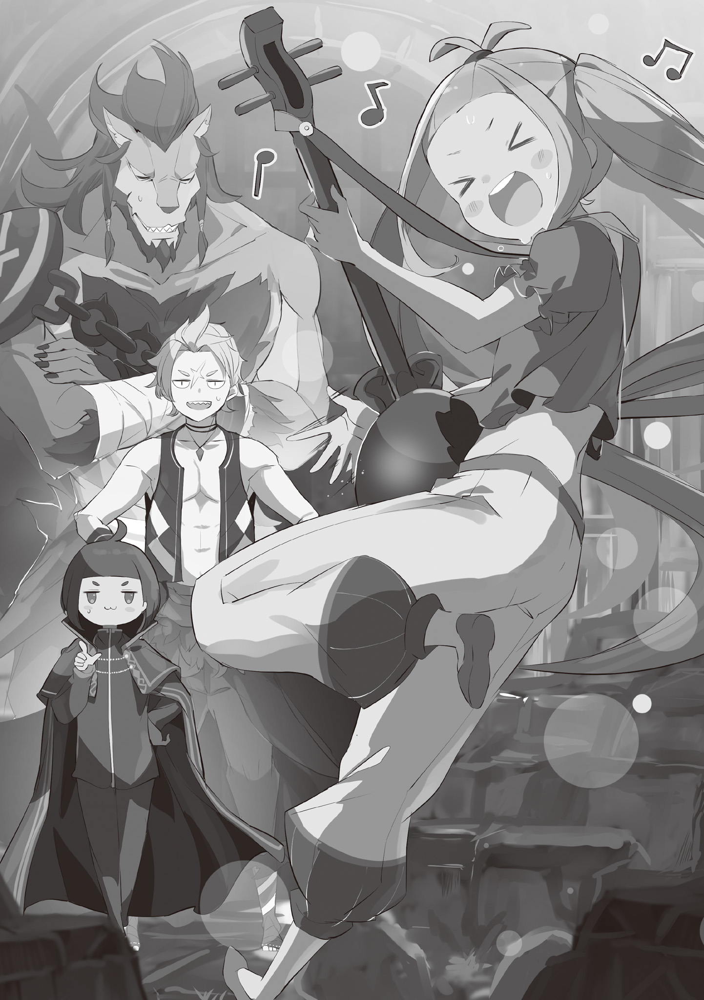
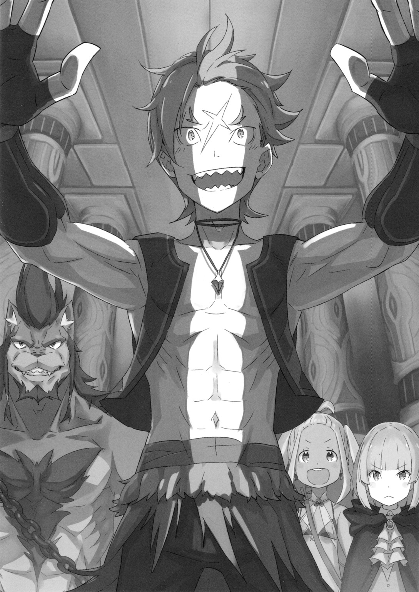

…Это была одна из самых неожиданных просьб, с которыми к нему обращались.

Гарфиэль: «Ты хочешь, чтобы Крутой я помог?»

???: «Да! Всё верно! Герой Империи Волакия, «Восьмирукий» Курган, был успешно побеждён вами! Отважный человек, который до сих пор посвящает всего себя восстановлению города! Давайте встретим Гарфиэля Тинзеля-сама, несущего золотой ветер новой эры, что возвещает рассвет новой эпохи! Аплодисменты!»

Затем она сложила руки, склонила голову и попросила о помощи в неуклюжей позе. Гарфиэль нахмурился и коснулся пальцами своих острых клыков, обдумывая это предложение…

Прошло десять дней с тех пор, как сражение за город Водных Врат Пристелла, подошло к концу, и Нацуки Субару с группой отправились на Дальний Восток.

Гарфиэль, который остался в Пристелле, помогал с восстановлением и оттачивал свои навыки, чтобы защитить мир и покой в городе.

Даже сейчас многие жители Пристеллы нуждаются в защите, в том числе и Отто. Если бы они последовали за беспокойным Субару, не было никакой гарантии, что культ Ведьмы не вернётся, чтобы завершить начатое.

В этом смысле Гарфиэль, внося большой вклад в тяжёлую работу по восстановлению города, оставался бдителен в тени, чтобы предотвратить возвращение смертоносного зла, которое могло снова обратить свои ядовитые клыки на ослабший город.

Тем не менее, вопреки решимости Гарфиэля, большинство беспорядков, которые произошли в городе, были незначительными и могли быть урегулированы путём обсуждения среди горожан. Не на что было жаловаться. Если ничего не происходит, это к лучшему, по крайней мере, так считал сам Гарфиэль.

Но с другой стороны, если бы с Пристеллой ничего не случилось, Гарфиэль хотел бы сопровождать Субару и остальных, которые отправились в опасное путешествие… Определённо была часть Гарфиэля, которая хотела последовать за своим Капитаном. Пока Гарфиэль боролся с муками своей ситуации и своей собственной ролью в ней…

???: «…Гарфиэль-сама».

И той, что вопросительно посмотрела на Гарфиэля, склонив голову и сложив руки была…

Лилиана, «Дива» Пристеллы, которая обратилась к Гарфиэлю с просьбой. Носительница своего любимого инструмента, люлиры, и ободряющая жителей города своим прекрасным голосом, Лилиана очень занята и нужна по всему городу совсем не так, как Гарфиэль.

Примечание: Музыкальный инструмент Лилианы называется «リュリーレ». リュ — Лю, リー — ли:, レ- ра. Это вымышленный инструмент и я решил перевести его буквально, то есть как «Люлиру».

Какими бы мрачными ни были лица людей, когда они слышат её песни, улыбки не покидали их лиц весь последующий день. Гарфиэль был крайне впечатлён её исполнением и её твёрдым голосом, и он не мог не слушать её песни и баллады.

Однако, когда она не пела, он всё ещё был встревожен тем, как неловко Лилиана ведёт себя. В любом случае, то, с чем Лилиана обратилась к нему, было очень кстати для Гарфиэля, который искал свою роль в этом городе.

Итак…

Лилиана: «Останки Ведьмы. Для их же сохранности, они хранятся под городом. Пожалуйста, пожалуйста, пожалуйста, помогите нам, Гарфиэль-сама! Если бы вы могли одолжить нам свою силу, это было бы огромной помощью!»

Лилиана просит о помощи с сдержанным отношением, и Гарфиэль размышляет над её словами.

«Останки Ведьмы», как говорят, являются останками настоящей «Ведьмы», которая умерла в этом городе сотни лет назад. Считалось, что даже существование останков было мифом, но одной из целей культа Ведьмы при осаждении этого города были заявлены «Останки Ведьмы».

К счастью, Останки Ведьмы не были украдены, но их существование и тот факт, что на них велась охота, стали ясны. Это основа города Водных Врат, и если её отнять, городу будет грозить полное разрушение.

Гарфиэль: «Хм-м, я понимаю, почему вы хотите сделать эту экспедицию как можно более безопасным для всех. “Коленная чашечка Абираби” важна для всего, знаете ли».

Лилиана: «Всё верно! Вот почему я прибыла, чтобы попросить вас о помощи напрямую от имени Киритаки-сана, который не смог придти лично из-за трудностей по определению новых членов Совета Десяти».

Лилиана сильно прикусила язык перед Гарфиэлем, который убеждён в цели просьбы. Пока Дива корчилась от боли, Гарфиэль вывернул шею и сказал: «Но всё ли в порядке?».

Гарфиэль: «Останки Ведьмы — самое важное сокровище этого города. Крутой я — является для вас незнакомцем, неужели вы доверите мне обращение с таким важным сокровищем вашего города?»

Лилиана: «Ха! Тогда не о чем беспокоиться. Гарфиэль-сама и другие кандидаты на престол сделали всё возможное, чтобы защитить Пристеллу, и было бы глупо сомневаться в них сейчас. Да и если вы попытаетесь украсть останки и сбежать со своей семьёй, вам это не удастся, ведь город сразу же падёт!».

Гарфиэль: «Ну, похоже в твоих словах нету подвоха».

Ответ Лилианы и идея Киритаки поручить ей это оказались верны. Тогда ответ Гарфиэля был очевиден.

Гарфиэль: «Хорошо. Помимо посещения Отто-бро и уборки всякого мусора, я почти ничего не делал. Я согласен».

Лилиана: «О! Вот о чем я и говорю! Хороший ответ! Большое спасибо!».

Гарфиэль: «Так что именно ты хочешь, чтобы я сделал?».

Лилиана: «Э-э-э-э-э-э. Это…».

Услышав похвалу Лилианы, Гарфиэль щёлкнул клыками и задал ей интересующий его вопрос. В ответ Лилиана надула нос и нежно указала на землю. Затем, перед озадаченным Гарфиэлем, она гордо сказала…

Лилиана: «Под землёй, в глубине каналов, в Великом Храме… именно там мы откроем путь к “Останкам Ведьмы”. Это начало великого приключения!».

Гарфиэль: «…Так значит, это и есть вход в Великий Храм?»

Изумрудные глаза Гарфиэля сузились, когда он посмотрел на железную дверь, встроенную в стену в конце огромной груды обломков. Это был подвал мэрии, который обрушился и полностью потерял свою прежнюю форму.

Пристелла была городом на воде, с водными путями, проходящими через весь город, и вся эта конструкция поддерживалась существованием подземных каналов. Многие из убежищ, которые использовались для эвакуации жителей города во время нападения культа Ведьмы, также были построены во время строительства этих подземных каналов, что указывает на то, что город с самого начала был готов к наводнениям.

Другими словами, двери и проходы, ведущие в глубины этого подземного канала, также существовали с момента основания города…

???: «Согласно литературе, этот город был построен более 400 лет назад…, когда Ведьмы все ещё свирепствовали по всей земле. Однако в то время понимание магии было не таким развитым, как сейчас, и более того, строительные технологии ещё не были так развиты и отточены. И всё же этот проект изумителен».

Гарфиэль: «…».

???: «М-м-м, чего ты скорчил такую мину? Ты не понимаешь красоту концепции дизайна этого города? Если это так, я должен сказать, что разочарован твоим чувством прекрасного».

А затем, позади Гарфиэля, который убирал мусор вокруг двери, раздалось лаконичное, логичное бормотание. Когда он обернулся, чтобы послушать его, бормочущий человек выразительную поднял бровь.

Это была маленькая фигура… «Дворф», он был даже ниже Гарфиэля, хотя самого зверочеловека так же никак нельзя было назвать высоким.

Мужчина с длинными зелёными волосами и в чёрном плаще — один из тех, кто будет сопровождать их в путешествии к Великому Храму — Эццо Каднер.

Изначально он был членом фракции Фельт, одной из кандидаток на королевский трон. Его не было в городе Водных Врат во время недавнего инцидента, но он всё же пришёл на помощь городу, заменив свою госпожу, Фельт, и её рыцаря Райнхарда ван Астрея, которые отправились в столицу, чтобы сопроводить Архиепископа Греха.

Гарфиэль: «Хотя крутой я не уверен насчёт твоих способностей».

Эццо: «…Ты уверен, что не хочешь, чтобы я воспринял это как вызов? Я скажу тебе вот что, я, Эццо Каднер, «Серый», всё время стараюсь вести себя как джентльмен, но я не хочу, чтобы люди думали, что я настолько слаб, что могу улыбнуться в ответ на оскорбление».

Лицо Гарфиэля сморщилось, когда он встретился взглядом с Эццо, чей взгляд источал сильное давление, несмотря на его детские черты лица. Их взгляды пересеклись, и в холодном подземелье, где доминировал звук бегущей воды, нарастало напряжение.

Однако…

???: «…Хватит ссориться. Разве мелюзга не должна держаться вместе?»

Эццо: «Ой!»

Гарфиэль: «Ай!»

Пока они сверлили друг друга тяжёлыми взглядами, массивная рука дала им обоим подзатыльники, от чего оба вскрикнул от боли. Пока они потирали свои затылки пытаясь унять боль, злобная собачья морда позади них распахнула свою огромную пасть и разразилась в хохоте.

Эццо: «Что ты творишь?!»

???: «Разве это не я должен спрашивать, что вы тут творите? Начинаете драку прямо посреди задания! И хватит огрызаться на мелкого, когда он что-то говорит, ты ведь уже не маленький … Ха-ха-ха-ха-ха!».

Эццо: «Кх…! Так ты тоже собираешься оскорблять меня из-за моего роста?!…»

???: «Пощады не будет, верно же говорю? Ты, сенсей, тем более не должен распускать руки. Мы можем добраться до останков, но дальше всё зависит от тебя».

Эццо: «М-м-м…»

Что-то недовольно промычав, Эццо замолчал с хмурым выражением лица. Человек, который мог так свободно подшучивать над Эццо, — Рикардо Велкин, огромный зверочеловек, который смотрел на него сверху вниз.

Рикардо нёс за спиной массивный тесак и беззаботно чесал свою оголённую грудь. Как и Эццо, он тоже сопровождает их в путешествии к Великому Храму в подземных каналах. Конечно, Гарфиэль знал, что может рассчитывать на него при опасной ситуации. Однако была одна вещь, которая вызывала у него беспокойство и вселяла сомнение в это безоговорочное доверие.

Это было…

Гарфиэль: «Прошло не так много времени с тех пор, как ты потерял одну из своих рук. Ты всё ещё можешь сражаться?»

Рикардо: «О, ты беспокоишься обо мне? У тебя правда доброе сердце, не так ли? Ох, так этой добротой ты и соблазнил мою Мими, бро?»

Гарфиэль: «Я никакой не “добрый”, а она мне даже не нравится!!»

Пока Гарфиэль огрызался на шутку, Рикардо расслабленно махнул ему рукой и сказал: «Шучу, шучу». Машущая правая рука… от локтя вниз отсутствовала, и на её место был прикреплён металлический крюк.

Отсутствие правой руки Рикардо было почётной травмой, которую он получил во время недавней битвы с Культом Ведьмы. Однако термин «почётная травма» очевидно не сильно утешает тех, кто был действительно серьёзно ранен или остался недееспособным.

Дело в том, что он потерял руку и больше не мог продолжать жить так, как и раньше. Гарфиэль мог только представить, каким сильным ударом будет потеря конечности для наёмника, чья работа — сражаться, потеря прежних боевых навыков. Гарфиэль очень хотел сопровождать его в путешествии, не зная, чего ожидать.

Рикардо: «Бро, это твоё мышление — не беспокойство, а забота».

Гарфиэль: «Но…».

Рикардо: «Идиот, я не шучу. Я серьёзно. Очень».

Когда Гарфиэль попытался поспорить с ним, Рикардо осмелился заткнуть ему рот крюком правой руки. Тусклый, грубый металл был не менее силён, чем его мощная рука. Другими словами, он утверждал, что может драться.

Гарфиэль: «…».

Гарфиэль замолчал, осознав его намерения. На самом деле, что бы ни говорил Гарфиэль, это было всего лишь стороннее мнение. Если сам Рикардо настаивает на том, что может драться, не заботясь о потере руки, это всё, что имеет значение. Рикардо был наёмником долгое время, и он знает, на что способен.

Эццо: «…Меня не было в городе во время недавней битвы. Так что в этот раз я буду подчиняться вам обоим».

Затем Эццо, который слышал только что состоявшийся разговор, спокойно кивнул ему. Видя его отношение, улыбка Рикардо стала шире, и он сказал: «Пожалуйста, сенсей».

Эццо: «Я не привык, когда меня называют «сенсей», но, думаю, к этому можно привыкнуть. Но, что важнее, раз уж ты так беспокоишься о руке Рикардо-доно, разве у тебя нет и другой проблемы, о которой стоит беспокоиться?».

Рикардо: «Ах, ну да. Это действительно большая проблема».

Сказав это Эццо и Рикардо скрестили свои тонкие и массивные руки соответственно. Под их взглядами Гарфиэль со вздохом обратил свой взор на груду обломков, которую они только что разгребли. На обломках сидела девушка, энергично играющая со струнами своей Люлиры.

Лилиана: «Я полна энергии! Я чувствую, как во мне трепещут воображение и творчество. У меня такое чувство, что впереди меня ждёт таинственное, особенное, пахнущее деньгами приключение! Послушайте меня… Жди меня, Великий Храм!».

Гарфиэль: «Да заткнись ты уже, черт возьми».

Лилиана: «А?».

Лилиана уже собиралась начать играть на своей Люлюре, когда Гарфиэль подошёл к ней и щёлкнул её по лбу пальцем. Лилиана отпрянула от удара и в знак протеста повернула к Гарфиэлю свои заплаканные глаза.

Лилиана: «Что, что, что, что ты делаешь?! Внезапное насилие! Это жестоко!».

Гарфиэль: «Ты совсем не изменилась, не так ли? Ты же не собираешься идти за мной… а, Дива-сан?».

Лилиана: «Эй! Конечно же собираюсь! Это ведь Великий храм, что расположен под городом! Его важность, легенды связанные с ним, а также ожидания и поджидающие нас опасности… у меня просто нету другого выбора!».

Ловко размахивая руками, головой и ногами из стороны в сторону, Лилиана умоляла о сопровождении. Гарфиэль посмотрел на двоих позади себя в поисках помощи с её поведением, но Рикардо и Эццо лишь беспомощно пожали плечами. Понимая, что он остался один, Гарфиэль тяжело вздохнул.

Гарфиэль: «Значит… Крутой я, Рикардо, маг-малявка и Дива…, это та группа, которая собирается отправиться в «Великий Храм», верно?».

Рикардо: «Да уж, надо признать, довольно пёстрая компашка собралась тут…».

Эццо: «Но Гарфиэль-доно и Рикардо-доно в авангарде, я прикрывая тыл магией, а мисс Лилиана… Лилиана будет, ну, летописцем? Если подумать, то боевой потенциал у нас неплохой».

Лилиана: «Да, предоставьте это мне! Я своими глазами, ушами, носом, всем своим существом впитаю ваши подвиги и передам их потомкам в виде песни, которая будет передаваться из поколения в поколение!»

Лилиана с силой ударила себя в грудь и нелепо закашлялась. Её энтузиазм заставил Гарфиэля с лёгким волнением погладить свои клыки. Честно говоря, он испытывал некоторое беспокойство по поводу того, что берёт с собой в неизвестные подземелья человека, не способного адаптироваться к неожиданным ситуациям. Однако, если учесть, что Лилиана — представительница города, и что то, что их ждёт впереди, может оказаться важнейшей тайной Пристеллы, то её присутствие было вполне естественно.

Кроме того, обещание Лилианы воспеть их подвиги в песне оказалось слишком заманчивым для Гарфиэля, обожавшего героические саги и исторические романы.

Рикардо: «Ну, тебе не нужно так сильно об этом беспокоиться. Как ни крути, это катакомбы под обычным городом, где живёт много людей. Это не какой-то тайный оплот злодеев в горной глуши, так что вряд ли там есть что-то действительно опасное».

Эццо: «Согласен. К тому же, скорее всего, работать предстоит только мне. «Останки Ведьмы»… Если они действительно существуют, то они должны быть невероятно мощным катализатором с огромной ценностью. Учитывая возможное влияние на качество воды и геологию города, это очень интересная работа».

Рикардо и Эццо тоже высказали своё мнение по поводу сложившейся ситуации. Судя по всему, они не собираются прогонять Лилиану обратно, и Гарфиэль, наконец, принял решение.

Гарфиэль: «Ладно, пошли! Капитан и остальные сейчас вовсю стараются. Мы тоже должны постараться, чтобы когда Капитан с остальными вернулся он не смеялся над нами».

Лилиана: «Да! Вот это настрой! Ну что ж, вперёд!».

Лилиана дала команду, и Гарфиэль распахнул тяжёлую железную дверь. Дверь открылась с громким скрипом, и перед ними появился проход, ведущий к «Великому Храму».

И в тот же миг, когда в проход ворвался поток затхлого воздуха, раздался глупый вопль…

Гарфиэль: «А…?».

…после чего все четверо, потеряв равновесие, полетели вниз, в разверзнувшуюся под ногами кромешную тьму.

《Конец》
