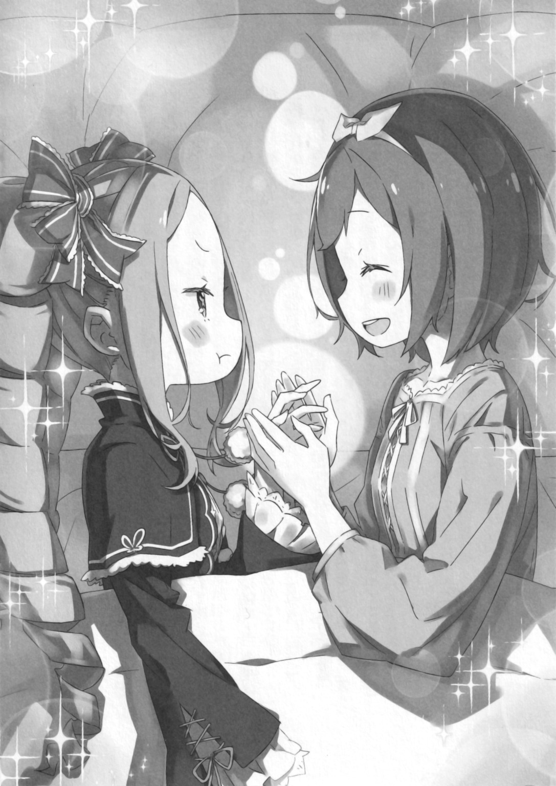

«Беатрис-чан, не могла бы ты рассказать мне обо всём, что произошло в Пристелле?»

И вот, приготовив чай и сладости в своей личной комнате, она решила разузнать обо всем у Беатрис.

«Итак, дело действительно дошло до этого» — сказав это, Беатрис скорчила гримасу.

Перед перекошенным лицом Беатрис с серьёзным видом сидела Петра, держа в руках чашку чая.

Это её личная комната в особняке, куда сегодня вечером Беатрис была приглашена с целью провести там ночь. Обычно ночью она чаще всего спит вместе с Субару, однако иногда, когда Петра или Эмилия приглашают её, она меняет комнату, в которой спит.

На этот раз Беатрис вернулась в поместье Розвааля на месяц, и поэтому она не смогла найти веской причины отклонить несколько бесцеремонное приглашение Петры.

«Беатрис-чан?»

"…Неважно. С твоей стороны это было довольно поспешно, я полагаю.”

"Я имею в виду, мы не виделись целый месяц. Я считаю своё поведение абсолютно нормальным.”

Раздражённо отвернувшись, Петра подносит к губам свой чай. Видя милую ревность молодой девушки, маленькие губки Беатрис расплываются в улыбке, и она тоже подносит к губам чашку с чаем.

Она облизывает язык и замечает, какой у него изысканный вкус. Её навыки снова улучшились.

"На самом деле, я считаю это прекрасным, что ты так сильно изменилась всего за месяц.”

Беатрис была тронута таким милым ворчанием.

Один-единственный месяц из всего того времени, что прожила Беатрис, был ничтожно мал. Для Беатрис, которая большую часть этого времени провела в расточительном бездействии, рост как личности был замечательным. Она чувствовала это особенно хорошо находясь в непосредственной близости от Субару и настойчивой Петры.

“Что ж, Петра, я, пожалуй, отблагодарю тебя за то, что ты заварила такой вкусный чай. И что же дальше? Что, собственно, ты хотела услышать, я полагаю?”

“Хорошо! Тогда расскажи мне о Пристелле. С самого начала и о том, что произошло потом. Я слышал, что Отто-сану и Гарф-сану пришлось нелегко, но……"

«Я понимаю, я полагаю. Субару, на самом деле, очень часто пытается скрыть свои собственные проблемы и тревоги, я полагаю.»

Догадавшись об источнике беспокойства Петры, Беатрис согласилась с ней.

После беспорядков в Пристелле Беатрис и остальные собирались отправиться в дюны Аугрии на самой восточной окраине Лугуники, чтобы отыскать «Мудреца», который мог обладать знаниями для решения их проблем. По пути в поместье Розвааля, они послали им письмо, в котором не были указаны подробности о Пристелле.

Конечно, Субару не был бы настолько глуп и честен, чтобы самому написать обо всём, что произошло, и обеспокоить Петру и остальных. Но именно потому, что она знала об этом, она волновалась..

Невысказанное и неуслышанное остаётся неизвестным. И если Субару захочет скрыть что то, не важно, какие абсурдные, невозможные, безрассудные поступки он совершит, Беатрис об этом не узнает. Вот почему она дорожит Субару, он должен знать, насколько он важен для людей, которыми дорожит.

Поскольку Беатрис понимает это чувство, она безжалостно рассказала все о событиях в Пристелле. Что случилось с Субару, как много он сделал ради этого города и как он перенапрягся.

И, слушая эти истории, Петра, которая то бледнела, то краснела, переходя от радости к печали, в конце концов сказала вот что.

«Хорошо. А что потом случилось с Беатрис-чан?»

“……с Бетти?”

“Да. Я имею в виду, я знаю, что Субару пришлось нелегко, но… Если Беатрис-чан не была с ним некоторое время, ему следовало приложить больше усилий, чтобы вновь воссоединиться с ней, верно? Но даже тогда Беатрис-чан так и не появилась, мне просто интересно, что случилось?”

(Эти слова Петры были настоящим ребусом на англ и либо я идиот, либо вичкульт насрал)

«Э-это……»

«Ммм, это?»

Услышав свой же дрогнувший голос в самом конце своей хорошо рассказанной истории, Беатрис потеряла дар речи. Тем временем широко раскрытые глаза Петры остановились на Беатрис, не давая ей уйти от вопроса, который она только что задала.

Вопрос Петры был грубым напоминанием Беатрис о её собственной трусости, над которой она размышляла.

На самом деле Беатрис считала, что её собственная работа в Пристелле стоит 0 баллов. Она не смогла быть рядом со своим партнёром Субару в критический момент, когда Эмилия, Отто и семья Гарфиэля и он сам тоже оказались в опасности. Так что, было само собой разумеющимся, что Петра будет критиковать её за это, и, хотя она смирилась с этим, она всё ещё больше всего злилась на себя саму.

"Да ладно! Дело не в этом! Я злюсь не на то, что сделала Беатрис-чан, а на Субару, который заставил Беатрис-чан совершить этот абсурд даже после того, как вы снова воссоединились!”

Услышав упрёк от покрасневшей Петры, Беатрис удивлённо заморгала круглыми глазами. Затем Петра глубоко вздохнула, глядя на Беатрис, которая сделала такое лицо, будто не поняла, что ей только что сказали.

"Знаешь, Беатрис-чан……Использовала много магии и надолго заснула…… Сражалась с по-настоящему опасным человеком вместе с Отто-саном…… Из-за этого пришлось нелегко не только Субару, но и Беатрис Чан…… Я так же волнуюсь за тебя.”

«Волнуешься… Ты имеешь в виду за Бетти, я полагаю?»

"Именно это я и сказала! Беатрис-чан, у тебя нет самосознания!”

Услышав нечто неожиданное, Беатрис указала на себя, а Петра возмутилась. Она тряхнула своими каштановыми волосами, надула щеки и впилась взглядом в Беатрис.

"В последнее время Беатрис-чан похожа на Субару. Я понимаю, что ты хочешь подражать ему, ведь ты всегда с ним, но подражать Субару опасно! Ты ведь это знаешь, правда?”

«Этот удар был нанесён с совершенно неожиданной стороны, на самом деле……»

Беатрис намеревалась посочувствовать ей в отношении вредных привычек Субару, но она была в ужасе от того, что Петра переключила своё беспокойство на неё саму. И в то же время, по правде говоря, она считала постыдным, что беспокойство Петры было направлено на неё. Но, помимо этого- "Петра……Бетти беспокоится, что если ты будешь продолжать беспокоиться обо всем, что тебя окружает, то, наверное, будешь слишком взволнованной, чтобы нормально выспаться.”

"Тогда перестань заставлять меня волноваться! Боже! Давай, иди сюда! Давай спать вместе! Не отходи от меня ни на шаг сегодня вечером!”

«Хорошо… я полагаю…»

Страсть Петры вышла наружу, и Беатрис сделала так, как ей было велено, хотя и была в подавленном настроении. Они допили чай, съели закуски и, закончив чистить зубы, отправились в постель вместе.

Завернувшись в простыню, Петра держала за руку Беатрис, которая лежала на боку. Взглянув на неё, она застенчиво хмыкнула.

"Рука Беатрис-чан, она такая маленькая и милая.”

“……Ладно, тогда, не стоит слишком зацикливаться на себе только потому, что ты немного выросла за этот месяц, я полагаю. Если ты и дальше будешь меня так дразнить, то я больше не буду с тобой спать.”

“Ах, не говори так. Но я ничего не могу поделать с тем фактом, что я расту. Я тоже вырасту большой и красивой, как старшая сестрёнка Фредерика и старшая сестрёнка Эмилия.”

Произнесла сонная Петра, понизив громкость своего голоса. Тот факт, что она не включила Рам в своё видение будущего, Беатрис не упомянула, так же как и о множестве причин, которые могли бы быть тому причиной.

В любом случае…

“Боже, Петра, ты такая беспокойная, я полагаю.”

“Я думаю, в Беатрис-чан тоже есть эта черта.”

И вот, обменявшись улыбками в одной постели, девушки погрузились в сон.

“--------”

Ночью Беатрис, вспомнив о сухости в горле, тихо сползает с кровати и выходит из комнаты.

В тёмных коридорах особняка Беатрис прикасается к своему бледному горлу, ступая по ковру, и даже ей самой кажется странным, что она помнит, что такое сухость в горле.

Беатрис — это дух, который не нуждается ни в пище, ни в воде. Конечно, дело не в том, что она не могла переварить то, что поглощала, а затем сохранить это в виде маны, но это было ужасно неэффективно, и по сравнению с маной, которую она получала от своего подрядчика, это действительно было не более чем незначительное количество.

Вот почему, когда она вспоминает о сухости в горле, это является не более чем просто привычка, которую она приобрела со временем.

Она жила в этом особняке с Субару и остальными, продолжала жить, ела различные блюда и пила чай, как будто это было естественно. Она вела себя как обычный человек, и это вошло у неё в привычку.

«О боже, это Беатрис-сама?»

Всё ещё цепляющуюся за это ощущение Беатрис, вошедшую на кухню, окликнул чей-то голос. Брови Беатрис удивлённо поползли вверх при виде этого неожиданного ночного посетителя.

В глубине опрятной, ухоженной кухни, та, кто обернулась, была горничной с длинными светлыми волосами, Фредерикой. На ней не было обычной одежды служанки, она стояла в ночной рубашке, обтягивавшей её изящную фигуру.

"Фредерика……На самом деле, нехорошо вставать так поздно. Ты замедлишь свой рост, я полагаю.”

«Вам не стоит беспокоиться на этот счёт. В моем случае, я сама не хочу больше расти…… Скорее, я даже думаю, что хотела бы немного уменьшиться, ведь есть разные люди……»

“---?”

Глядя на Беатрис, которая все ещё размышляла о разговоре, состоявшемся у неё с Петрой несколько минут назад, Фредерика вопросительно наклонила голову. Поэтому она ответила: «Неважно, я полагаю».

"У Бетти пересохло в горле, на самом деле. Я, пожалуй, пойду и выпью стакан воды.”

«А……. В таком случае, не хотите ли составить мне компанию, Беатрис-сама?»

Сказав это, Фредерика указала на кастрюлю, стоящую на кухонном очаге. Из кипящего содержимого кастрюли доносилось бульканье, от которого вокруг распространялся слегка тёплый и сладковатый аромат.

"Что это?”

«Это варёная клубника, которую добавляют в чай, и получается очень сладкий напиток. Этому я научилась у Субару-сама. Это называется »Ягодный Чай"

«Ха, Субару не перестаёт удивлять, на самом деле.»

На глазах у Беатрис, которая была впечатлена, Фредерика быстро приготовила чай для них обоих. Она медленно опустила в чай ложку варёных ягод клубники.

(На английском “Styroberry”, в целом это просто какая-то ягода из нашего мира с просто другим названием, но за счёт приколов английского, где все ягоды заканчиваются на “Berry” непонятно, какая именно это ягода. Я решил перевести как клубнику из-за наибольшей схожести с “strawberry”)

“Вот, попробуйте, Беатрис-сама. Он довольно сладкий и вкусный.”

“Раз уж ты зашла так далеко, я, пожалуй, попробую немного. Но все же……”

“--?”

«Я слышала от Петры, я полагаю. Что Фредерика иногда тайком ела сладости……. Я немного удивлена, что сразу же наткнулась на подтверждение её слов.»

"Б-Беатрис-сама……”

Щеки Фредерики покраснели, и она смутилась от того, на что указала Беатрис. Её щеки расслабились при этом ответе, и Беатрис одними губами произнесла: «Ягодный Чай». Джем растворился у неё на языке, и она рассеянно посмотрела на него.

"Конечно, это вкусно, я полагаю…… как и ожидалось от идеи Субару, на самом деле.”

“Да, действительно. Субару действительно довольно хорошо осведомлен, я тоже была несказанно удивлена……тем не менее, я стараюсь быть осторожной и не делать чай слишком сладким.”

Точно так же Фредерика, поднося ко рту чашку с чаем, прошептала, соглашаясь с Беатрис. Это несколько искреннее удивление заставило Беатрис сузить глаза.

Фредерика сжала чашку тонкими пальцами. Когда она была без одежды служанки, её обычный вид умелой, грациозной служанки был смягчён, она выглядела немного неуверенной и охваченной беспокойством.

"Я слышала, что случилось с Гарфом и Отто-сама. События в городе Водных Врат, я могу только представить, какими же ужасными они, должно быть, были.”

«Представь, я полагаю.»

«Эмилия-сама и Субару-сама должно быть были в огромной опасности »

Понизив голос, Фредерика встретилась взглядом с Беатрис. Её прекрасные зелёные глаза были точь-в-точь как глаза её брата Гарфиэля. И вот, когда на Беатрис посмотрели те же глаза, что были и у Гарфиэля, она искренне высказала свои чувства.

Беатрис была слаба перед этими глазами. Эти искренние глаза заставляли натуру Беатрис содрогаться. То, что следующие слова Фредерики соответствуют этому искреннему взгляду, Беатрис даже не сомневалась.

«Гарф несомненно крепок как замок, а его сила не поддаётся сомнению. В то время как к проницательности Отто нельзя было относиться как к проницательности обычного человека. Вот почему они оба получили такие серьёзные травмы, что были вынуждены остаться в Пристелле, что свидетельствует о том, насколько это всё было важно.»

«……Ну, на самом деле Бетти согласна, я полагаю.»

"Уладив дела в Пристелле, вы сразу же бросаетесь решать следующий вопрос без перерыва…… Более того, ваша следующая цель — загадочная и опасная земля, дюны Аугрии. — Ваши трудности довольно легко предвидеть.”

“-------”

«Вот почему, Беатрис-сама. Я ещё раз прошу вас позаботиться об этих двоих.»

Говоря это, Фредерика низко опустила голову. Закрыв глаза во время поклона, Беатрис сладко и тепло вздохнула.

Опасения Фредерики, вероятно, перекликались с чувствами жителей особняка, более того, с чувствами всех жителей Пристеллы. Субару и Эмилия, а также Анастасия и Юлиус, которые их сопровождают. Храбрость, с которой они преодолели жестокую схватку в городе Водных Врат, а затем сразу же перешли к следующему испытанию, была не только надёжной, но и ужасно опасной. Кто-то должен следить за этим.

В этом отношении Беатрис действительно должна проявить мудрость, которая приходит с возрастом.

«И ещё, госпожа Беатрис, пожалуйста, берегите себя»

«Себя…»

Когда она уже решилась это сделать, это лишнее предложение застало её врасплох.

Беатрис, которая, глубоко вздохнув, помешивала чай, разволновалась и перевела взгляд на Фредерику. И она встретилась взглядом с этими безмятежными зелёными глазами. Она почувствовала слабость при виде этих глаз. Все было так, как она и сказала.

«Т-ты……… это трусость, я полагаю.»

«Значит. Я беспокоюсь за Беатрис-сама, а вы называете меня трусливой…»

«Это, это что я имела в виду, на самом деле!.…… я не это имела в виду…»

Её слова о сопротивлении потеряли всю свою силу, и Фредерика выгнула шею от бессилия Беатрис. Просто это её отношение огорчало Беатрис. Именно к этим прямым честным глазам она испытывала слабость.

“Не делай такие же глаза, как у Рюдзу, я полагаю……”

Давным-давно жила-была молодая девушка, которая смотрела на Беатрис такими же серьёзными глазами и обратилась к ней с откровенной просьбой. Это было обращено к Беатрис как напоминание о том, что она, к сожалению, не сможет отплатить за то, что сделал для неё, её первый, и незабываемый друг. Вот почему Беатрис не смогла отклонить эту просьбу.

И, кроме того, разве Фредерика не была обеспокоена тем же, что и Петра?

«……В таком случае, вы относитесь к тому же типу людей, которые считают, что Бетти в опасности.»

«Нет, вовсе нет. Просто, я полагаю, что вы подвергнетесь опасности из-за Субару-сама, и если Эмилия-сама тоже будет в этом участвовать, это не будет большим облегчением, вот и всё.»

«Это то же самое, я полагаю!»

Услышав возражение Беатрис, Фредерика прикрыла рот рукой и изящно рассмеялась. Отвернувшись от своей улыбки, Беатрис поднесла к губам чашку со сладким чаем и утолила жажду.

Насытившись, она размышляет над словами Петры и Фредерики и сладко вздыхает

«…Боже, все такие надоедливые, я полагаю!»

Субару, Эмилия и сама Беатрис тоже, слишком много людей, за которыми ей приходится присматривать.

《Конец》
