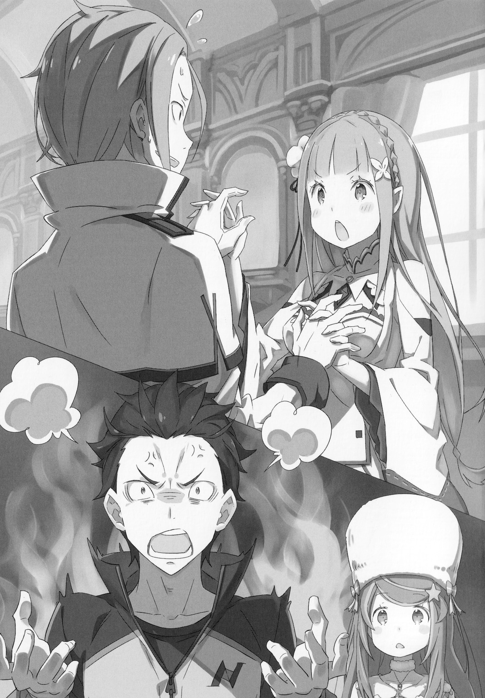
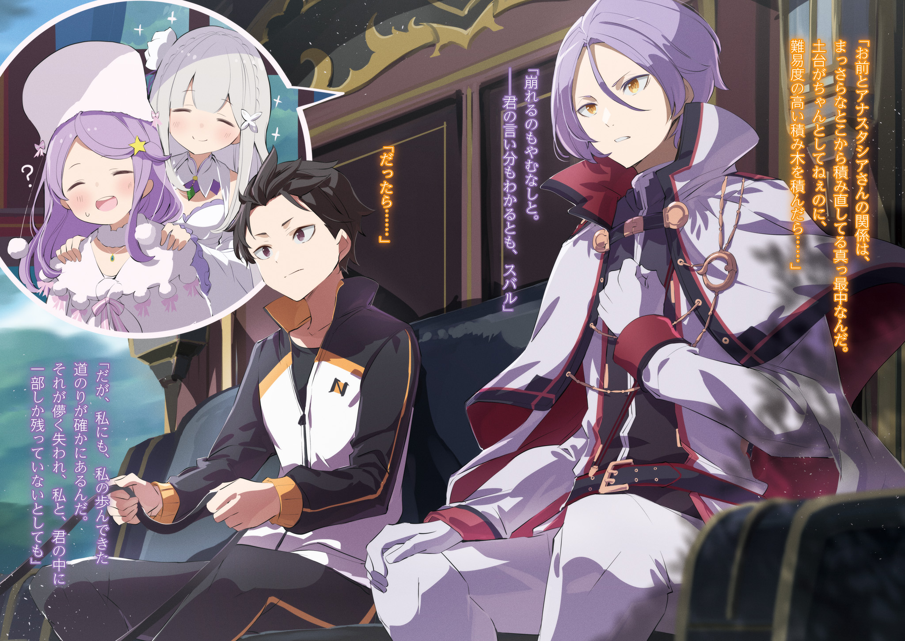

…После окончания битвы в Городе Водных Врат — Пристелла.

Прошло несколько дней с момента их ухода из Города Водных Врат.

Нацуки Субару и его спутники, управляющие драконьей повозкой, направляются к песчаным дюнам Аугрии, которые расположены на самой восточной окраине королевства Лугуника. Их цель — позаимствовать мудрость и знания у «Мудреца».

Поскольку последствия ожесточённой битвы все ещё не решены, путешествие будет, соответственно, долгим. Конечно, на пути могут возникнуть различные проблемы, но на данный момент самая насущная из них — эта.

А именно…

Юлиус: […Анастасия-сама, пожалуйста, пройдите сюда. Там есть ступеньки.]

Анастасия: […Хм, спасибо. Кажется я спасена.]

Юлиус: […Анастасия-сама, вы не устали? Я сейчас приготовлю чай.]

Анастасия: [Ах, правда? Я просто умираю от жажды. Как учтиво.]

Юлиус: […Анастасия-сама, здесь немного ветрено, пожалуйста, идите за мной.]

Анастасия: [Ах, ты действительно внимателен ко мне, мне правда жаль, что я так беспокою тебя.]

Отовсюду видны фигуры Анастасии и Юлиуса, которые постоянно разговаривают, независимо от того, что они делают. Субару прищурил свои карие глаза и уставился на них со сложным выражением лица.

Судя по текущей ситуации, общение между госпожой и слугой проходит очень гладко, и особых проблем нет. Хотя они и не были откровенны, в их разговоре переплетались различные идеи.

Эмилия: [Анастасия-сан и Юлиус-сан уже очень близки. Это радует.]

Сказав это, Эмилия посмотрела на них вместе с Субару и улыбнулась. Конечно, причина, по которой у неё была такая реакция, заключалась в том, что ей не были раскрыты некоторые сложные обстоятельства. Однако, даже если бы ей сказали правду, она отреагировала бы точно так же.

Субару: [Хм, если задуматься, то это очень странно… Спасибо, что ты появилась на свет.]

Эмилия: [Хм? Субару, ты только что что-то сказал?]

Субару: [Нет, я просто очень благодарен за то, что человек, известный как Эмилия-тан, существует, дышит здесь и зовёт меня по имени. Я действительно рад.]

Эмилия: [Извини, я не совсем понимаю, что ты пытаешься сказать.]

Хотя она невольно нахмурилась, это были искренние слова Субару. В любом случае, лучше не вспоминать о многочисленных попытках Субару флиртовать с ней каждый день. Но возвращаясь к изначальной теме, с точки зрения Субару, диалог между Анастасией и Юлиусом был действительно довольно тревожным.

И как будто она читает мысли Субару…

Анастасия: […]

На мгновение глаза Анастасии встретились с глазами Субару, и она нежно помахала ему рукой. Увидев этот жест, Субару вздёрнул подбородок, кашлянул и сказал…

Субару: [Эмилия-тан, хоть это и немного неожиданно, но ты не могла бы поговорить с Юлиусом?]

Эмилия: [Да? Я могу, но зачем мне это делать?]

Субару: [Ты не замечала? Разве этот парень не часто хмурится и его лицо не становится жёстким в такие моменты? Если так будет продолжаться и дальше, рано или поздно у него появятся постоянные и крайне заметные морщины, поэтому я хочу, чтобы моя Эмилия-тан убрала их своими руками.]

Эмилия: [У Юлиуса так много морщин между бровями…? Что ж, я понимаю. Если у кого-то на лице постоянно появляются морщины, это действительно может доставить ему проблем. Я буду стараться изо всех сил.]

Выслушав просьбу Субару, Эмилия с энергичным выражением лица направилась к Юлиусу. Субару посмотрел на её надёжную спину и подмигнул Анастасии.

Оттащив её от Эмилии и Юлиуса…

Анастасия: [Нацуки-кун… Юлиус слишком внимательный человек.]

Прежнее мягкое выражение лица Анастасии и приятный акцент Карараги исчезли, а затем она тихо пожаловалась с серьёзным выражением лица.

Если бы это была обычная Анастасия, у неё никогда не было бы такого акцента и манер. Это само собой разумеющееся, потому что она одновременно и Анастасия, и не Анастасия вовсе. Строго говоря, хотя физическое тело принадлежит Анастасии, внутри него обитает другое существо.

Это самое существо зовут «Ехидна». Так же зовут злую ведьму, известную Субару, но само существо отрицает, что у неё злой характер, и утверждает, что она добросердечный и добропорядочный Искусственный Дух.

Этот дух занял тело Анастасии и действовал как своего рода сообщник Субару. В основном их как раз таки и связывает то, что они делят этот секрет.

Анастасия: [Но негативные последствия этой ситуации с заменой Анны так быстро сказались на мне…]

Субару: [Ты говоришь так, как будто это касается кого-то другого. Эта ситуация не лучшая для тебя. А чтобы избежать ненужной путаницы и подозрений, мы с тобой установили некоторые тайные отношения.]

Анастасия: [Эта формулировка не кажется тебе слишком странной? Она звучит слишком подозрительно.]

Субару: [О, извини, я буду осторожней.]

Анастасия понизила голос, возвращаясь к своей первоначальной манере речи. Однако поведение Ехидны всегда действует Субару на нервы. Если её желание заставить Субару поверить, что она не имеет ничего общего с этим дьяволом, сбудется, то только тогда его отношение к ней изменится.

Анастасия: [Даже если ты так говоришь, я в любом случае ничего не знаю о моём создателе, о котором ты говоришь. Если мы действительно будем похожи, то сам фундамент моей индивидуальности пошатнётся.]

Субару: [Хотя твои слова преувеличены, твой фундамент идентичности действительно шаток. Неужели ты не можешь вести себя с Юлиусом более естественно? На это буквально больно смотреть.]

Анастасия: [Разве это не невозможно? Я также пытаюсь вспомнить всё, что могу, об Анне, уделяя особое внимание её манерам и поведению… Но я все ещё не знаю, как мне вести себя с Юлиусом.]

Глядя на Ехидну, которая подняла голову, чтобы возразить, Субару почесал затылок.

Действительно, как она и сказала, нынешняя ситуация очень сложная. Под влиянием Полномочия «Обжорства», одного из Архиепископов Греха Культа Ведьмы, «Имя» Юлиуса было стёрто из этого мира. В результате Юлиус, как и Рем, оказался в состоянии всеобщего забвения.

Сейчас единственные, кто может помнить Юлиуса во всем мире, — это, вероятно, сам Юлиус и чужеродное для этого мира существо — Субару. Поэтому Ехидне было трудно решить, как ей следует относиться к Юлиусу.

Субару: [Если бы он знал, что ты находишься в теле Анастасии-сан, я сомневаюсь, что у него хватило бы сил чтобы сдержать себя…]

Анастасия: [Я также хочу избежать ненужных травм тела Анны. Однако я не знаю недостатков Юлиуса. Вот чего я жду от тебя.]

Субару: […Тебе ведь правда это не нравится ?]

Анастасия: [Конечно, нет?! Я серьёзно, очень серьёзно, очень-очень-очень серьёзно. Это действительно проблемно, когда тебя так подозревают.]

Чем больше она спорит, тем более подозрительной она кажется, ведь его собеседник — Ехидна. Так и не получив достойного ответа, Субару громко вздохнул.

Субару: [Я знаю, я знаю. Прежде всего, я внимательно рассмотрю вопрос между тобой и Юлиусом. В любом случае, я расскажу это Юлиусу через некоторое время…]

Анастасия: [Прости. Но я могу положиться только на тебя.]

Субару: [Ты на самом деле Ехидна, а не “Ехидна”, верно?]

Анастасия: [Твоё презрение к моему создателю действительно поражает!]

Сдерживая свои сомнения до предела, Ехидна повысила голос. Субару считает, что такой эмоциональный отклик очень маловероятен для Ведьмы, которая не понимает человеческое сердце, поэтому он может пока развеять свои сомнения, но лишь пока.

Затем, под гнётом пристального взгляда Ехидны и её ожиданий, Субару повернулся к проблемному Юлиусу и подозвал его к себе.

Субару: [Эй, Юлиус, я должен кое-что тебе сказать…]

Юлиус: [Хм? Субару? Не мог бы ты сказать Эмилии-сама, чтобы она перестала беспокоиться о моём лице…?]

Юлиус, который сказал это, попросил его о помощи с обеспокоенным выражением лица. Перед ним Эмилия с решительным выражением лица пытается приблизиться к нему. Но он остановил её ухаживания, и они взялись за руки, словно начав танец.

Эмилия: [Пожалуйста, не стесняйся, Юлиус. Я не сделаю ничего плохого! Я просто хочу разгладить морщинки у тебя между бровями!]

Юлиус: [Нет, Эмилия-сама, с какой стати вы вообще хотите сделать нечто подобное?… Эй, Субару, скажи Эмилии-сама, чтобы она прекратила.]

Субару: [Ты! Юлиус, ты ублюдок! Почему ты танцуешь с моей Эмилией-тан?!]

Юлиус: [Я не хочу танцевать, разве твой гнев не беспричинен?]

Услышав обеспокоенные слова Юлиуса, Субару быстро протиснулся между ними. Вместо Юлиуса Субару взял Эмилию за руки.

Субару: [Эмилия-тан, успокойся. Просто оставь Юлиуса мне… Ух ты, какие у тебя маленькие ручки! У тебя такие тонкие пальчики! Такие милые!]

Эмилия: [Ах, да? Но ты сказал, что между бровями Юлиуса…]

Субару: [Ах, это была ошибка. Позаботься об Анастасии-сан вместо меня. Она, кажется, немного устала. Помоги ей расслабить плечи.]

Эмилия: […Это правда нормально? Как бы это сказать… Субару, ты что-то скрываешь?]

Субару: [Я так легко разоблачён!? На самом деле я скрывал что… я очень люблю Эмилия-тан?…]

Эмилия: [Это… я знаю. Я это хорошо знаю… Субару действительно дурачок.]

Лицо Эмилии слегка покраснело, она отвернулась и поспешно ушла. Она, вероятно, побежит к Ехидне. Доверив Ехидну ей, Субару вздохнул с облегчением.

Субару: [Фуух, я можно сказать пропустил этот раунд, просто введя её в заблуждение…]

Юлиус: [Ты действительно сделал всё, что мог. И, хотя я хорошо знаю тебя, думать, что ты можешь признать что-то так легко…]

Субару: [В чем дело, это неожиданно? Ты думаешь, я снова не знаю своего места, не так ли?]

Юлиус: [Нет, наоборот, я восхищаюсь этим. Я могу сказать, что это достойно уважения. Ты действительно невероятен.]

Он прокомментировал это с серьёзным выражением лица, и Субару поджал губы, но так ничего и не сказал.

Услышав от него похвалу, он вместо того, чтобы обрадоваться, почувствовал себя очень неуютно. Вероятно, потому, что Юлиус действительно лучше понимает всю значимость того, что он признал что либо, нежели Эмилия.

(Скорее всего этот диалог про признание чего либо отсылается к 3 Арке и упрямости Субару, когда даже после взбучки от Юлиуса и ссоры с Эмилией, он не признал свою неправоту.)

Субару: [Ах, пока забудь о моей любви к Эмилии-тан. Я хочу сказать кое-что ещё.]

Юлиус: [Если сейчас речь идёт об Эмилии-сама, то, похоже, причиной были вы…]

Субару: [Ты раздражаешь, не стоит постоянно замыкаться в прошлом. Самое важное — это настоящее и будущее… Прости, я не это имел в виду.]

Задев его за живое, он извинился за то, что не мог не ляпнуть. В ответ Юлиус нахмурил свои красивые брови и пожал стройными плечами.

Юлиус: [Нет. На самом деле, я думаю, ты прав. Даже если я вспомню прошлое, я не смогу вернуть то, что потерял. Я не могу просто остановиться, чтобы вернуться к тому, чего я хочу.]

Субару: […Ну, если ты относишься к этому так позитивно, я не буду много говорить. Я изо всех сил стараюсь не говорить тебе, но я все равно кое-что заметил.]

Юлиус: [Что именно ты заметил?]

Юлиус прищурил свои жёлтые глаза и попросил Субару заговорить. Только что Субару просто выбрал неправильную формулировку. Он тщательно подбирал следующие слова, пока говорил:

Субару: [Это ощущение отдалённости от Анастасии-сан. Я знаю, что у вас с Анастасией-сан отношения госпожи и слуги, и Анастасия-сан тоже знает эту информацию.]

Юлиус: […Конечно, тебе это тоже показалось неестественным?]

После слов Субару Юлиус взял инициативу в свои руки, как он и предполагал. Услышав этот ответ, Субару нахмурился, но быстро изменил своё мнение.

Таковы отношения между Юлиусом и Анастасией. В данном случае, хотя другой стороной является Ехидна, он не может не заметить тревогу в её сердце. Даже если он окажется в трудной ситуации, Юлиус не изменит того, насколько сильно он заботится о ней.

Субару: [Если ты понимаешь, то мне не нужно было этого говорить. Ваши отношения с Анастасией-сан нужно восстанавливать. Если фундамент шаткий, то даже если ты будешь возводить на нем прочные блоки…]

Юлиус: [Крах неизбежен. …Я понимаю, что ты хочешь сказать мне, Субару.]

Субару: [Итак…]

Юлиус: [Однако, для меня действительно существует путь, который я прошёл. Даже если он ненадолго исчез, только часть его осталась во мне и в тебе.]

Говоря спокойным голосом, Юлиус, который, похоже, анализировал себя, подбирал слова. Услышав оттенок горя, звучавшим в его голосе, Субару не смог продолжить и произнести второе предложение.

(Скорее всего ошибка англ перевода, но в нем было написано — “Наслаждаясь оттенок горя, звучавшим в его голосе, Субару не смог продолжить и произнести второе предложение.”, я сильно сомневаюсь, что Субару мог наслаждаться горем Юлиуса который потерял всё что имел в один миг, поэтому поменял на “Услышав”)

Субару подумал о Ехидне. Учитывая ситуацию, сложившуюся между ней и Анастасией, его приоритетом было не создавать ненужной путаницы в их группе. Хотя результатом такого поведения является неоправданное давление на Юлиуса. По мнению Субару, это слишком неразумно.

Юлиус также ведёт битву в одиночку, про которую больше никто не знает, и так же находится в тяжёлом состоянии.

И Субару, который очень хорошо знает своё положение, знал, что если он не будет внимательным к нему, то кто ещё на самом деле вспомнит о том факте, что человек, известный как Юлиус Юклиус, определённо существовал.

Юлиус: [Если это и беспокоит госпожу Анастасию, то только из-за моей некомпетентности как рыцаря. Но даже если окружающие меня люди забудут, как они относились ко мне раньше, я буду помнить, как я отношусь к окружающим меня людям. Я думаю…. Я не буду лгать об этом чувстве.]

Субару: […Даже если оно окажется слишком откровенным?]

Юлиус: [Даже если результат такого поведения кажется откровенным… Я уважаю Анастасию-саму, я поклялся ей в верности и считаю, что у меня установились дружеские отношения с Рикардо и Мими. Я не хочу отпускать её и закрывать на всё это глаза… Это довольно жадно, не так ли?]

Судя по его отношению к этому вопросу, Субару почувствовал искренность мыслей Юлиуса.

Если Субару назовёт это «Жадностью» в разговоре с Юлиусом и заставит его обратить внимание на своё поведение, Субару думает, что он, вероятно, примет это искренне и решит уйти после тщательного обдумывания.

Забота о своём окружении и самоограничение. Более того, каков вообще правильный образ жизни для рыцаря, который должен служить своей госпоже изо всех сил?

И так…

Субару: […Нет, это не жадность. Конечно, хотеть большего это нормально и я могу понять тебя.]

Юлиус: […Это правда?]

Субару: [Конечно. Ты прав. Почему ты должен прислушиваться к словам того, кто кажется тебе непонятным или непостижимым, и принимать потерю, которую ты никак не хочешь принимать. Это попросту неразумно.]

Услышав вопрос Юлиуса, Субару, наконец, решил ответить на него своими чувствами. Услышав эти слова, Юлиус слегка приоткрыл глаза, а затем глубоко кивнул. Тогда…

Юлиус: [Если бы ты сказал это мне, я бы тоже так подумал. …Таково моё желание.]

Субару: [Мне кажется, или ты пытаешься переложить ответственность на меня? Я не отвечаю за твою память!]

Юлиус: [Я не хочу привлекать тебя к ответственности. Я просто не хочу забывать, что произошло сегодня.]

Юлиус сказал это, аккуратно записывая что-то в блокнот, который он достал из кармана. Эта штука — «Дневник», который Юлиус использует для записи различных вещей в последнее время.

Субару: [Я слышал, что ты в последнее время начал вести свой дневник или что-то типа этого. Это немного странно. Так что ты написал? Там есть что-то обо мне?]

Юлиус: [Действительно… На данный момент частота твоих появлений довольно высока.]

Субару: [Ты же не из тех людей, которые описывают жизни других во всех мелочах или что-то в этом роде, не так ли?! Иначе мне будет очень стыдно за некоторые моменты!]

Юлиус слабо улыбнулся и, не ответив на крик Субару, что-то записал в своём дневнике. Увидев его довольный вид, Субару перестал чесать щеки в знак протеста и вздохнул.

Хотя ему и жаль Ехидну, лучше дать ей немного помучиться… Субару тоже будет усердно трудиться.

《Конец》
