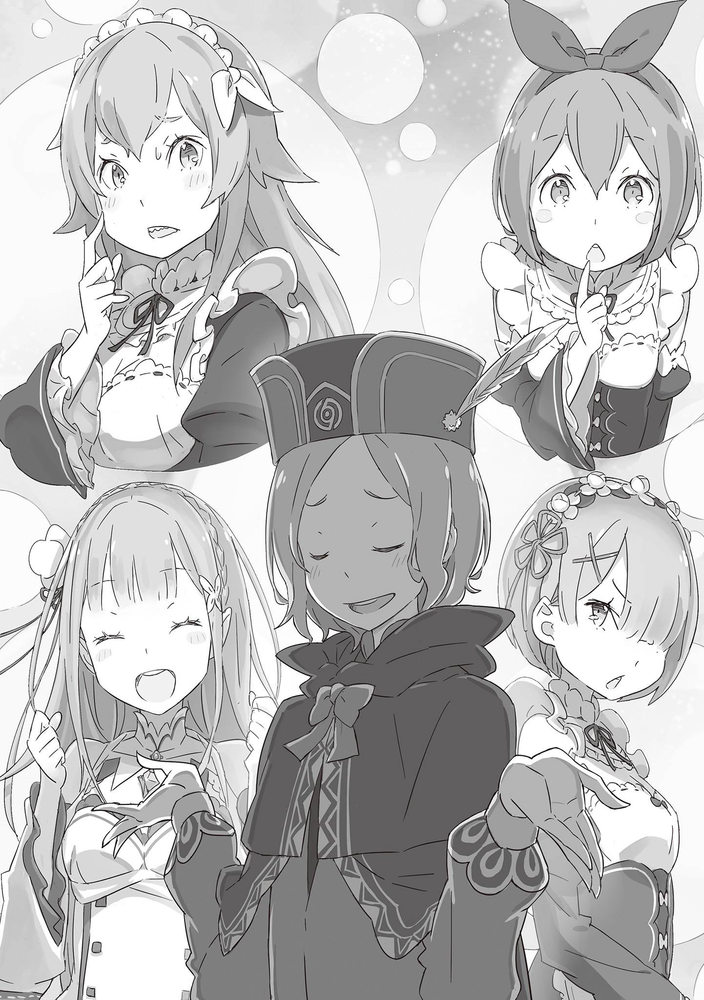

— Господин Отто, я считаю несправедливым то, что Вы постоянно путешествуете вместе с Субару.

Таким, довольно яростным, комментарием девушки Отто был остановлен.

Работница особняка — это подходящее описание её текущим способностям. Девушка, которая за этот год набралась достаточно мастерства, чтобы иметь право называться горничной. Её имя Петра.

Очаровательное лицо Петры и её милые щёки покраснели, когда она сделала такое милое заявление, на которое Отто горько улыбнулся.

Поместье Розвааля. Раннее утро.

Отто, прогуливаясь по строительной площадке, пытался расслабить своё тело, затвердевшее от бумажной работы, которая заняла всю ночь. Его сонная голова проснулась от одного необычного обвинения.

— Что? Это абсурдно! Или случился форс-мажор?

— Неужели? Значит, это не Вы просили мастера отправиться вместе с Субару?

— Почему все общаются со мной, как с каким-то жутким парнем?!

Увидев недоверчивый взгляд Петры, Отто застыл.

Её подозрения были направлены на город Водных Врат, который они захотели внезапно посетить.

Что касается этой темы, то прыжок в карман хорошо подготовленного противника был одной из немногих вещей, которые действительно интересовали самого Отто. Но даже в этом случае это, казалось, было предметом зависти для Петры.

Потому что, в конце концов, в списке тех, кто направлялся в город Водных Врат — город “Пристелла”, имени Петры не было.

— Ну, я думаю, что тут уже ничего не поделаешь. Петра, в конце концов, ты уже давно собирались присутствовать на собрании, которое собирается провести маркграф.

— Да… Я понимаю. Я имею в виду, что это была моя идея.

Заговорив детским голосом, Петра раздражённо ущипнула пальцами фартук.

Петра, которая не будет сопровождать их в Пристеллу, будет играть роль слуги рядом со своим господином Розваалем. Это было, по сути, то, что она сама предложила. Следовательно…

— Может быть, мне пойти и поговорить с маркграфом?

— …Всё в порядке. Я уже не ребёнок, я не могу причинять другим неприятности из-за таких вещей.

Когда Отто слегка отвлёкся, Петра чётко и быстро ответила со всей своей решимостью. Когда Отто услышал её неуверенное решение, то разразился смехом: “Ха-ха-ха!”, — от чего глаза Петры широко раскрылись.

— Господин Отто, Вы просто дьявол! Вы проверяли меня!

— Ха-ха, прости меня. Но твой ответ был очень быстрым, не так ли? Это заставило меня почувствовать себя непринуждённо.

Пока Петра с надутыми щеками выражала свой гнев, Отто извинился.

Но в глубине его извинений чувствовалось искреннее облегчение, вызванное решением Петры. Хотя ему было жаль её, он хотел, чтобы она превосходно исполнила свою роль слуги Розвааля на собрании.

В течение этого года поведение Розвааля не вызывало никаких сомнений. С тех самых пор, как Розвааль раскрыл свои планы в Святилище, он стал энергичным, поставив всё на Эмилию и Субару.

И та встреча станет итогом прошедшего года. Поскольку Отто не сможет сопровождать его, то Петра высказала желание занять его место.

Субару, Эмилия, очевидно, Рам и даже Гарфиэль с Фредерикой, которые пострадали от его планов, проявили терпимость к Розваалю. Это было их добродетелью.

Но простить его было бы проще. Для Субару или остальных… Но Отто чувствовал благодарность за их прощение.

Поэтому он и Петра, те, кто были не способны простить Розвааля, были необходимы.

— Побудь нянькой для маркграфа. Петра, ты единственная, кто может это сделать.

— Хорошо. Я бы всё равно это сделала, даже если Вы не попросили… а Вы, господин Отто, присмотрите за Субару и сестрёнкой Эмилией вместо меня. И за Беатрис тоже, ни на секунду не отводите от неё взгляда, а то она исчезает, понимаете? И за Гарфом тоже… хотя, он довольно крепкий, так что, возможно, беспокоиться не о чем.

— Хм, это невероятно точная оценка. Кстати, ты беспокоишься обо мне?

— Господин Отто, Вы ведь будете в порядке, так? С чего бы мне волноваться?

— Я действительно не понимаю. Почему все так плохо думают обо мне!?

Посмотрев на него взглядом, который выглядел ещё более недоверчивым, чем пару мгновений назад, Отто задался вопросом, который эхом прошёлся по коридорам особняка.

— Отто, можно?

Вместе с изящным стуком заговорила и показала своё лицо красивая старшая горничная, у которой были длинные золотистые волосы.

Та, кто опустила свои зелёные глаза, будто извиняясь, была девушкой, которая выполняла обязанности горничных, как их глава в поместье Розвааля, — Фредерика.

Увидев её, Отто удивлённо поднял брови.

— Фредерика, как необычно, что ты пришла в такое время. Разве пришло время Огня?

— Почти, сегодня я буду разносить чай и печёные сладости в столовой. Петра будет делать супы и… Прости. Я отклонилась от темы.

Фредерика, пока шла к центру комнаты прикладывая руку к своим губам, выглядела немного смущённой.

Это был жест, который она делала всякий раз, когда улыбалась. Вероятно, она делала это для того, чтобы скрыть свои клыки, которые были чуть-чуть острее, чем у человека, и это, похоже, вошло у неё в привычку.

Хотя Отто не особо возражал против этого, возможно, это было то, на что обратила бы внимание зрелая женщина. Потому что всякий раз, когда она выходила на свободу и широко улыбалась, они с Гарфиэлем были похожи, как две капли воды.

— Отто, поскольку сегодня рано утром Петра была невежлива, я тоже приношу свои извинения. Я уже позаботилась об этом.

Пока Отто размышлял над этим вопросом, Фредерика глубоко согнулась в талии и заговорила. Услышав, что она сказала, Отто покачал головой в разные стороны.

— Ты преувеличиваешь. Ничего такого не произошло. Мы с Петрой просто разговаривали, как обычно… хотя, я не уверен, что я вёл себя правильно по отношению к ней.

— Ну же, Отто, даже ты думаешь об этом именно так, не так ли? Это просто неправильно. Если она будет продолжать использовать в своих интересах ту доброту, которая есть у людей, что заботятся о ней, рост этого ребёнка остановится.

— Знаешь, мне почему-то кажется, что то, что ты показываешь — это забота не обо мне, а о будущем Петры…

— Возможно… Не буду отрицать.

Фредерика под укоризненным взглядом Отто неловко улыбнулась, как будто сдалась.

Хотя с её стороны было очень смело ничего не скрывать, всем было хорошо известно, что Фредерика души не чает в Петре и старается воспитать из неё великолепную служанку. Поскольку Петра, с её собственным стремлением к самосовершенствованию, также боготворила женщину, которая была не только любящей по отношению к ней, но и искусной в своей работе, то было очевидно, даже со стороны, что у них были хорошие отношения.

— Значит, её поведение на следующей встрече будет чем-то вроде кульминации для этого роста?

— Действительно. Этот ребёнок быстро учится, когда речь заходит о работе… Я просто не могу отвести от неё глаз.

Кивнув, Фредерика с гордостью подтвердила как вырос её любимый ученик. Отто закрыл один глаз, глядя на её спокойное выражение лица.

— Может быть, ты так беспокоишься за своего младшего брата?

— Похоже, от тебя ничего нельзя скрыть. Это так, да. Как ты знаешь, Петра находится в поле моего зрения, в то время как Гарф постоянно там, где я не могу дотянуться до него.

Не переставая беспокоиться, Фредерика положила руку на свою пышную грудь и глубоко вздохнула. Даже Отто понимал опасения Фредерики и её бесконечные страхи по поводу младшего брата.

В случае Гарфиэля, причиной такого беспокойства было его окружение, а не сам человек, о котором шла речь. В течение этого года Отто тоже был вынужден кое-что предпринять из-за её вспыльчивого младшего брата, который обладал силой, превосходящей силу обычного человека.

Хотя, к счастью, Гарфиэль боготворил Отто как старшего брата и уважал его мнение.

— Меня беспокоит, не вызовет ли поведение этого ребёнка неприятностей для Эмилии. До сих пор он не имел никакого реального отношения к тем, кто связан с выборами, но…

— На этот раз он так и сделает. Конечно, это тоже вызывает у меня беспокойство…

Тем не менее Отто не питал к Гарфиэлю такой сильной тревоги, как та, что питала Фредерика.

Несмотря на внешность, Гарфиэль умел закрыть свой рот в тот момент, когда разговор заходил в дела вне его компетенции, в отличие от Субару, который в каждой бочке затычка.

Но предугадывать неприятности и решать их с наименьшими жертвами было его талантом, но и от этого у Отто кружилась голова.

— Но и Эмилия не исключение.

— Как ты нервничаешь. Однако, Отто, я должна извиниться за то, что заставила тебя заниматься даже этими моими заботами.

— Что, нервничаю? Такими темпами моя шея сама слетит с плеч.

— Фу-фу. Но мы всё же полагаемся на тебя. Что бы там ни говорили, лагерь, где отсутствуешь ты, просто не функционирует. Я очень прошу тебя, пожалуйста, позаботься обо всех… особенно о моём глупом братце.

Пока Отто почёсывал пальцем щеку, Фредерика с улыбкой вежливо поклонилась ему.

Восхищаясь этой позой, достаточно красивой, чтобы быть очаровательной, Отто почувствовал, как глубоко его тронули её слова.

— О, Отто, что-то случилось?

— Не знаю, но то, что с тобой обошлись так достойно, тронуло моё сердце гораздо сильнее, чем я думал… Я клянусь сделать всё, что в моих силах.

Твёрдо стоя перед Фредерикой, Отто поднял кулак, демонстрируя свой новообретённый энтузиазм.

А потом, сжав кулак, Отто склонил голову набок.

— Кстати, Фредерика, ты беспокоишься обо мне?

— О тебе? Э-э-э, что значит беспокоюсь…?

— Даже ты со мной так поступила?!

И вот, от столь искреннего и лишённого всякого злого умысла недоразумения, Отто оказался ранен.

— Здравствуй, Отто. Чай готов.

Когда Отто вернулся на своё рабочее место после ванны, он был встречен наглыми голосом и отношением.

В комнате, сидя на письменном столе Отто и изящно опрокидывая чашку чая, сидела розововолосая горничная — Рам.

В ответ на её внушительное поведение и несуществующее уважение к окружающим, Отто горько улыбнулся и пожал плечами.

— Я уже не удивляюсь этому, но почему именно сейчас? Если бы это был обычный день, я бы подумал, что ты сейчас занимаешься лечением у маркграфа, или я ошибаюсь?

— Да, совершенно верно. Так что я на минутку отвлеклась от работы и решила заглянуть к тебе. И даже во время этого перерыва моё время с господином Розваалем уменьшается. Надеюсь, ты это понимаешь.

— Это ужасная формулировка.

Тем не менее, понимая, что подобное поведение было типично для Рам, Отто взял чашку, которую ему поставили на стол, и поднёс её ко рту. Восхитительный аромат и прекрасный вкус прошли через его нос и язык, заставив его невольно впасть в транс.

— Серьёзно, Рам, твои навыки сервировщика чая просто первоклассны.

— Конечно, так оно и есть. Кроме того, мои другие достоинства подобны звёздам. Однако, поскольку время, когда они могут взглянуть с неба свободного от облаков, коротко, они должны выбрать, над чьей головой следует парить.

— Впрочем, это я уже знаю.

— …Это никуда не годится. Как и ожидалось от Отто.

— Прости, но не могла бы ты перестать презирать всё, что связано с моим именем?!

— Ха!

Фыркнув, Рам отмахнулась от Отто таким образом, что тот даже не смог ответить. Хотя в его нынешнем состоянии ума, даже это было чем-то, что он уже принял, как часть своей повседневной жизни. Губы Отто сразу же расплылись в улыбке.

— Ну и что же? Если ты чувствуешь радость от того, что тебя ругают, то ты безнадёжен.

— Значит, ты осознаёшь, что ругаешь меня… Нет, я думаю, что сегодня ко мне приходило ужасно много людей. Рам, ты ведь тоже пришла узнать что-то о Пристелле, не так ли?

— …

Прищурив светло-розовые глаза, Рам хранила молчание, услышав слова Отто. Но самого факта, что она не отрицала это, было достаточно, чтобы подкрепить догадку Отто.

Она тоже поняла, что её молчание было подтверждением, и вздохнула.

— …Тот, с кем мы имеем дело, является достойным кандидатом на престол. А мы здесь имеем не совсем приличную Эмилию, которая собирается встретиться с ней лично. Ты ведь понимаешь, что твой долг, как её советника, очень серьёзный, верно?

— Разве ты не должна была сказать это немного мягче?

— Замалчивание фактов ничего не изменит. Кроме того, образ действий Эмилии повлияет и на самое большое желание господина Розвааля. И я тоже не хочу увидеть это лицо, когда всё разрушится.

— …

— Ну и что же?

— Нет, мне просто интересно, чьё лицо ты не хочешь видеть: Эмилии или господина Розвааля.

Увидев, как Отто наклонил голову, Рам безжалостно сильно щёлкнула языком. Чувства Рам было трудно понять и трудно переварить, но они были искренние.

На самом деле, Субару, Гарфиэль и даже Беатрис были теми людьми, к которым она была внимательна.

— Как бы то ни было, тебя предупредили. Похоже, ты уже выпил чай, который заварила сама Рам. Думай об этом, как о награде, уже выплаченной заранее, а затем иди и отдай всё, что у тебя есть.

— Так что же, это была взятка? По крайней мере, я хочу ещё одну чашку, когда вернусь.

— Посмотрим…

Когда она легко и грациозно спустилась со стола, Рам разжала свои губы. Поскольку они уже говорили о соглашениях, Отто снова посмотрел на Рам.

— Кстати, это также будет первый раз, когда я действительно буду участвовать на выборах, ты не волнуешься?

— Перестань спрашивать, когда уже знаешь ответ. Какая гадость!

— Может быть, они всё-таки не доверяют мне?

Вспомнив свои разговоры с Петрой, Фредерикой и Рам, Отто озадаченно склонил голову набок.

Поскольку он не спал всю предыдущую ночь, то сегодня собирался немного отдохнуть, пока не наступило утро. Прежде чем сделать это, Отто почистил зубы в ванной и вернулся в свою спальню.

— А, Отто.

А на обратном пути в комнату он случайно наткнулся на Эмилию, одетую в ночную пижаму.

Эмилия с длинными и влажными серебристыми волосами была невероятно красива, когда улыбалась. “Вполне разумно, что Нацуки сходит с ума”, — подумал Отто с объективной точки зрения и горько улыбнулся.

— Госпожа Эмилия, вы идёте ложиться спать?

— Да, это так. Мне нужно хорошо отдохнуть и подготовиться к встрече в Пристелле. Я знаю, что могу в конечном счёте принести много неприятностей другим, но я определённо буду делать всё возможное.

Сжав кулак перед грудью, Эмилия заговорила, и её взгляд был полон энтузиазма. Она продолжила: — Но…

— Поскольку ты со мной, то я уверена, что всё будет хорошо, Отто. Потому что на тебя мы все рассчитываем.

— …

— Ну что ж, тогда спокойной ночи. Отто, пусть приснятся тебе много сладких снов.

Помахав рукой, Эмилия улыбнулась Отто, повернулась к нему спиной и так же спокойно удалилась. Он медленно качал головой, пока провожал её взглядом.

— …Похоже, они всё-таки мне доверяют.

Поэтому, слегка повысив голос, он глубоко и протяжно вздохнул и посмотрел вперёд.

《Конец》
