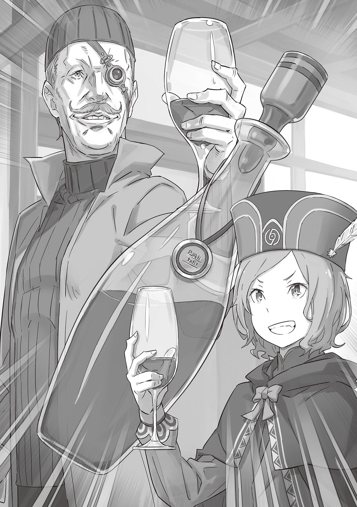

— Я всё понимаю… Хм, понятно. Я запомню это, учитель.

— Пожалуйста, сделай это. Ну что ж, тогда возвращайся скорее, пожалуйста.

Горько улыбнувшись смутно озорному ответу Эмилии, Отто отделился от Субару и остальных и зашагал по городу.

Этот разговор произошёл по пути к гостинице, когда переговоры с компанией “Мьюз” были провалены.

Получив приглашение Анастасии, весь лагерь Эмилии прибыл в Пристеллу. Отто предложил расстаться со своими товарищами, такими как Субару и Гарфиэль, и отправился выполнять очень важное дело один.

Причиной этому послужило то, что он сказал: “Я, как министр внутренних дел, должен встретиться с очень влиятельным лицом города”. Это правда, он намеревался исполнить это, но истинные намерения были скрыты.

Едва дыша, Отто перевёл взгляд на сумку, которую держал в руках.

Это была сумка, в которой не было ничего необычного, но дело было в её содержимом.

В мешке лежала одна книга, в которой большая часть страниц была сожжена.

Эта книга называлась Книгой Мудрости, вернее, являлась ею раньше.

Большая часть переплёта была обуглена, и ни одна страница не позволяла узнать её содержимое. Так как теперь книга была в таком состоянии, что больше представляла из себя кучу обгоревшей бумаги, а не книгу, нельзя было понять, что в мыслях того человека, кому она принадлежала.

Разум Отто был в смятении и призывал его избавиться от обгоревшего корешка, но его инстинкт призывал его не делать этого.

Пойманный в ловушку между собственным разумом и инстинктом, Отто глубоко вздохнул.

Каждый раз вспоминая, что должно было произойти по сценарию этой книги, у него сразу сжималось сердце. Именно поэтому, по иронии судьбы, Отто пытался восстановить книгу, чтобы узнать сценарий и избавиться от неё.

Имя мастера восстановления предметов, Дартса, было известно по всей стране.

Он зарабатывал на жизнь, восстанавливая сломанные и повреждённые предметы, и он, как говорят, использует очень редкую магию восстановления, которая позволяла вернуть любой объект к первоначальному виду.

Существует много ремесленников, которые используют разные техники для восстановления объектов, таких, как картины, например, но магия восстановления, казалось, была чем-то, что он придумал сам, и некоторые утверждали, что он вернул даже “Метеор” в его первоначальное состояние.

Место, где жил мастер Дартс, было городом Водных Врат Пристелла, следовательно, полагаясь на слухи, Отто принёс таинственный корешок книги в этот город.

Если бы книга была восстановлена его рукой, тогда, возможно, содержание книги можно было бы прочитать. Однако только восстановление книги имело риск того, что содержание будет нечитаемым. Поэтому, чтобы восстановить даже первоначальную функцию предмета, была необходима сила мастера восстановления.

Ходили слухи, что ему трудно угодить, но он должен был найти способ уговорить его.

Было необходимо восстановить Книгу Мудрости и проверить её содержание.

Только в этом случае Отто Сувен сможет принять своё нынешнее положение.

Такова была истинная цель министра внутренних дел лагеря Эмилии.

Эта история началась, когда речь о поездке в Пристеллу даже не обсуждалась.

— Сейчас такая поздняя ночь, а ты всё ещё работаешь?

Когда кто-то неожиданно обратился к нему сзади, и Отто обернулся.

Время было позднее, и место это было столовой поместья Розвааля. В это время даже растения спали; но для одной части обитателей особняка это было только начало их активных часов.

Отто был из этой части, и из той же самой части была также девушка, которая стояла позади него.

— Я смотрю, ты тоже не спишь, Рам.

— Конечно, я бы так и сделала. Но лучше я облегчу работу господина Розвааля, пусть даже немного, иначе он просто переутомится.

Обычно эта девушка в одежде горничной проявляла склонность к неряшливости, легкомыслию и лени по отношению к работе, однако, на самом деле она была той, кто посвятила себя хозяину особняка с большей страстью, чем кто-либо другой.

Хотя в этом не было ничего достойного похвалы, было много случаев, когда Отто, погружённый в свои бумаги, видел восход солнца из своей комнаты. Как и в его случае, было уже поздно, когда свет в комнате Рам погас.

Он знал, что это был отголосок того факта, что она перенесла работу в свою комнату и продолжала помогать своему хозяину.

Конечно, если бы он указал на это, её реакция была бы мгновенной.

— Отвратительно.

— Что? Я ничего не говорил. Почему ты посмотрела на меня, когда говорила это?!

— Перестань говорить так громко. Было бы очень неприятно, если бы ты случайно разбудил Эмилию или Петру. Если ты хочешь отвлечься, то можешь пойти и побить дверь комнаты Барусу, сколько душе угодно.

— Я не сделаю такого злого поступка… Рам, хочешь кофе?

Пожав плечами в ответ на слова Рам, Отто встряхнул свою чашку и показал ей её содержимое.

Содержимое чашки представляло собой напиток, похожий на кофе, приготовленный из высушенных бобов, которые превращались в порошок, а затем растворялись в горячей воде. Его вкус контролировался качеством бобов и способом приготовления, но Отто не был слишком внимателен к этому аромату.

Его главной целью при употреблении кофе была его черта, как самого эффективного напитка, когда дело доходило до борьбы с сонливостью.

В течение своей повседневной жизни торговца, которая составляла значительную часть всей его жизни, его тело полностью привыкло к жизни без сна.

В бизнесе такие вещи, как вождение драконье повозки, игнорирование сна в матче против скорости, были в порядке вещей.

В те дни сила кофе была определённо необходима, чтобы открыть его опущенные веки одной лишь каплей, делая его своего рода товарищем по оружию для Отто.

Уставившись на товарища по оружию Отто, Рам фыркнула.

— Мне это не нужно. Я даже не знаю, как ты можешь пить такую мутную воду.

— Это выражение… Я слышал его много раз, но сейчас я впервые встречаю человека, который действительно использует его.

Видя, как Отто с горькой улыбкой отпил немного кофе, Рам ничего не сказала. Вместо этого она прошла мимо него, достала из буфета чайные листья и начала заваривать свою собственную порцию чая.

Аромат, контролируемый тем, как он был заварен, был одинаково хорош как для чая, так и для кофе. В этом отношении то, как Рам заваривала чай, было настолько отполировано, что даже Отто мог ясно различить разницу во вкусе.

Затем Рам налила чай в стоявшую на столе чашку и взглянула на Отто.

— Если ты выплеснешь эту грязную воду, я позволю тебе попробовать чай Рам.

— Хм, очаровательное предложение. Хотя у меня есть возражения, которые я хотел бы подметить…

— Для меня это просто мутная вода. Даже твоя одежда зелёная, и ты тоже пьёшь мутную воду, как водоросли.

— Я всё понял! Смотри, я вылил мутную воду! Завари мне чаю, пожалуйста!

Поддавшись её острому языку, Отто подошёл к раковине и выплеснул из чашки кофе. Хотя из дренажной трубы доносилось недовольство его бывшего товарища по оружию. Отто заткнул уши, чтобы ничего не слышать.

Рам, наблюдая за этим со стороны, пододвинула дымящуюся чашку к Отто.

— Пей.

Получив такое предложение, Отто, с застывшими щеками, принял чай.

Когда он приложил его ко рту, сладкий аромат прошёл через его нос. Как и следовало ожидать, метод приготовления чая Рам был совершенно иным.

— …Похоже, твоя настороженность по отношению к господину Розваалю всё ещё не ослабла.

Он понял, что вкус чая, вероятно, был не единственным, что было совершенно иным.

Услышав эти слова, Отто проглотил чай, который был у него во рту. В этом даже не было ничего особо удивительного. Он был уверен, что это не простое совпадение, что они встретились здесь этой ночью.

Так как это была Рам, она уже предвидела его ответ.

— Я думаю, это вполне естественно. Разве можно быть беспечным по отношению к маркграфу?

— Конечно, от его великодушия иногда бросает в дрожь, но это лишь реакция окружающих.

— Человек, который обладает такой аурой… У меня есть один близкий человек, и, честно говоря, у меня от него болит голова.

Трудно было забыть поступок, который, примерно год назад, Розвааль совершил по отношению к своему лагерю, населению и вообще ко всем, кто к нему относился. Ещё более уместно было бы перефразировать это в “непростительное преступление”.

И несмотря ни на что, Субару и Эмилия простили Розваалю его преступление. Это не было похоже на то, что они действительно простили его по форме, но их обращение с ним было равносильно оправданию.

Конечно, они не могли позволить себе потерять то положение, которое Розвааль занимал в качестве маркграфа на Королевских Выборах.

— Даже без этого, боюсь, вывод будет тот же самый…

— Личные интересы это ещё не всё, что заставляет людей двигаться. Думая, что живёшь только для себя, а всё, что на фоне, это просто бремя, — доказательство плохого ума, Отто.

— Это поразительный аргумент, но, что если это дело не имеет никакого отношения к маркграфу?

— Неизвестно, что чувствует прощающая сторона. Барусу не имеет значения, но я думаю, что Эмилия согласна с этим.

Чистота небрежного отношения Рам оставила его без лишних слов. В любом случае, Отто не сможет стать таким же беззащитным, как Субару, Эмилия и все остальные. Он тоже считал, что не может себе этого позволить.

— Прошло уже около года с тех пор, как я начал помогать вам в особняке, не так ли? Я больше не могу сдерживаться, мои плечи становятся жёсткими от того, как сильно я напрягаю свой ум. Почему, несмотря на то, что у меня есть крыша, кровать и личная комната, мои часы сна сократились больше, чем тогда, когда я был бродячим торговцем?

Занимался ли он торговлей или работал под чьим-то началом, где бы он ни был и чем бы ни занимался, Отто был обречён на неприятности. Так и сказал когда-то его старший брат.

В то время это было просто то, над чем он смеялся; но это стало его обстоятельством, над которым он был совершенно неспособен смеяться. И всё же, осознавая это, Отто осмелился подумать об этом с улыбкой.

— Мне нравится моя теперешняя жизнь такой, какая она есть. Даже если это среда, в которой, например, мои часы на сон стали в разы меньше, или я вынужден относиться к своему многолетнему товарищу по оружию, как к мутной воде.

— Но именно ты нанёс удар сзади своему товарищу по оружию.

— …Поэтому я приложу все возможные усилия, чтобы защитить эту окружающую среду.

— Отто защитит его сомнение. Затем, Рам должна защитить его настоящей верой.

— …

— Мы разделяем роли. Рам будет отвечать за то, чтобы верить, а Отто — за то, чтобы сомневаться, как плохой человек.

Когда его назвали плохим человеком, Отто испытал неприятное чувство.

И всё же, будет ли уместна даже такая оценка, если он сравнит себя с теми людьми, которые мельком рисовались в его голове?

— Даже если и так, я думаю, что в этом особняке слишком много людей, ответственных за…

— И именно поэтому Отто так необходим. Нужный человек в нужном месте. Впечатление необходимости, которое даёт это выражение, слишком сильно. Давай оставим тебя на уровне ведра для протечки крыши.

— Госпожа Эмилия рассердится. Ты же знаешь, что у неё удивительно сильное чувство благодарности к вёдрам…

Выслушав ответ Отто, Рам взяла пустую чашку и отнесла её на кухню. Отто почесал затылок, глядя на её маленькую спину.

— Разговор окончен, — будто бы говорила её спина. Лёгкое предостережение или предупреждение? Или это была просто попытка передать “я наблюдаю за тобой”, как сделала бы Рам?

— Отто.

Внезапно чей-то голос обратился к Отто, когда тот уже собирался уходить из столовой.

Когда он обернулся, Рам всё ещё стояла у входа на кухню, глядя на него прищуренными глазами.

— Что же должно было случиться, чтобы ты простил желание господина Розвааля?

— Простить его… это одна из немногих вещей, которую я не способен сделать…

Светло-розовые глаза Рам требовали продолжения слов, которые отрезал Отто. Продолжая своё движение вперёд, Отто положил руку на дверь столовой и, сделав шаг вперёд, вышел в холл, чтобы ответить.

— …Если бы только у меня была такая возможность, может быть, я смог бы рассеять свое недоверие.

Что бы ни случилось, Отто, вероятно, никогда не простит Розвааля.

Он так и сделал. Именно так с ним и поступили. Поэтому это было вполне разумное возмездие.

Поступки всегда возвращались бумерангом. Нынешние трудности Розвааля были результатом его собственных деяний. Оттого, что он так думал, Отто не испытывал к нему никакой жалости.

Но всё было именно так, как он ответил Рам. Если бы у него была такая возможность, он бы развеял своё недоверие.

И, вероятно, потому, что он сам хотел получить этот шанс, он был вовлечён в этот предательский акт.

— …Понятно. А вот это уже большое дело.

В полутёмном помещении магазина высокий худощавый человек взглянул на остатки таинственного писания, которое ему принесли, и заговорил, трогая свои ухоженные усы. Внутри магазина, из которого уже были полностью выгнаны люди — Вы понимаете? — Отто повысил голос при словах этого человека.

— Состояние книги настолько ужасное, что сам чувствую себя виноватым.

— Я уже долго этим занимаюсь. Я могу распознать предмет, за которым стоит история, когда вижу его, знаете ли. Даже с моим долгим опытом реставратора, вещи с таким сильным зачарованием редко попадаются на глаза.

Несмотря на странное выражение лица, глаза Дартса сияли, и любой, кто видел его, мог сказать, что он был полон энтузиазма. Отто почувствовал облегчение от того, что, по-видимому, преодолел первое препятствие.

— Тогда, как Вы думаете, Вы могли бы это исправить?

— Восстановление его, — это такая же невыполнимая работа, как возвращение разрушенного песчаного замка в его первоначальное состояние. Если задача такова, то возвращение её в исходное состояние будет легендарным подвигом… Я могу это сделать.

— Правда!? Значит, я могу положиться на вас?

— Нет проблем, но могу я кое-что сказать?

Кивнув нетерпеливому Отто, Дартс закрыл один глаз и принялся теребить усы.

— Потом обсудим время, которое потребуется на его восстановление, и вознаграждение на потом… если вы не возражаете, могу я спросить, для чего вы собираетесь это использовать?

— …Мне очень жаль вас, Дартс, как того, кто теперь будет чинить её, но как только я закончу проверять содержание книги, я намерен сжечь её, не оставив ни единого фрагмента.

— Хм, а вы честный человек…

— Если это возможно, то вместо того, чтобы всегда быть ответственным за сомневающихся людей, я хочу успокоиться, зная, что, по крайней мере, мои товарищи не ударят меня в спину. И было бы здорово, если бы такое облегчение помогло и моему желудку.

— …Это хорошо. Я возьмусь за эту работу. Однако, прежде чем я сделаю это…

— Я всё понимаю. Вот почему я его принёс.

Под одобрительным взглядом Дартса, Отто достал из сумочки бутылку спиртного и поставил её на стол.

Мастер-реставратор Дартс славится своей любовью к редким предметам и алкоголю. А также за то, что напивается, прежде чем приняться за работу.

— …Позвольте мне составить вам компанию. Если это для того, чтобы мой ум был в покое, то меня это вполне устраивает.

С готовностью поставив бутылку с алкоголем на стол, Отто улыбнулся, обнажив зубы. Поскольку эта улыбка была направлена на него, Дартс тоже показал жутко злобную улыбку на своём лице.

Необходимая церемония, чтобы Отто Сувен стал фактическим полноправным министром внутренних дел лагеря Эмилии.

Как бы готовясь к этой церемонии, в этот день Отто пил спиртное до полного изнеможения вместе с Дартсом, а на следующее утро он вернулся в гостиницу в пьяном виде.

Однако произошёл случай, когда Беатрис спутала пьяного Отто с монстром и убежала в поиске героя… Но это уже другая история. Это была одна из проблем, с которой постоянно сталкивался вечно обеспокоенный Отто.

《Конец》
