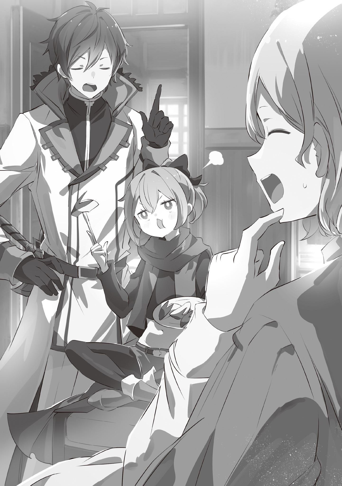

Потеряв равновесие, он понял, в каком затруднительном положении оказался, но было уже поздно.

Ему показалось, что земля под ногами и всё, до чего могли дотянуться его руки, поменялись местами, словно небо и земля перевернулись.

— А-а-а?

Раздался крик, перекрываемый звуком падения от тяжёлого удара об землю. В конце концов, простыни, за которые он ухватился в этот момент, упали, свалив книги, документы и т.д., которые были на нём.

Он лежал, распластавшись на полу, и в полном оцепенении смотрел в потолок.

— Ну, раз уж я ещё жив, то могу и посмеяться. Пф! Ой…

Когда он попытался посмеяться над ситуацией, ему помешала затянувшаяся боль в ногах.

Лишённый даже возможности просто посмеяться, он помассировал ноги, обмотанные бинтами, и глубоко вздохнул.

— Эй, осторожнее, Отто-бро, ты в порядке?

Услышав шум, кто-то открыл дверь комнаты снаружи. Тот, кто спокойно показал себя, был златовласым юношей, который опустил глаза, увидел его лежащим на полу и наклонил голову.

— Крутой я пришёл сюда, думая, что тебе может быть скучно одному, а ты, оказывается, играешь в какую-то странную игру.

— Я вообще-то не играю. В любом случае, это хорошо, что ты пришёл, Гарфиэль.

Он одухотворённо улыбнулся появившемуся в его перевёрнутом поле зрения Гарфиэлю. Затем, лежащий Отто протянул к юноше руку.

— Не мог бы ты помочь мне? Кажется, я не могу встать самостоятельно.

И так, массируя разбитые ноги, он умолял о спасении.

— Получается, ты думал, что тебе хватит одной трости? Отто-бро, во всех этих твоих мыслях время от времени присутствует тупость.

— Меня расстраивает то, что ты прав, и я не могу возразить тебе.

Ответив на это, Отто, теперь уже снова лежавший на кровати, отвернул своё недовольное лицо от Гарфиэля. Видя, что человек, которого он считал своим братом, ведёт себя подобным образом, Гарфиэль стукнул зубами, словно улыбаясь.

На кровати Отто лежал полностью обмотанный бинтами. Повреждения на его ногах были вызваны ранами, которые он получил во время драки, произошедшей в Городе Водных Врат. Сейчас Отто получал особое внимание, находясь в больничной палате.

— Конечно, хорошо, что обо мне здесь заботятся, но такими темпами я помру от скуки…

— Чего? Ты же хотел прочитать какую-то книжку, которую хотел восстановить в этом городе, разве нет? И даже сам крутой я пришёл провести время с тобой.

— Да, ты прав, но…

Он бросил взгляд в угол комнаты, где стояла доска шатранджа.

Отто, неспособный двигаться из-за травмы, стал лёгкой добычей для Гарфиэля.

Было много случаев, когда он был занят работой и говорил, что у него нет времени, и поэтому он не может уделить внимание чему-то другому. Поскольку в его нынешней ситуации у него не было причин отказываться, возможно, дела у Гарфиэля в этом отношении шли не так уж плохо.

— Если подумать, было время, когда Регин тоже проходил через такую фазу, не так ли?

Он вспомнил те дни, когда жил в своём старом доме, и вспомнил время, проведённое с младшим братом, который требовал его внимания.

Даже его брат, который теперь был потрясающим человеком, когда-то был изрядно избалованным ребёнком. Когда Гарфиэль смотрел на Субару или Отто, он видел, что у них с братом было много общего.

Хотя именно поэтому сам Отто, того не осознавая, избаловал Гарфиэля.

— Гарфиэль, ты ведь знаешь это, верно?

— М-м-м? Пора прибраться в этой грязной комнате, не думаешь? Крутой я знаю, что было бы неразумно заставлять тебя делать это, Отто-бро. Так что займусь этим сам…

— А как же Нацуки, госпожа Эмилия и остальные.

Отто внезапно понизил голос, отчего расслабленное выражение лица Гарфиэля стало напряжённым. — О-о-о, — он пристально посмотрел на него и коротко ответил:

— Эта штука насчёт того мудреца в песчаной башне? Чёрт, крутой я хотел бы пойти с ними, если это правда…

— Я ранен, а ты не в форме. Так что мы для них обуза. Ты ведь понимаешь это?

— Да-а-а.

Слушая слова Отто, Гарфиэль опустил подбородок и вздохнул, отвечая на его вопрос.

Гипотетически говоря, если бы Субару слушал их разговор, возможно, он прервал бы их чем-то вроде: «А? О чём вы двое говорите?»

Однако его здесь не было, они были предоставлены сами себе.

Конечно, во многих аспектах успех был достигнут благодаря им двоим. Им нечего было стесняться, когда дело касалось их свершений.

Но Отто был министром внутренних дел лагеря, а Гарфиэль — его военным офицером.

В конце концов, они смогли выполнить свою главную задачу в Пристелле — приобрести ахроматический магический кристалл. Однако это был не результат его переговоров, а результат доброты Киритаки.

Он подарил его лагерю Эмилии в знак благодарности за их вклад в борьбу с Архиепископами Греха, напавшими на город. И где там можно было увидеть вклад Отто?

— Нацуки и госпожа Эмилия отправились в дюны Аугрии в поисках ответов. И, Гарфиэль, с ними и так есть тот, кто сможет защитить их. Так что мы не нужны им. И это удручает.

То, что молчаливый Гарфиэль чувствовал в своей груди, Отто понимал до боли, потому что испытывал то же самое чувство.

Подводя итог, можно сказать, что и Отто, и Гарфиэль увлеклись этим делом.

В течение этого года они действовали как члены лагеря Эмилии и были благословлены хорошими результатами в определённой степени. В итоге у них развилось самомнение, что они всё делают хорошо, и это стало их ошибкой.

Тем, кто переоценивал свои силы, было суждено совершить ошибку, от которой им будет нелегко оправиться. И хотя Отто, вероятно, знал это лучше, чем кто-либо другой, он всё испортил.

Следовательно…

— …Так я никогда не стану сильнее.

— Гарфиэль?

Это была фраза, лишённая конкретики. Однако, поскольку её принцип был верен, Отто уставился на Гарфиэля.

Мальчик, который вёл себя как его брат, сжал кулак, и его клыки дрожали, когда он смотрел на Отто.

— Как ты и сказал, Отто-бро, на этот раз мы ничего не смогли сделать. И мы даже не смогли пойти с капитаном. Так что… Это значит, мы должны стать сильнее в тот день, когда Капитан и остальные вернутся. Крутой я щит, но должен стать и копьём. Не хочу оставаться позади снова. Даже позади Святого Меча…

— Ситуация быстро обострилась.

Слушая Гарфиэля, Отто прошептал это.

Такое откровенное и незамутнённое проявление. Слушая его, он чувствовал себя неуютно и в то же время бодро. Это было не в характере Отто.

— Понимаю. Тогда сделай это. А я пока отдохну…

— Давай, Отто-бро, превратим и тебя в воинствующего министра внутренних дел, который не проиграет даже Святому Меча!

— Не-е-е, я лучше тут полежу, такое для меня уже перебор.

Был ли он серьёзен или шутил, но Отто не стал бы кивать на столь трудное для понимания замечание. Хотя, когда тот улыбнулся, показав свои клыки, это, казалось, означало, что это была какая-то шутка.

В любом случае, намерения Гарфиэля были настоящие. Так что Отто должен был на это ответить.

Потому что не кто иной, как человек, неожиданно занявший место старшего брата Гарфиэля, должен быть готов поддержать его.

— Ты это слышал? Стать сильнее, чем сам Райнхард…

— Пожалуйста, хватит, моя жизнь становится всё короче…

— Ха! Итак, парень, который добровольно вызвался сдерживать того сумасшедшего ублюдка, внезапно заботится о своей жизни? Не смешите меня.

Это сказала девочка с корзиной фруктов, которую она купила в подарок Отто, но он не смог бы съесть их все, так что она была рада помочь опустошить её.

— А не правильнее было бы сначала спросить разрешения войти?

— А? Кому какое дело до подобных мелочей? Мы были на грани смерти. А если тоже хочешь поесть фруктов, прошу.

Наклонив голову, Отто горько усмехнулся той, кто это сказал. Видя Отто в таком состоянии, Фельт продолжала есть ещё один фрукт.

— Госпожа Фельт, я очень прошу вас перестать скрещивать ноги, когда вы сидите на стуле. Кроме того, как сказал Отто, вы слишком легкомысленны.

— Замолчи.

Рядом красноволосый юноша критиковал её манеры — это был рыцарь Райнхард ван Астрея.

Наблюдая за дуэтом хозяина и слуги, пришедшим сюда, Отто почесал пальцем щеку.

Когда к нему пришли и кандидат Королевских Выборов, и Святой Меча, он оказался в довольно странном положении. Он был совсем не в своей тарелке.

— М? Ты чего это ухмыляешься?

— Нет, я просто подумал, что это немного странно. Раньше я был всего лишь скромным торговцем… И не то чтобы я совсем забыл об этом, но мне кажется, что я слишком быстро сменил свой образ жизни.

— Хм, это чувство, как я тебя понимаю. Если бы у меня был выбор, то я бы не оказалась в этом месте, но таков долг…

Фельт раскачивалась взад-вперёд, по-прежнему скрестив ноги. Увидев её улыбку, в которой выделялся острый клык, Отто улыбнулся в ответ ещё более горько.

Как и тогда, когда они вместе боролись против «Чревоугодия», её умение приспосабливаться очень сильно удивляло. Кроме Отто, вероятно, было много людей, которые чувствовали то же самое.

— Кстати, а зачем вы оба пришли ко мне? На самом деле вы пришли не только для того, чтобы помочь мне, сократив число фруктов, не так ли?

— А зачем же ещё?

— Я действительно благодарен за это.

Отто не питал особого пристрастия к сладкой пище, поэтому для него было полезнее уменьшить её количество.

Однако, пока они обменивались такими тривиальными фразами, Райнхард перевёл взгляд.

— Да, я поняла, — кивнула Фельт, когда на неё уставились его голубые глаза. — Шутки в сторону, я пришла сюда сказать спасибо. Министр внутренних дел, я думаю, что на этот раз вы спасли нас.

— Если вы имеете в виду то, что произошло с «Чревоугодием», то это чувство взаимно. Если бы вы не принесли этот «Метеор» с собой, госпожа Фельт, мы были бы съедены…

— Ты совершенно прав. Кроме того, именно благодаря этому парню, Райнхарду, ты смог вернуть вашу похищенную даму.

Закончив фразу на этом, Фельт яростно почесала затылок.

— Я все ещё в долгу перед тобой за то время, когда отец Райнхарда взял меня в плен, верно?

— …Ах, я не очень хорошо это помню.

— Давай без этой драмы… Мы здесь, чтобы поблагодарить тебя от всей души.

— Госпожа Фельт, пожалуйста, успокойтесь. Отто, я не хочу, чтобы ты чувствовал себя неловко.

Райнхард снова вмешался, пытаясь смягчить напряжённую атмосферу. Он коснулся плеч Фельт и мягко успокоил свою госпожу.

— Отто, я не хочу слишком тебя тревожить. Как сказала госпожа, мы здесь, чтобы поблагодарить тебя. Кто знает, что случилось бы с городом, если бы ты не пришёл в то место.

— У нас есть общее мнение на этот счёт. На самом деле правда в том, что большая часть проблем в городе была решена благодаря Вам, господин Райнхард. Включая уничтожение этих недозверей… И именно поэтому я думаю, что мне заплатили слишком много за простые достижения…

— Теперь понимаешь, когда тебя восхваляют за просто так?

Несмотря на её грубую формулировку, техника прямых переговоров Фельт заставила Отто опустить подбородок.

К сожалению, Отто и Фельт имели свои собственные позиции, и их пути были разделены принадлежностью к разным лагерям. Мир был сложным местом, где не было ничего простого.

Они отличались от Эмилии, которая считала, что, когда речь идёт о помощи людям, компенсация не нужна.

— Тогда мы все были замешаны в собственных проблемах. И это факт, что нам помог чужак из другого лагеря. Так что это долг.

— Я вовсе не испытываю неприязни к верным людям.

— Если отбросить в сторону эту историю с министром внутренних дел, то ты, по сути, торговец, верно? Ты не можешь позволить торговцу управлять своими долгами.

Это было достаточно дальновидным высказыванием для кого-то её возраста. И строгое предостережение, которое она вынашивала против торговцев, тоже было правильным.

— Конечно, даже если бы это было не так, мы всё равно не хотим враждовать с вами. Просто я думаю, что это очевидный долг. Тебе лучше это чётко запомнить.

— Ну, разумеется…

— И это не с той дамой и не с тем парнем. Это с тобой, как с личностью.

— Угу…

Эта фраза заставила Отто почувствовать себя загнанным в угол и закрыть рот.

— Вот видишь, это моя месть. У тебя был такой вид, будто ты берёшь всё, что хочешь. У тебя всё на лице написано.

— Неужели моё лицо было таким ужасным? Только не говорите мне, что привычки маркграфа заразительны…

Это была мысль, о которой Отто не хотел думать, но чувствовал, что проявляет безразличие к своим страхам. Фельт быстро встала со стула, потянулась и повернулась спиной к Отто.

— Итак, теперь, когда мы сказали всё, что должны были сказать, не пора ли нам возвращаться? Тебе нужно отдыхать как можно больше.

— Отто, то, что ты сделал, действительно очень помогло. Наверняка ты скоро поправишься. И давай выполним те роли, которые нам были назначены.

— Я думаю, что наши обязанности слишком различны, чтобы желать друг другу удачи в равной степени…

Несмотря на это, Отто помахал рукой и проводил их взглядом.

Он знал, что у Фельт и Райнхарда, как и у Субару и Эмилии, есть свои дела. Эти обязанности были довольно тяжелы сами по себе. И он хотел, чтобы они сделали всё без каких-либо проблем.

— Но я всё ещё раздражён. Как и ожидалось.

Проводя здесь время, борясь со скукой и не имея возможности ничего сделать, он чувствовал себя беспокойно.

Он не помнил, чтобы раньше был таким трудоголиком, но по какой-то причине в конце концов стал им.

Однако, пока Отто думал, что ему придётся продолжать борьбу со скукой, к нему постоянно, один за другим, приходили гости.

Иногда это был кто-то из приближённых кандидата Королевских Выборов; иногда это был Киритака, управляющий Пристеллой; иногда это был мастер-реставратор, которому он доверил важное задание; а иногда это был достойный похвалы мальчик, которого он считал младшим братом.

За то время, что он провёл с ними, он закончил тем, что говорил о работе и только о работе.

— А-а-а, я только доставлю всем неприятности, правда?

Бормоча что-то себе под нос, словно отравленный отсутствием самосознания в отношении своих рабочих привычек, Отто шёл к выздоровлению.

《Конец》
