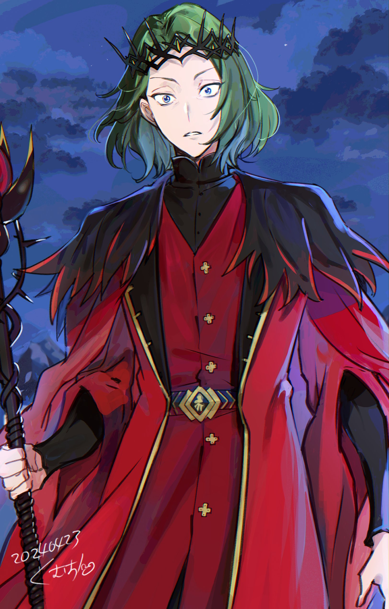
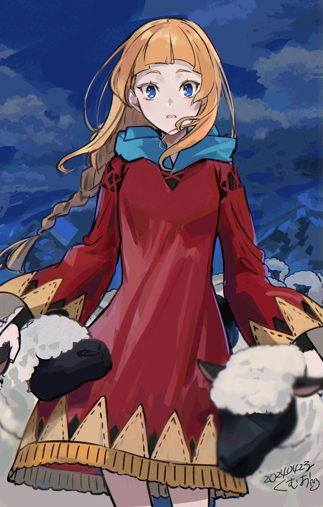

Оригинал на японском: Глава 1 | Глава 2

Перевод: Энди

Фан-арты: Roikumama

Глава Первая

× × ×

Древние предания гласят повесть об одиноком короле и одной девушке.

Повесть о том, как король, что был одинок, встретил девушку, и одиночество его развеялось.

Всё это — воспоминания, мимолётные, словно мгновение ока; страстные, словно пламя, сжигающее всё дотла; столь яркие, что их можно было бы обменять на целый мир, и ведущие в будущее, которому посвятили всё без остатка.

Повесть о короле и девушке, что на долгие веки останется в сердцах людей, пылая яростным, неугасимым огнём.

Это древнее сказание, несущее в себе ненаписанную историческую истину внутри написанной истории.

Девятнадцатый принц Священной Империи Волакия, Югард Эльканти.

Младенец, которого позже нарекут «Терновым Императором», появился на свет в семье Эльканти, став девятнадцатым сыном, унаследовавшим кровь достопочтенного императора Радокаина Волакия.

Дом Эльканти, один из прославленных родов, поколениями служивших Волакии, был редчайшим исключением в Империи, живущей по железному закону «Имперцы должны быть сильными». Этому дому дозволялось проявлять себя не только на полях сражений.

В Волакийской Империи, где сурово относились к тем, кто не мог доказать свою доблесть в бою, лишь для дома Эльканти был уготован титул Особого высшего графа, как дань уважения их политическому весу и обширным связям.

Такое особое отношение к дому Эльканти не радовало другие знатные семьи.

Если бы всё ограничивалось лишь перешёптываниями за спиной о том, что они плетут интриги и заискивают перед столицей, это было бы полбеды. Однако эта грызня аристократов не могла утихнуть до тех пор, пока не будут обнажены клинки.

В конечном счёте, даже будущие поколения не смогли выяснить, чей это был замысел.

Достоверно известно лишь то, что чей-то злой умысел, направленный на устранение дома Эльканти, обратил своё острие на ещё совсем юного Югарда Эльканти.

И эта злоба привела к результату, который решительным образом исказил жизнь Югарда, историю Империи Волакия и даже судьбу всего мира.

На небольшую ничем не примечательную деревню, расположенную на окраине владений Эльканти, было совершено нападение.

Тот факт, что эта обычная деревня стала целью бандитов, пожалуй, был результатом стечения несчастий как жертв, так и самих нападавших.

Налёт на бедную деревню даже для разбойников — дело опасное и малоприбыльное.

И всё же, если бандиты решились на это, значит, они были загнаны в угол, а эта деревня по воле случая оказалась тем единственным местом, до которого они смогли дотянуться.

Однако тот факт, что неподалёку от деревни проводила учения регулярная армия дома Эльканти, сделал судьбы жителей и бандитов диаметрально противоположными.

По всей деревне были подняты знамёна с гербом дома Эльканти. Тела разбойников, разгромленных регулярными войсками, сожгли в едином костре, после чего в деревне был устроен пир.

Это было застолье в честь солдат лорда, которые после уничтожения банды вызвались помочь с восстановлением. Чтобы не отвергать доброту крестьян, солдатам были предложены вино, еда и песни.

— …

Слушая отдалённый шум веселья, Югард Эльканти в одиночестве стоял на вершине холма.

Смех и песни, доносимые ночным ветром… Желая отстраниться от них и позволив звёздам указывать себе путь, Югард не заметил, как оказался на этом небольшом возвышении. Его фигура, неспособная смешаться с общим оживлением, выглядела столь неприкаянно, что вряд ли кто-то заподозрил бы в нём молодого лорда земель Эльканти.

Однако Югард, достигший двадцати лет, бесспорно был правителем этих земель и главным действующим лицом, предотвратившим разорение деревни.

В последнее время ходили слухи о банде головорезов, разорявшей соседние владения. Стало известно, что эта разношёрстная шайка, собранная из отбросов разных земель, направляется в сторону территорий Эльканти.

Тогда Югард под предлогом учений регулярной армии организовал патрулирование окрестностей наиболее уязвимых деревень и отдал распоряжения, которые и привели к уничтожению разбойников в этот раз.

Впрочем, сам Югард не собирался кичиться этими фактами.

Ему было достаточно лишь того факта, что покой подданных был сохранён до того, как его успели бы фатально разрушить. Большего жителям знать не нужно.

— О «Терновом Короле» им знать не следует.

— …

Любой, кто приблизится к Югарду, будет истерзан терновыми путами.

Это оставалось неизменной истиной с того самого момента, как Югард начал осознавать себя, — его неотвратимая карма, по неизвестной причине преследующая его всю жизнь.

Терновые оковы без разбора ранили родных, слуг, подданных и преступников. Они заставили людей называть Югарда «Терновым Королём» и обрекли его на одинокую жизнь.

Именно поэтому Югард и сейчас, вдали от радостной суеты людей, стоял один на вершине холма.

— …

Пусть он и не мог присоединиться к пиру, дел у Югарда было предостаточно.

Учения, в которых он настоял принять участие; насколько можно было судить издалека, все солдаты занимались ими со всей серьёзностью. Их действия при устранении бандитов также были великолепны.

Раз уж он не может обратиться к ним лично, нужно справедливо вознаградить каждого жалованием.

Да, даже в одиночестве, дел у него много.

— Разве сердцу не будет спокойнее, если считать звёзды в небе, нежели вглядываться в кромешную тьму?

Голос раздался за спиной именно в тот момент, когда он был погружён в эти размышления.

Югард ощутил потрясение, будто его ударило молнией, и горько пожалел о своей беспечности. Давно он не подпускал к себе кого-то так близко и так беззащитно.

Как для члена императорской семьи Волакии, как для «Тернового Короля» — это был непростительный промах.

Однако…

— Вы ведь тот, кто командует солдатами, да? Разве вам здесь не одиноко?

В поле зрения Югарда, резко обернувшегося назад, оказалась деревенская девушка с льняными волосами, собранными в хвост, и простым, белым лицом без капли косметики.

Загадочно и совершенно невозмутимо она стояла там, а у её ног толпился десяток чёрных овец.

— По какой причине…

— А?

— По какой причине ты окружена таким количеством овец?

Потрясение ещё не отпустило Югарда, и он задал вопрос, прямо описывающий увиденное, девушке, которая всем своим видом олицетворяла понятие «пасторальная идиллия».

По правде говоря, Югарду следовало бы прогнать её до того, как терновник сожмёт сердце девы.

Но он этого не сделал. А девушка, в ответ на вопрос Югарда, поглаживая одну из овец, ткнувшуюся носом ей в бок, произнесла: — Ну как вам сказать… Добродетель, наверное. Животные с детства меня любят.

— Вот, значит, как… Выходит, добродетель — это качество, действенное и для животных.

— Ой, вы что, приняли это за чистую монету?.. Вовсе нет! Просто я постоянно за ними ухаживаю. Кормёжка и выгул этих малышей — это работа, порученная мне.

Девушка ответила, помахав одной рукой, пока другой продолжала гладить овцу. Затем она перевела взгляд в сторону деревни, где горели костры празднества.

— Эм, а вы, господин солдат, не любите животных? Поэтому ушли из деревни и стоите здесь в одиночестве, витая в облаках?

— Нет, я покинул деревню не из неприязни к овцам или коровам. Шерсть и молоко, должно быть, являются незаменимыми источниками дохода для вашего поселения. Впредь растите их в большем количестве и большем размере.

— Он всерьёз думает о бюджете деревни…

Девушка выглядела крайне удивлённой, когда он высказал своё частное мнение о животноводстве деревни.

Югард мысленно проанализировал свой ответ, но не нашёл в нём никаких странностей. Впрочем, ему недоставало знаний и опыта, чтобы понять, что именно могло показаться странным.

— Коли слова мои задели тебя, я приношу извинения. У меня не было намерения оскорбить тебя или выразить несогласие с годовым планом животноводства, который, вероятно, утверждён в деревне.

— Совсем, совсем нет! Вы меня не задели, ничего такого… И вообще, я даже не знаю результатов обсуждения о том, как нам в будущем продавать деревенскую шерсть!

— Что? Но разве не неестественно, что тебе, как одной из работниц в столь малой общине, как деревня, не сообщают о подобном курсе?.. Неужто у тебя плохие отношения с жителями?

— Н-не хочу слышать беспокойство об этом от человека, который в одиночестве предаётся тоске на холме!

— …

— Ах.

Выпалив это, девушка тут же закрыла рот рукой, и на лице её читалось: «Ой, ляпнула». Но сказанного не воротишь. Это касалось не только девушки, но и Югарда.

— Справедливо.

Бросив это слово, Югард отвернулся от девушки, чьё настроение, похоже, испортилось.

Так следовало поступить с самого начала. Это была редкая возможность перекинуться словом с другим человеком на неожиданно близкой дистанции, но «Терновому Королю» всё же не следует соприкасаться с людьми…

— Постойте!

В тот момент, когда он мысленно подвёл итог этой встречи, неожиданно протянутая рука схватила его за рукав, и на этот раз Югард действительно потерял дар речи.

— ?!..

Уже простого приближения к Югарду достаточно, чтобы тернии начали опутывать другого человека.

Что же будет, если коснуться его? В памяти всплыл образ кормилицы, харкающей кровью и бьющейся в агонии. Её смерть, из-за того, что она, страдая от терновых пут, скрывала этот факт и продолжала заботиться о Югарде… С тех пор Югард ни к кому не прикасался.

Член императорской семьи, который сам себя переодевает и убирает в комнате — вряд ли найдётся кто-то подобный, кроме Югарда.

И вот его коснулись, его удержали.

Невыносимая боль должна разъедать девушку, крик, проклинающий весь мир, должен вырваться из её тонкого горла…

— Ч-что-то случилось?

Так должно было быть.

Но девушка, которая должна была корчиться от боли, пожираемая терновником, смотрела на Югарда с недоумением. И её рука, несомненно, тянула Югарда за рукав одежды.

— Почему…

Это было невозможно. Происходило невозможное.

Почему эта девушка касается Югарда и не страдает от оков терновника?

— А! Эй, погодите, вы куда?!

Словно отвечая на незаданный вопрос Югарда, чёрные овцы, жавшиеся к девушке, разом заблеяли и бросились врассыпную прочь с холма, словно спасаясь бегством.

Терновым путам Югарда безразлично, человек перед ним или животное.

Терновник безжалостно останавливает даже сердца птиц, спускающихся в поисках места для отдыха. Поэтому в бегстве овец не было ничего удивительного.

— Ну вот! Что это с ними вдруг случилось, с этими детками?

— Странная здесь именно ты.

— Э?! Как грубо, с чего вдруг!..

— М-м, нет, я не о том. Не о том, но…

На девушку, указавшую на себя пальцем с выражением искреннего возмущения, Югард посмотрел, подбирая слова.

Он хотел выбрать правильные слова, но не мог их найти. Когда заходишь в тупик, следует опираться на прошлый опыт, но у Югарда не было накоплено ни успешного, ни неудачного опыта в подобных делах.

Поэтому он не понимал. Не понимал, однако…

— Эм, а вы не сердитесь?

— Я? Скорее уж, это я рассердил тебя.

— Почему я должна… А, нет, понятно, вы просто такой человек. Боже, мы топчемся на месте и осторожничаем друг с другом… как дураки, — девушка рассмеялась, прикрыв рот ладонью.

Увидев эту непринуждённую улыбку девушки, из которой ушло лишнее напряжение, Югард почувствовал облегчение. Похоже, он всё-таки не разозлил её.

К тому же, облик девушки, который он наблюдал так близко, что мог коснуться, был…

— Ты прелестна.

— Э-э? Ч-что, что вы сказали?

— М-м?.. Я сказал, что ты прелестна.

— Он без всякого стыда повторил это дважды!

Девушка, резко отдёрнув руку от рукава, отпрыгнула назад и сжала своё лицо ладонями. Увидев, как покраснели её щёки и уши, Югард удивился, подумав, что выражение лица у этой девы меняется с невероятной быстротой.

Впервые он так пристально, в непосредственной близости наблюдал чью-то радость, гнев, печаль и веселье.

Даже когда необходимость заставляла его говорить с кем-то, он видел на лицах собеседников лишь страх перед Югардом или гримасу, сдерживающую боль от терновых оков.

Он не помнил ничьей улыбки, кроме разве что смутных образов, увиденных издалека.

И тогда он подумал.

— Ты сказала: «Считать звёзды».

— У-у, так и сердце остановиться может… А? А, да, сказала. Сказала, кажется.

— Имя твоё?

— А вы мастер резко менять тему разговора!.. Ирис. Меня зовут Ирис.

— Ирис…

Девушка, назвавшаяся с всё ещё слегка красным лицом — Ирис. Он покатал это имя на языке. Югарду оно показалось мягким, но в то же время имеющим твёрдый стержень.

— Имя цветка с оранжевыми лепестками, цветущего на западе Волакии. Оно нередко встречается в старых поэмах и, полагаю, хорошо подходит к цвету твоих волос. Твои родители, даровавшие тебе это имя, похоже, обладали глубокими познаниями во флоре.

— Вообще-то, мне сказали, что меня назвали в честь прабабушки…

— В таком случае, родители твоей прабабушки обладали глубокими познаниями…

— Не думаю, что в этом есть такой глубокий смысл! Да что с вами такое, право слово!

Увидев реакцию девушки, всем видом показывающей, что она теряет терпение, Югард умолк.

В первую очередь он хотел похвалить её имя, как и почувствовал, но, похоже, его комплимент пришёлся не к месту. Впрочем, это, возможно, было даже к лучшему.

Потому что дальше Югард хотел сказать…

— Ты и есть звезда, Ирис.

— Э-э?..

— Ты ведь сказала считать звёзды. Ты — Звезда моя.

Было бы сбивающим с толку сообщать о том, что «звезда — это ты» той, чьё имя происходит от цветка.

И звёзды, и цветы — в их красоте нет иерархии. Он не хотел сравнивать их. Тем более, если ставить их в один ряд с улыбкой самой Ирис.

Звезда, цветок и улыбка — невозможно расставить их по порядку.

— …

От слов Югарда глаза Ирис, и без того круглые, округлились ещё сильнее.

Приняв её взгляд прямо, Югард едва заметно опустил уголки глаз в мягком выражении.

Он не знал причины, по которой Ирис не страдала от его терновых оков.

Не знал, но боялся докапываться до истины, опасаясь, что ситуация изменится. Если это прихоть терновника, то не было бы ничего странного, исчезни эта надежда ровно в тот миг, когда Югард её обрёл.

В этом моменте была хрупкость, подобная только что отлитому стеклу.

— Странный вы человек…

После короткого молчания Ирис вдруг пробормотала это и улыбнулась.

Её неожиданная улыбка была прелестна, но и в этой тихой, спокойной улыбке чувствовалось тепло, похожее на свет, пробивающийся сквозь листву деревьев.

Поэтому…

— О, Звезда моя.

— О-обращение, к которому вряд ли можно привыкнуть!.. Ну что?

— Я не смею желать многого. Но, не будешь ли ты против, если я вновь захочу поговорить с тобой?

— Вот как… Хи-хи. Могли и и не спрашивать разрешения.

Отступив на шаг назад, Ирис вновь изменила оттенок своей улыбки.

На этот раз в ней, казалось, сквозило лёгкое изумление; находя эту перемену приятной, Югард тоже коротко ответил: «Вот как» — и кивнул.

Древние предания гласят повесть об одиноком короле и одной девушке.

Повесть о том, как король, что был одинок, встретил девушку, и одиночество его развеялось.

Так, под звёздным небом, одинокий король и одна девушка узнали друг друга.

Король, бывший одиноким, впервые познал чью-то улыбку, а одна девушка познала первую радость короля.

«Терновый Король», что не мог не душить терниями любого, кто был рядом, встретил Ирис — единственную, кому не причинял страданий, — и разделил с ней единственную ночную встречу, которую невозможно забыть.

Это и есть начало истории, и отсюда повесть начинает своё стремительное движение, подобно вспышке света.

— Совсем, совсем не идёт…

Сидя на корточках в лугах, уперев локти в колени и подперев щёки ладонями, Ирис пробормотала эти слова.

По тракту, где под тёплым солнцем гулял лишь ленивый ветерок, и сегодня никто не прошёл. В мире царило спокойствие, и Ирис в полной мере наслаждалась очередным мирным днём в родной деревне.

И это вызывало у Ирис крайнее недовольство.

— А ещё говорил, что хочет снова со мной поговорить…

Ирис бурчала, подперев щёки, и причиной морщинки меж её бровей был один юноша.

Прошло около двадцати дней с тех пор, как была уничтожена банда, напавшая на деревню, и с той ночи на холме во время пира, когда она встретила его. С тех пор тот юноша ни разу не посетил деревню Ирис.

— Ну, конечно, господин лорд, наверное, очень занят.

Личность того, с кем она говорила той ночью, она узнала позже. Но даже сейчас, когда об этом ей поведали бледные от страха староста и родители, Ирис не может до конца поверить в это.

Ведь Ирис знала слухи о «Терновом Короле».

Лорд земель Эльканти, где живёт Ирис; страшный принц, у которого нет ни крови, ни слёз, безжалостно истязающий и врагов, и союзников — такова была молва о «Терновом Короле».

— Но разве тот человек, который робел и не мог даже присоединиться к празднику, хоть каплю похож на страшного лорда?

Не нужно даже говорить, чему верить — живому человеку или слухам.

В конце концов, Ирис всего лишь невежественная и необразованная деревенская девчонка из глухомани. Когда нужно что-то решить или поверить во что-то, у неё нет инструмента лучше, чем собственные глаза.

И глаза Ирис говорили, что утверждение, будто «Терновый Король» страшен — полная чушь.

Хотя, в каком-то смысле, она сама, похоже, пугающе туго соображала насчёт собственных высказываний.

— «Звезда моя», надо же…

Впервые её описали такими красивыми словами, таким красивым выражением.

Стоит вспомнить об этом, как щёки вспыхивали жаром, и лицо Ирис становилось красным, как помадор [^1] . Если бы семья увидела её такой красной, наверняка подняли бы переполох, решив, что у неё снова жар.

К счастью, рядом с ней были только овцы, так что краснеть можно сколько угодно.

— Я-я вовсе не то чтобы ожидаю чего-то, понятно? Он там лорд, а я просто деревенская девушка. Ничего странного, совсем, совсем…

Хотя никто её не спрашивал, Ирис принялась торопливо оправдываться и шлёпнула одну из чёрных овец, щиплющих траву; та недовольно блеяла.

Видя такое отстранённое отношение овцы, Ирис глубоко вздохнула: — Правда, совсем не то чтобы я жду. Просто… то, что он выглядел одиноким — это правда, и то, что он хотел снова поговорить со мной — тоже правда… ну, мне так показалось.

Вспоминались его одинокие голубые глаза и слова о том, что он хочет снова поговорить с ней.

Она верила, что те слова не были ни ложью, ни шуткой. И даже если это была уловка искушённого лорда, чтобы заставить наивную деревенскую дурочку вообразить себе невесть что — пускай.

Если он, тот, кто наверняка обладает добрым сердцем, на самом деле не страдает от одиночества, то Ирис готова без жалоб продолжать смотреть на дорогу, по которой никто не ходит, день за днём.

Но если его одиночество настоящее, и если есть какая-то причина, по которой он всё же не может перейти через тракт и прийти поговорить с Ирис…

— Я буду ждать всегда-всегда, вот так.

Всё равно она скучающая деревенская девчонка из глухомани. Ничего страшного, если к однообразным будням добавится ежедневный ритуал разглядывания тракта во время выгула овец.

Поэтому и сегодня Ирис ждёт одна — нет, вместе с овцами, обдуваемая ветром.

Она не настолько самонадеянна, чтобы считать себя звездой, но всё же, если существует мерцание, видимое даже средь бела дня, то она будет здесь, как путеводная веха, чтобы он не потерял это место.

— У-у-у, я ещё не устала, понятно?

Окружившие её овцы настойчиво толкали её в плечи и спину, заставляя Ирис надуться.

Эти наглые овцы, с которыми она давно знакома, прекрасно знали о нехватке физических сил у Ирис. Скорее всего, дело тут не столько в заботе, сколько в нежелании, чтобы она свалилась без сил на полпути, но Ирис запротестовала, заявив, что овцы слишком уж её опекают.

Однако…

— А?.. Что случилось?

Почувствовав странность в поведении овец, Ирис нахмурилась.

Десяток с лишним чёрных овец, прижав свои покрытые чёрной шерстью тела к Ирис, перестали щипать траву и все как один устремили взгляды вдаль.

Туда, на тракт, где Ирис так жаждала увидеть лицо того, кого ждала. Но появился там не юноша с красивым, но хмурым лицом, верхом на великолепном стремительном скакуне.

— Вы шутите…

К деревне, ещё не оправившейся от прошлых ран, приближались свирепые разбойники, окутанные аурой дикости и вульгарности. Они шли, чтобы обрушить на это место свою необузданную жестокость.

Югард Эльканти терзался тяжкими думами.

Вспоминая ночь двадцати двух с половиной дней назад, когда он расправился с бандитами, напавшими на одну из деревень в его землях, он всё никак не мог забыть те минуты на холме, когда обменялся словами с одной девушкой — Ирис.

За все двадцать лет жизни Югарда это был первый случай, когда он так много говорил с кем-то, кто не принадлежал к числу его родни или слуг. И первый раз, когда собеседник ни разу не скривил лицо от боли.

Этот опыт, похоже, взволновал сердце Югарда сильнее, чем он ожидал.

— Как же я слаб духом.

Приложив руку ко лбу, Югард сетовал на хрупкость собственного сердца.

Стоило закрыть глаза, как на обратной стороне век всплывала улыбка Ирис; в тишине слышался её голос, а в глубине груди отзывалось то биение сердца, которое он ощущал, находясь рядом с ней.

Порицая себя за слабость, он, неисправимый, не испытывал к этому отвращения.

Ведь Югард уже решил, как закончит свою жизнь.

Обладая правами на престол, он не собирался участвовать в «Церемонии Императорского Отбора», борьбе за титул следующего правителя, и планировал отказаться от престола. В полной мере осознавая, что это значит.

— Мне, рожденному с подобным изъяном, не пристало желать трона.

То, что Югарда, которого страшатся как «Тернового Короля», терпят в роли главы дома Эльканти — заслуга поддержки его окружения. Но Императору Волакии подобная немощь непростительна.

Сила подданных — это лишь опора, но несокрушимая мощь должна быть в самом Императоре.

У Югарда нет ни таланта, ни права на это.

Будучи «Терновым Королем», он не должен становиться Императором, который сковывает других без причины.

— …

Для таких, как он, несущих на себе нежеланную судьбу, существует подобающий путь.

Имея столь великий изъян, Югард смог дожить до этих лет лишь благодаря привилегированному положению члена императорской семьи и помощи окружающих.

Эта благодатная почва была создана трудом множества подданных, живущих на его землях.

Югард Эльканти не станет следующим Императором.

Поэтому, пока он жив, он обязан вернуть долг тем, кто позволил ему жить.

— Ирис.

Вновь произнеся имя девушки, с которой встречался всего раз, Югард закрыл глаза.

Удивленное лицо, смеющееся лицо, сердитое лицо, и снова улыбка — за то короткое время Ирис показала ему больше выражений, чем его родная мать. Он был искренне рад, что встретил её.

И дело не только в том, что она была тем единственным человеком, с которым он мог говорить, не причиняя боли шипами. Помимо этого, она впервые заставила Югарда по-настоящему осознать лица тех подданных, которых он должен защищать.

Если бы не встреча с Ирис, Югард так и продолжил бы свою жизнь, которую решил сделать недолгой, не зная лиц тех, ради кого он действует.

Более того, великодушная Ирис с радостью приняла и бестактную просьбу Югарда.

— Подумать только, она позволила мне… нет, позволила, чтобы я желал вновь поговорить с ней.

У него не было причин посещать деревню, так что в действительности поговорить с Ирис он не мог.

Но ему было дозволено думать о желании поговорить с ней, когда он вот так находился в своем поместье. Этого достаточно. Большего он не желает, — так решил Югард, и уголки его глаз опустились.

И вдруг он задумался… А что, если бы было «больше»?

Если бы он мог желать, что бы Югард захотел сделать для Ирис…

— М-м-м?..

Внезапно услышав свистящий звук, похожий на флейту, Югард поднял голову.

Звук, разносящийся высоко в небе, принадлежал свистящей стреле, выпущенной из главного особняка в сторону резиденции Югарда.

В доме Эльканти, где прямая беседа лицом к лицу была затруднена, переписка стрелами была признана наилучшим способом общения, а тональность свиста обозначала срочность.

Поспешив из дома, он увидел воткнувшуюся в специально подготовленный деревянный щит стрелу с посланием.

Звук означал максимальную тревогу. Почувствовав странное беспокойство, Югард отвязал послание от стрелы, пробежал глазами по тексту — и у него перехватило дыхание.

— Ирис…

В невольно вырвавшемся шепоте больше не было той мягкости; он был наполнен сильной тревогой и самобичеванием.

Тернии не пронзили сердце Ирис.

И всё же, ужасающая карма «Тернового Короля» принесла Ирис беду в иной форме.

В тот момент Югард не мог думать иначе.

«Имперцы должны быть сильными»

Волкас всем сердцем ненавидел и презирал этот закон железа и крови, пропитавший всю Священную Империю Волакия.

Для Волкаса, волколюда, стая была превыше всего.

С точки зрения гордого волкочеловека, живущего в стае и ради стаи, и этот железный закон, одобряющий отказ от слабых, и сами имперцы, почитающие его, были врагами, достойными лишь плевков.

Всё это лишь бредни тех, кто и помыслить не может, что сам окажется слабым. Просто красивое оправдание для правителей и богатеев, чтобы пользоваться им ради своей подлой жизни.

Он другой. Они такими не станут.

Громко обзывать проигравших и убитых неудачниками и слабаками, лишать места в жизни своих же — они никогда так не поступят.

Поэтому…

— Око за око! Смерть за смерть! Всё, что отняли! Мы вернём всё сторицей, убьем их в ответ, отберем всё назад, иначе этому не будет конца!

Так неистово ревел Волкас, гигантский волколюд, чьё тело было покрыто черной шерстью.

Пещера, ставшая логовом стаи, была довольно просторной, но Волкас был так высок, что едва не задевал головой потолок. Длинная челка скрывала один из его золотых глаз на мускулистом теле.

Из огромной пасти, под стать телу, торчали клинкоподобные клыки, а на концах рук-бревен виднелись звериные когти — он был воплощением свирепости, живым оружием.

Таким он и был — признанный всеми вожак стаи по имени Волкас.

— …

От рева Волкаса пленницы в клетках вжались друг в друга.

Это были выжившие из деревни, на которую обрушилась месть стаи. Остальных селян, кто отважно пытался сопротивляться или спасти свои семьи, постигла участь быть растерзанными Волкасом и его сородичами.

Кровь и плоть — остатки тех жизней — густо покрывали когти и клыки Волкаса.

Потому-то выжившие женщины и дети боялись его, отводя глаза.

Однако…

— Это и есть причина, по которой вы напали на нашу деревню?..

Среди девиц, что в страхе жались друг к другу в клетке, лишь одна вела себя иначе.

За железными прутьями на Волкаса решительно смотрела девушка с собранными в хвост льняными волосами. Пока остальные за её спиной рыдали, она одна стояла на двух ногах.

Ее голос и взгляд вызвали у Волкаса раздражение; он широко раскрыл пасть: — Да! Это причина, по которой вам досталось от нас!

— И поэтому вы убили моих папу и маму?..

— Я же сказал, да! Бестолковая баба!

Яростный рык сотряс пещеру, и плач прижавшихся друг к другу пленниц усилился. Однако поведение девушки, принимавшей на себя прямой гнев Волкаса, не дрогнуло.

Это было нелепо. Для неё Волкас должен быть гигантским чудовищем, против которого она бессильна.

Ни силой, ни оружием ей его не одолеть. Более того, как она сама поняла, Волкас был убийцей её родителей.

Когда ненавистный враг обладает силой, которой невозможно противостоять, человек должен впадать в отчаяние. Разве не так?

— Тц.

Цокнув длинным языком, Волкас отвернулся от девушки в клетке.

Изначально Волкас и его стая напали на деревню ради мести. Несколько недель назад часть их стаи атаковала эту деревню, и солдаты лорда перебили их всех. Разумеется, самооборона селян и лорда естественна. Но точно так же естественно, что Волкас и его стая не могли молча снести убийство товарищей.

Поэтому они свершили возмездие.

Теперь, вероятно, явятся солдаты лорда, убившие его товарищей. Ради мести за убитых «людей» они попытаются искоренить Волкаса и его стаю.

— Мы победим. Победим, уничтожим их, и на этом всё!..

Потирая друг о друга отполированные, словно клинки, когти, Волкас разжигал в себе боевой дух.

Как бы сильны ни были солдаты лорда, их стая, сам Волкас — сильнее.

С этой силой, если только удастся оторвать голову вражескому главарю…

— Если вы прямо сейчас уйдёте отсюда, сражаться ведь не придётся?..

— Твою ж!.. Ты всё ещё не заткнулась…

— Может, вы и сильны. Но остальные тоже? Вы думаете… что кто-то, кто-то сможет победить солдат… победить того человека , не умерев?

Волкас заскрипел клыками от наглости девушки в клетке, которая никак не унималась.

Он не знал, кто такой этот «тот человек», о котором она говорила, но сбежать, не встретив солдат лорда, — такой вариант даже не рассматривался. Даже если бежать, скрыться не удастся.

— Если сбежим, за нами погонятся! И так без конца, без конца… В догонялках мы точно проиграем. Лучше всего заманить их сюда, используя вас как приманку. Мы перебьём всех преследователей. Это единственный способ закончить войну!

Сначала убили тех из стаи, кто напал первым. Волкас и остальные отомстили. Солдаты лорда захотят убить их за это… Война, это просто повторение одного и того же.

Если хочешь это закончить, одна из сторон должна быть полностью истреблена.

— Правда?..

— А?

— Правда, что это единственный способ закончить войну?

Вопрос девушки прозвучал как ушат холодной воды.

Она, запертая в клетке, неспособная помочь даже себе, смеет рассуждать, нет ли другого способа прекратить войну.

— Чёрта с два! Нет его нигде! Был бы, никто бы не стал…

Никто бы не стал впиваться друг в друга клыками до полного уничтожения.

Чтобы защитить свою стаю, нужно повергнуть врага и доказать это. Доказать свою силу, с которой им не совладать.

Даже если в итоге это то же самое, что следовать имперскому железному закону крови.

— Гх!..

В этот момент, прервав мысли, от которых он заскрежетал зубами, Волкас внезапно вскинул голову.

Дернув носом, он обернулся. Заметив реакцию Волкаса, девушка в клетке нахмурилась.

— Что случи…

— Явился.

— …

Острый нюх волколюда уловил густой запах «гнева», смешанный с ветром.

Волкас по своему охотничьему опыту знал, что это — «боевой раскрас» того, кто идет на войну. Мужчины из деревни, защищавшие своих жен и детей, источали тот же запах.

Но была одна странность: — Почему этот урод приперся один?..

— Я пойду один. Так нам удастся избежать напрасных жертв.

Приказав солдатам, нашедшим пещеру — базу разбойников, ждать снаружи, Югард в одиночку вошел в наполненную холодным воздухом пещеру.

Разумеется, были солдаты, возражавшие против этого, но когда «Терновый Король» заявил об этом безапелляционным тоном, никто не посмел настаивать.

— …

Меч-сокровище, который Югард держал в руке, был благороднейшей реликвией, дарованной дому Эльканти Императором много поколений назад; до времен Югарда он служил скорее украшением.

Югард, который из-за своей конституции «Тернового Короля» не мог иметь телохранителей, освоил искусство фехтования для самозащиты, так что этот меч не был бесполезным аксессуаром.

Впрочем, к счастью или к сожалению, его отточенные навыки фехтования еще ни разу не пригодились в реальном бою.

Потому что…

— А, кх, у-у.

— Г-ги-и-и-и… Кха!

— Гх, г-х, гх.

Прежде чем Югарду приходилось взмахнуть мечом, сердца большинства врагов оказывались схвачены шипами терновника; они падали, не в силах не то что сражаться, но даже стоять.

Впервые Югард лишил человека жизни, когда ему было восемь. Убийца, подосланный в уединенный дом, где жил Югард, рухнул, скованный терновником, и мальчика попросили нанести удар милосердия.

С тех пор Югард много раз оказывался в подобных ситуациях и взмахивал мечом ради последнего удара.

Битвы не случалось. Кем бы ни был враг, перед Югардом он…

— Ты чё, шутишь?!..

В самой глубине, в конце узкого прохода пещеры, открылось обширное пространство.

В полумраке, скудно освещенном факелами, виднелось множество железных клеток и силуэты людей за холодными решетками. А перед ними его поджидала огромная враждебность.

Да, поджидала.

Враг не корчился в муках, не рыдал, он ждал Югарда.

— Я… Кх, мы, мы пришли сражаться!.. Я не проиграю такому шутнику, такому дурацкому трюку… Чёрта с два!

Волколюд с черной шерстью, схватив себя за грудь и впиваясь в нее когтями, будто пытаясь выдрать шерсть, проревел эти слова.

Похожие на кобольдов, волколюды, как правило, крупнее своих в среднем миниатюрных собратьев. Но даже среди них этот был исключительно огромен.

Могучее тело с толстыми руками, острыми когтями и перекошенными клыками, торчащими из истекающей слюной пасти.

Даже если бы Югард посадил девушку из клетки себе на плечи, то и тогда уступил бы ему в росте.

Возможно, столь неуместное и нелепое воображение разыгралось потому, что за спиной этого волколюда, внутри темницы, Югард увидел то самое лицо, которое искал.

— Господин лорд…

Ее тонкие губы дрогнули, и Ирис, запертая в клетке, позвала его.

Она стояла неподвижно, сжимая железные прутья, и смотрела на Югарда. В ее глазах не было ни мольбы о помощи, ни удивления от его появления здесь.

В них читалось лишь понимание и невыносимое смирение.

— Куда ты смотришь?! Какого чёрта!!

Пронзительный рев волколюда вернул к реальности Югарда, размышлявшего, как бы описать цвет глаз Ирис.

Взглянув на врага, он увидел, что грудь тяжело дышащего волколюда залита кровью… Он сам разодрал своими когтями грудь, обвитую терниями.

— Подобные действия не избавят тебя от оков терновника.

— Похоже на то… Но! Одну боль можно заглушить другой! Моя боль сильнее твоей боли! Ну как тебе, человек?!

— Вот как, заглушить боль болью… Мне такое недоступно, но я запомню.

— Хватит строить из себя… умника-а!

Распахнув золотые глаза и не обращая внимания на обильно льющуюся кровь, волколюд оттолкнулся от холодного пола.

В одно мгновение такая громадина исчезла из виду, и яростный черный вихрь пронесся по пещере. Увидев движения, немыслимые для тела, неспособного использовать полную силу из-за оков терновника, Югард перехватил меч-сокровище…

— Строить из себя умника — об этом и речи нет. Против такого противника, как ты, у меня нет подобной роскоши.

Отбив обрушившиеся на него когти, Югард справедливо оценил мощь волколюда.

В то же мгновение его мастерство фехтования, которое ему до сих пор ни разу не доводилось сравнивать с кем-либо, проявилось в полной мере: в ответ на свирепые атаки мечущегося врага его клинок безжалостно танцевал в воздухе.

— Гха, о-о-о-о!

Руки, подобные бревнам, звериные когти, острые как мечи, и скорость, которую можно принять за черный ветер.

Демонстрируя мощь, недостижимую для обычного человека, волколюд продолжал яростно атаковать, пытаясь разорвать жизнь Югарда со всех сторон. Любой пропущенный удар мгновенно превратил бы его в кусок кровавого мяса.

Разница в физической силе была слишком не в пользу Югарда. Разрыв в физических возможностях можно было компенсировать только техникой.

— Хм…

Широко расставив ноги, Югард, полагаясь на прочность своего мечаа, принимал, отводил, парировал и выдерживал звериные когти, налетающие непрерывно, словно торнадо.

Каждый раз, когда меч и когти скрещивались, раздавался звон стали и сыпались искры; в полумраке пещеры лица Югарда и волколюда попеременно вспыхивали и исчезали в этом свете.

Для Югарда это были первые полтора десятка секунд в жизни, когда он состязался с кем-то в боевом искусстве.

Но и этому пришел конец.

— Ты… какого хрена…

— Что? Говори.

— Какого хрена… ты не бьёшь в ответ?!..

Нанеся размашистый удар всей своей мощью и оказавшись в клинче, где меч скрестился с когтями, волколюд спросил голосом, похожим на харканье кровью.

Буквально истекая кровью и выжимая из себя все силы, он воспринял бой без единого ответного удара как оскорбление, и на его лице отразилось чувство унижения.

Однако…

— Я не оскорбляю тебя. Скорее, наоборот.

— Наоборот… говоришь?

— Ты силен. Если прибегнуть к опрометчивой тактике, может случиться всякое. А я не могу допустить этого «всякого». Моя жизнь принадлежит не только мне, и здесь есть те, кого нужно спасти.

Отвечая, Югард качнул подбородком, указывая на темницу за спиной волколюда.

Там была пленная Ирис и девушки с такой же судьбой. В отличие от Ирис, на которую не действовали оковы, эти девушки были опутаны терниями и стонали от боли.

Он не хотел продлевать их страдания. Но и не мог позволить себе упустить победу из-за спешки.

— Поэтому я выбрал самый надежный способ. Если ты считаешь деяния «Тернового Короля» жестокими — твое право. Я не собираюсь этого отрицать. Но…

— Н-ну, гх?!

— Кровопотеря и оковы терновника… клин глубоко вошел в твое тело. Ты больше не сможешь стоять.

Договорив, Югард наклонил меч, сменил позицию и опрокинул волколюда на землю.

С глухим звуком поваленный, не в силах сопротивляться, волколюд попытался резко вскочить, но даже для выносливого зверочеловека потеря крови и истощение были критическими. Встать он не смог.

— Ты и есть главарь.

Лежащий на спине волколюд злобно уставился на Югарда.

По пути сюда Югард видел и других членов банды, но ни у одного из них не чувствовалось такой силы и твердости воли, как у этого волколюда. Решать, что сильнейший — это вожак, было бы слишком примитивно, но в Волакии такой уклад не был редкостью.

И действительно, волколюд этого не отрицал.

— Лорд…

— Жди, Звезда моя. Сначала нужно быстро обезглавить этого человека.

Понимая свое поражение, волколюд ни на йоту не утратил боевого духа в глазах. Раз он главарь шайки, а его враждебность не угасла, необходима немедленная казнь.

— Я понимаю… Понимаю, поэтому прошу, подождите.

Югард уже сделал вывод, но голос Ирис из клетки остановил его.

Услышав такую настойчивость, Югард нахмурился, а Ирис указала на решетку клетки: — Откройте, пожалуйста. Ключ у стражника…

— Хорошо.

Кивок, и затем два взмаха меча плавно рассекли железные прутья, отвечая на её просьбу.

Исполнив желание так быстро, Ирис с округлившимися глазами сказала: «С-спасибо», и, перешагнув через разрубленную решетку, вышла из клетки.

И сразу же направилась прямиком к упавшему волколюду.

— У него, должно быть, не осталось сил двигаться, но не стоит подходить к нему беспечно.

— Простите. Но я должна говорить с ним, глядя в лицо.

Ответив на предостережение Югарда, Ирис встала рядом с волколюдом и присела на корточки.

Их взгляды встретились вблизи, и волколюд с досадой скривил рот.

— Пришла сказать… «так тебе и надо»? В итоге, ваша взяла.

— …

— Но не слишком ли ты беспечна? Даже в таком состоянии мне ничего не стоит разорвать тебя… Или, может, откусить голову целиком? На это даже меня нынешнего хватит…

Волколюд изрыгал злобные ругательства, в которых и он, и все вокруг видели лишь пустую браваду.

Этим он раздирал в клочья не столько чувства стоящей перед ним Ирис, сколько свою собственную гордость. Югард счел это зрелище слишком жалким и уже собрался подать голос, как вдруг…

— Я вас прощаю.

— Чего?..

Губы Ирис шевельнулись, и от слов, слетевших с её нежно-розовых уст, глаза волколюда распахнулись… Нет, не только волколюда. Стоявший рядом Югард тоже широко раскрыл глаза.

Ни Югард, ни волколюд не могли понять смысл сказанного.

Но, не обращая внимания на замешательство мужчин, Ирис продолжила.

— Я прощаю вас. Я прощаю вас за то, что вы напали на мою деревню, убили моих папу и маму, моих друзей. Я приложу все усилия, чтобы простить.

— Что ты… Что ты несешь?! Какого хрена ты задумала, это…

— А мне каково!

— Тц…

— Мне тоже хочется плеваться кровью!.. Я сама только что сказала это и уже жалею, не понимаю, почему я должна вас прощать! Но всё же, всё же!

Истеричный крик волколюда, который не мог этого понять, был заглушён скорбным воплем Ирис. В ее больших глазах стояли слезы, она крепко сжала кулаки и продолжила.

Объясняя, почему она дарует прощение волколюду — убийце её семьи и друзей.

Потому что…

— Всё же, это единственный способ закончить войну.

— А?..

— Тебе сделали зло — ты ответил, тебе отомстили — ты снова ответил… Я ненавижу это повторение. Заставить врага исчезнуть, чтобы он не смог ударить в ответ. Вы сказали, что другого способа нет. Но он есть. Способ есть!

— …

Со слезами на глазах, напрягая щеки, Ирис заявила это волколюду.

Югард, умеющий лишь причинять боль другим, но не способный понять ее сам, не мог и представить, через какие страдания она прошла, чтобы выдавить из себя эти слова.

Он лишь подумал, что это, вероятно, и был тот ответ, к которому пришел их диалог с волколюдом до прибытия Югарда.

— Эй, лорд-урод.

— Это, должно быть, обращение ко мне?..

Помолчав некоторое время после слов Ирис, волколюд заговорил, и Югард нахмурился.

Обращение резало слух и было совершенно непривычным, но других подходящих кандидатур здесь не было. Волколюд, видя, что Югард методом исключения принял это на свой счет, выдохнул длинный, тяжелый вздох: — Я сдаюсь… Никто, кроме меня, тебя убивать не будет.

Югард был поражен ответом, сплетенным из всех чувств в результате великой внутренней борьбы.

В глазах волколюда все еще была неугасимая враждебность и гнев. Но огонь боевого духа, что пылал непрерывно, был подавлен разумом, удерживающим его в узде.

— Эм, если можно, я хочу… чтобы этот человек не умирал.

Глядя на молчащего Югарда снизу вверх, Ирис взмолилась, стоя рядом с волколюдом.

Разумеется, это было непросто. Обезглавливание главаря как способ урегулирования инцидента было самым логичным решением.

Однако…

— Э-это просьба от вашей Звезды… вот!

В поисках аргументов Ирис выпалила это.

Сказав это, она опустила голову, словно стыдясь своих слов. Но Югард восхитился ее позицией: стыдиться тут было нечего.

— Я считаю наилучшим использовать все доступные средства. В этом смысле суждение Моей Звезды верно… Вот, значит, каково это — когда взывают к чувствам. До сих пор мне не приходилось страдать от неопределенных факторов при принятии решений, но это, неожиданно, сложно.

— Вы это к тому…

— Одно твое слово для меня весомо… Но ты уверена?

Ирис подняла лицо и судорожно выдохнула: «Э?».

— Он враг твоих родителей и твоей деревни. У тебя есть право на месть. Не будешь ли ты жалеть, что отказалась от этого права и сохранила ему жизнь?

— Я не знаю, что будет завтра… Я необразованная и глупая девушка. Но я думаю… что это способ не жалеть об этом сейчас.

— Вот как… Тогда да будет так.

Если это проблема собственного сердца, с ней можно делать что угодно.

Не став произносить такие нравоучения вслух, Югард кивнул честному ответу Ирис.

Вместо слов он протянул Ирис руку. Она посмотрела поочередно на протянутую руку и на лицо Югарда, а затем робко взяла её.

— Не больно?..

— А? Ой, да, всё в порядке. Меня не ранили, кажется.

— Вот как… Тогда да будет так.

Ирис моргнула, сделав удивленное лицо, а Югард ответил ей и посмотрел на лежащего волколюда.

— Благодари Мою Звезду… благодари Ирис. Будь тут только я, невозможно было бы представить иной исход, кроме как обезглавить и тебя, и твоих сородичей.

— Урод, ты и сейчас можешь так сделать… Это, как его, по-имперски, естественно.

— Пожалуй, по-имперски. Но я из рода Эльканти.

Род, прославившийся не имперскими военными подвигами, а иными талантами, часто вызывал неприязнь.

Обычно это приносило неудобства, так что если иногда ради не присущей Империи развязки они будут придерживаться устоев своего дома, никто не имеет права жаловаться.

Ответ Югарда, похоже, стал неожиданностью для волколюда, и тот выглядел сбитым с толку. Глядя на это лицо, лишенное ядовитости, Югард нашел его даже в чем-то забавным.

— Гха! Б-больно! Боль усилилась! Ты, что ты задумал?!..

— Прошу прощения. Принцип мне неведом. Остановить это невозможно, поэтому я сейчас же отойду. Остальное поручаю моим солдатам, но… постой.

— Ч-что…

— Назовись.

На этот вопрос волколюд, морщась от боли, громко щёлкнул клыками. Продолжая скалить зубы так сильно, что слышался скрежет, волколюд: — Волкас… Запомни это имя, лорд-урод…

Так, свирепо, с выражением лица, не допускающим и мысли о панибратстве, и не выказывая ни малейшего признака слабости, он прорычал свое имя.

— Знаете, я ведь когда-то тяжело болела. Был страшный жар, я лежала пластом много дней, и, говорят, вся деревня уже шепталась, что мне не выжить.

Глядя на поднимающийся дым, Bрис рассказывала об этом, не разжимая руки, вложенной в ладонь Югарда.

У подножия дымного столба, уходящего высоко в небо, сжигали тела жителей деревни, погибших во время нападения. Оставить трупы гнить означало навлечь болезни, закопать в землю — позволить бродячим псам и зверодемонам растащить их.

Предать огню и развеять пепел по ветру — таков общепринятый в Империи Волакия способ проводить усопших в последний путь.

Среди тех, чей прах сейчас поднимался в небеса, были и родители Ирис.

— Очнувшись, я услышала от целителя, что мое спасение — это чудо. Мол, у меня была слишком сильная воля к жизни или осталось что-то, ради чего я просто обязана была жить.

— То, ради чего обязана жить…

— Да… Интересно, в этот раз всё так же?

— Звезда моя…

Ирис сильнее сжала руку Югарда.

Югард не чувствовал боли. Деревенская девушка, кем бы она ни была, не могла сжать его ладонь так, чтобы это причинило хоть малейший вред. И все же в груди возникло странное чувство, будто что-то мешало вдохнуть.

Редко посещающее его ощущение удушья, словно твердый комок, застрявший в сердце.

— Папа, мама, староста, тетушка Тигре и Джимна — все умерли, а я выжила. Значит ли это, что у меня есть причина жить? А если так, неужели они умерли потому, что им незачем было жить?

— …

— Простите. Конечно, это не так. Я понимаю, что несу несуразицу. Понимаю, что, говоря такое вам, только ставлю вас в неловкое положение.

Ирис опустила глаза, искренне стыдясь своих слов.

Однако Югард проклинал лишь самого себя — того, кому следовало стыдиться по-настоящему. Того, кто не мог найти нужных слов для жаждущей утешения души.

Разумом он понимал: нужно проявить сострадание, сказать что-то, что поддержит ее сердце.

Но, к несчастью, Югард плохо разбирался в чувствах других. Более того, ему никогда не доводилось переживать трагедию потери семьи, как это случилось с Ирис.

Его отец, Император, здравствовал, мать жила отдельно, но была жива. Никто из его приближенных не сталкивался с подобными бедами, и нехватка жизненного опыта теперь отзывалась болезненной беспомощностью.

Поэтому, если Югард и мог что-то сказать в своем никчемном положении, то лишь это: — Я испытал облегчение от того, что ты жива…

— Господин?..

— Признаюсь в своем бесстыдстве. Узнав о нападении на твою деревню, я, вопреки своему положению, требующему одинакового отношения ко всем подданным, в первую очередь молил о твоем выживании.

— …

— Именно поэтому, найдя тебя в пещере, я испытал огромное облегчение. Возможно, из-за этой расслабленности я едва не уступил Волкасу. Он был грозным противником.

Югард не привык озвучивать мысли сразу, не приведя их в порядок.

Но, подгоняемый жгучим чувством, что обязан хоть что-то сказать, он говорил честно. Лишь закончив, он пожурил себя за то, насколько эти слова были лишены такта по отношению к Ирис, потерявшей родителей.

Однако по-другому он сказать не мог.

— Почему?..

Он принял этот вопрос как должное, как справедливый упрек. Он ожидал, что она сейчас обругает его за неправильные слова, за черствость реакции.

Приготовившись к этому, он посмотрел на нее — и снова растерялся, увидев эмоции, плескавшиеся в ее глазах.

Во взгляде Ирис не было и тени осуждения.

— Почему? Почему господин… выбрал меня?

Повторный вопрос прозвучал для Югарда иначе.

В словах Ирис не было обвинения. Но и не было похоже, что она спрашивает просто так, от полного непонимания.

Скорее всего, у этого вопроса был правильный ответ.

И Ирис знала его, а Югарду предстояло его отыскать.

— Сейчас, я подумаю…

— Речь о ваших чувствах, а вы не знаете?..

Боясь, что ее молчаливый взгляд окончательно разочаруется в нем, он признался, чем загнал себя в угол под давлением ее вопроса. Но Югард покачал головой.

Не то чтобы он не понимал своих чувств. Он не понимал, как их передать.

— Я думаю, как донести до тебя мои мысли во всей их полноте.

— Мысли… господина?

— Да.

Он хотел передать Ирис свои чувства без остатка, до последней капли.

Иначе этого будет недостаточно. Впрочем, даже так это могло показаться недостаточным. И в те дни, когда он не мог ее видеть, и после того, как они встретились, желания били из него ключом, словно родниковая вода.

— Я хочу, чтобы ты обрела покой. Я хочу оградить тебя от опасностей. Я хочу, чтобы ты вкушала изысканные яства и спала на мягкой перине. Я хочу, чтобы твои дни были окутаны теплом, подобным солнечному свету, льющемуся сквозь листву… Я хочу, чтобы ты была счастлива.

Перечисляя блага, которые, как он мечтал, должны были пролиться на Ирис, Югард наконец достиг понимания того, какой судьбы он для неё желал.

Он хотел, чтобы Ирис была счастлива.

Он хотел создать зонт, который укрыл бы её от всех печалей, готовых обрушиться на её голову.

А чтобы защитить счастье Ирис сейчас и во веки веков…

— Вот оно что…

Желая искреннего покоя и счастья для Ирис, Югард прозрел.

Он нашел лучший способ сделать это для нее — способ, не зависящий ни от других людей, ни от удачи.

— Я понял, Звезда моя. Я… Мы [^2] станем следующим Императором Волакии.

— Э-э-э!?

Великое решение было принято. Услышав слова Югарда, Ирис, до этого ожидавшая ответа с затуманенными слезами глазами, широко распахнула их и издала сдавленный писк.

Увидев такую реакцию и услышав этот голос, Югард кивнул.

— Твое удивленное лицо и голос тоже весьма милы.

— И-ик! Вы так говорите без всяких колебаний… да нет же! П-почему вы пришли к такому выводу?!

— Это рациональный вывод. Всё, чего Мы желаем для твоего будущего, не может быть достигнуто в надежде на чью-то милость или каприз. Это то, чего Мы должны добиться сами.

— В-вы так быстро вошли в роль наследника престола! И это местоимение уже звучит как влитое!

Ирис растерянно хлопала глазами. Чтобы не сломать ей руку, Югард ослабил хватку, пристально посмотрел на неё и снова позвал: «Звезда моя».

Ирис тут же смутилась, и её лицо залилось краской. Она опустила голову.

— Не опускай взор. Позволь мне получше разглядеть твоё лицо.

— У-у-у…

Коснувшись пальцами подбородка, он заставил её поднять голову и встретился взглядом с её покрасневшим лицом и влажными глазами.

— Я-я ведь только что потеряла родителей и множество односельчан, вы же знаете…

— Я знаю. Я хочу утешить твое сердце. Потому и стану Императором.

— Почему?!

— Потому что это способ, позволяющий мне оставаться рядом с тобой дольше всего.

Ирис, чей голос сорвался на визг, отшатнулась от прямолинейности ответов Югарда.

Все недавние мучения по поводу того, что сказать, исчезли, словно дурной сон. Сомнения в душе Югарда рассеялись, и путь стал ясен.

Обычно он, будучи «Терновым Королем», считал, что его стремление к трону не принесет блага Империи Волакия, и смирился с этим… но сейчас это было подобно той стреле с письмом.

Он найдет любой способ, но получит этот статус.

А посему…

— Сейчас ты можешь плакать вволю. Пока я ещё не Император, единственное, что в моих силах, — это не отходить от тебя ни на шаг и быть рядом.

— И это правильный ответ…

Она не отвергла предложение, которое ему самому казалось самонадеянным.

Потянув за руку, Югард привлек Ирис к себе, и она полностью уместилась в его объятиях. Он и помыслить не мог, что наступит день, когда он будет вот так прижимать к себе чье-то тепло.

Но сейчас не время смаковать это счастье.

— У-у… у-гу…

Горло Ирис дрогнуло, и с губ сорвались рыдания.

Слёзы, словно драгоценные камни, посыпались из её глаз, а в затуманенном взоре всё ещё отражался поднимающийся к небу дым… Дым, в котором исчезало всё, что составляло её привычный мир.

— Папа… мама…

Она принимала тот факт, что дорогих ей людей больше нет. Она удержала руку возмездия над убийцей, отчаянно стараясь следовать своим убеждениям.

Обнимая её за хрупкие плечи и неловко гладя по спине, Югард думал лишь об одном.

Чтобы получить трон, Югард Эльканти должен заполучить всё необходимое для этого.

— О, как? Значит, «Терновый Король» наконец-то загорелся желанием? Полагаю, вопрос со следующим Императором решен?

В комнате, обставленной с вызывающей роскошью, мужчина, вальяжно развалившийся в кресле с бокалом вина, приподнял бровь, услышав неожиданный доклад.

Смена курса девятнадцатого принца, прозванного «Терновым Королем», сулила большие перемены. Если и он вступает в гонку за трон, борьба следующего поколения перевернется с ног на голову, обещая бурное начало.

Годы невоздержанности брали своё, и правление нынешнего Императора, Радокаина Волакия, близилось к концу.

Верный своим желаниям, Радокаин использовал императорские привилегии на полную катушку — в еде, в вине, в женщинах. Число его детей, имеющих право на участие в «Церемонии Императорского Отбора», превышало две сотни. Поистине, он был «Императором-Осеменителем», равных которому не знала история Империи.

Впрочем, почти половина претендентов были детьми, которым не исполнилось и десяти лет. Как это ни печально, вряд ли их имена всерьез прозвучат в качестве победителей «Церемонии Императорского Отбора».

Конечно, сомнительно, насколько убедительным может быть возраст в таких вопросах, но все же те, кто готовился к борьбе за трон дольше, имели больше шансов.

Таков был путь императорской семьи Волакии, которому они следовали уже более шестидесяти поколений.

И теми, кто выполнял свою работу в тени этой борьбы за престолонаследие, были…

— Мы, подрядчики побед в «Церемонии Императорского Отбора», «травяные» дома Голдарио… вот что это значит.

Поставив чашу на столик, мужчина потёр руки перед лицом.

Роскошная мебель вокруг, дорогое вино — всё это свидетельства процветания семейного дела. Всё это было нажито лишь благодаря успешным результатам; если же они не справятся с ролью, их ждёт нищета и забвение на улице.

Именно поэтому они так усердно готовились к грядущей «Церемонии Императорского Отбора». И тут, пожалуйста — в игру вступает совершенно неожиданная фигура, переворачивая все прогнозы вверх дном.

— Не знаю, кто там постарался, но наложить такое лишнее «Терновое Проклятие»… Причем заклинатель, видать, был криворукий, раз принц превратился в невесть какое чудовище.

Хотя существуют разные интриги и сравнения военной мощи территорий, в конечном счете «Церемония Императорского Отбора» — это смертельная схватка между наследниками, владеющими «Мечами Света».

Принцы, понимающие это, изучают фехтование, нанимают достойных телохранителей и готовятся к боям не на жизнь, а на смерть.

С вступлением в игру «Тернового Короля» все эти приготовления могут пойти прахом.

— Югард Эльканти, «Терновый Король».

Талант и сила этого принца, помноженные на чудовищную мощь его «Тернового Проклятия», были абсолютны.

В отличие от других принцев, он, казалось, вовсе не имел личных амбиций, действуя исключительно ради выполнения своего долга как лорда. Его чистота как правителя была иного порядка, но сам он, осознавая тяжесть своего положения как «Тернового Короля», казалось, изначально отказался от претензий на трон.

Кто бы мог подумать, что он передумает.

— История из разряда: тыкать палкой в песок и упустить вылетевший оттуда «булыжник», просто смех, да и только.

— Братец?

Мужчину, который, безвольно откинувшись в кресле, закрыл лицо ладонью, окликнули.

В дверях появилась женщина с длинными прекрасными рыжими волосами. Поправляя подол изящного платья, она заметила наполовину опустевший бокал на столе:

— Ну вот. Снова пьете в такое время… это никуда не годится.

— Не нуди, Телиора, сестра моя. Как тут не выпить засветло, когда дела совсем плохи? Похоже, работа семьи Голдарио в моем поколении закончится быстрее, чем я ожидал!

— То есть вы определили того, кто должен стать следующим Императором?.. Разве это не прекрасно? Чем же вы недовольны?

— Очевидно чем! У меня отбирают удовольствие всё как следует запутать!

Сложив руки над головой, мужчина — Уитакер Голдарио — горестно простонал. Видя ребяческое поведение брата, Телиора Голдарио лишь тяжело вздохнула, словно поражаясь его глупости.

Ей хотелось отчитать его за отсутствие достоинства, но она знала: стоит сказать слово, как он заткнет её десятью аргументами железной логики, так что Уитакеру достался лишь этот протестующе надутый вид.

— Раз вы говорите, что всё настолько незыблемо, тем более не время для пьянства. Если вы не свяжетесь с приглянувшимся вам принцем немедленно, другие самопровозглашенные советники могут вас опередить. Вы это понимаете?

— Молчи, а то ведь правда забьёшь своей правотой! Да, да, да, да, логично, логично! Всё именно так, как говорит мудрая и прекрасная Телиора.

— В таком случае…

— Но я пока не буду действовать… Пока нет.

Уитакер, уперев руки в бока, ответил стоявшей перед ним Телиоре тихим, спокойным голосом. Услышав перемену в тоне брата, Телиора едва слышно ахнула.

Что бы она ни говорила, Телиора доверяла мыслям и курсу Уитакера. И дело было не в уважении к старшему брату, а в чистой оценке его способностей.

— Без сомнения, я гуляка, живущий припеваючи на наследство предков, и пальцем о палец не ударивший… Но знаешь, чтобы грамотно распоряжаться наследием предков, тоже нужен талант.

— …

— Ну что ж, посмотрим, Югард Эльканти. Если судить только по способностям, ты, безусловно, фаворит «Церемонии Императорского Отбора»… Но сможешь ли ты, не дав этому таланту сгнить, найти путь к победе в этом ритуале?

Сказав это, Уитакер радостно рассмеялся, потирая руки перед лицом.

Глядя на его выражение лица, Телиора снова вздохнула. Казалось, это сладкое предвкушение опьяняло её брата куда сильнее, чем вино в бокале.

Дренив предания гласят повесть об одиноком Короле и одной девушке.

История о том, как одинокий Король встретил девушку и перестал быть одиноким.

Одинокий Король, встретив девушку, решил вновь ступить на путь, от которого отказался.

Одинокая девушка была спасена Королём и заполнила пустоту, образовавшуюся в сердце после утраты.

Волк получил жизнь благодаря милосердию девушки и вместе с Кротом поступил на службу Королю.

Король, решивший идти путем завоеваний, протянул руку к полосе света, освещающей этот путь.

История собрала актёров подле Короля и девушки, и двигалась вперёд, всё дальше и дальше.

После того случая, когда она потеряла родную деревню, жизнь Ирис переменилась до неузнаваемости.

Она лишилась родителей, с которыми была неразлучна с самого рождения, потеряла соседей и знакомых, ставших ей семьёй, и даже лишилась возможности жить на той земле, где выросла.

Для Ирис, которая прожила всю жизнь, не сомневаясь, что родится и умрёт в одной и той же деревне, даже просто покинуть родные края уже было величайшим приключением.

Однако изменилась не только обстановка вокруг — переменилось всё.

— Такова древняя и изящная история волакийского этикета. Госпожа Ирис, вы поняли суть?

— Н-наверное, да… может быть, Учитель.

— Вот и славно. Тогда с завтрашнего дня, опираясь на эту историю, мы перейдём к практической части этикета. Рекомендую обмотать колени тканью.

— Обмотать колени тканью? Но зачем?

— Потому что вы, без сомнения, будете бесчисленное количество раз падать на колени и спотыкаться.

С этими словами кротолюд Ринек потёр свой огромный, в пол-лица, нос и принялся запугивать Ирис, чья голова и так уже распухла от вбитых в неё знаний.

Ирис невольно простонала: «Уэ-э…», — но Ринек продолжил: — Смею заверить, я не угрожаю. Я лишь прогнозирую неизбежное, основываясь на уровне моторики госпожи Ирис. Такое отношение с вашей стороны меня огорчает.

— П-простите, Учитель. Просто случайно вырвалась сильная личная неприязнь… Раскаиваюсь.

— Я… я тоже вовсе не хочу вгонять госпожу Ирис в тоску… Хотя полагаю, что сильная ненависть с вашей стороны вполне естественна.

Ринек виновато понурил плечи. Увидев это, Ирис тут же запаниковала, поняв, что выразилась неудачно, и замахала руками.

В конце концов, её недовольство касалось лишь учёбы.

— Совсем, совсем нет! Я стараюсь поменьше думать о том, что Учитель был в той шайке, которая сделала с нашей деревней… такое!

— Я…

— А-а!

Желая защитить его, она нанесла решающий удар. Ирис в ужасе прикрыла рот рукой.

Она правда не хотела ранить Ринека. Вражду между Ирис и Ринеком невозможно забыть так просто, но можно хотя бы не бередить раны, не касаясь этой темы.

По крайней мере, искренность Ринека, пытающегося вести себя с Ирис честно, была настоящей.

— Ха-ха, безнадёжная я, похоже…

Остро ощущая собственную никчёмность, Ирис хотела было сжать подол платья, но, почувствовав дорогую ткань, которая, казалось, вот-вот выскользнет из пальцев, поспешно отдёрнула руку.

Сейчас на Ирис было платье — и не старое, перешитое из вещей матери или бабушки, а предмет роскоши, который носят представители высшего сословия, вроде имперских аристократов.

Платье было насыщенного тёмно-синего цвета.

— И дело не только в одежде… Еда, постель, даже то, что Учитель меня всему этому учит — всё это…

Погладив ткань, Ирис вновь подтвердила своё положение.

Сейчас Ирис жила в центре владений Эльканти — проще говоря, в особняке семьи Эльканти.

В тот день Югард, объявив, что станет следующим Императором Волакии, действовал на удивление проворно, словно ему не терпелось, и сразу распорядился поселить Ирис в особняке.

Он просто забрал её с собой, и пока Ирис в суматохе приходила в себя, было решено, что эта полностью изменившаяся среда отныне станет её домом.

— Я понимаю ваше смятение. Чувства скромного меня схожи с вашими.

— Правда? Учитель тоже понимает, каково это — быть обычной девочкой, которой вертит как хочет человек, с пеной у рта кричащий, что станет Императором, и чьё отношение ко мне то ли понятно, то ли полная загадка?

— Если ставить вопрос так, то ответить сложно! Это исторически беспрецедентная ситуация,!

— Вот и я о том же… А ведь я всего лишь простая деревенская девушка.

Ирис горько улыбнулась, глядя на Ринека, который от растерянности постукивал пальцем по своему носу.

Как уже говорилось, этот умный кротолюд был одним из бандитов, напавших на деревню Ирис. Будучи начитанным и умея учить, он в банде занимался распределением награбленного и управлением провизией, так что лично жителей деревни не калечил.

— И всё же, скромный я — один из врагов госпожи Ирис.

Ринек, которому поручили образование Ирис и с которым она виделась каждый день, часто упоминал этот факт, определяя, кем он является для неё.

Казалось, это было не столько самобичевание, сколько желание не забывать благодарность за решение Ирис — ту самую мольбу о сохранении жизни бандитам и даровании им амнистии — и глубокое чувство раскаяния.

Хотя хотелось бы верить, что в глазах Ринека читалось не только чувство долга.

— Что ж, на сегодня достаточно. Перенапрягаться тоже вредно.

— Э, да ну что вы, я ещё совсем, совсем бодрячком.

— Не сказал бы. Каждый день суматоха, и усталости накопилось больше, чем госпожа Ирис сама думает. Тем более, выносливость у госпожи Ирис и так на уровне младенца.

— Обидно вообще-то!

Ринек помотал головой из стороны в сторону вместе со своим большим носом, и Ирис попыталась возразить. Но факт оставался фактом: она была болезненно хрупкой от природы, так что усталость и правда давала о себе знать.

Из-за этой слабости Ирис даже в деревне не могла помогать с тяжёлой работой или делами, требующими выносливости, и была кем-то вроде специалиста по выгулу овец и коров, чтобы те поели травы.

— А ведь ради лорда я не должна раскисать…

Раз уж ей предоставили возможность учиться, не было смысла в этом, если она не сможет её использовать.

Югард, Ринек и все обитатели поместья заботились о том, чтобы Ирис не переусердствовала, но она не хотела слишком сильно полагаться на эту доброту.

К слову о тех, кто совсем не заботился об Ирис таким образом…

— Чего, ты?.. Опять у тебя рожа кислая.

— А вы, я погляжу, снова в потолок плюёте? Вас ведь отругают.

Раздался голос, заставший её врасплох, но такой привычный. Ирис обернулась.

Голос доносился со стороны большого окна. Когда Ирис прищурившись посмотрела туда, она увидела чёрного волкочеловека, зацепившегося длинными руками за оконную раму на втором этаже и заглядывающего внутрь. Это был Волкас.

Как и Ринек, Волкас был тем, кто выжил. Он часто вот так заглядывал к ним, пока Ирис слушала уроки Ринека, и отпускал ехидные замечания.

Злобы в этом не было, так что Ирис научилась пропускать его слова мимо ушей, но всё же: — А как же тренировка? Это ведь тоже, вроде как, ваша работа?

— Ха! Да кроме меня, все остальные дрыхнут без задних ног. Это же очевидно… Эй, какого хрена!

Фыркнув, Волкас ответил совершенно невозмутимо. Ирис решительно подошла к нему и попыталась безжалостно столкнуть сидящего на раме волкочеловека вниз.

Разумеется, в состязании в силе с Волкасом у Ирис не было ни единого шанса.

— Никаких «Ха»! Когда до вас наконец дойдёт! Вы должны научиться сдерживаться, чтобы обучать других сражаться!

— Чем страдать такой тягомотиной, быстрее будет, если я сам всех мешающих врагов перебью!

— Но вас ведь господин уже один раз отделал по полной программе!

— Гх… чёрт!

Задетый за живое, Волкас скривился и извернулся всем телом. То ли оттолкнувшись от её попытки его спихнуть, то ли назло, он наоборот, грузно уселся на раму, свесив длинные ноги внутрь комнаты. Волкочеловек, сморщив нос, зыркнул на Ирис: — Слышь ты, не наглей только потому, что у меня перед тобой должок, который вовек не отплатить!..

— Тому, кто в долгу, не стоит делать такие наглые заявления. И вообще, я не собираюсь требовать благодарности. Я делала это не ради того, чтобы вы были мне обязаны.

— Эй ты! Ты что, долги ни во что не ставишь, а?!

— А должнику не стоит так агрессивно сопеть!

Ирис прикрикнула на Волкаса, чьи золотистые глаза свирепо сверкнули, и вздохнула.

Плохо, когда человек неблагодарный, но когда тебя чрезмерно обязывают благодарностью — тоже проблема. Впрочем, со стороны отношение Ирис к Волкасу и остальным наверняка казалось более странным.

Она это понимала, но ничего не могла поделать. Всё было так, как она и ответила Югарду, когда тот спрашивал.

— Я сама это решила. К тому же…

— Чего?..

Взгляд Ирис переместился на толстую шею Волкаса, всё ещё морщившего нос.

На ней был застёгнут массивный, грубый ошейник. Такой же ошейник был на шее Ринека и на шеях тех, кого сейчас усыпили на тренировочном плацу.

— Ношение «Ошейника Подчинения» и участие в Карательном отряде… Учитывая, что натворил скромный я и остальные, это обращение можно назвать невероятно щедрым, — ровным голосом произнёс Ринек, поняв значение взгляда Ирис.

«Ошейник Подчинения» — это артефакт, наделённый особой силой. Он карал того, кто его носит, болью, стоит ему только попытаться пойти против того, у кого «ключ» управления.

Надев на них это, лишив возможности бунтовать, пленённых бандитов, включая Волкаса, зачислили в так называемый Карательный отряд — подразделение, собранное из преступников.

Им предстояло сражаться на передовой, защищая земли Эльканти, которые они же и разоряли. Такова была назначенная Волкасу и его людям кара взамен сохранения жизни.

— …

Правильно ли это?

Вид грубого ошейника терзал душу Ирис.

Если их волю ломают и заставляют подчиняться силой, не значит ли это, что желание Ирис остановить цепь насилия в итоге просто попрали и перешагнули, пусть и в иной форме?

Однако…

— Слышь ты, не забивай голову лишней хренью.

— Волкас…

— Дело не в том, хорошо это или плохо. Ты сделала выбор, чтобы самой потом не жалеть. А что будет после — решать уже нам с Учителем, исходя из того, что с нами станется.

— Странное это чувство — слышать такие слова от вас…

Приняв это как своеобразное утешение от Волкаса, Ирис слегка улыбнулась, опустив уголки глаз.

Услышав её ответ, Волкас недовольно прорычал что-то и отвернулся. Вдруг Ирис заметила, что Ринек смотрит на них с нежностью в глазах.

— Учитель?

— Я… Я лишь подумал, какая всё-таки причудливая судьба. Этой связи не возникло бы, если бы не нестандартное мышление госпожи Ирис… Та, кто метит из простой деревенской девушки в Императрицы, действительно отличается от других.

— У-гху?!

— Эй, что с тобой, ты чего?!

Ринек с улыбкой выдал донельзя неосторожную фразу, от которой Ирис схватилась за грудь и застонала. Волкас в панике бросился проверять, что случилось.

Поддерживаемая огромной ладонью, которая была больше её головы, Ирис чувствовала, как колотится её сердце, и отчаянно затрясла головой: — Совсем, совсем… Я совсем, совсем не думаю ни о какой Императрице или чём-то столь грандиозном!..

— Это странно. Если принц Югард взойдёт на трон Императора, то, независимо от того, станете вы официальной женой или нет, статус госпожи Ирис неизбежно будет статусом супруги Императора.

— Нет! Правда! Совсем, совсем ничего такого себе не думаю!

Ирис отчаянно мотала головой, отвергая слова Ринека, который продолжал нагромождать неосторожные высказывания без всякого злого умысла.

Глядя на столь упорное отрицание Ирис, Волкас и Ринек переглянулись и склонили головы набок.

Да, это так. Их непонимание можно понять. Скорее, оно было естественным.

Но между Ирис и Югардом не было той связи, пропитанной страстью или романтикой, как они себе воображали.

Если бы её спросили: «А что же тогда между вами?» — она бы затруднилась ответить.

— Это я бы сама хотела узнать, вообще-то.

Она потеряла семью и родину, и теперь её привезли в поместье, но её статус оставался загадкой. С тем же успехом, просто не надевая ошейник, её могли привезти, чтобы зачислить в Карательный отряд.

Конечно, это шутка, но ей ничего не говорили до такой степени, что хотелось сказать именно так.

— Он, когда дело касается главного, вечно занят.

Разумеется, раз он решил стремиться к трону Императора, приготовлений у него должно быть столько, что Ирис и представить себе не могла.

Из-за этого они почти не виделись. Вполне логично, что он сидит во флигеле особняка, пишет письма разным людям или отправляет послания стрелами.

— Но мне всё равно тревожно.

«Стану Императором ради Ирис» — заявил Югард без тени смущения.

Это заявление, пугающее своим масштабом, если трактовать его буквально, не оставляло иного толкования, кроме как предельно прямолинейное предложение руки и сердца… своего рода.

Но Югард был не так прост.

— Кто бы мог подумать, что, когда он спросил, можно ли ему захотеть поговорить со мной, он действительно просил разрешения просто подумать об этом у себя в голове.

Неудивительно, что он не появлялся, даже когда она каждый день караулила на дороге.

Когда она пыталась выяснить почему, Югард ответил, что «не было подходящей причины посещать деревню». Хотя «хочу увидеться» или «хочу поговорить» — это уже вполне подходящие причины.

У Югарда была склонность к катастрофической неуклюжести в выражении своих желаний.

— Поэтому страх, что я одна тут нафантазировала себе всякого, никуда не исчезает. Скажите, это со мной что-то не так?

— Как это печально… — Ринек с искренней жалостью прокомментировал состояние Ирис, которая чувствовала себя так, словно идёт по невидимому мосту.

— …

Однако Волкас, который, казалось, должен был поднять её на смех, услышав это, неожиданно промолчал, подперев щёку рукой.

Это показалось Ирис странным. Заметив её подозрительный взгляд, он буркнул «Эй» и заговорил: — Я понял, что понять мысли лорда-урода невозможно. А ты-то сама как?

— А?

— Плевать, что там думает лорд-урод. Если ты не смотришь в его сторону, то смысла в этом нет. Так, что?

Этот вопрос Волкаса заставил Ирис несколько раз моргнуть.

Сказать, что она растерялась от того, насколько здравым было мнение Волкаса, было бы оправданием. На самом деле вопрос Волкаса пронзил её в самое сердце, и она потеряла дар речи.

— Я…

Что она думает о Югарде?

Когда её спросили об этом вот так прямо, Ирис попыталась найти ответ в своём сердце, перебирая воспоминания о тех немногих моментах общения с Югардом…

— Госпожа Ирис, можно к вам?

Но прежде чем она успела прийти к выводу, в дверь постучали и раздался голос.

Этот голос, ставший привычным в последнее время, принадлежал слуге, работавшему в доме семьи Эльканти — чиновнику, которому доверяли важные поручения.

— Войдите, — разрешила Ирис. Чиновник открыл дверь, бросил подозрительный взгляд на сидящего на окне Волкаса, затем тихо вздохнул и произнёс: — От господина Югарда прилетела стрела с посланием. Он просит вас вернуться во флигель.

— К-как невовремя!..

— Госпожа Ирис?

— Н-нет, совсем, совсем ничего, всё в порядке! Во флигель, значит… Я поняла. …Во флигель?!

— Д-да, именно так, но…

Чиновник удивился реакции Ирис, до которой только сейчас дошёл смысл вызова. За его спиной Волкас и Ринек переговаривались, понизив голос: — Отправлять сейчас госпожу Ирис жестоко.

— Будет паршиво, если она там растеряется и начнёт мямлить, а лорд-урод в ней разочаруется. Я свой долг ещё вернуть не успел.

— Не накаркайте ничего дурного! Иду я, иду, уже иду, всё нормально будет!

— Д-да, именно…

Воодушевлённая шёпотом двух зверолюдей, Ирис подалась вперёд, заставив чиновника отшатнуться. Было неловко смущать его, ведь он был не в курсе их разговора.

Ирис тихонько откашлялась, а затем выпрямила спину.

И тогда…

— Я пошла. Учитель, до завтра. А вы, Волкас, прекращайте уже прогуливать.

— Будьте осторож… нет, желаю хорошо провести время.

— Я не прогуливаю, это остальные жалкие слабаки.

— А вы тоже старайтесь! И слушайтесь, что вам говорят. Я тут вообще-то та, кто дала в долг! Вы мою семью убили, между прочим!

— Тебе самой-то от таких слов не тошно?!

— Даже с застывшим от напряжения лицом ты прелестна.

Югард, впервые за несколько дней увидев Ирис, без тени стеснения высказал то, что было у него на душе.

Действительно, Ирис, чьи щёки затвердели от волнения, а брови строго изогнулись, в этом платье производила совершенно иное впечатление по сравнению с теми временами, когда она носила простую пасторальную одежду деревенской девушки. Сейчас она, казалось, сияла новым светом.

Однако в ответ на слова Югарда Ирис резко отвернулась.

— Наверняка вы эти красивости говорите всем подряд, да?… Да и называете меня «Звездой», ну знаете, есть ведь выражение, что их там звёзд как собак нерезаных, так что…

— М-м? Я не отрицаю, что порой произношу учтивые фразы, ибо того требует этикет, но «прелестной», следуя велению сердца, я называю только тебя. Да и звёзды… Мой взор привлекает лишь та единственная, что сияет ярче всех на небосводе.

— У-у, у-у-у-у-у~.

Лицо отвернувшейся Ирис залилось краской до самых ушей.

Внимательно наблюдая за ней, Югард понял одну вещь: этот румянец вовсе не означал, что слова Югарда её рассердили.

Скорее, её реакция говорила о том, что ей хочется что-то сказать, но она не может, и ему хотелось бы по возможности устранить причину, заставляющую её молчать.

— Н-но, несмотря на это, вы бросили меня одну. Конечно, я очень благодарна, что вы позаботились о моём комфорте — огромная комната, красивые платья, ни в чём нет нужды. Вы даже выполнили мою просьбу и помогли проложить путь для Волкаса и Учителя. А когда я сказала, что не могу сидеть без дела, мне через Учителя и чиновников организовали возможность многому научиться… Уух!

— Хм, что с тобой? Головокружение?

— Ещё бы голова не кружилась… Сама всё это перечисляю и понимаю, что мне вообще грех на что-то жаловаться, аж самой стыдно стало, на что я вообще ворчу…

Ирис прижала тыльную сторону ладони ко лбу и предалась самобичеванию, чем привела Югарда в замешательство. Впрочем, его успокоило то, что её недовольство, похоже, не касалось условий жизни.

Он мог отдавать приказы, но заботу о мелочах пришлось перепоручить слугам. Он беспокоился: не переутомилась ли она, не случилось ли с ней чего, ведь если бы она слегла — это было бы настоящей бедой.

Однако облегчение Югарда продлилось ровно до следующей её фразы.

— Обо мне очень хорошо заботятся… Но вас не было рядом.

— Звезда моя…

— Мне тревожно. Обо мне так пекутся, для меня столько всего делают… но я не нахожу в себе причин, почему заслуживаю такого отношения.

Повернув к нему лицо, Ирис прямо высказала свою тревогу. Услышав это, Югард остро ощутил собственную недальновидность.

Это он заставил её сделать такое скорбное лицо, и даже не заметил этого.

— Прости меня, Звезда моя.

С этим чувством раскаяния в груди Югард опустился на одно колено прямо перед Ирис. Она округлила глаза от удивления, но прежде чем её нежные, розовые губы успели открыться, он продолжил: — Я и сам бессчётное количество раз желал обменяться с тобой словом. Но я, человек, твердо заявивший тебе, что станет Императором, счёл постыдным наслаждаться временем с тобой, не имея на руках никаких результатов.

— Вы слишком серьёзны! Прямо таки постыдным?!

— Поступком, достойным презрения.

— Стало ещё хуже!

Губы Ирис, которая смотрела на коленопреклонённого Югарда, задрожали. Затем, словно что-то осознав и немного поколебавшись, она осторожно протянула руку.

Югард почтительно взял протянутую правую руку с тонкими белыми пальцами и поцеловал её тыльную сторону.

— Только с тобой я так поступаю, и только с тобой у меня возникает желание так поступать, Звезда моя.

— И-и-и-и-и-и~~~! П-поняла я… Поняла я, так что всё! Хватит!

По требованию ещё пуще раскрасневшейся Ирис Югард, всё ещё не выпуская её руки, поднялся. Затем, увлекая её за собой, он провёл её вглубь комнаты, и они сели рядом на длинную кушетку.

— А почему рядом…

— Ты так ближе, чем если сидеть напротив. Если тебе неприятно, я пересяду…

— Какое неосознанное коварство! Ничего страшного… Оставайтесь рядом.

Последние слова она произнесла тихо, но Югард их не пропустил. Ощущая тепло в груди, он был глубоко тронут её великодушием.

Сидя рядом с ним, она посмотрела на стол, стоящий в глубине кабинета.

— Вы снова писали письма без отдыха, да?..

На столе громоздились истрёпанное гусиное перо, пустая чернильница, испорченные черновики, книги с нужной информацией и просто отодвинутая в сторону грязная посуда.

Из-за конституции Югарда он был вынужден обслуживать себя сам, поэтому уборка комнаты и даже уборка посуды были для него повседневной рутиной… Нет, были повседневной рутиной.

— Я потом уберу. Остальные ведь не могут.

Ирис, которая сама предложила это, была единственным исключением, кому дозволялось входить в особняк «Тернового Короля».

Не прошло и двух месяцев, но с тех пор, как Ирис стала приходить в этот флигель, можно сказать, что одинокая жизнь Югарда, длившаяся двадцать лет, полностью изменилась.

И как выразить благодарность за это — тоже была та ещё задача.

— Я ведь говорил, что уберу сам, тебе вовсе не обязательно этим заниматься.

— Прекратите это своё «назойливое вмешательство под маской заботы». Это чуть ли не единственная работа, про которую я могу с гордостью сказать, что выполнить её под силу только мне, так что позвольте мне это сделать.

— Вот как. Сложно тебя порадовать.

— Я не считаю себя такой уж сложной женщиной.

Ирис ответила так после того, как ей сказали, что её забота не требуется, и это озадачило Югарда.

Похоже, Ирис не осознавала, какая она неприступная крепость. То ли она сама не видит, что у неё под ногами, но защита у неё воистину железобетонная.

Иначе как объяснить тщетные муки Югарда, который бесконечно ломал голову над тем, как её порадовать, но всё безуспешно.

Как бы то ни было…

— Кстати, вы ведь говорили, что не могли увидеться со мной, пока чего-то не достигнете…

— В твоих устах даже моя высокопарная речь звучит как-то теплее.

— Ой, ну хватит уже об этом… То, что вы позвали меня, означает, что случилось что-то такое, после чего вы сами позволили себе увидеться со мной, верно?

— Именно так. Хорошо, что ты спросила.

Югард уверенно кивнул Ирис, на щеках которой всё ещё играл лёгкий румянец.

Причина, по которой Югард впервые за несколько дней предстал перед Ирис, заключалась, как она и догадалась, в том, что подготовка к «Церемонии Императорского Отбора» сдвинулась с мёртвой точки.

— Чтобы мне взойти на трон, существовал некто, чьей помощью я обязан был заручиться любой ценой. Ушло немало сил, чтобы выяснить его имя, местонахождение и даже сам факт его существования, но…

— Е-его существование было под сомнением?

— Я полагал, что он существует. Однако в истории Империи о его существовании никогда не говорилось открыто. В некотором смысле, его можно назвать тайной тайн «Церемонии Императорского Отбора».

— А мне… можно слушать такие истории?..

Ирис с опаской указала пальцем на своё лицо и спросила. Югард взял её за руку и осторожно прижал её палец к её же мягкой щеке.

У Ирис над головой словно вспыхнул вопросительный знак от этого действия, но и у Югарда не было ответа на этот немой вопрос. Он просто взглянул на неё и сделал это рефлекторно.

— Беспокойство излишне. Ты станешь одной из тех, кто разделит со мной мой шатёр. Когда начнётся «Церемония Императорского Отбора», я намерен делиться с тобой всем, если не случится ничего экстраординарного.

— Эм, а объяснение, зачем вы заставили меня ткнуть себя в щёку, будет?

— Я и сам не ведаю. Так можно мне раскрыть тебе тайну тайн?

— Да?

Всё ещё держа палец у лица и выглядя не совсем убеждённой, Ирис кивнула. Получив согласие, Югард достал из внутренних карманов одежды небольшое ручное зеркальце.

Увидев его, Ирис моргнула: «Зеркало?»

— Это зеркало и есть секрет борьбы за трон?

— Нечто, ведущее к нему. Не будь я «Терновым Королём», я бы мог встретиться с этим человеком лично и поговорить, но…

С этими словами Югард передал зеркало Ирис. Приняв его, Ирис с любопытством уставилась на стекло, разглядывая своё прелестное отражение и удивляясь.

— Это зеркало — разновидность магического артефакта, именуемого «Зеркало Связи». Они существуют парами, и через него можно говорить с владельцем второго зеркала.

— А? Это вы так наконец решили пошутить?

— Это не шутка и не пустая болтовня, а факт… Хотя, я сам никогда не держал в руках подлинник, так что если и меня обманули, я об этом не узнаю, да?

— Простите, что сбила с толку! Совсем, совсем не так. Верю, верю!

Ирис, поспешно кланяясь и извиняясь, вернула зеркало погрустневшему Югарду. Видя своё хмурое лицо в возвращённом зеркале, Югард мысленно призвал себя к самоанализу.

Позвать Ирис, не имея твердых доказательств — придётся признать, что желание увидеть её затмило рассудок и притупило бдительность. Ему стоит серьёзно поразмыслить над своим поведением.

И в этот самый момент…

В руке Югарда «Зеркало Связи» испустило свет.

— Кья~! Лорд?!

— Настало назначенное время. Полагаю, это вызов на разговор от второй стороны.

Бросив быстрый взгляд на Ирис и держа светящееся зеркало в руке, он увидел, что она напугана сиянием. Но, заметив взгляд Югарда, она тут же собралась и кивнула.

Увидев это, Югард постучал пальцем по поверхности «Зеркала Связи», и тогда…

— Приятно познакомиться, Ваше Превосходительство Югард Эльканти.

В следующее мгновение сияние утихло, и на поверхности зеркала отразилось не лицо Югарда, а улыбающийся, мягкий лик мужчины, которого он видел впервые.

Это был молодой человек с тёмно-рыжими волосами и глазами-щёлочками, узкими, словно нити… Ему было немногим за двадцать, примерно столько же, сколько и Югарду, что казалось неожиданно малым возрастом.

В воображении Югарда собеседник должен был быть куда более зрелым и искушённым старцем.

— Неужели вы удивлены, что я моложе, чем вы ожидали?

Юноша по ту сторону зеркала безошибочно угадал мысли Югарда.

Отчего Югард снова удивился: «Как?», на что тот ответил:

— Просто догадка, чистой воды догадка. Лишь немного задействовал воображение. Человек, который с такой чёткой целью разыскал меня, при первой встрече наверняка подумал бы о чём-то подобном… Я угадал?

— Великолепно. Твоё воображение и впрямь точно попало в цель.

— Ого~, сработало. Рад слышать ваши слова.

— Прими эту похвалу с достоинством. А теперь позволь представиться… Мы — Особый высший граф Империи Волакия, Югард Эльканти.

Представляться через зеркало было несколько странно, но Югард назвал себя с подобающей торжественностью.

В ответ на приветствие Югарда молодой человек, несмотря на то, что находился по ту сторону стекла, также не забыл о вежливости. В той мере, в какой позволял обзор зеркала, он отвесил поклон, демонстрирующий безупречные манеры и уважение.

В каждом движении, до самых кончиков пальцев, чувствовалась воля. Югард утвердился в своём мнении.

— Как и ожидалось, манеры безупречны. О, советник «Церемонии Императорского Отбора».

— Советник?!.. В битве за трон есть такие люди?

— Ой?

Услышав о статусе собеседника, сидевшая рядом Ирис широко раскрыла глаза. Естественно, её голос был слышен и по ту сторону «Зеркала Связи», и собеседник, потерев ладони перед лицом, произнёс: — Неужели с вами та самая Ирис, о которой ходят слухи?

— Э-э-э? Слухи?

— А у тебя чуткий слух. Ты знаешь и о Звезде моей?

— Ну ещё бы. Учитывая семейное ремесло нашего дома, вполне естественно интересоваться действиями всех, кто имеет права на престол. Мы детально отслеживаем всё: от повседневных мелочей до довольно крупных событий.

— Это даже пугает.

В некотором роде это было признанием в слежке за членами императорской семьи, что само по себе подозрительно, но Югард не стал указывать на это. Его оценка «пугает» была его искренним мнением.

Однако этот страх тут же обернулся иным чувством:

— Но если это означает, что ты поможешь Нам, то это обнадёживает.

— Я ведь ещё не решил, буду ли я это делать, понимаете?

— М-м-, разве?

Поскольку он говорил так, словно уже заполучил союзника, это замечание заставило его устыдиться.

Он жалел, что показал себя в неловком свете перед Ирис, сидевшей рядом.

— А это не ложь?..

— Звезда моя?

Ирис, заглядывая в зеркало сбоку от смущённого Югарда, задала этот вопрос.

И это было не то робкое отношение, которое она часто выказывала перед Югардом, а вопрос, заданный с некоторой уверенностью.

От вопроса Ирис на лице юноши на мгновение мелькнуло замешательство.

— Госпожа Ирис, сейчас мы с Его Превосходительством Югардом обсуждаем важные вопросы. Даже если вы фаворитка Его Превосходительства, нужно ведь знать своё место, не находите?

— П-перестаньте называть меня фавориткой! Совсем, совсем я не такая… И хоть вы и говорите, чтобы я не лезла…

— Мы не против. Позволять Звезде моей делать то, что она хочет — Наше заветное желание.

— Ох, ну и втрескались же вы.

Когда Югард великодушно кивнул, разрешая ей продолжить, юноша пожал плечами, а Ирис возмущённо выдохнула. Целью было переманить юношу на свою сторону, но вот так противостоять общему противнику вместе с Ирис… Это бодрило.

Как бы то ни было…

— Так вот, как вы и сказали, я ничего не знаю о борьбе за трон, и я всего лишь деревенская девчонка, которую лорд держит здесь из милости. Да, сейчас меня многому учат, чтобы я могла хоть немного поддержать беседу, но…

— Алло-о? Это что, любовное воркование? Может мне стоит выпить вина?

— Но! Я, хоть и из глуши, но тоже подданная Империи. Я не понимаю сложностей, но простые вещи я понимаю!.. Вы ведь назвали его «Ваше Превосходительство».

— …

— Разве это не доказательство того, что вы признаёте лорда Императором?

На это замечание Ирис юноша по ту сторону зеркала умолк.

Сказав своё веское «Ага!», Ирис раскраснелась от возбуждения и даже слегка раздула ноздри. Было видно, что она переполнена чувством достижения, разбив в пух и прах ложь оппонента в лобовой атаке.

Однако…

— Звезда моя, титул «Ваше Превосходительство» используется довольно часто не только для обращения к Императору, но и при почитании наследников престола.

— Э-э-э?.. Э-это правда?

— Правда. Но твой профиль, когда ты с такой твёрдой уверенностью бросилась в бой, был прелестен.

— Значит, я ошиблась?!

Когда основание её уверенности было перевёрнуто с ног на голову, Ирис закрыла лицо руками и простонала. Югард подумал, что хотел бы убрать её руки, так как они мешали видеть её лицо.

— Ха-ха-ха-ха, как забавно.

Намерение Югарда было пресечено смехом, раздавшимся из зазеркалья.

Услышав реакцию собеседника, Ирис, всё ещё опустив голову и подрагивая плечами, убрала руки и показала неловкое лицо.

— Эм, насчёт моих бравых слов только что…

— Как и сказал Его Превосходительство Югард, как решающий аргумент это, может быть, и было слегка наивно. Но…

— Но?

— Учитывая, что этот титул использовал я, Уитакер Голдарио, ход мыслей госпожи Ирис не был ошибочным.

Подняв голову, юноша приложил руку к груди и так ответил. От его ответа Ирис захлопала глазами, а Югард прищурился.

Заявление Уитакера было чётким выражением его намерений.

— Это высказывание трудно истолковать иначе, Уитакер Голдарио. Остаётся лишь понять это так, что ты намерен почитать Нас как Императора… как следующего Императора.

— Можете понимать это именно так, я совершенно не против. Как я и сказал, ремесло нашего дома неразрывно связано с «Церемонией Императорского Отбора»… Мы тщательно, очень тщательно взвешивали, кого из наследников следующего поколения стоит поддержать.

— Взвешивать членов императорской семьи на весах — крайняя непочтительность. Но Мы простим это, списав на твой высокий профессионализм.

— Глубокая благодарность за ваше великодушное суждение.

— Однако, уверен ли ты?.. Я — «Терновый Король».

Услышав заявление Уитакера о поддержке, Югард задал прямой вопрос.

Он почувствовал, как сидевшая рядом Ирис напряглась и с беспокойством посмотрела на него, но это была предпосылка, которую он обязан был уточнить.

Если причина, по которой Югард отказался от трона до встречи с Ирис, заключалась в том, что он «Терновый Король», то естественно, что это же будет причиной, по которой другие будут противиться его воцарению.

Уитакер тщательно проверял наследников. Значит, он должен прекрасно знать и о конституции Югарда.

— Решение возвести Нас на трон при таких обстоятельствах — не из лёгких. Мы не в том положении, когда можем перебирать, но я хотел бы услышать убедительные доводы.

— Какой вы бесстрашный человек. Вы осознаёте, что сила нашего дома вам необходима, но не боитесь напористо допрашивать меня, того, кто обладает правом решения.

— Не скажу, что тот, кто не ведает страха, и есть Император, но Мы не станем подбирать слова и заглядывать в рот даже нужному Нам собеседнику. Если Мы и подбираем слова, то не из страха, а из уважения к собеседнику… Как я делаю это для Звезды моей.

— И-и-и-и!

Когда он притянул её за плечо, Ирис издала тонкий писк. Приняв такой ответ и демонстрацию воли Югарда, Уитакер ещё сильнее сузил свои глаза и потёр руки.

Некоторое время в воздухе висело напряжение, но…

— Вот эти ваши мысли, Ваше Превосходительство… Вот причина, почему я обратил на вас внимание.

— Мои мысли? Мысли, отличные от дум о Звезде моей?

— Э-этот стиль речи пугает. Кажется, будто они занимают бóльшую часть! — пролепетала Ирис.

— Со всем уважением, наш дом осведомлён о ваших обстоятельствах… о вашей конституции, из-за которой вас зовут «Терновым Королём». Из-за неё вы страдали. Я прав?

— Продолжай.

Упоминание конституции Югарда могло вызвать его гнев. Многие избегали глубоко копаться в терниях Югарда именно из-за этого опасения.

Даже если это происходило через зеркало, нужно было отдать должное смелости затронуть эту тему.

— Не было бы ничего удивительного, если бы человек в вашем положении проклинал свою судьбу и этот мир. Однако, как я погляжу, вы этого не сделали, и даже попытались принять это как карму. И такой вы решили бороться за трон не из гнева на мир и не из жалости к своей жизни, а по совершенно иной причине… У нас в семье это называют словом из древней эпохи: «драматик».

— Незнакомое слово…

— Неважно, это неважно. Просто наш дом… по крайней мере я, жажду того, что является «драматик». И в поведении, и в мыслях Вашего Превосходительства это есть! К тому же…

— К тому же?

— Ставка на Ваше Превосходительство имеет самые высокие шансы на успех. Что ни говори, я не могу позволить своему дому разориться, так что мне нужно выбрать победоносную битву, верно?

Улыбнувшись, Уитакер подвел итог. Взвешивая его ответ, Югард пытался понять, насколько он заслуживает доверия.

Естественно, вряд ли он выложил всё, что у него на уме. Но считать, что всё сказанное — сплошная ложь, тоже было бы слишком опрометчиво.

Стоит ли всерьёз воспринимать эту концепцию «драматик», которую он назвал критерием выбора?

— Тогда как насчёт такого предложения?.. Пусть решение примет госпожа Ирис.

— Уитакер Голдарио…

— Я понимаю ваше желание оберегать её, Ваше Превосходительство. Но пока вы держите госпожу Ирис рядом с собой, она не сможет просто оставаться любимой фавориткой и ничего не делать. И более того…

— …

— Госпожа Ирис сама этого не желает. Я не прав?

Сказав это, Уитакер попытался словами втянуть Ирис на сцену.

Даже не понимая до конца намерений Уитакера, Югард был против. Он и так уже более чем достаточно навязывал Ирис свою волю и эгоизм.

Возлагать на неё ещё большее бремя было бы…

— Лорд… Нет, Ваше Превосходительство.

Тревога Югарда была развеяна взглядом Ирис, смотревшей на него в упор.

Ирис серьёзно посмотрела на Югарда и с решительным выражением лица кивнула.

— Как и сказал этот человек… хоть это и звучит немного жалко, но это так. Просто быть рядом с вами и ничего не делать… мне тоже не подходит, я так не хочу.

— Это так, но…

— Совсем, совсем это не бремя. Наоборот, я буду благодарна, если будет много дел. Тем более, если это поможет вам… поможет Вашему Превосходительству!

— …

В её глазах, скрывающих сильную решимость, Югард почувствовал удар, пронзивший его сердце.

И одновременно с этим его обожгло жаром, поднимающимся из глубины груди, он ощутил чувство, будто его тело отрывается от земли.

Всё это было для Югарда впервые.

— Я хочу, чтобы Ваше Превосходительство стал Императором, и если для этого вам так нужна его сила, то я хочу, чтобы он помог вам, Ваше Превосходительство.

— Помог. Ха-ха, «помог», какое хорошее слово. Раз госпожа Ирис так говорит, наш дом приложит все усилия, чтобы помочь…

— Но взамен я буду внимательно за вами следить. Потому что Его Превосходительство… на удивление, в некоторых вещах очень беспечный человек!

— …

Вместо умолкнувшего Югарда Ирис чётко заявила это зеркалу. Услышав слова, брошенные Ирис, Уитакер слегка приоткрыл свои узкие глаза.

Его янтарные глаза, наконец ставшие видимыми, дрогнули, после чего Уитакер почтительно склонил голову: — Понял, госпожа Ирис. Этот ответ в моём вкусе.

Так он ответил, завершая первую встречу наследника престола и советника «Церемонии Императорского Отбора».

Связь через «Зеркало Связи» прервалась. Уитакер перевернул зеркало поверхностью вниз и сладко потянулся.

Первая встреча с этим Югардом Эльканти прошла на редкость удачно.

Конечно, о его характере и взглядах на «Церемонию Императорского Отбора» можно было отчасти судить по тому, как он управляет своими землями, но личная беседа всё же дала куда больше пищи для размышлений.

— Ох, хотя едва ли можно назвать это личной беседой, раз мы говорили через зеркало, верно?

— Братец, вы закончили разговор? Если так, я хотела бы, чтобы вы взглянули на это…

В комнату, будто выжидая именно этого момента, вошла его сестра, Телиора.

Открыв дверь и встретившись взглядом с Уитакером, который только что беседовал с Югардом, Телиора нахмурилась так сильно, что меж её ухоженных бровей пролегла глубокая складка.

Уитакер, словно поучая, указал пальцем на свой лоб: — Не хмурься так, Телиора, морщины останутся.

— И как вы думаете, чья в том вина? Боже… что это за вид, братец?

— Это же переговоры через Зеркало Связи, понимаешь? Главное, чтобы то, что попадает в поле зрения, выглядело прилично.

С этими словами Уитакер поправил воротник своего парадного мундира, а затем, ухмыльнувшись Телиоре, приподнял ногу, демонстрируя обнажённую голень — нижняя часть его одеяния была до неприличия лёгкой и домашней.

Разумеется, на обычном совете он не посмел бы выкинуть подобное, но этот случай — исключение.

— Я вовсе не насмехаюсь над господином Югардом. Просто экономлю силы там, где это возможно. То же касается и этого Зеркала Связи. Оно куда эффективнее, чем, скажем, переписка с помощью стрел.

— Однако заполучить такой артефакт совсем не просто… Похоже, вы невероятно высоко оцениваете господина Югарда.

— Я хочу «драматика». Но не крушения всего и вся. Мы должны заключить союз с тем, у кого есть реальные шансы на победу и кто принесёт нам наибольшую выгоду. Господин Югард разгадал существование нашего дома и даже сумел выйти на нас — тем самым он выполнил главное условие.

Уитакер скривил щеку в усмешке. Телиора посмотрела на него с укоризной, но промолчала.

Его сестра умна и способна, но её поведение слишком уж нормативное, правильное, из-за чего ей не хватает, так сказать, изюминки. Рождённая в богатой имперской семье, она всегда сохраняет такую серьёзность, словно к её спине постоянно приставлен клинок.

— Тебе бы не помешало немного развлечься… или, скажем так, рискнуть.

— И что, по-вашему, принесёт подобное безрассудство?

— Ну, как знать. — Уитакер потёр ладони перед лицом, и его улыбка стала шире. — Быть может, место фаворитки следующего Императора?

— !..

Лицо Телиоры мгновенно залилось краской возмущения. Она сразу поняла истинный смысл его слов.

— А эта госпожа Ирис — удивительная барышня. С виду господин Югард вертит ею как хочет, но, похоже, корнями она сидит в земле на удивление крепко.

— Я видела её портрет в отчёте… Особой красоты в ней я не заметила. Хотя, полагаю, её можно назвать миловидной в своей простоте.

— Считаешь, что ты красивее?

— Не заставляйте меня произносить это вслух… но да, так и есть.

Уитакер кивнул помрачневшей сестре, которую он вынудил заняться нежеланным самовосхвалением.

Оценка Телиоры была верна. Уитакер и сам, даже без родственной предвзятости, считал, что десять человек из десяти признали бы внешность Телиоры превосходящей внешность Ирис.

В таком случае можно было бы подумать, что Югард ищет не красоту, а какие-то иные способности. Однако расследование не выявило у Ирис никаких особых талантов, которыми обладала бы только она. Разве что умение нравиться окружающим да способность притягивать животных.

А значит, единственное, что делает Ирис особенной — это…

— Причина, по которой она может оставаться рядом с «Терновым Королём» и чувствовать себя при этом совершенно спокойно.

— Братец, вам ведь известны обстоятельства господина Югарда?..

— М-м? А, ты про особенности его организма? Это проклятие, «Терновое Проклятие». Проблема в том, что записей о нём почти не осталось, а то, как оно проявляется сейчас, отличается от описаний в литературе, так что оценить его сложно. Мы не знаем, кто его наложил, и выпытать это тоже вряд ли удастся… Поэтому, если и копать, то в сторону секрета госпожи Ирис.

Уитакер перестал потирать руки и мысленно зафиксировал необходимый курс действий. Увидев это, Телиора слегка нахмурилась — её глаза сузились, превратившись в тонкие щёлочки.

Она всегда стремится сохранять хладнокровие, но свои истинные чувства скрывать так и не научилась.

— Да не волнуйся ты так, это всего лишь страховка. Если существование госпожи Ирис — это причина, по которой господин Югард решил участвовать в «Церемонии Императорского Отбора», то нам нужно позаботиться о том, чтобы он не передумал, верно?

— Логику я понимаю, но…

— Ну и кроме того, как брат, я не могу не хотеть поддержать романтические стремления своей сестры.

— Что?!..

Телиора в изумлении распахнула глаза, уставившись на брата. Уитакер же лишь лениво покачал головой и погрозил ей пальцем, мол, «попалась».

— В отчётах были портреты не только госпожи Ирис. Там были данные и по недавно присоединённому к дому Эльканти Карательному Отряду, и, разумеется, изображение самого господина Югарда. Ты ведь довольно долго и бережно разглядывала его, разве нет, леди Телиора Голдарио?

— П-прекратите немедленно! Ваши шутки… дурные!

— Да говорю же, никакие это не шутки. Как грустно старшему брату, когда ему не доверяют. — Уитакер с улыбкой вздохнул. — Ну да ладно.

Он взял со стола «Зеркало Связи», аккуратно убрал его в деревянный ящик и неспешно поднялся с места. Сняв висевшие сбоку стола брюки, составляющие комплект с его парадным мундиром, он сменил свой лёгкий «домашний низ» на подобающую одежду, проверяя вид перед зеркалом.

Он чувствовал на себе сложный, нечитаемый взгляд Телиоры.

— Так дела не решаются. Приходится соответствовать.

— Если вы в итоге всё равно переодеваетесь, могли бы сделать это и для разговора с господином Югардом.

— Ха-ха-ха, нет-нет, это другое. Господину продемонстрировано искреннее отношение как того, кто собирается его поддерживать. А вот то, что предстоит сейчас — это совсем иное. Как одному из «травяных», мне предстоит кого-то использовать и заманить в ловушку.

Бросив это, Уитакер прошел мимо Телиоры, толкнул дверь и вышел из комнаты.

В коридоре уже выстроились те, кто служил глазами и ушами дома Голдарио, ожидая приказов Уитакера. Щёлкнув пальцами, он раздал им указания на тайном языке жестов и кодов, пока не остановился перед последним человеком в шеренге.

Это была красивая женщина, от которой исходила аура чувственности и соблазна — живое оружие, оттачиваемое годами ради того момента, когда оно понадобится.

Уитакер обхватил её лицо ладонями, заставляя поднять голову.

Удовлетворённо кивнув, глядя на её безупречную внешность, он спросил: — Ты готова?

— Да. Всё пройдёт без заминок.

— Отлично. Что ж, Император, которому мы должны служить, найден. — Уитакер сделал паузу, а затем продолжил с пугающей лёгкостью: — Пришло время попросить символа старой эпохи, Императора Радокаина Волакию, покинуть сцену.

Так он, словно говоря о каком-то пустяке, возвестил о начале важнейшего ритуала Священной Империи Волакия — события, право на объявление которого должно принадлежать лишь правящему Императору.

С той самой встречи, состоявшейся некоторое время назад через зеркало, план по возведению Югарда Эльканти на трон продвигался неумолимо и верно.

Благодаря содействию дома Голдарио, глава которого, Уитакер, был известен как «Подрядчик побед» в «Церемонии Императорского Отбора», присутствие Югарда, о котором ранее знали лишь по пугающим слухам о «Терновом Короле», начало ощущаться куда масштабнее.

Югард, ранее сознательно избегавший публичности, теперь предстал в ином свете. Как только вести о его благородной внешности, выдающихся политических способностях и том факте, что он лично сражался с бандитами ради спокойствия своих земель, распространились, ветер переменился.

В борьбе за трон следующего Императора, в «Церемонии Императорского Отбора», он стал фигурой, привлекающей внимание и ни в чём не уступающей другим принцам, которых считали фаворитами.

— Разумеется, исход «Церемонии Императорского Отбора» решается не популярностью в народе. Сколько бы союзников вы ни привлекли, если проиграете в финальной схватке — всё будет кончено.

— Это… Но, в таком случае, почему вы с Его Превосходительством распространяете эти слухи?

— Не спешите спрашивать, попробуйте сначала поразмыслить сами. Почему Его Превосходительство и мой брат тратят силы на то, что не станет решающим фактором в «Церемонии Императорского Отбора»?

— Может быть, это не ради самой «Церемонии», а…

Робко, Ирис попыталась озвучить свою догадку. Услышав это, рыжеволосая женщина, сидевшая напротив неё — Телиора Голдарио — слегка сузила свои миндалевидные глаза.

— Проходной балл, полагаю.

— Фух.

— Прошу вас, не выдыхайте так облегченно от такой малости. Вы ведь не наугад сказали, надеюсь? Почему вы так решили?

— Ну, мне как-то неловко это говорить… Просто я подумала, что Его Превосходительство из тех, кто думает не столько о том, что прямо перед носом, сколько о том, что будет немного погодя…

Мысль Ирис была скорее выдаванием желаемого за действительное, чем твердой уверенностью. Услышав этот ответ, Телиора несколько раз моргнула, а затем вздохнула с видом лёгкого разочарования.

Видя такую реакцию, Ирис почувствовала вину перед девушкой, которая тратила время, чтобы обучать её.

— В общих чертах, понимание госпожи Ирис не ошибочно. Его Превосходительство уже направил свой взор не на «Церемонию Императорского Отбора», а на то, что последует за ней — на свои обязанности как Императора. Это означает, что ни Его Превосходительство, ни мой брат не сомневаются в победе.

— Это… звучит обнадеживающе, правда?

— Осознайте же это с достоинством, а не так, будто речь идет о ком-то постороннем.

«Ну и ну», — словно читалось во взгляде Телиоры, покачавшей головой из-за неуверенности Ирис в собственных силах.

Сейчас Телиора, объясняющая Ирис стратегию прелюдии к «Церемонии Императорского Отбора», выступала не просто как лектор. Она — родная сестра Уитакера, ставшего советником Югарда.

Похоже, семья Голдарио из поколения в поколение поддерживала принцев, участвующих в «Церемонии Императорского Отбора», и Телиора, будучи рождённой в этом доме, тоже была вовлечена в семейное дело. Поскольку Уитакер в бесконечных разъездах по стране занимался координацией и переговорами, она оставалась в поместье в качестве связного.

— …

Высокая, стройная, с длинными блестящими рыжими волосами, красавица Телиора была той самой представительницей одного с ней пола, рядом с которой Ирис с первого взгляда почувствовала острое чувство неполноценности.

С тех пор как Ирис стала жить в доме Эльканти, у неё было несколько возможностей увидеть нарядно одетых женщин, которых в деревне и не встретишь. Даже служанки в поместье казались сияющими по сравнению с простой деревенской девушкой, но впечатление от Телиоры сметало всё это прочь.

Честно говоря, Ирис впервые по-настоящему поняла смысл слова «красавица», только взглянув на Телиору.

Красота Телиоры была идеальным балансом природной данности и убранства. Её умение подчёркивать естественную красоту нарядами было столь велико, что чем больше Ирис сравнивала себя с ней, тем более нелепым ей казался тот факт, что сама она носит одежды, не соответствующие её статусу.

Однако причина, по которой Ирис чувствовала себя ущемленной рядом с Телиолой, крылась не в превосходной внешности и не в том, что та была умнее и способнее её самой.

— Это всё тоже ради Его Превосходительства Югарда.

Говоря так, Телиора тратила своё время на Ирис, несведущую буквально во всём, стараясь восполнить её недостатки иначе, чем это делал Ринек.

То, что она объясняла, было теми вещами, которые Югард намеренно опускал, дабы не запутать Ирис, и эти подробности о его стараниях были радостной информацией для девушки.

Но профиль Телиоры, когда та рассказывала о Югарде, заставил Ирис кое-что осознать.

Телиора Голдарио испытывает к Югарду особые чувства.

— …

Может, потому что они обе женщины, или из-за времени, проведённого вместе, Ирис догадалась о чувствах Телиоры. И именно на фоне этой догадки возникло чувство неполноценности.

Существует такая женщина, как Телиора — прекрасная, мудрая, искренне любящая Югарда. И всё же, рядом с Югардом находится она, Ирис, у которой нет никаких талантов, и чья единственная особенность в том, что она может находиться рядом с «Терновым Королем».

— Раз так, почему бы вам не отступиться?

— Э?..

Янтарные глаза Телиоры смотрели прямо, безошибочно озвучивая тревогу, царящую в сердце Ирис.

То слабое, боязливое сомнение: должна ли она быть рядом с Югардом.

Когда это было сказано вслух, Ирис крепко сжала руки и…

— Нет, не хочу.

Решительно напрягши щёки, Ирис твёрдо отвергла слова Телиоры.

Она понимала доводы Телиоры. Ирис сама осознавала это и без подсказок. Но, даже понимая, что и она сама, и окружающие считают её неподходящей, ей было тяжело покинуть это место.

Настолько сильно Ирис, сама того не заметив, привязалась к Югарду.

— В таком случае, прекратите делать такое мрачное лицо, оно лишь дает повод усомниться в вас.

Услышав ответ Ирис, давление во взгляде Телиоры внезапно ослабло.

Ирис поняла, что Телиора намеренно смотрела на неё сурово, чтобы вытянуть её истинные чувства.

— Нынешняя вы не можете помочь Его Превосходительству делом. Однако вы можете поддержать его своими чувствами и своей волей… Никто другой не может, но только вам это под силу.

— Госпожа Телиора…

— Это досадно, должна признать.

Короткая фраза, добавленная в конце, вероятно, и была истинными чувствами Телиоры.

Ирис осознала, что ей не просто повезло — она одарена удачей сверх всякой меры, одарена людьми, что окружают её. Она насилу заставила себя поднять лицо, которое готово было поникнуть.

И тогда…

— Госпожа Телиора, научите меня тому, чего мне не хватает. Его Превосходительство говорит, что я могу оставаться такой, какая я есть, но я не хочу оставаться прежней.

— Ох… Говорить это мне — какая же вы жестокая, однако.

— А, нет! Вовсе нет, совсем нет, совсем, я не собиралась вас провоцировать или что-то такое!

Ирис в панике принялась оправдываться перед Телиорой, которая прикрыла рот тыльной стороной ладони и элегантно рассмеялась. Видя, как Ирис суетится, пытаясь сгладить ситуацию, Телиора рассмеялась ещё звонче, словно находя это ещё более забавным.

Краснея и склонив голову перед смеющейся Телиолой, Ирис подумала:

Что бы я сама о себе ни думала, но повод для начала и причину продолжать создала я сама.

— Я должна поддерживать Его Превосходительство тем, чем могу.

Это то, что она должна сделать — ради Югарда, который занял такое большое место в её жизни; ради Волкаса, Ринека, Уитакера и остальных, кто помогает ему; и ради Телиоры, которая любит Югарда так же, как и Ирис.

— Кх-кх.

— Госпожа Ирис?

Телиора склонила голову набок, увидев, как Ирис, только что полная решимости, тихонько кашлянула. Под взглядом Телиоры Ирис замахала рукой: «Всё в порядке», и добавила: — Ох, вечно я момент порчу… Кх.

— Вот такие дела. Наша маленькая хитрость сработала, теперь остаётся лишь ждать результатов.

— Понятно. Весьма похвально. Мы вознаградим тебя.

— Ну что вы, что вы, какие могут быть тяготы ради Вашего Превосходительства? Хотя вы ведь воздадите мне за это, да?

Югард криво усмехнулся, глядя на Уитакера, который, почтительно склонив голову, без тени стеснения требовал награды.

Этот человек производил впечатление легкомысленного и поверхностного, но его работа и результаты, которые он приносит, безупречны. Недаром он — глава семьи советников, из поколения в поколение поддерживавших Императоров, вырывавших победу в «Церемониях Императорского Отбора».

Считалось, что в прошлых «Церемониях» найти людей из дома Голдарио и привлечь их на свою сторону было абсолютным условием победы. С того момента, как Югард установил с ними контакт, он почувствовал, что значительно продвинулся в борьбе за трон.

Тем не менее, дурная слава «Тернового Короля» по-прежнему вызывала беспокойство, но Уитакер придумал, как справиться и с этой тревогой.

— И всё же, удивительно, как тебе удалось подготовить такое количество «Зеркал Связи». Я слышал, что их находят чаще, чем другие магические артефакты, но это всё равно должно было быть непросто.

— Претворять невозможное в жизнь — работа моего дома. Мы внедряем своих людей не только внутри страны, но и в другие государства, чтобы они приносили нужную информацию и вещи… вроде синоби из городов-государств Карараги.

— Синоби? Специалисты по шпионажу и проникновению — это ключевые фигуры в обороне и нападении. Империи, вероятно, стоит активнее перенимать эту концепцию.

— Ох, промахнулся. Я только что раскрыл монопольный секрет своего дома, теперь его можно будет продавать в розницу.

Уитакер сокрушённо сложил ладони перед лицом. Но, несмотря на то что он, казалось, щедро делился информацией, у него на руках наверняка оставалось ещё множество козырей, накопленных домом Голдарио.

Иначе он просто не смог бы собрать более ста «Зеркал Связи».

Мера против «Тернового Короля», придуманная Уитакером, была проста и понятна: подготовить огромное количество «Зеркал Связи» и раздать их заинтересованным сторонам в том же лагере, а также влиятельным лицам, с которыми хотелось наладить контакт во время «Церемонии». Это позволило установить способ общения, избегая оков терновника.

— Я вошёл во вкус после того первого разговора с Вашим Превосходительством. Тогда шансы были пятьдесят на пятьдесят, но я проверил безопасность на собственной шкуре. Раз тогда всё прошло гладко, оставалось лишь разбросать зеркала.

— Твой замысел увенчался успехом. Великолепно.

— И всё же, всё, что я мог сделать, — это свести Ваше Превосходительство с собеседниками через зеркало. То, что вам удалось заручиться их поддержкой, — заслуга исключительно ваша, Ваше Превосходительство.

— Наша, говоришь…

Как и сказал Уитакер, переговоры с влиятельными лицами через «Зеркало Связи» принесли много положительных откликов.

Во многом этому, вероятно, способствовало влияние манипуляций с имиджем: использование контраста между дурной славой «Тернового Короля», которую они обсудили с Уитакером, и реальностью.

Но если причина, как сказал Уитакер, действительно кроется в характере Югарда…

— Всему этому меня научила Звезда моя.

При этих словах, прошептанных Югардом, перед его мысленным взором всплыло лицо Ирис, и в груди стало горячо.

То, что Югард сейчас впервые в жизни по-настоящему ощущает, что он «живёт», — это заслуга встречи с Ирис, которая изменила всё.

Услышав этот шёпот, Уитакер по ту сторону зеркала криво усмехнулся: — Ваше Превосходительство, вы, как всегда, души не чаете в госпоже Ирис. Как брат Телиоры, я испытываю сложные чувства по этому поводу.

— Твоя сестра, Телиора, отлично работает. Я слышал от домашних и Ринека, что она построила хорошие отношения со Звездой моей. У тебя хорошая сестра.

— Ха-ха-ха, поистине жалкая участь для сестры — быть похваленной в таком ключе… И всё же, вы слышали это от слуг и господина Ринека, значит?

— М-м-м?.. Уитакер?

— Нет-нет, просто я подумал, что раз уж мы так загрузили Ваше Превосходительство делами, вы, наверное, совсем не можете выкроить время для госпожи Ирис.

Привычный жест — потирая ладони перед лицом, Уитакер произнёс эти слова, от которых Югард слегка прищурился, а затем, кивнув, признал: «Так и есть».

В текущей ситуации, когда они заняты подготовкой к «Церемонии Императорского Отбора» и планами на будущее, у Югарда не было времени, чтобы встретиться с Ирис лицом к лицу и спокойно поговорить.

Разумеется, чтобы Ирис ни в чем не нуждалась, её жизнь в поместье была доверена служанкам, а Ринек и Телиора в свободное время общались с ней. Также он слышал, что Волкас время от времени сбегал с тренировок, чтобы повмешиваться в их дела.

— Учитывая, как он попал к Нам на службу, его глубокая благодарность и уважение к Звезде моей вполне понятны. Лишь бы он не отлынивал от тренировок, ведь его мастерство — единственное в своём роде.

— Вы о господине Волкасе? Да уж, он действительно незаурядная личность. Мой семейный бизнес, так уж вышло, требует разъездов по всей стране, но таких бойцов встретишь нечасто. Пожалуй, не будет странным, если он пополнит ряды «Девяти Божественных Генералов».

— Настолько? Если ты так говоришь, значит, так и есть.

Югард честно принял эту оценку: возможность для Волкаса войти в число «Девяти Божественных Генералов», вершины воинской иерархии Империи Волакия.

Потому что он знал: Уитакер никогда не лжёт, когда дело касается результатов и оценок.

В любом случае…

— Насчёт Звезды моей беспокойство излишне. Когда Мы, согласно расчётам, взойдём на трон, я приложу все усилия и искренность, чтобы восполнить этот пробел.

— Заставить стараться самого Императора… Госпожа Ирис и правда важная птица… Но есть одно беспокойство, под другим углом, нежели ваши отношения.

— Беспокойство?

— Да… Ваше Превосходительство знает почему госпожа Ирис может находиться рядом с вами, «Терновым Королем», и с ней ничего не происходит?

На это замечание Уитакера Югард на мгновение умолк.

Вопрос, который он поднял, был естественным, если подумать: почему Ирис — единственная, кто может быть рядом, не подвергаясь влиянию «терновых оков» Югарда?

— …

Честно говоря, Уитакер был не первым, кто задал этот вопрос Югарду.

Поскольку «оковы терновника» — первое и величайшее препятствие при контакте с Югардом, любой, кто хоть раз познал боль шипов, задавался этим вопросом.

Но до сих пор Югард ни разу не пытался найти на него ответ.

С того дня, как он впервые встретил Ирис, с того дня, как смог обменяться словами с кем-то, кого его шипы не мучили, Югард жил в страхе перед капризами терновника.

Ему даже начало казаться, что условием отсрочки, данной проклятием, было как раз то, чтобы не вскрывать эту тайну.

Поэтому…

— Уитакер, твоя работа и компетентность не подлежат сомнению. То, что Нам удалось так быстро наверстать упущенное на старте «Церемонии » — это твоя заслуга. Но…

— Хотите сказать, не совать нос в этот вопрос? Значит, Ваше Превосходительство всё же не знает. Почему лишь госпожа Ирис может быть для вас особенной.

— Уитакер…

Понизив голос на октаву, Югард послал Уитакеру предупреждение.

Это был тихий гнев, который Югард редко показывал ему — нет, вообще кому-либо. Ясное выражение намерения: если ты шагнешь дальше, если попытаешься раскрыть это, пощады не жди.

Получив этот мощный посыл даже через зеркало, Уитакер поспешно поднял обе руки.

— Как прикажете, Ваше Превосходительство. Я позволил себе лишнее.

— Впредь будь осторожен. Ты работник, которого некем заменить, поэтому на сей раз Мы прощаем.

— Раз уж я позволил себе лишнее… не сочтите за продолжение предыдущей темы, но можно ещё один вопрос?

— Смотря какой.

Восхищала его выдержка: не прекратил разговор немедленно и не прервал связь через зеркало.

Не обращая внимания на внутреннее изумление Югарда, Уитакер, продолжая потирать руки перед лицом, сказал: — Моя сестра, которую вы недавно похвалили. Как насчёт неё? Если позволите, может, включите её в число кандидаток в Императрицы после того, как Ваше Превосходительство займет трон?

— Уитакер, Мы рассмотрим твоё предложение, но…

— Долг Императора — произвести множество наследников ради будущего Империи. В этом вопросе, Ваше Превосходительство, одной лишь госпожой Ирис обойтись никак нельзя.

— …

— Если бы госпожа Ирис могла родить пятьдесят или сто детей — другой разговор. Но даже если бы это было возможно, это было бы слишком жестоко по отношению к «Церемонии Императорского Отбора».

Югард не мог не восхититься манерой речи Уитакера: логичной и учитывающей эмоции. Даже понимая, что это красноречие — его рабочий инструмент, Югард был вынужден задуматься над убедительностью доводов.

— В Империи Волакия из поколения в поколение заведено так: Император должен произвести много детей, чтобы стравить принцев друг с другом и позволить унаследовать трон сильнейшему и достойнейшему.

Однако, сколько бы принцев ни родилось, выживет и станет Императором только один.

В хрониках записано, что некоторые императоры Волакии проявляли свою любовь тем, что не заводили детей только с той, кого любили по-настоящему.

Потому что рождённые принцы будут убивать друг друга. Император не мог вынести мысли о том, что дитя от истинно любимой женщины погибнет, даже если это случится после его собственной смерти.

— Пожалуйста, подумайте об этом. Не скажу, что тут нет братского интереса, но Телиора будет хорошо исполнять свой долг.

— Мы примем это к сведению…

Ответить так было пределом искренности, которую Югард мог проявить сейчас в качестве награды верному вассалу. Уитакер принял это и не стал требовать большего.

Впрочем, он часто обсуждает с ним не только «Церемонию Императорского Отбора», но и то, что будет после восшествия Югарда на престол. Естественно, разговоры о наследниках неизбежны.

Если это возможно…

— «Церемония Императорского Отбора» и всё подобное…

Этот ритуал крови и огня, где члены императорской семьи Волакии убивают друг друга, — он хотел бы уничтожить его.

Даже Югард, почти не общавшийся с братьями и сестрами, так думал. Для принцев, у которых есть родные по матери братья или сестры, с которыми они близки, эти страдания не поддаются описанию.

Неужели без этого жестокого ритуала Волакия не сможет сохранить гордость великой державы?

Поэтому, если Югард действительно станет Императором — вот тогда…

— …

Внезапно Югард приподнял бровь, почувствовав, как в кабинете поднялась температура.

Следом, словно упрекая его за столь вялую реакцию, жар опалил его волосы и лоб. Он резко поднял взгляд, будто его ударило током, и в поле его зрения ворвалось то, чего там раньше не было.

Это была рукоять меча, торчащая из пустоты.

Клинок, поглощенный пустыми ножнами; выкованный силой, действующей за пределами обычной логики; легендарное оружие, передаваемое с самого основания Империи Волакия — «Волакийский Меч Света».

Он протягивал рукоять прямо перед глазами Югарда.

Причина этому…

— Похоже, отец… Его Императорское Величество скончался.

— Вот как. Значит, появился?

— Да.

Уитакер мгновенно понял истинное значение зрелища перед глазами и подхватил мысль Югарда. Югард поднялся со стула, пристально глядя на рукоять, свисающую из воздуха, и протянул руку.

Он сжал рукоять, выждал мгновение и одним движением выхватил «Меч Света» из пустых ножен.

— …

В тот же миг был обнажен прекрасный алый клинок; чудовищная волна жара прокатилась по комнате, взметнув волосы и одежду Югарда.

Уитакер через «Зеркало Связи» тоже мог видеть фигуру Югарда, сжимающего «Меч Света».

Он, что было для него редкостью, сглотнул, издав горлом звук, и произнес: — Ваше Превосходительство, если уж собирались вынимать, могли бы и предупредить. Всё-таки, сможет ли принц вытащить его или нет — это своего рода пробный камень «Церемонии Императорского Отбора».

— И то верно. Мы потеряли хладнокровие, что Нам несвойственно. Но, похоже, твоя преданность до сих пор не пропала даром.

— Похоже на то… Итак, всё начинается, верно?

— Верно. Но сейчас…

— ?..

— С тех пор, как Мы стали «Терновым Королем», мы ни разу не виделись, но Мы хотим оплакать смерть покойного Императора… А всё остальное — после.

Перед сиянием «Меча Света» в руке, Югард сдержал порыв сердца немедленно перейти к следующему этапу и воздал скорбь отцу-императора, благодаря которому он появился на свет.

Его лицо он видел только на портретах; воспоминания о том, говорил ли он с ним когда-либо, остались в далёком прошлом, но всё же, не будь отца, он бы не родился и не встретил бы Ирис.

— Мы начинаем «Церемонию Императорского Отбора».

В завершение заупокойной молитвы Югард поднял «Меч Света» и провозгласил это.

Услышав его слова, Уитакер улыбнулся ещё шире и сказал:

— Будет много работы… Давайте сделаем это «драматик».

[^1]: Название помидора в мире Re:Zero.

[^2]: Югард меняет местоимение с обычного «Watashi» (Я) на монархическое/архаичное «Yo», ближайший аналог которого в русском языке — монархическое «Мы».
