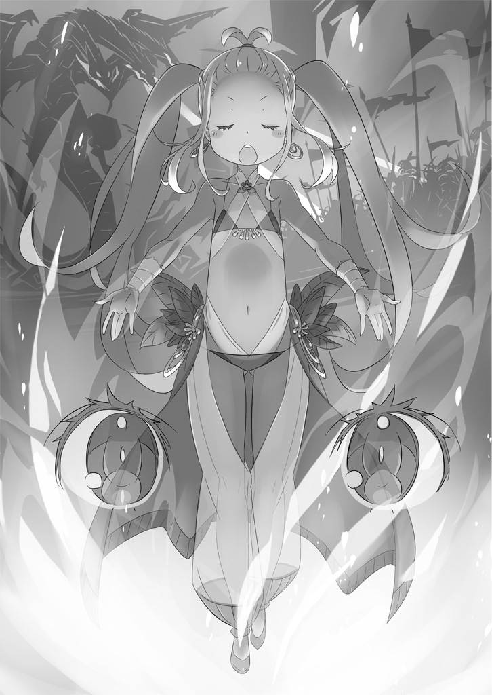
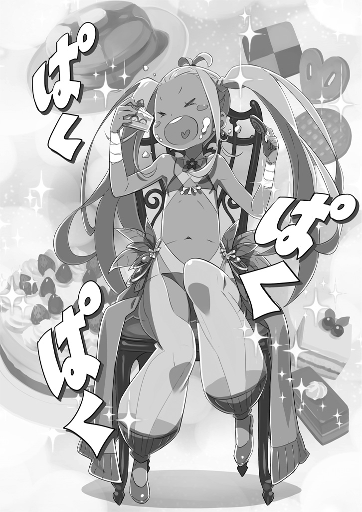
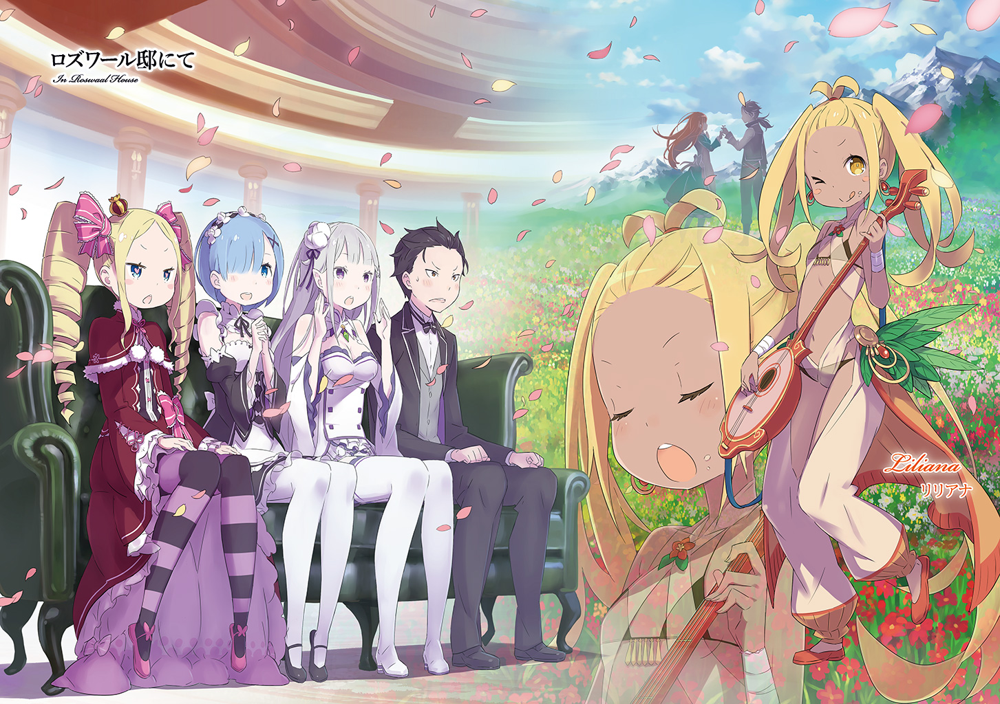
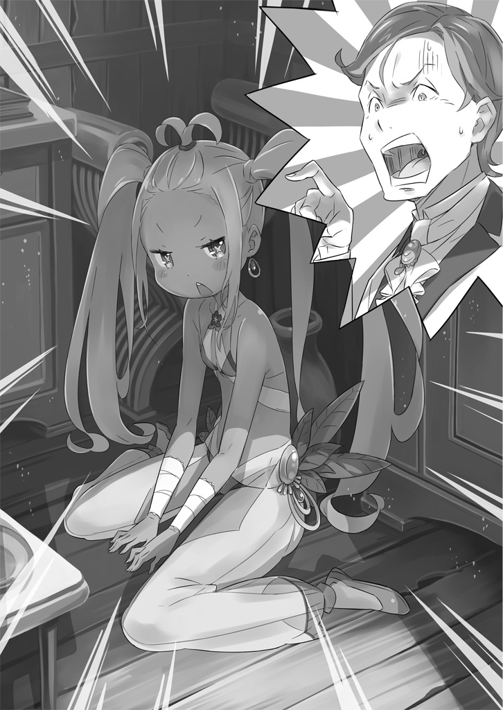
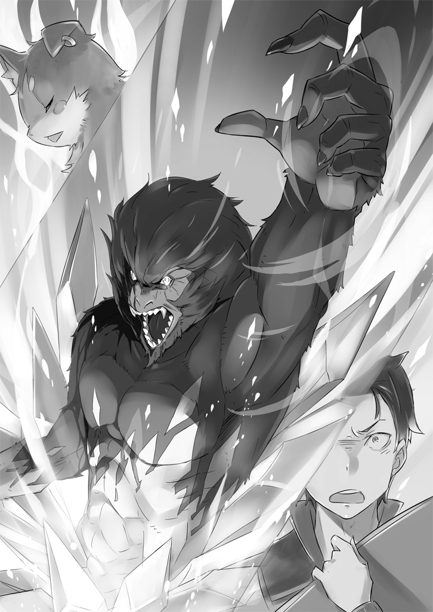

— Бард приезжает в деревню?

Нацуки Субару, услышав незнакомое слово, удивлённо повторил его. Он, как всегда неуклюже одетый в костюм дворецкого, протирал окно тряпкой. Травмы, полученные несколько дней назад, ещё давали о себе знать.

Тогда, во время нападения зверодемонов на особняк маркграфа Розвааля и соседнюю деревню Алам, ему досталось — хоть и без жертв обошлось. Теперь, когда суматоха улеглась, особняк и деревня вернулись к своей привычной жизни. Раны Субару почти зажили, и он, совмещая реабилитацию с работой по дому, старательно выполнял свои обязанности.

— Да, бард! Я слышала, как об этом говорила Рем, когда вернулась из деревни. А ты разве не знаешь, кто это такой? — прозвучал в ответ на вопрос голос, звонкий, словно серебряный колокольчик.

Длинные серебряные волосы обладательницы голоса плавно колыхались. Лицо её было столь прекрасно, что любой художник побоялся бы его рисовать, боясь испортить.

Но сейчас её фиалковые глаза горели любопытством, щёки покраснели от волнения… Эти сильные эмоции затмевали даже её неземную красоту. Субару иногда поражался её детской непосредственности.

— E-M-T 1 ! — воскликнул юноша.

— А? Что ты сейчас сказал? — удивлённо спросила девушка, немного наклонившая голову, — Эмилия. Она была спасительницей Субару… и тем, кого он любил. Субару, улыбнувшись её наивности, ответил:

— Ну… я никогда не видел бардов… Но, Эмилия-тан, ты, кажется, очень рада.

— Не кажется, а так и есть. Барды — это те, кто рассказывают истории с помощью песен и танцев. Ты же должен знать о них… Субару… может ты… — с надеждой посмотрела на Субару Эмилия и сложила руки.

Она произнесла его имя сладким голосом, словно прося об одолжении. Какой мужчина смог бы устоять перед такой красавицей? Субару — точно нет.

— Слушаюсь, моя госпожа. Но сначала нужно закончить уборку и спросить разрешения у наставницы.

— Хорошо. Извини, что отрываю тебя от дел.

— Ничего страшного. Пока я восстанавливаюсь, от меня многого не требуют. Так что наше свидание важнее.

— А, понятно. Мы пойдём вдвоём… значит, это свидание.

Субару посмотрел на улыбающуюся Эмилию, которая, казалось, не замечала его поддразнивания. Он взял ведро и тряпку и направился к особняку. В окне он увидел деревню Алам.

— Бард… — произнес он снова это слово и подумал, что оно звучит… волшебно. Настоящая сказка.

Субару спрятал свои чувства от Эмилии, но его сердце трепетало от волнения. Голос, что песнями и музыкой пленит людей, что рассказывает невероятные истории…

Размышляя об этом, Субару, сам того не замечая, улыбался, идя по коридору.

— Итак, я начинаю. Внимайте! — “Дельфин, преданный закатом”.

Мелодия, проникнутая меланхолией и грустью, словно дождь в разгар сезона дождей, разлилась по деревенской площади.

На сцене, сколоченной из грубых досок, стояла фигура с… чем-то средним между гитарой и укулеле в руках. Музыкант перебирала струны деревянного инструмента.

На корпусе инструмента был вырезан геометрический узор. Возможно, вся эта гнетущая атмосфера была лишь результатом мастерства исполнителя, но жители деревни были глубоко тронуты.

Завороженные печальной мелодией и словами песни, они сидели с пустыми, безжизненными глазами. Старушки плакали, словно наступил конец света. Возможно, даже недавнее нападение зверодемонов не произвело на них такого сильного впечатления.

— Если всё так плохо, то лучше умереть. Но я не умру. Мне не дадут умереть…

В песне рассказывалось о дельфине, преданном своим другом и невестой. Он стоял на мосту, где когда-то они дали друг другу важное обещание, и думал, не утопиться ли ему. Это был кульминационный момент истории.

Певица играла на своём инструменте, хотя её пение едва ли можно было назвать пением. Она жестами и мимикой передавала эмоции героя, создавая целый мир, полный боли и отчаяния. По её щекам текли слёзы. Зрители, видя это, тоже начинали плакать.

— Он выпускает пузырьки и опускается на дно безмолвного моря. О, дельфин… О-о, дельфин…

Похоже, дельфин всё-таки решился утопиться. Ветер и цветы безмолвно скорбели о его трагической судьбе… Песня закончилась.

— Боже мой! Да это же похоронный марш какой-то! — не выдержал Субару и выкрикнул своё негодование.

— Ой!

Певица, исполнявшая эту унылую балладу, вздрогнула от неожиданности. Атмосфера печали и отчаяния, царившая на площади, мгновенно рассеялась. Деревенские жители, словно очнувшись ото сна, огляделись по сторонам.

— А?..

— Ничего себе… Я целое ведро слёз выплакала.

— Старость — не радость… сразу в плач.

— Дельфин! Ты — моё второе «я»!

— Какая милая певица!

Люди стали делиться своими впечатлениями, вытирая слёзы. Вдруг кто-то из них заметил Субару, который пытался незаметно ускользнуть, и крикнул:

— Субару! Не портите нам настроение! — воскликнула Петра.

Субару так и подскочил от неожиданности.

— Позвольте представиться. Я — странствующий бард, Лилиана, — представился женский голос.

Перед ними стояла милая девушка, ещё не совсем расставшаяся с детской пухлостью щёк. Она быстро поклонилась. В её глазах плясали весёлые огоньки любопытства, золотистые волосы, заплетённые в два хвостика, подчёркивали её энергичный характер. Из-под плаща виднелся наряд танцовщицы, украшенный бусами из орехов и звериных костей. Несмотря на невысокий рост, руки и ноги её были длинными и стройными, а открытые участки кожи имели здоровый загар. Она выглядела как настоящая странствующая артистка.

— Взаимно! Нацуки Субару, к вашим услугам. Роскошный, великолепный… и немного стрёмный дворецкий. В том особняке, что через дорогу, — на все руки мастер.

— Стрёмный… что? Ладно. Привет. Приятно познакомиться, — сказала Эмилия.

Субару, даже при первом знакомстве, не удержался от своих странных шуток. Лилиана с трудом скрыла своё недоумение за вымученной улыбкой, стараясь не обидеть Субару и Эмилию, которые представились как люди феодала 2 .

Однако следующие слова Эмилии развеяли все её опасения.

— Эта песня… она была такой… трогательной. Я чуть не расплакалась.

Эмилия, переполненная эмоциями, схватила Лилиану за руку. Лилиана сначала удивилась, но, поняв, что её хвалят, засияла от радости.

— Не-е-ет! Я так рада, что вам понравилось! Я ещё только учусь, но если вы так говорите… А?!

— Стоп! Песня хорошая, но я подозреваю нарушение авторских прав! Мы проведём тщательную проверку, а пока… нам придётся прервать с вами всяческое общение и…

— Субару, — окликнула юношу Эмилия.

Субару тут же зажал Лилиане рот рукой, чтобы предотвратить какие-либо неосторожные высказывания. Однако его поведение не одобрила… сама Эмилия.

Эмилия, высвободив руку из захвата Лилианы, надула губы и укоризненно посмотрела на Субару.

— Субару, я понимаю, что ты волнуешься за меня, но так с девушками не обращаются. Ай-яй-яй.

— Давно я не слышал этого «ай-яй-яй»… Эмилия-тан…

— Всё в порядке. Она уже заметила твою грубость, так что скрывать её бессмысленно, — объяснила всё спокойно и с достоинством Эмилия, но Субару не мог успокоиться.

Её великодушие и снисходительность казались ему неуместными.

Эмилия была полуэльфом. И хотя в этом мире жили разные полулюди, предрассудки в отношении полуэльфов были особенно сильными. Эмилия не раз сталкивалась с неприязнью и презрительным отношением.

Субару не было смысла удерживать Лилиану, раз Эмилия её простила. Он неохотно отпустил девушку.

— Фух… Грудь! Моя грудь! Нельзя нападать на орудия труда! Что вы себе позволяете, господин дворецкий?!

— Я хочу быть мужчиной, который использует всю свою силу, чтобы защитить дорогих ему людей. А ещё… хоть я и многое повидал, но вы, госпожа, даже на самую неженскую девушку не тянете.

Этот мир был полон красавиц, но Лилиана, по мнению Субару, занимала одно из последних мест в этом рейтинге. Беатрис — на последнем, Фельт — на предпоследнем, а Лилиана — на третьем с конца.

— Вот так! Сначала выкручиваете руки, а потом ещё и оскорбляете! Ну!

Лилиана, возмущённая оценкой Субару, с ловкостью мышки проскользнула к Эмилии. Она посмотрела на Эмилию, и её лицо немного посерьёзнело.

— Вы не только красивы внешне, но и душой. Я в восторге.

— А? Да… правда? — ответила Лилиане Эмилия.

— Конечно! Простите меня за мою прежнюю грубость. Если бы этот дворецкий меня не остановил, мои родственники бы меня за такое убили!

— Ничего себе ты энергичная!

Субару был поражён её искренним признанием. Лилиана, улыбаясь, заиграла на своём инструменте.

— Я могу показаться слишком эмоциональной, но когда меня посещает вдохновение, я ничего не могу с собой поделать! Итак, я напишу балладу о красоте Эмилии-сама, о её доброте… и о том, почему она скрывает своё происхождение.

— Я таких людей ещё не встречал. Оригинально.

Лилиана была настоящим вихрем энергии. Её болтовня не казалась ни странной, ни неприятной. Это было следствием её искренности и… голоса. Прекрасного голоса, который невольно привлекал внимание. Быть бардом — её призвание.

— Или торговать барахлом для стариков.

— Постойте-ка… Вы это серьёзно или… издеваетесь? — преувеличенно отреагировала на слова Субару Лилиана.

Эмилия улыбнулась, глядя на эту неугомонную девушку. Подозрения Субару рассеялись, и он тоже улыбнулся.

— Спасибо за комплименты… но я не считаю себя красавицей.

— Ах! Как женщина… я не могу этого простить! Я поняла! Слушайте! — О, богиня…

— Цыц! Но… с Эмилией-тан ты не ошиблась. Ей бы самооценку поднять не помешало.

Субару и Лилиана одновременно возразили Эмилии. Она удивлённо наклонила голову, словно не понимая, что происходит.

Размышляя о том, как нервничал тем утром, когда его впервые позвали в столовую, Субару отпил глоток чёрного чая. Он сидел в гостиной особняка Розвааля.

— Субару, что с тобой? У тебя такое… странное выражение лица, — спросила Эмилия, сидящая рядом. Её слова вывели его из задумчивости. Чай был слишком крепким и горьким.

— Я вспоминал прошлое. О том, как в первые дни в особняке тоже сидел вот так, весь скорчившись от страха, — ответил Субару.

— Неужели? Мне казалось, ты всегда был храбрецом, — сказала девушка.

— Если это сарказм, то он довольно обидный! — воскликнул Субару.

Субару нахмурился, а Эмилия, глядя на его недовольное лицо, прикрыла рот рукой.

— Да шучу я, — сказала она. — Ты так задумался, вот я и решила тебя немного подразнить.

— Серьёзно? Тогда ты — E-M-A 3 !

— Да-да, конечно. И ты, Лилиана, не напрягайся так, — сказала Эмилия, не обращая внимания на возмущения Субару, и обратилась к Лилиане, которая сидела на краю дивана, вся съёжившись. Она бледная и испуганная смотрела на них, словно вся её прежняя весёлость испарилась.

— Что с тобой? Ты вся дрожишь. Куда делась твоя живость? — спросил Субару.

— Я… волнуюсь. Простая деревенская девушка, как я… да ещё у самого маркграфа… Вдруг я что-то не так сделаю… — пролепетала Лилиана.

— Тогда от тебя и твоих родственников и пепла не останется. Сожгут дотла, как бешеных псов. — сказал Субару, резко рубя воздух рукой.

Лицо Лилианы стало ещё бледнее. Эмилия ударила Субару по колену.

— Субару! — воскликнула девушка.

— Ой, извини-извини, — усмехнулся Субару, глядя на надувшуюся Эмилию. — Не думал, что она так испугается.

На самом деле, он был доволен, что Лилиана стала такой тихой и послушной. В деревне она вела себя слишком бесцеремонно.

Субару, Эмилия и Лилиана вернулись в особняк Розвааля из деревни Алам. Сейчас они сидели в гостиной и вели непринуждённую… хотя, скорее, напряженную беседу.

Хозяин особняка разрешил им побеседовать с гостьей — Лилианой.

— Вы бы видели лицо Рам, когда она передавала нам ваше приглашение! Она смотрела на нас, как на… источник всех бед и несчастий, — сказал Субару.

— Ой! Значит, меня не ждут… Тогда… я, пожалуй, пойду… — встрепенулась Лилиана.

— Нет, всё в порядке, оставайся. Субару же не угрожал тебе. Тебе не жалко Лилиану? — спросила Эмилия.

— Я не угрожал, я просто констатировал факт. Рам обожает Розвааля, и я не хочу создавать ей проблем, — ответил Субару.

Рам, горничная в этом особняке, была предана Розваалю. И когда её попросили передать ему просьбу о встрече с Лилианой, она была явно недовольна. Сейчас она разговаривала с хозяином с весьма кислой миной.

— Кто знает, что она ему там рассказывает. Может, она ему сказала, что какой-то двухметровый бард с хриплым голосом требует его принять, — продолжал Субару.

Даже Розвааль, известный своей любовью ко всему необычному, вряд ли захочет встретиться с подозрительным типом. Лилиана уже почти потеряла надежду.

— Не переживай ты так. Моя сестра всегда справедлива. Она точно передаст слова Розваалю без всяких приукрас, — сказала девушка, входя в комнату с подносом, от которого поднимался пар.

Это была красивая девушка в очаровательном платье горничной с открытыми плечами — Рем.

Она грациозно расставила пирожные и разлила чай по чашкам. Субару, глядя, как Рем держит чайник, протянул ей свою чашку.

— Если не секрет, я думал, чай разносит только Рам, — спросил Субару.

— Сестра очень занята… А ещё… я всегда хочу сама наливать чай Субару-куну. Я… вкладываю в него всю свою… душу, — ответила Рем.

— Может, хватит вкладывать туда душу, а просто налить кипятка с заваркой? — сказал Субару, передёрнув плечами.

— Как жаль, — надула губки Рем.

С тех пор, как они справились с нападением зверодемонов, Рем постоянно так с ним разговаривала. Субару был рад видеть эти проявления её глубокой привязанности, но, как мужчина, он чувствовал себя… немного неловко.

Никто вокруг, да и он сам, не понимал, что это были классические симптомы… влюблённости.

— Ладно, перейдём к делу. Я угостил вас чаем и пирожными, чтобы вы не скучали, пока ждём Розвааля. Контракт исполнен, — сказал Субару.

— То есть… вы использовали вкусный чай, пирожные… и милую горничную… чтобы развлечь всех?… Я прямо смущена, — пробормотала Рем, прикрыв руками покрасневшие щёки.

— Именно так. Но ты как-то подозрительно быстро добавила себя в этот список, — усмехнулся Субару.

Рем, смущённо улыбаясь, тихо спросила:

— И всё-таки… я слышала, что речь идёт просто о барде. Зачем же её приглашать в особняк?

— А-а, Эмилия-тан очень заинтересовалась… Но дело не только в этом. Эта девушка… каким-то образом смогла обойти защиту Эмилии-тан.

Рем прищурилась. Защита — это магический эффект, вплетённый в одежду Эмилии. Он скрывал её эльфийское происхождение от посторонних глаз. Если человек не обладал достаточной магической силой или не получал специального разрешения от Эмилии, он не мог видеть её настоящий облик.

— Обойти защиту… Это магия Розвааля-сама, её не так-то просто сломать, — рассуждала вслух Рем.

— Вот именно, — сказал Субару. — Поэтому я и решил перестраховаться.

Именно поэтому он под предлогом чая и пирожных пригласил Лилиану в особняк. Лилиана, хотя сначала и колебалась, быстро согласилась. Субару волновало её будущее.

— Понятно. То есть, вы хотите… заставить её молчать, чтобы она ничего не рассказала? — спросила Рем.

— Ты меня не поняла! Звучит так, будто я задумал ужасное, — воскликнул Субару.

— Да ладно тебе, Субару-кун. Я же не настолько… — Рем мило улыбнулась и показала язык. — Шучу.

Но Субару ей не поверил.

— Твои пирожные — просто чудо! — сказал Субару. — Даже Лилиана, которая так волновалась, сразу же успокоилась, как только их попробовала.

Рем была мастером на все руки, но выпечка у неё получалась особенно хорошо.

— Дай-ка я ещё одно… М-м-м… Вкуснятина! Рем, ты волшебница!

— Спасибо! Я вложила в них… всю себя. Ради Субару… Я готова больше никогда не печь пирожные, если… ему понравятся эти… — ответила Рем.

— Да ты словно душу дьяволу продала ради этих пирожных! — воскликнул Субару. — Они что, такие важные?

Субару наслаждался вкусом пирожных, но его слова прозвучали… немного насмешливо.

Лилиана, кажется, тоже расслабилась. Она откинулась на спинку дивана и начала поглаживать себя по животу.

— …Хр-р…

— Я ещё не настолько добрый, чтобы прощать такое! — воскликнул Субару.

— А! Я не сплю! Я… просто… притворяюсь, что сплю! Чтобы… поймать убийц! — вскочила Лилиана.

— …?! Кто-то хочет тебя убить? — воскликнула Эмилия.

— Вот видишь! Даже такой ангел, как ты, повелся! — воскликнула Лилиана.

Эмилия, которая никогда ни в ком не сомневалась, попала в ловушку бойкой Лилианы.

Лилиана была девушкой крайностей: она могла быть либо чрезмерно возбуждена, либо совершенно вялой. Она вытерла нитку слюны с подбородка.

— Кстати, госпожа… я слышала, что вы бард, — сказала Рем, неожиданно меняя тему разговора.

Лилиана поспешно взяла свой инструмент, прислонённый к дивану.

— Д-да! Простите, что я так… нагло ворвалась в ваш мир со своей… лютней! — пролепетала она дрожащим голосом.

— Ты прямо как природная стихия! — воскликнул Субару.

Самоуничижение Лилианы было довольно забавным. Рем, не обращая на это внимания, захлопала в ладоши. Её голубые глаза сияли тем же восторгом, что и у Эмилии, когда та услышала её пение.

— А вы знаете много историй? — спросила Рем.

— …Д-да! Конечно! — воскликнула Лилиана, её глаза заблестели.

— Я же не зря десять лет скитаюсь по свету со своей лютней. Мои песни доводят людей до слёз, воспламеняют сердца, заставляют терять рассудок, — сказала Лилиана, обхватив лютню.

— Погоди! Десять лет?! Тебе сколько лет вообще?! — воскликнул Субару.

— В этом году мне исполнится двадцать, — ответила Лилиана.

— Двадцать?! С такой-то внешностью и… детским лепетом?!

Лилиана выглядела совсем юной, фигура её была ещё девочкой. Субару было немного стыдно, что он так откровенно разглядывал её.

— Сейчас не время обсуждать… законность… этих… лолей… Я увидел нечто более… ужасное… — пробормотал Субару.

— Да тихо ты. У человека, который тебе нравится, есть просьба, — сказала Лилиана, отмахнувшись от Субару, и посмотрела на Рем. Затем она взяла лютню, пристроив одну ногу на диван.

— Я готова выполнить любую просьбу. Что бы вы хотели услышать? Какой-нибудь шедевр… например… «Песнь Любви Демона Меча»!

— Какое-то название… зловещее, — сказал Субару.

— Да что ты говоришь! «Песнь Любви Демона Меча» — известнейшая баллада, которую поют не только в Лугунике, но и во многих других странах! Это история о… неуклюжем, но искреннем воине, которая заставляет девушек мечтать о такой же любви.

— Правда?… — удивился Субару.

— Конечно! Особенно финал… я сама всегда плачу, когда его пою. Сцена, где Демон Меча сражается на мечах со своей возлюбленной, а потом… они… складывают оружие… — просто шедевр!

— То есть, возлюбленные… дерутся друг с другом?! — воскликнул Субару.

Субару казалось, что это… слишком жестоко. Конечно, он читал книги о том, как люди «убивали друг друга из-за любви», но в жизни он с таким не сталкивался.

— Что ты такое говоришь, Субару-кун? «Песнь Любви Демона Меча» — классика Лугуники. Я её много раз слышала, — сказала Рем.

— Серьёзно?! Правда?! Эмилия-тан, а тебе она нравится?

— Боюсь, тебя разочарую, но я её не знаю. — ответила Эмилия.

— Нет, всё в порядке! Это было ожидаемо! — воскликнул Субару. — Скорее, меня удивляют вкусы Рем.

Лилиана, не обращая внимания на их разговор, продолжила, словно листая в уме свой песенник:

— А ещё есть «Синяя молния Волакии» и «Герой с Холма мечей» . Ну и, конечно, «Хосин из пустыни» — баллада о том, как были основаны города-государства Карараги.

— Да ты прямо ходячая энциклопедия. А почему так много песен о… великих людях и их подвигах? Ты их специально собираешь? — спросил Субару.

— У меня, конечно, есть свои предпочтения, но публика любит истории о героях. Это же так вдохновляет! Вот я и стараюсь их сохранить и передать людям через свои песни, — сказала Лилиана, слегка покраснев. Она приоткрыла Субару и Эмилии цель своего путешествия.

Субару покачал головой, показывая, что не собирается насмехаться над ней.

— Здорово. В твоём-то возрасте уже найти своё призвание… Хотя… ты же говорила, тебе двадцать?

— Ты опять начинаешь? Если тебя так волнует мой возраст, можем обратиться в суд. Я не против, — сказала Лилиана.

— Какой ещё суд в этом мире… — пробормотал Субару. — Наверное, что-то вроде того, что и у нас называют судом.

— Госпожа… а вы путешествуете, чтобы… распространять эти песни? — спросила Рем.

— Ну… не только. Конечно, это тоже важно… но у меня есть более… личная цель. Это… — ответила Лилиана, и её лицо стало серьёзным.

— Прошу прощения, что прерываю вашу беседу, — раздался голос.

В дверь постучали, и в комнату вошла девушка, вежливо поклонившись.

Она была очень похожа на Рем. Розовые волосы, прищуренные светло-красные глаза… Рам подняла голову и сказала:

— Хозяин Розвааль-сама готов принять вас.

Эти слова, обращённые к «дорогой гостье», прозвучали… довольно сухо.

— Я — хозяин этого особняка, маркграф Розвааль L. Мейзерс, — представился мужчина.

Лилиана молча застыла перед ним.

Розвааль взглянул на неё. Встреча с маркграфом — это волнительно, особенно для того, кто не привык к обществу знати. К тому же Розвааль… выглядел довольно пугающе.

— А я-то думал, мы встретим какого-нибудь извращенца в клоунском гриме, — сказал Субару.

— Барусу! Как ты смеешь так говорить о Господине Розваале?! Я тебе это так не оставлю! — воскликнула Рам.

— Ты тоже обратила внимание на его… странный вид. И что же ты мне сделаешь? — спросил Субару.

— Хм… ещё не решила, — ответила девушка, злобно глядя на Субару.

Розвааль удержал Рам и, спокойно усевшись на кожаный диван, закинул ногу на ногу. Его высокий статус и титул странно сочетались с этим нелепым нарядом и манерами. Всё это производило странное впечатление.

Жители округи уважали его, но, увидев его вблизи, многие были… разочарованы.

— Ви-и-и-идеть удивлённые лица — моё любимое развлече-е-е-ение, — протянул Розвааль. — Мне нравится и реакция Субару-куна, но… такие лица — это просто шедевр. Правда, Субару?

— Не надо делать из меня своего сообщника, — ответил Субару. — У меня и своих недостатков хватает.

Если быть честным, он и сам любил порой поиздеваться над людьми. В этом он был похож на Розвааля.

— Для меня большая честь быть принятой вами, — сказала Лилиана. — Я… бард Лилиана… к вашим услугам… господин маркграф.

— Хмм, превосходно, превосходно. Если ты умудря-а-а-аешься говорить связно, несмотря на дрожь в го-о-о-олосе, значит, встреча с тобой… не лишена смы-ы-ы-ысла. Я известен своим… терпением, так что расслабься, — произнёс мужчина.

Розвааль, конечно, немного прихвастнул, но не соврал. Будь он злобным тираном, каких часто описывают в книгах, он бы тут же выгнал Субару.

— Я слышала, что к нам приехал бард, и… познакомилась с Лилианой. Она говорит, что ищет редкие истории. Я подумала, что вы, Розвааль, могли бы ей помочь, — сказала Эмилия.

— Хм-м. Если Госпожа Эмилия так просит, я не могу-у-у-у отказать, — протянул Розвааль, изысканно улыбаясь.

Розвааль откинулся на спинку кресла и скрестил руки на груди. Он на несколько секунд закрыл глаза, затем посмотрел на Лилиану… жёлтым глазом. Лилиана съёжилась и задрожала под его пронзительным взглядом.

— Не бойся, — сказал Розвааль. — Я на твоей стороне. Раз уж Эмилия-сама за тебя заступи-и-и-илась, я тоже постараюсь тебе помочь.

— Д-да… С-с-спасибо… — пролепетала Лилиана.

— Итак, бард. Бард, говоришь. Ну и ну… какое своевре-е-е-еменное совпадение.

Розвааль улыбнулся ещё шире.

Субару почему-то стало не по себе. В этой улыбке, в этих алых губах… было что-то нехорошее. Он подозревал, что Розвааль что-то задумал.

— Ты сказала, тебя зовут Лилиана, верно? — спросил Розвааль. — Госпожа Эмилия просила мне помочь тебе. И я хочу это сделать. Но для этого мне нужно знать… некоторые подробности.

— Какие… подробности? — спросила Лилиана.

— Например… какова це-е-е-ель твоего путешествия? — спросил Розвааль, и его голос стал тише.

Лицо Лилианы, до этого напряжённое и испуганное, изменилось.

Она закрыла глаза, а когда открыла их, посмотрела прямо на Розвааля.

— Я путешествую… в поисках новых легенд, — сказала она, глядя прямо в глаза Розваалю.

Субару вздрогнул, услышав эти слова. «Новые легенды»… Эта фраза зажгла в его душе… огонёк надежды. Он был мужчиной, и его всегда привлекали героические истории.

— Новые легенды… — повторила Эмилия.

— Да, — сказала Лилиана. — Я ищу их… и пою о них.

В голосе Лилианы звучала какая-то дьявольская сила.

Сила, которая проникала прямо в сердце. Эмилия, словно заворожённая, кивнула. Лилиана коснулась струн своей лютни.

— Мы, барды, живём, чтобы превращать истории в песни. Песни, которые… проникают в сердца людей, которые хранят память о прошлом… об истории. Песня, которая живёт долго… она обретает особую силу. Это значит, что бард, сочинивший её, продолжает жить в этом мире даже после смерти, — сказала Лилиана звонким голосом.

Никто не перебивал её.

— Мы не можем оставить после себя чего-нибудь материального. Наш инстинкт не позволяет нам остановиться. Мы не знаем письма не умеем строить дома. Мы странствуем по миру, поём наши песни… и если нам удаётся достучаться до чьих-то сердец, мы идём дальше. А когда наши силы иссякают мы умираем в пустыне, обняв свою лютню. Вот кто мы такие, — её голос, слова, глаза, жесты… всё излучало силу. Как когда она пела.

— Мы можем оставить после себя только песни в сердцах людей… Поэтому мы хотим создать нечто, что будет жить вечно… Мы хотим доказать, что мы жили что наши души оставили след в истории… Это единственная награда, которой мы жаждем, — договорила Лилиана.

В её словах, хоть в них и не было музыки, была особая мелодия, которая тронула Субару до глубины души. Её взгляд на жизнь был… настолько убедителен, что никто в комнате не мог вымолвить ни слова.

Наверное, кто-то мог бы упрекнуть её в чрезмерном упрямстве и самомнении. Но это означало бы отвергнуть весь образ жизни бардов, который она так пламенно защищала.

Субару пока не был на это способен.

У него не было права судить Лилиану.

— Хм-м… Зна-а-а-ачит, ты ищешь… новые легенды, — раздался голос Розвааля в наступившей тишине.

Из всех присутствующих он лучше всего понимал, что такое — следовать своей мечте. Он одобрительно кивнул.

Лилиана выпрямила спину, восхищённая его пониманием.

— Живые легенды… Истории, которые будут жить в сердцах людей… Мы, барды, гордимся тем, что передаём их из поколения в поколение. Но я хочу быть первой, кто споёт песню, которая останется в веках. Я хочу быть голосом новой, только зарождающейся, истории… Вот моя мечта, — сказала Лилиана.

— А…

«Поэтому я ищу новые легенды», — сказала Лилиана.

Первая страница истории, которую никто ещё не пел, не знал… но которая уже была написана в этом мире.

Лилиана была готова на всё, чтобы спеть эту песню, даже если ей суждено будет умереть в пустыне, в конце своего пути.

— Восхити-и-и-ительный энтузиазм. И какие же легенды ты ищешь? Гнаться за чем-то бесфо-о-о-орменным… это как… пытаться поймать облако. Ты ничего не найдё-о-о-ошь, пока не поймёшь, что именно ты ищешь.

— Если можно, я хочу найти… историю о герое, — сказала Лилиана.

— О герое? — переспросил Розвааль.

Эмилия удивлённо ахнула.

Субару тоже был поражён силой этих слов — «история о герое».

«Герой»… Это слово волновало кровь, пробуждало мечты о подвигах.

Даже в его мире многие герои оставили свой след в истории. Героические саги — это то, что всегда будет волновать людей, в любом мире, в любое время.

— Значит, Лилиана… хочет услышать историю… о новом герое? — спросила Эмилия.

— Ну… не так-то просто найти героев в наше время. Может быть, несколько сотен лет назад, когда ведьмы творили бесчинства, и мир был полон опасностей, герои были нужны… Но сейчас герои не очень-то…

Именно потому, что наступило мирное время, герои стали не нужны.

Время без героев — это время, когда герои не нужны. Лилиана, кажется, и сама это понимала. Она с досадой махнула рукой.

— …Интересно, — прошептала она.

Все услышали её слова. Субару недоумённо посмотрел на неё, не понимая, что она имеет в виду. Розвааль, видя их реакцию, рассмеялся.

— Бард, который ищет новые легенды… Это просто судьба! Нет, это просто… уморительно! — воскликнул мужчина.

— Розвааль, что ты говоришь? — спросила Эмилия, подойдя к нему. — Мы не понимаем… И Лилиана тоже. И я не понимаю… Прекрати смеяться и объясни всё нормально.

Розвааль посмотрел на её красивое лицо и сказал:

— С удовольствием, Госпожа Эмилия. Я исполню желание госпожи Лилианы.

— А? — удивилась Эмилия. — У тебя есть новая легенда?

— Конечно. — И она связана с вами, Госпожа Эмилия.

— Со мной?… — удивилась Эмилия.

Розвааль загадочно улыбнулся. Субару, глядя на них, вдруг понял, что задумал Розвааль.

Если он не ошибается, то это и в самом деле… будет новая легенда.

— Вы знаете новую историю о герое? — спросила Лилиана. — Тогда… расскажите мне, пожалуйста!

— Нет, — ответил Розвааль.

— Э-эх! — разочарованно воскликнула Лилиана.

Розвааль безжалостно разрушил надежды Лилианы, которая уже была готова отправиться на поиски новой легенды. Эмилия, защищая её, сердито посмотрела на Розвааля.

— Розва-а-аль! — протянула девушка.

— Не смотри на меня так стро-о-о-ого, — сказал Розвааль. — Ты портишь своё прекрасное лицо. И я же не со зла… Неужели я похож на злод-е-е-е-ея?

— Если вы с Субару вместе что-то задумали, то вполне возможно, — ответила Эмилия.

— Это клевета! — воскликнул Субару, ощущая себя невинно оклеветанным.

— Ой, извини, — сказала Эмилия, испугавшись его реакции.

Лилиана, которая до сих пор сидела тихо, снова обратилась к Розваалю:

— Тогда… что мне нужно сделать… чтобы вы мне рассказали?

— Эта… «леге-е-е-енда» слишком важна, чтобы обсуждать её с первым встречным, — протянул Розвааль. — Поэтому… мы должны убеди-и-и-иться, что тебе можно доверять.

— И… что же мне нужно сделать? Мои руки вам не нужны, но мои пальцы на ногах… я могу пожертвовать ими в качестве клятвы!

— Успокойся уже! — воскликнул Субару. — И побереги свои пальцы!

Субару попытался успокоить Лилиану, которая уже начала перечислять, какие части своего тела она готова пожертвовать.

Разница между «странствующим бардом» и… просто бродягой была довольно размыта. Это напоминало ему его собственную ситуацию: попасть в другой мир с одним пакетом и без родственников.

Как бы то ни было, Розвааль был прав. Если его план совпадает с тем, о чём думал Субару, то раскрывать его Лилиане… слишком рискованно.

Лилиана разочарованно поникла.

— Нам нужно… вре-е-е-емя, — сказал Розвааль. — Думаю-у-у-у мы можем… предоставить тебе комнату в особняке-е-е-е на несколько дней. Если за это время ты докажешь, что нам мо-о-о-ожно тебе доверять я расскажу тебе о героях.

— … — Лилиана замерла, словно увидев свет в конце тоннеля.

Именно так можно было описать её состояние. По крайней мере, так показалось Субару.

— Х-хорошо! Я тоже девушка! Если вы на это согласны, то… я с радостью приму ваше предложение! — воскликнула Лилиана.

Видя, как ловко Розвааль управляет ею, попеременно то угрожая, то обещая, у Субару мелькнула мысль, что ей бы цены не было на сцене.

— Ой… А меня что, развели? Или мне показалось? — спросила Лилиана.

— Тебе не показалось, — ответил Субару. — Ты сама на это повелась.

Они шли по дороге в деревню Алам. Субару не удержался от замечания по поводу доверчивости Лилианы. Она обиженно надула губы.

— Как жестоко! Нельзя так говорить с девушкой, которую только что… обманули и использовали! Ну правда же!

— Вы не правы, госпожа. Субару-кун всегда очень мил, — сказала Рем, шедшая рядом с ними.

— На такой ответ у меня просто нет слов, — возмутилась Лилиана.

Рем спокойно отвергла возмущения Лилианы, и та, расстроенная, шла молча. Субару вздохнул: видимо, она ещё долго будет дуться.

Лилиана попалась на уловку Розвааля, и теперь он собирался некоторое время наблюдать за ней.

Они отправились в деревню Алам, чтобы забрать вещи Лилианы. Субару и Рем сопровождали её, чтобы она не сбежала.

Розвааль велел Субару не спускать с неё глаз, а Рем должна была присматривать за ними обоими. Ни Субару, ни Лилиане он не доверял. Хотя, если быть точнее, Субару просто слишком много себе надумывал, а Рем старательно выполняла приказ.

— И всё-таки… Роз-чи слишком скрытный. Кто знает, что у него на уме, — сказал Субару.

— А ты, господин дворецкий, можешь догадаться? — спросила Лилиана.

— Примерно. Но я не скажу тебе. По тем же причинам, что и Розвааль. Как ни странно, в этом мы с ним согласны, — ответил Субару.

— М-м-м! — промычала Лилиана, словно какое-то животное.

Субару было даже немного жалко её: цель её путешествия была так близка, но она ничего не понимала.

— На самом деле, оставить свой след в истории не так-то просто. Если мы сейчас попытаемся найти каких-нибудь героев прошлого, то… вряд ли у нас что-то получится, — сказал Субару.

— Согласна. Это очень сложно. Я была бы просто счастлива, если бы нашла героя, чье имя ещё не известно миру, и спела о нём песню… Если бы только существовал способ заглянуть в будущее… — сказала Лилиана.

— К-к-какой бред! — воскликнул Субару. — Способ заглянуть в будущее…

— Ты чего так разнервничался? — удивилась Лилиана.

В каком-то смысле, его «Посмертное возвращение» и было таким способом.

Этот разговор был для него… слишком личным, и он занервничал. Лилиана с недоумением посмотрела на него. Рем, видя их состояние, решила вмешаться. Она, улыбаясь, хлопнула в ладоши.

— Госпожа, у меня для вас хорошие новости! — воскликнула она. — Я знаю одну… новую легенду!

— А?! Правда?! — воскликнула Лилиана, и её лицо осветилось радостью.

Рем была так добра к ней, что Лилиана не могла не поверить ей.

Но Субару насторожился. Если Рем собирается рассказать ей секрет Розвааля, то это слишком рано.

Рем, сияя от уверенности, показала на Субару.

— Это… Субару-кун.

— А? — одновременно удивились Субару и Лилиана.

— Это новая легенда, — продолжала Рем. — История о герое, чье имя… скоро будет у всех на устах. О… Субару-куне.

Субару и Лилиана недоумённо смотрели на Рем. Субару даже забыл возразить.

— Субару-кун, — настаивала на своём Рем.

Субару не понимал, шутит она или говорит серьёзно. Но Лилиана, кажется, что-то решила. Она посмотрела на Субару, потом на Рем и сказала:

— Я поняла. Слушайте. — Новая легенда: «Искусный сердцеед».

— Замолчи! — крикнул Субару и тяжело вздохнул.

Слуга, который предупредил об опасности в деревне и рисковал жизнью, чтобы защитить людей от магических зверей… Кто в это поверит? Чушь какая-то.

— А я серьёзно… жаль, что вы мне не верите, — сказала Рем, огорченно опустив голову.

Субару стало стыдно. Он не заслужил такого доверия.

«Посмертное возвращение» было его единственной надеждой в этом мире. — Но даже с его помощью он не всегда мог предотвратить трагедию.

Он знал, что кто-то другой справился бы лучше. Это убеждение крепко сидело в его голове.

«Сколько бы раз я ни умирал, боль остаётся той же… Даже если я могу… сохраняться и перезагружаться… небеса меня накажут…»

Его способность имела много ограничений. Смерть была неизбежной платой за её активацию.

Он не просил об этой силе. Он скорее был готов проклинать её, чем благодарить.

— Субару-кун, — позвала Рем тихим, встревоженным голосом.

Что-то в её голосе заставило Субару очнуться от своих мрачных мыслей. Он посмотрел вперед и понял, почему она его остановила.

— Кто это? — прошептал он.

Дорогу к деревне преграждали четыре фигуры.

Они были одеты в белое с головы до ног: белые балахоны, белые маски, белые костюмы… Всё белое. Лица, фигуры, рост… — всё было скрыто под белой тканью.

— Ничего себе… сколько же в этом мире… любителей маскарада… — пробормотал Субару, осматриваясь по сторонам.

Их странные наряды… настораживали. На открытое нападение они пока не решались.

— Если вы заблудились, просто вернитесь назад. Обычно дорогу очищают от травы, — сказал Субару. — За мной — особняк маркграфа, впереди — деревня…

— …

— А, так вы не заблудились?… — сказал Субару, намеренно провоцируя их.

Из-под рукавов белых балахонов блеснули лезвия ножей.

Люди в белом медленно надвигались на них. Субару нервно сглотнул.

Не говоря ни слова, они замахнулись ножами.

— Я не знаю, кто вы, но, похоже, вы наши враги, — с угрозой сказала Рем.

И тут же ударила ближайшего из них кулаком в лицо.

Раздался глухой удар, и человек в белом отлетел назад, с размаху ударившись головой о землю. Его тело обмякло, а белая маска… покраснела.

— Ого, больно наверное, — сказал Субару, не в силах сдержать своё восхищение.

— А?… — удивлённо воскликнули люди в белом, которые до этого молчали.

Они посмотрели на своего товарища и на Рем, которая стояла перед ними… но их озарение продлилось недолго.

— Я… потеряла своё оружие в лесу, — сказала Рем. — Так что… пока придётся драться голыми руками. У вас есть возражения?

«Потеряла в лесу»… она имела в виду свой моргенштерн… Её тонкие белые руки, которые так ловко владели этим оружием… теперь сами стали опасным оружием.

Рем подняла руки, и люди в белом, переглянувшись, попятились.

— Отступаем! — крикнул один из них.

Они подхватили своего бессознательного товарища и бросились бежать. Рем проводила их взглядом, пока они не скрылись в лесу.

— Я немного волновалась, — сказала Рем. — Не знаю, смогла бы я защитить Субару-куна без… оружия…

— Ты говоришь, волновалась?… Да ты их одним ударом уложила! — восхищенно сказал Субару.

— Субару-кун… ты меня смущаешь… — пробормотала Рем, прикрыв руками покрасневшие щёки.

Субару кивнул и посмотрел в ту сторону, куда убежали люди в белом. Они были похожи… не просто на разбойников.

— Как думаешь, кто это был? Может, кто-то из врагов Эмилии?

— Возможно… Но у Господина Розвааля тоже много врагов… Хотя он старается их не наживать… — сказала Рем.

— Вот как? — сказал Субару, немного встревожившись. — Я начинаю беспокоиться за безопасность особняка… и…

Он посмотрел в сторону и увидел, что Лилиана, которая до сих пор молчала, пытается незаметно улизнуть. Субару схватил её за плечо и, изобразив самую дружелюбную улыбку, на которую был способен, спросил:

— Ты куда это собралась, Лилиана?

— Ой! Простите… Я… извините… не сердитесь… — пролепетала Лилиана.

— Я не сержусь! — воскликнул Субару. — Это у меня улыбка такая… расслабляющая… Присмотрись!

— А-а-а! — взвизгнула Лилиана, ещё больше испугавшись.

Субару удивился её реакции. Рем подошла к Лилиане и погладила её по спине, словно маленького щенка.

— Не бойся, Субару не страшный. Просто у него глаза немного… необычные, — сказала Рем.

— Ну, это ваше личное мнение, — пробормотала Лилиана. — Я уже успокоилась… всё хорошо.

— Что-то мне в это не верится, — сказал Субару. — Ладно. И всё-таки, почему ты пыталась сбежать? Неужели…

«Ты — сообщница этих людей в белом и хочешь помешать Эмилии в выборе на престол?» — хотел спросить он, но Лилиана прервала его, бросившись на колени.

— Простите! Но я не плохая! Просто эти люди… они меня преследуют. Я не хотела вас впутывать, но подумала, что вы могли бы мне помочь… — выпалила она.

Субару вытаращил глаза, слушая её сбивчивые объяснения. В ней не было ни капли от хитрого шпиона.

— Погоди… так ты не врала, когда говорила про убийц?! — обеспокоенно воскликнул Субару.

Субару лишь стонал: проблем становилось всё больше.

— В общем, Лилиану преследовали какие-то люди, — закончил свой рассказ Субару и устало откинулся на спинку дивана.

Они вернулись в особняк Розвааля и сейчас находились в кабинете. Кроме Субару, там были ещё трое.

— Если честно, нас спасла только Рем, — сказал Субару, указывая на сидящую рядом девушку. — Признаться, если бы не она, нас бы убили.

— Да, к счастью, я была рядом, — сказала Рем. — Хотя, с моим “оружием” я была бы… полезнее.

— Тогда от них бы и мокрого места не осталось… — сказал Субару. — Да, эта мысль меня успокаивает.

Субару улыбнулся. Те парни, которых вырубила Рем, наверное, не ожидали, что милая девушка может быть такой… опасной.

— А бард сейчас… в гостевой комнате? — спросила Рам.

— Да, с Эмилией-тан. Мы сказали ей, что это для её же безопасности… но если она что-то заподозрит, то может сбежать. Поэтому Эмилия… с её доверчивостью… — лучший вариант, — ответил Субару.

— Понятно. Похоже, ты понимаешь, зачем Господин Розвааль оставил эту певицу у нас, — сказала Рам, кивнув и пронзительно посмотрев на Субару.

— Он хочет, чтобы Лилиана… стала своего рода… глашатаем Эмилии-тан на выборах, да? — сказал Субару, пожав плечами. — Лилиана мечтает создать новую героическую балладу. История о новом короле… идеально подойдёт.

— Для Барусу ты довольно быстро сообразил, — сказала Рам. — А я-то думала, что у тебя вместо головы… пустая тыква.

— Если ты про светильник Джека, то… не совсем, — ответил Субару. — Впрочем, Розвааль, наверное, задумал что-то подобное.

В этом мире не было телевидения и газет. Влияние бардов, которые путешествовали по стране и рассказывали людям истории и легенды… было гораздо сильнее, чем мог себе представить Субару.

И в этом смысле Лилиана могла бы оказать Эмилии неоценимую помощь.

— Субару быстро схва-а-а-атывает, — протянул Розвааль, довольно хихикая. — Именно так я и задумал. Хотя… нужно учитывать все плюсы и минусы…

— Плюсы и минусы? — переспросил Субару с подозрением.

— Должна заметить, — сказала Рем, — что Госпожа Эмилия — полуэльф. И любой бард может отказаться её воспевать. Но Госпожа Лилиана, кажется, хорошо относится к Госпоже Эмилии и… может быть, она согласится на определённых условиях.

— То есть, мы хотим повесить на неё все наши проблемы, выдав это за заманчивое предложение? У меня сейчас не слишком хитрое выражение лица? — спросил Субару.

— Как всегда, — ответила Рам.

— Как всегда очаровательно, — сказала Рем.

Субару криво улыбнулся, поражаясь хитрости Розвааля.

Он уже уговорил Лилиану остаться… и продолжал плести свои интриги.

Субару хотел было возразить, но Розвааль только отмахнулся, лучезарно улыбаясь. Субару вздохнул.

— В общем, нам нужно решить эту проблему… и внимательно следить за Лилианой. Жаль, что эти типы сбежали. Если бы мы хоть одного поймали…

— Ты бы ему все кости переломал, заставил бы его выблевать все внутренности, а потом… добил бы его, — сказала Рам.

— Если бы я так с ними поступил, они бы даже кровавую мокроту не смогли выплюнуть, — сказал Субару. — Не надо так жестоко.

Субару понимал, что Рам не шутит. Её жестокость была… пугающей.

— Я, конечно, осторожен, — сказал Субару. — Но если на меня нападут, я смогу только громко визжать и звать на помощь. Впрочем, вряд ли кто-то решится на это в особняке маркграфа.

— Если я услышу твой голос, Субару, я тут же прибегу, — сказала Рем. — Даже если я буду убирать, готовить или… принимать ванну, — зови меня.

— Какая гадость, — сказала Рам.

— Перестань на меня так смотреть! Я ещё ничего не сделал! — воскликнул Субару.

Рем, словно верный щенок, виляла невидимым хвостом, а Рам смотрела на него с презреньем. Субару привык к таким сценам.

— В о-о-о-общем, — сказал Розвааль, — я предлагаю пока сохранять статус-кво. Мы должн-ы-ы-ы расспросить Лилиану и поня-а-а-ать что происходит…

— Хорошо, давайте с ней поговорим, — предложил Субару. — Хотя она сейчас, наверное, в полуобмороке.

— Она создала проблему Господину Розваалю, — сказала Рам. — Пусть немного помучается.

— Не слишком ли это жестоко, сестрица? Даже к гостье? — сказал Субару, качая головой.

Субару взялся за дверную ручку.

— Пока она зде-е-е-есь, её безопасность гаранти-и-и-ирована. Дай ей это чё-о-о-отко понять… — сказал Розвааль.

Субару вздрогнул, услышав его слова. В голосе Розвааля было что-то… зловещее.

— Т-то есть вы пока не собираетесь… меня казнить? — спросила Лилиана.

— Казнить? — удивился Субару. — С чего ты взяла? Ты вообще кто такая?

Лилиана, выслушав их разговор, без сил рухнула в кресло. Она вся застыла от напряжения, и Субару решил не обращать внимания на её вид. Бедняжка, наверное, чуть не задохнулась, пока ждала.

— Надеюсь, этот случай тебя чему-то научил. Нельзя впутывать маркграфа в свои… авантюры. За это действительно могут и казнить, — сказал Субару.

— Я… я… исправлюсь! Буду тише воды, ниже травы!

— Это мой коронный номер. Так что теперь он запрещён, — ответил Субару.

Лилиана не нашла что возразить.

Её план был, мягко говоря, глупым, а сама она… не блистала умом.

Субару был рад, что Лилиана получила по заслугам. Но Эмилия, видя его торжествующий вид, нахмурилась.

— Субару! Лилиана и так раскаивается, не стоит её добивать, — сказала Эмилия.

— Эмилия-тан, так нельзя, — возразил Субару. — Если её как следует не проучить, она никогда не поймёт, что нельзя скрывать такие вещи и создавать проблемы другим… Эмилия-тан, что с тобой?

— Да так, ничего… — ответила Эмилия. — Просто… вспоминаю, как сама… была такой же.

Субару не понравился её взгляд.

Он решил сменить тему.

— Итак, расскажи нам подробнее… Когда эти люди в белом начали тебя преследовать? — спросил он, обращаясь к Лилиане.

— Я точно не знаю, — ответила Лилиана. — Где-то… несколько дней назад… я заметила, что за мной следят. До этого ничего особенного не было.

— Может, что-то случилось? Что-нибудь… необычное? — спросил Субару.

— Нет. Разве что… у меня пропало перо… потом одежда, пока я купалась… потом посуда в гостинице…

— Похоже на сталкера какого-то! — воскликнул Субару.

Эмилия и Лилиана удивлённо посмотрели на него. Они, кажется, не понимали, что такое… сталкер.

Эмилия была слишком доверчивой, а Лилиана… слишком привлекательной (пока молчит), и Субару решил предупредить их.

— Скорее всего, это не связано с теми людьми, что напали на нас, — сказал Субару. — Просто… слишком ревностные поклонники. Они преследовали тебя с ножом?

— Ты как-то… странно выражаешься, — сказала Лилиана. — Но… сегодня они впервые напали на меня с ножом… А так я бы не на шутку испугалась…

— Да ты и сейчас не выглядишь… напуганной, — сказал Субару. — Но… похоже, они поменяли тактику.

Субару задумался. Что же заставило их так поступить? Он пытался вспомнить, что необычного произошло с Лилианой в последнее время.

— Может, они испугались, что ты встретилась с… хозяином этого особняка?

Если причиной нападения была встреча Лилианы с Розваалем, то всё сходится. Но тогда ей действительно грозила опасность.

— Ты совсем ничего не знаешь? — спросил Субару. — Ты довольно опасный источник проблем. Если ты что-то скрываешь выкладывай всё… иначе мы не сможем тебя защитить.

— Как некрасиво говорить такие вещи в присутствии дамы! — воскликнула Лилиана. — Клянусь душами своих предков и своей лютней, что я ничего не скрываю! Хотя лютней я пока клясться не могу… Подождите…

— Да ты совсем… — сказал Субару, качая головой.

Он вздохнул, глядя на Лилиану, которая крепко прижимала к себе свой инструмент.

— Я правда ничего не скрываю, но я ничего не знаю… — сказала Лилиана, морщась. — Хотя, у меня такое чувство, словно у меня мелкие косточки в зубах застряли.

— Научись чистить рыбу от костей перед тем, как её есть, — ответил Субару.

Субару не поверил ей. Он повернулся к Эмилии.

— Эмилия-тан, — сказал он. — У тебя появились какие-нибудь мысли, пока мы тут про косточки разговаривали?

— Нет. Судя по словам Лилианы, всё началось около двух недель назад… ещё до того, как она приехала в Алам, когда она уехала из города Варвар 4 . Если это как-то связано… — сказала Эмилия.

— Вот оно что… — сказал Субару. — Наверняка там что-то случилось…

— Почему вы решили, что это я что-то натворила?! — возмутилась Лилиана. — Даже после того, как вы так… унизили меня…

Субару проигнорировал её вопрос. Лилиана, надувшись, затеребила свои косички.

— Я же говорю, ничего особенного не было. Просто… в этом городе не любят чужаков… я… чувствовала себя… не в своей тарелке… А! Песня!… Не вздыхайте после песни… не смотрите на меня… так!

— Мне жаль, что у тебя остались такие… неприятные воспоминания. Но постарайся вспомнить что-нибудь полезное, — сказал Субару.

— И почему ты осталась в таком неприятном месте? — спросила Эмилия. — Я тоже через это проходила… и это ужасное чувство.

— Эмилия-тан, не надо рассказывать ей о своих травмах, — сказал Субару.

Лилиана закрыла лицо руками, слушая рассказ Эмилии.

Это было странно: бард, который путешествует по миру, не должен задерживаться в месте, где ему не комфортно.

— Ну, там, конечно, были… неприятные люди… Но один богатый дедушка ко мне очень хорошо относился! — сказала Лилиана.

— Богатый дедушка? — переспросил Субару.

— Н-ну! Он любил меня, как внучку. Он даже купил мне новую лютню! — воскликнула Лилиана, показывая свой инструмент. — Вот, видите?

Субару взял лютню в руки. Лилиана сияла от счастья, а Субару казалось, что она просто… одурачила какого-то старика.

— Я вкусно ела, спала в мягкой постели. Он купил мне новую лютню и одежду… Это было, как во сне, — мечтательно протянула Лилиана.

— Когда ты не поёшь, ты такая… чудаковатая, — заметил Субару.

Лицо Лилианы сияло от восторга, с губ вот-вот стекала слюна. Но вдруг она помрачнела.

— Но, к сожалению. этот праздник долго не продлился. Однажды… дедушка выгнал меня из дома… Я так и не поняла за что…

— Может, ты разбила его любимую вазу или… съела всю еду? — спросил Субару.

— Как грубо! — воскликнула Лилиана. — Я уже пять лет ничего не ломала и не воровала!

«Пять лет назад»… ей было шестнадцать… Впрочем, не стоило зацикливаться на этом.

Лилиана выглядела совершенно растерянной. Похоже, она не понимала, почему её выгнали.

«Богатый дедушка», скорее всего, не был причиной её проблем. Может быть, её преследователи что-то не так поняли и решили, что между ней и стариком… что-то есть?

— В общем, у нас есть две зацепки: город Варвар и этот… дедушка, — сказал Субару. — Я расскажу об этом Розваалю… Но даже если мы начнем расследование, мы что-нибудь найдём?

— Но дедушка помогал мне и научил меня… «Песне, которую нельзя петь»… — сказала Лилиана. — Я правда ничего не знаю.

— Вот как… — сказал Субару. — Тогда он нам не поможет. Тупик.

— Погодите, — остановила его Эмилия.

Субару уже готов был отмахнуться от этой «Песни», но Эмилия и Лилиана выглядели слишком серьёзными. Вот почему с этими дурочками нужно быть осторожнее.

— А что это за… «Песня, которую нельзя петь»? — спросила Эмилия.

— Это песня, которую мне научил дедушка. Она про секрет, который принёс ему богатство. Честно говоря. мне она не очень нравится… — ответила Лилиана.

— Нехорошо так говорить о песне, которой тебя научили, — мягко упрекнула Эмилия. — Может быть, ты её нам споёшь?

— С удовольствием! Я с радостью покажу вам всё, на что я способна! — радостно воскликнула Лилиана, забирая у Субару лютню.

Она весело бренькала по струнам, а глаза Эмилии… сияли.

— Эта песня… во всем виновата! — внезапно воскликнул Субару, прерывая их беседу.

— Ну… — начал Субару.

— А? Что такое? — спросила Лилиана с набитым ртом.

— Не говори с набитым ртом. Девушки так себя не ведут, — сказал Субару.

— Ха-ха, — засмеялась Лилиана. — Похоже, господин дворецкий, вы наконец-то разглядели во мне женщину.

Лилиана выглядела довольной собой, но Субару не понял, что она имела в виду. Во всяком случае, её щёки, набитые конфетами, как у бурундука, никак не сочетались с образом роковой красавицы.

Лилиана уплетала домашние сладости, приготовленные Рем. Сейчас было время полдника. Субару, наслаждаясь чаем и пирожными, вздохнул.

— Три дня прошло с тех пор, как ты приехала…

— Ага, быстро время летит, — согласилась Лилиана. — И что?

— «И что»?! — воскликнул Субару. — На тебя нападают чуть ли не каждый час! Что ты натворила?!

Субару был в ярости. За эти три дня, что Лилиана жила в особняке, на неё нападали постоянно — утром, днём, вечером. Больше тридцати раз! И где гарантия, что они не проникнут в особняк?

— Пока Рем успевает их отбивать… — продолжал Субару. — Но они каждый раз уходят… Мы никого не поймали. Кто эти люди?

— Если бы я знала, у меня бы не было проблем, — ответила Лилиана. — Не надо так кричать.

— Ты совсем обнаглела за эти три дня! — воскликнул Субару.

Лилиана рассмеялась, словно её это совсем не касалось. Она уже не была похожа на ту испуганную девочку, которой была в первый день. Она чувствовала себя в особняке, как дома. Может быть, это Субару слишком легкомысленно к этому относился?

— Хорошо тебе… — пробормотал Субару. — Но Рам, похоже, теряет терпение.

— Простите за беспокойство, — сказала Лилиана. — А эти пирожные… можно мне?

— Да ты совсем… — сказал Субару.

Лилиана, восприняв его слова как разрешение, с удовольствием съела и его порцию. Субару было стыдно перед Рам, которая старалась ради Лилианы.

Сейчас Рам проводила расследование в городе Варвар, где остановилась Лилиана. Судя по всему, тот богатый старик был как-то связан с её преследователями.

Хотя это было поручение Розвааля, Субару помнил, как недовольна была Рам, когда уходила. Он уже представлял, как она будет на него злиться, когда вернётся.

— Зато все остальные, кроме Рам, к тебе очень хорошо относятся, — заметила Лилиана. — Песни… они проникают в сердца людей независимо от страны, языка и происхождения. Ну, барды… они добиваются успеха благодаря своим способностям. Искренние чувства трогают людей, — договорила Лилиана, хитро улыбаясь.

— Что-то я не очень в это верю, — сказал Субару.

Субару не поверил ей. Да, внешность и талант — это прекрасно, но он не увидел в ней… искренности.

Чтобы быть очаровательной, нужно обладать не только внешней, но и внутренней красотой.

— Вот Эмилия-тан… она — настоящий ангел, — пробормотал Субару.

— Ты меня звал? — спросила Эмилия, входя в комнату.

— Ой!

Субару вздрогнул от неожиданности. Эмилия, увидев его испуг, показала на магический кристалл над дверью, который показывал время.

— Смотри, уже время! — сказала она. — Я уже не могла дождаться.

— Вот такие слова я бы хотел услышать ночью… в своей комнате, — сказал Субару. — Кстати, Рем говорила, что уберёт со стола…

— Она тоже… хочет послушать продолжение вчерашней истории, — сказала Эмилия, и её щёки слегка покраснели.

Субару заметил её смущение и… приревновал. Он невольно посмотрел на Лилиану.

— Я начинаю. Слушайте… Чужая любовь, вкус мёда, — сказала Лилиана, облизывая палец.

— Замолчи! — крикнул Субару.

Лилиана, положив лютню на плечо, торжествующе улыбнулась. Субару раздражало её самодовольство.

— А, мы уже начинаем? — спросила Рем, входя в комнату.

— Да, ничего страшного, — сказала Эмилия. — Субару просто как всегда… дразнит Лилиану.

— Эмилия-тан, в твоих фантазиях я её дразню?!

Эмилия уступила Рем место на диване. Когда Рем села, осталось ещё одно свободное место.

— Я войду, я полагаю, — раздался голос.

Дверь открылась… но в этот раз… всё было по-другому.

За дверью был… не коридор, а… библиотека. Просторный зал с высокими стеллажами, заставленными книгами. Из библиотеки к ним шла девочка.

У неё были пышные волосы цвета сливок, заплетённые в два хвостика, и милое, кукольное личико, сейчас немного нахмуренное. Она вошла в комнату, и края её яркого платья вспыхнули.

— Ну и долго же я вас ждала. Хоть за это вам спасибо, я полагаю, — сказала она, окинув всех спокойным взглядом.

— Прошу вас, — сказала Лилиана. — Я бы без Госпожи Беатрис и не начала. Было бы невежливо с моей стороны.

— Вот и умница, — сказала Беатрис. — Некоторым стоило бы поучиться у тебя вежливости, я полагаю.

Беатрис посмотрела на Субару сверху вниз.

Субару не обратил на это внимания. Он привык к её высокомерию.

— Не могу поверить, что Беако покинула свою Запретную библиотеку, чтобы послушать песни Лилианы, — сказал Субару.

— Иногда полезно отвлечься от книг, — ответила Беатрис. — У этой девушки… неплохой голос. Во всяком случае, лучше, чем у тебя, я полагаю.

— Перестань так говорить! У меня и так комплексы по этому поводу, — ответил Субару.

Беатрис, не обращая внимания на него, уселась на свободное место.

Теперь все поклонницы Лилианы в особняке Розвааля были в сборе: Эмилия, Рем и даже Беатрис.

— Ну что ж, раз все собрались, начнём, — сказала Лилиана, оглядывая своих зрителей. — Я — Лилиана, бард, который раскрасит ваше время песнями и историями.

Она произнесла эту заученную фразу с таким достоинством… Казалось, она серьёзно относится только к своей работе. Субару даже не стал замечать крошки от пирожных у неё на губах.

— Итак, сегодня я исполню для вас известную современную балладу… «Песнь Любви Демона Меча, часть вторая». Она рассказывает о том, как… Демон Меча, который не знал ничего, кроме меча, встретил прекрасную девушку… среди цветов…

Девушки вежливо захлопали, а Субару — от души.

Ждал продолжения вчерашней истории, похоже, не только он.

Субару был покорён голосом этой маленькой певицы.

— Внимайте. — «Песнь Любви Демона Меча», — сказала Лилиана и, коснувшись струн лютни, начала петь пролог.

Атмосфера в комнате мгновенно изменилась. Они оказались в мире, созданном её песней.

— …

Лилиана жестами и мимикой рисовала картины происходящего, и даже обстановка в комнате словно… преображалась.

Субару с трудом сдерживал возгласы восхищения. По его коже бежали мурашки.

Он не мог разрушить этот прекрасный мир…

История началась с того, как мечник, которого прозвали демоном за его мастерство, выиграл свой первый бой в столице и встретил… девушку. С этого момента его жизнь изменилась. Он продолжал сражаться, скрывая свою любовь. Вторая часть закончилась их первым разговором.

— …Благодарю за внимание, — закончила Лилиана, и звуки лютни стихли. Она поклонилась.

Субару выпрямился и захлопал в ладоши. Эмилия и Рем последовали его примеру. Беатрис не хлопала, но лёгкая улыбка на её губах говорила о том, что ей понравилось.

— Всё-таки… она… прекрасна… — сказала Эмилия. — История только начинается.

— Я знаю «Песнь Любви Демона Меча» наизусть, — сказала Рем, — но сегодня… я словно услышала её впервые… Это было волшебно.

— Неплохо, — сказала Беатрис. — Я, пожалуй, приду и завтра… послушать продолжение, я полагаю.

— Какая ты неискренняя лолька… — пробормотал Субару.

Беатрис, в отличие от Эмилии и Рем, не стала открыто выражать свой восторг.

— Ну как тебе, господин дворецкий? — спросила Лилиана, лукаво улыбаясь.

Субару не любил публично признавать чьи-то заслуги, но Лилиана не собиралась отступать. Он вздохнул и сдался.

— Ладно, была не была. Это… было потрясающе, — сказал Субару. — Честно говоря, когда ты не поёшь, ты вызываешь у меня смешанные чувства. Но когда ты поёшь, ты… прекрасна. Я бы тебе посоветовал петь постоянно. Ради блага всего мира.

— Что за комплимент? Почему я не чувствую себя польщенной?… — спросила Лилиана.

Субару, хотя и старался быть искренним, всё же не удержался от небольшого язвительного замечания. Беатрис хихикнула, а Эмилия улыбнулась.

— «Песнь Любви Демона Меча» состоит из пяти частей, — сказала Рем. — Мне, конечно, больше всего нравится финал, но я не могу пропустить и завтрашнюю третью часть. Я обязательно приду.

— Ты прямо влюбилась в эту песню, — сказал Субару. — Я пока не в таком восторге, но… кто знает, может, когда я услышу её до конца, я тоже изменю своё мнение.

— Обязательно изменишь, — ответила Рем. — Многие мужчины и женщины мечтают о такой любви. Субару, приходи ко мне когда-нибудь, как Демон Меча.

— Если я правильно понял, тогда нам с тобой придётся… убивать друг друга? — спросил Субару, глядя на покрасневшие щёки Рем.

Она редко проявляла свои чувства так открыто. И Беатрис, которая тоже пришла слушать. Пение Лилианы обладало какой-то особой… магией. Субару даже немного завидовал.

Он так старался наладить отношения с Рем… даже умирал ради этого.

— Вот так вот просто, — сказал Субару. — Как-то… нечестно.

— Что с тобой, господин дворецкий? — спросила Лилиана. — Такие кислые щи… тебе не идут. Посмотри на себя со стороны.

— А ты сама посмотри, — ответил Субару. — Когда ты не поёшь, ты совсем другая. Может, ты специально так себя ведёшь? Чтобы ещё больше поразить нас своим пением? Ты — хитрая лисичка, которая притворяется простушкой?

— Я не понимаю о чём ты. Но ты прав… — сказала Лилиана, жуя пирожное.

— Не говори с набитым ртом! — раздражённо прокричал Субару.

Субару случайно угадал. Пение закончилось, Лилиана, прислонив лютню к стене, снова набросилась на сладости. Этот величественный ангел мгновенно превращался в обычную девочку, как только дело касалось еды.

Последние три дня они так и проводили время: пение, чаепитие, болтовня.

Но сегодня всё пошло не по плану.

— Прошу прощения, — сказала Рем и, встав, подошла к окну.

Она бесшумно открыла окно и выглянула на улицу, прищурившись. Затем она достала из кармана что-то маленькое и круглое.

— Рем, что это? — спросил Субару.

— Маленький железный шарик, — ответила Рем. — Пока у меня нет… привычного оружия.

Рем, смущённо улыбаясь, показала им железный шарик размером с мячик для гольфа. И резко бросила его в окно. Через секунду раздался хриплый крик.

— Попала, — сказала Рем, глядя на улицу.

Рем, довольная собой, показала Субару большой палец. Он подошёл к окну и увидел людей в белом, которые уносили своего товарища, потерявшего сознание.

— Ничему их жизнь не учит, — сказал Субару. — Рем уже столько раз их проучила…

— Когда я их проучиваю, из них многое выбивается, — сказала Рем.

Субару поёжился. Он вздохнул, глядя на убегающих людей в белом.

Эта сцена повторялась уже три дня.

— Снова эти в белом… — сказала Рем.

— Ага, — сказал Субару. — Погоди. Что значит… «снова в белом»?

— На Госпожу Лилиану нападают две группы: люди в белом и… какие-то бродяги, — ответила Рем. — Похоже, люди в белом наняли головорезов для поддержки.

— Вот как? — удивился Субару. — Ты уверена, что это две разные группы? А вдруг… они не связаны между собой?

— В это трудно поверить, — ответила Рем. — Слишком уж удачное совпадение.

Субару согласился. Было бы слишком большой наглостью, если бы нападения двух разных группировок на Лилиану в одно и то же время были случайными и не связанными друг с другом.

— Может, нам стоит устроить им засаду? — предложил Субару.

— Я думала об этом, — сказала Рем, — но они слишком быстро убегают. Если бы я погналась за ними всерьёз, то, наверное, смогла бы их поймать… Но я боюсь отходить далеко от особняка.

— Даже если они проникнут в особняк, у нас есть пара тузов в рукаве.

Рем, конечно, была сильным бойцом, но в особняке Розвааля были и более сильные.

Там были Эмилия с Паком, Розвааль и Беатрис — настоящие монстры в бою. Нападать на этот особняк — чистое безумие.

— Но если мы будем и дальше бездействовать, это может быть опасно. Если они отчаются, то могут пойти на всё, — сказала Эмилия.

— Хотелось бы решить эту проблему как можно быстрее, — сказал Субару. — Пока они просто нападают из засады, это не так страшно. Но… если они перестанут контролировать себя, то могут пострадать и другие.

Если они нападут на деревню Алам… последствия будут катастрофическими. Хотя, Розвааль вряд ли будет церемониться с теми, кто нападёт на его людей.

— Будем надеяться, что Рам скоро что-нибудь найдёт, — сказал Субару.

— Рам умная, она обязательно что-нибудь придумает, — сказала Эмилия. — Мы вот… даже загадку в этой песне не смогли разгадать.

Эмилия имела в виду «Песню, которую нельзя петь».

Субару тоже много раз слушал её, но не нашёл в ней ничего особенного.

История о том, что эта песня связана с каким-то секретом богатства, тоже выглядела неправдоподобно. Это была простая народная песенка о родном крае. Сейчас Рам пыталась проверить эту версию.

— Какие-то вы… беспомощные, — сказала Беатрис, отпивая чай. — Проще же просто убить всех, кто мешает, я полагаю.

— Не надо так жестоко… — сказал Субару. — Мы же ищем мирное решение…

Беатрис, конечно, предложила крайний вариант, но уничтожение врагов — это не выход. Субару уже усвоил этот урок во время нападения зверодемонов. А теперь они имели дело не со зверями, а с людьми.

— Пока у нас есть защита, мы можем сдерживать их, — сказал Субару. — А если мы сами начнём атаковать, они могут объединиться.

— У нас слишком мало людей и информации, — сказала Лилиана. — Всё пропало. Остаётся только ждать… что будет.

— Да ты совсем расслабилась! Мы тут ради тебя стараемся! — воскликнул Субару.

Похоже, за это время, пока она находилась под защитой, Лилиана расслабилась больше, чем за всю свою жизнь. Когда они разберутся с этой проблемой, она, наверное, будет скучать по нему.

Но пока… решения не было.

— Самим напасть… — пробормотал Субару, задумавшись. — Но как?

Эмилия, видя его сосредоточенное лицо, спросила:

— Субару, ты снова что-то задумал?

— Ну, не совсем… «снова», — ответил Субару, хитро улыбнувшись. — Хотя, план, по правде говоря, немного дьявольский.

Он оглядел присутствующих. Все девушки смотрели на него с интересом. Субару, подняв палец вверх, сказал:

— У меня есть план. Поможете?

— Ну и глупость же ты сделал. Зато нам теперь проще, — сказал мужчина, сплёвывая и усмехаясь.

Субару с трудом сдержал гримасу отвращения.

Они находились в тёмной хижине с заколоченными окнами. Единственным источником света был магический кристалл, излучавший тусклое сияние.

Субару уже привык к обществу этих бандитов, которые вели себя в точности так, как и выглядели.

— Сидел бы себе в особняке… так нет же, вылез… Теперь тебе конец, — сказал мужчина. — Переоценил свои силы.

В хижине и вокруг неё было человек восемь. Они смотрели на Субару с нескрываемым презреньем.

— Ой, какая милашка! — сказал один из них. — Ты вся дрожишь! Успокой её, красавчик!

Рядом с Субару сидела девушка и дрожала. Мужчины засмеялись. Субару взял её за руку.

— Всё будет хорошо, успокойся, — сказал Субару. — Не волнуйся, мы как-нибудь выберемся…

— Храбрый какой! — сказал мужчина, громко хрустнув костяшками пальцев. — Думаешь, выберетесь? Мы так старались, чтобы эта ведьма нас не нашла… Но раз она у нас… ты нам больше не нужен. Мы тебя немного потреплем… и отпустим.

Субару вдохнул и почувствовал, как девушка крепко сжала его руку. На ней было лёгкое платье, едва прикрывающее тело.

Субару видел её тонкие белые плечи. Ему стало её жаль, и он обнял девушку, защищая её от взглядов бандитов. Девушка затаила дыхание. Мужчины усмехнулись. И тут…

— Вы её вернёте! — раздался голос, и дверь хижины распахнулась.

Яркий солнечный свет ослепил Субару. Он зажмурился и увидел… чей-то силуэт.

Когда его глаза привыкли к свету, он узнал молодого человека. На нём был дорогой костюм. Он нервно поправлял волосы.

— О, Лилиана! — воскликнул он, оглядываясь по сторонам. — Я наконец… А это кто?

— Это… из того особняка, где она пряталась. Мы их поймали, Господин, — ответил кто-то из бандитов.

Юноша резко посмотрел на Субару. Он покраснел от гнева. Бандиты засуетились, боясь его рассердить. Субару понял, что это… их главарь. Заказчик.

— Ублюдок! — зарычал юноша, тяжело дыша. — Кто тебе позволил трогать её?!

— А?!

Юноша со всей силы ударил Субару ногой в живот, и тот отлетел к стене. У Субару закружилась голова.

— Г-господин, что вы делаете?!

— Он… он… обнимал… мою Лилиану! — кричал юноша, вырываясь из рук своих подчинённых.

Он подбежал к Лилиане и резко оттащил её от Субару. Девушка молчала, опустив голову. Юноша протянул ей руку.

— Лилиана… мы наконец встретились, — сказал он. — Это я… Киритака… твой преданный поклонник. Когда я услышал, что тебя забрали в этот проклятый особняк… любителя полулюдей… моё сердце… разрывалось от боли…

Киритака, словно опьянённый собственными словами, смотрел на Лилиану.

Субару нахмурился. О Розваале ходили такие слухи, что опровергать их было бесполезно.

— А вы не думали на него работать? — спросил Киритака, обращаясь к бандитам.

— Он хорошо платит. Пусть забирает себе эту… дохлячку, а мы… пока отдохнём, — сказал один из них. — Он ничего не заметит…

Судя по их разговору, у них были проблемы с деньгами. Субару понял, что он ошибался насчёт Лилианы.

Он думал, что их цель — «Песня». Но они охотились за самой Лилианой. Киритака был… влюблён в неё.

— Лилиана! Что с тобой?! Почему ты… не смотришь на меня?… — спросил Киритака. — Почему ты молчишь? Они… они сделали с тобой что-то плохое?!

— Успокойтесь, господин! — сказали бандиты. — Мы сделали всё, как вы просили. Но она такая худая… что…

— Какие же вы… надоедливые, я полагаю… — раздался голос.

Киритака поднял голову и удивлённо посмотрел на… девушку. Только он понял, что этот голос не тот, который он ждал.

— Кто ты?… — спросил он. — Ты не моя Лилиана!

— Я не знакома с тобой, я полагаю, — ответила девушка.

«Вот тебе и знакомство», — подумал Субару.

Девушка встала, и её волосы, заплетённые в два аккуратных хвостика, вспыхнули. Но это были не волосы Лилианы.

— Девять человек, — сказала девушка, оглядываясь по сторонам. — Как раз по числу моих пальцев, я полагаю.

И в следующее мгновение хижину наполнили крики.

— В общем, план был простой: дать себя поймать, — сказал Субару. — Раз мы не могли выследить этих типов, нужно было, чтобы они сами нас нашли… и привели к своему главарю. Хорошо, что они оказались такими тугодумами.

— Ты заставил меня на такое пойти! — выпалила Беатрис. — Конечно, всё прошло как по маслу.

Беатрис вздохнула и стала вытирать руки и лицо полотенцем, которое дал ей Субару.

Краска, изменившая цвет её кожи, постепенно смывалась, и её загар исчезал. Субару, наблюдая за ней, сказал:

— Всё-таки этот твой наряд…тебе совсем не шёл.

— А чьё это было предложение? — спросила Беатрис.

— Ну… моё… Но я не думал, что ты будешь выглядеть настолько нелепо, — сказал Субару, пожав плечами.

На лбу у Беатрис набухли вены.

Чтобы обмануть нападавших, Беатрис пришлось надеть костюм танцовщицы… такой же, как у Лилианы. И хотя фигуры у них были примерно одинаковые, Беатрис в этом наряде… вызывала жалость. Наверное, потому, что Субару привык видеть её в другом образе.

— Если бы не ты… и не эта девушка… я бы никогда на такое не пошла, — сказала Беатрис.

— Использовать это как оправдание… хитро, — заметил Субару. — Ты не такая простая, как кажешься.

— Ты говоришь гадости, — сказала Беатрис.

— Это был комплимент, — ответил Субару. — Ты вызываешь умиление. Но не знаю, будет ли это актуально… лет через десять.

Субару не обратил внимания на её сердитый взгляд и оглядел хижину. На полу валялись бандиты, которые нарвались на гнев Беатрис. Главарь — Киритака — был завален телами своих подчинённых. Субару сложил руки и зажмурился.

Главное условие их плана — безопасность Лилианы. Рем не могла быть приманкой, потому что бандиты её опасались. Эмилию тоже нельзя было подвергать риску. Оставались Субару и Беатрис.

Пак уговорил Беатрис, и её, переодетую Лилианой, похитили прямо из-под носа у остальных.

Субару, который всё это задумал, не ожидал, что всё пройдёт так гладко.

— Страшно, насколько хорошо ты вписываешься в мои планы, — сказал Субару. — Но… раз мы нашли главаря, то усилия Рам были напрасны. Теперь она точно будет на меня злиться.

— Если у тебя есть время жаловаться, лучше свяжи этих типов, — сказала Беатрис. — Рам скоро вернётся, и нам нужно будет доставить их в особняк, я полагаю.

— А там их ждёт… серьёзный разговор с Розваалем, — сказал Субару. — Он сам в этом виноват.

На этом история несчастной любви закончилась. Сталкеры — они и в Африке сталкеры. Только Киритака, который сейчас валялся без сознания, знал, что ему так понравилось в Лилиане.

— В общем, разочарование одно, — сказал Субару. — Если бы те люди в белом знали, что мы схватили их главаря, они бы сразу сбежали. На этом, думаю, дело можно закрыть.

Субару чувствовал какую-то… незавершенность, но он с облегчением вздохнул.

Он нагнулся и поднял футляр с лютней, которую они взяли с собой.

— Целая? — спросил Субару. — Кто знает, что бы потребовала Лилиана, если бы она сломалась.

Субару осторожно достал лютню и коснулся струн. Раздался мелодичный звук. Беатрис удивлённо посмотрела на него.

— Ты умеешь играть?… — спросила она.

— Струны почти как у гитары. Я у Лилианы несколько раз брал её лютню и… научился играть… пару народных песен, — ответил Субару.

В своём мире он часто играл на гитаре отца и пел народные песни. Тогда это было просто хобби, но теперь его навыки могли пригодиться.

— Здесь меня за авторские права не посадят. Пора устроить революцию в местной музыке, — сказал Субару.

— Никогда не думала, что увижу человека, который совершенствует… столь бесполезные навыки, я полагаю. Зачем тебе это? — спросила Беатрис.

— В том-то и дело, что незачем. Это… романтика! — ответил Субару.

Беатрис удивлённо посмотрела на него и вздохнула. Потом, словно заинтересовавшись, закрыла глаза и стала слушать.

— Ладно… — сказал Субару. — Раз уж ты хочешь…

Он не мог остановиться, видя, с каким вниманием она его слушает.

Субару продолжал играть. В хижине царила тишина. Вдруг… в дверь вбежала Рем с встревоженным лицом.

— То есть, нападения и песня… никак не связаны? — спросила Эмилия, выслушав рассказ Субару.

План с приманкой прошёл успешно. Нападавшие и их главарь сейчас находились в особняке и, наверное, вели душевную беседу с Розваалем и Рам.

Субару отправился к Эмилии и Лилиане, чтобы рассказать им обо всём, пока шли допросы. Сейчас они сидели во дворе особняка.

— Слава богу, всё обошлось, — сказала Эмилия. — Субару, ты не пострадал? А Беатрис?

— Меня немного помяли… — ответил Субару. — Хочется расплакаться, но перед Эмилией-тан я не могу себе этого позволить. А Беатрис… она сразу же переоделась и заперлась у себя в Библиотеке.

— Понятно… А она была такой милой в этом наряде… Жаль, — сказала Эмилия, немного расстроившись.

Субару усмехнулся.

Беатрис, наверное, было не очень приятно быть куклой для переодевания. Она тут же переоделась, швырнула костюм в Субару и убежала в свою библиотеку.

— Вот как?… А я хотела… поблагодарить Госпожу Беатрис… — сказала Лилиана, которая до сих пор молчала. — Жаль.

Похоже, она тоже переживала из-за этого… инцидента.

— Ты… знакома с этим… Киритакой? — спросил Субару. — Он, похоже, в тебя влюблён. Хотя, может, у него просто проблемы со зрением.

— Если не считать последнюю фразу, то… да, я его знаю, — ответила Лилиана. — Это было ещё до того, как я приехала сюда, в Варвар. Я проезжала через один торговый город… и… там был наследник одной богатой семьи…

— Я-то думал, что это тот старик, которому ты надоела, но, похоже, история повторилась, — сказал Субару. — Ты… не замечала, что он за тобой ухаживает? Хотя, как можно было не заметить?

— Он восхищался моими песнями, угощал меня вкусной едой, но я не хотела продолжать, — сказала Лилиана.

— То есть, ты везде находишь себе поклонников? — спросил Субару.

Похоже, внешность Лилианы пользовалась спросом. Как и в случае с тем стариком в Варваре. Субару не разделял их вкусов. Для него самой красивой была Эмилия. Лилиана, заметив его взгляд, обняла себя руками.

— П-почему ты так на меня смотришь? — спросила она. — Неужели… ты тоже не устоял перед моим обаянием? Я покорила твое сердце?

— Рад, что ты снова в форме, — сказал Субару. — Тебя преследовали не из-за каких-то твоих ошибок, так что не смущайся. Вот, держи свою лютню.

— Хмф. Меня это не утешает! Но лютню я заберу, — сказала Лилиана, беря свой инструмент.

Она была всё ещё немного недовольной, но главное, что она успокоилась.

— Что такое, Эмилия-тан? — спросил Субару. — Почему ты смотришь на меня таким нежным взглядом?

— Да так, ничего, — ответила Эмилия, улыбнувшись. — Просто… ты такой же неискренний, как Беатрис.

Субару недоумённо посмотрел на Эмилию.

— Теперь я у вас в долгу, — сказала Лилиана. — И не могу просто так просить… господина рассказать мне о новом герое. Как жаль… все надежды рухнули…

Лилиана адекватно оценивала ситуацию: несмотря на то, что опасность миновала, она чувствовала себя виноватой. Она устроила столько хлопот обитателям особняка.

Даже ей, не лишённой наглости, было стыдно.

Но если бы она знала истинные мотивы Розвааля, она бы не так расстраивалась. Наоборот, её «долг» — это именно то, что нужно для участия в выборах.

— Об этом тебе расскажет Розвааль, — сказал Субару. — Он, наверное, даже похвалит тебя за то, что ты теперь ему обязана.

— ?… Я не понимаю, — сказала Лилиана.

— Скоро поймёшь, — ответил Субару.

Эмилия и Лилиана удивлённо посмотрели на него. Эмилия ничего не понимала, а Лилиана пыталась… уловить скрытый смысл его слов в своей привычной манере.

— Ладно, — сказал Субару, вставая. — Пойду, проверю, как там дела. Прошёл почти час… надо бы узнать что они выяснили…

— Было бы некрасиво сталкивать жертву и преступников, — сказал Субару. — Но мне интересно что скажет Розвааль. Пойду, послушаю.

— Тогда… перед этим я хочу зайти к себе в комнату и взять сменную одежду и лютню, — сказала Лилиана.

Лилиана, услышав, что он идёт к тому самому Киритаке, попросила Субару принести её вещи. Действительно, наряд, который носила Беатрис, и лютня были не очень подходящим реквизитом для такой встречи.

— Хорошо, давай сначала зайдём за твоими вещами. Эмилия-тан, а ты иди в кабинет, — сказал Субару.

— Хорошо, — согласилась девушка. — Нужно же прочитать нотации этим хулиганам.

Эмилия, несмотря на свою мягкость и доброту, была немного раздражена.

Субару улыбнулся и вместе с Лилианой направился к восточному крылу, где находилась гостевая комната. А Эмилия из двора пошла в кабинет.

Эмилия поднималась по лестнице в главном крыле особняка. Вдруг она остановилась, почувствовав чье-то присутствие. На площадке третьего этажа стояла Рем.

Эмилия удивлённо моргнула, глядя на её развевающееся платье.

— Рем! — воскликнула девушка. — Так бегать по коридорам опасно!

— Простите, Госпожа Эмилия. Но… это срочно.

— Срочно?

Рем, обычно такая спокойная, сейчас была явно встревожена. Эмилия удивлённо приподняла брови.

Рем быстро подбежала к Эмилии и огляделась.

— А где… Субару и Госпожа Лилиана?…

— Они пошли отнести вещи в комнату, — ответила Эмилия. — Что-то случилось?

— Господин Розвааль выяснил… почти всё, — сказала Рем. — Этот Киритака оказался наследником компании «Мьюз». И он преследует Госпожу Лилиану из-за своей влюблённости…

— Да, Субару мне об этом рассказывал.

Сама Лилиана, похоже, не подозревала о его чувствах.

— Дело не в этом… — сказала Рем, качая головой. — Киритака нанял бандитов, чтобы те доставили ему Госпожу Лилиану. Но благодаря плану Субару… у него ничего не получилось.

— То есть… ещё что-то случилось?

— Киритака утверждает, что ничего не знает про людей в белом, — сказала Рем.

Эмилия, поняв, в чём дело, бросилась вниз по лестнице.

Вместе с Рем она побежала в восточное крыло особняка, где находилась комната Лилианы.

— Их… нет… — сказала Эмилия растерянным голосом, не найдя их в комнате.

Субару, завернутый в циновку, лежал на телеге и смотрел в небо.

Они с Лилианой возвращались в особняк… и вот к чему это привело. Он лежал на спине, видя только голубое небо. Хуже некуда.

Он был крепко связан, двигаться он не мог. Голова немного болела. Похоже, его оглушили… и завернули в циновку.

— О, наш малыш проснулся. Извини, что так грубо обошлись, — сказал мужчина.

Субару повернул голову. Рядом с ним сидел человек в белом.

Субару нахмурился. Белый с ног до головы… он не ошибся.

Он думал, что они поймали главаря… но люди в белом продолжали нападать. Значит… это не те же самые.

— То есть… поклонник Лилианы и песня никак не связаны? Да что ж такое! — сказал Субару.

— Я начинаю петь. — “Лилиана — цветок греха”, — сказала Лилиана.

— Замолчи! Сейчас не время для песен! — крикнул Субару.

Субару не видел Лилиану, но, судя по её голосу, она не потеряла своего… “оптимизма”. Субару взглянул на человека в белом.

— Мы можем… поговорить нормально? — спросил он. — Без кулаков?

— Да, конечно. Мы и сами не хотим проблем, — ответил мужчина. — Наша задача — доставить вас в целости и сохранности.

— Тогда надо было сразу так и сказать. А то как-то не очень убедительно получилось, — сказал Субару.

— Согласен, — усмехнулся мужчина и, сняв капюшон, показал своё небритое лицо. — Мы — наёмники «Чешуя Белого Дракона».

Мужчина представился и выжидающе посмотрел на Субару. Телега тряслась, и Субару… замутило. Несмотря на то, что его похитили, эти люди вели себя довольно вежливо.

— Мне… плохо… — пожаловался Субару. — Может, вы меня развяжете?

— Если я тебя развяжу, ты захочешь… сесть… опереться… слишком много хлопот. Я тебя слишком туго связал… Прости, но тебе придётся полежать, — ответил мужчина.

— Я сейчас вырву… У меня в желудке… только майонез. Так что зрелище будет… не для слабонервных.

Утром он почти ничего не ел — только майонез, который сам приготовил.

— А это… не драконья повозка… а повозка, запряжённая… быком фарроу? — спросила Лилиана. — Какой редкий экземпляр… прямо антиквариат.

— Что бы ты там ни говорила — издевалась, льстила или просто философствовала — лучше помолчи, — пригрозил мужчина.

Субару повернул голову и увидел чьи-то босые ноги. Похоже, Лилиана лежала рядом, только головой в другую сторону. Она шевелила пальцами ног.

— Вот это я понимаю… двойное невезение. Два раза попасть в передрягу… и так ничего и не понять, — сказал Субару.

— Наш гениальный план с приманкой… провалился! Интересно, что скажет по этому поводу его автор? — спросила Лилиана.

— Если бы я мог, я бы тебя ударил. За то, что ты притворяешься, словно тебя это не касается, — сказал Субару.

Субару старался сохранять спокойствие, но Лилиана выводила его из себя.

Они попали в ловушку. После успешного завершения плана с приманкой они отправились в небезопасное место… и их схватили. Две группы, сами того не желая, сыграли на руку друг другу.

— В особняке уже, наверное, заметили, что нас нет… — сказал Субару.

Но даже если они заметят, кто бросится им на помощь? Рам была в отлучке, Эмилия и Розвааль сами не станут рисковать… да и Беатрис… неизвестно, поможет ли она.

Оставалась только Рем.

— Но она же должна охранять остальных… — сказала Лилиана. — На неё надеяться не стоит…

— …Да, — согласился Субару.

Лилиана, словно читая его мысли, попала в точку. В такой ситуации… как им гарантировать свою безопасность?

— Ни на кого надеяться не будем. Попробуем договориться, — сказал Субару.

Он решил идти мирным путём. К счастью, эти люди были не против поговорить. Субару оставалось только найти компромисс и убедить их отпустить их.

— Постарайся, господин дворецкий.

— Ты бы лучше молчала. Я не люблю повторять.

— Ну что, наговорились? — спросил мужчина.

Он, видимо, решил, что пора вмешаться. Он уселся на телеге, скрестив ноги.

— Итак, позвольте представиться ещё раз… — сказал он. — Мы — наёмники «Чешуя Белого Дракона».

— Извини, — сказал Субару, — но я недавно приехал и ничего не знаю о местных… бандах. Эта девушка тоже. Она — бард… путешествует по миру без рода и племени… Да и не блещет умом…

— Эй! — воскликнула Лилиана. — Что значит “не блещет умом”?!

Субару проигнорировал её возмущение. Небритое лицо тоже не обратило на неё внимания.

— Ну и что? — спросил он. — Даже в Лугунике нас знают только в одном месте… И это было лет десять назад. Сейчас мы уже не те.

— То есть… вы раскаялись?… — спросил Субару. — Если собираетесь завязать, надо было сделать это раньше…

— Мы не раскаялись и не собираемся завязывать. Просто… пришлось притормозить, — сказал мужчина. — У нас есть одно незавершённое дело…

В его глазах Субару увидел твёрдость и… скрытую боль. Похоже, у них была своя история. Субару вздохнул.

— И… что же это за дело? — спросил он.

— Наш казначей украл все наши деньги и предал нас, — ответил мужчина хриплым голосом. — Мы хотим вернуть своё.

— А при чём тут Лилиана?

Лилиана никак не могла быть предателем — возраст не тот.

— Этот ублюдок построил себе особняк в нашем городе, — продолжал мужчина. — Мы нашли его след… Мы хотели вернуть свои деньги и наказать его… Но он…

— Он… узнал, что мы его ищем… спрятал деньги в пещере и… запечатал их… метеором, — сказал мужчина. — Ключ к печати — песня…

— Песня? — переспросил Субару. — Вот оно как…

Субару словно током ударило.

Старик, который приютил Лилиану и научил её «Песне, которую нельзя петь»… — это и был тот самый казначей, который предал «Чешую Белого Дракона». Песня была не источником его богатства… она была… ключом к его сокровищам.

Старик заставил Лилиану выучить эту песню, а потом выгнал её из города, чтобы она ничего не рассказала. «Чешуя Белого Дракона» вычислили, что Лилиана знает песню и начали охоту за ней. А Киритака оказался просто влюбленным идиотом. Случайным шумом.

— Значит… этот старик из Варвара и был вашим предателем? — спросила Лилиана. — Вы хотите ему отомстить?

— Нам плевать на месть. Мы хотим вернуть свои деньги. Только и всего, — сказал мужчина, и его голос стал тише. — Нам очень нужны деньги…

Субару почувствовал, что у них были серьёзные причины для такой спешки.

— А вы знаете… где эта пещера? — спросил Субару.

— Конечно. Нам нужна только песня, чтобы снять печать, — ответил мужчина.

— Значит… вы будете очень рады, если Лилиана споёт эту песню?

Кажется, он нашёл решение. Субару обрадовался: они могли договориться. Он посмотрел на Лилиану.

— Лилиана, — обратился Субару. — Ты же слышала? Если ты споёшь эту «Песню» в пещере, они нас отпустят. Так что…

— Не спою.

— Что?! — воскликнули Субару и небритое лицо.

Ответ Лилианы был настолько неожиданным, что они аж хором ахнули.

— Я не буду петь ради каких-то… сокровищ, — твёрдо сказала Лилиана. — Песни… это не разменная монета. Я отказываюсь! Не смейте презирать песни, истории бардов!

Субару ёрзал на холодном, твёрдом полу пещеры, пытаясь устроиться поудобнее.

Он потёр затёкшие ноги. В пещере было холодно и сыро. Субару задумался, сколько же сейчас времени. Когда они сюда вошли, начинало смеркаться, так что сейчас, наверное, глубокая ночь. Время от времени по пещере проносился ветер, и его вой напоминал стоны злых духов.

Неудивительно, что местные жители боялись этого места — настоящего подземного мира. Если бы не слабое свечение мха на стенах… и не присутствие людей, можно было бы подумать, что они попали в преисподнюю.

— Даже днём здесь холодно и сыро из-за этого ветра, — сказал Субару. — Местные жители обходят это место стороной. Говорят, ничего хорошего здесь не найдёшь. Идеальное место, чтобы спрятать сокровища.

— Именно, — усмехнулся небритый мужчина, стоявший у стены.

Он был груб на язык и не отличался изысканными манерами, но вёл себя… довольно разумно. Во время поездки он снял маску и теперь не скрывал своего лица.

— Где-то я слышал, что похитители, которые показывают своё лицо заложникам, — это плохой знак, — сказал Субару.

— Сам виноват, брат, — ответил мужчина. — Не лезь на рожон, хуже будет. Жалуйся на себя: нечего было связываться с этой девчонкой.

— Ну уж нет, я буду жаловаться именно на вас, — сказал Субару. — Не пытайтесь переложить вину на меня!

— Что ж, бывает, — сказал мужчина, довольно хлопая себя по животу.

Он усмехнулся, глядя на своего болтливого заложника. «Как он может улыбаться в такой ситуации?» — подумал Субару.

— Да заткнись ты уже наконец! — раздался голос из глубины пещеры. — Не доводи нас!

Этот гневный оклик перекрыл даже вой ветра. Было очевидно, что терпение этого человека на пределе, и он вот-вот взорвется.

— Ни за что! — кричала Лилиана. — Я не стану петь, если это не приносит радости! Нельзя так обращаться с бардами!

Её возмущённый крик усложнял ситуацию. Она наотрез отказывалась подчиняться требованиям этих людей, ссылаясь на свой профессионализм.

— Похоже, нам ещё долго договариваться, — сказал небритый мужчина, почесывая голову.

Субару был с ним согласен. Они зашли в тупик. Никто не собирался уступать.

Прошло несколько часов с тех пор, как они прибыли в пещеру, но они всё ещё спорили.

«Чешуя Белого Дракона» была небольшой группой — человек десять, вместе с небритым. Он, похоже, был у них за главного. Именно благодаря его благоразумию они пока не трогали Субару и Лилиану.

Но некоторые из них были настроены… более решительно. Например, этот юноша с короткими каштановыми волосами и пронзительным голосом, который сейчас перекрикивался с Лилианой. У него был перевязан нос, и эта травма, видимо, была одной из причин его… агрессивности.

— Это ему досталось от той синеволосой девушки, — сказал небритый. — Она ему нос сломала. Вот он и бесится.

— Ага, — сказал Субару.

Ещё трое были тоже не в духе. Они тоже пострадали от железных шариков Рем.

— Но и Лилиана упрямая, — сказал Субару. — Неужели этот профессионализм важнее жизни?

Лилиана не собиралась уступать, несмотря на угрозы.

Она могла показаться легкомысленной дурочкой, но у неё были свои принципы. И она была готова их защищать.

— Для неё это важно. Всегда есть что-то, за что можно отдать жизнь, — сказал мужчина в белом, услышав слова Субару. Он согласился с Лилианой.

Субару удивлённо посмотрел на него. Небритый отвёл взгляд.

— Чтобы просто жить есть, спать, дышать… много ума не надо, — сказал он. — Но… есть вещи, на которые нельзя закрывать глаза ради чего-то большего…

— И ты так спокойно об этом говоришь? — спросил Субару. — Вы же должны спешить…

— Другие, может быть, и спешат, — сказал мужчина. — А мне уже некуда спешить. Но я хочу верить, что я жил не только ради того… чтобы есть, спать… и дышать…

Мужчина опустил голову, взял флягу и сделал большой глоток. Он вытер губы и посмотрел в темноту.

Субару не стал расспрашивать его. Он знал, что мужчина ему не ответит. Но… время шло… и становилось… только хуже.

— Слушай, бородатый, — обратился Субару. — Развяжи мне, пожалуйста, хотя бы ноги…

— Эй, — сказал мужчина, — я, конечно, не хочу применять силу, но я не могу тебя развязать. Вдруг ты сбежишь? Будут проблемы.

— Да не сбегу я! Руки можешь оставить связанными. Я просто хочу поговорить с Лилианой.

Мужчина задумался.

— Ну, раз уж нам и так нереально договориться… — сказал он, вздыхая. — Мы уже всяко пытались её убедить, но, может, ты сможешь. Поговори с ней ради нас обоих.

Мужчина развязал верёвки на ногах Субару. Субару растянул затёкшие ноги и встал.

— Пойдём вместе, — сказал он. — А то ты так всю флягу выпьешь.

Субару, хоть руки у него были связаны, направился в глубину пещеры. Холодный ветер прошелся по его волосам. На мгновение он зажмурился от яркого света магического кристалла.

— Так вот она… дверь, запечатанная песней, — сказал Субару, осмотревшись. — Ну и штука…

Перед ним была… чёрная стена, преграждавшая путь в самую глубину пещеры.

Стена была встроена в скальный проход. На её поверхности были выгравированы узоры, а в центре мерцал синий кристалл. Стена казалась железной, но что-то в ней было… зловещим и… пугающим.

— Эта штука работает на магии, — сказал мужчина. — И открывается только при определённых условиях. Не обязательно песня, но эта дверь настроена на песню этой девушки.

— На песню… Лилианы?

— Да. Эта штука слушала её песню в особняке и запомнила её, — сказал мужчина. — Теперь её может открыть только Лилиана…

Субару подошёл к стене. Лилиана стояла перед ней и… никого не слушала. Вокруг неё суетились люди в белом.

— Ну ещё чуть-чуть! — сказал один из них. — Спой хоть немного, и всё закончится!

— Нет, — ответила Лилиана. — Как можно так пренебрежительно относиться к пению? Хотя меня посетила муза! Слушайте: Ваши сердца, в отличие от вашей одежды, — чёрные!

— Заткнись уже! — крикнул Субару на Лилиану. — Хватит их провоцировать!

Мужчины удивлённо посмотрели на него. Лилиана тоже повернулась к нему.

— Что такое, господин дворецкий? — спросила она. — Вы решили меня силой заставить? Только зря потратите время…

— Хватит уже, — сказал Субару. — Если они разозлятся, тебе же хуже будет.

— Что ты себе позволяешь? — прошептала Лилиана, краснея. — Как ты смеешь…

Субару вздохнул, глядя на её смущённое лицо. Он повернулся к мужчинам.

— Я знаю, каково вам приходится, — сказал он. — Она никого не слушает. Но, боюсь, даже если вы примените силу, она не передумает.

Мужчины переглянулись.

— Ты точно не будешь петь? — спросил Субару, обращаясь к Лилиане. — Они так ждут твоей песни…

— Господин дворецкий, — сказала Лилиана, серьёзно посмотрев на него, — я бы спела, если бы моя песня была нужна. Но им нужна не песня… Им нужен результат. А ради этого я не стану петь, даже если вы перережете мне горло.

— То есть ты не уступишь даже под угрозой смерти? — спросил Субару.

— Да, — ответила Лилиана. — Если я предам свою гордость на ней появится складка. А потом ещё одна и ещё… И, в конце концов, она вся сморщится… и никто её не увидит… А я не хочу смотреть на себя без гордости…

Лилиана прикусила губу.

Она была готова к тому, что её слова разозлят этих людей.

Непоколебимая верность своим принципам. Это было… её кредо.

— Если ты не споёшь нам тоже несдобровать, — сказал Субару, вздыхая. — Тебе всё равно?

— … — Лилиана молчала, но… Субару услышал тихий вздох. Её решимость немного поколебалась. Субару улыбнулся.

Если бы она была настолько бессердечна, он бы сдался.

Но, раз она засомневалась, значит не всё потеряно.

— Она не будет петь, — сказал Субару. — И я не стану её заставлять.

— Эй, ты что… — начал было небритый.

— Господин дворецкий, зачем? — тихо спросила Лилиана, глядя на него своими испуганными глазами.

— Если ты не хочешь петь, не пой, — сказал Субару, закрывая её от взглядов бандитов. — Я тоже так считаю.

Субару понял, что он на правильном пути, и повернулся к “Чешуе Белого Дракона”.

— Её песни… это не инструмент. Вы бы поняли это, если бы услышали их, — сказал он.

— Хватит нам лапшу на уши вешать, — сказал один из наёмников.

— Если она не хочет петь, я не стану её заставлять! — сказал Субару, защищая Лилиану. — Да, меня это бесит, но она просто офигительно поёт! И вы тоже это поймёте, если послушаете. Я не позволю ей так растрачивать свой талант!

Субару стоял перед ними, преграждая путь к Лилиане. Глаза бандитов похолодели.

Небритый нервно оглянулся. Остальные были готовы сорваться. Они один за одним наступали на них.

— Господин дворецкий, — прошептала Лилиана, дрожа от страха.

В её голосе слышались нотки благодарности.

— Ну вы меня… достали! — сказал один из наемников. — Сейчас я с этим придурком разберусь и заставлю эту девку петь!

— А давайте лучше вот что, — сказал Субару.

— А?… — удивился наёмник, который уже замахнулся на Субару. Он растерялся и пошатнулся.

Субару, приблизив своё лицо к его лицу, сказал:

— …Давайте просто заберём сокровища, не открывая эту дверь.

Всё, что потребовалось, — это немного изменить подход.

Сокровища были спрятаны не в железной крепости и не в каменной пирамиде, а в обычной пещере, в скалистой горе. Единственным препятствием была… магическая дверь.

— Так что мы просто прокопаем туннель и обойдём её, — сказал Субару. — Порода здесь довольно рыхлая, так что должно получиться.

— И кто же додумался прятать сокровища в такой хлипкой пещере? — удивился небритый, стоявший рядом с Субару.

Субару, сложив руки на груди, наблюдал за раскопками. Небритый, весь в поте и пыли, вздохнул и сказал:

— И как же я сам до этого не додумался?

— Когда зацикливаешься на одной идее, перестаёшь видеть другие варианты, — сказал Субару. — А я вот живу тем, что нахожу ошибки в чужих планах.

— Такой себе повод для гордости, — сказал небритый, усмехнувшись.

Он выпрямился и вернулся к работе. Люди в белом по очереди долбили породу инструментами, которые принесли с собой.

Они работали с энтузиазмом: сокровища были уже близко. Туннель, который должен был обойти магическую дверь, был почти готов.

— Ну, на этом моя миссия завершена, — сказал Субару. — Теперь я — просто зритель.

— Эм, господин дворецкий, — позвала Лилиана. Она робко подошла к Субару, который сидел на камне и о чём-то думал.

Их уже развязали. Они могли уйти, но им хотелось увидеть сокровища.

К тому же, хотя им и не угрожали, они не могли быть уверены, что их просто так отпустят.

— Что такое? — спросил Субару. — Ты чего такая робкая? Садись… только аккуратнее… камни острые.

— Хорошо, — сказала Лилиана, усаживаясь прямо на острый камень. — Ай! Ой-ой-ой! Больно! Чуть не проткнула…

— Я же тебя предупреждал! — воскликнул Субару.

— Ай-ай-ай… — стонала Лилиана, держась за попу. — Это из-за тебя… ты должен мне много денег!

— С какой стати? — спросил Субару. — И… разве деньги это не то, что рано или поздно кончается?

— Но на них можно жить сейчас, — сказала Лилиана. — Нельзя же питаться одними мечтами.

— Куда делся твой высокопарный образ? — спросил Субару.

Лилиана, осыпав его своими “философскими” рассуждениями, вдруг опустила глаза.

— Господин дворецкий… — сказала она. — А… почему вы тогда заступились за меня?

— Ну… я же мужчина, а ты девушка. Хотя… честно говоря, я был не против спрятаться за твоей спиной… Но передумал.

— Я не об этом, — сказала Лилиана. — Хотя да… ты заступился. Но я хотела спросить почему ты не заставил меня петь?

Она говорила тихо, словно боясь услышать ответ.

— Да не волнуйся ты так, — сказал Субару. — Я же сказал им: если ты не хочешь петь — не пой. У меня был запасной план.

— …

— Если бы у меня не было плана, то, наверное, я бы тебя заставил. — Я не настолько сильный, чтобы защищать тебя в любой ситуации. Да и мы с тобой не настолько близки. Просто был способ решить проблему… вот и всё, — сказал Субару, глядя на людей в белом, которые продолжали копать туннель. Лилиана проследила за его взглядом и прошептала: «Решить проблему…»

— Они, конечно, настойчивые и не самые приятные люди, — сказал Субару. — Но они выглядят отчаявшимися. Им очень нужны деньги. Не думаю, что они хотят их просто так потратить…

Судя по словам небритого и тех разъярённых парней, он был прав.

Что-то гложет их и им нужны деньги, чтобы с этим справиться.

Субару с нетерпением ждал, когда туннель будет готов. Он не заметил, как Лилиана смотрит на него…

— При ближайшем рассмотрении, я даже завидую твоему спокойствию, Барусу.

Субару вздрогнул и обернулся, услышав знакомый голос и своё прозвище.

В входе в пещеру стояла… Рам. В руке она держала лампу.

— Ну ты и натворил дел, Барусу, — сказала она, вздыхая. — Рем чуть ли не плакала, когда мне рассказывала. Мне даже пришлось отложить поручение господина Розвааля…

— Прости… — извинился Субару. — А ты что тут делаешь?

— Я расследовала дело того богача, который приютил певицу, — ответила Рам. — И получила срочное сообщение от Рем… Пришлось прерваться. Хотя я и так подозревала, что эти люди в белом — «Чешуя Белого Дракона».

Рам подошла к ним и, посмотрев на копающих туннель мужчин, фыркнула.

— Этот богач умер несколько дней назад от болезни, — сказала она. — Похоже, он при жизни нажил много врагов. И… после его смерти… его особняк и имущество конфисковали. Вот откуда появились эти «Чешуи». Эта пещера была его тайником.

— То есть… сокровища, которые он так тщательно прятал, сейчас найдут те, кого он предал? — спросил Субару.

Он начал понимать, что происходит. Рам кивнула.

— У них, конечно, есть оправдания — сказала она, глядя на наёмников. — Но они нарушили закон господина Розвааля… Их нужно наказать.

— Подожди, — сказал Субару. — Конечно, но сначала выслушай меня…

— Я должна позаботиться не только о вашей безопасности, — сказала Рам, перебив его.

Субару хотел что-то сказать, но Рам не дала ему и рта раскрыть.

— В особняке этого покойника остались две ценные вещи, — сказала она. — Первая — метеор, который он купил за большие деньги. Это какая-то дверь или стена.

— Она… вон там, — сказал Субару, указывая на чёрную стену. — Мы не смогли её открыть.

— Хорошо — сказала Рам. — А вторая тоже принадлежала этому старику… И она намного опаснее.

— Опаснее?

Рам кивнула. Она помолчала и…

— А-а-а!

Пещера содрогнулась от рёва. Наёмники закричали.

Раздался грохот, и часть стены обрушилась.

Субару замер, ощущая приближение чего-то ужасного.

Он увидел мощную руку, покрытую чёрной шерстью…

— Я же говорила, что она опасная, — сказала Рам равнодушным голосом.

— Это зверодемон, — продолжала она. — Которого тот старик купил на чёрном рынке. Могучий примат… Лауда.

Рёв Лауды напоминал рёв мотора грузовика.

Зверодемон был похож на огромную обезьяну.

Он был таким большим, что едва помещался в проходе. Его руки были толще туловища Субару.

— Назад! Назад! Все назад!! — закричал небритый.

Лауда зарычал и бросился на них. Наёмники в панике разбежались. Но Лауда застрял в узком проходе.

— Если он выберется, нам всем конец, — сказал Субару.

— Этот старик даже после смерти охраняет свои сокровища… — сказала Рам. — Использовал метеор и магического зверя, чтобы защитить свои деньги… Ну и жадина.

— Сейчас не время для философствований! — прокричал Субару. — Бежим!

Субару схватил Рам за руку и потащил к выходу. И тут он заметил, что Лилианы нет рядом.

— …Лилиана?!…

Где она? Только что была рядом…

Неужели она сбежала? Нет, она бы так не поступила…

— Вот же дура! — сказал Субару. — Куда она полезла?!

Он огляделся и увидел её.

Лилиана бежала прямо к Лауде к телеге, которую бросили наёмники. Вокруг летали камни, пещера содрогалась от рёва, а она засунула голову в телегу и начала что-то искать.

— Рам! За мной! — крикнул Субару и бросился к Лилиане.

Лауда вырывался из прохода… ещё немного и он освободится… Чем там занята Лилиана?

— Лилиана! Ты совсем с ума сошла?! — крикнул Субару. — Бежим отсюда!

— Моя лютня пропала, — сказала Лилиана. — Без неё я…

— Новая, да? Я поговорю с Розваалем, когда мы выберемся отсюда! А сейчас бежим!

— Дело не в лютне, а в футляре, — сказала Лилиана. — Этот футляр мне мама подарила…

Субару чуть не прикусил язык.

Он осмотрел телегу. Футляра нигде не было. Хотя он точно помнил, что лютню положили в телегу…

— Эй! Вы чего там застряли?! — крикнул небритый, увидев их.

— Где её инструмент?! — спросил Субару, указывая на Лилиану. — Ты же сам его сюда положил?!

— Инструмент?… А! Если ты про это — сказал мужчина, оглядываясь по сторонам.

Он смотрел не на туннель, а на магическую дверь. Субару всё понял.

Они оставили лютню у двери, надеясь, что Лилиана всё-таки споёт.

— Вот же ж… — пробормотал Субару. — Лилиана, уходи отсюда! Я сейчас принесу твою лютню!

— Что?! Постой… это моя лютня, дворецкий!

— Я сказал — уходи! — крикнул Субару. — А меня зовут Нацуки Субару!

Ему надоело это «господин дворецкий».

Субару подхватил Лилиану на руки и буквально бросил её в руки подбежавшему небритому. Субару махнул рукой в сторону выхода и побежал обратно в пещеру.

Лауда уже наполовину выбрался из прохода и загораживал ему путь.

— Да чтоб тебя!

Субару проклинал своё упрямство, своё желание показаться героем. Эмилия, ради которой он хотел выглядеть лучше, сейчас даже не видела его. А он снова рисковал жизнью…

— Где же она?… А, вот!

Лютня лежала прямо под магической дверью, которая даже не поцарапалась. И футляр тоже целый.

Субару схватил футляр и повернулся, чтобы убежать.

— А-а-а!

Субару споткнулся и упал… и это спасло ему жизнь.

Лауда промахнулся, его лапа ударила по магической двери и отскочила. Зверь закричал от боли.

Субару, оглушенный рёвом, бросился вперёд, проскользнув между ног Лауды…

— Уф!…

Хвост Лауды ударил его по лицу.

Субару отлетел в сторону и с грохотом упал на землю. Футляр остался цел. «Вот же я идиот», — подумал он.

— Не стоило так рисковать… — пробормотал Субару. — Ради чужих воспоминаний…

Он выплюнул кровь. У него была рассечена губа. Боль привела его в чувства.

— «Эль Фула»!

Хвост Лауды снова метнулся к нему, но его перерубил поток ветра.

Субару, увидев, как из обрубка хвоста хлынула кровь, бросился бежать. Это была магия Рам. Он видел, как небритый и Лилиана были уже почти у выхода.

Ещё немного и они будут спасены…

— Да чтоб тебя!

Разъярённый Лауда, хоть и без хвоста, преградил ему путь.

Он выбрался из прохода и теперь мог свободно двигаться. Он был огромен… метра три в высоту. Его голова почти касалась потолка…

Даже с помощью Рам у нас мало шансов…

Субару крепко сжимал футляр. Может, использовать свою секретную магию?

«Шамак» может оглушить зверя, и тогда Рам сможет их спасти. Конечно, это риск, но лучше, чем драться с ним врукопашную.

Субару повернулся к Рам, чтобы сказать ей о своём плане, но она махнула рукой.

— А?…

Её кистень 5 , раскрутившись с огромной скоростью, ударил Лауду по голове. Лауда смотрел на Субару, ведь не ожидал удара сзади.

Полголовы зверя разлетелось на куски… из глаз, носа, рта хлынула кровь. Лауда слабо взвизгнул, словно спрашивая: «За что?»

— …Прости, — сказал кто-то нежным, звонким голосом.

Пещера наполнилась голубовато-белым сиянием.

Субару увидел серебристые волосы девушки, которая протянула вперёд руки. Над её ладонью парил маленький кот с длинным хвостом.

— Спи спокойно, господин обезьяна, — сказал он спокойным голосом. — Счастливого пути.

Сияние превратилось в сотни ледяных сосулек, которые с жутким свистом вонзились в тело Лауды.

Лауда открыл пасть, словно хотел что-то крикнуть, но не смог. Его тело покрылось льдом.

В пещере воцарилась тишина.

Субару, не понимая… что произошло, смотрел на застывшего Лауду.

Благодаря этому он остался жив.

— Субару!

Субару, словно очнувшись ото сна, поднял голову. Он услышал своё имя. Эмилия махала ему рукой. Увидев его, она улыбнулась и прижала руку к груди.

— Субару! — кричала Рем, сбегая вниз по камням. — Ты цел? Ты не пострадал?

В руке она держала свой кистень. Субару всё понял.

Эмилия и Рем пришли ему на помощь в самый нужный момент.

— Ну и везунчик же ты — пробормотал Субару.

На этот раз ему повезло.

Субару с трудом поднялся и пошёл навстречу Рем

Вдруг под его ногами появились трещины… Они поползли по стенам… по потолку… камни начали осыпаться…

— Быстрее! — закричал Субару, чувствуя, что пещера вот-вот рухнет.

Через несколько секунд пещера обрушилась…

— Мы так волновались, когда Субару и Лилиана пропали, — сказала Эмилия, улыбаясь. — Но этот молодой человек сказал, что знает, где её искать.

Она показала на шустрого юношу, который крутился вокруг Лилианы, словно юла. Киритака, сталкер Лилианы, должен был быть связан, но он стоял перед ней на коленях и протягивал букет цветов.

— Я, Киритака, — раб любви! Я готов идти за тобой и в огонь, и в воду… и в пещеру со зверодемонами! Главное, что ты цела и невредима!

— Но ты же даже в пещеру не вошёл, — заметила Лилиана.

— М-меня эта девушка связала! — пробормотал Киритака.

Лилиана пренебрежительно посмотрела на него, а Киритака смущённо отвёл взгляд.

Они не ожидали, что Киритака… сыграет такую важную роль в их спасении.

— Кажется, заколка, которую он подарил госпоже Лилиане была парным магическим артефактом, — сказала Рем. — Если у двух людей есть такие заколки, они всегда смогут найти друг друга на любом расстоянии.

— Что-то вроде маячка? — сказал Субару. — Вот это я понимаю… сталкерский набор.

Честно говоря, им было противно смотреть на эти телячьи нежности.

Когда Субару и Лилиана пропали, Эмилия и остальные тут же начали их искать. Но именно благодаря Киритаке и Рам они смогли их найти.

Магический артефакт Киритаки и проницательность Рам помогли им найти пещеру.

— Господин Розвааль сказал, что на этот раз он его простит, — сказала Рем. — Но предупредил, чтобы он больше не впутывал посторонних в свои любовные дела.

— Что ж, — сказал Субару, — признаю, он нас спас. Хотя. благодарить я его не буду.

Рем лечила раны Субару. Она сидела так близко, что он не мог сосредоточиться.

— Теперь нам нужно решить… что делать с ними, — сказала Эмилия, кивнув в сторону пещеры, у которой стояли понурившиеся люди в белом.

Субару неловко улыбнулся. Рем словно прижималась к нему.

Пещера была завалена, и добраться до сокровищ было невозможно. Обвал произошёл из-за Лауды, но… даже если бы они открыли дверь, результат… был бы тем же.

Более того, без Субару и остальных «Чешуя Белого Дракона» вряд ли смогла бы справиться со зверодемоном. Они могли погибнуть.

— Но для них это, наверное, удар, — сказал Субару. — Они же не ради спасения сюда пришли…

Небритый рассказал им, зачем «Чешуе Белого Дракона» нужны были эти деньги.

Несколько лет назад в их родных краях началась эпидемия… из-за заражённой почвы. Им нужны были деньги, чтобы исцелить землю…

Эта болезнь превращала людей в камень — ужасная болезнь, которая появлялась там, где побывал один зверодемон…

— Чёрный змей, — сказала Эмилия, нахмурившись. — И это её проклятие…

Субару разделял её чувства.

Единственный способ избавиться от проклятия — очистить почву. Для этого нужны были магические кристаллы и… деньги.

Но деньги украл их казначей, и теперь их последняя надежда была погребена под обломками. Их семьи ждали их дома. Юноша был в отчаянии. Небритый смотрел на заваленную пещеру, словно видел там своих близких.

Надежда рухнула. Вместе с ней рухнул и их дом…

— Я… знаю, — сказал Киритака. — Я найму всех из «Чешуи Белого Дракона». А моя компания «Мьюз» предоставит деньги и материалы для очистки почвы.

— Что?! — удивлённо воскликнул Субару.

Все — Субару, Эмилия, Рем и наёмники — недоумённо смотрели на Киритаку.

— К счастью, — сказал Киритака, — моя семья занимается торговлей магическими кристаллами. Бесцветные, конечно, дорогие, но их можно достать в любом количестве. А торговцам всегда нужна охрана, так что это выгодно всем.

— Ты что… решил присвоить себе все лавры?… — спросил Субару.

— Мужчина должен помогать своей возлюбленной, — ответил Киритака. — Но не только это… Мне жалко этих людей. — Как говорится, «Всегда всё возвращается — добро добром, зло злом»

Он говорил так, словно помощь ближнему была для него само собой разумеющееся. Сейчас он напоминал мессию, а не того влюблённого идиота, которым показался в первую встречу.

Субару подозрительно посмотрел на Лилиану.

— Ты его попросила?

— …Да… — тихо ответила Лилиана, опустив глаза. — Ведь это я отказалась петь… не послушала их…

Она крепко сжимала футляр с лютней. Она отвергла просьбы наёмников… и в телеге… и в пещере. Но, если она винит в этом себя, то и Субару тоже виноват. К тому же, они бы всё равно встретились бы с Лаудой, даже если бы Лилиана спела.

И обвал тоже был бы неизбежен.

— Господин, — сказала Лилиана. — Я всегда думала, что бард должен путешествовать один… жить один… петь один… и умирать один… Но это не так… Люди слушают мои песни… и они что-то чувствуют… И это не просто так… Мир говорит мне, что я не одна…

— Ты жалеешь, что не предала свою гордость? — спросил Субару.

— Я жалею, что не понимала… насколько важны и другие вещи, — ответила Лилиана, улыбаясь. Она показала ему свою лютню. — Спасибо, что спас мою лютню.

— Ты у меня в долгу, — сказал Субару.

— Конечно, — ответила Лилиана. — Если я могу тебя как-то отблагодарить…

— Есть одна вещь, — сказал Субару после небольшой паузы.

Лилиана должна была заплатить ему за то, что он рисковал жизнью ради её лютни. И его желание должно было соответствовать этому.

— Спой для меня, — сказал Субару.

— А?…

— Мы чудом остались живы, — сказал Субару, — и все наши проблемы решены. Пора закончить этот спектакль. А какой же спектакль без песни?

— Меня посетила муза! Внимайте: «В тот день, когда ты ударился головой, твоя нормальная жизнь закончилась», — сказала Лилиана.

— Замолчи!

Лилиана намекнула, что его просьба странная. Субару это понимал.

Он рисковал жизнью и просил песню взамен. Звучит абсурдно, но пусть будет так.

— Что ж… я спою. — «Рассвет, что озарил небеса»…

Лилиана коснулась струн своей лютни. Солнце вставало из-за гор.

Высокие ноты… душевная мелодия… она словно смешивалась с прохладным… утренним воздухом, увлекая слушателей в мир фантазии.

Лилиана запела. Её голос словно взлетал к небесам.

Новое утро разгоняло ночь… Птицы подхватывали её песню… Ветер аккомпанировал 6 …

Субару… заплакал…

Эмилия и Рем тоже плакали. И Киритака…

Даже «Чешуя Белого Дракона», которые хотели использовать её песню, как ключ, не могли сдержать слёз.

«Вот видите», — подумал Субару. — «Теперь вы понимаете…»

Песня Лилианы стала идеальным финалом этой абсурдной истории.

Стоила ли она его жизни? Этих слёз? этого трепета в груди?

Ему не нужен был ответ.

— Ты серьёзно собираешься ехать с ними… в вотчину 7 Киритаки? — спросил Субару.

— Ага, — ответила Лилиана. — Я же не могу бросить «Чешую Белого Дракона» с их долгами… Я хотя бы должна убедиться, что они со всем справятся…

Прошло два дня с тех пор, как закончилась вся эта история. Лилиана собрала свои вещи и была готова к отъезду.

Субару и остальные пытались её отговорить, но она была непреклонна.

Это она посоветовала Киритаке нанять «Чешую», и теперь чувствовала ответственность за них. Никто не мог повлиять на её решение.

— Ну, Киритака будет рад… да и тебе теперь ничего не угрожает, — сказал Субару. — Хотя, не знаю… насколько это безопасно для тебя. Ты бы попросила бородатого тебя охранять.

— Обязательно попрошу, — сказала Лилиана. — Нужно быть осторожной с голодными зверями. Тем более… они, кажется, влюбились в мои песни.

Как и сказала Лилиана, наёмники были покорены её пением.

Концерт, который она дала у выхода из пещеры, глубоко тронул их сердца.

Да и благодаря ей они получили деньги на спасение своей родины. Она была для них настоящей спасительницей. Они носились с ней, как с писаной торбой.

— Очень жаль, что ты уезжаешь, — сказала Эмилия. — Возвращайся к нам ещё.

— Хорошо, — сказала Лилиана. — Спасибо вам, госпожа Эмилия, и всем остальным. Когда мы снова увидимся, я обязательно спою вам новую песню. И жду не дождусь новых сладостей.

— Ты могла бы хотя бы десять минут не вести себя, как дурочка, — сказал Субару, глядя на сияющую Лилиану.

Проводить Лилиану пришли почти все обитатели особняка. Эмилия и Рем были особенно расстроены её отъездом. К всеобщему удивлению, даже Беатрис вышла из своей библиотеки.

Лилиана провела с ними всего несколько дней, но они уже привыкли к ней и к её пению. Было грустно представлять, что завтра они её не услышат.

— Похоже, планы Розвааля немного изменились, — сказал Субару. — Раз Лилиана уезжает, то наша «Операция по продвижению Эмилии-тан» откладывается.

Субару был рад, что прогнозы Розвааля не всегда сбываются, но ему было жаль, что Лилиана не споёт о достоинствах Эмилии. Очень жаль.

— П-простите… у вас есть минутка? — спросила Лилиана, подойдя к нему.

— Что такое? — спросил Субару. — Беако хотела тебе что-то сказать, но постеснялась.

— Я потом с ней поговорю — сказала Лилиана. — Но сначала я хочу сказать тебе…

Лилиана, не обращая внимания на Беатрис, поднялась на цыпочки и прошептала ему на ухо:

— На самом деле… мне сам маркграф рассказал про королевские выборы, в которых собирается участвовать. Госпожа Эмилия, вы же меня из-за этого приютили, да?

— А… ну… да, — сказал Субару, немного смутившись. — И что?

Лилиана гордо выпрямилась.

— Конечно, я согласна, — сказала она. — Красота и благородство госпожи Эмилии не вызывают сомнений… И главное… я не могу не петь, когда вижу… этого великолепного духа.

— Тебя вдохновляет этот кот? — удивился Субару. — Обычный, ленивый кот, который только и делает, что спит.

Субару не понял её логики, но главное, что Лилиана согласилась.

Он ждал не дождался, когда же услышит новую героическую балладу.

— Тогда… до скорой встречи, — сказал Субару.

— До встречи, — сказала Лилиана, обнимая свой футляр. — Жди! Я спою тебе самую лучшую песню! — улыбнулась она.

Субару восхищался её целеустремлённостью.

— И… — сказала Лилиана.

Субару уже думал, что на этом их разговор закончится, но она снова посмотрела на него, и её щёки покраснели.

— Я хочу когда-нибудь спеть и о твоих подвигах, — прошептала она. — господин Нацуки Субару…

— … — Субару лишился дара речи.

— Прости, что я сначала смеялась, — сказала Лилиана. — Рем была права. Ты станешь героем.

Она улыбнулась и, смущённо отвернувшись, побежала к Беатрис. Субару проводил её взглядом и выдохнул.

— Субару? — спросила Эмилия, подойдя к нему. — Что с тобой? Ты весь красный…

Субару в панике коснулся своих щёк. Они горели.

— А-а!

— Хи-хи, какой же ты забавный — сказала Эмилия, смеясь.

Они стояли рядом и улыбались. Когда-нибудь Лилиана споёт и о них…

Но сейчас они были просто Нацуки Субару и Эмилией.

《Конец》
