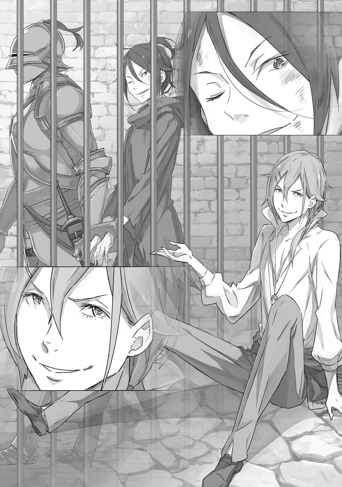
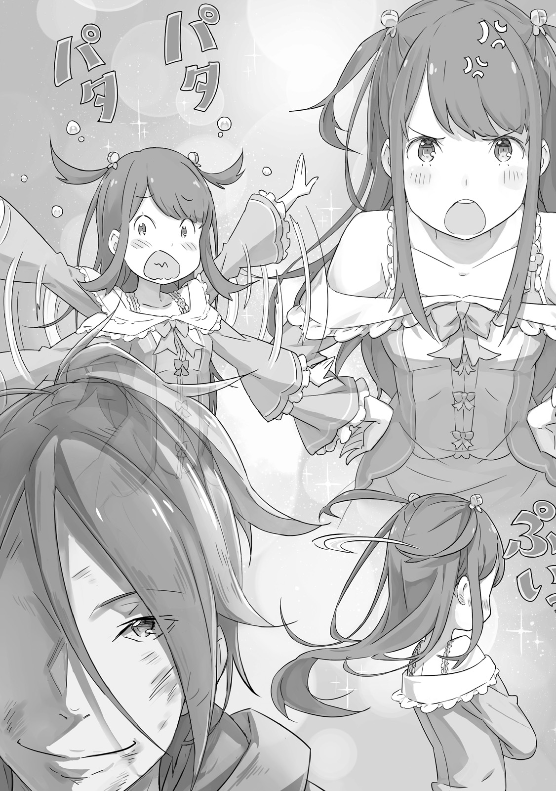
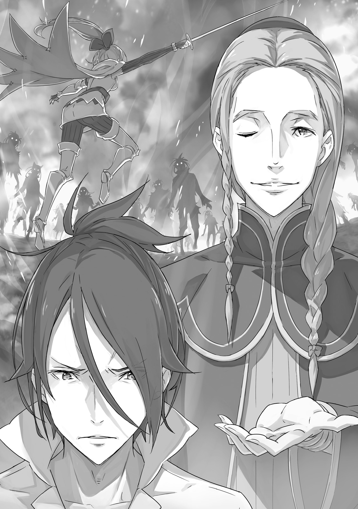
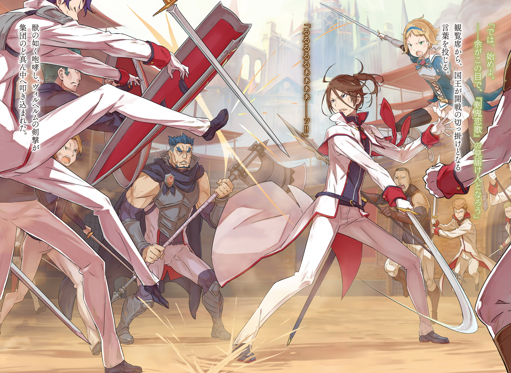
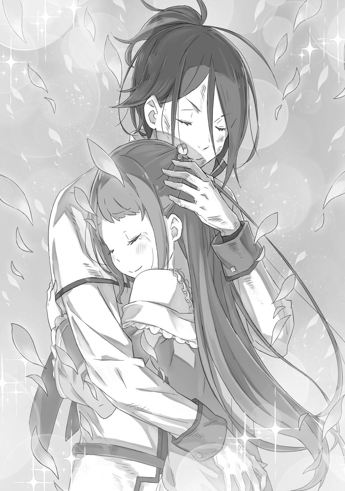

Их продолжающаяся сказка

『その後の二人』

× × ×

Здесь царил полумрак, и воздух был сухим.

Место казалось пустынным и холодным. Тусклый свет, исходивший от едва теплых кристаллических светильников, зябко отражался от грубых каменных стен и пола. Ветер, проникавший под землю, обжигал, словно жестокое напоминание о наступлении холодов.

— …

Очень долгое время он жил в полной изоляции от смены времен года и течения времени. Он полностью посвятил себя одному-единственному делу, тратя остаток времени лишь на минимально необходимый сон и еду — практически жил как животное.

Но те дни закончились, и теперь он был здесь.

Мог ли он с гордо поднятой головой сказать, что в его самоотверженности был смысл? Он не знал.

— … Эй, ты, — раздался голос. — Да, ты. Эй, ты меня слышишь?

— …

— Ты глухой, новенький? Или, может, ты уже мертв? Э-э-эй!

Голос настиг его, когда он, рассеянно прислонившись к стене, витал в облаках.

Он поднял голову и посмотрел в сторону звука. В сумраке виднелись железные прутья решетки, за ними — коридор, затем еще одни прутья, и, наконец, обладатель голоса, с любопытством разглядывающий его.

Два человека, изучающие друг друга из-за двух рядов железных решеток — картина, явно говорившая о том, что они находятся в тюрьме.

— Наконец-то соизволил взглянуть на меня, а? Больно важный вид для того, кто только что сюда попал… Или, может, бедный новичок, охваченный отчаянием, решил, что мир не стоит его внимания? Ну, неважно! Ты не первый. М-м-м? Погоди-ка. Я сразу не заметил, потому что тут чертовски темно, а ты чертовски грязный, но ты довольно молод, а?

— …разговариваешь.

— …? Что такое?

— Я сказал, ты любишь поговорить. Ты из тех, кто может болтать сам с собой весь день, я прав?

Саркастическая колкость вырвалась сама собой. Неприятная манера общения была его дурной привычкой, как он помнил. Он слегка вздохнул, теребя волосы на лбу.

Однако его резкий ответ лишь заставил нового знакомого улыбнуться еще шире.

— Ты прав. Я люблю поговорить, люблю посмеяться — если ты слышал об Орфее «Шестиязыком», то это я. И тебе крупно не повезло, что тебя посадили в камеру напротив моей. Ты можешь выйти на свободу или умереть… как получится. А пока этого не случилось, будем коротать время вдвоем.

— «Шестиязыкий»…?

— Это, как его, мой псевдоним. Меня поймали еще во время войны, когда я нашел шесть девушек в благородном квартале, которые были одиноки и напуганы, и я попытался подбодрить их всех сразу. Я рассказал каждой из них свою историю, поэтому меня прозвали Шестиязыким, потому что у меня как будто был отдельный язык для каждой из них.

— Значит, ты обычный мошенник или сутенер. Впечатляет, что за такое тебя бросили в королевскую тюрьму. — Молодой человек был поражен спокойствием заключенного, улыбающегося сквозь мрак.

Он напряг зрение, и действительно, за дальним рядом железных прутьев увидел чувственного мужчину с длинными волосами. У него была светлая кожа и худощавое телосложение, а шарм и красота выдавали в нем человека из высшего общества.

Мужчина, назвавший себя Орфеем, посмотрел на юношу.

— Раз уж тебя так забавляет, что я здесь, расскажи, насколько занимательна твоя история. Если позволишь заметить, попасть в подземелье замка — это тебе не шутки. Что же ты такого натворил, а?

— Хороший вопрос. Я…

Он замолчал и на мгновение задумался над вопросом Орфея. Однако ответ вскоре пришел ему в голову.

— Я просто забрал свою женщину у ублюдка, который мне не нравился.

— …

— По крайней мере, я так думал, но одно привело к другому. И вот я здесь. — Он раздраженно покачал головой, испустив долгий вздох, вспоминая череду событий, приведших его в тюрьму.

Орфей прикрыл рот рукой, но не смог сдержать взрыва смеха.

— Ха! Ха-ха-ха! Черт возьми, парень, да мы с тобой в одной лодке!

— Не говори глупостей. Я не похож на человека, который обманывал шестерых. Для меня существовала только одна.

— Нет никакой разницы! Этого все равно хватило, чтобы тебя бросили в тюрьму. Этот ублюдок был дворянином или рыцарем? …Или, может, девушка была особенной. Что скажешь?

— Оставлю это на твое усмотрение, — ответил молодой человек после паузы.

Орфей продолжал смеяться так сильно, что хлопал себя по коленям, более чем довольный тем, что его воображение само додумает детали.

Молодой человек не собирался рассказывать ему правду. Однако, объективно говоря, между его положением и положением Орфея действительно не было такой уж большой разницы. По крайней мере, было верно то, что неприятности обоих были связаны с женщиной.

— Эх, нравишься ты мне, паренек. Предвижу, что тюремная жизнь на некоторое время станет намного веселее.

— Хочешь смеяться — смейся, — ответил молодой человек. — Но подозреваю, что я тебя разочарую.

— Хм? — хмыкнул Орфей.

Ответ на его невысказанный вопрос последовал вскоре, но не из камеры напротив, а от двери тюрьмы, у лестницы, ведущей наверх. Раздался резкий стук сапог по камню; это был королевский рыцарь, который остановился перед камерой. Он посмотрел на молодого человека внутри и прищурился из-под забрала.

— Выходи, — властно произнес он. — За тобой пришли. — Затем он открыл дверь камеры. Молодой человек с явным раздражением поднялся на ноги и вышел из камеры, а рыцарь взглянул на него, словно подгоняя.

— Ну вот, и не думал, что мы так скоро попрощаемся, — сказал Орфей, завистливо поджав губы, когда рыцарь повел молодого человека мимо. — Мне будет одиноко здесь одному. И я завидую, что у тебя, похоже, есть очень добрый друг.

— Сомневаюсь в этом. — Молодой человек криво усмехнулся на слова ловеласа, представляя себе «доброго друга», который ждал его. Затем юноша — Вильгельм Триас — подмигнул и сказал: — В зависимости от того, насколько она злится, это еще может обернуться смертным приговором.

И затем он покинул подземелье.

— Предпочел бы быть казненным? Еще не поздно изменить приговор, знаешь ли.

Когда Вильгельм вышел из подземелья на поверхность, его встретил прохладный ветерок, солнечный свет и тихое ворчание его спасительницы.

Камера, которую Вильгельм занимал до недавнего времени, находилась в легендарной Тюремной Башне, примыкающей к королевскому замку. Она была известна как место, где содержались самые отъявленные преступники, а охранники были столь же пугающими, как и заключенные.

Красивая молодая женщина выглядела странно в таком месте. Даже несмотря на то, что она явно была очень зла, в нее невозможно было не влюбиться с первого взгляда.

У нее были волосы цвета пламени, ниспадающие до пояса, и глаза, голубые, как чистое небо. У нее были стройные, бледные конечности и изящная, симметричная фигура. Ее черты лица были безупречны; она обладала воздушной красотой, словно цветок на солнце.

Терезия ван Астрея — так звали эту прекрасную и разъяренную молодую женщину.

— Вильгельм? — Она пристально посмотрела на него, но он был так поражен одним лишь ее видом, что потерял дар речи. Однако, не желая, чтобы она это поняла, он поднял руки.

— Да, я понимаю, прости, — сказал он, выразительно встряхивая путами, сковывающими его руки. — Может, снимешь их?

— Ох, да… Интересно, действительно ли ты понимаешь.

Раздраженная формальным ответом, Терезия тем не менее тряхнула правой рукой. В тот же миг ее бледные пальцы разрезали путы пополам.

Деревянная доска, сковывавшая его руки, с шумом упала на землю. Вильгельм осторожно размял освобожденные запястья, убеждаясь, что они все еще чувствуют. Затем он заметил, как смотрит на него Терезия. Она прищурила свои круглые глаза и поджала губы.

— Что случилось? — спросил Вильгельм. — Что-то произошло?

— Что случилось…? Ты — тот, кого бросили в тюрьму, практически не объяснив причину. Разве ты не удивлен? Или не зол? Разве ты не хочешь знать, что происходит?

— Я сорвал королевскую церемонию. Я благодарен, что мне удалось уйти живым.

— Значит, ты хотя бы осознаешь масштаб содеянного… Я даже немного удивлена. — Терезия усмехнулась.

— Ну, знаешь, — согласился Вильгельм, пожимая плечами.

Переполох, который устроил Вильгельм, имел огромное значение для Драконьего Королевства Лугуника. Если бы не милость Его Величества, Гиониса Лугуники — общеизвестное качество правителя, — Вильгельм вполне мог быть казнен как предатель.

— Ты же знаешь, что если бы Его Величество не вмешался, тебя могли бы казнить на месте, верно? До тебя это вообще дошло?

— Думаешь, какие-то солдаты смогли бы казнить парня, который победил Святую Меча? Я знаю, что наш король не славится своим стратегическим мастерством, но даже он не стал бы тратить солдат на такую глупость сразу после окончания гражданской войны.

— Ты слишком самоуверен! И к тому же непочтителен! Не могу поверить, что ты такого высокого мнения о себе!

— Кроме того, во всем том зале собраний не хватило бы сил, чтобы противостоять нам с тобой.

— И вот еще что! Не надо думать, что я бы сражалась на твоей стороне…

Это были не самые обдуманные заявления, которые следовало делать в двух шагах от замка, да еще и с рыцарем, идущим практически рядом.

Собственно говоря, рыцарь, подслушав их разговор, вытаращил глаза, но быстро решил сделать вид, что ничего не слышал. Это было мудрое решение.

Терезия была слишком занята, то краснея, то бледнея, чтобы заметить этот маленький акт самосохранения.

Вильгельм сделал шаг ближе к Терезии и посмотрел ей прямо в глаза.

— …Д-да, что такое? — сказала она.

— Даже если бы весь мир был против нас, я знаю, на чьей стороне я был бы. Ты тоже должна знать.

— …! Ты, сэр, просто не понимаешь чувств людей…!

— …? Я знаю, что ты чувствуешь, лучше, чем кто-либо другой. Ты говоришь ерунду — ты в порядке?

— Стой! Просто остановись, пожалуйста. Ты меня до смерти запутаешь…! — Терезия отвела взгляд, покраснев до ушей, и замахала руками. Ее выражение лица могло мгновенно измениться — от гнева к раздражению и смущению.

— …

Сколько бы я ни видел ее, я никогда не устану от этого.

Как часто во время их разлуки он представлял себе воссоединение с Терезией? Но теперь он обнаружил, что это совсем не похоже на то, что он себе представлял.

Настоящая Терезия, стоявшая перед ним, была намного милее и прекраснее всего, что он помнил.

— Терезия.

— Что?! Я сейчас очень занята! И виноват в этом один человек…

— Иди сюда.

— …

Вильгельм раскрыл объятия кричащей, жестикулирующей Терезии. Этого короткого жеста было достаточно, чтобы ее глаза расширились, а слова застряли в горле.

Наступило мгновение тишины и нерешительности. Вильгельм просто стоял с раскрытыми объятиями, ожидая реакции Терезии.

Перед лицом этого непритязательного поступка Терезия смогла лишь слабо улыбнуться.

— …Вздох. Полагаю, это значит, что я проиграла.

— Думаю, мы уже решили это.

— Нет! Что! Я! Имела! В виду! Это совершенно другое! Боже…

Вильгельм выглядел искренне озадаченным; Терезия одарила его своим самым раздраженным вздохом, а затем сделала шаг вперед. Она бросилась в его раскрытые объятия, уткнувшись лбом ему в шею.

Вильгельм обнял ее, жар ее тела почти обжигал его. Ее фигура была такой хрупкой, что казалось, будто она может сломаться пополам, если он обнимет ее слишком сильно, но он не мог удержаться от того, чтобы прижать ее к себе как можно ближе.

Каждый обнимал другого так крепко, как только мог, и из груди мужчины женщина посмотрела вверх и сказала:

— Добро пожаловать домой, Вильгельм. Ты заставил эту девушку слишком долго ждать.

Мужчина посмотрел на женщину в своих объятиях и ответил:

— Ты права, Терезия. Прости, что заставил тебя ждать.

Прикоснуться к Терезии, увидеть ее так близко, Вильгельм тоже не мог не улыбнуться.

Это был шанс оказаться так близко друг к другу, что их дыхание смешивалось, и они могли чувствовать, как бьются сердца друг друга — для них двоих это было сродни чуду.

— …

Эта девушка была драгоценна для него, и он наконец-то добрался до нее, осуществив желание, которое не смог бы исполнить ни один нормальный человек.

Вильгельм нежно погладил красные волосы Терезии рукой, огрубевшей от долгого держания меча. Лицо Терезии смягчилось, когда она наконец обняла его, разделяя мгновение, которое никто не нарушит. Затем она снова прижалась лицом к его груди, глубоко вдыхая его запах.

— Вильгельм.

— Что?

— …От тебя воняет.

Возможно, это был не самый романтичный конец их воссоединения.

Война Полулюдей, гражданский конфликт, так долго терзавший Драконье Королевство Лугуника, наконец-то завершился.

Девять лет смуты были прекращены всего одной девушкой — Святой Меча, Терезией ван Астрея.

Она обладала таким мастерством владения клинком, что была достойна легендарного титула Святой Меча, и когда она привела королевскую армию к победе, ее имя стало известно по всей стране, а за свои подвиги она удостоилась множества почестей и хвалебных речей.

Эта Святая Меча, прекрасная и стойкая, была воплощением надежд и идеалов народа. Когда состоялась королевская церемония, посвященная окончанию военных действий, люди со всей страны стекались туда, надеясь хоть краем глаза увидеть ее.

В тот момент, когда Терезия появилась в большом зале, она мгновенно стала центром всеобщего внимания. Если бы церемония прошла без помех, ее репутация Святой Меча осталась бы незыблемой, а ее имя навсегда вошло бы в историю Лугуники.

Но это было бы так, если бы ничего не случилось — а кое-что случилось.

— О чем ты вообще думал?! Тебе должно быть стыдно! Стыдно!

Этот крик, первое, что вырвалось из уст говорящей, сотряс дом и эхом разнесся по ясному небу. Голос был таким резким, что мог бы резать, и любой, кто не привык сражаться с мечниками, вздрогнул бы.

Однако в этом доме не было никого столь уязвимого.

— …Боже, ну и прием. Что с тобой не так?

Крик едва затих, как последовал ответ от мужчины, который не выглядел ни милым, ни уязвимым, — объекта самого крика, Вильгельма.

Когда дело касалось этой конкретной собеседницы, едкие замечания Вильгельма имели тенденцию провоцировать еще больший крик. И этот раз не стал исключением.

— Что значит, что со мной не так?! Я могу придумать миллион других вещей, которые ты должен был сказать, прежде чем сморозить такую глупость!

Как обычно, девушка в платье становилась все краснее и краснее. У нее были великолепные золотистые волосы, ниспадающие на плечи, и острые глаза, отражающие ее силу; она была весьма необычной женщиной. Если бы она могла сохранять свою грацию, никто бы не усомнился в ее благородном происхождении, но на самом деле, эмоциональные вспышки, подобные этой, были более характерны для нее.

Вильгельм знал девушку достаточно долго, чтобы иметь возможность дать такую оценку.

Кэрол Ремендис, мечница, с которой Вильгельм познакомился во время гражданской войны. Она была весьма способна, но что оставило более глубокое впечатление на Вильгельма, чем ее удары мечом, так это ее словесные выпады.

Их отношения, пожалуй, лучше всего характеризуются нервным тиком, который начинался над глазами у обоих, когда они видели друг друга.

— Кэрол, все в порядке. Я рада, что ты так переживаешь, но я не злюсь, так что…

— Я знаю, что вы не злитесь, леди Терезия, поэтому я буду злиться вместо вас!!

— Ох, ну…

Терезия нахмурилась и пожала плечами; ее попытка успокоить Кэрол имела обратный эффект. Она показала Вильгельму язык в знак смирения, но на самом деле не могла сдаться. К сожалению, Вильгельм не мог урезонить Кэрол. Его единственной надеждой было быстро перейти к финальной стадии — когда молодой человек, стоящий рядом с Кэрол, все уладит за него.

— Гримм, твоя женщина вообще когда-нибудь замолкает? Я даже не могу нормально поговорить. Заставь ее замолчать, как ты всегда это делаешь.

— …

— Не надо мне тут этой своей ухмылочки. Это совсем не смешно.

Вильгельм сделал свою гримасу еще более суровой, но молодой человек с приятным выражением лица лишь еще больше улыбнулся и, постучав Кэрол по плечу, покачал головой. Одного этого жеста было достаточно, чтобы погасить вспыхнувший гнев Кэрол, убедив ее отпустить ситуацию со вздохом и мрачным взглядом.

— …Тебе лучше благодарить Гримма, Вильгельм. Если бы его и леди Терезии здесь не было, поверь мне, все ограничилось бы не только криками.

— М-м-м. Знаешь, Кэрол, я все еще не привыкла слышать, как ты произносишь мужское имя раньше моего. От этого мне становится немного одиноко, но я рада за тебя.

— Л-леди Терезия, как вы можете такое говорить…?

Ее лицо снова покраснело, на этот раз не от гнева, а от смущения. Терезия озорно улыбнулась ей. Две веселые молодые женщины были близки, как сестры, и видеть их такими было приятно.

— …Что? — прорычал Вильгельм, бросив взгляд в сторону. Молодой человек, Гримм Фаузен, написал что-то на листе бумаги, который он носил с собой, и показал Вильгельму.

— Ты улыбался.

Бумага была способом, которым Гримм, потерявший голос на поле боя, сообщал о своих мыслях. Но даже без нее выражение его лица обычно ясно давало понять, что у него на уме. Например, то, что в данный момент он очень поддразнивал Вильгельма.

— Конечно, улыбался. За кого ты меня принимаешь?

— …

Вильгельм с негодованием посмотрел на молчаливую ухмылку Гримма. Для него было бы вполне естественно разозлиться на такое издевательство, но улыбающийся,

безмолвный Гримм выглядел почему-то счастливым. Улыбка лишила Вильгельма положенного ему раздражения, успокоив его настолько, что у него не хватило духу огрызнуться.

Теперь он понял, что обеспокоил их достаточно сильно, чтобы вызвать у них такой уровень тревоги.

Вчетвером они находились в апартаментах Святой Меча, расположенных в углу Благородного Квартала столицы Лугуники — другими словами, они были в гостиной личной резиденции Терезии. Терезия привела Вильгельма сюда после того, как освободила его из Тюремной Башни, а затем, не терпя возражений, затолкала его в ванну. Она твердо велела ему смыть с себя всю эту вонь, от которой щиплет в носу, и когда он наконец очистился горячей водой и вернулся в жилую зону, его встретил гневный крик.

— А вы двое вообще что здесь делаете?

Когда пылкая встреча немного поутихла, Вильгельм сел на диван и с опозданием задал очевидный вопрос.

— Это ведь дом Терезии, верно? — сказал он. — У вас тут какие-то дела?

Он провел руками по еще влажным волосам, пока Гримм и Кэрол переглядывались. Через мгновение Кэрол села напротив него и тихо сказала:

— …А ты как думаешь, зачем мы здесь? Чтобы увидеть тебя, очевидно. И вообще, что плохого в том, что я нахожусь в доме леди Терезии?

— В платье? Я не слышал ни о каком бале сегодня вечером.

— Это потому, что у меня не было времени переодеться после того, что ты натворил!

Схватившись за подол своего синего платья, Кэрол снова взорвалась. Гримм, сидевший рядом с ней и морщившийся, тоже все еще был одет в свой парадный военный мундир. Должно быть, они пришли прямо из зала, где проходила церемония.

Вильгельм невольно задел и Терезию.

— Эй, ну, — сказала она. — Кэрол и Гримм пришли сюда, потому что беспокоились о тебе. Если ты не выглядишь хоть немного довольным и просто продолжаешь огрызаться на них, что они подумают?

— Кстати, а почему ты не в платье? — спросил Вильгельм. — Почему ты переоделась?

— Ха? Потому что оно испачкалось в моей битве с тобой, и потому что в нем было трудно двигаться… Ты бы предпочел, чтобы я не переодевалась?

— Платье было просто необычным, потому что я обычно не вижу тебя такой. Мне, в общем-то, все равно.

— Вот как…? Тогда, если будет еще один шанс, ты бы хотел снова увидеть меня в платье?

— ?

Вильгельм был воплощением «непонимания», а Терезия ответила ему взглядом, полным слез.

— Как ты можешь быть таким, таким бесчувственным?! Прямо когда я иду на риск ради тебя!

Однако она быстро вспомнила, что в комнате есть другие люди, и смущенно покраснела.

Гримм и Кэрол смотрели на Терезию и Вильгельма с удивлением. Будучи так близки к Демону Меча и Святой Меча соответственно, они никогда не видели ничего подобного и никогда бы не подумали об этом. Как будто Демон Меча был обычным человеком, а Святая Меча — не более чем типичной молодой женщиной. Титулы зажили своей собственной жизнью, от которой эти два человека внезапно оказались очень далеки.

— !

Кэрол первой не выдержала нахлынувших эмоций при виде этой пары. Она уткнулась лицом в плечо Гримма, не в силах говорить. Гримм прижался к своей потрясенной возлюбленной, нежно поглаживая ее по спине и улыбаясь.

— …Кэрол была со мной много, много лет. Каждый раз, когда я ходила на то поле цветов, она была со мной, и она всегда беспокоилась обо мне.

Вместо Кэрол, все еще пытающейся прийти в себя, Терезия взяла на себя задачу объяснить их отношения Вильгельму. Вильгельм быстро кивнул, показывая, что понял.

Это все объясняло: почему Кэрол присутствовала здесь, и почему она была с Терезией, когда та впервые вышла на поле боя в качестве Святой Меча.

И, возможно, то, как сильно болело сердце Кэрол из-за Терезии.

— У нее странные вкусы, — сказал Вильгельм.

— …Ты понимаешь, что с тем же успехом мог бы говорить о себе? — ответила Терезия.

— Я понятия не имею, о чем ты. — Вильгельм откинулся на диван, притворяясь непонимающим. Терезия лишь пожала плечами. Затем она деликатно кашлянула и слегка поклонилась в сторону Гримма.

— Прости за это, — сказала она. — Он легко смущается и не всегда умеет выражать свои чувства словами… Хотя иногда слов недостаточно. Он не плохой человек.

— Все в порядке. Я знаю.

— Мне очень приятно слышать это от тебя.

— Я был с ним много лет — и до сих пор не видел, как он превратился из животного в человека.

— О чем вы там двое говорите? Вы же не обо мне, верно?

Легко смущается? Животное? Нельзя пропускать мимо ушей столько оскорблений. Терезия и Гримм, конечно же, встретили его вопрос невинным покачиванием головы. Вильгельм раздраженно щелкнул языком. Терезия прикрыла рот рукой, смеясь, видя, как он раздражен. Когда она пришла в себя, то сказала:

— Кстати, Вильгельм…

Вильгельм повернулся к ней всем телом. В голубых глазах Терезии появился серьезный оттенок. Вильгельм невольно выпрямился; это была та серьезность, которую он не мог игнорировать.

Терезия секунду колебалась, увидев, что завладела его полным вниманием, а затем начала.

— Это нелегко спросить, но… что ты хочешь делать дальше?

— Это довольно общий вопрос. Что ты имеешь в виду?

— Я имею в виду, ну, типа, в самом широком смысле, может быть? Мы должны поговорить о том, где ты будешь жить, чем будешь заниматься. Ты можешь жить здесь, конечно, и я могу дать тебе содержание, чтобы у тебя не было проблем с удовлетворением основных потребностей, но…

— Погоди.

Вильгельм поднял руку, чтобы остановить все более лихорадочные рассуждения Терезии. Казалось, она спешит с ответами, но было так много вещей в вопросе, которые его беспокоили. С растущими сомнениями Вильгельм нахмурился.

— Ох, Вильгельм, опять эта хмурость… Я же говорю тебе, не делай так.

— Давай об этом позже. Есть кое-что поважнее… Что ты имела в виду под всем этим?

— Всем этим…?

— Ну, где я буду жить, и чем заниматься. Я—

Он осекся, почувствовав тревожное предчувствие. Он посмотрел Терезии в лицо, тщательно, серьезно подбирая слова.

— Кто я теперь?

В вопросе не было никакой конкретики, он был открыт для бесконечного множества возможных ответов. Терезия выглядела обеспокоенной.

— Мне больно это говорить, но… прямо сейчас, я думаю, ты пока никто.

— …

— Если говорить совсем прямо… ты… безработный?

— …Безработный.

Пораженный этим словом, Вильгельм удивленно посмотрел на Терезию. Она отвела взгляд. Он посмотрел на Гримма, но встретил лишь кривую улыбку. Наконец, Кэрол сердито посмотрела на него.

— Это и так должно быть очевидно. Проклятый идиот…! — выругалась она, ее глаза все еще были влажными от слез, а лицо все еще было красным.

Дезертир — самовольно оставил расположение части, а затем пропал без вести по личным причинам.

Пожалуй, само собой разумеется, но именно так в настоящее время звучала запись в личном деле Вильгельма Триаса, и, объективно говоря, она описывала все примечательные факты.

Если бы требовалось дополнение, можно было бы упомянуть, что он самовольно оставил расположение части сразу после получения рыцарского звания, и что он отказался от своего рыцарского положения и различных воинских наград, запятнав свой статус.

— Все это означает, что твой небольшой трюк на церемонии был записан как обычный взлом. Очевидно, объект кражи был беспрецедентным — сердце Святой Меча! Ха-ха-ха! Молодец, мастер-вор!

— Не думаю, что сейчас самое время для смеха…

Вильгельм обхватил голову руками и выдохнул; приветствие великана с его громким смехом ничуть не улучшило его настроение.

Он находился на национальной военной базе, в одном из кабинетов, предназначенных для офицерского состава. Это была простая каменная комната, в которой стоял стол, несколько стульев и столик для приема посетителей, и когда хозяин кабинета обнаружил, что его пришел навестить Вильгельм, он быстро отложил свои бумаги, чтобы встретить его громогласным приветствием.

Однако Вильгельма нисколько не забавляло то, что его встретили таким буйным смехом. Тем не менее, если учесть его положение, возможно, было вполне естественно, что его приняли именно так.

— Дезертир? — сказал Вильгельм. — Так вот почему меня бросили в Тюремную Башню. С такой записью меня должны были отправить в одиночную камеру, но вместо этого со мной обращались как с обычным преступником.

— Чтобы прояснить ситуацию, после того, что ты сделал, с тобой обращались бы так, даже если бы у тебя не было дезертирства вдобавок. Еще и жалоба поступила от твоего конвоира в башне. Он сказал, что ему стало плохо, когда он увидел, как вы нежничаете после твоего освобождения.

Большой, мускулистый мужчина разразился шумным смехом. Он был хозяином этой комнаты: Бордо Зелгеф, командир Отряда Зелгефа, элитных войск королевства.

Два года назад он был непосредственным начальником Вильгельма. Даже сейчас, когда Вильгельм был вырван из привычной среды, они оба безоговорочно доверяли друг другу.

Иными словами, они были достаточно близки, чтобы один мог от души смеяться, пока другой хмурится и недовольно цокает зубами.

— Планируешь использовать это как предлог, чтобы снова бросить меня в камеру?

— Нет. Но тебе стоит научиться сдержанности. Конечно, может быть, уже немного поздно для этого, учитывая шоу, которое ты устроил перед половиной чертового королевства. Вы согласны, а, госпожа Терезия?

— Э-э-э!

Терезия, сидевшая рядом с Вильгельмом, отреагировала с удивлением и смущением, когда центр внимания внезапно переместился на нее.

— Ох! Что это, госпожа Терезия? Это был самый милый маленький вскрик.

Бордо усмехнулся. Вильгельм закрыл собой Святую Меча.

— Осторожнее, — сказал он своему бывшему командиру. Затем он обратился к Терезии через плечо. — И ты, успокойся немного.

Терезия опустила голову и высунула язык.

— Л-ладно. Прости. Я просто немного испугалась.

Бордо, казалось, забыл обо всех своих шутках, наблюдая за этим взаимодействием между ними двумя глазами размером с тарелки.

— Ну надо же. Госпожа Терезия… Я никогда не видел, чтобы у достопочтенной Святой Меча было такое выражение лица.

— И все же ты знаешь ее достаточно хорошо, чтобы говорить это с такой уверенностью?

— В течение двух лет, пока ты отсутствовал, Отряд Зелгефа постоянно находился на передовой. Это означало, что мы работали бок о бок с госпожой Терезией. Так что да, я видел ее предостаточно.

Упоминание о его двухлетнем отсутствии заставило Вильгельма замолчать.

Однако Бордо вздохнул и с добротой посмотрел на Терезию.

— Не скажу, что у меня было слишком много возможностей поговорить с ней.

— Кхм, — сказала Терезия. — Я должна, э-э, извиниться за то, что была такой до смущения невежливой тогда…

— Мы квиты, — ответил Бордо. — Если вспомнить, как все начиналось, я не виню вас за то, что вы не хотели со мной дружить. Я, наверное, должен считать себя счастливчиком, что не оказался на острие вашего меча!

— Эй, что именно произошло между вами двумя…?

Видимо, их отношения были бурными, и Терезия ничего не сказала, чтобы это опровергнуть. Казалось чудом, что они вообще могли сидеть вежливо и смеяться вместе, как сейчас.

— Видел Гримма и госпожу Кэрол? — спросил Бордо.

— Я встретил их в доме Терезии, — сказал Вильгельм. — Кэрол все такая же ворчунья, а Гримм все такой же несносный для парня, который только и делает, что улыбается.

— Если тебе кажется, что они ничуть не изменились, значит, они проявляют тактичность. Ты должен быть благодарен.

— Хм?

Вильгельм с подозрением посмотрел на Бордо, услышав этот, казалось бы, многозначительный комментарий, но его бывший командир не стал вдаваться в подробности. Бордо провел рукой по коротко остриженным волосам на голове, а затем начал:

— Итак. Зачем ты здесь? Я тебя знаю. Ты пришел сюда не просто, чтобы возродить старую дружбу. Давай. Нападай на меня одним ударом, как ты делал это раньше.

— Только не говори мне— Но затем Вильгельм щелкнул языком, заметив свою привычку огрызаться. — Прости, забудь, что я сказал. Я просто завожусь.

Он выпрямился и повернулся к Бордо. Затем он склонил голову перед великаном по другую сторону стола.

— Бордо, у меня есть просьба. Я знаю, что это может быть неразумно, но—

— Ты хочешь восстановиться в армии, я прав?

— Если ты уже догадался, это все упростит. Я—

— Позволь мне прояснить кое-что еще. Мне жаль это говорить, но это будет непросто.

— …

Решительный взгляд на лице Вильгельма заставил Бордо говорить с ним с особой серьезностью. Человек, известный как Бешеный Пес, скрестил свои огромные руки и сурово посмотрел на Вильгельма. Выражение лица юноши, казалось, заявляло, что его не запугать. Но хотя взгляд Бордо был сильным, он не пытался запугать Вильгельма.

— Вспомни, как ты ушел из армии два года назад. Ты оставил записку на одном листе бумаги и исчез, как раз когда гражданская война была в самом разгаре… Какими бы ни были смягчающие обстоятельства, объективно говоря, это будет воспринято именно так. Зная это, ты ожидаешь, что кто-нибудь поддержит твое восстановление?

— Я…

— Прости. Я злюсь на это так же, как и ты. И я рад, что ты вернулся целым и невредимым. Что касается твоих чувств к госпоже Терезии, то у тебя, безусловно, есть мое благословение. Но проблема здесь не в том, что я лично чувствую. Ничто из этого. Ты понимаешь это?

Бордо больше не улыбался, и Вильгельм не издал ни звука.

Было практически невозможно забыть, как два года назад, когда он отправился на поле боя в одиночку, он оставил в гарнизоне уведомление о своем намерении покинуть королевскую армию. Он был полон решимости. Но его решимость была упрямой и эгоистичной.

Когда земле, где он родился, угрожало пламя войны, Вильгельм отбросил рыцарское звание, которое он только что получил, покинул армию и отправился на помощь своему родному городу.

Но он не успел вовремя, вернувшись лишь для того, чтобы обнаружить свою деревню сожженной, а свою собственную жизнь в опасности. В конце концов, не сказав ни слова товарищам, которые отправились за ним, Вильгельм решил исчезнуть.

Это было абсолютно нелояльно. Тот факт, что Бордо вообще захотел его видеть, был обязан исключительно силе их дружбы.

— То, как ты ворвался на ту церемонию, тоже проблема. Очевидно, самый важный фактор заключается в том, что Его Величество Гионис — человек огромного сострадания. Но твое освобождение из тюрьмы? Это потому, что госпожа Терезия попросила об этом.

— Она… что…?

Упоминание Бордо имени Терезии заставило Вильгельма задуматься о том, насколько он был безрассуден. Терезия крутила пальцами свои красные волосы, выглядя несколько расстроенной.

— Это правда? — спросил Вильгельм.

— Э-э, ну, наверное, да, но… это не так уж и важно, ладно?

— Любовь — чертовски сильная штука! — сказал Бордо. — Я слышал, что Его Величество Гионис предложил ей все, что она пожелает, в качестве награды за ее подвиги, и она попросила его использовать свое влияние, чтобы освободить тебя. Вот уж кто действительно не имеет ни капли жадности…

— Это было жадно — я попросила то, чего хотела больше всего.

— Ну, вот видишь. Везучий пес. — Бордо подмигнул; Вильгельм застонал от того, что его так дразнят.

Даже Вильгельм не был застрахован от шока, услышав это. Короче говоря, Терезии предложили исполнение ее заветного желания за ее вклад в окончание Войны Полулюдей, и ее единственной просьбой было освобождение Вильгельма из Тюремной Башни. Как будто она взяла каждый день тех двух лет, что она заставляла себя сражаться, и отдала их ему.

Вильгельм сидел в подавленном молчании. Бордо заговорил с ним удивительно спокойным голосом.

— Эта гражданская война, казалось, длилась вечно, но теперь она закончилась. Когда они разберутся, как хотят реорганизовать армию, они будут набирать столько же людей, сколько и раньше. Как насчет того, чтобы ты забыл об армии? Воспользуйся этим шансом, чтобы жить мирной жизнью.

Вильгельм удивленно поднял глаза, но Бордо мягко покачал головой и продолжил:

— В жизни есть не только сражения. Прильни к этой женщине, проведите вместе тихую, спокойную жизнь — я не думаю, что это было бы так уж плохо. Понимаешь, о чем я?

Бордо опустил взгляд на стол, на который положил руки. Вильгельм небрежно проследил за его взглядом, но затем заметил это. Монокль с разбитой линзой, лежащий в одном из углов стола Бордо.

В этот момент Вильгельм понял, что на самом деле имел в виду Бордо своими призывами к мирной жизни.

— Вы оба все еще живы. Вы оба смогли снова увидеть друг друга… Разве этого не может быть достаточно для вас?

Бордо изо всех сил старался скрыть эмоции в своем голосе, но они все равно прорывались. Вильгельм больше не мог этого выносить.

— …Думаю, я пойду домой, — сказал он. — Прости, что побеспокоил тебя, Бордо.

— Ох, Вильгельм! Черт! Мастер Бордо, мне жаль. Я тоже удалюсь.

— Это я должен извиняться, что не смог предложить вам достойный прием, — твердо сказал Бордо. Затем он добавил: — Вильгельм.

Вильгельм остановился, держась за дверь. Он не обернулся.

— Послушай, — сказал Бордо. — Что бы ни случилось, я рад, что ты вернулся. Хотя бы это правда. Даже если ты все еще чертов идиот.

— …Я только сейчас понимаю, каким идиотом я был.

— Наслаждайся этим. Ты никогда не думал достаточно о людях вокруг тебя, о том, как твои действия влияют на них.

— Да, сэр, капитан Бордо.

На одно мгновение, пронизанное иронией, они вернулись к тем отношениям, которые когда-то были у них, а затем Вильгельм покинул кабинет Бордо.

Звук его шагов по каменному коридору эхом отдавался по залу, и Вильгельм вздохнул, вспоминая разговор, который только что состоялся. Стоящая рядом с ним Терезия вглядывалась в его лицо.

— Так что ты собираешься делать, Вильгельм? Не похоже, что у тебя есть тихая гавань в этой буре.

— Как я уже сказал, я пока отступлю. Я понял, что лобовая атака не поможет исправить то, что я натворил. Думаю, я могу быть рад, что хотя бы это понял.

— Э-э-э… Я могла бы попытаться все уладить, если хочешь.

— Я и так чувствую себя достаточно жалко; не усугубляй.

Вильгельм остановился и указал на Терезию. Она посмотрела на палец, который он выставил перед ней, и неловко застонала.

— Прости, что не спросила тебя… Ты злишься?

— Думаю, у тебя гораздо больше причин злиться на меня.

— Ты действительно так думаешь? Прямо сейчас, мне кажется, у меня гораздо больше причин быть счастливой, чем злиться…

Терезия на мгновение задумалась, а затем безмятежно улыбнулась. Наблюдая за тем, как она прижимает руки к груди, словно обнимая что-то драгоценное, Вильгельм фыркнул, крайне раздраженный.

Затем он отвел от нее взгляд, посмотрев в окно.

— …Прости, что тебе пришлось меня освобождать. Я не знал, что причинил тебе столько хлопот.

— Все в порядке, — ответила Терезия. — Я говорила серьезно. Я просто поговорила с Его Величеством, чтобы получить то, чего действительно хотела. У меня не было ничего другого, на что я могла бы использовать эту просьбу — иначе я бы и не просила.

— Но после всего, что ты сделала, я все еще без работы.

— Не нужно так расстраиваться… Я позабочусь о том, чтобы ты мог жить достойно, хорошо?

Терезия выпятила свою довольно внушительную грудь и улыбнулась еще ярче, чтобы подбодрить Вильгельма. Но бывают времена, когда помощь женщины может ранить мужскую гордость. Особенно в такое время.

Это не только заставило его почувствовать себя беспомощным, но и не оставило Вильгельму ничего другого, кроме как столкнуться лицом к лицу со своим собственным безрассудством.

— Я же сказал тебе, тебе не нужно обо мне заботиться.

— Нет! Я не это имела в виду — я просто говорила, что если до этого дойдет, ты можешь рассчитывать на мою поддержку… Ой!

Он щелкнул ее по лбу за то, что она забыла, что он говорил всего несколько мгновений назад; затем, когда глаза Терезии наполнились слезами, он указал в окно. Он указывал вниз на город у замка, в сторону дома Терезии.

— То, что ты со мной, занимает половину моего мозга. Невозможно думать. Просто… иди куда-нибудь еще.

— Ты худший! Это худшее, что я когда-либо слышала!

— Это ты, кажется, не умеешь вовремя остановиться. Я вернусь к вечеру. Ты иди домой первой…

Вильгельм пренебрежительно махнул рукой и собрался уйти, но остановился, почувствовав, как кто-то дергает его за рукав. Он обернулся и встретился взглядом с Терезией; она держала его за одежду. Она посмотрела на его лицо и на свои пальцы, затем пробормотала:

— А? Это…?

— Не начинай задавать эти вопросы. Я вернусь. Обещаю. Так что успокойся.

— …Ты действительно вернешься домой? Ты не исчезнешь на два года?

— Ты действительно обо всем беспокоишься… Ладно. Это моя вина. Извини.

Он осторожно взял руку, державшую его за рукав, затем притянул Терезию к себе и обнял. Терезия на секунду напряглась, затем позволила этому напряжению покинуть ее тело и расслабилась. Он нежно погладил ее по спине мгновение, затем отпустил. Она больше не выглядела встревоженной.

— Возвращайся в особняк, — сказал он. — Я закончу свои дела и скоро присоединюсь к тебе.

— Угу. Я приготовлю тебе ужин. Я сделаю что-нибудь, что ты сможешь съесть, даже если оно остынет.

— Я потороплюсь, пока оно еще теплое.

Вильгельм знал, что у Терезии нет причин доверять ему. Он прижал палец к ее лбу, затем кивнул ей, и на этот раз они действительно разошлись. Он чувствовал, как взгляд Терезии сверлит его спину, пока он не свернул за угол, и ради них обоих он подавил желание оглянуться. Этому не было бы конца, если бы он это сделал.

— Должен признать… я довольно жалок.

Он чувствовал их кожей: лекцию Кэрол в апартаментах и слова Бордо всего несколько минут назад. То, как Вильгельм отбросил свои отношения на два года, вернулось, чтобы преследовать его. Но он лишь пожинает то, что посеял.

К сожалению, Вильгельм и его кости не были достаточно мягкими, чтобы только из-за этого согнуться в какую-то новую форму. На самом деле, он мог быть самой твердой вещью из всего живого на свете.

Этот факт послужил катализатором для событий последних двух лет, и, стоя там, где он был сейчас, никто не мог отрицать правду этого, и он не позволил бы им.

— …

Вильгельм нахмурился и начал думать, обновляя свою решимость. Он вкратце осмотрел пейзаж снаружи, чтобы найти пункт своего назначения. Затем он начал идти, его ноги двигались почти сами по себе.

Он направлялся в место, которое действительно оставалось неизменным в течение двух лет.

Вильгельм покинул замок, спускаясь по вымощенной камнем дорожке, патрулируемой стражниками.

Два года назад он всегда ненавидел ходить вверх и вниз по этой улице. Он все еще не любил ее и сейчас, хотя и по другим причинам. Но он пришел к выводу, что в прохождении по ней есть определенный смысл и ценность.

— Пожалуй, прошло немало времени… Пивот.

Вильгельм остановился перед стелой, на которой было выгравировано множество имен, и произнес одно из них.

Это было имя бывшего адъютанта Отряда Зелгефа и владельца разбитого монокля на столе Бордо — имя брата по оружию, который сложил свою жизнь во время гражданской войны.

Имя Пивота было не единственным, высеченным на стене; там было много других, бесчисленное множество других. Одного камня не хватало, чтобы вместить все имена погибших; вместо этого множество стел были выстроены в ряд на этом небольшом кладбище. Это был общий армейский мемориал всем тем, кто погиб на войне.

Это было также место, которое Вильгельм презирал — ибо в прошлом он никогда не мог найти никакого смысла в смерти.

— …Прости. Я не принес тебе ни цветов, ни чего-либо еще. Надеюсь, ты не против.

Возможно, это было связано с тем, что война наконец-то закончилась, но там было огромное количество цветов и других подношений.

По дороге на кладбище он прошел мимо нескольких стражников с мрачными лицами. Всегда кто-то приходил или уходил. Кто-то хотел поговорить с теми, кто отдал свои жизни, предложить им утешение или попросить ответы, которые они никогда не смогут дать.

— …

Вильгельму нечего было предложить мертвым, и он не был особо сведущ в этикете. Поэтому, стоя перед камнем, он молча отдал знакомый салют. Он был не в форме и без меча, который был конфискован. Он мог предложить лишь жалкое подобие салюта, убогое зрелище. И все же выполнение каждого движения было безупречным, и если бы кто-нибудь был рядом, чтобы наблюдать за ним, он наверняка был бы впечатлен.

Пивот был педантом в отношении дисциплины, он вдолбил в них этот салют. Если Вильгельм собирался отдать ему честь, он собирался сделать это так, чтобы тот мог им гордиться. Это, и только это, было его подношением.

— …

Ему больше нечего было сказать. Он не чувствовал в этом необходимости.

Он пришел сюда не потому, что ожидал что-то получить от этого. Но после того, как он увидел столько знакомых лиц, было бы неправильно не отдать дань уважения в этом месте.

Во всяком случае, он только это и планировал. Так что же это были за чувства, которые дергали его? Теперь, когда Вильгельм наконец-то пришел к нему после столь долгого времени, неужели Пивот все еще такой же занудный и надоедливый, каким был при жизни?

— Что ж. Неожиданное место для встречи с неожиданным человеком.

— Вы…

Вильгельм отвернулся от камня, чтобы вернуться тем же путем, которым пришел, но эти слова остановили его. У входа на кладбище стоял кто-то, с большим интересом наблюдавший за ним.

Это был стройный мужчина лет тридцати пяти. На первый взгляд, он казался бюрократом, из тех людей, с которыми Вильгельм не мог быть хорошо знаком, учитывая, что он провел большую часть своей жизни среди военных. Но Вильгельм сразу же вспомнил этого конкретного человека. Еще во время войны он выступал на стратегическом совещании, на которое был приглашен Вильгельм…

— Вы… Миклотов. Так вас звали.

— Я так рад, что вы меня помните. Достопочтенный Вильгельм Триас. Я не забывал о вас ни на один день.

Мужчина — Миклотов МакМахон, помощник премьер-министра королевства, — с большой нежностью смотрел на Вильгельма, его проницательные глаза блестели.

Как и обещал, Вильгельм вернулся домой, когда солнце наполовину скрылось за западным горизонтом.

Хотя, возможно, «дом» — не совсем правильное слово, — подумал он про себя. Это был дом Терезии.

Тем не менее, когда она встретила его, Терезия была в приподнятом настроении.

— Хорошо, что ты вернулся домой, как и обещал. Молодец, что держишь слово.

Услышав это, Вильгельм почувствовал, что ему не нужно воспринимать это иначе, как возвращение домой.

Когда Терезия провела его в столовую, Вильгельм был удивлен. Стол был не очень большим, но каждый его дюйм был заставлен едой. Блюда включали в себя все цвета радуги, и Вильгельм не мог не впечатлиться, осознав, что заявления Терезии о ее кулинарных способностях не были пустым хвастовством. Но все же—

— Ты все это приготовила? Как мы это съедим? Тут слишком много для двоих.

— Все в порядке. Кэрол и Гримм присоединятся к нам позже, и я думаю, что четверо человек справятся с этим, правда? Кроме того, я не знала, что ты любишь есть, поэтому… Ну, я хотела, чтобы тебе понравилось, поэтому я приготовила все, что смогла. Я думаю, что что-нибудь из этого должно быть тебе по вкусу, верно?

— У меня нет особых предпочтений или неприязни к еде.

— Тогда зачем я все это готовила?!

Казалось, что еды слишком много даже для четверых, но, возможно, у Кэрол или самой Терезии был неожиданно большой аппетит. Вильгельм, как правило, ел примерно столько же, сколько средний человек, а Гримм — немного меньше.

— Я удивлен, что ты так хорошо готовишь… и что ты не просто поручаешь это слугам.

— Я понимаю, что ты имеешь в виду. Я не люблю, когда обо мне заботятся. Я хочу делать то, что могу, сама. Поэтому я попросила о минимальной помощи по уходу за этими апартаментами. В любом случае, меня не так уж часто здесь можно было застать.

Терезия застенчиво почесала бледную щеку одним пальцем, на ее лице было искреннее выражение.

Этот особняк был одной из наград, данных Терезии, Святой Меча. Это была не одна из тех вещей, которые она получила после окончания гражданской войны; он был дарован ей сразу после ее первой битвы. Другими словами, это место принадлежало ей последние два года.

Жестокость жизни, не позволившей ей жить в нем, не поддавалась осмыслению. Это означало, что она переходила от битвы к битве, сражаясь так постоянно, что ни разу не вернулась домой.

Именно такие мелочи позволяли увидеть жизнь Терезии как Святой Меча. И каждый раз, когда это случалось, у Вильгельма возникала мысль: он не может оставить ее одну.

Я больше никогда не позволю ей держать меч, которого она не желает.

— …Вильгельм? — Терезия смотрела на него широко раскрытыми глазами.

Вильгельм положил руку ей на щеку. Его пальцы скользнули по ее мягкой коже, и его взгляд притянулся к виду ее губ, втягивающих воздух. Ее розовые губы и теплое тело — как он жаждал обнять их, выразить всю силу своих чувств.

— В-Вильгельм… Нет. Послушай, э-э, у-ужин остывает…

— Ты говорила, что он будет вполне хорош и холодным.

— Н-но, но! И все же, я думаю, что теплая еда лучше, правда?!

Ее голос сорвался на необычную ноту, когда он притянул ее к себе. Он провел по красным волосам запинающейся девушки, стараясь не нарушить их гладкий блеск, пока держал ее.

Запах, биение сердца любимого мужчины наполняли глаза Терезии зарождающимися эмоциями; ее дыхание становилось теплым—

— …! Нет, мы не можем! Кэрол и Гримм идут!

В конце концов, ее самообладание взяло верх, и она отстранилась от груди Вильгельма. Покраснев, она поправила волосы, вставая и выравнивая дыхание.

— Мы не можем, не сегодня. Давай насладимся вкусной едой вчетвером. Нам есть о чем поговорить… Да! Много о чем! Верно? Например, о том, чем ты занимался последние два года, и все такое?

— Не думаю, что то, что я мог бы рассказать, подойдет для разговора за ужином. — Вильгельм был немного разочарован тем, что ему дали холодный прием.

— Это неправда! — ответила Терезия, энергично покачав головой. — Два года — это так долго. Столько всего происходит, и это естественно, что чувства меняются…

— Они не изменились.

— И я рада это знать! Но да ладно, два года… Эй, знаешь, это было такое огромное везение, что ты вернулся в столицу прямо в день церемонии.

— Это не было везением. Вся страна говорила о тебе…

— О! Да, да, точно…

Терезия не очень хорошо умела скрывать свои мысли, и ее ответы уже начали становиться бессвязными. Вильгельм слегка улыбнулся ее замешательству, но он тоже был озадачен им. На самом деле это не было везением, что он был в городе во время церемонии; он намеренно прибыл вовремя. Но не только сплетни помогли ему прибыть. На самом деле…

— В течение двух лет я постоянно слышал о тебе от Розвааль.

— …Постоянно?

— Да. Я скитался по всей стране последние два года, но этой женщине всегда удавалось разыскать меня и связаться со мной. Именно благодаря ей я смог попасть на церемонию, так что, полагаю, я должен ей немного благодарности.

Говоря это, Вильгельм мысленно увидел женщину с длинными, цвета индиго волосами — Розвааль J. Мейзерс. Каждый из ее глаз был разного цвета, и она была кем-то, кого Вильгельм знал с самого начала войны, хотя он не был особо этому рад. Вильгельму приходилось быть осторожным всякий раз, когда он видел Розвааль; она всегда, казалось, пыталась вмешиваться в его дела.

Она была единственным посетителем Вильгельма в годы его блужданий и встречалась с ним много раз; она рассказывала ему о состоянии королевской армии или о том, как поживает Терезия. Он всегда давал ей отпор, но она никогда не унывала.

И действительно, именно благодаря одному из донесений Розвааль Вильгельм смог добраться до церемонии до ее начала…

— Значит, ты разговаривал с женщиной, постоянно, в течение двух лет…

— Терезия…?

— Вильгельм, не мог бы ты на минутку дать мне свою руку?

— …?

Сначала он не понял, что она бормочет, но затем увидел, как ее лицо расцветает в улыбке. Вильгельм нахмурился, но протянул ей руку, как она просила.

Терезия повернула его запястье, и внезапно мир Вильгельма перевернулся.

— …Хрр, агх?!

— Я чувствую себя не очень хорошо, — сказала Терезия, — поэтому я пойду в свою комнату. Ты, Кэрол и Гримм можете насладиться ужином вместе!

— Погоди, ты имеешь в виду, что ты больна или что ты злишь—?

— Хмпф!

Терезия не оказала никакого снисхождения Вильгельму, который обнаружил себя сидящим задом на полу. Он наблюдал, как ее красные волосы удаляются из столовой под яростный стук каблуков, оставив Вильгельма в полном недоумении.

— Ч-что за черт…?

— Что за шум?! Что происхо—? Вильгельм, ты упал?

Вильгельм сидел там, тупо глядя в одну точку, все еще не понимая, что вызвало гневный взрыв Терезии, когда появилась Кэрол, услышавшая шум. Стоящий позади нее Гримм бросил на Вильгельма сомнительный взгляд, а затем разинул рот, увидев стол.

— Что случилось с леди Терезией? Только не говори мне, что несколько мятежных полулюдей пришли, чтобы отомстить за—

— Нет, нет, ничего столь нелепого. Я не знаю почему, но она очень разозлилась, а потом бросила меня… Она бросила меня!

— Сейчас не время для твоей уязвленной гордости! Леди Терезию не так-то просто разозлить. Что ты сделал? Что ты сказал? Почему ты ее разозлил?! Признавайся!

Кэрол допрашивала Вильгельма, все еще не оправившегося от шока своего поражения. Кэрол никогда не отличалась умением контролировать свой нрав, и она никогда не была более нетерпеливой, чем когда дело касалось Терезии. Гримм попытался успокоить ее, но она отмахнулась от него, ткнув пальцем в Вильгельма.

— Расскажи мне в точности, что произошло! После того, как я услышу каждое последнее слово, я решу, отрезать ли тебе голову или найти другой способ убить тебя.

— Успокойся уже. Все, что я сделал, это немного рассказал о последних двух годах. Как я скитался по всей стране, несколько раз видел Розвааль, а затем в день церемонии—

— Леди Мейзерс?! Ты упомянул ей леди Мейзерс?! Ты сказал, что встречался с ней несколько раз?!

— Не то чтобы я специально стремился встретиться с ней. Она случайно находила меня…

— Довольно, мерзавец! Я была дурой, что вообще тебе доверяла!

Вильгельм был ошеломлен этим неожиданным презрением. Кэрол даже не смотрела на него, когда бросилась из столовой в сторону личной комнаты Терезии.

— Леди Терезия! Леди Терезия! Держитесь! Ваша Кэрол здесь!

Она шумно удалилась по коридору и исчезла из столовой вслед за Терезией. Вильгельм наблюдал за ней, все еще сидя на полу и все еще молча.

— …

Гримм, который до этого момента ничего не говорил, протянул руку Вильгельму. Тот взял ее и вздохнул, поднимаясь на ноги.

— …Что?

— …

Гримм молча, с упреком посмотрел на Вильгельма.

Вильгельм ответил голосом одновременно резким, но удрученным.

— Ты думаешь, это моя вина?

— Это твоя вина.

Листок бумаги появился так быстро, что, возможно, Гримм держал его наготове заранее.

— Черт.

Вильгельм схватил бумагу и яростно разорвал ее. Затем он смял клочки, прежде чем повернуться и нахмуриться, глядя на обеденный стол.

Их было всего двое, а врагов — не счесть, но, несмотря на это, им придется бросить вызов этим блюдам на столе.

— Мы с тобой позаботимся об этом вместе… и я не собираюсь слушать никаких возражений.

— …

Гримм смог лишь пожать плечами и сесть. Вильгельм сел напротив него, и они оба сложили руки в кратком жесте благодарности, прежде чем принялись за свои порции.

Все было еще теплым, и каждое новое блюдо восхищало язык Вильгельма. И все же он чувствовал себя более одиноким, чем если бы еда остыла.

В конце концов, Терезия не вышла из своей комнаты, и недоразумение не разрешилось той ночью.

— Хмпф. Не то чтобы я убеждена, что это действительно было недоразумением.

Гневное замечание исходило от Кэрол, которая, по крайней мере, появилась на завтрак. После того, как она последовала за Терезией в ее комнату и провела всю ночь, выслушивая, что произошло, холодная красавица не делала никаких усилий, чтобы скрыть свою враждебность по отношению к Вильгельму. Она всегда была колючей по отношению к нему, но теперь ее взгляд был острее, чем когда-либо.

— …

— Ох, Гримм, прости. Я должна была приготовить завтрак…

— Не беспокойся об этом.

Опасный взгляд Кэрол смягчился, когда она прочитала записку Гримма.

Завтрак, расставленный на столе, был делом рук Гримма, на лице которого играла тонкая улыбка. Его кулинарные способности были на несколько ступеней ниже, чем у Терезии, но он отвечал за провизию в Отряде Зелгефа, и то, что он готовил, было не так уж плохо. По крайней мере, это было намного лучше, чем все, что мог бы приготовить Вильгельм.

— Я все-таки сын трактирщика.

Гримм выглядел совершенно довольным собой, когда Вильгельм наблюдал, как он пишет. Затем они сели завтракать — втроем, без Терезии.

— Ну и что? Ты была там всю ночь, и тебе все еще не удалось заставить ее выйти из комнаты?

— Вот насколько глубоко ранена леди Терезия. И вся причина в твоем отношении и твоем возмутительном поведении. Имей немного стыда.

— Нельзя просто так нападать на людей, моя колючая леди. Не увлекайся.

Кэрол и Вильгельм уже начали препираться, еще до того, как начался завтрак.

Отношения между ними двумя вокруг отсутствующей Терезии были чрезвычайно сложными. Единственное, что было несомненно, это то, что она была чрезвычайно важна для них обоих. Именно это и заставляло их так накаляться этим утром. Достаточно было искры, чтобы вызвать взрыв, и стол для завтрака, казалось, был готов стать полем битвы…

— Хватит.

Листок бумаги с одними и теми же словами, написанными с обеих сторон, был всунут между ними. Молчаливый мечник посмотрел на своего боевого товарища, а затем на свою возлюбленную, затем указал на стол, чтобы молчаливая пара могла видеть.

Его смысл был достаточно ясен:

— Давайте отложим это и поедим.

Кэрол быстро согнулась и извинилась перед необычно суровым Гриммом.

— …Прости, я не хотела так заводиться. Давай позавтракаем.

Гримм принял извинения своей возлюбленной с тихой улыбкой. Затем он снова повернулся к Вильгельму.

— …

Тонкая линия его губ была очень похожа на взгляд, который он бросил на Кэрол, но решающего импульса не хватало. Очевидно, Вильгельм был не из тех, кого можно запугать, но он также не мог спорить о том, кто здесь неправ.

— …Прости, — сказал он, отводя взгляд, слово было практически выдохом.

Гримм удовлетворенно кивнул.

Затем, побежденный Гриммом, Вильгельм наконец принялся за еду.

— Я давно не пробовал такого, — сказал он, пораженный тем, насколько приятно знакомым был вкус соленого супа на его языке.

Соленый суп Гримма был излюбленным блюдом всего их отряда всякий раз, когда они располагались лагерем или после возвращения домой из экспедиции. Возможно, существовало правило, согласно которому сын трактирщика обязан был приготовить что-то настолько вкусное из всего, что случайно оказалось под рукой.

Счастье Гримма достигло его глаз, когда он наблюдал, как рот Вильгельма расплывается в улыбке удивления при виде знакомого вкуса. Затем Гримм начал строчить на свежем листке бумаги.

— Я не успел спросить тебя прошлой ночью — ты вернешься в армию?

Вопрос на протянутом листке бумаги касался того, что Вильгельм планирует делать дальше. Энергия, с которой писал Гримм, размашистые, дерганые штрихи его почерка показывали, насколько он был заинтересован в этом вопросе. Вероятно, он едва сдерживался, ожидая возможности спросить.

Прошлой ночью, когда они оба были одержимы идеей съесть еды, которой хватило бы на четверых, а то и больше, не было ни минуты покоя, чтобы поговорить.

Вильгельм допил остатки супа, затем сказал взволнованному Гримму:

— Я говорил с Бордо об этом, но безрезультатно. Он, правда, устроил мне чертову головомойку. Вел себя так, будто он здесь всем заправляет—

— Потому что он, по сути, и заправляет, — вставила Кэрол. — Учитывая действия лорда Зелгефа во время гражданской войны, они даже подумывают о том, чтобы попросить его принять должность в штабе. Это было бы необычно для дворянина. Поэтому я слышала, что есть неофициальное предложение, ожидающее его отречения от пэрства…

— Ты, кажется, много о нем знаешь. Гримм начнет ревновать.

Вильгельм одновременно высмеивал и разговоры о повышении Бордо, и значительные познания Кэрол во внутренней политике королевства. Его сарказм, однако, был выброшен на берег следующими словами Кэрол.

— Нельзя быть членом такого дома, как мой, и ничего не знать о политике. Хотя я не знаю, что станет со всем этим, если леди Терезия откажется от своей должности Святой Меча.

Мнение Кэрол о положении и титуле Святой Меча, которым обладала Терезия, конечно, было немаловажным для Вильгельма.

— Вильгельм. Я хочу снова увидеть, как леди Терезия одаривает меня этой своей тихой улыбкой.

— …

— Если говорить прямо, мне все равно, что ты делаешь и куда идешь — до тех пор, пока это не касается счастья леди Терезии. Так что любезно прошу тебя не делать ничего слишком глупого.

Кэрол пронзительно посмотрела на Вильгельма, ее длинные ресницы трепетали. Эмоция, очевидная и в ее взгляде, и в ее голосе, была подобна алмазу, выкованному ее долгими днями заботы о Терезии.

Эта красноволосая девушка, возлюбленная бога меча, была наделена силой, которой она никогда не желала. Вильгельм был не единственным, кто продолжал находить ее раздражающей. Итак…

— Верно. Я согласен. Это единственное, чего я себе никогда не позволю.

Он кивнул, втянув подбородок, его собственные чувства были достаточно сильны, чтобы соперничать с чувствами Кэрол.

После эмоционально насыщенного завтрака Гримм и Кэрол покинули апартаменты. До самого конца Кэрол не переставала отчитывать Вильгельма за Терезию, в то время как Гримм пытался успокоить ее, а затем оставил ему записку, в которой говорилось: Армия и я ждем тебя, господин Безработный.

— Легко всем остальным говорить, — пробормотал Вильгельм. Он смотрел, как они уходят, и, оказавшись один в особняке, почувствовал себя опустошенным.

У Вильгельма была гора проблем; ни одна из них не была такой, которую он мог бы решить, просто размахивая мечом. А проблемы, которые нельзя было решить с помощью клинка, были теми проблемами, перед которыми он всегда был наиболее уязвим.

Неоспоримая истина заключалась в том, что у Вильгельма не было таланта ни к чему, кроме сражений. В сложившейся ситуации он чувствовал себя загнанным в угол.

Эта девушка, человек, которого он любил, заперлась в своей комнате, и у него не было способа вытащить ее оттуда.

Он постучал в дверь и позвал:

— Терезия, я оставляю завтрак на столе. Обязательно поешь.

Но ответа от обитательницы комнаты не последовало. Вильгельм хотел лишь дать ей знать, что оставил для нее достаточно еды. Но затем—

— Да, и я сейчас ухожу. Я вернусь к ночи, так что не волнуйся… Я обязательно поужинаю с тобой сегодня вечером.

Если бы он ушел, ничего не сказав, оставив ее беспокоиться, это означало бы, что он ничему не научился из своих размышлений о последних двух годах.

Именно это побудило его сказать ей. На этот раз из комнаты он услышал тихий шелест ткани. Он воспринял это как знак того, что его попытка общения была принята, а затем покинул дом.

В конце концов, не видя Терезию полдня, Вильгельм бродил по утренним улицам столицы один.

Прошло довольно много времени с тех пор, как Вильгельм в последний раз шел по королевскому городу, чувствуя себя так спокойно, и он был несколько поражен тонкими изменениями, которые заметил. По сравнению с тем, как столица ощущалась двумя годами ранее, в разгар Войны Полулюдей, это было как небо и земля.

Дело было не в том, что облик места так сильно изменился. Самыми большими различиями были лица, очевидные чувства людей, снующих по городу. Они казались беззаботными, такими же теплыми и яркими, как солнечный свет.

Во время войны королевство было подвержено беспокойству и тревоге. Теперь тень этих страхов рассеялась, позволив миру и спокойствию вернуться в сердца людей. Перемена к лучшему.

И именно Терезия добилась этого за два года труда со своим мечом.

— …

Ее время в качестве Святой Меча, должно быть, было одновременно болезненным и абсурдно жестоким. Вильгельм был в смятении; должна ли сцена перед ним вызывать гордость или негодование?

— У меня назначена встреча с помощником премьер-министра. Меня зовут Вильгельм Триас.

— Ах. Он ждет вас. Сюда, пожалуйста.

Даже когда эти эмоции вихрем проносились в его сердце, ноги Вильгельма несли его к самой вершине города — королевскому замку Лугуники, где он представился и сообщил о своем деле охраннику у ворот.

Он молча следовал за дюжим стражником по залам замка. Он бывал в замке много раз за время своей службы в королевской армии, но ему еще никогда не приходилось бывать здесь по личным делам. Замок казался ему одновременно знакомым и глубоко чуждым. Тем более что в последний раз Вильгельм посещал его, чтобы получить рыцарское звание…

— Помощник премьер-министра ждет здесь.

Когда слова охранника прервали его задумчивость, Вильгельм обнаружил, что стоит перед комнатой, которая была его пунктом назначения. Он постучал в внушительные деревянные доски, и голос изнутри быстро ответил:

— Войдите.

Войдя, он обнаружил, что комната удивительно спартанская для обладателя такого высокого титула: только стол, диван и стол для приема посетителей, а также несколько книжных полок. То, как это место излучало практичность, глубоко отражало личность его обитателя.

— Добро пожаловать, мой дорогой Вильгельм, — мягко сказал Миклотов. — Пожалуйста, присаживайтесь.

— Хорошо, — сказал Вильгельм, важно усаживаясь на диван.

Стройный бюрократ — Миклотов — неторопливо сел напротив Вильгельма. Это был человек, которого Вильгельм пришел навестить, человек, у которого был ключ к его возвращению в королевскую армию.

По крайней мере, именно эта надежда привела Вильгельма на этот разговор.

— Боюсь, вчера нам не удалось толком поговорить, — сказал Миклотов. — Я должен извиниться за то, что заставил вас проделать весь путь до замка.

— …Нет, вы действительно очень мне помогаете, немедленно выделив для меня время и все такое. Это я должен вас благодарить.

— Хм. Ну что ж. Похоже, то, что я слышал от лорда Зелгефа, чистая правда.

Закончив с формальностями, Миклотов кивнул с теплой улыбкой. Вильгельм приподнял бровь, но мужчина напротив него махнул рукой и сказал:

— О, это ничего. Я не видел вас четыре года, не считая… односторонних встреч. Когда я вспоминаю, каким вы были тогда, я просто поражаюсь переменам.

— Односторонних встреч…?

— Разумеется, не стоит удивляться. Как вы думаете, сколько людей было на той церемонии, посвященной окончанию войны? Теперь все они знают вас.

Миклотов весело усмехнулся; Вильгельм погрузился в угрюмое молчание. Об этой односторонней встрече ему особо нечего было сказать. Это правда, что, пусть и ненадолго, его лицо и имя были предметом разговоров всего королевства.

На самом деле, пыл этих разговоров еще не остыл, хотя сам Вильгельм этого не знал. Он понятия не имел, что некоторые люди, очарованные историей его любви к Святой Меча, пытались превратить эту историю в песни, баллады.

Но как бы то ни было—

— Очень многие знают, что вы обладаете боевым мастерством, способным свергнуть Святую Меча. Следовательно, если вы пожелаете, ваше возвращение в королевскую армию может быть легко осуществлено. Я даю вам гарантию.

— Неужели? Бордо говорил мне нечто иное.

— В том, что говорит лорд Зелгеф, конечно, есть своя логика. Реальность такова, что вы отказались от своего рыцарства и наград, а затем покинули армию, чтобы заняться личными делами. Все еще есть много тех, кто был разочарован этим, кто был зол.

— …

— Тем не менее, время залечит эти раны. Важно то, что ваши способности владения клинком могут быть полезны королевству, и что вы сами желаете вернуться на военную службу.

Миклотов приложил руку к подбородку, говоря методично и логично. Вильгельм почувствовал, как выпрямляется при ободряющих словах помощника премьер-министра. Между солдатами и бюрократами существовала непроходимая стена, но, тем не менее, нельзя было игнорировать мнение этого человека. Возможно, для него действительно было простым делом восстановить одного солдата.

Возвращение Вильгельма Триаса, Демона Меча, в королевскую армию, казалось, было не за горами. Но…

— Хотя ваше возвращение на военную службу вполне может быть признано, я сомневаюсь, что кто-нибудь примет отказ госпожи Терезии от ее титула.

— Хнг…

Эти слова глубоко потрясли Вильгельма.

Увидев реакцию молодого человека, Миклотов заговорил более трезво, чем прежде.

— Армии нужны навыки обоих — и Демона Меча, и Святой Меча. У них нет абсолютно никаких причин отпускать ее. Я не думаю, что здесь есть место для споров, если только…?

— Но она этого не хочет.

— К сожалению, это не имеет значения.

Миклотов говорил холодно, его прежняя теплота исчезла в мгновение ока. Помощник премьер-министра встретил крик Демона Меча бесстрастными глазами.

— Наша дорогая Терезия может отрицать свои силы, но она не потеряет их. Более того, если королевство призовет ее на помощь, она не сможет отказаться. По крайней мере, я так полагаю.

Полагает? Нет, Миклотов был, на самом деле, совершенно уверен; он только делал вид, что не уверен. Вильгельм потерял дар речи.

Как сказал Миклотов, Терезия была доброй и любящей женщиной. Даже если бы у нее не было желания владеть мечом, если бы пришло время, когда это потребовалось бы от нее, то она проглотила бы свою боль и сделала бы это. Вильгельм понимал это. Но он не хотел позволять ей.

— Естественно, все, что я сказал, — это лишь предположение. Но я полагаю, что офицеры королевской армии придут к аналогичным выводам. Да, я сильно подозреваю, что так оно и есть.

Миклотов бесстрастно выпотрошил сердечное желание Вильгельма. Его возвращение в армию было одним делом, но не было никаких признаков того, что его беспокойство, связанное с Терезией, может быть разрешено.

Миклотов тихо вздохнул, увидев, что Вильгельм подавлен.

— Я займусь вашим восстановлением, — сказал он. — На этот счет вам не о чем беспокоиться. Но что касается нашей дорогой Терезии… Хм. Я рекомендую поговорить. Много поговорить.

— Поговорить?

— Не всегда легко найти ответы, думая в одиночку. Если кто-то идет по неверному пути, некому остановить его. Поэтому вместо того, чтобы мучиться над этим в одиночку, я предлагаю воспользоваться опытом других.

Это должно было быть советом? Вильгельм нахмурился.

Помощник премьер-министра подмигнул молодому человеку, его непринужденная улыбка снова вернулась.

— Есть вещи, на которые способны только вы. Подумайте хорошенько над ними.

С благословения Миклотова вопрос возвращения Вильгельма в королевскую армию казался практически решенным. И все же, пока он шел от замка к кварталу знати, облако над сердцем Вильгельма висело так же низко, как и прежде.

— …

Его голова шла кругом от различных вещей, о которых говорил Миклотов. В конце концов, Вильгельм нашел лишь новые проблемы, которые ему нужно было обдумать, и он еще больше, чем прежде, почувствовал, насколько он бессилен перед лицом проблем, которые нельзя было решить с помощью клинка. Возможно, он и сможет вернуть свое прежнее положение, но гораздо более серьезная проблема Терезии оставалась.

— Поговорить, конечно…

Он уже обсудил все со всеми, с кем только мог. С Гриммом и Кэрол, конечно, но также с Бордо и Миклотовым. Он даже прибег к помощи безмолвного Пивота, и теперь, казалось, единственным человеком, с кем ему оставалось поговорить, была сама Терезия.

Однако, если бы он попытался сделать это, было слишком ясно, как она отреагирует. Если страна призовет ее на помощь, она спрячет свою боль за одной из своих мимолетных улыбок и сделает все, что потребуется.

— Эта идиотка даже не понимает, что это заставляет чувствовать людей вокруг нее…!

Терезия в его воображении была жалким объектом презрения, и все же Вильгельм мог бы поспорить на свою жизнь, что он точно предсказал, как она поступит. Вот почему Вильгельм уже разыграл все карты, которые у него были, расспрашивая всех подряд о совете по этому вопросу.

Он застонал, посмотрев вверх, с болью осознавая теперь, насколько узок его круг друзей.

— Не хотелось бы этого говорить, но, полагаю, моя последняя надежда… Розвааль. Где она вообще?

Он прищелкнул языком, глядя на безоблачное голубое небо.

Розвааль J. Мейзерс, специалистка по странному и неожиданному, наверняка нашла бы какое-нибудь эффективное средство от бед Вильгельма. Однако его гордость не позволяла ему полагаться на нее. В конце концов, именно из-за нее отношения между ним и Терезией стали сложными. Даже Вильгельм мог сказать, что если Терезия хотя бы учует какое-либо дальнейшее участие Розвааль, это может закончиться только плохо.

Но, пытаясь одновременно и просить, и выбирать, Вильгельм быстро обнаружил, что у него заканчиваются варианты.

— Неужели кто-то действительно думает, что мой мозг может придумать ответ сам по себе? Между всем, что происходит со мной и Терезией, моя голова уже и так превратилась в кашу. Если бы я мог хотя бы свести все это к одной-единственной проблеме…

Идеальное решение должно было решить одновременно и вопрос о восстановлении Вильгельма, и вопрос об отказе Терезии от титула. Но, честно говоря, если бы он мог сделать так, чтобы Терезии больше никогда не пришлось пользоваться мечом, он был бы даже готов отказаться от любого шанса вернуться в армию. Он не позволит себе упустить из виду то, что действительно важно. Только в этом вопросе он теперь был совершенно уверен.

— Должен же быть кто-то. Кто-то с половиной мозга, кто может свести все это воедино, кто-то, кто может думать…

Знал ли Вильгельм кого-нибудь, в ком все эти качества удобно сочетались? Внезапно он остановился.

Его мысль на мгновение обратилась к кому-то почти слишком совершенному: сообразительному, умеющему гладко говорить и профессионалу в социальных навыках.

— Парень, который облапошил шесть девушек сразу и попал в Тюремную Башню!

Вильгельм развернулся, сузив свои голубые глаза. Теперь он увидел, что рядом с замком каменная башня, устрашающая тюрьма, наблюдала за тем, как он уходит.

— Что ж, мило с твоей стороны прийти за советом. У меня аж слезы наворачиваются, брат.

— Не умничай со мной. У нас мало времени.

Вильгельм почувствовал холодный подземный пол под ногами, уставившись на того, кто был по другую сторону железных прутьев. Раздался смешок от мужчины с длинными волосами и чистым лицом — человека, который ухаживал за шестью благородными девушками одновременно, а позже был заключен в тюрьму за преступление, заключавшееся в том, что он слишком много любил — Орфея «Шестиязыкого».

Вильгельм отправился навестить этого человека, основываясь лишь на нескольких часах знакомства в тюрьме. Даже он сам не слишком высоко оценивал этот выбор, но это был единственный шанс пересмотреть проблему с совершенно другой точки зрения.

— Представь себе — ты Демон Меча, который превзошел Святую Меча! Неудивительно, что ты оказался в Тюремной Башне. Молодец, большой вор!

Вильгельм ответил на маленькую шутку Орфея запугиванием.

— Эти железные прутья не замедлят меня, если я решу тебя зарубить. Ты так жаждешь приблизить дату своей казни?

Орфей, однако, не выказал никаких признаков страха и лишь пожал плечами в ответ. Что ж, это, безусловно, говорило о его смелости. Это был человек, который разговаривал сразу с шестью людьми — и все они были дворянами. Не то, что кто-либо стал бы делать без уверенности в своей способности выпутаться из любой ситуации.

— Поверь мне, брат, я жажду помочь тебе написать твою историю любви, но я просто не вижу, что мне за это будет. Я никогда не работаю бесплатно, понимаешь?

— Когда меня восстановят в армии, я также верну себе свои награды и рыцарство. Тогда я смогу замолвить за тебя словечко. Ты выйдешь отсюда и снова станешь свободным человеком намного раньше.

— Ну, тогда считай, что я в деле! Я помогу тебе, не беспокойся. Расскажи мне все.

— Ты склонен к быстрым переменам настроения, не так ли…? — сказал Вильгельм, ошеломленный внезапным изменением в отношении Орфея, даже учитывая обстоятельства.

Конечно, он опустил большую часть мелких деталей, но Орфей был искусным слушателем, и с помощью вопросов, которые он задавал Вильгельму, он вскоре твердо понял, что происходит.

— Ладно, да, я вижу, — сказал Шестиязыкий, выразительно кивая, когда Вильгельм закончил свой рассказ. — Это бардак, точно. Включая твое удивительно большое количество личных недостатков.

— Клянусь, я изрублю тебя в ленточки.

Вильгельм намеревался вселить в Орфея немного страха, но тот громко хлопнул в ладоши.

— То, как ты хочешь все делать своим мечом — вот оно!

Вильгельм моргнул, услышав его заявление. Орфей придвинулся к прутьям своей камеры.

— Ты сам это сказал, верно? Меч — это то, в чем ты хорош, и ты не силен ни в чем, кроме меча. Решить проблему, которую ты не можешь разрубить, тебе сложно.

— В этом-то и проблема. Это одна из таких проблем…

— О, вот тут ты ошибаешься, брат. Заставлять себя противостоять своим слабостям ради того, что важно для тебя, — это по-мужски, но это не умно. Используй свою голову — и свой язык — и продвигайся вперед логически. Понимаешь меня? — Орфей засмеялся и сказал: — Ты подходишь к этому не с той стороны, — прежде чем кивнуть Вильгельму.

А затем Шестиязыкий предложил Демону Меча подход к его проблеме, который с тем же успехом мог бы прийти из другого измерения.

А именно—

— Если твой меч — единственное, что у тебя есть, то преврати эту проблему в ту, которую ты можешь решить своим клинком. Это единственный способ, которым ты можешь выйти победителем, верно, брат?

А затем Орфей подмигнул Вильгельму с озорной улыбкой.

Когда Вильгельм вернулся в апартаменты, уже стемнело, и он обнаружил, что из столовой доносится чудесный запах. Теплый аромат щекотал его нос, маня к себе. Когда он открыл дверь в столовую, то увидел спину красноволосой женщины, которая только что закончила накрывать на стол.

Ее элегантные плечи, узкая талия, то, как ее бедра покачивались из стороны в сторону, — ему казалось, что он мог бы смотреть на нее вечно и не насмотреться.

— Когда возвращаешься, нужно говорить об этом, — сказала женщина. — Ты не капризный ребенок, так что следи за своими манерами.

— Я молчал не потому, что капризничал.

— Тогда почему? Искал слова, чтобы извиниться? — Терезия надулась и фыркнула, даже не обернувшись.

Он вряд ли мог сказать ей, что молчал, потому что его любовь к ней лишила его дара речи. Еще некоторое время он позволял тишине заменить его ответ, пока Терезия не вздохнула в отчаянии.

— Боже, я бы хотела, чтобы ты просто поговорил со мной… И я думаю, ты знаешь это.

— Прости. Так что тут происходит?

— …Ты сам сказал, что мы вместе поужинаем. Хмпф.

С этим очаровательным звуком Терезия сняла фартук и села.

На этот раз количество еды на столе больше подходило для двоих. Вильгельм испытал облегчение, когда понял, что незваных гостей не будет, но затем испугался мысли о том, что останется с ней наедине за ужином.

Этим утром он не смог сказать ничего, что помогло бы им помириться, но теперь…

— Ты ведь приготовил мне завтрак, Вильгельм? Он был ужасен… Я не могла представить себе, что буду есть то же самое на ужин.

— Я уверен, что все прожарил.

— Нужно делать больше, чем просто поджаривать! Середина была черной, как смола! Должна признать, однако, что ты искусно нарезал ингредиенты — я подумала, что это какая-то шутка!

Вильгельм нахмурился, застигнутый врасплох напором Терезии. Да, он немного не рассчитал с жаром, но он не думал, что конечный продукт можно назвать несъедобным.

Терезия, казалось, догадалась, о чем он думает. Она указала на место напротив себя и сказала:

— Я беспокоюсь о том, как ты питался последние два года… Интересно, есть ли вероятность, что кто-то готовил для тебя. Кто-то вроде, ну, ты понимаешь…

— Если ты думаешь о Розвааль, то ошибаешься. Не заставляй меня повторять снова и снова. Она сама меня находила. Я никогда не был ей рад. И я поблагодарил ее только один раз.

— За что…?

— За то, что она сообщила мне день церемонии. Иначе я не смог бы тебя увидеть.

Его ответ был ровным и небрежным.

— О-о. Ну, я—ты—хе-хе…

Терезия покраснела, а затем слабо рассмеялась. Вильгельм тем временем посмотрел на еду.

Количество еды было намного меньше, чем накануне, но разнообразие было таким же богатым. Ни одно блюдо не было похоже на то, что появлялось прошлой ночью, шокируя Вильгельма широтой репертуара Терезии.

— У тебя много козырей в рукаве, — сказал он.

— Не уверена, что это комплимент, — ответила она. — Хи-хи — не то чтобы я возражала.

Терезия счастливо улыбнулась неловкой похвале Вильгельма. Это был первый раз, когда он видел, как она по-настоящему улыбается, почти за целый день.

Вильгельм прижал руку к груди, неожиданно почувствовав облегчение от этой улыбки.

— А теперь давай поедим, — сказала Терезия. — Я собираюсь выяснить, что тебе нравится — я хочу знать твое мнение о каждом блюде.

— Они все были восхитительны. Это мое мнение о прошлом вечере.

— Ну, сегодня так не пойдет. Я буду наблюдать за тобой и увижу, какая еда тебе нравится. Я не собираюсь доверять твоим словам.

Как ни ужасно это было, но то, что Вильгельм приготовил для нее еду, очевидно, зажгло огонь собственного желания Терезии продемонстрировать свои кулинарные способности. Если это было то, что нужно, чтобы вернуть их вместе, то он с радостью примет ее критику своих кухонных навыков.

И поэтому ужин проходил спокойно, а Терезия изучала реакцию Вильгельма на каждое блюдо.

Он уже убедился накануне, что она весьма искусный повар, но исключительное внимание к тому, чтобы съесть всю еду, мешало в полной мере оценить особые качества каждого блюда. Возможно, именно поэтому еда сегодня казалась намного вкуснее.

— Ну как? Более сытно, чем вчера?

— Да. Думаю, сегодня вкуснее.

— Правда? Это здорово! Вчера я сосредоточилась на еде из южной части королевства, а сегодня больше северной. Может быть, тебе больше нравятся вкусы, которые они используют.

— Не знаю. Может, просто потому, что я ем с тобой?

— Э! Кхм! Н-нечестно так нападать на меня…!

Это было небрежное замечание, но Терезия была довольно чувствительна, и когда оно достигло ее ушей, она начала давиться водой. Вильгельм слегка улыбнулся, но затем снова быстро нахмурился. Это был прекрасный ужин, который они разделяли, но были вещи, о которых нужно было поговорить, и он не мог откладывать их вечно.

Терезия заметила перемену в его выражении. Она промокнула рот салфеткой и выпрямилась.

— Терезия, я хочу поговорить о кое-чем, — сказал Вильгельм.

— Д-да. Конечно…

— Это о моем восстановлении в армии. Я немного поговорил с кем-то повыше, и думаю, что смогу вернуться. Прости, что причинил тебе столько хлопот и беспокойства.

— О—о, это! Фух. Я думала, ты скажешь, что уезжаешь или что-то в этом роде…

— …Нет, и точно не буду. Не заставляй меня повторять снова и снова.

Он понимал, насколько неуверенно себя чувствует Терезия; он не знал, сколько времени потребуется, чтобы развеять ее сомнения. С точки зрения Вильгельма, в глубине души не было никого, кого он ценил бы больше, чем ее. Хотя он вряд ли признался бы в этом даже под пытками. Он не мог.

— Ах! Я очень рада, что ты сможешь вернуться в армию, конечно. И я уверена, что ты будешь счастливее, работая со своими друзьями, такими как Гримм и мастер Бордо.

— Моими друзьями… Я никогда не думал о них в таком ключе.

Возможно, братьями по оружию. Но не друзьями.

В любом случае, Терезия была рада услышать, что Вильгельм вернется в армию. Единственной оставшейся проблемой была сама Терезия…

— Терезия, есть еще кое-что, о чем нужно поговорить. Кое-что еще более важное.

— Д-да…?

— Успокойся. Это не то, о чем ты думаешь. Завтра меня не будет целый день. Я, вероятно, вернусь примерно в то же время, что и сегодня, но… завтра ты ни в коем случае не должна идти в замок.

— …

Его решительный тон поразил Терезию. Она приложила палец к губам, обдумывая его слова.

— Я должна держаться подальше от замка? Почему?

— Просто должна. Послушай меня. Я не заставлю тебя пожалеть об этом.

— Почему то, пойду я в замок или нет, должно быть тем, о чем я буду жалеть? Это меня больше всего беспокоит.

Отсутствие объяснений беспокоило ее, но Вильгельм не проявлял никакого желания прояснить ситуацию. Они мгновение смотрели друг на друга, но Терезия сдалась перед молчаливым Вильгельмом. Она вздохнула и уступила:

— Я понимаю. Ты не можешь сказать мне, почему, но я не должна идти в замок. Весь завтрашний день — верно?

— Да, верно. Пожалуйста.

— Ну, раз ты так любезно просишь… Но могу я спросить тебя об одном?

Терезия подстраховалась, встав, как будто собиралась начать убирать со стола. Вильгельм посмотрел на нее, и она подняла один палец.

— Если я нарушу это обещание… ты меня возненавидишь?

— Я буду очень зол.

— О? Хорошо, тогда.

Она махнула рукой и начала относить посуду в сторону раковины. Вильгельм, наблюдая за тем, как ее бедра счастливо покачиваются из стороны в сторону, погрузился в раздумья. Тон ее голоса только что озадачил его. Конечно, она не намеревалась нарушить свое обещание и прийти в замок.

— Ну, я сказал ей не приходить, так что она, вероятно, не придет.

Вильгельм кивнул сам себе, сложил оставшуюся посуду и последовал за Терезией.

Терезия проводила Вильгельма рано утром следующего дня, и третий день подряд он отправился в замок.

Однако сегодня Вильгельм казался не таким, как в два предыдущих дня. Или, возможно, то, как он вел себя раньше, было нехарактерно для него.

Он смело прошел через ворота замка, аура, которую он излучал, не оставляла ни у кого сомнений в том, что это Вильгельм Триас, Демон Меча, воин, победивший сильнейшего бойца в стране.

У ворот молчаливого Вильгельма ждал закованный в броню стражник.

— Да сопутствует вам удача в бою, — сказал он.

Его забрало скрывало выражение его лица, но оно было напряжено, а на лбу выступил пот. Он понял это с одного взгляда на Вильгельма. Понял лишь малую толику истинной силы, которой обладал тот, кого когда-то называли Демоном Меча, который одолел Святую Меча, несмотря на ее выдающиеся достижения.

Вильгельм прошел через замок, неуклонно двигаясь к одному-единственному месту. В поле его зрения возникло тренировочное поле, наполненное запахами крови и жира.

Пространство было окружено огромной стеной, и там находилось несколько солдат, полных энергии и жажды битвы. Это было место, где изо дня в день рыцари, стражники и военнослужащие страны проверяли свои боевые способности друг против друга и постоянно стремились к самосовершенствованию.

Жизненная сила и любовь ко всему, что связано с боем, были ожидаемы в таком месте — и тем более, когда в собрание входили все те, кто считался сильнейшим и наиболее выдающимся среди вооруженных сил королевства.

— Так ты здесь, чертов ублюдок идиот.

Как только Вильгельм вошел в центр тренировочной площадки, его встретило это словесное оскорбление. Говорящий имел толстые руки и нес массивный боевой топор…

— Бордо. Я думал, ты собираешься уйти с поля боя теперь, когда ты поднялся по карьерной лестнице.

— Ха-ха-ха! Не будь дураком. Я буду в поле до конца своей жизни. Мне дали повышение — и что? Не то чтобы я просто брошу свое оружие. В этом мы с тобой похожи.

Бордо захохотал, взволнованно глядя на Вильгельма, который стоял наготове. Вильгельм пожал плечами, глядя на великана, затем оглядел остальных, кто там стоял. Каждый из собравшихся был бойцом, обученным до мозга костей, ни один из них не был кротким или мягким. Вильгельм узнал два лица среди них.

— Даже вы, ребята, здесь? — фыркнул он. — Вы уже должны знать, когда вас превосходят.

Перед ним стояли женщина-рыцарь с золотыми волосами и мужчина, несущий щит — Кэрол и Гримм. Высоко подняв свой меч и щит, соответственно, они кивнули в знак признания колкости Вильгельма.

— Не слишком гордись собой, — сказала Кэрол. — Здесь нет ни одного человека, который не принадлежал бы к элите. Неосторожный вызов с твоей стороны может закончиться только твоим унижением.

— Я прекрасно знаю, что все здесь хорошие бойцы. Так что вы здесь делаете?

— Да как ты—!

— Кэрол, пожалуйста, успокойся.

Гримм сдержал свою побагровевшую возлюбленную, которая проглотила наживку Вильгельма, не раздумывая. Затем он повернул свое милое лицо к Вильгельму и почти улыбнулся.

— Мы не будем сдерживаться, знаешь ли.

— По крайней мере, ты наконец-то научился хорошо говорить. — Вильгельм громко рассмеялся.

В дополнение к ним троим можно было увидеть несколько других воинов, отличившихся во время гражданской войны. Некоторые были его старыми товарищами со времен его службы в Отряде Зелгефа, и в целом готовность группы к бою была наэлектризована, достаточно, чтобы волосы встали дыбом.

— Ну, похоже, теперь мы все здесь.

В эту напряженную атмосферу на тренировочной площадке ворвался неуместно мягкий голос. Вильгельм посмотрел и увидел Миклотова, сидящего там, откуда он мог наблюдать за всем тренировочным полем. Помощник премьер-министра был одет в темно-синюю мантию, и он глубоко кивнул собравшимся бойцам.

— Весьма впечатляющее зрелище, — сказал он. — Уже такое присутствие, а мы еще даже не начали.

— Я здесь не для того, чтобы устраивать шоу, — прорычал Вильгельм. — Просто держите свое обещание.

Миклотов подмигнул и усмехнулся на высокомерный тон Вильгельма. Затем он оглянулся через плечо, отвесил изысканный поклон и сказал:

— Сюда, сир.

Все нахмурились при этих словах, но мгновение спустя все они опустились на колени как один.

Да, даже Вильгельм. Почему?

— Ну, ну, нет нужды в такой подобострастности. Я пришел только для того, чтобы наблюдать за результатом.

В голосе слышался смешок, который легко доносился до каждого уголка тренировочной площадки. Говорящий был мужчиной в элегантной мантии и ослепительной парадной одежде. Ему было около сорока, и он был хорошо сложен, но такие общие выражения вряд ли подходили этому человеку.

Он был, в конце концов, самым возвышенным человеком на этой тренировочной площадке, или в замке, или в столице, или даже во всем королевстве.

— Его Величество, Гионис Лугуника.

— Весьма впечатляющее зрелище, как сказал Миклотов. Такое собрание храбрецов должно происходить только в моменты великой важности… Это, возможно, было бы невозможно, если бы не сразу после нашей церемонии.

Мужчина выглядел довольным собой. Он действительно был Гионисом Лугуникой, нынешним правителем Драконьего Королевства и тем, чья власть сделала этот момент возможным для Вильгельма.

Гионис оглядел своих коленопреклоненных подданных и, заметив среди них Вильгельма, сказал:

— Ха-ха, Триас. Твое поведение сейчас кажется гораздо более утонченным, чем когда ты приходил поговорить со мной вчера.

— …Вчера я был крайне дерзок, сир. И более того, я не чувствую ничего, кроме благодарности к великодушию Вашего Величества за предоставленную мне эту возможность.

— Хорошо. То, что ты сказал, тронуло меня, и я лишь ответил соответственно. Более того, твой бой со Святой Меча во время церемонии был прекрасным зрелищем. Один только этот танец с мечом мог бы дать тебе этот шанс.

Гонис провел рукой по своим золотым волосам, его алые глаза сверкнули, и он рассмеялся так же невинно, как ребенок. Это отношение, то, как он держался, его образ мыслей — все это заставляло с трудом верить, что он на самом деле король. Но он действительно обладал самой выдающейся кровью в Драконьем Королевстве, кровью Лугуника. Как правители, нельзя было сказать, что их дом пользовался особым уважением за свое государственное искусство. Но у них были личности, которые все находили привлекательными, притягивая к ним людей. Таков был он…

— Я же говорил тебе придумать какое-нибудь решение, с которым согласится штаб, — сказал Миклотов, стоявший рядом с королем, выглядя на этот раз одновременно раздраженным и шокированным. — Но я и представить себе не мог, что ты немедленно прибегнешь к тому, чтобы втянуть в это Его Величество. Должен признать, я удивлен.

Когда Вильгельм объединил предупреждение Миклотова с советом Орфея, ему пришла в голову идея о великой битве, которая позволила бы Терезии освободиться от своего титула Святой Меча. Он уговорил Гиониса на эту идею, и именно король собрал это собрание воинов, чтобы провести испытание боем.

— Итак, Триас, покажи мне. Покажи мне, что ты один можешь победить всех самых способных воинов моего королевства. Если ты сможешь это сделать, это продемонстрирует, что ты даже более велик, чем Святая Меча, что ты можешь в одиночку преодолеть всю силу этого королевства. Докажи своим клинком, что нам не нужна Святая Меча!

Вывод, к которому пришел Вильгельм, был верхом абсурда. Это было решение, к которому можно было прийти, только следуя по пути меча так далеко, как только возможно. Но король, который был единственным, кто принял мольбу Вильгельма на своем балконе, кто своими глазами видел встречу Святой Меча и Демона Меча на церемонии, лишь рассмеялся и велел Вильгельму предоставить все ему.

И теперь все самые могущественные бойцы Драконьего Королевства Лугуника, которые изначально собрались, чтобы отпраздновать окончание гражданской войны, собрались для битвы.

Вильгельм победит их всех и заменит потребность в Святой Меча силой Демона Меча. Он устранит любой последний повод для Терезии быть Святой Меча. Он сразит их своим клинком. Все для того, чтобы доказать, что она может позволить себе быть просто еще одной обычной девушкой, улыбающейся и наслаждающейся своими цветами.

— Возьми это, Триас!

Так крича, Гионис бросил вниз меч, который ему передал Миклотов. Вильгельм схватил его, когда тот вращался в воздухе, направив острие этого священного клинка на солдат, противостоящих ему.

Меч был острым, лезвие сверкало, и ощущение неминуемого боя заполнило тренировочную площадку. Поле битвы обрело форму.

— А теперь пусть начнутся слушания. Своими глазами я буду свидетелем песни любви Демона Меча.

Король сделал свое заявление со смотрового места.

Почти мгновенно Вильгельм прыгнул, наступая. Он приблизился к своим врагам, готовый сразить их всех.

Бордо и остальные бросились вперед, чтобы встретить его, начав битву, в которой не просили и не давали пощады.

— Ррруууаааххх!!

Вильгельм взвыл, как зверь, а затем его клинок рассек толпу.

Не то чтобы она с самого начала планировала нарушить свое обещание.

Терезия много думала по-своему. Вильгельм был в ее мыслях. Он часто был в центре ее мыслей. На самом деле, чем больше она думала о нем, тем больше она любила его.

И чем сильнее становились эти чувства, тем больше она беспокоилась и даже боялась того, что он может делать в том замке, где она не могла его видеть.

Возможно, он снова покинет ее. Этот страх постоянно мучил Терезию.

— Я уверена, что он в замке, как и говорил… я думаю.

Между их разговором накануне вечером и их расставанием этим утром она была убеждена. Было бы гораздо удивительнее не найти его в замке.

Так, может быть, она могла бы пойти в замок сейчас, просто чтобы проверить.

— Но это именно то, чего он просил меня не делать… О, но я так волнуюсь!

Она уже переоделась; теперь ей нужно было только решить, выходить ли за дверь. Она не могла заставить себя переступить эту черту, и поэтому она еще не ушла.

Она провела почти последний час, мучаясь над этим. Если она не будет осторожна, то может потратить весь день на беспокойство, вплоть до того момента, когда Вильгельм вернется домой…

— И э-э-это было бы не ооочень романти-и-ично, не так ли?

— Что?

Терезия подняла глаза, пораженная. Несмотря на то, что она была глубоко погружена в очень озабоченные мысли, редко случалось, чтобы к ней подходил кто-то, кого она не замечала.

Но еще более поразительным было то, что Терезия узнала голос.

Она слышала его несколько дней назад, утром в день церемонии, которая обернулась ее воссоединением с Вильгельмом.

— Что ж, прошло несколько дней. Ка-а-ак ты, интересно, поживаешь?

Прислонившись к открытому дверному проему и улыбаясь, стояла женщина с волосами цвета индиго. Каждый из ее глаз был разного цвета, и она обладала сверхъестественной красотой, с которой Терезия была слишком хорошо знакома.

В этот момент тоже одно из семян беспокойства в сердце Терезии расцвело в полную силу.

— Вы… госпожа Розвааль, не так ли?

— Боже мой, я не ду-у-умаю, что когда-либо называла тебе свое имя. И я сомневаюсь, что он посвятил тебя в детали — что меня выдало?

— Я просто… подумала, что это можете быть вы. Женская интуиция.

— Ну что ж.

Женщина — Розвааль — облизала свои тонкие губы языком. Затем она закрыла один глаз; Терезия выпрямилась под взглядом все еще открытого золотого глаза.

— Кхм. Могу я спросить, что вам нужно в моем доме? Если вы ищете Вильгельма, его здесь нет.

— Не нужно так заводиться. Он отказал мне давным-давно. Он полностью увлечен тобой. В этом тебе никогда не стоит сомневаться.

— Я и н-не сомневалась. Я уверена, что меня любят. — Гордо ответила Терезия, но ее лицо помрачнело, когда она поняла, что, возможно, оговорилась. Розвааль сказала, что Вильгельм отказал ей. Разве не было бы бестактно хвастаться своими отношениями с мужчиной?

— О, тебе не нужно выглядеть такой обеспокоенной. Эти чувства драгоценны, и я надеюсь, что ты все-е-егда будешь держаться за них. Они могут стать ключом к чему-то важному однажды.

— …Что вы пришли сказать? Если вы просто здесь, чтобы поздравить меня, я буду рада поставить чай и закуски.

— Ты прекрасно знаешь, что я здесь не за этим. Я… Ну-у-у, скажем так, я здесь, чтобы вмешаться в последний раз.

Затем Розвааль пожала плечами и рассмеялась, как придворный шут.

— …

Терезия, однако, заметила в ее улыбке что-то одинокое и мимолетное.

Хотя даже она не знала, что именно.

Тренировочная площадка была охвачена боем, огромное трение сталкивающегося оружия обжигало воздух.

— …!

Вильгельм, скользя между ударами, словно порыв ветра, обрушивался на своих врагов, выводя элитных бойцов из строя одного за другим.

В общей сложности против одинокого Демона Меча было выставлено сорок элитных солдат. Ни один из них не был известен как кто-то меньший, чем зверь в бою, но когда Вильгельм столкнулся с ними, он почувствовал, как его кровь закипает, когда изнутри него вырвался звериный вой.

В определенном смысле это испытание было абсурдным. Но Вильгельм должен был доказать свою правоту. Это был его способ убедить королевство, благодаря своей неукротимой боевой способности, отказаться от огромной силы.

— Рррррааааххх!!

Он вздрогнул, едва успев увернуться от удара копьем, и ответил своим мечом. Он пнул тело, которое прогнулось назад под силой его удара, используя инерцию, чтобы отпрыгнуть; он позволил себе мгновение, чтобы наполнить легкие воздухом. Кислород циркулировал по его крови, неся энергию по всему телу и оживляя его конечности. Он все еще мог сражаться. Он мог продолжать. Пройдет совсем немного времени, прежде чем он устроит бой, который заставит всех забыть о Святой Меча.

— Научись защищаться, придурок! — приказал ему его бывший командир.

— …

Вильгельм практически полз по земле, когда Бордо нацелился на него взмахом своего топора. Вильгельм почувствовал, как он рассекает воздух, когда он крутанулся вместе с оружием.

Он почувствовал резкую боль, когда топор задел его. Но в тот же момент ему открылась возможность. Широкий замах Бордо оставил его тело открытым, и Вильгельм направил свой меч прямо на него. Но—

— Черт тебя дери, Гримм!

Огромный щит встал между ними, отражая его удар, и Вильгельм проклял защиту своего старого товарища.

Остальные бойцы сопротивлялись Вильгельму изо всех сил, ибо именно этого он и желал. Они не могли сдерживаться именно потому, что знали сердце Терезии и понимали, что чувствует Вильгельм. Именно это собрало их здесь в этом проявлении решимости.

— …

Мысли проносились, как электричество; руки и ноги двигались по глубоко знакомым траекториям. В мгновение ока меч Вильгельма трижды обрушился на Гримма. Два из них Гримм перехватил своим щитом, но на третий он опоздал, и с хрипом упал на землю.

Еще один. Всего один.

— …

Внимание Вильгельма переключилось с упавшего Гримма, когда он поправил хватку на своем мече и встретился лицом к лицу с Бордо.

Из сорока отобранных бойцов остался только Бешеный Пес, Бордо Зелгеф.

— Триас…!

Кэрол держалась за руку и стиснула зубы, наблюдая за этой последней схваткой. Ее длинный меч был сломан, и Вильгельм больше даже не смотрел на нее. Вокруг нее была толпа других воинов, которые были побеждены таким же образом, все они с тревогой ждали развязки.

Все они были побеждены Демоном Меча: его устрашающими навыками, его мастерством владения мечом и яростью его страсти.

Она ненавидела это. От всего сердца ей было больно.

Или… так должно было быть. И все же Кэрол поняла, что чувствует облегчение и даже радость.

— Значит, это все-таки ты…

Тот, кто мог заставить Терезию улыбнуться. Тот, кто мог исполнить ее желание.

Тот, кто мог быть сильнее для Терезии, чем кто-либо другой, — был только Вильгельм.

Хотя ей было трудно это признать, это делало ее невероятно счастливой, и это тоже было источником боли.

— Ну что ж, Вильгельм.

— Я иду за тобой, Бордо.

Предварительный обмен был кратким, обмен ударами и парированиями еще короче; менее чем через мгновение все было кончено.

С оглушительным криком Бордо шагнул вперед, взмахнув своим топором над головой, прежде чем обрушить его вниз. Удар был достаточно силен, чтобы расколоть землю, но Демон Меча увернулся от него и не дал Бордо двигаться дальше.

Не имея возможности контратаковать, Бордо громко рассмеялся. Вспыхнул серебряный блеск.

Звук удара эхом разнесся по тренировочной площадке, великан был легко отброшен назад этим ударом.

Он пролетел по воздуху, поднимая пыль, когда врезался в землю.

Когда он наконец перестал кувыркаться, раскинув конечности, он прижал ладонь к лицу. А затем—

— Ааа, черт возьми! Не могу поверить, что я проиграл! Я проиграл идиоту! Ааа, из всех…!

Самый последний из воинов, собравшихся в замке, признал свое поражение Демону Меча.

Демону Меча, который великолепно продемонстрировал свое мастерство владения клинком.

Вильгельм оглядел павших бойцов: Гримм неподвижно стоял на коленях, Бордо лежал, раскинувшись и безумно смеясь, Кэрол интенсивно хмурилась. Затем, наконец, он испустил долгий вздох.

Его прерывистое дыхание отдавало кровью во рту, и хотя он был уверен, что никто не нанес ему сильного удара, все его тело болело. Тяжесть этой битвы вышла за рамки обычного; Демон Меча отдал все свои силы этому бою. Теперь он посмотрел на смотровое место.

Он поднял свой меч, как будто предлагая эту победу Гонису.

— М-м! Потрясающе, Триас! Твоя работа мечом и твоя страсть, безусловно… Хм?

Когда Гионис наблюдал за сценой перед ним, казалось, что у него почти не осталось слов, его лицо исказилось. Вильгельм нахмурился и проследил за взглядом короля позади себя.

Там он обнаружил кого-то, кого не ожидал, кого-то, кого не должно было быть. Вильгельм с удивлением посмотрел на вошедшую, а затем громко застонал.

— Что…? Что ты делал, Вильгельм?

У входа на тренировочную площадку стояла девушка с рыжими волосами — Терезия ван Астрея. Ее небесно-голубые глаза смотрели на бойню перед ней; вид поверженных воинов, казалось, беспокоил ее. Она не знала, что произошло, но было очевидно, что это было что-то далеко не ординарное.

— Астрея, в настоящее время Святая Меча. Этот человек пришел прямо ко мне с просьбой освободить вас от королевской военной службы. Он сказал, что использует свой клинок, чтобы занять место Святой Меча.

— Ваше Величество Гионис…! Вильгельм, это правда?

Гонис объяснил ситуацию вместо потерявшего дар речи Вильгельма. Терезия была удивлена, увидев там короля, но ее внимание вскоре вернулось к Вильгельму.

Он хотел, чтобы это осталось в тайне, чтобы она не чувствовала себя обремененной этим. Но вот они здесь.

— Да. Это правда. — кивнул Вильгельм.

— Так вот почему все здесь— Даже Кэрол! — сказала Терезия, заметив свою помощницу среди бойцов.

Кэрол опустила голову, как будто ее поймали на чем-то плохом. Остальные тоже неловко наблюдали за разговором между Святой Меча и Демоном Меча, находясь на как можно большем расстоянии.

Вильгельм, не в силах предсказать, что Терезия сделает дальше, не шевелился.

Будет ли она злиться? Попытается ударить его? По крайней мере, он не ожидал, что она будет вне себя от радости. Он слишком хорошо знал ее, чтобы думать, что она будет счастлива, что все это решается без нее.

Значит, гнев, подумал он. Но его предсказание было верно лишь наполовину. Терезия была зла. Но…

— Ваше Величество, почему вы вообще допустили что-то столь нелепое? — потребовала Терезия, уперев руки в бока.

— Что?

Объектом ее гнева был не Вильгельм, который предпринял эти действия, не посоветовавшись с ней, и не Кэрол, которая ему помогала, а Гионис, сидевший на смотровой площадке.

Ее вопрос вполне можно было расценить как оскорбление величества, но Гионис, нисколько не расстроившись, ответил слабой улыбкой на угрожающий взгляд Терезии и провел рукой по своим золотым волосам.

— Ну, э-э, уверяю вас, я сам считал это глупым. Но ваш муж был так серьезен в этом, что я обнаружил, что не могу ему отказать…

— В-Ваше Величество! Он еще не мой муж! То, как вы— Действительно, я— Аргх!

— Терезия…? — Вильгельм прервал странный разговор, обращаясь к покрасневшей женщине.

— Э! Да! — ответила она сдавленным тоном, чуть не упав, когда обернулась. Ее лицо приобрело совершенно новый уровень красноты.

— Т-ты не понимаешь. Это частично моя вина, что я не сообщила должным образом о благородном решении Его Величества, но Его Величество тоже частично виноват…

— Начни с самого начала. Медленно.

— Э-э, ну, понимаешь? Вильгельм, я, э-э, я очень рада, что ты хотел освободить меня от звания Святой Меча. Я правда рада. Но… эта проблема уже была решена.

Терезия сцепила пальцы, когда произнесла эту ошеломляющую новость.

Вильгельм посмотрел на нее в полном недоумении, и все присутствующие, кто не был осведомлен о положении дел, тоже издали удивленные звуки, если только не были слишком ошеломлены, чтобы вообще что-либо сказать.

Терезия улыбнулась всем им. Вильгельм, все еще не в силах говорить, подошел к ней.

— Э-э, э-э, эм, В-Вильгельм… дорогой?

— Подробности.

— …Правда в том, что это всплыло, когда я говорила с Его Величеством после церемонии. О-он слышал, что мы с тобой говорили друг другу, и поэтому…

— Гражданская война закончилась, — вмешался Гионис. — Святая Меча более чем выполнила свой долг перед этой нацией. Так как же мы могли поступить так низко, как разлучить мужчину и женщину, которые любят друг друга? — Король несколько раз кивнул.

Вильгельм заметил, что единственным человеком, который не выглядел нисколько удивленным, был Миклотов, стоявший позади Гиониса. Он почти наверняка был единственным, кто знал все с самого начала.

На протестующий взгляд Вильгельма Миклотов ответил лишь взглядом невинности.

— Я же говорил тебе, — сказал стройный мужчина, — обязательно поговорить несколько раз.

Услышав это, Вильгельм действительно почувствовал, как силы покидают его, раздавленный ощущением, что он сам навлек все это на себя.

— О, Вил— Ик! — Терезия попыталась поддержать Вильгельма, когда он опустился, но обнаружила, что падает вместе с ним, ему на грудь, пока они оба не оказались сидящими на земле. Терезия была ошеломлена, почувствовав, как большие, сильные руки обнимают ее.

— Ургх, от тебя снова воняет… Вильгельм, от тебя всегда так пахнет.

— А ты всегда пахнешь цветами. Я даже заметил это во время церемонии.

— Я всегда была твоей Цветочной Девушкой. — Терезия мило улыбнулась и прижалась к Вильгельму еще крепче. На мгновение ему пришло в голову просто держать ее так вечно.

— Ахх, на юную любовь приятно смотреть, но вы ведь не забываете кое о чем, не так ли, Астрея?

— Э-э, э-э н-нет, сир! То есть, о чем, сир? — Терезия внезапно вспомнила, что у них есть зрители, и вскочила на ноги. Она попыталась привести себя в как можно более презентабельный вид, но Гионис просто улыбнулся и махнул рукой.

— Условие, которое я поставил для твоего освобождения от роли Святой Меча. Ты помнишь?

— О, э-э… — Терезия звучала так, словно король задел ее за особо уязвимое место.

Вильгельм, следуя примеру Терезии, медленно поднялся на ноги.

— Что это? — спросил он. — Какую невыполнимую задачу он тебе поставил?

— Э-э, ну, это…

— Если это слишком сложно для тебя, я сделаю это. Ты можешь доверить мне это.

— Правда?! О, но погоди. Один человек не может этого сделать — нам нужно двое.

Терезия была довольно невнятна, краснея и бормоча серию «э-э» и «эм». Вся эта сцена поразила окружающих, поскольку они увидели ту сторону Святой Меча, которую никто из них раньше не видел. Это было понятно, поскольку они всегда думали о ней только как о неутомимом бойце. Сам Вильгельм почувствовал некоторое раздражение от того, что ему пришлось делиться этой милой стороной Терезии со всем остальным миром.

Поэтому он, наконец, схватил ее за плечи.

— Выкладывай! Что это!

— …! Е-Его Величество сказал, что если я обязательно выйду за тебя замуж, то смогу перестать быть Святой Меча! — наконец воскликнула Терезия, краснея и чуть ли не плача.

— …

Вильгельм стоял безмолвно, когда то, что она сказала, достигло его барабанных перепонок, затем попало в его мозг и, наконец, проникло в его сознание.

Терезия с тревогой смотрела на него.

— Что это значит…?

— Я полагаю, что ход мыслей Его Величества таков, — сказал Миклотов, стоявший рядом со смотровым местом. — Было бы совершенно ужасно заставлять женщину, которая собирается стать хорошей женой и матерью, владеть мечом, которого она не желает.

Вильгельм наконец вздохнул. Терезия покачала головой.

— Я все собиралась сказать тебе дома, но… просто не было возможности.

— Потому что мы ссорились. Но даже в этом случае я не могу поверить…

Ему и в голову не приходило, что Терезия может быть освобождена от военной службы при условии, что она выйдет замуж.

Королевская семья Лугуники славилась тем, что была немного мягка к своему народу, но Вильгельм никогда не осознавал, насколько именно.

— Кхм! Прекрасное решение, не находите?

— Да, Ваше Величество. Глубоко мудрое.

Вильгельм сердито посмотрел на самодовольного короля и подобострастного помощника премьер-министра, затем повернулся к Терезии. Ее глаза были влажными, и она не произнесла ни слова, ожидая услышать, что он скажет.

Она боялась, что он может отказаться от нее или оттолкнуть ее. Как глупо.

— Вильгельм Астрея, — пробормотал он.

— А…? — Терезия была поражена.

— Дом Триас исчез. Астрея будет моей новой фамилией, да?

Улыбка на его лице была тонкой, как мимолетный туман. Но этого было достаточно, чтобы широко раскрытые глаза Терезии стали еще шире.

— Так ты… говоришь да?

— А ты думала, я скажу нет? Что с тобой не так?

— Я имею в виду! Это так внезапно говорить о браке, и…!

— Нет никого, кроме тебя. Чуть позже или чуть раньше, это не имеет значения.

Рот Терезии открылся при этом резком ответе, и мгновение спустя огромные слезы покатились по ее щекам. Пораженный, Вильгельм прижал Терезию к своей груди, со всем ее мокрым лицом.

— Так ты… ты сделаешь меня своей невестой?

— Цветочная Девушка, невеста — это почти одно и то же. Не волнуйся так, глупышка.

— Это… как-то натянуто. — Терезия рассмеялась, ее красные глаза, нос и лоб все еще были прижаты к нему.

Вильгельм, однако, был удивлен, осознав, глядя на нее, что это вовсе не кажется таким уж натянутым. Она принадлежала ему с того момента, как он впервые встретил ее. Он даже не мог представить себе, что женится на ком-то другом.

— …Вильгельм ван Астрея.

— Что?

Все еще находясь в его объятиях, Терезия улыбнулась только для него.

— Твоим новым именем будет Вильгельм ван Астрея. Титул ван был дан роду Святых Меча человеком, который основал его… И ты — тот, кто забрал мой меч у меня.

Вильгельм ван Астрея.

Он тихо фыркнул.

— Неплохо.

Я имею в виду, иметь ту же фамилию, что и у тебя.

Эту последнюю часть он не сказал вслух. Вместо этого Демон Меча приветствовал женщину, которая больше не была Святой Меча, как свою жену; прижал ее к себе со всей своей любовью, нежно поглаживая ее мерцающие красные волосы.

