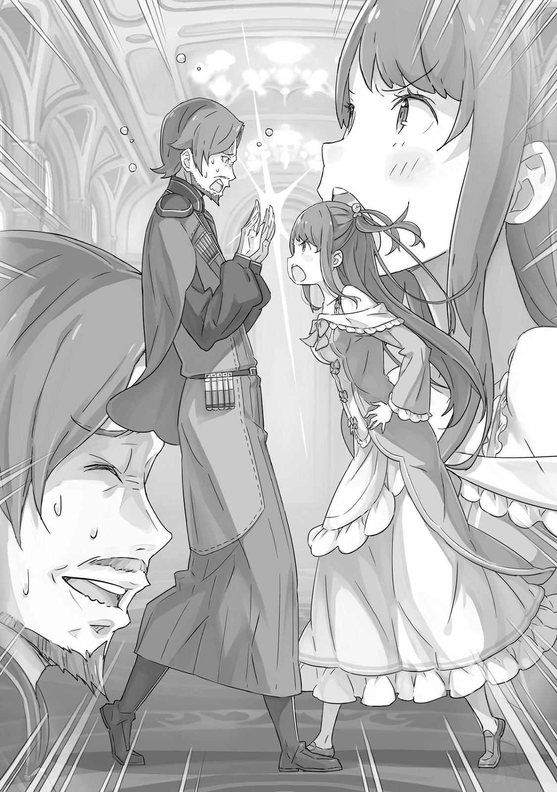
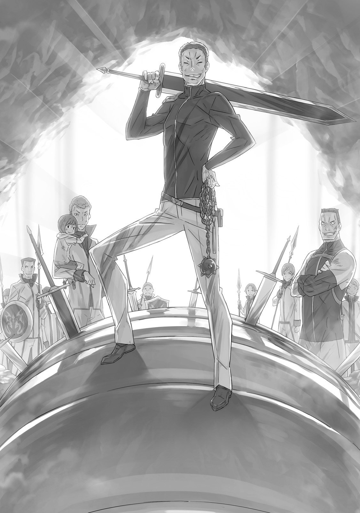
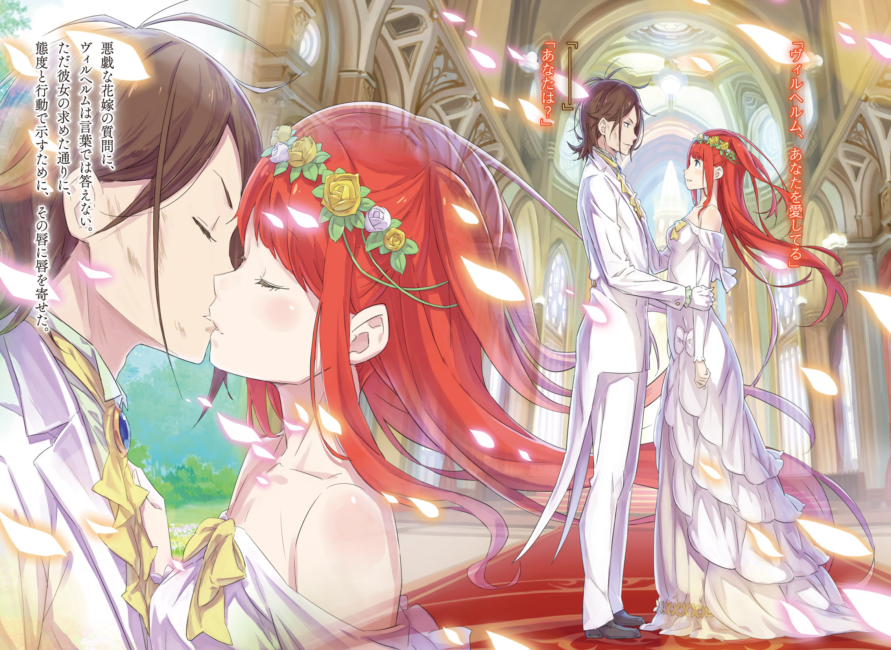

День свадьбы

『婚礼の日』

× × ×

Приятный, тёплый ветер приветствовал Вильгельма, стоило ему ступить в сад. Лёгкий бриз донёс до него сладкий, щекочущий нос аромат цветов, смешанный с запахом листвы, прежде чем умчаться в чистое небо.

Сад, отражающий пристрастия своего владельца, утопал в сезонных цветах. Здесь были большие и маленькие бутоны всех видов, и все они были расставлены по своим местам, создавая прекрасную композицию.

Стоя и любуясь всеми этими великолепными цветами, он подумал, что хозяйка сада, стоящая сейчас в самом его центре и наслаждающаяся пейзажем, была похожа на цветок больше, чем любое из здешних растений.

— Терезия. — Вильгельм прервал свои размышления и позвал женщину.

Она обернулась, придерживая рыжие волосы от ветра. Её голубые глаза встретились с глазами Вильгельма, и улыбка, столь дорогая ему, скользнула по её губам, затмевая для него все остальные цветы в саду.

— Вильгельм.

Звук его имени вернул восхищённого юношу к реальности. Он поднял руку, словно пытаясь скрыть минутную задумчивость.

— Да, — сказал он отрывисто. — Я только что вернулся.

— С возвращением. — Его резкое приветствие лишь заставило её посмотреть на него с ещё большей нежностью. Этих нескольких слов, которыми они обменялись, было достаточно, чтобы наполнить сердце Вильгельма теплом. Он хотел просто раствориться в этом чувстве. Если бы только он мог…

— Так ты смог разобраться во всей этой истории? — спросила она. Она продолжала улыбаться, но её слова развеяли его желание, словно паутину.

— …

— Вильгельм?

Её вопрос заставил его лицо напрячься, и Терезия не упустила этого изменения. То, как она затем произнесла его имя, вызвало у него подозрение, от которого он никак не мог избавиться. В какой-то момент её улыбка тоже исчезла. Вильгельм вздохнул, ощущая её взгляд, словно пронзающий меч.

— …Возможно, это бесполезно, но я хочу кое-что сказать прежде.

— …Возможно, это и бесполезно, но я выслушаю, что ты хочешь сказать.

— Не злись.

— Думаю, это зависит от того, что ты собираешься сказать, не так ли?

Его защитный гамбит был сорван, и между ними на мгновение воцарилось молчание. Но Вильгельм был не из тех, кто оттягивает неизбежное. Он собрался с духом и открыл рот.

— Я заставил начальство прийти и поговорить со мной напрямую. Я сказал им, что это тирания.

— Угу. Полная несправедливость. И?

— Они решили удвоить мои патрульные задания. Прости.

— С какой стати они это сделали?!

Рот Терезии приоткрылся; она схватила Вильгельма за лацканы и яростно встряхнула. Её тонкие руки, тем не менее, сумели довольно сильно его раскачать.

— Я же просил тебя не злиться, — раздражённо сказал Вильгельм.

— Конечно, я буду злиться! Я имею в виду…! Ведь—

Терезия не смогла закончить фразу, но толкнула его в грудь.

Затем её небесно-голубые глаза наполнились слезами, и она закричала:

— Наша свадьба через три дня!!

Крик Терезии всполошил птиц, мирно наблюдавших за садом. Под звук десятков крыльев стояли мужчина и женщина, глядя друг на друга — два человека, которые сошлись после многих невзгод и теперь оказались в эпицентре новых проблем — Святая Меча и Демон Меча, будущие муж и жена.

…Давным-давно шла долгая война, которую история запомнила как Войну Полулюдей.

Это был гражданский конфликт, разрывавший Драконье Королевство Лугуника на части в течение девяти лет, и ему положила конец одна юная девушка, Святая Меча.

В знак уважения к её достижениям королевство провозгласило её героем, но самоотверженность и мастерство фехтования молодого человека по имени Демон Меча положили этому конец.

Пройдя через множество перипетий, Святая Меча в конце концов стала не более чем обычной девушкой, вышла замуж за Демона Меча, и они жили долго и счастливо. И все их благословили…

…Кхм. Мир не настолько добр, чтобы позволить истории закончиться так гладко.

С одной стороны, была Святая Меча, рождённая в длинном роду Святых Меча, которая владела своим клинком во имя королевства.

С другой стороны, был Демон Меча, из дома, разрушенного во время войны, который покинул свой отряд, когда бои были самыми ожесточёнными, и который в конечном итоге сорвал церемонию празднования перемирия.

Прошлое Вильгельма как человека, отказавшегося от рыцарства и похвал, отбросившего свои почести, ставило его в трудное положение; это создавало множество препятствий для их брака. Но связь между ними, а также помощь окружающих, позволили им преодолеть эти трудности. И теперь свадьба стремительно приближалась, день, когда вся нация наконец-то отпразднует союз Вильгельма и Терезии как мужа и жены.

— И что теперь? Теперь говорят, что жених пропустит свадьбу!

Терезия, покраснев от злости, топала по ковровому покрытию пола в апартаментах, её гнев, возникший в саду, ничуть не утих. Вильгельм пытался игнорировать её, раздражённо вздыхая.

— Ах! Ах! Этот вздох — ты думаешь, что я сплошная проблема! Это касается нас обоих, так что думай головой, Вильгельм! Это ужасно, ты понимаешь?!

— Посмотри на себя, каркаешь из-за одного вздоха… И я не думаю, что ты проблема. Только то, что ты шумная.

— Вот! Это и есть доказательство того, что ты не воспринимаешь это всерьёз! О, я не могу в это поверить!

Вильгельм поднял руки, понимая, что всё, что он скажет, скорее всего, только усугубит ситуацию. В данный момент Терезия была похожа на очаровательную бомбу; одно неосторожное прикосновение могло вызвать взрыв.

— Ты наконец-то вернул себе рыцарское звание, и все скептики наконец-то начали с этим мириться. Почему приказы о развёртывании пришли в эскадрон Зелгефа прямо перед нашей свадебной церемонией? Есть целая армия других подразделений, которые могли бы справиться с такой задачей! — После того, как первая вспышка гнева улеглась, Терезия наконец вернулась к сути вопроса.

Вильгельм скрестил руки на груди, радуясь возможности вернуться к реальной проблеме, и сказал:

— Я же говорил тебе. Сейчас в замке не так много подразделений, готовых к развёртыванию. Эскадроны армии были отправлены по всей стране во имя восстановления после войны. Возможно, мы единственные свободные на данный момент, кто может справиться с такой миссией… так что эстафета перешла к нам.

— Это не может быть ничем иным, как оправданием! Я уверена, что кто-то сделал это просто для того, чтобы усложнить тебе жизнь… На самом деле, я уверена, что это мой отец!

— Хотелось бы сказать, что у тебя паранойя, но…

— Видишь? Даже ты так думаешь! — Терезия хлопнула в ладоши и сердито надула щёки.

Отец Терезии, Бертоль Астрея, был нынешним главой семьи Астрея и вскоре должен был стать тестем Вильгельма. Вильгельм, разумеется, пошёл увидеться с родителями своей невесты перед свадьбой, и напряжение того разговора было трудно забыть. Бертоль пытался раскрыть истинный характер Вильгельма и выявить любые недостатки с помощью огромного количества яростных вопросов; Бертоль не был плохим человеком, но он, естественно, оберегал Терезию.

Настолько оберегал, что предположение о том, что это последнее задание было уловкой с его стороны, чтобы помешать свадьбе, было слишком правдоподобным.

— Полагаю, это означало бы, что он использовал накопленный поколениями вес имени Астрея, чтобы повлиять на военных лидеров страны… — размышлял Вильгельм. Но в то же время он задавался вопросом, действительно ли этот человек будет настолько отчаянно пытаться сорвать свадьбу своей дочери.

Терезия, однако, посмотрела в пол, её длинные ресницы опустились на глаза.

— Мои старшие братья, Темза и Карлан, и мой младший брат, Касильес… Все они погибли на войне. Я всё, что осталось у моего отца. Я уверена, что он просто волнуется.

— …

— Тем не менее, у него хватает наглости вмешиваться в счастье своей дочери! Мы должны дать ему отпор!

— Мы дали ему отпор, и в результате получили ещё больше патрульных заданий, чем раньше. Они играют нечестно.

— Т-так ты был готов завоевать мою руку в бою, но не можешь противостоять моему отцу?

Она покраснела от собственного употребления слова «завоевать», но, тем не менее, Терезия насмешливо посмотрела на Вильгельма. Демон Меча нахмурился.

— Стараться изо всех сил, чтобы завоевать тебя, и делать это, чтобы заткнуть твоего отца — две разные вещи. Поверь мне, я бы хотел, чтобы всё было так же просто, как просто порубить его…

— Мой отец владеет мечом на среднем уровне… или даже немного хуже, на мой взгляд. Мой дядя… младший брат моего отца, был Святым Меча до меня, и мой отец быстро отказался от пути клинка…

— Другими словами, победа над ним в поединке на мечах не имела бы большого значения. Плюс…

Тут он замолчал, представив, что на самом деле стоит за, скорее всего, стратегией Бертоля.

Вильгельм потерял свою семью и войну, покинул армию и даже отказался от своего статуса рыцаря. Он вряд ли ожидал, что Дом Астрея примет его с распростёртыми объятиями. По правде говоря, он и сам не произвёл лучшего впечатления, когда встречался с её семьёй, и разрешение на этот брак было во многом формальностью. Если бы Вильгельму пришлось угадывать, он бы сказал, что Бертоль испытывает его, чтобы проверить, достоин ли Вильгельм его дочери.

Было тяжело смириться с потерей всего своего свободного времени непосредственно перед свадьбой, а затем с тем, что его заставили работать ещё больше, когда он поднял этот вопрос.

— Но когда идёшь на разборки, нельзя отступать, когда их находишь.

— Разборки?

— Если это действительно дело рук твоего отца, то это вызов. Меня бесит, что это не битва на мечах, но у каждого свой способ сражаться. Мне просто придётся с этим смириться.

Они вступят в бой, но не с клинком, а в своей преданности Терезии. Вызов, казалось, заключался в следующем: Если ты хочешь завоевать Терезию, ты, конечно, можешь справиться хотя бы с этим.

И если такого жалкого испытания было достаточно, чтобы доказать его ценность, Вильгельм был совершенно счастлив принять его.

— Я отвоевал тебя у Бога Меча. Можешь не сомневаться, я смогу отвоевать тебя у твоего отца.

— О, э-э… Ну, э-э…

Услышав это так прямо, Терезия забыла обо всём своём гневе и поддалась смущению. Она застенчиво посмотрела в пол, но в конце концов снова обрела голос.

— …Могу ли я быть уверена, что через три дня ты сделаешь меня своей невестой?

— Потрать всю ту энергию, которую ты тратишь на беспокойство обо мне, на то, чтобы подготовить себя. И, кстати, не позволяй никому, кроме меня, видеть это своё уязвимое, краснеющее лицо.

— Уязвимое? — Она выглядела потрясённой; возможно, она никогда этого за собой не замечала.

— …

Вильгельм нахмурился, видя, насколько очаровательно выражение её лица. Он скрыл свою реакцию игривым толчком в лоб девушки.

— Иии!

Святая Меча, которая через три дня станет невестой Демона Меча, издала милый писк.

Эскадрон Зелгефа имел беспрецедентную репутацию во время Войны Полулюдей, как и его лидер, Бешеный Пёс, Бордо Зелгеф.

Бордо, который прошёл через бесчисленное множество битв, был начальником Вильгельма в течение очень долгого времени, и Вильгельм был ему многим обязан. Хотя ни один из них никогда не признавал этого вслух.

Армия страны, включая эскадрон Зелгефа, в настоящее время претерпевала серьёзную реорганизацию после окончания войны, и в рамках этого Бордо был повышен с капитана до члена высшего командования в штабе. Таким образом, должность капитана эскадрона Зелгефа была вакантна, и по традиции повышение происходило изнутри.

— …И у кого-то там, должно быть, не все дома, потому что они хотят, чтобы я стал капитаном. — Вильгельм скривился. Он стоял на площади прямо перед воротами замка Лугуники, в самом центре королевской столицы, перед более чем сотней собравшихся там членов эскадрона.

— Традиция есть традиция, — сообщил ему Гримм. — Тут ничего не поделаешь.

— Что-то не так с такой традицией. Как парень, который покинул эскадрон, может быть повышен до командира? Будет некрасиво, если мы не выберем наших лидеров честно и справедливо.

— Человек, который сорвал королевскую церемонию и сразился на мечах со Святой Меча, чтобы сделать её своей женой, беспокоится о том, чтобы не выглядеть некрасиво?

— Ой, заткнись. Или… перестань писать, или просто перестань.

Объектом этого едкого, со свистом вырывающегося сквозь зубы упрёка Вильгельма был его торопливо говорящий — или, скорее, торопливо строчащий — старый боевой товарищ Гримм Фаузен, теперь в непривычном одеянии заместителя командира эскадрона.

Он знал Вильгельма почти с самого начала гражданской войны, и хотя он больше не мог говорить, они продолжали общаться на почти телепатическом уровне. Как капитан и вице-капитан, они отлично сработаются, и это раздражало Вильгельма.

Тот факт, что Гримм, казалось, наслаждался дискомфортом Вильгельма в этой ситуации, тоже его беспокоил.

— Я думаю, что вице-капитан Гримм попал в точку. По крайней мере, никто из присутствующих, похоже, не расстроен тем, что ты стал капитаном. Та церемония доказала твою силу — и твои яйца.

— Смотри, как бы я тебе не продемонстрировал лично, Конвуд.

— Ооо, я дрожу!

Эти шутки исходили от давнего члена эскадрона Зелгефа, Конвуда Мелахау. Он не был особенно выдающимся в бою, но даже Вильгельм заметил его поведение. Острый ум служил как на поле боя, так и за его пределами.

Было много тех, кто, как и Конвуд, знал Вильгельма как члена эскадрона Зелгефа ещё два года назад или больше. Каким бы капитаном он ни был, Вильгельм обнаружил, что обладает минимальным авторитетом среди стольких людей, которые знали его так долго. Тем хуже, если они видели его в самом молодом и неотесанном виде.

— Капитан, которого мы знаем, вице-капитан, которого мы знаем… Какая-то реорганизация.

Возрождённый эскадрон Зелгефа состоял из многих ветеранов, включая вице-капитана Гримма и капитана Вильгельма. Хотя Бордо больше не было с ними, его имя останется.

— Это для того, чтобы имена всех людей, с которыми мы сражались, жили дальше, верно?

— Я практически слышу, как Пивот вздыхает… Заставляют их работать даже после смерти.

Гримм иронично улыбнулся, но Вильгельм проигнорировал его и посмотрел на собравшиеся войска.

Эскадрон Зелгефа собирался выехать из столицы для патрулирования близлежащих городов и деревень. Их целью было восстановление общественной безопасности, которая исчезла во время конфликта, и пресечение любых заговорщиков, которые могли бы стремиться нарушить перемирие. Это было пустяком по сравнению со всем, что они делали во время войны, но солдаты эскадрона Зелгефа стояли с напряжёнными лицами, глаза горели истинной страстью.

— Даже если всё пойдёт по плану, этот патруль займёт почти ровно три дня… Нам придётся вернуться прямо в день свадьбы капитана и леди Терезии. Знаете что? Когда я услышал эти приказы, я подумал, что начальство сошло с ума.

— Ключом к этой миссии будет то, сколько времени мы потратим на шоссе Лифаус. Все, убедитесь, что остаётесь под действием Божественной Защиты Заграждения от Ветра.

— Не хотелось бы этого говорить, но если ваш земляной дракон рухнет по пути, вас оставят позади. Мы не можем допустить, чтобы кто-то замедлял нас в этой поездке. Я думаю, все здесь согласны, что это правильно.

— Да, конечно. Если что-нибудь случится со мной, не смейте меня спасать…!

Слушая, как солдаты совещаются между собой, подробно обсуждая свои планы, Вильгельм приподнял бровь. Почему они так на этом настаивают? Это факт, что он должен вернуться вовремя к свадьбе, но это не более чем его личная проблема. В конечном счёте, это никак не влияло на остальных…

— Это просто показывает, насколько они все обеспокоены этим, — сказал знакомый хриплый голос. Вильгельм повернулся на голос и увидел приближающегося со стороны замка коренастого гиганта. Мужчина был хорошо сложен, с коротко остриженными синими волосами: Бордо Зелгреф.

— Тебе давно пора научиться обращать внимание на то, что происходит вокруг тебя. Ты теперь командир эскадрона, и скоро станешь мужем. Нельзя думать только о себе, если хочешь преуспеть в обоих этих делах. — Он грубо рассмеялся.

Вильгельм лишь пожал плечами.

— Что ты здесь делаешь так внезапно? Я думал, ты слишком занят для всего этого.

— Га-ха-ха. Я действительно занят. Но это первая миссия нового эскадрона Зелгефа. Как его бывший командир, самое меньшее, что я могу сделать, — это проводить его.

С крепким, здоровым смехом Бордо похлопал Вильгельма по плечу, что больше походило на удар. Демон Меча покачнулся от удара, и гигант сказал тише:

— Кроме того, рядовые солдаты — не единственные, кто считает это задание злоупотреблением властью. Не может быть, чтобы верхи не знали, когда женятся Святая Меча и Демон Меча. Это пахнет неприятностями, и тебе лучше быть осторожным.

— Я всё ещё не привык к тому, что ты даёшь мне такие советы.

— Статус определяется поступками. Я учусь думать головой, хочешь верь, хочешь нет… И тот говорун, которого ты мне на днях рекомендовал, на удивление полезен. Это было правильное решение, уговорить их выпустить его из тюрьмы.

— О, Орфей. Он бабник и мошенник, но это не значит, что он не может быть полезен.

Бордо говорил о мошеннике, с которым Вильгельм познакомился в Тюремной Башне, том самом, который посоветовал ему, как решить его проблему с Терезией. Вильгельм, выполняя своё обещание заступиться за Орфея, рекомендовал его Бордо в качестве потенциального помощника. Вопреки всем ожиданиям, Орфей действительно оказался полезным.

— Полезно иметь рядом такого умного парня. Я думаю, что когда-нибудь было бы неплохо создать организацию, которая работает так же, как он. И когда мы это сделаем, я назову её «Шесть Языков», в его честь.

— Он так гордится тем, сколько у него языков, — сказал Вильгельм. — Он что-нибудь узнал для тебя?

— Никаких подробностей. Просто, что это, вероятно, вмешательство определённых сторон, которые невысокого мнения о твоём браке с леди Терезией. Есть догадки?

— …Достаточно определённые, чтобы у меня разболелась голова.

Он вряд ли мог прямо сказать, что виновником был отец невесты, но его подозрения переросли в почти полную уверенность.

Бордо нахмурился на его ответ, но Вильгельм покачал головой и сказал:

— Не парься. Они хотят драки? Что ж, я тоже. Тебе не о чем беспокоиться.

— Ты думаешь, что это вопрос победы и поражения? Я сам не уверен, но ладно.

Отказ Бордо ввязываться в мелочные детали был одновременно одним из его орудий и одной из его самых сильных сторон. Он закончил их разговор грубым «Задай им жару», а затем пошёл подбадривать людей.

— Он настоящий капитан. — Гримм улыбнулся.

— Настоящий бывший капитан, но я согласен. — Вильгельм посмотрел в сторону ворот замка. — Чёрт. Когда Бордо наиграется, мы выдвинемся.

Всего в эскадроне было более ста человек, а также около двадцати драконьих повозок для их перевозки. Всё было выстроено и готово к отправлению, и солдаты были нетерпеливы. Вильгельм намеревался отправиться в путь, как только Бордо закончит обход. Но едва эта мысль промелькнула у него в голове…

— Вильгельм!

…он услышал своё имя со стороны ворот и оглянулся. Он увидел молодую женщину, бегущую вниз по склону мелкими семенящими шажками, тяжело дыша.

— Терезия? Почему ты здесь?

— Слава богу! Я так рада, что успела до твоего отъезда.

Почти игнорируя потрясённого Вильгельма, Терезия вежливо поклонилась стражнику у ворот и вошла на площадь. Ворота замка, эта важнейшая из оборонительных линий, были преодолены без единого окрика.

— …Я знаю, что все тебя узнают и всё такое, — сказал Вильгельм, — но когда это стражник так легко пропускал «отставную» девушку в замок?

— Стражники все прекрасно знают, кто я. Я думаю, что, возможно, я даже знаю их лучше, чем ты — ха! — Терезия подмигнула Вильгельму, который недоверчиво посмотрел на неё.

Они уже попрощались, когда он покидал особняк. Он поклялся вернуться до их свадьбы через три дня, а затем быстро ушёл, чтобы не поддаться искушению задержаться. И теперь всё было напрасно.

Такие расставания становятся тем труднее, чем больше времени на них тратишь. Может быть, он всё ещё не осознавал, как много эта женщина о нём думает.

— Да ладно тебе, Вильгельм. Ты снова хмуришься. Я же говорила тебе перестать.

— Ну, это твоя вина.

— Как это моя вина? Не могу поверить, что ты такое говоришь. О, о! Но послушай…

Терезия протянула что-то, что прятала за спиной. Вильгельм, всё ещё хмурясь, взял это: это была коробка, завёрнутая в ярко-жёлтую ткань.

— Что это?

— Я сделала это для тебя, раз уж ты уезжаешь так далеко. Т-т-ты же знаешь, как называют… обед, упакованный с любовью?

— Ты так смущена, что едва можешь заставить себя это сказать, — заметил Вильгельм, проверяя вес свёртка в руках. Терезия покраснела на середине своего объяснения. Он казался слишком тяжёлым для того, что она могла бы состряпать в такой короткий срок, и Вильгельм был втайне доволен. Отчасти потому, что у него будет что поесть, конечно, но и потому, что Терезия позаботилась о том, чтобы сделать это.

— Так, э-э, тебе, э-э, нечего сказать? — спросила Терезия.

— А что бы я сказал?

— Ради всего святого! Я изо всех сил старалась приготовить тебе хороший обед, разве нет? Как насчёт какой-нибудь искренней благодарности или чего-то в этом роде?

— Искренней благодарности, да? — Он задумчиво помолчал. — Я буду представлять, что это ты, пока буду его есть.

— Аргх, я не знаю, как к этому относиться…!

Вильгельм тщательно обдумал свои слова, но, судя по реакции Терезии, они были неправильными.

Тем не менее, это не меняло того факта, что он был счастлив. Похоже, это дошло до неё, и Терезия смогла выдавить полуулыбку на неуклюжий ответ Вильгельма.

— Всё в порядке, — сказала она. — Я не ожидала многого. Это не так уж важно. Если ты сможешь принять эту еду в том же духе, в котором я её приготовила, этого достаточно.

— Отлично. Так почему же внезапный порыв сделать мне «обед с любовью»?

— Не могу поверить, что ты можешь говорить это так легко…!

Не только выражение лица Терезии могло быстро меняться, но и весь цвет её лица. Она переходила от красного к бледному и мертвенно-белому; наконец, она остановилась на деликатном покашливании.

— Армия не славится изысканной едой, верно? — сказала она. — К тому же, эскадрон Зелгефа будет в пути, и он полон мужчин, кроме того. Назови это моим крошечным актом сопротивления в твою защиту.

— У нас есть Гримм, который занимается нашей едой. И даже я могу готовить.

— Конечно, ты не ожидаешь, что Гримм в одиночку будет готовить для сотни солдат. А что касается почерневшего мяса и переваренных овощей, которые подаёшь ты, я даже не считаю это едой.

— Кхм…

— В любом случае, я хотела сделать что-нибудь для тебя. Если бы я могла сделать что-нибудь, чтобы помочь тебе получить хоть немного больше энергии, чтобы вернуться вовремя к нашей свадьбе… тогда я хотела это сделать! Вот и всё.

Поняв, что начинает ходить по кругу, Терезия отвела взгляд на середине своей речи. Это означало, что она пропустила изменение в глазах Вильгельма.

— …

Она не заметила, как ему пришлось подавить своё желание обнять её прямо сейчас, раствориться в её уязвимой сладости.

Это было близко. Но ему пришлось считаться с местом, где они находились, и положением. Дело было даже не в том, чтобы подавать плохой пример своим подчинённым. Оковы, о которых Вильгельм никогда не беспокоился, теперь сдерживали его руку. Спасли ли они его, или удержали? Его чувства были смешанными.

— Я знал, что повышение по службе не принесёт мне никакой пользы…

— Правда? Я рада, что так много людей признают тебя.

— Ты делаешь это нарочно?

— …?

Терезия стояла удивлённая, совершенно не подозревая, насколько она очаровательна. Плечи Вильгельма поникли. Демон Меча с опозданием понял, что все взгляды прикованы к нему. Бордо закончил воодушевлять войска, и весь эскадрон теперь наблюдал за обменом репликами между парой. Казалось, они искренне наслаждаются перепалкой между Демоном Меча и Святой Меча.

— …Что вы все уставились?

— Да так, ничего. — Конвуд ухмыльнулся. — Просто думаю, я знаю, что трудно оставлять настоящую любовь позади, но, может быть, пора уже выдвигаться. Ты и твоя старушка сможете провести вместе стооолько времени, сколько захотите, когда мы закончим здесь, после свадьбы. А пока наш капитан холостяк.

— Старушка? Тьфу… Я думаю, ещё немного рановато для этого…!

Смешок пробежал по остальной части эскадрона от поддразнивания Конвуда. Вильгельм щёлкнул языком, будучи объектом смеха, но Терезия, прижав руки к краснеющему лицу, не выглядела совсем уж недовольной.

Теперь она сделала небольшой вдох и вышла вперёд перед эскадроном Зелгефа.

— Э-э, спасибо, что уделили мне несколько минут вашего времени перед отправлением. Я почему-то никогда не думала, что настанет день, когда я увижу, как вы уезжаете без меня. И, может быть, мне тоже следует извиниться за это.

— …

Терезия выглядела смущённой и виноватой, но эскадрон молчал. Ещё три месяца назад Терезия и эскадрон Зелгефа часто сражались бок о бок в гражданской войне. Она была Святой Меча: она сопровождала их в экспедициях и своим клинком сделала больше, чем кто-либо другой на передовой.

И теперь эскадрон Зелгефа отправлялся в патруль, а Терезия оставалась в столице. Это было бы немыслимо во время войны, и, возможно, сама Терезия чувствовала себя несколько покинутой.

Но—

— Иии!

— Зачем извиняться, глупышка? Так всё и устроено.

Вильгельм хлопнул её по затылку, а затем вышел вперёд. Прежде чем Терезия успела возразить, потирая голову, Демон Меча издал слышимый звук каблуком своей сапоги. В ответ солдаты эскадрона Зелгефа тоже щёлкнули каблуками о землю, выравнивая свои ряды.

— Вау…

— Сражаться и защищать — долг солдата, — сказал Вильгельм. — Я же говорил тебе, Терезия. Ты оставайся здесь, позади меня и остальных солдат, и занимайся своими цветами или чем-то в этом роде. Это долг гражданского.

— Иметь домохозяйку звучит довольно неплохо, а, кэп? — поддразнил Конвуд, на что Гримм добавил:

— Он тебя подловил! — и весь эскадрон снова разразился смехом.

Вильгельм тоже нехотя рассмеялся, а Терезия смотрела на него широко раскрытыми глазами.

— …

Всего на мгновение эти большие голубые глаза опасно приблизились к слезам. Терезия быстро смахнула их рукавом, выдавив улыбку на лице. Добрую улыбку, которая могла мгновенно пленить сердца даже Демона Меча, Вильгельма, и всех его могучих воинов.

Всё ещё улыбаясь, Терезия низко поклонилась и сказала:

— Спасибо вам всем. Все, пожалуйста, позаботьтесь о Вильгельме, пока вас не будет!

Это были последние слова, которые кто-либо сказал перед тем, как они отправились в путь.

— Га-ха-ха-ха! Вот так штука для нашего Вильгельма, госпожа Терезия. Лучшего способа проводить его и не придумаешь. Не могу поверить, что он уже так под каблуком.

— «Под каблуком»? Пожалуйста. Он не из тех, кого легко ограничить или контролировать. Иногда мне кажется, не я ли держу его в таком крепком кулаке.

— Отсутствие самосознания — само по себе грех. Но в любом случае, вы должны выполнить свой долг как жена Демона Меча.

Такой разговор завязался, когда эскадрон Зелгефа наконец оставил Терезию и Бордо позади. Между ними установилась та особая связь, которая возникает между людьми, пережившими вместе битву. С одной стороны, был Бордо, которого отозвали с передовой из-за повышения; с другой — Терезия, которая фактически вышла в отставку: их соответствующие положения также давали им много общего.

— Мастер Бордо, вам не одиноко смотреть, как Вильгельм и остальные уходят?

— Одиноко. Какое милое слово. Признаюсь, есть небольшое покалывание… или, может быть, большое покалывание, оттого что я не могу просто сбежать с ними, как раньше.

Бордо опустил взгляд на свои руки, в которых не было привычного боевого топора, и его голос немного понизился. Однако вскоре он сжал кулаки.

— Но послушайте. Поле битвы может измениться, но я остаюсь собой. У меня есть свои обязанности. Есть люди, которые ожидали и надеялись, что я поднимусь в этом мире. Я рад, что могу желать и надеяться на что-то. Так же, как вы надеетесь на Вильгельма, госпожа Терезия.

— Я… Да, я чувствую то же самое. — Она посмотрела туда, куда ушли Вильгельм и его солдаты.

Краем глаза она увидела, как скрещиваются мускулистые руки.

— Кстати, — сказал Бордо, — насчёт того, о чём вы просили меня разобраться на этом новом поле битвы… о том, кто отправил эскадрон Зелгефа на это случайное задание…

— Простите, что полагаюсь на вас. Просто сейчас я не могу придумать никого другого, на кого можно рассчитывать.

— Не переживайте. Речь идёт о свадьбе двух моих старейших товарищей. Не то чтобы у меня не было своей заинтересованности… Просто я не совсем уверен, должен ли я вам это говорить. — Бордо почесал свои короткие волосы, выглядя огорчённым.

Терезия сузила глаза, не в силах подавить дурное предчувствие по поводу того, что могло заставить его колебаться.

— Всё… в порядке. Пожалуйста, говорите свободно. Не смягчайте.

— Вы уверены?

— Да. Не жалейте меня.

— …Похоже, за этими приказами стоит Дом Астрея. Другими словами, ваш отец.

В голосе Бордо звучала боль. Терезия закрыла глаза.

Взрывной ауры, которая внезапно ощутилась в воздухе, было достаточно, чтобы каждый волосок на каждом стражнике у ворот встал дыбом. Даже Бордо, с его многолетним боевым опытом, приготовился к смерти.

Но Святая Меча, источник этого невероятного присутствия, быстро взяла его под контроль.

— П-простите! Я вышла из себя! Это была случайность! Не беспокойтесь! — Кланяясь ошеломлённым стражникам, Терезия хлопнула себя ладонью по лбу, как бы подчёркивая, насколько она раскаивается.

Получился милый шлепок, и Бордо начал смеяться над несоответствием этого звука с этой великой фехтовальщицей.

— Госпожа Терезия… я думаю, вы и Вильгельм оба догадывались, верно?

— Да, ну. Я не хотела в это верить. Даже сейчас я бы хотела, чтобы это было неправдой.

Её подозрения подтвердились. Когда она узнала, что на самом деле её собственный дом, её собственный отец пытался помешать её свадьбе, буря начала бушевать в сердце и разуме Терезии.

В любом случае, теперь она знала, кто её враг. И если Вильгельм отправлялся на решающую битву…

— Тогда я тоже должна сражаться…

— Г-госпожа Терезия? Я уверен, что мне не нужно указывать, что если вы поднимете свой меч, Вильгельм будет недоволен, верно? Э-э, и я тоже не был бы в восторге.

— О, под «сражаться» я имею в виду «поговорить». Это была фигура речи… эмоциональная штука.

Тем не менее, Терезия, чувствуя себя совсем по-другому, сжала кулак. Бордо воспринял всё это с большим беспокойством.

Терезия поручила Бордо расследовать это дело, ни разу не упомянув об этом Вильгельму. Она намеревалась сама уладить всё со своим отцом. Бордо горячо надеялся, что насилия будет не слишком много.

— Если вам понадобится посредник, я не буду против… — сказал он.

— Всё в порядке, — ответила Терезия. — Я знаю, что вы заняты, мастер Бордо, и мне не хотелось бы вас беспокоить. Кроме того, эта проблема касается меня и Вильгельма, и я хочу решить её должным образом как муж и ж-ж-жена! Как муж и жена. Да, — сумела выговорить она, покраснев.

Она низко поклонилась Бордо, который не мог полностью избавиться от своего беспокойства; затем она метнулась прочь с площади.

Было ясно даже по тому, как она уходила: она планировала найти Бертоля Астрея, своего собственного отца, и уладить этот вопрос.

— С этими двумя никогда не бывает легко, — пробормотал Бордо. Чувствуя себя заметно постаревшим, он направился обратно в замок, чтобы работать. В его сердце была только одна молитва — чтобы свадьба прошла без сучка и задоринки через три дня.

Приказом для эскадрона Зелгефа в этой миссии было патрулирование главных и второстепенных дорог вокруг столицы. Военные уже были развёрнуты в так называемых пяти великих городах страны, чтобы помочь восстановить и укрепить общественную безопасность после войны, поэтому этот патруль в основном охватывал небольшие города и деревни на этих дорогах.

Это не была миссия, которую обычно поручали элитному эскадрону Зелгефа. Тем более вероятно, что это конкретное назначение было уловкой кого-то из-за кулис.

— И ты думаешь, что это отец леди Терезии создаёт проблемы? Не кажется ли тебе, что у тебя паранойя?

— Ты не встречался с этим человеком. Если бы ты встретился, ты бы знал, что я не шучу… Не то чтобы я не понимал, почему он был бы чрезмерно опекающим.

Вильгельм поджал губы на предположение Гримма, когда они ехали бок о бок на земляных драконах. Его старый боевой товарищ улыбнулся, а затем написал ответ на своей бумаге.

Благодаря Благословению отражения ветра, не было ни тряски, ни шума, когда они ехали. Несмотря на это, Вильгельм был втайне впечатлён тем, что Гримм мог так легко писать, сидя верхом на драконе.

— Я привык.

— …Я ничего не говорил. — Вильгельм нахмурился, недовольный тем, что его мысли так легко читают. Гримм прищурился на него, что заставило Вильгельма прорычать: — Что? Ты выглядишь так, будто не обращаешь внимания. Не приходи ко мне плакаться, если упадёшь со своего дракона.

— Я просто почувствовал себя немного эмоциональным, учитывая, что твоя свадьба через три дня. Ты действительно вырос.

Гримм действительно выглядел глубоко тронутым, настолько, что Вильгельм перестал хотеть огрызаться на него. Семь лет, которые они знали друг друга, охватывали всё время Вильгельма в армии. Не говоря уже о его «потерянных» двух годах. Его знакомство с Бордо и эскадроном Зелгефа было таким же долгим, и даже Вильгельм был способен иногда испытывать настоящие эмоции.

— …Хочешь знать правду? — сказал Вильгельм. — Я был уверен, что ты умрёшь через десять минут после того, как я тебя встретил.

— Я уверен, что это правда. Я сам никогда не верил, что переживу гражданскую войну. Даже сейчас я думаю, что, должно быть, произошла какая-то ошибка, что я израсходовал свой жизненный запас удачи.

— Твой жизненный запас, да?

Вильгельм не любил смотреть на жизнь как на прихоть удачи, хорошей или плохой. Особенно когда дело касалось поля боя — места жизни и смерти, где люди закалялись в пламени битвы.

Единственное, что влияло на выживание в бою, — это то, что ты сделал в своей жизни до этого момента. Он считал, что это должно быть меч против меча, магия против магии, жизнь против жизни. Молодой Вильгельм мог бы наброситься на Гримма по этому поводу. Но теперь он дважды подумал. Почему? Из-за определённой встречи.

Потому что он встретил женщину, которая заставила его думать, что он израсходовал свой собственный жизненный запас удачи.

Гримм протянул молчащему Вильгельму листок бумаги с одним предложением.

— Ты размяк.

— Отвали. — Будучи снова легко прочитанным, Вильгельм сердито оттолкнул бумагу.

— …

Удовлетворённый этим ответом, Гримм сосредоточился на чём-то новом. Он вытащил короткую металлическую палочку из своего седла и ударил ею по куску металла, прикреплённому к его бедру. Получившийся лязг был его способом общения с окружающими. В ответ на звук металла о металл Конвуд подъехал сзади.

— Вызывали? — спросил он.

— Я хочу ещё раз пройтись по маршруту патрулирования. Время особенно ограничено в этой миссии.

— Это точно. — Конвуд многозначительно кивнул, а затем посмотрел на Вильгельма. Вильгельм сохранял прямолинейное молчание, доказывая, что даже Демон Меча может извлекать уроки.

— Мы не можем допустить, чтобы леди Терезия стояла у алтаря в одиночестве. Поверь мне, весь эскадрон поддерживает тебя в этом. И эта небольшая сцена перед нашим отъездом только ещё больше воодушевила войска.

— Довольно об этом. Поторопись и переходи к делу. — Вильгельм бросил на Конвуда колючий взгляд. Тот достал из сумки карту и развернул её. На ней была изображена область вокруг столицы, с их маршрутом, отмеченным красными чернилами, и кружками вокруг пунктов назначения.

— Сначала мы пойдём по шоссе Лифаус до Флёра, — сказал Конвуд. — Затем мы направимся на запад, через Милл Грей, Бонобо и Крамлин, прежде чем вернуться в столицу. Форсированным маршем.

— Это два дня только на дорогу, — сказал Вильгельм. — Включая патрулирование, я не уверен, что трёх дней будет достаточно.

— Вот почему мы собираемся промчаться по этим дорогам как можно быстрее — чтобы трёх дней было достаточно. Мы договорились оставить любого, кто отстанет. Люди готовы умереть, лишь бы не замедлять нас.

— Это не задание, за которое стоит умирать…

Вильгельм мог бы воспринять слова Конвуда как шутку, если бы не лицо этого человека и разговоры, которые он подслушал перед отъездом. Тем не менее, это было правдой, что они будут стараться свести время в пути к абсолютному минимуму.

— Я думаю, что если, в дополнение к этому, мы закончим наши патрулирования в каждом городе как можно быстрее, мы успеем, — сказал Конвуд.

— Нас это устроит? — спросил Вильгельм. — Весь смысл в том, чтобы повысить общественную безопасность, верно? Если мы пойдём просто для того, чтобы сказать, что мы технически ходили, то зачем вообще беспокоиться?

— Не проблема. Города на нашем маршруте практически накладываются на столицу… Они, вероятно, самые безопасные небольшие поселения в стране прямо сейчас, если уж на то пошло. Им просто нужно знать, что если возникнут какие-то проблемы, большой, страшный Демон Меча немедленно примчится, чтобы разобраться с ними.

— Важно, чтобы люди нас видели. В этом суть. — Гримм кивнул, как бы подчёркивая, что беспокоиться не о чем.

Вильгельму это почему-то показалось очень широкой интерпретацией их задания, но если они будут слишком усердствовать, у них наверняка не хватит времени. Это был компромисс, которого достигли его люди, взвешивая время и долг.

— Это ещё один признак того, что я размяк… или того, что я стал слишком умным для собственного блага?

— Это ещё одна вещь, которую ты должен сделать для леди Терезии.

— Ты думаешь, что это способ заставить меня согласиться на что угодно, не так ли?.. — Тем не менее, Гримм был прав в том, что эта логика быстро убедила Вильгельма.

— При такой скорости и придерживаясь только того, что строго необходимо для патрулирования, мы должны вернуться в столицу через два с половиной дня. С половиной дня у тебя даже будет несколько минут, чтобы подготовиться к церемонии. И тогда все будут жить долго и счастливо.

— Я очень на это надеюсь…

Конвуд звучал даже бодрее, чем обычно, возможно, пытаясь облегчить тревогу, которую они испытывали. Вильгельму, однако, всё это было трудно переварить. Он таил в себе личное беспокойство, от которого никак не мог избавиться. Будучи благодарным за то, что солдаты так полностью привержены тому, чтобы вернуть его домой вовремя к свадьбе, он знал, что за этим стоит Бертоль.

Я не думаю, что он позволит мне так легко отделаться.

— Это не похоже на тебя. Ты действительно так беспокоишься?

— Я сражаюсь с врагом, которого не могу достать своим мечом. С таким же успехом я мог бы размахивать палкой.

Выражение лица Вильгельма было мрачным, и Гримм протянул ему бумагу.

— Я понимаю. Надеюсь, тебе станет легче. Мы должны суметь практически просто пройти через нашу первую остановку, Флёр.

Глаза Вильгельма расширились, когда он прочитал записку.

— …? Что, ты что-то знаешь?

— Флёр — это место, где я родился. Я имею определённое влияние на жителей. Это должно помочь нам завершить патрулирование там за короткое время.

Вильгельм приподнял бровь.

— Хм, это новость для меня. Я не знал, что ты родом из такого близкого места.

Гримм одарил его сложной улыбкой. Вильгельм знал это выражение. Это был взгляд человека, который был непочтителен к своим родителям. Он выглядел точно так же, как он сам: человек, который сбежал из дома после ссоры с братьями, кто-то, у кого никогда не было возможности извиниться.

— У каждого своя история, — невозмутимо сказал Конвуд. — Не то чтобы это было для нас чуждой концепцией.

— Весь этот эскадрон состоит из беглецов? Какой-то элитный отряд, — сказал Вильгельм, тронутый их великодушием. Его сердце стало чуть-чуть легче; он был благословлен отличными товарищами. Не то чтобы он признал это вслух.

—Спасибо. В любом случае, позволь мне разобраться с Флёром.

Как раз в тот момент, когда Гримм подтверждал, что он со всем разберётся, на дороге стали видны смутные очертания каких-то зданий. Это был Флёр, гостиничный городок, о котором они только что говорили. Их первая остановка и проверка того, насколько хорош Гримм как оратор…

— А?

Как только эта мысль промелькнула у него в голове, Вильгельм онемел от того, что он увидел в городе. Так же, как и весь остальной эскадрон Зелгефа.

Причиной тому был гигантский транспарант, висевший над въездом в город, гласивший:

ДОБРО ПОЖАЛОВАТЬ! ТРИУМФАЛЬНОЕ ВОЗВРАЩЕНИЕ ВЕЛИКОГО ГЕРОЯ ИЗ НАШЕГО ГОРОДА!

Казалось, всё население собралось, чтобы поприветствовать их.

Раздался громкий радостный возглас; звук людей, которые узнали блудного сына, вернувшегося к ним после того, как завоевал себе положение власти в национальной армии. Не было никаких сомнений в том, кого приветствовали эти люди.

— …Эй, — сказал Вильгельм Гримму, — ты действительно думаешь, что сможешь убедить их, чтобы это было недолго?

Он говорил от имени всех; весь эскадрон сразу же посмотрел на Гримма. Гримм начал потеть. Дрожащей рукой он нацарапал:

— Я постараюсь.

Это было далеко от смелых заявлений, которые он делал несколько минут назад.

— Ну и ну! Подумать только, никчёмный отпрыск трактирщика вернётся к нам таким высокопоставленным!

— Прошло много времени. Простите. Есть так много вещей, о которых нужно поговорить, но…

— Гримм, ты нечто! Я сбежал из армии почти сразу же, как только вступил в неё, и вернулся домой…

— Я не виню тебя. Поле битвы — ужасающее место.

— Слу-у-ушай, Гримм. Я знаю милую юную девушку, которая может тебе понравиться. Хочешь поговорить с ней, прежде чем уйдёшь?

— Простите! Я уже занят…

И так продолжалось до тех пор, пока эскадрон Зелгефа наконец не смог вырваться из Флёра.

Они выделили два часа на патрулирование в этом городе. Благодаря любезности Гримма, героя родного города, эскадрон Зелгефа успешно превысил отведённое им время на пять часов, проведя во Флёре в общей сложности семь часов.

— Я больше никогда не поверю ничему, что ты скажешь! — бушевал Вильгельм, подгоняя своего земляного дракона во главе группы. Перед лицом гнева Демона Меча всё, что мог сделать Гримм, — это опустить голову. Учитывая всё его позёрство, это был лучший вариант после того, что по сути было жалким поражением. Действительно, ему следовало бы тщательно обдумать, что пошло не так в этом случае.

— Полегче, кэп, — сказал Конвуд. — Мальчик сбегает из дома и возвращается героем — конечно, мама, папа и дети хотят отпраздновать…

— Да, и каждый родственник, учитель и старый друг! Они выстроились в очередь до следующей деревни… Какой бардак! — Крики Вильгельма стали ещё громче, когда он вспомнил о семичасовых торжествах.

По правде говоря, никого из них не удивило, что деревня Гримма могла захотеть устроить событие из его возвращения домой. Некоторые из его близких родственников чуть не расплакались, увидев его снова.

— Полагаю, мои родители решили, что я мёртв, — написал Гримм.

— Учитывая, как ты выглядел, когда я тебя встретил, и тот факт, что они не получали от тебя известий в течение многих лет, я их не виню.

Это было общее мнение всего эскадрона в то время, что Гримм вряд ли выживет в течение долгого времени. Но благодаря череде совпадений он всё ещё был с ними. Сам Гримм, вероятно, не стал бы возражать, назвав это даром удачи.

— Это довольно серьёзный удар по нашему графику, но семья вице-капитана была очень рада его видеть, — сказал Конвуд. — А что касается патрулирования, мы не могли бы и мечтать о более успешной демонстрации военного присутствия.

— Весь этот инцидент был…

— Нет, забудь, — сказал Вильгельм, прерывая Гримма, когда тот начал писать извинительную записку. — Конвуд прав. По крайней мере, мы выполнили свою работу.

Как беглец, лишённый сыновней почтительности, как и его старый товарищ, Вильгельм вряд ли мог его судить. Каково бы ни было положение других членов его эскадрона, у Вильгельма больше не было семьи, с которой можно было бы связаться. Пламя войны поглотило их, вместе со всем его родным городом. Он был таким же, как Гримм, в том, что он сбежал и никогда не связывался со своей семьёй после этого. Но, в отличие от Гримма, у Вильгельма никогда не будет возможности извиниться.

С этой точки зрения возможность для Гримма воссоединиться со своей семьёй и друзьями была поводом для радости.

— Мы можем наверстать время, — сказал он. — Если хочешь показать, что сожалеешь о сегодняшнем дне, просто… пиши своей семье иногда.

— …

— В любом случае, когда ты вернёшься с Кэрол однажды, всё будет ещё хуже, верно?

Пытаясь оставить случившееся позади, Вильгельм упомянул возлюбленную Гримма. Он видел, как обрадовалась семья Гримма, узнав, что их сын достиг военного звания. Если бы они знали, что он собирается жениться на дочери дворянина, они были бы невообразимо потрясены.

— Не лезь не в своё дело. — Когда Гримм наконец снова посмотрел на Вильгельма, он наконец улыбался.

Казалось, это вдохновило весь отряд, и они отправились в путь с удвоенной энергией. Временные рамки, которые они пытались максимально сжать, вместо этого были серьёзно расширены, но всё ещё не выходили за рамки возможного восстановления.

— К счастью, я не думаю, что у нас есть члены эскадрона, которые родом из каких-либо других мест, которые мы посещаем, — сказал Конвуд.

— Это облегчение, — ответил Вильгельм. — Если я увижу ещё одного родителя, друга, члена семьи или доброжелателя, я их…

— Это кажется немного прямолинейным, не так ли? — Гримм казался не совсем довольным.

— Я просто не хочу повторения Флёра. Я пытаюсь свести сопутствующий ущерб к минимуму, так сказать.

Независимо от реакции Гримма, эскадрон Зелгефа поспешил по Лифусскому шоссе. Вскоре они благополучно прибыли в свой следующий пункт назначения, Милгр.

На этот раз не было массовой приветственной вечеринки, и они смогли завершить своё патрулирование и двинуться дальше в кратчайшие сроки.

— Я рад, что ничего не произошло. Надеюсь, всё так и будет продолжаться.

— Сколько времени мы наверстали?

— Мы всё ещё отстаём от графика на четыре часа.

— И на кой черт я спросил?

Тем не менее, они действительно восстановили некоторое время. Если всё так и пойдёт, им, возможно, удастся вернуться в столицу за пару часов до свадьбы.

— По крайней мере…

По крайней мере, он, возможно, уедет, не расстроив Терезию. Вильгельм знал, что хватается за соломинку, но это было всё, что у него было.

Но, конечно, когда хватаешься за соломинку, эта соломинка в конце концов ломается.

Дворянский квартал столицы был местом, где могли жить только люди со статусом. Совершенно новые магические фонари сияли в ночи вдоль улиц с прямыми краями, вымощенных плитами, которые пролегали среди роскошных, элегантных зданий. Драконьи повозки, катившиеся по улицам, почти не издавали звука; всё это место было верхом изящества.

Страна, предположительно, устала от долгой гражданской войны, но конфликт, казалось, едва коснулся этого места. Дворянский квартал, казалось, отвергал все влияния из-за своих границ, словно отдельный мир. Любые беспорядки или драки были строго запрещены, в знак уважения к этикету и спокойствию этого района.

Две женщины шли по району, их туфли стучали по земле. Одна из них шла, расправив плечи, рассекая воздух, в то время как вторая женщина окликнула первую.

— Л-леди Терезия! Вы… вы действительно собираетесь противостоять лорду Бертолю?

— Конечно, Кэрол. Я ужасно зла на всё это.

Терезия, всё ещё быстро шагая, поджала губы, обращаясь к другой женщине, у которой были золотые волосы и голубые глаза, и которая производила общее впечатление резкости. Вторая женщина, Кэрол, сжалась под взглядом Терезии.

— Ты хочешь сказать, что ты против меня, Кэрол? Что ты против… моей свадьбы?..

— Пожалуйста, не смотрите на меня так тревожно, госпожа! Я бы никогда не выступила против вас ни в чём! Хотя, признаюсь, Вильгельм не был бы моим первым выбором в мужья…

— Значит, ты против нас…

— …! Пожалуйста, не ставьте меня в такое трудное положение; вы заставите меня плакать! Я буду рыдать, как жалкий маленький ребёнок!

— П-прости, прости. Всё в порядке, Кэрол, я тебе доверяю.

Видя, что напряжённая красавица вот-вот сломается, Терезия поспешила успокоить Кэрол. Её служанка, служившая ей столько лет, обычно была довольно стоической, но когда дело касалось вопросов, в которых была замешана Терезия, она иногда могла становиться удивительно хрупкой. В последнее время эта тенденция распространилась и на её любовь к Гримму, и, из-за его связи с Терезией, на всё, что связано с Вильгельмом. Кэрол стала довольно эмоциональной и любительницей милых вещей…

— Я удивлена, узнав, сколько проблем ты можешь доставить, Кэрол, — сказала Терезия.

— Т-такая внезапная критика, миледи. Я первая среди ваших служанок и та, кто помогает вам ориентироваться в этом мире. Я надеюсь, что вы будете продолжать полагаться на меня так же, как и всегда.

— Да. И ты всегда была очень надёжной.

— Да, мэм!

Терезия ободряюще похлопала Кэрол по плечу, на что та ответила сияющими глазами и выразительным кивком. Она подпрыгнула с криком, прежде чем удивлённо наклонить голову.

— А? Когда это я стала такой послушной…?

— Пойдём, Отец и Мать должны быть здесь. Пойдём выскажем им всё, что о них думаем. — Терезия полностью проигнорировала вопрос Кэрол, когда они подошли к одному конкретному дому в дворянском квартале — месту для посетителей, приехавших в столицу издалека. Учитывая свадьбу на следующий день, родители Терезии — Бертоль, глава Дома Астрея; и его жена, Тиша, — предположительно, были там.

— Мне показалось странным, когда они сказали, что остановятся в гостевом доме, а не в нашем особняке. Я уверена, что они просто не хотели, чтобы я узнала, что они замышляют.

— Понятно, — сказала Кэрол. — Если позволите спросить, миледи, что сказал лорд Бертоль, когда отказался остаться в особняке?

— Он заявил, что дом уже принадлежит мне и Вильгельму как мужу и жене, так что они не будут пытаться навязываться нам… И, э-э, ну, поверь мне, я не была убеждена просто потому, что он назвал нас «мужем и женой», ладно?

Кэрол мягко улыбнулась.

— Конечно, я понимаю. Ваша Кэрол на вашей стороне, леди Терезия.

Это была та же улыбка, которую она показала на церемонии после окончания войны, когда она молча наблюдала за Терезией, готовой принять честь, которую она не хотела. То есть, улыбка, которая показывала, что она что-то скрывает в своём сердце; и у Терезии не хватило смелости спросить, что это было.

— В любом случае, пойдём, — сказала Терезия. — И давай сделаем так, чтобы подобное больше никогда не повторилось.

— Но, миледи, какой в этом смысл, даже если лорд Бертоль признает своё вероломство в этом случае?

— Меня не волнует этот раз. Я собираюсь заставить его пообещать на будущее. В конце концов… — Направляясь ко входу в гостевой дом, Терезия оглянулась на Кэрол. В её глазах не было и следа сомнения, когда она заявила: — Вильгельм вернётся до свадьбы. Он обещал сделать меня своей невестой. Так что тебе не о чем беспокоиться.

Затем, на этой волне уверенности, Терезия потянулась к двери.

Таким образом, Вильгельм пользовался полным доверием Терезии, но…

— …

Небо было тёмным. Невероятно тёмным. Весь мир, казалось, был сделан из этой кромешной тьмы, без единого луча света где-либо.

Четыре угла мира, казалось, не содержали света, и воздух казался насыщенным песком, который тёрся о кожу, неся горечь, которую они могли практически попробовать. Земля под их ногами была одновременно твёрдой, но влажной и скользкой. Это была поистине худшая из возможных обстановок.

Несколько лязгов металла о металл разнеслись в темноте и исчезли вдали. Люди напрягли слух, чтобы проследить за ними, услышали, как они исчезают вдалеке, а затем вздохнули.

— Глубоко, да?..

В этом не было места для сомнений, и не было никакого ответа. Но это имело смысл. Помимо Вильгельма, здесь, в этом месте, было только два других человека. Один из них был без сознания на руках Демона Меча, а что касается другого…

— …

Вильгельм почувствовал, как его хлопают по плечу, и оглянулся. Он не мог видеть лица другого человека из-за мрака. Но благодаря долгому знакомству он всё равно знал, о чём думает этот человек. Это было страшно. И он давал худший из возможных ответов.

Вряд ли было необходимо подробно рассказывать о том, насколько плохим сочетанием были Гримм и полная темнота. Отсутствие света было естественным врагом человека, который общался посредством письменного слова. Его выражение лица и язык тела могли передать кое-что из того, о чём он думал, но в этой кромешной тьме даже это было невозможно.

— …нгх.

— Неважно, как сильно ты хочешь поговорить, — сказал он, — я всё равно не знаю, что ты пытаешься сказать…

Может быть, Гримм был расстроен тем, насколько ужасной была ситуация. Однако, услышав скрипучий стон, Вильгельм на самом деле успокоился. Люди иногда становятся спокойнее, чем больше паникуют окружающие. Или, возможно, это только казалось. Возможно, Вильгельм просто столкнулся с такой огромной чередой неудач, что прошёл через реальное бедствие, чтобы достичь чего-то вроде просветления.

— Ааа… — Вильгельм почесал щёку и посмотрел вверх. Он мог видеть обрушившийся вход в пещеру, но, как ни старался, не мог до него добраться. Им придётся исследовать, используя эхо от металлической пластины Гримма, в надежде, что в глубине будет ещё один выход.

— Но даже если я выживу, Терезия может убить меня вместо этого…

Ещё до вопроса о том, чтобы успеть на свадьбу вовремя, стало сомнительно, вернётся ли он вообще домой живым. Вильгельм вздохнул. И когда до свадебной церемонии оставалось всего полдня, Демон Меча сделал свой первый шаг вглубь пещеры, надеясь избежать погребения заживо.

Кэрол тихо сглотнула, ощущая устрашающее присутствие мужчины перед ними. Оно было очень похоже на воинственную ауру, исходящую от превосходного фехтовальщика, но было общеизвестно, что стоящий перед ними мужчина не владеет мечом, и Кэрол была хорошо осведомлена об этом факте. Следовательно, эта подавляющая аура должна была быть волной какой-то другой сильной убеждённости.

— Во-первых, позвольте поблагодарить вас за то, что проделали весь этот путь до столицы.

Кэрол почувствовала себя застывшей; рядом с ней её вечная госпожа зажгла искру разговора. Её глаза были жёсткими, один этот взгляд мог бы сразить менее сильного противника. Но этот мужчина, нисколько не испугавшись выражения лица Терезии, посмотрел ей прямо в глаза и улыбнулся.

Конечно, он так поступил. В конце концов, человек, стоящий перед Терезией, технически не был врагом, а—

— Какие формальности, Терезия. Это место для семьи. Не чувствуй себя обязанной соблюдать церемонии.

— Да, но…

— Не заставляй меня настаивать. Мы семья, и я твой отец. Нет нужды в пышности и обстоятельствах. — Он улыбнулся ей, мужчина средних лет с довольно лихой бородой. Его рост, его густые рыжие волосы и его улыбающиеся голубые глаза, казалось, вызывали в памяти образ Терезии. Как, возможно, и следовало, ведь они были родителем и ребёнком.

Её отца звали Бертоль Астрея. Он действительно был кровным отцом Терезии и нынешним главой Дома Астрея, на протяжении поколений являвшегося домом для линии Святых Меча, тех, кто стоял на вершине фехтовального мастерства.

Но он был в равной степени известен тем, что, несмотря на своё происхождение, сам Бертоль абсолютно не владел клинком.

— Кэрол, — сказал Бертоль.

— Д-да, сэр! — ответила Кэрол. — Прошло довольно много времени, лорд Бертоль.

— Оставьте формальные приветствия. Что с вами случилось? Вы и Терезия стоите так напряжённо. Это заставляет меня опасаться, что что-то случилось. Нет?

Кэрол выпрямилась, когда разговор перешёл на неё, не в силах скрыть свою нервозность. Было трудно судить о её точной социальной дистанции от Бертоля, и ей было трудно разговаривать с ним по причинам, совершенно не связанным с отношениями семьи Кэрол с Астрея.

— Отец, пожалуйста, не придирайся к Кэрол. Она очень серьёзная молодая женщина.

— О, «придираться» — такое уродливое выражение. В любом случае, похоже, ты наконец готова. Ты, должно быть, нервничаешь из-за завтрашнего дня, но я могу заверить тебя, что тебе не нужно—

— Вообще-то, Отец, я пришла поговорить с тобой именно о завтрашнем дне.

Терезия прервала Бертоля, чтобы перейти непосредственно к делу. Кэрол восприняла это как сигнал привести себя в порядок, и Бертоль слегка прищурился.

— Когда твоя дочь завтра станет невестой и приходит, говоря, что хочет поговорить об этом завтра, невозможно не почувствовать беспокойство. — Бертоль улыбнулся, как бы развеивая тревогу. Казалось, он не испытывал угрызений совести при упоминании следующего дня. Этот факт заставил Кэрол дрожать. Причастность Бертоля к патрулированию Вильгельма уже была ясна. Тем более шокирующим было то, что он мог обсуждать эту тему с полным самообладанием.

— Традиционно, когда невеста приветствует своих родителей перед свадьбой, она благодарит их и даёт им обещания на будущее. Обычно она делает это непосредственно перед церемонией, но тогда у нас вряд ли будет время вытереть слёзы. Это довольно заботливо с твоей стороны.

— Конечно, я благодарю тебя. Но я пришла сюда не за этим.

Терезия покачала головой, заставив Бертоля прибегнуть к худшему варианту.

— Ты хочешь отложить свадьбу, значит, или отменить её? Боюсь, этого просто нельзя сделать в такой поздний час. Это навлечёт такой позор на нашу семью… Да, ужасное унижение. — Он прижал руки к лицу, как бы подчёркивая, какой трагедией это было бы.

— Я задавался вопросом, что могло привести тебя и Кэрол сюда одних — не говори мне, что жених сбежал от тебя? Или есть какое-то тревожное откровение о нём? Я спрашивал его о его прошлом, когда мы встречались с ним, но, возможно, он всё ещё что-то скрывал. Нет, подождите… Что-то о его личности или предпочтениях, что не было бы очевидно для среднего наблюдателя… Это какое-то извращённое сексуальное желание?

— Отееец…

— Успокойся, Терезия, тут нечего смущаться. Муж и жена должны, кхм, хотеть одного и того же. Мы должны считать благословением, что ты обнаружила эту аномалию до того, как вы официально поженитесь. Правда, отмена церемонии всё равно будет поводом для смущения, но важнее, что—

— Отец, хватит!

Терезия наконец прервала своего внезапно многословного родителя, стиснув зубы. Глаза Бертоля расширились от звука её голоса, и он замолчал под её пристальным взглядом.

— Я ещё ни слова не сказала, Отец, но ты, похоже, прямо-таки жаждешь принять этот позор.

— Жажду? Ну, это очень странно. Я просто думаю о твоём счасть—

— Ты что-то сделал с Вильгельмом, не так ли, Отец? Я это знаю.

Бертоль, казалось, не знал, когда остановиться, поэтому Терезия обрушилась на него словами, острыми, как любой меч. Он онемел под этим натиском, пока наконец не сумел ответить.

— И… что, если и сделал?

На губах Бертоля появилась тонкая, жестокая, явно злодейская улыбка. Несмотря на смутный фиговый листок что, если, он явно больше не собирался ничего скрывать. Подозрения Терезии были верны. Улыбка Бертоля и его отношение были достаточным доказательством.

Терезия испустила тихий вздох, обнаружив эту злобу со стороны своего собственного отца.

— Спасибо за всё, что ты сделал для меня до этого момента, — сказала она. — Настоящим я отрекаюсь от имени Астрея. Прощай.

— Что?! П-подожди минутку, Терезия! Твой отец не позволит этого!

— Ты думаешь, меня волнует, что ты позволяешь? Ты должен умолять меня о прощении! Почему ты вообще сделал такую вещь?! Я с самого разговора задавалась вопросом; что именно ты так ненавидишь в моём Вильгельме?!

Терезия, столь быстрая на действия, набросилась на Бертоля. Он пошатнулся от этой новой атаки, его рот открывался и закрывался. Устрашающая аура, которая исходила от него до этого момента, исчезла. Вместо этого был только изумлённый, подлый человечек, чьи планы были раскрыты.

— Твои методы, Отец, нечестны! Если тебе не нравится Вильгельм, так и скажи. Что с ним не так? Давай, скажи мне! Дело в его достижениях? В его происхождении? В его владении мечом? В его внешности? Ну, он достиг всего, на что можно было надеяться, он происходит из знатной семьи, я не думаю, что мне нужно рассказывать тебе о его способностях к фехтованию, и, честно говоря, он совершенно красив!

— Л-леди Терезия, мы отклоняемся от темы…

— Нет, не отклоняемся! Вильгельм красив! Ты так думаешь, не так ли, Кэрол?!

— Гримм первый в моём сердце, так что я не могу сказать!

Увлечённая ускоряющимся темпом разговора Терезии, Кэрол неожиданно для себя призналась в том, что она действительно чувствовала. Она яростно покраснела.

Терезия прижала руку ко рту и сказала:

— Кэрол, ты просто прелесть…

— П-пожалуйста, не дразните меня, леди Терезия…!

— Кхм, она права, не стоит дразнить, дорогая. Я думаю, ты отняла несколько лет жизни у своего отца.

— То, что я сказала тебе, не было дразнилкой, Отец. Если всё так и будет продолжаться, то я с тобой покончила!

— Что?! Почему?!

— Почему, действительно! Ты пытаешься помешать моему браку! Как ты можешь не понимать?!

Бертоль съёжился под криком Терезии, выглядя так, будто может упасть в обморок прямо сейчас. Кэрол подавила желание вмешаться, ожидая, как будут развиваться события.

Этот диалог между отцом и дочерью был, по сути, совершенно нормальным.

Достоинство, с которым Бертоль начал разговор, было полностью разрушено эмоциональной вспышкой его дочери. Это был не первый подобный разговор, который они вели о свадьбе Терезии в последнее время. Кэрол прекрасно знала об этом, слыша, как Терезия жаловалась на это несколько раз.

— Ты пытался накопать на него грязь до того, как встретил его, ты ввёл новых членов в эскадрон Зелгефа, пытаясь добиться смещения Вильгельма с должности, и ты снова и снова откладывал свадьбу в надежде сбить его с толку… но это неприемлемо! Я не могу поверить, что была достаточно глупа, чтобы позволить тебе так долго уходить от ответа!

— Это из-за вашего доброго сердца, леди Терезия, — сказала Кэрол. — Но я согласна, что на этот раз всё зашло слишком далеко.

— Что! Ты тоже, Кэрол? — Слабея под перечислением своих преступлений, Бертоль обнаружил, что теперь и Кэрол смотрит на него с презрением. Его борода ощетинилась, когда Кэрол направила на него обвиняющий палец.

— О, Кэрол, — сказал он, — дочь семьи Ремендис. Ты и твой род служили Дому Астрея на протяжении поколений. Смеешь ли ты теперь выступать против главы этого самого дома?

— Мы служили, сэр, но я Кэрол прежде, чем Ремендис. И моя верность принадлежит не семье Астрея, а леди Терезии.

— Хрргхх…!

Прямой упрёк лишил Бертоля дара речи. Терезия проигнорировала его, её глаза наполнились эмоциями от заявления Кэрол.

— Если бы я была мужчиной, — сказала она, — клянусь, я бы сделала тебя своей невестой, Кэрол.

— Этому не суждено было случиться, миледи.

— Ст-стойте! Я не позволю этого! Я бы не отдал тебя ни Кэрол, ни кому-либо другому!

— Я не предлагаю этого всерьёз, — сказала Терезия. — Но, что более важно, Отец…

Она повернулась к Бертолю, который оказался настолько загнанным в угол, что даже шутливое замечание воспринял всерьёз. Её глаза сузились.

Ты говоришь, что не отдал бы меня даже Кэрол? Должна ли я понимать это так, что проблема не в Вильгельме, а в чём-то другом?

— Эрк…

— Вы только что сказали «эрк», лорд Бертоль?

Бертоль побледнел, всё его тело дрожало. Он не был человеком с сильным «покерфейсом». Хотя, возможно, его было бы немного труднее прочитать, если бы дело не касалось его дочери.

Терезия продолжала молча смотреть на него. Истинные мотивы Бертоля теперь были очевидны, но после стольких вмешательств в её свадьбу Терезия была не в настроении проявлять милосердие. Она собиралась нанести последний удар.

Однако прежде, чем она смогла сразить его, кто-то новый вошёл в комнату и разговор.

— Боже мой, какая низость. Я думаю, уже пора сдаться.

Они втроём оглянулись, и каждый отреагировал по-своему. Лицо Бертоля стало ещё более анемичным, в то время как щёки Терезии напряглись. Кэрол, с другой стороны, исполнила официальный поклон и сказала:

— Леди Тиша, давно не виделись. Кэрол к вашим услугам.

— Нет нужды в формальностях, дорогая. Ты знаешь, что ты мне как дочь.

Это замечание, вместе со взрывом смеха, исходило от женщины неопределённого возраста, с длинными льняными волосами. Её красота делала её поразительно молодой; в ней было безошибочное очарование.

Её звали Тиша Астрея. Жена Бертоля и Терезии—

— Мать.

— Ты тоже, Терезия. Не дуйся. Я вырастила тебя милой — твой Вильгельм разлюбит тебя, если ты будешь всё время делать такое лицо.

— Вильгельм никогда не перестанет любить меня… я думаю.

— Ну, разве это не чудесно. А ты, дорогой?

Тиша широко улыбнулась, видя очевидную любовь своей дочери к Вильгельму, а затем посмотрела на своего мужа. Этого взгляда было достаточно, чтобы Бертоль отшатнулся, многозначительно махнув рукой.

— Т-так, минутку, Тиша. Это, знаешь ли, всё ошибка… Да, вот именно, недоразумение.

— Неужели? Ты хочешь сказать, что ты был слишком одинок, чтобы отпустить свою дочь замуж, и поэтому досаждал её будущему мужу всеми способами, которые только мог придумать, включая преднамеренное принуждение его к военной миссии, которая противоречила бы дате самой свадьбы, а затем был обнаружен своей дочерью, которая теперь угрожает покинуть свою собственную семью… но всё это просто недоразумение?

— Аргх…

Натиск Тиши был ещё более сокрушительным, чем у её дочери, и единственным ответом Бертоля было то, что он опустился на колени. По правде говоря, если бы кто-то ещё подслушал список злодеяний этого человека, он был бы шокирован.

Тиша вздохнула, глядя на своего онемевшего супруга, а затем повернулась к дочери.

— Мне так жаль, Терезия. В дополнение к тому, что он довольно подлый, этот человек ещё и невероятно мелочный и не смог бы найти выход из бумажного пакета — и это привело к таким неприятностям для тебя и твоих близких.

— Э-э… Мать, разве ты обычно не немного более благосклонна к Отцу…?

— Разве ты видишь что-нибудь в его действиях, что можно было бы поддержать?

Три женщины, если не сам Бертоль, могли согласиться, что абсолютно ничего.

Под совместным натиском своей жены, своей дочери и девушки, которая была ей как дочь, Бертоль обнаружил, что его гордость в клочьях. Но даже съёжившись, он сумел посмотреть им в глаза.

— Х-хорошо, говорите, что хотите. Но это не изменит фактов. Если этот молодой человек не явится вовремя на свадьбу, это будет оскорблением для нашего дома. И тогда мы никогда не сможем смириться с этим браком. Ты никогда не выйдешь замуж, Терезия…!

— Но почему ты…? Отец, ты хочешь удержать меня в моей жизни? Почему?

— Это не то, о чём мы должны говорить сейчас.

— О, прекрати этот многозначительный спектакль. Ты просто не хочешь отпускать свою дорогую, милую дочь. И ты не остановишься ни перед чем, чтобы удержать её.

— Тиша?! Ты на чьей стороне?!

— Какой вопрос. Конечно, моей дочери.

— Чтоооо?! Но почему?! Ты же моя жена, не так ли?!

— Ты думал, что жена всегда должна слепо следовать за своим мужем? Какая восхитительная фантазия.

Поражённый острым языком Тиши, Бертоль обнаружил, что его образный корабль снова тонет. Его реакция ясно давала понять, что его мотивы были именно такими, как утверждала Тиша.

— Мелкие мысли, мелкие цели, мелкий человек… — Кэрол звучала раздражённо.

— Справедливости ради, это часть того, что делает его милым, — сказала Тиша, лукаво глядя на своего мужа.

Отношения между ними были несколько трудны для понимания, но было достаточно ясно, что Тиша действительно любила Бертоля. Даже Кэрол, которая знала их так долго, была озадачена этим фактом, но так уж оно и есть…

— Может быть, для тебя это и мило, Мать, но для меня это ужасно. Я не знаю, в каком затруднительном положении может оказаться Вильгельм из-за нелепых махинаций Отца…

— Как я уже сказала, в этом человеке нет ничего особенного. Он не способен ни на что по-настоящему ужасное. Просто несколько небольших тактик задержки на дороге… мелкие ловушки, ничего, что могло бы действительно остановить парня. Если уж на то пошло, я бы назвала это последней тщетной борьбой моего мужа.

— Его последней борьбой? — Кэрол нахмурила брови, услышав попытку Тиши развеять тревогу Терезии.

Тиша спокойно посмотрела на Кэрол из-под своих длинных ресниц и сказала:

— Верно, самой последней. Он хочет иметь возможность держать голову высоко поднятой как мужчина семьи Астрея, иметь возможность сказать, что он испытывал мужа своей дочери до самого конца.

— О… — Терезия и Кэрол обе удивлённо посмотрели на Тишу.

Это, как она говорила, был последний акт озорства отца Терезии — последнего мужчины в семье Астрея после смерти братьев Терезии в гражданской войне.

— Старший Брат Темза, — сказала Терезия, — Старший Брат Карлан. И Касильес… — Она посмотрела в пол, произнося имена троих из тех, кто погиб в бою. Они казались хорошими братьями и сёстрами, подумала Кэрол. По крайней мере, все они любили Терезию.

Назвав своих ушедших братьев, Терезия посмотрела на Тишу.

— Если бы мои братья были ещё живы… как ты думаешь, они были бы против моего брака?

— Полагаю, я не знаю. Эти мальчики никогда не были такими тугодумами, как Бертоль, поэтому я не думаю, что они сделали бы что-нибудь столь же нелепое, как это… но они бы испытали его, я уверена. Чтобы проверить, сможет ли твой Вильгельм принести тебе счастье.

— Он уже сделал это, давным-давно.

Тиша улыбнулась этому шёпоту Терезии.

— Это было бы для того, чтобы убедиться, что он сможет продолжать делать это. — Она подошла к своему упавшему мужу, положив руку ему на плечо. — А теперь я полагаю, что вам двоим нужно готовиться к свадьбе. Это работа долгого дня, сделать невесту как можно более красивой для её брака.

— Да, Мать. Но что насчёт Отца…?

— Как я уже сказала, это его последний акт сопротивления. Я не позволю ему сделать что-либо ещё. И твой дорогой жених сможет превзойти его маленькие заговоры. Разве ты не согласна?

Терезия рефлекторно отреагировала на провокацию своей матери.

— Конечно, согласна. — Затем она нахмурилась. — Но, Мать.

К тому времени, когда она поняла, что находится в ладони своей матери, было уже слишком поздно. Её лишили причины загонять Бертоля в угол.

— Отцу действительно нужно покаяться! Я действительно, действительно зла на этот раз!

— Я-я подумаю об… ладно! Я понимаю! Я каюсь! Я искренне сожалею о своих поступках! — Колебания Бертоля сменились искренней капитуляцией под давлением Терезии. Его дочь фыркнула на него, и Кэрол слабо пожала плечами.

— Боже, как я устала… — сказала Терезия.

— Вы были потрясающей, однако, — сказала Кэрол. — Я сама с нетерпением жду завтрашнего дня. — Тонкая улыбка играла на её губах.

Терезия приподняла бровь.

— Так ты тоже веришь, что Вильгельм успеет, Кэрол? Я немного удивлена…

— Ну, с ним же Гримм. Кхм, это шутка, но да, я верю. Этот человек… Вильгельм… не смог бы не явиться, чтобы взять вас в жёны.

В уме Кэрол она вновь переживала тот день, когда Святая Меча, Терезия, стала просто нормальной девушкой. Не одна Терезия была спасена Вильгельмом в тот день. Она никогда не говорила об этом, и всю свою жизнь не будет говорить, но он спас и Кэрол.

Страсть Демона Меча в тот день, то, как он сражался, осталось запечатлённым в её памяти.

— Итак, леди Терезия, давайте готовиться к завтрашнему дню. Всё так, как сказала леди Тиша — завтра вы будете самой красивой женщиной в мире. Позвольте мне помочь вам.

— Кэрол…

— Единственное, в чём я завидую этому человеку, так это в том, что мне придётся отдать ему мою леди Терезию.

— Я чувствую то же самое.

— Отец—!!

Кэрол просто пыталась скрыть своё смущение, но Бертоль, быстро оправившись, согласился с ней. Его слова вызвали крик и румянец у Терезии. Однако за краснотой на её лице скрывался не столько гнев, сколько настойчивое ожидание следующего дня.

— Я буду ждать… — прошептала Терезия, всё ещё краснея, отсутствующему кому-то, о ком она так сильно заботилась.

Этот драгоценный, драгоценный человек преодолеет всё злобное вмешательство Бертоля, чтобы быть там, на свадебной церемонии на следующий день, чтобы взять её в жёны. В этом она была уверена.

Примерно в тот же момент, когда его невеста была в столице, заявляя о своей непоколебимой вере в него…

— …Чёрт, воздух пахнет землёй. — Молодой человек сплюнул на землю с рычанием разочарования, вытягивая шею, чтобы осмотреться. Но зрение само по себе имело ограниченную ценность в неосвещённой пещере, заключённой в толстые каменные стены.

Ему приходилось пробираться в основном наугад, следуя за тем ветерком, который он чувствовал, и слишком тонким лучом надежды.

Он находился в горах Кордор, недалеко от Крамлина, города к юго-востоку от столицы — в пещере, известной как «Гнездо Земляных Змей». Она считалась настолько опасной, что местные жители никогда к ней не приближались. И когда до его свадьбы оставалось полдня, Вильгельм оказался запечатанным внутри, буквально потерявшись в темноте.

Всё началось несколько часов назад. Если не считать задержки в Флёре, неистовое патрулирование эскадрона Зелгефа проходило гладко. Они прошли через Милл Грей, известный своими ветряными мельницами, и Бонобо, известный своими винокурнями, в кратчайшие сроки и вскоре прибыли в свой конечный пункт назначения, Крамлин.

Проблемы возникли, когда эскадрону представили отчёт, в котором говорилось, что несколько местных детей пропали без вести. Была вероятность, что они просто играли, или заблудились, или разыгрывали шутку. Но если с ними произошла какая-то чрезвычайная ситуация, то это входило в мандат эскадрона как защитников общественной безопасности.

— Капитан, если мы потратим здесь время, мы…

— Опоздаем на свадьбу. Я знаю. И что я скажу Терезии? «Я бросил кучу детей, чтобы быть с тобой»? Она бы лично зарубила меня и каждого члена этого эскадрона.

— Это точно. И Кэрол тоже разозлилась бы на меня.

Такова была оценка эскадрона Зелгефа ситуации с пропавшими детьми. Вильгельм был категорически против пренебрежения служебными обязанностями в пользу приоритета свадьбы, и ни одна душа не выступила против него. Вместо этого они принялись за работу как можно быстрее.

Они поручили местным жителям обыскать сам город, а эскадрон Зелгефа проверил окрестности. Именно это привело их к обнаружению следов возле горы Кордор и к тому, чтобы проследовать по ним к детям, которые упали в пещеру.

К тому моменту они пробыли в Крамлине два часа — болезненное количество времени, но не невосполнимая потеря. С облегчением Вильгельм планировал спуститься в пещеру и помочь каждому из четырёх детей выбраться, а затем вернуться в город.

По крайней мере, до того момента, как произошло землетрясение, обрушившее вход в пещеру.

Всё началось с небольшого толчка и маленькой трещины; затем толчки стали сильнее, а трещина шире, пока, под градом пыли и земли, бывший вход не превратился в невыразительную стену.

В пещере остались только Вильгельм, последний из четырёх детей, и Гримм, который ловил детей, но упал во время землетрясения.

Несколько часов спустя они втроём всё ещё пробирались в темноте.

Напрягая глаза, чтобы что-нибудь увидеть, Вильгельм пробормотал в кромешную тьму:

— Я был уверен, что это будет быстрее, чем пытаться раскопать вход… но я начинаю думать, что было бы разумнее подождать помощи. — Как будто в упрёк, раздался звук металла, который эхом отразился от стен пещеры.

Этот шум издавал протестующий Гримм. Он ударял по металлической пластине, привязанной к его левой ноге, как бы твёрдо говоря: Не сдавайся.

Поскольку они были готовы к различным обстоятельствам, даже без слов они могли поддерживать минимальное общение, но это делало вмешательства Гримма гораздо более физическими и шумными, чем когда он мог просто записать их. Вильгельму, конечно, не нужно было, чтобы Гримм говорил ему не сдаваться; он просто хотел выбраться из пещеры, и этого лязга, как можно быстрее.

Возможно, было благословением то, что маленький мальчик, который был с ними, потерял сознание во время обрушения и оставался без сознания. Гримм нёс маленькое тело с собой, Вильгельм шёл впереди, чтобы разведать пещеру — следуя за ветерком, который дул через туннели, в надежде найти другой выход.

— …

Час за часом неумолимо скользили мимо. В пещере почти не было света, и скорость их поисков не могла сравниться даже со скоростью улитки. Их начало охватывать нетерпение.

Час огня был почти позади, когда они прибыли в Крамлин; к настоящему времени солнце, должно быть, садилось снаружи, и температура начинала падать. Ветерок, проникающий в пещеру, становился холоднее, и их положение становилось немного, но неуклонно хуже. Они почти отчаялись, что когда-нибудь успеют на свадьбу.

Но затем—

— Эй, не уходи слишком далеко вперёд. Плохая опора. Если земля уйдёт из-под тебя, и ты упадёшь, я не могу обещать, что смогу тебя спасти.

Гримм, тяжело дыша, двигался быстрее. Он казался более расстроенным, чем Вильгельм, человек, на чью свадьбу они собирались опоздать, что озадачило Вильгельма. Как и все остальные в эскадроне Зелгефа, Гримм дал своё благословение союзу между Вильгельмом и Терезией, и было очевидно, что он хотел вернуться в столицу как можно быстрее.

— Но это не похоже на тебя. Ты обычно ставишь безопасность на первое место, прежде всего заботясь о том, чтобы выжить. И именно сейчас ты решил разволноваться?

— …!

Гримм оглянулся, удивлённый словами утешения, которые он не привык слышать от своего старого боевого товарища. Его лицо было невидимым в темноте, но его взгляд казался сердитым. Как ты можешь вести себя так беспечно? — казалось, спрашивал он.

При таких темпах они опоздают на свадьбу. Тем не менее, Вильгельм не проявлял никаких признаков смятения; его характер не стал более вспыльчивым. Он явно был нетерпелив, но этим всё и ограничивалось.

Он обдумал факты.

— Даже если бы я пропустил церемонию, она и я уже знаем, что мы на самом деле чувствуем. Пока эти чувства не изменились, у меня нет причин так волноваться.

— …

— Кроме того, я не намерен опаздывать. Я собираюсь сделать её своей невестой. Я собираюсь вернуться домой. Я обещал ей, что сделаю и то, и другое. Если я не сдержу эти обещания, я, вероятно, никогда больше не смогу попробовать её стряпню.

Вильгельм смело хвастался подавленному Гримму. Всего на секунду Вильгельму показалось, что Гримм был ошеломлён его беспечной шуткой. Но вскоре раздался долгий вздох, ответ, очень характерный для Гримма.

— …

— Не смотри на меня так. Я знаю, о чём ты думаешь, даже если я не вижу тебя или твой листок бумаги. И у нас нет времени болтать. Разве я не прав?

Резкость исчезла из ауры Гримма и сменилась чем-то более мягким, но Вильгельм отмахнулся от этого и возобновил поиски в пещере. Он предположил, что Гримм просто пожал плечами на его слова и снова начал искать — или он, должно быть, попытался, но затем в темноте раздалось слабое «а…».

Звук исходил со стороны Гримма, от мальчика, которого он нёс на спине. Ранее бессознательный ребёнок зашевелился, медленно приходя в сознание.

— А, о… А…?

— …Ты проснулся, да? Сделай мне одолжение и постарайся не слишком шуметь, — спокойно сказал Вильгельм. Он чувствовал замешательство мальчика. Мальчик уловил мягкую манеру Вильгельма, когда Гримм поставил его на землю; он искал их двоих в темноте, говоря: — Г-где мы…? Кто вы, сэры?

— Мы? Мы из столицы. Мы пришли найти тебя. Мы в пещере в горе. Мы искали тебя и твоих друзей повсюду. Ты понимаешь меня?

— О, мы в «Гнезде Земляных Змей»… Значит, эта пещера, должно быть… — Мальчик понял из объяснений Вильгельма, где они находятся, и это его ужасно испугало.

— Тебе нужно сохранять спокойствие. Ты прав, это пещера, которую называют «Гнездом Земляных Змей». Вход обрушился, и мы ищем другой выход… Почему вы вообще сюда пришли?

— …Взрослые велели нам не входить сюда.

— Имеет смысл. Они, можно сказать, нам велели сюда не входить.

— Но в последнее время было так много землетрясений… Мой дедушка однажды рассказал мне историю. Он сказал, что почтенный Земляной Змей, который живёт в горах, вызывает землетрясения. Так что…

Мальчик замолчал, но Вильгельм понял его.

— Вы пришли убить Земляного Змея. Очень смело.

Он поторопился с выводами. С ноткой паники в голосе мальчик сказал:

— Н-нет! Мы хотели принести ему подношение, чтобы он перестал буйствовать! — Затем он порылся в своей сумке. Он что-то бросил на землю — и мгновение спустя появился яркий свет. Это был сильный свет, первый, который они видели за несколько часов, и Вильгельм с Гриммом оба хмыкнули.

— …Вы принесли лагмит, да?

— Конечно, принесли — в конце концов, это пещера. Почему вы не принесли, сэры?

— …

Вильгельм и Гримм обменялись кислыми взглядами, когда ребёнок указал им на их неподготовленность. Но в любом случае, благодаря мальчику, у них теперь было на что смотреть. Это значительно облегчит их поиски.

Вильгельм протянул руку, и мальчик неохотно передал ему камень. Лагмит. Вильгельм почувствовал сияющую вещь в своей руке, когда сказал:

— Я восхищаюсь духом, который показали ты и твои друзья, но вы слишком слабы для этой работы. Поработайте над своим фехтованием, прежде чем делать что-то подобное снова, чтобы не доставлять всем таких хлопот.

— Э-э… Хорошо, да, сэр. Простите. — Мальчик опустил голову, совет был несколько неожиданным. Теперь, однако, между светом и ветром, они, возможно, смогут найти, откуда дует ветерок, и обнаружить выход. Вильгельм боялся думать, сколько времени пройдёт, когда они наконец выберутся…

— Но мы побеспокоимся об этом, когда выберемся. Как бы я ни ненавидел суеверия вроде Земляного Змея.

Дети, по-своему, думали о городе. Не было смысла вечно злиться на них за это. Но позитивное, почти оптимистичное бормотание Вильгельма заставило глаза мальчика расшириться.

— Суеверия? — спросил он. — Но Земляной Змей настоящий.

— …

Вильгельм сузил глаза, услышав удивлённое заявление мальчика. Сразу после этого, и прямо рядом с Вильгельмом, Гримм резко ударил по своей металлической пластине, касаясь затылка. Звук эхом отражающегося металла был самым сильным предупреждением, которое он мог дать.

У Гримма было тонко отточенное чувство опасности, и даже Вильгельм обычно полагался на его восприятие. Реакция Гримма предвещала начало настоящей опасности.

— Чёрт, что-то—?

Вильгельм собирался сказать приближается, но прежде, чем он смог спросить, оно было там.

Обнажив меч, он поднял свет, чтобы видеть дальше в пещеру. Не успел он это сделать, как тень промелькнула перед яркой флуоресценцией, всплеск приближался к ним через пещеру с неистовым грохотом.

— …!!!

Он врезался и извивался, существо, которое заполняло весь туннель перед ними, во много раз больше Вильгельма или его спутников. На мгновение они усомнились в своём собственном чувстве реальности.

Секунду спустя большая, извивающаяся тень бросилась на них.

— …?!

Неумолимая волна разрушения вызвала второй обвал.

Так называемый Земляной Змей принял форму массивного червя, более тридцати футов в длину. У него не было глаз, которые ему не были нужны под землёй, и у его извивающегося тела не было ни рук, ни ног. Однако на его тёмном лбу росли искривлённые рога, делая отвратительность его родословной очевидной с первого взгляда.

Рога были доказательством того, что это был зверодемон, один из заклятых врагов человечества. Зверодемоны были движимы желанием опустошить все формы жизни — это означало, что трое из них, непреднамеренно забредшие на его охотничьи угодья, теперь были целями его безжалостных попыток разрушения.

— !!

Его хвост обрушился на поднятый щит Гримма. Как щитоносец, он обладал исключительной способностью читать входящую атаку. Они столкнулись со зверодемоном, большим, быстрым существом, и всё же он легко предсказал и перехватил первый удар врага.

— …

Гримм вложил всю свою силу в свой щит, отклоняя удар в сторону. Вместо того, чтобы попасть в цель, он врезался в каменную стену туннеля, заставив всю пещеру содрогнуться.

— Хррк, хаак—! — Гримм потряс головой с силой, кровь капала из его рта. Он блокировал удар, но не смог полностью его победить. Послышался неприятный звук из его рук, и он упал на колени. Было маловероятно, что он сможет отразить второй удар.

Несмотря на это, он купил им возможность, пусть и короткую. Он верил, что Демон Меча сможет использовать её как никто другой.

— Хорошая работа.

Всего два слова, которые, тем не менее, составляли высшую похвалу — за которыми последовал каскад серебряных вспышек в темноте.

Удары приходили со всех сторон и без передышки, врезаясь в тело неподвижного Земляного Змея. Кожа монстра была очень гибкой, его скользкая поверхность была очень устойчива к когтям или клинкам.

Но всякий раз, когда Демон Меча обнаруживал, что один из его ударов отражён, он менял свой подход к следующему. Угол, интенсивность становились более точными с каждым ударом, пока он, наконец, не прорвал оборону существа—

— Рруууаааххх!!

Вильгельм продолжил свою атаку с громким воем, кровь брызнула на него.

Подавленный криком и невероятной атакой, зверодемон отступил, из его тела хлынула кровь. Они могли слышать, как он скользит по земле, и расстояние между ними и Земляным Змеем внезапно резко увеличилось.

— Гримм, вставай! Это плохое место! Пойдём! — Вильгельм схватил Гримма за плечо, помогая ему встать, затем схватил окаменевшего мальчика под руку. Ни один из его спутников не мог двигаться быстро, но это место оставляло их в слишком невыгодном положении, чтобы закончить бой. Он побежал глубже в пещеру, снова полагаясь на свет кристалла трясунца.

Но именно во время бега Вильгельм кое-что понял. Эта пещера не была естественным образованием; неровные туннели были расчищены змеем по мере его движения.

— И это значит…!

Это означало, что, скорее всего, как бы далеко они ни бежали, туннель никогда не станет шире. Им придётся сражаться с Земляным Змеем в пространстве, точно таком же, как и их противник.

— Мы можем продолжать бежать, но для нас всё будет только хуже… — Оценка исходила из его самых глубоких боевых инстинктов, и Вильгельм остановился там, где был.

Он передал мальчика Гримму, затем встал с мечом наготове, оглядываясь через плечо. Гримм молча взял ребёнка, затем что-то проворчал Вильгельму.

— Ни один из нас не может делать то, что у нас получается лучше всего, здесь! — сказал Вильгельм, когда Гримм отступил. — Это лучший способ выбраться отсюда живыми! Пока я буду сражаться с этой штукой, ты беги глубже! — Затем он ударил по лагмиту своим мечом, разделив его на две части.

Даже разделённый пополам, кристалл не потерял своей силы. Он отдал один из ставших теперь меньше светильников Гримму, Вильгельм держал оставшийся кристалл во рту.

— Иди—!

Неся свет и мальчика, Гримм начал бежать глубже в пещеру. Звук его удаляющихся шагов постепенно заглушался скрипом почвы под большим, приближающимся телом. В свете кристалла во рту Вильгельма он увидел приближающегося безглазого монстра с открытой пастью…

— Ррууууаааххх—!

Напрягаясь, он нацелил удар в лоб зверодемона. Его меч отскочил от кожи существа, но затем его чрезмерная приверженность битве снова нашла свою цель, и он вонзил свой клинок в плоть монстра.

Жидкости внутри существа вырвались наружу, их цвет был скрыт темнотой, и Вильгельм взревел, когда они залили его тело. Но это было всё, на что хватило его клинка. Сила его врага не притупилась, и он врезался в него, отправив его в полёт.

— Гах!

Он врезался в каменную стену, выбив из лёгких воздух, но всё же быстро перекатился в сторону. Едва мгновение спустя, последующая атака монстра обрушилась на то место, где он только что лежал, выбив кусок стены. От удара кристалл вылетел из его зубов. Свет покатился, чтобы остановиться прямо перед существом, которое поднимало голову.

— …

Ему нужен был его свет обратно — или нет, он мгновенно решил.

Вильгельм прыгнул, подхватывая мерцающий камень кончиком своего меча, ныряя в воздух. С кристаллом, всё ещё балансирующим на нём, клинок снова вонзился глубоко в рану. Монстр, лишённый голосовых органов, мог только яростно извиваться, колотясь в ограниченном туннеле.

Вильгельм не мог уйти от конвульсий монстра и несколько раз врезался в стену. Из рассечения на его лбу потекла кровь. Но он достиг своей цели.

— Теперь я буду точно знать, где ты.

С лагмитом, застрявшим в нём, голова монстра ярко светилась. Куда бы в туннелях ни пошло теперь существо, он никогда не потеряет его из виду.

Безглазый Земляной Змей не знал об этом факте; он отступил в темноту, как обычно делал при охоте, надеясь схватить свою добычу с рокового угла. Но вместо этого—

— Я вижу тебя, дурак!

Атака огромного зверя была невозможно тихой, но Вильгельм увернулся от неё на волосок. Даже когда он знал, откуда идёт атака, туннель был едва ли достаточно большим, чтобы он мог её избежать. Ему приходилось ждать до последнего момента, а затем отступать. Снова и снова. Иногда ему удавалось ударить зверя мечом мимоходом, но он никогда не наносил ничего, похожего на критический удар. Будь то атака или отступление, это пространство не давало ему никакой свободы. По крайней мере…

— …?! Гримм?!

В середине битвы он внезапно услышал повторяющийся, пронзительный звук из глубины пещеры. Это казалось отчаянным шумом, но для Вильгельма он передавал чёткую инструкцию.

Экстренный вызов — это означало прийти, несмотря ни на что.

— …

Вильгельм сделал, как велела металлическая пластина, спеша глубже в пещеру. Зверодемон с радостью последовал за ним в его бегстве, но свечение с его лба на самом деле освещало ему путь, иронично помогая ему, когда он совершал свой побег.

Он вышел из лабиринта, перепрыгнул через трещину и, наконец, увидел конец тёмного туннеля…

— Гримм!

На самом краю света он увидел Гримма в тупике туннеля, обе руки вытянуты. Когда Вильгельм позвал его по имени, в его голове мелькнул вопрос. Он не видел мальчика, которого он доверил щитоносцу. Почему они оказались в тупике? Почему Гримм вызвал его сюда? И почему он смотрел на него с такой верой в глазах—?

— …

Вильгельм бросился к Гримму, и оба они отпрыгнули в сторону. Зверодемон, преследовавший Вильгельма, не смог последовать за ними, и он врезался головой в стену.

Раздался сильный удар, и взрыв пыли обрушился на Вильгельма и Гримма. От удара стена, в которую врезалось существо, тут же обрушилась. Произошёл ещё один обвал, узкий туннель заполнился грязью. Но это было не самое большое изменение. Это отличие принадлежало тонкому лучу света, проникающему через разрушенную стену и потолок.

— Эскадрон Зелгефа, полная атака!!

Они услышали громкий рёв приказа, а затем яростный лязг мечей. Это был звук их товарищей, безжалостно атакующих Земляного Змея, чья инерция вынесла его из горы.

— Битва завершена. Капитан и вице-капитан успешно спасены! — Конвуд ступил на труп зверодемона, ухмыляясь Вильгельму и Гримму, которые сидели, погребённые в земле.

Всё, что мог сделать Вильгельм, это прорычать:

— Долго же вы.

Свадебная церемония должна была начаться сразу после того, как пройдёт час огня. Момент был почти на пороге, и зал церемоний уже был заполнен посетителями. Каждый возлагал большие надежды на свадебную церемонию прекрасной Святой Меча.

— И после всех тех раз, когда я говорила, что буду счастлива небольшой церемонии только с семьёй… — пробормотала Терезия, услышав оживлённую суету зала.

— Леди Терезия, нет! Вся страна смотрит вашу свадьбу. И я считаю, что это правильно и естественно, — ответила Кэрол. Как служанка невесты, Кэрол тоже была одета в элегантное платье. Оно подчёркивало её собственную придворную красоту, но сама Кэрол, казалось, была к этому равнодушна.

В тот момент она не видела ничего и никого, кроме Терезии.

— Леди Терезия, вы действительно прекрасны. Этого достаточно, чтобы захотеть забрать вас и оставить себе.

— Я могла бы даже принять это от тебя, Кэрол… но я уверена, что Вильгельм пришёл бы за нами, и тебе пришлось бы сражаться с ним. Я не хочу, чтобы вы дрались из-за меня!

— Такой, как вы сейчас, леди Терезия, я думаю, это стоило бы того, даже если бы мне пришлось сразиться с мечом.

Обмен репликами был шутливым, но похвала была настоящей, и Терезия прижала руку ко рту и рассмеялась. Никакой комплимент не мог воздать должное тому, как она выглядела в своём белом свадебном платье. Она была такой милой и великолепной, что даже у Кэрол пересохло в горле, она была почти ослеплена красотой невесты.

Терезия просто собрала свои длинные, густые красные волосы и нанесла немного макияжа, но это создавало совершенно иное впечатление, чем обычно. Если с мечом в руке она была внушительным героем, то, наполненная любовью, она была похожа на цветочную фею. Кэрол не могла устоять перед приливом гордости за то, что помогла Терезии одеться и накраситься. Единственной ложкой дёгтя было то, что ей придётся отдать великолепную Терезию в жёны такому невоспитанному мужчине.

— Возможно, я действительно сбегу с вами…

— К-Кэрол? Ты в порядке? Ты прозвучала слишком серьёзно только что…

— Пожалуйста, не беспокойтесь, госпожа. Это всего лишь шутка… пока.

Кэрол отвела взгляд от жалостливого взгляда Терезии, пытаясь отвлечь внимание от себя. Её усилия были прерваны хлопком двери в комнату, где она ждала.

— Т-Терезия! Молодой Вильгельм ещё не вернулся? Если он не поторопится, церемония начнётся! И там человек, очень похожий на Его Величество Короля в зале… Не могу представить, что это действительно он, но— Ах, но атрибуты невесты тебе так идут!

— Отец, ты такой надоедливый…

Бертоль ворвался в комнату, совершенно не в силах сдержать себя или успокоиться. Он смотрел то на зал, то на комнату для подготовки, не в силах остановиться на одной теме разговора, пока, наконец, его отцовское сердце не было переполнено видом Терезии в её платье.

Терезия нахмурилась на всё это, но взгляд, который она направила на своего отца, был без гнева; на самом деле, в нём была огромная, сдержанная нежность.

Как стало ясно из смятения Бертоля, эскадрон Зелгефа ещё не вернулся из своего патруля. Тот факт, что они опоздали более чем на полдня от ожидаемого возвращения, предполагал, что они столкнулись с какими-то проблемами. Учитывая, что Бертоль на самом деле замышлял несколько таких препятствий для них, было, возможно, не совсем логично, что он должен быть так встревожен, но всё же…

— Видишь? Если бы ты просто принял это как мужчина, вместо того чтобы прибегать к абсурдным схемам, этого бы никогда не случилось.

За плаксивым Бертолем в комнату вошла Тиша в платье, которое подобало матери невесты. Она посмотрела на свою дочь, саму невесту. На мгновение глаза вечно спокойной Тиши закружились от сильных эмоций. Кэрол не могла точно сказать, какая это была эмоция. Но затем Тиша просто сказала:

— Ты прекрасна, Терезия. Я уверена, твои братья были бы так счастливы.

— Да, — сказала Терезия, со слабой улыбкой на лице. — Спасибо, Мать… И мои братья тоже. И ты, Отец. — Она кивнула. Бертоль, которого Терезия, казалось, упомянула почти как запоздалую мысль, тем не менее, расчувствовался от её слов и высморкался в свой носовой платок.

— Она права, — сказал Бертоль. — Твои братья наверняка благословили бы тебя в этот день, Терезия.

— Ты пытаешься сделать это звучащим так счастливо, Отец, но я всё ещё не простила тебя, знаешь ли.

— Чтоооо?! Даже когда церемония так близко?! В любом случае, разве у нас нет более насущной проблемы прямо сейчас!

— И кто, интересно, ответственен за эту проблему…?

— Леди Терезия, если вы слишком разволнуетесь, вы испортите свою причёску и макияж. И лорд Бертоль, пожалуйста, перестаньте антагонизировать леди Терезию. Учитывайте время и место.

— Послушай, как даже Кэрол так говорит со мной! — резко сказал Бертоль (казалось, он всё ещё был несколько нераскаявшимся), но Кэрол уже оценивала Терезию. Было неоспоримо, что Вильгельм и его спутники ещё не вернулись. Если, гипотетически, жених действительно не вернётся, вся церемония будет напрасной, и это будет большой пощёчиной для всех них.

— Всё в порядке. Даже если случится худшее… мне не нужно ничьё разрешение.

— Леди Терезия?

— Меня не волнуют маленькие игры моего отца. Если Вильгельм не успеет к свадебной церемонии, мы уедем куда-нибудь далеко, чтобы пожениться. Я стала его давным-давно, а он моим. Нас ничто не разлучит. Вот почему я могу держать голову высоко поднятой.

С точки зрения королевства, это был брак между Святой Меча и рыцарем. Но для самой Терезии это была просто свадьба одного мужчины и одной женщины — и не требовала большей пышности, чем это. Она была благодарна посетителям и счастлива их благословениям. Но даже в этом случае…

— Я никогда не была счастливее, чем когда Вильгельм пришёл за мной в тот день. — Кэрол чуть не забыла, как дышать, при виде цветочной улыбки Терезии.

То же самое было верно и для Бертоля, и даже для Тиши. Все они знали, что у невесты не могло быть более правдивой, более глубокой улыбки. Она и Вильгельм уже были связаны друг с другом. Когда-то давно, несомненно, на том поле цветов.

И тогда—

— Я слышу какое-то оживление снаружи, — удивлённо сказала Тиша. Она посмотрела в сторону двери. В этот самый момент раздался стук, и внутрь заглянул великан, склонив голову.

Вежливым, но мускулистым мужчиной был Бордо. Он широко улыбнулся и решительно кивнул.

— Простите, что заставил вас так долго волноваться, — сказал он. — Они наконец-то вернулись.

Так и было: почти в тот момент, когда должна была начаться церемония, пришло известие о возвращении жениха в столицу.

Прямо перед тем, как дверь зала церемоний открылась, Терезия почувствовала, как её сердце колотится. Она была так спокойна, ожидая этого решающего момента, но теперь, когда он наступил, всё её самообладание покинуло её. Это напомнило ей, что даже она всего лишь хрупкий человек.

Несомненно, мужчина по ту сторону двери имел к этому какое-то отношение. Он и только он, её жених, мог превратить Терезию в «просто» Терезию — не Святую Меча, не бойца, а просто ту, кем она была.

— Хотя я не думаю, что он это знает, — пробормотала она с улыбкой.

— Терезия, пора, — сказал Бертоль рядом с ней, протягивая руку.

Как диктовала традиция, невеста и её отец должны были пройти в зал рука об руку. Терезия взяла Бертоля под руку, подол её длинного платья зашевелился. Она почувствовала тепло его тела, напряжение в его руке и испустила тихий вздох.

— Отец, прости, что доставила тебе столько хлопот. Я буду счастлива.

— …! Если ты заставишь меня плакать сейчас, Дом Астрея не сможет держать голову высоко поднятой.

— Вот почему я это сказала.

— Ты всегда была моим самым проблемным ребёнком.

Слова были небольшой шпилькой в её адрес, но Терезия отбросила эмоции, которые они вызвали, и улыбнулась своему отцу. Он кивнул, а затем открыл дверь в зал.

На них пролился свет, вместе с видом королевской часовни, украшенной для церемонии. Проход, по которому они шли через церковь, был усыпан цветами — жёлтыми лепестками с того поля, где встретились Терезия и Вильгельм, бесчисленное множество.

Вероятно, это было делом рук Кэрол. Думая, какая это шалость, Терезия посмотрела на участников в дальнем конце прохода. Но то, что она увидела, заставило её заморгать.

— …

Рядом с элегантной, безупречно одетой группой они стояли гордо. Они были покрыты пылью, потом и грязью и всё ещё были одеты в доспехи и плащи. В дополнение к их удручающему состоянию было слишком ясно, что они не спали — и всё же там стояли собравшиеся солдаты эскадрона Зелгефа.

Это, конечно, не та одежда, которую следовало бы надевать на свадьбу, случающуюся раз в жизни. Это было бы совершенно приемлемым основанием для того, чтобы выгнать их из зала со строгим выговором. Краем глаза Терезия видела шок на лице Бертоля.

Но что касается неё, она лишь ненадолго закрыла глаза, глубоко благодарная за то, что они вообще были там.

Спасибо.

Она не могла произнести слова вслух, но, тем не менее, выразила свою благодарность грязным, измученным солдатам. Если нарядиться, чтобы отпраздновать это событие, считалось добротой, то то же самое должно быть сказано и о тех, кто спешил присутствовать, чего бы это ни стоило.

Терезия, которая много раз сражалась вместе с этими самыми воинами, знала, кто они такие. Получить их благословение было большой честью для неё и как для Святой Меча, и как для женщины.

Когда она шла по проходу, устланному красной ковровой дорожкой, посетители аплодировали ей. Она потянула Бертоля за руку, криво улыбаясь своему отцу. Он был так полон эмоций, что было трудно сказать, кто из них невеста.

Когда она проходила мимо эскадрона Зелгефа, они выпрямились и захлопали ей, и она удостоила их небольшим поклоном. Они ответили коллективным идеальным салютом, образ, который запечатлелся в её памяти.

Гримм и Кэрол стояли вместе в стороне от эскадрона, оба наблюдали за Терезией. Она была уверена, что скоро у них будет шанс оказаться по другую сторону такого события. Она поклялась, что когда они это сделают, она будет праздновать их более горячо, чем кто-либо другой.

Рядом с ними она видела Бордо, а также нескольких других высокопоставленных лиц королевства. Рядом с Бордо стояла фигура в капюшоне — сам Его Величество Гионис — и она улыбнулась, даже когда осознала удивление.

Она смаковала свою искреннюю благодарность всем, кто сделал всё возможное, чтобы стать частью этой церемонии.

И затем…

— Вильгельм…

В конце прохода, на возвышении стоял один человек, глядя на неё.

Терезия произнесла его имя, затем отпустила руку Бертоля. Молодой человек сошёл с платформы и взял её за освободившуюся руку, обнимая её своей.

Это был тот момент, когда невеста покидала своего отца, чтобы присоединиться к своему мужу. Терезия закрыла глаза, думая об этом, глубоко вдыхая запах молодого человека, обнимающего её.

— Ты воняешь… снова.

Слова, и её улыбка, выражали её признательность человеку, который так упорно сражался, чтобы быть здесь с ней.

Битва с Земляным Змеем закончилась как раз на рассвете в день свадьбы.

Конвуд объяснял ситуацию Вильгельму после того, как спас его от погребения заживо.

— Это благодаря сообразительности вице-капитана Гримма, — сказал он. — Пространство, куда попадал ветер в пещеру, было слишком маленьким, чтобы взрослый мог протиснуться, но достаточно большим для ребёнка. Поэтому он попросил ребёнка принести нам сообщение…

— Он устроил засаду эскадрону, а затем заставил зверодемона обрушить пещеру, да? — сказал Вильгельм. — Я удивлён, что вы смогли определить, где мы появимся.

— Мы были в большем неистовстве, чем ты, вероятно, осознаёшь, капитан. Эскадрон прочёсывал всю гору.

И затем, конечно, маленький сюрприз Гримма и тотальная атака эскадрона Зелгефа уничтожили зверя. Крамлин был в безопасности, дети были в безопасности, и что касается общественного порядка, патрулирование прошло с оглушительным успехом.

— Теперь всё, что нам нужно сделать, это загнать наших земляных драконов, чтобы вернуть тебя в столицу… или, по крайней мере, в свадебный зал. Давайте, нет времени отдыхать. Поехали!

Яростный энтузиазм Конвуда заставил Вильгельма, наконец, озвучить свои сомнения.

— Я ценю это, но… почему вы все так на этом помешаны? Свадьба Терезии и моя настолько важна?

Конвуд, уже наполовину забравшийся на своего дракона, фыркнул.

— Мы же говорили тебе. Мы едва ли можем оставить леди Терезию стоять у алтаря одну. Она… она девушка, которая заслуживает счастья.

— …

— Капитан… то есть, Вильгельм. Может быть, ты этого не осознаёшь. — Обычный весёлый тон покинул голос Конвуда, и он выглядел необычайно серьёзным. Он говорил так, как говорил тогда, когда они с Вильгельмом были просто двумя боевыми товарищами. — Но мы сражались с ней, со Святой Меча, во многих битвах в гражданской войне. Если мы всё ещё живы, то это благодаря ей. Это не преувеличение.

Конвуд смотрел прямо перед собой, руки на поводьях своего скачущего земляного дракона. Всего на секунду Вильгельм увидел, как его глаза вспыхнули самоупрёком.

— Я был поражён её силой — мечом Святой Меча, — сказал Конвуд. — Поэтому, когда ты, наконец, победил её в тот день на церемонии, я едва мог это вынести.

— Едва мог вынести что?

— Тот факт, что мы никогда не осознавали, что Святая Меча была ещё и просто нормальной девушкой. — Он стиснул зубы; Вильгельм видел уныние на его лице. Затем напряжение в его щеках ослабло, и он слабо улыбнулся. — Я знаю, что для тебя это просто факт, но мы никогда этого не видели. Святая Меча была воплощением силы, человеком, на которого мы полагались годами. Мы никогда не думали, что она девушка со своими слабостями.

— …

— Мы заставили её носить меч, заставили её сражаться — и мы называем себя рыцарями? Мы называем себя смелым, героическим эскадроном Зелгефа? Вот почему мы все благодарны тебе за то, что ты забрал у неё меч. Мы были недостаточно хороши, чтобы называть себя рыцарями или мужчинами, и ты пробудил в нас то, что мы должны были сделать.

Затем Конвуд замолчал и сильно хлопнул себя по щекам. В одно мгновение он снова отказался от фамильярности старого товарища.

— Вот почему нам нужно, чтобы ты сделал её счастливой, капитан. Так что давай двигаться! То есть, нам лучше поторопиться, сэр. Даже если у нас не будет времени помыться или переодеться.

— Чтобы ей не пришлось стоять там одной, да?

— Именно так, сэр.

Теперь Конвуд широко, широко улыбнулся, вызвав фырканье Вильгельма, который пришпорил своего земляного дракона.

Таким образом, эскадрон Зелгефа вернулся в столицу, отложил свой отчёт о действиях и помчался на свадебную церемонию…

— Ты воняешь… снова.

Вильгельм улыбнулся, когда девушка в его руках сморщила нос. На этот раз он не мог этого отрицать. У него не было времени ни на сон, ни на гигиену во время этого патрулирования. Он намеревался тщательно вымыться, прежде чем появиться в церкви, но, в конце концов, у него не было времени.

Действительно, не было ни одного отсутствующего среди тех, кто был приглашён на свадьбу; все присутствовали. У Вильгельма не было времени помыться, но, по крайней мере, он смог переодеться из своих доспехов. Он надеялся, что этого будет достаточно.

И всё же…

— Я действительно плохо себя из-за этого чувствую.

— Нет, не надо. Это твой запах, Вильгельм. Это ты.

— Мой запах — это грязь и пот? Я не уверен, как к этому относиться.

— Я не это имела в виду. Глупый.

Пока они стояли там, обнимая друг друга, Вильгельм смотрел прямо на Бертоля. Человека, который, скорее всего, был ответственен и за его назначение на патрулирование, и за различные препятствия, с которыми он столкнулся на своём пути. Учитывая физические и эмоциональные испытания, которые он только что пережил, он сомневался, что кто-нибудь обвинит его в том, что он скажет несколько резких слов этому человеку.

— Лорд Бертоль. Я здесь, чтобы принять вашу дочь, Терезию.

Слова, которые он, наконец, произнёс, однако, были лишены негодования. Он сказал то, что должен был сказать, человеку, которому он должен был это сказать.

И Бертоль, с напряжённым лицом, ответил тем же.

— …Я хочу, чтобы ты сделал её счастливой.

— Клянусь. Ты не хочешь этого больше, чем я.

В конце концов, она была его невестой, любимой женщиной, которую он брал в жёны. Щёки Терезии покраснели от этого заявления, и глаза Бертоля расширились.

Но вскоре после этого он поклонился, как отец невесты, и вернулся на своё место рядом со своей собственной женой.

Теперь в проходе остались только Терезия и Вильгельм, два человека, которым была посвящена эта церемония. Вильгельму удалось переодеться в подобающий наряд, но его волосы всё ещё были в беспорядке, а лицо всё ещё было грязным; как жених, он не был самым впечатляющим.

Терезия, с другой стороны, в своём белом платье, возможно, была самой красивой невестой в мире.

— Я спрошу тебя, что ты думаешь о моём платье… после церемонии, ладно? — сказала она.

— Честно говоря, я не уверен, что смогу выразить это словами.

— Тогда ты сможешь показать мне своими действиями.

— …Ну, это может быстро выйти из-под контроля.

— А?

Жених испустил знакомый вздох, обращённый к своей невесте, совершенно не осознавая, насколько она привлекательна. Наконец, Вильгельм отпустил её из объятий, на этот раз вместо этого подняв её. Терезия была немного удивлена, почувствовав его руки вокруг её ног и талии, когда он нёс её к алтарю. Он обращался с её лёгким телом так, словно это была самая хрупкая и драгоценная вещь во всём мире.

— О, опусти меня, ты смущаешь меня…!

— Я должен показать, кому именно ты принадлежишь.

— Я думаю, ты сделал это на другой церемонии давным-давно, и вся страна знает об этом!

Вильгельм наклонил голову, как бы говоря: «А, может быть». Его полусырые оправдания всё равно не имели большого значения. В конечном счёте, он сделал это, потому что хотел.

Он просто хотел похвастаться, что эта самая милая и самая красивая из женщин была его невестой.

Церемония продолжилась.

Жених и невеста стояли друг напротив друга у алтаря, где Миклотов, как ведущий, произнёс длинную речь. Вильгельм и Терезия, которые на самом деле обращали внимание только на половину того, что он говорил, обменялись клятвами любви друг другу…

— Итак, и хотя и во второй раз, вы можете поделиться поцелуем, клятвой любви перед всеми присутствующими. (Была ли эта редакционная правка действительно необходима?) Вильгельм сделал шаг к Терезии.

— Вильгельм, — сказала она, — я люблю тебя.

— …

— А ты?

На дразнящий вопрос своей невесты Вильгельм не ответил словами.

Вместо этого, как она и просила, он ответил своими действиями, прильнув своими губами к её.

День той свадьбы был продолжением Песни Любви Демона Меча, романса, который будут петь ещё долго в будущем…

Это был прекрасный день, и подходящее завершение бурного и замечательного первого акта Истории Любви Демона Меча.

