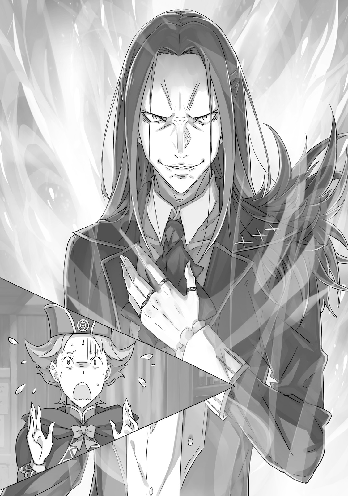
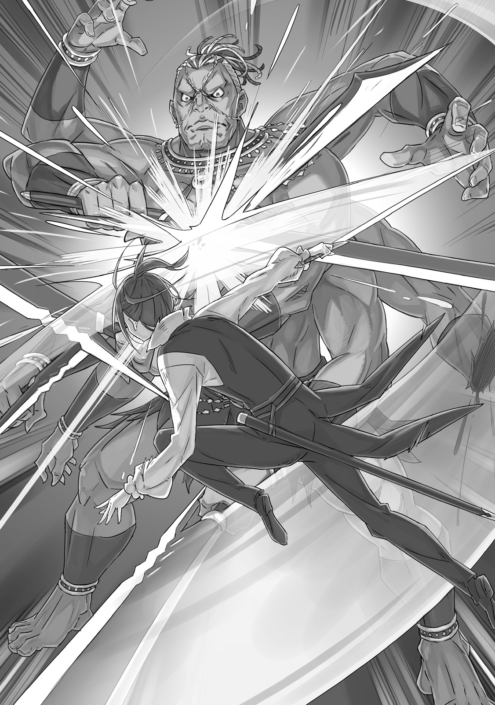
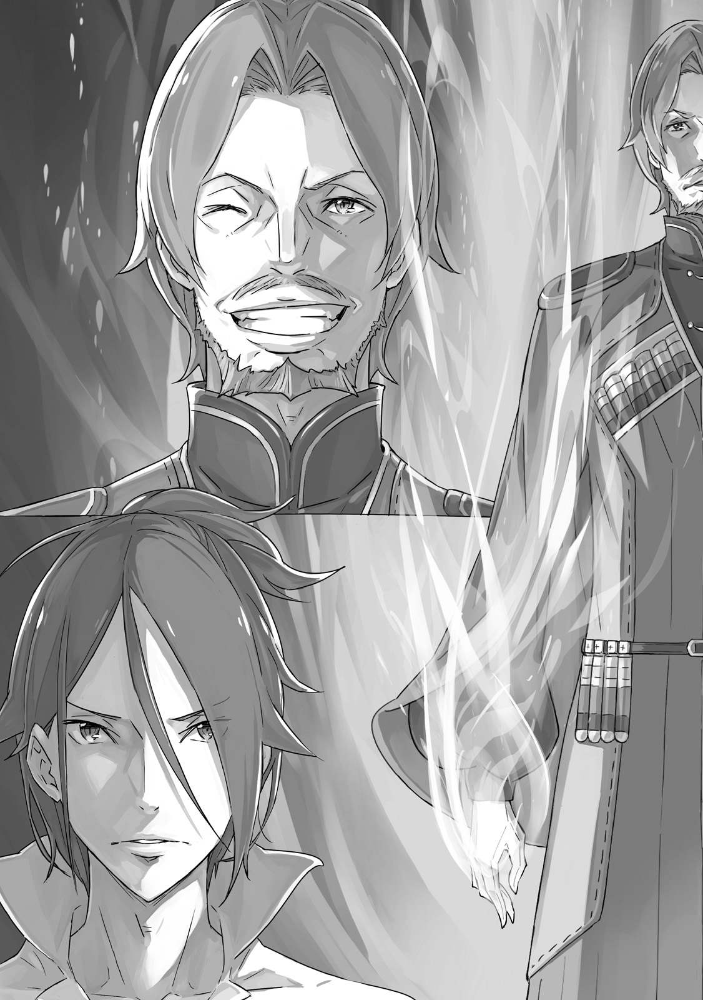

Танец серебряного цветка Пиктатта

『ピックタットの銀華乱舞』

× × ×

Демон Меча услышал свист клинка, отпрыгивая от земли, спасаясь от смерти на волосок.

Краем глаза Демон Меча заметил поднятую им пыль; он развернулся и нанёс удар. Вспышка серебра потянулась к широкой шее противника, стремясь нанести смертельный удар, но была отражена ударом снизу.

— …

Не было даже времени на раздражённый цокот языка.

Демон Меча использовал силу блока, чтобы отлететь назад. Может показаться глупым прыгать в воздух, где некуда скрыться, но в этот момент ему больше некуда было идти…

— Шшшшррр!

Мгновенно клинки пронеслись с трёх сторон, царапая его кожу и выпуская облако крови. Тем не менее, он избежал смертельных ран. Его обострившееся восприятие отбросило боль в сторону, когда окровавленный Демон Меча развернулся в воздухе, чтобы нанести ответный удар великану прямо перед ним.

Кончик его меча вонзился в иссиня-чёрное плечо, неглубоко. Этого было недостаточно, чтобы отсечь руку, и не успел он стиснуть зубы, как последовал ответный удар.

— Гхррр!

Его бок прогнулся под ударом кулака, размером, по меньшей мере, с детскую голову. Его рёбра закричали от удара, и его отбросило в сторону. Он врезался в каменную кладку, приземлившись на землю, не успев смягчить падение. Его лоб рассекло о каменные плиты, и, когда он поднял глаза, он почувствовал вкус крови на языке. Последующей атаки не последовало. Его враг тоже был далеко не невредим.

— …

Демон Меча поднялся на одно колено, глядя на гиганта, стоявшего, скрестив руки на груди. Великан с недоумением смотрел на свою собственную руку… конечность, которой он отбросил Демона Меча, и которая теперь была отсечена по запястье. Из раны хлыстала кровь, а сам кулак катался у его ног.

На первый взгляд раны выглядели довольно серьёзными. Демон Меча и сам был изрядно ранен, но было ясно, что ему лучше, чем противнику, только что потерявшему левую руку.

Если бы только у этого противника не было ещё трёх левых рук в запасе.

— Давно я не был благословлён таким врагом… Редкое счастье, воистину, — пророкотало огромное, голое, синее существо, его рука начала опухать. В этот момент кровь перестала хлестать из безрукой конечности. Он сжал оставшиеся мышцы в этой конечности, чтобы силой остановить кровотечение. Дело было не в том, возможно ли такое в принципе. Увидеть — значит поверить.

— Ты что, какой-то монстр?

— Какие печальные слова, мой славный противник. Мы с тобой оба — существа в равной степени сверхъестественные.

— Пфф… Так ты оправдываешь попытку украсть чью-то женщину? Неплохая попытка.

— Когда я сражу такого могущественного врага, как ты, я заберу её себе, как и положено. В этом нет ничего сложного.

— Говоришь, как настоящий варвар.

— Таков путь зверей, живущих мечом.

Восьмирукий бог войны одарил Демона Меча, который откашливался кровью и слизью, воинской улыбкой. Выражение лица отражало его подавляющую боевую мощь, но Демон Меча встретил его без страха.

Конечно. Отступление не рассматривалось. В конце концов…

— …

С одной стороны каменного моста он чувствовал на своей спине пару глаз. За этой сверхчеловеческой битвой наблюдало множество глаз.

Бесчисленные взгляды были устремлены на него, бесчисленные эмоции бурлили; он чувствовал их на своей коже.

Но для Демона Меча имел значение только один из них. Ему просто нужно было чувствовать этот один, и он был сильным.

— …

Глаза, чистые, как голубое небо, прекрасные волосы, красные, как пламя на ветру, сердце, не омрачённое никакими сомнениями в победе Демона Меча.

Пока эти глаза были устремлены на него, он не мог проиграть никому. И поэтому…

— Ты продолжай болтать. Я собираюсь победить тебя… «Восьмирукий» Курган.

— Тогда я дам твоё имя ребёнку, которого родит мне твоя принцесса… Демон Меча, Вильгельм.

Семь огромных рук держали огромные клинки, «Демонические Тесаки». Курган, чья техника отразила атаки даже Святой Меча, приготовился к битве, всё его тело переполняла аура воина.

Бесконечная неистовая битва, борьба не на жизнь, а на смерть, дуэль между Демоном Меча и «Восьмируким»…

Танец Серебряного Цветка Пиктатта: смертельная дуэль, которая станет известна по всей стране.

Её начало и её завершение сформируют ещё одну главу в Истории Любви Демона Меча, историю об этих юноше и девушке.

— Глупый, глупый отец! С меня хватит!

Красивый голос разнесся по особняку ранним утром, вспугнув птиц в саду. Когда звук встревоженных крыльев стих, мир погрузился в тишину. Но застывшее мгновение быстро растаяло, и высокий, худой, бородатый мужчина начал действовать.

Его невозмутимый вид полностью противоречил лихорадочному размахиванию руками.

— П-подожди, Терезия. Не думаешь ли ты, что немного рано так злиться? Не можешь ли ты спокойно выслушать идею своего отца, прежде чем…

— Твои идеи, отец, вот что приходит слишком рано! Как ты мог решить что-то столь важное, даже не упомянув об этом мне?! Разве то, что я говорю, так странно?!

— Конечно, потому что я хотел сделать тебе сюрприз, моя дорогая дочь.

— О, я удивлена. Абсолютно шокирована. Худшим из возможных способов! Достаточно, чтобы я захотела покинуть эту семью!

— Что?! Но почему?! Я только о семье и думаю!

Девушка драматично и устало вздохнула, глядя на заикающегося мужчину.

Она была милой девушкой с красивыми краcными волосами и глазами цвета неба. На ней был простой белый наряд, который, несмотря на свою простоту, тем не менее подчеркивал ее женскую красоту. Ее руки были скрещены таким образом, что подчеркивали ее удивительно пышную грудь.

Ее звали Терезия ван Астрея, и она была владелицей этого дома. Она была дочерью Бертоля Астрея, который стоял напротив нее. Другими словами, это был спор между отцом и дочерью.

Более того, такие споры между ними не были редкостью. На самом деле, они происходили довольно часто. Почти каждый раз, когда Бертоль приходил навестить Терезию.

И действительно…

— Сколько раз в месяц ты вообще планируешь посещать этот дом, отец?! Ты был здесь практически половину времени! Ты понимаешь, что эти дни значат для меня?! Что я новобрачная?!

— Конечно, понимаю! Вот почему мне нужно присматривать за вами, чтобы вы, молодые люди, не сделали ничего опрометчивого. Если это не забота о моей дочери, то что же?

— Надеюсь, тебе земляной дракон даст пинка под зад, отец!

— Ч-что?! Я узнаю эту поговорку — из Карараги!

Отец молодой невесты пытался держать голову высоко в доме молодоженов, но получил от дочери сердечный выговор.

Вильгельм, наблюдая за спором с дивана, вздохнул. Внезапно перед ним появилась чашка чая. Когда он увидел человека, предлагающего ее ему, элегантную женщину с льняными волосами, он выпрямился.

— Прости, Вильгельм. Мой муж и дочь всегда такие.

— Да, ну, глупые выходки не—… То есть, я думаю, можно сказать, что я уже привык к этому. И не то чтобы я не понимал, что чувствует Достопочтенный Отец. Он просто немного сходит с ума —… Э-э, то есть, он просто беспокоится о своей дочери.

Женщина улыбнулась, когда Вильгельм боролся с тонкостями аристократического языка.

— О, нет нужды следить за своей речью передо мной. Мы теперь семья. Мне просто жаль, что у этого человека не хватает смелости признать это.

Вильгельм увидел в улыбке женщины тень той улыбки, которую он любил больше всего.

Конечно, так и было. Эта женщина была Тиша Астрея, мать Терезии.

В то утро Бертоль и Тиша появились в доме Астрея — доме, в котором Вильгельм и Терезия начинали свою новую совместную жизнь. И, как сетовала Терезия, их визиты, казалось, были очень частым явлением.

— Доброе утро… И что, похоже, сегодня за кризис?

У двери появился новый посетитель, комментируя знакомый звук спора. Это была женщина с сияющими золотыми волосами, спускающимися до плеч, с серьезным лицом и утонченным видом. Это была Кэрол Ремендис, служанка Терезии; у нее также была история с Вильгельмом. Ее семья давно служила Астреям, и эти споры между отцом и дочерью были для нее хорошо знакомой почвой — очевидно, поскольку она проигнорировала препирающуюся пару, чтобы задать вопрос Тише.

— Доброе утро, Кэрол. Да, это отличный вопрос. Если не возражаешь, что, по твоему мнению, это может быть?

— Я могу предположить, что леди Терезия, наконец, сорвалась из-за частоты ваших достопочтенных визитов.

— Совершенно верно. Конечно, учитывая его целеустремленность, это не так уж сложно понять, — улыбнулась Тиша.

Кэрол скривилась.

—…Неужели?

Это был отец ее госпожи. Она, казалось, была разочарована, потому что ее желание найти что-то, что могло бы понравиться в Бертоле, пока оставалось невыполненным. Вильгельм воздержался от указания на то, что само ее разочарование было довольно грубым.

Затем, заметив, что они втроем отложили утренние формальности, чтобы пожаловаться на Бертоля, Терезия воскликнула:

— Кэрол! Послушай, Кэрол! Мой отец пошел и сделал самую эгоистичную, грубую вещь — снова! Но он даже не чувствует себя виноватым в этом… О, и доброе утро.

— Доброе утро, леди Терезия. Я глубоко сочувствую вашему разочарованию, правда, но вы не должны быть слишком критичны к своему отцу. Подумайте, как ему будет грустно.

— Послушай ее, Терезия. Ты могла бы поучиться у нее уважительному отношению.

— Хе-хе! Он грустит, все верно, и даже не знает этого… Это прямо-таки очаровательно.

Бертоль совершенно упустил смысл того, что говорили Терезия и Кэрол. Его жена, тем не менее, казалась восхищенной им; Вильгельм приложил руку ко лбу, когда заметил это.

Динамика этой семьи была, мягко говоря, необычной. И теперь он был ее частью. Он вспомнил свою собственную семью, своих родителей и двух старших братьев — было ли так утомительно иметь с ними дело?

Если да, то он внезапно меньше недоумевал, почему он ушел из дома.

— Я помню, как злился на оправдания моих братьев, но…

Пока Вильгельм сидел, размышляя, Терезия призвала его к подкреплению.

— Эй, Вильгельм! Скажи моему отцу! Это ненормально, правда? Ты должен сказать ему… Он ничего не понимает, даже когда ему все разжевывают!

— Ну, тогда мои слова ничего не дадут, верно?

— Но мне будет приятно знать, что ты на моей стороне! Разве этого недостаточно?

Она вряд ли понимала всю силу этого последнего аргумента. Оставьте Святой Меча интуитивно понимать самую уязвимую точку своего противника.

— …? Чему ты ухмыляешься? Вот, иди сюда. Мне нужен союзник.

Она жестом позвала его присоединиться к ней.

— Да, я знаю, — сказал Вильгельм, все еще ухмыляясь. — Так о чем вы спорите этим утром?

Он все еще не совсем понимал. Количество визитов, которым они подвергались в течение первой половины луны в качестве мужа и жены, не могло быть полным объяснением.

Наконец, Терезия, с ярко-красным лицом, раскрыла возмутительную просьбу, с которой Бертоль обратился на этот раз.

— Мой отец — он говорит, что хочет сопровождать нас в нашем медовом месяце! Ты можешь в это поверить? Вильгельм, помоги мне убедить его, что он сумасшедший!

Теперь понятно.

Вильгельм посмотрел на потолок. Это было еще хуже, чем он думал.

— Что ж, отец. Объясни свой ход мыслей. Тогда я решу, что я чувствую.

— Ха-ха-ха… «Решу, что я чувствую» звучит так устрашающе, Терезия. Какое дитя, подвергающее своего отца испытанию. Каждый раз, когда я думаю, что могу отвести от тебя взгляд…

— Это тебе не поможет, отец.

— Ч-что?! Почему?! Мы еще ни о чем не говорили!

Бертоль был подавлен пронзительным взглядом Терезии. Вильгельм нахмурился, недоумевая, почему мужчина вообще удивлен, но три женщины оставались невозмутимыми, возможно, уже привыкшими к этому. Тем не менее, в таком темпе они были обречены на простое повторение предыдущего спора. Хотя ему не очень хотелось, Вильгельм обнаружил, что у него нет другого выбора, кроме как вмешаться.

— Успокойся, Терезия, — сказал он. — Давай сначала выслушаем его. И вы, отец, пожалуйста, не удивляйте Терезию так. Ее эмоции вырываются наружу в любой момент.

— Хм… Да, очень хорошо. Если ты так говоришь, Вильгельм, я послушаю.

Терезия надула щеки угрюмо, но, тем не менее, пришла в себя.

Бертоль, облегченно вздохнув, погладил бороду, на его лице появилась слабая улыбка.

— Ты почти ведешь себя так, будто понимаешь Терезию лучше, чем я, молодой Вильгельм. Я хочу, чтобы ты знал, я купался с Терезией.

— Отец!! Как далеко ты намерен зайти, чтобы взрастить эту свою враждебность?!

— Не хочу вас расстраивать, но я тоже.

— Хагггх!

— В-Вильгельм?!

Бертоль подавился, а Терезия, с красным, как только может быть, лицом, схватила Вильгельма за лацканы и толкнула его в угол комнаты. Там она прижала мужа к стене, ее лицо было залито слезами смущения, паники и любви.

— Ч-ч-что ты такое говоришь?! М-мы еще не были вместе в ванне!

— Извини. Соперничество взяло верх.

— Не пытайся соревноваться с моим отцом! Я ни при каких обстоятельствах не хочу видеть тот же взгляд в твоих глазах, что и у него!

Казалось, это был неявно ужасный способ говорить о ее отце, но Вильгельм не мог не согласиться с ней. Связь между мужем и женой укреплялась наличием общего врага, и Вильгельм нежно обнял Терезию, прежде чем они вернулись к дивану. Затем они снова вежливо сели, но…

— …Кэрол, что ты там делаешь? — спросила Терезия.

По какой-то причине Кэрол сидела напротив Терезии и Вильгельма — то есть рядом с Бертолем и Тишей. Она стояла на страже прямо за Терезией мгновение назад. Казалось, это буквально указывало на то, где она стоит в этом споре.

Кэрол, выглядя очень серьезной, покачала головой и сказала:

— Этот ужасный человек злоупотребил вашими отношениями как мужа и жены, чтобы опозорить вас, леди Терезия…

— Подожди! Н-но мы с Вильгельмом женаты, помнишь?

— Да. Но я не могу допустить злоупотребления властью мужа, чтобы попасть с вами в ванну.

— Даже если мы женаты?!

Кэрол смотрела на Вильгельма со всей злобой женщины, мстящей за своих мертвых родителей. Бертоль поспешил добавить:

— Она права, знаешь ли, — еще больше укрепляя их союз.

Видимо, другая сторона тоже обнаружила общего врага, и это укрепило их собственную связь. Ну вот, это было хлопотно.

— Мне очень жаль, леди Терезия. Но есть вещи, в которых я просто не могу уступить. Даже если это вынудит меня присоединиться к лорду Бертолю.

— Да, она… Что?! Вынудит тебя?!

— Н-но если даже ты так говоришь, Кэрол, то что мне делать…?

— Мне все равно, что вы все думаете. Я собираюсь купаться с Терезией.

— Будь ты прокляяяят!

Кэрол набросилась на Вильгельма в настоящей ярости, но он легко отразил ее атаку. Игнорируя назревающую драку, несмотря на разницу в способностях бойцов, Терезия обратила обеспокоенный взгляд на Тишу за помощью.

— Мама…

— Боже, ты сама уже невеста; не выгляди такой жалкой. Хотя, признаюсь, мне немного жаль тебя. Дорогой…?

— Хрк! Клянусь, это не моя вина!

Схватившись за голову, Бертоль сказал именно то, что всегда говорит виновный. Вид ее матери, молча щурящейся на ее дрожащего отца, был знаком Терезии. И он следовал знакомым курсом, к знакомому выводу.

— Я—я должен признать, что попытка последовать за вами в ваш медовый месяц была немного чересчур даже для меня… Даже если бы ты не была так зла, Терезия, я бы точно не…

— Ты слышала его. Он, может быть, недалекий и обладает плохими социальными навыками, но он не плохой человек — он просто немного шалит. Тебе не о чем беспокоиться.

— Мама, ты могла бы проявлять немного больше сдержанности, когда говоришь об отце…

— Если бы я проявляла сдержанность, это не было бы должным извинением перед тобой и твоим дорогим Вильгельмом. Вот почему я должна быть предельно жестокой. О, как это больно…

Тиша одарила ужасно манящей улыбкой, продолжая издеваться над Бертолем, который, казалось, съежился под этой атакой. Терезия посочувствовала своему сдувающемуся отцу, но все же вздохнула с облегчением. Как бы ей ни хотелось проявить сыновнюю преданность, даже она не могла смириться с мыслью о том, что ее отец будет в ее медовом месяце. Хотя она, возможно, была бы готова позволить Кэрол поехать в качестве сопровождающей.

— Хотела бы я, чтобы вы двое тоже перестали ссориться, — сказала Терезия.

— Кто ссорится? — спросил Вильгельм. — Она просто не оставит меня в покое.

— Хрк… Почему мне не хватает сил? О, Бог Меча, если ты слышишь молитвы смертных, дай мне силу поразить этого человека здесь и сейчас—

— Здесь?! Не проси этого обманщика о таком! Остановись, Кэрол!

Терезия обняла Кэрол, чьи зубы были стиснуты, и нежно погладила ее по голове. Ее служанка испытывала глубокие эмоции и уловила гнев своей госпожи.

— И, Вильгельм, — сказала Терезия, надув щеки, — больше не провоцируй ее. В следующий раз я буду сражаться с тобой.

Вильгельм поспешил поднять белый флаг.

— …Ну, я не выиграю. Я остановлюсь.

Таким образом, спор об их медовом месяце, который бушевал все утро, наконец подошел к концу.

Хотя можно было предположить, что все прошло бы намного легче, если бы Бертоль просто вел себя как взрослый.

— В любом случае, ваша первая совместная поездка немного похожа на переезд в один дом: это еще одна веха вашей новой жизни в качестве мужа и жены, — сказал Бертоль. — Позаботьтесь о том, чтобы не случилось ничего плохого, чтобы Терезия не пострадала. Ты понимаешь?

— Да, конечно… То есть, да, сэр.

— И, Терезия, если у тебя когда-нибудь будут какие-либо жалобы, ты можешь вернуться в дом своей семьи в любое—… Ай! Больно, больно, больно!

— Хо-хо-хо-хо. Ну что ж, Терезия, Вильгельм. Наслаждайтесь вашей совместной поездкой.

Тише удалось схватить Бертоля за ухо, прежде чем он смог сказать что-нибудь действительно неуместное, и вытащить его из комнаты. Тот факт, что, несмотря на то, что они присутствовали в доме примерно половину месяца, они никогда не пытались остаться на ночь, возможно, говорил о лучшей стороне натуры Бертоля.

— Надеюсь, я не просто воображаю это, — пробормотала Кэрол.

— Я стараюсь не думать об этом слишком много, — сказала Терезия. — А как насчет тебя, Кэрол? Ты сегодня свободна, не так ли?

Кэрол слегка перехватило дыхание. Как у служанки Терезии, у нее не было особого понятия о фиксированном выходном дне. Вместо этого эти «дни отпуска» обычно означали дни, когда человек, с которым она могла провести некоторое время, расслабляясь, также был в отпуске.

— Отряд сегодня тоже свободен, — сказал Вильгельм. — Гримм, должно быть, болтается в гарнизоне. Иди туда.

— М-мне не нужно, чтобы ты мне говорил! Я так и планировала!

— Да, конечно, это замечательно, — сказала Терезия. — Давай, время не ждет. Это твой последний выходной перед поездкой — иди, повеселись так, чтобы тебе захотелось побыть с нами после этого.

— Х-хорошо… Если вы так говорите, леди Терезия.

Прикосновение упрямства было таким девичьим, Терезия не могла не улыбнуться, провожая Кэрол. Кэрол продолжала поглядывать на нее, как будто хотела что-то сказать, вплоть до самого ухода, но, возможно, понимая, что все, что она могла бы сказать другой влюбленной девушке, было бы бесполезно, она вышла из дома.

— Может быть, у нее свидание с Гриммом в торговом районе, — сказала Терезия. — Я думаю, что Кэрол в последнее время такая милая. Я почти завидую Гримму!

Вильгельм цокнул языком.

— Они оба — заноза в заднице. Им следует поторопиться и сойтись.

— Почему? Чтобы она начала уделять ему больше внимания, чем нам? Мне было бы немного грустно, если бы это произошло…

Терезия улыбнулась и провела рукой по волосам. Она понимала, о чем думает Вильгельм, но отношения между ней и Кэрол были несколько сложными. Семья Ремендис, хотя и не такая выдающаяся, как Астрея, тем не менее была дворянской. Как старшей дочери этого дома, Кэрол было бы непросто выйти замуж за простолюдина, такого как Гримм. Даже если бы их сердца были в полном согласии, статус и кровь все еще стояли между ними.

Вильгельм почувствовал сомнение Терезии.

— Гримму просто нужно стать рыцарем, — сказал он. — Он заместитель командира отряда Зелгефа. Это не займет много времени.

Он положил руку ей на плечо.

— …Мм, — ответила Терезия, прислонившись к его теплу и закрыв глаза. — Ты прав.

Это была серия чудес, которая привела к союзу между ней и Вильгельмом. Если бы хоть что-то пошло по-другому, этого счастья могло бы и не быть. В тот момент она знала только искреннюю благодарность. Любовь к нему переполняла ее; она посмотрела на Вильгельма.

— …С-скажи, Вильгельм?

— Да, что?

— Ты ведь тоже сегодня свободен, верно? Никаких планов на весь день?

Терезия, казалось, не совсем знала, куда деть глаза. Вильгельм нахмурился. Он не совсем понимал, к чему ведет ее вопрос, но утвердительно кивнул головой.

— Да. А что?

— …Я знаю, что еще утро, но Кэрол ушла, и… Э-э, м-может, мне набрать ванну?

Терезия чувствовала, как жар поднимается в ее щеках; ей пришлось собрать все свое мужество, чтобы заговорить. Может показаться кощунственным сравнивать это с полями сражений, на которых она стояла как Святая Меча, но она чувствовала, что это заставляет ее нервничать еще больше. Это было ее собственное испытание.

— …

Синие глаза Вильгельма широко раскрылись в изумлении. Она увидела свое собственное лицо, отраженное в них, и подумала, как жалко и стыдно она там выглядит.

На мгновение ей показалось, что она может умереть от смущения, но…

Что ж, давайте просто скажем, что в тот день они попробовали что-то новое как муж и жена.

Когда дело дошло до медового месяца Вильгельма и Терезии, возникло несколько логистических проблем, которые необходимо было преодолеть.

Например, отряд Зелгефа Вильгельма занимал очень важное место в реорганизованной королевской армии, подчиняясь непосредственно королю. От них многого ждали. С учетом того, что последствия гражданской войны все еще ощущались как внутри страны, так и за ее пределами, возникла серьезная обеспокоенность по поводу того, что капитан этого подразделения покидает столицу.

На самом деле было бы трудно отказать, если бы его попросили отложить поездку на этих основаниях. Однако…

— Нет, Святая Меча и Демон Меча наконец-то поженились. Я думаю, что сам Дракон рассердится на нас, если мы вмешаемся в почтенный обряд, которым является медовый месяц. Я говорю, пусть едут!

Такие опасения были сметены заявлением Его Величества Гиониса. Король был, как и всегда, любезен и участлив, за что Вильгельм был ему глубоко благодарен. Это почти заставляло чувствовать, что предложение ему своего меча — пустой жест.

Таким образом, пообещав Его Величеству и сувениры, и истории, Вильгельм сумел получить шанс отправиться в медовый месяц.

Следовательно, расписание мужа было улажено. Следующей проблемой была его жена.

Терезия сохранила Божественную Защиту Святого Меча, но она уже была освобождена от службы в королевской армии и вновь стала просто еще одной дочерью дворянства — и домохозяйкой, к тому же. Какая у нее могла быть проблема? Слава Святой Меча.

— Если они узнают, кто вы, леди Терезия, целые города поднимутся на уши. Я уверена, что вы тоже этого не хотите. Поэтому мы должны соблюдать предельную осторожность, — Кэрол должна была сопровождать их в поездке, и она горела энтузиазмом исполнить свою роль служанки Терезии впервые за долгое время.

Терезия была несколько подавлена ее напором.

— Э-э, Кэрол? Может, ты перестанешь и переведешь дух?

— Иметь возможность представить вас именно так, как я считаю нужным — какая радость, что я родилась вашей служанкой!.. На свадебной церемонии я старалась сделать вас красивой, да, но теперь я вложу все свое сердце и душу в то, чтобы сделать вас настолько прекрасной, насколько это возможно, леди Терезия! Приготовьтесь!

— О, э-э…

С Терезией в качестве чистого холста Кэрол проявила себя на удивление одаренной художницей. Как бы рыцарь ни ненавидела сама наряжаться, она ухватилась за возможность подобрать наряд для Терезии.

В конечном счете, ансамбль преуменьшал уникальную привлекательность Терезии, в то же время делая ее еще более милой и благородной, чем обычно — эффект был практически волшебным.

— Больше всего я сожалею о том, что теперь я должна отдать вас этому человеку…!

— О, успокойся… Ты ведь не будешь слишком сильно ссориться с Вильгельмом во время поездки? — Терезия слабо улыбнулась, любуясь собой в зеркале.

Эффект ее характерных красных волос был несколько притуплен широкополой белой шляпой, а длинное платье с искусно вышитой юбкой должно было притягивать взгляд. До тех пор, пока она не носила с собой Драконий Меч, никто не заподозрил бы в ней Святую Меча.

— Это моя Кэрол. Мне нравится.

— Я рада это слышать. А теперь давайте подготовимся к…

— Подожди. Было бы несправедливо, если бы мы не нарядили и тебя, Кэрол.

— Э-э.

Кэрол застыла, увидев улыбку на лице Терезии. Она отступила шаг за шагом, но Терезия зажала ее у стены, все время выглядя как изящная дворянка. Затем Терезия раскрыла объятия — шанса сбежать не было — и сказала:

— Давай, ты можешь быть такой же девушкой, как и я! Ты не можешь позволить мне смущаться в одиночку.

— П-пожалуйста, простите меня, леди Терезия! Вы можете нарядить такую грубую женщину, как я, но это не—

— Не глупи! Вот, давай, давай, давай, давай!

— О! О, нееет…

И с этой забавной интерлюдией и муж, и жена были, наконец, готовы к своему медовому месяцу.

Им двоим было предоставлено щедрых два месяца на медовый месяц. Они слышали, что и это тоже как-то связано с добрыми услугами Его Величества Гиониса, но чем больше они благодарили его, тем щедрее он становился, поэтому, боясь получить еще больше, они решили оставить остаток своей благодарности на время после поездки.

— Даже так, этого все равно недостаточно для полного тура по королевству…

— На севере и востоке все равно ничего нет, — сказал Вильгельм. — Мы можем пропустить их.

— Но разве земли Триас не на севере?

— …Серьезно, давай в этот раз поедем куда-нибудь еще. Какая им польза от того, что мы поедем туда в наш медовый месяц?

Терезия предлагала включить в их поездку земли Триас — вернее, бывшие земли Триас, семья была уничтожена, — но Вильгельм отказался. Даже несмотря на то, что это было действительно место, где покоилась его семья и все его предки, он уже ездил туда, чтобы выразить свое почтение перед их свадьбой. Даже мертвых можно потревожить слишком частыми визитами.

— Ну, хорошо. Я послушаю тебя… Так мы хотим поехать на запад или на юг?

— Если мы поедем на запад, мы окажемся в городе водных врат. На юге находится столица земляных драконов и торговый город. Выбирай.

— Хмм. Хммм. Хммммммм…!

Предоставленная сама себе решать, Терезия размышляла и мучилась, но затем ее голубые глаза расширились, вспыхнув.

— В нашу самую первую поездку мы отправимся на юг!

Муж и жена покинули столицу в драконьей карете, направляясь сначала во Фландрию. Фландрия была городом на плато Хайклара, где обитали различные земляные драконы; этот район был известен разведением этих существ. Земляные драконы из Фландрии ценились как за границей, так и в пределах Лугуники, и ее «драконья индустрия» подняла ее до одного из пяти крупнейших городов королевства.

— Согласно легенде, Фландрия — это также место, где Божественный Дракон Волканика был связан дружбой с первым Святым Меча, Рейдом, и мудрецом Шаулой, — сказала Терезия.

— Да, я думаю, я слышал, что первые земляные драконы родились как своего рода благословение Божественного Дракона примерно в то же время. Не то чтобы я верил в это хоть на секунду.

— Но если бы это было правдой, разве это не было бы захватывающе? — глаза Терезии сияли.

Вильгельм как-то улыбнулся, сдерживая нахлынувшие эмоции в своем сердце.

Когда они втроем прибыли во Фландрию, их встретила сцена, достойная прозвища города — Столица Земляных Драконов. Куда бы они ни пошли в большом городе, они находили место, основанное на существовании земляных драконов, причем большая часть энергии для городских функций обеспечивалась этими существами. В качестве простого примера, иногда они видели земляного дракона, бегущего на гигантском колесе. Движение открывало или закрывало канал, поднимало или опускало разводной мост.

— В последнее время в столице начали появляться магические фонари, работающие на кристаллах маны, но…

— Здесь ты ничего подобного не видишь, да? — заключил Вильгельм. — Но с другой стороны, у нас нет этих колес там, откуда мы родом.

— В столице земляные драконы в основном используются для перевозки грузов или пассажиров, — вмешалась Кэрол. — У нас недостаточно их, чтобы выделить на выработку энергии, как здесь. География столицы тоже не совсем подходит для такого рода вещей. Я полагаю, можно назвать это уникальной особенностью этой области… Что?

Она бросила сомнительный взгляд на Вильгельма, который пожал плечами.

— Ничего. Я просто удивился, услышав от тебя такое проницательное объяснение. Я не знал, что ты так много знаешь.

— Не могу сказать, что чувствую себя вполне естественно, слыша от тебя честную похвалу… В любом случае, это просто то, что я подхватила.

— От Гримма? — спросила Терезия.

Хмурый взгляд Кэрол был достаточным ответом.

Они должны были пробыть во Фландрии десять дней, и все трое провели это время не спеша.

Однако больше всего им наслаждались Терезия и Кэрол, в то время как Вильгельм, менее склонный к любованию пейзажами, в основном следовал за женщинами. Посудите сами:

— Эй, Вильгельм! Смотри! Какой великолепный вид!

Они ехали по плато на земляном драконе, Терезия указывала и улыбалась на солнце, садящееся между горами. Даже если бы пейзаж не был таким захватывающим, он все равно был бы полностью захвачен улыбкой Терезии от уха до уха. Ему было бы достаточно, едя рядом с ней на другом драконе, продолжать наблюдать за этой улыбкой краем глаза.

Вильгельм тоже начал ухмыляться, чувствуя удовлетворение от этой поездки.

Не все в медовом месяце было так приятно. Например, вопрос о распределении комнат.

— Я имею в виду, я могу понять, что вы сняли два номера в гостинице, но почему вы двое остаетесь в одном из них, а я в другом? Это должна быть моя и Терезии поездка.

— Будь ты проклят — что ты затеял, пытаясь разделить постель с леди Терезией…?

— Просто чтобы ты знала, мы так делаем каждую ночь дома. Немного поздно беспокоиться об этом сейчас.

— Ах ты, мерзавец—!

— О, ради всего святого! Я запрещаю вам ссориться! За! Пре! Ща! Ю! Вильгельм, перестань провоцировать Кэрол! Или я действительно больше не буду делить с тобой постель!

Таким образом, они провели время во Фландрии, пока не пришло время направить свою драконью карету к следующему пункту назначения, городу Пиктатту. По пути…

— Эй, главный дом семьи Астрея находится недалеко от Фландрии…

— Нет.

— Я думаю, может быть, твои мама и папа уже вернулись домой…

— Нет.

И так было решено, что они не будут делать никаких объездов.

Они вежливо проигнорировали существование дома Астрея, который в любом случае находился несколько в стороне, и направились в Пиктатт, место, известное своими живописными видами — и, как им было неизвестно, сцену для следующего акта их истории.

Пиктатт был еще одним из пяти великих городов Лугуники, местом, которое процветало благодаря своей торговле с другими странами. Город был разделен на пять районов — по одному для каждого направления света и центральный район — и каждый имел свою особую торговлю и уникальные правила. Казалось, что каждый из районов был городом или даже землей сам по себе.

Центральный район был особенно богат и особенно переполнен заведениями, предназначенными для посетителей. Как почти диктовала традиция, Вильгельм и его компания остановились в гостинице там, но…

— Глупый, глупый отец! С меня хватит!

Красивый голос разнесся по гостинице ранним утром, вспугнув птиц в саду. Когда звук встревоженных крыльев стих, мир погрузился в тишину. Но застывшее мгновение быстро растаяло, и высокий, худой, бородатый мужчина начал действовать.

Или мы могли бы сказать просто: Бертоль.

— П-подожди, Терезия. Конечно, нет причин так расстраиваться. Я полагаю, что можно было бы удивиться и обрадоваться, встретив своего отца так неожиданно…

— Почему ты всегда должен быть таким, отец?! Только когда я подумала, что, возможно, на этот раз ты, наконец, будешь благоразумен! Ты предал меня… Ты худший! Худший, худший, худший!

— Ч-чтооооо?! Неужели настолько плохо, что ты так расплакалась?!

У входа в то, что считалось лучшим отелем в центральном районе города, Золотой Кубок, Терезия и Бертоль ссорились впервые почти за полмесяца. Бертоль визжал под напором Терезии. Кэрол, поддерживая свою взволнованную госпожу, бросила на него взгляд.

— Значит, вы обогнали свою дочь, чтобы сорвать ее медовый месяц… Лорд Бертоль, я должна усомниться в вашей рассудительности.

— И ты тоже, Кэрол?! Ты уверена, что эти слезы не от трогательной радости встречи со своей семьей в дороге?!

— Нет— конечно, нет— как они могут быть?! Мама разрешила это?!

— Э-э, Тиша была против, но… я подумал, может быть, это испытание…

— О, это испытание, все верно. Испытание моего терпения! Тобой, отец!

По виду увядающего Бертоля, казалось, что Тиши на этот раз с ним не было. Терезия никогда не видела, чтобы он действовал самостоятельно, и тот факт, что у него не было жены, чтобы держать его в узде, заставил ее еще больше беспокоиться о том, что он может сделать.

— Успокойся, Терезия, — сказал Вильгельм. — Дело в том, что он сейчас здесь, и мы не можем этого изменить. Не то чтобы он собирался прийти с нами в нашу комнату. Я уверен, что твой отец сделал то, за чем пришел.

— Э-э… Я снял здесь комнату, вы зна—

— Я уверен, что он сделал то, за чем пришел. — Вильгельм уставился прямо в лицо Бертолю, заставив его замолчать одной силой духа.

Глава семьи Святых Меча смог выдержать этот взгляд мгновение или около того, но затем его лицо побледнело, и он покачал головой. Это был не самый уважительный способ обращаться со своим тестем, но если и было когда-нибудь время для Вильгельма принять сторону своей жены, то это было именно оно.

— …Отец, что ты сказал маме, когда пришел сюда?

— Я сказал ей, что у меня есть официальные дела. Я заказал кое-что у одного из торговых домов в западной части города и недавно получил известие, что оно прибыло. Я пришел забрать его… Это была моя истинная цель.

— Так ты просто подумал, что будешь беспокоить меня и Вильгельма по пути…?

— Ты все еще будешь злиться, даже если я сказал тебе правду? Чего ты хочешь, чтобы я сделал?! Хочешь, чтобы я извинился?!

Да, извинение могло бы помочь, но гордость Бертоля мешала, и он обнаружил, что не может.

Столкнувшись с отцом и дочерью, которые, казалось, вот-вот снова начнут спорить, Вильгельм и Кэрол кивнули друг другу. Затем Вильгельм схватил Терезию, Кэрол схватила Бертоля, и они растащили их в стороны.

— В-В-Вильгельм, — пробормотала Терезия.

— Я знаю, — сказал он. — Но просто успокойся. — Он посмотрел в глаза Терезии, которые блестели от слез разочарования. — Успокойся. Не поддавайся эмоциям.

— Но на этот раз… Это просто…

— Если ты не можешь этого вынести, позволь мне разозлиться вместо тебя. И не позволяй никому, кроме меня, видеть тебя такой. Я единственный, для кого ты должна проявлять эмоции.

— Ты такой эгоистичный… Оххх. Э-э, то есть, я имею в виду…

Они были так близко, что чувствовали дыхание друг друга. Гнев, который так охватил Терезию до мгновения назад, улетучился. Ее лицо все еще было красным, но теперь это было от смущения, а не от ярости.

Вильгельм расслабился, увидев это, и повернулся к другому виновнику спора. Кэрол уже добилась согласия Бертоля, пригрозив рассказать всё Тише. Вильгельм не был уверен, что он чувствует по этому поводу.

— Теперь, когда вы пришли в себя, лорд Бертоль, — сказала Кэрол, — мы будем прощаться…

— Подожди, подожди, подожди, Кэрол! Конечно, вы слишком торопитесь отправить меня домой! У меня действительно есть дела, которыми нужно заняться здесь. Вмешательство в отпуск Терезии не было моей единственной целью!

— Будьте осторожны в словах, сэр, — предупредил его Вильгельм. — Я устану успокаивать Терезию в один из этих дней.

Было ясно, что это только вопрос времени, когда Терезия снова взорвется, когда Бертоль так обнажит свои намерения. Лучшим планом, очевидно, было бы, чтобы он выполнил свое поручение как можно быстрее, а затем отправился домой.

— …И так, чего именно тебе нужно здесь, отец?

— В-в твоем голосе такой тон… Э-э, но, да, — даже отступая от сужающегося взгляда своей дочери, Бертоль погладил бороду. Затем он опустил глаза, почти застенчиво. — Это украшение для волос для Тиши. Видите ли, скоро у нас будет годовщина.

— Каждый год отец дарит маме новое украшение для волос. А в важные дни мама носит то украшение для волос, которое он подарил ей в этом году… Это единственное, что он делает, и что я считаю действительно замечательным, — Терезия взглянула на Вильгельма, застенчиво улыбаясь. Улыбка была тонким намеком на то, что она хотела, чтобы Вильгельм чему-то научился из того, что она говорила, но в равной степени подразумевала, что все остальное, что делал ее отец, не стоит брать в пример.

Сказав это, поскольку у Бертоля действительно была вполне респектабельная причина находиться в городе, не было никаких оснований мешать ему пойти за подарком. Это было простое дело — отправиться в западный район и забрать товар у торговца. Даже Бертоль не мог причинить слишком много хлопот, делая это.

— Так объясни мне еще раз, почему мы должны идти с ним?

— У нас нет выбора. Лорд Бертоль попросил, чтобы леди Терезия сопровождала его. Если мы откажемся от этой простой просьбы, мы можем застрять с ним на оставшуюся часть нашей поездки.

— Ты слишком свободно говоришь о своем работодателе…

Вильгельм нахмурился, когда они с Кэрол шли по главной улице бок о бок. Эта ситуация была такой же необычной в этой поездке, как и в любое другое время. Но они оказались вместе, потому что отец и дочь шли впереди них, счастливо, рука об руку. Это было даже не по просьбе Бертоля, а произошло само собой.

— Эта Терезия… При всех ее жалобах, она действительно папина любимица.

— Прекрати. Ты говоришь о ней, как о маленьком животном. В любом случае, их привязанность друг к другу очевидна. Леди Терезия, в частности, является зеницей ока лорда Бертоля. На самом деле, его глаза однажды стали проблемой.

— Ну, результат очевиден.

Он был рад, что Божественная Защита Бога Смерти Терезии перестало действовать. Если бы ее отец потерял зрение из-за этого, Терезия сожалела бы об этом вечно.

С этими чувствами в душе Вильгельм почувствовал, как его взгляд смягчается, наблюдая за двумя людьми, идущими впереди него. Голос Бертоля звучал авторитетно, если ничто другое в нем не звучало, в то время как Терезия могла мгновенно переходить от надутых щек к улыбке, как цветок.

— …Ты выглядишь немного мягким для Демона Меча.

— Есть времена, когда мне не нужно быть Демоном Меча. И в любом случае, я никогда не думал, что увижу, как Терезия и ее отец ведут настоящий разговор.

— Ты… можешь быть прав насчет этого.

Несмотря на свою обычную склонность спорить, сегодня, впервые, Кэрол согласилась с Вильгельмом. В любом случае, родственная связь между Терезией и Бертолем, казалось, была восстановлена. Или, возможно, она никогда и не была разорвана.

Поскольку больше не было необходимости пристально следить за своей женой и ее отцом, Вильгельм с интересом осмотрел город со всеми его необычными достопримечательностями. Сначала он казался очень похожим на торговый район в столице, но был гораздо оживленнее, поскольку коммерческая жизнь столицы была задушена гражданской войной.

Магазины и лавки выстроились вдоль улицы, а шумные голоса свидетельствовали о подавляющей энергии и жизни этого места. Истощение затянувшейся войны, казалось, не коснулось этого города.

— Шумное место, — заметил Вильгельм.

— Не по вкусу? — серьезно ответила Кэрол. — Тем не менее, это конкретный пример того, что леди Терезия боролась за то, чтобы защитить.

То, что она сказала, было правдой. Если бы жестокая рука Войны Полулюдей достигла этого места, кто знает, что могло бы стать с этой оживленностью?

— Она всегда винит себя, — сказал Вильгельм.

— Для нее взгляды безмолвных ушедших гораздо тяжелее, чем звук тех, кто был спасен. Мне жаль это говорить, но… ты единственный, кто может облегчить эту боль.

— …

— Я вижу это слишком ясно сейчас. Эта поездка — тоже своего рода черта для меня.

— Какая черта?

— …Когда мы вернемся в столицу, ты увидишь, — Кэрол не встретилась с ним взглядом, ее лицо оставалось своей обычной непроницаемой маской. Она сохраняла броню, которая скрывала ее эмоции от него, как бы он ни искал их.

Когда мы вернемся в столицу, ты увидишь. Она была упряма, но он верил ей. Вильгельм верил в нее.

Компания провела большую часть часа, гуляя, несмотря на необычный разговор.

Бертоль наконец остановился у магазина прямо у входа в западный район.

— Здесь я заказал его.

Вильгельм поднял глаза, осматривая место. Оно было относительно большим и занималось всем, от текстиля до продуктов питания. Кэрол сказала ему, что в Пиктатте разнообразие товаров, которые может продавать заведение, является быстрым показателем его статуса. Следовало, что этот магазин был бы заметным даже в столице.

— Товары Сувена…

— Очень умный торговый дом, — сказал Бертоль. — Я впервые столкнулся с ними много лет назад, когда приехал сюда, чтобы обсудить дела. С тех пор я всегда консультировался с ними, выбирая подарки для Тиши.

— Я слышала о них, но никогда не была здесь, — сказала Терезия. — Ты всегда приезжаешь сюда тайком, отец, — она почти звучала дразняще.

Бертоль ответил без тени смущения.

— Мужчина должен выбирать подарки сам. Это один из лучших способов показать, как ты заботишься о человеке.

Терезия на мгновение выглядела удивленной, затем быстро опустила глаза, как будто ей было стыдно за себя. Вид ее отца, гордо придающего своей любви к жене конкретную форму, поражал. Она подумала, что, возможно, отношения между Бертолем и Тишей были чем-то иным, чем она всегда считала.

Совершенно не обращая внимания на то, как его дочь, теперь уже сама жена, наблюдает за ним, Бертоль заговорил с молодым сотрудником, стоящим снаружи магазина.

— Яктол Сувен на месте? Это Бертоль Астрея; у меня назначена встреча.

В ответ на появление этого знакомого клиента сотрудник сказал:

— Минуту, пожалуйста, сэр, — и поспешил в магазин.

Пока они ждали, Бертоль повернулся к Вильгельму.

— Я должен извиниться, молодой Вильгельм, — сказал он, — но я собираюсь выбрать подарок для своей жены… Может быть, я мог бы попросить тебя и Кэрол подождать снаружи. Не то чтобы я смущался, заметьте.

Вильгельм поднял бровь.

— Я не против, — сказал он, — но как насчет Терезии?

— Я бы хотел, чтобы она выбрала украшение для волос вместе со мной. Пожалуйста, позвольте мне это.

Вильгельму показалось, что это не совсем согласуется с предыдущим заявлением Бертоля о том, что мужчина должен выбирать свои собственные подарки.

— Э-это меня устраивает! — сказала Терезия. — С-слушай, Вильгельм, просто проведи немного времени с Кэрол. Я имею в виду, это, вероятно, будет последний шанс, когда ты сможешь погулять с девушкой, кроме меня…

— Это не тот шанс, который мне нужен или который я хочу.

— О, заткнись и иди со мной! Леди Терезия, лорд Бертоль! Мы увидимся через некоторое время. Мы встретим вас обратно в этом магазине — позже!

Затем Кэрол утащила Вильгельма, чуть ли не пинаясь и крича. Он намеревался сопротивляться ей, но усилие ушло из него, когда он увидел, как Терезия улыбается и машет ему рукой.

Ладно, тогда. Он посчитает это последней упрямой просьбой отца своей невесты и отпустит ее.

— Но серьезно, это последний раз…

— Каждый раз, когда ты сталкиваешься с лордом Бертолем, ты подыгрываешь ему… говоря себе все время, что это последний раз. Запомни это хорошо.

Это был не тот урок, который Вильгельм хотел выучить, но он позволил Кэрол утащить его прочь от магазина все равно.

Он бросил последний взгляд на магазин, где стояли Терезия и Бертоль.

Терезия продолжала махать, пока он не скрылся из виду.

Вильгельм будет долго сожалеть об их расставании в этом месте.

Кэрол взяла Вильгельма с каменным лицом за руку и утащила его в толпу людей.

— Терезия, как прошла поездка до сих пор? — спросил Бертоль, как будто он ждал этого момента.

Терезия постучала пальцем по губам.

— Это действительно было очень весело. Прямо как я представляла… или, может быть, даже лучше.

— Поездка продолжительностью более месяца может позволить вам увидеть вещи, которые вы не видите в повседневной жизни. Молодой Вильгельм, возможно, может вести себя дома, но как он был в этой поездке? Он не строил глазки девушкам в местах, которые вы посещали, или относился снисходительно к персоналу магазина, или пытался заставить тебя покинуть место, когда тебе весело, или—

— Все в порядке, отец.

— Но…

— Отец, — голос Терезии был нежным. Ее глаза были голубыми, как чистое озеро, и Бертоль замолчал, как будто даже он знал, что сейчас самое время перестать говорить. Он не был быстр, чтобы понять ситуацию, или интуитивно понять что-либо, или угадать, что чувствуют люди — но Бертоль, тем не менее, был отцом своей дочери. Чувства своей дочери, по крайней мере, он понимал.

— Ты прав. Я видела много сторон Вильгельма, которые я обычно не вижу. Тебе не нужно беспокоиться о том, что он смотрит на других женщин или скучает в месте, которое ему не интересно. Хотя тот факт, что он, кажется, не может выразить себя или быть искренне добрым… Ну, я хотела бы поработать над этим, — Терезия хихикнула, сгибая пальцы, пересчитывая воспоминания, которые они создали в этом отпуске.

— Но я видела немало того, чего я обычно не видела, и это заставило меня полюбить его еще больше, чем когда-либо. Я так рада, что это был он. Я могу принять все это, потому что это был он.

— …

— Отец, я влюблена. Я люблю Вильгельма. Все в нем заставляет мое сердце трепетать от радости. Я действительно счастлива. Так, что… — пробормотала она, глядя на своего молчаливого, напряженно смотрящего отца, — …спасибо, что так беспокоился обо мне всю мою жизнь.

Улыбаясь, Терезия сообщила ему об этом огромном благословении, которое она нашла, со всей благодарностью и любовью, которую она могла собрать.

Бертоль сглотнул, увидев свою любимую дочь такой. Затем он приложил руку ко рту и сказал:

— Е-если ты действительно счастлива, то этого… этого одного достаточно для меня.

— Да.

— Ты дитя меня и Тиши. Сестра Темзы, Карлана и Касильеса. Я несу ответственность за то, чтобы ты была счастлива. Может…?

— Да?

— Может ли он сделать это…?

— Да, — ответила Терезия после паузы, отвечая на дрожащий вопрос своего отца с любовью и только любовью.

Наконец, плотина эмоций Бертоля прорвалась. Он переместил руку ото рта к глазам и начал плакать большими слезами.

Мужчина средних лет, стоящий и плачущий прямо посреди такой оживленной улицы, был обязан привлечь некоторое внимание. Терезия, однако, не чувствовала стыда, но приблизилась к своему отцу, нежно предлагая ему носовой платок.

— Если ты счастлива, это все, что имеет значение. Я рад, что эта поездка прояснила это.

— Конечно, отец. Спасибо, — Терезия глубоко кивнула, игнорируя звук, с которым ее отец сморкался.

Люди вокруг них, увидев, что Бертоль закончил плакать, вскоре потеряли интерес. Терезия криво улыбнулась, став на мгновение туристической достопримечательностью в этом городе туристических достопримечательностей, затем она повернулась обратно к магазину—

— О, простите, что заставили вас ждать. Вы из этого магазина, верно?

— Э-э? О, кхм, да. Э-э, я Яктол Сувен, представитель этого торгового дома. Мне приятно познакомиться с вами.

Говорящий поклонился Терезии. Это был мужчина с узким лицом и седыми волосами, и он казался немного старше ее. Тот факт, что он управлял магазином в своем возрасте, удивил ее. А также тот факт, что он, очевидно, был близок с ее отцом.

— Яктол, — сказал Бертоль. — Прости, что тебе пришлось увидеть меня таким.

— Вовсе нет, сэр, вам нечего стыдиться. Уверяю вас, я прекрасно знаю, как могут наворачиваться слезы в эмоциональном разговоре между родителем и ребенком, — он вздохнул. — Если уж на то пошло, это у меня есть причина для сожаления.

Молодой человек — Яктол — снова поклонился.

— Сожаления? — неуверенно спросила Терезия.

Ответ, однако, вскоре проявился во плоти.

— Ты слишком долго тратишь время на пустую болтовню. Я настаиваю, чтобы мое драгоценное время не тратилось на дураков.

Властный голос раздался изнутри магазина, привлекая внимание Терезии. В проходе между полками была дверь, ведущая в самую внутреннюю часть магазина, и говорящий стоял прямо перед ней.

Он был стройным, с необычайно благородными чертами лица. Возможно, около тридцати лет, с густыми, темно-фиолетовыми волосами. Его одежда и манеры сразу выдавали в нем человека со статусом — но не из этого королевства.

— Л-лорд Страйд! — воскликнул Яктол. — Сэр, я должен просить вас подождать внутри…

— Глупец и невежа. Почему мои действия должны быть каким-либо образом ограничены презренным торговцем, таким как ты? Если ты не обуздаешь свою дерзость, то твоя единственная искупительная черта — твой проницательный глаз — пропадет даром.

Человек по имени Страйд бросил злобный взгляд на Яктола. Он не говорил с Терезией, но она все равно почувствовала, как по ее спине пробежал холодок.

Она поняла: во словах Страйда не было лжи. Это было не просто запугивание. Если этому человеку кто-то не понравится, он не постесняется вырвать один или два глаза.

Бертоль шагнул вперед, чтобы ответить за парализованного Яктола.

— …Не могу сказать, что это очень джентльменское отношение. Чего ты хочешь здесь? — В нем не было и следа от рыдающего, всхлипывающего мужчины, который стоял там несколько минут назад. Теперь он излучал авторитет главы Дома Астрея, родословной Святых Меча.

Страйд впечатленно поднял бровь на демонстрацию Бертоля.

— Хм-м. Для того, кто плачет, как женщина, ты знаешь, как себя преподнести.

— Если ты хочешь стоять здесь и клеветать на меня, то позволь мне ответить тем же. Если у тебя есть какое-то дело, изложи его быстро. Иначе это может закончиться не только словами.

— Хуже, чем словами, а? Превосходно. Это именно то, чего я желаю.

— Что?

Бертоль был поражен такой жадной реакцией на этот опасный обмен. Яктол, мертвенно-бледный и тяжело сглатывая, сказал:

— Лорд Бертоль… лорд Страйд проявил интерес к товару, который я приготовил для вас, сэр. Естественно, я отказал и сказал ему, что у него уже есть покупатель, но он настоял на том, чтобы поговорить с вами лично…

— И поэтому я ждал. Я соизволил ждать, так как мне сказали, что вы придете, но я и представить себе не мог, что вы начнете болтать прямо у магазина. Жалкий поступок, который вызывает у меня раздражение, — Страйд холодно улыбнулся.

— А ну-ка… — сердито сказала Терезия. Она была расстроена тем, как его слова высмеивали момент, который она разделила со своим отцом. Она не могла стоять в стороне и слышать это издевательство над неуклюжей, но безошибочной любовью Бертоля.

Но затем…

— …И что это? — спросил Страйд, сузив глаза.

— В соответствии с обычаями Королевства Лугуника, я вызвал тебя на дуэль, молодой волк Империи.

Страйд смотрел на белый носовой платок у своих ног. Бертоль бросил его в него; он ударил Страйда в грудь, прежде чем упасть на землю. Это было, как и сказал Бертоль, приглашение на дуэль.

— Отец! — Терезия сглотнула, а Яктол каким-то образом стал еще бледнее, чем раньше. Однако храброе выражение лица Бертоля ничуть не дрогнуло, как и выражение лица Страйда, когда он принял носовой платок.

— Оскорбление, однажды нанесенное, не может быть отозвано, — сказал он.

— Я не намерен отзывать его, — ответил Бертоль. — Ты опозорил мою дочь, и, более того, ты стремишься украсть мой подарок для моей жены, как обычный вор. Я заявляю, что не могу простить эти проступки.

— Ха! — воскликнул Страйд. — Такие слова. Ты хорошо сделал, что вообще сказал мне такие смелые вещи! — На лице Страйда появилось страсть. Он посмотрел прямо на Бертоля с уважением в глазах, его холодное, безразличное выражение исчезло.

— О-отец! Ты не можешь! На что ты надеешься?

— Не пытайся остановить меня, Терезия. Я член дворянства Лугуники. Человек из Дома Астрея. Я кое-что знаю о мече. И прежде всего, я муж и отец.

— …!

Бертоль мягко оттолкнул Терезию, пытавшуюся его остановить; поворачивать назад было уже поздно. Столкнувшись с решимостью и уверенностью своего отца, Терезия обнаружила, что не может больше ничего сказать.

Она обратила свой самый пристальный взгляд на Страйда. То, как он стоял, должно было показать ей, насколько он способен. С Божественной Защитой Святой Меча, которое у нее было, Терезия могла оценить способности человека с первого взгляда. И ее суждение показало ей…

— О…

— Не обращай на меня свой дерзкий взгляд, девочка. Грубость никогда не идет женщине. Но тем не менее, видели ли твои непослушные глазки? Видела ли ты, что я не гожусь ни для какой дуэли?

— Что это?

Терезия едва могла выговорить слова. Страйд сухо рассмеялся. Затем он обратился к Бертолю, который с недоумением наблюдал за происходящим.

— Мое тело измучено болезнью. Мне трудно даже двигаться, не говоря уже о сражении на мечах. Дуэль может закончиться для меня только трагедией. Ты не согласен?

— Может быть, и так, но…

Страйд открыто заявил то, что Терезия видела своими глазами. То, что он сказал, было правдой. Терезия видела, что плоть и кости Страйда не могут выдержать сильной физической нагрузки.

Так почему же он принял вызов…?

— Таким образом, я назначаю чемпиона, который займет мое место в дуэли. В знак уважения к твоему духу.

В тот момент, когда Страйд сказал чемпион, Терезия обернулась.

— …

За ее спиной стояла фигура, которую она не могла себе представить до этого момента. Она была гигантской. Почти семь футов ростом, такой высокой, что ей приходилось задирать шею, чтобы посмотреть на нее, такой высокой, что ей приходилось наклоняться, чтобы войти в магазин. Все тело было покрыто черной мантией, но Терезия чувствовала угрозу, исходящую от нее.

— Мой чемпион, — сказал Страйд Терезии, жестоко, казалось, наслаждаясь ее тревогой. — Я нанял его в качестве телохранителя, но он полезен и в таких ситуациях.

Это был момент, когда Святая Меча, Терезия ван Астрея, столкнулась с «Восьмируким» Курганом.

Это были первые искры Танца Серебряного Цветка Пиктатта.

В тот момент, когда она увидела этого человека, инстинктивное чувство опасности охватило Терезию.

Даже она, прожившая всю свою жизнь с Божественной Защитой Святого Меча, подвергавшаяся капризам Бога Меча, не могла подавить дрожь.

Огромное тело Кургана было заковано в толстые, извивающиеся мускулы и задрапировано черным плащом. Его лицо было скрыто капюшоном, но самым поразительным в этом великане были его руки — восемь штук, гораздо больше, чем у любого нормального человека.

Она поняла с первого взгляда, когда он стоял там, скрестив четыре руки, что этот человек был похож на нечто из легенды.

— Страйд, — сказал он. Его голос пророкотал, как будто говорила гора. — Ты сказал мне, что ты здесь только по делам. Что происходит?

— Ты знаешь, как плохо течет кровь в моем теле, Курган, — любезно ответил Страйд. — Думаешь, я стал бы возбуждаться без необходимости? Все начали эти грубые создания. Пришло время тебе отрабатывать свой хлеб в качестве моего охранника.

— Курган?! — воскликнула Терезия.

Гигантское тело с внушительной аурой, множество рук — все это очень хорошо указывало на Кургана из племени многоруких.

— «Восьмирукий» Курган из Империи Волакия?!

— О-хо. Ты не только увидела меня таким, какой я есть, но и знаешь имя «Восьмирукого». Я удивлен… но, возможно, не должен быть. Более пристальный взгляд открывает тебе кое-что. Ты меня заинтересовала.

— Сдерживай себя, — сказал Курган. — Эта девушка не кролик, которого ты можешь поймать.

— Хм-м. Человек с злобной кровью ужасно быстр, чтобы высказать свое мнение, — великан откинул капюшон, обнажив лицо под ним — синюю кожу и черные глаза, облик мстительного демона.

Затем он посмотрел в голубые глаза Терезии.

— Вижу существо честное и с неожиданными способностями. Ты… Как тебя зовут?

— …

Терезия сначала колебалась, отвечать ли на вопрос Кургана.

Было ясно, с кем она имеет дело. «Восьмирукий» из Империи Волакия был прозвищем бога войны, который пытался достичь титул Сильнейшего в Империи. Его подвиги были известны по всему Королевству Лугуника, так же, как Святая Меча, Терезия ван Астрея, была известна в Волакии.

Если она неосторожно объявит о себе, это превратится во встречу Святой Меча и «Восьмирукого». И неизвестно, к чему это приведет…

Ее колебания разрешились, когда Бертоль шагнул вперед.

— Я не могу допустить, чтобы ты обращал свои грубые глаза на мою дочь. Она новобрачная, и то, что ты делаешь, трудно простить. Кроме того, этот спор между мной и им, и не включает никакого чемпиона или кого-либо еще.

Бертоль стоял с любимой дочерью за спиной, прикрывая ее, пытаясь выполнить свою роль вызывающего на дуэль. Почувствовав от него угрозу, Курган перевел взгляд на Бертоля.

— …Твоя дерзость впечатляет. Однако этот человек не может быть твоим противником.

— Разве не в заслугу мечнику то, что он может оценить противника и знать, когда обнажить меч, а когда вложить его в ножны?

— Понимаю, — сказал Курган, опустив голову в очевидном восхищении прямолинейной решимостью Бертоля. — Этот был очень груб. Прости меня, мечник королевства.

Вид того, как сильнейший в Империи извиняется перед Бертолем, лишил Терезию дара речи. Полностью забыв, где она находится, она чувствовала только гордость за своего отца. У него не было таланта к фехтованию, он редко проявлял что-либо, похожее на мужество, а его бездумная чрезмерная опека была причиной не одного спора между ними — но здесь был сияющий свет, который затмевал все это.

— Тогда позволь мне спросить, не вместо, а в дополнение — как тебя величать?

— …Это Бертоль. О, «Восьмирукий» Курган.

Бертоль воздержался от того, чтобы назвать свою фамилию, скрывая свою связь с Астрея и Святыми Меча. Очевидно, у него были те же сомнения, что и у его дочери.

— Хм-м, — не заинтересовано фыркнул Страйд, глядя на них. — Кто бы ты ни был, ты — помеха. Гордость крови за кровь… Навязчивая идея, которую я сам не понимаю. И здесь твоя дочь явно намного более искусна в фехтовании, чем ты.

— …

— Или действительно правда, что ей разрешили отказаться от клинка? Если так, то ты безумен, а король, одобривший такое, еще более глупец, чем я слышал.

— Л-лорд Страйд?! М-мы в Пиктатте, в самом сердце королевства, сэр! — Яктол оказался втянут в дебаты, когда Страйд громко высмеял сначала Бертоля, а затем Королевство Лугуника. Он был белым как полотно при мысли, что его магазин может стать полем битвы, и Страйд рассмеялся над ним.

— Не меряй кровь Меча Света увещеваниями глупцов, невежа! Сколько бы ни было пылинок под нашими ногами, мы не боимся за свое место под солнцем. Дуэль будет. Дуэль, чтобы решить все! Встреча между моим чемпионом, «Восьмируким», и этим, который ничего не знает о клинке, но выступит вместо Святой Меча, — он больше не мог скрывать злобу в своих словах.

— …! Ты знал все это время… — Когда стало ясно, что Страйд знал, что Терезия и Бертоль были Астреям — действительно, что Терезия была Святой Меча — все встало на свои места.

Это было не более и не менее, чем доказательство ненависти Страйда, рожденной Империей Волакия.

— Твое намерение — испортить отношения между нашими странами?! Тогда эта дуэль…

— Отменяется? Тогда мы заявляем о победе. Я, конечно, не буду возражать. Бертоль, бесстыдный дворянин Лугуники. Из трусости ты отказался от вызова, который сам бросил. Пусть позор ляжет на имя твоей семьи и семьи твоей дочери. Это подобает тебе.

Страйд был чрезвычайно красноречив в своих оскорблениях и насмешках над другими. Холодность вернулась к его выражению лица, в то время как разум Терезии опустел в лавине эмоций. Должна ли она терпеть это издевательство над своим отцом, а затем просто проглотить его и уйти?

Но, казалось, Бертоль чувствовал то же праведное негодование, что и Терезия.

— Терезия, позволь мне…

— Нет…! Ты просто не должен, отец. Просто вытерпи это, пожалуйста. Иначе тебя убьют…

Бертоль ценил честь своей дочери больше, чем фамилию, больше, чем даже свою собственную жизнь. Терезия потянула его за рукав, кусая свои розовые губы и энергично качая головой.

Наблюдая за этим спором между отцом и ребенком, бог войны мрачно произнес:

— В бою я не дам пощады. Это будет моим проявлением уважения к тебе.

Эта поза уважения между воинами была сама по себе еще одним способом загнать их в угол. Если угроза позора была лучшим способом вызвать негодование, «Восьмирукий» не колеблясь сломал бы Бертоля ею.

Терезия отчаянно пыталась оттащить своего колеблющегося отца, прежде чем это могло случиться, уступить это место своим противникам—

— У тебя нет желания взять меч вместо своего обесчещенного отца? — спросил Страйд. — Кажется, нынешней Святой Меча не хватает мужества. Или, возможно, твой муж весьма талантлив, чтобы удерживать такую женщину, как ты, в постели.

— …!

В следующий момент резкий звук разнесся по улице.

Это был звук удара кости о плоть, и Страйд внезапно отшатнулся назад. Кулак мужчины с горящими глазами соприкоснулся с его лицом — конкретно, кулак Бертоля.

Ее отца высмеяли, ее мужа унизили, и Терезия достигла своего предела. Бертоль действовал и ударил Страйда, прежде чем Терезия смогла это сделать.

И затем, под безмолвным взглядом Терезии, Бертоль закричал:

— Вильгельм — человек из семьи Астрея! Я не позволю тебе позорить его!!

— …Это прекрасно сойдет за начало дуэли, — пробормотал Страйд, кровь капала с его разорванной губы.

В следующее мгновение прямо рядом с Бертолем произошел взрыв боевого духа.

Великолепно — было словом признательности за его решимость — и вскоре после этого последовал железный кулак.

— Передай Тише… Я сожалею.

— Подож—

Терезия протянула руку. По какой-то непонятной ей причине голос ее отца звучал ужасно спокойно.

К тому времени, как Вильгельм услышал шум и примчался обратно, все было кончено.

— …

Когда он протиснулся сквозь стену людей, он увидел кровь, обильное количество крови. Он сразу увидел, что кто-то был серьезно ранен.

Он осмотрел местность, но не увидел и следа людей, которых искал. Любимой жены и сварливого тестя, которых он оставил здесь ранее, нигде не было видно.

— Вильгельм! В больницу! Леди Терезия и лорд Бертоль— — Кэрол, с помрачневшим лицом, разговаривала с владельцем магазина. Они поняли суть от него и бросились в ближайшую больницу. Когда они прибыли туда, задыхаясь, они добрались до приемной и обнаружили…

— О…

Это была Терезия, ошеломленная, которая наблюдала, как они ворвались. У нее не было явных ран. Но ее светло-розовый наряд был забрызган кровью. Казалось, что она обняла кого-то, обильно истекающего кровью.

— …

Быстрее, чем можно было сказать слово, Вильгельм обнял стройную девушку. Терезия собиралась что-то сказать, но сила его рук заставила ее перехватить дыхание, и тогда она больше не могла сдерживаться. Она разразилась рыданиями, слезы лились из ее глаз.

— О-отец, он… Отец… Вильгельм…!

— Не плачь. Все в порядке, — сказал он, поглаживая ее по голове. Затем он спросил:

— Где твой отец?

Дрожащим пальцем Терезия указала внутрь.

— Позволь мне разобраться с этим, — сказала Кэрол, направляясь в больницу. — Ты позаботься о леди Терезии.

Вильгельм смотрел ей вслед, продолжая утешать рыдающую Терезию и пытаясь заставить ее рассказать ему, что произошло.

— Когда мы услышали, что возникла какая-то проблема, мы вернулись, но перед магазином повсюду была кровь, а ты была здесь. Я беспокоился о твоем отце, но особенно о тебе…

— Я… в порядке… Но перед магазином мы поссорились с мужчиной, который сказал, что он из Империи… Нет, это было больше, чем это. Он охотился за нами с самого начала… Но все же, отец, он…

— Охотился за вами…?

— Отец вытерпел все. Он видел, чего они добиваются, и знал, что не может позволить себе втянуться в это… Как бы они ни издевались над ним, он все равно… Но когда они высмеяли тебя, Вильгельм…

— …

— Отец… Отец сказал, что ты — человек из семьи Астрея…

Когда Терезия, уткнувшись в его грудь, сказала ему это, Вильгельм лишился дара речи. Он почувствовал, как его грудь промокла от слез жены, и их жар подпитывал растущий огонь в его сердце. Но прежде чем он смог полностью сформироваться…

— Леди Терезия, они закончили работать над лордом Бертолем. Пройдите в его палату.

— …!

Когда Кэрол заговорила, голова Терезии подскочила. Она начала нетвердо идти по больнице, и Вильгельм собрался последовать за ней.

— Вильгельм, — сказала Кэрол, — я хочу поговорить с тобой.

— Как он? — прямо спросил Вильгельм.

— Нехорошо, — пробормотала Кэрол, касаясь своих золотых волос. — В больнице есть отличный целитель, так что его жизнь, по крайней мере, была спасена… но его раны — не проблема. Это что-то другое.

— Что это?

— Его врата серьезно истощены. Неестественно. Я полагаю, это… как бы это сказать… проклятие.

Голос раздался сзади них, от мужчины, который только что вошел в приемную. Это был худой мужчина, старше, по крайней мере, на десятилетие старше Вильгельма. Судя по его белому халату заклинателя, скорее всего, он был целителем.

— Кто ты?

— Гарич. Я целитель; я случайно оказался сегодня в больнице. Но не обращай на меня внимания. Что более важно, это проклятие… Если оно не будет снято, жизнь пациента будет потеряна.

— Что именно это за проклятие? Оно отличается от целительских искусств или обычной магии?

— Ты можешь назвать это искаженным образом этих вещей или извращением их. Все проклятия обладают реальной силой убийства; их цели страдают и умирают. Проклятия — излюбленный инструмент нечестивых.

— …

Они редко слышали слово проклятие раньше, но оно провозглашало смерть для Бертоля.

Переваривая то, что сказал им целитель Гарич, Вильгельм взглянул на палату, где спал его тесть. Даже сейчас жизнь мужчины была в опасности…

— Мы должны найти имперца, который сделал это.

— Я н-н-наконец-то нашел вас… В-вы были слишком быстры, и я не мог д-догнать вас…

Не успел Гарич закончить объяснять ситуацию, как в приемную ворвался молодой человек, пыхтя и отдуваясь. Вильгельм оглянулся: это был владелец магазина, где произошла драка — другими словами, очевидец, который должен быть в состоянии рассказать ему, что случилось с Терезией и Бертолем.

— Фух… У меня есть кое-что сказать вам обоим… ну, всем вам… Э-э, а?!

— Кто это сделал, и где он сейчас? Выкладывай. Посмей только попытаться что-нибудь скрыть.

— Подожди, Вильгельм. Он не может говорить, когда ты его душишь. Ты забываешь о своей собственной силе.

— Погоди! Я не пытаюсь никого выгораживать! Мне просто велели передать сообщение! Я пришел, чтобы… О-отпусти меня, ладно?

Вильгельм наконец отпустил мужчину, которого он схватил за воротник и прижал к стене — Яктола.

Молодой человек спрятался за Гаричем, пытаясь убежать от Вильгельма и Кэрол.

— Тот, кого вы ищете — лорд Страйд — он сказал, что будет ждать завтра утром у большого моста в западном квартале. Он сказал, что принесет Алый Мизинец, который поразил лорда Бертоля…

— Алый Мизинец?! Что это?!

— Я не знаю! Это просто то, что мне велели передать вам…

У съежившегося Яктола действительно, похоже, не было никакой дальнейшей информации. Размышляя над новостями, Вильгельм повернулся к Гаричу. Целитель встретил его взгляд и кивнул.

— Пациент находится в стремительном ухудшении. Если проклятие не будет снято к полудню завтрашнего дня, его жизнь может оказаться в опасности.

— Чем скорее мы снимем это проклятие, тем лучше, я полагаю, — сказал Вильгельм.

— Грр! Я буду ждать до завтрашнего утра?! — потребовала Кэрол. — Я найду этих ублюдков сегодня! Пойдем, лавочник, ты идешь со мной!

— Что?! Почему я?!

Видя, что нельзя терять время, Кэрол схватила Яктола и вытащила его из больницы. Ее прямота вызывала восхищение, но их надежды найти тех, кого они искали, казались слабыми. Они имели дело с людьми, которые могли нацелиться на Святую Меча, накладывать проклятия, а затем указать место и время встречи. Если такие люди скрываются, их будет очень трудно обнаружить.

— Можно мне войти? — спросил Вильгельм.

— Это твоя жена сейчас с пациентом, верно? Ты — ответственная сторона, поэтому позволь мне сказать тебе. Сегодня ты должен провести с ним все время, которое сможешь.

Несмотря на свой хриплый голос и неуверенное отношение, Гарич проявил проблеск человечности. Вильгельм кивнул, затем наконец прошел через дверь в палату Бертоля.

Палата была белой и стерильной. Это была большая комната с четырьмя кроватями, но три из них были пусты; Бертоль был единственным пациентом там. Одетый в больничную одежду, он лежал в постели, бинты были обернуты вокруг него таким образом, что на это было больно смотреть. Терезия держала руку своего отца, глядя в его спящее лицо.

— Когда я… Когда я держу его за руку вот так, его дыхание немного выравнивается. Наверное, он устал делать это страдальческое выражение. Отец никогда не любил делать что-то одно очень долго.

— …О… О, да?

Он тихо закрыл дверь. Терезия не смотрела на него, но продолжала говорить нормальным голосом. Заставляя себя звучать спокойно.

Вильгельм знал, что Терезия была человеком, чья сила увеличивалась по мере того, как времена становились хуже. Вот почему он знал, что в тот момент она, должно быть, испытывала сильную боль.

— Терезия, что случилось с твоим отцом?

— …Какая-то странная магия. Человек из Империи, он…

— Проклятие, очевидно. Если мы не снимем его, жизнь твоего отца может оказаться в опасности. Те, кто сделал это с ним, сказали нам, где они будут завтра утром. Я пойду и…

— Я пойду с тобой, — Терезия была непреклонна, когда услышала, что сказал Яктол. Однако это было не то, что Вильгельм был особенно рад услышать. Он понимал, что должна чувствовать Терезия. Но их враги специально нацелились на Святую Меча. Он не хотел просто брать ее с собой — хотя он знал, что не делать этого — значит подвергать Терезию и Бертоля испытанию.

— Вильгельм, послушай.

— Терезия…

— Я была Святой Меча. Я все еще Астрея. И глава моей семьи был заманен в ловушку и ранен. Я должна устранить этот позор.

Это затрагивало ее гордость как члена дворянства, так и мечницы королевства. Пока Вильгельм слушал, как говорит Терезия, он затаил дыхание. Не потому, что он был тронут тяжестью ее гордости и достоинства, а потому, что с ее глазами, полными слез, когда она пыталась оправдать взятие этого на себя, она выглядела еще красивее, чем он видел ее раньше. Все еще глядя на него так, что это захватывало его сердце заново, Терезия сказала:

— Ты — человек из семьи Астрея, Вильгельм. Глава нашей семьи сам сказал это.

— …Да. Он сказал.

— Ты и я — мужчина и женщина из семьи Астрея. Мы пойдем вместе.

Вильгельм посмотрел на потолок под силой ее слов. Он подумал немного, прежде чем нежно стереть слезы Терезии.

Он сказал только:

— Да. Ты права.

Ранним утром следующего дня Вильгельм и Терезия стояли у большого моста. Они спали всего несколько мгновений, но оба чувствовали себя хорошо. Кэрол выглядела намного хуже, не спав всю ночь, скитаясь по всему городу. Теперь ее мучили как истощение, так и чувство вины за отсутствие результатов.

— Мне так жаль, леди Терезия…

— Все в порядке. Не беспокойся. Вильгельм как-нибудь со всем справится.

Терезия обняла извиняющуюся Кэрол, успокаивая ее безосновательными заверениями. Сказать это было так просто. Вильгельм вздохнул и со звуком провел рукой по рукояти своего меча.

Они планировали только медовый месяц. Ни он, ни Кэрол не привезли с собой меч, который выдержал бы смертельную битву с сильным врагом. Поэтому сначала он решил вступить в бой с любым плохим клинком, который ему удастся найти.

Но прежде чем он отправился в путь, Яктол, которого Кэрол таскала по городу всю ночь, предложил ему завернутый предмет.

— Вы, должно быть, лорд Вильгельм, зять семьи Астрея. Это для вас, — сказал он.

— Что это? — спросил Вильгельм, нахмурившись от тяжести свертка. Обертки, очевидно, скрывали что-то длинное, и по ощущениям и весу он мог достаточно хорошо догадаться, что находится внутри. Должно быть, это меч.

Вопрос был в его происхождении. Почему этот человек давал Вильгельму меч здесь и сейчас?

— Как я полагаю, вы уже поняли, это меч. Шедевр клинка… Когда я думаю о том, что должно произойти, я просто не могу позволить вам действовать без достойного оружия.

— И я благодарен за это, поверьте мне, но у вас нет причин стараться изо всех сил, чтобы помочь мне, не так ли?

— Напротив, сэр, у меня есть все основания. Лорд Бертоль — мой ценный клиент. Он оказался втянут в драку с другим клиентом в моем собственном магазине… Во всем этом виноват я.

Вильгельм сделал паузу, прежде чем сказать:

— Они целились в Терезию и ее отца. Вам просто не повезло.

— Даже так, сэр. В любом случае, я не даю вам этот меч, чтобы очистить свою совесть. Он всегда принадлежал вам. Просто потребовалось время, чтобы он попал к вам в руки.

— Повтори?

Вильгельм был ошеломлен; Яктел слегка опустил глаза, объясняя:

— Лорд Бертоль заказал его у меня в качестве подарка для своего зятя. Как и украшение для волос для своей жены, он выбрал его сам. Так что, как я уже сказал, меч принадлежит вам. Правильно, что он должен быть у вас, и никто не должен владеть им, кроме вас.

— …

— Может быть, я не лучший человек, чтобы говорить это, сэр, но… я желаю вам удачи в битве.

И вот он поговорил с лавочником и ушел с новым мечом.

Тот факт, что он так знакомо лежал в его руке, несомненно, говорил о проницательном взгляде Бертоля. Длина, вес, все ощущалось так, как будто он был сделан на заказ. В нем не было причин для жалоб, не было причин для беспокойства.

— Значит, вы пришли сюда первыми. Хотя очевидно, что не стоит заставлять ждать такого, как я, я все равно впечатлен.

Вильгельм и Терезия подняли глаза, когда до них донесся властный голос. На дальнем конце моста появились две фигуры в черном, как пародия на молодого человека и женщину, ждущих их. Их враги, понял Вильгельм с первого взгляда.

Там был мужчина, похожий на дворянина, с холодной улыбкой, и великан с четырьмя парами рук — Страйд и Курган, молодой волк Империи и сам «Восьмирукий».

— Ну, у тебя уродливое лицо. Имперское дворянство еще более отвратительно, чем я слышал.

Страйд остановился.

— Что это? Ты привела какого-то помощника. Я не помню, чтобы разрешал кому-либо участвовать в этом бою. Ты, наглый пес. Не притворяйся, что ты здесь нужен.

— Похоже, ты слишком глуп, чтобы с тобой вообще иметь дело.

— Вильгельм, остановись. Мы пришли сюда не для того, чтобы препираться.

Глаза Страйда жестоко сузились, когда они обменивались колкостями. Наконец, Терезия вмешалась, глядя на Страйда.

— Сними проклятие, которое ты наложил на отца, — сказала она.

— Проклятие, говорит она. Он не только вмешивается в нашу дуэль, но и говорил такие дерзости. Этот человек далек от искупления. Даже мужчина из этого королевства должен знать некоторый стыд…

— Страйд, возьми себя в руки. Ты можешь быть слишком уклончивым временами.

— Хм-м, у тебя нет чувства юмора, человек, — он перестал улыбаться и поднял правую руку. — Это то, что ты ищешь, не так ли? — На каждом из его пяти пальцев было по кольцу, и то, что на его мизинце, светилось приглушенным алым светом. Это было как-то жутко, драгоценный камень был пугающе манящим.

— Это Алый Мизинец. Магический предмет значительного возраста… Я полагаю, в этом королевстве вы называете их метеорами? Пока его свечение не погаснет, я могу обещать тебе, что твой отец будет жить. Хотя, конечно, это только означает, что его страдания будут продлены.

— Отдай кольцо. Я разобью этот камень и разрушу твое глупое проклятие.

— Ты, дурак-простак. Ты действительно думаешь, что кто-то даст тебе то, что ты хочешь, просто потому, что ты этого требуешь? Для начала, у тебя есть…

Страйд сделал отмахивающийся жест, как будто прогоняя бродячую собаку, пытаясь вывести Вильгельма из разговора. Но прежде чем он успел закончить свое собственное предложение, что-то влетело в его поле зрения. Оно мягко изогнулось, прежде чем коснуться груди Страйда, а затем упасть на землю.

Белый носовой платок — и здесь, как того требовали приличия, вызов на бой.

— У меня нет времени на это. Так что я скажу просто. Я вызываю тебя на дуэль, — вместо молчаливых мужчин контроль над местом теперь перешел к тому, кто бросил носовой платок — Терезии. Аура битвы исходила от каждого дюйма ее тела, и она смотрела прямо на Страйда. В ней больше не было и намека на ее девичью сладость. Был только холодный, отполированный клинок, достаточно холодный, чтобы разбить сердце — Святая Меча во всей красе.

— …Значит, ты наконец-то решила показать себя, Святая Меча. Дуэль — такая же варварская, как и твой отец?

— Разве не этого ты хочешь? Ты дал повод, ты привлек меня… Ты привлек Святую Меча к месту битвы. Я не знаю, чего ты хочешь этим добиться, но…

Холодная улыбка Страйда, казалось, стала немного горячее перед лицом серьезной просьбы Терезии о бое. Лицо Терезии напряглось при этом, и она посмотрела на Кургана.

— Вы, очевидно, пришли подготовленными, — сказала она. — Тот факт, что вы привели с собой сильнейшего в Империи, является достаточным доказательством.

— …

— Позволь мне спросить одну вещь. Действительно ли цель этого боя — ухудшить отношения между нашим королевством и вашей Империей? Если это так…

— Если это так, то что с того? — сказал Страйд.

— Тогда я не буду драться с тобой за кольцо. Я просто украду его.

— …

Она не собиралась позволять этому превратиться в международный инцидент.

Глаза Страйда расширились от заявления Терезии. Затем он приложил руку ко рту, бормоча:

— Понимаю, — и кивнул. — Умная девочка. Всегда есть вероятность, что после дуэли Святая Меча может потерять свою жизнь в результате несчастного случая. Но с какой целью? Ваше королевство находится под защитой Божественного Дракона. Пока это так, любой план, который вынашивает Империя, будет напрасным… просто желанием гибели, — он широко развел руки, развеивая ее сомнения.

Слова Страйда были верны. Или, точнее, они основывались на том, что считалось установленным фактом.

— … — Терезия, не в силах угадать, что именно задумал Страйд, поджала губы в недовольной гримасе.

Драконье Королевство Лугуника заключило завет с Божественным Драконом. Он гарантировал процветание и мир королевству и гласил, что если что-либо угрожает этому — например, если другая нация пойдет войной против Лугуники — Дракон придет им на помощь.

Единственной загвоздкой было то, что Божественный Дракон ни разу не появлялся и не спасал королевство от опасности. За последние несколько столетий ничего не происходило, что могло бы потребовать этого. Некоторые люди даже начали предполагать, что, возможно, нет никакого завета, защищающего королевство.

Опять же, если бы выяснилось, что королевство

действительно пользуется защитой Божественного Дракона, когда отношения между королевством и соседней империей достигнут критического состояния, тогда Империя вполне могла бы быть уничтожена. В этом случае все, что Страйд сделал здесь, действительно стало бы желанием гибели, как он и подразумевал.

Верил ли Страйд в завет или нет? Действительно ли его целью было разжечь конфликт между их странами? И если нет, то чего, черт возьми, он хотел?

— Как вы знаете, мое тело не приспособлено к суровым условиям боя. Таким образом, этот человек здесь будет моим чемпионом. Я полагаю, вы понимаете это?

Говоря это, Страйд поднял носовой платок с земли и положил его в нагрудный карман. Знак того, что он принял вызов.

Терезия твердо кивнула.

— «Восьмирукий» Курган, тот, кого называют сильнейшим в Империи. Ваша страна не могла бы найти лучшего чемпиона, чем он.

— И у него не могло быть более достойного противника в королевстве… — холодная улыбка Страйда вернулась; он не стал говорить вслух, что она говорит о Святой Меча. Его улыбка ясно давала понять, что одной из его целей была Терезия.

Однако, если он чувствовал, что его план продвигается, Терезия сбила его с толку, сказав:

— Нет. Простите, но я должна вам кое-что сказать. Святая Меча не может сражаться.

— …Что?

— По своим собственным причинам я отложила клинок. Я тоже не могу сражаться, хотя обстоятельства отличаются от ваших. И поэтому, как и вы, я тоже назначу чемпиона.

— Ты? Чемпиона? Ерунда. Кто мог бы заменить Святую Меч—?

Речь Страйда становилась все более пронзительной по мере того, как его план сбивался с курса, и в конечном итоге он был прерван. Не по своей собственной воле, а потому, что его поразил воинственный дух, исходивший из близкого места.

Он исходил из какого-то невероятно близкого места — две ауры сплелись воедино в великий вихрь, и в одно мгновение мост превратился в поле битвы.

— Моя благодарность. Великолепный противник. Я рад этой встрече с тобой.

— Заткнись. Все, что я скажу, это: не врывайтесь в медовый месяц парня и не ждите, что уйдете из него живыми.

Два подавляющих присутствия и последующий обмен исходили от Кургана и Вильгельма. Даже Страйд, который ничего не понимал в бою, тяжело сглотнул от силы их кружащегося состязания воли.

И затем…

— Неплохой гамбит, Святая Меча.

— Ты первым нарушил обычай вызова. Более того, я хочу снять проклятие с моего отца. Какой может быть более очевидный способ сделать это, чем заставить кого-то более сильного, чем я, сражаться вместо меня? — Терезия говорила гордо, расправив плечи, и, наконец, Страйд впервые серьезно посмотрел на Вильгельма.

Молодой человек не сделал ни шагу назад, столкнувшись с полной силой жажды битвы «Восьмирукого», и именно это заставило Страйда наконец понять. Длинноволосый мечник, стоящий там, был действительно достаточно силен, чтобы забрать меч у Терезии.

— Может ли в этом королевстве быть боец, равный Святой Меча?

— Я полагаю, они держали это в секрете, — сказала Терезия. — Было бы плохо для нашей репутации, если бы люди узнали, что в середине ее собственной церемонии Святая Меча была побеждена таинственным злоумышленником.

— Я предполагал, что это слух, не заслуживающий второго размышления…! — прикосновение гнева в голосе Страйда было вызвано осознанием того, что история, которую он отверг как легкомысленную болтовню, на самом деле была правдой.

Тихо удовлетворенная его реакцией, Терезия нежно взяла за руку Вильгельма, стоявшего рядом с ней. Это было доказательством ее собственной веры.

— …

Секунду спустя огромное грохотание сотрясло мост. Терезия с опозданием поняла, что оно исходит из горла Кургана, а еще позже — что это был смех. Плечи Кургана сотрясались от басовых тонов его веселья. А затем бог битвы широко раскрыл глаза.

— Демон Меча, Демон Меча, который забрал клинок из руки Святой Меча, а затем взял ее в жены — как его зовут?

— Вильгельм ван Астрея.

— Твоя воинственная аура ослепительна, а то, как ты назвал себя, лучезарно. Страйд, я не сомневаюсь, что этот достоин быть противником для меня.

— Я не помню, чтобы это тебе решать, — сказал Страйд, с горечью глядя на своего своевольного чемпиона. Затем он бросил взгляд на Вильгельма и Терезию, теперь сблизившихся, и выдохнул.

— У меня нет возражений, хотя у назначенца Святой Меча нет ее сладости. Который из вас станет пятном на клинке «Восьмирукого», для меня не имеет значения. Вызов принят. Не будем тратить больше слов.

— Чего ты хочешь, если выиграешь дуэль? — спросил Вильгельм.

— Ничего, — ответил Страйд, — поскольку я вызванный, а не вызывающий. Ах, но… — Он замолчал, сузив глаза на них двоих. Затем он похлопал Кургана по спине. — У меня нет собственного желания, но, возможно, то же самое нельзя сказать о моем чемпионе, сражающемся от моего имени. В этом-то и загвоздка. Поскольку он занял мое место в битве, я исполню его желание как свое собственное.

Таким образом, Страйд передал право победителя Кургану, который скрестил одну пару рук и обдумал предложение своего нанимателя. Затем он указал.

Прямо на Терезию.

— Я требую великолепную принцессу, — сказал он.

— А?

— …Что, простите?

Терезия и Вильгельм ответили почти одновременно.

— Ее красота, ее способности и ее смелость — все это я не хотел бы отбрасывать. Поэтому, Вильгельм, когда я разрублю тебя пополам своим мечом, я сделаю принцессу своей. Ты не возражаешь?

Вены на лбу Вильгельма вздулись от этого заявления о том, что его молодую жену заберут у него.

— Вы, ублюдки, разве не понимаете, что мы молодожены? — Его воинственный дух был подкреплен волной простой ярости, но Курган на самом деле улыбнулся на это.

Рядом с ним Страйд кивнул, как будто он достиг своего собственного желания, и сказал:

— Сдавайся. Это глупый обычай варварской нации. Нам не стыдно оплодотворять сильную женщину, чтобы продолжить свой род. Таким образом, ты будешь его призом. Ты откажешься в страхе? Как твой отец?

— Нет, я не буду.

— Терезия!

Это Вильгельм был обеспокоен этим заявлением. То, что Терезия сама была на кону, кардинально меняло природу боя для него.

Однако Терезия покачала ему головой.

— Жизнь отца держат в заложниках. И я не хочу быть единственной, кто наблюдает из безопасного места, потому что я не могу сражаться. Я знаю, что не могу владеть клинком, но позвольте мне нести часть ответственности.

— Но… если по какой-то случайности я…

— О? — Терезия прикоснулась пальцем к губам Вильгельма, заставив его замолчать. Его глаза расширились, и она улыбнулась. — Ты не проиграешь. Нет никого сильнее тебя.

— …

— Ты защитишь меня, да?

— …Да, — Вильгельм, вспомнив о своей клятве, криво улыбнулся. Демону Меча нужно было только быть самим собой. Выполнять свои обязанности как бойца и мужчины.

Вильгельм повернулся к существу, которое осмелилось украсть его невесту, и к врагу, который ранил его тестя своей уловкой, и обнажил клыки.

— Я принимаю, — сказал он. — Когда вы попадете в ад, скажите им, что вас послал Вильгельм.

Когда началась дуэль, у моста собралась толпа зрителей.

В наше время дуэли были почти священными, как ритуал, не подлежащий нарушению какой-либо третьей стороной. В то же время, они были и формой развлечения для посторонних. Если все правила соблюдались правильно, даже телохранители не могли вмешаться. Для тех, кто наблюдал за боем на расстоянии, это был безопасный способ насладиться зрелищем.

Таким образом, в тот момент, когда распространилось известие о дуэли, потенциальные зеваки и зрители стекались к мосту, надеясь на хорошее времяпрепровождение.

Однако их ожидания приятного легкомыслия были разрушены в тот момент, когда они увидели бойцов, стоящих друг напротив друга.

— …

Ни одному из них не нужно было говорить, но каждый проецировал свою воинственную ауру, погружая толпу в молчание.

Вид Демона Меча и «Восьмирукого», стоящих по обе стороны моста друг напротив друга, заворожил всю толпу, лишив их возможности издать хоть звук.

Всех, кроме Страйда и Терезии. Наблюдая за дуэлью, но не наблюдая за ней, они стояли бок о бок, перебрасываясь колкостями.

— Неплохой клинок. Хотя, конечно, он не сияет так, как Меч Света.

— Его выбрал глава семьи Астрея. Конечно, он впечатляет.

— И я полагаю, что человек, выбранный Святой Меча, должен быть не менее выдающимся. Хотя я не могу представить, чтобы он угрожал «Восьмирукому». Что вообще может сделать такой тощий мальчишка?

— Ты хотел, чтобы вместо него сражалась еще более хрупкая девушка!

— …

Терезия, с ее Божественной Защитой Святого Меча, мучительно осознавала, насколько силен «Восьмирукий». Он был, без сомнения, вторым по силе противником, с которым она когда-либо сталкивалась.

У нее не было никаких сомнений в том, что он будет побежден одним человеком, который превосходил его: ее мужем.

— Вильгельм.

Это была не молитва и не призыв, а просто любящее упоминание его имени.

Она знала, что, как его жена, это лучшее, что она могла сделать.

— …

Вильгельм почувствовал, как его имя произносят за спиной, больше, чем услышал его. Он закрыл глаза. Звук ветра, щебетание птиц, шум воды под мостом, коллективное дыхание и сердцебиение собравшихся зрителей — среди всего этого он мог сосредоточиться на голосе женщины, которую любил. То, как она произнесла его имя, не оставляло сомнений в том, что он одержит победу.

И ее взгляд был не менее уверенным.

Будто в то утро, когда они проснулись вместе, и она впервые за день произнесла его имя. Будто в тот миг, когда она, улыбаясь, говорила ему, что ужин готов. Будто, в то мгновение, когда они проводили время вместе, и она дергала его за рукав. Будто, когда в середине незначительного разногласия ее щеки сладко вспыхивали. Будто, в тот момент, когда они делились поцелуем перед сном.

Она произнесла его имя. Одной этой мысли было достаточно, чтобы вдохновить Демона Меча.

— За эту красоту я благодарю. Мое сердце танцует от благословения, которое посетило меня в этот день.

— Благословение? Ты благодаришь за день, когда умрешь? Ты странный.

Когда Вильгельм открыл глаза, он увидел большой мост, залитый пламенем утреннего солнца, его лучи лежали, как мантия, на его враге.

Теперь, когда противник сбросил свою мантию, он действительно выглядел как некое существо, которое эволюционировало исключительно для битвы: Почти семь футов синей кожи и восемь рук создавали причудливого воина. А голова на вершине этой необычной формы могла похвастаться лицом, как у дьявола, рожденного для войны.

— Значит, тебя называют «Восьмируким» из-за этих восьми рук, а? Должно быть, довольно приятно иметь все эти конечности.

— Это на удивление менее удобно, чем можно было бы подумать. Увеличение числа используемых рук не влечет за собой увеличения числа вещей, которые можно сделать. Прежде всего, мы слишком заметны.

— Делает тебя мишенью?

— Совсем наоборот. Немногие действительно осмеливаются бросить вызов тому, кто так выглядит. Это скучная жизнь.

Это была логика воина, который жил ради битвы. По крайней мере, с таким мышлением Вильгельм мог сочувствовать.

Владеть мечом означало, по определению, искать силу. Сам Вильгельм раньше смотрел на других как на причину, по которой он держит клинок. Но это было в прошлом. Теперь его причины, возможно, не лежали внутри него самого, но они определенно не находились в каком-то безликом «другом».

— Не стоит болтать обо всем этом. В любом случае, у нас нет времени. Поторопись и умри.

— Я намерен продлить это время моего наслаждения. Тем более важно, когда у меня так мало возможностей.

Вильгельм вытащил свой меч. Клинок-реликвия, выбранный самим главой дома Святых Меча, сверкнул в предвкушении боя.

В то же время четыре руки Кургана двинулись, вытаскивая четыре массивных, толстых тесака из ножен на его спине, вооружение, подобающее сильнейшему в Империи.

— Они называются Демоническими Тесаками.

— Никогда не слышал о них.

— Они станут инструментами твоего уничтожения. Возможно, ты захочешь узнать их имя. А твой собственный клинок?

— …

Он подумал всего секунду. Но он быстро устал думать и просто заявил:

— Он называется Астрея!

Затем он прыгнул вперед.

И так, тихо, но напряженно, кремень был высечен в Танце Серебряного Цветка.

Дуэль длилась необычно долго для боя между опытными мечниками.

— …

Удары поднимались и опускались, темп ударов постоянно ускорялся. Лязг клинка о клинок был неумолим; летела кровь, мост трещал, а гулкие шаги бойцов посылали рябь по поверхности воды.

Это было противостояние между мягким и твердым — или, возможно, было бы уместнее сказать, легким и тяжелым.

Вильгельм яростно двигался по мосту, нанося удар за ударом в надежде нанести смертельный удар. Напротив, Курган величественно стоял там, где он начал, отражая атаки Демона Меча защитой, как сталь.

Хотя их можно было бы назвать легким и тяжелым, «тяжелый», Курган, все еще был шокирующе быстр. Он владел тесаками в четырех из своих восьми уродливых рук с силой шторма. Если бы хотя бы подол рубашки Вильгельма попал в этот вихрь, он был бы стерт в пыль. Только его превосходная ловкость мешала этому случиться.

— …

Простое столкновение головами в конечном итоге привело бы к тому, что он достиг бы предела своей выносливости. Его скорость замедлилась бы, и он больше не смог бы уклоняться от клинков Демонических Тесаков. Но скорость Вильгельма не была его преимуществом. Скорее, это были нервы и умение передвигаться, чтобы подобраться к Кургану достаточно близко, чтобы нанести удар. Не его скорость, а смелость и техника позволяли ему расстроить противника, прежде чем приблизиться для убийства.

И все же ни одному из них не удалось нанести решающий удар.

Они были схожи по мастерству, оба были глубоко способными бойцами, и именно поэтому этот бой продолжался так долго. Если бы была хоть малейшая разница в их способностях или в ставках этой битвы, или же если бы они сражались в одном стиле, то дело было бы решено с первым же обменом ударами.

Вместо этого дуэль уже достигла более ста залпов.

— …

Тяжело дыша, Вильгельм нанес удар, полагаясь на свою скорость. Он был заблокирован огромным клинком, и он сделал полуоборот тела, чтобы избежать ответного удара. Затем последовала ослепительная вспышка серебряного света, но она лишь оставила неглубокую царапину на нагруднике противника, и короткое мгновение позволило удару задеть его в плечо.

— Гхр…!

Тело Вильгельма содрогнулось от удара; он прыгнул в воздух, чтобы уйти от бокового удара клинка, который последовал за этим. Но не успел он уйти в воздух, как почувствовал, как по нему пробежал холодок.

— Сможешь ли ты увернуться от этого, Демон Меча?

Одна рука ослабила хватку на Демоническом Тесаке. Массивные мышцы напряглись, явный признак того, что «Восьмирукий» собирался нанести огромный удар.

В воздухе некуда было бежать; он мог подставить свой меч для защиты, но— нет, атака, которая приближалась, была бы невозможна для блокирования. Если она попадет в него, от него ничего не останется. Она перережет саму нить его жизни.

И поэтому Вильгельм отказался от защиты.

— Я разорву тебя сейчас, Демон Меча.

Атака по мере приближения была слышна.

Ушам Вильгельма показалось, что в этот момент все звуки в мире смолкли.

— Вильгельм!

Но это было не так.

Этот крик, этот прекрасный голос, этот голос, который трогал его до глубины души, стал его гордостью, его силой, его вдохновением для битвы.

Он отказался от защиты. Держа свой меч боком, он приветствовал приближающуюся атаку. Если бы Курган выпустил молнию, Вильгельм поймал бы ее на клыки ветра.

Взрыв серебряного света охватил мост, расцветая, как цветок.

Обменялись ударами, и кровь заплясала в воздухе. Вильгельм был отброшен назад с силой столкновения. Каждая косточка в его теле болела, а левая сторона его тела, которая была задета плоскостью огромного клинка, пронзительно жаловалась. Возможно, он сломал плечо, ключицу, ребра и бедро; он не был уверен.

Но Курган заплатил за это значительную цену.

— Великолепно…

Слово вырвалось, как стон, когда огромное тело Кургана упало на колени.

Бог битвы не двигался из быстро растущей лужи собственной крови. Источником массивного кровотечения была его третья рука справа — которая была начисто отсечена ударом.

— Значит… сработало…

В то мгновение, когда он решил, что не сможет увернуться от удара, Вильгельм сосредоточился на минимизации своих собственных травм, максимизируя урон своему противнику. Он использовал свой собственный удар, чтобы изменить угол атаки Кургана, в то же время воспользовавшись инерцией противника, чтобы лишить его еще одной конечности.

Это означало, что у Кургана теперь было две руки, которые он не мог использовать, и он лишился одного меча. Он получил значительные травмы и не смог бы легко двигаться. То же самое можно было сказать и о Вильгельме, но в то время как у Кургана была только его собственная мораль, чтобы поддерживать его, у Вильгельма было больше. Он мог черпать силу из голоса женщины, которая стояла позади него. Она обеспечивала такой запас сил, что даже сейчас, казалось, он переполнял его сердце.

Однако, как только он подумал, что они вот-вот вступят в новую фазу боя…

— Так это все, что ты можешь для меня сделать. Будь все проклято — действие никогда не идет так же хорошо, как план.

— Ч-что…?!

Раздалось ли это шокирующее заявление от одного из зрителей? Нет, никто из них не говорил. Это был кто-то, кто сделал непростительное: нарушил ритуал дуэли.

Страйд, сбросив свое пальто, подошел к коленопреклоненному Кургану. Это представляло собой не что иное, как вторжение постороннего в дуэль, нарушение священного табу.

— Разве ты не знаешь, что это дуэль?! — потребовал Вильгельм. — Какого черта, по-твоему, ты делаешь?!

— Ты на пороге смерти, мальчик; я бы не стал тратить время на хныканье. Однако, если я потеряю свою пешку здесь, это запутает вопрос о том, у кого инициатива. Таким образом, я полагаю, что этого пока будет достаточно. Ты можешь считать дуэль нашей потерей. Идем.

Вильгельм отчаянно пытался подняться, поднять свой меч, но Страйд лишь фыркнул на него. Затем он снял кольцо со своего мизинца и бросил его Терезии. Ее глаза расширились от удивления, но она рефлекторно поймала его.

Алый Мизинец — источник проклятия — лежал на ее ладони.

— Вы, негодяи, можете считать это своей победой. Мы уступим вам кольцо и уйдем. На что тут жаловаться?

— Это… вопрос доведения дела до конца. Что ты… думаешь, кто такой мечник?

— В этом конкретном контексте — фигура на игровой доске. В более широком смысле — инструмент и не более того. Эта встреча имела свои преимущества для меня. Таким образом, я ухожу. О, не волнуйся, — взглянув на разъяренного Вильгельма, Страйд протянул правую руку. Хотя его мизинец был голым, на остальных пальцах оставалось четыре кольца. — У нас будет еще четыре шанса поиграть. Бесконечное веселье. Разве ты не ждешь этого с нетерпением?

— Ах ты…!

— Дурак, я шучу. Так смейся. У меня есть левая рука, а также правая, — он поднял другую руку, тоже украшенную кольцами, и Вильгельм потерял дар речи. Реакция, казалось, привела Страйда в хорошее настроение, когда он указал на свою левую руку.

— Я не могу тратить время на людей королевства, — сказал он. — Поэтому я полагаю, что это хороший момент, чтобы дать вам еще кое-что, о чем можно подумать.

Когда он говорил, произошла вспышка света, а затем каменный мост внезапно растворился. Как будто весь камень мгновенно превратился в песок. Все, кто стоял на мосту, вместе с бывшим камнем, упали в реку внизу.

— Черт возьми… Аааа…!

Вильгельм выругался, прыгая в воздух в тот момент, когда мост испарился. Он бежал, пока камни рушились позади него, крича, когда он бросился в направлении Терезии. Она протянула руки, чтобы поймать его, подгоняя своего мужа.

Вильгельм совершил могучий прыжок, схватившись за тонкие руки Терезии. Он ушел от распадающейся архитектуры, приземлившись на твердую землю самого города. Он вздохнул.

— Вильгельм!

— Я в порядке! Но кольцо…

— О-оно у меня. Помоги мне!

Она показала ему кольцо в своей руке, затем легко подбросила его в воздух. Вильгельм проследил за ним глазами, оценивая его траекторию — а затем со вспышкой меча, который дал ему Бертоль, он разрезал его пополам.

Странное свечение, которое испускало кольцо, исчезло, как будто сгорело от солнечного света.

— Как думаешь, отец теперь в безопасности?

— Единственный способ убедиться в этом — вернуться в больницу. Но… — Вильгельм жестом указал головой на разрушенный мост. Началась спасательная операция для тех, кто упал в реку. Тем временем Страйд и Курган исчезли в суматохе.

Не могло быть и речи о том, что они утонули: они, конечно же, сбежали. Был хороший шанс, что это будет единственная возможность преследовать их и выяснить, чего они на самом деле добиваются, но…

— Забудь об этом. Я больше не хочу иметь ничего общего с такими, как они. Давай поторопимся… в… больницу…

— Вильгельм?! Ты… ты в порядке?! Ты можешь двигаться?

— Не… беспокойся обо мне. Я просто… потерял немного слишком много крови. У меня кружится голова…

— И ты говоришь, чтобы я не беспокоилась?! Давай, я понесу тебя!

Терезия подняла Вильгельма, у которого кружилась голова от прилива крови к голове. Вильгельм попытался возразить против этого позорного принятия помощи, но он не убежал от нее.

— Я тоже несла отца в больницу. Не думай об этом, просто держись за меня… Мне не нужно быть Святой Меча, чтобы нести тебя, верно?

Вильгельм, понимая, что ничто из того, что он мог бы сказать, не изменит ситуацию, прижался к своей жене.

— …Только постарайся не трясти меня слишком сильно, — приняв это доверие, Терезия побежала по городу со скоростью, которую мало кто ожидал от хрупкой девушки.

Через несколько минут Кэрол встретила их у входа в больницу с новостями о выздоровлении Бертоля, и Терезия уронила Вильгельма на землю, разразившись слезами.

— Это должен был быть мой медовый месяц. Не могу поверить, до чего дошло… — Жалоба исходила от человека, навещающего Вильгельма и Бертоля, двух обитателей этой больничной палаты: Терезии, ее красные щеки были надуты.

После боя тяжелораненого Вильгельма немедленно поместили в больницу, в конечном итоге поместив в ту же палату, что и Бертоля. И, говоря о Бертоле, который в какой-то момент был на волосок от смерти из-за проклятия…

— Ты имеешь в виду, Терезия, что ценишь своего отца больше, чем собственный медовый месяц… Как я горжусь тем, что так много значу для своей дочери!

— Ты заставляешь меня хотеть сдавить твои все еще заживающие раны, отец, так что остановись, пока не поздно.

— Ч-чтооооо?! Почему?! Разве ты меня не любишь?!

— Я могу любить тебя и все еще злиться на тебя. Вильгельм, ты уверен, что с тобой все будет в порядке, если ты будешь делить палату с отцом? Ты уверен, что твои раны не откроются снова от стресса?

Бертоль, который гладил бороду левой рукой и выглядел на удивление важным, получил суровый выговор. Терезия, однако, проигнорировала своего сдувшегося отца, вызвав улыбку у Вильгельма.

— Я буду в порядке, — сказал он. — Твой отец не так уж плох, когда привыкаешь к нему.

— Ты не завоюешь меня так легко, — съязвил Бертоль. — Борьба между тобой и мной за Терезию будет продолжаться, пока мы живы.

— Я принадлежу Вильгельму уже долгое время, так что ты уже проиграл эту битву, отец.

Резкое замечание Терезии заставило Бертоля замолчать. Это был совершенно типичный для них обмен репликами, но Терезия, казалось, была довольна, что смогла его провести. Видя, как она счастлива, Вильгельм подумал, что, возможно, прерывание их медового месяца и тяжелые раны того стоили.

Затем дверь в больничную палату открылась, и вошла Кэрол.

— Леди Терезия, драконья повозка скоро будет здесь. Вы пойдете встречать ее?

— О, да, давай сделаем это, — она поднялась, отряхивая юбку, направляясь к двери.

— Драконья карета? — сказал Вильгельм. — О чем это?

— Должно быть очевидно. Я хочу снова уехать, как только ты встанешь на ноги, Вильгельм, но мне не совсем удобно оставлять отца здесь одного… Итак, я позвала свою мать.

— Ч-чтооооо?! — воскликнул Бертоль, барахтаясь в своей постели. — Тиша?! Нет, это слишком для меня! Она будет в ярости!

— Будет! И должна быть! — безжалостно ответила Терезия. Затем, с последним вздохом, обращенным к своему съежившемуся отцу, она обратила добрые глаза на Вильгельма. — Я собираюсь выйти на несколько минут. Скоро увидимся, Вильгельм.

— Конечно. Ты и Кэрол наслаждайтесь своим медовым месяцем.

— И-идиот! Леди Терезия и я не в… Ты же знаешь… Кхм!

Кэрол, казалось, неявно признала, что он довольно хорошо ее подловил, когда Терезия смущенно выпроводила ее из комнаты со словами: «О!»

С уходом их разговорчивых посетителей Вильгельм и Бертоль остались в палате одни.

— О, молодой Вильгельм, не думай, что ты победил. Я менял Терезии подгузники, знаешь ли.

— Я тоже менял ей одежду, если ты понимаешь, о чем я.

— Гхр!

Бертоль отшатнулся, сраженный клинком слов. Лежа на боку на своей кровати, Бертоль начал бормотать себе под нос.

— …Сначала мой зять забирает у меня дочь, затем моя жена нападает на меня за то, что я хотел поехать в медовый месяц… Девушка, достаточно дорогая, чтобы быть мне еще одной дочерью, говорит мне оставить все как есть… Куда мне идти отсюда…?

— Как насчет того, чтобы ты отпустил это, папа? Не то чтобы я думал, что все, что ты сделал, особенно достойно похвалы, но…

— Ах, а теперь мой зять наваливается…

— …несмотря на все это, даже Терезия подумала, что ты выглядел чертовски мужественно, вступившись за свою семью таким образом. Я сражался с этим синим уродом. Я понимаю, сколько смелости потребовалось, чтобы встретиться с ним.

В мысленном взоре Вильгельма он вспомнил, каким внушительным был Курган. Этого было достаточно, чтобы даже его заставить задуматься — для Бертоля противостоять монстру было равносильно самоубийству. Это заставляло Вильгельма не что иное, как гордиться тем, что Бертоль, тем не менее, был готов броситься на вызов.

— Ты сразился с этой штукой раньше меня, папа. Это довольно впечатляет.

— …Но это кольцо, или что это было, причинило ужасные проблемы тебе и Терезии. Оно ранило тебя и испортило ваш медовый месяц.

— Единственное, что ранило меня, — это моя собственная слабость. Тебе не о чем беспокоиться. И…

— Да?

— Я слышал о том, как ты разозлился за меня. Так что… не беспокойся об этом.

Между двумя мужчинами наступило молчание. Это не было смущением или неловкостью, как они оба, вероятно, понимали.

Вот почему молчание закончилось тем, что Бертоль разразился смехом.

— Очень хорошо. Вот и все, значит. Будем считать, что мы квиты. Согласен?

— …Знаешь, я думаю, что я внес больший вклад, чем ты.

— Ты согласен?

— …Да.

Отвечая на настойчивость Бертоля, Вильгельм проглотил множество эмоций. Он бросил быстрый взгляд на стоящий шкафчик рядом с кроватью и хлопнул в ладоши, как будто он только что вспомнил о чем-то.

— Я не знаю точно, какой аргумент мама собирается попробовать на тебе, но это… Ты знаешь.

— Хм?

— Если ты подаришь ей это украшение для волос на годовщину, может быть, это поможет ей успокоиться? — Он потянулся к шкафчику и взял украшение от Сувена.

Подарок для жены Бертоля, который у него не было времени выбрать из-за вмешательства Страйда. Терезия и Кэрол вместо этого выбрали его и сказали Вильгельму передать его Бертолю.

— Это Терезия и Кэрол выбрали его. Я знаю, может быть, это не совсем твой обычай, но…

— Ах, они вдвоем сделали это? Боже… Как мило, что они не могут сказать мне это в лицо.

Бертоль почувствовал еще один прилив самодовольного восторга, когда Вильгельм предложил ему украшение. Вильгельм немного улыбнулся и собрался передать его…

— Папа?

— …Э-э, ой.

Бертоль, с несколько неестественным движением, уронил украшение для волос на кровать. Он сдвинулся, чтобы поднять его, выдохнув, когда подобрал его— левой рукой. Хотя он был правшой. Его правая рука казалась неподвижной.

Вильгельм разинул рот.

— …Последствие проклятия, — сказал Бертоль, глядя на свою правую руку. — Нормальным ходом вещей было бы то, что все четыре мои конечности сгнили бы, но этот целитель сумел заставить гниение остановиться только в одном месте. Он действительно что-то. Представь себе, такой способный доктор в таком отдаленном месте. Когда мы вернемся в столицу, я должен буду сделать отчет и рекомендовать его.

— Но… твоя правая рука? Это значит…

— Как я уже сказал, Вильгельм. Мы квиты. Ты не несешь никакой ответственности.

Прикованный видом украшения для волос в левой руке Бертоля, Вильгельм потерял дар речи. Волна стыда захлестнула его, когда он понял, что на самом деле делал Бертоль в их разговоре. Он не хотел, чтобы его дочь и зять чувствовали ответственность за то, что случилось с его рукой. С этой целью он заставил Вильгельма согласиться с тем, что они квиты, что казалось проявлением раздражения.

Он был возмущен собой за то, что не понял этого. В то же время он почувствовал прилив гнева. Необъятной ярости на сбежавших имперцев — Страйда и «Восьмирукого» Кургана. Он искупит это унижение. Он взыщет плату. Это он поклялся в своем сердце.

— Я…

— Хм?

— Я урегулирую это. Я клянусь твоей рукой, отец.

Его слова несли всю силу его статуса воина, сказанные на благо человека, стоящего перед ним.

Но Бертоль только рассмеялся и сказал:

— Мне не нужна никакая такая клятва. Отпусти это. Я не хочу, чтобы Терезия знала об этом. Если уж ты должен что-то поклясться, удвой свое обещание сделать ее счастливой.

— А?

Небрежный тон застал Вильгельма врасплох. Бертоль выглядел таким гордым, как будто он нанес удар мечом по молодому человеку.

— Это должно остаться в секрете от Терезии, — сказал он. — Пообещай мне, Вильгельм — мужчина мужчине. Семья семье.

Он снова улыбнулся, заставив Вильгельма дать нерушимую клятву.

До конца жизни Бертоля его дочь так и не узнала о повреждении его правой руки. И поэтому, до конца своей жизни, всякий раз, когда Вильгельма спрашивали, какого мечника он уважает больше всего, он без колебаний отвечал именем Бертоля Астрея.

И этот Танец Серебряного Цветка Пиктатта принес Вильгельму двух врагов, которые станут неотъемлемой частью его жизни.

Страйд «Желающий Гибели» Волакия и «Восьмирукий» Курган.

История битвы, которая вовлечет в себя и их, и Вильгельма, а также Терезию, и, наконец, снова ввергнет Драконье Королевство Лугуника в хаос — Боевая Баллада Демона Меча — началась здесь.
