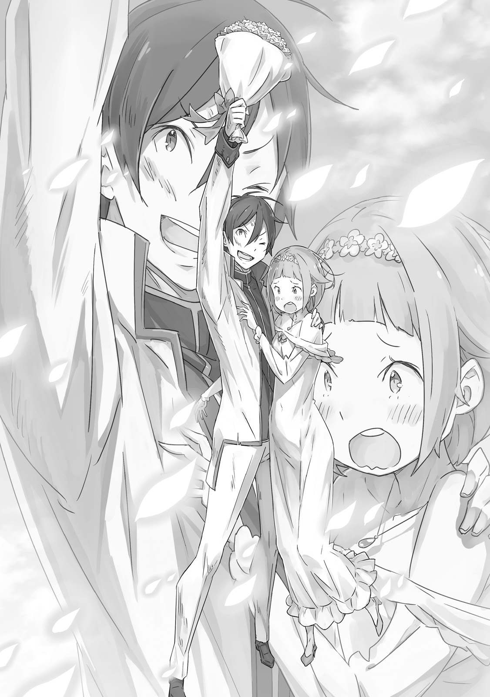

Сцена для влюблённых

『幕間の恋人たち』

× × ×

Гримм Фаузен до сих пор помнил момент, когда влюбился.

На пределе своих сил Гримм рухнул в углу поля боя. В одной руке он сжимал видавший виды меч, пальцы так окоченели от хватки, что он не мог разжать их. Рука всё ещё вибрировала от ощущения того, как он отрубил голову существу, которое когда-то было его другом.

— …

Это был ад. Любое место на поле боя, в любое время, было адом.

Он сожалел о своем собственном глупом решении, хотя было уже слишком поздно. Он сожалел о том, что сбежал из родного города. Он так боялся принять семейное дело в их уединенной деревушке, страшился провести всю свою жизнь, будучи никем.

Его жалкое желание стать героем, уродливое честолюбие, от которого он не смог отказаться, — вот к чему всё это привело.

Лицо его бывшего друга Торты, глаза пустые и безжизненные из-за превращения в солдата-трупа, навсегда запечатлелось в памяти Гримма. Он использовал свой меч не из-за скорби по ушедшему другу, а из-за оппортунистического импульса не умереть.

Этот факт заставлял пятна крови и внутренностей на его руках казаться намного глубже…

— Похоже, я тебя недооценила.

Голос поразил его слух, ужасный и ясный, заставив его сердце трепетать.

— …

Он невольно поднял глаза оттуда, где сидел. И увидел её, стоящую перед ним.

Её красивые золотые волосы были коротко подстрижены, голубые глаза были подобны драгоценным камням, которые открыто сияли её эмоциями, осанка была благородной, и больше всего его поразило то, что всё это казалось в ней совершенно естественным. Она была не столько милой или драгоценной, сколько элегантной и красивой. И её звали…

— Вы… Кэрол, госпожа. — Его голос дрогнул, когда он произнёс её имя.

Губы девушки — Кэрол — расплылись в тонкой улыбке.

— Верно. Похоже, нам обоим пришлось нелегко, э-э… Гримм. — В этот момент её величавое выражение лица смягчилось, открывая более юную сторону, подобающую её возрасту.

Она сбросила свои легкие доспехи, отложив меч, который всегда держала при себе; при этом она выглядела совсем не похожей на зрелого рыцаря-женщину. Конечно, это был не типичный момент праздной беседы. Сухой ветер, проносящийся над полем боя, нёс запах крови, да и сама Кэрол была ранена.

Да — она, должно быть, была ранена, сражаясь с врагом.

— Это всего лишь царапина, — сказала она. — Не о чем жаловаться дочери воинов.

— …Это… правда? — спросил Гримм.

— Да, — ответила она, читая сомнение в его лице. — И более того… — Она опустила глаза. Её сапфировые глаза остановились на руке, в которой Гримм сжимал своё оружие. Какое-то сложное чувство промелькнуло в её глазах, а затем она соскользнула в сидячее положение.

— Это был первый раз, когда ты кого-то убил? — Она коснулась правой руки Гримма, когда говорила. Её тонкие, бледные пальцы коснулись его собственных застывших мышц, ослабляя их, пока он не почувствовал, что суставы снова начали двигаться.

— О, э-э…

— Не торопись. У тебя есть время. Это случается со всеми нами. Тем более, когда это был твой друг.

— …

Гримм проглотил свои дрожащие слова, опустив глаза в отчаянии.

Он был на поле боя в третий раз, и впервые он кого-то убил. То есть, если нежить вообще можно убить.

И трижды, каждый раз, Гримм сожалел о том, что стоял на поле боя.

Подвергая свою собственную жизнь опасности, легкомысленно относясь к жизням других, стоя посреди тошнотворного запаха крови — Гримм не чувствовал ничего, кроме сожаления обо всём этом. Каждый раз он заново обнаруживал, что ему здесь не место…

— Это был очень смелый поступок. — Даже когда Гримма мучили угрызения совести, Кэрол смотрела прямо на него. — Твой друг был в самом ужасном положении, и ты отправил его на покой своим собственным мечом. Даже если ты едва ли сделал это сознательно, это не меняет того, что произошло. Очень хорошо.

Казалось, Кэрол пыталась достучаться до опустошенного Гримма. При звуке её голоса, при значении её слов, Гримм перевёл дыхание и задумался о том, что он сделал.

Действительно ли это было что-то, достойное похвалы?

— По крайней мере, ты освободил своего друга от позора того, что случилось с ним после смерти, и ты дал последний толчок, который помог мне и твоим другим товарищам по оружию… Хотя я разочарована, что это также дало ещё одну возможность этому грубому придурку.

И снова Кэрол, казалось, прочитала мысли Гримма. Он с изумлением посмотрел на неё, но она только улыбнулась.

— Надеюсь, я не слишком далека от истины.

— …Нет! Вовсе… нет.

— Нет? Это хорошо… Ах.

Кэрол испустила небольшой вздох облегчения. Она посмотрела на пальцы Гримма и увидела, как его болезненно сжатые пальцы разжимают рукоять меча.

Кэрол осторожно забрала у него меч. Затем, всё ещё держа его оружие, она поднялась на ноги.

— Что?

Гримм запнулся от её тихого вопроса.

— Э-э, это, э-э… — У него закружилась голова от того, что он сам сделал.

Его собственная рука взяла руку Кэрол, останавливая её.

Как будто его пальцы не хотели отпускать её нежное прикосновение.

— Это очень…

— С-спасибо!

— …

— …Я имею в виду, спасибо, госпожа.

Гримм обрёл голос в тот самый момент, когда теплота грозила исчезнуть с лица Кэрол. Его слова приняли форму благодарности, но было до боли очевидно, что это была всего лишь жалкая отговорка.

Глаза Кэрол расширились от восклицания Гримма.

— …Ты странный человек, Гримм.

Она нахмурила свои красивые брови, но её губы расплылись в улыбке. С этого момента Гримм Фаузен принадлежал Кэрол Ремендис.

Страх перед полем боя никогда не ослабевал для Гримма. Война была адом; это убеждение никогда не уменьшалось. Не было такого поля боя, которое не было бы адским, не было битвы, в которой он сражался бы без ужаса, не было жизни, заслуживающей смерти, но бесчисленное множество жизней ушло в неё.

Он ненавидел сражаться и ни разу не почувствовал, что создан для этого. Все вокруг него соглашались, и они никогда не стеснялись говорить ему об этом.

Гримм понимал, что это был своего рода акт доброты. Зачем кому-то столь неприспособленному, тому, кто никогда не сможет победить страх, продолжать бороться в аду? Если бы он решил уйти, наверняка никто из его товарищей не стал бы его останавливать.

Нет, они бы проводили его, когда он вернулся бы в свой родной город, с облегченными улыбками на лицах.

За одним лишь исключением: Вильгельм Триас.

— Ты ещё жив, придурок? Если у тебя есть время сидеть и пялиться, как мертвец, то убирайся отсюда к черту.

Демон Меча, способный на беспримерные подвиги в бою, прорычал, обнаружив Гримма, с трудом пробивающегося на поле боя.

В словах Вильгельма не было лжи. Он говорил не из какой-либо доброты или участия, а из абсолютной убежденности, что слабым не место на поле боя и что Гримм будет только мешать ему.

— Как будто я могу! Вильгельм, почему ты всегда такой…?

— Нет времени и для глупой болтовни. Смотри, вражеское подкрепление. — Проигнорировав возражение Гримма, Вильгельм поднял свой окровавленный клинок, а затем бросился в сторону противника, быстрый, как ветер. Глаза Гримма расширились, и он, практически вырывая на себе волосы, закричал:

— Ах, чёрт! Стой! Вильгельм, подожди меня!

Он побежал за Вильгельмом, снова втянутый в поле боя, кишащее врагами; он поднял свой щит.

Страх никогда не уходил. Он не был приспособлен к битве. Война всегда была адом.

И всё же, каким-то образом, Гримм никогда не мог убежать от войны. Вместо этого он продолжал двигаться вперёд, следуя за своим братом по оружию. В тот момент больше всего он боялся, что может наступить день, когда он больше не сможет следовать за ним.

— Если ты попытаешься вести себя как он, я не думаю, что будет иметь значение, сколько у тебя жизней — этого будет недостаточно.

Кэрол, навещая Гримма, когда он оказывал себе первую помощь, выглядела раздраженной.

Это было сразу после одного из столкновений, характерных для стычек между эскадроном Зелгефа и силами полулюдей во время войны. В этой битве Вильгельм в очередной раз продемонстрировал свою сокрушительную силу, так что это была довольно легкая победа с относительно небольшими потерями для их стороны. То, что Гримм числился среди этого незначительного числа, было ему стыдно.

— …Я не могу на это смотреть, — добавила она. — Дай мне это.

— О, э-э, прости… Спасибо.

Кэрол взяла на себя лечение Гримма, который неуверенно пытался перевязать свою доминирующую руку. Она быстро обернула повязки вокруг пореза на его правом плече. Это заняло у неё всего несколько секунд; Гримму его собственная некомпетентность казалась ещё более явной.

— Дело в привычке, — сказала Кэрол. — Даже я не смогла бы хорошо перевязать свою любимую руку.

— …Меня так легко прочитать? — спросил Гримм, касаясь собственного лица.

Глаза Кэрол слегка расширились, когда она сказала: — Да, — и кивнула. — Я не уверена, почему. Ты странно… Твоё лицо легко понять, мне кажется. Может быть…

— Может быть, что? — Гримм наклонился, желая услышать, что скажет Кэрол.

Кэрол, почувствовав его интерес, мягко покачала головой.

— Может быть, кому-то, кого так легко раскусить, не место на поле боя.

— О, опять это…

Кэрол была удивлена, увидев, как сдулся Гримм.

— Не волнуйся, — сказал Гримм с натянутой улыбкой. — Люди постоянно говорят мне, что мне здесь не место. Я даже сам себе это часто говорю.

— Так почему же ты остаешься?

— Я не знаю.

Вопрос был естественным, но Гримм посмотрел вдаль.

Кэрол оглянулась через плечо, следуя за его взглядом. Затем…

— Это как-то связано с этим человеком, Триасом?

Гримм смотрел на Демона Меча, того, кто стоял на передовой этой битвы и вернулся без единой царапины. Угрюмый парень откинулся назад, казалось, ему было скучно, он закрыл глаза, чтобы немного отдохнуть.

Гримм улыбнулся колкости в голосе Кэрол.

— Хотел бы я сказать, что это никак не связано с ним, но это, вероятно, было бы неправдой… Надеюсь, ты не будешь слишком раздражена тем, что я это говорю.

— …

— Э-э, я просто не хочу, чтобы этот ужасный, помешанный на мечах идиот оставил меня позади.

Если произнести это вслух, эта мотивация звучала настолько нелепо, что Гримм обнаружил, что почти смеётся над собой. Вильгельм шёл своим собственным путем, напряженным и одиноким, по которому никто не мог приблизиться к нему. Это был источник, который питал его силу и делал его тем, кем он был.

И всё же, каким бы отчужденным ни был Вильгельм, он трижды спасал жизнь Гримму.

— Я не думаю, что Вильгельм вообще знает об этом. Сомневаюсь, что он думает, что я ему чем-то обязан.

— Ну, тогда…

— Но не я. Он спас меня.

Он не мог преодолеть свой страх: он всегда будет ненавидеть сражения, и война всегда будет для него адом. Но на этом же самом жестоком поле боя Гримм был спасен братом по оружию — хотя сам этот человек, возможно, и не осознавал этого.

В этом жестоком месте, посреди ужасной, распространяющейся битвы, где сердце Гримма терзалось страхом, только его товарищи оберегали его, защищали его жизнь.

— Если бы я только сказал ему спасибо, я уверен, он бы просто усмехнулся надо мной. Пробормотал бы что-нибудь о том, чтобы не становиться слишком закадычными друзьями. Так что вместо этого я заставлю его понять.

— Заставишь его понять?

— Я буду сражаться, пока однажды он не будет рад, что я был там — рад, что его брат по оружию был там, чтобы помочь ему.

Самые искренние слова благодарности, которые он мог бы собрать, никогда по-настоящему не достигнут Вильгельма. Поэтому он будет ждать того момента, когда чувство, которое он хотел выразить, сможет достичь сердца другого человека. Он будет ждать, наблюдая, как ястреб.

— Когда придет время, даже Вильгельм сможет увидеть, как я благодарен. Тогда я скажу ему: «Теперь мы квиты». Это одна из причин, по которой я продолжаю сражаться.

— …

— О…

Кэрол потеряла дар речи, узнав о тайном стремлении Гримма. Её реакция заставила Гримма внезапно смутиться собственным признанием. Какое скромное и женственное желание он выразил.

Однако Кэрол с дрожащими губами сказала:

— …Похоже, я всё ещё тебя недооцениваю.

— О, э-э, э-э… Нет, я-я извиняюсь, что надоедаю тебе…

— Вряд ли… Ты действительно веришь… что он изменится?

Гримм остановился на середине своих извинений. Его поймал серьёзный взгляд в глазах Кэрол.

— …

Она молчала, ожидая ответа Гримма. Ему казалось, что она хочет получить ответ на что-то другое. Как будто она искала у него какой-то помощи.

В мгновение ока он вспомнил, что она сказала, когда они впервые встретились. Что-то о том, что она слуга кого-то и сражается на войне от имени этого человека.

Не намекал ли этот вопрос на какие-то чувства к этому кому-то?

Он почувствовал тупую боль, пронзившую его сердце. Но он приложил руку к груди, игнорируя это чувство, и сказал:

— Да, я верю, что он изменится. Всё, кто угодно, может это сделать, если у него достаточно времени, если он этого захочет.

— …

— Я на самом деле дошёл до того, что могу вести разговор с Вильгельмом, понимаешь? Может быть, когда-нибудь мы даже сможем пойти и выпить вместе или что-то в этом роде. — Он говорил почти в шутку, но это было своего рода прикрытием. Причиной было изменение, которое он увидел в глазах Кэрол.

Он увидел, как беспокойство в этих прекрасных сапфировых глазах мгновенно исчезло. Какие бы сомнения у неё ни были по поводу этого человека, которого она ценила, его слова излечили их. Он почти слышал, как его друг Торта, ныне мертвый в битве, пожимает плечами и говорит: «Ты делаешь одну глупость за другой, а?»

Он мог иметь дело с кем-то, кто был фактически его соперником за любовь Кэрол, и вот он оказал помощь противнику.

— …Человек может измениться. Со временем и желанием, кто угодно… — Кэрол повторила слова Гримма. Сила вернулась в её голос, когда она говорила. Наконец, её дыхание выровнялось, она посмотрела Гримму прямо в глаза.

— Я с тобой.

— А?

— Я хочу этого для тебя. Я буду счастлива, если твоё желание сбудется. — Её щеки раскраснелись, глаза наполнились надеждой.

— …

Гримм почувствовал, как его пульс участился. Опять же, он знал, что эти глаза и это выражение не были направлены на него, и он ругал себя за то, что вел себя так, как будто это было так. Это должно быть что-то другое. Уже был кто-то, кого Кэрол ценила. Что касается его, то они виделись на поле боя всего несколько раз. Чего такой красивой женщине желать от…?

— Хм? Это… — пробормотала Кэрол, когда Гримм в замешательстве посмотрел на землю. Он оглянулся и увидел, что она снова смотрит через плечо, и что её лицо снова стало опасным. Источником её подозрения оказалась высокая стройная женщина, разговаривающая с Вильгельмом.

— Вот леди Мейзерс, снова с ним разговаривает…

Она отряхнула колени и встала. Женщина, которую она с таким почтением называла, была Розвааль J. Мейзерс, королевский маг. И её одежда, и её речь могли быть великодушно описаны как необычные, и она часто появлялась в тех же местах, что и эскадрон Зелгефа, где, помимо помощи в переломе хода битвы, она часто проводила время, дразня Вильгельма.

У неё была репутация довольно проблемной особы, но поскольку её безрассудство приводило к его регулярным встречам с Кэрол на поле боя, Гримм был втайне благодарен ей.

Кэрол, однако, не собиралась мириться со встречей Вильгельма и Розвааля.

— Прости меня, Гримм, — сказала она. — Мне нужно идти работать.

— О, к-конечно! Я… Я имею в виду, я в порядке. Ты отлично справилась.

— …

Кэрол на мгновение прищурилась на него, обдумывая его неуместный ответ. Затем, взглянув на огромный щит, прислоненный к стене рядом с Гриммом, она сказала:

— Ты собираешься научиться им пользоваться?

Она казалась очень серьезной, поэтому он тоже посмотрел на щит.

— Госпожа Кэрол…?

— Гримм, если ты действительно хочешь выжить в этой гражданской войне… Если ты хочешь держаться рядом с Триасом и капитаном Зелгефом… то, как ты сражаешься, опасно.

— …

— Так что, если хочешь, я могла бы научить тебя пользоваться щитом. Хотя… Как бы это сказать? Должна признать, я сама ещё не полностью изучила его.

— …! Вы правда?! — Гримм чуть не подпрыгнул на ноги. Он и мечтать не мог о таком предложении.

Его реакция удивила Кэрол, но она быстро кивнула.

— Да. Давай выберем время. Думаю, я смогу выделить немного времени в столице.

— К-конечно. Большое спасибо. Я с нетерпением жду возможности учиться у вас! — Он несколько раз поклонился, глубоко благодарный Кэрол. Конечно, он должен был быть осторожен, чтобы не ошибиться в её намерениях. Она предлагала это только из доброты. Тем не менее, он более чем приветствовал любой прогресс, будь то в его желании для своего товарища или в попытке провести некоторое время с женщиной, которую он обожал.

Он сжимал кулак от счастья, когда Кэрол сказала:

— Кстати, может быть, я слишком много вкладываю в это, но…

— Да?

— Человек, которому я служу, — женщина. Пожалуйста, не пойми меня неправильно.

Это было всё. Это всё, что она сказала, прежде чем развернуться на каблуках и направиться к Вильгельму и Розвааль. Она резко заговорила с ними, вступая в спор, который, казалось, назревал.

Но Гримм, наблюдая издалека, изо всех сил пытался понять, что он только что услышал.

— Я… я не должен… неправильно понимать её намерения… но…

Но было ли это действительно ошибкой? Вопрос крутился и крутился в его голове.

Он не мог избавиться от ощущения, что где-то в глубине его сознания Торта озорно ухмыляется.

И так началась серия встреч, наполненных благодарностью, надеждой на будущее и, возможно, малейшими скрытыми мотивами. Внешне это были тренировки по владению щитом, чтобы помочь Гримму выжить. Но на самом деле они были намного более интенсивными и жестокими, чем всё, что он представлял себе, когда слышал простое слово тренировка.

— Вот!

— Ай! Ой, ой, ой! Госпожа Кэрол, это больно!

— На поле боя будет намного больнее! Ты только что лишился всех конечностей! — крикнула Кэрол. Она держала деревянный тренировочный меч, которым только что ударила по каждой руке и ноге Гримма. Он уронил щит и теперь, скорчившись от боли, стоял перед Кэрол.

Кэрол владела деревянным мечом так, как будто он был продолжением её тела, атакуя Гримма быстрыми сменами позиций и плавными движениями. Не в силах уследить за её клинком, он получил десятки ударов, и его тело было готово сломаться.

— Ты стал намного лучше, но в твоих движениях всё ещё слишком много неэффективности, — сказала Кэрол, садясь рядом с Гриммом. — Однажды ты столкнешься с действительно сильным противником, и тогда тебя одолеют. — Она испустила тихий вздох, затем осторожно вытерла пот со лба и смочила губы языком. Каждый жест был по-своему благороден, и Гримм был поражен тем, как Кэрол выглядела в профиль.

Таким образом, в течение некоторого времени Кэрол помогала Гримму закаляться. Они встречались на тренировочной площадке в столице, и Гримм получал возможность тренироваться с ней один на один в течение нескольких часов.

Бордо на самом деле похвалил Гримма за то, что он стал способен держаться наравне со щитом. Гримм был воодушевлен его словами и чувствовал, что начал добиваться некоторого прогресса в своей работе со щитом, но, очевидно, у него всё ещё было много шероховатостей. Кэрол, казалось, находила бреши в его защите повсюду, и в реальном бою он, вероятно, был бы уже тысячу раз мертв.

— Из того, что я видела, — сказала Кэрол, — мне кажется, что твои движения намного лучше на реальном поле боя.

— О. Интересно, не благодаря ли этому странному ощущению, которое я испытываю в затылке. — Гримм коснулся затылка, предлагая свою собственную гипотезу.

Это «чувство» было своего рода шестым чувством опасности, которое сам Гримм не совсем понимал. Когда он сталкивался с врагом на поле боя или когда чувствовал его поблизости, по его затылку пробегал шок страха. Прислушиваясь к нему, Гримм мог владеть своим щитом гораздо более искусно, чем можно было бы предположить по его тренировкам. Опять же, возможно, он никогда бы не справился с этим без Кэрол, которая повысила его общий уровень способностей.

— Я не уверена, что я об этом думаю, — ответила Кэрол. — Это подразумевает, что энергия, которую я вкладываю здесь, не похожа на реальную битву.

— Э-это совсем не то, что я имел в виду! Я просто, э-э, как бы это сказать…?

— Я просто пошутила. Тебе не нужно так расстраиваться. — Губы Кэрол расплылись в улыбке, и она обратила свои добрые глаза на Гримма.

Он схватился за голову, жалко бормоча:

— Черт…

Он подозревал, что она видит его насквозь, точно знает, что он чувствует. Тот факт, что она, тем не менее, продолжала назначать эти встречи, означал либо то, что она тоже считает, что он в порядке, либо то, что она очень предана выполнению своих обещаний. Хотя ему нравилось думать, что к этому моменту он знал, что она представляет собой нечто большее, чем просто этикет.

— Госпожа Кэрол, я просто не могу вас победить…

— Гримм? Что ты сказал?

Он быстро улыбнулся и попытался прикрыть себя.

— О, я… я просто подумал, что, может быть, причина, по которой я, кажется, никогда не могу защититься от вас, в том, что я для вас как открытая книга.

— Понятно, — тихо сказала Кэрол. — Это правда, твои выражения никогда не было трудно расшифровать. Может быть, твоё лицо особенно открыто для меня… Наверное, мы хорошо подходим друг другу.

— Что?!

— О, ничего, — сказала Кэрол, в её глазах мелькнул озорной огонёк. — …Тебя действительно легко прочитать.

Она вскочила на ноги, затем вежливо протянула руку Гримму.

Он секунду колебался, взять ли её за руку, а затем схватил её, прежде чем успел передумать.

— Мне кажется, — сказала Кэрол, — что, даже если бы ты не мог говорить, я всё равно могла бы тебя понять.

Кэрол отчаянно извинялась за свои слова, вбежав в палату Гримма.

— Прости…! Прости, Гримм… Я…!

Она подошла к его постели, со слезами извиняясь. Услышав боль в её голосе, Гримм открыл рот, чтобы сказать что-нибудь, что угодно, лишь бы остановить её слёзы. Но—

— …

Из его рта вырвалось лишь хриплое дыхание; он не мог произнести осмысленных слов.

Битва при болоте Айхия, сражение более ожесточённое, чем любое другое в Войне Полулюдей, только что закончилась. Будучи частью эскадрона Зелгефа, Гримм находился на этом поле боя, где столкнулся с Либре Ферми, одним из знаменосцев Альянса Полулюдей. Отряд был втянут в беспощадную битву.

Когда битва была почти закончена, вспышка двойного клинка Либре вонзилась в горло Гримма. Удар прорезал органы, необходимые ему для речи, и Гримм потерял голос. Врачи в больнице уже заявили, что он, скорее всего, никогда больше не заговорит.

Кэрол винила себя в травме Гримма и была чрезвычайно расстроена. Как будто небрежное замечание с тренировки много лун назад могло быть причиной.

— Гримм?

Он улыбнулся хриплому, полному слёз голосу, произнесшему его имя. Кэрол была в безопасности рядом с ним, и в этот момент это делало его счастливым.

Да, было больно потерять голос. Знать, что он больше никогда не произнесет её имя. Но даже несмотря на это, он был рад, что, по крайней мере, в огне этого ада он не потерял её.

Он уже потерял одного товарища по оружию. Кому он был многим обязан. Поле боя украло этого человека у него. Его собственное бессилие привело к смерти. Тем более…

— Ах…

— Я так рад, что ты в безопасности, — написал Гримм от всего сердца. И Кэрол, которая всегда знала, о чём он думает, лучше, чем кто-либо другой, сразу же поняла. Она медленно поднялась, глядя на него влажными глазами.

Ему казалось, что он никогда не устанет смотреть на её лицо и упиваться её красотой. Он больше не верил, что ошибается в причине, по которой её глаза были влажными, по которой она смотрела на него. Им больше не нужны были никакие оправдания.

Действительно, Гримм теперь притянул Кэрол к себе.

— …!

Кэрол затаила дыхание, на мгновение удивившись, но затем прижалась к его груди. Когда она посмотрела на него, он наклонился, чтобы украсть поцелуй с её губ.

Она не сопротивлялась.

Когда поцелуй закончился, он надеялся, что она увидит на его лице, как сильно он её любит.

Эта мысль пришла ему в голову, когда он жадно прижимал её теплое тело к себе.

Дни и месяцы шли, и с Гриммом и Кэрол многое произошло. Битва в замке, которая оказалась поворотным моментом в Войне Полулюдей; дебютный бой Святой Меча, заставивший Вильгельма дезертировать из армии; и вторая битва на Касторских полях, которая привела к окончательному прекращению военных действий.

А ещё было вмешательство Демона Меча в церемонию перемирия и поражение Святой Меча.

— Этот абсолютный, совершенный, полный дурак! Можно подумать, за два года он хоть чему-то научился!

Демон Меча ворвался на церемонию, ошеломил Святую Меча демонстрацией силы, а затем был немедленно арестован и брошен в Тюремную Башню бригадой рыцарей.

Никто другой не смог бы сделать что-то столь глупое и столь грандиозное, и Кэрол была непреклонна в своей оценке. Гримм мог лишь слабо улыбнуться своей разъяренной возлюбленной. В конце концов, он сам участвовал в поимке Демона Меча после его невероятно дерзкого поведения. Они едва успели вернуться домой, как Кэрол начала ворчать, и Гримм невольно улыбнулся.

— Гримм? Что именно тут смешного? Я сказала что-то забавное?

— Не смешное. Скорее… предсказуемое, может быть.

— Хм. Ты хочешь сказать, что знал, что я разозлюсь?

— Скажи мне ты, учитель.

Он быстро нацарапал на листке бумаги, который достал из сумки, дразня её.

За более чем два года, прошедшие с тех пор, как он потерял голос, он довольно привык к такому способу общения. Конечно, Кэрол, которая стала ещё лучше угадывать его мысли, уже надула щеки и рассердилась, прежде чем он закончил писать.

Прошло некоторое время с тех пор, как они начали так открыто показывать друг другу свои эмоции. В тот момент, однако, она выглядела для него более естественно, чем когда-либо за последние два года.

— Ты рада, что Вильгельм вернулся?

— Я? О чём ты говоришь! Т-ты единственный в моём сердце, Гримм…

— Прости. Я имел в виду, рада за Терезию.

— …Думаю, ты имел в виду именно то, что написал. — Несмотря на быстрое появление второго листа бумаги, Кэрол надулась и сердито посмотрела на него.

Полностью удовлетворённый восхитительным выражением лица своей возлюбленной, Гримм заново осознал, насколько он сам невероятно облегчён. Он сжал челюсти, заставляя зубы перестать стучать.

Вильгельм, пропавший без вести два года назад, вернулся. Он был таким же хорошим фехтовальщиком, как и прежде, — возможно, даже лучше. Достаточно хорош, чтобы одержать победу над Святой Меча на церемонии. Демон Меча действительно вернулся домой. Он вернулся, чтобы спасти сердце Терезии, женщины, которая значила для Кэрол всё.

— В любом случае! Мы не можем просто ждать здесь! Кто-то должен пойти и сообщить этому идиоту, насколько он невероятно глуп! И это наша работа, Гримм!

— А как же леди Терезия?

— Не могу представить, чтобы моя дорогая, добросердечная леди Терезия хотя бы отругала его. Ей нужна я!

Это была не надежда, а истинное убеждение, которое двигало этим заявлением. Отношения между Вильгельмом и Терезией должны быть именно такими, как она сказала. Так же, как и то, что Гримм любил её.

У него самого было более чем достаточно мыслей, которыми он хотел поделиться с Вильгельмом. Они оба хотели одного и того же.

— Пойдем, Гримм! Я уверена, что леди Терезия отвезет его к себе домой… И вот там я выскажу ему весь гнев, который я копила два года!

Она протянула руку, и он взял её с той же слабой улыбкой. Она была готова выскочить за дверь, но он на мгновение притянул её обратно.

В этот момент он записал чувства, которые не успел выразить на прерванной церемонии.

— Это платье прекрасно на тебе смотрится.

Давайте не будем подробно описывать точную реакцию Кэрол. Однако, когда она и Гримм покидали зал церемоний, её лицо было очень красным.

Когда свадьба завершилась, Вильгельм и Терезия ван Астрея поделились своим первым поцелуем как супружеская пара. Со скамей Кэрол, опираясь на плечо Гримма, открыто плакала.

Эскадрон Зелгефа чудесным образом прибыл вовремя к церемонии, но все его члены были в плачевном состоянии. Включая Гримма, чьи доспехи и униформа после трёх дней непрерывного использования могли быть названы, в лучшем случае, антисанитарными.

Кэрол, однако, с её (грязным) возлюбленным снова рядом, было абсолютно всё равно. Прекрасная невеста, Терезия, чувствовала то же самое. Их грудь вздымалась от гордости.

С обменом клятвами, а затем и поцелуем, Вильгельм и Терезия, наконец, официально стали мужем и женой. Даже Его Величество Король присутствовал, хотя и инкогнито. Никто из присутствующих не возражал против этого союза. Конечно, никто, кроме отца невесты, никогда не имел ничего против.

— О… Леди Терезия, как вы прекрасны… — Кэрол не могла скрыть своей радости и эмоций при виде Терезии в свадебном платье; она была полностью очарована. Гримм почувствовал укол ревности, но в этот день он мог позволить себе это.

Никому не нужно было объяснять ему, насколько важна Терезия в жизни Кэрол. Они были как сестры, или даже ближе, и её чувства в этот день, должно быть, были поистине сильными. Сам Гримм был в равной степени рад видеть, что желание Вильгельма исполнилось. Хотя, возможно, он не был так эмоционален по этому поводу, как Кэрол.

— …

С клятвами и поцелуем сама церемония закончилась. Тем не менее, торжество затянулось из-за того, что кто-то недоброжелательный мог бы счесть излишним: Бордо, представляющий новоиспеченного жениха, произнес речь; Бертоль Астрея, как отец невесты, рассказал несколько воспоминаний о своей жизни с дочерью, хотя он предсказуемо расплакался.

Наконец, когда всё закончилось, Вильгельм и Терезия вместе покинули часовню. Все аплодировали им и благословляли. И как раз когда пара собиралась уйти…

— Кэрол!

— А?!

Свадебный букет взлетел по дуге в воздух и аккуратно приземлился в испуганные руки Кэрол. Бросание желтых цветов, которые держала Терезия, было самым последним из свадебных обычаев, которые нужно было соблюсти. Говорили, что тот, кто их поймает, следующим обретёт пожизненное счастье…

— О…

Терезия озорно подмигнула, и Кэрол покраснела. В этот момент аплодисменты в часовне переключились с Вильгельма и Терезии и обрушились на Кэрол. Почти подавленная, она схватила Гримма за руку, но это только вызвало усиление благопожеланий.

— Г-Гримм, э-э…

Его возлюбленная, казалось, не знала, что делать, но Гримм тоже подмигнул. На другой стороне аплодисментов Терезия счастливо улыбалась им, а у Вильгельма было недовольное выражение лица, как будто он хотел сказать, что немного отплачивает Гримму.

Ты будешь следующим, кто встанет там, — казалось, говорил он.

— …

Затем Гримм обнял Кэрол левой рукой, а свободной рукой схватил у неё букет и поднял его над головой, чтобы все видели.

На мгновение воцарился шок среди наблюдателей, но затем все взглянули друг на друга и снова разразились аплодисментами. Возлюбленный девушки, получившей букет, поднял его вверх. Это могло означать только одно.

Терезия прикрыла рот руками, а Вильгельм поднял бровь, как будто слегка удивившись. Бордо громко рассмеялся, Миклотов улыбнулся, а король Гионис хлопал громче всех. Бертоль Астрея, охваченный страхом, что у него заберут кого-то, кого он считал дочерью, снова расплакался.

Кэрол прислонилась к Гримму, всё ещё краснея.

— Гримм, ты… дурачок, — пробормотала она своим сладким голосом. Её жалоба была тихой, но он чётко различил её среди аплодисментов.

— Клянусь, я никогда не знаю, что ты выкинешь дальше, — сказала Кэрол, бросив укоризненный взгляд на Гримма, сидя на кровати. Церемония закончилась, и они находились в частном доме в уголке квартала простолюдинов, когда ночь опустилась на столицу Лугуники.

Комната была спальней Гримма, а здание — его домом. Гримм был вице-капитаном эскадрона Зелгефа, выдающегося и уважаемого подразделения. Бордо уже решил, что Гримму больше не придется ночевать в гарнизоне, а следует иметь дом рядом с замком, и результатом стало это здание. Оно давало ему доступ ко всему, что ему нужно было иметь и делать, облегчая его жизнь. А ещё так получилось, что это облегчало возможность украдкой проводить время с Кэрол.

— Я раньше беспокоился о том, как на меня смотрят некоторые другие рыцари и стражники.

Их тайные свидания были не так уж часты, но жизнь мужчины с прекрасной возлюбленной могла быть трудной по-своему. Гримм уже давно вёл свою собственную тайную битву, чтобы не позволить никому из своих гораздо менее квалифицированных и набожных конкурентов наложить руки на Кэрол. Он не собирался рассказывать ей об этой конкретной борьбе, и в любом случае он скоро будет щедро вознагражден.

— У тебя был долгий… ну, больше, чем просто долгий день, Гримм. Иди сюда.

Он принял ванну и переоделся, и теперь Кэрол похлопала по кровати рядом с собой, слегка покраснев. Он сел рядом с ней и обнял её за тонкую талию. Их губы встретились без необходимости в словах.

В такие моменты, когда они были только вдвоем, Гримм почти не носил с собой кисть для письма. Достаточно было просто видеть друг друга. Гримм наслаждался удовольствием от осознания того, что Кэрол была права, что слова — не единственный способ передать свои чувства.

Внезапно, вспомнив, что он с тем, кто передает свои чувства мечом, он расхохотался.

— …О, Гримм, посмотри, что ты наделал. Маленьким извинением тут не отделаешься. — Кэрол была в полном негодовании от того, что её бросили на полпути к поцелую, испортив настроение между ними. Она отвергла его извиняющееся выражение лица и с досадой отвернулась от него.

Он приложил руку к одной её щеке, прижимаясь поцелуем к другой.

— Хм, нет. Тебе так легко не отделаться. — Его принцесса оставалась сердитой, но он не собирался отступать перед этим вызовом. Её уши, её шея: он осыпал её поцелуями.

— Ах, эй, это щекотно… Нечестно, нечестно, я сказала!

Кэрол извивалась под щекоткой его губ, напряжение в её щеках, наконец, ослабло. Затем, наконец, улыбка вернулась на её лицо, и взрыв смеха возвестил о её капитуляции, когда она покатилась в его объятия.

— …Странно, что такое храброе сердце живет в такой тонкой груди. — Её губы коснулись той же груди, её голос был сладким и уязвимым.

Обычно она так старалась показать себя уверенной и сильной; никто другой не видел этой более сентиментальной стороны её. Даже Терезия не видела этого выражения на её лице — оно предназначалось только для Гримма.

— …

При их первой встрече она помогла удержать его сердце от полного разрушения. Затем она выслушала его непомерные амбиции без тени смеха.

Она оплакивала потерю его голоса, стала его возлюбленной. В течение двух лет она присматривала за ним, пока он, наконец, не смог простить себя. А потом он увидел, как она поймала те цветы, получив всеобщее благословение.

— …Я ещё не совсем готова стать Кэрол Фаузен. — Она улыбнулась, угадывая, что было в его глазах, когда он смотрел на неё.

При таком раскладе, казалось, он не сможет скрыть даже своего намерения сделать предложение. Он решил быть осторожным, чтобы, по крайней мере, удивить её этим. Всё это было для того, чтобы он мог сделать этого человека, столь дорогого ему, счастливым во всех отношениях, на которые он был способен.

Так заканчивается блистательная интерлюдия в истории Демона Меча и Святой Меча, о соединении мужчины и женщины. Это тоже важная часть сказания Песни и Истории Любви Демона Меча.

《Конец》
