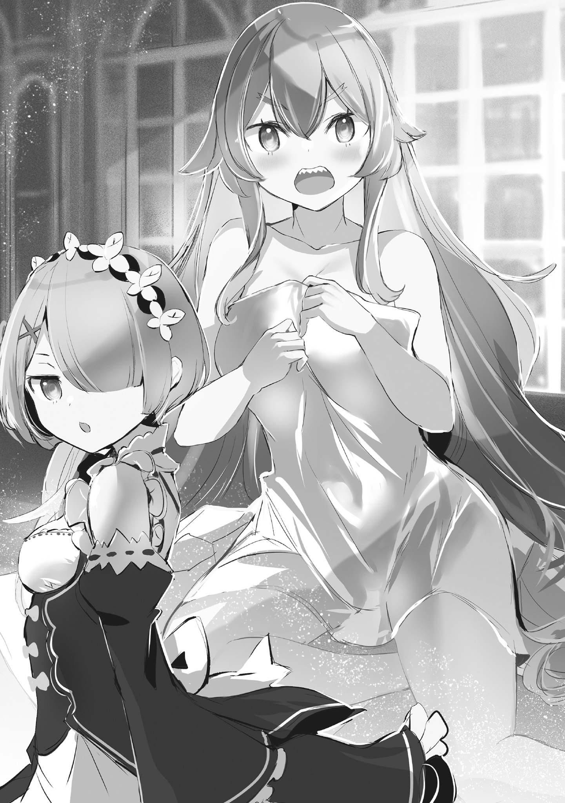
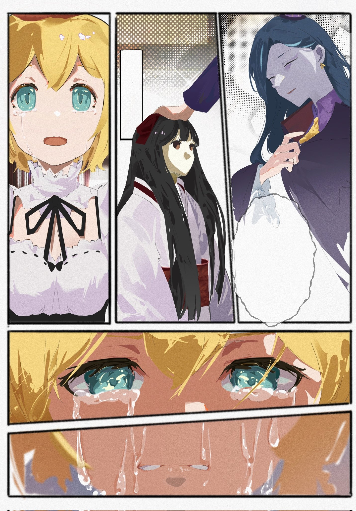

…Грохотал гром.

За окном сверкнула молния, и свет магических ламп, озарявших особняк, разом погас. Словно по чьей-то злой прихоти, в тот самый миг, когда тьма застила взор, рухнул буфет, и хранящаяся в нём посуда с оглушительным звоном разбилась.

— Ия-а-а-а-а…!!

Вслед за предсмертным звоном посуды раздался пронзительный визг.

Кричала горничная с длинными прекрасными золотистыми волосами. Несмотря на высокий рост, она обладала стройной и привлекательной фигурой с женственными формами. Её миндалевидные глаза напоминали изумруды, а в широко раскрытом от крика рту виднелись белые ровные зубы.

Впрочем, некоторые из этих зубов были остро заточены, придавая ей весьма устрашающий вид, но…

— Кья-а! Кья-а-а-а! Оно появилось! Оно здесь! Постойте, Петра?! Ты в порядке?! Петра! Рам!

Глядя на то, как она подпрыгивала на месте со слезами на глазах, в ней совершенно не чувствовалось никакой свирепости; напротив, всё в её поведении подчёркивало натуру слабой женщины.

В темноте она схватила попавшийся под руку лоскут ткани и отчаянно прижала его к себе.

— Пе-Пе-Пе-Петра?.. Нет, это Рам? В любом случае, хорошо, что ты цела. Боже, нам нужно выбираться отсюда как можно скорее…

— …Сестрица Фредерика?

— …?! Петра?! Ты там?

Женщина — Фредерика — обернулась на голос, прозвучавший вовсе не от того, кого она прижимала к себе, а с другой стороны. В темноте, где зрачки расширились, пытаясь уловить свет, она разглядела силуэт маленькой девочки.

Это была Петра — её названная младшая сестра, которую Фредерика любила больше всего на свете. Сейчас девочка стояла в костюме горничной с большим бантом на голове.

Убедившись, что та невредима, Фредерика с облегчением вздохнула, коснувшись своей пышной груди.

— Ох, Петра… Слава богу, ты в порядке. Значит, сейчас в моих объятиях Рам? Ты вела себя так тихо…

— О чём ты говоришь, Фредерика? Рам здесь.

— Э?

Раздался дерзкий голос, и рядом с Петрой появилась его обладательница.

Короткие розовые волосы и правильные черты лица, в которых чувствовалось нечто величественное. Эта поза — руки в боки — удивительно ей шла, и даже в этой бездне тьмы она оставалась верна себе.

— О, о-ох, Рам… Ты была вместе с Петрой. Эм-м, но в таком случае…

— Верно, мы были вместе. …И кого же ты, интересно, по ошибке приняла за Рам?

— Я старалась об этом не думать!..

Услышав безжалостный вопрос Рам, Фредерика со скрипом, словно несмазанный механизм, повернула голову обратно. И опустила взгляд на то, что крепко сжимала в своих объятиях, прижимая к груди.

В этот самый момент сверкнула молния, ярко осветив то, что находилось у неё в руках.

— …

Это была кукла размером с маленького ребёнка, у которой отсутствовал один глаз.

И эта кукла, ко всему прочему, встретившись взглядом с Фредерикой, растянула губы в улыбке.

— Ия-а-а-а-а-а!!

И тогда раздался очередной, неизвестно какой по счёту за этот день, вопль Фредерики.

…Всё началось примерно за два дня до этих событий.

— Уборка в особняке и перестановка мебели?

— Да~а~а, именно так. Я хотел попросить об этом вас трои~и~их.

Сцепив руки на столе, с улыбкой сообщил Розвааль.

Перед ним стояли три горничные, работающие в поместье, — выстроившиеся по росту: высокая, средняя и маленькая. Это были три девицы: Фредерика, Рам и Петра.

Из троих, вызванных в кабинет господина, Петра подняла руку со словами «Прошу прощения».

— Другой особняк… это же не тот, который сгорел раньше?

— Да, это другой дом. Хотя тот особняк мне тоже по-своему нра~а~авился…

— А, я не вас спрашивала, господин. Я спрашивала старших сестриц.

— Петра…

Глядя на то, как Петра с улыбкой отвергла ответ Розвааля, Фредерика приложила руку ко лбу.

Даже со стороны Фредерики было видно, что отношения Розвааля и Петры, мягко говоря, имеют сложный перелом. Поведение девочки, как наёмной работницы, вряд ли можно было назвать похвальным, но, по правде говоря, причина такого отношения крылась в самом Розваале.

Маркграф же, со своей стороны, казалось, великодушно прощал Петре такое поведение и даже пребывал в хорошем настроении от её нынешнего грубого ответа, так что исправить ситуацию Фредерика была не в силах.

В таком случае можно было подумать, что Рам, обожающая Розвааля, не станет молчать, однако…

— Такое отношение к господину Розваалю недопустимо, Петра.

— Прости, сестрица Рам. Но мне просто очень хочется сделать господину неприятно…

— Вот как, значит, ты готова к последствиям. Что ж, ничего не поделаешь. Тогда у Рам появится работа, которую может выполнить только она — утешить господина Розвааля, раненного словами Петры.

— Вы обе, прекратите немедленно! Это уже даже я не могу проигнорировать!

Хотя их отношение к Розваалю, стоявшему между ними, было диаметрально противоположным, по какой-то причине они прекрасно ладили, за что Фредерика их и отчитала. Затем она сделала шаг вперёд, опередив их:

— И вы, господин, не должны веселиться, вам следует сделать им замечание, иначе у нас будут проблемы. Дисциплина в поместье и так хромает. И без того…

— И без того что~о~о?

— И без того Субару-кун и Гарф её расшатывают…

В памяти Фредерики всплыли живущий в поместье черноволосый юноша и её непутёвый младший брат.

Если добавить к ним молодого министра внутренних дел, то получится мужская половина особняка Розвааля, но их поведение либо соответствовало возрасту, либо было, мягко говоря, неподобающим.

— Даже господин Отто, который выглядит приличным, стоит ему связаться с этими двумя, теряет тормоза больше всех…

— О, понимаю! Отто-кун всегда с таким лицом, мол, «я совершенно обычный», а потом вдруг начинает нести самые безумные вещи в мире!

— То, что он самый опасный мужчина из всех, — это, пожалуй, единогласное мнение.

— Ох-ох, такие разговоры Отто-куну лучше не слы~ы~дышать.

Где-то в рабочей зоне особняка, вдалеке от обсуждения, один молодой человек громко чихнул. После этой небольшой интермедии разговор, ушедший в сторону со словами «но вернёмся к делу», вошёл в прежнее русло.

Уборка другого особняка — само по себе это не вызывало вопросов, но…

— Прошло всего несколько месяцев с тех пор, как мы переехали в это главное поместье, и только всё улеглось. Почему вы решили заняться другим домом?

— Ну, вопрос вполне закономе~е~ерный. Впрочем, причина не так уж сложна~а~а. Прошло несколько месяцев с тех пор, как было объявлено о начале Королевских выборов, и кандидаты начали действовать всерьёз. Мы не можем отстава~а~ать. Переговоры с влиятельными людьми в разных регионах… Мне неловко это говорить, но в землях Маркграфа на западе много, кхм, своеобразных ли~и~ичностей. Переговоры будут крайне тяжёлыми.

— …? Какая связь между этим и другим особняком?

— Всё просто, Петра. Иными словами, в будущем господину Розваалю и госпоже Эмилии придётся часто выезжать на места для работы. В таких случаях чем больше мест, где можно остановиться, тем лучше. …К счастью, у семьи Мейзерс есть поместья в разных местах, так что это довольно удобно.

— Хм, вот оно как…

Петра кивнула, приняв объяснение Рам, перехватившей слова Розвааля. Глядя на них искоса, Фредерика продолжила: «В таком случае…»

— Значит, нужно по очереди проветрить особняки в разных регионах, верно?

— Да, этого будет доста~а~аточно. Для начала я планирую уговорить виконта Триона Арруза. Поэтому я буду благодарен, если вы подготовите место неподалёку от него~о~о.

— Тогда, может быть, особняк в Сан-Фантрасе? Но это немного далековато…

— Нет, не там, — перебила Рам.

Фредерика, разложив на столе висевшую на стене карту, пыталась найти подходящий под описание Розвааля дом, но Рам, заглянув в карту сбоку, удивлённо приподняла бровь.

Рам пристально посмотрела на одну точку на карте, указала пальцем на лес рядом с пунктом назначения и произнесла: «Здесь».

— Здесь же… ничего не обозначено, сестрица Рам. Лес.

— На карте этого нет, но здесь находится старый особняк, принадлежащий семье Мейзерс. …Ведь так, господин Розвааль?

— …Надо же, ты и правда хорошо это помнишь. Прошло ведь почти десять ле~е~ет.

— Потому что это воспоминания, связанные с господином Розваалем.

Услышав типичный для Рам серьёзный ответ, Розвааль с лёгкой кривой усмешкой опустил брови.

Поведение Рам не менялось годами, но, похоже, изменилось восприятие самого Розвааля — с глубоким чувством отметила про себя Фредерика, знавшая их обоих уже давно.

Впрочем, сейчас следовало обсудить особняк, которого не было на карте.

— Я тоже не знаю об этом особняке. Господин, что это за место?

— Неудивительно, что ты не зна~а~аешь. Это не совсем особняк, а скорее мастерская. Ей пользовался мой предшественник, и она стоит заброшенной уже почти десять ле~е~ет.

— Мастерская, значит.

Коснувшись щеки, Фредерика задумалась, прокручивая это слово в голове.

Предшественник Розвааля — Розвааль K. Мейзерс — был редким гением, посвятившим себя разработке и внедрению магических устройств, работающих на мана-камнях. Из поколения в поколение главы семьи Мейзерс наследовали имя Розвааль, и все они, как один, были выдающимися талантами.

— В таком случае, там могли остаться вещи, оставленные предшественником?

— Нет, всё полезное оттуда давно должны были вывезти, так что дом пу~у~уст. Однако его расположение идеально. Если мы сможем использовать этот особняк, это будет очень кста~а~ати.

— Понятно. Но если дело только в этом, то зачем нужны трое…

На этом моменте Фредерика осеклась, догадавшись о скрытом умысле Розвааля.

Уборка и ремонт старого особняка — с таким объёмом работы Фредерика справилась бы и в одиночку. И всё же Розвааль назначил троих. Причина была в налаживании командной работы.

Начиная с отношения к Розваалю, взаимодействие Фредерики и остальных нельзя было назвать идеальным. Но поскольку Королевские выборы уже начались, у них не было времени ждать, пока доверие прорастёт само собой.

Поэтому он решил поручить троим большое общее дело, надеясь, что это принесёт плоды в будущем.

— Я поняла, господин. Оставьте эту задачу нам. Мы исполним вашу волю, как явную, так и скрытую!

— Явную и скрытую?..

— Да, положитесь на нас!

Фредерика гулко ударила себя в грудь. Розвааль на мгновение нахмурился, но после её следующей энергичной реплики кивнул: «Ну, пусть бу~у~удет так».

— Что ж, приказываю официально. Обследуйте особняк, служивший мастерской предшественнику, и подготовьте всё необходимое для проживания: проведите уборку и перестановку ме~е~ебели. Рассчитываю на ва~а~ас.

— Да! Предоставьте это нам!

И вот, получив указания от Розвааля, три девушки спешно закончили сборы и отправились в ту самую мастерскую.

— И это… особняк господина-предшественника?

Петра моргнула, глядя на совершенно заброшенный особняк перед ними.

И было отчего: дом, к которому они прибыли, слишком уж отличался от прочих поместий, принадлежащих семье Мейзерс. В густом, мрачном лесу, под натиском плюща, сорняков и диких зверей, здание пришло в полное запустение, и с первого же взгляда становилось ясно, что жить в нём невозможно.

Однако именно в таком особняке им троим предстояло провести ночь.

— Скоро, должно быть, пойдёт дождь, так что возвращаться в ближайший город уже не вариант.

— У-у-у, простите…

— Это не твоя вина, Петра. Та дикая птица была слишком хитрой.

Фредерика погладила по плечу поникшую Петру, утешая девочку, чтобы та не слишком расстраивалась.

Они добрались до особняка уже после заката, когда совсем стемнело. Изначально они планировали прибыть ещё днём, и причина, по которой им это не удалось, как раз и крылась в понуром виде Петры.

— Если бы я не позволила птице утащить наш багаж…

— Разговоры о «что, если» ни к чему не приведут. Следует радоваться, что эта наглая птица не утащила саму Петру. Такие птицы запросто могут унести ребёнка.

— Н-но я! Я не такая уж и маленькая! Я почти одного роста с сестрицей Рам!

— Хе-хе, верно. По сравнению с Фредерикой и Рам, и Петра — словно горошинки.

— Горошинки — это уже слишком! Кем вы меня выставляете?!

Фредерика возмущённо вскрикнула, но Рам лишь небрежно отмахнулась словами: «Да-да». Фредерика понимала, что этот разговор затеян лишь для того, чтобы Петра не винила себя понапрасну, но можно же было придумать и другой способ.

— Вот уж действительно, в этом ты ничуть не изменилась…

— Но сестрица Рам права, сейчас мы уже не сможем вернуться в город, верно? Значит, эту ночь мы проведём в этом особняке… точнее, в том, что когда-то было особняком?

— Пожалуй, что так. В том, что когда-то было особняком…

Она хотела добавить «нам придётся провести ночь», но слова застряли в горле.

— …? Сестрица Фредерика?

Стоящая рядом Петра вопросительно посмотрела на замолчавшую Фредерику. Но та не могла сразу ответить на зов.

Глядя на заброшенный особняк перед собой, Фредерика вдруг осознала всю суровость их положения.

— …В этом особняке? Ночь?

Она застыла, столкнувшись лицом к лицу с реальностью, которую не хотела принимать. Произнеси она это вслух, и от реальности уже будет не убежать. Эта мысль заставила Фредерику сглотнуть горькую слюну.

— Да, придётся ночевать здесь. Заходим скорее.

— …! Р-Рам, как ты можешь так спокойно…

— Что ты так паникуешь, Фредерика? …Неужели боишься?

Рам прищурила свои светло-розовые глаза и понизила голос. У Фредерики волосы на теле встали дыбом. Она невольно затаила дыхание, а Петра потянула её за рукав: «Сестрица?»

— Ты что, боишься? Сестрица Фредерика.

— В-в-во-все я не боюсь! Ни капельки! Дело не в этом… то есть, я хотела сказать, что это небезопасно!

Это была ложь. Ей было страшно.

Но перед своей названной младшей сестрёнкой Фредерика изо всех сил храбрилась.

Обычно Фредерика не любила притворяться или пытаться казаться лучше, чем она есть, но перед милой Петрой всё было иначе. Ей хотелось быть старшей сестрой, которой можно было бы восхищаться.

И Рам, и Гарфиэль, по сравнению с Петрой, были совершенно немилыми детьми. Поэтому ей хотелось показать милой Петре свою лучшую сторону.

— Этот полуразрушенный особняк, заброшенный на десятилетия, вряд ли сможет защитить нас хотя бы на одну ночь. Думаю, разумнее будет поискать в лесу пещеру у скалы.

— Искать пещеру, которой, может, и нет вовсе, — это разумно? Фредерика, у тебя жар?

— П-понимаю! Это была шутка! Неправда! Тогда я сейчас же срублю несколько деревьев поблизости и построю хижину, где мы втроём сможем жить долго и…

— Се-сестрица? Ты точно в порядке? Может, тебе лучше присесть и отдохнуть…

— Гр-р-р-рх!..

В голове, охваченной ужасом и стыдом, не рождалось ни одной здравой идеи.

— Действительно, я не сильна в строительстве. Как я могла не подумать об этом…

— Проблема, по-моему, в другом, но да ладно.

Не обращая внимания на самобичевание Фредерики, Рам окинула особняк оценивающим взглядом. Поразмыслив немного, она повернулась не к бесполезной Фредерике, а к Петре:

— На первый взгляд всё не так безнадёжно, как кажется. Рам подготовит багаж, а ты не могла бы осмотреть заднюю часть дома?

— Хорошо, сестрица Рам. Эм-м, а сестрица Фредерика пока отдохнёт здесь?..

— Н-нет, так не пойдёт. Я тоже пойду!

Было приятно, что они о ней беспокоятся, но раскисать сейчас было нельзя. Тем более она не могла позволить Петре в одиночку разгуливать по такому подозрительному месту.

— …Ты сможешь?

— Смогу. Да за кого вы меня принимаете? Я — Фредерика Бауманн, старшая горничная маркграфа Мейзерса!

— Сестрица, как круто!

Петра захлопала в ладоши, когда Фредерика гордо приложила руку к своей пышной груди и представилась.

На мгновение ей показалось, что во взгляде Рам читается вопрос: «И зачем было представляться?..», но Фредерика проигнорировала это, чтобы придать себе смелости.

— Что ж, пойдём, Петра. Давай возьмёмся за руки.

— Э? А, да, конечно. Пойдём, сестрица Фредерика.

Она взяла протянутую руку, и они вдвоём зашагали, причём Петра, казалось, была в приподнятом настроении.

Проводив их взглядом, Рам тихо вздохнула и принялась за свою работу.

Итак, оставив Рам у фасада, двое обошли особняк сзади, но тут же столкнулись с препятствием.

С задней стороны здание было разрушено в разы сильнее, чем спереди, и в их одежде, предназначенной для уборки пустующего дома, там было не пройти.

— Не думала, что здесь всё так запущено, что же делать…

— А, сестрица, сестрица! Здесь плющ мягкий, можно его отодвинуть и пройти.

— Ого, как ты хорошо заметила.

Они уже почти потеряли дорогу, как вдруг Петра, осматривавшаяся по сторонам, совершила большой прорыв. Услышав похвалу, Петра мило улыбнулась: «Эхе-хе».

— В деревне мы с Лукой и… с друзьями всё время играли в лесу!

— Разница в опыте, не иначе. Я играла в лесу уже очень-очень давно.

Прошло больше десяти лет с тех пор, как Фредерика покинула «Святилище» и начала работать у Розвааля. Раньше она, бывало, играла в лесу со своим младшим братом Гарфиэлем, но и это было далёким воспоминанием.

В те времена она часто забавлялась, подбрасывая в воздух своего младшего брата, который только-только научился ходить.

— Впрочем, сейчас не время для воспоминаний. Давай отодвинем плющ и проложим путь. Петра, будь осторожна, не трогай голыми руками…

— Всё в порядке. Я надела перчатки.

— Какая предусмотрительность. Я впечатлена.

Фредерика погладила по голове Петру, которая с гордостью показала ей руки в перчатках. Привычным движением Петра отодвинула плющ, и путь к задней стороне особняка был быстро расчищен.

И как только они вышли к задней стене здания, Петра воскликнула: «А!».

— …Стена особняка повреждена, и в ней дыра.

— Ого, и правда. …Размерчик, однако, внушительный.

Они обнаружили дыру в стене здания, причём довольно большую — размером с ребёнка.

Петра, конечно, а если пригнуться, то и Фредерика могла бы запросто пролезть. Было неясно, то ли здание просто обветшало, то ли дикие животные использовали её как лаз.

— Это особняк в лесу, не думаю, что кто-то им пользовался… а, Петра?!

Пока Фредерика осматривала дыру, Петра внезапно пригнулась, пролезла через неё и оказалась внутри здания.

— Постой, ты в порядке, Петра?!

— Простите, всё хорошо! Просто захотелось заглянуть…

— Просто захотелось… Мы же не на прогулке, ей-богу.

Услышав ответ из-за стены, Фредерика с облегчением вздохнула. И всё же, когда та скрылась из виду, это доставляло беспокойство.

— Я потом заделаю дыру, а пока возвращайся…

— Ой! Что это там? Пойду посмотрю!

— А, Петра! Нельзя! Вернись… О, боже мой!

Похоже, Петра заметила что-то интересное. Её взволнованный голос донёсся из глубины, и она исчезла. Её бесстрашию можно было только позавидовать, но не стоило забывать, что они здесь по работе.

— Ничего не поделаешь. Нельзя, чтобы с Петрой что-то случилось…

Будь дыра поменьше, она бы, может, и сдалась, но проём был достаточно велик, чтобы и Фредерика могла пролезть. Немного поколебавшись, она решилась и последовала за Петрой через большую дыру в стене.

Внутри здания из-за отсутствия света было так же темно, как и в лесу, но…

— …? Что это?

Пролезшая через дыру, Фредерика нахмурилась, почувствовав, как изменился воздух.

В затхлом воздухе особняка витало какое-то едва уловимое едкое ощущение. Фредерика попыталась понять, что это за странное чувство, но её внимание отвлёк скрип половиц.

Это были лёгкие шаги, и она, не сомневаясь, подумала, что это Петра.

— Петра, нельзя так своевольничать. У меня на тебя никаких нервов не хватит.

— …

— Ты меня слышишь, Петра? Ответь…

Скрип половиц приближался, но ответа от Петры так и не последовало. Фредерика нахмурилась и вгляделась в темноту.

Отчасти благодаря кошачьей крови в её жилах Фредерика хорошо видела в темноте. Поэтому, сосредоточившись, она могла довольно чётко разглядеть, что находится впереди.

Именно поэтому она отчётливо увидела, что шаги принадлежали не Петре, а кому-то другому.

— …Э?

На мгновение она усомнилась в своих глазах. Нет, она хотела , чтобы это была иллюзия.

В следующую секунду перед глазами Фредерики вспыхнул белый свет, и она вскрикнула: «Ух!», почувствовав резь в глазах. Причиной были магические лампы внутри особняка — они разом зажглись.

— Ч-что это…

— Сестрица Фредерика! Свет зажёгся!

Пока Фредерика протирала глаза от яркого света, к ней подбежала Петра. На мгновение Фредерика испытала облегчение при звуке её голоса, но тут же вспомнила об опасности:

— Петра, осторожно! В особняке кто-то есть!

— Что?!

Подбежавшая Петра широко раскрыла глаза, а Фредерика притянула её за плечи к себе и огляделась.

В ярко освещённой комнате стало видно, что дыра в стене вела в гостевую комнату. Среди заброшенной, полусгнившей мебели — шкафов и кровати — Фредерика искала тот самый силуэт.

Силуэт… нет, это был не он.

— Кукла… да, это была кукла! Кукла, которая ходила сама по себе…

— Сестрица? Какая кукла…

— Кукла здесь разгуливала! Ты что, не видела, Петра?!

Фредерика трясла её за плечи, но Петра лишь отрицательно качала головой.

«Не может быть!» — Фредерика ещё яростнее стала осматривать комнату. Она точно видела, что на месте, откуда доносились шаги, стояла кукла.

Она просто не могла поверить, что ей это показалось.

— Неужели она где-то спряталась? Под кроватью? Или в щели шкафа?

Она попыталась принюхаться, но в особняке, наполненном запахом пыли, её нос был бесполезен. Да и как искать куклу по запаху, если ты его не знаешь.

Но смириться с мыслью, что такая жуткая вещь — просто плод её воображения, она не могла.

Фредерика начала переворачивать всё в комнате, ища куклу.

— Кхе-кхе, сестрица Фредерика! Здесь столько пыли!

— Потерпи немного! И главное, не отходи от меня. Что бы ни случилось, я тебя защищу…

— Что вы тут делаете?

Пока она пыталась донести до кашляющей со слезами на глазах Петры всю серьёзность ситуации, их прервал знакомый голос.

Обернувшись, она встретилась взглядом с Рам, которая с удивлённым лицом заглядывала в комнату из дверного проёма. Не поняв причины её удивления, Фредерика опустила взгляд на себя и выдохнула: «Ах».

Она увидела себя, всю в пыли и грязи после того, как в панике перевернула всю комнату.

— И правда, что ты делаешь, Фредерика?

— Я… то есть…

— Ты же старшая. Стыдно так вести себя перед Петрой.

Против такого неоспоримого аргумента Фредерике оставалось лишь покраснеть и опустить голову.

— Она правда там была! Я видела её своими глазами. Так что эта кукла точно…

— Да-да, поняла. Кукла была. Но сейчас её нет. Проблема решена.

— В-вы мне совсем не верите! Абсолютно не верите!

Переместившись в холл, Фредерика отчаянно пыталась рассказать о случившемся. Но Рам, казалось, пропускала всё мимо ушей, совершенно не веря её словам.

— У-ух, Петра… ты ведь мне веришь, правда?

— Да, я тебе верю. Но сейчас, вместо того чтобы думать об исчезнувшей кукле, лучше привести в порядок волосы и одежду сестрицы…

Петра осторожно вытирала её грязные волосы и расчёсывала их гребнем. Чувствуя заботу младшей сестры, Фредерика испепеляющим взглядом посмотрела на другую, далеко не такую милую сестру.

— Что?

— Не «что». Допустим, хотя это невозможно, что кукла мне померещилась. Но нельзя исключать возможность, что в особняк кто-то пробрался. Будь то дикое животное или что-то ещё…

— Например, кукла, которая движется сама по себе.

— Д-а ч-т-о ж-е т-ы з-а р-е-б-ё-н-о-к!..

От язвительных замечаний Рам недовольство Фредерики лишь росло в геометрической прогрессии. От этого она неосторожно дёрнулась, и Петра, расчёсывавшая её волосы, рассердилась: «Сестрица!»

— Ну же, не двигайся. У тебя такие красивые волосы…

Именно в этот момент, когда Петра это сказала…

— Ай?!

Издалека, с верхнего этажа особняка, раздался звук, словно что-то лопнуло, и плечи Фредерики подпрыгнули.

Этот звук не был похож на шаги или скрип здания от ветра. Это был гораздо более отчётливый, похожий на хлопок воздуха звук.

— Э-этот звук?..

— Какой-то странный звук был.

Петра, стоявшая рядом с широко раскрывшей глаза Фредерикой, тоже пробормотала это, глядя в сторону, откуда донёсся шум. Фредерика тут же обняла Петру за плечи и медленно попятилась.

— Рам, я же говорила, верно? Здесь точно кто-то есть. Нам нужно…

— …? О чём ты говоришь, Фредерика? Прекрати шутить.

— Чт…?! Э-это ты прекрати шутить, пожалуйста. В такое время…

Слова Рам были настолько неправдоподобны, что Фредерика не верила своим ушам. Но та лишь склонила голову набок, стоя перед ней. На её лице было обычное бесстрастное выражение, и не похоже было, что она пытается обмануть Фредерику.

— Э… э… П-Петра, ты ведь слышала, да?

— А? Конечно, слышала. Странный такой хлопок сверху.

— Вот видишь! И Петра слышала! Рам, ты же тоже…

— Что не слышно, того не слышно. У Рам нет причин говорить такую глупую ложь. Если так настаиваешь, могу пойти и проверить.

Сказав это, Рам коротко вздохнула и ступила на лестницу, ведущую на второй этаж. Фредерика, посчитав это безрассудством, схватила её за рукав и остановила: «Подожди!»

— М-мы совершенно не знаем, что там может быть. Если с тобой что-то случится, что я скажу Гарфу?

— Гарфу скажешь, что Рам отправилась туда, откуда нет возврата. А вот что сказать господину Розваалю… тут придётся подумать и сильно поволноваться. …И вообще, ты слишком преувеличиваешь.

— Вовсе нет! Посмотри, даже Петра дрожит!

— Сестрица, мне немного больно, не могла бы ты… В-всё в порядке.

Оказалось, она так крепко сжимала Петру, что та чуть не задохнулась. Фредерика неохотно отпустила её и вместо этого обняла Рам.

— …Что ты задумала?

— Я уверена, в этом особняке что-то есть. Ночной лес непрогляден, но сейчас нам лучше отступить. Это необходимо для безопасности всех.

— Это не ответ на мой вопрос. Почему ты обнимаешь Рам?

— Н-н-ничего я не боюсь, понятно?!

Это была классическая оговорка по Фрейду, но сама Фредерика этого не осознавала. Она, прижав Рам к своей пышной груди, пятилась к выходу.

— Да, я не боюсь. Совсем не боюсь, но мы отступаем. Ну же, Петра, идём! Здесь нам оставаться незачем. Поэтому…

С этими словами Фредерика невежливо толкнула дверь задом и открыла её. И тут…

— …

Снаружи лил проливной дождь, словно кто-то опрокинул ушат с водой.

— Сильный дождь.

— …

— При таком дожде дорога до города, должно быть, сильно размыта.

— Ничего, я обращусь в зверя, вы сядете на меня верхом, и мы домчимся в мгновение ока!

— Сестрица Фредерика?!

Петра вцепилась в Фредерику, которая уже начала расстёгивать пуговицы на своей униформе, готовясь к трансформации.

— Нельзя! Успокойся!

— О-отпусти, Петра. Я не хочу превращаться в зверя, не сняв одежду! Потом мне нечего будет надеть!

— Вот именно поэтому и нельзя обращаться! Всё в порядке, всё будет хорошо!

Слыша отчаянные мольбы вцепившейся в неё Петры, Фредерика не могла пойти на крайние меры. Глядя, как девочка застёгивает расстёгнутые пуговицы на её одежде, Фредерика тяжело вздохнула.

— Но тогда что же нам делать…

— Давайте просто пойдём и выясним причину того шума!

— П-причину шума? Петра, ты серьёзно?

— Да!

В отличие от тугоухой Рам, Петра должна была слышать тот же звук, что и Фредерика. И всё же, Петра, способная на такое смелое решение, казалась Фредерике такой взрослой.

— Наверное, вот каково это, когда младшая сестра тебя обгоняет…

— Какое-то преждевременное признание поражения. Ты ведь учишь её всего пару месяцев.

— Да, да, ты права! Есть и такие неблагодарные младшие сёстры, которые сколько их ни учи, ничему не учатся! …Но, Петра, ты уверена?

— Да, положитесь на меня.

Бросив гневный взгляд на Рам, Фредерика ещё раз уточнила у Петры, но та не изменила своего выбора и решительно ударила себя в худенькую грудь.

Затем, с таким же решительным взглядом, она посмотрела на второй этаж особняка.

— Что это был за звук, интересно? Животное? Или, может, это проделки Пустого… Но если там и правда движущаяся кукла, как говорила сестрица, это было бы так здорово…

— Петра? Петра? Послушай, почему у тебя так блестят глаза?

Рассуждая о причине шума с верхнего этажа, глаза Петры сияли от любопытства.

— Что бы нас там ни ждало, я обязательно со всем справлюсь!

— Эй! Нельзя, Петра! …Р-Рам, что ты стоишь! Быстрее, за ней!

— Ты навалилась на меня, Фредерика, и ты тяжёлая.

— Ни капли я не тяжёлая, как тебе не стыдно!

Вслед за взбегающей по лестнице Петрой, Фредерика и лишённая всякого энтузиазма Рам тоже направились на второй этаж. На мгновение сомнения заставили старшую горничную замешкаться, но любовь к Петре пересилила страх.

Она решительно ступила на ступеньку, поднимаясь на второй этаж… Раздался громкий треск, и лестница под ней провалилась.

— Хья?!

Взвизгнув, Фредерика застряла посреди лестницы, пробив доски. Её лицо мгновенно побагровело. Рам, стоявшая наверху, посмотрела на неё сверху вниз.

— Это потому, что ты тяжёлая, Фредерика.

— Я не тяжёлая!!

Глядя на Рам снизу вверх, девушка с красным лицом закричала и с силой вытащила застрявшее тело. Но из-за того, что она застряла в лестнице, она отстала от Петры, которая легко взбежала на второй этаж.

— Всё это… ха-а.

— Опять вздыхаешь! Я же тебе сто раз говорила, что я не тяжёлая!

— Я ничего и не говорила. У тебя слишком завышенное самомнение.

Фредерика покраснела, но Рам лишь пожала плечами. Она посмотрела в коридор второго этажа, ища Петру, но той нигде не было видно. Похоже, она уже вошла в одну из комнат.

— Уже в какой-то комнате? Петра! Где ты… ай?!

В тот момент, когда она позвала девочку, в ушах Фредерики снова раздался хлопок. На этот раз гораздо ближе, прямо за спиной.

Фредерика в панике обернулась и встретилась взглядом с Рам, которая стояла, скрестив руки на груди. Она, совершенно невозмутимая, прищурила свои светло-розовые глаза.

— …? Что такое?

— Т-ты… ты и правда ничего не слышишь? Или ты специально так себя ведёшь, чтобы напугать меня?

— Какие обвинения. Понятия не имею, о чём ты.

— У-у-ух… Из-за твоего обычного поведения совершенно невозможно понять!..

Даже после стольких лет знакомства было невозможно определить, говорит ли Рам то, что думает, или просто несёт чушь. В этот момент это было особенно обидно и досадно.

— …Убирайтесь.

— Ай!

Сразу после того, как она мысленно пожаловалась на Рам, она отчётливо услышала незнакомый голос. Скрипя шеей, она медленно повернула голову в сторону голоса.

Там было лишь окно, которое мелко дрожало под порывами ветра и дождя.

— Т-только что! Только что! Был странный голос, правда?! «Убирайтесь», — вот что он сказал!

— …Какая дерзость. Это он предлагает Рам промокнуть до нитки?

— Не тебе, а мне! Что-то! Нечто непонятное!

— Наверное, тебе послышалось в шуме ветра. Ты слишком нервная.

— А ты не слишком ли беспечна?! Я что, по-твоему, вру?!

Несмотря на все её отчаянные попытки, слова Фредерики не трогали Рам. Не в силах вынести её недоверчивого взгляда, Фредерика воскликнула: «Довольно!» — и отвернулась.

— Сейчас самое главное — как можно скорее забрать Петру и уйти отсюда. Если ты так уверена, то оставайся здесь на ночь в одиночестве!

— Из-за чего столько шума…

— Пф-ф! Вот так! В общем, из этой комнаты… кья-а-а-а-а?!

Подгоняемая гневом на Рам, который заглушил страх, Фредерика распахнула ближайшую дверь, и в тот же миг её сбил с ног хлынувший из комнаты поток воды. От неожиданности она не удержалась на ногах и рухнула в коридор. Вода тут же намочила её с головы до ног.

— Ч-ч-ч-что…

— Похоже, по какой-то причине дождевая вода, протёкшая с крыши, скопилась в этой комнате.

— Разве такое бывает?!

— Раз уж так вышло, значит, бывает?

Рам помогла промокшей Фредерике подняться. Но не успела та встать, как из комнаты в конце коридора донёсся звон разбитой керамики.

— Ай?! Теперь что?!

— Ветер. Наверное, ваза упала.

Затем у самого уха Фредерики прошелестел голос: «…Будь ты проклята».

— Т-теперь проклятия?! Р-Р-Р-Рам! Этот голос…

— Ветер. Здание старое. Ветер проникает отовсюду.

— Слишком уж этот твой ветер на всё способен!!

Отжав рукава и подол юбки, Фредерика снова решительно шагнула в коридор. Несмотря на все неприятности, свалившиеся на неё, беспокойство за Петру никуда не делось.

Возможно, она сейчас переживает те же ужасы, что и она. Если так, то нужно было немедленно её спасти.

Поэтому…

— …!!

Когда прогремел гром и особняк погрузился во тьму, когда, словно в насмешку, в тот же миг где-то рухнул буфет и с оглушительным звоном разбилась посуда, первое, о чём подумала Фредерика, — это о Петре.

И тогда…

— Ия-а-а-а-а…!!

…история возвращается к тому, с чего началась, — к крику в тот миг, когда она прижала к себе смеющуюся куклу.

…В тот миг, когда раздался её крик, Фредерика почувствовала, что сознание вот-вот покинет её.

— …

Рефлекторно отшвырнув куклу, она едва не лишилась чувств. Но стоило кукле вылететь из её рук, как вновь грянул гром, и молния осветила коридор особняка.

Отлетевшую куклу инстинктивно поймала Петра. И прежде, чем кукла в её тонких руках успела как-либо отреагировать…

— Не позволю!

…Фредерика, вернув себе ускользающее сознание, поддалась чистому инстинкту.

В то же мгновение платье горничной, что было на ней, лопнуло изнутри, и на его месте возникла леопардесса с прекрасной золотистой шерстью. Завершив трансформацию с немыслимой скоростью, она оттолкнулась задними лапами, и обратившаяся в зверя Фредерика ринулась вперёд со скоростью ветра, подхватив тела Петры и Рам.

— …

Схватив два лёгких тела, Фредерика в звериной форме одним махом пронеслась в противоположный конец коридора. На полной скорости её не смог бы догнать даже Гарфиэль. Поистине, быстрейшие ноги во всём лагере Эмилии. Но…

— …Убирайтесь.

— Хи!

Она должна была оторваться, но голос куклы всё равно прозвучал.

Оглянувшись, она увидела, что кукла вцепилась в её хвост и не отставала. От такой настойчивости и упорства Фредерика едва не закричала снова. Но вместо этого стиснула клыки.

— Рам! Возьми Петру!

— По…

Не дожидаясь ответа, она сбросила их на пол коридора и высоко подпрыгнула. Проломив телом потолок, она одним рывком вырвалась на крышу.

Под проливным дождём Фредерика устремилась ввысь, к чёрным тучам.

В воздухе кукла всё ещё цеплялась за её хвост, но теперь, когда она отделила её от тех, кого нужно было защищать, и оказалась снаружи, где можно было сражаться в полную силу, пощады не будет. Она с силой мотнула хвостом, и кукла, не выдержав напора, разжала руки и с силой ударилась о крышу.

— А вот теперь…!!!

Чтобы нанести решающий удар, Фредерика развернулась в воздухе. И уже собираясь в отчаянной атаке обрушиться на впечатанную в крышу куклу, она заметила.

…Изнутри особняка на крышу одна за другой выползали точно такие же куклы.

— Чт…

Она лишилась дара речи. От этого зрелища. От этого ужаса.

Все они были одинаковыми, некоторые даже без одежды; около сотни кукол преследовали Фредерику и взбирались на крышу. Их глаза разом устремились на парящую вверху горничную.

…И их взгляды зловеще заблестели.

— …А-а…

Страх, который до этого был подавлен боевым духом, в этот миг вырвался наружу.

Ноги задрожали, клыки застучали, а в острых глазах заблестели слёзы, и силы покинули всё её тело. И тогда, потеряв в воздухе звериную форму, Фредерика камнем полетела вниз, прямо в толпу кукол.

И вот так, несчастная Фредерика должна была стать их жертвой…

— Ловите!

— …

В тот миг, когда она уже приготовилась к тому, что её разорвут на части, раздался резкий голос, и Фредерика широко раскрыла глаза.

Прямо под ней куклы уже тянули к ней руки, и она представила, как эти маленькие ручонки разорвут её тело в клочья. Но этого не произошло.

Куклы протянутыми руками мягко поймали падающую Фредерику.

— …Э?

Используя множество рук, куклы попытались умело смягчить удар от падения. От неожиданно мягкого приземления Фредерика широко раскрыла глаза.

Повернув голову, она встретилась взглядом с куклой, у которой было треснувшее лицо. Это была та самая кукла, с которой она впервые столкнулась в коридоре…

— Ты…

— …

Во взгляде этой куклы не было и намёка на злобу. Поняв это, Фредерика обратилась к ней, и в этот момент…

— Кья?!

Не выдержав удара, потолок провалился, и она вместе с несколькими куклами рухнула внутрь особняка. Она шлёпнулась прямо на пол коридора.

И когда Фредерика, тряся головой, пришла в себя, перед ней медленно возникла чья-то фигура.

— Всё-таки это потому, что ты тяжёлая, Фредерика.

…С невозмутимым видом Рам в третий раз произнесла одно и то же.

— Так что же это, в конце концов, за дети?

После того как Фредерика наскоро заделала проломленный ею потолок, чтобы остановить поток воды, Петра склонила голову набок, задав вполне резонный вопрос. Перед ней, на полу холла, ровными рядами стояло множество кукол.

Те самые, о существовании которых твердила Фредерика, и которых в итоге оказалось раз в сто больше, чем она предполагала, — виновники всего переполоха. Сейчас они вели себя смирно, но если верить рассказам Фредерики, они неоднократно пытались её прогнать, причём не только словами, но и действиями, проявляя невероятную настойчивость.

Куклы ростом почти до груди Петры были весьма искусно сделаны и походили на людей; встреться с такой в темноте, и правда можно было испугаться.

— Это магические устройства, оставленные в этом особняке.

Положив руку на голову одной из кукол, Рам раскрыла их истинную природу. Услышав это, Петра широко раскрыла глаза и прошептала: «Магические устройства…»

Магические устройства — это особые приспособления, работающие на мана-камнях. Спектр их применения был весьма широк: от нагревательных панелей для готовки до приборов, создающих ветер без помощи магии.

Тем не менее, мысль о том, что движущаяся кукла может быть магическим устройством, выходила за рамки представлений Петры.

— Оказывается, магические устройства бывают и такими милыми.

— Это довольно редкий вид. Предшественник господина Розвааля был ведущим специалистом в разработке магических устройств, и, говорят, он оставил после себя множество подобных прототипов. Вероятно, это один из них.

— М-магические устройства?..

— А, сестрица Фредерика.

К обсуждавшим кукол девушкам из глубины дома подошла Фредерика.

Промокнув до нитки и вдобавок лишившись одежды из-за трансформации, она собрала все имевшиеся в багаже и в доме лоскуты ткани и кое-как соорудила себе подобие одежды.

— Какой непристойный вид.

— А что мне оставалось делать?! Вся моя сменная одежда промокла, и её невозможно надеть… Если бы ты высушила мою одежду магией, не было бы никаких проблем.

— Ты предлагаешь Рам тратить свою драгоценную энергию на сушку одежды? Уж лучше твой непристойный вид, чем тащить на себе обессилевшую Рам и работать за неё. Терпи.

— Тогда хотя бы прекратите называть мой вид непристойным!

— Ну же, вы обе, не ссорьтесь! Лучше…

Вклинившись между спорящими сёстрами, Петра прервала их ссору. Затем она, вытянув свои маленькие ручки во всю длину, указала на выстроившихся в ряд кукол.

Словно в ответ на её жест, все куклы разом повернули головы и посмотрели на Фредерику.

— Ай! Н-ну почему вы так на меня ополчились?..

— Вот именно. Я тоже хотела столкнуться с чем-то странным, вроде Пустых, а вы только сестрицу Фредерику выделяете…

— Похоже, у вас двоих разные взгляды на ситуацию, но в целом я могу себе представить, что произошло. Если сопоставить роль этих магических устройств и тот факт, что Рам ничего не почувствовала…

Услышав рассуждения Рам, девушки переглянулись и синхронно склонили головы набок.

В этот момент они выглядели как настоящие сёстры, что вызывало улыбку, но Рам, не дрогнув и мускулом, подняла палец и встала перед куклами.

— Роль этих кукол, скорее всего, — защита особняка. Хоть он и был заброшен на долгое время, приказ не был отменён. Поэтому они и пытались прогнать незваных гостей.

— Н-но тогда почему только меня? Петра — ладно, но было бы несправедливо, если бы Рам не промокла до нитки!

— Справедливость тут ни при чём. А разница в обращении с Рам и Фредерикой объясняется врождённым благородством… хотелось бы мне сказать, но дело в другом.

С этими словами Рам медленно пересекла холл и встала перед входной дверью. Это был самый обычный вход, соединяющий особняк с внешним миром, но…

— Тот, кто вошёл через дверь, — гость. Тот, кто вошёл иным путём, — незваный гость.

— …А-а…

Услышав догадку Рам, Фредерика изумлённо открыла рот.

И правда, она вошла не через дверь, а через дыру в стене сзади дома. Но если это было условием для нападения кукол, то…

— Да! Я тоже вошла через дыру. Но меня почему-то не напугали!

— Но ты ведь слышала и звуки, и голоса, которые не слышала Рам, верно? Значит, их реакция зависела от того, кто перед ними.

— Разница в реакции… Может, они различали взрослых и детей?

— Вероятно, что-то в этом роде. А различать взрослых и детей они могли по росту, например.

— Гр-рх…

Когда разговор заходил о росте или телосложении, Фредерика сразу же оказывалась в проигрышном положении.

Как бы то ни было, предположение Рам было почти наверняка верным. И действительно, эти куклы на удивление послушно выполняли приказы гостьи.

Хотя, возможно, дело было ещё и в том, что Рам, повелевающая куклами, выглядела донельзя органично.

— Знаете, сестрице Рам очень идёт, когда её окружают куклы.

Стоило ей об этом подумать, как Петра произнесла вслух то же самое. Услышав это, Рам откинула волосы и с довольным видом ответила: «Разумеется».

— Но я так рада. Если бы это и впрямь были проделки Пустых, мне бы пришлось сейчас, обратившись в зверя, мчаться под проливным дождём, неся на себе Петру и Рам, и промокнуть до нитки.

Хорошо ли, что в итоге промокла только она одна, — вопрос спорный, но Фредерика заставила себя смириться с этим.

— Но я правда рада. Если куклы нам помогут, ремонт особняка пойдёт гораздо быстрее. Да и сестрица Фредерика была такой милой.

— П-Петра?! Я была милой, это в каком смысле…

— Когда в страхе металась и убегала, конечно. У тебя тоже тот ещё характер, Петра.

— Моя Петра совсем не такая, как ты, Рам!

На яростный протест Фредерики Рам вновь не обратила внимания, сделав вид, что не слышит. Петра же, видя, что вопрос ушёл в сторону, не стала вдаваться в подробности.

Вместо этого она, с сияющими глазами глядя на кукол, застывших в ожидании приказа хозяина, сказала:

— Слушайте, сестрица Фредерика, сестрица Рам. У меня есть одна просьба…

И она, вложив в голос всю возможную сладость, поделилась своей внезапной идеей.

— Ах, какая ностальгия. Интересно, сколько же времени прошло с тех пор, как я был здесь в после~е~едний раз?

С этими словами, полными глубокой задумчивости, Розвааль прищурил свои разноцветные глаза.

Стоило им сообщить, что они хотят кое-что ему показать, как Розвааль, который должен был быть по уши в делах, в буквальном смысле прилетел в особняк, где они находились.

«Если бы он почаще показывал эту свою сторону, возможно, и отношение Петры к нему немного бы смягчилось», — с горечью подумала Фредерика о непростом характере своего господина.

Как бы то ни было…

— Господин, мы хотим вам кое-что показать. Это внутри особняка.

— Хм-м, сама Петра-кун позвала меня. Могу ли я ожидать чего-то осо~о~бенного?

— Досадно признавать, но это была моя идея. Впрочем, дальше мы лишь второстепенные персонажи.

— Второстепенные персонажи?

Розвааль склонил голову набок, услышав чопорную фразу от Петры, которая стояла с гордо поднятой головой.

Они подвели его к полуразрушенному входу, и Фредерика с почтением распахнула дверь. Внутри Розвааля ждала Рам, но не только она.

Увидев, как много фигур вышло его встречать, Розвааль широко раскрыл глаза.

— Это…

— …

Это были куклы, приведённые в порядок Петрой, одетые и даже с лёгким макияжем — в общей сложности сто одиннадцать фигур встречали своего господина.

— Эти куклы всё это время защищали особняк… Поэтому я подумала, что нужно дать им возможность выполнить свою работу как следует. Ведь они, должно быть, так долго ждали, когда кто-нибудь вернётся домой.

Петра обратилась к застывшему на месте Розваалю.

Именно об этом она и просила Фредерику с Рам. У Фредерики не было причин отказывать девочке в её доброте, да и Рам, хоть и ленивая, не стала возражать.

Уход за куклами, их переодевание и макияж они втроём разделили между собой. И никто из них троих даже не подумал схалтурить. Ведь это было само собой разумеющимся.

Все эти куклы были созданы предшественником, Розваалем K. Мейзерсом. В служении дому Мейзерс они были великими старшими товарищами, исполнявшими свой долг куда дольше, чем Фредерика и остальные.

Встреченный куклами, Розвааль шагнул вперёд.

— Вы всё это время были здесь?

— …

— Понятно. Простите. …Чтобы исполнить свой долг, вы увеличили свою численность, не так ли? Защищая этот особняк, ожидая дня, когда вернётся ваш хозяин.

Словно внимая словам Розвааля, искусственные глаза кукол были устремлены на своего господина. Тронутый их взглядом, он нежно погладил по голове стоявшую впереди куклу.

И затем…

— Я вернулся. …Простите, что заставил так долго ждать.

— С возвращением, Господин.

Услышав слова благодарности от Розвааля, куклы почтительно склонили головы. Фредерика и остальные наблюдали за этой сценой с переполнявшими их чувствами, но вдруг кое-что заметили.

— А? Они не двигаются?..

Куклы застыли в поклоне.

Глядя на это, ошеломлённая Петра что-то пробормотала, а Розвааль медленно покачал головой.

— Они исполнили свой долг. Прожив долгие, невообразимо долгие дни, они довели его до конца. И теперь, наконец, могут отдохнуть.

— …Но это же…

— Спасибо вам. За то, что дали мне возможность исправить свою ошибку.

Сказав это мягким голосом, Розвааль положил руку на плечо Петры, у которой на глазах выступили слёзы. В тот же миг она крепко сжала губы, выскользнула из-под его руки и спряталась за спину Фредерики.

Выглянув из-за спины Фредерики, Петра гневно посмотрела на Розвааля.

— Господин — дурак! Эгоист! Вечно вы так!

— Ты права. Я всегда таков. И теперь, когда я здесь, работы прибавится.

Приняв на себя яростный гнев Петры, Розвааль с кривой усмешкой огляделся. Перед ним были застывшие куклы и особняк, который, за исключением этих самых кукол, был в полном запустении.

В конце концов, раз уж на помощь кукол рассчитывать не приходилось, придётся заниматься ремонтом своими силами.

Однако…

— Пожалуй, и мне стоит немного размяться. …С чего начнём?

— …Вы уверены, господин? Предупреждаю, мужские руки мы будем эксплуатировать нещадно.

— Разумеется, можете на меня положи~и~иться.

— Хорошо. В таком случае, Петра, можешь погонять его в хвост и в гриву.

— Да! Предоставьте это мне!

Горящая праведным гневом Петра начала давать указания своему господину, который неловко закатывал рукава. Глядя на эту сцену с лёгкой улыбкой, Фредерика обернулась к Рам и прищурилась.

Та опустилась на колени рядом с куклой, исполнившей свой долг, нежно погладила её застывшую щёку и…

— Хорошая работа, великая старшая. …О господине Розваале теперь позаботимся мы, Рам и остальные.

…прошептала она с такой нежностью.

И эта её сторона, как показалось Фредерике, была куда более редким явлением, чем любой Пустой.

《Конец》
