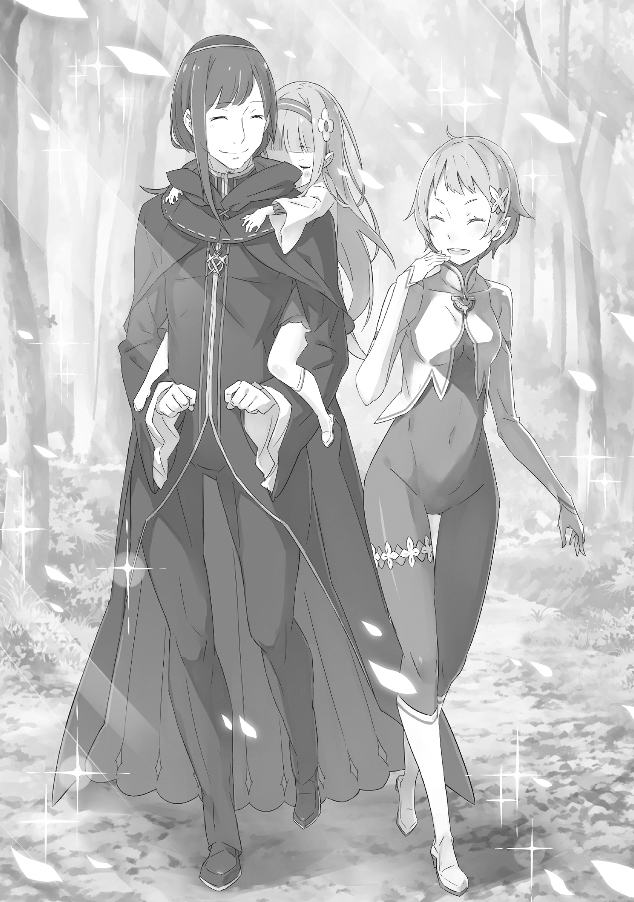

Семилетняя Эмилия столкнулась с величайшим испытанием за всю свою жизнь

За ней уже давно закрепилась слава неисправимой озорницы. По всему лесу можно найти её несмываемые «художества», да и лакомиться сладостями в чужих домах перед ужином для неё обычное дело.

Бывает, она тайком чистит зубы перед завтраком, потому что забыла сделать это на ночь, — взрослые просто не знают, куда деваться от её своеволия. Поистине, Эмилия — несравненный гений, величайшая проказница своего времени.

Однако даже она понимает, когда ситуация становится по-настоящему безвыходной. Например, сейчас…

— Беда! Беда, на помощь!

В лесное поселение ворвалась женщина с перекошенным от ужаса лицом — красавица с короткими серебристыми волосами и обычно строгим, решительным взглядом.

Фортуна, всегда старавшаяся сохранять хладнокровие и вести себя сдержанно, крайне редко позволяла себе подобную панику, поэтому неудивительно, что собравшиеся на площади эльфы тут же устремили на неё взгляды.

— Госпожа Фортуна, к чему такая спешка… что случилось?

Первым к запыхавшейся женщине обратился высокий зеленоволосый мужчина — Джус, предводитель группы, облачённой в чёрное, и близкий друг самой Фортуны.

Услышав его голос, она подняла голову, и лицо Джуса мгновенно окаменело — столько скорби читалось в её чертах. Лишь один человек в мире был способен довести стойкую Фортуну до такого состояния.

— Неужели… что-то стряслось с госпожой Эмилией?!

— …

В ответ на взволнованный возглас Джуса Фортуна молча повернулась к нему спиной, к которой, свернувшись калачиком, жалась маленькая девочка. У неё были длинные серебристые волосы и прелестное личико, которое сейчас исказила гримаса боли: малышка часто и отрывисто хватала ртом воздух.

— Это же… госпожа Эмилия, что, ради всего святого, произошло?

— Пу… пузико.

— Пузико?

— Пузико… болит…!

Услышав этот полный страдания лепет, Джус побледнел. Смертельно бледный, он тут же забежал вперёд, преграждая путь Фортуне, и взволнованно спросил:

— Госпожа Фортуна, что же такое, во имя всего, это «пузико»?.. Простите моё невежество, но мне неведомо это слово.

— «Пузико» — это живот. Иными словами…

— «Пузико» — это живот! Стало быть, у вас болит живот, госпожа Эмилия?!

— У-угу, так и есть…

Получив разъяснение от Фортуны, потрясённый Джус тут же обратился к Эмилии, желая подтвердить услышанное, и девочка кивнула, всем своим видом показывая, что пузико болит просто нестерпимо.

…И всё это было наглой ложью.

С чего же вообще Эмилии взбрело в голову выдумать эту ложь про больной живот?

Конечно, проще всего списать всё на её озорной характер, но истинная причина кроется в Джусе и его отряде людей в чёрном — или, вернее, в самом существовании Джуса.

Эмилии прекрасно известно: пока её держат взаперти в так называемой «Комнате принцессы», взрослые на площади тайком обмениваются с гостями некими «товарами».

Более того, поскольку однажды ей уже удалось тайком пересечься с Джусом, Эмилия считала, что они теперь друзья, связанные общей тайной. Фортуна наверняка догадывалась об этом, но всё равно продолжала гнуть свою линию: стоило гостям появиться в лесу, как Эмилия тут же оказывалась запертой в своей комнате.

Именно эта обида и породила сегодняшний план — стратегию, согласно которой матушка Фортуна, увидев страдания дочери, непременно запаниковала бы и пошла на уступки.

Замысел был по-детски гениален: разыграть приступ боли в животе ещё до того, как её запрут в «Комнате принцессы», и дождаться, пока перепуганная Фортуна пообещает «сделать ради неё что угодно».

Затем следовало взять с матушки слово устроить встречу с Джусом и лишь после этого раскрыть карты. Этот план был настолько продуман, что Эмилию дрожь пробирала от собственного коварства, однако стоило перейти к действиям, как ситуация приняла совершенно неожиданный оборот.

Фортуна перепугалась гораздо сильнее, чем рассчитывала дочь. Поражённая такой паникой матушки, Эмилия растерялась и упустила подходящий момент для признания, в результате чего Фортуна вынесла её прямо на площадь. Так о мнимом недуге Эмилии узнали абсолютно все обитатели леса.

Если признаться сейчас, что всё это ложь, репутация Эмилии рухнет раз и навсегда. Ей нужно стоять на своём до победного конца.

— У-у-у, у-у-у…

— Эмилия, у тебя и впрямь так сильно болит животик? Ты ведь не притворяешься?

В самый разгар её отчаянной актёрской игры прозвучал вопрос, который бил не в бровь, а в глаз. Задал его Арчи — мальчишка, который вечно находился среди старших и с важным видом корчил из себя взрослого. Он не только знал, что Эмилию обычно оставляют в «Комнате принцессы», но и, похоже, раскусил её спектакль, решив нарочно загнать её в угол. Какой же он всё-таки вредный!

— Арчи, как ты можешь такое говорить?! Разве ты не видишь, как она страдает?!

— Но, госпожа Фортуна, Эмилия ведь даже простудой ни разу не болела. Помните, когда вся деревня слегла от подпорченных яблок? Ей одной тогда хоть бы хны было.

— Вот именно! Раз уж даже такая крепкая девочка, как Эмилия, так мучается, значит, у неё и впрямь нестерпимо болит пузико!

Эмилия лежала в центре площади, изо всех сил продолжая притворяться, пока вокруг неё кипели споры. Фортуна, самый страшный в гневе человек, сейчас полностью был на её стороне. Лагерь скептиков возглавлял Арчи, но даже ему было сложно возражать матушке Фортуне.

И тут в этот конфликт, не проронив ни слова, вмешался Джус. Он опустился перед девочкой на колени, взял её ладонь в свои руки и принялся нежно её поглаживать. В его глазах читалась глубокая скорбь, а лицо было полно тревоги.

— Джус…

— Госпожа Эмилия, вы были так добры ко мне, так ласково со мной беседовали. Прошу, позвольте мне хотя бы помолиться ради вас.

— Помолиться?..

— Да. Боюсь… большего мы сделать уже не в силах.

Джус медленно, обречённо покачал головой. Увидев это, Эмилия в ужасе распахнула глаза. Она перевела взгляд на взрослых: все стояли с мрачными, скорбными лицами. Даже спорившие секунду назад Фортуна и Арчи умолкли. Нет, Фортуна уже не просто молчала — она прикрыла рот рукой, и её плечи мелко дрожали от едва сдерживаемых рыданий.

Для маленькой Эмилии мир в одночасье перевернулся.

Невиданное потрясение накрыло её с головой. Она ведь нисколько не желала, чтобы всё зашло так далеко! Огорчить маму, заставить Джуса так убиваться, причинить боль всем вокруг — это совсем не входило в её планы.

Вот он, результат её жалкой попытки купить чужое внимание ради собственной выгоды.

— Эмилия, мама с тобой. Пусть хотя бы твои последние минуты пройдут в покое…

— Э? А?

— Ах, надо было мне больше с тобой играть. Прости меня, Эмилия.

— А? Постойте-ка…

— Госпожа Эмилия, пусть духи даруют вам своё благословение. Не знаю, есть ли у меня право просить об этом, но я вознесу за вас молитву…

— У-а-а…

Фортуна нежно гладила её по щеке, Арчи закрыл лицо руками, а Джус вложил в свой поклон всю душу… Глядя на это, Эмилия окончательно пала духом.

Более того, под влиянием атмосферы ей начало казаться, что она и вправду смертельно больна и вот-вот умрёт. Слёзы сами собой подступили к горлу, и Эмилия, уже по-настоящему, заплакала навзрыд.

— Бедная, бедная Эмилия. Тебе так больно, что ты даже плачешь…

— Н-не болит… совсем… не болит…

— …?

— Пузико… больше не болит. Боль прошла. Совсем прошла. Так что…

Не в силах больше выносить груз вины и страх собственной смерти, Эмилия наконец созналась во лжи.

Она была готова к тому, что её отругают, но выбора не оставалось. Если положить на чаши весов её собственную «смерть» и слёзы близких, выбор был очевиден.

«Наверное, сейчас у матушки Фортуны и остальных мир перевернётся с ног на голову, прямо как у меня», — подумала она.

Однако реакция оказалась иной.

Разумеется, никто не мог поверить, что девочка, которая только что так мучилась, всё это выдумала. Скорее, они решили, что она лжёт сейчас, пытаясь избавить их от лишних волнений.

«Придётся повторить ещё разок-другой, чтобы до них дошло», — поняла Эмилия.

— Послушай, матушка, животик уже…

— Не болит?

— Угу, да.

Когда Фортуна переспросила, Эмилия покорно кивнула, чувствуя себя преступницей, ожидающей приговора.

Это ведь такой тяжкий грех. Какое же наказание её ждёт? От ужаса у неё всё внутри похолодело. Может, её лишат сладкого на несколько дней? Или начнут укладывать спать раньше обычного? Но худшие опасения Эмилии не оправдались.

— Какое счастье, Эмилия! Как же это замечательно!

— Ва-а?!

Не дожидаясь никаких объяснений, Фортуна подхватила Эмилию под мышки и высоко подняла в воздух. Испуганный писк девочки потонул в радостных возгласах взрослых.

Ликовала не только Фортуна — Арчи, люди в чёрном, все вокруг радовались тому, что с Эмилией всё в порядке. И, конечно же, Джус был среди них.

Пока Фортуна крепко прижимала к себе дочь, Джус протянул руку и нежно погладил по голове Эмилию, которая от такой неожиданности лишь растерянно хлопала глазами.

— Вы здоровы, и это главное, госпожа Эмилия. Но впредь, прошу вас, не заставляйте госпожу Фортуну и нас так сильно волноваться… И прошу вас, обязательно укрывайте животик одеялом, когда ложитесь спать. Умоляю вас.

— У-угу, я поняла… Прости меня, Джус.

— Не извиняйтесь — лучше поблагодарите. Забота о дорогих людях не может быть в тягость. А потому, если для вас сделали что-то хорошее, нужно не просить прощения, а говорить «спасибо».

— …Спасибо, Джус.

В ответ на мягкую улыбку Джуса Эмилия произнесла слова благодарности, а не извинения.

Вместо «прости» говори «спасибо».

Эти слова почему-то глубоко запали ей в душу — они отпечатались в детском сознании как важная истина. Эмилии захотелось так поступать, нет — она почувствовала, что обязана так поступать.

— И тебе спасибо, матушка. За то, что так волновалась…

— Да уж, это точно. Я ужа-а-асно перепугалась. Больше так не делай, ладно?

— Угу. Я приму меры по урегулированию данного вопроса.

— …Ну что за ребенок? И где только она нахваталась таких словечек?

Услышав столь неожиданный ответ от любимой дочери, Фортуна сперва озадаченно нахмурилась, но уже в следующее мгновение её лицо озарила прекрасная улыбка.

— Прости, Джус, что втянула тебя в этот нелепый спектакль.

— Ну что вы, вовсе нет. Если это ради госпожи Фортуны и госпожи Эмилии, вы можете распоряжаться мной как угодно… Хотя, признаюсь, поначалу у меня сердце в пятки ушло.

С этими словами Джус с кривой усмешкой взглянул на шагающую рядом Фортуну, а затем, слегка подпрыгнув на ходу, поудобнее перехватил свою ношу, чтобы Эмилия не сползла.

Девочка, доверив свой вес его широкой спине, совсем выбилась из сил и крепко спала. Сейчас она лишь мило посапывала, полностью сосредоточившись на важном деле: старательно пускала слюни на чёрную рясу Джуса.

— Ох, Эмилия, ну и слюней же ты напускала… Интересно, найдётся ли у меня дома запасная мантия?

— Пустяки, не стоит беспокойства. К тому же, если это слюни госпожи Эмилии, то для нас это сродни благословению. Не будет преувеличением назвать их священным даром, не так ли?

— Это огро-о-омное преувеличение, да и звучит, если честно, о-о-очень жутко…

Услышав столь странное, явно выходящее за рамки здравого смысла суждение Джуса, Фортуна с горькой усмешкой покачала головой. В её аметистовых глазах отразилось безмятежное лицо спящей дочери.

— Надеюсь, этот случай станет для неё уроком, и она перестанет выкидывать такие номера, — вздохнула она.

— Не сомневаюсь, она глубоко раскаялась. К тому же, её неумение скрывать правду выглядит даже мило. Я лишь непрестанно молюсь, чтобы она и дальше росла такой же здоровой и крепкой.

— Если она и повзрослев останется такой же, мне будет страшно спускать с неё глаз. Боюсь, даже если я передам обязанности Стража Арчи, то всё равно не смогу отойти от неё ни на шаг… Хотя, это верно и сейчас, да?

Любимая дочь была такой милой, но доставляла столько беспокойства, что Фортуне просто нестерпимо хотелось всегда быть с ней рядом.

Почувствовав в словах Фортуны глубокую привязанность, Джус ничего не ответил, лишь позволил губам тронуться в мягкой улыбке. На какое-то время двое взрослых погрузились в уютное молчание.

Однако…

— Матушка — плакса… совсем как Джус…

Тишину нарушило невнятное, сбивчивое сонное бормотание Эмилии. Услышав его, Джус и Фортуна невольно переглянулись и дружно прыснули со смеху.

— Судя по её снам, ещё неясно, кто здесь за кем присматривает.

— Уверен, она вырастет достойной девушкой. Вы, госпожа Фортуна, в детстве тоже были такой непоседой, и поглядите…

— Не смей припоминать то, что было десятки лет назад! Вечно одно и то же с теми, кто знал меня ребёнком! …И прекрати уже обращаться со мной как с маленькой!

Фортуна резко огрызнулась на неосторожное слово Джуса и, надув губы, демонстративно отвернулась. Увидев такую реакцию, Джус тут же запаниковал и принялся сбивчиво оправдываться:

— Нет-нет, я вовсе не то имел в виду, прошу, поймите правильно…

— Ну всё… хватит браниться… м-м…

— …Ну что за ребенок? И где она только набралась таких слов?

Услышав эту реплику любимой дочери, Фортуна сперва озадаченно нахмурилась, но уже через мгновение её лицо озарила прекрасная улыбка.

И эта перепалка продолжалась ровно до тех пор, пока Эмилия, решившая даже во сне выступить миротворцем, вновь не заставила их обоих расплыться в счастливых улыбках.

《Конец》
