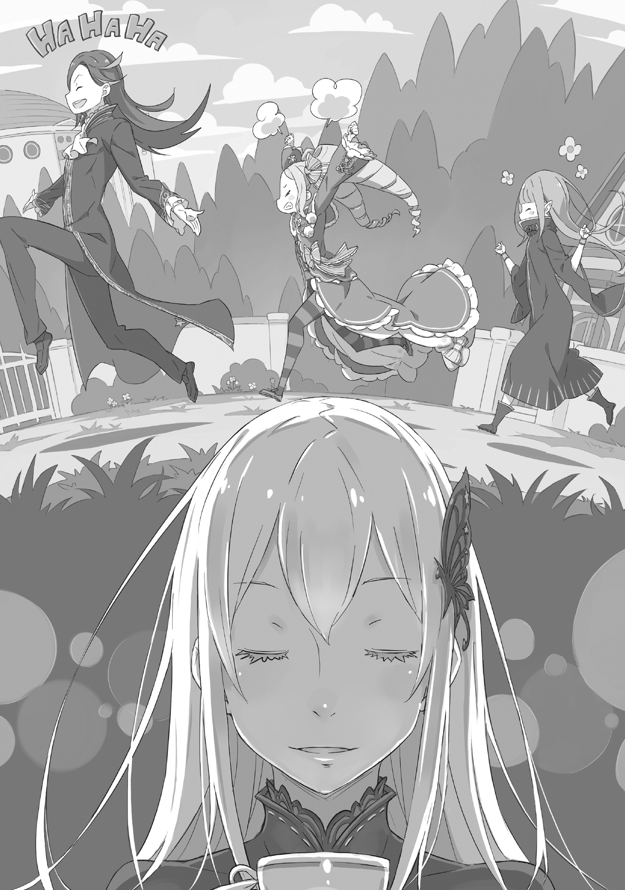

В глубине моего тела таилась жгучая беспомощность.

Она была обжигающей, как лёд, оцепеняющей, как огонь, невесомой, как давление, легкомысленной, как отчаяние, мутной, как свет, единственный отблеск в падении сквозь тьму.

«Ах, ах, больно…»

Стиснутые зубы, тело, пытающееся вытерпеть всепоглощающее чувство.

Если бы это была обычная боль, плач или стон помогли бы. Но это необычное ощущение, гнетущее возбуждение, освежающее удушье, каждое чувство, бурлящее в центре моего тела, было пересечением нормального и ненормального.

Даже врач ничего не мог сделать. Никто не мог понять эту боль.

И всеобщее безразличие к невиданным вещам, которые они не могли понять, было пугающим. Боль, которую нельзя было представить, была болью, которая не могла существовать, и поэтому моя семья относилась ко мне как к обузе.

Этот ребёнок был талантлив, невероятно талантлив. Но его недостатки были смертельно опасны. Все, неважно кто, всегда говорили об этом.

Периодическая боль поражала независимо от времени и места, будь то во время важных церемоний, обязательств перед другими людьми или решения семейных вопросов.

Попав в такое состояние, я впадал в безумие. Было очень мало людей, которые воспринимали бы стонущего и бьющегося с пеной у рта человека как равного. По крайней мере, никто в моей семье не оказывал мне такой любезности.

Поэтому эту боль нельзя было никому передать, и мне пришлось принять её как свой собственный грех.

По мере того, как шли годы, и её интенсивность возрастала, я привык прятаться там, где меня никто не мог найти, как только я начинал чувствовать, что она меня одолевает.

На этот раз я, к счастью, находился поблизости от своей комнаты, где мог оставаться в течение следующих нескольких часов. Хотя сама боль будет продолжаться несколько дней, я смогу вести себя нормально уже через несколько часов. Мне просто нужно подождать, и…

???: Понятно. То, что ты смог пройти через это и не сойти с ума, впечатляет.

«Кто, кто ты!?»

Как раз перед тем, как я закрыл дверь и лёг на кровать, в поле моего зрения мелькнула незнакомка. Она сидела на кровати, наблюдая за мной.

«Что…»

Стоя перед ней, я не мог успокоить дыхание. Это было больше, чем удивление, это был экстаз.

Женщина, одетая в чёрное, с волосами цвета белого снега. Она сузила свои тёмные, изысканные глаза, глядя на меня с невозможной красотой. Словно мои страдания требовали нового стимула и давали мне иллюзию нереальной красоты.

Однако, словно в доказательство того, что она не иллюзия, красавица встала, приложив белый палец к моей груди, когда я замер. И,

???: Не зная, как правильно рассеивать ману, ты выглядишь действительно жалким.

«Ах, ха… гу…»

Нахмурившись, я не понимал, почему эта ослепительная женщина лишила меня дара речи. Внезапно я не смог подавить тошноту, бурлящую в моем желудке.

Затем мой наполовину растворившийся обед пролился и на мою изысканную одежду, и на руку женщины, касавшуюся моей груди. Едкий запах наполнил комнату, а стыд пылал красным пламенем на моём лице.

Стыд преобладал над болью не потому, что меня вырвало на глазах у кого-то, а потому, что я испачкал женщину, стоявшую передо мной. Сколько бы я ни раскаивался в своём позоре, этого было не изменить.

Хотя я хотел немедленно извиниться, даже с учётом всего этикета, которому я научился до сих пор, я не мог найти слов для извинения.

Поэтому, когда женщина снова зашевелилась, мой пустой разум уже отказался от размышлений.

Она приблизилась так близко, что я чувствовал её дыхание, и ещё ближе, пока даже дыхание не стало глухим. Это был поцелуй.

Женщина прикрыла рот, из которого меня только что вырвало, своими губами персикового цвета.

«Эээ…?»

Вот так наши дыхания переплелись. Всё это произошло так неожиданно, что я не успел среагировать и беззащитно принял её поцелуй. Впервые я испытал ощущение тёплого, мягкого языка, проникающего сквозь зубы в мой рот. Мой мозг полностью отключился, и все оставшиеся рациональные мысли сгорели.

Через мгновение, или несколько секунд, или даже десятки секунд наши губы наконец медленно разошлись. Они остались соединёнными шелковистыми жидкими нитями, которые женщина аккуратно оборвала пальцами.

???: Ну как? Чувствуешь себя немного комфортнее?

«Ух…»

Поражённый её неожиданным вопросом, я не знал, что ответить. Пока я стоял неподвижно и выглядел как дурак, женщина хмыкнула, снова положив руку мне на грудь.

???: Твоё сердцебиение всё ещё довольно быстрое. Но избыток маны должен был быть извлечен непосредственно мной, так что…

«Ты, что ты со мной сделала! Да ещё и как женщина…»

???: А…?

Я схватился рукой за грудь, сомневаясь в её необдуманном поступке. Женщина выглядела удивлённой, подняв брови и переводя взгляд с одной руки на другую, прежде чем ответить.

???: Только регулярно регулируя свою ману, тело и душа могут поддерживать баланс. Всё, что чрезмерно, служит лишь ядом. Это, само собой разумеется, а для тебя должно быть ещё более очевидным.

«Мана… которая… связана с магией?»

???: Иметь столь поверхностное понимание… Нет, лучше сказать, что знание даже этого необычно. Твоя смерть из-за этого — не то, что я могу принять.

Медленно покачивая головой влево и вправо, женщина не пыталась скрыть своего разочарования. Я подумал о том, что она сказала раньше. Если она не сболтнула лишнего и если я не ослышался, тогда,

«Вы знаете причину моей болезни?»

???: Это не болезнь как таковая, а нечто прискорбное, что случается с избранными, талантливыми людьми. То есть, это “Период Маны”.

«Период… маны?»

???: Это невероятно редкое явление, настолько редкое, что до сегодняшнего дня никто не мог понять вас.

И эти слова привели к выводу.

«Я…»

???: Эту твою боль я могу понять. Будучи ребёнком, моё плохое использование врат маны привело к накоплению избыточной магии. Вместе с ней пришла ужасная боль, которую никто не мог понять.

«Ах…»

Как только я услышал эти слова, моя последняя линия защиты пала, и слёзы начали струиться из моих голубых глаз. Когда я разразился рыданиями, мои колени подкосились, и я упал на пол, закрыв лицо руками. Женщина опустилась рядом со мной на колени и нежно погладила мои дрожащие плечи.

«Тогда… тогда, кто ты?»

???: Я Ведьма. Зло, которое иногда склонно к милосердию. А ты?

«Я….»

Пока самопровозглашенная Ведьма допрашивала меня, я затаил дыхание, не решаясь ответить.

Дома меня считали обузой и говорили, что я не принадлежу этому месту. Я тоже постепенно пришёл к убеждению, что так оно и есть, и даже произнесение фамилии вызывало у меня чувство вины.

Но в этот момент, только в эту секунду, я почувствовал, что мне не позволено испытывать даже этот стыд.

«Я…»

Розвааль: Вот так я и встретил Учителя.

Синеволосый юноша смущённо улыбнулся, почесав пальцами щеку.

Его рассказ слушали персикововолосая девушка и девушка, которая носила волосы в форме причудливых свёрл — этих двоих звали Рюдзу и Беатрис.

Все трое собрались в прачечной в Святилище Леса Кремальди.

Свежевыстиранная одежда висела на верёвках, протянутых между деревьями, и сушилась на ветру. В свободное время Розвааля расспрашивали о его прошлом.

История началась с того, что любопытная Рюдзу случайно спросила: «Как господин Розвааль познакомился с госпожой Ехидной?»

Чтобы ответить на этот вопрос, Розвааль начал свой рассказ, и Беатрис, которая, по её собственным словам, случайно проходила мимо, тоже остановилась послушать.

Действительно, Беатрис была совсем не честна, решил Розвааль с язвительной улыбкой.

Рюдзу: Я… эм… Розвааль-сама, мне очень жаль.

Розвааль: Хм?

Столкнувшись с криво улыбающимся Розваалем, Рюдзу в панике опустила голову. Она продолжила,

Рюдзу: Потому что я так небрежно спросила о такой личной вещи… Мне стыдно.

Розвааль: Вовсе нет. Если бы было что-то, о чём я действительно хотел избежать разговора, я бы это обсудил. То, что я этого не сделал, произошло потому, что я хотел показать свои воспоминания об Учителе. Именно потому, что моё незрелое прошлое «я» было таким постыдным, моя первая встреча с Учителем стала для меня такой особенной.

Оглядываясь назад, можно сказать, что возможность того, что он не встретил бы своего учителя, Ехидну, облила его холодным потом.

Без её слов Розвааль не заметил бы особенности своих врат и предположил бы, что боль, которую он испытывал от маны, была вызвана неизвестной болезнью. Он не смог бы ничего сделать, кроме как продолжать одинокую борьбу с ней.

И, возможно, он бы давно умер.

Розвааль: То, что этого не случилось, и то, что я успешно отомстил за своих родителей и братьев и узурпировал дом Мейзерс, — всё это благодаря Учителю.

Рюдзу: Так вот оно как. Это… подожди, узурпировал…?

Почувствовав беспокойство, восхищенный взгляд Рюдзу превратился в растерянный. Увидев её реакцию, Розвааль ослабил своё напряжённое выражение лица и повернулся к человеку рядом с Рюдзу.

Там, скрестив свои короткие руки, отвернув голову и приняв безразличное выражение лица, стояла Беатрис. Возможно, она притворялась, что не слышит. Во всяком случае,

Розвааль: Бетти, так тебе нравится история про меня и Учителя?

Беатрис: Что значит «так мне нравится»? Я совершенно, совершенно не слушала. И я не давала тебе разрешения называть меня Бетти, так что перестань так фамильярно обращаться ко мне. Кроме того, я полагаю, Мама слишком непринужденно общается с людьми, с которыми только что познакомилась.

Розвааль: Это был всего лишь тот единственный шанс, который у меня был с ней. Но я помню все слова Учителя, сказанные тогда.

Дав ему слова, которые он должен был услышать, даровав ему спасение в виде сочувствия. Несмотря ни на что, Ехидна, безусловно, спасла его. И она ничего не просила взамен.

Акт милосердия, сказала Ехидна. И это оказалось правильным решением. Беатрис: Значит, она ничего не просила, и вот ты пытаешься отплатить ей. Ты очень беспокоишь маму, на самом деле. И Бетти тоже, я полагаю.

Рюдзу: Беатрис-сама, говорить это немного… и я тоже понимаю чувства Розвааля-самы, ведь я тоже та, кого спасла Ехидна-сама.

Беатрис: Хмф…

Беатрис в ответ на упрёки надулась. Рюдзу, упрекавшая её, прикоснулась пальцами к своим длинным ушам, символу её получеловеческой национальности.

Для неё ухо представляло нечто значительное, как и получеловеческая кровь, текущая по её венам. Даже за свою короткую жизнь Рюдзу уже успела так много выстрадать из-за этого.

Это сожаление нельзя было стереть, но пребывание здесь немного смягчало его боль.

В этом ключе Розвааль тоже выпрямил грудь и с гордостью носил свой статус ученика Ехидны.

И стремился однажды сделать для неё то же, что она сделала для него.

Беатрис: Фу, какой бессовестный человек. Искать «спасибо» — это просто жалко. С такими темпами ты ещё сто лет не приблизишься к Маме, я полагаю.

Рюдзу: Но разве Беатрис-сама не говорит, что «ты должен быть полон благодарности»?

Беатрис: Между Бетти и Розваалем, кто же твой друг?

Как будто она была запрограммирована на это, Рюдзу немедленно бросилась к Беатрис и начала извиняться. Хотя это был всего лишь любопытный вопрос, почтительная Рюдзу раскрыла свой ответ. С точки зрения их дружбы, Розвааль проиграл Беатрис.

Ради Ехидны, которая спасла его, чтобы протянуть ей руку помощи, Розвааль потратил годы на то, чтобы заслужить то место, на котором он сейчас находится. Благодаря этому он освоил семейное дело и получил место в дворянском сословии, но межличностных отношений ему не хватало.

Он ушёл от родителей, отдалился от братьев и полагался не на симпатию, а на талант. В результате у него было много ассоциаций, даже сейчас, но у него не было возможности сократить дистанцию с ними.

Поэтому, глядя на отношения между Беатрис и Рюдзу, Розвааль невольно улыбался. Его счастье за них взяло верх над любой завистью, которую он мог бы почувствовать.

У неё была Мать, друг и долг, поэтому она не чувствовала одиночества. Если бы сам Розвааль мог стать одним из её друзей, он был бы доволен.

Беатрис: Что это за странный нежный взгляд у тебя. Это раздражает, я полагаю.

Беатрис начала атаку на Розвааля, который молча наблюдал за обменом мнениями. Её милое личико надулось, когда она направила на него короткую руку.

Беатрис: Если у тебя есть что сказать, просто скажи это, в самом деле! Я выслушаю тебя, я полагаю.

Розвааль: Я люблю тебя, Беатрис.

Беатрис: Что это за отвратительные слова, в самом деле!?

Розвааль: Фу, я уже в ужасе.

Будучи услышанным, он отказался от своих слов, так как Беатрис начала суетиться.

Розвааль, обнаружив, что попал в беду, тут же вскочил на ноги и бросился бежать, а разъяренная Беатрис бросилась за ним в яростную погоню. За ними увязалась Рюдзу, которая пытался догнать их, принимая белье.

Розвааль: Ха-ха, посмотрим, сможешь ли ты меня поймать!

Беатрис: Ты, как ты смеешь играть со мной! Я поймаю тебя и заставлю пожалеть об этом!

Рюдзу: Беатрис-сама! Розвааль-сама! Подождите меня!

Шумная троица отбросила свою работу, начав играть друг с другом.

Глядя на них издалека, одна Ведьма тихо пробормотала про себя:

«…брат и сестра не могут разрешить спор без шума. Честное слово».

《Конец》
