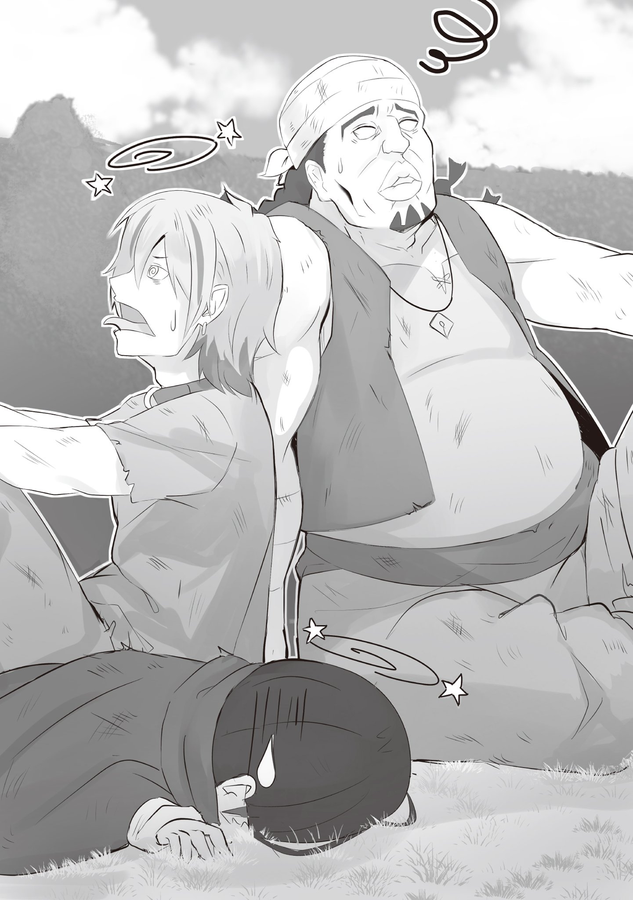
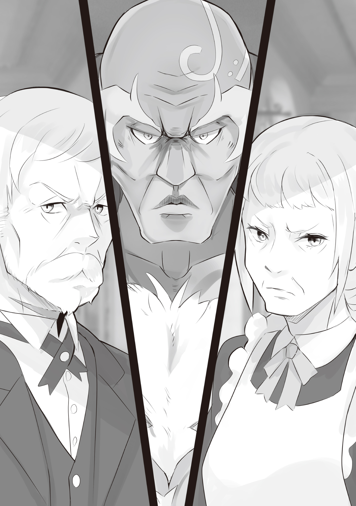
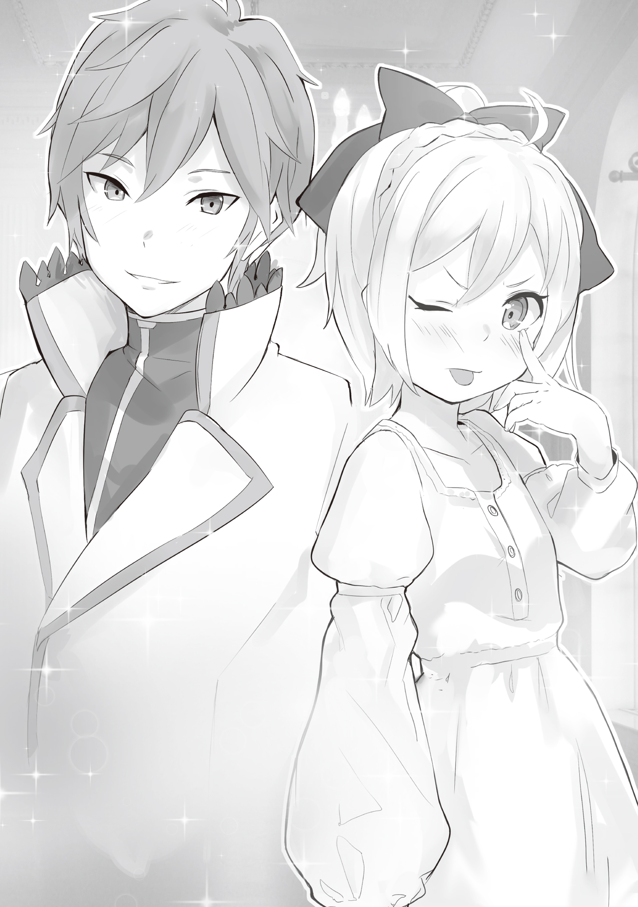
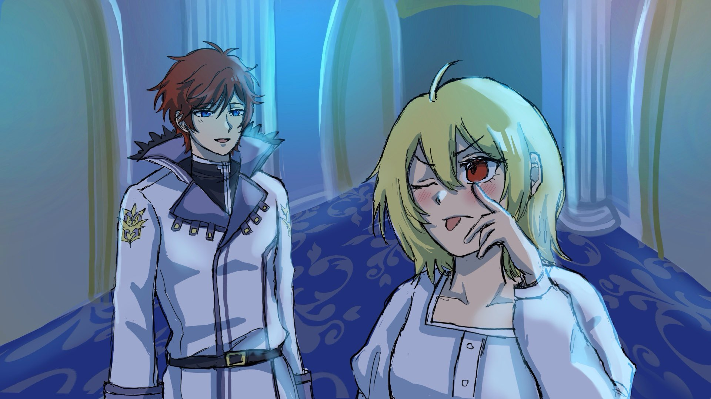

Английский перевод: Negimiso

Русский перевод: Перакстаз

Фан-арты: Pon

…С тех пор как она была маленькой, она продолжала видеть один и тот же сон.

Сон, который начинался в слабо освещённой комнате.

В комнате, куда проникал лишь лунный свет, она смотрела в потолок. Он был высоко. В этом сне она не столько лежала на кровати, сколько была всунута в маленькую коробку.

— …Ты в этом уверен?

Внезапно она услышала чей-то голос.

Когда она попыталась взглянуть туда, откуда он исходил, её тело не двинулось. Это было не из-за того, что всё это было сном. Даже если бы это был не сон, в этот момент её тело просто не двигалось так, как она желала.

Каким-то образом она просто знала, что это было правильно.

— Да, я уверен. Я уже могу представить возражения моего брата или жены, если они когда-нибудь узнают.

Ещё она могла слышать ответ голоса, отличавшегося от первого.

Похоже, кто-то с кем-то разговаривал, стоя по разные стороны её коробки.

Голоса были одновременно знакомы и незнакомы.

Возможно, причина неоднозначного восприятия голосов была её собственной проблемой. Однако она отчетливо ощущала, какие эмоции бурлят в них.

Знакомый голос был наполнен отвращением, а незнакомый — любовью.

Хотя ни отвращение, ни любовь не были тем, чего она желала или жаждала.

— Я должен вам всем. Если я смогу вернуть свой долг, то я не против взяться за эту работу.

— Спасибо. Прошу прощения за неудобства, ***.

— Тебе не стоит волноваться обо мне. Не о том человеке ты беспокоишься.

— …Ты прав.

Холодный, резкий голос и голос, который твердо контролировал эмоции.

В коробке, где она должна была видеть лишь потолок, её взгляд наткнулся на кого-то, кто заглянул внутрь. По какой-то причине на это лицо упала тень, замазав его чернотой и не давая разглядеть.

Однако она знала, что этот человек был обладателем золотых волос и красных глаз.

— …

Человек осторожно поднял её тело, вынимая её из коробки.

Он был довольно большим — нет, это она была маленькой. Почти как если бы она была младенцем. Обладатель голоса с лёгкостью держал её, тихонько покачивая.

— Ах, ты тёплая. И ты становишься тяжелее… Однажды наступит время, когда ты так вырастешь, что моих рук будет недостаточно, чтобы держать тебя, — сказал мужчина, обнимая её.

Его голос звучал так, словно он дрожал. Когда мужчина держал её на руках, она чувствовала его сердцебиение. Это был странно успокаивающий звук, от которого ей хотелось плакать.

— …Остальное я оставлю на тебя.

Внезапно её уши оторвали от звука.

Мужчина передал младенца человеку, стоявшему напротив. Ладонь того была мозолистой, огромной и была с ней так же груба, как и её впечатление о нём.

Она чувствовала себя не в своей тарелке — совсем не так, как секунду назад. И это было не только из-за огрубевшей кожи ладони.

— Протягивать руку какому-то человеку… Как низко я пал.

Человек, который положил её на свою ладонь, уставился на неё взглядом, исполненным смесью отвращения и презрения.

Это глубоко раздражало сердце младенца.

Ей это не нравилось. Ей хотелось кричать. Однако её маленькие конечности не могли вырваться на свободу.

— …

Она была обхвачена огромной ладонью и была лишена даже возможности открыть рот. Тяжело ступая, мужчина начал уходить. Её уносили из знакомой комнаты, уносили от успокаивающего мужчины.

Она этого не хотела. Не хотела. Она ненавидела это.

Она молила, чтобы этот мужчина остался с ней. Она хотела, чтобы он был рядом. Она не хотела, чтобы он отпускал её.

И всё же…

— …Я люблю тебя. Всегда и навечно.

Бесполезный голос, не приносящий никакого облегчения. И это было последним, что он сказал ей.

— …А, уже утро.

Её веки согрело утреннее солнце, пробивающееся через щель в занавесках, и её сознание выплыло на поверхность.

Чувствуя, как всё её тело окутывает ощущение мягкой постели, девочка села, притягивая к себе простыни. Она потрепала свои золотые волосы длиной до шеи и, зевнув, рассеянно повернула голову.

Перед её затуманенным взором предстала комната, которую она слишком привыкла видеть за эти два месяца.

— Боже, а комната всё такая же бесяче огромная.

В роскошной комнате, которой позавидовал бы любой, девочка недовольно заворчала, сползая с кровати высочайшего качества.

Только что проснувшись, она стояла на мохнатом ковре, а на её бледном теле не было ничего, кроме нижнего белья. Для своего возраста она была небольшого роста, и её телу не хватало женственных изгибов, однако в пропорциональном лице и волевых глазах таился проблеск красоты, дававший ей надежду на будущее, когда её очарование расцветёт цветком.

Её звали Фельт. Раньше она была известным проблемным ребёнком, жившим в трущобах Королевской Столицы и зарабатывавшим воровством… Однако сейчас у неё было до дикости другое положение.

И основным фактором драматичного изменения обстановки вокруг неё был…

— …Вы проснулись, леди Фельт?

Когда в дверь комнаты постучали, Фельт услышал с той стороны безупречный, красивый голос. Просто слушая его, можно было надеяться, что у его обладателя было чистое сердце и элегантная внешность.

На самом деле, когда в Столице люди смотрели на обладателя этого прекрасного голоса, большинство женщин испускали крики восхищения, а затем падали в обморок. Но даже если и так, Фельт, будучи очень молодой женщиной, скривила губы с явным отвращением.

А затем, глядя на обладателя голоса с другой стороны двери, она добавила:

— Неа. Я не проснулась. Я не проснулась, так что не входи.

— Вы можете поддерживать диалог, говоря во сне? Если это так, то вы развили новый талант, о котором я не знаю.

— Ты чертовски раздражаешь…

Когда она щёлкнула языком в ответ на то, как он не распознал в её тоне сарказм, дверь медленно открылась.

В этот момент появился высокий, молодой и утончённый мужчина, одетый в рубашку и брюки. Его красные волосы, напоминающие языки пламени, и голубые глаза цвета лазурного неба были его отличительными чертами. Ещё больше его отличало неприятно красивое лицо, он улыбался Фельт такой улыбкой, которая заставила бы упасть Столичных девиц.

Но как только он вошёл в комнату и заметил вид Фельт, его улыбка исчезла.

— Леди Фельт… Хоть это и ваша комната, но женщина, разгуливающая в одном нижнем белье, немного…

— Я только проснулась. К тому же, я ведь уже сказала тебе не входить. Это ты тот, кто не послушал, так что не вини меня.

Будучи одетой лишь в своё нижнее бельё, Фельт стояла посреди комнаты, скрестив руки и выпятив свою тощую грудь. Молодой человек нахмурился, отводя взгляд от лихой позы.

Это взаимодействие происходило между молодыми мужчиной и женщиной, но в нём не было неловкости. Фельт видела человека перед собой как нечто другое, нежели мужчину.

Фельт фыркнула, глядя на парня, который отводил от неё взгляд.

— О, величайший рыцарь среди рыцарей способен возбудиться от жалко выглядящего тела вроде моего? Если это так, то мне надо быть ещё более осторожной со своим окружением, не так ли?

— Пожалуйста, не унижайте себя словами вроде «жалко выглядящего». У вас есть уникальный шарм, присущий лишь вам. К тому же, совершенно нелепо для рыцаря, если его сердце будет тронуто его госпожой.

— Кто сказал тебя утешать меня по поводу моего тела?! Пошёл отсюда!

Она швырнула подушку со своей кровати, но молодой человек легко поймал её и с вежливостью отступил из комнаты на шаг. Он вышел в коридор и медленно согнулся в поклоне.

— Завтрак готов. Тётушка тоже ждёт, так что, пожалуйста, приходите в столовую.

— Поняла я, поняла. Просто свали.

— Понял. Прошу прощения, мне надо уходить. А ещё, леди Фельт…

Пока Фельт полусерьёзно махала рукой, словно отмахиваясь от жука, молодой человек улыбнулся ей, с размаху швырнув полученную подушку обратно на кровать. Затем, сохраняя на лице прежнее выражение, он сказал:

— Доброе утро.

— …Эта часть тебя просто никогда не проваливается в том, чтобы выбесить меня. Пошёл к чёрту отсюда, Райнхард!

Первый гневный крик Фельт за это утро разлетелся в четыре стороны, но его заблокировала дверь, которая была тихо закрыта.

Раздражённая ощущением, что она «проиграла» спор без особой на то причины, Фельт достала из шкафа свою одежду и поспешно сняла нижнее бельё.

В качестве единственного акта неповиновения, который она могла совершить, она решила выбрать наряд, который мог бы не понравиться Райнхарду.

…Причина, по которой Фельт оказалась в сопровождении Райнхарда и оставалась в его особняке, заключалась в нескольких событиях и случайных, неизбежных обстоятельствах, которые оказались тесно переплетены между собой.

Райнхард называл всё это «судьбой», но Фельт терпеть это не могла.

Она не могла смириться с тем, что, по его мнению, всё было предрешено с самого начала. Более того, у них была самая отвратная встреча, и процесс их знакомства был не менее ужасен. Учитывая и без того непростые отношения между ними, одна мысль о том, что всё между ними было предопределено, приводила её в ужас.

Для Фельт это было всё равно что сказать, что ей суждено вытянуть короткую соломинку.

Таково было честное мнение Фельт, получившей статус госпожи Райнхарда ван Астрея, рыцаря среди рыцарей, которому завидовали все в Столице.

— О, Фельт. Ты сегодня встала довольно рано.

— А.

Как только Фельт оделась и вышла из своей комнаты, она наткнулась на огромный человеческий силуэт. Это был громадный мужчина, гигантский настолько, что миниатюрной Фельт приходилось смотреть на него снизу вверх.

Если бы они встретились в подворотне, разница в их телосложении заставила бы Фельт приготовиться к смерти. Однако, к счастью, это был не безлюдный переулок, и она не была незнакома с этим человеком.

Собственно, говорить об этом было излишне, поскольку между ними были тесные и длительные отношения.

— Утра, дедушка Ром. Не то чтобы я хотела рано вставать, но если я остаюсь в этом особняке, меня вечно будят как добропорядочного гражданина.

Её лицо просветлело, и Фельт побежала к человеку, которого назвала «дедушкой Ромом» — огромному лысому старику ростом больше двух метров. На её лице застыло умилённое выражение, выглядевшее несравненно очаровательнее, чем когда она общалась с Райнхардом.

Плечи Рома затряслись от смеха, когда Фельт высвободила милый шарм, присущий её возрасту.

— Вахаха, быть добропорядочным гражданином вполне неплохо, учитывая то, что ты крошечная для своего возраста. Если будешь хорошо есть и вести упорядоченную жизнь, то вырастешь.

— С твоей точки зрения почти не будет разницы, если я вырасту или уменьшусь. Типа, совсем.

— Это неправда. Даже если я такой, я внимательно слежу за твоим ростом.

Когда он это сказал, по его глубоко изрезанному морщинами лицу расплылась улыбка, и Ром грубо похлопал её по голове.

Фельт вспомнила, как в детстве думала, что её голова в таких случаях может отвалиться, но ощущение мозолистой ладони не вызывало у неё неприязни. Более того, ей это нравилось.

Было время, когда ей не хотелось, чтобы к ней относились как к ребёнку, но, честно сказать, подобные моменты лучше всего заставляли её расслабиться.

В этот момент слабо освещённая комната из её снов пришла ей на ум.

— …

— …Хм? В чём дело, Фельт?

— А, э, ничего. Не обращай внимания. Ты нормально спал?

Фельт улыбнулась и спросила его, стряхивая странное сентиментальное чувство, которое охватило её грудь. Получив вопрос и потирая свою лысую голову, Ром ответил: «Не говори глупостей».

— Если ты спрашиваешь меня о том, смог ли я поспать или нет, то, да, я спал. Но не могу сказать, что это было приятно.

— Правда. Жизнь тут слишком отличается от того, что мы знаем.

— Ага. Хотя это не единственная причина моего дискомфорта…

Ром наклонил голову набок и положил руку на подбородок, а Фельт скопировала жест. Он засмеялся на её имитацию и похлопал её по спине, призывая идти.

— Эй, похоже, завтрак готов. Я могу возлагать большие надежды на его вкус, верно?

— Ага. Еда бабушки капец какая вкусная. Но лучше всего у неё выходят закуски.

Ром молча слушал хвастливые похвалы Фельт, кивая, когда она что-то говорила. Они продолжили свою приятную беседу, пока шли по коридору.

— Хм? О-о-о, они опять это затеяли.

Остановившись перед окном, Фельт в него заглянула. Под ней расстилался зелёный сад особняка, принадлежащего Райнхарду, где разворачивалась уже знакомая ей сцена.

— …Какого чёрта они творят?

— Дело в том, что их искривлённые личности так просто не выпрямляются, так что они в процессе вбивания их характеров на место.

Ром спросил, стоя рядом с Фельт, а она ответила, положив руки на подоконник и положив на них свой подбородок.

В саду, где царила расслабленная атмосфера, где благоухала свежая трава и цвели цветы разных оттенков, трое мужчин растянулись на траве, валяясь друг на друге.

Вид у них был довольно грубый, и лежали они без сознания.

А рядом с этой троицей пожилой мужчина ухаживал за газоном. Его выражение лица оставалось равнодушным, когда он с отработанной легкостью привёз тачку, без особых усилий погрузил в неё троих мужчин и покатил их к задней двери особняка.

Наблюдая за процессом от начала до конца, Фельт улыбнулась, показывая клычок.

— Видимо, им больше некуда было податься, потому что они разозлили большую шишку, так что они решили последовать за нами в качестве последнего средства, но передумали после одной ночи и собирались сбежать. А потом посреди побега их застукал дедушка, и они отхватили люлей.

— Понятно. Полагаю, это типичный вывод, но ты это предвидела?

— Если бы мы могли понимать друг друга, просто разговаривая, то их бы здесь не было, ни в хорошем, ни в плохом смысле. Разве не интереснее заставить этих мерзких парней таскаться с нами?

Фельт не испытывала неприязни ни к тем, кто никогда не знал, когда сдаваться, ни к тем, у кого был неприемлемый характер. Место, где ей довелось жить, было притоном, полным таких людей.

Несомненно, эта троица была отражением окружения, в котором выросла Фельт. Однако, несмотря ни на что, она не стала бы слепо и оптимистично заявлять, что это хорошо.

— Это следует описать как терпимость или оптимизм?.. Возможно, это в крови.

— Хм? Ты что-то сказал, дедушка Ром?

Фельт сложила руки за головой, развернувшись к Рому, когда он что-то пробормотал. В ответ на её слова он лишь пожал своими широкими плечами.

— А, я просто сказал, что проголодался. Давай, пошли быстрее.

— Да-да, поняла.

Подгоняемая к тому, чтобы поторопиться, Фельт потащила Рома за собой, начав идти по особняку. Она не хотела этого, но за два месяца она привыкла к своей жизни здесь.

По крайней мере, до такой степени, чтобы идти подпрыгивающей походкой, направляясь в столовую.

— Утра!

С предвкушением завтрака в сердце Фельт прибыла в столовую, приведя с собой Рома. Открыв большие двери и войдя в комнату, она увидела, что длинный стол уже заставлен дымящимися тарелками с завтраком.

А затем, обернувшись к радостной Фельт, две тени поклонились ей.

— Конечно, леди Фельт. Доброе утро.

— …

Пожилые женщина и мужчина ответили на её приветствие мягкими улыбками. Им было поручено управление особняком и, в том числе, забота о Фельт и Райнхарде.

Похоже, что у Райнхарда с ними были близкие отношения, ведь он звал их дядюшкой и тётушкой. В то время как Фельт просто звала их дедушкой и бабушкой.

— …

Райнхард уже сидел за обеденным столом, а трое парней были вынуждены расположиться в одном ряду с ним, закатив глаза к затылкам. Их телосложение было крупным, средним и мелким соответственно, так что легко понять, что они расположились на своих местах по росту.

Кроме того, обычное место Фельт было напротив Райнхарда, а Ром в это утро будет сидеть рядом с ней. Она отодвинула стул Рома, затем устроилась на своём месте и…

— Хорошо. Итак, пора приступать.

— …Никаких проблем, но вы уверены, что не нужно объяснений по поводу этих троих? Я сразу подумал, что они вас удивят.

Райнхард был ошеломлён тем, что Фельт собирался приступить к еде, не упомянув о троице. Прислушавшись к его словам, она почесала пальцем ухо и пробормотала: «А-а-а».

— Я сверху видела, как дедушка принёс их с собой. Плюс, я со вчерашнего дня думала, что всё будет как-то так. Я ведь уже сказала бабушке и дедушке, верно?

— Да. Леди Фельт говорила с нами вчера вечером.

Фельт откинулась на спинку стула, наклонив голову, и тётушка в ответ кивнула. И тут женщина, которая старела с изяществом, хихикнула, бросив на мужа косой взгляд.

— Дедуля рядом со мной, наверное, был рад, что вы на него положились. Неподражаемый для своего возраста, он был полон сил и ждал в саду с рассвета.

— …

Дядюшка безразлично пожал плечами на свидетельство тётушки. Неразговорчивый дядюшка редко произносил хоть слово, поэтому никто не отчитывал его за манеры, которые можно было расценить неподобающими.

Вдруг тётушка посмотрела на Фельт с озорным выражением в своих глазах.

— В любом случае, это довольно интересно. Вы изо всех сил пытались вырваться из особняка, а теперь напоминаете нам, чтобы эти трое не сбежали.

— Эй, эй, тебе обязательно было это говорить?

— Вы хотите сказать, что Фельт пыталась сбежать? Что вы имеете в виду?

Когда Фельт скорчила гримасу из-за замечания, которое она не могла парировать, глаза Рома рядом с ней сверкнули любопытством. Глядя на его реакцию, Райнхард заговорил:

— По правде говоря…

Красноволосый юноша имел безобидный вид, а его голубые глаза путешествовали по всему особняку, как будто он его осматривал.

— Леди Фельт было дано обещание. Если бы она смогла выбраться из особняка незамеченной мной, дядюшкой, тётушкой и другими жителями, то мы не будем выслеживать её против воли.

— Соревнование, значит. В этом есть смысл. Я вижу, как Фельт принимает близко к сердцу, когда кто-то затевает с ней драку. Тогда она, наверное, каждый день страдала от проигрыша.

— Н-не говори так, будто ты на самом деле всё видел… Вот почему я не хотела, чтобы ты об этом слышал!

Ром с самодовольным видом упомянул это, отчего Фельт зарыла красное лицо в ладонях.

Всё началось с того момента, как она была схвачена Райнхардом в трущобах и с его подачи заключена в этот особняк. С тех пор она дала обещание о соревновании, о котором Райнхард рассказывал ранее, и днями и ночами отчаянно искала способ сбежать.

Разумеется, в результате того, что её планы проваливались один за другим, Фельт так и осталась в этом особняке, а в довершение всего произошли вчерашние события.

Они были серьезным делом для Фельт… нет, они были жизненно важны даже для самого Королевства Лугуника.

— Королевский Отбор… битва за трон? Ты что, издеваешься? На кой тебе понадобилось втягивать меня в эту непостижимую ситуацию?

— Если быть точным, то это конкурс на право вступления на трон, а не битва за трон. Соревнование, а не битва.

— Чёртова проблема не в этом. Ты меня неправильно понимаешь.

Фельт уставилась на бесстрастное лицо Райнхарда, выпятив нижнюю губу.

Королевский Отбор — именно такое событие произошло в Драконьем Королевстве Лугуника, грандиозное происшествие, потрясшее страну до самых корней.

Ещё несколько месяцев назад из-за хвори, разразившейся в замке, один за другим угасали члены древней королевской семьи, и в конечном итоге все они скончались.

В результате трон опустел и оказался в тревожном состоянии нестабильности. Королевство оказалось в ситуации, когда нужно было как можно скорее выбрать следующего короля, но в качестве одного из претендентов на трон, словно в шутку, была выдвинута не кто иная, как Фельт.

Человеком, силой втянувшим её в эту непостижимую ситуацию, был Райнхард, сидевший перед ней с невинным выражением лица. И именно это и было его истинной целью, когда он заточил Фельт в особняке.

Конечно, никто не мог безоговорочно стать кандидатом на пост следующего короля. Не говоря уже о том, что Фельт была выходцем из трущоб — беспризорницей, зарабатывавшей на свою жизнь воровством. Что могло пойти не так, чтобы такая, как она, вступила в борьбу за трон? Пожалуй, правильнее было бы усомниться в рассудке Райнхарда.

Однако в замке он во всеуслышание озвучил возмутительную теорию.

Согласно его словам, Фельт была выжившим членом королевской семьи, похищенным четырнадцать лет назад.

Подобная теория вообще не заслуживала внимания, а для ушей Фельт она и вовсе была сущим бредом. Однако в замке Райнхарду поверили на слово и принялись всерьёз изучать возможности. Этот факт тоже был нелепым, поэтому Фельт посмеивалась над ними.

— Из-за истории с дедушкой Ромом всё пошло прахом, да.

Ром пробрался в замок, пытаясь спасти Фельт. Его план провалился, и ей пришлось объявить о своем участии в Королевском Отборе, чтобы освободить его из плена.

Он сильно извинялся за свои действия, но Фельт не жалела о своём решении.

Она сама сделала свой выбор. Фельт уже успела дать себе напутствие не сожалеть о том, что она выбрала. Жизнь — это цепь нелогичных событий. Беспричинные вещи обрушивались на людей, не давая им никаких мер для борьбы с ними. Они были тем, чем были.

В мире, где подобные неудобства были в порядке вещей, чего же она ожидала, ноя и жалуясь даже на то, что сама для себя решила?

Такой глупости не не было места. Таков был вывод Фельт и её жизненная философия.

— Вот почему я ненавижу только неблагоразумные вещи. Короче говоря, тебя, Райнхард.

— Вы слишком критичны, леди Фельт. Я неблагоразумен?

— Щас! Я не позволю тебе говорить, что ты не знаешь об этом. Если ты из тех, кто не видит, что у него под ногами, то я вообще не хочу с тобой разговаривать.

— Вы слишком критичны.

Райнхард повторился с обеспокоенным выражением лица, вызванным язвительными словами Фельт.

В любом случае, отбрасывая недовольство Райнхардом, Фельт не жалела о своем выборе. Конечно, триггером был Ром, а Райнхард же был тем, кто втянул её во всё это.

Однако, услышав речи четырёх других кандидатов — выступления влиятельных людей Королевства, собравшихся в одном месте, Фельт почувствовала, как внутри неё разгорелась страсть.

Она еще не знала, что именно может сделать.

Но пока эта страсть не утихнет, она решила, что не перестанет двигаться вперёд.

— Хотя, мне кажется, что Отбор странный.

— У вас есть какие-нибудь вопросы по поводу Королевского Отбора?

— Ну, любой бы счёл это странным. Даже если отбросить в сторону моё происхождение, то по какому стандарту выбирали кандидатов?

Хоть Фельт не получила образование, она могла представить гору навыков и талантов, которые нужны человеку для того, чтобы стать королём.

Несмотря на то, что королевская семья была погибла, это не уменьшало важности крови, текущей в жилах людей. Если бы нужно было выбрать благородный род, близкий к изначальной королевской семье, в качестве кандидатов выдвигались бы одарённые люди, и это было бы естественным ходом событий.

Однако все кандидаты, вышедшие на сцену Королевского Отбора вместе с ней, несли в себе уникальность, присущую лишь им, но трудно сказать, отвечали ли они подобным критериям.

— Купчиха из какой-то другой страны и высокомерная женщина, ведущая себя так, будто она самая важный человек в мире. Ещё есть полуэльфийка. Была только одна благородная женщина, но есть ещё и я. Это не игра, черт подери.

— Конечно, все это понимают. Однако сияние инсигнии выбрало вас и других кандидатов… Это воля Божественного Дракона, который защищает Королевство.

— Так ты говоришь, что Дракон тот ещё бабник? Насколько странные у него вкусы, чтобы выбирать меня и всё такое? Уродины ему по вкусу?

В Королевском Отборе было пять кандидатов, и все они были женщинами. Пока Фельт насмехалась над правдой, Райнхард выглядел так, словно не знал, как ответить на этот вопрос.

— И как вы могли такое сказать, леди Фельт?

Вмешавшись в разговор, тётушка заговорила вместо замешкавшегося Райнхарда. Она молча слушала разговор, но брови её были сведены, словно она не могла больше терпеть слова Фельт.

— В чем дело, бабушка? Ты злишься, потому что я обозвала Дракона?

— Нет, не из-за этого! Я злюсь, потому что вы принизили себя. Называть себя «уродиной»… когда вы такая красивая? Тётушка опечалена.

— Что?.. Ты злишься на меня из-за меня самой?

Когда она выразила своё удивление по поводу неожиданного вмешательства, дедушка Ром скрестил руки с кивком головы. Даже дядюшка рядом с тётушкой глубокомысленно кивал, и Фельт вдруг почувствовал себя не в своей тарелке.

— Послушай, Фельт. Я тоже думаю, что у тебя неплохая внешность…

— Ладно, пора оставить эту тему! То, как я выгляжу, вообще не имеет значения! Это даже не проблема! Эй, верните первоначальную тему! Поговорим о том, что было до этого, Райнхард!

— Я?

Почувствовав, что разговор переходит в неловкое русло, Фельт прервала Рома и потянула Райнхарда за собой, чтобы заставить его говорить. Он, казалось, был удивлен её напором, а затем коротко вздохнул.

— Ах, да. Я понимаю ваши опасения по поводу Королевского Отбора. Я не могу понять предпочтений Божественного Дракона, но во времена первой встречи Королевства и Дракона, когда Королевство Лугуника и Божественный Дракон заключили договор, человек, который разговаривал с Драконом, был записан как женщина, говорят, что это была Драконья Жрица.

— И тогда, в нынешней ситуации, когда общение с Драконом ещё раз очень желанно, следующая Драконья Жрица выбирается среди женщин. Полагаю, так это истолковывается, — проговорил Ром.

— Если можно, считайте это консенсусом всего Королевства, а не только моим.

— Это ведь мнение больших шишек вроде дворян и рыцарей, верно? А люди в трущобах, как и я, никогда не слышали ничего такого, — фыркнула Фельт.

Как представительница низших слоёв общества, она не приветствовала попытки кого-либо иметь с ней дело, используя в качестве оправдания «консенсус Королевства». На лице Райнхарда сохранялось обеспокоенное выражение.

— Вы утверждаете, что выступаете против Королевского Отбора?

— Я просто говорю, что есть куча вещей, которые не имеют смысла. У меня скорее претензия. Мне не дали права выбрать рыцаря. Ты разве ничего не можешь с этим сделать?

— Как бы я ни хотел принять во внимание ваши просьбы, но, к сожалению, поручить вас другому рыцарю будет непростой задачей. При всем уважении, вы набросились на рыцарей и важных персон на открытии Отбора, поэтому я полагаю, что будет трудно найти кого-то, кто мог бы дать обещание посвятить вам свой меч…

— Я знаю, ладно? Это просто сарказм. Ничего не поделаешь, придётся мне остаться с тобой.

— Да, пожалуйста, потерпите меня. Моё тело и этот меч — всё для вас, леди Фельт.

— Угх, как же раздражает.

В ответ на формальный ответ Райнхарда Фельт высунула язык.

Учитывая репутацию Райнхарда в Королевстве, любой был бы шокирован тем, как Фельт к нему относилась. Однако люди в особняке, включая самого Райнхарда, не осуждали её. На самом деле они видели её отношение в приятном свете.

— Что ж, Фельт сама так решила. Я не собираюсь сейчас жаловаться по этому поводу, но… не могу отрицать, что мы несколько неадекватны как лагерь в Королевском Отборе.

Как только тема зашла в тупик, Ром пробормотал это, поглаживая свою лысую голову.

Лагерь Фельт, будучи одним из лагерей, которым предстояло сражаться в Королевском Отборе, состоял, если не считать её лидера — Фельт, из Райнхарда — её рыцаря номер один; Рома, который, по сути, был её семьей; супружеской пары, которая была связана с семьёй Астрея и управляла особняком, и, наконец…

— Эти трое, которые ужасно долго не приходят в сознание? — спросил Райнхард.

— Разве не приятно ничего не иметь? Я начинаю считать это забавным, — ухмыльнулась Фельт.

— …Забавным?

Когда лицо Фельт исказилось в ухмылке, Ром и Райнхард одновременно с удивлением уставились на неё. Перехватив их взгляды, она показала клычок, говоря: «Разве не так?»

— Никто от нас ничего не ждёт. Не важно, что вы об этом думаете, но это будет ещё более зрелищно, если мы отсюда перевернём ситуацию. В этом наше преимущество.

— …

Фельт была поразительно самоуверенна, хлопая себя по тощей груди.

Услышав её чересчур уверенное заявление, Ром и Райнхард не могли вымолвить ни слова. Вместо этого время вновь пошло с громким хлопком.

— Ну же, давайте приступим к трапезе, вместо того чтобы вести бесконечные разговоры. Замечательные идеи не придут вам в голову, если вы голодны. Дедуля тоже так говорит.

— Х?!

В то время как тётушка говорила, хлопнув в ладони, дядюшка расширил глаза из-за подобного использования своего имени в её пользу.

Наблюдая за взаимодействием женатой пары, Фельт ненамеренно рассмеялась. После этого она щёлкнула шеей и схватила свои вилку и нож, чтобы съесть долгожданный завтрак.

По крайней мере она научилась некоторым манерам за эти два месяца.

— Леди Фельт.

— Есть правильный этикет для этого, да? Я знаю, знаю.

— Да, прошу.

Было ужасно неприятно, когда Райнхард указывал ей на что-то даже во время еды.

Есть ли вероятность, что в будущем он будет давать ей указания по поводу всего и вся ради Королевского Отбора? Если да…

— Возможно, это будет первый раз, когда я пожалею о своем выборе.

Фельт утолила свой голод, подавив горечь вкуснейшим завтраком.

Когда завтрак подошёл к концу, Фельт вернулась в свою комнату и внимательно следила за временем, чтобы через некоторое время отправиться в сад особняка.

А там уже снова появилась троица, растянувшаяся на траве.

— Ребята, вас не тошнит от отчаяния, особенно когда вы пропустили завтрак? К тому же время обеда ещё не пришло.

Спустившись на траву, Фельт встала рядом с троицей и наклонила голову, наблюдая за их состоянием. Они были в том же положении, что и утром, только их не убирали с дороги, вероятно, из-за того, что они не мешали дядюшкиной работе. К тому же дядюшка решил, что они не смогут двигаться, несмотря на то, что их оставили без присмотра.

— Ш, заткнись. Как ты смеешь издеваться над нами… — злобно заговорил мужчина с острыми глазами, пронзая Фельт взглядом.

Среди трёх лежащих на траве с раскинутыми конечностями мужчин, чей рост был большим, средним и маленьким соответственно, человек со средним телосложением и лицом, полным настороженности был…

— Я не издеваюсь, Рачинс. На самом деле, я немного впечатлена. У меня только одно тело, поэтому я не смогла бы разделиться и двигаться так, как вы трое.

Однако стоит сказать, что хоть они и могли работать в команде, это было безнадёжно, если их побеждали друг за другом.

— Ч-чё это за старик, чёрт подери? Он исчез с моих глаз, когда я думал, что схватил его.

— Для меня это выглядело так, будто ты сам прыгал вокруг, а потом свалился, Гастон.

— Я бы ни за что не стал делать что-нибудь такое безумное, как это…

Высокий Гастон и мелкий Кэмберли устало обменивались словами. Они казались не такими вспыльчивыми, как Рачинс, все трое, похоже, хорошо уравновешивали друг друга.

В любом случае, кое в чём Фельт полностью с ними соглашалась.

— Понимаю, серьёзно. Дедушка устроил мне ужасные времена, как и вам. Но не поймите неправильно. Он такой, но при этом он самый нежный. Бабушка и Райнхард куда беспощаднее, чем он. Особенно Райнхард. Он худший. Он словно пытается сломить твой дух.

— О-о, хорошо, я понял… — ответил ей Гастон.

Истории о трудностях Фельт полились рекой. Когда дело касалось планирования побега из Дома Астрея, у Фельт, в сравнении с троицей, опыта было раз в десять больше. Впрочем, она не собиралась разглашать дальнейшую информацию, ведь так она только выплеснет своё разочарование, ведь ни одна попытка не увенчалась успехом.

— …А помимо этого у тебя никаких претензий к нам нет?

Неожиданно спросил сидящий на траве Рачинс, поднимая глаза, чтобы взглянуть на Фельт.

— Претензии? От меня? С чего бы?

— С чего, спрашиваешь?.. Ну, мы типа сбежать пытаемся.

Он говорил искренне, со смущённым выражением лица, что вызвало у Фельт язвительную улыбку.

— Ну, я ожидала, что вы, парни, попытаетесь смыться. Я даже не думаю, что смогла наладить доброжелательные отношения со всеми вами после того короткого вчерашнего разговора.

Фельт пожала своими тощими плечами, вглядываясь в лицо каждого.

Группа Рачинса будет принята в её лагерь — Фельт решила сделать первый шаг в своём выборе.

Вчера, возвращаясь из замка, где Фельт выразила своё желание побороться за трон, она и её спутники остановились у дома с добычей — их старого дома — и повстречали троицу на месте разрушенного здания. Они угрожали ей ножом, желая заставить её отдать свои деньги, но их противник был совсем не в их лиге.

В мгновение ока трио было разгромлено Райнхардом, который тоже там был и, по-хорошему, троицу должно было бы передать страже. Фельт это предотвратила, а ещё протянула им руку.

Не то чтобы Фельт не могла себе помочь или сделала это из сочувствия. Она просто подумала, что было бы интересно заполучить этих троих в союзники и заставить их сопровождать её.

Если она будет и дальше идти вперёд на своём пути становления королём, то она будет целенаправленно выбирать непривычен много людей, чтобы потащить их за собой. По этой причине она привела их в особняк, рассказала им всю историю, стоящую за её действиями и заставила пообещать сотрудничество, но…

— Мысли меняются, как только ты остываешь. Я тоже выросла в трущобах, знаете? Легко разглядеть истинную сущность людей, которые там живут.

— Ха? Это действительно не звучит как комплимент, — буркнул Кэмберли.

— Потому что это и не он. Перестань придуриваться, чёрт подери… — хмуро проговорил Рачинс.

— Хорошо, что вы, парни, такие упрямые, но вы ведь особо не продумывали перед тем, как попробовали сбежать, а? С самого начала вы ведь звучали так, будто за вами кто-то гнался.

Они разгневали своего начальника, потому что напортачили на работе. Их разговор был примерно таким, если она правильно помнила.

В других словах, даже если бы они сбежали от Фельт, им бы пришлось продолжать удирать от ответа за свою ошибку, так что для устранения корня проблемы это решение было фиговым.

— И что нам делать? — спросил Гастон.

— Я думал, что как-нибудь пронесёт. Хотя никаких подтверждений у меня нет, — неуверенно ответил Кэмберли.

Как и думала Фельт, трио было не на кого и не на что положиться.

Эта их безрассудность свидетельствовала о том, что они действительно были жителями трущоб. Однако даже так они, по её мнению, были слишком опрометчивы.

— Я мало что могу сказать. Просто… остаться здесь куда лучше, чем пытаться сбежать по рефлексу. Ну, я не буду говорить вам, чтобы вы слушались меня, несмотря ни на что, или что-то в этом роде.

— …Но это просто будет потеря для тебя. Если ты выросла в трущобах, я не могу придумать причину, по которой ты бы протянула нам руку, ничего не получая взамен, — проговорил Гастон.

— Причина, чтобы протянуть руку…

Гастон негромко бормотал, глядя на Фельт. Рачинс и Кэмберли смотрели на неё точно также, заставляя её почесать голову от всех этих взглядов.

— Всё так, как сказал Гастон. Протягивать руку, даже если в ответ получишь целое нихрена? Невозможно! Никто не подумает, что с ним не будут обращаться как с жертвенной пешкой, если ты скажешь, чтобы тебе вот так поверили! — возмутился Рачинс.

— А? А разве ты вчера не говорил, что мы могли бы попробовать поверить в неё?

— Заткнись ненадолго, Кэмберли.

Когда Кэмберли сказал то, что мог придержать при себе, Гастон схватил его лицо своей ладонью. Пока Кэмберли за его спиной принудительно замолк, Рачинс продолжил сверлить Фельт взглядом.

— Что у тебя за цель? Что ты на самом деле от нас хочешь?

— …Я ведь ещё вчера уже сказала всё о своих планах.

Фельт прикрыла один из своих глаз в ответ на его подозрительный взгляд.

Трио спрашивало у неё одни и те же вопросы, и она давала одни и те же ответы. Она не делала им чистосердечного предложения. Она лишь пригласила их пойти с ней.

— Вас ведь куча людей бесит, да? Вот почему я приглашаю вас, чтобы заставить их заплатить. А вы, ребят, волнуетесь потому что… не знаете, какую роль нужно взять, я думаю.

— …

Как только она произнесла эту фразу, выражение лица Рачинса изменилось. Гастон и Кэмберли, увидев это, бросили на него обеспокоенные взгляды.

Похоже, Рачинс принимал большую часть решений из троих. Однако его было легче всего переубедить, поэтому, похоже, двое других оказывали ему поддержку. Такова была природа их взаимоотношений.

Они прошли этот путь втроём, но не были уверены в себе.

То, что заставило Фельт пригласить их, не имело особой причины, и они не были нужны ей в том смысле, что были абсолютно необходимы её команде. Не говоря уже о том, что они всю жизнь прожили в трущобах. Они не знали, почему их выбрали.

Потому что они, как никто другой, понимали, что им нечем гордиться.

— Не волнуйтесь. Я тоже не знаю, что делать.

— Э? — не понял Рачинс.

— Я ведь уже сказала, разве нет? Я выросла в трущобах, но теперь я внезапно кандидат на престол. Если бы я была полна мотивации, и если бы я сказала, что уже продумала, что делать и чего добиваться, я была бы монстром. Но монстр это мой рыцарь, а не я.

Райнхард был монстром в плане физических способностей, но он был довольно ненадёжным, когда дело доходило до других вещей.

— Так что я не могу сказать вам, чтобы вы внезапно срабатывали свои задницы, и я этого не скажу.

— Тц, тогда, что ты планируешь делать?

— Я говорю, что надо подумать об этом потом. Мне надо многое изучить, и учёба явно будет той ещё болью… но, может быть, вы могли вы отшвырнуть свою веру в то, что у вас ничерта нет, а?

В ответ на клыкастую улыбку Фельт Рачинс и другие двое обменялись шокированными взглядами.

У них ничего не было. Также было и для Фельт, которая понятия не имела о том, что с собой делать. И вот почему, как люди, обладающие схожими личными проблемами, они могли по крайней мере поболтать и поспорить между собой, пока шли.

— …Думаю, я могу пойти с тобой.

Неожиданно, но Кэмберли был первым, кто сказал это. Он сжал кулаки перед Фельт, пока Гастон спускал его на траву со своего плеча.

— Для меня это слишком сложно, чтобы понять, но теперь я знаю, что же понять проще. Будет действительно хреново для нас, если мы отсюда сбежим, так что…

Он повернулся и кивнул Рачинсу и Гастону.

— Давайте пересмотрим это. Даже если мы извинимся перед Расселом и он нас простит, наше положение мальчиков на побегушках никогда не изменится, не так ли?

— …Подумать только, что ты меня убедишь. Такого не случалось с тех времён, как я подобрал Рачинса в переулке. Он тогда был просто куском драной одежды, — проговорил Гастон.

— Заткнись! — крикнул Рачинс.

Гастон говорил с кривой усмешкой, на что Рачинс тут же вскрикнул. Однако это также было и знаком того, что они позволили себе расслабиться и показать своё согласие со словами Кэмберли.

Равновесие сместилось. И Фельт достаточно хорошо знала, в какую сторону.

— …Просто говорю, но мы будем готовы свалить в любую секунду, если что-то начнёт поворачиваться против нас, — проговорил Рачинс.

— А ещё по дороге мы стырим все ценности! — воскликнул Гастон.

— Если внезапно нужно разозлиться и сбежать, то никто не делает этого лучше нас! — вторил Кэмберли.

Трио заявило это, окончательно сделав выбор присоединиться к лагерю Фельт.

Она одарила их довольной улыбкой и сложила руки на груди.

— Кое-что скажу: если вы застанете дедушку и остальных врасплох, то они всё ещё будут беспощадны к вам.

— М-мы ничего такого не сделаем!

— Мы и не собираемся!

— Только чуть-чуть!

Чем больше они говорили, тем больше их истинные намерения раскрывались.

Что ж, Фельт могла просто посмеяться над этим, как над легко объяснимой ошибкой людей, выросших в трущобах.

— …Похоже, ты неожиданно мотивирована это сделать.

— Дедушка Ром?

Разделив с троицей в саду несколько душевных моментов, Фельт собиралась вернуться в свою комнату, но на входе её встретил Ром.

На его лютом и пугающем лице застыло добродушное старческое выражение, видя его, Фельт почесала кончик носа.

— А, так ты смотрел? Не то чтобы сейчас я могла просто сбежать от этого всего. А ещё я не хочу продуть, когда решила, что сделаю это. Ты ведь тоже не помнишь, чтобы растил лохушку, да?

— Я растил тебя, чтобы ты не падала духом от жёстких реалий этого мира, но таким образом ты можешь оказаться куда лучшей ученицей, чем я думал.

— Ха, попридержи коней относиться ко мне как как к первоклассной ученице и всё такое. Мне это не идёт.

Озорно смеясь, Фельт покачала головой в ответ на слова Рома. Тот сузил глаза, видя реакцию Фельт, и по какой-то причине на его лице отразились глубокие эмоции.

Странно, но тоскливое чувство охватило её при виде лица Рома, и Фельт разгладила своё лицо. И тогда, хотя она решалась на это как никогда, она задала ему вопрос, который должна была задать.

— Знаешь… мы не могли поговорить, потому что вчера был , типа, очень занятой день, да? Но, знаешь, у меня есть кое-что, что я хочу спросить.

— Чего это, ты на себя не похожа. Ведёшь себя как обычная маленькая девочка.

— …Ты прав, я веду себя не как я. Я поняла. Тогда я просто скажу это.

Когда Ром заметил её колебания, Фельт глубоко вдохнула, прежде чем посмотреть ему прямо в глаза. А затем она еще раз объявила то, что заявила ещё в замке.

— …Я участвую в Королевском Отборе. Меня раздражает, что всё идет так, как хотел Райнхард, я ещё обсудила это с Рачинсом и его группой. Я перед многими людьми болтала, говоря, что сделаю это . Но этого недостаточно.

— Хм, недостаточно, говоришь?

— Вообще-то, это просто мой эгоизм, я не собиралась заставлять тебя идти со мной. Но если тебя не будет рядом, то я буду волноваться, и у меня не будет уверенности, что я справлюсь. Так что…

— …

— Я хочу, чтобы ты помог мне. Я хочу, чтобы ты — моя единственная семья, остался со мной.

Без преувеличения, для Фельт существовал лишь один человек, которому она могла доверять. И это был старик, стоящий перед ней.

С тех пор как она осознала, что её окружало, она росла в немилосердной атмосфере трущоб. Ром всегда был рядом с ней. Фельт научили жить, научили использовать вещи в своих интересах и подарили ей жизнь.

Даже повзрослев и начав жить отдельно от него, она не верила, что расстояние между их сердцами увеличилось. Она чувствовала это и сейчас.

— …Что ты думаешь о своём происхождении?

— …

— В замке юный Святой Меча сказал это. Сказал, что ты дочь главнейшей семьи Лугуники, а ещё ты можешь быть младенцем, которого у них похитили. Что у тебя была семья. Что…

— Ты моя единственная семья, дедушка Ром! — воскликнула Фельт, обрывая хриплый голос Рома.

— …

Он застыл, а его лицо напряглось от этого ответа. Фельт откинула голову назад, чтобы взглянуть Рому в лицо и прикусила губу, прежде чем начать говорить.

— Я не знаю правда ли это. Мне и неинтересно. Моя единственная семья это ты — человек, который был со мной с детства. Мне плевать на тех, кого тут больше нет или кого тут вообще не было с самого начала.

Она не храбрилась и не блефовала. Это были её искренние чувства.

Касалось ли это того, где она родилась или кто был её родственником, информация, из-за которой её окружение устроило скандал, была для неё пустяком, на который ей было плевать с высокой колокольни.

Для неё был важен человек, который остался с ней. Вот и всё.

Вот почему она хотела, чтобы этот человек оставался с ней и впредь. Вот и всё.

— …Ну-ка, это совсем на тебя не похоже.

Почувствовав на себе пристальный взгляд Фельт, Ром расплылся в улыбке. Он вздохнул, выглядя так, словно был ошеломлен, и медленно погладил свою лысую голову.

— Если бы это была ты из недалёкого прошлого, то ты бы ничего не сказала заранее. Ты бы втянула меня в это по своему усмотрению, а потом показала бы мне язык, словно и вовсе не ты это провернула. Я до сих пор не забыл тот день, когда разнесли дом с добычей.

— Э… нет, это была моя вина, что я набросилась на сладкую сделку…

— Ага. Если бы ты хотя бы поговорила об этом со мной, то всё не обратилось бы в парад чепухи. Так что…

Пока Фельт размышляла о своих ошибках, опустив плечи, большая ладонь погладила голову обиженной девочки.

А затем Ром присел перед Фельт, которая, казалось, была удивлена.

— Если я не останусь рядом с ней и не присмотрю за ней, моя внучка и дальше будет капризничать. Я не могу вот так спокойно уйти на пенсию.

— Дедушка Ром!..

Когда Ром произнес это, смеясь, лицо Фельт просветлело. Удивляясь, куда подевались её прежнее беспокойство и нервозность, Ром с досадой пожал плечами на её быстро меняющееся отношение.

Возможно, Фельт стало неловко от того, что её реакция перешла из одной крайности в другую: её щеки раскраснелись, и она тихонько вырвалась из ладони Рома, которая лежала на её голове.

— Ладно, решено. Теперь мне не придётся сталкиваться с тем, что ты иссохнешь и умрёшь, а я и знать не буду. Надо отпраздновать или типа того.

— Да, да, я понял, понял. В любом случае, я даже не собирался покидать тебя и возвращаться в трущобы. Полагаю, ты сделаешь всё возможное и позволишь мне жить в роскоши после выхода на пенсию.

— Ты же сказал, что не уйдешь на пенсию, верно? Какое-то время я заставлю тебя усердно пахать вместе со мной.

На решение вопроса о Королевском Отборе уйдет не меньше трёх лет. Ром преувеличенно бодро вскинул подбородок, услышав требование Фельт, которая приняла это во внимание, и сказал: «Хорошо».

Внутренне она вздохнула с облегчением в ответ на это.

Хотя она и не ожидала, что он отвергнет её просьбу, но чувство тревоги, вызванное возможностью этого, не покидало её. Она будет сражаться с теми, кто станет её врагом, но лучше всего, чтобы Ром присматривал за ней со спины.

— Ага. Извини, что говорю об этом так быстро, но Райнхард сказал, что завтра хочет уехать из Столицы. Судя по всему, мы отправимся в его дом на востоке или что-то в этом роде.

— Владения Дома Астрея, ясно. Если ты хочешь побороться в Королевском Отборе, то надо начать с укрепления основы своей команды. Это правильный выбор.

Фельт расширила глаза, услышав, как Ром, подперев рукой подбородок, пробормотал это.

Его толкование полностью совпадало с тем, что рассказал ей Райнхард. Казалось, он знал это без всяких объяснений, и Фельт почесала щёку.

— Такое впечатление, что ты знаешь об этом Отборе больше меня.

— Чушь. Как ты думаешь, насколько дольше я живу в сравнении с тобой? Это легко понять, если немного подумать.

— Правда? Хотя я чувствую, что ты очень надёжный. Как и ожидалось от моего дедушки Рома!

Чувство безопасности было причиной, из-за которой она хотела, чтобы Ром остался с ней. Но понимание того, что он будет играть большую роль, пробуждало огромное доверие.

— Вот почему мы собираемся покинуть Столицу, но ты не против?

— Прежде всего, моя единственная собственность — это моё тело. У меня ничего не было с того момента, как разнесли дом с добычей. Если речь идёт о том, готов ли мой разум к этому или нет, то да. Готов.

— Хорошо, если так, но… ты уже слышал об этом от кого-то другого?

— Только об отъезде из Столицы. Его преданность тебе достойна восхищения.

— Ты говоришь об этом ублюдке?

В ответ на насмешливый тон Рома в её голове всплыло лицо Райнхарда.

Неужели он заранее из осторожности сообщил об отъезде Рому? От одной мысли об этом Фельт скривила губы в усмешке. Однако…

— Ты можешь его не любить, но нет рыцаря лучшего, чем он. Раз уж тебе так долго придётся его терпеть, то лучше найти способ поладить.

— К примеру, ставить тебя между нами каждый раз, когда мы говорим?

— Интересно, чего ты так открыто его ненавидишь…

Самую главную причину она могла описать только так: Райнхард был самым большим препятствием, стоявшим между Фельт и её воссоединением с Ромом, и это ежедневно питало её неприязнь.

Других причин не существовало, но…

— Хорошо, я подумаю об этом, потому что ты сказал мне… Я вернусь в свою комнату, но ты что будешь делать? Пойдешь со мной?

Чувствуя себя несколько странно из-за бесконечного разговора в коридоре, Фельт указала на дверь позади Рома.

— Есть гора книг, которые он сказал мне прочитать. Ты очень поможешь, если станешь тем, с кем я смогу поболтать…

— Нет, я не хочу отвлекать тебя, пока ты учишься. Я, по крайней мере, научусь от моих предшественников изображать из себя старого чудака, который помогает высшим чинам.

— А, ты о дедушке с бабушкой. Точно, у тебя ведь тоже нет друзей, так что используй эту возможность, чтобы подружиться с ними. Дедушка не будет говорить, так что подбивайся к бабушке.

Сказав это, Фельт рассталась с Ромом и вошла в свою комнату.

На своём столе она увидела возвышающуюся гору книг, содержащих материалы, которые она должна была изучать как «правитель», и все они были отобраны Райнхардом.

— Он такой безжалостный…

Фельт устало вздохнула, глядя на открывшееся перед ним зрелище, и, щёлкнув шеей, направилась к своему столу.

При этом она говорила себе, что это необходимый шаг, чтобы двигаться дальше, раз уж она решила не сбегать, в конце-то концов.

Проводив взглядом девочку, вошедшую в свою комнату, Ром тяжело вздохнул.

По случайности это произошло одновременно с тем, как вздохнула Фельт, глядя на свою гору книг, но им, находящимся внутри и снаружи комнаты, это было неизвестно.

К тому же, была огромная разница между эмоциями, вложенными в их вздохи.

Фельт вздохнула, решив заниматься, а вздох Рома был полон раскаяния и неуверенности.

— …Леди Фельт, кажется, тебя любит.

— …

Это произошло, когда он отошёл от комнаты Фельт, размышляя о том, что делать дальше.

Резко обернувшись на голос за спиной, он заметил силуэт, бесшумно приближающийся к нему из конца коридора. Тень принадлежала седовласой, пожилой женщине с прямой осанкой — женщине, которую Фельт из уважения могла бы назвать «тётушкой».

Она была мягким, всегда вежливым и внимательным человеком, вот только женщина, сейчас идущая перед Ромом, была мечницей, полностью отличной от того дружелюбного впечатления, которое она производила.

фактически, хоть в её руках ничего не было, Ром чувствовал, как бритвенно острый дух меча пронзает всё его тело.

— Приветствую. Мне казалось, что я не забыл поблагодарить после еды?

— Ну-ну, как ты можешь так болтать? Ты завоевал доверие леди Фельт этими своими неискренними словами, как обычно? Если это так, похоже, твоя мерзкая натура не изменилась.

— Это жестокие слова. Говоришь обо мне так, будто знаешь, кто я такой, но мы вообще встречались? Интересно, о чём, чёрт подери, ты вообще говоришь…

Женщина прищурилась, а Ром наклонил голову. Блеск в её глазах уже был острым, как меч, но он становился всё более режущим, на грани того, чтобы перейти в желание сражаться, обнажив её спрятанный клинок.

Ром отступил на шаг от своей неожиданно вспыльчивой противницы. Однако, сделав этот шаг, он заметил другого человека, стоящего позади него.

Вероятно, этот человек был окружён угрожающей аурой, превосходящей даже женщину перед ним…

— …

— Мало того, что ты тих, так ты ещё и скрываешь своё присутствие. Я вижу, здесь собралась довольно опасная свита. Хотя, одного только этого парня было бы достаточно, когда дело доходит до боя.

— Не смей оскорблять юного господина. Следующего раза у тебя не будет.

За ним был беззвучный садовник, а перед ним — подобная мечу пожилая женщина. Щёки Рома слегка напряглись от осознания того, что он был зажат между этими двумя, но он выжидал, чтобы увидеть, каким будет их первый шаг.

Если он будет действовать неосторожно, то садовник окажется более хлопотным, чем пожилая женщина.

— Кажется, ты довольно вспыльчива. Это твоя истинная сущность, не так ли?

— …Не, надо… злить, мою, жену.

Низкий, гортанный голос насторожил Рома, когда он заговорил с пожилой женщиной. Судя по хрипоте, он заключил, что садовник скорее не в состоянии говорить, нежели отказывается это делать.

Когда он думал о садовнике как о немом человеке, связанном с семьёй Астрея, в голове Рома начали всплывать далёкие воспоминания.

Когда-то между Ромом и семьей Астрея существовала роковая связь. В ней…

— …Понятно. Я думал, что где-то встречал вас двоих, но вот, значит, что у вас за связь.

Убеждённое бормотание вырвалось изо рта Рома, заставив пожилую женщину принять свирепый вид, услышав это. Как он и думал, той, кто легко поддавался эмоциям, была жена, а не муж.

— Кажется, этот аспект в тебе не изменился, Кэрол Ремендис.

— Кх!? Откуда ты узнал моё…

— Люди, причастные к тому времени, особенно ребята из Королевства… Большинство из них здесь.

Пожилая женщина затаила дыхание, когда он постучал пальцем по своей голове. Наблюдая за её реакцией, Ром смотрел на сад из окна.

— Вы, наверное, схватили этих трёх бандитов, воспользовавшись возможностью сделать то, что вы делали. Значит, человеком, за которым вы всю ночь следили, был я.

— Ты должен быть прекрасно осведомлён о причине.

— Похоже, этот юнец тоже знал мою истинную личность, в конце-то концов. Чёртов Демон Меча… Ты создал довольно скверную семью, как я и думал. Как раздражает.

Он похлопал ладонью по своей лысой голове, нахмурившись, и морщины отвращения прорезали его лицо. Это было выражение, которого он никогда не показывал Фельт — по крайней мере, после того, как она осознала своё окружение.

С того дня, как дом с добычей был взорван, всё начало меняться к худшему и не показывало никаких признаков остановки. Казалось, что прошлое, о котором он хотел забыть во что бы то ни стало, начало разом обступать его, и в то же время казалось, что то, что он отбросил, собирается воедино.

Переломный момент в жизни, который посетил Фельт, его отношения с семьёй Астрея, его роковая связь с супружеской парой и всё остальное.

— Прошлое в прошлом, а война есть война. Я ничего не могу сказать, кроме этого результата.

— Из всех людей, ты это говоришь? Кто, по-твоему, поверит твоим словам?

— Я старик Ром, мелкий мошенник, зарабатывавший небольшие деньги, покупая и продавая краденые вещи в доме с добычей. Я не больше и не меньше. Я не думаю использовать эту девочку… Фельт.

Он медленно покачал головой. Закрыв глаза, он вспомнил моменты, которые разделил с младенцем.

Он постоянно следил за её ростом с тех пор, как она была такой крошечной, что помещалась на его ладони.

…Его обида и мстительность тех лет были смыты днями, проведёнными с девочкой.

— …Ты, можешь… держать… своё, слово?

Глядя в глаза Рома, пожилая женщина засомневалась, стоит ли продолжать его заявление своими словами. Вместо неё вопрос задал обладатель хриплого голоса, не отводя пронзительного взгляда..

…Он увидел в этом человеке воина с щитом, того, кто всегда был рядом с Демоном Меча.

— Спрашиваешь, могу ли я держать своё слово? Похоже, ты кое-чего не понимаешь.

— …

— Я уже давным-давно поклялся в этом. Эта девочка мне жизнь спасла, знаешь ли.

Сказав это, Ром умышленно повернулся лицом к мужу и начал уходить. Садовник не остановил его, даже когда он проходил мимо. Пожилая женщина также не пыталась ударить его со спины спрятанным мечом.

Даже если бы они сделали это, Ром не стал бы их винить. Его отсутствие добродетели сформировало его грехи.

Однако, если они дают ему отсрочку, то он сделает всё, что в его силах.

Как тот, кто в прошлом приносил несчастья и врагам, и братьям по оружию, он отдаст всё, что у него есть, своей единственной внучке.

Когда он благополучно завернул за угол коридора, решимость Рома обратилась искренней клятвой.

— Угх…

Фельт скривилась, даже не пытаясь скрыть этого, когда завернула за угол коридора посреди ночи.

В этом особняке был только один человек, которому она могла показать такую реакцию. Этот человек выдавил из себя улыбку, увидев её вопиющее отношение.

— Леди Фельт, позвольте мне усомниться в вашем решении сказать: «Угх» при встрече со мной.

— Неважно. Ты что, разве не уходил куда-то? — Фельт сказала, выпятив губы в ответ на его, звучащие словно лекция, слова.

Фельт поужинала после того, как помучилась с огромным количеством учебных материалов в своей комнате, но Райнхард тогда отсутствовал. Однако, по словам тётушки, была вероятность, что он может прийти поздно.

— Прошу прощения за то, что не смог присоединиться к вам за ужином. Мне нужно было сообщить замку моё расписание после завтрашнего дня, и я также занимался личным делом. Были какие-нибудь проблемы?

— Эти три идиота, наконец, стали более наглыми и съели кучу еды. Это, в общем-то, всё.

Это было после того, как они решили присоединиться к лагерю Фельт, но прожорливость Рачинса и его группы была поистине впечатляющей. По правде говоря, Фельт беспокоилась, что тётушке они могут не понравиться, но она, казалось, была довольна тем, что молодым людям понравилась её готовка, и оставалась довольной на протяжении всей трапезы. Благодаря этому Фельт испытала облегчение.

В любом случае…

— Ты только что вернулся? Интересно, остался ли ещё ужин. Надо спросить у бабушки.

— Благодарю за ваше внимание… Вы только что закончили принимать ванну?

Он быстро заметил влажные волосы и покрасневшее лицо Фельт. Она кивнула, обмахиваясь рукой, её кожа покраснела, потому что она только что вышла из ванной.

— Ага, после сегодняшнего дня придётся попрощаться с ванной в этом особняке. А ещё у меня отняло много сил безжалостное количество домашки, которую ты мне задал, так что, думаю, мне грустно, что пришлось её покинуть.

— Понимаю. Ах, пожалуйста, не забудьте высушить волосы перед сном. Они спутаются, если останутся влажными, и будет очень жаль, если это случится с вашими прекрасными волосами.

— Не твоё собачье дело.

Фельт высунула язык, усиливая свою недружелюбность, из-за чего улыбка Райнхарда становилась всё более натянутой. Она прищурилась, глядя ему вслед, когда он проходил мимо неё, пытаясь вернуться в свою комнату со словами: «Хорошо, тогда я пойду».

Почему-то ей показалось, что что-то не так, когда она сравнила его с его типичной версией.

— Эй, Райнхард. Ты случаем не расстроен?

— …

Глаза Райнхарда слегка расширились, когда Фельт остановила его, назвав его по имени. Видя, как он отреагировал с таким удивлением, она и сама была несколько удивлена.

Райнхард нередко выглядел удивлённым или впечатлённым. Однако, независимо от его реакции, с его поведением всегда об руку шло чувство спокойствия и невозмутимости.

Этот расслабленный темперамент был одной из причин, по которым он ей не нравился. Его отношение давало ей понять эмоциональную дистанцию между ними, как будто он вовсе не принадлежал к той же сцене, что и она.

Сейчас казалось, что все эти барьеры исчезли с его лица.

Возможно, то, что она сказала, было для него вправду неожиданным ударом.

— Могу я спросить, что привело к этой мысли?

— Э? Эмм, это не так уж и сложно. Обычно ты куда-то уходишь, возвращаешься, а потом начинаешь нести всякую чушь, хотя я тебя об этом не просила. Но сегодня ты даже не пытаешься ничего сказать и попытался как можно быстрее кончить разговор.

— …Я удивлён. Я всегда думал, что я вам не нравлюсь.

— То, что я заметила, не значит, что ты мне нравишься. Я, вообще-то, ежедневно отчаянно пыталась превзойти тебя. Во всяком случае, я внимательно следила за тобой, чтобы увидеть, ослабишь ли ты бдительность.

Фельт отрицала его подозрения, выражая это резко, не вынося мысли о том, что у него могло быть какое-то странное недопонимание. В этот момент Райнхард подарил ей расплывчато напряжённую улыбку, ответив необычным: «Понимаю».

И затем…

— У вас нет никаких планов после этого, не так ли, леди Фельт?

— …Неа. Я хочу рано лечь спать, чтобы подготовиться к завтра…

— Не хотели бы вы немного поговорить со мной в моей комнате? Есть кое-что, о чём я хотел бы вам рассказать…

— Послушай меня, чёрт подери!

Она возмутилась тем, как Райнхард продвинул разговор без её разрешения, но он не ответил. Он начал уходить, твёрдо намеренный пригласить её в свою комнату.

— …

Фельт могла бы просто вернуться к себе, относясь к этому делу как к тому, что её не касается. Фактически, так она до сих пор к нему и относилась. Однако Ром дал ей совет.

Что ей придётся ещё долго мириться с Райнхардом. Что ей следует найти способ поладить с ним.

— …А, чёрт, похоже, у меня нет выбора.

Пожав всё ещё тёплыми после ванны плечами, Фельт последовала за Райнхардом. Его комната находилась в конце коридора, расположенная точно на противоположной стороне особняка от комнаты Фельт.

— Здесь.

— Хм.

Райнхард открыл ей дверь, и Фельт переступила порог, впервые входя в его комнату.

Она огляделась, осматривая внутреннее убранство, но её встретило унылое место.

Планировка была идентична её собственной комнате, и расстановка мебели тоже было довольно похожа. У него была такая же кровать, как и у неё, а у края комнаты стоял изношенный письменный стол. Книжный шкаф рядом со столом был заполнен книгами, которые выглядели безрадостными и скучными, а на стене висела ничем не примечательная картина.

Комната была организована и тщательно прибрана, создавая впечатление типичной комнаты отличника.

— Возможно, это не выглядит чем-то особенным, но…

— Ты прав, ничего интересного.

— Вы довольно критичны.

Райнхард натянуто улыбнулся в ответ, каким-то образом вернув себе обычное расслабленное настроение без ведома Фельт. Она не возражала, было бы утомительно, если бы он воздвиг стену между ними, несмотря на то, что она приняла его приглашение.

Позволяя своим мыслям бродить, Фельт обратила свой взгляд на стену. Только она производила несколько иное впечатление по сравнению с остальной комнатой.

На стене висел меч. Он был не очень большим — скорее, маленьким. Он был искусно украшен, но казалось, что он не слишком практичен.

…Первой мыслью Фельт было то, что он выглядел достаточно дорогим.

— Что это за меч? Он не похож на тот, который ты всегда таскаешь с собой.

— Ах, да. В отличие от Драконьего Меча, это всего лишь безымянный клинок.

Сказав это, Райнхард погладил рукоять меча, вставленного в белые ножны, висящие у него на поясе. Меч, который он постоянно носил с собой, был связан с анекдотом, в котором говорилось, что им зарубили Ведьму.

По сравнению с таким оружием любой известный, прославленный клинок наверняка был бы ничтожен, но…

— …В раннем детстве отец приготовил этот меч для меня.

— Хм.

Услышав его слова, Фельт сузила глаза на отполированное оружие, за которым тщательно ухаживали.

Вчера в замке у неё была короткая встреча с отцом Райнхарда. Они не столкнулись друг с другом во время церемонии открытия Королевского Отбора, но он навестил её в комнате ожидания перед её началом.

Честно говоря, он был не очень приятным человеком. Говоря прямо, ей следовало его презирать.

Именно поэтому она чувствовала, что не может сказать ничего положительного или отрицательного о том, как Райнхард воспринимал своё собственное решение украсить стену подарком, полученным от такого человека.

— В любом случае, ты читаешь много книг, которых я не понимаю.

Фельт сменила тему, вытащив несколько книг с книжной полки и улёгшись на кровать, перелистывая страницы. Все книги были либо историческими, либо научными.

Увидев её позу, Райнхард поднёс руку ко лбу.

— Ваши манеры неподобающи для леди.

— Даже настоящая леди не стала бы заботиться о том, как на неё смотрят другие, когда она находится в своём особняке и только что вышла из ванны.

— Это не совсем верно. Вы должны начать думать об этом именно так.

— Где ты узнал, что это «не совсем верно», а? Это было написано в этих непомерно длинных книгах? Звучит слишком подозрительно.

Райнхард прикусил язык, глядя на Фельт, которая села, вороша простыни. Было ли это потому, что она обвинила его в отсутствии доказательств, или потому, что она упомянула о достоверности его книг, не было ясно, что именно задело его.

— Судя по корешкам книг, у тебя на книжной полке только такие, да? Почему бы тебе не купить чего-нибудь поинтереснее, раз нет причин, по которым ты не можешь этого сделать? Ты не знаешь, как веселиться?

— Книги существуют для получения знаний. Вы сами научились читать и писать, потому что…

— Дедушка Ром просто вбил всё это мне в голову, потому что сказал, что это будет полезно. На самом деле, всё обернулось довольно хорошо, я ведь смогла читать вывески и письма. Он ещё научил меня считать, чтобы никто не мог обмануть меня с наградой после выполнения моей работы. Это было необходимо мне, чтобы выжить.

— …

— Ты не загнан в отчаянную ситуацию, чтобы выжить, верно? Вот почему твой образ мышления фриковатый. Ты прав, но ты всего только прав. Не похоже, что ты хотел книги, которые стоят на твоей книжной полке, я права?

Райнхард замолчал. То ли он не возразил, потому что он не мог найти слов, то ли потому, что в его груди бурлила брань, которую он направлял в адрес Фельт?

Это было неплохо. На самом деле, это было бы более «нормальным», если бы он разозлился на девочку после того, как она, не сдерживаясь, сказала ему всё, что хотела.

Если бы она могла увидеть истинные краски Райнхарда, которые не отражались в атмосфере его комнаты…

— …На данный момент я не нахожу слов. В конце концов я обязательно дам вам надлежащий ответ.

— …Ясно. Тогда всё в порядке.

Если он не пытался обмануть её приукрашенными словами, то этого было достаточно.

Фельт по-турецки села на кровати, а Райнхард утянул стул от своего стола, садясь перед ней.

— И? Что ты должен мне сказать?

— Позвольте мне дать вам краткий отчёт. Сегодня в замке я получил официальное объявление о моём назначении. В течение следующих трёх лет, до завершения Королевского Отбора, я буду переведён с должности рыцаря Королевской Гвардии на должность рыцаря, который будет рядом с вами. То, что будет со мной после этого, будет определяться ходом Королевского Отбора, но я с нетерпением жду возможности работать с вами. Хотя у меня очень мало опыта…

— Брось эту формальщину. Я уже слышала об этом вчера, а ещё после дуэли, у меня уже уши чешутся.

Изначально Райнхард состоял в Королевской гвардии Королевства, и в принципе ему не разрешалось отлучаться от своих обязанностей. Однако для рыцарей кандидатов, участвовавших в текущем Королевском Отборе, были сделаны исключения, предоставлявшие им три года свободы — другими словами, им была доверена роль единственного рыцаря своей госпожи.

Фельт не интересовалась мелочами, сопровождавшими этот факт, и она выразила это в резкой манере. Однако во время их обмена взглядами на лице Райнхарда мелькнуло слегка мрачное выражение.

Она вспомнила вчерашние события, думая, что изменение в выражении его лица могло быть связано с темой, связанной с замком, или другой темой, связанной с Королевским Отбором, или…

— А тебе случаем не грустно из-за чего-то, связанного со вчерашней дуэлью?

— Я… не могу этого отрицать. Нет, это связано.

Дуэль . За кулисами Фельт подняла спор, в то время как кандидаты на престол произносили речи о своих соответствующих идеалах и политике.

Проще говоря, это касалось разногласий между рыцарями кандидатов, но обстоятельства инцидента и позиции двух участников были довольно сложными.

В частности, рыцарь, потерпевший сокрушительное поражение, для Фельт не был незнакомцем.

— Ты знаком с ними обоими, верно? Хотя я знаю только этого парня.

— Юлиус взял на себя ответственность за беспорядок, и капитан рыцарей отдал ему приказ об отстранении. К счастью, он невредим, но… я полагаю, что он упрекает себя за свои бесчестные действия.

— Хм.

Упомянутый рыцарь был человеком, который с первого взгляда произвёл на Фельт очень рыцарское впечатление.

Хотя репутация «рыцаря среди рыцарей» была приписана Райнхарду, по мнению Фельт, такое описание больше подходило другому рыцарю.

Была ли проблема в поведении рыцаря или в том, как он говорил? Фельт не могла заставить себя одобрить то, что он сделал.

Однако она также не могла согласиться с тем, как Райнхард решил воспринять поведение своего товарища-рыцаря как «упрекание за свои бесчестные действия». Он не обязательно сожалел.

— И, это о Субару, который является нашим общим другом, но в настоящее время он гостит в особняке другого кандидата, герцогини Круш Карстен. Хотя я не знаю причины, по которой он там находится.

— Отбросив в сторону то, является ли этот парень «нашим» другом, почему всё так обернулось? Он сражался за полуэльфийку, да?

Если быть точной, она думала, что парень сражался за свою собственную самоправедность, потому что хотел в это верить.

Хотя он был поставлен в довольно сложное положение, Субару для Фельт был кем-то вроде спасителя. Это правда, что инцидент с Охотницей за Кишками закончился бы плохо, если бы его не было.

Даже если их отношения сводились к этому, вчерашний инцидент на тренировочной площадке был неоправданным, ей пришлось это признать.

Когда мысли достигли определённой точки, ей пришла в голову ужасная возможность.

— Это всего лишь предположение, но ты ведь не ходил утешать этого парня, да?

— Нет, вы правы. Я считаю, что его физическое и психическое состояние загнано в угол…

— Угххх, тебе действительно нужно было это сделать, как я и думала! Разве ты не понимаешь, что этим ты только сыплешь соль на его рану?…

Глядя на озадаченное выражение лица Райнхарда, Фельт впервые посочувствовала Субару. Она смогла понять, почему Райнхард выглядел обескураженным.

— Даже я посочувствовала бы братану… Он отказался встречаться с тобой, не так ли?

— Он, по крайней мере, не отказался меня видеть. Однако мой визит не принёс приятного прощания. Это прискорбный результат, учитывая, что мы не сможем увидеться некоторое время.

Фельт в очередной раз была поражена проявлением подавленных чувств Райнхарда. Мучимый разногласием со своим другом… его реакция была сродни человеческой.

— Похоже, даже у кого-то вроде тебя есть человеческая сторона, ведущая себя подавленно из-за того, что вы расстались, не помирившись. Ты давно знаешь этого парня или что-то в этом роде?

— Нет, я встретил его в тот же день, когда встретил вас. Впервые с того дня мы виделись вчера на церемонии открытия Королевского Отбора.

— Что!? Да ваши отношения тонкие, как лист бумаги!

— То, как долго я кого-то знаю, не имеет отношения к моему уважению к ним. У Субару есть то, чего нет у меня, и одного этого, несомненно, достаточно для моего уважения. Нет ничего особенного в том, чтобы признавать другом человека, которого считаешь симпатичным.

— Когда говоришь это, звучит так, будто ты издеваешься над ним. Может, братан подумал, что твои слова были чем-то вроде этого? — выпалила Фельт с досадой глядя на Райнхарда, который с невозмутимым видом высказал такое чистое, простодушное мнение.

Когда она глядела на напряжённые щёки Райнхарда, ставшие результатом её слов, ей было слишком легко представить, как отреагировал Субару.

Конечно, так всё и обернулось . Ей казалось, что она всё полностью поняла.

— Итак, тебя грызёт сожаление, да… И что ты собираешься с этим делать?

— Что я собираюсь с этим делать?

— Я не буду возражать, даже если ты отложишь наш отъезд к тебе домой. Если ты не можешь сосредоточиться на своей работе, потому что слишком беспокоишься о том, что не помирился с ним перед отъездом, я имею ввиду.

Это нельзя было назвать состраданием, но до такой степени Фельт могла быть внимательна.

На самом деле, это была правда, что Райнхард был расстроен настолько, что это было написано на его лице. Если бы он не мог хорошо работать из-за этого, то Фельт потеряла бы голову, не зная, как с ним поступить.

— …Нет, я благодарен за ваше внимание. Однако я в порядке.

Несмотря на всё, Райнхард покачал головой в ответ на предложение Фельт.

— Я не могу позволить себе отложить ваш первый шаг из-за моих собственных проблем.

— Я говорю, что трудно сделать первый шаг!

— Кроме того, я несколько успокоился, поскольку вы были внимательны к тому, что я должен был сказать.

— …

Ты не понимаешь , попыталась отругать его Фельт, и лишилась дара речи, когда его губы растянулись в улыбке. Однако его вечно невозмутимый вид так и остался без изменений.

…Казалось, что его искренняя улыбка была там, за стенами, которые были разрушены.

— Ну, полагаю, всё в порядке.

Сказав это, Фельт покачала бёдрами, спрыгивая с кровати. А затем встала на цыпочки перед Райнхардом, который смотрел на неё снизу вверх.

— Мы закончили здесь, да? По крайней мере, это был хороший способ убить время перед сном. А ещё я узнала, что мой великий рыцарь куда бесполезнее, чем я думала.

— Бесполезнее… это первый раз, когда кто-то оценил меня подобным образом.

— Тогда я скажу тебе это за все те разы, когда это осталось невысказанным. Бесполезный, бесполезный, бесполезный!

Фельт зевнула, повторив слово три раза подряд. А затем Райнхард выдавил смешок, вставая со своего места, открывая дверь комнаты для своей леди.

Чувствуя, что он последует за ней в её комнату, если она ничего не скажет, Фельт воткнула палец в кончик носа Райнхарда прямо в тот момент, когда они вошли в коридор.

— Не следуй за мной. Я собираюсь спать. Тебе лучше поторопиться, пойти в кровать и забыть об этом.

— Я считаю, что позволить этому выскользнуть из моей памяти было бы неверным поступком…

— Когда наступит завтра, не будет никакого толку, даже если ты перенесёшь своё сегодняшнее раздражение на следующий день. В следующий раз, когда ты увидишь его, тебе лучше извиниться перед ним должным образом. До тех пор, по крайней мере, постарайся по своим книжонкам изучить, как извиняться.

Сунув книги Райнхарду в грудь, пока он смотрел на неё широкими глазами, Фельт оттолкнула от себя ошеломлённого рыцаря обратно в его комнату. После это она попыталась уйти, ничего больше не говоря, а затем…

— Леди Фельт.

Услышав то, как её позвали, она сдержала желание щёлкнуть языком, останавливаясь.

— …Чё?

— Большое вам спасибо. Я почту за честь, если мне будет позволено ещё раз украсть немного вашего времени, чтобы поговорить с вами.

— Ты!..

Ночью Райнхард с невинным видом пригласил её в свою комнату.

Фельт высунула язык, наполовину раздражённая, наполовину краснеющая от его беззащитности.

— Кому какое дело, придурок!

Выдохнув это, она начала топать в свою комнату.

Остаточное ощущение от принятия ванны уже исчезло, но смутное тепло осталось на её щеках.

На следующий день, встретив последнее утро в Столице, Райнхард забрал Фельт с собой, закончив подготовку к отбытию в земли Астрея, где располагался дом, в он родился.

— Пожалуйста, берегите себя, леди Фельт.

— Спасибо, что приняли меня, бабушка, дедушка. Будьте здоровы, вы двое.

Она расставалась с дядюшкой и тётушкой, которые были добры к ней в течение этих двух месяцев и нескольких дней. Когда глаза тётушки слезились, а дядюшка молча кланялся, Фельт сдерживала желание заплакать.

— Наши внучки живут в главной резиденции. Мы написали им письмо, чтобы убедиться, что они хорошо вам послужат, поэтому, пожалуйста, заставьте их усердно работать.

— Ваши внучки, значит. Мне не терпится встретиться с ними… И да, спасибо.

В течение этих двух месяцев Фельт жила под домашним арестом против своей воли. Однако тётушка и дядюшка сыграли большую роль в том, почему её жизнь в особняке не превратилась в плохое воспоминание. Вот почему её благодарность была искренней.

Я хочу увидеть их снова. То, что она могла так думать, тоже было искренне.

— Чёрт, ебануться! Что это за драконья повозка? Может быть, это и очевидно, но дворяне потрясающие! — воскликнул Гастон.

— Это даже не то, чего стоит бояться! Может кто-то сказать, что это не сон? — поразился Рачинс.

— Оставьте это мне! Га-а-ах! Ой! Я ущипнул себя за щёку, и кажется, что она горит! —ответил Кэмберли.

Три идиота, находившиеся в той же повозке, в полной мере продемонстрировали свою глупость, заставив Фельт рассмеяться. Различные трудности ждали этих троих даже после прибытия в резиденцию Астрея, но это история для другого раза.

— В любом случае, я всё ещё не привык видеть тебя одетой вот так, — проговорил Ром.

— У меня не было выбора. Мне тоже это не нравится, но мне сказали, что никто не знает, кто может меня увидеть, даже если я нахожусь в повозке. Я не могла отказать, когда бабушка так умоляла.

— Ну, ты не можешь вечно носить мои самодельные лохмотья… Тебе идёт.

— …Хмф.

Фельт отвернула покрасневшее лицо, когда Ром сделал комплимент её внешнему виду, приукрашенному платьем.

Она о многом волновалась, но Фельт могла спать спокойно, если Ром останется рядом с ней. Она смогла подтвердить это.

И затем…

— Это будет о том, что произойдёт после нашего прибытия, но я считаю, что поначалу на вас могут быть возложены неоправданные трудности. Я не могу провозгласить это громко, но земли Астрея…

— Прибереги плохие новости на потом. Мне было веселее с твоей историей провала вчерашней ночью.

— Моя история провала?

Оставаясь в своём платье, Фельт задрала голову в ответ на удивлённый вид Райнхарда.

Она усмехнулась, как бы намекая, что даже если можно изменить внешний вид, внутреннее существо — ядро личности останется прежним.

— Тебе стоит поискать что-нибудь интересное. Тебе лучше, если ты мой рыцарь. Не заставляй меня постоянно подходить к тебе. Разве это не твоя работа, рыцарь среди рыцарей?

— …

Он замолчал на мгновение, пока Фельт улыбалась, обнажая свой клык. Потом он кивнул, полностью осознав её слова.

— …Я понимаю. Своей рыцарской присягой клянусь, что приложу усилия.

— Это, наверно, никуда не годится.

Когда Фельт пожала плечами, ища согласия, Ром и трое идиотов отреагировали с раздражением. Райнхард, казалось, был обижен, но Фельт лишь краем глаза взглянула на него, всматриваясь в окно.

Драконья повозка медленно ехала по каменной мостовой, двигаясь за пределы Столицы. Для Фельт, которая впервые в жизни покидала место своего рождения, должно было начаться полномасштабное «что-то» .

Рыцарь среди рыцарей и кандидат на трон следующей эры, у которого было полное отсутствие самосознания.

Захватив с ними пожилого мужчину с особыми обстоятельствами и трёх бандитов, повозка направлялась прямо на восток от Столицы.

Таким образом, их история совершит прыжок за пределы Столицы. Не говоря уже о том, что они будут отрезаны от возможности быть обеспокоенными крупным инцидентом, который произойдет через несколько дней, инцидентом, который потрясет всё Королевство — но это была история для другого парня.

…В конце концов, другая история ждала Фельт и её команду.

《Конец》
