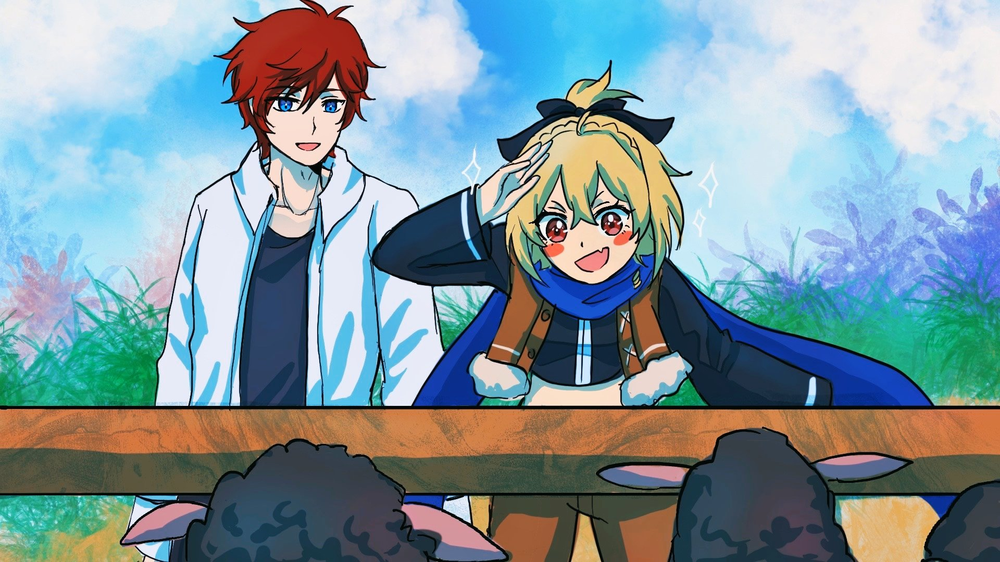
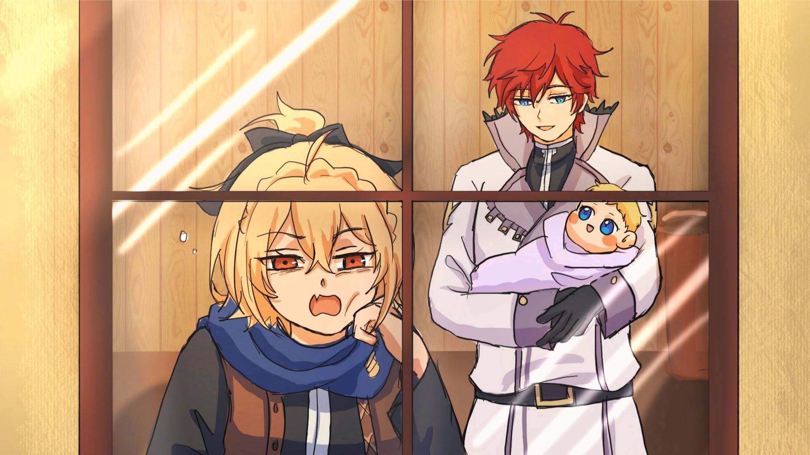
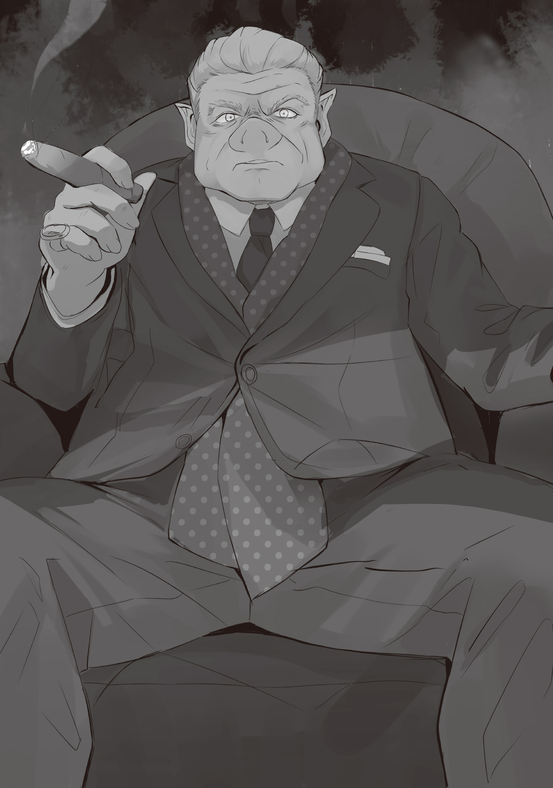
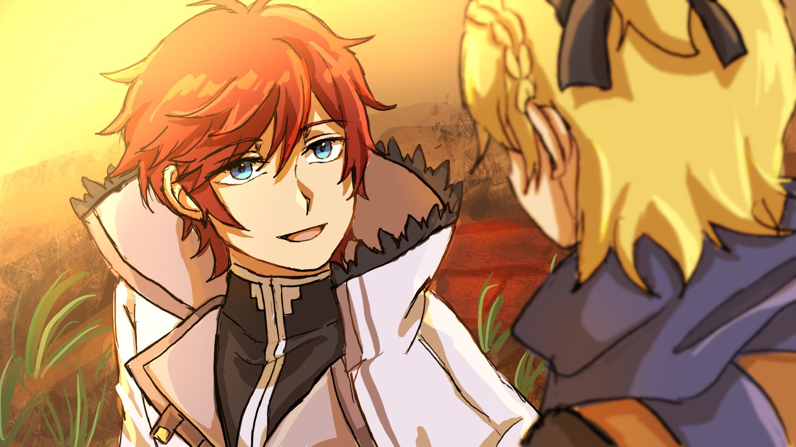

«…Тугудун, тугудун» — со стуком и грохотом ехал драконий экипаж.

По идее, на земляных драконов, что тянут повозку, действует «Божественная Защита Уклонения от Ветра», поэтому ни вихри, ни тряска в салон проникать не должны.

Вот только и у Божественных Защит есть свои ограничения. К примеру, таковая для «Уклонения от Ветра» перестаёт действовать, стоит лишь земляному дракону остановиться, и для возобновления её работы требуется некоторое время.

А значит, тот факт, что повозку трясло, доказывал: Божественная Защита не действовала.

Но почему же?..

— Ах, юный господин! Вы уже вернулись!

— Ва-а, как давно мы не виделись, юный господин! Я… я так рада вас видеть! Кья!

— Господин Райнхард! Заглянете как-нибудь снова ко мне на тренировку?! Обещаете?!

…А потому, что при каждом таком возгласе повозка останавливалась, ведь один из пассажиров то и дело общался с людьми через окно. Он махал им рукой, обменивался парой фраз и с улыбкой отвечал на приветствия.

Подобное поведение не могло не привлекать внимание, и к повозке сбегалось всё больше и больше народа.

Раз уж ход её стопорился с такой завидной регулярностью, неудивительно, что Божественная Защита никак не могла восстановиться. Поэтому с самого въезда во владения Астрея повозка успела сдружиться и с тряской, и с ветром.

— Прошу прощения, что приходится столь часто останавливать экипаж.

Провожаемая восторженными криками, карета снова тронулась. В слегка покачивающемся салоне пассажир, красноволосый юноша, вернулся на своё место и поклонился сидящей напротив спутнице.

Юноша этот был необычайно хорош собой.

Пылающие алые волосы и голубые, словно вобравшие в себя небесную лазурь, глаза, улыбка, чарующая всех без разбора, будь то мужчина или женщина, и голос, столь сладкий, что, казалось, щекотал саму душу.

Райнхард ван Астрея — таково его имя.

В ответ на проявленную им учтивость сидящая напротив него персона, как и ожидалось, покраснела…

— Раз уж извиняешься, то хоть рожу сделай виноватей!

…от гнева. Девушка в платье грубо рявкнула на Райнхарда.

Она тоже обладала на редкость миловидной внешностью. Сверкающие золотистые волосы, украшенные чёрной лентой, и алые, будто два ярких солнца, глаза. Во рту виднелся острый клык, отражающий буйный нрав девушки, а её ещё не до конца сформировавшееся тело было облачено в жёлтое платье.

Звали её Фельт, и в карете они с Райнхардом были одни.

Но в воздухе не витало и намёка на романтику. Да и с чего бы? Ведь их связывали отношения не влюблённых, а госпожи и слуги, хотя и для этих ролей их общение казалось слишком уж напряжённым.

В такой вот обстановке Райнхард с озадаченным видом заговорил:

— Госпожа Фельт, это жители земель, находящихся под прямым управлением дома Астрея. Расстояние между городом и особняком совсем небольшое, так что нам следует поддерживать с ними добрые отношения. К тому же…

— К тому же?

— Тируми — главная сплетница в деревне, и на неё всегда можно положиться. Йонас собирается вступить в армию Королевства. А хлеб, что печёт Лоуэлл, просто восхитителен. Они очень хорошие люди.

— …И почему ты не сказал об этом раньше? — пробормотала Фельт, подперев щёку рукой и расставив ноги так, что на несчастное платье становилось больно смотреть.

Райнхард, услышав её брюзжание, удивлённо приподнял брови:

— Я думал, вы сердитесь, госпожа Фельт?

— Если на чё и сержусь, так это на твою замашку сначала вываливать всякий бред, а потом задобрить пытаться! А те ребята снаружи ничего плохого не сделали.

— Но вы, казалось, хотели поспешить, и я решил, что вы чем-то обеспокоены…

— Да заткнись ты, в туалет я хочу! Терпеть уже не могу! А это платье! В нём так геморно туда ходить! Если я обмочусь, ты будешь за это отвечать?!

— Полагаю… независимо от того, отвечу я «да» или «нет», возникнут проблемы…

— Мне плевать! Не хочешь этих проблем — поторопись!

Раздражённая, Фельт дёрнула ногой, пытаясь пнуть Райнхарда. Но тот, даже не вставая, изящно увернулся и с улыбкой произнёс:

— Слушаюсь, — затем выглянул из окна и, посмотрев вдоль дороги, добавил: — Не волнуйтесь, госпожа Фельт. Ваше желание вскоре исполнится.

Фельт фыркнула на его напыщенную манеру речи и выглянула из окна рядом с ним.

Впереди, на вершине пологого холма, виднелись железные ворота. Впрочем, ворота эти были распахнуты настежь и изрядно проржавели — годы их явно не пощадили.

Миновав их, экипаж въехал на территорию поместья. Взору предстал особняк…

— Твой дом, значит, — проговорила Фельт.

— Да. Здесь я вырос — главный особняк семьи Астрея. И для вас, госпожа Фельт, он на некоторое время станет оплотом.

Райнхард с улыбкой подтвердил её слова. Слушая его, Фельт во все свои алые глаза разглядывала приближающийся фасад особняка.

Хоть она и выросла в трущобах, Фельт всё же была коренной жительницей столицы.

Она привыкла к виду домов аристократов, а последние два месяца и вовсе прожила в одном из них под домашним арестом. Памятуя о жизни той, она представляла себе дом Райнхарда, прославленного «Святого Меча», невероятно роскошным, но…

— …А он меньше, чем я думала.

Да, именно эта фраза, сорвавшаяся с её губ, и была честным первым впечатлением Фельт от особняка.

По сравнению со столичной резиденцией главный дом Астрея казался весьма скромным. Конечно, он был достаточно велик, чтобы называться особняком, но в столице такое блеклое жилище не удостоилось бы места и на задворках квартала знати.

Ржавые ворота, увиденные ею ранее, задали тон и для остального поместья: само здание помаленьку начинало ветшать, а обширный, но давно заброшенный сад лишь подчёркивал общее запустение.

Сначала Фельт опасалась, что по прибытии их окружит толпа слуг, но теперь её тревожило нечто совершенно иное.

— Возможно, вы удивлены, но таков истинный облик нашей семьи.

— Ты что, из этих… из обнищавших дворян?..

— Прошу вас, не смотрите на меня с такой жалостью, — с горькой усмешкой ответил Райнхард понизившей голос Фельт. — Я понимаю, почему у вас сложилось подобное впечатление, но сочувствовать пока рано. Однако, думаю, мы действительно небогаты по меркам аристократии. Соответственно, и земли у нас отнюдь не большие.

— Вот оно как… ну… ты это, будь сильным что ли.

— …? Благодарю вас.

Фельт вскинула большой палец, и Райнхард, хоть и склонил поначалу голову набок, с готовностью принял её ободрение.

Так или иначе, они благополучно добрались до главного особняка Астрея. Райнхард вышел из кареты первым и, обернувшись, мягко протянул Фельт свою ладонь:

— Госпожа Фельт, вашу руку.

— Ещё чего.

Отмахнувшись от его галантности, Фельт ловким прыжком оказалась рядом с Райнхардом. В довесок ещё и язык ему показала, отчего тот, вынужденный убрать руку, с кривой улыбкой повернулся к дому.

Главный особняк семьи Астрея. Для Райнхарда это было впервые за долгое время возвращение в родные края. Фельт искоса глянула на него, гадая, испытывает ли он какие-то особые чувства по этому поводу, но…

— Не видно троих, что отправились вперёд нас.

— Э? А-а, ты про Рачинса с парнями. И впрямь. Куда уже успели деться?.. — Фельт огляделась по сторонам.

Их спутники, троица хулиганов: Гастон, Рачинс и Кэмберли — не выдержав черепашьей скорости повозки, решили добраться до особняка на своих двоих и ушли вперёд.

Нужно было, чтобы экипаж встретили. Рассудив, что те трое смогут заранее сообщить в особняк о её прибытии, Фельт охотно дала им добро.

— Возможно, они уже внутри. Странно, что нас не встречают, поэтому позвольте мне сопроводить вас. Слуг в доме немного, но они крайне способные.

— Внучки тех двоих, насколько помню. Тогда нечего и сомневаться.

Перед глазами Фельт всплыл образ пожилой пары, что присматривала за столичной резиденцией семьи Астрея. Это были добрые и милые люди, которые очень нравились Фельт.

Прощаясь, они рассказали ей, что в главном особняке живут две их внучки.

— Я реально ждала встречи с ними. Бабушка с дедушкой ведь так обо мне заботились…

— ГХА-А-А-А-А!..

В этот самый момент парадные двери особняка с грохотом распахнулись, и по саду эхом пронёсся истошный вопль.

Райнхард молниеносно среагировал, прикрыв Фельт собой. И тут же на глазах у насторожившейся пары из дома вывалился кричащий мужчина… нет, мужчины.

Их было трое, разного роста: высокий, средний и низкий. Все они выглядели как отъявленные хулиганы, каковыми, в общем-то, и являлись.

Это была та самая троица, ушедшая вперёд: Гастон, Рачинс и Кэмберли. Побитые и потрёпанные, они катались по траве и неестественно громко причитали, как же им больно.

Увидев их состояние, Райнхард изумлённо раскрыл глаза и бросился к ним:

— Гастон, Рачинс, Кэмберли, что случилось?

— Ч-что случилось?! Сам, блин, не видишь что ли?!

Поверженные хулиганы подняли на подбежавшего Райнхарда свои опухшие лица. Все трое разом указали на особняк, из которого их вышвырнули.

— Мы ж пришли раньше, вот и решили передохнуть!

— Точняк! Постучали, никто не ответил, ну мы и вошли…

— А там эти чокнутые близняшки нас…

— Здравствуйте, я правая чокнутая близняшка.

— Левая.

— Хи-и-и-и-и!..

При виде двух появившихся в дверях фигур троица, завизжав от ужаса, сбилась в кучку. Не обращая внимания на дрожащих хулиганов, Райнхард посмотрел на вышедших.

В дверях особняка стояли две девочки — невысокие, с розовыми волосами, похожие друг на друга как две капли воды.

Судя по словам трёх идиотов и представлению самих девочек, они определённо были близнецами.

— Флам, Грассис. Это вы так с ними обошлись?

— Они выглядели слишком подозрительно, и нас охватило чувство долга…

— …Бандиты.

Поочерёдно ответили близняшки на вопрос Райнхарда, на что тот понурил плечи:

— Они не бандиты. Об этом должно было говориться в письме. Они гости госпожи Фельт… вернее, отныне будут работать под её началом, станут вашими коллегами.

— Простите, юный господин, мы были неосторожны.

— Неосторожны, юный господин.

Райнхард нахмурился: близняшки, Флам и Грассис, ни капли не раскаивались в своём поведении. Зато вот Фельт, пронаблюдав за перепалкой, прыснула со смеху:

— Хе-хе, да уж, с их-то мордами по-другому никак. Будь я на вашем месте, тоже б вышвырнула этих олухов из дома, — закинув руки за голову, она с озорной ухмылкой поддержала близняшек.

— Госпожа Фельт…

От её слов морщинка на лбу Райнхарда стала ещё глубже.

— Что, есть возражения? Напоминаю, я к их воспитанию отношения не имею. За это уж точно отвечаешь ты.

— Нет, дело не в этом. Я лишь подумал, пристало ли леди смеяться со звуком «хе-хе»?..

— Харэ только ко мне придираться, а! — цокнула Фельт языком на непрошеное замечание Райнхарда, и, ища, куда выплеснуть пыл, переключилась на троицу. — Эй, вы там, сколько можно трястись?! Живо внутрь!

Накричав и на них, она, совершенно не обращая внимания на своё платье, широкими шагами направилась к входу. При виде такой уверенности Флам и Грассис плавно расступились, встречая её как хозяйку дома.

— Мы ждали вас, госпожа Фельт.

— Ждали.

— Агась.

Фельт без тени смущения, с радостным видом приняла их приветствие. Она похлопала по плечам стоявших по обе стороны близняшек:

— В столице ваши дедушка с бабушкой здорово обо мне позаботились. Рассчитываю на вас.

— Бабушка просила служить вам верой и правдой.

— Дедушка передал семена цветов.

Кивнув в ответ, Фельт неспешно переступила порог особняка.

— Хм-м.

Она внимательно осмотрелась и, оценив атмосферу, удовлетворённо покачала головой. Как и ожидалось, интерьер дома полностью соответствовал экстерьеру: скромный снаружи — скромный и внутри.

Но почему же он так сильно отличался от особняка в столице?

— Столичная резиденция выполнена в стиле, присущем кварталу знати. В своё время она была дарована Его Величеством той эпохи моей бабушке в знак признательности за её заслуги, поэтому, если сравнивать с ней…

— Короче, этот похуже будет. Так значит, вот ваш настоящий уровень?

— Верно. Столичный особняк, похоже, должен был соответствовать репутации семьи, из которой выходят «Святые Меча». Проще говоря, это было для вида.

— Хе, для вида. Вы, дворяне, это любите.

Фыркнув на лекцию Райнхарда о масштабах особняков, Фельт двинулась вглубь дома.

Рыцарь был с ней изначально, с тремя идиотами она уже пересеклась. Но был ещё один человек, с которым Фельт должна была встретиться в поместье.

— …Хо, кажись, приехали наконец. Я уж заждался.

— Дед Ром!

Лицо Фельт просияло, и она подняла голову на знакомый голос. На втором этаже, с галереи которого открывался вид на прихожую, стоял и махал рукой огромный старик.

Его исполинский рост и телосложение выдавали в нём гиганта. Старик, которого звали дедом Ромом, был опекуном Фельт — единственным человеком, которому она безоговорочно доверяла.

Из столицы дед Ром выехал так же, как и Фельт с остальными — на драконьей повозке, но до поместья он добрался раньше кого-либо, и причина тому была проста.

— Помнится, вы по дороге к важным шишкам заехали. Ну и как всё прошло?

— Паршиво! Хотя я в основном тупо стояла рядом с Райнхардом.

— Вот как, значит. Тем не менее, всё это — опыт.

Поглаживая подбородок, дед Ром с мудрым видом кивнул, а Фельт, вспоминая пережитые тяготы, надула губы.

На пути из столицы они практически нигде не останавливались, за исключением визита вежливости в поместье одного влиятельного человека. Похоже, его семья издавна находится в тесной связи с домом Райнхарда, так что речь шла о поддержке на Королевских Выборах.

Пока Фельт с остальными занимались этим, дед Ром предпочёл от них отделиться, отправившись в особняк Астрея раньше. «Вся эта формальщина мне не по нутру» — так он сказал, но Фельт понимала, что это, скорее всего, была не единственная причина.

«За долгую жизнь чего только не случается» — эта простая истина была понятна даже ей, четырнадцатилетней девчонке. Она была уверена: если он когда-нибудь захочет, то сам всё и расскажет.

Поэтому Фельт уважала волю деда Рома и не стала ни о чём допытываться.

— Поклажу свою я уже занёс. Девчушки сказали, что комнату можно выбрать любую. Ничего ж страшного?

— Да, никаких проблем. Можете располагаться в любой, кроме моей личной, комнат членов семьи и Флам с Грассис, — кивнув на слова деда Рома, Райнхард повернулся к стоявшим позади близнецам. — Кстати говоря, Гастона и ребят вы не пустили, но господину Рому позволили пройти.

Дед Ром вёл себя так, будто уже вовсю освоился в особняке. И на замечание Райнхарда по этому поводу близняшки переглянулись.

— Ну, господин Ром выглядит сильным, вот.

— А бо-бо мы не любим, нет-нет.

— …Постарайтесь не быть так избирательны в своих обязанностях. В будущем это может создать проблемы.

— Да отругай ты их нормально!

— Требуем извинений!

— Несправедливое отношение!

Услышав о подходе Флам и Грассис к работе, троица хулиганов разразилась гневными криками. От всей этой ситуации Райнхард растерялся, и Фельт, глядя на него, ехидно усмехнулась:

— Кажется, скучать тут не придётся, а?

— Если таково ваше желание, госпожа Фельт… — оборвав фразу на середине, Райнхард обвёл взглядом собравшихся в холле. А затем, снова посмотрев на ухмыляющуюся Фельт, продолжил: — …то я приложу все усилия, дабы увидеть вашу улыбку вновь.

Перенос скудного багажа в комнату занял всего ничего, и на этом переезд Фельт был окончен.

Выросшая в трущобах, она в жизни не имела того, что можно было назвать состоянием. Большую часть своей домашней утвари она оставила в столице, а с собой привезла лишь сшитую дедом Ромом одежду да любимый нож для самозащиты.

…И ещё: скромные накопления, которые Фельт собирала по крупицам.

Кроме этого были разве что сменные платья и прочая одежда, которую ей всучила в дорогу пожилая горничная из столичной резиденции.

— Так влом всё это носить, но всяко лучше того, что выбрал Райнхард…

Она проходила в этих вычурных нарядах два с лишним месяца, но свыкнуться с ними было даже сложнее, чем с чуждой ей жизнью в дворянском особняке. С другой стороны, постоянно избегать такой одежды тоже было нельзя — Фельт прекрасно осознавала своё новое положение.

И также осознавала, что она сама это положение и выбрала, а потому была готова к последствиям.

Таким образом, в качестве компромисса между стыдом и упрямством, Фельт решила носить хотя бы те платья, что выбрала для неё старушка-экономка. Ведь если бы и одежду ей подбирал Райнхард, то можно было и помереть от зудящего чувства унижения.

— Ну уж в особняке-то я буду одеваться как хочу.

С этими словами она тут же стянула через голову платье и бросила его на кровать. Поверх нижнего белья она надела свой привычный наряд — тот самый, в котором носилась ещё по трущобам столицы.

Натянула перчатки, плотно зашнуровала ботинки — теперь можно и бегать, и скакать, сколько душе угодно.

И как раз в тот момент, когда Фельт, приговаривая «Ну-ка!», проверяла, удобно ли сидит обувь…

— Госпожа Фельт, могу я войти?

— Нет.

— Понял. В таком случае, простите за вторжение.

В дверь постучали, и раздался голос. Сразу же распознав его обладателя, она отказала, но тот, нисколько не смутившись, вошёл в комнату.

При виде этой вопиющей наглости Фельт презрительно скривила губы:

— На кой чёрт тогда вообще стучал? А если б я переодевалась?

— Я почувствовал, как вы прыгаете по комнате, госпожа Фельт… и поскольку знал, что вы пошли переодеться, у меня возникли кое-какие подозрения, но… этот наряд.

— Стоять, нотации даже слушать не стану! По крайней мере в особняке я буду ходить в чём захочу! Взамен, когда надо будет, я, так уж и быть, надену платье. Таков этот… ком-про-мисс!

— Взаимные уступки, значит… Я вас понял.

Фельт ткнула в Райнхарда пальцем, провозглашая свой манифест, и он, поразмыслив секунду, согласился. На его неожиданную сговорчивость Фельт с гордым видом выпрямилась и скрестила руки на груди:

— То-то же! …Так зачем пришёл? Я вообще-то вздремнуть собиралась.

— Я подумал, что мог бы показать вам поместье и его окрестности, если вы не против. Но я понимаю, что вы, должно быть, устали с дороги, поэтому, если желаете отдохнуть, я не буду настаивать.

— Чего это ты? Аж не по себе. Чёт больно понимающий стал.

— Вы пошли мне навстречу, госпожа Фельт, и я лишь захотел ответить вам тем же. Я позову вас к ужину, а до тех пор прошу, отдыхайте.

— Хм-м…

Видя, с какой лёгкостью отступает Райнхард, Фельт задумчиво прикрыла глаз.

Она ведь собиралась вовсе не вздремнуть, а тайком выбраться из особняка и осмотреть окрестности самостоятельно. Предложение Райнхарда, если не считать его компании, вполне соответствовало её планам.

Вдобавок, оказалось, что Райнхард тоже переоделся, сменив строгий рыцарский наряд на более простую одежду. Белая рубашка и чёрные брюки — в таком виде его можно было принять за обычного молодого человека.

Конечно, его ослепительное сияние так легко не скроешь, но в этом выборе чувствовалась его попытка по-своему проявить заботу и учтивость к Фельт.

Эта учтивость… по сути, была уступкой. Фельт уступила, и он уступил. А раз так…

— …Я передумала. Ладно, Райнхард, ты там чё-то о прогулке по владениям говорил? Валяй.

— Вы уверены?

— Давай, пока я снова не передумала. Виды из окна повозки были занятные, так что, в общем-то, идея не самая плохая.

Качнув головой, Фельт легонько толкнула Райнхарда в грудь и направилась к двери. Видя её перемену настроения, Райнхард, положив руку на сердце, поклонился и сказал:

— В таком случае я приложу все усилия, чтобы вы остались довольны, госпожа Фельт.

— Мурашки по коже от твоих фразочек, я могу и передумать. Шевелись уже.

— Слушаюсь, — коротко ответил Райнхард и поравнялся с ней.

Стоило им пойти рядом, и стало ясно: без своего мундира королевского гвардейца Райнхард — обычный юноша. Одной лишь смены стиля в одежде хватает, чтобы человек ощущался совсем по-другому, и дело тут вовсе не в её цене.

Теперь его наряд не казался неуместным рядом с Фельт, которая переоделась в свою привычную одежду, и…

— …Э, погодь! Это что ж получается, ты знал, чё я надену, ещё до того, как зашёл ко мне? Подглядывал?

— Нет, что вы. Я лишь предположил, не более того… Во время поездки вы неоднократно говорили, что хотите снять платье, госпожа Фельт, и я подумал, что так вы и поступите.

На сопровождаемое кривой улыбкой объяснение Райнхарда Фельт недовольно надула губы. Ей ой как не нравилось чувствовать, будто он водит её за нос.

— Ах да. Чтоб ты знал, я позову с собой деда Рома и ту троицу! Я не говорила, что мы пойдём одни!

— Понял. С ними обеспечить вашу безопасность будет проще, нежели в одиночку.

И этот безупречный ответ для раздражённой Фельт был словно поглаживание против шерсти.

Владения семьи Астрея были настолько скромны, что любой, кто знал о славе «Святых Меча», гремевшей на всё Королевство, был бы несказанно удивлён.

Территория Астрея представляла собой крохотный клочок земли с одним-единственным городком под названием Хакутюри, в центре которого и располагался главный особняк. Сам городок тоже не мог похвастаться большими размерами. Основными отраслями здесь были земледелие, животноводство и, как местная особенность, драконий промысел.

— За плато Хайклара находится Фландрия, один из Пяти Великих Городов. Фландрия с давних пор славится разведением земляных драконов, и считается, что именно она является их родиной. Хакутюри извлекает выгоду из этого соседства: у нас много мастеров, изготавливающих сёдла, поводья и прочую сбрую.

— А, земляные драконы, ты уже рассказывал. На них ведь можно будет покататься, да? Вроде бы заманчиво.

— Тогда я обязательно организую такую возможность. Позвольте подарить вам замечательного земляного дракона.

— Угу, — вяло буркнула Фельт, но походка её, вопреки ответу, стала более упругой.

Заметив, что его госпожа не в силах скрыть свои истинные чувства, Райнхард позволил себе лёгкую улыбку.

Сейчас под его эгидой они вдвоём как раз осматривали владения Астрея.

Для Фельт, родившейся и выросшей в столице, это был, без преувеличения, её первый выход во внешний мир — неудивительно, что всё вокруг кажется ей таким новым и необычным.

Именно поэтому она получала от прогулки огромное удовольствие, даже просто глазея по сторонам.

— Эй, Райнхард! Кто это такие? И на кой они здесь? — поддавшись порыву любопытства, Фельт ткнула куда-то пальцем.

— Это чёрные овцы. Разводят их в первую очередь не ради мяса, а ради шерсти, — без запинки ответил Райнхард. Но такое объяснение не уняло интерес госпожи, и он, заметив это по её глазам, тут же добавил: — Из состриженной шерсти делают пряжу и нитки, поэтому спрос на неё велик. А поскольку эти места отлично подходят для выпаса, большинство здешних фермеров выбирают именно чёрных овец. Должно быть, ваша одежда тоже сделана из их шерсти.

— Ого, круто! И они тут сами гуляют, неужто не воруют?

— В отличие от столицы, в таком маленьком городе все друг друга знают. Здесь больше следует опасаться не воровства, а нападения зверодемонов. Но и их зачастую прогоняют дикие земляные драконы, так что ущерба практически нет.

— А? Дикие, но защищают скот?

— Земляные драконы дружелюбны к людям. Настолько, что даже сопутствуют им в трудах.

Восхищённая ответом Райнхарда, Фельт прищурилась, разглядывая пастбище.

По огороженному лугу бродили покрытые густой тёмной шерстью животные, прозванные чёрными овцами, и жевали траву. Судя по сказанному Райнхардом и тому, насколько они обросли, близился сезон стрижки.

Фельт продолжала засыпать его вопросами о прочих домашних животных, сельскохозяйственных орудиях, фермах и многом другом в этом городке. И по правде говоря, никаких нареканий на экскурсию Райнхарда у неё не было.

Разве что…

— …Было б куда лучше, будь мы не вдвоём.

— Когда подобное говорят в лицо, даже мне становится обидно, госпожа Фельт, — сведя брови, горько улыбнулся Райнхард на её резкость.

Как она и сетовала, по улочкам Хакутюри они гуляли вдвоём: ни деда Рома, ни троицы хулиганов с ними не было.

Разумеется, перед уходом, как и обещала, Фельт позвала их с собой. Однако все были слишком заняты переездом и отказались.

— Но слиться из-за этого с прогулки — всё равно что струсить. Бесит.

— Если вам некомфортно, госпожа Фельт, я ни в коем случае не стану настаивать…

— Это. Дело. Принципа. Тебя оно вообще не касается. Это про мои личные победы и поражения. Да и потом, пока что мне даже нравится, — небрежно отмахнулась Фельт от беспокойства Райнхарда.

Что именно он подумал о её словах, осталось неизвестным, но он не сбавил шаг. Это и был его ответ.

— …

Заложив руки за голову, Фельт искоса взглянула на своего высокого спутника.

Он был неописуемо силён и практически на любой вопрос находил ответ. В качестве слуги он, без сомнения, был лучшим из лучших.

И всё же, рядом с ним Фельт постоянно испытывала какое-то зудящее чувство досады. Именно оно и порождало в ней это странное, необъяснимое упрямство по отношению к Райнхарду.

— Госпожа Фельт? Что-то случилось?

— Не, всё норм… Кстати, это ведь твоя родина, да?

— Родился я в столице. Но детство провёл в главном особняке, так что вы правы: можно сказать, это моя родина. А почему вы спрашиваете?

— Просто раз так, то…

Услышав ответ Райнхарда, Фельт прикрыла один глаз. И в этот момент…

— А! Господин Райнхард! Вы вернулись!

Раздался звонкий голос, и, обернувшись, они увидели машущего им рукой горожанина. Как и в случае с повозкой, Райнхарда, с его-то внешностью, местные замечали за версту. Когда он помахал в ответ, паренёк, похоже, совсем засмущался и принялся кланяться.

— Это Кокуран. Наследник того самого пастбища. Его друг — мастер по изготовлению сбруи, так что я думаю заказать всё необходимое для вашего дракона у него.

— Как и тогда, ты с лёгкостью назвал имя.

— Город ведь совсем маленький. К тому же это жители наших земель. Для меня они ещё и друзья из родных краёв. Здесь нечем особо гордиться.

— Друзья, говоришь.

Склонив голову набок, Фельт вспомнила, как вёл себя юноша, который только что здоровался с ними.

Раз он сам их окликнул, то, несомненно, относился к Райнхарду дружелюбно. Но вот можно ли было назвать их друзьями? Они казались ровесниками, но Фельт видела, что парень держал дистанцию из-за разницы в происхождении, характерах и многих других факторах.

Уловив её сомнения, Райнхард печально улыбнулся:

— Таково моё положение. Действительно, выстроить непринуждённую дружбу нелегко. Но я, со своей стороны, не против открыться.

— Сильнейший рыцарь королевства, аристократ, да ещё и местный правитель. Понимаю, каково им… А, так вот оно что. У тебя, выходит, и друзей-то на родине нет?

— Если вы имеете в виду друзей, с которыми можно, например, выпить, то, к моему стыду, да. В рыцарском ордене ситуация получше, но здесь мои титулы — лишь бремя. Такую ношу нельзя сбросить, просто захотев.

На ненамеренно язвительное замечание Фельт Райнхард пожал плечами, будто его оно ничуть не задело. Однако в этих его словах её особенно заинтересовали последние два.

— «Просто захотев»? А ты что, когда-то думал об этом?

— Никогда. …Такова предначертанная мне судьба.

Именно то, как он без тени смущения, с достоинством произносил подобное, и вызывало в ней то самое зудящее чувство. Но Фельт тряхнула головой, отгоняя это ощущение, и ухмыльнулась, обнажив клычок:

— Так у тебя и впрямь друзей нет. То-то я думаю: в кои-то веки заехал в родные края, а его даже никто не встречает.

— Пожалуй, вы правы. Но радоваться этому — знаете ли, дурной тон.

— Хе-хе-хе! Говори всё что хочешь, сейчас меня ничем не проймёшь!

Она наконец-то нашла слабое место у, казалось бы, неуязвимого Райнхарда. Теперь она сможет дразнить его этим какое-то время.

Но Райнхард прервал её злорадные мысли:

— Однако, госпожа Фельт, вы перед отъездом из столицы тоже не встретились ни с кем из своих друзей.

— Кх!

— Если не считать господина Рома, у вас, госпожа Фельт, похоже, тоже нет близких сердцу людей, которых можно назвать…

— Д-да замолчи ты! Мне и деда Рома достаточно! — покраснев, огрызнулась она на контратаку.

Он ударил в больное место. Это была ничья. Но внезапно, сразу после их маленькой дуэли, Райнхард тепло улыбнулся.

В его голубых, как озёрная гладь, глазах появилось нечто умиротворённое, и Фельт скривила губы.

— Чего?

— Просто подумал, как искренне вы уважаете господина Рома, госпожа Фельт. Это так трогательно.

— Он же моя семья. Ведь даже у всемогущего «Святого Меча» есть те, пред кем он не смеет задирать нос, а? Ты так себя и вёл со стариками в столице.

Пожилая пара, управляющая столичной резиденцией, называла Райнхарда «юным господином» и души в нём не чаяла. Пусть по положению они были хозяином и слугами, но для Райнхарда эти люди были как семья.

Именно поэтому рядом с ними он вёл себя так естественно.

— Разумеется, к дядюшке и тётушке я отношусь с большим почтением. Однако если говорить об уважении как таковом, я чту всю свою семью и предков. Но больше всего, пожалуй, прадеда.

— Прадед?

— Отец моей бабушки. Глава семьи в позапрошлом поколении, Бертоль Астрея.

— Он тоже был «Святым Меча»?

Фельт не слишком разбиралась в Божественных Защитах, но слышала, что «Божественная Защита Святого Меча» передаётся из поколения в поколение в семье Астрея. Раз уж нынешний её носитель, Райнхард, так уважал своего прадеда, то и тот, видимо, был «Святым Меча».

Однако на её предположение Райнхард покачал головой.

— Прадед не унаследовал «Божественную Защиту Святого Меча». Но он снискал любовь подданных как добродетельный господин, прославившись человеколюбием и мудрым правлением. По какой-то причине о нём не сохранилось никаких записей как о фехтовальщике, но я слышал, что мой дед, сам будучи мечником, глубоко его уважал, так что он, должно быть, и мечом владел превосходно.

— Хм-м… Добродетельный мечник, значит. Ха, даже в голове не укладывается.

Фельт и сама пользовалась ножом, но её стиль был слишком уж далёк от искусства фехтования.

Для неё мечник — это Райнхард, и, учитывая её многочисленные претензии к его характеру, ей было трудно представить себе добродетельного мечника.

— Но что есть, то есть: местные его не ненавидят… Может, это я, шавка бродячая, просто не понимаю, что такое добродетель…

— Госпожа Фельт?

Остановившись, Райнхард склонился к лицу задумавшейся девушки. Находясь совсем рядом, небесная синева и огненный багрянец их очей переплелись. Фельт упрямо надула свои губы и…

— Слишком близко.

— Ха-ха, прошу прощения.

…Упёршись ладонью в подбородок Райнхарда, грубо оттолкнула его и пошла вперёд. Он же лишь криво улыбнулся, а чуть погодя поднял взгляд к небу.

Солнце над ними уже клонилось к западу, и мир вокруг начал медленно утопать в алом зареве.

— Госпожа Фельт, думаю, пора возвращаться в особняк. Скоро подадут ужин.

— М-м, и то верно. В животе уже совсем пусто.

— Ужином занимаются Флам и Грассис. За столом я представлю их вам как следует.

— Угу. Мы перекинулись парой слов, но это и разговором-то не назовёшь.

Близняшки выглядели младше Фельт, но, как и ожидалось от внучек той пожилой пары, обладали достаточной силой, чтобы запросто справляться с тремя идиотами. Вероятно, сказалась стариковская муштра.

— Они будут присматривать за особняком, а при необходимости — и защищать вас, госпожа Фельт. Они происходят из семьи, которая издавна служит дому Астрея, так что на их умения можно положиться.

— Об этом я не беспокоюсь. Меня больше волнует, как они готовят!

— Их обучала тётушка, а потому и в этом можете на них рассчитывать.

— Есть!

Получив твёрдое заверение Райнхарда, Фельт от радости сжала кулак. Это была её лучшая улыбка за сегодня. Глядя на свою спутницу, Райнхард и сам улыбнулся, чего она, впрочем, даже не заметила.

Как бы то ни было, по дороге домой Фельт, сама того не осознавая, испытывала чувство облегчения.

Её привезли в чуждое ей место, чтобы окружить незнакомыми людьми и заставить изучать мир, ранее ею невиданный. Всё это, с одной стороны, вызывало у неё тревогу, а с другой — пробуждало боевой дух, кричащий: «Хрен я так просто сдамся!»

Но за какие-то полдня Фельт удалось избавиться от большей части своих страхов.

В меру большой особняк, минимальное число слуг, дружелюбные жители, не слишком обширные владения — продолжать можно долго, но, пожалуй, и этого хватит.

Представшая пред глазами реальность развеяла тревоги, что были лишь плодом её воображения. И благодаря этому она сможет ступить в новую жизнь с улыбкой на лице.

— Хотя, как подумаю, что всё и вся здесь просто пляшет под твою дудку, так сразу жуть берёт.

— Вы меня переоцениваете, госпожа Фельт. Я не могу управлять сердцами и поступками людей. Всё действительно сложилось само собой.

— Ну, помолюсь, чтоб так оно и было.

Хоть и молиться ей было некому, Фельт, оставшись при своём, показала Райнхарду язык.

Всё от начала до конца было под контролем Райнхарда — так и не отделавшись от этой параноидальной мысли, Фельт шла рядом с ним. Наконец они вышли из города, поднялись по склону и вернулись в поместье Астрея.

А там…

— …Это точно не твоих рук дело, а?

— …Признаться, я и сам в смятении.

Они переглянулись, и на сомнения в глазах Фельт Райнхард ответил таким же растерянным взглядом.

Перед ними, у ворот особняка, стояла корзина — корзина с младенцем.

В оставленной записке была лишь краткая просьба: «Пожалуйста, позаботьтесь об Ирии» .

— Зовут Ирия. Младенец. Оставили перед особняком.

Поставив корзину в центр стола, Фельт лаконично изложила факты.

В обеденном зале особняка, на самом его видном месте, безмятежно спала нескольких месяцев от роду девочка с золотистыми волосами. Не оставалось ничего другого, кроме как забрать её от ворот в дом.

— …

Выслушав объяснения Фельт, присутствующие неловко переглянулись.

За столом собрались все: сама Фельт и Райнхард, дед Ром, три идиота и служанки-близняшки. Однако их число ничуть не смягчило первоначального шока.

Тяжёлое молчание нарушили две розоволосые девочки:

— Юный господин, госпожа Фельт, вы слишком рано завели ребёнка.

— Самая быстрая беременность.

— МНЕ! ЩАС! НЕ ДО ВАШИХ ШУТОК! — взревела Фельт, опёршись руками о стол.

Похоже, шутка близнецов не нашла своего ценителя. Хоть они и хотели лишь подколоть вернувшуюся с ребёнком парочку, но смешного в этом всё-таки было мало.

А для младенца же столь импульсивный выпад Фельт оказался потрясением из ряда вон…

— Ау…

— Ой, госпожа Фельт, она проснулась.

— Момент пробуждения.

— Твою ж…

Младенец медленно поднял веки, и в голубых глазках отразились лица всех собравшихся в столовой. Прошла секунда, две, три, и…

— Уа-а-а-а-а!!!

— Гха! Чёрт, она расплакалась!

От резкого крика Фельт малютка, Ирия, залилась громким плачем. Громким настолько, что он разнёсся по всему особняку, и Фельт невольно зажала уши:

— К-кто-нибудь! Кто-нибудь, сделайте чё-то с её воплями!

— Даже если вы просите…

— Неопытны, сдаёмся.

— Бестолочи! Эй, Райнхард!

— Я постараюсь, но…

Флам и Грассис тут же выбросили белый флаг, а Фельт и вовсе не собиралась что-либо делать. Женский отряд дезертировал с поля боя, и Райнхард, назначенный им на замену, взял младенца на руки.

Он начал нежно покачивать ребёнка, похлопывая его по спинке.

— Тише, тише, не плачь. Ты сильная девочка. Замечательная девочка, Ирия.

— Ты её не кадрить собрался! Может, её покормить надо или чё-то вроде того?.. — прикрикнула Фельт, посчитав, что ласковые уговоры Райнхарда ни к чему не приведут.

Но, вопреки её ожиданиям, плач крохи на его руках начал медленно стихать…

— Тише, тише… Вот и успокоилась.

— Н-ничёсе. Щас удивил почти так же, как когда разнёс воровской склад.

— А-а…

Пока Фельт изумлённо таращилась, Ирия, перестав плакать, принялась мягко шлёпать ладошками по лицу Райнхарда, и тот с облегчением улыбнулся. Быть может, ей понравился его одинаковый с ней цвет глаз.

— Ну она ж девочка, как-никак. Увидала такого сердцееда, вот и похорошело, — предположил дед Ром, скрестив руки на груди.

— Если так, то эта мелкая ненормальная, — отозвалась Фельт.

Их небольшой обмен мог бы и продолжаться, но вдруг…

— Постойте! — прервал их один из трёх идиотов, Кэмберли.

Невысокий паренёк вышел вперёд и протянул руки к Райнхарду.

— Дай-ка сюда. У меня много братьев и сестёр, так что нянчиться с мелюзгой я привыкший!

— Это, несомненно, обнадёживает. Но Ирия уже успокоилась.

— Да какая разница! Покажу чисто, как надо малышню унимать!

Раз уж он так настаивал, Райнхард передал Ирию уверенному в себе Кэмберли. Тот заглянул ей в лицо, широко распахнул свои круглые глаза и…

— Бэло-бэло-бэло-бэло-ба-а-а!

— Уа-а-а-а-а!!!

— И это твоё «как надо»?! Она только сильнее разоралась!

Страшнющая гримаса Кэмберли испортила Ирии настроение.

Несмотря на все его потуги применить своё искусство убаюкивания, успокоить рыдающего младенца не удавалось. Переговоры провалились, и он не выстоял пред силой малютки.

— Дерьмо! Да что я делаю не так?! Гастон!

— О-оу? Да я, даже если возьму… Бэ… Бэло-бэло-ба…

— Уа-а-а-а-а!!!

Кэмберли сдался, и Гастон, приняв эстафету, тоже потерпел поражение. Покрасневшую от плача Ирию он, словно по конвейеру, передал ещё дальше.

— Рачинс, вся надежда на тебя!

— Эй! Подожди-ка! Ч-чтоб я возился со спиногрызкой… О?

— …

Рачинс, которому Гастон всучил Ирию, состроил жалобный вид и уж было начал не менее жалобно скулить. Но вдруг Ирия в его руках приутихла.

На неожиданную реакцию младенца Рачинс усмехнулся:

— Хе, хе-хе… Н-не знаю, почему, но она замолчала. Теперь-то…

— Уа-а-а-а-а!!!

— Тьфу ты, обрадовала раньше времени! К чему была эта задержка?!

— Она, поди, над вердиктом размышляла. А поразмыслив, в итоге забраковала.

— Молчал бы, старый хрыч! На, сам тогда с ней и разбирайся, Кромвель!

Взбешённый тем, как дед Ром выставил его провалившимся в последний момент неудачником, Рачинс практически впихнул девочку старику в руки. Разместив Ирию в своих огромных ладонях, тот расплылся в улыбке, морщины на его пожухлом лице стали ещё глубже.

— О-о-о, тише, тише, не ну-у-ужно плакать.

— Пф, что он делает? Будь это так легко, мы б и…

— А-а…

— Да какого хрена?!

Все три идиота с треском провалились, а вот старый великан Ирии, похоже, полюбился. Таким образом, суровое испытание плачущего младенца преодолели лишь двое: Райнхард и дед Ром.

— Для девочки естественно выбрать юного господина, но…

— Господин Ром — загадка.

— Какая ещё загадка?! Раз выбрала деда Рома, значит, вкус имеется. Хоть и бесит ставить его в один ряд с этим ублюдком Райнхардом!

Три идиота окончательно сникли, слушая, как женская половина, которая сама ничем не помогла, высокомерно подводила итоги. Дед Ром, краем глаза наблюдая за этой сценой и баюкая Ирию, склонил голову в раздумье:

— И всё-таки… Кроме имени, значится, никаких зацепок? В корзине больше ничего не было?

— Лишь подстилка и одеяло. Письмо же подписано не было, — осмотрев пустую корзину, Райнхард опустил взгляд.

— Родители, бросившие своего отпрыска, станут бумажки подписывать? Ага, разбежались, — раздражённо цокнула Фельт. И увидев, что растерянность не сошла с лица юноши, ткнула в него пальцем, будто в непонятливого ребёнка. — Слушай сюда! Эту девчонку бросили родители. Небось, увидели, как ты вернулся в особняк, и решили, что уж в таком-то большом доме её точно вырастят. Как же мерзко!

— …

— А что насчёт близлежащего города? Её родители могут быть оттуда?

Сменив резкую Фельт, дед Ром задал Райнхарду конструктивный вопрос. Тот, немного подумав, покачал головой:

— Насколько могу судить, это маловероятно. В городе было несколько беременных женщин, но… — оборвав фразу, Райнхард прищурился, глядя на Ирию. Закутанная в белые пелёнки, девочка теребила волосы на руке деда Рома. Было очевидно, что она родилась совсем недавно, — …судя по всему, Ирии всего несколько месяцев от роду… Учитывая эти временные рамки, число подозреваемых значительно сокращается. К тому же есть ещё и проблема с её внешностью…

— Светлые волосы и голубые глаза? Ну и что? Волосы как волосы — у меня самой такие, — запустив пальцы в шевелюру, вмешалась Фельт в размышления Райнхарда.

Насколько она помнила, в столице Лугуники золотые волосы не были чем-то примечательным. Фельт привыкла наблюдать за людьми — «профессия» обязывала. И светлые волосы, и голубые глаза были обычным явлением.

— Действительно, люди с золотистыми волосами, как у вас, госпожа Фельт, не редкость. Но это касается только окрестностей столицы. В Хакутюри и Фландрии, на юго-востоке Королевства, преобладают каштановые волосы… У людей, которых мы сегодня встретили, были такие же, помните?

— …А ведь и правда.

От слов Райнхарда в памяти Фельт всплыли лица горожан. Как он и сказал, у всех, за исключением поседевших стариков, были каштановые волосы.

— И что с того?

— А то. Юнец клонит к тому, что цвет волос и глаз у девочки столичный… Для рождённой якобы здесь это довольно-таки подозрительные черты.

— Всё так, как и сказал господин Ром. Надеюсь, то лишь мои домыслы, но…

Райнхард многозначительно замолчал, и Фельт скрестила руки на груди. Склонила набок голову, что-то промычала под нос, и вдруг с громким «Аргх!» взъерошила себе волосы.

— Да хватит уже ходить вокруг да около! Чё ты сказать хочешь, в конце-то концов?!

— Возможно, дело Ирии — это нечто большее, чем обычный случай с брошенным ребёнком. Поэтому, госпожа Фельт, я бы хотел спросить вас.

— Чего?

— Госпожа Фельт, это вы принесли сюда Ирию. Как вы намерены с ней поступить?

От тихого вопроса Райнхарда Фельт затаила дыхание. Замерев, она посмотрела на Ирию, уютно устроившуюся в руках деда Рома. Девочка всё так же была увлечена волосами на его руке, и ей было невдомёк, что взрослые вокруг вершат её судьбу.

Брошенная родителями, оставленная в чужом доме, она была не в силах решать, что с ней будет дальше.

— …Госпожа Фельт, ваше решение? — торопил Райнхард задумавшуюся девушку.

То, что он вверяет решение ей, — это проявление его уважения? Или же, воспользовавшись ситуацией как предлогом, он лишь её проверяет?

Проверяет, сможет ли Фельт, не полагаясь на него или деда Рома, сделать этот выбор.

— Если так, то какой же он гад.

— Что?

— Ничего. Спрашиваешь, как поступлю с девчонкой, да? — Какими бы ни были мотивы Райнхарда, Фельт уже всё решила. Она сверкнула озорной улыбкой и указала на Ирию. — На неё мне, в общем-то, плевать. Но вот на родаков, что её бросили, я чертовски зла. Поэтому хочу найти их и, так сказать, побеседовать.

— «Побеседовать»?

— Ага, побеседовать. Всегда хотела спросить у тех, кто бросает своих детей, каково это. Вот с Ирииными родителями это и обсужу.

Закончив фразу, Фельт скривила губы в широченной ухмылке.

«Побеседовать». Узнать у родителей, бросивших своё дитя, что они чувствовали. И для этого…

— С малявки пылинки будем сдувать, чтоб напугать потом её предков до смерти!

— …

Услышав гордое заявление Фельт, Райнхард промолчал. Остальные тоже не проронили ни слова. На их лицах были разные выражения, но во взглядах читалось одно и то же.

Если говорить прямо, они смотрели на неё со снисходительной теплотой.

— Что ещё за взгляды?! Есть что сказать — так говорите!

— Это, конечно, мой грешок, но твоё неумение быть честной с собой настораживает…

— Да замолчи ты! Я серьёзно! Не придирайся на пустом месте! — набросилась Фельт с криками на размякшего от умиления деда Рома.

Но срыв её, как и в прошлый раз, оказался для младенца чересчур…

— Уа-а-а-а-а!!!

— А-а, чёрт!

Разорвав предтрапезную тишину столовой, по особняку вновь прокатился детский плач.

К тому времени, как Ирия, наплакавшись до изнеможения, наконец уснула, ночь уже была в самом разгаре.

— Эт… эти дети — просто нечто… Откуда в таком маленьком тельце столько сил?..

— Касательно маленьких телец…

— Кто бы говорил.

Измотанная вконец, Фельт рухнула на диван и принялась ворчать. Но стоило близнецам ответить в унисон, как она тут же смерила их двоих сердитым взглядом.

— Потрындите мне тут. Сами ведь малявки поменьше меня. Сколько вам лет-то вообще?

— В этом году будет двенадцать.

— Пора стать самостоятельными.

— Какая ещё само -стоятельность, если вы всё время вдвоём?..

При этих словах гордо выпрямившиеся было близняшки удивлённо переглянулись.

— А ведь и правда…

— Не подумали.

Уже не обращая на них внимания, Фельт перевела взгляд вглубь комнаты.

Там, на столе гостиной, расположилась корзина, а рядом с ней стоял Райнхард, чем-то занятый. Но чем же он был занят?

— Ты и подгузники менять умеешь? Да ты реально всё могёшь.

— «Всё» — это, конечно, преувеличение. Просто когда-то мне доводилось ухаживать за детьми знакомых. Вот и весь опыт.

— Э-э… ты и чтоб возился с детьми, хм.

Поражённая этим открытием, Фельт, не вставая, подпёрла щёку рукой. И вдруг заметила, как близняшки, слегка покраснев, стеснительно переминаются с ноги на ногу.

Недоуменно нахмурившись, Фельт принялась поочерёдно поглядывать то на них, то на Райнхарда, и тут её осенило:

— А! Так эти дети — вы, что ли?!

— Госпожа Фельт, не говорите таких смущающих вещей…

— Верх унижения.

Так и не перестав краснеть, близнецы неловко заёрзали, лишь подтверждая догадку Фельт. Их реакция развеяла всякие сомнения.

— Вы меня раскрыли, — смиренно улыбнулся Райнхард. — Всё верно. С Флам и Грассис я знаком с самого их младенчества…

— Так ты, сволочь, и грудничков домогался?!

— Пожалуйста, подождите. Это уже слишком… Прошу, позвольте мне объясниться.

— Ха, да шучу я. Не дура уж, понимаю, что держание меня взаперти и смена подгузников этим двоим — разные вещи. Как и то, что сейчас ты меняешь подгузник уже другому ребёнку, — Фельт поднесла к губам палец, которым ткнула в юношу, и подула на его кончик.

— Какое облегчение, — ответил Райнхард и, ненадолго вернувшись к изначальному занятию, отвёл руки. — Вот, смена подгузника окончена. Флам, Грассис, вы запомнили?

— Да, юный господин. Идеально.

— Виртуоз подгузников…

— На вас можно положиться. Теперь давайте сменим одеяло и подстилку. Без привычных вещей она может начать волноваться, так что пока оставьте и старое одеяло тоже.

Получив от Райнхарда чёткие указания, Флам и Грассис поклонились и вышли из гостиной. Больше в комнате никого не было, так что остались только Фельт и Райнхард. Ну и спящая Ирия — итого трое.

— Мужики… дед Ром не в счёт, но от тех парней никакого проку.

— Может, с уходом за Ирией они и не справятся, но в поисках её родителей точно смогут помочь. Я как раз думал попросить их отправиться завтра на разведку.

Положив руку на корзинку, Райнхард вступился за трёх идиотов. Фельт, чьё ворчание было лишь разговором с самой собой, нахмурилась, но тему всё-таки подхватила:

— Завтра? А толк-то будет? Родичи ж, ребёнка бросив, могли и свалить сразу.

— Я уже поговорил с горожанами и на станции драконьих повозок. Попросил останавливать и сообщать мне о всех подозрительных путниках и тех, кто похож на Ирию. Также я проверил всех беременных в городе. К сожалению или к счастью, матери Ирии среди них не оказалось.

— …Так раз ты всё это уже сделал, тем троим хоть чё-то осталось?

Фельт с сомнением глянула на Райнхарда, слегка озадаченная его расторопностью. Ведь именно он в основном и занимался Ирией после ужина. Где он нашёл время на всё то, о чём только что рассказал?

— Госпожа Фельт, если вы чувствуете себя неловко, не хотите ли попробовать сменить подгузник?

— Ага, если настроение будет. Я более-менее запомнила, как оно делается.

— Рад это слышать.

Райнхард кивнул, и на его наигранность Фельт надула губы.

Делая вид, что учит Флам и Грассис, Райнхард специально работал так, чтобы и Фельт было видно, как менять подгузники. Ей и самой было совестно сваливать всё на него, поэтому она с самого начала собиралась этому научиться, просто…

— Сразу понял, что сама я о таком не попрошу. Чёрт, как же бесит.

— Что-то случилось?

— Ничего, — непроизвольно ответила Фельт, но затем, подперев щёку рукой, продолжила: — Нет, не ничего. Скажи честно, что ты вообще об этом думаешь?

— Госпожа Фельт? — удивлённо приподнял брови Райнхард.

Она же, не меняя своей ленивой позы, почесала свободной рукой в затылке.

— Это я подобрала девчонку, я решила искать родителей, я заставила о ней заботиться. Ты предоставил выбор мне. Но что ты сам обо всём этом думаешь?

— …

— Заранее говорю: не смей в своём ответе подстраиваться под меня. Я — это я. Ты — это ты. Учись разделять. Иначе… как-то не по себе.

Вскинув и резко опустив ноги, Фельт придала телу импульс. Рывком она уселась на диван и, выпрямив спину, повернулась к Райнхарду. Тот, поймав её взгляд, прикрыл один глаз.

И, продолжая смотреть на Фельт, он неспешно указал рукой на Ирию:

— Думаю, если бы вы, госпожа Фельт, велели оставить ребёнка, я бы подчинился. В данном случае единственно правильного ответа не существует.

— Это ж не твоё мнение, а…

— Но потом, втайне от вас, я бы начал искать родителей Ирии, а её саму спрятал где-нибудь в особняке.

— А-а?

Разведя руки, Райнхард мягко улыбнулся. От его безмятежного вида Фельт остолбенела, осознав, что попалась на его удочку.

И в тот же миг от захлестнувшей разум ярости лицо её вспыхнуло.

— Ты…

— Госпожа Фельт, Ирия…

— Кх… Ты. Не. Зарывайся.

Уже готовая разразиться криком, Фельт в последний момент сдержалась, наученная горьким опытом. Но, не скрывая своего гнева, она сверлила Райнхарда взглядом и, чеканя каждое слово, высказала ему, что думает.

Всё шло так, как и рассчитывал Райнхард. Что бы ни решила Фельт, он приложил бы все силы для спасения младенца. А было ли это его собственным желанием — уже другой вопрос.

— Ты делаешь это потому, что так нужно для ребёнка, или типа того, да?

— Оказывать помощь тем, кто в ней нуждается, — это, конечно, мой долг, но ведь чтобы помочь младенцу, сложные доводы ни к чему?

— …

— И если позволите высказать моё личное мнение…

От этого слова — «личное» — Фельт удивлённо вскинула бровь.

Райнхард редко предварял что-либо оговоркой про его «личное мнение». Но именно такого ответа Фельт от него и ждала.

На её ожидания Райнхард слабо улыбнулся:

— Госпожа Фельт, то, что наши мнения совпали, — честь для меня как рыцаря.

— Чт?..

— Я вспомнил тот момент на церемонии начала Королевских Выборов, когда вы, госпожа Фельт, отдали мне приказ. Я всё же, по возможности, предпочитаю следовать воле своей госпожи.

От этих слов, брошенных ей в лицо без тени смущения, Фельт лишь беззвучно открывала и закрывала рот. А Райнхард, видя её реакцию, как ни в чём не бывало пожал плечами.

Он не злорадствовал и не пытался ей угодить. Это, несомненно, были его искренние чувства, и именно эта его неподдельная искренность и выбила Фельт из колеи.

Потому она, не в силах сдержать нахлынувших эмоций, оскалила зубы и…

— Ты… Этим ты меня и бесишь!!!

Громкий крик Фельт эхом прокатился по всему особняку Астрея.

И мгновение спустя…

— Уа-а-а-а-а!!!

В наказание за позабытый урок ночную тишину разорвал оглушительный плач, сотрясший весь дом.

А тем временем, в отличном от охваченного плачем особняка Астрея месте…

— Женщину… и младенца нашли?

Низкий голос тяжело пронёсся по тускло освещённой комнате.

В голосе чувствовался возраст, но, несмотря на хрипоту, он нёс в себе силу. И сила эта, именуемая властностью, была присуща лишь тем, кто долгие годы стоял над другими.

Естественно, у обладателя этого голоса были подчинённые. Словно в подтверждение тому, в ответ на вопрос мужчины, тишину комнаты всколыхнули несколько вздохов.

— Прошу прощения. Мы всё ещё ищем их. Одно можно сказать наверняка: в этом городе их уже нет…

— Ищите. Есть предположения, куда они направились?

— Ей не на кого положиться. И денег на дальнюю дорогу у неё быть не должно. Для таких случаев стандартная схема — это прочесать окрестности, но…

— Это займёт слишком много времени. Сузить поиски. …Начать с Хакутюри.

Выслушав доклад подчинённого, мужчина с властным голосом тут же отдал приказ. В комнате повисло напряжение, но докладчик, покорно склонив голову, проговорил:

— Понял. Немедленно отправлю людей. Возможно, придётся действовать… несколько грубо…

— Неважно. Главное — найти. Даже если женщина не вернётся, младенца доставить сюда.

— Будет исполнено. …Идём.

С почтением ответив, подчинённый, бросив лишь слово остальным, вышел вместе с ними из комнаты. Дверь тихо закрылась, и в полумраке остался только один мужчина.

Он со скрипом встал со стула, подошёл к окну за спиной и посмотрел наружу.

— И куда же вы запропастились…

За окном раскинулся ночной город — один из Пяти Великих Городов, Фландрия. Комната мужчины располагалась в роскошном особняке на возвышенности, откуда открывался вид на мерцающие фонарями просторы.

Находясь на верхнем этаже, мужчина достал из ящика стола сигару и прикурил. В слабом свете огонька показалось его покрытое глубокими морщинами лицо.

Уже тускнеющие золотистые волосы. И голубые, полные жестокости, глаза.

— Я непременно найду тебя, Ирия.

Прошептанные им слова растворились в звёздном небе Фландрии и исчезли.

Вот уже несколько дней, как в привычную жизнь городка Хакутюри затесалось новое занятие.

А именно: слушать доносящийся из господского особняка на холме, поместья Астрея, плач младенца и ожесточённые споры мужчины и женщины.

— Уа-а-а-а-а!!!

При звуке отчаянных, истошных детских рыданий, горожане отрывались от работы. Они переглядывались, с улыбкой говорили: «Опять началось», — и возвращались к своим делам.

Такова небольшая вырезка из рутины последних дней городка Хакутюри.

— Госпожа Фельт, я бы не хотел повторяться, но прошу, выслушайте меня внимательно! — начал Райнхард с серьёзным видом.

В его голосе, обычно спокойном, звучала непривычная сила. Но не потому, что Райнхард был на взводе, а потому, что иначе его попросту не было слышно.

Ведь сейчас по всему особняку разносился неумолкающий плач младенца.

— Уа-а-а-а-а!!!

Ревущая девочка, Ирия, изо всех сил выражала своё недовольство жизнью.

Прошло несколько дней с тех пор, как они решили приютить её, и всё это время Фельт с остальными из кожи вон лезли, заботясь о ней, но Ирия, прикрываясь своим возрастом, не выказывала ни малейшего желания идти навстречу.

Конечно, не хотелось бы упрекать младенца в незрелости, но…

— Ну сколько можно реветь! Она ж плачет без передыху сутки напролёт!

— «Сутки напролёт» — это преувеличение. На самом деле она плачет с перерывами в несколько часов. Просто младенцам чуждо жить по дневному циклу, оттого и создаётся ложное впечатление.

— Похоже, что меня парят такие мелочи? Есть время языком чесать — так лучше покажи ей свою харю, чтоб она наконец заткнулась! — зажав уши, небрежно скомандовала Фельт Райнхарду.

Но тот на её приказ лишь покачал головой:

— Нет, даже если я поступлю, как вы сказали, это будет лишь временной мерой. Пока не устранена первопричина, Ирия будет заливаться слезами снова и снова. А для меня это невыносимо.

— Нашёлся тут мне герой трагедии! О какой, к чёрту, первопричине ты говоришь?!

— Конечно же, о вас, госпожа Фельт. Вы причина, по которой сейчас плачет Ирия.

— Я? Я ещё и виновата? Со мной-то что не так?..

— Взгляните, — ответил Райнхард возмущённой его «клеветой» Фельт, указав на лежащую в постельке девочку. — Подгузник Ирии. Насколько я помню, его меняли вы, госпожа Фельт… Но разве он надет не слишком небрежно? Неудивительно, что Ирии неудобно.

— Да какая разница, лишь бы зад прикрывал и наружу ничё не вытекало, — скривив губы, вякнула Фельт на придирки.

Но надо признать, ткань, которую едва ли можно назвать подгузником, была и впрямь намотана кое-как. И то, что намотала её именно Фельт, тоже было правдой.

Хотя, раз уж взялись рубить правду-матку, то, что она вынуждена менять кому-то подгузники, — само по себе нелепица та ещё.

— Госпожа Фельт… прошу вас, поставьте себя на место Ирии. Иначе ваш путь к трону будет лишь нарастать.

— Да не неси чушь! Где, блин, трон, а где пелёнки?! И ты чё, просишь, чтоб я легла вместо соплячки, будто это мне меняют подгузник?! Грёбаный извращенец!

Переиначив слова Райнхарда до абсурда, Фельт в отчаянии взъерошила себе волосы, чуть было не выдрав оттуда целые клоки.

— Вообще, почему это я должна с ней возиться?! Где близнецы?! Куда делись те три идиота?! Чем они занимаются?!

— У Флам и Грассис есть дела по дому, Рачинс с ребятами сейчас ищут родителей Ирии, а про господина Рома вы и сами знаете, госпожа Фельт.

— Мгм-м-м…

Загнанная в тупик Райнхардом, Фельт не нашла, что ответить. Тем временем он, приговаривая: «Всё хорошо, сейчас я сделаю тебе удобно», — аккуратно поправил небрежно надетый подгузник.

Слова Райнхарда её бесили, но факт оставался фактом: деда Рома в поместье Астрея не было. Он, кажется, поехал навестить одного своего нестоличного знакомого, так что ему и своих дел хватало.

В итоге, вдобавок к отсутствию деда Рома на Фельт свалились и заботы о младенце, поэтому её душевные силы таяли на глазах.

— Так что сейчас свободны только я и вы, госпожа Фельт.

— Ну и пошёл бы тогда искать родителей вместо той троицы…

— Они трое вряд ли справятся с уходом за Ирией, и тогда вам придётся заниматься ею в одиночку. Вы уверены?

— Да за что мне это всё?!

Схватившись за голову, Фельт тяжело вздохнула, глядя на повеселевшую от смены подгузника Ирию.

Шёл пятый день с тех пор, как Ирия появилась в поместье Астрея, и тирания её лишь крепчала. Как бы она ни изводила окружающих, ей всё прощалось, стоило лишь одарить всех ангельской улыбкой, — легко же ей живётся. Уж не возомнила ли она себя королевой?

— Если мы живо не найдём её родителей, то я уже не ручаюсь, что с ними сделаю, когда они объявятся.

— В такие моменты просто посмотрите на лицо Ирии. Разве её невинный вид не очищает душу и не привносит гармонию во внутренний мир?

— Как раз этот её видок с улыбочкой и доводит меня до ручки.

Обычно ей рефлекторно хотелось огрызнуться на всё, что говорил Райнхард, но сейчас дело было не только в этом. Против младенца, который заявляет о своём праве на жизнь и днём, и ночью, попросту не выстоять. Доходило даже до того, что Фельт казалось, будто родители Ирии бросили её не из-за бедности, а из-за её ночных истерик.

— Тьфу, если так, то увольте…

Если бы детей бросали из-за одного лишь плача, мир был бы завален подкидышами. Станет она королевой или нет, но Фельт отказывалась верить, что страна, где она живёт, — настолько скотское место.

— А-а, неплохая погодка.

Игнорируя Райнхарда с Ирией, Фельт отрешённо смотрела в окно. В пустом взгляде отражались голубое небо с белыми облаками, а под ними простирался пасторальный пейзаж.

Особого умиротворения это не приносило, но от чуть ли не хронического недосыпа из неё с тихим «уа-а» вырвался зевок.

— Если вы хотите отдохнуть рядом с Ирией, я могу спеть колыбельную.

— Не обращайся со мной как с ребёнком. Получишь, — выругалась Фельт.

Каким-то образом Райнхард уловил её зевок, даже стоя к ней спиной. «У него чё, глаза на затылке что ли?»

Она опёрлась о подоконник, и ветер заиграл с её золотистой чёлкой. Она уже было поддалась сонливости, как вдруг…

— М-м?

Щурясь от лёгкого ветерка и солнечного света, Фельт почувствовала что-то неладное.

В пейзаже, открывавшемся с холма, она заметила крадущуюся фигуру. Как только человек понял, что его местоположение раскрыто, он в панике развернулся и ринулся бежать.

— Чё ещё за хмырь?!

— Госпожа Фельт?!

В тот же миг Фельт выпрыгнула из окна. Райнхард удивился её мгновенной реакции и не успел дотянуться до неё, как она уже приземлилась во дворе. Припав к поверхности, Фельт устремила взгляд вниз по склону и увидела удаляющуюся мужскую спину. Она было собралась броситься в погоню, но…

— Госпожа Фельт, если что-то случилось, просто прикажите. Такова моя роль.

В этот же момент подле неё возник Райнхард, его рука уже лежала у Фельт на плече. На доли секунды промелькнул порыв оттолкнуть его, но она, подавив рефлекторное отторжение, оценила ситуацию и указала вниз по склону:

— Какой-то странный тип следил за домом. Поймай его!

— Есть. Прошу, присмотрите за Ирией.

Получив приказ, Райнхард передал малютку в руки Фельт.

Стоило ей взять тёплое, лёгкое тельце младенца, как фигура Райнхарда тут же обратилась в ветер. Он оттолкнулся от земли и в мгновение ока догнал мужчину. Тот, похоже, был уверен в своих ногах, но ему было далеко даже до Фельт, а уж до Райнхарда — тем более.

Ведь он был подобен неприступной стене, и Фельт за два с лишним месяца ни разу не смогла от него ускользнуть.

— О, чётко сработано, — кивнула Фельт, держа Ирию за подмышки и болтая её ножками.

Впереди взметнулось облако пыли, и мужчина, не успев оказать сопротивление, был повержен Райнхардом. Он действовал так быстро, что было не разобрать, что именно он сделал, но Фельт и бровью не повела.

Пока она ждала, покачивая Ирию, Райнхард неторопливо вернулся, таща схваченного мужчину за шиворот.

— Вот он, госпожа Фельт.

Даже не запыхавшийся, Райнхард бросил беглеца на землю. То был невзрачного вида мужчина средних лет. Своими дрожащими глазами он ошарашенно смотрел на Райнхарда.

— Т-ты ещё большее чудовище, чем говорят слухи…

— Я привык, что меня так называют. Но сейчас я рыцарь госпожи Фельт.

— Завязывай отвечать так каждый раз. Уши вянут, — цокнув языком на педантичный ответ Райнхарда, Фельт посмотрела в глаза трясущемуся мужчине. И, глядя на перекошенное нервной улыбкой лицо, склонила голову набок. — Извиняй, конечно, если не права, но ты ведь пялил на этот особняк, верно? На кой чёрт ты это делал?

— Хе, хе-хе. Это… я просто услышал, что вернулся «Святой Меча», вот и решил из любопытства глянуть одним глазком…

— Райнхард, можешь делать с его пальцами всё, что захочешь.

— Стой, стой, стой, стой! Жу-ж-жуть, он м-мо-может что?! Что вы собираетесь сделать?!

Как только Фельт упомянула Райнхарда, мужчина заметался в ужасе, лицо его стало белее мела.

Он уже достаточно натерпелся от «Святого Меча». И видя, как от боязни большего у пленника душа ушла в пятки, юноша потёр переносицу:

— Госпожа Фельт, после такого создаётся впечатление, будто я крайне опасный человек…

— И это естественно. Пойми уже хоть малёхо, сколько мне от тебя проблем, — пожала Фельт плечами в сторону озадаченного Райнхарда и, сверкнув клыком, ухмыльнулась мужчине. — Теперь твоя очередь. Говори, кто ты и что здесь делаешь? Иначе…

— И-иначе?..

— Я спущу на тебя Райнхарда.

На это безжалостное заявление Фельт Райнхард уже не возражал. Он криво улыбнулся, готовый принять даже столь жестокий приказ:

— Если и в этом состоит долг рыцаря.

Почувствовав в их слаженных действиях нечто большее, чем просто угрозу, мужчина в панике закричал:

— Понял! Я понял! Я из «Чёрной Серебряной Монеты»! Мне приказали найти ребёнка!

— «Чёрная Серебряная Монета», значит…

Вспоминая чистосердечное признание схваченного шпиона, Фельт приложила руку ко лбу.

Честно говоря, выросшая в столице, она мало что знала о делах за её пределами. Но тем не менее догадывалась, кем были эти люди, называющие себя «Чёрной Серебряной Монетой», и чем они промышляли.

— «Чёрная Серебряная Монета» — организация, базирующаяся во Фландрии, одном из Пяти Великих Городов. Официально они занимаются тавернами и сбруей для земляных драконов, но…

— На самом деле они — тёмная сторона города, верхушка преступного мира, да? Обычное дело.

И в столице были подобные организации, пусть и с другими названиями. Фельт старалась держаться от них подальше, но полностью избежать их влияния в тесном мирке столицы было невозможно.

— А большего сошки и не знают. Зачем и кому из «Чёрной Серебряной Монеты» нужна Ирия — непонятно. И ещё…

— Почему Ирию оставили именно в нашем доме, также неизвестно.

В итоге, почти никакой информации, кроме того, что за Ирией охотятся, получить не удалось. Пойманного мужчину связали и бросили на склад, но что с ним делать дальше, тоже было неясно.

Был, конечно, и грубый вариант: заявиться в логово «Чёрной Серебряной Монеты» и, прикрываясь Райнхардом, выбить из них всю информацию. Но этого Фельт делать не хотелось.

И не только потому, что ей претила мысль полагаться на Райнхарда. Просто ей не верилось, что такой подход сможет решить проблему в корне.

— Сидеть, рассуждать-то можно, но оставим всё как есть — зайдём в тупик…

«Как же быть?» — размышляла Фельт, лишь глубже погружаясь в диван. А Райнхард, стоявший подле неё, с нежностью смотрел на спящую в кроватке Ирию.

Нужно было что-то предпринять, чтобы преодолеть этот застой. И тут, как раз прерывая раздумья Фельт…

— Э-ге-гей! Мы вернулись! А ну-ка, встречайте нас! Руки вверх и бодрое «ура»!

— …Эти придурки.

Со стороны входа до второго этажа донёсся визгливый, распираемый чувством гордости голос.

Наверняка это был один из трёх идиотов, которым поручили искать родителей. От их бессмысленного шума Ирия поморщилась во сне, и Фельт, цокнув языком, вышла из комнаты. Гневно нахмурившись, она направилась к входу.

— Заткнись, идиот! Ирия же проснётся, веди себя тише!

— Не тебе это говорить! И вообще, уверена, что можешь с нами так разговаривать?

— А? Что ты несёшь?..

Выкатив грудь колесом, Кэмберли мерзко осклабился. И, раздуваясь в меру своего скоромного роста, указал озадаченной Фельт на вход.

Там показались Рачинс и Гастон… а за ними — красивая девушка с длинными пепельно-каштановыми волосами.

На вид ей было лет двадцать, от неё так и веяло нежностью. Она, похоже, была напугана атмосферой господского особняка и робко озиралась по сторонам.

А заметив взгляд самой «госпожи», она поспешно склонила голову.

— …

При виде этой женщины морщины на лбу и без того недоумевающей Фельт стали ещё глубже.

Напуганная девушка, торжествующие три идиота… да нет, много чести. Шпана подзаборная, не более.

— Райнхард, свяжи их всех.

— Есть.

— Какое ещё «есть»?! Глаза разуй! Это ж мать спиногрызки!

Мгновенное решение чуть было не повлекло за собой мгновенное исполнение, но крик Рачинса всё изменил.

Что он только что сказал? Эта женщина — мать Ирии?

— Мама Ирии?.. И с чего ты это взял?

Это, конечно, была удачная находка. Но вот радоваться раньше времени не стоило. Вполне возможно, что трио дружков поспешило с выводами.

На эти разумные сомнения Рачинс лишь усмехнулся:

— Тупицы б не заметили, но я сразу всё понял по одёжке. Обычно родители бросают своих отпрысков, пушто денег нет. Оттого такие детишки всегда грязные и зачуханные. А у малявки той и одежда, и корзинка были чистыми. Я мигом просёк: чё-то тут не так.

— Хоть так и не скажешь, у него, в отличие от нас, и семья, и воспитание что надо, — вставил замечание стоявший рядом Гастон.

— Это сейчас не к месту, — неловко возразил Рачинс и кашлянул, возвращаясь к теме. — Так вот, раз причина не в деньгах, и девчонку подкинули именно в дом «Святого Меча»… то всё просто. Её жизнь в опасности. Потому-то предки её и оставили.

Попади она в дом «Святого Меча», и шансы преследователей её поймать устремились б к нулю. И действительно, атаку посланника «Чёрной Серебряной Монеты» удалось отбить. Если эти догадки верны, то события развивались как и запланировано.

— Круто, конечно, что вы до этого додумались… но дальше-то что?

— Что сделают родители, оставив малявку у «Святого Меча»? Станут приманкой и дадут дёру! Идея следить за станцией драконьих повозок была неплоха, но мы пошли дальше! Нацелились на повозки дальнего следования, там-то и был ответ!

Не без типичных для него пафосных ужимок Кэмберли выставил вперёд обе руки. Но Фельт всё ещё не поняла, в чём же заключался этот их «ответ», и наклонила голову вбок.

— Смотри внимательно, внима-а-ательно! Вот же он, вот!

— Он?.. М-м?

Подойдя поближе, Фельт наконец заметила. В протянутых Кэмберли руках была тонкая длинная нить… нет, не нить. Это был человеческий волос.

Длинный, пепельно-каштановый волос. Сжимая его в руках, хулиган торжествующе смотрел на Фельт.

— Этот волос был в корзине девчонки, но он же не её! Цвет другой, значит, он того, кто её оставил! То бишь, её матери!

— Мерзкий какой-то способ…

— И это вся благодарность за наши труды?! — разорвав волос, вытаращил глаза Кэмберли.

— Лан, лан, извиняй, — тут же рассмеялась Фельт, махнув ему рукой. — Что ни говори, а поработали вы на славу. Но этого всё-таки недостаточно…

— Не местная, волосы как в корзине, повозка дальнего следования. И вдобавок…

— …

Перебив, Гастон начал перечислять на пальцах, а под конец кивнул на женщину. Проследив за его жестом, Фельт заметила.

У замершей на месте женщины под одеждой, в районе шеи и груди, была наложена повязка.

— Значит, в опасности была не только дочь, но и мать… Эй, близнецы!

— Вызывали?

— Госпожа Фельт звала.

На зов Фельт, цокнувшей языком, Флам и Грассис появились словно из-под земли. От их сверхъестественного появления три идиота остолбенели, а женщина округлила глаза.

Но Фельт восприняла это как должное.

— Приготовьте всё для перевязки. Я, конечно, тоже с пелёнками лажаю, но не настолько же. Тошно смотреть, как она там себя замотала.

— Ох, госпожа Фельт, какое самосознание.

— Гореть вам в пламени своих грехов.

— Заткнитесь.

Отпустив шпильку в адрес Фельт, близняшки прикрыли рты ладошками и подошли к женщине. Взяв её за руки, они повели её, смущённую, в гостиную.

— А, и перед этим. Как тебя зовут-то?

— …

— Имя, имя. У твоей дочери оно есть. И у тебя тоже должно быть, м? Хоть это…

Уже готовая произнести «…скажи», Фельт осеклась — женщина указала на своё горло. А затем, медленно покачав головой, опустила глаза. Жестом она показала, что не может говорить.

— Я окликнул её, мол, по поводу её раны разговор есть, и она сразу сдалась. Сначала, похоже, она приняла нас за преследователей, — сказал Рачинс Фельт, когда женщина скрылась в гостиной.

— А то как же, — снисходительно кивнула она, — по вам фиг поймёшь, что вы из дома «Святого Меча»… Но спасибо, что нашли её. Реально выручили.

— …Хех!

На мгновение Рачинс опешил от похвалы Фельт, но затем расплылся в улыбке. Гастон с Кэмберли, стоявшие чуть позади, тоже разделяли его радость.

И лишь один человек с начала и до самого конца оставался в стороне от всего происходящего…

— А ты чего с такой глупой рожей стоишь? Сам на себя не похож.

— …Честно говоря, я удивлён, — неуверенно ответил Райнхард на вопрос обернувшейся к нему Фельт.

Появление женщины, успех Рачинса и его дружков, работа близнецов — всё это Райнхард наблюдал молча. Похоже, несвойственное для него удивление охватило саму его душу.

— Вот как? Не ожидал, скажи ведь? Даже трущобное отребье на что-то способно.

— …

— Ладно, в этот раз я и сама удивилась. Бывает, видимо, что и они оказываются полезней тебя. Хм, не такой уж ты и всемогущий, «Святой Меча».

Заложив руки за голову, Фельт злорадно ухмыльнулась Райнхарду. Глядя на её улыбку, тот коротко вздохнул и заговорил:

— Но ведь неизвестно, действительно ли эта женщина — мать Ирии. Учитывая, что она не в состоянии говорить, мы ничего от неё не узнали. В таком случае…

— Доказательств хочешь, значит. Да раз плюнуть, — прикрыв глаз, пресекла Фельт его пустые беспокойства. — Просто дадим ей встретиться с Ирией. Этого будет достаточно.

— А-а…

Ирия, довольная на руках у матери. При виде этой картины Райнхард честно признал своё поражение.

— О каком поражении может идти речь? Ирия благополучно воссоединилась с матерью. Это предел наших мечтаний. Победа для всех нас… нет, победа Ирии.

— Чёрт, как же ты задрал… Ладно, теперь-то всё ясно.

Сидящая на диване в гостиной женщина — мать Ирии.

Доказательством тому служили сама Ирия, прижавшаяся к матери, и нежный, исполненный искреннего чувства взгляд родителя, направленный на своё дитя. Сомнений быть не могло:

— Женщина, которая с такой любовью держит на руках дочь, не могла её бросить.

— И к тому же она красавица.

— О да, это важно.

— Я и от зрелых женщин не откажусь.

Вульгарные комментарии трёх идиотов, наложившиеся на слова Райнхарда, как-то сразу обесценили всю трогательность момента. Заслуженно поймав ледяные взоры от Флам с Грассис, бесстыдники тут же съёжились. Наблюдая за этим краем глаза, Фельт фыркнула и перевела взгляд на Райнхарда. Тот всё понял и учтиво склонил голову:

— Можете быть спокойны, госпожа Фельт. Я ваш рыцарь, и моя верность непоколебима.

— Не додумывай, будто я на нервах, когда я и слова не сказала! И хватит уже обо мне — думай теперь об Ирии с её матерью! Усёк?!

Раз эта женщина искала защиты у «Святого Меча», то сейчас самое время исполнить её желание.

Раны были уже обработаны, и она более-менее пришла в себя. Хотелось бы наконец узнать, кто же ранил её и подверг опасности Ирию…

— Было б всё дело в муже, который тиранил жену и дочь, было б куда проще.

— В этом нет ничего простого. Это одна из самых страшных трагедий на свете.

— Эй, я не говорила, что хочу, чтоб так у них всё и было. Лишь сказала, что решить такую проблему было бы легче, — одёрнула Фельт Райнхарда, со странным упорством вцепившегося в её слова, и пожала плечами.

Да, если бы проблема касалась только матери, дочери и отца, не выходила за рамки семьи, всё было бы гораздо проще. Ведь тогда пришлось бы разбираться всего с одним человеком. Однако…

— …Тут замешана «Чёрная Серебряная Монета»! Всё уже не будет так просто!

— Что?! «Чёрная Серебряная Монета»?!

Рачинс и его дружки, так отличившиеся в поисках матери, были в шоке от раскрывшейся правды.

Фельт вкратце объяснила им, что произошло: что на Ирию было совершено покушение и что за этим стояла «Чёрная Серебряная Монета».

Выслушав всё это, троица побелела от ужаса:

— Ты что, шутишь?.. Да ты знаешь, кто такие «Чёрная Серебряная Монета»?! Они держат в руках один из Пяти Великих Городов!

— Они не щадят тех, кто идёт против них!

— И психи, что переходят им дорогу, потом всплывают в реке!

Они отчаянно пытались донести до Фельт, что та связалась с кем не следовало. В ответ она с силой взъерошила свои светлые волосы:

— Да знаю я, знаю. Раз враги сильны, придётся попыхтеть с правильным подходом, а то с ними и поговорить нормально не выйдет.

— Да не в этом дело!!! — в один голос воскликнула троица, но Фельт была непреклонна.

— Если вы прикажете мне проложить кровавый путь, я, не щадя жизни, исполню свой долг…

— Но не все проблемы решаются так, — перебила она.

— Да. Я и сам в этом горько убедился.

Если бы проблему можно было решить силой, то лучшего козыря, чем Райнхард, было не найти. Но реальность такова, что не всегда можно прибегать к подобным методам. И нынешний случай был именно из их числа.

— М-м?

Будучи в раздумьях, Фельт вдруг почувствовала на себе чей-то взгляд и подняла голову. Исходил он от матери, которая, не выпуская из рук дочь, пристально смотрела на Фельт.

В её изумрудных глазах читались тревога, надежда и смятение.

Причиной этих сложных чувств было…

— Не понимаешь, почему мы хотим помочь?

В ответ на вопрос женщина кивнула.

— Ты особо не обольщайся. Мы… по крайней мере я, помогать тебе не собираюсь. Если я и влезла во всё это, то только ради Ирии.

— …

— Я ж сутками не спала из-за её воплей! Чуть было не рехнулась! Думала, найду её родителей — мокрого места от них не оставлю… но нет, блин, выясняется, что и с мамашей мороки хватает! Просто тошнит уже!

От резких слов Фельт женщина застыла, ожидая, что же ей скажут дальше, щёки её окаменели от напряжения. Но вот Ирия на её руках, беззаботно улыбаясь, протянула к Фельт свои маленькие ручки.

— Тьфу…

От одного её вида гнев Фельт как рукой сняло. В отличие от матери, для Ирии всё было как обычно.

Ведь она всегда видела перед собой именно такую Фельт: надувающуюся всем своим маленьким телом от злости и, не жалея голоса, что-то кричащую.

— Я злюсь. И пока не выскажу всё, что у меня накипело, не успокоюсь. А ты… что ты?

Эти слова Фельт произнесла уже в самой обычной для неё манере, и женщина, указав на себя, округлила глаза.

— Сбагрить нам малявку, а самой стать приманкой — это ж был твой план? Тебя унизили до такого, и ты не злишься? Тебя пустили по миру, и даже после этого не злишься?

— …

— Хочешь, чтоб Ирия слышала, будто её мать — жалкая неудачница?

— …!

От такой провокации Фельт лицо женщины исказилось. Она покраснела, широко раскрыла глаза, и всё её тело напряглось — лишь руки, обнимающие Ирию, сохранили в себе нежность.

Не словами, но всем своим видом она показывала, что такого не допустит. На её реакцию Фельт ухмыльнулась:

— Близнецы! Бумагу с пером!

— Бумага здесь.

— Перо здесь.

Стоило ей протянуть руки, как Фельт тут же получила от Флам с Грассис то, что и просила. Взяв бумагу и перо, она протянула их женщине.

— Пиши. Имя матери Ирии и имя отца. Оба.

— …

— Хоть раз в жизни, но настаёт такой момент. Момент выбора. Вот настал и твой.

Выслушав слова Фельт, женщина закрыла глаза. Затем, вновь открыв их, она передала Ирию Райнхарду. Тот, бережно взяв младенца, затаил дыхание.

На его глазах женщина принялась писать. Сначала своё имя, имя матери — «Карифа». А рядом — имя мужчины, отца Ирии…

— Дольтеро… Так, значит, зовут отца.

— НЕ-Е-Е-Е-ЕТ!!!

Стоило лишь прозвучать этому имени, и три идиота свалились на пол.

Издавая истошные вопли и держась за руки, они в панике мотали головами.

— Да что с вами?! Хватит уже орать! Только каплю уважения к себе заработали, и вот опять за своё!

— Да чёрт с твоим уважением! Дольтеро? Ты с ума сошла?! Это ж имя босса «Чёрной Серебряной Монеты»! …А, хе-хе, не-не, погоди! Тёзка! Просто тёзка! Вот так совпадение!

Отчаяние их было так велико, что Рачинс с дружками попытались сбежать от реальности. Но женщина, Карифа, добавила к имени Дольтеро фамилию.

— Дольтеро Амул.

— …

На этот раз, поняв, что всё безнадёжно, начавшая было подниматься троица снова обессиленно рухнула на пол. Похоже, и фамилия совпала с таковой у лидера «Чёрной Серебряной Монеты».

— Выходит, Ирия — кровная родственница самого главы «Чёрной Серебряной Монеты»…

— Неудивительно, что за ней охотились… но чё-то тут не сходится.

Не было ничего странного в том, что люди «Чёрной Серебряной Монеты» пытались вернуть дочь своего босса.

Но что насчёт Карифы? Неважно, кем именно эта девушка приходится боссу: женой, любовницей или содержанкой — то, что она сбежала, опасаясь за свою жизнь, было фактом.

И это явно непохоже на дело рук того, кто хотел бы её вернуть.

— Я б ещё поняла, если врагом была не «Чёрная Серебряная Монета». Но тот связанный чуть ли не клялся, что он как раз оттуда. Как так получилось? И вообще…

— …

— Почему Карифа не пошла за помощью к боссу «Чёрной Серебряной Монеты»?

Окажись его любовница и дочь в опасности, лидер организации вряд ли бы остался в стороне. Ради безопасности Ирии Карифа должна была обратиться именно к нему.

Но она этого не сделала. Или… не смогла?

— Чёрт, а дело-то пахнет жареным. Встряхнуть бы сейчас хорошенько этого Дольтеро…

— Я понимаю вашу мысль, госпожа Фельт, но это будет не так просто. Если противник — «Чёрная Серебряная Монета», тем более её глава, то для контакта с ним нужна соответствующая подготовка…

— …Вы сейчас о Дольтеро говорили?

Внезапно раздавшийся хриплый голос заставил всех в гостиной обернуться к входу. Там стоял дед Ром, ранее ушедший по делам.

— Дед Ром, ты вернулся!

— Да вот прям только что. Так что там с Дольтеро? И кто эта девчушка?..

Погладив свою лысую голову, дед Ром нахмурился при виде незнакомой Карифы.

И было отчего: ситуация, как ни крути, серьёзная. Все собрались в одном месте, и у всех на лицах были сложные, озабоченные выражения: обессиленная троица, близнецы с листом бумаги и именами на нём, Райнхард с младенцем на руках и, наконец, Фельт, раскинувшаяся на диване, скрестив под собой ноги. Дед Ром глубоко кивнул:

— Хм… Дело, кажись, сдвинулось с мёртвой точки. И как с этим связан Дольтеро?

— У меня к тебе тоже есть вопрос. И если всё так, как я думаю, то ты, дед Ром, просто нечто! — спрыгнув с дивана, Фельт подбежала к гиганту и, посмотрев ему прямо в глаза, спросила: — Дед Ром, ты знаешь этого Дольтеро из «Чёрной Серебряной Монеты»?

— Больше скажу: не просто знаю, я только что с ним виделся.

— Ура!

— Ух ты ж?!

Хитро сощурив один глаз, едва успел ответить дед Ром, как Фельт от радости бросилась ему на шею. Он, впопыхах поймав её лёгкое тело, удивлённо спросил:

— Чего это ты вдруг?

— Есть, есть, е-е-е-есть, дед Ром! Я знала, что ты мне поможешь!

— Это, конечно, приятно слышать, но может, всё-таки объяснит мне кто, что происходит?..

Не отпуская Фельт, дед Ром посмотрел на Райнхарда, ища объяснений. Тот, покачивая Ирию, встретил его взгляд и…

— Госпожа Фельт.

— Ты ведь слышал? Теперь-то у нас есть все ключи. Осталось только взять да поглядеть, что за дверь они откроют, — с блеском в алых глазах и торжествующей улыбкой сказала Фельт.

При виде её оскала Райнхард почтительно склонил голову, после чего произнёс:

— …Госпожа Фельт, сейчас, в объятиях господина Рома, вы совсем как Ирия.

— Заткнись! И готовься к выходу!

— …

В напряжённой обстановке комнаты Фельт охватило странное чувство дежавю.

Необычайное давление проникало в каждый возможный угол, незримо сжимая горла присутствующих.

Толстые стены, тусклое освещение, грубая, будто специально подобранная для устрашения мебель и отсутствие стульев для гостей… Размышляя о всём этом, Фельт наконец поняла причину своего дежавю.

«Королевский дворец…»

Эта атмосфера до жути напоминала тот зал, где ей пришлось выступать на церемонии начала Королевских Выборов.

— Выходит, вокруг одни враги. Как и тогда, ничё нового… но на этот раз я хоть пришла по своей воле. Уже чуток полегче.

— Не волнуйтесь, госпожа Фельт. Что бы ни случилось, я защищу вас… нет, всех, кто здесь находится. На такой случай прошу, воздержитесь от криков, даже если мне придётся вас подхватить.

— И как и тогда, ты болтаешься рядом, настроение только портя.

Фыркнув на уже дежурные тирады верности Райнхарда, Фельт невозмутимо скрестила руки. И на это он всё так же дежурно ответил кривой улыбкой.

Судя по их способности обмениваться любезностями в такой ситуации, выдержка у обоих была нечеловеческая.

Ведь сейчас они находились во Фландрии, одном из Пяти Великих Городов, в комнате роскошного особняка Дольтеро Амула. Иными словами, в самом сердце «Чёрной Серебряной Монеты».

Естественно, внезапным гостям обычно не рады. Но сегодня вечером Фельт и её спутники были допущены в особняк и наслаждались, так сказать, гостеприимством преступного мира.

А возможным это стало благодаря…

— Прошу прощения за ожидание.

Дверь большой комнаты открылась, и в их сторону были обращены холодный голос и почтительный поклон.

Вошёл мужчина в строгом чёрном костюме. От него исходило острое чувство угрозы, лишь подчёркнутое змеиными глазами — его отличительной чертой.

Мужчина посмотрел вглубь комнаты, на деда Рома, стоявшего позади Фельт и остальных.

— Босс скоро вас примет. …Господин Кромвель, этот раз — исключение.

— Ты уж извини, Сафис. Буду должен. Для него, к тому же, это тоже неплохой расклад.

— Понимаю.

Сафис, как назвал его дед Ром, перевёл свой взгляд на спутников Фельт: Карифу и спящую у неё на руках Ирию. По его непроницаемому взору невозможно было понять, какие эмоции вызвали у него мать и дочь.

Ответ на этот вопрос так и остался тайной, утонув в скрипе вновь открывшейся двери.

— …

Как только он вошёл, воздух в комнате стал в разы тяжелее.

Если бы у этого чувства был вкус, он был бы горьким. Если цвет — чёрным. Если звук — низким. Мужчина, источая эту гнетущую ауру, властно опустился в единственное кресло, стоявшее в глубине комнаты.

Блестящие, зачёсанные назад светлые волосы и глубокие голубые глаза. Эти черты точь-в-точь совпадали с чертами Ирии. Но… были и существенные различия.

Ведь внешность этого мужчины явно отличалась от человеческой.

— Ты что, получеловек?

— Так и есть. Но в этом ли значение крови здесь и сейчас, дитя человека?

— Да вроде бы нет? — глянула Фельт на лицо мирно спящей в руках Карифы Ирии. — Просто подумала, как хорошо наследственность сыграла.

Услышав такой ответ, мужчина низко хмыкнул.

— Честная девушка, и кишка у тебя не тонка. …Я, впрочем, того же мнения.

Согласившись с её дерзкими словами, мужчина коснулся своего носа — точнее будет сказать, пятака — и скривил губы в усмешке. Эта черта сразу выдавала в нём представителя народа свинолюдей.

«Король Свиней» Дольтеро Амул, воплощение этого прозвища, восседал здесь собственной персоной.

— Раз уж мы друг друга поняли, хотелось бы перейти к делу… Ты ведь знаешь, зачем мы сюда пришли?

— Разумеется. …Карифа.

Тяжело кивнув в ответ на вопрос Фельт, Дольтеро обратился к молчаливой матери. Карифа же, поначалу напрягшись, смело встретилась с ним глазами.

Мужчина и женщина, отец и мать. Их взгляды, полные сложных чувств, были понятны лишь им двоим.

— Почему ты сбежала?

— …

Карифа не могла ответить словами. Сейчас она была не в состоянии говорить. Ведь даже на столь отчаянный шаг, как доверить свою дочь «Святому Меча», а самой стать приманкой, она решилась лишь потому, что ей повредили горло.

И виновником этого был не кто иной, как…

— Ты сбежала, забрав Ирию. Я велел искать тебя, но ты не собиралась возвращаться. Я было решил, что не смогу спросить, но раз ты здесь, говори.

Дольтеро был жесток к немой Карифе. Но за его суровостью проступала скрытая правда. Правда о престарелом «Короле Свиней».

— Почему ты сбежала? Почему вернулась со «Святым Меча»?

— Не вините её. Ей пришлось сбежать. Её с дочерью преследовали, и единственной надеждой для них стала семья Астрея. Только и всего, — вместо Карифы на вопросы Дольтеро ответил Райнхард. Взглянув на мирно спящую в объятиях матери Ирию, он выступил вперёд. — Их жизням угрожала опасность, и она, желая защитить хотя бы дочь, положилась на нас. Такова причина, по которой она покинула вас.

— Глупости. Угрожала опасность, оттого и сбежала? Почему она обратилась к вам? Если что-то случилось, она должна была пойти ко мне. Я бы…

— Не говори ерунды, царь горы. Кто станет просить помощи у того, кто не видит дальше своего пятака? Вот поэтому-то они тебя и бросили, — вклинилась Фельт в разговор, с вызывающим видом поддев Дольтеро.

От её слов воздух в комнате накалился от гнева. И источником его был не сам оскорблённый лидер, а…

— Вам лучше следить за языком. Вы не забыли, что находитесь на территории «Чёрной Серебряной Монеты»? Даже гостям не стоит переходить черту.

Холодный голос и леденящий взор впились в Фельт, но и она ответила своему оппоненту, Сафису, не менее интенсивным взглядом алых глаз. Этот мужчина, стоявший в углу комнаты, был единственным из «Чёрной Серебряной Монеты», кому Дольтеро позволил присутствовать при разговоре. Доверие, судя по всему, ему оказывалось высокое.

— Вы думаете, что рядом со «Святым Меча» вам ничего не грозит? Тогда вы нас недооцениваете. У нас есть свои методы. И они…

— Ой, не смеши меня! Думаешь, я нюня такая, что пикнуть не могу без няньки? Побоку мне, здесь он или нет, — указав на Райнхарда, прицокнула Фельт на угрозы. — И сворачивай уже свой спектакль, змеюка подколодная!

— …О чём вы говорите? Ваша клевета преступает всякие границы.

— Да ну? А как по мне, актёришка из тебя хоть куда, можно даже похлопать, — наигранно похвалила Фельт артистизм Сафиса, пока тот раздражённо хмурил брови.

Лицезря опасный обмен между гостем и подчинённым, Дольтеро коснулся костлявой рукой своего свиного носа. Он погрузился в раздумья, и тут дед Ром, мудрый старец, ранее лишь наблюдавший из-за спин Фельт и Райнхарда, опустил голову и заговорил:

— Раз на мать с дочерью охотятся, то это не может быть не связано с тобой, Дольтеро. Для врагов «Чёрной Серебряной Монеты» они — лакомый кусочек. Но девушка не обратилась к тебе за помощью. Не хотела беспокоить? Такого объяснения не хватит. Тогда причина в том…

— …Что она не считала «Чёрную Серебряную Монету» своим союзником, — продолжил Дольтеро мысль деда Рома, и в его голубых глазах сверкнул огонь понимания.

Слабое место, способное привести к краху лидера преступной организации, контролирующей Фландрию, было желанной целью для врагов. А враги, как известно, бывают не только снаружи.

Падение верхушки выгодно и тем, кто находится внутри.

— Я раскрыл, что Ирия — моя дочь, только тебе, Сафис.

— …

Низкий, грохочущий голос Дольтеро обрушился на его доверенного помощника. Змееглазый мужчина принял этот удар, прямо посмотрев на своего босса. В его взгляде не было ни замешательства, ни смятения, ни гнева, ни рвения объясниться.

— Если на них нападёт «Чёрная Серебряная Монета», Карифа с дочерью вынуждены будут бежать. И только ты знал, что они — моя слабость. Что скажешь?

Это было не предложение оправдаться, а милость, позволение оставить последнее слово. Преданный своим ближайшим сторонником, Дольтеро, должно быть, испытывал бурю эмоций. Не в силах оставаться равнодушной, Фельт, затаив дыхание, ждала развязки.

В ответ на вопрос «Короля Свиней» Сафис провёл рукой по своим тёмно-зелёным волосам:

— Всё так и есть. Мне нечего добавить, босс.

— Я ценил тебя. Считал самым преданным человеком в организации. И до сих пор считаю, — обращаясь к предателю, произнёс с глубокой горечью Дольтеро.

Услышав его слова, Сафис, как ни странно, улыбнулся… скорбно улыбнулся.

— Что смешного?

— Вы не ошибаетесь, босс. Я и сейчас предан организации… точнее, лично вам. В верности, в которой я поклялся жизнью вам и организации, не было фальши.

— А? Да кому ты заливаешь? — опешила Фельт от нелепой попытки Сафиса выкрутиться после рокового признания.

«Если хотел оправдаться, то выбор слов у него так себе. Сперва сознался в предательстве, а теперь о верности завёл.»

— Ты ж пытался сместить своего босса, использовав его же любовницу и дочь? К чему теперь эти россказни? Думаешь, сработает?

— Позвольте мне внести правку. Ваши слова верны лишь отчасти. Мать и дочь — слабое место босса. Они были угрозой благополучию его самого и организации. Вот и вся истина.

— …

«Что он несёт?» — нахмурилась Фельт. В голове у неё крутились одни вопросы, но тут дед Ром, глубоко кивнув, вновь вмешался в разговор:

— Теперь всё ясно. Тот, кого я знал, не стал бы затевать мятеж. А я-то думал, отчего же он пошёл на такое… Сафис, твоя преданность зашла слишком далеко.

— Я глубоко обязан боссу и поклялся в верности организации. Мои жизнь и честь лежат здесь. В своих же руках я не несу ничего. Моя задача — устранять угрозы для спокойствия «Чёрной Серебряной Монеты».

Выпрямившись в ответ на слова деда Рома, Сафис затем опустился на колени. Он взмахнул рукой, и в ней, будто по волшебству, возник кинжал. Резкое, как разряд молнии, чувство пронзило воздух… Вдруг Сафис приставил лезвие к собственному горлу.

— Босс! Я готов заплатить жизнью за свою неверность! Но прошу, стоя над моим телом, ещё раз подумайте! Что значит держать при себе госпожу Ирию!

— Чёрт! Райнха… — пыталась позвать Фельт, желая остановить безрассудного Сафиса…

Но было уже поздно. Острый клинок вспорол кожу на шее мужчины… и тут по комнате пронёсся шторм. Ударная волна прокатилась по помещению, и раздался глухой звук, с которым твёрдый предмет вонзается в плоть. Бросив взгляд в ту сторону, Фельт увидела… нет, не лежащее в луже крови тело Сафиса.

Он, получив удар кулаком в лицо и закатив глаза, лежал уже у стены. А тем, кто нанёс этот удар, был…

— «Король Свиней», стало быть, всё ещё в форме, — пробормотал дед Ром.

— Будь оно так, я бы не позволил Сафису совершить подобную глупость.

Дольтеро, с его исполинским телом, сравнимым даже с гигантом Ромом, двигался быстрее ветра. Опустив взгляд, он отвёл кулак, которым ударил своего подопечного, и медленно повернулся.

Спокойные голубые глаза устремились на Карифу и Ирию. От звука удара спящая малютка поморщилась, но тут же вновь спокойно засопела.

— …Какая, однако, вальяжная.

— Она любит поспать. Небось взяла от папаши, который столько у себя под носом прозевал.

Губы Дольтеро дёрнулись в усмешке: похоже, он сам над собой смеялся, признавая небрежность в обращении с подчинённым. Но это продлилось лишь мгновение.

— Босс! Мы слышали шум…

Открыв дверь, в комнату заглянули члены «Чёрной Серебряной Монеты», ожидавшие снаружи. Они с удивлением посмотрели на лежащего на полу Сафиса и на Дольтеро, потирающего кулак.

— Э-это… босс, почему вы… Сафиса…

— Не паникуйте, не при гостях. Унесите Сафиса. Нам с ним ещё предстоит разговор. Перевяжите его, чтобы не умер.

Дольтеро лишь отдал приказ растерянным подчинённым, не стал им ничего объяснять. Не задавая лишних вопросов, они подхватили Сафиса и быстро вышли из комнаты. Проводив их взглядом, получеловек тяжёлыми шагами вернулся к своему креслу и снова сел.

Подперев щёку массивной рукой, Дольтеро… нет, «Король Свиней», посмотрел на Фельт. Увидев нечто, таившееся в его глазах, она ощутила тошнотворный спазм, словно её внутренности поскребли пальцем.

И причиной этого мерзкого чувства было…

— Благодарю за визит, кандидат на престол. Но это была пустая трата времени.

— А?

— У меня нет дочери. Потому я и говорю, что всё это — пустая трата времени.

— …

Фельт не понимала, о чём он говорит. На мгновение в голове воцарилась пустота. Глядя на изменения в её лице, Дольтеро продолжил:

— Не поняли? Забирайте эту неизвестно откуда взявшуюся женщину, её дочь и убирайтесь. Бельмо на глазу.

— …! Не смей так говорить!

В ту же секунду, как она поняла его замысел, Фельт в ярости оскалила зубы.

Совет Сафиса… Дольтеро принял его. Он признал, что Карифа и Ирия — его слабость. И, чтобы скрыть эту слабость от окружающих, он решил от неё отречься.

Этот мужчина… — своих любовницу и дочь. Родитель… собрался отринуть своего ребёнка.

— Я пришла сюда не для того, чтоб ты бросил Ирию!

Она пришла, чтобы разобраться. Как всё дошло до такого?

— У тебя же есть дом, деньги, власть?! Раз ты отец, то защищай своего ребёнка до конца! Но нет же, стало только неудобно — и ты её выкинул! Да раз так, то с самого начала…

— Фельт.

Огромная рука деда Рома легла на плечо разъярённой девушки. Смотря в её алые глаза, он с мрачным видом покачал головой. «Сдавайся» — этого не было в его взгляде. Но он молча старался донести до неё, что следует отступить. От его отношения ярость в сердце Фельт вспыхнула с новой силой, но…

— …Да, ладно. Поняла, поняла!

Гнев тут же утих, и Фельт, перестав упираться, цокнула языком. Взглянув на Дольтеро вновь, она уже не чувствовала злости — лишь разочарование и презрение.

— Лучше уж без такого дерьмового папаши, как ты. Тут я с тобой согласна.

Если ему не хватает смелости защитить свою дочь, то пусть лучше держится от неё подальше. Как та, кто пережила то же самое, Фельт сочувствовала Ирии. И считала, что её нужно забрать отсюда как можно скорее.

Здесь Ирии не будет счастья. Здесь нет ничего, что должно быть частью её жизни.

Фельт уже выдала свою последнюю брань, а потому, тяжело дыша, собиралась было увести Карифу.

— Госпожа Фельт.

Но тут её окликнул Райнхард. Раздражённо глянув на него, она встретилась с его чистыми голубыми глазами. Что он хотел сказать? Она ждала его слов, но Райнхард лишь молча шевелил губами.

— …

Не прозвучало ни звука. Даже рыцарь среди рыцарей, сам «Святой Меча», не нашёл ответа.

— …Идём, — мотнув подбородком, бросила ему Фельт.

Тот, опустив брови, тихо последовал за ней.

— Спасибо за помощь, кандидат на престол.

— …Это подкол такой, мол, нехер совать было нос не в своё дело? За что спасибо, свинорылый? Видеть больше не хочу твою рожу, да и вообще иметь с тобой что-либо общее, — Фельт и не обернулась на прощальные слова Дольтеро.

Взяв Карифу за руку, она повела их с Ирией к выходу.

— …

Но перед этим Карифа остановилась и, обернувшись к Дольтеро, поклонилась. Она словно хотела, чтобы он в последний раз взглянул на спящее лицо младенца в её руках.

— …Ты ещё пожалеешь об этом.

— Нет, не пожалею.

Покидая комнату, дед Ром дал последнее предостережение Дольтеро. Но ответ его был твёрд и не требовал продолжения. Услышав слова давнего знакомого, старик вздохнул и скрылся за дверью вслед за остальными.

…И вот, когда все гости ушли, Дольтеро закрыл лицо руками. А упёршись взглядом в морщинистые ладони, закрыл и свои глаза.

— Ирия…

Голос его был слышен лишь ему самому.

— А ведь мы в итоге толком ни к чему и не пришли…

Все перипетии остались позади, и они вернулись из Фландрии в поместье Астрея. Стоя посреди заброшенного сада, Фельт, почёсывая голову, тяжело вздохнула.

Что до проблемы матери и дочери, Карифы и Ирии, то она разрешилась так, как и было сказано в логове «Чёрной Серебряной Монеты». А именно: Дольтеро и Ирия не были кровными родственниками.

Они — чужие друг другу люди. Ирия, выходит, стала ребёнком без отца.

Благодаря этому им с матерью больше не грозила опасность. Ну разве не чудесно? Да, конечно, в их жизни теперь недостаёт одного звена, но можно ведь считать, что ничего и не произошло, так?

— …С чувством незавершённости действительно трудно смириться, — вслед за ушедшей в себя Фельт и Райнхард излил свои мысли.

— …

Сейчас в саду были только они двое. Обычно Фельт не любила, когда он ходил за ней по пятам, но на этот раз сделала исключение. Сейчас ей хотелось с кем-то поговорить. Даже если этот кто-то был Райнхард.

— Уж лучше так, чем со стенкой разговаривать.

— Для меня честь, что вы решили поделиться со мной переживаниями, госпожа Фельт.

— Знаешь же, что меня такое бесит, прекращай, — поморщилась было она, но вдруг… — Эй, Райнхард.

Она вспомнила, как он окликнул её в конце разговора с Дольтеро. Тогда Райнхард ничего не смог сказать. Как и она не смогла что-либо сказать ему.

Не было ли правильного ответа вовсе, или же они его просто не знали? Как бы там ни было, Фельт точно помнила одно: в тот самый момент она оказалась не в силах подобрать нужных слов.

— Ну, я-то безродная, да и у тебя с предками тоже всё тяжко. Видать, для олухов в делах семейных вроде нас всё это было просто не по зубам.

— …Когда вы говорите так прямо, я не знаю, что и ответить, — горько улыбнулся Райнхард, словно она задела его за живое.

О его сложной ситуации с родителями Фельт имела представление, хоть и скудное. Мать Райнхарда с самого его детства пребывала в беспробудном сне из-за неизвестной болезни. А отец был, мягко говоря, человеком ужасным. Отбросом, если уж не юлить.

Для Райнхарда, с такой-то обстановкой в семье, и Фельт, найдёныша, воспитанного дедом Ромом, сочетание «олухи в делах семейных» было как нельзя кстати.

— Всё-таки даже непобедимый «Святой Меча» встревает, когда простым мордобоем не обойтись. Может, пора пересмотреть твой титул моего Первого Рыцаря?

— Вы правы, на этот раз я показал себя не с лучшей стороны. Если я не смог оказаться вам полезен и заставил сомневаться в том, что достоин быть вашим Первым Рыцарем…

— Дурак, да не принимай ты всё так близко к сердцу. Шутка это, шутка, — рявкнула Фельт. — Нет, ну я-то и впрямь не особо тобой довольна, но в целом… как рыцарь пока что сойдёшь.

Скрестив под собой ноги, она уселась прямо на разросшуюся траву. Райнхард, обычно ворчавший, когда она пачкала одежду, на этот раз ничего не сказал.

Так они и молчали, вдыхая запах свежей зелени и глядя на общее для них небо.

— …Только собрались взяться за дело, и на первом же шаге навернулись.

— Это… нет, госпожа Фельт, но…

— Но в следующий раз мы на том же не попадёмся.

— …А?

Услышав манифест уверенно сжавшей кулак Фельт, Райнхард впал в лёгкий ступор. Он и слова в ответ не выдавил, и она, откинувшись назад, спросила:

— Чё ты там акаешь? Я что-то не то сказала?

— Вовсе нет, госпожа Фельт. Просто… я думал, что вы подавлены.

— Я? Подавлена? Эй, да ты…

Фельт выпрямилась и, скользнув на месте, развернулась. Всё так же сидя, она посмотрела на возвышающегося над ней Райнхарда, на его лицо, обрамлённое солнцем.

Вглядевшись в затенённые черты рыцаря, узнав это выражение, Фельт поняла:

— Подавлена тут не я, а ты, Райнхард.

— Я?

— Сам ты этого не осознаёшь — тяжёлый случай. Ну, раньше тебе, похоже, и проигрывать-то не доводилось, отсюда всё и идёт.

Покачав головой, Фельт встала и отряхнула штаны. А затем, протянув руку ко всё ещё озадаченному Райнхарду, легонько ткнула кулаком ему в грудь.

— О, попала.

— Я не чувствовал необходимости уклоняться. К тому же это ваша рука, госпожа Фельт.

— Ой, ну только не мельтеши… И запомни вот ещё что: раз собрался идти за мной, таких провалов ты ещё нахлебаешься.

— …

— Чего это ты? Неужто думал, будто я буду выигрывать везде и всюду, а под конец влёгкую стану королевой?

От слов Фельт, заявившей нечто в стиле «бывает, и проигрывать приходится», Райнхард остолбенел.

Хоть она и сказала «неужто», но сама практически не сомневалась: Райнхард, наверняка, никогда и не думал о поражении. И дело было не столько в вере в неё, сколько в его непоколебимой уверенности в собственном пути.

«Пока я рядом, мы не можем проиграть» — таким чувством всемогущества он, должно быть, обременён.

Но бывают ситуации, когда даже Райнхард бессилен. И вот, едва начались Королевские Выборы, они столкнулись именно с такой. Здесь Райнхард и растерялся — между его идеалами и реальностью зияла пропасть — но сам он этой растерянности, увы, не осознавал.

— Ты иногда прям дитя дитём, в курсе? Ну просто вылитая Ирия.

— Это… полагаю, сильное преувеличение.

— Не-а, ничуть. Ты ж тоже, поди, уймы вещей не понимаешь. Может, мне и на тебя подгузник напялить, а, Райнхардик?

— Госпожа Фельт!

Райнхард возмущённо повысил голос, но Фельт в ответ просто фыркнула. Ведь доводить его сейчас она вовсе не собиралась — это лишь для того, чтобы он был готов.

— Райнхард, чего ты хотел для Ирии?

— Я хотел… благополучного воссоединения Ирии с родителями. Было ошибкой считать, что её бросили. И Карифа, и господин Дольтеро…

— Карифа — да. Но Дольтеро бросил Ирию. Бросил.

Даже Фельт не могла сказать, что не понимает его мотивов. Решение Дольтеро отдалить от себя мать и дочь вряд ли было продиктовано одним лишь желанием защитить «Чёрную Серебряную Монету» или своё положение, но…

— Бросил не по своей воле, бросил, чтоб защитить, — для самого брошенного уже неважно.

— …

— Любил, не любил — это дело десятое. Я такое не прощаю.

На полные гнева слова Фельт Райнхард промолчал. Пусть ситуация в его семье и нелегка, но брошен он никогда не был. А потому не имел права перебивать Фельт, чьи слова и сочувствие опирались на схожий с Ирией опыт.

— …А-а, чёрт! Да не к этому я разговор вела! В общем, то, что нет родителей, ещё не значит, что ты несчастен. Я вот, если б меня не бросили, не встретила деда Рома, — выпалила Фельт, сбиваясь от неловкости.

Она не знала ни лиц, ни имён своих родителей. И не интересовалась, почему её бросили. Быть может, если б она умерла оттого, что с ней так обошлись, то она б и имела парочку претензий.

Но, к счастью, не допустив такого, её подобрал самый лучший мужчина на свете.

— Раз кровь — это семья навязанная, то мне гораздо важнее та, которую я выбрала сама. И Ирия, потеряв отца, тоже сможет выбрать себе семью.

Если верить Райнхарду, то Фельт могла быть выходцем из королевской семьи Лугуники. Но все её члены были мертвы. И тем не менее, не по этой причине Фельт отвергла их кровные узы. Даже окажись они живы, она бы не захотела с ними встретиться.

И нет, вовсе не из обиды. А из-за чувства куда более светлого. Ведь она уже выбрала себе семью. Она уже была счастлива. Поэтому никакого желания увидеться с теми людьми и не испытывала. Вот и всё.

— Знать не хочу, чё там в голове у этого урода. А чтоб дать узнать ещё и Ирии — даже думать тошно.

— Но что, если в будущем Ирия захочет встретиться с отцом?

— Там уж она и сама решит. Если, когда вырастет, Ирия посчитает, что я со своим «не пущу!» только раздражаю, то это её дело.

Фельт не собиралась бросать в довесок красивые фразы, мол, она тут посторонняя. И так ясно: жизнь Ирии принадлежит одной лишь Ирии.

Фельт было всё равно, о чём думал Дольтеро или чего желала для своей дочери Карифа. И даже то, как воспримет это сама девочка, её тоже не касалось.

Единственное, о чём она может думать, — это как сделать Ирию счастливой.

— …

И вновь в ответ на слова Фельт Райнхард промолчал. Но молчание это было не от удивления или смятения, а уже от чего-то другого. В доказательство тому он несколько раз кивнул, как бы подтверждая свои же мысли.

— Это честь для меня, госпожа Фельт.

— …А? Чё? Не говори всякую стремоту на ровном месте.

— Чуть ранее вы сказали, что для вас важно то, что вы выбрали сами.

— Н-ну да, вроде того. Я так думаю, но, это…

И впрямь сказала — тут уж не поспоришь. Фельт робко кивнула, и Райнхард, слабо улыбнувшись, положил руку себе на грудь:

— Вы выбрали меня своим рыцарем. И теперь я в полной мере осознаю этот факт…

— …?! Э-эй, хватит всё перекручивать в свою пользу! Когда это я тебя выбрала?! Ты ж меня практически заставил!

— Как именно поступить, решать было вам. И тем, что вы, хоть и с неохотой, выбрали меня, я поистине могу гордиться.

— Грх, грх, грх!.. — только и осталось кряхтеть раскрасневшейся Фельт.

Ведь что ему ни скажи, у этого языкастого рыцаря на всё был ответ. Но как раз в этих его поддразниваниях и чувствовалось, что Райнхард наконец пришёл в себя. Похоже, ему, хоть и не полностью, удалось вернуть расположение духа.

— …Хмф. Госпожа, сама и заявившая, что будет проигрывать снова и снова. Скоро ты, небось, и сам пожалеешь, что стал моим рыцарем.

— Уверен, такого не случится. Благодаря Ирии и Карифе я в этом лишь убедился.

Они, разорвав связи с Дольтеро, вернулись вместе с остальными в поместье. Хотя им больше не угрожала опасность, жизнь вдвоём, без какой-либо поддержки, была бы очень трудной. Фельт, пусть и нехотя, пусть всего несколько дней, но заботилась о малютке и её матери, и мысль, что они могут оказаться на улице, не давала ей покоя.

— Поэтому вы и пристроили их на ферму в Хакутюри.

— Договорился с фермером ты. Я ничего не делала.

— А как насчёт денег, которые вы дали им на первое время? — с улыбкой перекрыл Райнхард последние пути к отступлению.

Тут Фельт и состроила по-настоящему недовольную мину — загнали её в угол. Это правда, что она дала Карифе денег на новое начало. Так уж вышло: у неё под рукой как раз оказались немалые свободные средства — те самые, которые она копила на свой план выбиться в люди, но что был сорван, стоило её внезапно выдернуть из трущоб.

— Для Ирии… я хочу счастья.

Пока Фельт, отвернувшись, сидела вся надутая, Райнхард произнёс эти слова. Надежда в его голосе почему-то звучала так хрупко, что ей стало даже неловко.

— Захотим — увидимся, они ж у нас под боком будут, дурень.

— Пожалуй, вы правы, — на грубость Фельт Райнхард ответил с улыбкой.

Ведь так всё-таки и выглядело привычное их общение. Ну а того, что был в нём какой-то уют, Фельт и не замечала.

Вдруг, просто, как бы не вынося молчания, она перевела взгляд на поросший сад:

— Кстати, сад этот! Самому-то не стыдно так его запускать?

— Раньше здесь был большой цветник. Бабушка любила его… но после того, как семья перестала за ним ухаживать, он совсем зарос.

Присев, Райнхард раздвинул траву, и показался осыпавшийся кирпичный бордюр. Да, раньше здесь, похоже, был цветник. Сейчас от него остались лишь эти блеклые следы…

— Почему же цветы всегда увядают? Отчего они не цветут вечно? — с какой-то тоской проговорил Райнхард, глядя на заброшенные клумбы.

На его слова Фельт наклонила голову вбок, поразмыслила немного. И почти сразу выпрямилась.

— А чёрт их знает. Может, чтоб внимание обращали? Цвели б они всегда — с ними б и не возился никто. Вот они и то цветут, то вянут. Прямо как Ирия.

Выслушав такой ответ, Райнхард промолчал.

«Тц, кажись, задела всё-таки» , — почёсывая щёку, замешкалась девушка…

— Госпожа Фельт, вы любите цветы?

…А потому не сразу среагировала на его внезапный вопрос. Касаясь пальцами впавшего в землю кирпича, Райнхард терпеливо ждал, и Фельт задумалась.

— Нет, не люб…

— …

— Думала, что не люблю, но не то чтоб время особо было смотреть на них. В общем… ни да, ни нет.

Ответив так расплывчато, она поймала себя на одной занятной мысли.

Пред ними простирался заросший сад. Что бы ни несли в себе воспоминания прошлого, в настоящем здесь совсем ничего нет. Поэтому…

— А восстанови-ка здешний цветник. Там и решу, нравятся мне цветы или нет.

— Я… цветы?

— Агась. И если хочешь, чтоб мне они понравились, уж постарайся вырастить красивые. А до тех пор право ответа за мной.

Хорошенько потянувшись, Фельт своей хотелкой подкинула Райнхарду работы. Представить только, как этот благородный рыцарь копошится в земле по её капризу, уже было забавно. А тут ещё и облику дома на пользу пойдёт. Сплошные плюсы.

Да уж, от такого-то приказа даже у Райнхарда лицо скривится…

— …? Чего это ты такой довольный?

— Нет, что вы… Просто я впервые буду заниматься садоводством.

Перспектива столкнуться с совершенно новым, неизведанным для него делом явно воодушевила Райнхарда, он весь был в предвкушении. У Фельт поначалу аж глаза на лоб полезли, и она тут же рассмеялась, сверкнув своим клычком:

— Хмф. С таким настроем и продувать привыкай. Но! На радостях смотри не забывайся: окончательную победу я никому не уступлю.

— Разумеется, госпожа Фельт.

Райнхард мягко улыбнулся, и Фельт вдобавок легонько ткнула его в грудь. Кулак её и теперь попал в цель. Лишь убедившись в этом, она поднялась на ноги.

Чуть поодаль, в дверях особняка, как раз показалась Карифа. А за ней, увешанные тяжёлыми тюками, плелись три идиота, то и дело глупо лыбясь перед робеющей девушкой. Остолопам было велено отнести в новый дом Карифы и Ирии вещи, купленные за эти несколько дней, и они, похоже, против такого поручения вовсе не возражали.

Флам и Грассис, которые бегали по лавкам, собирая эти самые вещи, сверлили троицу взглядами, в глазах их было отвращение… как вдруг сменилось на удивление — дед Ром принялся нежно гладить их по макушкам.

От такого Фельт немного надулась, но, едва посмотрев на Ирию, тут же забыла о своей злости. Сидя на спине у матери, малышка тоже заметила стоящую в саду пару и, задорно помахивая крохотной ручкой, улыбнулась.

Райнхард говорил, что хочет для Ирии счастья.

Фельт это желание разделяла, и она знала, как его добиться. А потому решила во весь голос поведать об этом ребёнку, оказавшемуся с ней в похожей ситуации.

Широко разинув рот, она громко прокричала:

— Ирия! Будь сильной!

《Конец》
