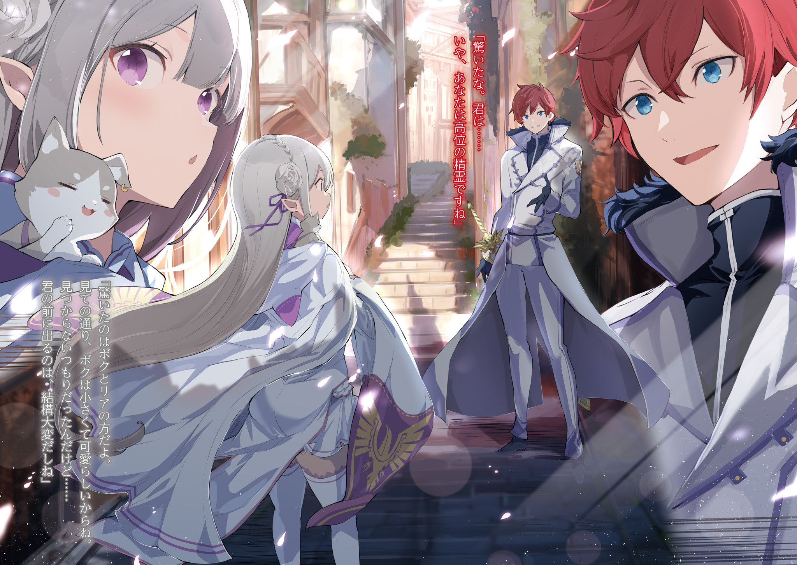
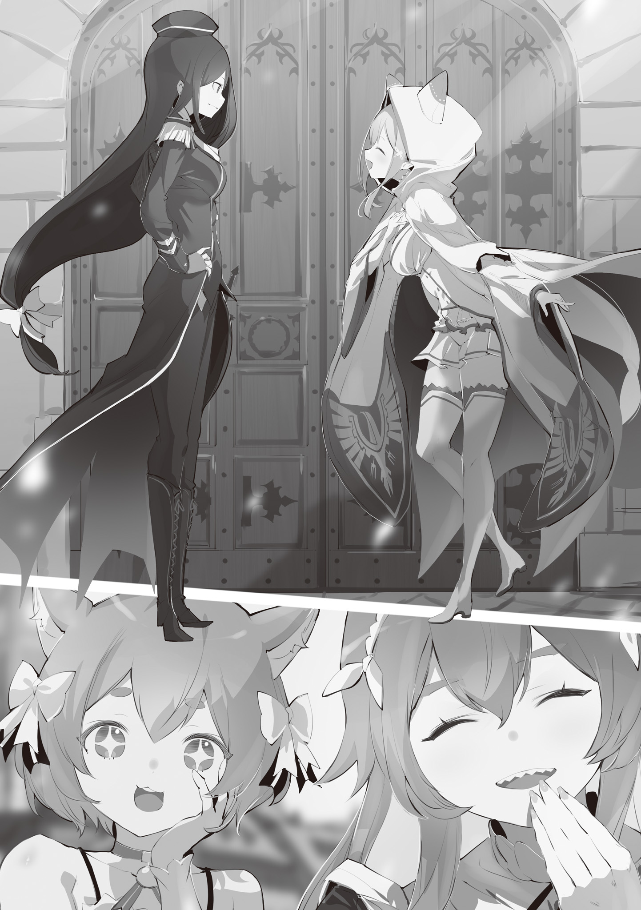
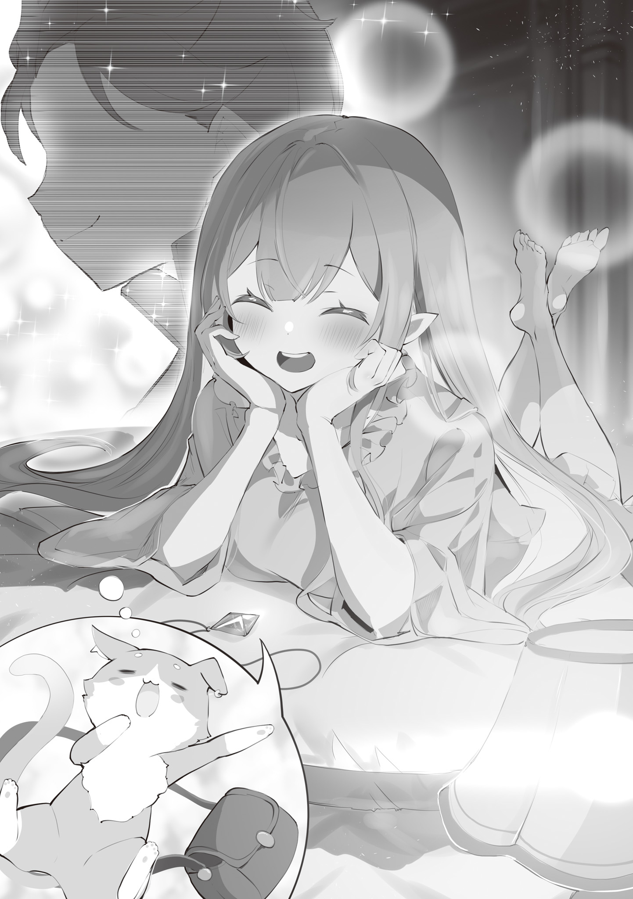

…Вот это я влипла так влипла.

Стоя в полной растерянности посреди толпы, где невозможно разобрать, где право, а где лево, девушка ощущала, как её переполняет тревога.

Всё, что попадалось на глаза, было в новинку, и от этого голова шла кругом, куда ни посмотри. Никогда прежде она не видела такого скопления людей, заполонивших всё поле зрения. И, конечно же, никогда её не окружало столько голосов сразу — её уши, чуть более длинные, чем у обычных людей, нервно подрагивали.

— …Лия, ну Лия~я~я, ты в порядке?

Внезапно в голове, полной тревожных мыслей, раздался привычный ласковый голос.

Осознав, что голос исходит из кристалла, висящего у неё на груди, девушка невольно выдохнула. И только тогда с ужасом поняла, что до этого момента забывала дышать. Если бы голос не привёл её в чувства, она могла бы упасть в обморок от нехватки воздуха прямо посреди этой улицы.

— Всё могло закончиться о-о-очень плохо…

— Ага-ага, одно препятствие преодолели. Но, похоже, расслабляться пока рано. Страдания Лии, судя по всему, продлятся ещё немного.

— М-м, ты прав. Нельзя терять бдительность. Ведь…

Рукой, которой она успокаивающе гладила грудь, девушка поплотнее стянула воротник плаща, накинутого на голову.

Словно надеялась, что этот плащ хоть немного смягчит то колючее беспокойство, что вызывали мириады образов, звуков и чужих присутствий вокруг.

Однако, даже полагаясь на ощущение ткани в руках, девушка всё равно оставалась в эпицентре водоворота тревоги.

А всё потому, что…

— Я окончательно разминулась с Фредерикой… и что же мне теперь делать?

Перед глазами девушки, слабо пробормотавшей эти слова посреди впервые увиденной столицы, с шумом пронеслась огромная драконья повозка.

Эмилия была полуэльфийкой с серебряными волосами и аметистовыми глазами, родившейся и выросшей в Великом лесу Элиор.

Проведя много времени в изолированном лесу вдали от людских поселений, Эмилия осознавала себя наивной провинциалкой и, отправляясь в свой первый мегаполис, испытывала сильное напряжение. Но результатом стало именно это плачевное состояние.

— Я ведь старалась быть внимательной, как же я умудрилась заблудиться…

— Старалась быть внимательной? Как по мне, ты просто шаталась туда-сюда, пялилась на всё подряд и выглядела так, будто вот-вот попадёшь в беду.

— Но ведь там было столько всего незнакомого!

Эмилия ответила на укоризненный голос, признавая свою легкомысленность. Но, раскаиваясь, она тут же немного обиженно добавила: «Но…»

— Пак, если ты считал, что это опасно, мог бы и сказать мне.

— Нет уж, я говорил. Просто Лия совсем меня не слушала. Например, когда засмотрелась на представление уличных артистов, хотя мы только что обсуждали, что нашей горничной нигде не видно.

— Неправда? Это правда? Я так увлеклась, что совсем…

Хотела заставить собеседника почувствовать вину, а вышло наоборот — Эмилия сама оказалась в тупике.

Речь шла о бродячих артистах, которые совсем недавно давали представление на улице столицы: ящеролюд, глотающий кинжалы целиком, невероятно гибкие люди-кролики, огромный человек-тигр, подбрасывающий дедушку-полурослика, словно мячик для жонглирования, — всё это было ужасно интересно.

Эмилия невольно остановилась и просмотрела их выступление от начала до конца, и даже отдала все карманные деньги в качестве вознаграждения.

— Если подумать, не отдай ты те деньги, у нас было бы чуть больше вариантов.

— Вариантов?

— Если бы остались карманные деньги, они могли бы помочь в поисках горничной или чтобы избежать проблем, верно?

— Я понимаю, что ты хочешь сказать, Пак, но…

Карманные деньги уже были отданы бродячим артистам, так что, что ни говори, назад их не вернёшь. К тому же, они были так рады вознаграждению от Эмилии. Если возможно, она хотела бы выразить им своё восхищение каждым номером более подробно, но из-за своего косноязычия Эмилия не смогла толком ничего сказать, о чем очень жалела.

Кроме того, эти деньги дал не кто иной, как Розвааль, хозяин потерявшейся Фредерики. Эмилии казалось чем-то странным и нелепым, что она, потерявшись сама, будет использовать эти деньги для поиска Фредерики.

— Нет, чем попусту переживать, лучше начать действовать. Думаю, Фредерика тоже нас ищет, так что давай вернёмся по той дороге, которой пришли.

— Моя дочь так полна решимости, это здорово. Но ты уверена? Ты точно помнишь дорогу, по которой шла?

— Ну, Пак, ты слишком уж беспокоишься. Я ведь жила в лесу, где не было никаких ориентиров. А в столице кругом одни приметные вещи.

Эмилия тихо рассмеялась над беспокойным голосом из кристалла, и у неё на душе стало чуточку легче.

Просто вернуться назад. Это казалось очевидной и отличной идеей. Наверняка она в два счета найдёт потерявшуюся Фредерику.

…Как оказалось, эти мысли были слишком наивными.

— …Я снова вышла на совершенно незнакомую улицу.

— Да уж… Интересно, где мы? Хотелось бы, чтобы на улицах писали названия.

Прислонившись спиной к стене на углу, Эмилия уныло опустила плечи и безвольно ответила: «Ты прав».

Хотя она и согласилась, но сваливать то, что она заблудилась, на отсутствие табличек с названиями улиц было для Эмилии немного недостойным оправданием. В конце концов, между тем, что она потеряла дорогу, и тем, что не знала названия улицы, не было прямой связи.

Эмилия, пытаясь проследить свой путь назад среди всё так же кишащего людьми города, вероятно, на большинстве развилок свернула не туда.

Даже мысль о том, что стоило хотя бы запомнить количество поворотов, пришла слишком поздно.

Когда она опомнилась, то не могла найти не только начальную улицу, но даже то место, откуда решила возвращаться назад. Это был тупик.

— В лесу я могла бы вернуться домой даже с закрытыми глазами.

— Ну, нет смысла сравнивать лес, где ты прожила много лет, со столицей, куда приехала впервые. Да и то, что лавки, которые ты запомнила как ориентиры, закрылись или сдвинулись с места, — это не вина Лии.

— Оказывается, с уличными лавками такое случается. Это стало для меня уроком.

У так называемых уличных торговцев, чтобы заставить людей остановиться, прилавки порой были оформлены броско или украшены странными, привлекающими внимание фигурами. Эмилия использовала эти запоминающиеся детали как ориентиры, но, как назло, торговцы со временем закрывали лавки или меняли оформление, поэтому для ориентирования они не годились.

Когда она это поняла, было уже поздно — талант Эмилии теряться достиг своего апогея.

— …Пак, было бы здорово, если бы ты тоже вышел наружу и запоминал дорогу вместе со мной.

— Ого? Перекладывать ответственность на меня — это так не похоже на Лию. Похоже, то, что ты заблудилась, задело тебя сильнее, чем я думал?

— Я вовсе не собиралась срывать на тебе злость. Не собиралась, но…

Пока она отвечала, её голос становился всё тише. Хоть она и возразила рефлекторно, Эмилия сама прекрасно понимала, что это было именно срыванием злости.

Когда Эмилия опустила глаза, у самого её уха раздался тихий смешок…

— Ну что за несносный ребёнок, Лия. Не расстраивайся ты так.

Это был не голос, звучащий прямо в голове, а настоящий шёпот, который можно было услышать ушами. Едва уловимая тяжесть легла ей на плечо, и Эмилия прищурилась от ощущения щекотки на щеке.

В одно мгновение, словно по волшебству, на плече Эмилии появился маленький, размером с ладонь, хорошенький котёнок… нет, дух в облике котёнка — Пак.

При появлении Пака аметистовые глаза Эмилии округлились, и она тут же спряталась в ближайшем переулке.

И затем…

— Пак, тебе нельзя появляться. Тебе же говорили, что если тебя увидят, то все о-о-очень испугаются.

— Конечно, это так, но ради того, чтобы подбодрить Лию, ничего не поделаешь. Для меня Лия куда важнее, чем все эти испуганные люди.

— Пак…

— К тому же, я не хочу, чтобы Лия и дальше срывала на мне злость.

— Ну Пак же!

Эмилия начала приходить в себя, глядя, как Пак дурачится, покачивая своим длинным хвостом.

Уныние, которое начало было овладевать ею, благодаря Паку отступило, и она почувствовала силы поднять голову. Как бы она ни заблудилась, она не одна. Это чувство защищенности значило очень много.

В таком настроении Эмилия кивнула: «Угу», прикрыла щекочущего ей шею Пака своими серебряными волосами и уже собиралась снова выйти на улицу…

— …Эй, барышня, а ты ведь недавно сорила деньгами направо и налево, а?

Эмилия замерла как вкопанная: вход в переулок перегородил крупный мужчина, произнёсший эти слова.

Перед Эмилией, часто заморгавшей от неожиданности, стоял мужчина, огромный и в высоту, и в ширину. Он смотрел на неё сверху вниз с гнусной ухмылкой на лице.

Она не знала этого мужчину. …Но это лицо она знала.

Когда Эмилия жила в лесу, люди, творившие там зло, улыбались точно так же.

— Значит, вы человек, который замыслил недоброе?

— Ха! Ну ты даешь. Но ты не ошиблась. Впрочем, останусь ли я тем, кто просто замыслил недоброе, или стану тем, кто это недоброе совершит, зависит от тебя, барышня.

С этими словами мужчина поманил Эмилию раскрытой ладонью.

— Ну же, раз ты зашла в этот переулок, удача от тебя отвернулась. Оставь здесь все свои денежки.

— Денежки… это деньги? Но почему вы так…

— Не прикидывайся! Я же видел! Ты щедро отсыпала денег бродячим артистам.

— А, это… Но, простите. Я отдала тем людям все свои карманные деньги. Поэтому я не могу поделиться с вами.

— Хватит заливать! Кто, черт возьми, отдаст все свои деньги уличным артистам?!

— Наша Лия и правда отдала всё…

Пробормотал прячущийся в волосах Эмилии Пак, услышав крик мужчины, который вытаращил глаза от гнева. Затем Пак тихонько позвал: «Лия».

— Ты, наверное, и сама понимаешь, но таких людей словами не убедить. Если Лия не сможет его прогнать, то это сделаю я.

— Нет, всё в порядке, я сама постараюсь. К тому же, я знаю лишь тех, кто творит зло в лесу, а с теми, кто безобразничает в столице, может быть, удастся договориться…

— Эй! Чего ты там бормочешь? Мне-то всё равно. Ты же из богатой семьи, раз у тебя такие карманные деньги. Если барышня не заплатит, я заставлю платить её семью.

— Не думаю, что это слова или лицо того, с кем можно договориться, вот что я скажу.

Глядя на вздыхающего Пака, Эмилия тоже на миг подумала, что её суждения могут быть наивными.

И всё же, причинение боли другому она хотела оставить на самый крайний случай. Конечно, с помощью силы Пака это было бы легко, или, возможно, она могла бы справиться и своими силами, даже без его помощи, но ей казалось, что начинать с этого нельзя.

Поэтому Эмилия, чтобы облечь свои мысли в форму, поклонилась разозлённому мужчине.

— Ваше последнее предложение… тоже простите. Я и так постоянно доставляю хлопоты Розваалю, поэтому не могу причинять ему ещё больше беспокойства.

— …Тц! Это не предложение. Я просто любезно объяснил тебе, что сейчас будет!

Не вышло. Убеждение провалилось.

Глаза мужчины налились кровью, лицо покраснело, и он протянул руку к Эмилии. В это мгновение Эмилия напряглась, поняв, что придётся прибегнуть к крайним мерам раньше, чем она рассчитывала.

Однако этого не произошло.

— …Достаточно.

Эмилии показалось, что услышанный голос был окутан пламенем.

Уши, услышавшие голос, мозг, понявший смысл, сердце, осознавшее это — всё словно опалило жаром слишком горячего огня, к которому нельзя прикоснуться, и крик невольно подступил к горлу.

— А… гх…

Пока Эмилия с трудом сдерживалась, мужчина перед ней сдержаться не смог и тихо застонал. Рука стонущего мужчины, тянувшаяся к Эмилии, была мягко перехвачена сверху.

Сделал это стройный юноша, который незаметно появился рядом с громилой.

Рыжие волосы, горящие словно яркое пламя, голубые глаза, напоминающие чистое небо, спокойный и благородный профиль. Юноша прямо смотрел на мужчину, и Эмилия заметила, что он уже заслонил её собой.

— Если ты намерен и дальше приставать к этой девушке, то твоим противником буду я.

— …Гх.

— Если отступишь сейчас, мы уладим всё миром. Выбирай сам.

Слова юноши звучали мягко, и вера в то, что в них нет лжи, приходила без всякой логики. Но в то же время в них была такая неоспоримая мощь, что Эмилия понимала, почему у мужчины перехватило дыхание.

В конце концов, покрывшийся потом мужчина прижал к себе руку и, шатаясь, попятился назад.

— Благодарю, что послушал.

В словах юноши, обращённых к отступающему мужчине, тоже не слышалось лжи. Мужчина, не в силах ничего ответить, просто поспешил прочь из переулка.

И в этот самый момент…

— Послушайте, больше так не делайте! Это о-о-очень опасно.

Эмилия, решив, что обязана это сказать, повысила голос, и мужчина напоследок бросил на неё взгляд, полный непередаваемой горечи.

— Возможно, он и правда завяжет с этим.

— …Было бы здорово.

Эмилия пробормотала это в ответ на слова Пака, глядя вслед убегающему мужчине, пока тот не скрылся из виду. Затем она тут же повернулась к спасшему её юноше.

— Спасибо, что помог. Ты меня о-о-очень выручил.

— Ну что вы, я рад, что вы в порядке. Я случайно увидел, как он заходит в переулок, и у меня возникло дурное предчувствие. Я не особо полагаюсь на интуицию, но хорошо, что сегодня она меня не подвела.

— Правда? Значит, мне наверняка повезло.

— А тот человек говорил, что удача от тебя отвернулась, да и сейчас ты, вообще-то, в разгаре своих скитаний.

Эмилия, улыбающаяся доброму юноше, надула губы из-за лишнего замечания Пака. Однако она сдержалась, чтобы не заговорить с духом и не напугать юношу.

— …Кстати, вас ведь сопровождает дух, я прав?

— Э?!

Сдержанность длилась недолго — слова юноши заставили Эмилию сильно удивиться.

Юноша своими голубыми глазами смотрел прямо на Эмилию… нет, на Пака, спрятавшегося в её волосах. Каким-то образом он действительно видел кота. Если он расскажет об этом, все вокруг удивятся, и начнётся переполох.

Подумав так, Эмилия решила, что нужно как-то обмануть юношу:

— Эм-м, ну, знаешь, даже если говорить о духах, есть младшие духи, квази-духи, Великие Духи, их о-о-очень много. Так что то, что ты говоришь, может быть немного неверным.

— Лия, Лия, ты, конечно, стараешься пустить пыль в глаза, но мне кажется, что в этом направлении нас ждёт провал.

— Ну, пожалуйста, подожди, Пак. Ещё чуть-чуть, и мне удастся его запутать.

— Перенапрягаться вредно во всех смыслах. У Лии живот начинает болеть от одной мысли о лжи или плохих поступках. К тому же…

— К тому же?

— Похоже, на этого парня такая ложь и уловки не действуют.

Говоря это, Пак зашевелился, раздвинул серебряные волосы и показал мордочку. Глядя на Пака, который выбрался прямо ей на плечо, Эмилия с замиранием сердца ждала реакции собеседника.

При виде столь смелого появления Пака красноволосый юноша слегка округлил глаза:

— Я удивлён. Ты… нет, вы — дух высокого ранга, не так ли?

— Удивлены здесь мы с Лией. Как видишь, я маленький и миленький. Я не планировал, чтобы меня нашли… но показываться перед тобой довольно тяжело.

— Прошу прощения за доставленные неудобства.

— Да ничего страшного… Судя по твоей проблематичной конституции, тебе тоже приходится нелегко.

Юноша лишь слегка криво усмехнулся в ответ на слова Пака, который покачивал длинным хвостом и умывал лапкой мордочку. Не понимая смысла их диалога, Эмилия склонила голову набок: «О чем это вы?»

— Если вкратце, его организм притягивает ману из окружающей среды. На таких солидных духов, как я, это не так сильно влияет, но младшие духи, наверное, просто млеют от одного приближения к нему.

— Млеют…

— Я не знаю, как выгляжу в глазах собеседника, но духи часто бывают ко мне благосклонны. Хотя не мне говорить об этом перед профессиональным Заклинателем духов.

— Млеют…

Покатав на языке непривычное слово, Эмилия снова внимательно посмотрела на юношу. Пялиться было невежливо, так что она смотрела украдкой, но то впечатление пламени, которое возникло у неё, когда она впервые услышала его голос и увидела его фигуру, сохранилось, только теперь он был окутан мягкой атмосферой.

Добрый, о-о-очень хороший человек. …Но в то же время она понимала, что он обладает невероятной силой.

— Ой, извини. Кстати говоря, я же ещё не узнала твое имя. Я — Эмилия, а это — Пак.

— Привет-привет.

— Эмилия и Пак. Я — Райнхард. Один из рыцарей Королевства.

— Рыцарь! Так ты рыцарь. Теперь, когда ты сказал, всё встало на свои места.

Взглянув на белые одежды представившегося Райнхардом юноши и на меч в великолепных ножнах у него на поясе, Эмилия многократно закивала, услышав его слова о том, что он рыцарь.

Эмилия не очень хорошо разбиралась в этом, но она усвоила, что рыцарь — это человек, который держит меч ради защиты страны или своего господина. Поступок Райнхарда в точности соответствовал этому определению.

— Точно, Лия. Раз уж так удачно сложилось, может, спросишь у Райнхарда?

— …? Я могу чем-то помочь?

— Н-ну да. Видишь ли, дело в том, что мы разминулись с одной девушкой, которая была с нами… А так как мы сегодня впервые в столице, то, даже если хотим её найти, в дорогах ни бум-бум.

— Понимаю. А каковы приметы того, с кем вы разминулись?

— Она высокая горничная с красивыми длинными золотыми волосами. Её зовут Фредерика.

Эмилия описала приметы горничной, которая, скорее всего, сейчас тоже бродила по столице в поисках них, и с надеждой ждала реакции Райнхарда. Однако Райнхард, пробормотав: «Фредерика…», медленно покачал головой:

— К сожалению, такая женщина мне не встречалась. Однако, если вы потерялись в столице, возможно, вам смогут что-то подсказать в караульном посту.

— Караульный пост… Это что-то вроде справочной для потерявшихся?

— И такая функция у него тоже есть. Если позволите, я мог бы вас проводить.

— Меня бы это о-о-очень выручило, но тебе не хлопотно?

Эмилия, расстроенная тем, что он не видел Фредерику, округлила глаза от предложения Райнхарда проводить их. Один раз — с мужчиной, пытавшимся сделать что-то плохое, второй раз — с указанием дороги… она начала беспокоиться, нормально ли принимать столько добра от Райнхарда.

Видя такую реакцию Эмилии, Райнхард с мягкой улыбкой на своём благородном лице ответил:

— Помогать горожанам — долг рыцаря. Иными словами, это тоже моя работа.

Этот ответ окончательно запечатлел в сознании Эмилии образ величия рыцаря.

— И вот, пока я смотрела на представление бродячих артистов, мы и разминулись…

— Если речь о них, я тоже видел их во время патрулирования. Но мне показалось, что улица, где они выступали, находится довольно далеко от переулка, где была госпожа Эмилия…

— Так и есть. Я пыталась вернуться назад, но, кажется, перепутала дорогу.

— А тот тип положил на тебя глаз потому, что Лия слишком щедро раздавала вознаграждение, а потом, шатаясь по городу, выглядела как лёгкая добыча, да уж…

— Как человеку, отвечающему за порядок в столице, мне больно это признавать, но уследить за каждым уголком города довольно трудно. Это касается не только госпожи Эмилии, но поддержание минимальной бдительности — лучший способ не влипнуть в неприятности.

— Слышишь, Лия? Нельзя просто так слоняться без дела.

— Ну вот, Пак, ты говоришь так, будто тебя это не касается.

Надувшись от притворного гнева, Эмилия пальцем потёрла лоб Пака, сидевшего у неё на плече.

Пока Райнхард, предложивший проводить их, вёл её по улицам, Эмилия совершенно успокоилась. Заметив его взгляд, она тихонько охнула: «А».

— Точно, послушай, Райнхард, на самом деле насчёт Пака…

— Лучше не рассказывать окружающим, верно? Я тоже так думаю. Появление Великого Духа посреди улицы — событие из ряда вон выходящее, и не стоит поднимать шум без причины.

— Я ещё ничего не сказала, но буду очень признательна, если ты так и поступишь.

— Проще простого.

Глядя на улыбающегося Райнхарда, Эмилия с облегчением погладила себя по груди и кивнула в ответ.

Её восхищала не только его сила, но и такая забота. Было ли это следствием его работы рыцарем, или же Райнхард сам по себе был таким внимательным?

Склоняясь скорее ко второму варианту, Эмилия заметила, как прохожие в столице, узнавая Райнхарда, дружелюбно его приветствуют.

Мужчины и женщины, взрослые и дети — все без исключения относились к Райнхарду с симпатией.

— У Райнхарда о-о-очень много знакомых. Все с тобой здороваются.

— Я часто патрулирую город, возможно, причина в этом. Хотя есть и другая причина, по которой меня все знают, но…

Райнхард искоса взглянул на неё, и Эмилия склонила голову набок. Увидев её реакцию, он добавил: «Нет», и продолжил:

— Похоже, к госпоже Эмилии это не имеет отношения.

— Правда? Тогда я не буду расспрашивать…

Решив, что он, вероятно, не хочет углубляться в эту тему, Эмилия так и ответила, не став настаивать. Пусть и не так хорошо, как Райнхард, но Эмилия тоже хотела проявлять чуткость и заботу.

При этих словах уголки глаз Райнхарда мягко опустились, и в этот момент…

— Может быть, это и есть караульный пост? Атмосфера отличается от других зданий.

Подняв голову, Эмилия, как и сказал Пак, увидела большое каменное строение, резко контрастировавшее с жилым кварталом простолюдинов, по которому они шли.

В отличие от торговых лавок, которых было много в этом районе, это здание выглядело как-то грубовато, а у входа стояли стражники в доспехах.

И тогда…

— …Госпожа Эмилия!

Высокий голос, позвавший её по имени, принадлежал стройной высокой горничной с золотыми волосами — Фредерике, которую она искала с тех пор, как они разминулись.

Приподняв подол юбки, Фредерика побежала к ним. Эмилия, встретив её с широко раскрытыми глазами, с облегчением выдохнула: «Ты действительно здесь».

— Она и есть спутница госпожи Эмилии, я не ошибся?

— Да, это она. Не думала, что мы встретимся так быстро… Спасибо, Райнхард.

Райнхард с улыбкой ответил: «Не стоит благодарности», на искреннюю благодарность Эмилии. Тем временем Фредерика подбежала к ним и низко поклонилась.

— Прошу прощения, госпожа Эмилия. Я была с вами, но допустила, чтобы вы остались в столице совсем одна…

— Нет, не извиняйся, Фредерика. Это я зазевалась на улице. К тому же со мной был Пак, так что я не была одна.

— По пути нам даже встретился добрый человек.

Эмилия и Пак по очереди утешали смущённую Фредерику. Медленно выпрямившись, она поклонилась и стоящему рядом с Эмилией Райнхарду.

— Благодарю вас за заботу о госпоже Эмилии. Несмотря на мою оплошность, вы доставили её в целости и сохранности, и у меня не хватит слов, чтобы выразить свою признательность.

— Нет, всё в порядке. Как видите, это тоже часть моей работы.

— Вы ведь рыцарь, не так ли? Прошу прощения, ваше имя…

— …О? Это же Райнхард, ня. У тебя разве сегодня не выходной, ня?

В разговор Фредерики и Райнхарда ворвался третий голос.

Его обладатель неторопливо приближался со стороны караульного поста, откуда выбежала Фредерика. Это была миловидная девушка с кошачьими ушками льняного цвета и белой кожей. Под взглядом её больших жёлтых глаз Райнхард слегка приподнял бровь.

— Феликс? А ты почему здесь?

— Как видишь, мы с госпожой Круш мило прогуливались… по крайней мере, так было, ня.

— По пути мы заметили эту девушку, которая выглядела растерянной. Мы не могли пройти мимо и окликнули её.

Вслед за «девушкой», названной Феликсом, заговорила стоявшая рядом с ней женщина с исполненной достоинства аурой. В противоположность Феликсу, она была одета в строгий костюм темно-синих тонов. У неё была такая осанка, что при взгляде на неё невольно хотелось выпрямить спину, а в сочетании с пронзительным взглядом янтарных глаз Эмилии она напомнила закалённый тонкий меч.

— Госпожа Круш, господин Феликс, благодаря вам я смогла благополучно встретиться с тем, кого искала. Я искренне благодарна вам за вашу доброту.

— Это результат ваших собственных стараний. Мы с Феликсом сделали лишь самую малость.

— Так-то говорит сама госпожа Круш, но обычно такие важные персоны, как госпожа Круш, не помогают так запросто искать потеряшек, так что не забывайте об этом, ня!

— Разумеется, я не забуду. …Ведь это не чужая проблема.

Похоже, пока Фредерика искала Эмилию, она успела подружиться с этими женщинами — Круш и Феликсом. Поскольку причиной беспокойства была она сама, Эмилии тоже следовало поблагодарить их.

— Позвольте мне тоже сказать спасибо? Из-за меня Фредерика доставила вам о-о-очень много хлопот.

— Как я уже говорила, мы не сделали ничего особенного. Фредерика была в отчаянии, разыскивая спутницу, и очень спешила. Я лишь внесла реалистичное предложение обратиться за информацией в караульный пост.

— Мне стыдно, что я сама не догадалась до этого, пока госпожа Круш не подсказала…

— И всё же я хочу поблагодарить. Благодаря вам Фредерике не пришлось оставаться в беде. Спасибо, что окликнули её. Я могу называть вас просто Круш?

— Да, я не возражаю.

— Я! Воз! Ра! Жа! Ю! Ня!

Круш великодушно кивнула, принимая благодарность Эмилии, но Феликс, высунувшись из-за её спины, ткнул в Эмилию пальцем:

— Слушай сюда, ня? Я уже говорил это Фредерике-чан, но вообще-то госпожа Круш не та персона, с которой можно болтать вот так запросто, панибратски. Просто «Круш» — это ни в какие ворота, ня! Называй её правильно: «госпожа Круш» или, на худой конец, «герцогиня Карстен», поняла, ня-я?!

— Герцогиня Карстен… Герцогиня — это кто-то с о-о-очень высоким положением?

— Титул соответствует действительности. Впрочем, я не требую таких формальностей, как говорит Феликс, главное — не выходить за рамки приличий, и проблем не бу…

— Го-спо-жа-а Кру-уш!

— Ну и ну. Мой Первый Рыцарь весьма строг.

Круш слегка пожала плечами и едва заметно, с горечью улыбнулась. Однако в этом проглядывала крепкая связь между ней и Феликсом, чем-то похожая на связь между Эмилией и Паком.

Они наверняка были связаны узами, подобными семейным, или даже более сильным доверием.

— И всё же, какое совпадение. Я привёл госпожу Эмилию, а Феликс — её спутницу Фредерику, и мы встретились у караульного поста. Это даже приятно.

— Ну, Райнхард-то круглый год занимается спасением людей, это ладно, но чтобы это совпало с тем днём, когда мы с госпожой Круш решили кому-то помочь — это редкость, ня-я. Если Юлиус узнает, обзавидуется, наверное.

— Думаю, Юлиус бы скорее впечатлился тем, что мы в один день помогли людям, попавшим в беду.

— Но-но, он может расстроиться, что мы встречались в выходной без него, оставив его за бортом.

— Это действительно случайность.

Райнхард и Феликс болтали как близкие друзья.

И правда, как они и сказали, в такой огромной столице то, что двое друзей случайно помогли разлучившимся Эмилии и Фредерике — невероятное совпадение.

У Эмилии даже начала зарождаться немного легкомысленная мысль, что, возможно, потеряться было не так уж и плохо…

— Госпожа Эмилия, я должна вам кое-что сообщить.

Внезапно Фредерика обратилась к ней пониженным голосом, и Эмилия, ахнув, затаила дыхание. Серьёзный голос и выражение лица Фредерики заставили расслабившуюся было Эмилию собраться.

Однако прежде чем Фредерика успела сообщить это…

— …Кстати, тебя ведь зовут Эмилия? Фредерика раскрыла своё положение, сказав, что имеет отношение к маркграфу Розваалю L. Мейзерсу. Ты тоже, полагаю?

— …

На вопрос, брошенный Круш, щеки Эмилии слегка напряглись.

Она удивилась, что имя Розвааля всплыло так внезапно, но больше всего её насторожило то, как резко изменилось выражение лица стоящей рядом Фредерики. …Вероятно, Фредерика хотела сказать именно об этом, прежде чем начался этот разговор.

Но она не успела. Поэтому Эмилии пришлось отвечать Круш самой.

— Лия, если ты волнуешься…

— Всё в порядке.

Пак, почувствовав атмосферу, хотел что-то сказать, чтобы поддержать Эмилию, но она покачала головой, отвергая помощь, и твердо посмотрела на Круш.

— Да, это так. Я сейчас тоже живу у Розвааля. …Госпожа Круш знакома с Розваалем?

— Не могу сказать, что мы близки, но мы оба — высшие дворяне Королевства. У нас есть возможность видеться на собраниях… Нет, ты, оказывается, смелее, чем кажешься.

— А?

— Я хочу сказать, что тоже не люблю ходить вокруг да около. Феликс.

Кивнув с довольным видом, Круш обратилась к стоящему рядом Феликсу. Тот выпрямил спину, достал что-то из-за пазухи и почтительно протянул ей. Взяв предмет, Круш показала его Эмилии на своей ладони.

В следующее мгновение Эмилия уставилась на ладонь Круш и, широко раскрыв свои фиолетовые глаза, выдохнула: «А».

…На ладони Круш сиял красный камень в центре знака отличия с изображением Дракона.

Эмилия знала, что это не просто красиво или таинственно — она знала, что это означает.

— Знак светится… Значит, вы тоже…

— Как я и думала, ты тоже. Я — Круш Карстен. Глава герцогского дома Карстен и один из кандидатов на трон следующего правителя Королевства. Иными словами, я та, кто будет оспаривать трон у тебя.

— …

Услышав это чёткое утверждение, Эмилия несколько раз моргнула. Круш взглядом предложила Эмилии взять сияющий на её ладони знак.

Словно ведомая ею, Эмилия приняла знак из её рук. И действительно, красное сияние Драконьего Камня продолжило гореть на ладони Эмилии так же ярко.

— Эта госпожа такая же, как госпожа Круш…

Увидев сияние камня, Феликс пробормотал это дрожащими губами. Какими бы сложными ни были эмоции в его голосе, красный свет камня подавлял их без вопросов.

Что бы она ни думала об Эмилии, сам Драконий Камень выбрал Эмилию, вписав её имя в величайшее событие Королевства — Королевские Выборы.

— …Прошу прощения за мою грубость, госпожа Эмилия.

Эмилия, невольно сжав знак и скрыв его красное сияние, широко раскрыла глаза. Прямо перед ней её спаситель Райнхард склонился в глубоком поклоне.

Отношение Райнхарда мгновенно изменилось с прежнего дружелюбия: теперь он смотрел на Эмилию с искренним, но подчёркнуто дистанцированным уважением.

Эта перемена во взгляде показалась Эмилии чем-то очень значительным.

— Пусть я и не знал, но я вёл себя слишком фамильярно с кандидатом на трон…

— Ну что ты, всё в порядке, правда. Я ведь сама ничего не сказала Райнхарду. К тому же…

— Строго говоря, Эмилия ещё не является официальным кандидатом на трон. Верно?

Эмилия ответила ставшему церемонным Райнхарду, а затем кивнула на слова Круш, подтверждая своё нынешнее положение.

Действительно, Эмилия обладала квалификацией заставить сиять Драконий Камень на знаке отличия — квалификацией участвовать в Королевских Выборах, чтобы определить следующего правителя Драконьего Королевства Лугуника, где не осталось членов королевской семьи.

Однако официально эта квалификация еще не была признана.

Явиться в Королевский Замок, заставить Драконий Камень сиять перед теми, кто занимает соответствующие посты в Королевстве, и получить официальное признание статуса Эмилии.

Именно с этой целью Эмилия и прибыла в столицу на этот раз.

— В такой важный момент, а сама персона теряется в городе, надо же, ня.

— У-у… Стыдно…

— Феликс, не говори гадостей. Вполне естественно, что, оказавшись в столице впервые, можно запутаться в её постройках и сложных улицах и ошибиться дорогой.

— Касательно этого, вина полностью лежит на мне, госпожа Эмилия не виновата.

— Ну во-о-от, и госпожа Круш, и Фредерика-чан на стороне госпожи Эмилии. А Райнхард? Райнхард ведь на стороне Ферри-чан, да-а?

— Как сказать. Просто мне кажется, я понимаю причину, по которой госпоже Эмилии было трудно просить помощи у окружающих, когда она заблудилась в незнакомой столице.

Что ни говори, а потерялась именно Эмилия. Чувствуя за это вину, она не могла ничего возразить Феликсу, даже когда Круш и Фредерика вступились за неё. Думая об этом, Эмилия нахмурилась, услышав последнюю фразу вмешавшегося в разговор Райнхарда.

Это не то чтобы сильно задело. Может, он имел в виду, что все вокруг выглядели занятыми и спешащими, поэтому окликнуть кого-то было трудно.

Но…

— Интересно, сколько всего он видит?

Услышав слова Пака, которого, похоже, зацепила та же фраза, Эмилия тихонько вздохнула.

Смутно, но ей казалось, что Райнхард с самого начала разгадал тайну Эмилии — другую тайну, отличную от факта, что она кандидат на трон.

— Ты говорил, что у тебя не очень хорошая интуиция, может, это была ложь?

— Если у вас сложилось такое впечатление, прошу прощения.

Райнхард слегка криво улыбнулся в ответ на вопрос прищурившейся Эмилии. Его реакция заставила девушку решиться: пришло время проявить смелость.

Поэтому…

— Все равно я не смогу прятаться вечно.

С этими словами Эмилия сняла капюшон плаща, в который была вплетена магия «Сокрытия», что она носила до сих пор, и открыла своё истинное лицо.

Серебряные волосы рассыпались по плечам, чуть длинноватые уши дрогнули от прикосновения ветра. Поморгав аметистовыми глазами, ловящими свет, Эмилия прямо встретила взгляды окружающих.

— …

Это действие Эмилии вызвало у всех разную реакцию.

Пак и Райнхард, знавшие, что произойдёт, оставались спокойными; Фредерика в изумлении прикрыла рот рукой; Круш тоже слегка расширила глаза и напрягла скулы. Но самую бурную реакцию проявил очень эмоциональный Феликс:

— Ч-ч-ч-что это значит, ня…?

— Ну, это значит, что я кандидат на трон.

— Нет, не то… нет, не так, все не так. Я спрашиваю «о чем ты думаешь» не тебя, а маркграфа Мейзерса!

— …

— Пусть даже ты можешь заставить Драконий Камень светиться, эльф не может стать королём!

Да, он первым озвучил то, о чем, вероятно, подумал бы каждый. Но в его словах была одна деталь, которую нужно было исправить.

Эмилия, обладающая квалификацией кандидата и прибывшая в столицу с намерением официально объявить себя претендентом на трон, по своему происхождению не эльф.

…Она полуэльф.

Полуэльф с серебряными волосами и аметистовыми глазами, на которых в этом мире все смотрят с неприязнью.

— Госпожа Эмилия, здесь нельзя, прикройтесь.

Первой, кто пришёл в себя после поступка Эмилии, была Фредерика.

Она мягко прильнула к Эмилии и снова накинула только что снятый капюшон ей на голову. На мгновение возникло желание остановить её и спросить «почему», но…

— Лия, голос того ушастого привлёк внимание окружающих. Решение горничной избежать странной шумихи было верным.

— Ты… прав. Спасибо, Фредерика.

— Нет, это я позволила себе лишнее.

Фредерика поклонилась и тихо извинилась. Эмилия опустила брови, а затем снова повернулась к троим, пристально смотрящим на неё: Круш, Феликсу и Райнхарду.

Похоже, нынешний обмен репликами и то, что Эмилия снова надела капюшон, немного успокоили ситуацию: запаниковавший было Феликс теперь стоял, обхватив себя руками, и выглядел неловко.

Прежде чем Эмилия успела что-то сказать Феликсу…

— …Ну надо же, я удивлена. Эмилия, этот плащ обладает какой-то особой магией? Или это твоя собственная сила?

— А, то, что я выгляжу размыто? Это благодаря плащу. Розвааль подготовил его для меня, сказал, что это спецзаказ.

— Понятно. Если это маркграф Мейзерс, тогда всё становится на свои места. Однако, рыцарь Райнхард, на вас этот эффект, похоже, не подействовал…

— Это благодаря действию «Божественной Защиты Распознавания». Иллюзии и обман зрения не могут сбить меня с толку.

— Значит, это превзошло эффект магии маркграфа. Поучительно. Благодарю.

Райнхард коротко ответил: «Не за что», на слова скрестившей руки Круш.

Эмилии тоже было интересно, как он преодолел «Сокрытие», так что объяснение про Божественную Защиту все прояснило. Когда этот разговор утих…

— …Прошу прощения, что я только что так громко кричал.

Феликс, выждав момент, поклонился Эмилии. Но у него не было причин извиняться. Скорее, извиняться следовало Эмилии.

— Нет, это я вас напугала. В лесу, где я жила, было так же. Когда я снимала капюшон, все о-о-очень пугались…

— Удивлением дело не ограничивалось, тебе говорили довольно ужасные вещи, но то, что ты можешь так говорить об этом сейчас, достойно уважения, Лия. Моя дочь милая и сильная.

Пак, который незаметно развоплотился и спрятался обратно в кристалл, сказал это Эмилии, которая замахала руками, отрицая вину Феликса.

Вероятно, раз уж Эмилия сняла капюшон и напугала всех, Пак по-своему позаботился о том, чтобы не пугать их ещё больше своим появлением.

Как бы то ни было…

— Конечно, сказать, что я не удивилась, было бы ложью. Эмилия, особенности твоих волос и глаз…

— Это с рождения. Поэтому мне говорили разное, и я знаю, что будут говорить и впредь, но, несмотря на это, я…

Эмилия слегка сжала кулак и озвучила свою решимость.

Эмилия за прошедшее время прекрасно поняла, с каким отвращением окружающие смотрят на полуэльфов, особенно с серебряными волосами и аметистовыми глазами. Наверняка многие возненавидят Эмилию, вознамерившуюся стать правителем, и наговорят ей жестоких вещей.

Но, несмотря на это, Эмилия покинула лес ради вероятности, отличной от нуля.

…Ради того, чтобы найти способ спасти всех, кто остался замороженным в лесу.

— Значит, ты готова. Похоже, у тебя есть свои обстоятельства, но я поняла твою позицию.

— Госпожа Круш…

— Можно и просто по имени, я не против. Вне титулов и званий мы равны. Ты ведь не против, Феликс?

— Ну вот, если госпожа Круш так говорит, Ферри-чан ничего не может возразить, ня…

Круш расслабила губы и уточнила это у Феликса, на что тот ответил с уже менее напряжённым лицом. Круш кивнула, и лицо Эмилии просияло.

— Тогда я буду называть тебя просто Круш.

— Хорошо. Но надеюсь, ты не забудешь, Эмилия.

— Не забуду… что?

— У тебя есть причина желать трона, но и у меня она есть. То, что меня выбрал Драконий Камень — случайность, но я решила использовать эту возможность по максимуму.

Перед лицом Круш, заявившей это с такой уверенностью, Эмилия невольно затаила дыхание.

Почувствовав в Круш решимость, ничуть не уступающую её собственной, Эмилия вновь осознала, что эта женщина — её соперница в борьбе за трон.

Кем бы ни был противник, трон, который должна получить Эмилия, всего один. Увидев воочию того, с кем придётся за него бороться, она впервые отчётливо ощутила жестокость этой ситуации.

— Сегодняшняя неожиданная встреча с тобой стоила того, чтобы специально приехать в столицу.

— Вы обычно не живёте в столице, Круш?

— Обычно я живу в поместье герцога Карстен. Но до меня дошли слухи. Что маркграф Мейзерс привезёт в столицу нового кандидата на трон.

— Поэтому это действительно невероятное совпадение, ня. Встретиться не в замке, а у караульного поста в качестве потеряшки, ня.

Хотя удивлялись в основном Эмилию, этот ответ удивил её саму.

Изначально Круш и её спутник приехали в столицу специально, чтобы встретиться с Эмилией. Они хотели как можно скорее узнать, что за человек их соперник в гонке за трон.

— Я тоже о-о-очень рада, что встретилась сегодня с Круш.

— Взаимно.

Улыбнувшись, Эмилия и Круш кивнули друг другу. Девушке тоже было любопытно и тревожно узнать, каковы другие кандидаты. Но то, что первой из них оказалась Круш, значительно облегчило её душу.

— Ещё раз прошу прощения за грубость, госпожа Эмилия.

Когда разговор с Круш подошёл к концу, Феликс снова извинился. Но Эмилия не считала его слова или поведение грубыми.

Поэтому она ответила: «Я совсем не обижаюсь», но…

— Тогда Ферри-чан не успокоится. Поэтому…

Сказав это, Феликс сделал шаг, сокращая дистанцию с Эмилией, и вдруг приблизил губы к её уху. Он оказался неожиданно высоким, и когда он это сделал, Эмилия округлила глаза…

— …На самом деле я не девочка, а мальчик, ня.

— Э?!

— Это извинение за то, что заставил снять капюшон. Обычно я не говорю об этом при первой встрече.

Эмилия получила самое большое удивление за сегодня, глядя на Феликса, который слегка высунул язык и озорно улыбнулся.

Возможно, это удивило её даже больше, чем невероятные трюки бродячих артистов или то, что Круш заставила светиться Драконий Камень.

— Я совсем не поняла.

— Естественно. У меня другой стаж и другая решимость.

Сказав это, Феликс с некоторой гордостью выпятил грудь. Что было примечательно, так это то, что стоящая позади него Круш выглядела столь же гордой.

— Прошу прощения, но у нас запланирована встреча. Эмилия, давай найдём возможность встретиться снова.

— Простите, что помешали, ня. Фредерика-чан, до встречи, ня-я.

Проводив уходящих Круш и её спутника, Эмилия расслабила плечи: «Фух».

Встреча с кандидатом на трон оказалась внезапной, и она, конечно, перенервничала. Но неожиданная встреча принесла лишь удивление и вовсе не была плохой.

— Она произвела впечатление достойного человека. Сильный противник для Лии.

— Да. Госпожа Круш показалась о-о-очень правильной и серьёзной. Мне тоже нужно собраться, чтобы не проиграть.

— Если соревноваться с ней в серьёзности, шансов, кажется, маловато, так что будем надеяться, что критерий отбора короля — не уровень серьёзности. Хорошо бы, если бы оценивали хорошие стороны Лии.

Мнение Пака было суровым ещё до того, как они начали сравнивать всерьёз, но Эмилия и сама признавала, что если состязаться прямо сейчас, шансы не в её пользу.

В любом случае…

— Госпожа Эмилия, для меня было честью присутствовать при этой драгоценной встрече. Раз вы благополучно воссоединились со своей спутницей, я, пожалуй, вернусь к патрулированию.

— Да, точно. Райнхард, ты помог мне буквально во всем…

— Я же говорил? Это моя работа. Я рад, что сегодня неожиданно смог быть вам полезен. Я также буду болеть за вас на Королевских Выборах.

— …! Спасибо.

Слова Райнхарда придали ей смелости, и на лице Эмилии сама собой расцвела улыбка.

Расставшись с ним, когда он вернулся к патрулированию города, Эмилия махала ему вслед, пока его спина не скрылась из виду, глубоко впечатленная его преданностью работе.

— Все так быстро разошлись.

— Ага, но со мной Фредерика. Это о-о-очень хорошо.

— Мне искренне жаль. …Это ошибка всей моей жизни. Случись что с госпожой Эмилией, я бы не смогла смотреть в глаза господину.

— Я заставила тебя поволноваться, да? Но не переживай, все в порядке. Мы с Паком хоть и заблудились, но всё обошлось тем, что в переулке нас просто окликнул плохой человек.

— Плохой человек в переулке?!

Фредерика широко распахнула свои красивые изумрудные глаза, и Эмилия тут же попыталась развеять недопонимание: «А, постой, постой».

— Туда вмешался Райнхард, так что всё действительно обошлось.

— Скорее уж, жалеть стоило того парня, который пытался сделать гадость, разве нет?

— …Раз с вами был Великий Дух, никакой мелкий злодей не смог бы причинить вред госпоже Эмилии. Это логично. И всё же…

Кивнув на слова Эмилии и Пака, Фредерика вдруг посмотрела куда-то вдаль. Туда, куда ушёл Райнхард.

— Фредерика? Что-то не так с Райнхардом?

— Госпожа Эмилия, возможно, не знает, но этот человек знаменит в столице… нет, во всем Королевстве. Эти красные волосы и меч на поясе — без сомнения, это был «Святой Меча».

— А-а, так это Райнхард. Ясно-ясно, теперь понятненько.

— Ну, вы двое всё поняли без меня, это нечестно. Кто такой этот Св-вятой Меча?

Фредерика и даже Пак, похоже, знали это прозвище, но Эмилия слышала его впервые, поэтому склонила голову и спросила.

На вопрос Эмилии Фредерика продолжила: «Ну, как бы сказать…»

— Если говорить совсем просто… он считается сильнейшим не только в Королевстве, но и во всем мире.

— …Сильнейший в мире? Это значит, даже сильнее Пака?

— Если меня сравнивают с ним, я не могу проявить слабость и сказать, что проиграю.

Пак, находящийся внутри кристалла, ответил так, словно в этот момент умывал мордочку лапкой.

…Для Эмилии сильнейшим существом в мире был Пак. Она даже думала, что Розвааль, который устроил с Паком магическую дуэль на равных, когда пришёл забирать Эмилию из леса, — примерно второй по силе в мире.

— Но если Фредерика, которая о-о-очень хорошо знает Розвааля, говорит о Райнхарде такое… он и правда, должно быть, невероятен.

— Я тоже встретилась с ним лично впервые, только слышала слухи. Но чтобы случайно столкнуться с таким человеком…

— Это значит, что моя Лия — девочка удачливая.

— Удачливая? Но у меня сейчас ничего нет в руках…

В руках у неё ничего не было, карманных денег тоже не осталось, так как она отдала всё бродячим артистам.

На ответ Эмилии Пак и Фредерика, хотя Пак и не был материализован, словно переглянулись и обменялись кривыми улыбками, что показалось ей странным.

— В любом случае, давайте возвращаться в гостиницу. Я хотела, чтобы вы расслабились перед завтрашним визитом в замок, а получилась довольно утомительная передышка.

— Ты права. …Интересно, если я расскажу Розваалю, что потерялась, он разочаруется?

— Если речь о господине, я прямо вижу, как он весело смеётся над этим… Не думаю, что он разочаруется, но если не хотите его волновать, может, умолчим об этом?

— М-м, договорились. А, но я бы хотела рассказать о встрече с госпожой Круш и Райнхардом. Особенно про госпожу Круш, ведь она тоже кандидат на выборах.

— Хм-м, мне кажется, на моменте о том, как вы встретились с Райнхардом, правда выплывет наружу.

— Не говори глупостей.

Болтая об этом, Эмилия и остальные наконец направились в гостиницу после первой прогулки по столице.

По пути в гостиницу Эмилия снова чуть не застревала, засматриваясь на разные диковинки, а чрезмерная заботливость Фредерики, однажды потерпевшая неудачу, теперь обрушивалась на любого уличного торговца, который пытался заговорить с Эмилией, так что путь был непростым.

Кстати, когда Розвааль, отлучавшийся по делам, присоединился к ним в гостинице, и они обсуждали события дня, Эмилия случайно проговорилась о том, что заблудилась. Так что стоит добавить, что сговор с Фредерикой не принёс никакого результата.

…На следующий день, удостоившись обещанной аудиенции, Эмилия переступила порог замка.

Столица была устроена так, что уровень земли повышался по мере приближения к центру, и величественный замок возвышался в самом сердце этого округлого ландшафта. Поэтому даже вчера, когда Эмилия, заблудившись, блуждала по улицам квартала простолюдинов, гордый силуэт замка постоянно маячил перед глазами.

Было очень странно осознавать, что её официально пригласили в это грандиозное строение через парадный вход.

— И всё же вам придётся привыкнуть, а то у нас будут пробле~е~емы. В конце концов, когда госпожа Эмилия станет королевой, этот замок станет вашим до~о~омом.

Так легкомысленно заявил Розвааль, исполняющий роль проводника по замку, видя, как Эмилия беспокойно озирается по сторонам.

Впрочем, Розвааль был прав. Естественно, что король живёт в столичном замке, и Эмилия выбрала покинуть лес именно ради того, чтобы заполучить это положение.

И сегодня она пришла в замок, чтобы её признали кандидатом на трон.

— …С госпожой Круш, кажется, мы поладим.

Крепко сжав висящий на груди кристалл, Эмилия подумала о Круш, с которой познакомилась вчера.

Они находились в одинаковом положении, соперничая за трон, но, как слышала Эмилия, помимо неё и Круш, есть ещё трое кандидатов, способных заставить сиять Драконий Камень на знаке отличия.

Разумеется, эти трое, которых она ещё не видела, тоже станут её конкурентами, как и Круш.

Однако встреча с Круш и Райнхардом стала для Эмилии, можно сказать, надеждой.

…Ведь они не боялись Эмилию чрезмерно.

— Серебряные волосы и аметистовые глаза, полуэльф… Я понимаю, что одного этого достаточно, чтобы о-о-очень многие испугались…

Но реакция Круш и остальных была иной. Конечно, как сказала сама Круш, они были немного удивлены. Но лишь немного. Даже Феликс, который продемонстрировал единственную знакомую Эмилии реакцию, после первоначального смятения быстро пришёл в себя.

Поэтому она тешила себя надеждой. …Возможно, люди, которых она встретит в столице, и другие кандидаты на трон, с которыми ей предстоит состязаться, отнесутся к ней так же.

Но эта слабая надежда Эмилии…

— …Хм? Я слыхала краем уха и думала, правда ли это, но чтобы четвёртым кандидатом и впрямь оказалась полуэльфийка… какое разочарование.

— …Досадно, но тут мы с этой лисицей одного мнения. Я явилась сюда, услышав, что наконец-то объявился новый кандидат… тот, кто посмеет оспаривать трон у меня, но, похоже, зря потратила время.

— …

Взгляды и слова, встретившие Эмилию в комнате ожидания, были во всех смыслах лишены доброты и преисполнены безжалостной враждебности.

…Анастасия Хосин и Присцилла Бариэль.

Вслед за Круш Карстен, двое других кандидатов на трон, с которыми она встретилась в столице, несомненно, сбили спесь с Эмилии, повергнув её в полное смятение.

…Это происходило в то же самое время, когда Эмилия, разминувшись со своей спутницей Фредерикой, бродила по столице и была спасена «Святым Меча» Райнхардом.

— …Я и раньше знал, что вы эксцентричны и своеобразны, но, честно говоря, не ожидал, что вы настолько безумны.

— О~о~о, ну надо же. Слышать такое от тебя, с кем мы знакомы более десяти лет… значит, я ещё спосо~о~обен удивлять.

— Исходя из моей нынешней оценки, что и как нужно было сделать, чтобы прийти к такому искажённому выводу?

— Насколько я знаю, нет человека, который готовился бы ко всему так тщательно, как ты. Превзойти твои ожидания и догадки — это ведь весьма значительное достиже~е~ение, не так ли?

Рассел Феллоу с лёгкой горечью улыбнулся Розваалю, который рассмеялся и наклонил свой бокал.

Местом действия была торговая улица столицы, старая таверна на окраине, которой тайно владеет семья Мейзерс на протяжении многих поколений. В обычное время она сдавалась в аренду, но когда Розваалю было нужно, он мог свободно освободить заведение, что было очень удобно.

Поэтому сейчас в пустом зале находились только Розвааль и Рассел.

— Впрочем, это было бы достижением, если бы ты действительно пришёл оди~и~ин, верно?

— Скучная провокация. Мы оба занимаемся взаимным прощупыванием в других местах до тошноты. Пока я пью с другом, хотелось бы отдохнуть от профессиональных привычек.

— Понятно. В этом тоже есть смы~ы~ысл.

Рассел пожал плечами и поднял кубок со стойки, Розвааль чокнулся с ним своим.

Как и сказал Рассел, положение обязывало. Для людей, живущих в мире интриг и заговоров, тайная борьба и прощупывание почвы были обыденностью, так что желание иногда передохнуть было вполне понятным.

Однако Розвааль знал Рассела Феллоу достаточно хорошо, чтобы понимать: на самом деле тот наверняка привёл с собой подчинённых, и не одного, а нескольких. Это качество Розвааль ценил в нём как в друге, так что у него не было никаких претензий.

— И всё же? Что вы задумали?

— О чём ты~ы~ы?

— Не нужно этих бессмысленных увёрток. Разумеется, я говорю о новом кандидате на трон, которого вы поддерживаете… о той девушке-полуэльфе.

Увидев такой прямолинейный подход, Розвааль в хорошем настроении прищурился.

Естественно, Розвааль не трубил о существовании Эмилии на каждом углу. Он привёз её в столицу, чтобы доказать её право на участие в выборах, но всё это держалось в строжайшем секрете. И тем не менее Рассел уже знал даже о её происхождении. Он был действительно проницателен.

Именно поэтому стоило вызвать его сюда.

— Возможно, прозвучит грубо, но меня удивил сам факт вашего интереса к выборам. Будучи маркграфом западных границ, вы до сих пор не выказывали желания глубоко вмешиваться в государственную политику. А тут вдруг находите нового кандидата собственными силами…

— Это лишь говорит о том, что правление в Королевстве было стаби~и~ильным. Страна прекрасно управлялась королевской семьёй и Советом Мудрецов, даже без вмешательства меня, занятого управлением собственными землями.

— Хотите сказать, что когда эта предпосылка рухнула, вы неохотно взялись за дело? Если так, то вы слишком быстро добились результата. Поиск «Драконьей Жрицы» — государственная задача первостепенной важности, хоть о ней и не объявляют громогласно. А вы выполнили её в одиночку. Невольно напрашивается мысль…

Рассел развернулся на круглом табурете и посмотрел на Розвааля в упор. Его интеллектуальное, умное лицо слегка напряглось.

— …Вы заранее знали о начале выборов… то есть о прерывании королевского рода, не так ли?

— …

На этот вопрос Рассела Розвааль ответил молчанием.

Если подозрение верно, ситуация была серьёзной. Маркграф — один из высших аристократов Королевства. Если он, предвидя величайший кризис королевского дома, проигнорировал его и не предотвратил причину нынешнего хаоса, это заслуживало безоговорочного осуждения как предательство.

Формально Рассел был представителем столичного торгового синдиката, но, учитывая его истинное положение, это был тяжкий грех, на который нельзя закрывать глаза.

Даже десятилетняя дружба не могла служить индульгенцией; этого было достаточно для разрыва отношений.

Однако…

— Я заранее знал о бедствии, что постигнет королевскую семью, и заранее обеспечил себе протеже, чтобы выдвинуть её на грядущих выборах. Всё ради того, чтобы править Королевством из тени и властвовать по своему желанию… так ты ду~у~умаешь?

— Да, если смотреть на ситуацию в целом, это наиболее логичный сценарий.

— …

— …Правда, только если бы выдвигаемый кандидат не был полуэльфом.

Перед испытывающим взглядом Розвааля Рассел глубоко вздохнул.

Напряжение, царившее в таверне, медленно рассеялось. Уголки губ Розвааля сами собой поползли вверх.

— Этот логичный вывод рассыпается из-за последнего условия. Невозможно получить трон, выдвигая полуэльфа.

— Неужели? Может быть, я, ослеплённый жаждой власти, просто потерял рассудок и совершил глу~у~упость?

— Вы способны объективно назвать это глупостью. …Действительно, если цель такова, то это глупый поступок. Именно поэтому это не укладывается в голове.

— Согласен, ситуация весьма зага~а~адочная.

— Прошу не говорить об этом как сторонний наблюдатель. Вы ведь и есть источник этой загадки.

Приложив руку ко лбу и медленно качая головой, Рассел уже не излучал опасной ауры.

Действительно, с его точки зрения, действия Розвааля были верхом нелогичности. В нынешнем Королевстве стать главным сторонником кандидата на трон имело огромный вес, но только если у этого кандидата были реальные шансы занять престол.

В Королевстве Лугуника, где страх перед «Ведьмой Зависти» укоренился глубоко, никто не поверит и не примет того, что девушка того же происхождения и с теми же внешними чертами, что и «Ведьма», займёт трон.

Но, несмотря на это, Розвааль намеренно выдвинул эту девушку, — Эмилию.

— В твоих глазах я сейчас выгляжу как игрок, который первым заявил об участии в выборах, предначертанных Драконьей Скрижалью после прерывания рода, но выложил на стол заведомо проигрышные, битые ка~а~арты, так?

— Скорее не игрок, а шут. Ваш грим это только подтверждает.

— Ха-ха-ха, как стро~о~ого.

Хлопнув себя по колену от меткости замечания, Розвааль великодушно кивнул.

Не нужно было и говорить, что нынешняя ценность Эмилии на выборах была не больше, чем для ровного счёта. И сейчас такая оценка не была проблемой. …Скорее, это было даже желательно.

— Людей ведь всегда больше волнует история слабого, поднимающегося с самого дна, чем того, кто обладает силой и побеждает вполне ожида~а~аемо, верно?

— Розвааль?

— Не~е~ет, нет, ничего. Твои подозрения напрасны, я всего лишь добропорядочный маркграф, который изо всех сил старался как можно скорее укрепить пошатнувшийся фундамент Королевства… Разве этого недоста~а~аточно?

— …

— Ну что за подозрительный взгляд. Что ж, это не совсем доказательство, но я хочу попросить тебя об одной ве~е~ещи.

Отвечая на сомнительный взгляд Рассела, Розвааль медленно поднял один палец. Рассел, глядя на этот палец и на его обладателя сквозь него, прикрыл один глаз.

— …Предупреждаю сразу, торговый синдикат занимает позицию наблюдателя в отношении выборов. Я лично тоже не намерен выбирать сторону, основываясь лишь на давнем знакомстве. Не рассчитывайте на покровительство.

— Разумеется, я всегда уважал твою беспристрастность. Какое там покровительство, что ты. Скорее, моя просьба об обра~а~атном.

— Об обратном?

— Я хочу, чтобы ты пустил слух. Что следующий, новый кандидат на трон — полуэльф с серебряными волосами и аметистовыми глазами.

Услышав просьбу Розвааля, Рассел нахмурился ещё сильнее.

Он ценил Розвааля как человека, который не делает ничего бессмысленного. Но и эта просьба, и действия по подготовке к выборам — всё это не выглядело как правильная стратегия, и Расселу казалось, что впереди ждёт только крах.

Было истинным удовольствием продолжать обманывать ожидания этого умного друга, но, конечно, Розвааль дурачился не ради сиюминутного развлечения.

Он не обманет ожиданий друга. …Розвааль — человек, который не делает ничего бессмысленного.

— Как именно распространять слухи, оставляю на твоё усмотрение, но сейчас не обязательно, чтобы о них знал каждый простолюдин~и~ин. Достаточно, чтобы это дошло до ушей тех, кто умеет слушать. Ограничься такой глубино~о~ой.

— …В конце концов, какова ваша цель, Розвааль?

— О, ничего сложного. …Если те, кто услышит этот слух, захотят прийти в замок и лично взглянуть на неё, это будет весьма кста~а~ати. Вот и все мои ожида~а~ания.

— …Всё-таки понять вас крайне трудно.

Сказав это, Рассел залпом осушил кубок и протяжно выдохнул.

В прошлом было много случаев, когда можно было прекратить общение с Розваалем под предлогом непонимания. И всё же Рассел продолжал водить компанию с Розваалем.

Это было чертовски приятно, и Розвааль щедро наполнил пустой кубок Рассела следующей порцией, отдавая должное их дружбе.

…И вот, на следующий день после заговора Розвааля с его закадычным другом.

— …Хм? Я слыхала краем уха и думала, правда ли это, но чтобы четвёртым кандидатом и впрямь оказалась полуэльфийка… какое разочарование.

— …Досадно, но тут мы с этой лисицей одного мнения. Я явилась сюда, услышав, что наконец-то объявился новый кандидат… тот, кто посмеет оспаривать трон у меня, но, похоже, зря потратила время.

В комнате ожидания королевского замка Лугуника Эмилия чувствовала себя как на иголках.

— Эм-м…

Сегодня Эмилия должна была заставить сиять Драконий Камень перед сильными мира сего, доказав, что является кандидатом на Королевских Выборах, определяющих следующего правителя Лугуники.

Розвааль удалился для подготовки к этому, оставив Эмилию в комнате ожидания вместе с сопровождающей её Фредерикой. Она только пыталась успокоить бьющееся сердце… как вдруг получила этот внезапный визит других кандидатов.

— …

На Эмилию, стоящую посреди комнаты, пристально смотрели две совершенно непохожие друг на друга, но одинаково величественные девушки.

Одна была в пышном, тёплом на вид белом наряде, с нежно-фиолетовыми волосами. Другая — в кроваво-красном роскошном платье, с оранжевыми волосами, украшенными драгоценностями.

Они ещё не представились официально, но, судя по их словам, сказанным при виде удивлённой Эмилии, эти двое тоже были кандидатами на трон…

— Надо же, удивительно, что пришли сразу двое. Вместе с той решительной девушкой, которую мы видели вчера, получается, это все известные на данный момент кандидаты?

В отличие от Эмилии, которая невольно застыла, Пак внутри кристалла на груди оставался беззаботным.

Впрочем, услышав Пака, Эмилия тут же мысленно кивнула: «Ты прав».

Если считать Круш Карстен, которую они встретили вчера во время прогулки по столице (и пока плутали), Эмилия встретила уже трёх соперниц. Поскольку говорили, что всего найдено четыре кандидата, включая саму Эмилию, получалось, что за вчера и сегодня в столице собрались все известные претенденты.

Морально она была совершенно не готова, но это было даже немного волнительно.

— Прошу прощения, могу я обратиться к вам, дамы?

Вместо Эмилии, ошеломлённой неожиданной встречей, голос подала Фредерика.

Выпрямив свою высокую, стройную фигуру, она с изяществом встала рядом с Эмилией и посмотрела своими изумрудными глазами на ворвавшихся кандидатов.

— Эта комната ожидания была подготовлена для госпожи Эмилии. Врываться сюда вот так, без предварительного уведомления… как это понимать?

— Ой-ой, мне сделали выговор.

— Какая-то жалкая горничная смеет говорить со мной на равных в этом месте?

— Я не пытаюсь заявлять о равенстве статусов в вопросах этикета. Однако я считаю, что те, кто обладает выдающимися способностями и высоким положением, должны вести себя с подобающим достоинством.

Ответ Фредерики, обращённый к двум кандидатам, был вежливым, но в нём чувствовалась твёрдость, не допускающая ни шагу назад. Это поняла даже Эмилия, которой обычно трудно давалось чтение подтекста.

Более того, эту твёрдость Фредерика проявила ради Эмилии.

Поэтому, если оппонентки сильно рассердятся на слова Фредерики, Эмилия должна будет принять удар на себя.

Так Эмилия решила про себя, но…

— Хм, дерзкая горничная. Однако, то, что ты не отвела взгляд и выразила протест ради своего хозяина, — неплохо. Прощу тебя ради этого мужества.

— Ого, как витиевато принцесса изволит выражаться. А мне слова этой горничной прямо в душу запали. И правда, мы, кажется, слишком поторопились.

— Лисица.

— Что такое? Если будешь так зыркать, денег от этого не прибавится.

Внезапно обе девушки перестали нападать на Фредерику и уставились друг на друга.

Эмилия с облегчением выдохнула, что Фредерику не стали ругать, но ей не хотелось, чтобы эти двое начали буянить прямо здесь. Поэтому Эмилия поспешно вмешалась:

— Эм, подождите, вы обе. Не нужно ссориться.

— Ссориться? Да разве ж это ссора? Скажи, принцесса?

— Истинно так. Если бы я захотела скрестить клинки слов, то потребовала бы от противника соответствующего статуса. Ни какое-то полудьявольское отродье, ни чужеземная лисица этого не достойны.

— …!

Услышав чёткое «полудьявольское отродье», Эмилия слегка поперхнулась.

Вчера даже Феликс, удивившийся происхождению Эмилии, не произнёс этого слова. Это слово создавало между Эмилией и собеседником пропасть куда большую, чем просто выражение «серебряноволосый полуэльф». Боль, о которой она почти забыла, покинув лес и живя с людьми Розвааля.

— Насчёт того, что сейчас сказала принцесса, у меня тоже есть мыслишки… но вот твоя реакция — это что такое? Неужто думала, что никто тебе этого не скажет?

— Я не… думала так…

— Слыхала, что за твоей спиной стоит тот ещё плут, маркграф Мейзерс, и, судя по слухам, я ожидала увидеть кого-то поинтереснее… а вышло разочарование.

Девушка в белом прищурила свои круглые бирюзовые глаза и посмотрела на Эмилию с таким видом, будто потеряла к ней всякий интерес.

Эта реакция задела Эмилию даже сильнее, чем прозвище «полудьявол». Поэтому она импульсивно попыталась заставить её обернуться: «Постой!».

Только вот, окликнуть-то она окликнула, а что сказать — не решила.

— Что? Если есть что сказать, говори прямо…

— …Имя!

— …

— Я ещё не услышала ваших имён. Ты ведь согласилась с тем, что сказала Фредерика, верно? Обмен именами — это важная часть этикета, так?

Она выпалила первое, что пришло в голову, но, кажется, сказала что-то вполне разумное. Девушка в белом наряде похлопала круглыми глазами в ответ на претензию Эмилии.

— …Анастасия Хосин, так меня зовут.

Назвав себя, Анастасия повернулась к девушке в платье, которая молча наблюдала за происходящим.

— Принцесса, может, тоже представишься?

— Ты пытаешься поучать меня, чтобы мы шагали в ногу, взявшись за руки? Или думаешь, что ценность твоего и моего имени сопоставима…

— Если принцесса не скажет, я сама всё расскажу, тебя это устроит?

— Ха, вот же пронырливая торговка.

Подгоняемая кивком Анастасии, девушка в платье сделала шаг вперёд. От исходящего от неё давления уверенности становилось жарко, и Эмилия чуть было не съёжилась.

Но, сказав себе, что нельзя проигрывать, она сдержалась и подняла голову.

— Я — Присцилла Бариэль. Та, что безошибочно станет следующей королевой Лугуники.

— …Но ведь Королевские Выборы ещё не начались?

— Глупая затея — тратить время на то, чтобы заставлять кандидатов соревноваться друг с другом. Кто достоин трона — видно с первого взгляда. Вечно все хотят вставить какой-то окольный и ненужный ритуал, чтобы определить вершину. Не понимаю я мышления черни.

Отношение Присциллы выглядело не столько изумлённым, сколько утомлённым. Словно она уже сталкивалась с подобным не только на выборах.

— Ты делала что-то похожее и в других местах?

— …Похоже, ты, как малое дитя, полагаешь, что на любой вопрос получишь ответ. И вообще, ты забыла, что заставило меня и лисицу представиться?

— А…

— Требовать от других вежливости, но при этом самой пренебрегать ею? Эта бесстыдная наглость, должно быть, очень помогает жить в шкуре полудьявола.

Присцилла упрекнула Эмилию, которая, высказав свои мысли, забыла представиться в ответ. Эмилия покраснела от замечания и лишь беззвучно открывала и закрывала рот.

Нужно было представиться как можно скорее, но в голове стало пусто.

Видя колебания Эмилии, Присцилла снова прищурила свои алые глаза и собиралась что-то сказать, но…

— …Я бы попросил больше не обижать Лию.

Её прервал маленький дух-котёнок, появившийся перед Эмилией в мягком сиянии.

Выбравшись из кристалла на груди Эмилии, Пак завис в воздухе на уровне глаз. При его появлении не только Эмилия, но и Присцилла с Анастасией широко раскрыли глаза.

Собирая на себе взгляды девушек, Пак беззаботно умыл мордочку лапкой.

— Если будете так смотреть, я смущаюсь. Я, конечно, милый, умею петь и танцевать, но всё же.

— Пак! Ты так внезапно… Все же о-о-очень удивятся.

— Именно в этом и была цель. Атмосфера стала не очень, и я решил — эх, была не была, сменю-ка я направление ветра смело и решительно!

Эмилия не знала, что ответить Паку, который подмигнул ей, пошевелив ушами. Но она прекрасно понимала, что своим поведением заставила его волноваться, и он специально взял на себя роль возмутителя спокойствия, чтобы разрядить обстановку.

И действительно, Присцилла и Анастасия пристально разглядывали Пака.

— Дух… Нет, не просто дух. Вижу, это Великий Дух, чья внешность обманчива.

— Говорят, духи бывают разные, но таких, чтоб могли так чётко материализоваться да ещё и болтать, не так уж много. Я удивлена.

— Простите, что напугал. Отцовское сердце не выдержало, видя дочку в беде.

— Хм-м? Вот как?

Анастасия с интересом посмотрела на Пака, который шутливо погладил подбородок. Вызвав такую реакцию, Пак усмехнулся и бросил взгляд на Эмилию.

Даже Эмилия поняла, что этот взгляд был сигналом к разговору.

Поэтому, положившись на Пака, Эмилия начала: «Ты прав».

— Пак — моя важная семья. Простите, что он так неожиданно выскочил. И ещё…

Прижав руку к груди, Эмилия прямо посмотрела на Анастасию и Присциллу. На этот раз она напрягла живот, чтобы не уступить их взглядам.

И затем…

— Ещё раз, я — Эмилия, просто Эмилия. Один из кандидатов на Королевских Выборах. Прошу любить и жаловать.

Она поклонилась, наконец-то выполнив то, что не смогла сделать раньше — представилась.

Пак, скрестив короткие лапки, удовлетворенно кивнул, а Фредерика, сделав шаг назад, с облегчением выдохнула. Анастасия же элегантно приложила руку к щеке и ответила: «Ну, будем знакомы».

Это принесло облегчение. Но Присцилла лишь тихо фыркнула:

— Даже если ты назвалась с помощью своего ручного кота, моя оценка тебя не изменилась. Выдающейся силой обладает этот дух, а не ты.

— Ой, но раз я вместе с такой крутышкой, как Лия, разве это не доказательство того, что она тоже весьма примечательная девочка?

— Наличие духа рядом говорит не о величине силы, а о том, понравился ты ему или нет… где-то я такое слышала.

— М-да, с ней непросто.

Пак покачал длинным хвостом и криво улыбнулся от комментариев Присциллы и Анастасии.

Впрочем, они были правы. Нехорошо заблуждаться, думая, что сама Эмилия стала великой только потому, что стоит за спиной могущественного Пака.

— Если я ввела вас в заблуждение, извиняюсь. Пак — моя о-о-очень важная семья, но в выборах участвую я, а не он.

— Лия.

— Всё хорошо. Спасибо, Пак. …Поэтому, Присцилла, если ты говоришь, что пока не можешь называть меня по имени, я это принимаю. Но когда-нибудь…

— Чтобы мы называли друг друга по именам? Глупости, полудьявол желает панибратства.

Присцилла резко оборвала слова Эмилии и повернулась спиной. Достав из ложбинки своей пышной груди веер и прикрыв им рот, она произнесла:

— Интерес пропал. Я и так не особо надеялась, но… всё же сам процесс прохождения через такие пафосные ритуалы, как Королевские Выборы, кажется мне совершенно бесполезным.

— Ну и упрямица. У тебя в конкурентах я и герцогиня Карстен, не пожалеешь, что так много болтала попусту?

— Разумеется. …Ведь сей мир устроен так, чтоб был удобен для меня.

Бросив это напоследок, Присцилла вышла из комнаты ожидания, даже не оглянувшись. У Эмилии не нашлось слов, чтобы остановить её спину, скрывшуюся за закрывающейся дверью.

— …

Когда дверь окончательно закрылась, Эмилия почувствовала подавляющее чувство отчуждения и… лёгкое облегчение. Расслабленность от того, что больше не нужно находиться в одном пространстве с Присциллой и противостоять ей. …Это означало лишь одно: Присцилла её подавила.

— Лия, не принимай близко к сердцу. У этой девчонки, как бы сказать, слишком сильное эго.

— Но если бы я вела себя достойно, может, мы смогли бы поговорить больше.

— Ну не знаю. Я согласна с духом. Упёртость этой принцессы так просто не размягчить.

— Ты…

— А, но это не значит, что я буду к тебе добра, ясно? Кем бы ты ни родился и какие бы карты тебе ни сдали, решаешь что делать всё равно ты сам.

Снова получив предупреждение не быть наивной, Эмилия умолкла перед Анастасией. И в этот момент в только что закрытую дверь постучали снаружи.

— …Госпожа Анастасия, вы здесь?

— О, это мой спутник. Можно его впустить?

На этот вопрос Эмилия кивнула: «Да». Получив согласие, Фредерика подошла к двери и впустила в комнату ожидания нового человека.

Это был стройный, высокий молодой рыцарь с красивыми янтарными глазами.

— Юлиус, ты поздно. Где ты шлялся?

— «Шлялся» — это не совсем верно. Я искал госпожу Анастасию, которой не было в комнате, и обошёл весь замок.

— Да неужели? Я ж просила передать через Мими.

— …Похоже, Мими тоже нет с вами.

Анастасия приложила руку ко лбу, услышав ответ рыцаря, которого назвала Юлиусом, который лишь слегка усмехнулся.

Оба выглядели немного озадаченными, но…

— Прошу прощения за грубость. Я ведь так и не представился.

— А, нет, ничего. Кажется, у вас важный разговор…

— Ничего страшного, отложим… хотя разговор не такой уж и пустяковый, но не представить вас было бы совсем невежливо. Юлиус, это новый кандидат на трон, госпожа Эмилия.

— …Вот как.

Услышав представление Анастасии, Юлиус прищурил свои миндалевидные глаза. Его лицо слегка напряглось, отчего Эмилия тоже невольно выпрямилась, но, словно почувствовав её напряжение, Юлиус ещё раз извинился: «Ещё раз прошу прощения», и продолжил:

— Я — Юлиус Юклиус. Рыцарь, принадлежащий к Королевской Гвардии Королевства Лугуника, и в данный момент служу Первым Рыцарем госпожи Анастасии Хосин.

— Первым… Рыцарем…

— Тот, кто стоит ближе всех к своему господину среди служащих ему рыцарей и поклялся обнажать меч ради него.

Эмилия была искренне впечатлена чётким ответом Юлиуса, а Анастасия, казалось, слегка гордилась им.

Тем временем Юлиус поднял голову и с серьёзным взглядом добавил: «Кстати».

— Госпожа Эмилия, позвольте вопрос?

— …Да, какой?

— …Тот, кто с вами, — это ведь Великий Дух, не так ли?

— А, я?

Эмилия на мгновение напряглась, ожидая, что ей скажут, но вопрос оказался не к ней. Пак, на которого указали, обозначил себя хвостом, и Юлиус глубоко кивнул.

— Прошу прощения, что не поприветствовал сразу. Не ожидал, что мне выпадет честь встретить столь высокопоставленного Великого Духа.

— А-а, понятно. Я чувствовал что-то такое, но у тебя, значит, такая конституция, притягивающая духов.

— Да. Если это вызывает дискомфорт…

— Не-а, не бери в голову. Я без ума от Лии, так что рядом с тобой мне просто кажется, что приятно пахнет, не более.

— Благодарю за ваше великодушие.

Пак беззаботно махал лапкой, а Юлиус держался очень почтительно. Эмилия, не совсем понимая смысл их диалога, была немного сбита с толку отношением Юлиуса.

Заметив выражение лица Эмилии, Анастасия окликнула рыцаря: «Юлиус».

— У Эмилии-сан лицо такое, будто её бросили, может, объяснишь?

— И то верно. Госпожа Эмилия, позвольте представить вам мои бутоны.

— Бутоны… Ой.

Внезапно вокруг улыбающегося Юлиуса возникло мягкое сияние, и шесть разноцветных огоньков начали с любовью кружить вокруг него. Это хаотичное движение явно обладало собственной волей, и Эмилия без слов поняла, что это духи.

Не такие мощные, как Пак, но и не такие эфемерные, как младшие духи. …Это квази-духи.

— Я называю себя «Рыцарем Духов», заключившим контракт с шестью духами. Вижу, госпожа Эмилия тоже заклинатель духов, заключивший контракт с почтенным Великим Духом, буду рад знакомству.

— Да, точно. Я о-о-очень рада, что есть ещё кто-то, кто дружит с духами.

Эмилия сложила руки перед грудью, тронутая тем, что Юлиус назвал себя «Рыцарем Духов».

Сама Эмилия, безусловно, была заклинателем духов, заключившим контракт с Паком, но во многом она была самоучкой и никогда не встречала других пользователей духов. Был один, кого с натяжкой можно было назвать таковым, но он был врагом, и в конце концов его поглотил Великий Дух Огня, стерев из бытия.

Поэтому она впервые встретила кого-то, кроме себя, кто мог общаться с духами.

— У меня сейчас есть дела, так что я не могу много говорить, но давай поговорим ещё где-нибудь, господин Юлиус.

— Госпожа Эмилия, прошу, зовите меня просто Юлиус. Вы — кандидат на трон, а я всего лишь простой рыцарь.

— Юлиус… Хорошо, поняла. Буду звать так.

— Да. Буду счастлив, если представится возможность поговорить, как вы и сказали.

Эмилия улыбнулась Юлиусу, который вежливо поправил её обращение.

С тех пор как Присцилла и Анастасия пришли в комнату ожидания, это был первый момент, когда она почувствовала спокойствие. Впрочем, и он был прерван Анастасией, которая демонстративно кашлянула: «Кхм».

— Всё-всё, хватит. Юлиус, ты же понимаешь, что перед тобой кандидат на трон, не стоит так дружелюбно сближаться. Не забывай о своём положении, ладно?

— Я и не думал забывать. Я — Первый Рыцарь госпожи Анастасии. Мой долг — думать о госпоже Анастасии в первую очередь, в любой ситуации.

— Вот и ладненько.

Пожав плечами на серьёзный ответ Юлиуса и поглаживая лисий воротник на шее, Анастасия добавила: «Что ж».

— Мы загостились дольше, чем думала. У Эмилии тоже скоро дела, да и я волнуюсь, как бы Мими не устроила переполох в замке, так что нам пора.

— А, уже уходите? Эм-м, я даже ничем не угостила…

— Ого, ты беспокоишься о таких вещах, как взрослая? Но сегодня мы сами нагрянули без спросу, так что не переживай. Сувенир я уже получила.

— Сувенир?

Эмилия склонила голову набок, а Анастасия помахала ей рукой с какой-то озорной ухмылкой. Вместе с Юлиусом она направилась к двери.

— Ну, тогда до встречи, Эмилия.

— Прошу прощения. …Пусть до нашей следующей встречи вы пребываете в добром здравии.

Госпожа — запросто, рыцарь — торжественно; оставив свои прощания, двое покинули комнату ожидания. Проводив их взглядом, Фредерика тихо закрыла дверь, и тогда…

— Ха-а…

…Эмилия испустила глубокий-глубокий вздох.

— Лия, я же всегда говорю: будешь вздыхать — счастье убежит.

— …М-м, но ты также всегда говоришь, что сбежавшее счастье поймает и вернёт Пак.

— Ого, меня пронзили моими же словами из прошлого. Это тяжёлое ранение.

— Ну вот, ты опять говоришь ерунду.

Эмилия рассмеялась, глядя, как Пак дурачится, тыкая себя длинным хвостом в живот и спину. Благодаря Паку настроение улучшилось, и Эмилия посмотрела на закрытую дверь.

Пришедшие двое, Присцилла и Анастасия, а также встреченная вчера Круш — они были соперницами Эмилии в борьбе за трон Королевства Лугуника.

— Все они кажутся теми ещё штучками. Но моя дочь всё равно самая милая. Думаю, ты можешь с уверенностью расправить плечи.

— А «милота» имеет отношение к тому, стану я королевой или нет?

— Не то чтобы совсем нет, но если критерии оценки милоты будут слишком завышены, это вызовет вопросы к методу выбора, так что тут надо подумать…

Хотя Пак сам это сказал, звучало это не очень обнадёживающе. К тому же, Эмилия с трудом верила в разговоры о том, что она милая.

Ведь любой, кто смотрел на Эмилию, испытывал страх, тревогу и ужас.

— Госпожа Эмилия, вы устали после приёма внезапных посетителей.

— А, Фредерика, спасибо тебе, что была рядом. Это о-о-очень поддержало меня.

— Нет, прошу прощения. Я виню себя за то, что заставила госпожу Эмилию волноваться, не зная, насколько уместно мне вмешиваться.

— Нет, всё хорошо. …Думаю, так было правильно.

Эмилия покачала головой в ответ на поклон Фредерики, считая, что та поступила верно.

Подавленная Присциллой и Анастасией, Эмилия почти ничего не смогла возразить. Это и есть её нынешнее положение, и это разница между ней и ими.

Даже если казалось, что с помощью Фредерики эту разницу удалось сократить — это было заблуждением.

— Разница лишь в том, прячусь я за спину Пака или за спину Фредерики.

— Точно. Ну, если выбирать между мной и ей, то за её спиной Лия спрячется целиком, а за моей — не факт.

— Великий Дух, меня немного беспокоит мой высокий рост.

— Думаю, быть стройной, как модель, — это хорошо. К тому же, если я захочу, я могу стать не милым ручным котиком, а гораздо больше, так что я не проиграю.

— Соревноваться с Великим Духом — это слишком большая честь для меня.

— Хи-хи, ну вы даёте.

Казалось, они немного ушли от темы, но благодаря шутливой перепалке Пака и Фредерики напряжение в комнате значительно спало.

Однако полностью избавляться от напряжения было нельзя. …Ведь цель визита Эмилии в замок — это то, что должно произойти сейчас.

— …М-м, нужно собраться.

Прижав руку к груди, Эмилия укрепила свою решимость и прошептала эти слова.

…Если начать с итогов, то твёрдая решимость Эмилии оказалась бесполезной.

Дело не в том, что она перенапряглась и перегорела. Всё гораздо прозаичнее: ей просто не представилась возможность проявить эту решимость и заявить о ней.

— Госпожа Эмилия, вы сегодня, должно быть, уста~а~али.

— А, Розвааль…

Услышав голос за спиной, Эмилия обернулась и увидела Розвааля. Они находились на балконе Дома Благородных — особняка, открытого для аристократов, посещающих столицу по делам. Эмилия стояла там, глядя на ночной город.

Придерживая развевающиеся на тёплом ветру серебряные волосы и чувствуя на душе невыразимую тяжесть, она не смогла выдержать взгляд Розвааля и опустила голову. Видя такое состояние Эмилии, Розвааль удивлённо приподнял бровь:

— Что случилось? Кажется, это реакция не совсем на уста~а~алость.

— …Прости. У меня совсем ничего не получилось.

— Вы о заявлении об участии в Королевских Выборах? Касательно этого, как я уже говорил там, сегодняшняя церемония была лишь форма~а~альностью. Согласно записям на Драконьей Скрижали, Жриц должно быть пять… Выборы начнутся по-настоящему лишь тогда, когда найдут последнюю. Вот это будет настоящим испыта~а~анием.

— …

— Или же вас гложет то, как прошла встреча с другими кандидатами, заглянувшими в комнату ожида~а~ания?

— …Думаю, и то, и другое.

Розвааль прищурил один из своих разноцветных глаз и посмотрел на Эмилию жёлтым. Под этим взглядом Эмилии показалось, что он видит её насквозь, и она сдалась.

…Заявление Эмилии об участии в выборах прошло гладко, без заминок и тихо.

После визита Присциллы и Анастасии в комнату ожидания Эмилию пригласили в большой зал совещаний замка. Там её попросили заставить сиять Драконий Камень на знаке отличия, что она и сделала. Этим была признана квалификация Эмилии как кандидата и статус Драконьей Жрицы — и всё.

Ни больше ни меньше. Возможности высказаться Эмилии не дали.

Может быть, как и говорил Розвааль, это было просто формальностью. Но она отчётливо почувствовала одно: безразличие и неприязнь к ней лично со стороны присутствующих.

— Прошу прощения. Если вы были так настроены, мне следовало предупредить вас зара~а~анее. О том, что возможности озвучить свою решимость у госпожи Эмилии сегодня, скорее всего, не бу~у~удет.

— …Ты прав. Если ты знал, мне бы хотелось, чтобы ты сказал.

— Ну, я не был в этом абсолютно уверен. Сегодня оба они отсутствовали, но если бы на месте был господин Миклотов или господин Бордо, у госпожи Эмилии мог появиться шанс излить ду~у~ушу.

— Правда? Тогда…

Она хотела добавить: «Жаль», но не решилась продолжить фразу.

Оказавшись в том водовороте безразличия, она спустя долгое время вспомнила… Вспомнила, что о ней думали и как к ней относились в лесу, где она жила с Паком. И поняла, что этот ледяной ветер будет дуть ей в лицо постоянно, пока она участвует в выборах.

— Оставим зал совещаний. Что насчёт других кандидатов? Слышал, вчера вы встречались и с госпожой Круш Карстен.

— Все трое, как бы это сказать… кажутся о-о-очень сильными.

— Сильными?

— А, когда я говорю «сильными», я не имею в виду драки… Я имею в виду, что они сильны духом, как личности. Мне тоже нужно стараться.

Эмилия сжала руки перед грудью, пытаясь подбодрить себя. Однако Розвааль, опираясь на перила балкона, заглянул ей в лицо:

— И как? Вы думаете, что сможете их победи~и~ить?

— …

Вопрос был настолько прямолинеен, что Эмилия округлила глаза.

Победа или поражение. В это состязание Эмилии теперь предстоит вступить с Круш, Присциллой, Анастасией и ещё одной, пока неизвестной соперницей.

И когда придёт время неизбежной борьбы…

— Я должна победить.

— Это скорее желание… или даже мечта, а не решимость. Хочу победить. Хочу получить. Хочу стать счастливой. Это желания, а не ша~а~ансы на победу.

— Шансы на победу…

— «У меня есть это, поэтому я могу превзойти других». Накапливать такие преимущества и объединять их — вот железное правило, приближающее к побе~е~еде.

Услышав объяснение Розвааля, Эмилия снова беззвучно прошептала: «Шансы на победу». Эти шансы проявлялись в разнице между Эмилией и остальными: в том, как они держались, как вели себя.

Эмилии придётся много учиться и восполнять пробелы, но станет ли это накопление шансами на победу? Ведь за то же самое время её соперницы тоже будут накапливать свои, иные преимущества.

— Впрочем, есть другой способ значительно увеличить эти ша~а~ансы.

— Э? Есть такой способ?

— Да, именно так. Этот метод можно использовать лишь раз, но если всё пройдёт удачно, эффект будет огро~о~омным.

— З-здорово, Розвааль, ты и правда так много знаешь.

Тревога и беспокойство, занимавшие её сердце, мгновенно улетучились от этих слов. Способ, который позволит Эмилии, пока не видящей никаких шансов, разом приблизиться к другим кандидатам. Это…

— Говоря прямо — обзавестись хорошим рыцаре~е~ем.

— …Рыцарем?

— Именно. Ну, не обязательно ограничиваться рыцарем, но наличие сильного союзника — обязательное условие в битве за что-то столь великое, как Короле~е~девство.

— …

— Среди прочих роль рыцаря особенно велика. Это позиция, требующая абсолютного доверия: он находится ближе всех к господину, клянётся в верности и готов, если потребуется, даже пожертвовать жи~и~изнью.

Поза Розвааля, простирающего руку к ночному небу, была театральной. Но Эмилия, не обращая внимания на его манерность, поморгала фиолетовыми глазами, соглашаясь.

Чтобы стать королём, вершиной Королевства, нужно доверие всего народа. И лучше всех знает, какой король на самом деле, тот, кто находится рядом.

В случае Эмилии сейчас это Пак. Поведение и сила Пака во многих ситуациях напрямую влияют на репутацию Эмилии. Наверняка с рыцарем то же самое. …Подумав так, Эмилия догадалась.

— Может быть, это и есть Первый Рыцарь?

— Вы знали? Да, именно та~а~ак. Если вы вчера и сегодня общались с другими кандидатами, то рядом с ними должны были быть рыцари.

— Да, были. С госпожой Круш был Феликс, с Анастасией — Юлиус. …Присцилла пришла одна, так что с ней я никого не видела.

У Феликса и Юлиуса было кое-что общее: они очень доверяли своим госпожам, Круш и Анастасии, и берегли их. Сила этой связи была такова, что даже Эмилия при первой встрече почувствовала: эти двое никогда, что бы ни случилось, не предадут своих господ.

И точно так же чувствовалось, что у Круш и Анастасии есть веские причины и надёжность, чтобы вызывать у рыцарей такую преданность.

— …Но это странно.

Именно сегодня, после замечания Присциллы, Эмилия это осознала.

Даже если она заключила контракт с таким могущественным духом, как Пак, это не сделало саму Эмилию великим человеком. Нельзя прятаться за спиной Пака и ошибочно считать себя важной.

Но, хотя наличие Первого Рыцаря — это нечто похожее, Эмилии не показалось, что Круш или Анастасия прячутся за спинами Феликса или Юлиуса.

— Это и есть отношения, в которых стороны дополняют друг дру~у~уга.

— Дополняют… друг друга?

— Не опираться слишком сильно и не выглядеть так, будто опираешься, а правильно поддерживать, помогать друг другу двигаться вперёд — вот, пожалуй, суть таких отноше~е~ений.

Хотя говорил он сам, это прозвучало немного странно, словно пересказ чужих слов, но Эмилия снова и снова прокручивала слова Розвааля в голове.

Это лучше всего описывало отношения между кандидатами и их Первыми Рыцарями, которые видела Эмилия.

— Значит, и я…

Если у неё будет Первый Рыцарь, сможет ли она догнать их? …Едва начав мыслить так примитивно, Эмилия замерла. Наверное, всё не так просто. Во-первых, если бы подходил кто угодно и когда угодно, то такие отношения уже сложились бы у неё с Паком.

— …Тогда, может, будет хорошо, если Пак станет моим Первым Рыцарем?

— Великий Дух в роли Первого Рыцаря — это, коне~е~ечно, впечатляет, но сомнительно, насколько это поможет на вы~ы~ыборах.

— Вот как, жаль…

Впрочем, и без слов Розвааля было ясно: если просто объявить Пака Первым Рыцарем, впечатление окружающих об Эмилии вряд ли изменится, а главное — не изменится настрой самой Эмилии, так что это не сработает.

Нужны отношения, где двое дополняют друг друга. Нет смысла, если Первый Рыцарь будет просто крутым, а Эмилия не будет стараться, чтобы соответствовать ему.

— Я рад, что вы всё поня~я~яли.

Словно увидев внутреннюю борьбу Эмилии, Розвааль улыбнулся.

— Не торопитесь, до начала выборов ещё есть вре~е~емя. На выбор рыцаря можно потратить достаточно времени. В зависимости от этого…

— А, что насчёт Райнхарда? Это рыцарь, которого я встретила вчера. Можно попросить его?

— …!

— Ой, что с тобой, Розвааль? У тебя лицо стало о-о-очень кислым…

— Нет, просто меня немного удивило столь неожиданное предложение. Вот как, «Святой Меча» Райнхард ван Астрея, зна~а~ачит…

Когда Эмилия назвала имя Райнхарда, Розвааль отреагировал так, как она никогда прежде не видела, и Эмилия подумала, что сказала что-то не то.

Если подумать спокойно, Райнхард считается сильнейшим в мире, и вчера он патрулировал столицу — наверное, он очень занятой человек. Просить такого человека стать рыцарем с бухты-барахты — пожалуй, было немного легкомысленно.

— Но он казался о-о-очень надёжным.

— В этом вы не ошиба~а~аетесь. Рыцарь Райнхард, бесспорно, благодаря своей силе является самым надёжным существом… Тот, кого не хочется иметь во врагах, даже если он не стал сою~ю~юзником.

— …? «Даже если не стал союзником»? Порядок какой-то перевёрнутый, нет?

— Ха-ха-ха, возможно, и та~а~ак. Просто… посторонним трудно понять, на каких критериях он основывает свои де~е~действия.

Розвааль, с редкой для него кривой усмешкой, отвёл взгляд. Похоже, он не в восторге от идеи, что Райнхард станет рыцарем Эмилии.

Может быть, они не очень ладят?

Если так, то независимо от того, попросит она Райнхарда стать её Первым Рыцарем или нет, ей бы хотелось, чтобы они поладили.

— Но они оба, несомненно, мои благодетели.

Розвааль, который показал надежду Эмилии, когда она была одна с Паком в Великом лесу Элиор, и Райнхард, который помог Эмилии, попавшей в беду в столице. Пусть масштаб поступков разный, для Эмилии они оба — важные благодетели.

С выборами или без, было бы лучше, если бы они были в хороших отношениях.

— Не торопитесь, будем готовиться постепе~е~енно. Ничего, не стоит беспокоиться. Если госпожа Эмилия будет усердно трудиться, всё необходимое рано или поздно окажется у неё в рука~а~ах.

— …Угу, я поняла. Спасибо, Розвааль.

Эмилия тихо кивнула в ответ на успокаивающие слова Розвааля.

Было и желание поспешить, и нетерпение. Но, бережно храня все эти чувства, Эмилия должна двигаться вперёд. Ради тех, кто возлагает на неё надежды, и ради друзей из леса.

— Когда-нибудь у меня будет всё, что нужно.

— Да, именно так. …Иначе у меня будут проблемы.

Это было сказано тихим голосом, который Эмилия не расслышала, но напряжённый профиль Розвааля в этот момент показался ей пугающе впечатляющим.

— Фредерика, если бы у тебя был рыцарь, каким бы он был?

— Э-э-э, у меня?

Фредерика, закончившая готовить спальню и уже выходившая из комнаты, от удивления прикрыла рот рукой, услышав неожиданный вопрос Эмилии.

Глядя на девушку, которая была выше её, Эмилия кивнула: «Да, именно», ожидая ответа. Заметив серьёзность в поведении Эмилии, Фредерика немного подумала и ответила: «Ну, скажем так…»

— На моем месте я бы пожелала рыцаря искреннего, который не жалеет слов.

— Искренний — это значит серьёзный и добрый. Но что значит «не жалеет слов»?

— Это тот, кто не скрывает своих мыслей и того, что хочет передать, не сокращает речь, а говорит так, чтобы всё было понятно. Я считаю, что одного этого достаточно, чтобы между людьми естественным образом зародилось доверие.

— А если человек наоборот…

— С таким поладить будет решительно невозможно. Особенно если он бесцеремонно ведёт дела с видом «догадайся сама, я и не обязан говорить», и даже если ты изо всех сил справляешься, не удостаивает ни единым словом похвалы… С таким типом поладить просто немыслимо. Да, совершенно.

Пока Фредерика говорила, её взгляд становился всё более суровым. Эмилия подумала, что она явно представляет кого-то конкретного, но не знала кого.

В любом случае…

— Госпожа Эмилия, прошу, не переживайте слишком сильно. В будущем у меня, вероятно, почти не будет возможности быть с вами рядом, но я искренне болею за вас.

— …Угу, спасибо.

Эмилия проводила взглядом Фредерику, которая низко поклонилась, пожелав спокойной ночи.

Как и было сказано, решено, что Фредерика по указанию Розвааля отправится в другое поместье, как только поездка в столицу завершится. Во время выборов Эмилия и остальные будут жить в особняке поближе к столице, и там за хозяйство будут отвечать сёстры-горничные Рам и Рем.

С Фредерикой Эмилия была знакома с первых дней после выхода из Великого леса Элиор — когда из-за небольшой ошибки Эмилия оказалась в особняке Аннерозе, родственницы Розвааля, — поэтому расставаться всерьёз было немного грустно.

— Но нельзя раскисать. Всё только начинается.

— Ага-ага, отлично. Вот это настрой, Лия.

— …! Пак, уже так поздно, а ты ещё не спишь?

Эмилия, оставшаяся в спальне и настраивавшая себя на боевой лад, округлила глаза, услышав голос Пака из кристалла.

Пак — очень сильный дух, и даже простое его существование потребляет много маны, поэтому обычно он ведёт себя тихо, а ночью по правилам ложится спать рано. То, что он не спал в такой поздний час, сильно удивило Эмилию.

— Если будешь так поздно ложиться, завтра будет тяжело, знаешь? Плохой мальчик.

— Ну, для Лии это был важный день, так что сегодня можно и не поспать. Наверняка тебе хочется поворчать или на что-то пожаловаться?

— Пожаловаться…?

— Даже не думала об этом? Копить всё в себе вредно для здоровья. Давай, если есть что сказать, выкладывай всё начистоту.

Казалось, она видит, как Пак бьёт себя в грудь, находясь внутри кристалла.

На слова Пака Эмилия приложила палец к губам: «Ну…» и задумалась. Раз уж речь зашла о жалобах, надо бы высказать всё неприятное и тревожное.

— Но мне кажется, если слишком часто говорить о таком вслух, это может накликать беду, так что не хочется.

— Ой-ёй, моя консультация по решению проблем уже закрывается из-за банкротства?

— Вообще-то, это ты, Пак, учил меня, что если слишком много вздыхать и жаловаться, счастье убежит.

— Вот те на, так это я сам довёл свою консультацию до банкротства…

Казалось, она видит, как Пак умывает лицо лапкой внутри кристалла.

Беззаботное и легкомысленное поведение Пака напрочь перемешало все мрачные чувства Эмилии — он и правда удивительная семья.

Но, пусть жалоб и не нашлось, тем для обсуждения было много.

— Пак, что ты думаешь о недавнем разговоре?

— О том, что Лие нужен рыцарь и всё такое? Ну, если появится парень, желающий стать рыцарем Лии, ему сначала придётся пройти мою строгую проверку.

— Проверку? А что нужно делать?

— Ну как же, ведь я доверяю ему свою драгоценную Лию. Поэтому я буду проверять: сильнее ли он меня, сможет ли он заботиться о Лии лучше меня, и пушистее ли у него шёрстка, чем у меня.

— По-моему, всё это звучит невыполнимо?

— Поэтому это и называется строгой, справедливой и тщательной проверкой.

Пак отвечал без тени смущения, но если принять его слова за чистую монету, выбор рыцаря для Эмилии действительно обещал быть трудным.

Однако…

— Правда, найдётся ли для меня рыцарь, с которым у нас будут такие же отношения, как у других девочек?

— Волнуешься, Лия?

— Не то чтобы волнуюсь… скорее, совсем не могу себе этого представить.

Хотя она и спросила Розвааля про Райнхарда, представить, как Райнхард на самом деле действует в качестве её рыцаря, не получалось.

С другими, вроде Феликса или Юлиуса, она, возможно, и поладила бы, но представить, что она госпожа, а они её рыцари, было сложно. Во-первых, она только-только начала привыкать к тому, что Фредерика за ней ухаживает.

Вообще, Эмилия ещё совсем не привыкла к тому, что ей кто-то прислуживает. До сих пор её то и дело удивляет, что одежда и еда в особняке появляются готовыми, и что не нужно самой идти в лес искать еду или дрова.

В таком состоянии она очень беспокоилась, сможет ли поладить с рыцарем.

— Но рыцарь… нет, господин Рыцарь — это тот, с кем мы дополняем друг друга, так что наверняка всё будет иначе.

— Хи-хи, Лия хоть и не понимает, но, похоже, все мысли только о рыцаре?

— Эм-м… это странно?

— Нет, думаю, это мило. Какого бы ты хотела рыцаря? Мои критерии я уже назвал, а какие у Лии?

— Мои критерии? Ну…

Подгоняемая Паком, Эмилия задумалась всерьёз, пытаясь придать форму образу идеального рыцаря, который пока был совершенно размытым: с кем бы она чувствовала себя надёжно и могла бы подружиться?

Для строгой, собранной и решительной Круш есть эмоциональный Феликс, который говорит всё прямо. Для Анастасии, которая смотрит на любого строго и прямолинейно, есть Юлиус с его мягкими манерами, всегда ставящий собеседника выше.

Тогда, наверное, для Присциллы, обладающей таким мощным эго, что к ней страшно прикоснуться — обожжёшься, может найтись рыцарь, который будет изо всех сил стараться, чтобы она не спалила всё вокруг.

Думая о рыцарях, которые сопровождали девушек, она понимала, что важны сила, статус и разные условия, которые требуют от рыцаря Пак и Розвааль.

Но первое, о чём подумала Эмилия, было…

— …Я бы хотела того, кто не будет меня бояться.

— …

— А ещё я хочу, чтобы он поладил с Паком, и чтобы смог найти общий язык с людьми в особняке Розвааля. Я пока мало с ней говорила, но в особняке прячется Беатрис, она ведь как младшая сестрёнка Пака, да? Думаю, было бы хорошо, если бы он мог дружелюбно болтать и с Беатрис.

— Оя-оя, стоило начать, и список посыпался. Лия, а ты довольно жадная, да?

— М-м, сейчас можно. Я скажу всё, что придёт в голову.

Надув губы на поддразнивание Пака, Эмилия начала загибать пальцы, перечисляя свои желания.

Рисуя в воображении рыцаря, чьё лицо, имя и облик были неизвестны, и неизвестно даже, существует ли он вообще.

— Думаю, хорошо, если он будет часто смеяться. И ещё — чтобы ел всё с аппетитом. Мне нужно усердно учиться, поэтому, если он будет не лентяем, а трудягой, мы сможем стараться вместе. А ещё, чтобы он о-о-очень быстро бегал…

— Пункт про быстрый бег мне особенно нравится.

Количество загнутых пальцев росло, и Эмилия сама себе удивилась.

Сегодня у неё ничего не получалось, она расстроилась из-за разницы между собой и другими кандидатами, которых встретила впервые, но сейчас она может вот так смеяться и ждать завтрашнего дня.

Это благодаря Паку. Но не только. Это поддержка Розвааля, Фредерики и всех, кто на стороне Эмилии. Но и не только это.

— Мой Рыцарь… здорово.

Просто думая о ещё не встреченном рыцаре, она чувствовала, как на душе становится светло.

Не переживая о том, что ждать этого «когда-нибудь» для неё нынешней — роскошь, Эмилия продолжала увлечённо обсуждать эту тему, пока полуночник Пак громко не зевнул.

…Впоследствии, незадолго до начала Королевских Выборов, Эмилия вновь приедет в столицу и встретит одного черноволосого юношу, и окажется втянутой в водоворот событий.

Но этот юноша будет часто смеяться, есть всё с аппетитом, будет трудягой, найдёт общий язык и с Беатрис, и со всеми в особняке, подружится с Паком, и…

И он будет удивительным, шумным парнем, который не испугался Эмилии.

«Конец»
