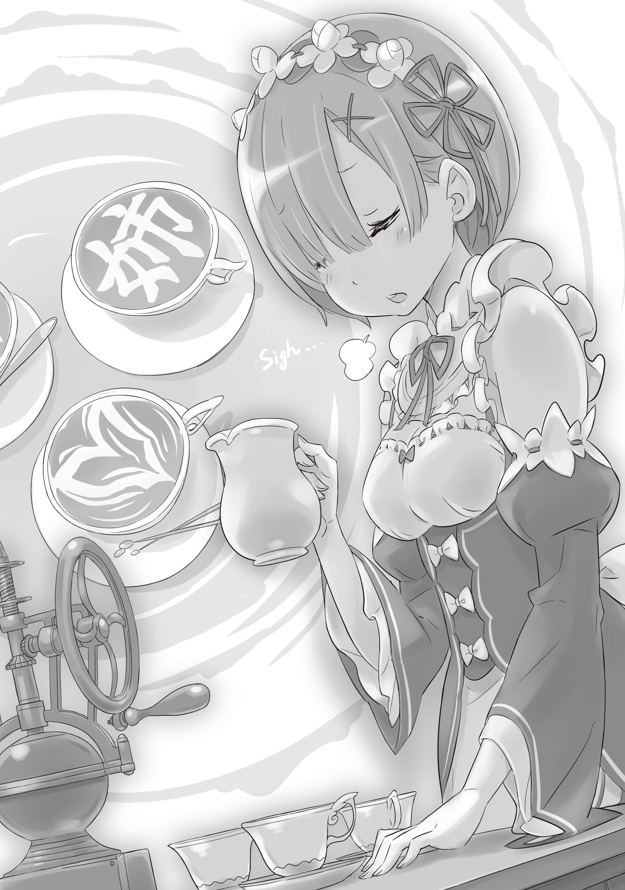

Это случилось примерно на третий день после того, как в особняке Розвааля наняли нового слугу.

— И чем это ты тут занимаешься, Субару?

Распахнув дверь, ведущую из кухни в столовую, синеволосая девушка — Рем — замерла на пороге.

Это была очаровательная особа. Из-под короткого, аккуратного каре на него смотрели большие круглые глаза, цветом напоминающие её же светло-синие волосы.

Она носила весьма открытый, но при этом функциональный костюм горничной, и была той, кто заведовал всеми хозяйственными делами в этом огромном поместье. Её навыки, кстати, полностью соответствовали её безупречному внешнему виду.

В её обязанности входила не только уборка, но и приготовление еды. Обед, на который собрались все обитатели особняка, давно закончился, и Рем как раз вернулась из кухни, чтобы проверить, как продвигается уборка столовой.

— О, Рем? С уборкой всё путём, не парься. У меня сейчас перекур, законный перерыв.

На её голос обернулся юноша с короткими, торчащими в разные стороны чёрными волосами.

Чёрные волосы были редкостью в этих краях, а его черты лица казались на удивление детскими для заявленного возраста. Цвет кожи и глаз тоже ни о чём не говорили местным, не давая ни единой подсказки о его происхождении.

Юноша с трудом втиснул своё довольно мускулистое тело в тесный костюм дворецкого и теперь изо всех сил сражался с непривычной работой. Нацуки Субару — так звали этого нового слугу, которого приютил особняк Розвааля.

На мгновение повисло молчание. Рем окинула его оценивающим взглядом. Субару же, не замечая этого, расплылся в глуповатой ухмылке, отчего уголки его пугающих, «злодейских» глаз опустились. Выражение его лица сейчас до боли напоминало мальчишку, задумавшего шалость, что лишь усилило подозрения Рем насчет того, не соврал ли он о своем возрасте.

Неужели этому парню с лицом ребёнка, как и ей с сестрой, действительно семнадцать лет?

— Субару, и что означает это лицо? Неужели ты сумел сложить все тарелки ровной стопкой, подобрав их по рисунку? Или, может, у тебя получилось расстелить скатерть без единой складки?

— Мимо! Вы что, реально держите меня за дурачка, который будет сиять от гордости, выполнив такую ерундовую работёнку?!

— Вспоминая твои успехи в первый день, не думаю, что я так уж сильно промахнулась.

— Гха-а… тут крыть особо нечем… Но погоди у меня! Я мужчина с выдающимся потенциалом роста! Скоро взовьются знамёна восстания, и твоей монополии придёт конец!

— Так скоро или прямо сейчас? Ты уж определись.

Пока Субару в досаде скрежетал зубами, Рем перевела взгляд на обеденный стол, за которым он сидел до её прихода.

Массивный стол в центре зала был рассчитан персон на двадцать, не меньше. Учитывая нынешнее количество жильцов, столько места было ни к чему, но сейчас брови Рем сошлись на переносице при виде предмета, одиноко стоящего на столешнице.

Там стояла одна-единственная чашка.

Она уже хотела было решить, что Субару просто забыл её убрать или же решил выпить чаю в перерыве, но…

— То, что внутри чашки…

— О, заметила? Короче, когда я увидел, что у вас тут есть что-то типа кофе, я сразу решил это замутить. Пришлось, конечно, попотеть, чтобы довести молоко до нужной мне кондиции, но, как видишь, оно того стоило!

Хихикая, Субару поднял руки. В одной он держал сосуд с кофу — напитком из зёрен волакийского происхождения, а в другой — ёмкость с молоком.

И то, что он сделал с этими двумя ингредиентами…

— Ты… нарисовал молоком картину на кофу?

Взглянув на чёрную гладь жидкости в чашке, на которой белыми линиями был выведен маленький котёнок, Рем невольно вздохнула. В этом вздохе смешались и удивление, и лёгкая усталость от его выходок.

— Не кофе, а кофу, понял. Его надо держать горячим, а молоко вливать так, чтобы оно сначала скапливалось на дне, и уже потом потихоньку выводить узор. Способов куча, но база такая…

Приняв вздох Рем за восхищение, Субару радостно начал лекцию. Он взял чистую чашку и, повернув её так, чтобы девушке было видно, принялся наливать кофу.

Аромат горячего напитка коснулся ноздрей Рем, и она невольно втянула воздух. Стараясь не выдать своей реакции, она тихо подошла и встала рядом с Субару, наблюдая за его руками.

Наполнив чашку кофу примерно наполовину, Субару наклонил ёмкость с молоком. Увидев вспененное, словно взбитое облако, молоко, Рем от удивления округлила глаза. Это было для неё в новинку.

— Что ты сделал с молоком? Как оно стало таким?

— Это? О-о, это кристалл моих стараний. В идеале нужно обрабатывать паром, но, сама понимаешь, кофемашины тут нет, так что пришлось импровизировать с мана-кристаллами в ванной. Пару раз я, конечно, облажался, но…

Одного лишь нагревания недостаточно, чтобы превратить молоко в такую пену. Было крайне любопытно, как Субару, начисто лишенный магических способностей, умудрился справиться с мана-кристаллом. Однако Рем вовремя вспомнила, что её задача — пресечь это безобразие, а не поощрять его.

Нужно немедленно заставить его убрать чашки и вымыть всё, а потом отчитать за то, что он дурачится посреди бела дня, пусть даже у него и перерыв. Нужно… и всё же…

— Смотри, заливаем вот так, внутрь, чтобы пена не расползалась слишком широко. Постепенно образуется слой молока, и если аккуратно «гасить» самые активные участки и подправлять их, то…

— А…

— Короче, это основы основ. И вуаля! Сердечко готово!

Подняв молочник, Субару крутанулся на месте, демонстрируя готовую работу.

Он уступил место, чтобы Рем могла получше разглядеть результат, и её глаза вновь распахнулись от изумления.

Нарисованное в чашке белое сердце, созданное из множества слоёв молока, выглядело завораживающе. У Рем вырвался восхищённый вздох: — Поразительно…

— О-о-о? Что-что? Ну-ка, скажи погромче! Дай мне услышать твою хвалу! Круто же, ну?!

— Поразительно… Такой навык мог придумать только тот, у кого слишком много свободного времени.

— А ну, быстро извинись перед всеми бариста мира!!

Похвала уже почти сорвалась с её губ, но, увидев, как Субару самодовольно задрал нос, Рем не удержалась от колкости, чтобы сбить с него спесь.

Признавать это было досадно, но работа и правда требовала мастерства и выглядела необычно. Если даже «простое» сердце выглядит так, то тот котёнок, которого Субару нарисовал первым — копия Великого Духа, сопровождающего госпожу Эмилию, — наверняка требовал ещё большей сноровки.

— Латте-арт, говоришь? Так это называется?

— Ага. Латте — это, типа, название напитка, а арт — значит искусство. В моих краях каждый второй этим балуется с детства.

— И латте-арт, и шитьё… Субару, ты, я погляжу, мастер на все руки в мелкой ручной работе?

— Когда к слову «мастер» добавляют «на все руки» с оттенком «по мелочи», сразу чувствуешь себя каким-то бесполезным в реальной жизни! Я ещё фокусы могу показывать, на гитаре играть, аятори крутить, кэндаму и йо-йо… много чего умею!

Большую часть слов из этого списка Рем слышала впервые и лишь озадаченно наклонила голову. Только слово «фокусы» было знакомым, но в этом мире оно скорее служило насмешкой над настоящей магией и не несло в себе ничего хорошего.

— Сказал и сам понял: звучит так, будто к выживанию я вообще не приспособлен. Жесть какая.

— Сам сказал, сам расстроился… С тобой точно не соскучишься, Субару.

— Вот так оценка для человека, чья жизненная цель — в старости сидеть на веранде и играть с кошкой!

Субару наигранно задрожал. Глядя на него, Рем ещё раз утвердилась в своей догадке.

Этот парень, скорее всего, рос в очень тепличных условиях. Его неумение справляться с обязанностями слуги и отсутствие хоть какого-то опыта физического труда говорили сами за себя. У него не было ни грубых рук рабочего, ни знаний, необходимых для обычной жизни. Зато владение такими навыками, как этот «латте-арт», явно указывало на избыток свободного времени, свойственный детям из богатых семей.

Рем не собиралась ни винить его за это, ни завидовать. Родиться богатым или бедным — это не выбор человека, а данность. И, несмотря на результаты, она видела, что он искренне старается научиться работать.

Поэтому, если он хочет немного поиграть во время перерыва, наверное, не стоит слишком строго его отчитывать…

— Ладно, за безжалостность я тебе потом всё припомню, Рем. А пока… держи.

— Э?..

Рем невольно издала глупый звук, когда Субару протянул ей ёмкость с молоком. Она переводила растерянный взгляд с молочника на лицо Субару, который почесал затылок и сказал: — Никаких «э». У тебя на лице написано, что ты хочешь попробовать. Я ж не зверь, чтобы проигнорировать такое желание.

— Чтобы я хотела?.. Рем вовсе не…

— Хватит стесняться, после того как сменила свою обычную бесстрастную мину на этот горящий взгляд. Ты же девочка, в конце концов. Нет ничего плохого в том, чтобы интересоваться милыми вещицами, разве нет?

Не слушая её робких возражений, Субару налил кофф в новую чашку. Поставив её перед Рем, он с подчёркнутой вежливостью произнёс: «Прошу».

— Послушай… Чтобы Рем на самом деле хотела… Ну, может быть, совсем чуть-чуть, крошечную капельку… хотя, если честно, сказать, что мне совсем не интересно, было бы ложью…

— Понял, понял. Будем считать, что я тебя заставил. Один разок, прошу тебя, сделай одолжение!

— Раз ты так настаиваешь, ничего не поделаешь…

Поскольку Субару так упорствовал, Рем, стараясь скрыть внутреннее ликование под маской вынужденного согласия, повернулась к чашке.

Вспоминая его движения: сначала наклонить чашку, медленно вливать молоко, создать слой внутри, нарисовать узор…

Она прокручивала в голове действия Субару, за которыми наблюдала во все глаза, накладывая их на свои собственные движения. Подражание… Белые линии затанцевали в чёрной жидкости и, наконец, приняли форму.

Рем обернулась к Субару. Тот кивнул ей и ободряюще произнёс:

— Ну, для первого раза — обычное дело. Не парься!

— Субару, хватит играть, возвращайся к работе. Немедленно.

Глядя на бесформенное месиво в чашке, Рем отрезала это с ледяным спокойствием, которому позавидовал бы даже айсберг.

— И что же ты делаешь, Рем?

Услышав голос за спиной, сосредоточенная Рем вздрогнула своими хрупкими плечами.

Оглянувшись на вход в столовую, она увидела стоящую в дверях девушку, как две капли воды похожую на неё саму, но с розовыми волосами и светло-алыми глазами. Это была её старшая сестра, Рам.

При виде обожаемой сестры взгляд Рем смягчился, но она тут же вспомнила, чем занималась, и её лицо напряглось. Она попыталась заслонить собой стол, но…

— Небось опять забавы Барусу?

Обмануть сестру, которая превосходила её во всём на голову, а то и на две, было невозможно. Рам с лёгкостью разгадала неуклюжую попытку Рем спрятать улики.

Пока Рем сжималась в комок, Рам прищурившись осматривала множество чашек — как удачных, так и испорченных, — которые успела сделать её сестра.

— Ты выгнала Субару из столовой, сказав, что уберёшь всё сама, почти тридцать минут назад. Но ты так и не вернулась, так что у Рам лопнуло терпение, и она пришла сама. А ты, оказывается, забыла о времени, сражаясь с латте-артом. Какое падение нравов.

Взглянув на мана-кристалл времени, цвет которого уже давно сменился, Рем побледнела. Это провал. И, что хуже всего, сестра это увидела.

— Чтобы Рем так увлеклась какой-то игрой… довольно редкое зрелище.

— Прости, сестрица. Я сейчас же всё уберу. И задержку в работе наверстаю. Я не должна была тратить время на такое…

— Глупышка. Рам ведь не злится. Просто удивилась.

Увидев, как Рем вытянулась в струнку, губы Рам тронула едва заметная улыбка, предназначенная только для самых близких.

Она налила кофу в пустую чашку, взяла оставленное молоко и начала плавно вливать его.

— Усердие в работе — это твоя хорошая черта, Рем, но иногда полезно проявить усердие там, где от тебя не требуют результата. Если в сердце нет покоя, то и дела не будут ладиться.

— Слова господина Розвааля?

— Да. Как и ожидалось от господина Розвааля. Золотые слова. Рам тоже так считает.

С мечтательным выражением лица, полным преданности хозяину, Рам с нежностью смотрела на чашку. Когда она закончила и подвинула её к Рем, та увидела внутри…

— Это… Я никогда не видела такого узора. Узора… нет, это буквы?..

— Это слово «сестра» письменностью родины Барусу. Он мне тоже хвастался, и, хотя меня это раздражало, я решила повторить.

Рем не была знакома с этими символами, но в том, что нарисованное было верхом мастерства, сомневаться не приходилось. Восхищённая ловкостью сестры, она робко спросила:

— Сестрица, ты тоже тренировалась делать этот… латте-арт?

— Вовсе нет. Латте-арт, говоришь? Барусу как-то делал это при мне, вот я и повторила то же самое.

Услышав, как сестра говорит об этом словно о сущем пустяке, Рем задержала дыхание и на миг прикрыла глаза.

Потратив на внутреннюю паузу ровно столько времени, чтобы не вызвать у сестры подозрений, Рем улыбнулась.

— Как и ожидалось от тебя, сестрица. Субару наверняка удавился бы от зависти.

— Хм, может, и стоит методично раздавить все таланты Барусу один за другим… В любом случае, на сегодня хватит. Рам отнесёт это в мойку.

Бросив это напоследок, Рам забрала ёмкости с кофу и молоком и направилась в сторону кухни.

Проводив её взглядом, Рем перевела взор на стол. Она посмотрела на ряд своих неудачных попыток, а затем — на шедевр с надписью «сестра», который Рам создала с первого раза. Губы Рем дрогнули в тихом вздохе.

— Ты и правда невероятна, сестрица.

Она, которая не смогла сделать ничего путного, и сестра, у которой всё получилось идеально без всякой тренировки.

Рем знала это и раньше, но каждый раз, когда их вот так сравнивали, она заново осознавала свою незрелость.

И это чувство заставляло Рем снова и снова корить себя.

— Нужно всё убрать…

Пробормотав это словно оправдание самой себе, Рем начала составлять грязные чашки на поднос.

И напоследок она подняла чашку, на которой рукой сестры было написано «сестра».

— М-м… Горький.

Пригубив уже остывший напиток и разрушая молочный узор, она прошептала: — Нужно научить Субару правильно молоть зёрна.
