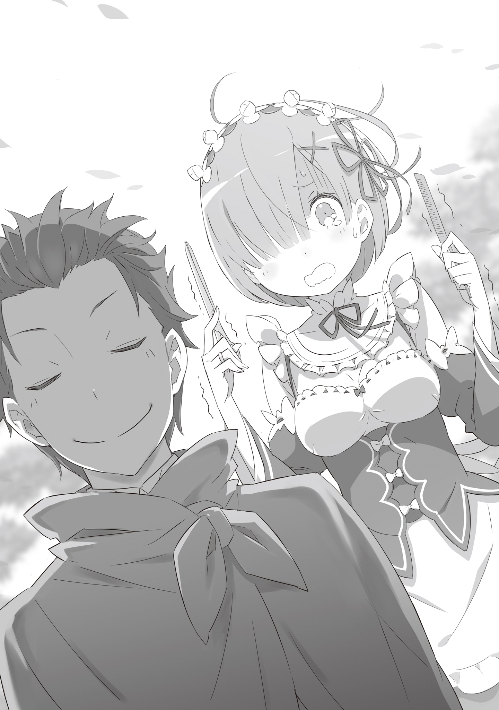

Сердце колотилось как безумное, а кожу, казалось, обжигало жаром.

Готовка, уборка, стирка и прочие многочисленные повседневные обязанности, конечно, никуда не делись, но большая часть разума Рем была занята вовсе не работой, а совсем иными мыслями.

Казалось бы, при таком раскладе руки должны действовать небрежно, а эффективность труда — падать, но, напротив, её хвалили за ещё более тщательную и безупречную работу, чем обычно. Так что даже поругать себя было не за что.

Рем семенила по коридору быстрым шагом, отдав половину мыслей планированию оставшихся задач, а вторую половину — причине той сжигающей страсти, что поселилась в груди.

— А…

Внезапно заметив его, она не сдержалась, и из горла вырвался хриплый звук.

Услышав собственный голос, в котором отчётливо звучала расслабленная радость, Рем слегка покраснела и ускорила шаг.

— О, уже закончила с делами, Рем?

Заметив присутствие Рем за спиной, парень, что шёл впереди, обернулся и улыбнулся.

Короткие чёрные волосы. Острый, пронзительный взгляд. Улыбка, скорее озорная, чем исполненная достоинства — улыбка мальчишки-сорванца. И каждая из этих черт заставляла «рог» внутри Рем трепетать.

Перед склонившим голову набок юношей Рем остановилась и, естественно улыбнувшись, произнесла: — Да. Не хочешь чаю, Субару?

И назвала имя возлюбленного с выражением лица, достойным истинно влюблённой девы.

В эти дни Рем уже вполне осознавала, что поражена неизлечимой лихорадкой.

Один юноша никак не шёл у неё из головы, и времени, когда она о нём не думала, в сутках было гораздо меньше, чем обратного. В буквальном смысле слова: и во сне, и наяву.

Неужели Рем такая ветреная демоница?..

Иногда она даже сомневалась в нормальности своей влюблённости, думая, что это уже перебор.

Для Рем самым близким примером человека, поражённого той же лихорадкой, была сестра. Она понимала, что преданность Рам господину Розваалю сродни тому чувству, что Рем питает к Субару. Однако ей было сложно представить, чтобы сестра проживала свои дни, точно так же сгорая от легкомысленных эмоций, как это происходило с самой Рем.

Сестрёнка просто потрясающая.

Это было неизменное благоговение, которое Рем испытывала к Рам. Пусть сестра и лишилась рога, пусть результаты её работы во всём уступали результатам Рем, уважение к ней не уменьшилось ни на йоту.

Именно поэтому Рем подозревала, что её собственная лихорадка, возможно, протекает куда тяжелее, чем у сестры.

— Рем?..

Мужской голос скользнул по барабанным перепонкам. Голос, которому пока не хватало жёсткости, чтобы зваться мужским, но который уже выбирался из детской незрелости.

Услышав оклик совсем рядом, Рем склонила голову набок, качнув синими волосами, и посмотрела на сидящего рядом.

— Да, что такое, Субару?

— Не, ничего такого… но мы не слишком близко сидим? Тебе пить-то удобно?

— Разве? Я думаю, ничего подобного.

Они сидели так близко, что чувствовали дыхание друг друга. На кривую усмешку Субару Рем ответила голосом, полным тепла.

Сейчас они находились в гостиной поместья Розвааля, сидели рядышком на одном диване и наслаждались чаем. Левая половина тела Субару плотно прижималась к правой половине тела Рем.

Вначале между ними было некоторое расстояние, но Рем потихоньку пододвигалась, и вот результат.

— Субару, не хочешь ещё печенья?

— О, ещё осталось? Это радует. Те, что готовишь ты, Рем, реально вкусные.

— Да. Субару в прошлый раз меня похвалил, так что… Как думаешь, штук ста будет достаточно?

— У тебя план меня откормить и съесть, что ли?! Пары-тройки хватит!

Печенье со сладким кремом очень понравилось Субару, и за последние несколько дней оно не раз появлялось на столе во время их чаепитий. Рем поспешно поднялась.

— Тогда я принесу. Субару, ты ведь не расстроишься, если я отойду?

— Я ж не буду вытворять ничего такого ужасного. Если хочешь, давай пообещаю. Обещание.

— Да, давай.

Рем тут же протянула мизинец, будто только и ждала этого момента. Субару, усмехнувшись, с видом «ну что с тобой поделать», протянул свой в ответ. Они сплели пальцы и, произнеся короткую речёвку, скрепили обещание.

— Клятва на мизинцах!

Наверное, именно это обещание перевело мою лихорадку в терминальную стадию.

Происшествие со зверодемонами, случившееся около недели назад… Утром того дня, когда раненый Субару очнулся после всех событий, Рем повинилась перед ним. А он в ответ поймал её сердце в сети своим сладким, нежным наказанием.

То самое обещание, о котором они условились — обещание совместного будущего, — полностью растопило Рем.

В последнее время она стала просить от него клятвенных обещаний по поводу любой мелочи, превращая их в драгоценные залоги будущего. А так как Субару с кривой усмешкой, но всё же соглашался на них, влюблённость Рем лишь разрасталась.

— Кстати, раз уж зашла речь об обещаниях…

Голос Субару остановил Рем, которая уже собиралась выйти из комнаты, всё ещё ощущая тепло его мизинца. Субару запустил пальцы в свои волосы перед обернувшейся Рем и, как всегда, озорно ухмыльнулся: — Мы же договаривались, что ты меня подстрижёшь. Могу я, наконец, об этом попросить?

Наверное, он и понятия не имел, как сильно забилось сердце Рем от этих слов.

Подстричь волосы Субару своими руками.

Если выразить это словами, обещание казалось предельно простым, но для Рем оно было важнее всего на свете.

Потому что это было…

— Это ведь самое первое обещание, которое я дала Субару.

Субару и Рем дали друг другу это слово в лесу, когда отправились спасать деревенских детей. В то время Рем ещё не была влюблена в Субару.

Поэтому исполнение этого обещания имело для Рем огромное значение.

— Не то чтобы я забыл, просто суматоха была, сама понимаешь. Я подумал, что буду выглядеть тем ещё наглецом, не умеющим читать атмосферу, если сразу с таким полезу, вот и отложил.

— Какая несвойственная тебе тактичность, Субару. Было бы лучше, если бы ты, как обычно, вываливал всё, что придёт в голову, а потом в панике пытался замять свои промахи.

— Эй!? Давненько я этого не слышал, но яд Рем всё ещё жалит прямо в сердце!!

Глядя на Субару, который скорчился на стуле, схватившись за грудь, Рем позволила улыбке стать чуть шире. «И эта его черта тоже милая», — подумала она, но твёрдо решила не говорить этого вслух.

Чтобы выполнить обещание о стрижке, они вышли во внутренний двор особняка. Посреди ухоженного зелёного газона поставили стул, обернули вокруг шеи Субару полотенце — и приготовления были завершены.

— Стричься на улице — странное ощущение. Видел такое в анимэ и манге, но в жизни…

— Стричь в комнате хлопотно — и готовиться долго, и убирать потом. А здесь достаточно просто стряхнуть волосы, а потом вымыть только голову. Насколько коротко можно стричь?

На взгляд Рем, волосы Субару и сейчас выглядели достаточно короткими. Разве что немного бросалась в глаза их неопрятная, неравномерная длина, так что простое подравнивание уже значительно улучшило бы вид.

— Хм-м, я плохо умею задавать длину словами. Рем, подстриги так, чтобы, по-твоему, я выглядел максимально круто.

— Субару прекрасен в любом виде.

— Так мы со стрижкой никогда не закончим!!

Рем прижала руками плечи Субару, который начал трястись на стуле, заставив его замереть, и внимательно всмотрелась в его голову. В её ответе не было ни капли лжи, но фактом было и то, что ответ этот не совсем подходил к ситуации.

Как сделать так, чтобы все остальные тоже поняли те чувства, которые я испытываю к Субару?

— Какая огромная ответственность…

— Эм, Рем? Тебе не обязательно так серьёзно над этим размышлять, ладно? Честное слово, мне и того хватит, о чём мы говорили раньше: просто подровнять кончики и проредить…

Субару робко предложил вариант, но сейчас его голос не достигал разума Рем. Слегка смочив волосы Субару из пульверизатора, Рем взяла в руки серебряные ножницы и приготовилась к битве.

Она попыталась начать, но её рука остановилась. Нет, не остановилась. Она ужасно дрожала.

Клац-клац.

Рем с ужасом смотрела на свои трясущиеся руки. Она пыталась сохранять спокойствие, но всё напряжение её тела словно сконцентрировалось в правой руке, вызывая эту дрожь.

— Субару, беда. Дрожь в руках не унимается.

— А? Да ладно, подумаешь, немного трясутся… Нифига ж себе трясутся!? Эй, это вообще нормально? Ты так дрожишь, будто собралась мне трепанацию черепа делать! Ты точно умеешь стричь?!

— Я занимаюсь волосами сестрёнки и господина Розвааля… но с Субару это впервые, и…

— С такой логикой ни одна парикмахерская бы не открылась!!!

Несомненно, если отказывать каждому новому клиенту, бизнес цирюльника не построишь. Но вне зависимости от этого факта, стоило Рем попытаться поднести ножницы к волосам Субару, как её руки сводило судорогой.

— Э-эх, Рем. Я, конечно, не могу сказать с пафосом: «Можешь косячить! Не парься!», но ты не нервничай так. Даже если отрежешь лишнее, за недельку отрастёт.

— Но позволить Субару ходить неделю с беззащитной головой по вине рук Рем…

— Налысо-то меня брить не надо!?!?

Снова успокоив руками Субару, который начал раскачиваться на стуле, Рем попыталась унять дрожь и, продолжая бороться с собой, внезапно озвучила пришедшую мысль.

— Субару, тебе не страшно вот так доверяться Рем?

Слова сорвались с губ сами собой. Но едва прозвучав, они навалились на плечи Рем тяжёлым грузом смысла.

Да, именно так. Сколько бы оправданий она ни придумывала, факт того, что Рем чуть не убила Субару, оставался неизменным. В лесу со зверодемонами Рем дважды подвергала Субару смертельной опасности. Если считать тот раз, когда Субару использовал себя как приманку, то трижды.

— В лесу Рем дважды показала Субару свою истинную сущность. Сущность демона… И даже до этого, Рем…

Было время, когда она подозревала, что Субару — опасный элемент, угроза поместью, подлежащая устранению. Это подозрение наверняка опутало слабое сердце Рем и рано или поздно взорвалось бы где-то ещё.

В итоге убийства не случилось, но Рем наверняка убила бы Субару.

Это чувство вины до сих пор терзало Рем как агрессора, а уж Субару как жертве должно было быть куда тяжелее. Так почему же он улыбается ей?

Почему так беззащитно подставляет ей спину?

— Рем.

Субару позвал её по имени тихим голосом. В горле встал ком, и она не смогла сразу ответить. Страх перед тем, что он скажет дальше, и желание это услышать боролись в её груди.

— В моём родном мире есть одна сказка. Называется «У короля ослиные уши».

— А, э-э?..

— У одного короля были длинные уши, как у осла. Когда королю нужно было подстричься, он звал придворного цирюльника. Но любого брадобрея, который понимал, что у короля ослиные уши, и начинал смеяться, тут же обезглавливали. Но был один парикмахер, который кое-как сдержался. Однако он не мог вынести тяжести королевского секрета, поэтому вырыл яму в горах и закричал в неё.

Субару сложил ладони рупором у рта и громко крикнул: — «У короля ослиные уши!!!» — вот так. Он повторял это раз за разом, пока растущие рядом деревья не запомнили эти слова. И потом, если сделать из такого дерева дудочку и дунуть в неё, она пела: «У короля ослиные уши». А так как дудеть стали по всей стране, то скрывать это стало бессмысленно.

— И что?..

История показалась интересной, но Рем не могла понять, к чему он клонит. Она посмотрела на Субару с немым вопросом на лице, а тот, глядя на неё, ухмыльнулся и заорал: — У Рем на голове рог демона!!!

— !!!..

От того, что Субару снова закричал, да ещё и такое, Рем подпрыгнула от испуга. Видя реакцию Рем, Субару хлопнул себя по коленям, обернулся и сказал: — Королю было стыдно за ослиные уши, поэтому он рубил головы тем, кто мог разболтать секрет. Рем, тебе стыдно за то, что ты демон?

— Н-нет. Рем не стыдится своего происхождения… Сейчас уже нет.

— Ты считаешь непростительным, что я разболтал твой секрет?

— Нет. Рем считает, что ей нет нужды скрывать, что она демон.

Когда она твёрдо ответила, глядя прямо в глаза Субару, тот снова уселся на стуле поудобнее.

— Ну, тогда нет проблем. Раз вероятность того, что Рем причинит мне вред, никак не связана с тем, что она демон, то у меня больше нет причин дрейфить. Фу-х, успокоился.

— Н-но ведь Рем… Субару…

— Любого мужчину отец с детства учит: разозлишь девочку — жди беды. Так что я сам виноват, что забыл это и накосячил. Мы квиты.

Рем лишилась дара речи от такой грубой, топорной логики. Бросив взгляд через плечо на молчащую Рем, Субару добавил своё «Ну так вот…», а затем спросил: — Как там дрожь в руках?

— А…

Услышав вопрос, Рем опустила взгляд и поняла, что дрожь исчезла. Даже когда она направила кончики ножниц к голове Субару, пальцы оставались твёрдыми.

Она не знала, что именно в словах Субару повлияло на её сердце. Ведь теперь каждое его слово оказывало на неё огромное влияние.

Но она поняла одно: её трусливое сердце растворилось в пламени этой лихорадки и исчезло.

Видимо, поняв, что дрожь унялась, Субару расслабленно откинулся на спинку стула. Затем он указал пальцем на свою голову: — Сделай всё круто. Так, чтобы Эмилия-тан невольно ахнула.

Для Рем эти слова несли в себе очень, очень колкий подтекст. Но этот мальчишка, который даже не замечал таких вещей, был ей настолько дорог, что Рем, улыбаясь, ответила:

— Субару прекрасен всегда.
