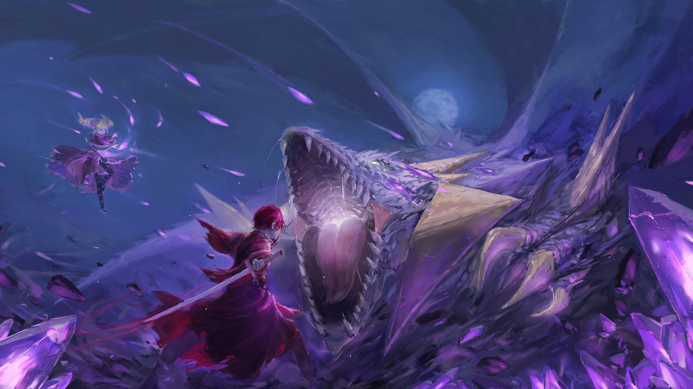
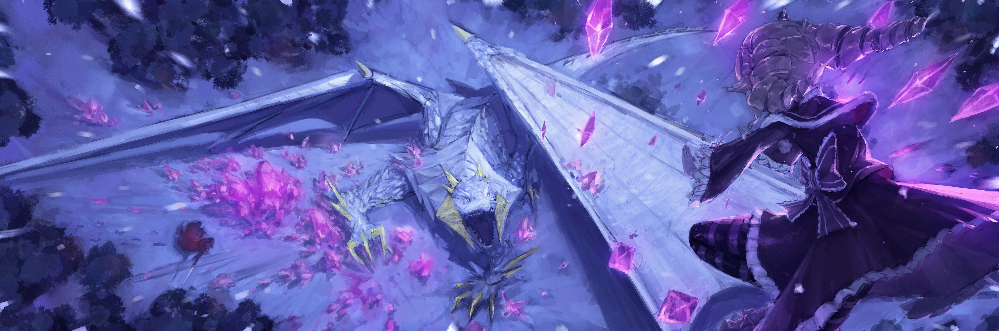
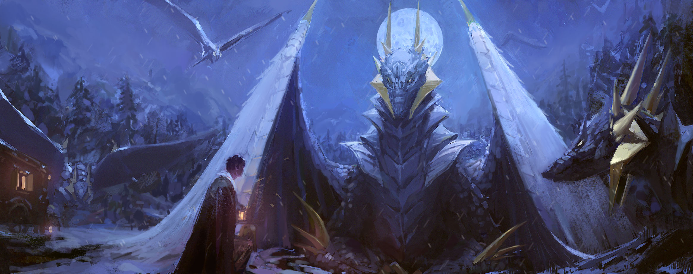

Ночь, полная звёзд

Беатрис: И вот, Бетти и Братец, вместе с безрассудным человеком, достигли конца путешествия, которое длилось меньше десяти дней, в самом деле.

Рюдзу: Э-это, безусловно, потрясающее приключение……

Несмотря на то, что вначале она только неохотно ворчала, как только она набрала темп декламации, слова вылетали из нее, как будто их было слишком много.

Помешивая ложкой горячую жаровню, Рюдзу периодически показывала мимикой и словами напряжение, которое она испытывала, — поистине превосходный слушатель.

Благодаря этому Беатрис невольно предалась воспоминаниям.

Как бы то ни было, история подошла к критическому моменту — уничтожению дракона, но……,

???: ……Вот это действительно интересная история. Что будет дальше?

Беатрис: Фу, я полагаю.

Не успела она продолжить рассказ, как услышала неприятный голос. Хотя он доносился сзади, ей не нужно было оборачиваться. Ведь он пришел к ней заранее.

???: Фу, это не лучшее приветствие, не так ли. Не позволите ли вы мне присоединиться к вашему рассказу?

Встав так и наклонив туловище, человек, находящийся где-то между юношей и мужчиной, с длинными темно-синими волосами, одетый в хитроумную дьявольщину, вглядывался в лицо Беатрис.

Его появление заставило Рюдзу улыбнуться вместо Беатрис.

Рюдзу: Розвааль-сама, вы закончили со своими делами?

Розвааль: Да, все прошло довольно гладко. Помогло то, что все люди здесь такие отзывчивые. Все благодаря их помощи. Это должно было сделать еще один шаг ближе к осуществлению самого заветного желания Наставницы.

Рюдзу: Я рада слышать это…… Беатрис-сама, вы не должны так низко вешать голову.

Голубые глаза ухмыляющегося юноши…… появление Розвааля заставило Беатрис нахмуриться еще больше, впоследствии отказавшись от попытки удержать взгляд, брошенный вниз, поскольку это было бесполезно.

Беатрис: Поняла, поняла, полагаю. Поражение принято, в самом деле…… ты, откуда ты подслушивал, я полагаю. Так неприятно, в самом деле.

Розвааль: Подслушивание, это неприятный способ выразить это. Начнем с того, что уже давно было решено, что мы будем ужинать здесь. Если вы начнете предаваться воспоминаниям в таком месте, то это само собой разумеющееся, что это дойдет до моих ушей.

Беатрис не успела произнести даже «Тьфу», как Розвааль пожал плечами.

……Не относясь исключительно к времени пребывания в Святилище, трапеза должна была проводиться как можно чаще со всеми.

Это было предписание, установленное Ехидной, и ни Беатрис, ни Рюдзу, ни даже Розвааль не могли его нарушить.

Хотя, пожалуй, единственной, кого мучило это предписание, была Беатрис, которая была против того, чтобы составлять компанию Розваалю.

Рюдзу: Розвааль-сама, вы, случайно, не питаете никакого интереса к предыдущей жизни Беатрис-сама?

Розвааль: Конечно. Жаль, что Беатрис мало рассказывает о своем прошлом. Поскольку нас часто сравнивают, я слышал о существовании ее так называемого старшего брата, но……

Беатрис: Полагаю, ты не стоишь даже сравнения с Братцем. Не будь тщеславным, в самом деле.

Розвааль: Ну вот, именно об этом я и говорю.

Пройдя по дорожке вокруг раскаленной на огне жаровни, Розвааль смело уселся рядом с Беатрис. Даже когда она отодвигалась, он неизменно пододвигался ближе, преодолевая расстояние между ними.

У этого человека не было другого намерения, кроме как от всей души заставить Беатрис бесконечно стонать.

Розвааль: Это шанс приблизиться к загадкам вашего Братца. А еще мне очень интересно, чем закончилось ваше первое приключение, Беатрис.

Рюдзу: Мне тоже невероятно любопытно. Сможет ли Тоска-сама защитить свою подругу детства?

Найдя союзника в наивной Рюдзу, одиозные зрачки Розвааля вытаращились на Беатрис.

Конечно, у нее не было возможности не рассказывать все остальное после того, как она зашла так далеко, но если это означало порадовать Розвааля, то просто по человеческой природе она не сможет пересказать все с удовольствием.

Беатрис: ……Бетти — возвышенный Дух, так что человеческая природа — не совсем корректный термин, я полагаю.

Розвааль: Нет нужды суетиться из-за таких незначительных семантических нюансов. А теперь, учитывая, что меня с ним даже сравнивать не стоит, интересно, какие подвиги совершит твой великолепный Братец?

Беатрис: В самом деле, ты что-то имеешь против Братца? Такой упрямый, я полагаю.

Беатрис нахмурила брови в сомнении, его речь показалась ей странно колючей по сути. Но Розвааль ничего не ответил, а Рюдзу горько усмехнулась с искаженным выражением лица.

Беатрис: Смутное ощущение, но продолжим, в самом деле. ……Приблизительно через десять дней Бетти и остальные прибыли в Карнатц за день до ночи полнолуния.

Рюдзу: Затем, Беатрис-сама и жители деревни работали вместе, и истребление дракона……

Беатрис: ……Этого не произошло, в самом деле.

Мысль, лишенная должной бдительности по отношению к этому обстоятельству, действительно достойна Рюдзу, но реальность не разворачивалась в том же ключе.

Помня о взглядах двух слушателей, Беатрис снова вернулась к той ночи.

Беатрис: Причина, по которой он пришел к Бетти и всем остальным, в том, что у него не было союзников в деревне, я полагаю.

Тоска: ……Почему бы всем не попытаться встать!!!

Разъяренное мычание, в компании с мощным ударом ногой в пол от Тоски.

Оценив его как обладателя довольно сдержанного для своего возраста характера в результате их встречи и путешествия, Беатрис была немало удивлена, увидев возмущенный вид Тоски.

Однако еще больше ее поразила реакция жителей Карнатца, приветствовавших Тоску.

В ночь перед обещанным полнолунием со Злым Драконом Тоска вернулся домой, принеся помощь из Дворца Ведьмы. Было бы приятно, если бы они обрадовались тому, что не придется приносить в жертву молодую девушку из деревни.

В этом случае, несмотря на то что им пришлось бы зависеть от других, их цель, несомненно, была бы достигнута.

Однако ответы, которых они добились в действительности, противоречили любым подобным предположениям и ожиданиям.

???: Какую глупость ты совершил, Тоска. Пошел к Ведьме Мудрости и привез оттуда дочь Ведьмы… Как же мы сможем отплатить за это.

Беловолосый дед, староста деревни, с трепетом в голосе произнес эту речь, уединившись перед Тоской в своем доме.

Услышав это, краснота на лице Тоски усилилась еще больше,

Тоска: Я не хочу, чтобы все жители деревни брали на себя тот долг, который я понес! Я самовольно отправился к Ведьме-сама. Поэтому я сам заплачу за себя.

Староста: Это вполне естественно! Твои действия были потаканием своим желаниям. Однако, было бы лучше, если бы это было сделано для заимствования могущества Ведьмы……

Его слова оборвались на полуслове, циничный взгляд деревенского старосты устремился на Беатрис и Пака.

Его взгляд был неприятен, но не до такой степени, чтобы его можно было ожидать. У Беатрис было просто невеселое выражение лица. Однако именно Тоска не мог простить этого неприязненного взгляда.

Тоска: Я попросил Беатрис-сама и Пака-сама пойти со мной. Пожалуйста, не направляйте на них подобные взгляды. Я буду работать вместе с ними и……

Староста: …Спасти Ремину, ты заявляешь? Сможете ли вы противостоять этому страшному Злому Дракону?

…………

Староста: Глупо. Воистину глупо, Тоска. Зачем ты ушел из деревни? Если бы ты остался в деревне, ты мог бы провести столько же времени с Реминой, хотя и на скудные десять дней.

Выражая жалость, деревенский староста перевел взгляд за пределы здания. За окном вдали виднелось что-то похожее на святилище, деревянная дверь, закрывающая вход, была плотно заперта.

Староста: Ремина внутри святилища. Готовясь к завтрашнему дню, она приступила к ритуалу очищения. Теперь тебе даже не разрешат встретиться с ней.

Тоска: Ремина……

Староста: Ох, Тоска, зачем ты ушел из деревни. Если бы ты остался здесь, то у тебя было бы время и воспоминания с Реминой. Так же, как и ты, Ремина относилась к тебе с нежностью……

Собирался ли он отчитать его или просто был безнадежно невнимателен, в любом случае, замечания деревенского старосты вызвали ярость Тоски, которую нельзя было нарушать.

Тоска впился взглядом в деревенского старосту, оскалив клыки,

Тоска: Ремина! Тот, кого любит Ремина, это не я, а старший брат……! Разве вы, как отец Ремины, не должны знать об этом больше всех!

Отбросив это утверждение, Тоска выскочил из дома старосты.

Пак обменялся взглядом с Беатрис, его хвост подрагивал от силы яростного шторма, порожденного Тоской. Беатрис выпятила свою челюсть, прежде чем Пак, скользя по воздуху, устремился за исчезающей фигурой.

После ухода Тоски и Пака остались только Беатрис и староста деревни.

Беатрис: ……Бетти тоже считает, что это довольно глупо, в самом деле. Но, полагаю, его решение положиться на Ведьму Мудрости было верным. Бетти — не кто иная, как доверенное лицо Ведьмы.

Староста: Однако, главная Ведьма-сама отсутствует. Это ли не то, что олицетворяет покинутость судьбой.

Беатрис: Полагаю, именно тогда, когда у тебя появился шанс, ты намерен отказаться от жизни своей собственной дочери?

Староста: В обмен на деревню!

Грозно глядя на Беатрис, деревенский староста ударил кулаком по полу, положив начало отчету.

Ярость и осознание, застывшие в его взгляде, свидетельствовали о том, что он сопоставил масштабы собственной дочери и деревни, серьезно все обдумав.

Отныне он просто предпочел свое положение старосты деревни своему положению отца.

Староста: ……Тоска был опрометчив в своих требованиях. Во что бы то ни стало, пожалуйста, вернитесь.

Беатрис: Злой Дракон…… Драконы используют горы в качестве жилищ. Это остается неизменным, независимо от того, будет ли это Злой Дракон или нет. Полагаю, он поселится на горе, виднеющейся на юге деревни. ……Жертвоприношения, в самом деле, на этом не закончатся.

…………

Беатрис: Полагаю, ты такой же неотесанный, как и следует из названия.

Смахнув пыль с подола своего платья, Беатрис предпочла откланяться и от деревенского старосты.

В самом конце, когда Беатрис уже собиралась уходить, она услышала, как староста пробормотал «Ремина……», но она не замедлила шаг.

Однако по ее разговору со старостой и жителями деревни, которые избегали показываться, она могла сказать, что,

Беатрис: Не у всех, похоже, хватит духу сразиться со Злым Драконом, я полагаю.

К тому моменту, когда Тоска в одиночку прибыл во Дворец Ведьмы, она в какой-то степени предвидела это.

В основном, штурм Дворца Ведьмы стандартно осуществлялся после создания группы. Отправлялись в путь группы из более чем десяти человек, но тех, кто добирался до Дворца, было всего один или два, вот что это было за испытание.

И все же Тоска выполнил его в одиночку. Это намекало не только на аспект его исключительной подвижности и силы воли, но также предвещало негатив изоляции.

У Тоски не было союзников. ……Никто не стремился уладить дела со Злым Драконом.

Тоска: ……Прошу прощения за то, что показал себя с такой стороны, это было жалко.

Беатрис проводили в заднюю часть святилища, она отошла от дома деревенского старосты и следила за ответами Пака. Тоска поклонился и извинился, прислонившись к ограде, огораживающей деревню.

Левитируя рядом с ним, Пак обнял себя за хвост со словами «Хм».

Пак: Это было жалко? Мне кажется, что ты единственный не жалкий в этой деревне.

Беатрис: Бетти согласна, я полагаю. Для человека ты, в самом деле, на лучшей стороне.

Тоска: ……Хаха, такой способ изложения был бы немного……

Получив утешение от Пака и Беатрис, на лице Тоски вновь появилась улыбка.

Конечно, это была простая бравада, но быть приободренным означало быть приободренным. Прежде чем это сойдет на нет, они должны поговорить так, как им неизбежно следовало бы.

Беатрис: ……Полагаю, не похоже, что в этой деревне можно найти каких-либо союзников, которые помогут нам в битве.

Пак: Да, надежды мало. Похоже, все так напуганы Злым Драконом, что замкнулись в себе.

Деревня была маленькой и замкнутой. Все в деревне, должно быть, слышали голос Тоски, когда он зарычал в доме деревенского старосты. Но никто не пытался выйти наружу.

И Ремина, уединившаяся в святилище, призывая на себя ритуал очищения, не стала исключением.

Пак: Ты не окликнешь ее?

Тоска: ……После того, как только что выкрикнул вершину жалкости?

Глядя на святилище, Тоска ответил Паку, который наклонил шею.

Его пессимизм был вполне естественным, учитывая высказывания Тоски незадолго до этого. Для подруги детства, которую он хотел спасти, Ремины, любимым человеком был не он, а его старший брат.

Хотя, если судить только по слухам, которые они узнавали то тут, то там во время своего путешествия, он казался весьма небывалой личностью.

Тоска: Если бы старший брат был здесь, нам бы не пришлось беспокоиться о том, что Ремина станет жертвой дракона. Я уверен, что ни староста, ни жители деревни не боялись бы дракона.

…………

Тоска: …Но тот, кто здесь, — это я. Я.

Он думал, что снова начнет излагать слова, сетуя на собственное бессилие, опустив свой взгляд. Однако перед молчаливыми Беатрис и Паком Тоска выделил короткие слова, в которых содержался стимул смотреть вперед по собственной воле.

Тоска кусал губы, сжимал кулаки и мощно, властно вцепился рукоять меча на бедре.

Тоска: Ну и что, что это Злой Дракон. Как будто я когда-нибудь отдам Ремину просто большой ящерице вроде этой…… Бой с драконом куда лучше, чем кастет старшего брата.

Беатрис: Это сравнение просто странное, в самом деле……

Пак: Но, должен сказать, у него прямо-таки мальчишеское выражение лица.

То ли многообещающе, то ли жалко, но Беатрис опустила плечи, видя, как решительно настроен Тоска. Однако Пак, казалось, придерживался другого мнения, выглядя как-то взволнованно.

Беатрис: Что ж, для Бетти это лучше, чем отдавать свои силы трусу, я полагаю.

Она потратила девять дней и проделала весь этот путь не для того, чтобы наблюдать за спором людей. Это было для хаоса, который разжег дракон — его прорывом, и чтобы доказать.

Рука спасения Ведьмы Мудрости, которую ищут люди по всему миру, ее определенное могущество и обещание.

Беатрис: В самом деле, у Бетти и Братца нет возможности отказаться от участия. Ты будешь нести ответственность за то, что вывел нас за пределы Дворца, я полагаю.

Тоска: ……Ты действительно беспощадна, Беатрис-чан.

Беатрис: Ты…… мгх.

Когда она попыталась возразить ему, что сейчас не время прерываться, взгляд Тоски перехватил ее.

Серьезный взгляд и выражение лица свидетельствовали о его решимости. Если столь непринужденное обращение к Беатрис совпадало с этим в обмене, то она могла не обращать на это внимания, по крайней мере, в этот раз.

Беатрис: Однако второго шанса у тебя не будет, в самом деле.

Тоска: Я в курсе…… Похоже, мы должны разработать план. Если бы у нас было больше союзников из деревни, мы могли бы броситься на Злого Дракона в лоб, но…

Пак: У тебя была такая тупоголовая стратегия? Я бы сказал, что это немного безрассудно против дракона.

Даже Пак был слегка поражен столь беспорядочной и бессистемной политикой. То же самое относилось и к Беатрис, но именно сейчас, в сложившейся ситуации, ей была крайне необходима «Мудрость».

По словам Пака, бросить вызов дракону лоб в лоб, не имея других мер, было сродни самоубийству, а не просто плохому плану.

Разумеется, необходимо было устроить засаду.

Беатрис: Завтра вечером, я полагаю, каким будет порядок представления жертвоприношения?

Тоска: ……? На полпути к вершине горы на юге, Ремина будет доставлена туда к Злому Дракону.

Пак: Ее принесут в жертву. Хмм хмм…… Бетти, придумала что-нибудь?

Беатрис мысленно представила программу жертвоприношения, подперев рукой свой подбородок. Потратив минуту на размышления, она пришла к следующему выводу……,

Беатрис: Из дома твоей подруги детства принеси мне одежду, пропитанную ее ароматом, в самом деле.

На указание Беатрис, обманувшее ожидания, Тоска отреагировал так, как будто забыл о своей обиде и беспокойстве.

Тоска: ……Когда все закончится, может, ты еще немного посмотришь на меня, а не на старшего брата?

Перед началом действия у Тоски не было никакого обмена мнениями со своей подругой детства.

Просто прислонившись к стене святилища, он в одностороннем порядке загадал желание.

Ответа на это не последовало, а даже если бы и последовало, Тоска наверняка не хотел, чтобы это дошло до его ушей. Таким образом, это был лишь обряд, необходимый для окончательного принятия его решения.

Беатрис и Пак промолчали, сочтя, что указывать на это было бы хамством.

И все трое начали действовать ночью перед полнолунием…… другими словами, в тот же самый день.

Беатрис: ……Эта гора — маленькая, убогая, отдаленная, я полагаю. Похоже, это не слишком священная земля, в самом деле, остается загадкой, почему дракон, могущественный сам по себе, сделал это частью своей территории.

Пак: Возможно, дело в том, что здесь серьезная нехватка гор. Из того, что я слышал, есть также драконы, которые отказались от гор в качестве жилищ и живут в замках после того, как изгнали оттуда людей. На данный момент это просто угон.

Беатрис: Какой дикий поступок, я полагаю. В конце концов, они просто ящерицы с крыльями, в самом деле.

Пак: Эй, прочь Бетти.

Пак сдержанно хихикнул, прижав кончик хвоста к своему рту. Щекоча Пака за шиворот, Беатрис двигала телом и бедрами.

Части ее тела напрягались, если она долго оставалась в одном положении. ……Беатрис была создана своей матерью, «Ведьмой», но такие обременения ее тела ничем не отличались от человеческих.

Она также не могла, подобно Паку, освободить свое тело и по своему желанию погрузиться в ману, находящуюся в воздухе. Единственной реорганизацией, разрешенной Беатрис, были только платье и волосы, составляющие ее облик.

Тоска: Я говорю это снова…… но вы двое, кажется, очень хорошо ладите.

Пробормотал Тоска, несколько нервно наблюдая за резвящимися братом и сестрой с близкого расстояния.

Даже во время путешествия смех и поддразнивания Беатрис и Пака не утихали. Если бы он был нетерпеливым юнцом, то, несомненно, взорвался бы на какой-то середине пути.

А может быть, Тоска умел противостоять таким обстоятельствам благодаря личному опыту.

Беатрис: Как ты можешь видеть, я полагаю. В самом деле, похоже, с твоим настоящим братом с твоей стороны произошло много чего.

Тоска: Вовсе нет. Просто старший брат — это тот, кто привлекает взгляды людей, и я всегда стоял у него за спиной. Из-за этого я даже не смог попасть в поле зрения девушки, которая мне нравится, вот и все.

Пак: Ммм, пахнет горько-сладкой юностью.

Тоска: Юность? Я понял, что ты имеешь в виду под горько-сладкой юностью, хотя…… я задаюсь вопросом, может, я еще не созрел?

На вопрос Тоски, почесывающего щеку, Беатрис стало трудно ответить «Такой незрелый!».

Она сознавала, что обладает несравненно более глубокими и обильными знаниями, чем Тоска, но в общих чертах он превосходил Беатрис по истинному возрасту и многолетнему опыту.

Кроме того, она вспомнила, что проблемы в сфере любви и привязанности беспокоили и огорчали даже ее мать.

Беатрис: Бетти так или иначе ничего не скажет по поводу отношений между тобой и подругой детства…… Бетти тоже любит Братца, но, похоже, все обстоит иначе.

Тоска: Когда ты говоришь, что вы двое — брат и сестра……

Пак: Мы сделаны одним и тем же человеком с использованием одной и той же техники, я бы сказал, что в этом случае мы считаемся братом и сестрой. Хотя мое пребывание в этом Дворце с Бетти — это как бы период подготовки, прежде чем я заживу независимо.

Беатрис: Жить независимо……

Безразличное высказывание Пака погрузило Беатрис в одиночество.

Однажды Пак покинет этот Дворец и отправится на поиски чего-то исключительно своего. Она слышала об этом раньше, и пока это касалось миссии Пака, Беатрис не могла препятствовать.

Для созданных жизней, которыми были Искусственные Духи, смысл рождения был самым весомым, самым возвышенным и ценным из всех.

Тоска: Смысл рождения — это……

Беатрис: Вы все отличаетесь от Бетти и Братца, я полагаю. Несмотря на то, что вы живете недолго, в самом деле, вы ищите смысл изо всех сил. Сегодня вечером Бетти найдет для этого время, я полагаю.

Не ради возложенной на них миссии, но они должны определить путь, по которому нужно идти, жить дальше самостоятельно.

Могло случиться так, что путь так и останется не найденным, и они очень сильно собьются с него. Беатрис относилась к ним, идущим такими тернистыми путями, такими неосвещенными ночами, с сочувствием.

Именно по этой причине двери Дворца Ведьмы Мудрости оставались открытыми для тех, кто питал какие-либо желания…

Тоска: Беатрис-сама……

Беатрис: Хм, в самом деле, еще слишком рано для благодарности. Даже если тебя переполняют эмоции, оставь их на потом, когда все будет кончено, я полагаю.

Тоска: Нет, не про это я, ваш локоть касается меня и мне больно, не могли бы вы немного отодвинуться?

Беатрис: У тебя действительно серьезный недостаток уважения к Бетти, в самом деле!

Крикнула Беатрис, только успев подумать, что именно он собирался сказать таким кротким тоном. На ее гневное замечание Тоска криво улыбнулся, но расстояние между ней и его лицом было причудливо близким.

Это было само собой разумеющимся, в настоящий момент Беатрис и Тоска вместе с Паком были, так сказать, приклеены друг к другу. Все они забрались в одну корзину для белья, и их дыхание было затаено…… в общем, они были в процессе сокрытия.

Используя корзину для белья, в которой находилась жертва, в качестве маскировки, они устроили засаду. В этом заключалась вся операция по уничтожению Злого Дракона.

Пак: Все просто, но нет необходимости все усложнять. У нас с Бетти запахи не такие, как у обычных существ, так что это не покажется странным, даже если мы будем с Тоской.

Тоска: Когда мне сказали пойти украсть одежду Ремины, и когда меня облили холодной водой, я начал сомневаться в том, что вы заставляете меня делать, но…… это имеет смысл.

Беатрис: Стирание твоего личного запаха и замена его запахом подруги детства, я полагаю. Женские запахи очень остры, дракон, в самом деле, тоже соблазнится.

Все, что им нужно было сделать, это дождаться, пока в конце концов он небрежно приблизится, чтобы проверить содержимое корзины для белья.

Если они выиграют минимум за счет его неподготовленности возможностей, остальное будет за Беатрис и Паком. Если он подойдет достаточно близко, чтобы попасть в зону досягаемости меча, то удары меча Тоски также достигнут его.

Рано или поздно……,

Тоска: У меня нет возражений, но то, как вы сформулировали это……

Пак: Ну-ну, Бетти думает в лучших интересах Тоски…… Как бы то ни было, мы залезли в корзину для белья и ждем дракона, а не монстра. Мне кажется, что была какая-то народная сказка на эту тему.

Тоска: Народная сказка? Что это может быть за сказка?

Внутри плотно набитой корзины для белья, как бы отводя глаза от усиливающейся неуверенности и нервозности, Тоска откусил кусочек от предложенной Паком болтовни.

Пак: Эммм~, это очень похоже на нашу нынешнюю ситуацию. Злой монстр поселился рядом с определенной деревней и поднял шум, требуя принести жертву. И вот, он принял не только жертву, но и выпивку и прочее, а когда монстр полностью уснул, как младенец, они идеально отрезали ему голову.

Тоска: ……Было бы здорово, если бы все прошло так гладко.

Обстоятельства, конечно, сильно напоминали друг друга, но манера, в которой Пак рассказывал, намекала на то, что это сказка для детей. Язвительно улыбаясь, Тоска, похоже, считал так же. С другой стороны, Беатрис произвела особое впечатление.

Беатрис: Бетти не знает об этой истории, я полагаю. Братец так хорошо информирован, в самом деле.

Пак: Это просто дело случая, вопрос случайности. Я даже толком не помню, откуда я это услышал. Но разве не обнадеживает мысль о том, что у нас были предшественники?

Если кто-то преуспел в истреблении монстров в аналогичной ситуации, то и их план наверняка пройдет успешно.

Такие оптимистичные взгляды Пака, безусловно, порадовали Беатрис и Тоску.

…………

На этом их диалог прекратился, поскольку они ждали этого момента, чтобы нанести визит.

Это была ночь, предшествующая первоначально обещанной. У них не было никаких доказательств того, что дракон придет осмотреть эту корзину для белья. Однако если эта гора стала территорией дракона, то он должен был прийти, чтобы проверить посторонний предмет, установленный у его подножия.

Ведь именно таково было свойство существ, подчинивших себе мир, называемых драконами.

Ожидая визита дракона, Беатрис случайно подумала. ……Что, если это ее первое задание будет благополучно выполнено, ее Матушка даже похвалит ее.

Пак: Если ты окажешь ей такую большую помощь, то, в конце концов, она немного отклонится от своей политики самопомощи.

Как будто прочитав сердце Беатрис, слова Пака пронзили ее грудь.

«Ведьма» Ехидна, дарующая мудрость, ее политика в основном заключалась в том, чтобы представить решение тем, кто достиг Дворца, и чтобы они сами применили его в качестве решения проблемы.

В большинстве случаев люди стремились к немедленному решению проблем. Однако, полностью сосредоточившись на уверенности, они не желали роста и упускали из виду средства для собственного спасения, это была идея ее матери.

Беатрис одобряла эту идею, очень даже одобряла, и считала, что обычно решения должны достигаться усердными усилиями заинтересованной стороны, но……,

Беатрис: Этот раз — исключение, особый случай, я полагаю. Второго раза не будет, в самом деле.

Пак: Хе-хе, надеюсь на это…… Бетти, Тоска.

Вслед за коротким смешком, слабый пониженный голос Пака позвал Беатрис и Тоску.

В тот момент, когда они услышали его, нервозность Беатрис и Тоски достигла своего апогея. И одновременно их инстинкт почувствовал «Его» прибытие раньше, чем любое из пяти чувств.

……С незапамятных времен «Это» спускалось с небес.

Взмахнув мощными крыльями, он стал монархом воздушных существ, которые властвовали в небе.

Существо, которому суждено было стать правителем по рождению, его доблестный приход.

…………

Абсолютное существо, оттеснившее всех остальных, одно присутствие которого сотрясало атмосферу. Догадавшись, что оно находится совсем рядом, по его давлению и дрожи, вызванной тем, что оно ступило на землю, Беатрис затаила дыхание.

Если бы у Беатрис было бьющееся сердце, оно, несомненно, кипело бы, как жаровня, готовая взорваться при виде этого существа.

На протяжении всего путешествия они считали их простыми ящерицами с крыльями и глупцами, погрязшими в собственной силе, и, хотя это были их искренние убеждения, они одновременно были и блефом, и частью их нежелания признать поражение.

Им нужно было заставить себя поверить, что драконы — это пустяковые существа, потому что они знали, что если они этого не сделают, то при встрече с настоящим драконом будут обездвижены.

В той же корзине для белья Беатрис услышала биение сердца Тоски.

Тоска, с одеревеневшими щеками, безостановочно обливался потом по всему телу. Состояние было сродни тому, что все биологические реакции организма, кроме сердца, одновременно остановились.

Перед концом тело начало сознательную подготовку к «Смерти».

Ей было до боли понятно это чувство. Ей не нужно знать, на что будет похожа боль в разных частях тела……,

Пак: ……Бетти.

Посреди такого бредового замешательства сознания нежный голос коснулся мочки уха Беатрис.

Быстрый взгляд в сторону — и вот он, Пак, прижавшийся к ее скуле. Ее нежный Братец, сузив свои черные глаза, спросил Беатрис.

Пак: Я сделаю это?

Этот вопрос задавали ей бесчисленное количество раз на протяжении всего путешествия.

И в каждом случае этого вопроса Беатрис полагалась на сердце Пака……,

Беатрис: Спасибо тебе, я полагаю, Братец.

Она не должна больше полагаться на Пака.

Это было то, что Беатрис начала, и то, что Беатрис должна была выполнить.

Ибо это было испытание, необходимое для выполнения миссии, с которой Беатрис была рождена.

И……,

Беатрис: ……Минья.

Приняв толчок решимости, Беатрис запела.

Отполированная мана вмешалась в мир, и рожденное таким образом изменение мгновенно дало результаты.

Из корзины для белья вырвался свет и нанес прямой удар по противнику.

Тоска: ……~хк.

Она почувствовала, как Тоска судорожно вздохнул прямо рядом с ней.

Однако у нее не было времени обращать внимание на его удивление. Она стремилась уничтожить противника всеми своими силами.

Беатрис: Минья, Минья, Минья, Минья, Минья.

С каждым криком материализовывались смертоносные колья, мерцающие фиолетовым цветом, созданные Магией Тени, «Минья».

Проявляясь в виде фиолетовых кристаллов, они относились к категории запрещенных проклятий, которые замораживали время цели, ослабляя само существование и разрушая их…… атака, перед которой никакое физическое тело, каким бы крепким и способным оно ни было, не имело никакого значения.

Драконья чешуя, которую не могла пробить даже сталь, не была исключением, и единственным вариантом противостояния было либо уклонение, либо облачение в ману, достаточно прочную, чтобы противостоять любому вмешательству магии.

Однако по неосторожности оба варианта были проиграны драконом.

Беатрис: Минья, Минья!

Пак: Бетти, успокойся.

Беатрис: Минья! Минья! Минья! Минья~!!!

Пак: Бетти!

Беатрис с безраздельным вниманием атаковала магией, прежде чем Пак прильнул к ее лицу. К ней вернулось самообладание, лишившее ее сознания от этого мягкого ощущения.

Она атаковала в направлении гигантского силуэта перед ее глазами, полностью поглощенная происходящим. Позор. Если бы противник перестроился и контратаковал, ее глаза даже не заметили бы этого.

Впрочем, подобные тревоги Беатрис были не более чем излишними.

Пак: Все кончено, Бетти. Дракон больше не двигается.

Беатрис: Э……

Как только Пак отодвинулся от лица Беатрис, ее дыхание стало хриплым, ее поле зрения открылось.

Через мгновение до ушей Беатрис донесся звук, похожий на звук инея. В ее открывшемся взоре отразилась величественная фигура дракона, смотрящего вниз на корзину с бельем……,

Его роста было достаточно, чтобы устремить взгляд вверх, на расстояние около десяти метров. Тесная чешуя покрывала все его тело, огромные крылья пируэтно покачивались в воздухе. Его когти и клыки были настолько чудовищно острыми, что могли разорвать железную броню, словно леденец, как и подобает виду, причисленному к отдельным катаклизмам.

Однако никогда больше никто не будет мучиться от этого катаклизма.

Ибо тело Дракона выдержало неподвижность времени, превратившись в фиолетовые кристаллы.

Тоска: Это, легко……

Пак: Вот как проходят бои, в которых одна сторона находится в засаде, полностью подготовившись. Наносить удар с максимально возможной силой и сокрушить врага одним махом. План Бетти был, безусловно, правильным ответом.

Проповедуя ошарашенному Тоске, Пак мягко левитировал прочь от частично разрушенной корзины для белья. Поднявшись еще выше, Пак расположился неподвижно перед кристаллизованным драконом.

Он нежно погладил морду дракона кончиком своего вытянутого хвоста.

……В следующее мгновение в том месте, которое он погладил, образовались трещины, и весь каркас Злого Дракона разлетелся на куски и рассеялся.

Остались только блестящие фрагменты, означающие конец Злого Дракона, который мучил многих, очень короткая кончина, и по-другому ее не описать.

Пак: Безупречное выступление, Бетти. Тоска тоже, спасибо тебе за твою тяжелую работу.

Тоска: Эм…… Я ничего не сделал…… Действительно, абсолютно ничего, так что.

И Беатрис, и Тоска одинаково чувствовали, насколько это было разочаровывающе.

Конечно, им не хотелось вступать в ожесточенную схватку со Злым Драконом. Главный фактор, угрожавший деревне, теперь исчез, они одержали идеальную победу, не получив ни единой царапины, результаты были просто непредсказуемыми.

С тех пор они не были особенно погружены в состояние экстаза.

Тоска: Я действительно, ничего не сделал……

Беатрис: ……Не теряя самообладания, ты искал спасения у Матушки. Это можно повторять сколько угодно раз, но это твое достижение, в самом деле.

Тоска: Беатрис-сама……

Настаивала Беатрис перед Тоской, который не смог скрыть своего изумления.

Разум Беатрис тоже неуклонно, постепенно реорганизовывался, рождая понимание. Им удалось подчинить Злого Дракона и выполнить цель Тоски…… миссию Беатрис.

Впервые с момента своего рождения она вышла из Дворца, отправилась в путешествие и убила «Живое Существо».

То, что ее первым убийством был Злой Дракон, было довольно доблестным

свидетельством, которое она запечатлела в своей собственной истории.

Беатрис: Слабый человек, полагающийся на мудрость и связи, чтобы победить сильного врага, — это неплохо, я полагаю. Однако становиться полностью зависимым от этого нехорошо, в самом деле. Не увлекайся и не думай, что у тебя будет еще один шанс здесь, я полагаю.

Предполагать и зависеть от этого каждый раз, когда что-то случается, противоречило политике ее матери. Да и Беатрис не хотела спасать человека с таким характером.

Таким образом……,

Тоска: ……Я понимаю. Но, спасибо вам большое. Благодаря вам двоим, деревня, Ремина, была спасена.

Таким образом, Беатрис сочла расположение Тоски, а именно так он ответил, хорошим для человека.

Его улыбка была все еще бессильна, ему нужно было многое переварить, чему она могла посочувствовать.

Несмотря на это, Тоска, тем не менее, смотрел вперед.

Беатрис: Ну, скажи спасибо не Бетти, а владелице Дворца, Матушке, в самом деле. В высшей степени, Бетти — лишь доверенное лицо Матушки, я полагаю.

Пак: Ты никогда не можешь быть честной ха~х, Бетти. В любом случае, это было довольно неожиданно. Я собрался с духом, думая, что это будет более крупный и могущественный дракон.

Глядя вниз на раздробленные фрагменты дракона, Пак покачал хвостом в том месте, где находился раздробленный череп. После слов Пака Беатрис бросила быстрый взгляд на фрагменты и нахмурила брови.

Как и говорил Пак, все произошло слишком быстро, несмотря на успех засады. Дракон тоже был индивидуумом, так что, возможно, этот был особенным, но……,

Беатрис: …Может быть.

Да, предчувствие, охватившее разум Беатрис, было синхронно с изменением ситуации.

Тоска: ……ах.

Застыв неподвижно с расширенными глазами, Тоска отступил назад, глядя в небо.

Следя за его взглядом, Беатрис и Пак тоже поняли, что заставило его затаить этот ужас.

……Впереди был силуэт, спокойно парящий в ночном небе и направляющийся к ним.

Беатрис: ……В самом деле, все это действительно казалось слишком простым.

Беатрис подтвердила, что если бы у нее было сердце, то оно должно было бы биться с новой силой.

Маленький дракон под его командованием, Злой Дракон, который действительно подчинил себе гору Карнатц…… дракон с серебристой чешуей.

Это было то, что медленно опускалось перед обездвиженной троицей.

Совершая гигантские круги вокруг горы Карнатц, перед ними неуклонно спускался и ступил Серебряный Дракон.

До красоты его чешуи или замечательных зрачков, украшенных эрудированным интеллектом, были его гигантские размеры.

Если дракон, которого они победили, был десяти метров в длину, то тот, что стоял перед ними сейчас, был более чем в три раза больше. Драконов размером в тридцать метров можно было увидеть только на очень священных горах.

Однако Серебряный Дракон был запечатлен перед глазами Беатрис и группы как реальное существо.

Тоска: …Во, ах.

Стон вырвался из горла Тоски, поглощенного величественным достоинством дракона и блеском его глаз.

Он не был ни малейшим трусом. Учитывая героизм и отвагу, с которыми он ворвался во Дворец туманной Ведьмы ради своей подруги детства, его можно было смело назвать выдающимся героем даже среди всего человечества. Для того же Тоски Серебряный Дракон нес в себе подавляющий дух, который калечил здравомыслие.

И выдерживая давление, идентичное Тоске, Беатрис достигла определенного осознания.

…………

Судя по реакции Тоски, дракон перед их глазами был не кто иной, как настоящий Злой Дракон, который требовал от деревни жертв.

Тоска так и не сообщил им, что драконов могло быть множество. Если посмотреть на него со стороны, то можно было легко понять, что он и сам этого не знал.

Множество драконов, да еще и таких колоссальных размеров, основали в качестве своей базы такую крошечную гору.

Обстоятельства завуалированы, но ответ на них был очевиден.

Беатрис: Полагаю, вы все с самого начала ставили своей целью уничтожение деревни……!

???: …Вы убили моего собрата, не так ли, о плачущие людишки.

Глубокий, ворчливый голос дракона обрушился на них, словно высмеивая бормотание Беатрис.

Прожив энное количество лет, дракон, набравшись ума, мог понимать человеческую речь. ……Для того, чтобы вернуться к этому вопросу, было бы крайне интересно узнать, кто из людей, Духов или драконов первым начал говорить словами.

Вот насколько ошеломляюще устрашающим был Серебряный Дракон, заставляющий человека разрывать свои мысли таким эскапизмом.

???: Вы убили моего собрата, не так ли, о плачущие людишки.

Беатрис: ……Тебя слышно громко и четко, нет необходимости повторять, в самом деле. Твоя цель

???: Тогда у меня есть не только одна цель. Воздать по заслугам на павших весах моих братьев.

Голос Серебряного Дракона, исполненный достоинства, был скорее глубоким, чем могущественным. Это было не ощущение ветра после проливного дождя, а чувство падения на бездонное морское дно.

Так совпало, что Беатрис поняла, что они воспользовались этим предлогом.

Дракон, на которого они изначально устроили засаду, сам был ловушкой противника. ……Беатрис дала дракону повод для мести.

Среди драконов были редкие случаи, когда они заключали договоры с людьми, нащупывая путь к сосуществованию. Однако, если бы возмездие было названо справедливой причиной, даже они не стали бы пытаться стать посредниками.

Она прямо признала, что они попали в ловушку скрупулезного плана. Однако ее терзали сомнения.

Беатрис: Почему ты так далеко зашел, нацелившись на эту деревню, я полагаю. Судя по первому взгляду, это просто отдаленная деревня, в которой, в самом деле, нет ничего особенного.

Священная гора, не представляющая особой ценности, и деревня, слишком маленькая, чтобы за нее бороться.

Драконов, которые просто наслаждались преследованием слабых, было не мало, но Серебряный Дракон на их глазах отделял их от таких ничтожных драконов.

На вопрос Беатрис Серебряный Дракон направил свои кристально-золотые зрачки на Тоску.

???: Это патент. ……Уничтожить родословную этого красного.

Тоска: ……Я-я?

Внезапно появившись на сцене, Тоска была крайне обескуражен.

Взгляд Серебряного Дракона прямо уколол Тоску. Этот дракон не стал бы шутить. А раз так, значит, целью Серебряного Дракона была не деревня и не жертвоприношение, а Тоска.

Пак: Родословная, значит, точно, родственник Тоски, я полагаю? Хотя я не очень понимаю, что это значит.

Взгляд Серебряного Дракона сфокусировался на нем, дыхание Тоски сбилось, лишившись всякой подобной мысли. Пак опустился на его плечо и погладил по щеке, пытаясь успокоить, в то время как рядом с ними Беатрис охватило идентичное сомнение.

Что здесь было такого, что могло бы придать значимость его цели — семье Тоски.

???: ……На днях Амангам с востока пал, и вейры Серебряных Драконов разлетелись во все стороны. Мы тоже являемся вейром, который раскололся, потеряв свою опору.

Беатрис: Амангам…… тот, кто управляет восточными землями, глава Серебряных Драконов? Он пал, я полагаю!?

???: ……Точно.

Беатрис была ошеломлена словами, которые произнес Серебряный Дракон.

Драконы образовывали вейры по всему миру на самых разных землях, и у них были свои фракции, и любой представитель, возглавлявший их, был знаменит на весь мир.

«Амангам», что управлял востоком, о котором говорил Серебряный Дракон, был одним из тех, кто возглавлял один такой вейр. И, если падение главы Серебряных драконов было причиной того, что на семью Тоски нацелились,

Беатрис: Может быть, ты хочешь сказать, что семья этого человека причастна к падению главы Серебряных Драконов?

???: ……По следам крови, дошедшим до этих земель. Ошибок быть не может.

То, что это было утверждение Злого Дракона…… нет, гордого Серебряного Дракона, означало, что это был акт убеждения.

И пока Беатрис переваривала эту истину, позади нее Тоска потерял силу в ногах. Пак все еще был у него на плече, Тоска стоял на коленях, оцепенело уставившись в землю,

Тоска: ……Это старший брат.

Прошептал он, в его голосе звучало отчаяние.

Пак: Старший брат…… ты имеешь в виду своего старшего брата, о котором ты часто упоминал, Тоска?

Уловив его слова, Пак спросил в ответ, на что Тоска кивнул. Затем он пошевелил губами, дрожа от страха, и выдавил из себя: «Так было всегда……!».

Тоска: Вечно попадаешь в неприятности и доставляешь проблемы…… наконец, когда я думал, что он самовольно покинул деревню, на этот раз он убил лидера группы драконов, и они пришли отомстить мне и деревне…… п-почему, за что……!

Яростный старший брат, о котором Тоска часто вспоминал.

Казалось, что он исказил в Тоске чувство неполноценности по отношению к старшему брату, увеличив его обожаемый образ, но оказалось, что все не так просто…… нет, не так сложно.

Тоска не сомневался, что его старший брат убил главу драконов, которому подчинялся даже Серебряный Дракон на их глазах.

И, к их ужасу, Серебряный Дракон тоже не отверг идеи Тоски.

Это было просто. Все, что Тоска рассказывал до сих пор, было фактом, а его старший брат был чудовищем, превосходящим все нормы. Ведь именно это чудовище срубило головы Серебряным Драконам……,

Беатрис: В качестве возмездия за падение своего лидера, Серебряные Драконы нацелились на семью виновного…… Поистине прямолинейно и не взирая на внешность, я полагаю. Имя и репутация клана драконов будут оплаканы, в самом деле.

???: Говори по своему усмотрению, пока ты не знакома с этим существом. Это существо погубит все, что теперь является человеческим. О Духи, вы тоже не исключение.

Пак: Этого достаточно, чтобы удержать драконов в кризисе, на самом деле это не имеет значения, мы можем просто посмеяться над этим как над преувеличением, понимаешь?

Беатрис и Пак, дракон прозвенел предупреждающим звоночком для двоих, которые тоже были Духами.

Так ли уж велик был потенциал старшего брата Тоски. Мощью, которой уступали даже драконы, он, возможно, мог бы претендовать на звание абсолютной личности, стоящей в одном ряду с «Ведьмами».

Чувство, когда чье-то сердце обескураживается перед слишком суровым существованием, тоже было чем-то, чему Беатрис могла сопереживать.

Беатрис: Но, как ни печально это признавать. Если речь идет о том, чтобы преклонить колени перед кем-то идентично непомерным, то, я полагаю, этот человек уже определен.

???: ……Прискорбно.

Услышав едкое замечание Беатрис, Серебряный Дракон усилил блеск в своих глазах, предполагая, что они не отступят.

Его золотые глаза, в которых отражался переполняющий интеллект, неуклонно трансформировались в глаза, охваченные яростью и воинственностью, синхронно атмосфера содрогнулась, земля взбудоражилась и обрушила на оппозицию предчувствие «Смерти».

Поглощенный напором этого Серебряного Дракона, еще до начала битвы Тоска оказался не в состоянии……,

Беатрис: …Стой на месте, Тоска!

Однако голос Беатрис мощно ударил по сжавшемуся и неподвижному Тоске.

Тоска поднял лицо, испуганно глядя на Беатрис.

Беатрис отвела свои глаза от грозного Серебряного Дракона и уставилась в сторону Тоски. Устрашающий взгляд дракона, пронзивший ее лицо, был ужасен и даже вызвал галлюцинацию, будто все ее тело изрезано.

Но, скрежеща коренными зубами, она выдержала это и уставилась на Тоску.

Беатрис: Выскажи свое желание, я полагаю, Тоска. ……Бетти — доверенное лицо Матушки! Дочь «Ведьмы» Ехидны, которая дарует средства для исполнения безумных желаний людей, в самом деле!

Тоска: Я……

Беатрис: Теперь, я полагаю, пришло время исполнить твое желание!!!

Беатрис протянула свою руку, указывая на Серебряного Дракона перед их глазами.

Увидев это, Тоска с силой заскрежетал коренными зубами. Свет вернулся в его голубые глаза, потерявшие силу, схватившись за рукоятку меча у бедра, юноша встал, его волосы стали такими красными, что казались подожженными.

Тоска: Я…… Я! Я собираюсь взять Ремину в жены! Я люблю ее с давних пор!

Беатрис: Ты, твое желание…… ах! Даже это работает в данный момент, в самом деле!

Тоска: Я буду защищать деревню! Даже если никто не сражается рядом со мной, они делили со мной еду, когда я чувствовал голод! Они приютили меня, когда я плакал после того, как старший брат ударил меня! Я люблю их всех!

Беатрис: Больше! Больше, я полагаю!

Тоска: Как будто я когда-нибудь сдамся из-за какой-то неприятности, которую притащил с собой мой старший брат! Ты долбаный, треклятый, паршиво незначительный старший брат! В следующий раз, когда ты вернешься, я заставлю тебя подержать на руках своих племянников или племянниц!!!

Зарычав, Тоска вытащил свой меч из-за бедра.

Безвкусный, грубо сделанный меч, тем не менее, в эти минуты мерцал духом героя.

Когда Тоска направил мяч прямо вперед, стоявшие рядом с ним Беатрис и Пак обменялись взглядами.

Противником был Серебряный Дракон, громадина ростом в тридцать метров, Беатрис была новичком, который только пару минут назад впервые испытал «Убийство», труппа из трех человек без какой-либо координации.

Однако в течение этих девяти дней они проводили свои дни и ночи вместе, их связь, хотя и мимолетная и хрупкая, была определенной.

Следовательно……,

Тоска: …Давай нападай, ящеричный мерзавец! Я превращу тебя в свадебный ужин!

Получив это заявление, Серебряный Дракон слегка расширил глаза.

И……,

Фаргалл: Я, тот, кто отомстит за головы Серебряных Драконов…… Фаргалл.

…………

Фаргалл: …Хотя это и ненаправленное возмездие, я уничтожу противников моей семьи по крови.

Кровный родственник павшего главы Серебряных Драконов, дракон… нет, Фаргалл расправил крылья.

Яростный поток неистово рванулся, ударная волна рассекла землю, поглотив всех троих. Но давление этого шторма и дрожь тут же исчезли.

Пак: Разве я не говорил тебе? Что я союзник влюбленных дев и молодых юнцов.

Опередив Беатрис и Тоску, тот, кто мгновенно увеличил свое присутствие… нет, свою массу и преобразовал свое тело в такое же, как у Серебряного Дракона, был Пак.

Превратив свою очаровательную внешность в огромного зверя, Пак обладал видом, превосходящим даже Серебряного Дракона.

Пак: Просто я все еще практикуюсь в этом. Так что я не могу заставить это длиться слишком долго.

Фаргалл: ……Дух.

Беатрис: Понятно, но ты пожалеешь об этом, если влюбишься в Братца.

Так подул шторм, окутавший мир льдом, среди белизны, от которой похолодел даже дракон, Беатрис тоже сделала свой ход.

В окрестностях бесконечные пурпурные стрелы были наложены на тетиву, и началась битва за доверенное лицо «Ведьмы»……,

……Битва за порабощение Серебряного Дракона началась.

Фаргалл: ……Гхаааа.

Сражение началось с дыхания дракона, неправильного понимания того, что мир сотрясается, смешиваясь внутри..

Она вступила в бой после довольно грандиозного представления, но боевые способности Беатрис были отнюдь не велики.

Несмотря на богатый нрав и талант, отсутствие у нее опыта в реальных сражениях не приведет к победе или поражению. В этой битве с Серебряным Драконом у Беатрис не было ни одного решающего удара в рукаве.

Однако это не означало, что Беатрис не способна сражаться.

Беатрис: Эль Минья~я~я~я~я…… ~хк!!!

Облегчив вес своего тела, Беатрис выпустила град фиолетовых стрел, танцуя на ветру.

В отличие от дракона, убитого в засаде, чешуя Фаргалла была покрыта мощной маной. Он стремительно ослаблял силу магии, прочной броней, которая защищала его тело.

Бомбардировка Беатрис была отбита броней, не было нанесено ни одного удара.

Однако……,

Пак: Хия~я~я~я~я~я~я~я……!!!

Огромные передние конечности Пака, превратившегося в звездного зверя, нанесли сильный удар по туловищу Серебряного Дракона. Дракон в считанные мгновения попытался упереться лапами, но земля под его ногами кристаллизовалась и раскололась.

Минья останавливала время не только живых существ. Неорганические вещества тоже могли стать ее мишенью.

Когда попытка затормозить его оказалась безрезультатной, Серебряный Дракон сразу же получил мощный удар лапой Пака. Гигантская конструкция, похожая на сплав нескольких гигантских деревьев, была подброшена в воздух, как будто невесомая, и метель в этом направлении усилилась.

Бушующий ветер облачился в ледяные клинки и устремился к Серебряному Дракону, заключенному в нем.

Мощь мелкого шторма была огромной, какой-нибудь бесцеремонный дракон в мгновение ока оказался бы в ловушке, а его тело было бы раздроблено на миллионы кусочков.

Однако противник не был бесцеремонным драконом, его родословная и существование как личности были самого высокого порядка.

Фаргалл: ……Гхаааа!!!

Прорвавшись сквозь бурю с помощью потока, возникшего при разворачивании сомкнутых крыльев, в следующее мгновение тепловой луч окрасил мир в серебряный цвет.

Тепловая волна, выпущенная Серебряным Драконом, приближалась к Беатрис, убивая даже звук. ……Нет, Беатрис просто оказалась на его траектории. Однако этого было достаточно, чтобы лишить ее жизни.

В этот момент, когда Беатрис была готова к «Смерти», Пак вырвался вперед и принял на себя тепловой луч.

Из глубины его громоздкого горла вырвался стон, и Беатрис мгновенно прильнула к ногам старшего брата. Прижавшись к его длинному меху, она всем телом подбадривала старшего брата, выдержавшего эту агонию.

Потенциально это принесло свои плоды, Пак с силой повернулся всем своим телом и избежал теплового луча, оглянувшись на Беатрис, которая вцепилась в его мех, и взмахнул вниз своей гигантской лапой.

Синхронно с движением лапы множество льдинок размером с дом устремились к дракону.

Серебряный Дракон отбивался от них, некоторые были отбиты тепловым лучом, другие — крыльями или когтями дракона, а затем он попытался начать преследование Пака.

Однако……,

Тоска: ……А~а~а~а~а~а~а~аргх!!!

Вылетел окровавленный Тоска, поскользнувшись на разбитых льдинах.

На фоне неслыханной решающей битвы человека и дракона, имея бесчисленные раны по всему телу, Тоска, тем не менее, не позволял своему боевому духу ослабнуть и бросился на Серебряного Дракона лоб в лоб.

Серебряная вспышка взметнулась, удар со всей силы обрушился на громоздкую, тяжелую шею дракона.

Удар был совершенно идеальным по времени и технике владения мечом. ……Не хватало только защиты.

Тоска: ……~хк.

Раздался пронзительный звук, и в тот момент, когда острие его меча вонзилось в шею дракона, оно сломалась.

Любимому мечу Тоски, который до сих пор поддерживал битву, не хватало одного удара, чтобы разрубить чешую Серебряного Дракона. В ответ на это дракон сузил свои глаза, глядя на Тоску, оказавшегося беззащитным в воздухе.

Выпущенный впоследствии драконий коготь, возможно, был атакой, исполненной чести и уважения к воину.

Однако, какими бы чувствами ни были пропитаны эти когти, это не меняло их последствий. Один-единственный коготь был достаточно велик, чтобы разорвать тело человека.

В мгновение ока существо по имени Тоска превратилось в брызги крови……,

Фаргалл: ……Что?

В разгар битвы не существовало даже возможности произнести значимые слова.

Это относилось и к дракону, и к ним, но волнение первого впервые всколыхнуло атмосферу.

Фаргалл должен был схватить Тоску ударом когтя и полностью разрушить его существование. Однако Тоска, который должен был погибнуть, пролетел по воздуху от страшного удара, но все же не умер.

Беатрис: ……Мулак.

Подняв руку, Беатрис направила магию в сторону Тоски в ту секунду, когда на него собирались напасть.

Это было не запланированное следствие, а оптимальное решение, соответствующее ситуации, выведенное инстинктивно.

Когда он был почти пойман в ловушку когтя, она сделала тело Тоски легким, как пух, и давление ветра спасло его от любых смертельных ран.

В результате Тоске едва удалось сохранить жизнь.

Фаргалл: Несмотря ни на что……!

Несмотря на то, что однажды ему удалось избежать этого, последствие под названием «Смерть» было неумолимо.

Чтобы доказать это, блеск в глазах Фаргалла остановил летящего по воздуху Тоску. Широко раскрыв пасть, он в одно мгновение выпустил тепловой луч.

Ад, который выжег мировое серебро, не обращал внимания на вес цели, которую нужно было сжечь дотла.

Вершина этого разрушения стала для Тоски тривиальной. ……Это было на грани того, чтобы сделать это, когда…

???: ……Тоска!

Раздался громкий голос, не принадлежащий никому из присутствующих здесь.

Голос того, о ком не знали ни Беатрис, ни Пак, ни даже Фаргалл.

Голос, который мог узнать только Тоска, парящий в воздухе.

……Ремина.

Губы Тоски шевельнулись, когда его голубые зрачки различили стройную фигуру девушки, вторгшеюся на гору Карнатц, ставшую полем боя.

Девушка схватила грубую сталь, неподходящую ее рукам. Держа ее наперевес, она изо всех сил швырнула ее в сторону Тоски.

Вращающийся предмет был таким же, как тот, что сломался ранее, — безвкусный меч……,

Фаргалл: Однако я не позволю этому дойти до……

Пак: Я бы не был так уверен! Я же союзник влюбленных дев, в конце концов!

Серебряный Дракон собрался нанести завершающий удар, прежде чем меч достиг Тоски. Его ротовая полость попыталась извергнуть тепловой луч, но удар снизу властно закрыл ее и неправильно задал цель.

Серебряный ад, потерявший цель, взорвался в его пасти, и Серебряный Дракон сильно отшатнулся от удара.

Все его тело было опалено, покрыто ранами, это была атака Пака… нет, это была не атака, он просто расшибся о ноги дракона, простое столкновение тел. Однако герой погрузился в бесценный промежуток, который он все же выдержал.

Тоска: Во-воа~а~а~а~а~а~а~а~а~а~!

Получив брошенный меч, Тоска, развернувшись всем телом, бросился в сторону Серебряного Дракона.

Бесчисленные удары меча обрушивались на чешую дракона, отталкивались от ее прочности, протыкая ее, и снова отталкивались, повторяя этот цикл, он возобновлял пробивать брешь.

Его плоть и кровь были разорваны, дракон пронзительно закричал. Раздался жесткий звук, и меч снова сломался посередине.

Однако в сторону Тоски, потерявшего меч……,

Тоска!!!

Голос, зовущий его, сопровождался последовательно сыплющимся дождем одинаково тупых мечей.

Рядом с поспешившей к этому месту девушкой стояла вся сила Карнатца со старостой деревни на первом месте. Другими словами, сумма брошенных мечей равнялась пятидесяти,

Тоска: Хия~а~а~а~а~а~а~а~а~а~а~а~а~а~а…… ~хк!

Он поймал брошенный в его сторону меч в правую руку и нанес смертельный удар, в то время как его левая рука поймала следующий. Поворачиваясь всем телом, каждый раз, когда раздавалось эхо разлетающейся стали, Тоска сжимал в руках новый меч и царапал серебряную чешую.

В мгновение ока родился трансцендентный фехтовальщик, который управлял мечами как продолжением своих конечностей.

Фаргалл: ……Ох, красноволосый родственник!

Расширив глаза, Серебряный Дракон Фаргалл нацелился на телосложение Тоски, в то время как его собственное тело было разрублено.

Золотые глаза до самого конца искали способ защитить клан драконов……,

Беатрис: ……Минья.

Фиолетовые колья, выпущенные Беатрис, пронзили расширенные золотые зрачки дракона спереди.

Его глаза, незащищенные чешуей, кристаллизовались, и зрение, отказавшееся от своего долга, потеряло Тоску из виду.

……Серебряная вспышка, перерезавшая могучее горло дракона до середины, определила исход битвы.

Посмотрев вниз на сгорбленного Серебряного Дракона, Тоска выдохнул белое облачко, пропитанное кровью.

Навстречу Тоске выбежала молодая девушка, которая первой примчалась сюда. Она прыгнула на него, и они оба вместе рухнули в драконью кровь.

Беатрис: Ах, как глупо поступила эта девушка, я полагаю. Она обвела его вокруг пальца.

Пак: Может быть. Тем не менее, это означает, что в конце концов побеждает любовь.

Наблюдая издалека, как Тоска и Ремина обмениваются словами в фонтане крови, Беатрис пожала плечами, когда к ней подошел уменьшившийся Пак.

Изнеможение, наступившее после ликвидации звездного зверя, казалось довольно сильным, его форма теперь была примерно вдвое меньше, чем обычно.

Беатрис: Вот насколько очарователен Братец, я полагаю. Бетти сейчас безумно влюблена, в самом деле.

Пак: Ахаха, хотя, если я такой маленький, это создает проблемы во многих отношениях, так что я тот еще нарушитель спокойствия~. Тем не менее…… хм, думаю, все возможно.

Беатрис молча согласилась со словами Пака, когда он кивнул пару раз.

По другую сторону от резвящейся парочки лежал бессильно рухнувший и обезглавленный Серебряный Дракон. Грозный дракон, обладавший поистине геркулесовой силой. Победа была бы для них недосягаема, если бы на их стороне не было хотя бы одного человека.

В том числе и жители деревни, которые набрались храбрости и поспешили сюда с мечами наперевес.

Фаргалл: ……Великолепно, о человеческие дети.

Тоска: ……~хк! Отойди, Ремина! Он все еще может говорить хах……!

Тоска проявлял бдительность, опасаясь, что победа, за которую они ухватились, пройдя по хрупкому канату, может сорваться. Однако даже с точки зрения стороннего наблюдателя Фаргалл, похоже, находился на грани смерти и не собирался долго сопротивляться.

Серебряный Дракон был побежден в борьбе за выживание и пал, не отомстив врагам своего рода.

Беатрис: Полагаю, эта месть была направлена не по назначению. В самом деле, это твоя вина, что ты выкинул ненужный трюк и снизил численность клана драконов.

Фаргалл: Несомненно…… Это было великолепно. Однако.

Беатрис: ……Однако?

Она думала, что он будет вести себя как несчастный неудачник, однако, дракон не мог поступить так низко. Тогда что же он имел в виду, в тот момент, когда у нее возникло это сомнение, его ответ пришел мгновением позже.

Пак: ……Они нас поймали.

Пробормотал Пак, глядя в небо.

Завлеченная его голосом, Беатрис тоже подняла взгляд и, увидев идентичное зрелище, затаила дыхание.

Это была угроза, не уступающая той, что была во время появления Фаргалла…… нет, зрелище, превосходящее ее.

На последнем фрагменте, которого не хватало белой луне до того, как она станет полной, силуэты приблизились, хлопая крыльями.

Хотя по размерам они не могли сравниться с Серебряным Драконом, лежащим перед глазами, их количество не могло не привести в отчаяние. Больше десяти, больше двадцати, больше тридцати, даже не пятьдесят, а почти сто, вейр Серебряных Драконов.

Это был рейд вейра драконов, почувствовавших кризис в будущем клана драконов после падения главы Серебряных Драконов Востока.

Беатрис и команда, которые только что выложились и исчерпали все свои силы, не могли ничего им противопоставить.

Пак: Что нам делать, Бетти?

Беатрис: ……Полагаю, единственное, что возможно для Братца и Бетти, — это выиграть время.

Пак: Возможно, нам это удастся. Если за это время Тоска сможет увести жителей…… или, в худшем случае, только Ремину, будет ли это считаться выполнением нашей задачи?

Обычное поведение Пака перед вейром драконов, число которых приближалось к сотне, не могло не радовать. Следуя примеру всегда спокойной и оптимистичной позиции старшего брата, Беатрис прижалась к нему и уняла дрожь в коленях.

Однако……,

Тоска: Пожалуйста, подождите. Я не могу причинить вам больше неприятностей.

Не кто иной, как Тоска, помешал решению этих двоих.

Заставив Ремину встать, Тоска, все тело которого было вымазано в крови дракона, толкнул ее в сторону Беатрис,

Тоска: Цель драконов — родственники старшего брата. Они никогда не оставят меня без внимания. Если что-нибудь

Беатрис: Ты хочешь сказать, чтобы мы оставили тебя здесь и сбежали с подругой детства и жителями деревни, я полагаю. Это, это абсолютно точно никогда не произойдет, в самом деле!

Тоска: По какой причине! У вас двоих нет причин рисковать своими жизнями здесь……

Ради деревни, с которой они не были связаны, она поставила свою жизнь на карту из-за простой просьбы.

Тоска завыл, что не может понять такого отношения Беатрис, его лицо было на грани слез. На его вопрос она положила руку на свою стройную грудь и ответила.

Беатрис: ……Это роль Бетти. Отдать всю себя ради Матушки — вот миссия Бетти.

Пак: Моя миссия немного отличается от миссии Бетти, но это ради моей милой младшей сестры.

Утверждала Беатрис, а рядом с ней говорил Пак со своей неизменной позицией. Услышав ответ этих двоих, Тоска расширил глаза и на некоторое время опустил голову.

Однако его колебания длились всего пару секунд. С несломленным мечом в руке он встал рядом с Беатрис.

Беатрис: Полагаю, противник — вейр ста драконов.

Тоска: Если вы сомневаетесь в моем здравомыслии, то я уже давно не в себе после того, как старший брат ударил меня по голове. ……Это было бы безумием, если бы я сбежал, когда я был тем, кто это начал.

Он говорит довольно крутые вещи, — добавила Беатрис эту новую оценку к боковому профилю Тоски.

И, словно подражая этому настроению Тоски, Ремина и жители деревни повернулись к драконам.

Люди, которые когда-то отступили и отказались от сопротивления, теперь проявили решимость противостоять своей безнадежной судьбе.

…………

Непреклонная позиция людей заставила Беатрис сильно, властно сжать кулак.

Ей стало досадно, что здесь присутствует только ее бессильная сущность. Если бы вместо Беатрис здесь была ее мать, «Ведьма» Ехидна, то…

Была ли ее, вероятно, дальняя мать достаточно любезна, чтобы быть здесь, тогда……,

???: ……Аль Шарио.

Беатрис: ……ах.

Слабая нота вырвалась из горла Беатрис, когда она услышала резкий голос сзади.

Песнопение не принадлежало ни Беатрис, ни Паку. Было невероятно, чтобы это был Тоска, который не знал даже буквы «м» в слове «магия», или бессильные люди из деревни.

Это был напев того, кто прекрасно разбирался в магии и был максимально информирован о ней в этом мире.

Словно во сне или в иллюзии, Беатрис взволнованно обернулась. В ее голубоватых глазах отражалось, что неторопливо идущий к ним человек был абсолютной личностью, не имеющей ничего, кроме двойного контраста белого и черного.

……«Ведьма».

???: Когда я вернулась во Дворец, вас двоих нигде не было видно, кроме того, вы, в конце концов, оставили прощальное письмо. Просто так случилось, что Дракон Востока, как говорят, недавно пал, так что я была весьма обеспокоена.

Беатрис: Матуш, ка……

???: Ваше первое задание, кажется, стало довольно грандиозным, чем предполагалось. Никакого простора для небрежности или интерлюдии.

Окликнутая дрожащим голосом, девушка, одетая в черное, с длинными белыми волосами, неторопливо остановила свою походку. Услышав ее зов, Тоска замер, его глаза расширились.

Ему был известен только один человек, которого Беатрис называла Матушкой.

Тоска: Может быть, вы Ведьма Мудрости-сама……?

Беатрис: Да, да в самом деле. Твоя голова поднята, человек, я полагаю. Пади ниц прямо сию минуту……

???: Беатрис.

Беатрис: Ик!

Сочтя поведение Тоски непочтительным, Беатрис предупредила его, одновременно поправляя свою собственную позу. Рука Матушка легла на ее стройное плечо, и она застонала от ее прикосновения.

Однако Матушка…… «Ведьма» Ехидна слегка разжала губы,

Ехидна: Ты хорошо держалась во время моего отсутствия. Однако я не могу закрыть глаза на этот тон.

Беатрис: Э-э-это было сделано для того, ч-чтобы научить этого человека в-вежливости……

Пак: Ну-ну, все в порядке, Ехидна. Вы также знаете, что Бетти трудолюбива и не имеет злого умысла, да?

Именно Пак заступился за униженную Беатрис, сидя у нее на плече, отличном от того, на которое положила руку Ехидна. Беззаботный обмен мнениями, не сумев прочитать атмосферу, Тоска настаивал, говоря «П-пожалуйста, подождите!», его голос был полон волнения.

Тоска: Эм! Это большая честь, что вы проделали весь этот путь сюда, Ведьма-сама! Но, вейр драконов все еще……

Беатрис: ……Ты, почему ты ведешь себя так испуганно, в самом деле, это позорно.

Беатрис свирепо посмотрела на Тоску, прижимаясь щекой к Паку, его фигура теперь стала прежней и очаровательной. Однако он, казалось, ничего не понимал, поспешно переводя взгляд с одного на другого.

Посмотрев на Беатрис, Пака, а затем на Ехидну, Тоска сглотнул слюну и,

Тоска: В-Ведьма-сама? Эм, что происходит……

Ехидна: Хм, ничего особенно запутанного. Происходящие события просты.

Сказала Ехидна с закрытым одним глазом, повернувшись лицом в сторону приближающегося вейра драконов. Завлеченный ее движением, Тоска тоже посмотрел на небо и обратил на это внимание.

Беатрис и Пак тоже смотрели на драконов, наполняющих небо, и жалели их.

……Распознать брата Тоски как опасного игрока и занять позицию, позволяющую противостоять их падению, было все же безошибочно.

Беатрис: Это их самое большое несчастье, что они пошли против Матушки, я полагаю.

В поле зрения Беатрис, когда она прошептала это, драконы, парящие в небе, наконец обнаружили угрозу.

Однако они не успели бы вовремя ее обнаружить и уклониться.

Песнопение Ехидны, «Аль Шарио» начало действовать, и разрушение проявилось в мире.

Аль Шарио, сила, которую она вызвала, была……,

Фаргалл: ……Непостижимо.

Умирающий Фаргалл вытаращил глаза, наблюдая за нелепой сценой.

Услышав голос Серебряного Дракона, Ехидна провела пальцами по своим белым волосам,

Ехидна: ……Если найдутся какие-нибудь драконы, которые выживут после этих падающих звезд, я послушаю их еще раз.

Небо, в котором царили драконы, с которого далеко, далеко вверху, спускаясь из-за пределов, летел натиск звездной пыли.

Атаковав вейр Драконов со скоростью и мощью, которые делали невозможной любую защиту или уклонение, в разрушении, зажженном звездами, они были испепелены. Испепелены. Испепелены.

……Это был истинный конец.

……Истинное разрушение, порожденное абсолютной личностью, «Ведьмой».

Ехидна: В дальнейшем я возьму Карнатц под свой надзор. Если у кого-то есть какие-либо возражения, давайте проведем тщательную дискуссию. Если этого недостаточно, вы вольны применить силу.

Кто бы мог ослушаться этого приказа, исходящего от «Ведьмы», сбросившей звезды?

Вейр драконов, который двинулся на Карнатц, намереваясь погубить род Тоски…… большая часть драконов, в общей сложности около сотни, пали, и осталось только четверо.

Одним из них был Фаргалл — исцеленный рукой Ехидны и сумевший сохранить свою жизнь на грани гибели, он был молодым предводителем вейра Серебряных Драконов.

Драконы, пытавшиеся сражаться, чтобы избежать гибели, не проявили ни малейшего желания сопротивляться перед окончательной смертью, и, низко свесив головы своих гигантских тел, принесли клятву словам Ехидны.

Фаргалл: ……Мы подчиняемся. Драконы, рожденные с восточного неба, больше не посмеют и пальцем тронуть родню красноволосого.

Ехидна: Восточное небо, ха. Я действительно чувствую, что ваше отношение к капитуляции несколько неблагоприятно, но с этим ничего не поделаешь. От своего имени, я понимаю…… Молодой человек, что ты будешь делать?

Тоска: Я-я……?

На вопрос Ехидны, которой подчинились драконы, Тоска растерялся.

Заставить драконов сдаться было подвигом Ехидны, но тот, кто победил самого могущественного дракона, однозначно был им. Похоже, это еще не до конца дошло до него, но……,

Беатрис: Не будь таким озадаченным, стой прямо, в самом деле. Спасение подруги детства и деревни было не делом твоего старшего брата, а твоим собственным поступком, я полагаю. Твой старший брат был главной причиной надвигающейся гибели, в самом деле.

Тоска: ……Беатрис-чан.

Беатрис: Почему ты снова говоришь «-чан», я полагаю?

Беатрис с силой наступила Тоске на ногу, почувствовав, что над ней смеются. Тоска взвыл: «Больно!» и криво улыбнулся со слезами на глазах.

Затем он сделал глубокий вдох, хлопнув себя по щекам двумя руками,

Тоска: Ехидна-сама, у меня тоже нет возражений. Все, что я сделал, это попытался спасти свою подругу детства…… Ремину. Я не хочу, чтобы драконы были уничтожены.

Ехидна: Так он говорит. Слишком добросердечно для стороны, которую поставили перед лицом неминуемой гибели без какого-либо диалога или обсуждения, не так ли?

Выслушав ответ Тоски, Ехидна посмотрела на драконов, закрыв один глаз. Выжившие драконы, получив ее взгляд, поклонились Тоске, выражение его лица теперь изменилось.

……Я благодарю вас.

Краткие слова Драконов ознаменовали перерыв в хаосе, вызванном драконами, которые напали на Карнатц.

И……,

……А теперь давайте начнем свадьбу между героем деревни, Тоской, и избранницей его, Реминой!

Ураааа!!!

С восторженным приветствием старосты жители деревни радостно закричали, у каждого в руках был кубок с вином. И в центре водоворота возникшего таким образом безудержного энтузиазма стоял разодетый дуэт Тоски и молодой девушки.

Прежде всего, нарядным был Тоска, переодевшийся в грубую одежду по этикету, а его голову теперь венчало праздничное украшение из костей животных. По-настоящему нарядной была милая и красивая девушка рядом с ним, ее щеки слегка порозовели — Ремина.

Ремина, теперь была одета в свадебное платье, изначально предполагалось, что к настоящему времени она уже могла отдать свою жизнь в жертву дракону. Но поскольку ее судьба изменилась, не было никакого способа, чтобы она не обрела счастья.

Беатрис: Как богато, в самом деле…… не буду участвовать в человеческих забавах, я полагаю.

Пак: Э~х, правда? Хотя мне действительно нравится благоприятная атмосфера и видеть, как люди напиваются и глупеют.

Беатрис: Великодушные взгляды Братца все же слишком неподъемны для Бетти, в самом деле.

Передавая кусочек мяса Паку на плечо, Беатрис вздохнула.

Клятва, данная Тоской и драконами, превратилась в нерушимый договор, надзирателем которого стала Ехидна. Таким образом, он действительно стал героем.

А героев награждают, и наградой ему стала любимая девушка.

В результате был устроен праздничный банкет, и самое заветное желание Тоски исполнилось.

Беатрис: Девушка тоже была не против этого, я полагаю. Просто он слишком много думал……

Наблюдая за тем, как все суетятся туда-сюда, Беатрис, тем не менее, не чувствовала себя успокоенной.

Тоска получил Ремину в невесты — это была достойная награда. Однако жители деревни пытались принести Ремину в жертву без всякой попытки сопротивления дракону, не так ли?

Ехидна: ……У тебя довольно безрадостное выражение лица, Беатрис.

Беатрис: М…… Матушка……

Рядом с угрюмой Беатрис Ехидна плавно опустила бедра.

В течение всего праздника к Ехидне, которая, по сути, спасла деревню, приходило бесконечное количество жителей. Получив от них слова почтения и благодарности, она наконец сделала паузу.

Беатрис прикусила губу при взгляде Ехидны, чувствуя, что в ее сокровенное сердце заглянули. Однако ее мать не стала больше на нее давить.

В конце концов, не выдержав молчания, Беатрис заговорила.

Беатрис: Бетти…… считает, что никто, кроме Тоски, не имеет права так радоваться, я полагаю.

Ехидна: Их деревня была спасена, и им не пришлось терять ни семью, ни соседей. Ты утверждаешь, что они не имеют права праздновать это счастье?

Беатрис: Да, в самом деле. В конце концов…… в конце концов, единственным, кто проявил упорство в начале, был только Тоска, я полагаю. Никто не прислушался к словам Тоски. У Тоски, в самом деле, не было союзников.

Даже Тоска, должно быть, не выбрал «Ведьму» из всех вариантов, которые у него были вначале.

Он наверняка искал способ по-своему противостоять дракону, советовался с жителями и даже подумывал забрать подругу детства из деревни. Причина, по которой он все же не покинул деревню, заключалась в том, что он был добродетельным человеком и трусом, который не мог пожертвовать многим.

Если этот трус совершил чудо, защитив до конца то, чем он дорожил, то……,

Беатрис: ……Чудеса должны быть наградой тем, кто упорствует, я полагаю.

…………

На шепот Беатрис, выражение лица которой выражало досаду, Ехидна слабо расширила глаза. Ее редкое удивление ускользнуло от внимания Беатрис, которая опустила взгляд на свои руки.

Вместо этого Пак пробормотал: «Награда за упорство……», сидя на ее стройном плече.

Пак: Ты очень добрая, Бетти. Вот почему тебе не нравится, когда люди, которые упорствуют, и люди, которые не упорствуют, относятся к тебе одинаково.

Беатрис: ……В самом деле, это может быть просто мелочность.

Пак: Нет, это неправда~. ……Кроме того, слова Бетти только что заставили меня кое-что почувствовать, и я вспомнил, что мне нужно сделать.

Беатрис: ……Братец?

Мягко левитируя с ее плеча, Пак растянул свое крошечное телосложение в воздухе. Поймав его замечание, Беатрис подняла глаза на крошечного кота, ее плечи опустились.

Почувствовав взгляд Беатрис, Пак рассмеялся, поглаживая рукой ее лицо,

Пак: Чудеса — это награда для тех, кто много работал…… тогда я тоже должен усердно работать. Моя остановка затянулась слишком надолго.

Беатрис: Ха, ха, ха?

Ехидна: ……Ты уходишь, Пак?

Диалог Пака и Ехидны продолжился, оставив позади недоумевающую Беатрис.

Ехидна спросила, напрягая свои глаза, на что Пак кивнул, сказав «Мм».

Пак: У меня есть миссия, с которой я родился. Хотя это относится не только ко мне, моя миссия немного более точная и весомая, чем у других. Я ухожу, чтобы выполнить ее.

Ехидна: Я вижу…… я не буду препятствовать. Однако, ты не должен действовать вопреки контракту.

Пак: Хахаха, опять это? Серьезно, вот всегда вы…… вы ребята об этом.

Смеясь, как человек, Пак затем продолжил спускаться перед Беатрис. Он нежно погладил своим хвостом ее замешкавшейся нос.

Ощущение колыхнуло ее ресницы, Беатрис произнесла: «Братец……», позвав своего брата.

Беатрис: Братец, ты собираешься уйти, я полагаю?

Пак: Ммм, прости, Бетти. Я ненадолго расстанусь с тобой. Но это не навсегда. Как только я найду то, что ищу, я вернусь. А даже если я не найду, я осмотрю все уголки мира, а потом вернусь.

Беатрис: ……Ах.

Равнодушно сообщила она, чувство желания остановить его подкатило к ее горлу.

Однако Беатрис была идентична Паку, Искусственному Духу — она могла до боли сопереживать Паку, желающему выполнить миссию, с которой он был рожден. Поэтому она не могла остановить его.

Родившийся раньше нее, ее старший брат, в самом прямом смысле этого слова. ……Единственные два Искусственных Духа в этом мире.

Беатрис: ……Береги себя, в самом деле, не простудись.

Пак: Ты права, я буду осторожен и не сброшу с себя одеяло во время сна. Ты тоже, Бетти, ладь и не ссорься с Матушкой, хорошо.

Взмахнув своей крошечной рукой, Пак поднялся от лица Беатрис вверх к ночному небу. В том же темпе его форма, покачивая длинным хвостом, стала уменьшаться, и вскоре он исчез в ночном небе.

В ночи, украшенной звездами, Пака больше не было видно.

Хотя на мгновение она подумала, что это была шутка и он снова спустится к ней, но……,

Ехидна: ……Значит, он ушел, хах. Было известно, что это произойдет, но как же безэмоционально. Должно быть, в значительной степени, если это говорю я.

Слова ее Матушки, сказанные рядом с ней, отвергли всякую возможность того, что это шутка.

С самого рождения она провела больше половины всех этих месяцев и лет рядом со своим старшим братом. Сердце Беатрис было изранено одиночеством и опустошенностью из-за того, что Пак исчез.

Тоска: А? Беатрис-чан, а где Пак-сама? Выполняет еще какие-нибудь задания?

Сегодняшний исполнитель главной роли Тоска внезапно подошел к Беатрис, чьи глаза были опущены в одиночестве.

Он беспокойно оглядел окрестности и с чувством диссонанса затронул тему отсутствия Пака.

Однако Беатрис решительно покачала головой,

Беатрис: Братец ушел, я полагаю. Для своей миссии он отправился в путешествие.

Тоска: Отправился в путешествие, говоришь, посреди этого банкета? Не может быть, чтобы что-то настолько странное……

…………

Тоска: ……Это правда?

Тоска застыл и расширил глаза, его щеки окрасились в красный цвет, вероятно, из-за вина. Беатрис не стала опровергать его сомнения. Пригнув плечи внутрь, она кивнула.

Беатрис: Верно, я полагаю. Что ж, ничего не поделаешь. У Братца есть дела, которые он должен сделать, он просто сделал остановку во время своего путешествия. Итак……

Тоска: Беатрис-чан, ты в порядке?

Беатрис: Ч-что значит в порядке, конечно, Бетти в порядке, в самом деле. Это долг Братца, я полагаю……

Тоска: Но, твое выражение лица действительно говорит о том, что ты вот-вот заплачешь……

Когда ей указали на это, Беатрис потрогала свою щеку. К счастью, слезы не потекли, но один этот жест стал достаточным основанием для того, чтобы оправдать слова Тоски.

Тоска: Ехидна-сама! Ехидна-сама, разве вы не пытались остановить его?

Ехидна: Его нельзя было остановить, видишь ли. Как и сказал этот ребенок, он отправился в путешествие, чтобы исполнить свой долг. Это была остановка в его путешествии… остановка и возобновление путешествия — все это по его воле.

Тоска: Но Беатрис-чан выглядит такой одинокой. Поскольку она была с Паком-сама, ей едва удается держаться, так что……

Тоска прильнул к Ехидне, изображая, как будто догадался о сокровенных чувствах Беатрис.

На эти слова Беатрис покраснела и встала.

Беатрис: Не говори так, как тебе удобно, в самом деле! Бетти, я полагаю, в порядке! Даже если Братца нет…… Бетти будет сильной, в самом деле.

Тоска: Беатрис-чан!

Беатрис: Братец ушел, чтобы выполнить свою миссию…… усердно работать и упорствовать, я полагаю. Он решил упорно трудиться, чтобы вызвать чудо, в самом деле. Этому нельзя препятствовать, я полагаю.

Она должна признать, что чувствует себя одинокой. В этом нет никакой лжи.

Но нельзя считать, что чье-то сердце сковано цепями, используя собственное одиночество в качестве предлога.

Тоска ничего не сказал Беатрис, когда она это произнесла, и просто смотрел на нее глазами, полными сострадания. Беатрис тут же попыталась огрызнуться на его взгляд……,

Ехидна: Беатрис, это правда, что ты чувствуешь себя одинокой?

Беатрис: Э-это… э-это, эм, я в поря……

Ехидна: ……Беатрис.

Сила, которой она хотела блефовать, была сведена на нет одним лишь выкриком ее имени.

Беатрис: ……На самом деле, мне одиноко. Матушка часто уезжает, я полагаю. Будет неприятно, если что-то подобное сегодняшнему случится снова, поэтому Бетти знает, что должна охранять ваше отсутствие, в самом деле. Но

Ехидна: Понятно, я упустила это из виду. Ты бы чувствовала себя еще более одинокой, если бы Пак уехал, хах…… Если это так, то, возможно, сейчас самое подходящее время.

Беатрис: Подходящее время? Матушка, я полагаю, что бы это могло значить?

Ехидна: На днях я нашла ребенка, страдающего от периодов маны. Хотя он и является человеческим дворянином…… я хотела бы, чтобы он научился магии. Поэтому я решила, что он будет брать уроки во Дворце, пока не достигнет успехов.

Беатрис окаменела от диссонансных и, опять же, бессознательных слов матери.

Довольно взрывоопасное предложение, когда она рассчитывала, что с уходом Пака наступят дни одиночества.

Периоды маны были сродни периодам, когда мана, которая не могла высвободиться, повреждала тело изнутри.

Это состояние обычно возникало только у полулюдей или Духов, которые использовали огромное количество маны, но то же самое редко случалось с людьми, наделенными мощным талантом.

Тоска: Слава богу. Это значит, что Беатрис-чан не будет одна, не так ли.

Беатрис: Тц, с чего бы тебе чувствовать облегчение, в самом деле! К тебе это не имеет никакого отношения, я полагаю!

Тоска: Нет, я имею в виду, что Пак-сама отправился в путешествие под влиянием моей просьбы, и если Беатрис-чан станет одинокой из-за этого, я не знаю, как нести за это ответственность……

Беатрис: В самом деле, никто не просил тебя нести какую-либо ответственность!

Будь то старший брат или дракон, Беатрис была совершенно ошеломлена отношением мягкосердечного Тоски.

Хотя, возможно, именно из-за этой его бестактности он и решился на битву с драконом с единственным желанием защитить свою подругу детства……,

Беатрис: Продолжай в том же духе, и однажды, я полагаю, ты будешь страдать. Отныне тебе есть кого защищать, так что береги себя и не действуй необдуманно, в самом деле… Ведь Бетти, ну, с ней все в порядке, я полагаю.

Тоска: Беатрис-чан……

Беатрис: Как можно больше радуйся своей короткой человеческой жизни и стань счастливым, в самом деле. Благосклонность и защита Матушки будет великодушно укрывать и защищать вас всех и дальше, я полагаю.

Тоска расширил свои глаза при этих словах Беатрис, а затем опустился на глубокое коленопреклонение.

Почтительный поклон, жест благодарности, был адресован не Ехидне, а Беатрис.

Беатрис: Хах…… ты, в самом деле, это уважение принадлежит Матушке.

Тоска: Конечно, я также благодарен Ехидне-сама. Но ты была так добра, что выслушала мою просьбу в самом начале, и одолжила не только свою мудрость, но даже свою силу. Я хочу выразить тебе свою благодарность.

Беатрис: …………

Тоска: Ты моя спасительница, Беатрис-чан. Когда-нибудь я обязательно верну этот долг.

Перед лицом ужасно скромного заявления Тоски, приличествующего идентификации в качестве залога, Беатрис обратилась к своей матери, к Ехидне в поисках ответа.

Однако Ехидна не дала ответа в своих умных, черных глазах. Она лишь подергала подбородком, приказывая ей повернуться лицом к Тоске.

Беатрис долго размышляла. Дать здесь бесцеремонный ответ повредило бы ее имиджу как дочери «Ведьмы» Ехидны, так и Великого Духа.

Поэтому Беатрис сфокусировала взгляд прямо на голубых зрачках Тоски,

Беатрис: Твоя клятва была услышана, я полагаю. Она будет храниться в каком-то уголке сознания Бетти без всяких ожиданий, в самом деле. Ты тоже можешь собраться с силами хотя бы до такой ничтожной степени, я полагаю.

Тоска: ……Понял. Но я обязательно верну тебе долг, который взял на себя в этот день.

Беатрис: Ты ведь совсем не пытаешься этого понять, в самом деле. Вот почему от людишек одни беды, полагаю.

Поэтому она приняла клятву юноши, волосы которого были огненно-красными, так и не позволив себе быть честной с самой собой.

……Прошло несколько дней после катастрофы с драконами в Карнатце и внезапного расставания с Паком.

В тот день во Дворце Ведьмы Мудрости, Ехидны, впервые появился человек, не имеющий желания быть доставленным к «Ведьме».

На вид нездоровый худощавый юноша с длинными темно-синими волосами остановил транспортное средство, запряженное Мрачными Волами…… Фало, у ног которого лежало огромное количество багажа.

Скрывая нервозность от первой встречи с кем-то за невозмутимым лицом, Беатрис узнала черты юноши, смотревшего на нее, о которых ей сообщили.

Длинные голубые глаза, спокойное лицо. Первоначальное впечатление, что он нездоров, не уменьшилось, но у юноши было выражение лица, лишенное тревоги и страха в мире, где существовали экстраординарные принципы, на которые он ступил впервые. Таков был его облик.

Заметив Беатрис, стоявшую в прихожей, чтобы принять его, юноша почтительно поклонился. Тщательно продуманный этикет до самых кончиков пальцев свидетельствовал о том, что он получил самое лучшее образование.

Юноша устремил свои голубые глаза прямо на Беатрис, которая заметила это, и……,

???: С сегодняшнего дня я буду находиться под попечительством Наставницы…… Ехидны-сама. Меня зовут Альтаир Мейзерс. ……Рад с вами познакомиться.

Назвав себя так, он изобразил улыбку с выражением жизнерадостности, которая смотрела вверх, навстречу надеждам на будущее.

Беатрис: ……Вот и закончилась горько-сладкая история Бетти и Братца.

Приложив руку к груди, Беатрис отметила окончание долгого, долгого воспоминания.

С самого начала и до самого конца Рюдзу переживала радости и горести этой истории. Она приложила руку ко рту и робко посмотрела в сторону, ища ответ на последний поворот.

Рюдзу: Эм, Альтаир-сама был бы……

Розвааль: Ах, это относится ко мне. В нашем доме, из поколения в поколение, глава семьи носит имя Розвааль. До того, как я изгнал своих родителей и братьев, меня звали Альтаир.

Рюдзу: А-ах, я поняла…… Альтаир-сама……

Диссонируя с сообщением о смене имени, Розвааль сделал ностальгическое выражение лица. Эти события, должно быть, произошли много лет назад, так как Беатрис затем скорчила гримасу.

Беатрис: Как ни странно, он сменил имя сразу после приезда во Дворец, я полагаю. Еще тогда Бетти начала сомневаться, что это был розыгрыш, в самом деле.

Розвааль: Назвать это розыгрышем было бы преувеличением. С тех самых пор я страстно жаждал как можно скорее стать полезным Наставнице, видишь ли. Вот почему мне было необходимо занять такое положение, при котором я мог бы свободно использовать авторитет своего дома. В результате этого произошла смена имени.

Беатрис, как человек, любивший себя, не могла представить себе беспристрастного отношения к собственному имени.

Прежде всего, это было связано с тем, что та, кто дала ей это имя, была ее крестной матерью, и она полагала, что то же самое можно сказать и о Розваале.

То, что придавало чему-то ценность, было также в значительной степени обусловлено тем, кто это дал.

Как Беатрис дорожила именем, данным ей Ехидной, так и Розвааль, несомненно, дорожил всем, что дала ему Ехидна.

Рюдзу: Но, слушая эту историю, я очень полюбила Пака-сама. Я бы тоже хотела с ним однажды встретиться.

Беатрис: Хм-м-м, это, само собой разумеется, я полагаю. Милость и пушистость Братца невозможно выразить словами, в самом деле. Если ты действительно увидишь его, это изменит твою жизнь, я полагаю.

Рюдзу: Так сильно……

Сглотнув слюну, Рюдзу нервно представила себе наступление того времени. Наблюдая за ее настроением, Беатрис подумала, что, возможно, она произнесла что-то слишком высокопарное.

Девушка, на долю которой выпало множество несчастий, пока она не достигла «Святилища» благодаря своей родословной, пока что не могла покинуть эту землю.

Потому что они были в самом разгаре создания и акклиматизации техники, связанной с почвой и кровью местных жителей.

Рюдзу: Вам не нужно беспокоиться, Беатрис-сама.

Беатрис: Мгх……

Однако ее сердце прочитала не кто иная, как Рюдзу. Девушка медленно покачала головой, дотронувшись до своего уха, которое было немного длиннее, чем у обычных людей,

Рюдзу: Есть многое, чего я не знаю или не видела. Так что, я счастлива, что Беатрис-сама рассказывает мне о стольких вещах.

Беатрис: ……Ну, тогда все в порядке, в самом деле. Бетти это нисколько не беспокоило, я полагаю.

Чувствуя беспокойство, Беатрис отвела взгляд. Рюдзу издала небольшой смешок, увидев ее, и та чудом не была этим недовольна.

Розвааль: Во всяком случае, Наставница была великолепна в твоем рассказе. Кто бы мог подумать, что она сбросит звезды и отразит вейр драконов…… Это означает, что даже небеса подчиняются слову Наставницы.

Беатрис: Весьма удачная формулировка, в самом деле, Розвааль. Не могу не похвалить тебя за это, полагаю.

Розвааль: С точки зрения слов, восхваляющих Наставницу, в конце концов, нет ничего равного мне.

Беатрис ахнула от фразеологии Розвааля, на что он поклонился в театральном жесте. Рюдзу с приятной улыбкой наблюдала за их обменом, когда……,

Ехидна: ……Боже мой. Мне было интересно, о чем это вы все говорили.

Беатрис: Матушка!

Розвааль: Наставница!

На месте, где готовился ужин, Ехидна, закончив свои дела, присоединилась к ним.

Прекрасная Ведьма в характерном черном наряде и с белыми волосами закрыла глаза под взглядами любимой дочери и любимого ученика,

Ехидна: Разговоры о Паке довольно редки…… Этот ребенок тоже не часто показывается. Я не верю, что он погиб, но как это по-настоящему бессердечно.

Беатрис: Братец, должно быть, тоже вступил в тот возраст, когда многое становится проблематичным, в самом деле. Бетти не стала бы беспокоиться об этом, я полагаю… Отложив это в сторону, пора ужинать! Матушка, пожалуйста, присядь рядом с Бетти, я полагаю!

Розвааль: Нет, Наставница, рядом со мной. У меня были некоторые вопросы, которые я хотел бы задать вам относительно «Земли IV» как раз сейчас.

Беатрис: В самом деле, это просто отговорка! Начнем с того, что Матушка бросила писать «Землю IV» на полпути, так что даже чтение этого было бы равносильно просто чувству неуверенности, я полагаю!

Она зыркнула на Розвааля, который достал книгу и попытался привлечь интерес Ехидны этим предлогом. Получив ее слова, он пожал плечами, сказав: «Ну и ну»,

Розвааль: Ты, конечно, не стала бы вытворять такой дурацкий трюк, когда дело касается Наставницы, по крайней мере, да. Если ты считаешь, что она закончилась на середине, то не означает ли это, что тебе просто не хватает знаний, чтобы представить, какое содержание будет написано после?

Беатрис: В самом деле, раздражает. Довольно дерзко с твоей стороны говорить это перед Бетти, я полагаю!

Розвааль: Ух ты, не хочешь поспорить?

Беатрис: Именно этого и желает Бетти, в самом деле!!!

Перескакивая через содержание книги, они перешли к угадыванию намерений автора, Ехидны. Впоследствии ссора между ними разгорелась, и в конце концов дело дошло до применения силы.

Отойдя от костра, эти двое с энтузиазмом направились к открытой местности.

Ссора Беатрис и Розвааля — разгорелась исключительно из-за Беатрис, но это было обычным делом, когда ссора усугублялась и перерастала в магическое противостояние.

Рюдзу: Ах, ах, Ехидна-сама, что же нам делать…… горячий горшок остынет……

Ехидна: Похоже, ты более сговорчива, чем я ожидала. Я чувствую облегчение. Я присмотрю за этими двумя.

Приподняв бедра, на которых она только что сидела, Ехидна продолжила наблюдать за спором между этими неутомимыми двумя. Вдруг она произнесла: «Вот так» и остановилась.

Ехидна: Тебе приходится упорствовать, оставаясь здесь, но я надеюсь, что ты не столкнешься с какими-либо неудобствами. Беатрис тоже очень привязалась к тебе. Если тебе что-то понадобится, я бы хотела быть максимально открытой для этого, но……

Рюдзу: Ни в коем случае. Кроме того, мне нравится быть с Беатрис-сама.

Ехидна: Понятно. ……Рюдзу, пожалуйста, поладь с ней.

На редкую просьбу Ехидны, Рюдзу не могла не оцепенеть, подняв свои брови. Как следствие, фигура Ехидны удалилась, не услышав никакого ответа.

Рюдзу: Эм! Да, если меня будет достаточно! Пожалуйста, позвольте мне поладить с ней!

Прежде чем ее фигура стала уменьшаться, Рюдзу закричала, отгоняя свои мысли. Ехидна не остановила свою походку, услышав это. Она просто слегка взмахнула рукой.

С псевдонимом «Ведьма» связаны всевозможные опасные истории и слухи.

Но, по словам Рюдзу, которая была знакома с настоящей «Ведьмой», большинство этих слухов были ложными и беспочвенными, существовала только одна вещь, которую она не могла опровергнуть, и то поверхностно.

Неуклюжая и добрая девушка, обладающая мощью, превосходящей человеческий интеллект.

Рюдзу: И Беатрис-сама, и Розвааль-сама любят одного и того же человека, и все же…… хотя, Розвааль-сама слишком много подшучивает над ней.

Даже постороннему глазу было ясно как божий день, что Розвааль души не чаял в Беатрис. Причина, по которой это не было донесено до нее, заключалась в том, что его способ выражения своей любви был крайне детским.

Розвааль: ……Ну-ну, в чем дело, Беатрис. Балуешься, даже когда Наставница смотрит?

Беатрис: Ты! Вот и все, я полагаю, теперь ты действительно, по-настоящему разозлил Бетти! Она не простит тебя, несмотря ни на что, несмотря абсолютно ни на что, в самом деле!

Она могла слышать далекие голоса веселящейся парочки. Губы Рюдзу невольно улыбнулись, и она подумала, что Ехидна, должно быть, испытала то же самое чувство.

Странные отношения в «Святилище» — отношения, которые определенно не были семейными, и при этом они не были отношениями, приносящими пользу.

Хоть она и не Розвааль, но желала, чтобы узы, не уступающие узам старшего брата, о котором с любовью говорила Беатрис, отныне лелеялись здесь и были связаны воедино.

Размышляя так, Рюдзу зачерпнула ложкой кусочек из горячей жаровни и попробовала ужин.

Рюдзу: ……Мм, как всегда вкусно.

Ей не терпелось увидеть, как они отреагируют, как только их борьба прекратится и эти трое вернутся.

Розвааль, который, как ни странно, предпочитал простые блюда, или Ехидна, которая не чувствовала себя сытой, пока не проанализирует все особенности использованных ингредиентов, или Беатрис, которая превышала все свои границы и пыталась доесть все, что ей подали.

Пережив множество встреч и расставаний, Беатрис, несомненно, одержит верх наряду с «Ведьмой». Рюдзу с любовью рассуждала о галантной девушке, что впереди ее ждет счастье.

……Она молилась, желая, чтобы на ее дороге была удача и успех.
