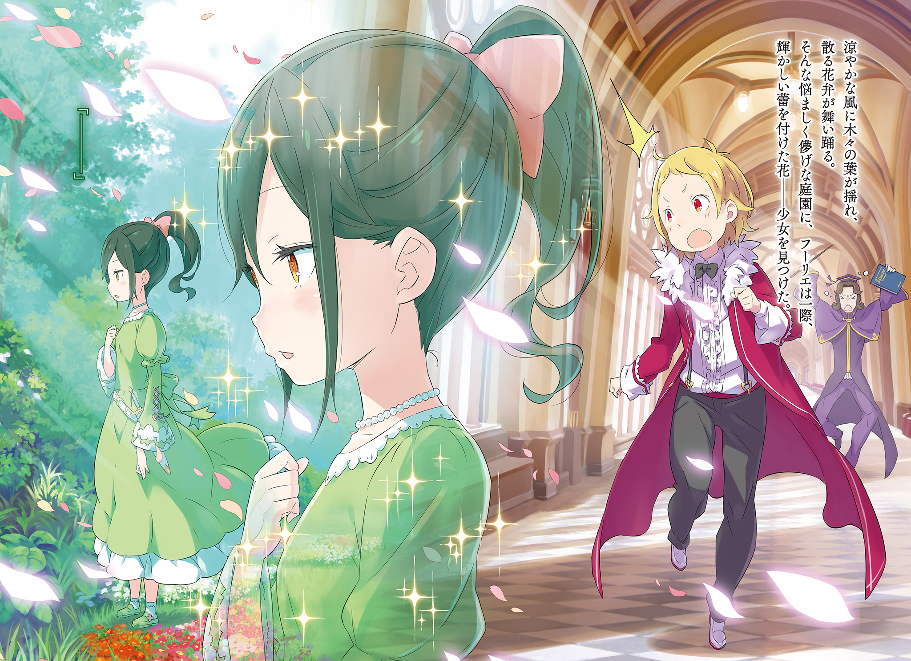
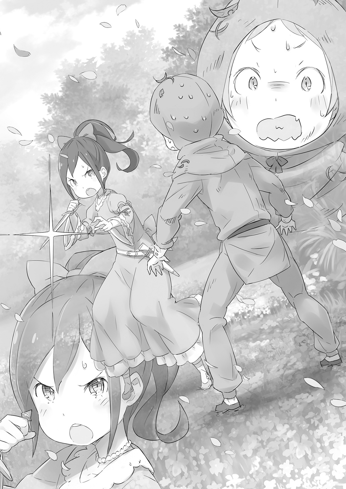

Начало мечты

Увидев её в дворцовом саду, Фурье Лугуника резко остановился.

Его большие алые глаза расширились от любопытства, а ветер трепал золотистые локоны. Один из его ярко выраженных клыков торчал, словно маленький бивень, когда он выдохнул. Мальчик, которому не было и десяти лет, высунулся из открытой галереи, чтобы заглянуть в сад.

Фурье как раз убегал от одного из своих наставников, и у него совершенно не было времени глазеть по сторонам. Он уже слышал голос мужчины позади себя в коридоре. Если его поймают, то утащат обратно на ужасно скучный урок — но даже зная это, Фурье не мог оторвать глаз от развернувшейся перед ним сцены.

Сады королевского замка Лугуники были творением придворных садовников, вложивших в них всё своё мастерство и знания. Результатом стал фантастически богатый гобелен, пестрящий цветами и различными бутонами в каждое время года.

Листья деревьев шелестели на прохладном ветру, и ливень лепестков падал в воздухе, говоря о мимолётности мира. Именно в этом чарующем саду Фурье нашёл мерцающий бутон — девочку.

Её сочно-зелёные волосы были собраны сзади, а сама она застыла в позе, одновременно изысканной и прекрасной. Одетая в платье цвета свежей травы, очевидно, тонкой работы, юная, сдержанная девочка носила его идеально. Фурье видел лишь её профиль оттуда, где стоял, но бледная белизна её шеи и щеки, а также янтарь её миндалевидных глаз намекали на её расцветающую красоту.

И всё же, если бы дело было только в этом, она, возможно, не произвела бы на Фурье столь сильного впечатления. Это была бы всего лишь мимолётная встреча, взгляд на великолепную юную леди в замке.

Но на этом всё не закончилось.

— …

Девочка стояла в саду, оглядывая россыпь красочных цветов. Если бы её просто увлекло буйство красок, это показало бы, что её нрав ничем не отличается от других. Но вместо того чтобы смотреть на цветы в центре сада, она рассматривала один-единственный бутон в дальнем углу. Пристально глядя на него, словно веря, что он может раскрыться прямо здесь и сейчас…

— Ваше Высочество Фурье! Так вы наконец меня заметили!

Его наставник, тяжело дыша, наконец добрался до того места в коридоре, где стоял Фурье. Он смотрел на мальчика с облегчением на лице, но вскоре оно сменилось недоумением, когда он заметил, как Фурье уставился в сад.

— Ваше Высочество? — спросил он. — Что привлекло ваш интерес снару?..

— Ничего, учитель! Ничего! Совсем ничего! Уж точно не то, о чём вам стоит беспокоиться!

Фурье бросился к наставнику, когда тот попытался понять, что так заинтриговало мальчика. Рука, которую Фурье выставил в надежде скрыть сцену, врезалась в лицо наставника, и тот отшатнулся с криком «Мой глаз!», но у Фурье не было времени беспокоиться об этом. Он больше переживал, что девочка у цветов могла услышать шум.

С тревогой он посмотрел в сторону сада. Это произошло ровно в тот момент, когда девочка, услышавшая что-то, повернулась в его сторону. Фурье поспешно опустил взгляд.

«Н-нехорошо. Мне как-то очень странно… Может, я заболел? Щёки горят, и дышать трудно…»

Отметив боль в груди и затруднённое дыхание, Фурье заключил, что это опасное место для него. Он схватил своего корчащегося учителя за ногу и с огромной спешкой начал убегать обратно по коридору.

— В-Ваше Высочество! Ай! Больно!

— Просто улыбайтесь и терпите! Не то чтобы у меня хватило сил вас поднять! Но я не могу просто оставить вас в таком опасном месте. В конце концов, я член королевской семьи — гордость народа.

— Я тронут вашей заботой обо мне, Ваше Высочество, но… Ай! Возможно, вы могли бы перестать бежать и… Ауч! — вскрикивал наставник, ударяясь головой о каждую стену и колонну, мимо которых они проносились, но Фурье игнорировал его. Он всё ещё видел ту девочку, стоило ему закрыть глаза. Она явно была причиной его бешено колотящегося сердца, но почему-то он не мог выбросить её образ из головы, сколько бы времени ни прошло.

Для Фурье оставалось загадкой, почему ему так не хотелось уходить, пока он мчался прочь от сада.

Фурье Лугуника принадлежал к королевской семье Королевства Лугуника, Дружественного Драконам, династии с более чем тысячелетней историей; он был сыном правящего короля, Рандхала Лугуники. Следовательно, он был принцем с правом престолонаследия и достоин самых высоких почестей.

— Да, но я четвёртый принц. Мои братья все передо мной. Не думаю, что корона перейдёт ко мне в ближайшее время. Разве все эти усилия, изо дня в день, не кажутся немного бессмысленными?

— Хо-хо-хо! Я смотрю, вы овладели искусством дерзости, Ваше Высочество.

Фурье закончил свои занятия и искал передышки в своих личных покоях, где беседовал с посетителем.

Фурье скривил лицо при слове дерзость . Смеялся исключительно старый человек, его длинные волосы и борода были седыми от возраста. Миклотов МакМахон — представитель Совета Старейшин, считавшийся мозгом королевства. Именно Миклотов обладал всей реальной властью в правительстве. Поистине заслуживающий звания мудреца. Фурье был хорошо знаком со слухами о том, что даже если король исчезнет, королевство будет продолжать бесперебойно функционировать, пока Миклотов рядом.

Фурье не нравились слухи, которые принижали его отца, короля, но Миклотов был верным подданным, служившим королевству без честолюбия. И было достаточно правдой то, что старейшина изо всех сил служил королевской семье, которая оставляла желать лучшего в плане управления — так что Фурье было трудно осуждать такие разговоры.

— Если мой отец и братья не справляются, почему бы вам не стать королём? — сказал Фурье. — Так было бы гораздо проще. Не думаете?

— Вы немало шокируете этого старика, — ответил Миклотов. — Это не те слова, которые особа вашего положения должна произносить так легкомысленно. И в любом случае, это было бы нарушением нашего договора с драконом.

— Нашего договора с драконом, точно.

Миклотов мрачно кивнул. Фурье положил голову на стол и задумался.

Договор, о котором они говорили, был причиной, по которой Королевство Лугуника иногда называли Королевством, Дружественным Драконам: клятва, данная Священному Дракону Волканике, чья защита обеспечивала процветание королевства на протяжении сотен лет.

— Дракон всем занимается, — размышлял Фурье. — Урожаями и безопасностью королевства. И единственный, кто может получить его благословения, — это кровный потомок первого короля Лугуники, который заключил с ним узы дружбы. Всё это кажется слишком уж хорошо, чтобы быть правдой.

— И всё же у нас есть благословение дракона. Это делает Его Величество Короля, не говоря уже о Вашем Высочестве, людьми первостепенной важности для этого королевства.

— Да уж, слышал это столько раз, что голова болит.

— Хм. А я повторял это так часто, что язык болит.

Фурье поджал губы, но Миклотов невозмутимо погладил бороду.

— Эта история — причина, по которой я искренне желаю, чтобы вы больше ценили своё положение, Ваше Высочество.

— Хм-м, тогда, полагаю, у меня нет… Постойте! Если только наша кровь делает меня и моего отца такими важными, не значит ли это, что вся эта учёба на самом деле не нужна? Как насчёт этого?

— Хо-хо, дерзость снова поднимает голову. Подумайте об этом с точки зрения ваших подданных. Они могут быть обязаны уважать любого, кто занимает пост, но как вы думаете, предпочли бы они служить невежде или грубияну — когда могли бы иметь умного человека? А интеллект не расцветает без должного взращивания. Как и кровь Короля-Льва.

— Короля-Льва? Опять это пыльное старое имя?..

Необычная страсть прозвучала в голосе Миклотова, но Фурье посмотрел на него с кривой улыбкой. «Король-Лев» — так называли первого правителя, заключившего договор с драконом, — другими словами, первого человека, основавшего то, что сейчас является Королевством Лугуника. Его называли «последним Королём-Львом».

— Я понимаю, как много вы ожидаете от потомков Короля-Льва, — сказал Фурье. — Но это слишком многого требовать от тех из нас, кто родился так далеко по линии престолонаследия. Мудрецы почти не имеют себе равных, ищите ли вы их по всему миру или оглядываетесь на историю. Не ожидаю, что кто-то подобный родится в ближайшее время.

— Так вы можете говорить, Ваше Высочество, но кровь не оскудела. Факт, что раз в несколько поколений в королевской линии появляется истинный мастер. Два поколения назад…

Миклотов говорил гладко, но внезапно остановился. Его морщинистое лицо потемнело, он покачал головой и пробормотал: «Нет».

Мгновение спустя он продолжил: — Прошу прощения. Оговорка. Память становится ненадёжной в старости.

— Ваша потеря памяти — худшее, что может случиться с этим королевством! Перестаньте беспокоиться о таком бездельнике, как я, и позаботьтесь о себе!..

— Я едва ли считаю Ваше Высочество бездельником…

Миклотов оказал некоторое сопротивление, когда Фурье попытался выпроводить его из комнаты. Но его старые кости не могли сравниться с мальчиком в расцвете юности.

«Ну, тогда…»

Прогнав болтливого старейшину, Фурье остался один. Он начал стаскивать с себя одежду. Переоделся во что попало и обмотал голову банданой, чтобы скрыть свои заметные золотистые волосы. Затем, подготовившись ко всем неожиданностям, он выскользнул из комнаты.

В коридоре никого не было. Фурье с большой поспешностью побежал по тихому замку. Он надеялся остаться незамеченным, было бы нехорошо, если бы кто-нибудь его увидел.

Он направлялся в то же место, куда ходил каждый день в последнее время.

В галерею, где каждый день он смотрел на сады, надеясь увидеть ту девочку.

Фурье небрежно вошёл в галерею, убедился, что вокруг никого нет, прежде чем взобраться на перила и начать жадно выискивать в саду девочку, которую искал.

«Хм-м. И сегодня тоже нет, да? Я прилагаю столько усилий, чтобы прийти сюда, и всё зря. Поступать так с принцем — эта девочка бесстрашна. Боже мой.»

Не сумев найти ту, по кому так тосковал, Фурье был полон сожаления. Прошло десять дней с тех пор, как он впервые увидел её там. В тот день он убежал, потому что стук в груди показался ему опасным, но теперь он надеялся увидеть её снова именно потому, что хотел испытать это чувство ещё раз.

Боль в его сердце так и не прошла. На самом деле, она возобновлялась каждый раз, когда он вспоминал её лицо. Он был убеждён, что единственный способ найти облегчение — это встретить её.

Фурье никогда не сомневался в интуиции, которая руководила его действиями. Иногда он чувствовал, как из бесчисленных вариантов, без особой причины, появлялся ответ. То, что он открывал таким образом, всегда вело его по правильному пути. Так было и на уроках арифметики и истории, и при выборе хода в Шантранже, настольной игре с пешками. В качестве крайнего примера, несколько лет назад он даже предвидел, что у драконьей кареты, в которой ехал его отец, король, отвалится колесо.

Но всё это списывалось на простую случайность; простые догадки, которые нельзя было повторить. Он сказал своему учителю, но тот проворчал что-то о чепухе. Фурье был не настолько невежественным ребёнком, чтобы настаивать на прозрении, которое делало его отличным от обычных людей.

«Неважно. Сейчас важна девочка. Если бы я хотя бы знал её имя, всё было бы намного проще…»

Единственной его зацепкой на данный момент было то, что она должна быть дочерью какой-то достаточно престижной семьи, чтобы ей разрешили войти в замок. Если бы он сказал им, когда и где видел её, стражники и служанки могли бы ему помочь.

«Но я ненавижу нуждаться в людях. Не знаю почему, но чувствую, что будет довольно неудобно, если кто-нибудь узнает, что я её ищу. Хм-м…»

Учащённое сердцебиение, необычное ощущение, что то, что он делает, не совсем приемлемо — всё это озадачивало Фурье. Он даже толком не знал, что будет делать, если когда-нибудь найдёт её.

«Полагаю, я смогу понять, что делать, после того как мы встретимся. Кажется, я помню, как какой-то важный человек говорил, что слишком тщательное обдумывание — это просто ещё одна форма трусости… М-м!..»

Пока он стоял там, бормоча себе под нос, что-то внезапно заслонило края его зрения. Фурье перегнулся через перила, пытаясь глазами проследить за силуэтом того, кто проходил прямо под открытым коридором. Он увидел краешек рукава цвета свежей травы.

Это был тот самый цвет, который он помнил по платью той девочки.

«Упс…»

В тот момент, когда образ девочки промелькнул в его голове, Фурье почувствовал, как его нога соскользнула с перил. Он слишком сильно наклонился вперёд, потерял равновесие и обнаружил, что падает из галереи. Сад был вымощен плитами. Если бы он ударился головой об одну из них, это было бы некрасиво.

«Похоже, я заплачу за эту маленькую шалость своей жизнью…»

«А?!»

Но, как оказалось, ничего подобного не произошло. Он почувствовал, как его тело погружается во что-то мягкое, смягчая падение.

« Пфф! Тьфу! Кхм! Фу! Что это? Это… земля?!»

Выбравшись из мягкой кучи земли, Фурье выплюнул листья и грязь изо рта. Он, по-видимому, умудрился приземлиться на клумбу вместо плит; чудесным образом он остался невредим.

Подняв голову, он увидел коридор, из которого вывалился. Возможно, это снова была чистая случайность, которая уберегла его от травм, несмотря на падение почти с двух этажей.

«Ого. Вот это мне везёт. Это лишь доказывает, что немного удачи может вытащить даже из самой сложной ситуации», — сказал Фурье с некоторым трепетом, глядя на свои грязные ладони. Он проигнорировал тот факт, что если бы ему действительно повезло, он бы вообще не упал. Он выпрыгнул из клумбы и огляделся, думая, что ему придётся найти служанку, чтобы приготовить для него ванну.

— …

И там стояла девочка, глядя на него широко раскрытыми глазами.

У неё были те же прекрасные зелёные волосы, всё ещё собранные, те же чистые янтарные радужки, которые он помнил, и она была в том же платье цвета травы. Это была точно та же девочка, которая врезалась в память Фурье.

«Ох… Ох! О-о-ох…»

Едва он это осознал, как Фурье почувствовал, что его щёки начинают гореть, и обнаружил, что потерял дар речи. Его уверенность в том, что он будет знать, что сказать, когда придёт время, оставила его в этом жалком состоянии.

Пока Фурье стоял там, не в силах даже думать, девочка, её глаза всё ещё были круглыми от удивления, медленно подняла голову. Она посмотрела туда-сюда между ним и перилами — раз, два. Затем он понял, что она подумала, будто он ушибся.

— Ой, не нужно обо мне беспокоиться! Видите? Я ни капельки не ранен! Вижу, я вас расстроил, но вам не о чем волноваться. Моё тело такое крепкое, что это практически оружие!..

Фурье всё ещё был сбит с толку, но вытянул обе руки, пытаясь доказать, что он невредим. Девочка не показала никакой реакции, но, должно быть, по крайней мере поняла, что с ним всё в порядке.

Фурье очень хотел продолжить разговор, но также слишком хорошо осознавал, что она застала его в самый неподобающий для принца момент, и его ноги сильно желали унести его подальше от этого места. Возможно, ему придётся довольствоваться тем, что он встретил её во второй раз.

— Что ж, я весьма занят множеством дел, так что прошу прощения! Доброго вам дня… А?..

Он помахал рукой и уже собирался выйти из клумбы, когда обнаружил, что его путь преграждён. Девочка стояла перед ним и смотрела на него пристальным взглядом. Она строго проговорила:

— Думаешь, сможешь выкрутиться с такими хлипкими оправданиями, нарушитель?.. Фурье заметил, каким чистым и сильным был её голос, под стать её внешности. Но вскоре это чувство сменилось изумлением — благодаря кинжалу, сверкавшему в руке девочки.

— О-ого! Такой девушке, как вы, не следует ходить с такой штукой!..

— Моему отцу это тоже не нравится, но, как видите, иногда полезно иметь её при себе. Не пытайся выкинуть что-нибудь смешное. И не недооценивай меня только потому, что я девочка. Просто подожди, пока не узнаешь, что делают с теми, кто пытается проникнуть в замок.

«А? Ч-что? Кхм?»

Голос девочки стал острым, как бритва, и она не проявляла никаких признаков реакции на попытки Фурье успокоить её. В её глазах не появилось ни тени сомнения. Она действительно думала, что он нарушитель.

«Она не могла быть старше его, и всё же у неё было такое мужество. Нет, было что-то ещё».

— …

Она так крепко сжимала рукоять кинжала, что Фурье видел, как её кончики пальцев побелели. У неё не было опыта наведения клинка на человека. Это было просто то, что она чувствовала, что должна сделать, стараясь при этом не дрожать.

Фурье, конечно, не ожидал, что с ним так заговорят. Он никогда не думал, что когда он снова встретит девочку, это может произойти так, или что она будет так к нему относиться. Но в одном он не ошибся —

«Ты действительно хорошая юная леди, не так ли?»

Что он заботился о девочке перед ним даже больше, чем представлял.

Выражение лица девочки дрогнуло, сбитое с толку бормотанием Фурье.

— …Ты не сможешь меня обмануть. Мои глаза видят ложь и уловки насквозь.

— Огорчительный ответ, когда я раскрыл свои истинные чувства. Что тебе так не нравится во мне? Я хотел бы знать!..

— …Думаешь, я доверюсь тому, кто скрывает своё лицо, только потому, что он просит меня об этом?..

— Хм-м?.. Ох! Ох, понимаю, понимаю! Это была моя ошибка.

Фурье наконец понял, что причиной подозрительности девочки была его собственная вина. Он коснулся своей головы и нащупал бандану, которую использовал для маскировки. Он поспешно снял её, и его золотистые волосы упали ему на лицо. При этом глаза девочки расширились ещё больше.

— Вижу, я вас смутил, — сказал Фурье. — Как вы можете заметить, я не нарушитель. Я четвёртый принц этой нации, Фурье Лугуника! Можете лицезреть мой облик!..

Фурье вытер пот со лба, объявляя себя, пытаясь успокоить шокированную юную леди. Наверняка её подозрения исчезнут, и её улыбка расцветёт, как цветок…

— Мои глубочайшие извинения, Ваше Высочество! Даже если я обращу свой собственный кинжал на себя, это не искупит моей вины!..

…но, конечно, никогда ничего не бывает так просто.

Девушка с кинжалом рухнула на колени, осознав, кем был Фурье. Для неё это было сродни землетрясению. Она схватила того, кого считала злоумышленником в замке, а он оказался принцем. И она даже обнажила клинок — для её бедного сердца это было слишком.

— Как я могу просить тебя взять вину на себя? Я сам замаскировался банданой так, что вызвал подозрения. Разве я изверг, чтобы винить подданную за недоразумение, случившееся по моей вине?

— Но говорить таким тоном с Вашим Высочеством… Этому нет прощения… Прошу, вынесите приговор.

— Какая ты упрямая, не так ли? Твоё чувство долга так требовательно! Что ж, тогда делай, как я скажу. Ты чувствуешь вину передо мной и готова на всё, чтобы вернуть моё расположение. Не так ли?

Фурье отчаянно пытался остановить девушку, которая, казалось, была готова в тот же миг вонзить кинжал себе в живот. Она ответила: «Да, мой принц», — и протянула ему свой кинжал. — Прошу, Ваше Высочество, поступайте со мной, как сочтёте нужным. Я приму любое наказание.

— Эм… «Как сочту нужным»? «Любое наказание»? Почему моё сердце так колотится?.. Фурье почувствовал, как бешено заколотилось сердце при виде строгой девушки перед ним. Но он тряхнул головой, прогоняя наваждение, и глубоко вздохнул, чтобы успокоить сердце. — Тогда я объявляю твоё наказание. Ты… Да. Приказываю тебе помочь мне скоротать время. Побеседуй со мной, пока я немного не успокоюсь.

— Я… Ваше Высочество, как это может быть наказанием?..

— Молчать! Я не потерплю возражений! Разве ты не сказала, что подчинишься моей воле? Что ж, моя воля ясна. Ты не можешь отказаться, так что дело решено. Да?

Скрестив руки на груди, Фурье резко оборвал разговор. Девушка мгновение смотрела на него, а затем прикоснулась рукой к уголку рта.

— Хи-хи!

Смешок вырвался наружу, хотя она и пыталась его сдержать. Фурье впервые видел, чтобы она улыбалась так, как подобает девушке её возраста. Девическая и милая улыбка пробилась сквозь её напряжённое и мрачное выражение лица.

«Я на мгновение забеспокоился, но, похоже, зря… Хм?»

Разводя руки, Фурье случайно взглянул на кинжал, который всё ещё держал. И тут он заметил. Кинжал был исключительной работы, да, но на рукояти и ножнах виднелся характерный знак. Он был похож на льва с разинутой пастью, и Фурье он был очень знаком.

— Этот знак — герб в форме льва, скалящего клыки. Ты, должно быть, из дома Карстен… Постой. Ты, должно быть, дочь Меккарта! Ведь так?! — сказал он, указывая на кинжал, внезапно осознав, кто эта девушка.

Девушка покорно вздохнула и мрачно кивнула. — Да. Всё так, как Ваше Высочество изволили заметить. Я дочь Меккарта Карстена, главы Дома Карстен. Моё имя — Круш Карстен. Было ужасно грубо с моей стороны не представиться первой.

— Я сам решил назвать своё имя. И сам решил скрыть лицо. Не нужно снова начинать этот разговор. Но каково же моё удивление — дочь знаменитого Меккарта Карстена.

«Круш» . Фурье вслушивался в звучание её имени, врезая его в память.

Её отец, Меккарт, был высокопоставленным дворянином герцогского дома. Хотя он производил впечатление несколько неуверенного человека, он был абсолютно надёжным слугой королевской семьи. Было просто трудно представить эту девушку его дочерью.

— Круш. Прекрасное имя. Оно подходит твоей доблестной и благородной осанке.

— Ваше Высочество слишком добры. Но я благодарю вас.

— Т-ты принимаешь мои слова за лесть? А, да. Я должен вернуть тебе это. Не осознавая, что восхищённо смотрит на скромную Круш, Фурье кашлянул. Его щёки горели. Он передал ей кинжал, пытаясь сосредоточиться на чём-то другом. Она благоговейно приняла его, нежно прижимая к груди.

— Похоже, для тебя это сокровище, — сказал он.

— …Это подарок от отца. В честь моего дня рождения, хотя он и предупредил, чтобы я обращалась с ним осторожно. Её голос дрожал; возможно, она всё ещё была смущена из-за своей ошибки. Фурье намеренно попытался сменить тему, чтобы они снова не вернулись к этому.

— Кинжал на день рождения дочери? Даже для Меккарта это кажется немного… неуместным.

— Я сама попросила. Отец спросил, чего я хочу, и я сказала, что хочу гербовый кинжал, передаваемый главами нашего дома.

— Вовсе не неуместно! Да, кинжал — прекрасный подарок. Кинжалы удобно иметь под рукой!

— Вам не нужно утруждать себя, щадя мои чувства, Ваше Высочество. Я понимаю, что мои вкусы не совсем такие, как у других юных леди. Она как-то мимолётно улыбнулась яростным попыткам Фурье изменить своё мнение прямо посреди разговора.

Большинство девушек возраста Круш попросили бы украшения, чтобы нарядиться. Действительно, необычный ребёнок, имея выбор, выбрал бы в подарок фамильный кинжал. Но, видя, как нежно Круш держит эту вещь, Фурье почувствовал, что было бы поверхностно спешить с таким суждением.

— А что в этом плохого? Одно дело, если бы девушка была зациклена на самом клинке, отчаянно пытаясь его заполучить. Но ведь ты думала не об этом, правда? Тебя привлёк герб со львом, не так ли? И как я могу питать неприязнь к такой девушке? В конце концов, я сам потомок Короля-Льва!

…

— Что-то не так? — спросил Фурье. Он говорил так уверенно, но Круш просто уставилась на него. Эта девушка поначалу казалась такой стоической, а теперь он видел столько разных выражений её лица — хотя и желал, чтобы среди них было больше улыбок.

— Н-нет, — сказала Круш. Просто… Впервые кто-то подумал, что меня мог заинтересовать герб, и я удивилась.

— А, понятно. Но разве это неправда?

— Да… это так.

Круш, казалось, хотела понять, почему Фурье сделал это предположение с такой уверенностью. Поэтому он гордо выпятил грудь и сказал: — Чтобы ты знала, у меня не было особой причины так думать. Никаких доказательств. Просто моя собственная уверенность.

— …Я вижу, Ваше Высочество серьёзны. Вы удивляете меня с каждой минутой всё больше.

— Вообще говоря, я всегда серьёзен. Однако мои странности такого рода, что простые люди их часто не замечают. Хе-хе! Теперь ты боишься меня?

— Нет, Ваше Высочество. Только восхищаюсь. Круш втянула подбородок, поднимая кинжал так, чтобы Фурье мог его видеть. Её тонкие пальцы пробежались по печати, и её янтарные глаза заблестели. — Известна ли Вашему Высочеству причина, по которой гербом моего дома — дома Карстен — является лев?

— Эм… да, да, конечно, известна! Но… просто для проформы, я хочу услышать это из твоих уст. Я должен убедиться, что мы одинаково это понимаем.

— Конечно. Как Вашему Высочеству известно, львиный герб изначально был знаком королевской семьи Лугуники.

Это было четыре столетия назад, до того, как был заключён пакт с драконом и страна стала известна как Королевство Друзей Дракона. В те дни Королевство Лугуника носило львиный герб, а его правителя называли Королём-Львом.

Мудрые и сильные, эти правители указывали путь всему народу. Титул был утрачен, когда последний Король-Лев заключил пакт с драконом, и драконы стали почитаться в Лугунике больше, чем львы.

— По великой милости дракона королевство стало богатым и процветающим, — заключила Круш. И поскольку Король-Лев больше не был нужен, львиный герб уступил место тому, что мы имеем сегодня, с изображением дракона.

— Точно — теперь я вспомнил! Львиный герб не был утерян, а был подарен правителем особо ценному подданному. И лев, скалящий клыки—

— …стал символом моей семьи, Дома Карстен.

Бесконечная болтовня Миклотова и те уроки, с которых Фурье всегда сбегал, наконец-то пригодились. Но он редко слышал древний титул «Король-Лев» чаще, чем сегодня.

— Король-Лев… — выдохнул он.

— Именно так, — сказала она, — Король-Лев.

Этот титул был почти забыт многими. Фурье попытался произнести его свободно, но не смог. Улыбка, игравшая на губах Круш, когда она согласилась с ним, заставила его замолчать. Это была не улыбка человека, смутно вспоминающего старое, поблёкшее имя из прошлого.

— Скорее, она выражала восхищение, даже нежность, к забытому королю.

— Ай!

— Ваше Высочество?! Чт-что вы с собой делаете?

Фурье чуть было не расплылся в глупой улыбке. Чтобы предотвратить это, он с силой ударил себя по щеке, напугав Круш.

— Вы в порядке, Ваше Высочество? Что-то случилось?

— В-всё в порядке. Пустяки. На щеку сел жук. Это моё бремя — быть любимым даже такими крошечными созданиями!

Щека Фурье покраснела, а глаза слезились, но Круш, похоже, поверила и сказала: — Понимаю…

Убеждённый, что боль того стоила, Фурье мысленно похвалил собственную рассудительность. Затем он попытался вернуть разговор к теме Короля-Льва.

— Круш. Я вижу, ты исключительно ценишь Короля-Льва. Почему?

— Никакой особой причины. И стоит ли нам обсуждать это в королевском замке?..

— Что, возникнут проблемы, если кто-нибудь подслушает? Тогда пусть это будет наш секрет, твой и мой. Я уж точно никому не скажу. Я никогда не нарушаю обещаний!

Он говорил так уверенно. После минутного молчания Круш снова улыбнулась. Она говорила с одним из главных членов королевской семьи. Такого понятия, как секрет, не существовало. Ей показалось, что Фурье забыл о своей королевской крови. Она посмотрела на него, немного ошеломлённая.

— Иногда мне приходит в голову мысль. Хотя я знаю значение герба моего дома и знаю о пакте с драконом, который защищает наше королевство, я думаю, что это слишком большая ноша для меня.

— Какая мысль?

— Во времена Короля-Льва у нас не было той стабильности, которой мы наслаждаемся сейчас. Но и этого застоя у них тоже не было. Благословение дракона делает нашу жизнь лёгкой — возможно, слишком лёгкой.

…

Фурье тяжело сглотнул, услышав её слова. Увидев, что он замолчал, губы Круш снова изогнулись в улыбке. Однако это была не нежная улыбка, как раньше, а отстранённое выражение, которое почему-то казалось взрослым.

— Ваше Высочество накажет меня теперь за неуважение к королевству?

— Честно говоря, я начинаю думать, что действительно лучше держать это между нами. Ты права, такие разговоры не стоит вести с кем попало. И всё же…

Фурье не мог до конца понять, что видела Круш. Возможно, дело было в разнице интеллекта или образа жизни. Юный принц только начал знакомиться с её натурой и не мог дать ответ на то, о чём она размышляла.

Увидев, как Фурье мучается над её словами, Круш прикрыла глаза, сила покинула её плечи. — Забудьте, что я сказала, Ваше Высочество. Считайте это глупым бормотанием девушки, не знающей своего места. У меня нет братьев, но факт остаётся фактом: я женщина. Я не могу выбрать жизнь, подобающую гербу моего дома… путь льва.

Слова «не могу выбрать» она произнесла с глубокой покорностью судьбе. Было что-то, чего она отчаянно хотела и не могла сделать. Несомненно, именно это отличало юную Круш от других девушек. Именно поэтому она так полностью завладела вниманием Фурье.

Он почувствовал, как жар хлынул в его пылающее сердце. Он открыл рот, обнажив похожий на клык зуб.

— Глупость? Пусть другие так это называют. Но ты сама никогда не должна с этим соглашаться.

— …Ваше Высочество?..

Фурье слишком хорошо знал боль непонимания и пренебрежения, выраженного словами вроде «глупость» или «чепуха» . В прошлом это заставляло его сдаваться — но даже если ему приходилось это признавать, сейчас он не мог этого допустить. Видеть, как женщина, привлекшая его внимание, отказывается от того самого, что пробудило в нём интерес.

— Я не знаю, какие желания ты таишь или что хочешь сделать. Но я уверен, что девушка, стоящая передо мной сегодня, — это результат её усилий по достижению этой цели. Похоже, теперь ты считаешь это время потраченным впустую, но…

Он был совершенно очарован её видом — её лицом, звуком её голоса и временем, которое они провели вместе. И всё это, что его покорило, несомненно, появилось благодаря её постоянному стремлению осуществить своё желание, желание, от которого она теперь собиралась отказаться. И поэтому его возражение исходило из огня его собственной глубоко укоренившейся страсти.

— Отказаться от этого желания было бы серьёзной ошибкой. Это Фурье знал каждой фиброй своей души.

— Я убеждён, что ты умнее меня. Но интеллект здесь не главное. Ты неправа! Я знаю, что ты неправа!

— Ваше Высочество?.. Вы имеете в виду, что то, чего я ищу, тоже неправильно?

— Я не знаю! Я не знаю, что именно неправильно. Но что-то неправильно.

Круш выглядела ошеломлённой резким заявлением Фурье. Её идеи в прошлом подвергались обильной критике. Ей неоднократно говорили, что она неправа, отличается от окружающих, пока она, наконец, не начала сомневаться в собственном мышлении. В глубине души вспышка Фурье отличалась от тех других отказов.

— Не улыбайся мне этой покорной улыбкой! Возможно, твои слова — глупость, но они твои. Я не буду смеяться, а любой, кто смеётся, не обладает дальновидностью, чтобы увидеть, куда ты идёшь. Никогда не знаешь, что из этого может получиться — какой цветок может расцвести. Ты всё ещё просто бутон! И кто может сказать, какой чудесный цветок появится, пока он полностью не раскроется?

Фурье весьма гордился придуманной метафорой. Он повернулся к клумбе и указал на незрелый бутон в углу.

— Я не знаю, что ты видела, но когда ты смотрела на тот росток, я понял твоё сердце. Потому что, я уверен, оно такое же, как моё!

…

— П-поэтому… Поэтому не вини себя за то, что отличаешься от других. Это ничего не значит, и это неважно. У нас могут быть различия, но если мы видим одну и ту же красоту в одних и тех же вещах, то у нас всё будет хорошо!

Фурье вскинул кулак в воздух, воскликнув: «Каково?!» — демонстрируя волнение. Круш широко раскрыла глаза, ошеломлённая его пылом. Молча, словно поддавшись, она тоже посмотрела на клумбу.

Затем она сказала: — Я пришла сюда сегодня, чтобы посмотреть, расцвёл ли он уже.

— Я так и думал. Ты наблюдала за ним с таким интересом.

Круш была сбита с толку. — Разве Ваше Высочество видит меня здесь не впервые?

— О! Э-э, нет, впервые! Я просто… говорил по наитию! Да, вот именно!

Круш не стала допытываться у Фурье насчёт этих странных замечаний, только улыбнулась. Тихо она сказала: — Если вы думаете, что мы видим одну и ту же красоту в одних и тех же вещах… — Её лицо расслабилось. — Тогда, Ваше Высочество, когда этот бутон расцветёт, могу ли я посмотреть на него вместе с вами? Чтобы узнать, разделяет ли кто-то столь необычный, как я, ваши чувства?

— О? О! Можешь! Конечно, можешь. Я буду рад!

Фурье ответил в порыве восторга, покраснев до корней волос от улыбчивого приглашения Круш.

Лишь цветы — и один-единственный бутон, — качающиеся на ветру, были свидетелями этого странного, но забавного обмена любезностями.

— Так значит, источник сердечной тоски юного принца Фурье — это Круш Карстен?

В комнате замка Лугуники, заставленной книжными полками, Миклотов принимал отчёт. Перед старым мудрецом стоял наставник, которому было поручено обучение Фурье. Принц всегда был своенравен, но в последнее время он был ещё менее сосредоточен, чем обычно. Когда наставник рассказал ему, в чём проблема, Миклотов кивнул и погладил свою длинную бороду.

— М-м-м. Понимаю. Дочь достопочтенного лорда Меккарта. Я слышал, что она довольно странная девушка… Возможно, именно это и привлекло к ней Его Высочество Фурье.

— Боюсь, я не знаю, господин. Но, похоже, это факт, что юная леди и Его Высочество в близких отношениях. На днях, я так понимаю, они вместе ходили в сад посмотреть на цветок…

— Как мило. Но если из-за этого он забросит учёбу…

— Э-э, кхм, насчёт этого, господин. Наставник прервал Миклотова. Мудрец поднял бровь. — Если уж на то пошло, Его Высочество стал более сосредоточен на учёбе, чем раньше. Возможно, его знакомство с юной леди…

— …побудило его показать себя с лучшей стороны?.. Да, действительно, как мило. Миклотов закончил неохотную фразу наставника.

Атмосфера стала несколько неловкой, но сразу после этого взгляд Миклотова заострился, и он выпрямился. Поймав взгляд старика, наставник почувствовал, как у него пересохло в горле. Миклотов спросил:

— А юный принц?.. Проявил ли он какие-либо признаки крови?

— Кхм, он… нет, не похоже… По крайней мере, я не видел.

Уныние отразилось в глазах Миклотова. Старый мудрец издал долгий вздох.

— Вот как?.. …Возможно, второе пришествие Короля-Льва — это лишь мечта…

Он не мог скрыть своего разочарования. Наставник, не в силах сочувствовать ни ходу мыслей старца, ни его желаниям, мог лишь молчать.

Мудрец желал второго пришествия мудрого правителя, властвовавшего во времена Королей-Львов. Но наставник недоумевал, какой в этом может быть смысл. Королевство было в безопасности под защитой пакта с драконом и даруемых им благословений. Королевской семье нужно было лишь продолжать род; большего от неё не требовалось.

Поэтому наставник не сообщил Миклотову о более странных чертах натуры Фурье. Иногда мальчика охватывала необъяснимая интуиция. Но наставник отмахивался от его вспышек озарения в настольных играх и арифметических упражнениях как от чистой случайности. Он был слишком большим реалистом, чтобы считать эти события признаками того, что Фурье достоин быть мудрым королём.

И если он не мог сочувствовать доводам Миклотова, то и находчивости Фурье он понять не мог. Этот наставник был одарённым учителем, но не более чем обычным гражданином королевства. Он достиг этих высот во многом потому, что не хватало чиновников, чтобы заполнить все вакантные должности.

— В таком случае, я надеюсь, Его Высочество хотя бы проведёт свои дни в добром здравии. Я ещё немного понапрягаю эти старые кости, чтобы убедиться в этом…

Хоть Миклотов и был мудрецом, он не умел читать мысли. Он не мог знать, что в глубине души наставник на самом деле владел информацией, которую Миклотов жаждал услышать. А Фурье жил в неведении о том, чего от него ждали другие.

Это была своего рода трагедия, но также и одна из великих ироний судьбы.

— Но пройдёт ещё очень, очень много времени, прежде чем истинный смысл этого выйдет на свет.

После этого дни Фурье Лугуники становились всё более насыщенными, хотя он и не осознавал, что надежда тех, кто смотрел на него с ожиданием, медленно сменялась отчаянием.

Через несколько дней после того, как он дал обещание Круш, они наблюдали, как бутон распустился в большой цветок. Её улыбка в тот момент, когда она увидела цветок, чётко запечатлелась в сознании Фурье.

— Он прекрасен, не правда ли, Ваше Высочество?

— Действительно, это так! Думаю, я никогда этого не забуду. Фурье решил оставить при себе, что именно он навсегда запечатлеет в памяти.

Их садовые рандеву часто продолжались и после того дня. Круш заходила в сад всякий раз, когда прибывала в замок, и Фурье всегда был там. Но Круш как-то изменилась с тех пор, как они вместе увидели распустившийся цветок. По мере того, как они виделись всё чаще, что-то в ней начало меняться.

— Ты больше не убираешь волосы назад, — заметил он однажды.

Когда они впервые встретились, её волосы были собраны, и она носила платье — само воплощение девичества. Но в последнее время, когда бы он её ни видел, она распускала свои длинные волосы, а фасоны её платьев становились всё изысканнее.

— Этим я обязана тому, что сказало Ваше Высочество, — ответила Круш с лёгкой улыбкой. Но Фурье не мог представить, что она имела в виду. Что он ей сказал, чтобы вдохновить на такие перемены?

— Вам не нужно понимать, Ваше Высочество. Но я всё равно благодарю вас.

— Хм! Но как я буду спокоен, не зная? Это так меня гнетёт!

Круш ничего не ответила на вспышку Фурье, а лишь потянулась к бедру. Там висел кинжал, и Фурье понял, что у неё развилась привычка прикасаться ко львиному гербу. Он вдруг почувствовал, будто Король-Лев отнял её у него, хотя она стояла прямо здесь.

— Ты весьма очарована Королём-Львом, не так ли? — сказал он.

— Вы неправильно понимаете, Ваше Высочество. Я просто горжусь своим предком, который усердно поддерживал свою страну и был признан величайшим слугой короля… хотя я понимаю, что делаю это довольно часто.

Её покрасневшие щёки выдали попытку оправдаться, когда она заметила угрюмое поведение принца. Всё менее довольный ситуацией, Фурье с сожалением посмотрел на её кинжал.

— Но Короля-Льва больше нет, — сказал он. Думай о нём так высоко, как хочешь; никто другой никогда не будет…

…

— Э-э… нет! Я имею в виду — я говорил образно! Я не… — Его неосторожные слова, должно быть, ранили Круш в самое сердце, потому что она погрузилась в гнетущее и скорбное молчание, пока Фурье отчаянно пытался взять свои слова обратно. Наконец, он хлопнул в ладоши и сказал: — Очень хорошо! Если это то, чего ты желаешь, то я стану тем человеком, которого ты ищешь!

— Ваше Высочество?..

— Посмотрим, приближается ли твоя любовь к этому королевству к тому, что Король-Лев видел в твоём почтенном предке! Почему бы и нет? Ведь в моих жилах течёт кровь Льва, не так ли? Я имею полное право судить об этом!

Шок Круш от этой ментальной гимнастики сменился улыбкой.

— Хм! Ты смеёшься надо мной? Осмелюсь сказать, я даже сам себя впечатлил своей безупречной логикой!

— Н-нет, я… прошу прощения. Просто… Ваше Высочество такой удивительный человек…

— А-ха! Ты задаёшься вопросом, не так ли, достоин ли я клятвы верности так же, как Король-Лев? Очень хорошо. Следи за мной внимательно. Я буду судить о твоей верности, как ты будешь судить о моей достойности. Тогда мы вновь возродим узы между Королём-Львом и его самым преданным вассалом!

— А-ха-ха-ха!

— Не сме-е-ейся!

Но её веселье было подобно распускающемуся цветку, и вскоре Фурье присоединился к ней.

Никто не знает, была ли клятва, которой они обменялись, дана всерьёз. Но они оставались дороги друг другу ещё долгое время, и со временем к ним присоединился ещё один молодой человек. Когда это случилось, Фурье увидел сон, вдохновлённый узами, начало которым положила эта клятва.

Так что это было лишь начало мечты — мечты Фурье Лугуники.
