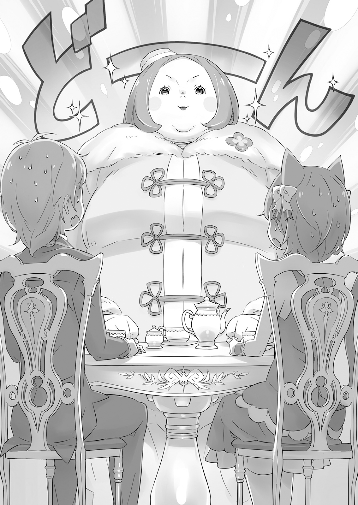

Феликс Аргайл — прелестный мальчик

— Это ужасно! Говорят, мне предстоят смотрины!

Такие отчаянные слова разнеслись по поместью Карстен одним прекрасным днём. Дверь в гостиную распахнулась, и тяжело дышащий золотоволосый юноша ввалился внутрь.

У него были алые глаза, заметные клыки и дорогая одежда, включая экстравагантную меховую накидку. Если бы он мог сохранять достойное молчание и улыбку, без сомнения, он покорил бы сердца многих девушек. Но увы, никто никогда не видел, чтобы он вёл себя так зрело.

Этого беспокойного юношу звали Фурье Лугуника, и он был четвёртым сыном короля Королевства Лугуника, Дружественного Драконам — самым настоящим принцем.

— Успокойтесь, Ваше Высочество. Как же нам сохранять самообладание, когда вы так мечетесь?

Источник этого увещевания — молодая женщина, не выказывавшая ни тени паники. Её длинные, прекрасные зелёные волосы были перевязаны белой лентой, а её всё ещё формирующееся тело было облачено в мужскую одежду. Миндалевидные янтарные глаза и твёрдые черты лица выдавали в ней ту, что однажды станет великой красавицей.

Это была Круш Карстен, единственная дочь хозяина этого дома, Меккарта Карстена. Однажды она унаследует герцогское поместье своей семьи и наверняка станет женщиной великого положения. Но в это время она была всего лишь четырнадцатилетней девочкой — окружающие едва ли успели распознать её дарования.

— Ты ожидаешь, что я буду спокоен в такое время?! Меня пытаются женить! Разве это не должно тебя сильно беспокоить? Разве это не должно сильно беспокоить её, Феррис?!

— А? Ты спрашиваешь Ферри? — Упомянутый человек обернулся и указал на себя. Говорившим, явно удивлённым, был похожий на девочку мальчик, помахивающий своими льняными кошачьими ушками — Феликс Аргайл.

Прошло пять лет с тех пор, как Феликс по своим причинам взял имя Феррис, начал одеваться в женскую одежду и стал сопровождающим Круш. Они оба давно были хорошо знакомы с Фурье и научились находить удовольствие в любых кажущихся кризисах, которые приносил им этот возбудимый юный принц.

Преодолев первоначальное удивление, Феррис прикоснулся пальцем к губам и сказал: — Мм, вы правы, принц Фурье. Но! Но! Вам уже четырнадцать… Вы не ребёнок, так что логично, что вам хотят устроить мяу-смотрины.

Фурье побледнел от этих слов; его сжатые кулаки задрожали. — Нет, категорически нет! Я не буду участвовать ни в каких смотринах! Я отказываюсь!

— Но, Ваше Высочество. Как член королевской семьи, ваш долг — взять супругу и продолжить королевский род. Проблема не исчезнет только потому, что вам это не нравится.

— Э-эм, вы, конечно, не ошибаетесь. Это… я не возражаю против идеи брака в целом, понимаете. Но, знаете… У меня… у меня есть право выбирать, не так ли? Мне не нужен сват, чтобы… А-а-а, что вы заставляете меня говорить?!

— Ах, мой грубый принц… — сказал Феррис.

Пока Фурье горячо выражал своё негодование по поводу смотрин, Круш отвечала неопровержимой логикой. Фурье попытался возразить, но ему нечего было сказать, и вскоре он прибег к вспышке гнева, покраснев.

Феррис мог только покачать головой и вздохнуть. Он чувствовал разочарование, рождённое пятью годами наблюдения за тем, как эти двое говорят мимо друг друга. Влюблённость Фурье в Круш была очевидна. Было логично, что он не интересовался смотринами, когда его сердце так долго принадлежало другой. Если бы только он мог набраться смелости и быть честным. Четвёртый принц, Фурье, и дочь герцога. Они были достаточно близки по статусу; в этом не было бы ничего плохого. Но…

— Феррис, Его Высочество кажется весьма расстроенным. Я сказала что-то не так? Как ты думаешь? — прошептала Круш, чтобы принц не услышал. Она была совершенно не в курсе.

Круш была пожизненной госпожой Ферриса, самой любящей девушкой во всём мире — и она была совершенно неспособна разглядеть что-либо большее, чем дружеская привязанность. В романтическом интересе Фурье не было ничего плохого, за исключением того, что сама Круш была его последним и величайшим препятствием.

«Ему бы поскорее набраться смелости и признаться в своих чувствах…»

— Нет, госпожа Круш, вы не сделали ничего плохого. Это всё Его Высочество. Это он совершил ошиб-мяу. Госпожа, помогите мне сказать ему, чтобы он был менее грубым…

— Хм, хорошо. Полагаю, я могу довериться твоей оценке. Ваше Высочество, я не совсем понимаю, в чём дело, но искренне прошу вас перестать быть таким грубым.

— Хрк!

В словах не было язвительности, но Фурье прижал руки к груди и упал на колени, потому что их произнесла его возлюбленная. Глаза Круш расширились от этого, и она укоризненно посмотрела на Ферриса.

— Я накажу тебя за это позже, Феррис.

— Аууу, но Ферри просто хотел вызвать у вас улыбку, миледи!

— Вот же. Вечно ты мастер льстить. Полагаю, только ты мог бы протащить что-то подобное мимо моего [Благословения Чтения Ветра]. Неплохо лишний раз напомнить, что моя защита не всесильна.

— Да! Именно это Ферри и пытался сделать — напомнить вам об этом, миледи.

— Я сделаю вид, что верю тебе. Но я всё равно тебя накажу.

Круш сурово кивнула. Ни разу в жизни она не отступала от своих слов. Наказание — слово звучало красиво, но она не сдерживалась, когда дело доходило до их исполнения, так что любой, кто хотел подшутить над ней, должен был быть готов к последствиям.

— Ну что ж! Ферри будет продолжать шутить, это уж точно! Просто чтобы увидеть прекрасную госпожу Круш с таким удивлённым выражением лица! О, какое редкое удовольствие!

— Аргх, хватит с вас обоих! Когда человек приходит в агонии, терзаемый муками, разве не принято его утешать?! Или вам нравится оставлять меня страдать? О, одиночество! — вмешался Фурье, порядком уставший от того, что его игнорируют.

Было непросто успокоить Фурье, когда он впадал в одну из своих детских истерик. Круш и Феррис вместе взялись за эту задачу.

Возможно, свидетельством крепости отношений между этой троицей было то, что ни один из них, казалось, не считал эту роль бременем.

Когда нрав Фурье наконец остыл, троица осталась в гостиной, обсуждая детали предстоящих смотрин.

— Предполагаемая невеста — дочь какого-то родственника архиепископа Густеко. Говорят, ей девятнадцать! На целых пять лет старше меня. Это совершенно никуда не годится. Мы должны отменить встречу. — Фурье уже звучал так, словно полностью убеждён в собственном выводе.

— Ваше Высочество! Ваше Высочество, я говорю вам, у вас нет доказательств! — Феррис попытался возразить, не поднимая снова гнев молодого лорда.

Святое Королевство Густеко было одной из четырёх великих наций, известной своими леденящими температурами и метелями, которые бушевали круглый год. Оно также славилось религиозным мировоззрением, которое могло возникнуть только в таких суровых условиях, — уникальной формой спиритуализма. Архиепископ, упомянутый Фурье, был глубоко почитаемым человеком в этой стране.

— В Густеко архиепископ почти так же важен, как Совет Старейшин здесь, — сказал Феррис. — Брачный мяу-союз с этой семьёй был бы очень важен для Лугуники…

— Такой союз имел бы огромное значение для обеих наций, Ваше Высочество, — добавила Круш. — Это неотъемлемый долг.

— Постойте, постойте, постойте! Мы просто ходим по кругу. Когда это вы обе стали на сторону Святого Королевства? Я говорю о том, что не хочу никаких смотрин! Помогите мне! — Фурье, почти плача, вцепился в колени Ферриса. Феррис не мог не подумать, как неприглядно выглядела бы эта сцена, если бы кто-то стал свидетелем, но тем не менее погладил плаксивого принца по голове.

— Если вы так расстроены, лорд Фурье, то они, вероятно, не станут настаивать… но, к сожалению, простое беспокойство, вероятно, недостаточная причина, чтобы отказаться от самой встречи.

— Мм, да, я и сам это понимаю. То есть, когда я сказал об этом Миклотову, он подверг меня одному из своих редких приступов гнева. Я и понятия не имел, что он может так разъяриться…

Миклотов из Совета Старейшин был известен своей мудростью и уравновешенностью. Новость о том, что Фурье уже умудрился расстроить великого советника, заставила Ферриса схватиться за голову, а затем бросить отчаянный взгляд на Круш.

— Госпожа Кру-у-уш… Что нам делать?

— Хороший вопрос. Ради блага королевства я бы хотела, чтобы Его Высочество просто смирился с этой встречей, но поскольку я в большом долгу перед ним, я обязана сделать всё возможное, когда он обращается ко мне за помощью. Кстати, Ваше Высочество, если бы этот брак состоялся, юная леди приехала бы в Лугунику?

— Нет — Миклотов сказал мне, что я должен готовиться продолжить учёбу где-то в прохладном месте… Я не могу! Я ненавижу жару и холод, но холод определённо хуже! Ты же меня знаешь — даже в такой тёплый день, как сегодня, я никогда не выпускаю из виду свою накидку.

Фурье не мог заставить себя проявить интерес к встрече, и его, конечно, беспокоило, какой будет жизнь после свадьбы. Ему было бы жаль молодую женщину, застрявшую с тем, кто так яростно сопротивлялся этому союзу. С другой стороны, если она была хоть немного похожа на Фурье, возможно, её тоже заставляли.

— А это значит, что возможно, ни одна из сторон этого брака не будет счастлива… — простонал он.

Было бы достаточно просто указать, что многие браки похожи, и покончить с этим. Но так же, как Феррис любил и уважал Круш, он испытывал глубокую привязанность и к Фурье. Если бы это было возможно, он хотел бы видеть их обоих наслаждающимися величайшим возможным счастьем в этой жизни. Даже если, в худшем случае, сам Феррис остался бы без места, которому принадлежал.

— Ладно, Ваше Высочество, мяу всё предельно ясно поняли. Мы должны найти способ сорвать эту встречу. Полагаю, ваша репутация всё равно хуже уже не станет!

— О! Ты передумал? Вот это обнадёживает, Феррис! Так какой у тебя план? Притворимся, что я уже обручён? Ну, знаешь, с… кем-то?

— Мяу придётся проявить больше мужества, чем вы когда-либо проявляли в своей жизни, чтобы провернуть это, Ваше Высочество!

Им понадобится больше, чем просто энтузиазм. Даже упрекая Фурье в недостатке смелости, Феррис взял Круш за руку. Она выглядела очень расстроенной. Затем он положил её руку на другую руку, всё ещё цеплявшуюся за его колени — руку Фурье.

— Вот как это работает, — сказал Феррис. — Как бы мне ни было жаль юную леди, на встрече вы должны заявить, что ваше сердце уже принадлежит другой… и вот так вы прорвётесь!

— Эт-т-то твой план?! Но… но мы с Круш не любовники!..

— Вы правы, не любовники! Но всё, что вам нужно сделать, это заставить другую сторону поверить, что вы ими являетесь, и отказаться от брака. После этого вы двое просто сильно поссоритесь и «расстанетесь» или что-то в этом роде. Проблемы больше нет!

— Феррис! У меня почему-то болит сердце! И грудь, и спина! Пожалуйста, примени ко мне исцеляющую магию!

— Исцеляющая магия не может исправить ту боль, от которой вы сейчас мяукаете, Ваше Высочество. Простите!

Фурье оказался захваченным идеей Ферриса. Руки троицы всё ещё были соединены, и Фурье медленно покраснел, осознав, что ему предстоит притвориться любовником Круш.

После этого прозрения он быстро согласился. Он встал с немалой уверенностью и сказал: — Хе-хе! Что ж, тогда! Я не ожидал от тебя меньшего, Феррис… Я аплодирую тебе за то, что ты распознал мои природные актёрские таланты!

— Нет, нет, это всё благодаря покладистому характеру Вашего Высочества. Ферри ничего не сделал!

— Ха-ха-ха! Не нужно меня так хвалить! Да, я начал чувствовать себя довольно хорошо по этому поводу. Облако, нависшее надо мной, исчезло, словно его и не было! Очень хорошо — теперь, Круш! — С громким хохотом Фурье вернулся к своему обычному состоянию. Он протянул руку своей возлюбленной Круш, сверкнув улыбкой, показавшей его зубы, как ребёнок, затеявший озорную шалость. — Сотрудничай со мной, чтобы свести эту встречу на нет! Я прошу этого сотрудничества у т—

— Ваше Высочество, боюсь, мне нужно кое-что вам сказать.

— Эм… и что же это?

Фурье выглядел не очень довольным тем, что его прервали в кульминационный момент речи. Круш одарила его понимающим взглядом, но в то же время нахмурила свои красивые брови.

— Так случилось, что мой отец уже попросил меня заняться делами в тот же день, что и ваша встреча. Это не что иное, как вызов во дворец от Миклотова…

— Мрроу?!

Фурье был ошеломлён, и Феррис не смог скрыть своего удивления. Но в отличие от Фурье, который уже перестал думать, Феррис заподозрил, что такой неудобный поворот событий был совершенно преднамеренным.

— Как думаешь, они нарочно устроили встречу, чтобы ты не смогла помешать смотринам? — спросил Феррис.

— Зная моего отца и уважаемого Миклотова, такая уловка возможна. С другой стороны, это может быть и просто совпадение… Так что, Ваше Высочество, мне очень жаль говорить, но я не смогу оказать вам свою помощь.

— Я… я понимаю. Э-это нормально. Ха-ха. Это… Да, совершенно нормально. — Фурье задумчиво сел, не совсем скрывая своего разочарования, отчаяния и шока. Он выглядел абсолютно жалким, и Феррис поспешил его утешить.

Увидев выражение лица Фурье, Круш наклонила голову и кивнула. — Милорд, не думаю, что имеет значение, буду ли я той, в кого вы якобы влюблены?

— А?..

Феррис и Фурье одновременно подняли головы и заговорили.

Увидев их совершенно синхронную реакцию, Круш одарила их одной из своих редчайших улыбок: усмешкой утончённой молодой леди, задумавшей что-то озорное.

Настал долгожданный день. Встреча проходила в особняке недалеко от границы между Королевством Лугуника и Святым Королевством Густеко. Точнее, это было поместье виконта Мизера, который управлял всем северным регионом Лугуники; когда ему сообщили о задуманной ими схеме, он на удивление охотно согласился участвовать.

— Эти ребята из Святого Королевства, честно говоря, жутковаты. Не хочу даже представлять, как королевская кровь Лугуники смешается с родом этих мечтателей. Юная леди, с которой вы сегодня встретитесь, особенно плоха. Во что бы то ни стало, доведите дело до резкой остановки!

Хотя он не мог слишком сильно возмущаться по этому поводу, нахождение на границе доставляло местному лорду немало хлопот. Он был более чем готов закрыть глаза на небольшую шалость, чтобы получить для себя некоторое облегчение.

«Мяужет быть, нужно быть немного странным, чтобы получить такую важную работу. Лорд Меккарт такой же».

Виконт Мизер напомнил Феррису одного хлопотного хозяина знатного дома. Меккарт едва ли походил на образ дворянина, но когда Феррис вспоминал всех людей, которых видел в замке, казалось, очень немногие из них выглядели так, как ожидаешь, представляя себе аристократию. Он также вспомнил время, когда несколько лет назад проходил обучение исцеляющей магии. Сложилось отчётливое впечатление, что никто из дворян не был особенно, ну, благородным.

«Ну, это не относится к тем, с кем я ближе всего общаюсь», — размышлял он. Ни Круш и Фурье, ни Меккарт не давали повода для жалоб на личном уровне. Они не были стереотипными дворянами, озабоченными только репутацией и господством над другими. Может быть, только родители Ферриса были такими дворянами. «А-а-а, хватит, хватит! Я не могу впадать в депрессию в такой важный момент!»

Он хлопнул себя по щеке, чтобы прийти в себя, но сделал это осторожно, чтобы лицо не покраснело.

Феррис подготовился гораздо тщательнее, чем обычно для своих выходов. Горничные, которые помогали ему по указанию Круш, проделали фантастическую работу. Это был знак того, что она многого от него ожидала, хотя и не могла присутствовать сама. Одна только мысль об этом делала его сердце лёгким, словно у него выросли крылья.

— Хорошо… — сказал он себе. — Была не была, Ферри!

Он представил, как Круш легонько подталкивает его, чтобы он начал, и вышел из комнаты для переодевания. Он взмахнул подолом юбки с той же решимостью, что и солдат, идущий на поле боя, и виконт, ждавший снаружи, проводил его улыбкой. Феррис позволил неожиданному энтузиазму дворянина увлечь себя к роковой комнате.

Один из людей виконта, стоявший с нервным видом прямо у закрытой двери, кивнул Феррису. Затем Феррис встал на виду, когда дверь открылась, прежде чем гордо войти в комнату для встреч.

— Я возлюбленная Его Высочества Фурье, — объявил он девичьим тоном, — и я не позволю этой встрече состояться!

Если Круш не могла быть здесь, чтобы сорвать эту встречу, ему придётся сделать это самому.

Неожиданное появление Ферриса повергло встречу в хаос. Очевидно, он ворвался как раз в тот момент, когда двух молодых претендентов оставили наедине. Было двое против одной, и численный перевес был на стороне Фурье.

Но с точки зрения чистой массы всё было совершенно наоборот.

— Э… Юная леди выглядит очень сильной, не так ли? — пробормотал Феррис, оценивая другую участницу встречи, сидевшую напротив них. На данный момент трое из них находились в комнате для встреч с небольшим столом между их стороной и её, лицом к лицу. Феррис уселся рядом с Фурье, а потенциальная невеста принца сидела напротив них. Её присутствия было достаточно, чтобы преодолеть численное превосходство.

— О, нет нужды ходить вокруг да около, — сказала она, элегантно качнув головой. — Я знаю, что я немного крупнее большинства. — Она смущённо опустила взгляд. Однако качество каждого жеста говорило об утончённости её воспитания.

К сожалению, её тело было настолько большим, что фраза исключительная стать была просто недостаточной.

Девушка сидела напротив Фурье, но занимала столько места, что было бы справедливо сказать, что она сидела и напротив Ферриса тоже. Казалось, будто они столкнулись скорее с валуном, чем с человеком.

— И-итак, видите ли, мисс Тириена…

Но у неё было прекрасное имя. Оно звучало как заклинание, которым можно было вызвать снежных духов, но сама она выглядела как гора в метель. Феррис слышал, что в Густеко, с его постоянными снегопадами, девушки ценили кожу, белую как свежевыпавший снег, и эта фигура не была исключением. Вблизи её кожа была бесподобна; издалека она вызывала образ бесподобной скалы.

Даже обычно харизматичный Фурье, казалось, оробел перед этой женщиной, его слова были нехарактерно невнятными. Тем не менее, он умудрился обнять Ферриса за плечо, притянув его стройное тело к себе.

— М-мне так жаль, что вам пришлось проделать такой долгий путь, но у меня уже есть та, кому я отдал своё сердце. Боюсь, я просто не смогу принять ваше предложение.

— Это правда. О, я просто не могу представить себе помолвку с кем-то, кроме Его Высочества. Умоляю вас, не разлучайте нас!..

В отличие от Фурье, который едва мог говорить, Феррис оказался искусным актёром, подкрепив свои мольбы слезой в уголке глаза. Возможно, он задел струны души Тириены, потому что она опустила взгляд с жалостью на своих точёных чертах.

— Вам обоим не нужно извиняться. Я прекрасно вижу вашу взаимную любовь. Мне даже становится стыдно… — Тириена, одетая в одно из характерных для северной страны закрытых платьев, мягко прижала руку к груди, а затем посмотрела на Фурье и Ферриса ясными глазами. — Даже мы в Святом Королевстве наслышаны о гражданской войне, что была десятилетия назад. Я слышала, что с тех времён осталась неприязнь, но… вижу, это не помешало вам дорожить друг другом. Какая прекрасная у вас любовь.

Феррис понял, что Тириена смотрит на его кошачьи уши. Гражданская война, о которой она говорила, — это затяжной конфликт, который Лугуника вела против полулюдей. Уши были просто тем, что Феррис унаследовал от предков, но они сыграли не последнюю роль в неприятностях, которые он пережил в детстве. Он не мог сдержаться, и его лицо напряглось от слов Тириены. Его бледные плечи, обнажённые вырезом платья, задрожали, и он рефлекторно попытался съёжиться. Но рука на его плечах сжалась крепче.

— Именно так, леди Тириена. Фурье теперь смотрел прямо на неё, пытаясь удержать Ферриса своей рукой. Растерянность, которую он выказывал мгновение назад, исчезла, сменившись властностью и силой духа. — В дружбе и любви я не обращаю внимания ни на происхождение, ни на расу. Любят того, кого любят. Другие могут говорить что угодно, но я ничего не могу поделать со стремлениями собственного сердца. Я люблю эту женщину рядом со мной, вплоть до самых её ушек. Я даже обожаю её кошачье непостоянство.

Фурье гордо улыбнулся. Феррис почувствовал, как горят его щеки — их лица были так близко. За всё время их знакомства Фурье упоминал уши Ферриса лишь раз или два. И правда, он проявил великодушие, никогда не принижая их. Но сказать, что он их любит?.. Такого он раньше никогда не делал, и это заставило Ферриса покраснеть.

— Боже, завидую тому, кого могут так нежно любить. Тириена улыбнулась, как довольная медведица.

По её взгляду Феррис понял, что Тириена согласна: встречу нужно заканчивать. Она была чуткой и проницательной. Феррис не мог уступить ей Фурье, но видел, что Тириена тоже заслуживает счастья.

— Простите меня, мисс Тириена, — сказал Фурье. — Вы умны и, прежде всего, добры, и если бы я не был уже так влюблён, помолвка с вами была бы далеко не худшим вариантом.

— Пожалуйста, не нужно пытаться щадить чувства женщины, к которой вы равнодушны. Гораздо хуже было бы знать, что я с тем, чьё сердце принадлежит другой. В любом случае, я и сама была неосмотрительна. До меня дошли слухи, что Его Высочество Фурье Лугуника влюблён в мужественную, воинственную молодую женщину, и, должна признать, я заинтересовалась…

Феррис едва подавил писк от комментариев Тириены, когда она поднялась со своего места. Это означало, что встреча состоялась из-за недоразумения касательно чувств Фурье к Круш. Другими словами, причина, по которой они вообще проводили эту встречу, была той же самой, по которой они пытались её сорвать: неотесанность Фурье.

— Ваше Высочество, — сказал Феррис, — надеюсь, вы хорошенько обдумаете своё сегодняшнее поведение… н-ня.

— Что ты имеешь в виду?! По-моему, я сегодня был очень мужественен, если позволю себе так выразиться!

Когда виконт Мизер вновь вошёл в комнату в сопровождении эскорта Тириены, он был безжалостен.

— Похоже, нет нужды спрашивать, как всё прошло.

Таков уж был его характер, но всё же было неправильно говорить гостье то, что могло её задеть. Однако на лице Тириены играла невероятно мягкая улыбка.

— Вы жестоки, как всегда, виконт. У вас не найдётся слов утешения для юной девы с разбитым сердцем?

— Я думал, мы устроили эту встречу в надежде, что вы найдёте того, кто предложит вам это утешение. Если всё пошло не так, это ваши проблемы. Жалуйтесь сколько угодно, я тут ничем не могу помочь.

Слышать такой разговор было довольно неприятно, но, похоже, ни одного из участников он не беспокоил. Феррис как ни в чём не бывало похлопал по плечу одного из сопровождающих Тириены.

— Эм, простите мяу за вопрос, — сказал Феррис, — но эти двое встречались раньше?

— А? О, да. Виконт Мизер несколько раз бывал в Святом Королевстве в юности, и тогда же он познакомился с леди Тириеной. Они знакомы уже почти десять лет…

Объяснение стражника средних лет представило разговор в совершенно ином свете. На самом деле, вся последовательность событий стала выглядеть иначе. Например, почему виконт так агрессивно стремился сорвать встречу. И почему, достигнув этой цели, он выглядел более чем довольным.

«Неужели виконт неравнодушен к леди Тириене?»

— Чт-то?! От прямого вопроса Ферриса виконт начал краснеть прямо на глазах. В панике он повернулся к Тириене и выпалил: — Это не… это неправда! Этот дурак не в своём уме! Мне совершенно нет дела до…

— Я знаю, не нужно так суетиться. Но поверить не могу, что вы использовали слово «дурак» по отношению к такой утончённой юной леди. Извинитесь перед ней!

В пылкой попытке защитить себя Мизер случайно проболтался.

— Он дурак, и я буду звать его дураком! Платье не платье, а это мужчина!

— А?

Тириена потрясённо посмотрела на Ферриса, пытаясь понять, правда ли это. Конечно, можно было бы и дальше её обманывать, но если бы она задалась целью, то не потребовалось бы много времени, чтобы узнать правду.

— …Это правда. Я мужчина, как он и сказал.

«Нет смысла отрицать». Феррис оттянул ворот платья, обнажив совершенно плоскую грудь. Тириена всё ещё выглядела так, будто с трудом могла в это поверить. Не имея другого выбора, Феррис поднял юбку. Тириена была глубоко шокирована.

— Но… да, я мужчина, но то, что мы с Его Высочеством влюблены, — правда! Мы влюблены! Ведь так, Ваше Высочество?

Феррис доказал свой пол, но продолжал настаивать, что сама любовь — не ложь. Он вцепился в руку Фурье, прижимаясь к нему.

— Я люблю вас, Ваше Высочество. Он с обожанием посмотрел на Фурье, стоявшего безмолвно, а затем поцеловал его в щеку.

Мягкое прикосновение его губ, казалось, наконец вывело Фурье из оцепенения. Молодой принц встряхнул головой и посмотрел Феррису прямо в лицо, прежде чем заявить:

— Я… М-мне всё равно, что ты мужчина! Главное, что ты — ты !

В каком-то смысле это был самый мужественный и наименее неотёсанный поступок, который он когда-либо совершал.

— Я слышала, как всё прошло. Говорят, юная леди, с которой встречалось Ваше Высочество, станет женой виконта Мизера, — сказала Круш, не в силах сдержать улыбку. Для всегда рациональной девушки сдерживать усмешку было нехарактерно. Это свидетельствовало о том, насколько близко к сердцу она приняла эти события.

Феррис же, напротив, не выглядел довольным. — Наверное, хорошо, что нам удалось избежать этой партии, н-ня. Но теперь с Его Высочеством как-то неловко. Из-за этого Ферри одиноко.

— Подумать только, вот так Его Высочество узнал твой истинный пол… но ты ведь не думал, что сможешь скрывать это от него всю жизнь?

— Не-а, не думаю, что даже Его Высочество настолько непрошибаем, н-ня. То, что он до сих пор ничего не сказал, было свидетельством пугающей неосведомлённости Фурье.

Но виконт Мизер наконец-то смог раскрыть свою долгую и терпеливую любовь, и, похоже, Тириена обретёт своё счастье. Счастливый конец для всех, если бы только Феррис смог найти способ наладить отношения с Фурье.

— Кстати, — сказала Круш, — возможно, мне просто так рассказали, но ходят слухи, что Его Высочество предпочитает мужчин. Когда это станет известно, предложения о браке могут перестать поступать. Однако, как только слух начал распространяться, я почувствовала на себе немало сочувствующих взглядов в замке. Интересно, с чем это было связано.

— Ох, э-э-э, знаете, всякие люди бывают, и мнения всякие… н-ня.

— М-м, это вопрос без простого ответа. Понимаю. Я обдумаю это подробнее. — Круш, будучи такой серьёзной, несомненно, в итоге выведет какое-то умозаключение, которое сможет принять. Хотя, будучи столь несведущей в делах сердечных, она могла так никогда и не прийти к правильному ответу.

Тем временем Феррис пребывал в подавленном настроении, омрачённый необычным для него разладом в отношениях с принцем. Но даже Феррис удивился тому, как больно ему было от этой внезапно возникшей дистанции с Фурье.

Они расстались после того, как оставили виконта и юную леди вдвоём в комнате для переговоров, и Фурье сел в свою драконью повозку. Его последние, дрожащие слова Феррису были: «Приказываю тебе оставить меня одного». Он никогда раньше не «приказывал» Феррису что-либо делать, и это было признаком того, насколько глубоко он был потрясён.

По правде говоря, Феррис не раз представлял себе эту ситуацию. Именно его собственная слабость помешала ему сказать Фурье правду при первой встрече и привела к тому, что он обманул принца. И за всё то время, что он воображал этот момент, он так и не смог придумать подходящего способа справиться с ситуацией, когда правда выйдет наружу.

— Феррис, — Круш подошла к нему ближе, прерывая его тревожные самокопания. Тихим голосом она сказала: — Доверяй Его Высочеству. Он именно тот человек, каким ты его считаешь.

У неё не было доказательств этим словам, и она их не предлагала, но Феррис нашёл их более утешительными, чем любую лекцию о достоинствах Фурье. Связь и доверие между Круш и Феррисом были настолько сильны. И он хотел верить, что нечто подобное связывает его и с Фурье.

Вот почему…

— Это ужасно! Величайший кризис в моей жизни! Где вы оба?!

Он удивился, когда Фурье влетел с обычным шумом, глядя на Ферриса и Круш так же, как и всегда, такой же запаниковавший, как обычно. Он резко затормозил перед Феррисом с широко раскрытыми глазами и скрестил руки на груди, выглядя загнанным в угол.

— Мой старший брат и отец перехватили меня на днях. Они спросили, правда ли, что я люблю только мужчин. Я недоумевал, о чём они вообще могут говорить — а это, оказывается, какой-то слух, который распространяют все в городе! Это действительно серьёзно!

Феррис чуть не сорвался, когда понял, что Фурье расстроен именно из-за того, что они только что обсуждали. Но…

— А-ха-ха-ха-ха!

Прежде чем он успел разразиться смехом, Круш опередила его. Это его шокировало: Круш, буквально парализованная весельем, была очень необычным зрелищем.

Наконец, Феррис больше не мог сдерживаться и тоже начал смеяться. — Ха-ха… ха! Ох, Ваше Высочество! Вы такой… ха-ха-ха!

В порыве веселья он колотил Фурье по плечу, почти достаточно сильно, чтобы ранить молодого принца.

— Ай! Больно! В любом случае, что вы двое нашли такого смешного? Небо буквально рушится! Мы должны что-то сделать с этим недоразумением!

— Ой, да почему бы просто не оставить всё как есть, н-ня? Ферри точно не против, чтобы его считали возлюбленным Вашего Высочества. Разве вы мяу сами не говорили, как сильно меня любите?

— Это совершенно другое дело! Правда, пол не помеха моей любви к тебе, но ты — особый случай! Я бы не чувствовал такого к кому попало… постой, что ты заставляешь меня говорить?

Фурье схватился за голову, окончательно сбитый с толку собственным заявлением. Феррис обнял его сзади, прижавшись к широкой спине принца. Котомальчик радостно улыбнулся Круш. Улыбка всё ещё была на её лице, и она кивнула, словно говоря, что понимает чувства Ферриса.

Вся его прежняя тревога растаяла; ему казалось, будто у его сердца снова выросли крылья. В тот момент он чувствовал, что мог бы взлететь прямо в небо и позволить ветру унести его куда угодно.
