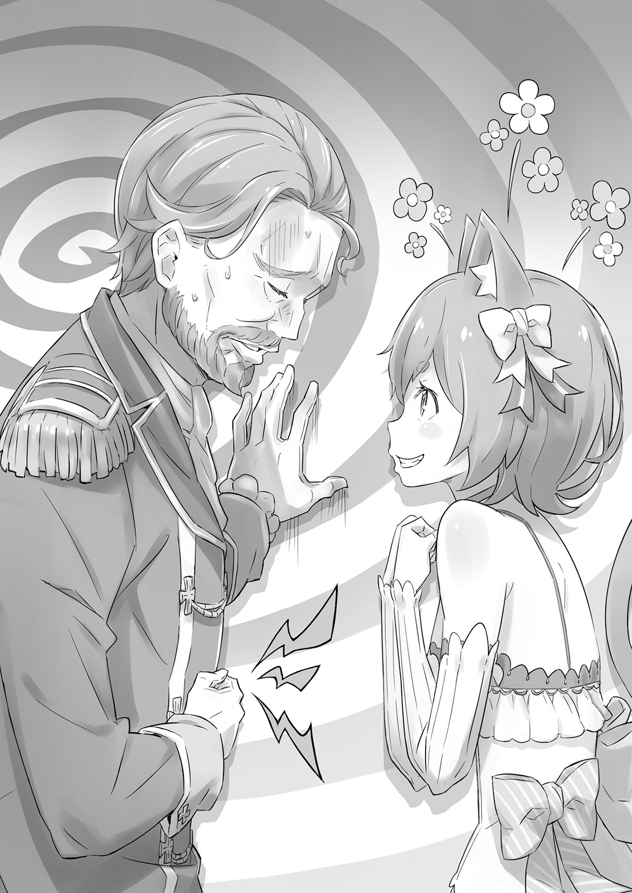
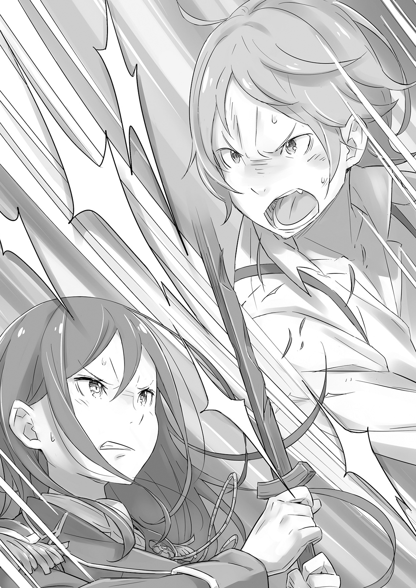
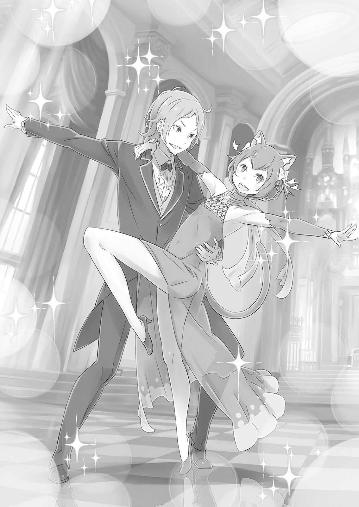
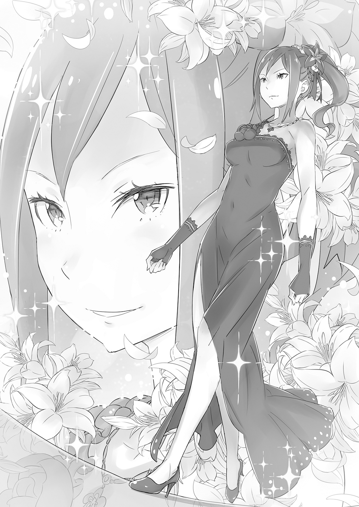

Валькирия земель герцога Карстена

Первым делом с утра нужно было обратиться к отражению в зеркале.

— Милый! Я милый. Девушка-девчушка, чудесная и милая девочка.

Уже довольно давно это было мантрой, словами, повторяемыми словно магия. Нет, не словно магия. Это и была магия, по сути. Магическое заклинание — это просто слова, содержащие силу изменять вещи, влиять на то, как устроен мир. Клятву самому себе, которая приносит перемены, нельзя было назвать иначе.

После этого заклинания пришло время провести щёткой по характерным льняным волосам до плеч. Убедиться, что они пышные и аккуратные, прежде чем подавить зевок и сменить пижаму.

Пока он шёл к шкафу, холодный воздух ударил по бледной, стройной — и в данный момент — обнажённой, дрожащей коже. Важно было выбрать рубашку не слишком кричащую и юбку с подолом достаточно коротким, чтобы, возможно, заставить кого-то поднять брови, а затем проверить, как всё это выглядит в зеркале. Затем настала очередь кюлотов и гольфов до колен, а также белых лент, которые нужно было вплести в волосы. И точно так же, как подтверждало ранее произнесённое магическое заклинание, образ идеальной юной леди теперь был завершён.

Принять позу перед зеркалом, затем проверить ещё раз, чтобы убедиться, что всё на месте. Нельзя упускать ни одной детали; не должно быть никаких ошибок. Эта девичья внешность была заимствованной, хотя изначально должна была принадлежать этому человеку, поэтому было важно обращаться с ней бережно.

— Отлично! Сегодня снова выгляжу хорошо!

Всё завершилось удовлетворённым кивком и подмигиванием. «Идеально, без сомнений».

По правде говоря, давно наступил момент, когда регулярные утверждения больше не были нужны. Эти слова теперь стали частью того, кто их произносил. Ведь прошло уже шесть лет.

— Нельзя выглядеть меланко-мяу-лично. Похлопать себя по щекам. — А теперь, за дело! И с крошечным зевком пришло время покинуть комнату.

Коридор особняка ранним утром был тих, в воздухе ощущался холодок. Это было время, когда можно было почувствовать приближение холодного сезона. Хотя этот человек привык экономить везде, где только можно, такое утро заставляло задуматься о том, чтобы надеть ещё один слой одежды.

В коридоре он обменялся утренними приветствиями и лёгкими улыбками со слугами, которые уже начали дневную работу. Все отмечали внезапное похолодание, и даже прозвучало мягкое предостережение не простудиться.

— О чём ты? Имеешь в виду старую поговорку: „Сапожник без сапог“?

Улыбнувшись и помахав рукой, они разошлись, а наш герой продолжил путь к главному вестибюлю особняка. Пожилой управляющий открыл дверь. Проходя через неё и неосознанно съёживаясь от налетевшего холодного ветра, одинокая фигура сгорбилась.

— Ты здесь, — бросила через плечо та, что пришла ко входу раньше. Она была прекрасна. Женщина натянула поводья белого земляного дракона, своего верного скакуна, придерживая длинные зелёные волосы от поднимающегося ветра. Чувствуя на себе её взгляд раскосых янтарных глаз, новоприбывший неосознанно попытался выпрямиться из своей сгорбленной позы. Это не была попытка хорошо выглядеть перед женщиной; просто её глаза обладали силой вызывать такую реакцию.

— Вы ведь недолго меня ждали, госпожа Круш?

— Нет, ты как раз вовремя. Просто я проснулась немного раньше. Мой отец наконец решил снова разрешить мне долгие поездки. Мне не терпелось отправиться в одну из них.

Дракон приблизил к ней морду, и она погладила его по голове, её лицо расслабилось в улыбке. Она выглядела очень собранной, и всё же это говорило о чём-то детском внутри неё. Её звали Круш Карстен.

Она улыбнулась ещё шире, заметив, что её спутник смотрит на неё. — Возьми себе земляного дракона из конюшни. Пункт назначения тот же, что и всегда, хорошо, Феррис?

— Да, мэм, — ответил Феррис с идеальным реверансом, выглядя во всех отношениях как идеальная леди.

Так Феррис — юноша Феликс Аргайл — начинал каждый свой день.

Феррис, которому теперь было шестнадцать, твёрдо верил в силу воли и веры человека. Если продолжать верить, могли произойти удивительные вещи.

Например, у него давно должны были развиться вторичные половые признаки, но, словно в ответ на его ежедневные желания и молитвы, он не проявлял никаких признаков становления более мужественным. Его голос не стал ниже, а тело не уплотнилось. Он был втайне благодарен своим предкам за то, что у него не росла борода.

Но вещи, за которые он был благодарен своей родословной, не ограничивались его телом.

— Я утомила тебя, Феррис? — спокойный голос вывел его из задумчивости. Он отдыхал, сидя в траве и прислонившись к большому дереву. Круш опустилась на колени прямо перед ним и пристально смотрела ему в глаза.

— …Прости, мяу . Немного задумался.

— О? Это на тебя не похоже. Ты устал? Я тебя слишком нагрузила?

— Нет, я просто немного замечтался… Вы собираетесь меня наказать? Госпожа Круш, вы накажете Ферри? У меня сердце колотится!

— Наказать тебя? Не хотела бы я быть такой бессердечной, — покачала головой Круш, не обращая внимания на значение краснеющих щёк Ферриса. Парень-кот вздохнул. Круш, всё ещё глядя на него сверху вниз, продолжила: — И здесь нет нужды в церемониях. Можешь витать в облаках, если хочешь. Что бы ни случилось, я здесь.

— Ах, госпожа Круш, вы всегда знаете, что сказать… даже если никогда этого не осознаёте. Ферри, кажется, влюбился…

— А? У тебя лицо красное. Сегодня прохладно — не говори, что простудился?

— Нет, вовсе нет! Совсем не то! О-о-о, госпожа Круш, вы просто слишком жестоки! Я не могу этого вынести!

Хозяйка Ферриса была совершенно невосприимчива к любым чувствам, более глубоким, чем тесная дружба, и принимала его слова совершенно за чистую монету. — Понимаю, — сказала она. — Прости. Она выглядела искренне смущённой. Сама её невинность была подкупающей — и совершенно несправедливой.

— …

Удовлетворённая заявлением Ферриса о добром здравии, Круш вернулась на своё прежнее место, словно её туда притянуло. Это травянистое поле было местом, куда они вдвоём всегда приезжали, когда хотели совершить более долгую поездку. Оно находилось примерно в часе езды от особняка, место чистой маны и полное ветра. Оно казалось почти священным. Феррис всегда был вне себя от радости, проводя время только вдвоём, в месте, где никто не мог им помешать.

— Кия!

Гибкая Круш выполнила серию движений мечом, пока Феррис наблюдал за ней со своего места у дерева. Её отточенные удары, агрессия, которую она излучала — даже Феррис, который был любителем в обращении с мечами, мог сказать, насколько она была искусна с этим оружием.

Круш была полностью поглощена красотой стали; она начала учиться владению мечом ещё до встречи с Феррисом. Но всё же, тот факт, что её мастерство фехтования достигло такого уровня, был его заслугой. И это знание делало его гордым и счастливым больше всего на свете.

Вот почему ему никогда не надоедало наблюдать за работой Круш с клинком. Видеть талант, который он помог взрастить, захватывало его сердце, словно мерцание драгоценного камня.

— Сегодня утром вы увлечены даже больше обычного, госпожа Круш.

— Верно. Вот что бывает, когда так долго ждёшь возможности взяться за меч и отправиться в дальнюю поездку. Если бы ты не удерживал меня от тоски по заточению, я уверена, что высказала бы отцу какую-нибудь нелепую жалобу от чистой скуки.

Сбоку было трудно разглядеть, но ему почти показалось, что Круш приятно улыбалась, взмахивая клинком.

Во время поездки сюда её глаза сияли, как у ребёнка. Больше месяца ей было отказано в двух вещах, которые заставляли её чувствовать себя наиболее живой, и это, должно быть, её убивало.

— Но это так похоже на вас, миледи, — не пытаться улизнуть и сделать это тайком.

— Конечно, нет. Мой отец был прав, сделав мне выговор. Это я создала проблемы. Если бы я сочла возможным нарушить правила после этого, люди наверняка сказали бы, что у меня нет стыда.

Что делало Круш чудесной, так это то, как она воплощала такие слова, как честность и прямота . Поскольку она считала естественным соблюдать правила, она была склонна протестовать против своей невиновности, когда было ясно, что она не сделала ничего плохого. Это, безусловно, был один из таких моментов.

— Знаете, Ферри не очень-то доволен решением лорда Меккарта. Именно потому, что мяу были там, всё не стало хуже!

— Вполне естественно, что отец попросил меня вести себя подобающе дочери герцога. Хотя мне бы хотелось, чтобы он однажды принял меня… Так кто из нас упрямее — я или отец?

Феррис надул щёки, но Круш лишь криво улыбнулась.

Событие, вызвавшее гнев Ферриса, произошло около месяца назад. В день, очень похожий на этот, Круш и Феррис отправились в одну из своих долгих поездок по владениям Карстенов. По пути они наткнулись на группу пиратов, источник некоторого местного беспокойства, нападавших на драконью повозку, и Круш доблестно их прогнала.

Круш никогда не была в реальной опасности, хотя столкнулась почти с десятью разбойниками. Но её отец — Меккарт Карстен, нынешний глава герцогского дома Карстенов — был чрезвычайно расстроен, когда эта история дошла до его ушей.

Круш знала, что так и будет, и поэтому покинула благодарного владельца повозки, не назвав своего имени, но она была слишком известна, чтобы это сработало. Её пристрастие к фехтованию было общеизвестно в землях Карстенов. А поскольку герб с оскалившимся львом был прекрасно виден на её мече, отрицать что-либо было невозможно.

Дочь герцога, которая избегала платьев ради мужской одежды и предпочитала скрещивать клинки любованию цветами. Слухи слишком легко подтвердились, и в наказание Круш было запрещено браться за меч или уезжать далеко от дворца в течение одного месяца.

Круш, казалось, смирилась с этим, но Феррис не раз высказывал своё возмущение непосредственно Меккарту. Но тот не уступал. Месяц ожидания наконец привёл к сегодняшнему дню.

— Я определённо призна-мяу, как многим обязан лорду Меккарту, но это не значит, что я должен принимать всё, что он делает.

— Хотела бы я, чтобы ты не так сильно критиковал моего отца. В последнее время он, кажется, худеет с каждым днём. Ответственность за управление герцогским домом, должно быть, давит на него. Я хочу, чтобы хотя бы время с семьёй было для него источником радости.

— Вы имеете в виду, что Ферри — часть семьи?

— А? Конечно.

Щёки Ферриса вспыхнули от того, что его так легко включили в семью. Он быстро похлопал по юбке, чтобы отвлечь внимание от своих щёк.

— В-всё в порядке, — сказал он. — Лорду Меккарту, похоже, практически нравится, когда Ферри ставит его в такое положение. Он сказал, что ему доставляет удовольствие, когда ему говорят возмутительные вещи…

— Что? Мой отец так сказал? Я не знала… и, думаю, теперь буду смотреть на него немного иначе.

Круш полностью поверила в эту сплетню, которую Феррис стратегически использовал, чтобы отвлечь её от своего смущения. На лице дочери Меккарта было явное удивление. Феррис попытался запечатлеть это выражение в памяти, так как видел его слишком редко. И молча извинился перед герцогом, хотя мысленно и показал ему язык. Однако он не пытался исправить недоразумение Круш. Возможно, это был признак того, насколько он всё ещё был недоволен.

— Феликс, можно тебя на минутку?

— Да, сэр? — Феррис обернулся на голос, в приступе раздражения изобразив свой самый девичий взгляд. Мужчина, казалось, был встревожен откровенно кокетливым взглядом. Феррис насладился моментом. — О-о, вас так легко вывести из себя, лорд Мяукарт. Слишком весело дразнить вас! Вы пробуждаете во мне внутреннего проказника!

— Что? И ты меня в этом винишь? Э-э… то есть, прости.

«Стоит только сделать немного обиженный вид, и он извинится. Какой слабак».

Перед Феррисом стоял мужчина лет пятидесяти. Он отрастил усы, якобы для придания себе весомости, но странная форма бровей и доброе лицо лишали его всякой выгоды от этого. Единственное, что у него было общего с Круш, его кровной дочерью, — это цвет глаз.

Тем удивительнее было то, что это был герцог Карстен, глава одного из самых известных дворянских родов Лугуники. И он также был отцом Круш — Меккарт Карстен.

Печальная улыбка появилась на дружелюбном лице Меккарта. Он потянул свои довольно неуместные усы и сказал: — Полагаю, сегодня утром ты ездил с Круш. Как она поживает?

— Если вы беспокоитесь о ней, сэр, позвольте смиренно предложить вам спросить её саму. Речь, конечно, идёт о вас, но неужели вы думаете, что госпожа Круш солжёт вам, лорд Меккарт?

— Не уверен, что мне нравится, как ты это сказал. Но нет, я не беспокоюсь, что она мне солжёт. Просто… Ну, это я наложил тот запрет. Я подумал, что ей может быть трудно сказать, что она на самом деле чувствует… Эм, вернее… мне трудно спросить.

Его доброе сердце взяло верх над желанием обмануть себя, и он озвучил свою истинную проблему. Отец и дочь были также похожи в своей неспособности нагло лгать.

— Понятно… Что ж, успокойтесь. Госпожа Круш не злится на вас или что-то в этом роде. Она, кажется, даже понимает, почему вы поступили именно так.

— Ты говоришь так, будто я злодей… Но, кхм, спасибо.

— К вашему сведению, Ферри всё ещё злится. Гадкий, гадкий лорд Меккарт!

— Что? Эм, то есть, прости… Даже я думаю, что немного переборщил.

Меккарт, выглядя слабым, потёр верхнюю часть живота. Из-за стрессов, связанных с его положением, в сочетании с его тревожным характером, боль в желудке была его близкой подругой.

— Использовать на вас исцеляющую магию? Это может немного облегчить боль.

— Верно. Раз уж мы поболтали, может, ты меня вылечишь? Не мог бы ты зайти ко мне в комнату?

— Н-нет! Понятия не имею, что мяу вы можете сделать со мной там, сэр!..

— Ничего! Я ничего тебе не сделаю!

Несмотря на то, что он поддразнивал герцога, Феррис в конце концов последовал за Меккартом в его комнату. Место было простым: стол для секретаря, а также низкий столик и кожаный диван для приёма посетителей.

Феррис и Меккарт сидели друг напротив друга на диване, и слуга принёс чай с такой расторопностью, словно всё это было спланировано заранее. Поставив дымящиеся чашки, слуга удалился с исполненным достоинства поклоном.

Когда слуга ушёл и дверь закрылась, Меккарт поднёс чашку к губам и осторожно отпил. — …Скоро Круш исполнится семнадцать.

Феррис, конечно же, это знал. До этого радостного дня оставалось всего две недели; право, не будет преувеличением сказать, что Феррис был благодарен за этот день больше, чем за любой другой в календаре.

— Я благодарен звёздам, и небу, и земле… и определённо Круш. Я так рад, что она родилась.

Меккарт прервал мечтания Ферриса. — Прошу прощения, Феликс, но не мог бы ты позволить мне высказаться? Есть… кое-что, о чём я хотел бы попросить тебя спросить у этой девочки насчёт её дня рождения. То, что мне… трудно выразить. По его неловкому тону и уклончивости Феррис довольно хорошо догадывался, что имел в виду Меккарт. В конце концов, этот вопрос поднимался почти каждый год.

— …Вы хотите, чтобы госпожа Круш надела платье, не так ли?

— Да, Феликс, именно. Это её день рождения. И в этом году я задумал нечто более грандиозное, чем обычно. Так что я очень хочу, чтобы она надела что-нибудь подобающее…

— Если это хоть как-то возможно, господин Меккарт, я правда думаю, вам стоит поговорить с ней самому. Вам не обязательно делать это через меня…

— Эта девочка и головой не кивнёт, если не ты попросишь, верно? — тихо спросил Меккарт. Кошачьи ушки Ферриса тут же уловили перемену в атмосфере. Эти светло-льняные звериные уши, унаследованные им от предков-полулюдей, были исключительно чувствительны к малейшим изменениям в обстановке и окружении.

— Я знаю об обещании между тобой и Круш, — продолжил Меккарт. — И я уверен, ты уже говорил с ней об этом раньше.

— Знаете, как я понимаю, что вы двое родственники? Никто из вас никогда не сдаётся.

— Возможно, своё упрямство она унаследовала от меня… Но мы не можем вечно идти параллельными курсами. Я отчаянно пытаюсь найти компромисс.

— Компромисс, господин Меккарт?

Это слово нельзя было использовать легкомысленно, особенно с Круш, для которой оно, возможно, было наименее приятным из всех мыслимых.

— Неважно, если это будет только на публике, только для вида, — сказал Меккарт. — Конечно, в глубине души я всегда желал, чтобы она вела себя, как подобает дочери герцога, но мои просьбы на этот счёт отклонялись достаточно часто, чтобы я уже усвоил урок. Моя надежда в том, что моё нынешнее предложение позволит нам найти золотую середину.

— …

— Я знаю, что её обещание тебе — причина, по которой Круш продолжает играть со своими мечами и одеваться как мужчина. Поэтому, если я хочу хоть как-то это смягчить, имеет смысл действовать через тебя. Ты не поговоришь с ней?

— Я понимаю, что вы пытаетесь сказать, лорд Меккарт. Но я…

Меккарт резко прервал его. — Не думаю, что ты понимаешь, Феликс.

Феррис затаил дыхание. Герцог выглядел мрачнее и одиноче, чем когда-либо прежде на его памяти.

— Круш — моя единственная дочь. Она выросла такой замечательной, что это даже расточительно для такого отца, как я. Я ни в коей мере не был надёжным отцом. Но чем более я жалок, тем более восхитительной она становится… Я действительно хочу, чтобы она следовала своим мечтам. Я молюсь, чтобы она выросла именно той, кем является на самом деле, — Меккарт опустил глаза, переполненный любовью к дочери. — Но я не только отец, но и герцог. А она не только моё дитя, но и дочь герцога. Пока она живёт в этом доме, поддерживаемая людьми этого домена, у неё будут определённые обязанности, которые она должна исполнять. И когда она будет их исполнять, люди будут ожидать наряд и поведение, подобающие её положению. Ну что, Феликс? Я неправ?

— …Нет.

— На самом деле, я не прав. Я пытаюсь заставить свою дочь делать то, чего она не хочет. Поступать правильно может быть ошибкой, а ошибка может оказаться правильным поступком. Таковы трудности этого места, где приходится жить мне и моей дочери.

Пока герцог излагал свои доводы, Феррису стало стыдно за себя. Он был так поверхностен. До этого момента он просто считал Меккарта обычным грубияном. Ему и в голову не приходило, что за упрямой внешностью скрывается отец, глубоко обеспокоенный своими отношениями с дочерью. Феррис почувствовал, как к горлу подкатывает ком, когда осознал, что от этой бездумности его спасло сострадание Меккарта, его готовность попытаться всё обсудить, а не просто навязать свою волю, пользуясь своим немалым авторитетом.

— Его Высочество Фурье будет присутствовать на праздновании дня рождения. Уверен, он с нетерпением ждёт, какое платье наденет Круш.

— …Да, полагаю, так и есть.

— Вот именно! Так что не только ради меня, но и ради Его Высочества — пожалуйста, поговори с Круш?

Упоминание имени молодого принца смягчило тон разговора. Возможно, это тоже было проявлением тактичности Меккарта. Феррис поднёс к губам чашку с уже остывшим чаем, пытаясь не обращать внимания на собственную душевную мелочность.

Он вспомнил обещание, данное им, когда он был ещё достаточно молод, чтобы оправдывать себя юностью. Бессознательно он коснулся белой ленты, которую Круш подарила ему в тот день.

— Знаете, я всегда считал то обещание неправильным.

— …М-м, возможно. Ты и моя дочь — оба хорошие дети.

— Но я был так счастлив делать то, что обещал… Это сделало меня счастливее всего на свете. И, может быть, из-за этого я слишком часто принимаю её сторону.

Его рука всё ещё лежала на ленте. Меккарт тихо кивнул.

По-своему, эти слова были ответом Ферриса на просьбу Меккарта.

Его маленькое чаепитие с Меккартом закончилось, и Феррис тревожно нахмурил брови. После такого разговора спорить было бесполезно. И он не собирался отказываться от *того самого* обещания.

— Но как, чёрт возьми, мне теперь об этом заговорить? — произнёс он вслух. Будет трудно найти подходящий момент и естественный повод для разговора.

Сегодняшний день был особенно неподходящим. Месячный запрет для Круш на владение мечом и полёты на драконе только что был снят. Из всех возможных моментов это был самый неподходящий, чтобы явиться к ней и попросить надеть платье.

— Ох, но! Но! До празднования дня рождения всего две недели. Откладывать разговор может быть ещё хуже…

Эта тема вряд ли могла ждать до последнего момента. Речь шла о праздновании дня рождения дочери герцога. Чем больше времени на подготовку, тем лучше. Даже две недели казались недостаточным сроком. Сам Меккарт, без сомнения, колебался, прежде чем поговорить с Феррисом.

— Нья-а-а! Как же мне с этим справиться?!

— Что происходит, Феррис? Ты распугаешь всех в доме, если будешь стоять в коридоре с таким мрачным видом.

— Мья-я-а! Феррис чуть не подпрыгнул до потолка, когда сама Круш окликнула его, пока он стоял там, переминаясь с ноги на ногу от беспокойства. Он отлетел к стене. Круш скрестила руки на груди и уставилась на него.

— Мне всё ещё кажется, что ты выглядишь уставшим. Если чувствуешь себя измотанным, я могла бы дать тебе отпуск…

— Что? Нет! Я в полном порядке! Лучше не бывает! Ура госпоже Круш!

— ? Ха-ха, чудак ты.

Она слегка улыбнулась, глядя, как он стоит с поднятыми в приветствии руками. Было очевидно, что ему не удалось сбить её со следа, да и сам он ещё не совсем успокоился.

— Кстати, — сказала Круш, — ты говорил с моим отцом, не так ли? Чего он хотел?

— Ох, э-э, ну, знаешь … …

Лучшего момента, чтобы поднять эту тему, и желать нельзя. Проблема была лишь в том, что морально он чувствовал себя совершенно неготовым. С другой стороны, момент был настолько удачным, что казался знаком свыше. Сейчас самое время для разговора.

— Ну, эм, — начал он, — Ферри, э-э, хочет кое о чём поговорить с вами, госпожа Круш…

— Я так и думала. Твой ветер¹ трудно читать, но такое у меня сложилось впечатление. Ты же знаешь, нам незачем что-то скрывать друг от друга. Говори со мной о чём угодно.

— Я люблю вас, госпожа Круш.

— И я тебя.

Он признался в своих чувствах в порыве счастья, но серьёзный ответ быстро охладил его пыл. Разве он не размышлял всего мгновение назад о том, как тронут был добротой Меккарта? Немедленно вернуться к тому, чтобы позволить доброте Круш баловать его, мало что сказало бы о его личностном росте.

— Я люблю вас, госпожа Круш.

— ? И я тебя.

Он повторялся, но это его успокоило и помогло почувствовать себя лучше. Ему предстоял очень трудный разговор.

— Ну, э-э, это всего лишь мнение лорда Меккарта, и Ферри не хотел бы, чтобы вы приняли это за моё согласие, но…

— Какой-то ужасно окольный путь для начала разговора. Ладно, я понимаю. Так каково мнение моего отца?

— Да, ну, скоро ваш день рождения, госпожа…

Он подготовил почву и уже собирался перейти к сути, когда…

— Круш, ты здесь?! Я в ужасном положении! Круш, покажись!

— ?!

Феррис застыл от удивления, услышав рёв, разнесшийся по коридору. Стоявшая перед ним Круш подняла взгляд и склонила голову набок, прислушиваясь к голосу.

— Не могу поверить, но это только что был Его Высочество Фурье?

— М-мне всё равно, что он принц, — кипел Феррис. «Как он мог испортить мой идеальный момент?..»

— Круш! Ты разве не здесь? Я сказал, это кризис! Иди скорее, или я зачахну от одиночества!

— Это точно он, — сказала Круш.

Первый шок прошёл, и второго восклицания было более чем достаточно, чтобы опознать обладателя голоса. Феррис и Круш переглянулись и рысью направились к входу. У дверей слуги, включая управляющего, выстроились в линию для приёма, и прямо посреди них стоял он сам.

— А! Круш и Феррис! — сказал он, заметив их. — Вы оба здоровы? У меня у самого всё отлично. Затем он улыбнулся с искренним весельем. Это был молодой человек, чьи глаза, несмотря на его годы, казались простодушными. У него были длинные золотистые волосы и безупречные алые глаза, а его клыки слегка выступали. Он производил очень приятное впечатление.

Сбросив богатую меховую накидку, Фурье Лугуника выглядел таким же энергичным, как всегда.

Четвёртому принцу королевской семьи не подобало заявляться так запросто, но Круш и Феррис оба привыкли к этому, и ни один не выказал удивления. Круш скромно поклонилась внушительно стоявшему Фурье.

— Ваше Высочество, — сказала она, — для меня честь видеть вас. Но что послужило причиной столь внезапного визита? Что-то не так? Я ничего не слышала от отца…

— О чём ты говоришь? Разве не вы двое пригласили меня сюда? На празднование дня рождения Круш? Я даже приглашение своё принёс. Смотри! Тяжело дыша и вздыхая, Фурье подошёл к Круш, так уважительно его поприветствовавшей, и протянул письмо. Она взяла его, пробежала глазами и медленно кивнула.

— Это действительно приглашение от нашего дома… но, мой лорд, вы, кажется, перепутали самую важную часть — дату. Я рада, что вы потрудились приехать сюда, но мой день рождения только через две недели. Ваше Высочество проявили излишнее рвение.

— Что?! Ты хочешь сказать… я первый, кто поздравил тебя с днём рождения! Идеально! Феррис всегда меня опережает, но на этот раз я его обошёл!

— …

— Ты молодец, что родилась, Круш! Я вне себя от радости! Какой чудесный день! Фурье внезапно рассмеялся, очевидно, игнорируя собственную ошибку. Круш потеряла дар речи от такой дерзости, но вскоре на её лице появилась мягкая улыбка.

— Большое спасибо, Ваше Высочество. Ваши добрые пожелания очень много для меня значат.

— Хорошо, очень хорошо. Но значит ли это, что до празднования твоего дня рождения ещё две недели? Что ж, это проблема. Что же мне делать всё это время?

Фурье имел склонность действовать, не думая о будущем, бросаться вперёд, не думая о будущем, говорить, не думая о будущем, и вообще не думать о будущем, но у него было достаточно обаяния, чтобы всё это ему прощалось. Пока он стоял, пытаясь сообразить, что делать дальше, даже Феррис не смог сдержать улыбки. Принц ничуть не изменился с тех пор, как они впервые встретились.

— Хм? — сказал Фурье. — Что такое, Феррис? Чего ухмыляешься?

— Просто вы меня забавляете, Ваше Высочество.

— Меня?! Ах, да… Я не обычный лидер. Я вызываю улыбки на лицах своих слуг, даже не намереваясь. Разве не так, Круш?

— Я могу лишь восхищаться тем, какая вы великая личность, Ваше Высочество. Феррис, наказание позже.

— О-оу!

Предоставьте Круш позаботиться о том, чтобы он не остался без наказания за свою оплошность в этикете. Но в то же время все трое были настолько близки, что такое непочтение могло сойти с рук без реальных последствий. Для Ферриса, у которого было так мало по-настоящему ценных вещей, эта связь была тем, чем он дорожил. Когда он думал о том, что для него важно, он думал о Круш, Меккарте и Фурье. И о слугах в поместье Карстен. Не говоря уже о пациентах и коллегах, с которыми он столкнулся благодаря своей работе заклинателя. Оказалось, было довольно много людей, которых он ценил.

По сравнению с тем временем, когда он был заперт в доме своей семьи, где ему ничего не давали, сейчас он был намного счастливее.

— …Феррис, — говорил Фурье, — я знаю о своей сногсшибательной внешности, но, пожалуйста, постарайся не слишком пялиться. Всё это внимание с твоей стороны может сбить меня с пути истинного — даже зная твой истинный пол.

— Я однажды даже был вашим женихом, и всё равно не смог заполучить вас в свои лапки, Ваше Высочество!

— Это было просто..! Кхм, достаточно. Я тоже парень, знаешь ли! Я не буду оправдываться! Разве я не довольно мужественен, Круш?

— Да, мой лорд. Хотя, если позволите, вы ещё ни разу не победили меня в поединке на мечах.

— Госпожа Круш! Госпожа, Его Высочество уже на коленях, так что, может, стоит быть с ним помягче?..

Фурье рухнул на ковёр. Круш одарила его недоумённым взглядом, совершенно лишённым злобы. С друзьями Круш имела склонность излагать факты слишком прямолинейно. Но даже самые колкие замечания она делала с дружелюбным выражением лица, из-за чего трудно было считать это действительно дурной привычкой.

Фурье, со своей стороны, быстро оправлялся от подобных разочарований.

— Нгх, что ж, тогда! В таком случае, Круш, принеси мне деревянный меч! У меня впервые за долгое время есть свободное время, так пусть сегодня будет тот день, когда я превзойду тебя в фехтовании и докажу, какой я мужчина!

Круш встретила это смелое заявление словами «Да, мой лорд», как будто прекрасно понимая, что происходит.

Поединки Круш и Фурье на деревянных тренировочных мечах продолжались уже шесть лет, примерно с того же времени, как Феррис начал носить женскую одежду. Это стало своего рода традицией.

Фурье находил любой предлог, чтобы навестить Круш. Его любовь к ней было совсем нетрудно заметить всем, кроме самой Круш. Что касается Фурье, он был общительным во всём, кроме дел сердечных, поэтому их отношения никогда не выходили за рамки близких друзей. Фурье рассматривал этот поединок как простой способ спровоцировать изменения в их отношениях.

— Если ты победишь, я заставлю тебя одеться в женское! Ты стала ещё упрямее в своём мужском наряде… Не то чтобы он тебе не шёл! Но я хочу увидеть тебя в юбке!

— Вам придётся довольствоваться Феррисом, мой лорд. Уверяю вас, его ножки не менее изящны, чем мои.

— Я горжусь этими ножками. Взгляните, Ваше Высочество!

— А-а-аргх! Не сбивайте меня с толку, вы двое! Фурье покраснел и в расстройстве топнул ногой, когда Феррис дразняще приподнял юбку. Одной рукой он указал на Круш; другой показал приглашение на день рождения, которое она ему вернула. — Скоро твой день рождения! И я не позволю имениннице одеваться как солдат, как в прошлом году! В этом году я увижу тебя в платье! Причём в том, которое выберу я!

— Ах…

Фурье так любил эти прокламации. И эта как раз идеально совпадала с тем, чего хотел Феррис. Он удивлённо затаил дыхание, и некое нежное чувство к Фурье поднялось в его душе.

«Этот глупый принц…»

— Он единственный, кроме госпожи Круш, кто может надавить на слабое место Ферри…

— …

Щёки Ферриса покраснели, дыхание стало горячим от смеси привязанности и зависти.

Круш, единственная стоявшая достаточно близко, чтобы расслышать его бормотание, бросила на него взгляд. Но Феррис не заметил, и прежде чем Круш успела заговорить…

— Отлично! Тогда в сад! Готовьтесь, все! Сегодня тот день, когда я стану мужчиной! — воскликнул Фурье с, казалось бы, совершенно необоснованной уверенностью, и Феррису с Круш пришлось поспешить за ним, когда он направился наружу.

Это было шесть лет назад, но он помнил это так, словно это было вчера: день, когда начались поединки между Круш и Фурье. День, когда Феликс стал Феррисом.

— Я с трудом понимаю, как Ваше Высочество может вмешиваться в то, как я выбираю жить.

— Хм… но ты говоришь, что отбросишь свою женственность, чтобы она не мешала ни твоей благородной семье, ни твоему фехтованию? Нет! Я не позволю этого! Я просто не могу допустить, чтобы это произошло!

— В таком случае, мой лорд, что вы намерены делать?

— Меч! Используй клинок, чтобы доказать мне свою решимость! А я покажу тебе ошибочность твоего пути!

— Бой на мечах? Между вами и мной, Ваше Высочество?

— Да, именно. В том маловероятном случае, если ты победишь, ты сможешь выбрать любой жизненный путь. Но если выиграю я, тебе придётся передумать. Я сделаю из тебя женщину!

Таково было обещание, которое они дали друг другу. У Фурье был весь энтузиазм, но у Круш была решимость. И тогда начались поединки…

— Ты поистине безжалостна, Круш! Я принц! Член королевской семьи!

— Ладно, Ваше Высочество, ладно, — сказал Феррис. — Не нужно хныкать, *нья*. Вот, смотрите! Я избавлю вас от этой болячки.

Ему пришло в голову, что точно так же он исцелял Фурье в тот день шесть лет назад.

Почти плача и весь в пыли, Фурье вцепился в Ферриса. Кошкомальчик использовал свою целительную магию. Волна облегчения прошла по синякам, оставленным деревянным мечом Круш. Фурье медленно поднялся на ноги.

— Ха-ха-ха! Вы видели? Как я притворился, будто хнычу и плачу, чтобы вызвать сочувствие противника и выиграть достаточно времени, чтобы Феррис меня исцелил? Просто ещё один из моих устрашающе умных расчётов..!

— Ваши колени не согласны, Ваше Высочество, — заметил Феррис. Несмотря на улыбку, которую Фурье тщательно изобразил на лице, его колени дрожали. Это лишь подчёркивало, насколько утончённой и галантной выглядела Круш в сравнении. Она сняла куртку, обнажив свою стройную фигуру. Она держала оружие наготове и стояла так прямо, что её саму можно было принять за меч.

«А теперь сравните это с Его Высочеством…»

— Я тебя слышу, Феррис! Прибереги свои похвалы в мой адрес до окончания битвы!

— Знаете, что я люблю в вас, Ваше Высочество? Ваш неудержимый оптимизм.

Фурье проигнорировал мягкую колкость Ферриса и стремительно сократил дистанцию до Круш. В тот момент он, казалось, забыл, что его противница — это ещё и женщина, которую он любит. Но она отбила его удар, и его собственная инерция снова отправила его кувыркаться по траве. Мгновение спустя последовала боль, заставившая его сильно закашляться при попытке встать.

Разница в их способностях была огромной, но это была не вина Фурье. Феррис был несколько предвзят в своей оценке, но Фурье был гораздо искуснее среднего знатного дилетанта своего возраста. Его желание победить Круш в сочетании с многолетними поединками превратило его из изнеженного принца в мужчину, способного постоять за себя с клинком. То, что он всё ещё не мог одолеть Круш, говорило о её таланте и о том, как усердно она трудилась.

— Желаете продолжить, мой лорд? Боюсь, сердце моего отца может разбиться, если я буду бить вас ещё сильнее.

— Конечно, я продолжу! Ты слишком легкомысленно ко мне относишься, Круш! И я не думаю, что сердце Меккарта такое хрупкое, как ты предполагаешь. Нападай на меня изо всех сил!

Как и следовало ожидать, его заявление было немного чрезмерным.

Битва проходила в центральном саду, и слуги, которым больше нечего было делать, наблюдали за ней. Там был и ещё кое-кто, кому от всего этого зрелища было явно не по себе: сам Меккарт. Он выходил каждый раз, когда это случалось, хотя стресс от этого был настолько сильным, что его щёки ввалились. «Ну, ему ведь необязательно смотреть.»

— Ох, почему они сегодня намного серьёзнее, чем обычно? — беспокоился Меккарт. — Но если бы Его Высочество победил…

Меккарт скривился от боли в животе, разрываясь между тем, на что он надеялся как отец, и тем, чего желал как герцог. В тот момент Феррис слишком хорошо понимал, что чувствует Меккарт.

«Я даже не знаю, хочу ли я сейчас, чтобы Круш победила или проиграла!»

— Я-а-ах! Круш, надень пла-а-а-атье! Возможно, было бы слишком щедро назвать это боевым кличем, но с этими словами Фурье снова бросился вперёд, и снова был повержен. Увидев, как Фурье снова поднимается после того, как его согнуло пополам, Круш сузила глаза.

— Ваше Высочество, кажется, менее склонны уступать, чем обычно. Что движет вами?

— Ты, конечно! Ты делаешь меня таким… Нет, по сути дела, я делаю себя таким! Я навязал тебе это, так что теперь я должен сыграть свою роль!

— …Ваше Высочество?

Фурье, чьё красивое лицо было измазано грязью и потом, покачал головой. — Я не забуду, каким глупцом я был те пять лет назад, как плохо знал своё место. Не зная своей силы, я связал тебя импульсивным обещанием. Я заставил тебя поклясться, что пока я не смогу одолеть тебя мечом, ты не будешь носить женскую одежду, а будешь одеваться как мужчина — теперь я знаю, каким жестоким был этот поступок.

Казалось, это признание причиняло ему сильную боль, но, конечно, он ошибался насчёт пяти лет. Прошло шесть. Но слова Фурье относились к обещанию, которое они дали в тот день, который Феррис так хорошо помнил…

— Ты помнишь свой пятнадцатый день рождения, два года назад? — спросил Фурье. — Ты так прекрасно повзрослела. В полном парадном облачении в ту ночь, я знаю, ты была бы прекраснее любого цветка. Но ты сдержала своё обещание. Я никогда не забуду вид юной девы, идущей под лунным светом в военной форме. Ты была невероятным красавцем… но это чувство было вызвано мечом на твоём боку. Это не то чувство, которое я хочу испытывать к молодой женщине, чья красота должна превосходить цветы!

Круш молчала.

— В ту ночь я осознал, к чему привела моя бездумность. Это я, и только я, украл у молодой женщины радость быть великолепно одетой и заставил её скрывать себя в момент, который должен был стать её звёздным часом! Я должен взять за это ответственность!

За всё время их знакомства Феррис никогда не видел Фурье таким. Огромная эмоция, горевшая в его алых глазах, затронула что-то в груди Ферриса, сдавила горло. Зрители тоже, от Меккарта до слуг, потеряли дар речи. Теперь они знали, почему Фурье сражался в этих битвах, и слышали, как он выразил то, что никогда раньше не мог высказать.

Но он был неправ. Ошибался. Его решимость была огромной, но неуместной.

Обещание, которое дали он и Круш, было вполне реальным. Когда шесть лет назад Круш заявила, что до конца жизни будет носить только мужскую одежду, Фурье ответил, что позволит ей это делать лишь до тех пор, пока не победит её в поединке на мечах. Предлог, что она держит обещание, данное принцу, был причиной, по которой Меккарт не мог возражать более решительно.

Фурье всё это время вынашивал сожаление об этом. В какой-то момент он начал верить, что Круш не хотела носить мужскую одежду, а делала это из-за их обещания. И, сочетая честность с глупостью, он чувствовал себя ответственным.

«Я дурак…»

Наблюдая со спины, как Фурье поднимает меч, Феррис бессознательно прикрыл рот рукой. Он всегда считал, что улучшение боевых навыков Фурье — результат многократных поединков и простого упорства. Но было нечто большее. Всё это время им двигало сожаление о собственной вспышке.

«Он сражался, чтобы позволить женщине, которую любит, женщине, которую он связал обещанием, быть женщиной.»

— Круш! Люби цветы! Цени поэзию! Красься, носи платья и украшения, и позволь мне увидеть эту невинную улыбку! Тебе больше не нужно себя подавлять! Я разрешаю! Здесь, сегодня, я исправлю свою глупость и позволю тебе быть настоящей женщиной!

— В-Ваше Высочество?..

Возможно, это было недоразумение, но Фурье был готов его исправить. Он бросился на Круш.

Резкий звук эхом разнёсся по саду, и Круш явно была потрясена силой удара.

— Ваше Высочество!

— Принц Фурье!

— Ваше Высочество, одержите победу ради нашей госпожи!

Это были крики слуг, у многих из них покраснели глаза, а в голосах слышалась дрожь. Они знали Круш с юных лет и хотели поддержать принца в его решимости. Фурье усилил натиск, и Круш выглядела ещё более потрясённой.

Его меч взлетал и опускался по дуге; Круш была полностью занята обороной. То, что битва против неё была такой односторонней, было беспрецедентно. Просто настолько страстными были удары Фурье. Его атака была, по-своему, его способом добиться сердца Круш. Его явная преданность, возможно, проистекала из недоразумения, но она тронула многих присутствующих.

— Я доверю это Его Высочеству, — пробормотал Меккарт. Когда он успел подойти к Феррису?

Кошкомальчик поднял на него взгляд, и Меккарт кивнул. Феррис сразу понял, что это значит. Он сложил руки перед грудью, словно в молитве, и стал ждать, чем закончится битва.

— Платье! Макияж! И драгоценности! Цветы и готовка!

— Кх.

— Круш! Преклони колени передо мно-о-ой!

Деревянные мечи затрещали от силы удара, от лезвий полетели щепки. Оба оружия были на пределе. Но исход боя решит то, кто из участников сдастся первым.

Фурье взревел, шаг за шагом, удар за ударом оттесняя Круш. Его миловидное лицо покраснело. Что видела Круш, глядя на его напирающую галантную фигуру? Возможно, она видела себя в его алых глазах — женщину, вынужденную выкладываться на полную.

«…Ах».

Оказавшись прижатой к стене, Круш бросила янтарный взгляд на Ферриса. Они посмотрели друг на друга, и ему показалось, будто она о чём-то просит, но он не знал, о чём.

— Леди… Круш… — Крупные слёзы покатились из его круглых глаз по щекам.

В следующее мгновение раздался треск — деревянный меч наконец сломался, и часть обломка заскользила по земле. Единственное лезвие, оставшееся более-менее целым, было направлено в грудь проигравшего.

«…И всё равно я не могу превзойти тебя».

Фурье говорил сдавленным голосом, всё ещё держа в руке остатки рукояти своего меча. Он смотрел в землю, его плечи дрожали. Возможно, он плакал.

Вздох. Разочарованный, но не отчаявшийся. Но все понурили плечи, поняв, что он не одержал верх.

Но затем…

— Нет, Ваше Высочество. Я проиграла.

Круш мягко покачала головой. Меч в её руке тоже был сломан посередине. Она бросила бесполезный клинок на землю.

— Вы всё ещё держите свой клинок, Ваше Высочество, в то время как я свой отбросила. Победитель должен быть очевиден… воистину, он был ясен с тех пор, как ваш боевой клич потряс мой дух — я проиграла это состязание.

— …

Фурье молчал. Круш опустилась на колени, не обращая внимания на грязь, и положила руки на землю. Этот жест означал подношение меча — знак величайшего уважения и преданности.

— Вы действительно выполнили своё прежнее обещание. Я, Круш Карстен, встретилась с Вашим Высочеством Фурье Лугуникой в бою на мечах и была побеждена. Тогда я надену женскую одежду.

— Э-э… кхм. Неужели? Я… Ясно. Ответ Фурье на торжественные слова Круш был прерывистым и неуверенным. Он кивнул один раз, а затем его высокая фигура начала отклоняться назад, пока он наконец не упал на землю, раскинув руки и ноги.

— Ваше Высочество?! О нет! Феликс, позаботься о Его Высочестве!

Феррис бросился к Фурье задолго до того, как изумлённый Меккарт приказал ему это сделать. Он подсунул колени под голову упавшего юноши, поддерживая вес тела принца и используя свою исцеляющую магию.

— Ваше Высочество, Ваше Высочество! Оставайтесь со мной!.. Ваше Высочество!

— Хе-хе! Ты видел это, Феррис? Видел мою… великую… победу?..

Исцеляющая магия залечит его раны, но не восстановит утраченные силы. Фурье потратил всю свою выносливость до капли, и теперь знакомая беззаботная улыбка появилась на его лице прямо перед тем, как он погрузился в глубокий сон. Феррис с удивлением услышал спокойное, ровное дыхание Фурье.

— Феррис.

— Ох, э-э, да, Леди Круш. Эм, Ферри, то есть… Что Ферри может сказать?..

— Прости за мой эгоизм. — Круш мягко улыбнулась, наблюдая, как Феррис ухаживает за принцем без сознания. Когда её слова дошли до него, слёзы снова потекли по щекам Ферриса. Он поднял глаза, яростно вытирая их.

— Я… Это я был несправедлив к вам!.. Леди Круш, вы… Вы и принц Фурье всегда спасаете меня…

— Разве? Тогда ты щедро отплатил нам. Твоё присутствие — постоянное спасение для меня. И я только сейчас понимаю, что принц тоже спас меня. Полагаю, это показывает, насколько я на самом деле дурно воспитана.

— Дурно воспитана?.. Леди Круш, нет!.. Вы замечательная!..

— Тем более я должна стремиться соответствовать вашей и Его Высочества оценке меня.

Феррис продолжал шмыгать носом, не в силах говорить. Круш с любовью погладила его по голове, вставая. Затем она подошла к Меккарту, который смотрел на неё с разинутым ртом.

Что она ему сказала, Феррис не знал. Он не мог расслышать из-за храпа Фурье и собственного плача.

— Я проделал всю работу, чтобы это стало возможным — и всё же я не увижу Круш в платье до самой вечеринки? Весьма необычно!

— Ну, знаете. У леди Круш много дел. Ей нужно подготовиться морально и физически. К тому же, нелегко найти идеальное платье для леди Круш!

— Я знаю, что ты сделаешь для неё всё возможное, Феррис. Очень обнадёживает!

Феррис мрачно улыбнулся. Напротив него легко рассмеялся Фурье. Они находились в личных покоях Ферриса в особняке Карстен. Его Высочество появился там, как будто это было самое естественное в мире. Феррис лично заварил чай и теперь развлекал принца. Возможно, ему следовало бы быть немного более почтительным, но ни Феррис, ни принц, казалось, не сдерживались. Они были старыми друзьями, если не было слишком дерзко считать себя старым другом королевской особы.

— Две недели с той битвы были поистине мучительными. К тому времени, как я проснулся, я уже был в драконьей повозке по дороге домой. Меня отослали, прежде чем я успел поговорить с Круш? Никогда прежде меня не подвергали такой уловке.

— Вы просто никак не просыпались, Ваше Высочество, так устали. К тому же, вы вряд ли могли бы оставаться в нашем мяусобняке целых десять дней до праздника. Я знаю, ваше положение не слишком требовательно, но наверняка даже у мяу есть какие-то обязанности?

— Воистину, я очень востребован! Но одно меня беспокоит. Я помню, как одолел Круш мечом, а затем утешал её, пока она плакала, но…

«…Посмотрим, к чему это приведёт…»

События, казалось, стали гораздо драматичнее в воображении Фурье, но Феррис не собирался его поправлять. В конце концов, вероятно, именно плач самого Ферриса вдохновил этот полёт фантазии.

— Хотя я был взволнован достижением своей цели, я рухнул от усталости, и что произошло после этого, я не знаю. Что стало с Круш? Она что-нибудь говорила обо мне?

— Она лежала в постели, подушка промокла от слёз сожаления о проигрыше вам. Возможно, она говорила что-то об убийстве вас во сне…

— Ха-ха-ха! Забавная шутка. Но я знаю, что ты шутишь. Круш никогда бы такого не сказала. Она, конечно, вызвала бы меня на поединок лицом к лицу. Простое дело — раскусить твои маленькие шуточки… Ты ведь шутишь, правда?

— Если собираетесь вести себя так уверенно, то хотя бы оставайтесь уверенным до конца. Хотя это была шутка. — Он никогда не смог бы обмануть того, кто знал Круш даже дольше, чем он сам. С лёгким вздохом Феррис подмигнул Фурье, который не переставал бросать на него взгляды в поисках подтверждения.

— Расслабьтесь, Ваше Высочество, — сказал он. — Леди Круш знает, что её победили. Думаю, она смотрит на вас по-новому, видя, как вы одолели её благодаря чистой решимости. Хотя с тех пор она ни разу о вас не говорила.

— Она злится — я так и знал! Что ты думаешь?! Скажи мне, что ты думаешь, Феррис! — Он наклонился и решительно потряс котомальчика.

— Ай, не тяните меня, вы растянете мне одежду! Я знаю, что мы тут одни, но!.. Феррис оттолкнул принца и обнял себя, его глаза заблестели. Потрясённый Фурье откинулся назад, и в комнате воцарилась неловкая тишина.

— Меня позвали сюда, и что я вижу? Феррис, ты не должен так жестоко дразнить Его Высочество. — Дверь открылась, и в комнату заглянула Круш.

— И-и-и-у-у-а! — Фурье издал необычный крик и развернулся. Феррис, которому это показалось довольно приятным, помахал Круш.

— Как раз вовремя, леди Круш. Мы вас ждали!

— Ты сказал мне войти, не объявляя о себе. Это была твоя цель? Ваше Высочество, я вижу, Феррис был к вам весьма непочтителен. Но неужели вы так удивлены, увидев моё лицо?

— Нет! Это не имеет никакого отношения к вашему лицу! Которое прекрасно, как всегда! Картинка! Вы должны быть более уверены; даю вам королевскую гарантию, вы выглядите замечательно!

— Вы слишком добры, Ваше Высочество. Хотя я немного смущена.

Круш криво улыбнулась; у Фурье покраснели щёки. Несмотря на их поединок на мечах, несмотря на две недели разлуки, теперь всё шло так, будто они никогда и не расставались.

«Похоже, Ферри снова это сделала… Мои стратегические навыки почти пугают…»

— Что ты там бормочешь, Феррис? А ты, Круш! — Фурье встал и указал на свою подругу, стоявшую у самой двери. — Почему ты до сих пор носишь мужскую одежду? Где твоя юбка?! Твоё платье?! А как насчёт нашего обещания, что ты украсишь волосы драгоценными камнями, окружишь себя цветами?

— Ваше Высочество, Ваше Высочество, это обещание начинает жить своей жизнью! — запротестовал Феррис.

— Мои извинения, Ваше Высочество. Совершенно верно, события двухнедельной давности прочно засели в моём сердце. Но я так долго носила мужскую одежду. Надеюсь, вы дадите мне немного времени, чтобы подготовиться. И, конечно, к моему празднованию дня рождения завтра — я обещаю.

— Хм… Ты даёшь мне слово?

— Это зависит от того, верите ли вы, что я способна нарушить свои обещания Вашему Высочеству.

Фурье ничего не оставалось, кроме как отступить. Круш легко села рядом с Феррисом, напротив Фурье, который поправлял своё положение на диване.

— Вы вложили в это всю душу, не так ли, Ваше Высочество? — сказала она. — Я имею в виду не только нашу битву. Вы остаётесь здесь на ночь.

— Я просто ужасно боялся проспать, если останусь в замке, поэтому вместо этого совсем не мог заснуть! Здесь, в особняке, у меня будет полно времени, как бы поздно я ни проспал. Как вам такая частичка княжеской мудрости?

— Похоже на перебор. Вроде как договориться о встрече, а потом разбить лагерь на месте за день до неё, — легкомысленно заметил Феррис, заслужив усмешку Круш. Связь между ними троими была такова, что даже такой поворотный момент, как поединок на мечах, не мешал им ладить.

— Кстати, что ты собираешься делать на праздновании дня рождения, Феррис? — спросил Фурье. — Наденешь платье?

— О боже, Ваше Высочество, неужели вам недостаточно леди Круш? Положили глаз и на Ферри? В любом случае, извините. Можете с нетерпением ждать, чтобы узнать завтра .

— Платье, да… Платье… Скажи, Феррис, мой отец, казалось, был более чем доволен платьем, которое ты выбрала, но я беспокоюсь, что оно мне не совсем подойдёт…

— Леди Круш, нам нужно, чтобы у вас было лучшее платье, лучшие драгоценности, и чтобы вы вообще выглядели как можно лучше! И поверьте мне, это будет великолепно!

— Да! Круш! Я буду наслаждаться предвкушением!

Совместный энтузиазм котомальчика и принца наконец преодолел возражение Круш. Её янтарные глаза повернулись к окну, представляя её лицо в каком-то мимолётном профиле. Феррис естественно проследил за её взглядом и посмотрел на ночное небо.

Бледный, холодный полумесяц плыл на фоне звёздного поля. На следующий день был день рождения Круш. Лунный свет странно мерцал, словно предвещая множество грядущих перемен.

На следующий день. Семнадцатый день рождения Круш Карстен был благословлён ясным небом.

— Мм! Какая прекрасная погода! — Феррис рассмеялся, отодвигая шторы и открывая окно. Ветерок подхватил его волосы до плеч. Он встал раньше обычного, и утреннее небо было ясным и прохладным. Прошлая ночь была проведена в поздних разговорах с Круш и Фурье, но он был так взволнован сегодняшним днём, что почти не чувствовал усталости. Он полностью проснулся и был готов к действию, больше, чем в любое другое утро.

— Идеально для дня рождения! — весело сказал он. — Похоже, боги погоды работают сверхурочно. — Быстро сняв пижаму, он натянул свою женственную одежду, как и всегда. Белые ленты в волосах завершали его наряд. Он окинул себя взглядом в зеркале, затем буквально выпорхнул в коридор, где уже вовсю трудились слуги.

— До-о-оброе утро! — прощебетал он.

— Ах, господин Феррис, доброе утро. Вы сегодня рано встали.

— Ну, это очень важный день. Нужно показать себя с лучшей стороны, знаете ли? А вы все встали ещё раньше.

— Это наша работа, сэр. И вы не единственный, кто с нетерпением ждёт сегодняшнего дня. Мы хотим убедиться, что всё идеально. — Пожилой дворецкий улыбнулся. Феррис знал его довольно давно, и обычно сдержанный мужчина выглядел таким счастливым, каким Феррис его никогда не видел.

Другие слуги вокруг были такими же; хотя они работали, ни один из них не выглядел несчастным. Вот насколько объект сегодняшних торжеств был любим всеми.

— Но! Но я люблю леди Круш так же сильно, как и все здесь! Я сделаю всё, что в моих силах, чтобы помочь — просто скажите мне, что нужно делать!

— Какой энтузиазм. Уверен, найдётся много мелких дел, которые вы могли бы сделать…

Никто не был настолько бестактен, чтобы предложить Феррису избегать чёрной работы только потому, что он был близким личным помощником Круш. Они видели, как он взволнован, и были достаточно добры, чтобы позволить ему помочь. Феррис решил отплатить им, работая изо всех сил.

Вечеринка по случаю дня рождения должна была начаться вечером. Ожидалось, что гости прибудут за несколько часов до этого, поэтому все приготовления к вечеринке должны были быть завершены до полудня. Конечно, большая часть работы была сделана в предыдущие дни, но оставались некоторые последние детали, которые нужно было уладить, включая порядок подачи блюд, а также кто и что будет делать.

— Не могу дождаться, чтобы увидеть платье леди Круш сегодня вечером, — сказал один из слуг.

— Полностью согласен. Я уже начал сомневаться, что доживу до того дня, когда увижу её в таком наряде.

Давние слуги и старый дворецкий вместе рассмеялись, но Феррис почувствовал укор совести. Когда он и Круш дали то обещание в детстве, он никогда не думал о том, сколько людей могло быть тайно задето этим.

Они, конечно, не намеренно критиковали его. Они просто были вне себя от радости, видя Круш, о которой заботились с тех пор, как она была маленькой девочкой, в женской одежде.

«Простите меня все».

Это была очень скромная форма искупления: Феррис произнёс своё извинение только под нос и только из-за собственного чувства вины. Но это вдохновило его удвоить усилия, и когда слуги увидели его, они поняли, что не могут позволить себе отставать. Так что все они с ещё большим рвением взялись за свои задачи, и приготовления были закончены намного раньше срока. Оставалось только ждать гостей и наступления ночи.

Или, во всяком случае, так должно было быть, если бы ничего не случилось.

Как только Феррис вошёл в передний холл, он услышал голос:

— Я должен поговорить с герцогом Карстеном! У меня сообщение чрезвычайной важности!

Когда Феррис пошёл спросить, какое дело ему следует взять на себя дальше, он обнаружил группу слуг, окруживших кого-то. Он подошёл поближе, чтобы рассмотреть, и увидел молодого человека, запыхавшегося и обильно потеющего. Похоже, он прибежал сломя голову от своей повозки, и каждая частичка его кричала о надвигающейся беде. Он не был ранен, но явно был измучен, тяжело обременённый как эмоционально, так и физически.

— Я должен рассказать ему, что привело меня сюда!..

— Расскажите нам тогда. Что происходит?

Когда молодой человек упал на колени, он случайно поднял глаза на Ферриса. Котомальчик сглотнул, увидев его ужасный вид.

Дрожа от страха, юноша произнёс: — На равнине Футур появились демонические звери — огромные кролики!

— Великие Кролики появились, говоришь? — Меккарт вздохнул, получив известие. — Какая неудача…

Около десяти человек теснились в кабинете герцога, обеспокоенно переглядываясь. Все они были доверенными подчинёнными Меккарта, людьми, прибывшими в особняк рано утром в предвкушении празднования дня рождения Круш. Но никто не мог знать, что счастливая встреча превратится в экстренный совет.

— Неудача, действительно, но есть и хорошая сторона — мы все уже здесь. Первые моменты нападения демонического зверя самые важные. Мы сможем отреагировать как можно быстрее.

— Как всегда, меня спасает вассал, умеющий смотреть на вещи с оптимизмом, — сказал Меккарт. — Для начала я хочу знать, как обстоят дела. Есть ли ущерб или раненые? Можешь мне рассказать?

— Д-да, сэр. — Молодой человек был абсолютно парализован от страха, стоя не только перед столпами герцогского дома, но и перед самим герцогом Карстеном. Но он хотел выполнить свой долг, и Меккарт и остальные кивали, пока он объяснял.

Столетия назад ведьма создала множество демонических чудовищ, и Великие Кролики считались одними из трёх самых могущественных среди них. Само это имя предвещало разрушение.

Белый Кит. Чёрная Змея. Великие Кролики. Их иногда рассматривали как стихийные бедствия, и они были настолько сокрушительно разрушительны, что целые нации отправляли войска для их уничтожения, но безуспешно. То, что эти существа выжили после таких решительных усилий по их истреблению, намекало на то, насколько они опасны.

Сегодня Великие Кролики появились на равнине Футур, дикой местности на краю владений Карстенов.

— Первыми кроликов заметила группа охотников в близлежащем лесу. Они пытались добыть шкуры животного под названием убзус, которое там водится, когда кролики устроили на них засаду.

— Поэтическая справедливость, можно сказать. Что с ними случилось?

— Стая съела большинство из них, включая их лидера. Единственным выжившим был молодой человек, оставшийся с драконьей повозкой. Он пробрался обратно в ближайшую деревню, и тогда мы впервые узнали, что произошло.

Лицо Меккарта потемнело от доклада юноши. — Он отправился в деревню?.. И что стало с этой деревней?

— Простите нас за то, что не посоветовались с вами, милорд, но мы погрузили всех жителей деревни в местные драконьи повозки и эвакуировали их. Включая молодого выжившего, сэр. Мой отец, деревенский староста, послал меня сюда, чтобы сообщить вам.

Меккарт кивнул перепуганному юноше. — Ясно. Мудрое решение. Я запомню твоего отца и тебя. — Затем он повернулся к своим советникам. — Я полагаю, первым делом следует сдержать ущерб, наносимый кроликами. Надеюсь, будет уничтожена не более чем одна деревня. Господа, что вы думаете?

Один из мужчин, средних лет, с задумчивым выражением лица, поднял руку. — Деревня этого юноши сделала отличный выбор. Возможно, лучшим ходом было бы расширить масштабы эвакуации на другие близлежащие деревни и держать Великих Кроликов под наблюдением. Если слухам о повадках демонических зверей можно доверять, нам не следует провоцировать их и намеренно давать им знать, где есть добыча.

Итак, первое предложение — избежать боя. Мужчина с мрачным лицом предложил контраргумент. — Это сработает только в том случае, если кролики останутся довольны своим нынешним положением, что является ужасно оптимистичным предположением. Что, если они уничтожат леса и деревни и всё ещё не насытятся? Что тогда? Если стая разбредётся, мы никогда не сможем с ней справиться.

— Что вы тогда предлагаете делать?

— Мы должны взять инициативу в свои руки. Я прошу владения Карстен собрать отряд для истребления существ. Мы не должны уступать ни пяди наших земель какому-то зверю, даже дикой природе. Не говоря уже о том, что если мы будем отсиживаться в центре страны, пока народ терроризируют, это подорвёт герцогскую власть.

— Мы ничего не выиграем, победив этих существ.

— Мы ничего не выиграем, но нам есть что терять. Доверие народа и нашу собственную гордость.

Сторонники битвы и те, кто был против, столкнулись, и ни одно мнение не было неверным, по сути. Оба имели свои достоинства. Вот почему нужно было принять решение.

— …

Меккарт молчал. Его собственные мысли были в таком же противоречии, как и у его советников. И в этот момент поднялась рука, которая казалась неуместной. Это был не кто иной, как человек, приведший юношу в кабинет и затем тихо оставшийся слушать обсуждение — Феррис.

— Эм, лорд Меккарт? Простите. Я знаю, что это не совсем моё дело, но…

— …Ах, Феликс. Да, спасибо. Что такое? О чём ты хочешь спросить?

— Это насчёт дня рождения леди Круш. Я знаю, что нам придётся его отменить, но гости скоро прибудут. Что нам им сказать?

— Это… Это хороший вопрос. Ещё одна проблема, которую нужно решить. Ужасно не повезло со всем этим. — Меккарт закусил губу. Но затем он внезапно поднял глаза. — Кстати о Круш, где она? Ты ведь не говорил ей об этом, не так ли?

— Не волнуйтесь, сэр. Я привёл посыльного прямо сюда… Подозреваю, леди Круш сейчас занята развлечением принца Фурье. По крайней мере, за это мы можем поблагодарить Его Высочество.

— Понимаю, это хорошо. Это вызывает у меня ещё большее уважение к Его Высочеству.

Ощутимое облегчение пронеслось по комнате. Меккарт был не единственным, кто расслабился; все присутствующие, знавшие Круш, разделяли это чувство. Если бы молодая женщина, с её чувством гордости за свой знатный род и преданностью рыцарству, узнала, что народу угрожают демонические звери, было бы трудно удержать её от того, чтобы вылететь за дверь спасать их. Все, кто был знаком с её страстной натурой, понимали, что имеет смысл позаботиться о том, чтобы она не узнала об этой ситуации.

— Итак, времени мало. У нас нет много времени на беспокойство и споры, — сказал Меккарт.

Его мимолётная улыбка облегчения снова сменилась хмурым выражением, и он поправил своё положение в кресле. Это заставило всех остальных тоже выпрямиться. Они молча внимали его словам.

— Во-первых, эвакуируйте все города и деревни вблизи равнины Футур. Отправьте на помощь наши собственные драконьи повозки, а также повозки из любых других деревень, которые могут их выделить. Эвакуируйте всех людей и как можно больше их имущества. Когда пройдут кролики, ничего не останется. Вы должны обеспечить полное отсутствие мародёрства. Бардок, ты отвечаешь за эвакуацию.

— Да, сэр!

— Далее, установите боевой периметр вокруг леса Футур. Мы не можем допустить, чтобы кролики уничтожили область, которую мы ещё даже не освоили. Однако наша цель — не истребление. Это просто контроль ущерба. Так что не ставьте слишком много горячих молодых солдат на передовую, хм?

— Понял, сэр. Кто будет командовать?

— Старый трус, которому поручено присматривать за этими владениями, — сказал Меккарт, пожав плечами. — Ахх, нет покоя усталым, не так ли? — Его советники улыбнулись друг другу. А затем, когда комната становилась всё более напряжённой, Меккарт повернулся к Феррису. — У меня и для тебя есть приказ, Феликс. Не позволяй Круш узнать о кроликах. И убедись, что её день рождения пройдёт безупречно.

— Вы не собираетесь его отменять, сэр?!

— Что бы ни случилось на равнине Футур, это вряд ли затронет особняк. И наши гости приложили все усилия, чтобы приехать сюда.

— Но! Но! Без вас здесь, лорд Меккарт, будет ужасно трудно скрыть, что что-то происходит…

— Я не говорю тебе хранить секрет ценой своей жизни. Если ты сможешь просто сохранить это в тайне сегодня вечером, этого будет достаточно. Я полагаю, Круш узнает к завтрашнему дню. Я был бы признателен, если бы ты был так добр и принял на себя её гнев на этот раз.

Меккарт говорил легкомысленно, но Феррис видел, что дальнейшие споры будут бесполезны. Он поджал губы и явно выразил своё недовольство, пристально глядя на Меккарта.

— Лучше пообещайте разделить это со мной, сэр. Иначе я буду ужасно расстроен.

— Боже, ты очень грозный, Феликс. Но в случае, если я не смогу сдержать это обещание…

— …тогда уж лучше пусть это будет потому, что вы слишком недооценили демонических зверей и погибли в бою с одним из них или что-то в этом роде.

— Мальчик мой, ты говоришь самые неблагоприятные вещи!

Пока они препирались, Феррис смирился. В упрямстве, если ни в чём другом, отец действительно был похож на дочь.

— Хорошо, сэр. Я, Феррис, поставлю на кон свою жизнь, чтобы эта вечеринка удалась. Буду молиться за вашу удачу в бою, лорд Меккарт. — Он сделал реверанс вместе со своим пожеланием удачи Меккарту в бою.

Герцог кивнул ему, затем начал обсуждать следующие шаги со своими советниками. Феррис тихо выскользнул из кабинета и поспешил присоединиться к глубоко встревоженным слугам. Теперь им придётся действовать быстро.

— Ибо они собирались провернуть величайшую ложь в своей жизни.

Через несколько часов после того, как Меккарт покинул поместье, Феррис, облачённый в роскошное платье, стоял в банкетном зале с самой широкой улыбкой, на которую был способен.

— Добро пожаловать, большое спасибо, что пришли.

Был вечер, и к особняку Карстен одна за другой прибывали богато украшенные драконьи повозки. Их пассажиры — дворяне и важные персоны всех мастей — выглядели так же внушительно, как и их повозки. Они были теми немногими счастливчиками, кого пригласили на день рождения дочери герцога, и поэтому демонстрировали утончённость, от которой у обычного человека перехватило бы дух. К счастью для Ферриса, он жил в поместье того самого герцога, устраивавшего вечеринку, и был близким другом настоящего члена королевской семьи.

Сказав это, женщина, которую он знал, проводила время, выглядя очень серьёзной и в целом не будучи общительной, так что сомнительно, помог бы ему этот опыт сегодня. Тем не менее, Феррис приветствовал каждого из гостей и показывал им их места с ровно той степенью почтения и уважения, никогда не будучи раболепным или дерзким. Когда он стоял, готовый принимать посетителей в своём синем платье, даже те, кто его не знал, останавливались, увидев его, некоторые выглядели так, будто могли влюбиться по уши.

В данный момент он мягко отбивался от ухаживаний какого-то состоятельного молодого человека.

— Подумать только, я упустил из виду такую красавицу, как вы… Могу лишь корить себя за эту оплошность!

— О, вы очень милы. Но не стоит быть таким щедрым на комплименты. Молодая женщина с вами бросает на меня самый ужасный взгляд… — Когда молодой человек отошёл, Феррис подмигнул паре. Никаких проблем. Всё было так просто. Самое меньшее, что он мог сделать, — это сохранять улыбку на лице весь вечер.

— Прошу прощения, — говорил кто-то щеголевато одетой горничной рядом с ним, его коллеге по приёму гостей. — Могу ли я узнать, где находится герцог Карстен? Я хотел бы попросить его сказать несколько слов вступления, прежде чем мы объявим виновницу торжества, мисс Круш.

— Мне ужасно жаль, — ответила горничная, — но лорд Меккарт в данный момент нездоров… Думаю, он скоро появится, но я должна попросить вас подождать до тех пор.

— Какая жалость, и в такой важный день. Я понимаю. Прошу простить мою дерзкую просьбу.

С того момента, как начали прибывать гости, не было конца людям, спрашивающим о герцоге Меккарте. Это было вполне естественно. Лишь горстка людей была выбрана для посещения вечеринки. Не считая членов семьи, большинство людей в поместье, вероятно, были там, чтобы справиться о здоровье Меккарта или иным образом снискать его расположение. Они, конечно, были бы разочарованы, обнаружив его отсутствие.

«Ну, если мяу их спросить, они скажут, что не расстроены, хотя…»

— Господин Феррис, будьте осторожны. Вы хмуритесь.

— Ой! Нужно быть мяу-осторожнее. — Бормотание Ферриса привлекло внимание горничной. Должно быть, она чувствовала то же, что и он, потому что не стала его ругать за то, что он на самом деле сказал. Как бы они к этому ни привыкли, это всё равно задевало тех, кто просто желал дому всего наилучшего.

Тем не менее, среди гостей можно было наблюдать самые разные эмоции. И это было к лучшему. Когда звезда вечеринки появится в своём самом красивом платье, все они будут чувствовать лишь восхищение.

«Хе-хе… Хе-хе-хе!»

— Господин Феррис, мне не нравится ваш взгляд…

— Ой! Нужно быть мяу-осторожнее. — Он смущённо высунул язык, так как его уличили уже дважды, хотя и за разные проступки.

Вечеринка только начиналась, и гости всё ещё прибывали. Представление звезды вечера, Круш, должно было стать главным событием. До тех пор ей придётся оставаться в своих комнатах. Она, несомненно, будет скучать, но Феррис не мог не почувствовать облегчения.

Благодаря её особой божественной защите, было трудно долго хранить секреты от Круш. Её божественная защита чтения ветра позволяла ей толковать ветер — не только настоящий бриз, но и атмосферу в комнате или вокруг человека, ауру, передающую его эмоции. Она была довольно хороша в этом, и её было очень трудно обмануть. Хотя, будучи такой же прямой, как Круш, она иногда позволяла вводить себя в заблуждение в незначительных повседневных делах.

«Нельзя относиться к леди Круш как к обычному человеку… хотя, полагаю, отчасти поэтому я её так люблю…»

— Господин Феррис, у вас слюна свисает изо рта…

— Ой! Нужно быть мяу-осторожнее.

Это был третий промах, и горничная выглядела не очень довольной. Феррис знал, что глупо так волноваться из-за небольшой перепалки, но также казалось, что ночь будет долгой.

Хорошо. Пора снова надеть улыбку на лицо и снова броситься принимать гостей…

— Феррис! Феррис, ты здесь?!

Словно в ответ на его мысли, как раз в тот момент, когда он пытался превратить себя в улыбающуюся машину, вдалеке голос позвал его по имени. Не было сомнений, кто это был — эта особая манера привлекать внимание могла принадлежать только одному человеку.

Ещё до того, как Феррис понял, кто должен быть обладателем голоса, толпа расступилась. Там, подняв руку и крича тем знакомым, зычным голосом, стоял Фурье.

Он был одет в блестящую одежду, его золотые волосы и алые глаза сверкали. Когда люди поняли, что среди них стоит четвёртый принц нации, головы начали склоняться.

— Хм? О, прекратите, вы все слишком формальны. Я великодушный и дружелюбный молодой человек. И я не центр внимания в эту ночь. Подойдите к помосту молодой леди и наслаждайтесь вечеринкой. — Фурье грозил отвлечь от сути вечера, спровоцировав неожиданное проявление почтения. С другой стороны, поскольку он действительно был принцем, проявление уважения к нему не должно было удивлять — но его повседневное поведение заставляло легко забывать об этом.

«Его Высочество… Вот ещё кто-то, с кем нельзя обращаться как с обычным человеком…»

— Что ты бормочешь, Феррис? Эм… — Фурье прошёл сквозь расступившуюся толпу прямо к горничной и мальчику. Он оглядел Ферриса и его платье с ног до головы, затем глубоко и искренне одобрительно кивнул. — Как всегда прекрасна в платье! Будь то день рождения или сватовство, я никогда не устаю видеть тебя такой! Моя восторженная похвала!

— Ха-ха-ха, большое спасибо. Вы и сами выглядите весьма элегантно, Ваше Высочество.

— Разве нет? Я ломал голову, решая, что надеть сегодня вечером. Мне нужно было что-то подходящее для дня рождения Круш, что-то, в чём я мог бы с гордо поднятой головой стоять рядом с ней. Что думаешь, Феррис?

— Отличная работа, милорд. Вы практически выглядите как мужчина.

— Хе-хе! Да, я тоже так думаю. — Он упёр руки в бока, выпятил грудь и в целом выглядел ужасно довольным собой. Было очень похоже на него не заметить колкость в словах Ферриса; это было частью его очарования.

Прибытие Фурье немного развеяло нарастающее предвкушение появления звезды вечеринки, и Феррис похлопал себя по груди, радуясь передышке.

— Но чем вы занимались всё это время, Ваше Высочество? Я, конечно, не мог вас развлекать. Вы были в комнатах леди Круш или что-то в этом роде?

— Ах, если бы я только мог. Но я вряд ли мог провести весь день в покоях самой важной женщины вечера. Позвольте мне прояснить, я не удалился из-за подавляющих взглядов горничных, которые пытались помочь молодой леди переодеться! И я не бродил по особняку без дела после этого!

— Конечно нет, Ваше Высочество. Я рад, что вы смогли меня найти.

— Да, большое облегчение. Честно говоря, мне становилось довольно одиноко.

Честное, почти наивное замечание согрело Ферриса, и он с удивлением обнаружил на своём лице искреннюю улыбку. Это было первое настоящее выражение счастья, которое он сделал с начала вечеринки. Улыбки и приветствия продолжались так долго, что он начал думать, что никогда больше не сможет по-настоящему улыбнуться.

Не то чтобы ему не нравилось улыбаться, но было намного легче, когда внутри он был спокоен. Он просто хотел бы поделиться своим бременем с кем-нибудь здесь, даже если рассказать самой звезде было невозможно…

«Ну что ж. Вот почему мне доверили присматривать здесь за всем — потому что мы не можем».

Несмотря на все его усилия, эта маленькая жалость к себе вырвалась наружу, и он прикрыл её кривой усмешкой. Когда он думал о том, что делал Меккарт — почему герцог не мог быть здесь, чтобы приветствовать гостей — он знал, что вряд ли может жалеть себя. И в любом случае, это была работа, которую ему поручили. Важное задание, которое герцог доверил Феликсу Аргайлу.

— Всё это очень хорошо. Но разве Круш ещё не представят?

— Мы приберегли лучшее напоследок. Ваше Высочество, вы выглядите таким же взволнованным, как ребёнок.

— Ну, а чего ты хочешь? Я взволнован! А ты разве нет?

— Я сопровождал её на примерку, так что уже видел. Ах! Леди Круш была так прекрасна в своём платье, мяу ! Богиня среди нас!

— Грр! Это нечестно, Феррис! На самом деле, это просто жестоко! Помни, кто проделал всю работу, чтобы мы могли увидеть Круш в её платье.

Фурье скрестил руки на груди и сердито фыркнул. Феррис отчаянно сдерживал смех.

— Всё благодаря вам, конечно, Ваше Высочество. Лорд Меккарт знает это, и все слуги, и, конечно, я тоже. Мы все вам благодарны. Большое спасибо! Хе-хе.

— Хм, неужели? Ну, это хорошо. Мужчина должен быть щедрым сердцем. Я прощаю тебя! Разве моё великодушие не так же необъятно, как небо? Что думаешь?

— О, несомненно. Ваше великодушие подобно необъятному голубому небу. — Это была не лесть; Феррис действительно так чувствовал. На самом деле, он думал о Фурье как о солнце в этом небе. И тогда Круш была бы ветром, невидимым бризом, который дул мимо этого солнца и сквозь небо. Кем же тогда был он сам? Он мог бы пожелать быть хотя бы облаком, несомым этим ветром по небу.

— Ваше Высочество?

Пока Феррис стоял, погружённый в эти мысли, он внезапно обнаружил руку перед своим лицом. Она принадлежала Фурье. Принц посмотрел в слегка потемневшее лицо Ферриса, затем улыбнулся своей обычной яркой улыбкой.

— Сейчас не время выглядеть непохожим на себя, Феррис. Это всё потому, что ты заставлял себя улыбаться, мечась туда-сюда, как марионетка на ниточках. Возьми мою руку — мы будем танцевать.

— …Я плохо улыбаюсь, да?

— О, я бы так не сказал. Я просто подумал, что ты выглядишь не так, как обычно. Как долго мы знакомы? Уже пять лет? Вполне естественно, что я должен знать улыбку своего друга вдоль и поперёк.

— Вы считаете меня другом, Ваше Высочество? — ответил Феррис, подняв бровь на неожиданное слово. Это заставило красивое лицо принца принять серьёзное выражение. Он вопросительно посмотрел на Ферриса.

— Прошло пять лет, мы без колебаний общаемся друг с другом, мы даже делимся нашими маленькими секретами… Если это не дружба, то у меня нет друзей. Кем ты считал меня всё это время, Феррис?

— Ну, я… Просто я не хотел бы быть самонадеянным…

— Ха! Я даю тебе разрешение здесь и сейчас. Нет никакой самонадеянности. Феррис, ты мой друг. Стой гордо рядом со мной и разделяй мою радость во всём. Да? Это обещание?

Это был классический Фурье: напористый и без особого учёта ни ситуации другого человека, ни своего собственного положения. Но эти слова были как спасение для Ферриса, и он был глубоко тронут. Он опустил глаза, внезапно обнаружив, что вот-вот заплачет. Он сделал несколько глубоких вдохов. Только успокоив волну эмоций, он поднял глаза. На его лице была дразнящая улыбка.

— Тогда, Ваше Высочество, возможно, я мог бы попросить вас об одном танце, прежде чем прибудет наша любимая леди Круш?

— Учитывая, что я уже попросил тебя — да, конечно. Ты ведь можешь танцевать женскую партию, не так ли? Я-то точно не знаю, как.

— Расслабьтесь. На самом деле, женская партия — единственная, которую я знаю.

— Ну и хорошо, тогда — потому что я знаю только мужскую партию! — Фурье выпятил грудь, и на этот раз Феррис действительно не смог удержаться от смеха. Затем он посмотрел на горничную рядом с собой; она решительно подмигнула ему, словно говоря: «Предоставь гостей мне» . Он кивнул, благодарный за её заботу.

— Давайте танцевать тогда! Следуйте за мной!

— Конечно, Ваше Высочество.

Фурье был полон энтузиазма, но когда он протянул руку, жест был мягким. Он проводил Феррис на танцпол, выглядя высоким и отважным. При виде его Феррис прижал руку к груди, и на сердце стало чуточку легче.

— Кстати, Ваше Высочество, вы ошибаетесь насчёт того, как долго мы знакомы. Не пять лет. А целых шесть.

— Хм? Правда? Хм-м. Что ж, это не имеет значения. В свете того, как долго мы ещё будем знакомы, это всего лишь мелочь. Не так ли?

— Божечки… Ну, раз Ваше Высочество так говорит.

В центре танцпола они встали лицом друг к другу и взялись за руки. Феррис подавил улыбку, но её уголки всё равно тронули его губы. Фурье заметил это и тоже улыбнулся, а затем заиграла музыка.

Они начали танцевать, вычерчивая шаги в ослепительном оранжевом свете заходящего солнца.

Спускалась ночь, и все с нетерпением ждали ту, ради которой здесь собрались. Празднование дня рождения только начиналось.

— Ваше Высочество, я и не знала, что вы так хорошо сложены. У меня аж пульс участился.

— Ещё бы! Это потому, что я такой прекрасный юноша. Но, эм, прекрати так краснеть и прижиматься ко мне. У меня от этого очень странное чувство!

— Ой… Разве вы говорили неправду, когда назвали нас друзьями, Ваше Высочество?

— Конечно, правду! Н-но я боюсь, что если так пойдёт дальше, мы перестанем быть просто друзьями! Хватит меня дразнить! За кого ты меня принимаешь?!

Они закончили танец и под бурные аплодисменты покинули зал. Они шли по коридору особняка к комнатам Круш, и Феррис по пути поддразнивал Фурье.

Увлекшись танцем, он почти забыл о своей задаче — проследить, чтобы праздник прошёл гладко. Он был удивлён, насколько, по его ощущениям, смог поспособствовать этой цели. Следующей задачей было убедиться, что Круш одета подобающим образом. Скоро ей нужно будет предстать перед гостями.

— Как мужчине, Ваше Высочество, вам нельзя входить в комнату, — сказал Феррис Фурье. — Вы увидите её платье вместе со всеми. А ну, кыш!

— Что? Подумать только, ещё мгновение назад ты был так добр ко мне. В любом случае, я и не собирался силой врываться в покои Круш. Я лишь подумал, что она может нервничать, и хотел быть рядом, чтобы её утешить.

Это прозвучало как оправдание, но Феррис уступил благородству порыва и позволил принцу сопровождать его. В любом случае, Круш действительно могла немного волноваться из-за появления перед толпой в платье. Возможно, присутствие Фурье не будет совсем уж бесполезным.

С этими мыслями они вдвоём подошли к комнатам Круш. Феррис постучал в дверь.

— Леди Кру-у-уш! Это Феррис. Можно войти?

— Феррис. Я ждала тебя. Входи.

Тот же мужественный, как всегда, голос поприветствовал его и пригласил войти. Он и Фурье вошли в комнату — и тут же застыли как вкопанные.

— Вижу, с тобой Его Высочество. Неожиданно.

Круш была не в платье, а в привычной им военной форме. Это не проблема. Ей просто нужно было снять мужскую одежду и переодеться в платье. Проблема была в том, что лежало у её ног.

Там сидел связанный дворецкий с кляпом во рту.

— Л-леди Круш?! Что здесь происходит?!

— Понимаю твоё удивление, но сохраняй спокойствие. Мэлони невредим. Я связала его лишь потому, что не могла позволить ему мне мешать. Уверена, следующая горничная, которая зайдёт, освободит его.

— Вы связали его. Зачем вы его связали?

— Ты же знаешь, я не умею ходить вокруг да около, так что скажу прямо. Куда ушёл мой отец?

— …

Когда янтарные глаза Круш впились в него, горло Ферриса сжалось от ужаса. Его реакция лишь укрепила уверенность Круш. Она положила руку на окно своей комнаты. Комната была на первом этаже; она легко могла вылезти. И она явно собиралась это сделать.

— П-подождите, госпожа! Куда вы собрались? И откуда вы знаете, куда идти?

— Мой пункт назначения — равнина Футур. Мой отец направился туда из-за бедствия… Демонических зверей. Он покинул особняк с Бардоком и несколькими другими доверенными лицами, намереваясь прибыть туда сегодня ночью. Я не права?

Ужас сковал Ферриса; он мог лишь дрожать. Он не мог представить, чтобы кто-то проболтался Круш о секрете. Но она так ясно понимала обстоятельства, что утечка казалась единственным объяснением. Как это произошло?

— Я знала, что невозможно узнать всё от одного человека. Поэтому я расспрашивала одного за другим, собирая по кусочкам то, что знал каждый. И ты только что дал мне доказательство, Феррис.

— Ой…

— Я буду рядом с отцом. Возможно, от меня не будет никакой помощи. Возможно, надо мной будут насмехаться, говоря, что мне не нужно было приходить. Но я должна идти. Когда наши самые верные вассалы собираются под львиным гербом, должна ли я бездельничать в платье, ожидая вестей о том, что с ними станет? Я этого не потерплю.

Конечно, она так скажет. Они знали, что именно так она отреагирует, как только услышит, и поэтому все в доме так старались скрыть это от неё. Но исключительный ум и поразительная проницательность юной леди свели на нет все их усилия.

— Подожди, Круш! Кто позволил тебе так поступать? — окликнул Фурье, стоявший рядом с Феррисом, который съёжился и замолчал.

Конечно, Круш не могла его проигнорировать. — Ваше Высочество… — произнесла она тоном более сдержанным, чем прежде. — Пожалуйста, простите меня. Я должна это сделать, чтобы оставаться собой. Клянусь, я заглажу свою вину за грубость по отношению ко всем гостям. Но я член герцогской семьи. Вы должны меня отпустить.

— Не торопись с выводами. Сейчас вопрос не в том, идти или не идти. Прежде всего — я понятия не имею, что происходит! Разве Меккард не слёг с лихорадкой? Я слышал именно это. Хотя, глядя на Ферриса, полагаю, это неправда. Он искоса взглянул на котомальчика, чьи плечи дрожали. — Что ж, неважно. Он покачал головой. — Я не знаю точно, что задумали Феррис и Меккард, но именно тебя мне трудно простить, Круш. Что заставило тебя так заблуждаться?

— Заблуждаться, Ваше Высочество?..

— Если ты действительно гордишься кровью слуги Короля-Льва, что течёт в тебе, твой долг — не портить сегодняшнее торжество. Не тебе решать, что важнее: поле битвы или праздник в честь дня рождения. И не тебе в конечном счёте определять свою репутацию — я не позволю тебе забыть клятву довести это до конца.

— …

Лицо Круш слегка напряглось от суровых слов Фурье. Наблюдавший за этим Феррис не до конца понимал, что именно так задело её за живое. Казалось, нечто очень важное было сказано между Фурье и Круш наедине.

— Забыть?.. Нет, всё так, как говорит Ваше Высочество. Но я… Я должна…

— Леди Круш…

Феррис слишком хорошо знал боль, волну эмоций, что набухала в сердце Круш, грозя поглотить её. Её гордость как члена герцогского дома теперь воевала со слоями её личности, которые она выстроила. Обе были неотъемлемыми частями её самой; без любой из них Круш не могла быть Круш.

— Ваше Высочество, вы говорите мне остаться здесь, нацепить фальшивую улыбку и?..

— А? Нет, я ничего подобного не говорю. Думаю, ты всё ещё что-то неправильно понимаешь.

— Что?

Озадаченное выражение лица Фурье вызвало удивлённые возгласы и у Круш, и у Ферриса. Глаза Фурье сверкнули при виде необычной реакции госпожи и её слуги, а затем он широко улыбнулся, показав зубы.

— Послушай. Я пытаюсь сказать не то, что ты должна защищать своё положение члена герцогской семьи. А то, что ты должна защищать то, кем и чем ты являешься как Круш Карстен, дочь герцога.

— Что вы имеете в виду, Ваше Высочество?

— Ты хочешь поддержать отца, и ты должна провести это празднование дня рождения. Обе эти обязанности в равной степени требуются от Круш Карстен, дочери герцога. И она не должна потерпеть неудачу ни в одной из них, а довести обе до конца, точно так же, как та ты, которую я знаю.

— ?!

Фурье говорил со всей уверенностью человека, излагающего нечто очень простое. И хотя он, казалось, считал, что дал прекрасный совет, слушавшая его девушка выглядела обеспокоенной этим парадоксальным мнением.

— Конечно, было бы идеально сделать и то, и другое, — сказала Круш. — Но реально… моих сил не хватит…

— Опять неверно. У тебя есть я. У тебя есть Феррис. Ты не одна.

— Ваше Высочество…

— Кто не бывал на вечеринке, где что-то шло не совсем по расписанию? Празднование, выпивка… Если главная виновница торжества немного опаздывает, распорядитель найдёт способ потянуть время. Может, мне исполнить танец с мечом? — сказал Фурье, принимая позу, будто танцуя с невидимым клинком. Это заставило Круш, до того стоявшую ошеломлённой, моргнуть. Затем на её лице появилась мягкая улыбка.

Она была такой естественной и прекрасной, что пленила сердца и Ферриса, и Фурье.

— Забота Вашего Высочества обо мне — величайший из даров. Пусть я сама и моё сердце будут всецело преданы вам. Огромное, огромное вам спасибо.

— О, прекрати, прекрати! Мне очень неловко, когда ты так со мной говоришь. Мы же друзья. Не стоит беспокоиться по мелочам. Важнее другое — Феррис!

— Э-э… да, сир! Он выпрямился, когда принц внезапно назвал его имя. Фурье похлопал его по плечу.

— Круш собирается совершить глупость. А ты будешь её защищать. Ведь ты её рыцарь.

— Я… рыцарь леди Круш?..

— Истинный рыцарь всегда должен быть рядом со своей госпожой и постоянно действовать, чтобы обеспечить её безопасность. Я не могу представить другого рыцаря для Круш, кроме тебя.

Тысяча эмоций захлестнула Ферриса от этих слов.

Его физическая слабость давно заставила его отказаться от надежды владеть мечом, чтобы защищать Круш. Он променял эту мечту на обещание, данное своей госпоже, но сегодня, казалось, он вот-вот нарушит и это обещание. В этот день, когда казалось, что ему некуда деться и не на кого положиться, он вместо этого получил новую клятву.

— Но я едва могу держать меч… Какой из меня рыцарь.

— Такова воля Его Высочества. Что до меча, позволь мне владеть им. Я хочу, чтобы ты был рядом со мной, делая то, что можешь только ты. Это единственное, что я прошу от своего рыцаря.

От заявления Круш по щеке Ферриса скатилась одна горячая слеза. Казалось, она вот-вот обожжёт его, и он быстро вытер её. Затем он повернулся к Фурье. Он так хорошо знал принца, но теперь смотрел на него с ещё большим уважением.

— Феликс Ар­гайл, приказ принят, Ваше Высочество. Я непременно защищу леди Круш.

Он отвесил самый изысканный поклон, на какой был способен. Фурье кивнул ему, затем внезапно вручил что-то Круш. Он специально взял этот предмет с собой, когда услышал, что они направляются в комнаты Круш.

— Что это, Ваше Высочество?

— Ты сказала, что моего внимания тебе достаточно в качестве подарка — но мне этого мало. Поэтому я тоже приготовил для тебя подарок. Думаю, он подойдёт тебе лучше всего на свете.

Это был длинный, тонкий, но удивительно тяжёлый свёрток. Глаза Круш расширились, когда она развернула его. В её руках оказался меч — очевидно, шедевр оружейного искусства.

— Это лучший из всех клинков в королевской оружейной. Я попросил Бордо подтвердить это, так что уверен, что это правда. Это мой тебе подарок.

— Ваше Высочество… Я думала, вы против того, чтобы я владела мечом.

— А что мне оставалось? Всю свою жизнь я видел тебя с мечом в руке. Именно такой ты мне нравишься больше всего. Уверен, ты будешь сногсшибательна в платье… но в моих мыслях ты всегда будешь девушкой, сжимающей меч. Фурье начал краснеть от того, что так прямо высказал свои мысли. — Если ты не откажешься от клинка, то я надеюсь, что хотя бы смогу выбрать тот, что ты держишь. Иначе ты можешь никогда не сменить тот кинжал. И я, возможно, никогда не верну тебя от Короля-Льва.

— Моим Королём-Львом всегда был… Нет, — сказала Круш, оборвав себя. Она покачала головой. Затем она подняла меч и сказала: — Я благодарна за это счастье. Обещаю, я совершу им деяния, достойные вашего драгоценного внимания ко мне.

— Хорошо! …Хотя, признаю, я ожидал, что ты примешь его немного не так, но всё равно!

Фурье по-своему сделал всё возможное, чтобы передать свои чувства, но из-за непроницательности Круш они прошли мимо её ушей. Феррису было жаль из-за этого, но его уважение к Фурье возросло ещё больше.

Затем Круш сказала: — Что ж, пойдём, Феррис. Мы поможем отцу и немедленно вернёмся на праздник!

— Ой-ой, звучит как куча работы! А Фери и так весь вечер была так занята…

Но Круш уже была за окном. Феррис подобрал платье и последовал за ней. Он ступил на траву, где его окутал ночной воздух, и вздохнул, гадая, во что они ввязываются.

Но отчаянное чувство изоляции, которое он испытывал, пытаясь обмануть свою госпожу, исчезло.

Проводив их взглядом, пока они благополучно не скрылись, Фурье первым делом закрыл окно.

— Рад, что они благополучно ушли… но я так и не понял, что именно происходит. Интересно, что же это может быть? Хм-м…

Говоря это, он опустился на колени, оказавшись лицом к лицу с дворецким, которого они просто оставили там. Сначала он вынул кляп изо рта благодарного мужчины.

— Мне нужно, чтобы ты мне кое-что объяснил. Затем нам с тобой придётся придумать, как выпутаться из этого довольно затруднительного положения. Как представители Круш, мы несём серьёзную ответственность!

И затем он весело рассмеялся, как будто это была просто ещё одна совершенно обычная ночь.

Присутствующие на празднике в особняке Карстен постепенно начинали выказывать недовольство.

Это было вполне естественно. Праздник начался несколько часов назад, была уже глубокая ночь, и настроение было весьма ожидающим. Теперь все ждали главного события — представления Круш, дочери герцога. И всё же ключевая персона никак не появлялась. Более того, Меккарда Карстена, хозяина праздника, тоже нигде не было видно — он сослался на болезнь. Как тут приглашённым было не почувствовать себя немного обескураженными?

«Пригласить нас на праздник, где не появляются ни хозяин, ни виновница торжества — они что, издеваются над нами?» Хотя никто не говорил слишком громко, многие отпускали подобные замечания себе под нос.

Несмотря на крайнюю сложность их положения, дворецкие и слуги делали всё возможное, чтобы выполнить свои обязанности ради хозяина и госпожи. Это была преданность высшего порядка.

«Кхм… Даже со мной у руля может быть трудно тянуть время ещё дольше…»

Один лишь Фурье среди гостей знал, что происходит на самом деле. Он использовал своё положение и несколько удачно пущенных слухов, чтобы успокоить растущее недовольство гостей, но это становилось всё труднее. Он мог отвлекать их любительскими танцами с мечом и сносными исполнениями на лирилае лишь ограниченное число раз.

Это оставило ему лишь один выбор — тайное искусство, передаваемое в королевском роду. Фурье отбросил бы свою гордость члена королевской семьи и исполнил бы трюк — но как раз в тот момент, когда он собирался это сделать, по залу пронёсся шум. Казалось, он исходил от гостей у двери. Внезапно огромный портал открылся, и кто-то вошёл. Её длинные зелёные волосы развевались, и в своей военной форме она выглядела поразительно и свежо.

— Это леди Круш Карстен, — сказал кто-то, провозглашая имя красавицы.

Круш обратила свои янтарные глаза к источнику голоса. Говоривший напрягся, но она приложила руку к груди и сделала единственный элегантный поклон.

— Уважаемые гости. Благодарю вас от всего сердца за то, что проделали весь этот путь. А за неудобства, которые мы вам причинили, позвольте мне извиниться вместо хозяина этого дома, Меккарда.

Лёгкое удивление, пробежавшее по комнате, могло быть вызвано мощной решимостью, почти осязаемой в её великолепном голосе. Этой девушке только что исполнилось семнадцать, но её прямолинейность заставила замолчать даже тех, кто до этого бормотал; они внимательно слушали её чистый, звучный голос.

— Если я могу просить вас о ещё большей снисходительности, — продолжила Круш, — я бы попросила вас потерпеть ещё немного. Я хочу официально поприветствовать вас всех в одежде, более подходящей для случая.

Она выпрямилась и подняла голову, окинув взглядом всех присутствующих в зале. Её взгляд, острый, как любой клинок, не оставил гостям иного выбора, кроме как молча согласиться.

— Благодарю… Феррис, иди сюда.

— Да, госпожа.

За спиной Круш появилась фигура в синем платье. Этот человек тоже был весьма красив. Волосы и подол платья фигуры были в довольно плохом состоянии, но ни слуга, ни госпожа, казалось, этого не замечали. Они вдвоём пошли вперёд, и, словно по молчаливому согласию, все расступились перед ними.

Круш шла вперёд, одетая в свою военную форму; все, мимо кого она проходила, неосознанно выпрямлялись. Украшенный драгоценностями меч у её пояса, казалось, выражал саму её суть.

Горничные последовали за ней, и затем они, Круш и её рыцарь покинули зал для приёмов. Не успели они это сделать, как намёк на беспокойство исчез из воздуха, и все коллективно вздохнули с облегчением. Все гости переглянулись.

— Я слышал слухи о леди Круш, но…

— Говорили, она помешана на мече, что она дворянка, которая может превзойти любого мужчину… Так вот что они имели в виду, ха-ха.

Тихие и дрожащие голоса пытались выставить Круш в шутливом свете. Но это была лишь показуха, способ притвориться, что их только что не повергла в трепет молодая женщина — и те, кто говорил, понимали это лучше всех.

Те, кто слышал её голос и видел, как она проходит мимо, были едины во мнении: насмешливые разговоры о девушке, одержимой мечами, о блудной дочери Меккарда были чистым вздором. Она полностью заслуживала герб своей семьи, так как была настоящей львицей. Круш Карстен была истинной наследницей традиций своего дома.

— …

Многие из гостей, должным образом изумлённые, посчитали, что праздник был уже достаточно богат событиями. Можно с уверенностью сказать, что никто из них не ожидал дальнейшего потрясения. Но они его получили, когда Круш вернулась, переодевшись.

— Она прекрасна… — выдохнул кто-то.

Никто не знал, кто это сказал, даже сам человек, прошептавший эти слова, настолько все были очарованы зрелищем. Круш вошла в залитый лунным светом зал в чёрном платье. Её длинные зелёные волосы были собраны, а драгоценные камни сверкали тут и там на её белой коже. В военной форме она казалась острой, как её меч, но в мгновение ока она засияла в платье, словно драгоценный камень. Казалось грубым даже дышать в присутствии столь отполированного сокровища.

Звук её туфель на высоком каблуке эхом разносился, когда она шла, и первым делом она подошла к Фурье.

— Ваше Высочество Фурье, мои извинения за все хлопоты, что я вам доставила.

Скрестив руки, четвёртый принц впитал в себя вид Круш в платье, затем удовлетворённо кивнул.

— Я знал, что моё суждение было верным. Круш, ты поистине сногсшибательна.

— Ваше Высочество слишком добр.

— Обещаю, это не лесть. Если бы я мог, я бы с удовольствием оставил тебя всю себе прямо сейчас. Но я не должен — лучше покажись всем тем, кто так с нетерпением тебя ждал.

С лёгким румянцем на щеках Фурье кивнул Круш. Круш кивнула в ответ, а затем повернулась, подол её платья струился за ней. Под взглядами всех присутствующих в зале она сделала изысканный реверанс.

— Пожалуйста, будьте так добры простить мою прежнюю грубость. И за дополнительное время, которое вы мне уделили, я премного благодарна. Я выражаю всем вам свою глубокую признательность.

— …

— Благодарю каждого из вас за то, что пришли сюда сегодня ради меня. Мне теперь семнадцать, я слишком взрослая, чтобы искать снисхождения у отца или у кого-либо из вас. И сегодня, и в моей жизни до этого момента меня поддерживало множество людей во множестве вещей. Поэтому сегодня я хотела бы дать клятву. Она смотрела прямо перед собой, её голос звучал без смущения, достигая каждого в комнате. — С этого дня я, Круш Карстен, буду жить как дворянка, так, чтобы оправдать ожидания и моей фамилии, и всех вас, присутствующих здесь сегодня. Вы все — мои свидетели. Наблюдайте за мной в будущем, увидите, нарушу я это обещание или нет.

— …

— Ещё раз простите, что побеспокоила вас этим. Пожалуйста, наслаждайтесь общением друг с другом. Я снова выражаю вам свою глубокую благодарность за то, что присоединились ко мне здесь сегодня.

Её речь завершилась, но аплодисментов не последовало. Отчасти потому, что люди были ошеломлены. Но отчасти и потому, что слова и манера Круш не искали одобрения.

Несмотря на царившую атмосферу, Круш вернулась к Фурье и протянула ему руку. — Ваше Высочество, могу я пригласить вас на танец?

— Эм…

Фурье, очарованный Круш не меньше, чем все остальные вокруг, ответил не сразу. Но вскоре к нему вернулось обычное выражение лица, а глаза заискрились.

— Да, конечно. Разумеется. Раз уж это я сделал тебя женщиной, будет справедливо, если первый танец достанется мне.

— ?!

Он хотел, чтобы его слова прозвучали беззаботно, но они быстро вызвали недопонимание и шок среди услышавших. Круш лишь мягко улыбнулась и не стала развеивать недоразумения, пока они с Фурье рука об руку направлялись на танцпол.

— Кстати, спрошу тебя о том же, о чём спрашивал Ферриса: ты можешь танцевать женскую партию? Боюсь, от меня этого ждать не стоит.

— Не беспокойтесь, Ваше Высочество. Я знаю и мужскую, и женскую партии. Я, конечно, была бы рада позволить Вашему Высочеству вести женскую партию, если вы предпочитаете?..

— Это могло бы быть по-своему интересно, но не думаю, что будет правильно смотреться, если ты в своём платье будешь вести меня. Фурье криво усмехнулся.

— В таком случае, — ответила Круш, — я буду женщиной. Затем она взглядом подала знак оркестру, и тот заиграл.

Мужчина и женщина танцуют под лунным светом, праздник идёт своим чередом.

— Гости запомнят шаги этой пары, чьи размеренные, элегантные движения мягко завершают бурный день.

— А я уж волновался, чем всё закончится! — воскликнул Феррис.

На следующий день после приёма все главные действующие лица собрались вместе. Круш сидела рядом с Феррисом, и он прильнул к её руке, пока она гладила его по голове.

— Должно быть, я заставила тебя сильно волноваться, Феррис, — сказала она. — Прости за это. Без тебя кто бы обработал боевые раны моего отца? Ты отлично справился как мой рыцарь.

— Ой, да не стоит благодарности. Просто продолжай гладить меня…

— Посмотрите на этих двоих, — проворчал Фурье. — Одну ночь провели вместе, и уже не разлепить вас.

Феррис поджал губы. — И как долго вы вообще собираетесь здесь оставаться, Ваше Высочество? Приём окончен. У вас нет причин задерживаться. А как же ваша работа?

— Пытаешься меня выгнать, да? Р-р-р, когда это мои друзья стали такими?

— Может, как раз потому , что вы назвали меня своим другом, Ваше Высочество. Мяуч!

— Феррис, достаточно. Не проявляй неуважения к Его Высочеству, — сказала Круш, твёрдо потянув его за ухо. Она кивнула Фурье. Тот скрестил руки, глядя на это, но вскоре вопросительно поднял бровь в сторону Круш.

— Мне тоже есть что тебе сказать! Во-первых, почему ты снова в этой одежде? Что случилось с женским платьем? Мы так не договаривались.

— Ваше Высочество, я обещала отцу одеваться подобающе на публике и когда это необходимо по иным причинам. Он разрешил мне носить это дома, так я и поступлю.

Круш вернулась к своей до боли знакомой военной форме. Это ничуть не умаляло её красоты, но те, кто видел её накануне вечером, не могли не желать снова увидеть её в платье.

— Да, и я хотел бы поговорить с Меккартом тоже. Я всё услышал от вашего дворецкого, Мелони, после твоего ухода, и чуть не умер от страха. Гигантские Кролики! Вам в итоге удалось их прогнать?

— Ещё как удалось! Леди Круш ринулась прямо в бой и задала этим кроликам трёпку! Когда Ферри прибыл, лорд Меккарт выбыл из строя из-за ранения, так что не знаю, что бы случилось без неё…

— Ты преувеличиваешь, Феррис. Даже без меня Бардок и остальные справились бы. Если и есть чем гордиться, так это тем, что мой клинок принёс хоть какую-то пользу, как и твоё исцеление. Круш попыталась отмахнуться от похвалы, но Феррис всё равно очень гордился тем, что она сделала.

В действительности, Меккарт на горьком опыте осознал собственное бессилие. Все демонические и обычные звери, обычно обитавшие на Равнине Футур, лишились своих домов из-за Гигантских Кроликов и буйствовали. Именно тогда он и получил ранение. Позже они связались с Круш, и её поддержка и взвешенные решения сыграли решающую роль в том, чтобы вырвать победу из пасти поражения.

Прежде всего, все участники той битвы будут говорить о технике меча Круш — навыке, который позже назовут [Один Удар, Сотня Поверженных].

К моменту окончания приёма накануне вечером Феррис уже начал слышать, как её называют «Валькирией земель Карстен». Он считал это прозвище очень подходящим.

— Как бы то ни было, факт остаётся фактом: я ослушалась приказа. Отец кричал на меня, пока не сорвал голос. И мне снова запрещено пользоваться мечом и ездить на земном драконе.

— Хотя лорд Меккарт тоже нарушил своё обещание… Ну, вот такие они, папы! — прокомментировал Феррис.

— Есть пара вещей, которые я и сама хотела бы ему сказать, как только он поправится, — согласилась Круш. — А до тех пор я немного окунусь в работу отца.

Меккарт решил покинуть особняк на несколько дней, пока заживают его раны. В это время управление герцогскими владениями легло на плечи Круш. По её глазам было видно, что она скорее с нетерпением этого ждёт.

— Мне нравится выражение твоего лица, — сказал Фурье.

Глаза Круш удивлённо расширились, затем она улыбнулась. — Да, возможно, оно и неплохое. Прошлой ночью я получила опыт, который обычно трудно приобрести во многих отношениях. Полагаю, отцу было бы неприятно это слышать, но я чувствую, будто вчерашнее неповиновение наконец позволило мне стать собой. Её лицо было ясным, как погожий день, когда она описывала свои чувства. Её улыбка была совершенна, и Фурье был совершенно очарован. Пока принц шевелил губами, пытаясь что-то сказать, в глазах Ферриса мелькнул озорной огонёк, и он особенно крепко сжал руку Круш.

— И! И, ты сказала, что носить платье не так уж плохо, да?!

— Я немного волновалась, прежде чем надеть его, но когда примерила, поняла, что могло быть и хуже. Отныне… Ну, полагаю, я могла бы использовать что-то подобное для сна.

— Думаю, это идеально! Ферри с радостью потанцует с тобой в твоей обычной одежде, но если бы мы обе могли быть в платьях, это было бы мяу-мур-р-р-чательно!

— Вот что меня беспокоило! Должна ли женщина в платье действительно знать обе партии? Или… погоди, я всё перепутал? Должен ли мужчина в платье знать… Хм? Что?.. О чём я вообще спрашиваю?!

Фурье умудрился запутаться в собственном порыве. Круш и Феррис посмотрели на него и вздохнули в унисон, но это лишь заставило его снова рассмеяться.

— Ещё многое предстоит сделать, прежде чем можно будет сказать, что всё хорошо, что хорошо кончается, но большая часть этого дела улажена. И на данный момент этого достаточно!

— Обожаю, как Ваше Высочество всегда смотрит на вещи с оптимизмом. Ферри ещё может в вас влюбиться!

— Ха-ха-ха! Это одна из моих сильных сторон. Эм, но не прижимайся так близко. Прекрати! Не смущай меня! Перестань строить мне эти очаровательные рожицы!

Пока Феррис прижимался к принцу, Фурье изо всех сил пытался сохранить самообладание. Круш с нежностью наблюдала за ними обоими, затем тихо выдохнула. «Я действительно безмерно благословенна — смогу ли я когда-нибудь отплатить за это счастье?» — прошептала она. Её голос звучал глубоко тронуто, словно она боялась, что ей дано слишком много.

— Всего через шесть месяцев после этих событий Круш Карстен приняла пост герцога от своего отца, Меккарта.

Она стала невероятно занята, и у них троих оставалось всё меньше и меньше времени, чтобы сидеть и смеяться вместе.

Круш будет снова и снова мысленно возвращаться к этому дню.

Но в тот момент всё это было ещё в будущем.
