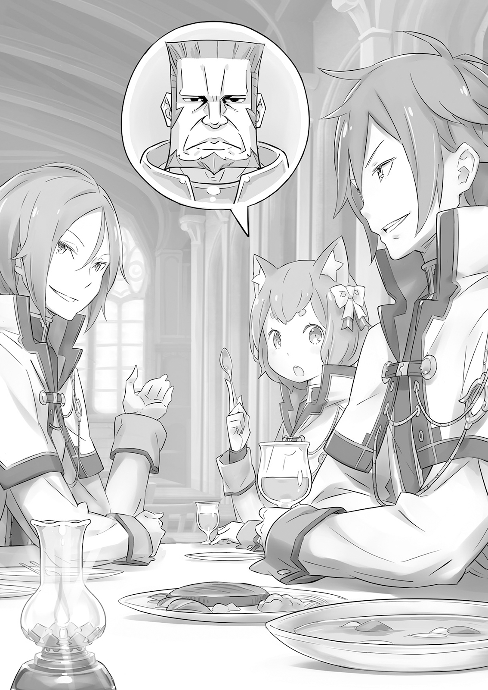
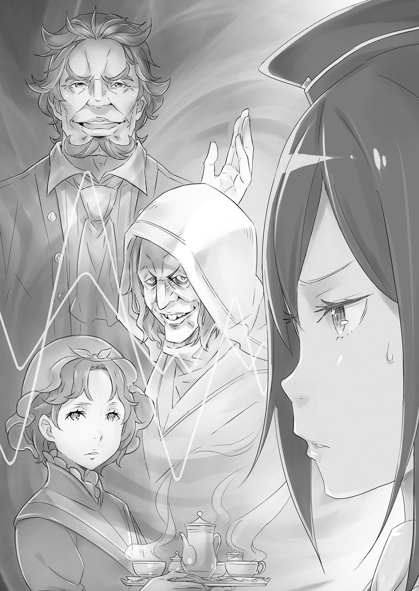
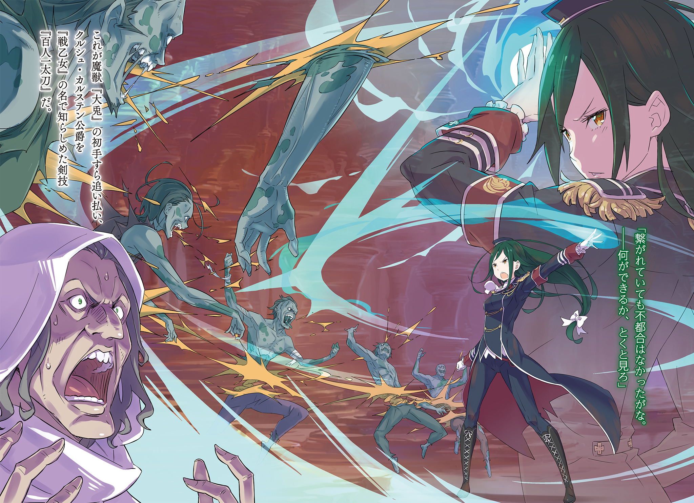

Проклятие Феликса Аргайла

Королевская гвардия была предметом восхищения для каждого рыцаря в королевстве, сливками их общества. Лишь самым элитным из двух тысяч рыцарей королевства дозволялось вступить в её ряды, и члены королевской гвардии клялись защищать короля и королевскую семью — по сути, они были мечом и щитом, оберегающим сердце королевства. Говорили, что в прежние времена статус семьи и личная поддержка играли главную роль в том, кто пополнит ряды гвардии, но сегодня это было не так. Они представляли собой сильнейших духом среди рыцарей королевства.

— Ням-м, не думаешь, что это чересчур? Просить Ферри вступить в такую прославленную группу?

Ферри разлёгся на столе, надув губы.

Был полдень, и столовая в рыцарском гарнизоне была переполнена. Большинство присутствующих, по сути, были рыцарями, что делало это место весьма впечатляющим зрелищем.

Тех, кто служил королевству, а не действовал независимо, различали по цвету их плащей. Было четыре армии, носившие соответственно красные, синие, зелёные и чёрные плащи. Группы одного цвета в основном держались вместе; казалось, между людьми, принадлежащими к одной армии, царило крепкое товарищество.

Также, похоже, существовало негласное правило относительно рассадки в столовой: первая армия сидела ближе всего ко входу, а четвёртая — дальше всех. Вообще говоря, места, наиболее удалённые от входа, уступались рыцарям самого высокого ранга. И, также согласно обычаю, самые дальние места из всех предоставлялись тем, кому было дозволено готовиться облачиться в белую мантию королевской гвардии — иными словами, Ферри и его спутникам.

Кто-то внезапно заговорил напротив Ферри, когда тот безучастно оглядывал столовую. — С таким скучающим видом сидеть не годится, друг мой.

— Хм?

Говоривший сел напротив него, изучая Ферри прищуренными миндалевидными глазами. У него были светло-фиолетовые волосы, а лицо говорило о тщательно культивируемой утончённости и мужественности. Оно не могло сравниться с лицом, которое Ферри любил больше всего на свете, но, безусловно, было красивым.

— Юлиус Юклиус… верно?

— Для меня честь, что вы меня знаете. Я тоже наслышан о вас, Феликс Аргайл. Ваше… неортодоксальное продвижение породило немало слухов.

— А?..

На лице юного Юлиуса мелькнул намёк на улыбку. Он смотрел на кошачьи уши на голове Ферри. Ферри не позволил эмоциям отразиться в своих жёлтых глазах; он привык, что на него пялятся.

Предрассудки против полулюдей были обычным явлением в Королевстве Лугуника, поэтому продвижение заметного получеловека в королевскую гвардию, элиту из элит, неизбежно заставляло недовольных шептаться, даже если они ошибались насчёт его происхождения.

Возможно, чувства Ферри прокрались в его взгляд, потому что Юлиус нахмурился, кашлянул, а затем вежливо кивнул ему.

— Прошу прощения. Я не хотел пялиться. Я слышал разговоры, но не мог поверить, пока не увидел своими глазами.

— Может, Ферри и простит тебя, м-м, если расскажешь, что за разговоры ты слышал. Дай угадаю. Монстр с бугрящимися мышцами и весь покрытый шерстью? Ферри будет очень разочарован, если о милашке Ферри распускают такие слухи!

— Капитан сказал мне, что это отражение крови полулюдей среди ваших предков. И это прекрасные уши. Понимаю, почему из-за них вы могли бы и укусить кого-нибудь.

— …Ты пытаешься затеять драку с Ферри?

Редко кто говорил об ушах Ферри без явного презрения. И Юлиус, очевидно, даже слышал подробности о прошлом Ферри от своего командира. Возможно, это было его крещение в обычаях привилегированного класса — Ферри слишком рано оставил свой статус наследника знатного рода, чтобы изучить их.

В отличие от Ферри, Юлиус был рыцарем, очевидно, искусным во владении мечом. Если так пойдёт и дело действительно дойдёт до драки, у котомальчика не было шансов на победу.

— Но не думай, что отделаешься без царапины! Ферри милый, но не настолько милый!

— Не хочу прерывать, когда ты так славно себя накручиваешь, но, думаю, у нас возникло недоразумение. Может, обсудим?

— Мя-что?

Юлиус не принял вызов, и его реакция была настолько неожиданной, что Ферри смог лишь удивлённо моргнуть. В этот момент кто-то выдвинул стул прямо рядом с ним.

— Разве я не говорил тебе, Юлиус? Дай начну разговор я, говорил же. Ты слишком склонен к недопониманию, говорил же. Особенно с теми, кого только встретил.

— И я ценю твою заботу. Но не думаю, что моё суждение было ошибочным. Не думаю, что мы могли бы избежать некоторой путаницы, кто бы ни заговорил первым. Посмотри на него сейчас.

Молодой человек, так легко обратившийся к Юлиусу, перевёл взгляд на Ферри. У него были голубые глаза и волосы такие рыжие, будто пылающее пламя. Ферри неосознанно напрягся.

— Вы случайно не… Райнхард ван Астрея?

Его внешность была слишком узнаваема, чтобы это мог быть кто-то другой. На вопрос Ферри рыжеволосый юноша приветливо улыбнулся и сказал: — А, вижу, представляться нет нужды. Это действительно моё имя. Уточню: я, как и вы, член королевской гвардии. Как и Юлиус.

— Поскольку вы новичок, естественно иметь некоторые сомнения относительно того, что вы слышите от своих коллег-рыцарей, — сказал Юлиус. — Но у нас есть слово нашего капитана. Я готов принять его оценку как есть.

— Эм-м, боюсь, я не совсем понимаю, что ты имеешь в виду.

Райнхард и Юлиус казались друзьями, и в их разговоре чувствовалась непринуждённая близость. Тем не менее, Юлиус, похоже, что-то недоговаривал. Впрочем, Ферри, совершенно выбитого из колеи, это нисколько не волновало.

Гораздо важнее для него был вопрос, почему эти двое вообще обратили на него внимание. Особенно Святой Меча, Райнхард. Судя по тому, что он слышал о характере Райнхарда, Ферри хотелось верить, что он не из тех, кто выживает новичков.

— Что вам нужно от Ферри, раз вы специально пришли сюда? Вы ведь не… не издеваться надо мной пришли?

— О, едва ли. Могли бы мы носить белое королевской гвардии, участвуя в столь гнусных делах? Мы просто выполняем приказы нашего капитана.

— Вы имеете в виду капитана Маркоса? Уклончивые слова Юлиуса заставили Ферри подумать о капитане, человеке с лицом, похожим на валун. Что эти двое могли сделать с ним по приказу этого человека?

— Ну, если вкратце, — сказал Райнхард, — мы хотим убедиться, что то, чего вы боялись, с вами не случится. Мы с Юлиусом примерно вашего возраста и подумали, что вы могли бы обратиться к нам за советом, так как мы уже довольно давно служим в королевской гвардии.

— А, понятно, — сказал Ферри, подперев подбородок руками. Капитан поручил двум рыцарям присмотреть за ним. У парня была взрывоопасная смесь факторов в его прошлом: кошачьи уши, не слишком выдающиеся навыки владения мечом и тот факт, что он попал в гвардию благодаря связям. Без сомнения, капитану было тяжело доверить такого рыцаря.

Он должен был пробыть там всего год, да ещё и с испытательным сроком — но всё равно это было огромным бременем.

— Судя по твоей реакции, ты понимаешь, в каком положении оказался, — сказал Юлиус.

— Если бы это случилось с кем-то другим, всё показалось бы шуткой, но когда это происходит со мной, это куда большая проблема, — сказал Феррис. — Кстати, а что именно капитан рассказал вам двоим про Ферри-ня?

От этого Райнхард и Юлиус широко раскрыли глаза, затем переглянулись и на мгновение погрузились в раздумья.

— Что ты любимчик четвёртого принца, — ответил Юлиус, — и что попал в гвардию, потому что он настоял на этом.

— Я также слышал, что ты получил очень сильные рекомендации от целителей королевского замка, а также от королевской академии целительства, — добавил Райнхард. — Просто надеюсь, что твои способности не были преувеличены, дабы оправдать принятие капитаном твоего необычного повышения.

Их ответы, к разочарованию Ферриса, подтвердили, что репутация, опередившая его, была более или менее такой, как он и ожидал.

В то же время он был уверен, что чувствует, как на их небольшую группу со всех сторон столовой устремлено больше глаз, чем раньше. Казалось, он был не единственной причиной, по которой на них смотрели. Даже Святой Меча Райнхард не объяснял всех этих взглядов. Должно быть, что-то было и в Юлиусе.

— Неужели капитан просто пытается собрать все свои самые большие проблемы в одном месте?.. — пробормотал Феррис. Но он не мог избавиться от дурного предчувствия, когда его мысли обратились к испытательному сроку в королевской гвардии, который вот-вот должен был начаться.

Конечно, за тем, как Феррис попал в королевскую гвардию, да ещё и с испытательным сроком, стояла запутанная история.

Феррису сейчас было восемнадцать, и он был бы более чем счастлив прожить свою жизнь под началом своей госпожи, Круш. Она сама высказала своё одобрение этому, и они были настолько близки, что часто разделяли почти одни и те же мысли. Однако настоящая проблема заключалась в одном из их других обычаев.

Феррис — его настоящее имя было Феликс Аргайл — обычно носил женскую одежду, но биологически был мужчиной. Поэтому, если он собирался служить Круш, с точки зрения общества было бы уместнее делать это в качестве рыцаря, а не слуги или помощника.

Так случилось, что из-за определённой череды событий Феррис был назначен рыцарем Круш, и она приняла его в этом качестве. Ему не хватало лишь практического опыта рыцарства.

Конечно, если его госпожа признавала Ферриса своим рыцарем и проводила церемонию посвящения, формально проблем не было. Но Круш, герцогиня Карстен и глава семьи, занимала слишком высокое положение, чтобы брать себе рыцаря без истории. Круш была женщиной, и женщиной, чьё поведение в прошлом заставляло многих смотреть на неё свысока. Если бы, вдобавок ко всему, она приняла рыцаря без доказанных навыков или реальных способностей, основываясь исключительно на длительности их знакомства, наверняка поползли бы ещё более неблагоприятные слухи.

Чтобы избежать этого, Феррису нужно было зарекомендовать себя как рыцаря, чьё резюме не стало бы позором для его госпожи. Четвёртый принц королевства, Фурье Лугуника, помог им решить эту проблему.

— Твоё становление рыцарем Круш важно и для меня. Мне даже почти не придётся напрягаться, чтобы устроить тебя к рыцарям. Я просто… Кхм! Может, я просто поговорю с Маркосом или кем-то ещё. Ты просто расслабься и жди!

Фурье одарил Ферриса сердечным смехом, а затем выскочил из комнаты, прежде чем кто-либо успел его остановить. Вскоре после этого было решено о назначении Ферриса в королевскую гвардию, и он приступил к годичной службе, которая позволила бы ему приукрасить свою легенду.

Это не означало, что всё прошло совершенно гладко.

Примерно во время вступления Ферриса в подразделение капитан Маркос обратился к нему со строгим видом и сказал: «Ты здесь по настоянию Его Высочества Фурье, а также благодаря ряду других сильных рекомендаций. Герцогиня Карстен также рекомендовала тебя мне. В свете всего этого я готов принять тебя в королевскую гвардию… но не без условий».

Пока они разговаривали в его кабинете в гарнизоне, капитан предложил испытательный срок — по сути, время, в течение которого Феррис мог познакомиться с жизнью королевской гвардии, но затем сдаться и убежать домой, если захочет.

— Если за это время я решу, что ты мне бесполезен, то ты не останешься в моём подразделении. Однако, если тебя выгонят во время испытательного срока, я позабочусь о том, чтобы это было сделано так, чтобы не оставить пятна на твоей репутации. Не могу говорить за чувства принца или твоих других покровителей, но это было бы лучше, чем всё время публично считаться пятном на гвардии. Полагаю, ты принимаешь моё предложение?

Маркос был прямолинеен и не пытался скрыть тот факт, что его поставили в довольно деликатное положение. Феррису он сразу понравился. Было огромным облегчением видеть правду в чьих-то глазах и не беспокоиться о вежливом хождении вокруг да около.

— Могу я спросить только одно?

— Что?

— Как только испытательный срок закончится, он будет считаться частью моих двенадцати месяцев службы, не так ли? Честно говоря, я не вынесу разлуки с леди Круш даже на месяц дольше, чем нужно.

— …

Маркос был ошарашен заявлением Ферриса, хоть и на мгновение. На секунду он показался уставшим, но затем его лицо снова стало лицом свирепого солдата.

— Мне нравится твоя дерзость. У такого маленького мальчика много мужества — ты ещё можешь нас удивить, — грубо сказал он.

— Так что сначала я немного боялся… но быть рыцарем оказалось как-то скучнее, чем я ожидал.

— Ты здесь всего несколько дней. Немного рано думать, что ты повидал всё, что может предложить рыцарство, — сказал Юлиус. — Это правда, что королевская гвардия не так часто выходит на поле боя, как некоторые другие подразделения, но мы должны полностью посвящать себя тому, что нам поручено. Мы должны быть готовы в любое время.

— Да-да, ты крутой, я знаю.

Феррис махнул рукой, пытаясь успокоить Юлиуса. Он затронул эту тему только для того, чтобы скоротать время, но когда они были на работе, Юлиус всегда думал только о поставленной задаче. Прошло около десяти дней с тех пор, как Юлиус начал присматривать за ним, но даже то, что Феррис видел до этого момента, говорило о том, насколько сложными могут быть дела.

Хотя…

— Никто бы не расстроился, если бы ты расслабился чуточку больше-ня, — сказал Феррис.

— Когда я держу меч, я естественным образом расслаблен, — сказал Юлиус. — Но когда я откладываю его, я должен быть рыцарем. Тебе бы самому не помешало немного больше этого, Феррис.

— Бэ-э! Ну ты и зануда-ня!

Феррис скорчил гримасу, и Юлиус вздохнул. Но вскоре они оба снова улыбнулись. Они уже были достаточно близки, чтобы обмениваться подобными шутками. Юлиус мог быть довольно непреклонным во время выполнения своих профессиональных обязанностей, но когда он не работал, с ним было довольно интересно разговаривать. Его несколько чрезмерная фиксация на своём положении рыцаря казалась проявлением определённой неподобающей ребячливости. Но именно за всё это Феррис и любил его. Гораздо больше проблем у него было с…

— А, вот вы где оба. Я рад, что не разминулся с вами.

— Мяу?

Райнхард вклинился туда, где Феррис и Юлиус болтали на своём обычном месте в столовой. Он лёгким движением похлопал Ферриса по плечу и улыбнулся Юлиусу. Ушки Ферриса прижались к голове.

— Р-р-р, опять застал врасплох. Райнхард, ты и вправду появляешься из ниоткуда. Чувства Ферри-ня не привыкли к тому, чтобы их так легко обманывали. Ты точно человек? Это как-то пугает…

Предки-полулюди Ферриса дали ему не только внешность; у него также были исключительные органы чувств. Его кошачьи уши, в частности, могли улавливать мельчайшие изменения в окружении, настолько, что он мог практически определить, когда кто-то повернулся, чтобы посмотреть на него. И всё же Райнхард был исключением из всех исключений. Феррис ни разу не слышал, как он подходит.

— Таким уж я родился, дорогой мой Феррис. Боюсь, нам обоим придётся с этим смириться. Что важнее, тебя вызывают. Его Высочество Фурье просит тебя. Раз уж у тебя, похоже, есть свободное время, тебе стоит пойти к нему. Покажи ему, как хорошо ты исполняешь свой долг одного из Рыцарей Королевской Гвардии.

— …Ты подслушивал?

— Разумеется, не намеренно.

Райнхард, по крайней мере, имел достаточно такта, чтобы выглядеть смущённым. Феррис почувствовал лёгкое раздражение. Столовая была немного пустее, чем в некоторые дни, но всё равно было довольно шумно. Феррис и Юлиус сидели в дальнем конце; даже уши Ферриса не смогли бы уловить разговор на таком расстоянии.

— Если Его Высочество попросил тебя лично, лучше поторопиться, — сказал Юлиус. — Ты не против, если я сопровожу тебя, Феррис?

— …О, конечно. Эм-м… а ты, Райнхард?

— Я рад твоему приглашению, но у меня другие планы, — извиняющимся тоном сказал Райнхард. — Я собираюсь совершить небольшую поездку к нашей границе с Империей. Меня попросили взглянуть.

— Ого. Нечасто же тебя куда-то посылают, Райнхард-ня. — Феррис недоумённо посмотрел на другого юношу. Юлиус, поднимаясь со своего места, понимающе кивнул Райнхарду.

— Не волнуйся, я и сам смогу присмотреть за Феррисом. Ты займись своей миссией.

— «Миссия» звучит уж слишком серьёзно…

— Он просто имеет в виду, что я должен подходить к этому с таким настроем. Хорошо. Я всё оставляю на тебя. — Райнхард кивнул Юлиусу, который помахал рукой, когда Святой Меча покинул столовую.

Вызов от Фурье означал, что они направятся в покои принца в королевской резиденции. Они смело шагали по дороге, ведущей прямо к замку, как то позволяла общеизвестная привилегия королевской гвардии.

— Его Высочество часто просит тебя. Вы двое, должно быть, довольно близки.

— Ну, мы давно знакомы. Прошло уже… восемь лет, мяу? Это даёт Ферри много власти, знаешь ли… — Он злорадно ухмыльнулся Юлиусу, пока они шли по дороге между гарнизоном и замком. Но Юлиус лишь криво улыбнулся.

— Тебе не нужно притворяться. Я не чувствую ничего расчётливого в твоих отношениях с Его Высочеством. Мы знакомы недолго, и даже я могу это сказать. И ты, и принц, кажется, очень цените друг друга.

— …Как-то неловко слышать это от кого-то. В любом случае, ты говоришь, что ничего расчётливого нет, но я попал в королевскую гвардию благодаря Его Высочеству, не так ли? Ты не думаешь, что это использование его положения?

— Прошу прощения за то, что сказал тебе такую грубость при нашей первой встрече. Но в течение недели после твоего вступления… не думаю, что среди нас остался кто-то, кто сомневался бы, что ты достаточно способен, чтобы быть частью гвардии.

Юлиус склонил голову в извинении, на что Феррис ответил ему ударом ребром ладони. Мягко, конечно. Когда Юлиус снова поднял голову, Феррис улыбнулся. — Что ж, я рад, что вы так думаете. Если бы Ферри облажался, это было бы стыдно не только для Ферри, мяу . Все люди, которые меня поддержали, тоже выглядели бы плохо…

— Я думаю, ты уже более чем достаточно сделал, чтобы оправдать свои рекомендации. К счастью, у тебя даже была возможность показать, в чём ты действительно хорош — полагаю, никто из нас пока не может сравниться с капитаном.

— Полагаю, нет, — легкомысленно сказал Феррис, но внутри яростно кивал.

Не имея навыков владения мечом, единственный способ для Ферриса проявить себя перед другими гвардейцами — это показать, что у него есть талант в чём-то ещё. В его случае это, безусловно, была целительная магия, и, к его счастью, у него было множество возможностей показать, на что он способен на той неделе. Это произошло потому, что на тренировочном поле капитан Маркос решил лично тренировать своих подчинённых. Исцеляя каждую из тщательно рассчитанных травм, Феррис был благодарен за довольно неортодоксальный способ проявления доброты капитаном. В результате все признали способности Ферриса, и хотя невозможно было заставить замолчать то, что говорили за закрытыми дверями, публичные возражения против его вступления в гвардию прекратились.

— Это значительно облегчило мне жизнь. Мяужет, стоит поблагодарить капитана.

— Конечно, он просто увернётся, если ты что-нибудь скажешь.

— Да, он в этом плане уклончив. Для такого трудяги у него определённо странные причуды. Какая морока.

Он мог просто представить себе бесхитростного капитана Маркоса, притворяющегося, будто не понимает, за что его благодарят. Это была разочаровывающая сцена. Рядом с Феррисом Юлиус кивал, словно точно понимая, что творится в голове у кошкомальчика.

— Тем не менее, — сказал Юлиус, — возвращаясь к нашей первоначальной теме, ты сказал, что дружишь с Его Высочеством уже восемь лет. Мне очень любопытно, какими вы были в детстве. Не возражаешь, если я спрошу?

— Нет, но не думаю, что эти истории мяу-какие интересные. Восемь лет назад Ферри был просто милашкой Ферри, а Его Высочество был Его Высочеством… Мы были точно такими же, правда. — Феррис прикрыл рот рукой и рассмеялся. Он вспоминал обрывки событий за весь период их дружбы. Фурье вырос в крепкого молодого человека, но в глубине души он остался таким же, как и всегда. — Знаешь, думаю, я уважаю это в Его Высочестве.

— Если добродетели принца Фурье не изменились, то это главное. Восемь лет… Как только детство заканчивается, не все способны оставаться прежними. — В отличие от сдержанного смеха Ферриса, Юлиус выглядел как-то меланхолично. Феррис заметил это и вопросительно посмотрел на него.

— Кстати говоря, я мало что слышал о тебе, Юлиус.

— Это потому, что, к сожалению, моя жизнь не была достаточно богатой, чтобы заслуживать каких-либо историй. Она была совершенно обычной, скучной, как сказка на ночь.

— Бэ-э. Если ты действительно не хочешь об этом говорить, я не буду спрашивать… Но ты давно знаком с Райнхардом? Ты кажешься ближе к нему, чем большинство из нас. — При упоминании имени Святого Меча вся печаль исчезла с лица Юлиуса.

— Райнхард? У нас с ним долгая история, почти как у тебя с твоим принцем. — Он откинул чёлку и посмотрел вдаль, словно вспоминая. — Прошло почти десять лет с нашей первой встречи. Но только после того, как мы оба стали рыцарями, мы подружились. Нам не посчастливилось накопить столько же хороших воспоминаний, как тебе и Его Высочеству.

— То есть вы просто знали друг друга мимоходом, как товарищи-дворяне?

— Может быть, да, а может, и нет. Я знал, кто он, но не уверен, что он знал, кто я. Поскольку он был для меня особенным, я был особенно рад возможности подружиться с ним.

— Особенным, хах?..

В дружбе между Юлиусом и Райнхардом не было ничего глубже. И всё же, не совсем возможно было назвать её просто дружбой. Но Феррис ещё не был достаточно близок к Юлиусу, чтобы спрашивать о таких вещах. Феррис очень хотел избежать случайного отчуждения, сказав что-то не то — настолько он ценил Юлиуса Юклиуса.

Они обнаружили, что проболтали всю дорогу до замка. Они поприветствовали стражу и дежурных чиновников, а затем подошли к лестнице, ведущей на верхние уровни замка, где жили Фурье и другие члены королевской семьи. Они сообщили охранявшим лестницу людям, кто они и куда направляются, и их быстро пропустили.

Они поднялись по лестнице, ведущей в королевские покои, и пошли по устланному ковром коридору. Феррис нашёл нужную комнату и воспользовался дверным молотком.

— Ваше Высочество! — пропел он. — Как вы и просили, ваш дорогой Ферри прибыл!

Приветствие заставило Юлиуса приложить ладонь ко лбу.

— Феррис, как бы близки вы ни были, это… Что ж, полагаю, уже слишком поздно.

Он пожал плечами, и в тот же миг дверь открылась.

— Ты так легко собираешься его отпустить? Это создаёт мне проблемы! Если это всё, что ты собираешься делать, зачем вообще ты за ним присматриваешь?

Из комнаты выскочил молодой человек с золотистыми волосами и ясными алыми глазами: Фурье Лугуника, четвёртый принц королевства. Он посмотрел с Ферриса на Юлиуса, затем рассмеялся, показав зубы.

— А-а, неважно! Добро пожаловать, вы оба. Вы оба в добром здравии?

— Я был в полном порядке, мой господин. Ваше внимание делает мне честь.

— …говорит Юлиус, — заметил Феррис. — Но мы же виделись всего два дня назад, не так ли? У нас едва ли было достаточно времени, чтобы заболеть!

— Понятно, может и так. Но если ты здоров, это всё, что имеет значение. В любом случае, есть о чём поговорить, но давайте не будем делать это здесь. Входите, оба. — Фурье жестом пригласил их в свою комнату. Он был одинаково щедр и с почтительным Юлиусом, и с весело дерзким Феррисом.

Комната Фурье была настолько скромной, что трудно было поверить, что она принадлежит члену королевской семьи. Не то чтобы Феррис бывал во многих других королевских покоях для сравнения — но апартаменты Фурье были почти такими же простыми, как у Круш. Возможно, её неприязнь к излишествам повлияла на него.

— Вы кажетесь каким-то взволнованным, Ваше Высочество, — сказал Феррис, садясь на диван в приёмной. — Что происходит?

— Ты сразу к делу! И на каком основании ты говоришь, что я кажусь взволнованным?

— Ушки Ферри-ня не обманешь. В твоём голосе дрожь, пульс чаще обычного, и ты несколько раз сглотнул, пытаясь успокоить и то, и другое.

— Боже мой! Твои уши слышат даже моё сердцебиение?

— Не-а. Просто блефую, — невинно сказал Феррис. Фурье рухнул в кресло. Его реакция была достаточным доказательством того, что он что-то от них скрывает. Юлиус бросил на Ферриса строгий взгляд за непочтительность к такой августейшей особе, как Фурье, но Феррис просто проигнорировал его.

— Ладно, я знаю, что ты изо всех сил пытаешься нам не говорить, но что на самом деле происходит? То, как ты выгнал всех служанок и слуг, чтобы ты, Ферри и Юлиус могли поговорить наедине, вызывает у меня мяу-очень дурное предчувствие.

— Да, хорошо подмечено. Я и не ожидал от тебя меньшего, Феррис. Но прежде чем мы начнём, я хочу кое в чём убедиться. Ты, Юлиус. — Взгляд Фурье остановился на рыцаре. На мгновение Юлиус удивлённо поднял бровь, но вскоре на его лице снова появилось уважительное почтение. Он ответил кивком.

— Да, Ваше Высочество. Спрашивайте меня о чём угодно.

— Хороший ответ… Можешь ли ты, глядя мне в глаза, сказать, что ты друг Ферриса? Если да, ты можешь остаться для этого разговора, но если нет… Что ж, мне придётся попросить тебя покинуть комнату.

— Ваше Высочество весьма прямолинейны…

Фурье был неспособен на хитрость или уловки. Иногда это могло раздражать, но это, несомненно, было одним из его хороших качеств. Юлиус ответил на вопрос, приложив руку к груди и приняв формальное выражение лица.

— Я знаю Ферриса всего несколько дней, и наше общение недостаточно глубоко, чтобы я мог беззастенчиво назвать его другом. Однако я искренне надеюсь, что со временем мы станем только ближе. Удовлетворяет ли этот ответ Ваше Высочество?

— М-да, — сказал Феррис, — вот уж прямолинейность…

Юлиус, возможно, был не так откровенен, как принц, но было ясно, что он говорил от всего сердца. Это означало, что он сознательно вступал в потенциально рискованную ситуацию — довольно властно для совсем нового друга. Он был властным, склонным идти против течения — но Феррису это нравилось.

Фурье, казалось, чувствовал то же самое, потому что он несколько раз кивнул, а затем счастливо улыбнулся Феррису. — Похоже, ты нашёл хорошего товарища, Феррис! Вижу, стоило мне рекомендовать тебя в королевскую гвардию. Ты не должен воротить нос от дружбы Юлиуса!

— Ваше Высоче-е-ество, когда вы так говорите, звучит, будто я вступил в гвардию только ради того, чтобы завести друзей, и это не очень-то лестно…

— Да-да, дорогой, — сказал Фурье с улыбкой на быструю попытку Ферриса скрыть смущение. Но затем его выражение лица напряглось. — …А теперь к делу.

Уши Ферриса уловили немедленное изменение в воздухе. Источником его был не кто иной, как Фурье.

— Ваше Высочество?.. — Он произнёс эти слова, пытаясь убедиться, что это всё ещё Фурье, что молодой человек, сидевший перед ним с невероятно мрачным видом, всё ещё был тем другом, которого он знал.

Фурье не ответил на побуждение Ферриса, но медленно начал говорить тихим голосом.

— Прежде всего, я рассказываю вам обоим об этом по собственной инициативе. Круш сказала мне не говорить об этом, так что я действительно не должен никому рассказывать…

— Леди Круш сказала вам?.. — Когда прозвучало имя его госпожи, Феррису стало ещё неуютнее. То, что она сказала Фурье не говорить о чём-то, не предвещало ничего хорошего, особенно если она не могла доверить это даже Феррису.

— Ходят дурные слухи об одном месте во владениях Карстен. Ведутся частные расследования, но я получил известие, что Круш сама отправилась осмотреть это место.

— …И это всё? — Феррис был так обеспокоен началом речи Фурье, что, услышав, что происходит на самом деле, был почти разочарован. Круш умела за себя постоять. Не было нужды беспокоиться о ней, даже если бы она столкнулась с небольшими неприятностями во время своей поездки.

— И если они уже расследовали это, — продолжил Феррис, — то я не думаю, что леди Круш могла быть застигнута врасплох. Она более чем справится с любым обычным противником. Ваше Высочество должны знать это лучше, чем кто-либо другой.

— М-м… Не могу представить, чтобы она проиграла кому-то, кроме меня, и всё же… — По-видимому, это был лучший ответ, который мог дать Фурье.

Судя по тому, что было сказано до сих пор, Феррис не мог понять источник беспокойства Фурье. Но даже когда слова принца казались беспочвенными, они часто оказывались гораздо большим, чем праздные домыслы. Возможно, это было ещё одно из его неприятных предчувствий…

— Ваше Высочество, если позволите? — Пока они сидели молча, вмешался Юлиус.

— М-м. Продолжай.

— Я не встречался с герцогиней Карстен лично, поэтому не могу судить об этом, но… раз уж вы позвали сюда Ферриса, могу ли я предположить, что у вас что-то на уме?

— Юлиус, ты должен знать, что Его Высочество часто делает что-то без особой причины…

— Нет, не в этот раз. На этот раз у меня есть основания для моих действий. Для моих… беспокойств, — сказал Фурье, не совсем в силах поднять глаза.

Это застало Ферриса врасплох. Но, честно говоря, он не слушал внимательно. Возможно, потому что он не хотел верить, что Круш может быть в опасности. И если последние слова Фурье были неожиданностью, то его следующие слова были абсолютным шоком.

— Место, о котором ходят все эти слухи? Это твой дом, Феррис. Дом Аргайл.

— В Доме Аргайл творились тёмные дела.

Слухи впервые дошли до Круш в начале того года, почти два месяца назад. Первое, о чём она подумала, услышав имя Аргайл , был не кто иной, как Феррис. Её встреча с любимым слугой никогда бы не состоялась без Дома Аргайл, где он родился.

Но это не означало, что Круш была благодарна Аргайлам. Она была благодарна, что они произвели на свет человека по имени Феликс Аргайл, но то, что они затем сделали с ним в юности, было трудно простить.

В результате, с тех пор как она спасла Ферриса от его семьи и взяла его под своё крыло, Круш старалась иметь как можно меньше контактов с семьёй Аргайл. Феррис тоже не поднимал этот вопрос; в этом они фактически были на одной волне. Поэтому, когда она впервые за почти десятилетие получила отчёт о Доме Аргайл, Круш оказалась необычно обеспокоенной.

— Что-то неладное происходит в Доме Аргайл?..

— На данный момент, миледи, мы стараемся, чтобы Феррис об этом не услышал, но… что нам делать?

Они были в её кабинете. Круш скрестила руки на груди. Чиновник, докладывавший ей, имел страдальческое выражение лица. Он был одним из фаланги вассалов, унаследованных ею от отца, Меккарта, вместе с герцогством. Он знал Круш с младенчества, а Ферриса — с тех пор, как тот пришёл в Дом Карстен. Тот, кто был так близок к ним и семье так долго, естественно, разделял опасения Круш.

— Вы правы, я бы предпочла, чтобы Феррис не узнал, — сказала Круш. — Но это зависит от того, что именно происходит. Может возникнуть естественная необходимость рассказать ему.

— Это правда, миледи. Согласно отчёту, Бин Аргайл — отец Ферриса — последние несколько месяцев приглашал в свой дом подозрительного типа. Возможно, он работорговец.

— Работорговец?..

Брови Круш слегка нахмурились при этом слове. Официально в Королевстве Лугуника не было рабов. Любой, кто работал, должен был получать вознаграждение; отношения между дворянами и их слугами были отношениями работодателя и работника. Возможно, с некоторыми людьми обращались не лучше, чем с рабами — но на бумаге рабства по законам королевства не существовало.

Точно так же, торговля рабами не могла быть разрешена в пределах границ Лугуники.

— И всё же нет конца людям, желающим замарать руки таким бизнесом… Утверждается, что Дом Аргайл работает с работорговцем, чтобы продавать людей наших владений в другие королевства? Это означало бы…

Это означало бы, что они предатели. И ответственность за проблему ложилась на Круш, которая правила этой областью. Немедленное расследование пролило бы свет на факты. Если обвинения подтвердятся, глава дома будет наказан, а сам Дом Аргайл, скорее всего, перестанет существовать. Если это произойдёт, Феррису будет трудно избежать последствий.

«Что родители посеют, то дети и пожнут». Это не шутка. О чём думают Аргайлы? — Мысленно Круш вновь переживала день своей первой встречи с Феррисом.

Он был кожа да кости, почти чёрный от грязи и сажи, мальчик настолько слабый, что едва мог говорить. Разве Аргайлам было недостаточно того, что они растратили первую половину жизни Ферриса? Круш ощутила такой бурлящий гнев, что прикусила губу, чтобы сдержать его, — жест, весьма необычный для неё.

Но чиновник встретил её ярость словами: «Пожалуйста, подождите, миледи. В отчёте есть ещё кое-что. Не принимайте решения, пока не выслушаете всё до конца».

— …Простите. Я немного разволновалась.

— Вполне понятно. Нас обоих затрагивает всё, что касается Ферриса. Тем не менее, что касается Дома Аргайл, похоже, это нечто большее, чем простая работорговля.

— Большее?

— Да. Подробности пока неясны, но похоже, что Аргайлы не продают рабов торговцу, а скупают всех рабов, до которых могут дотянуться.

— Покупают их?

Она непонимающе посмотрела на мужчину. Поскольку рабство официально не существовало в Лугунике, люди, занимающиеся работорговлей в королевстве, в принципе, не могли иметь иной цели, кроме продажи рабов другим нациям. Покупка рабов в качестве рабочей силы едва ли отличалась бы от обычного найма и не вызвала бы никаких неприятных слухов.

— Вопрос в том, замышляет ли Дом Аргайл что-то, что побудило бы их покупать рабов, — сказал чиновник, озвучивая тот же вопрос, который занимал Круш.

Упадок Дома Аргайл начался девять лет назад, когда Дом Карстен узнал о Феррисе и впоследствии обрушил свой гнев на его семью за их проступки. Бин Аргайл был дворянином без придворного звания, надсмотрщиком над совокупностью городов и деревень во владениях Карстен, и его ценили за работу. Но всё изменилось после инцидента с Феррисом, и в конечном итоге Дом Аргайл потерял всякое доверие.

Бин предпринял ряд попыток восстановиться после этого, но все они закончились неудачей, и теперь единственными активами семьи остались их дом и участок необработанной земли. Им пришлось отпустить всех своих слуг, и последнее, что о них слышали, — это то, что мать и отец Ферриса вели в лучшем случае скромное существование.

— В таком состоянии, что мог делать Дом Аргайл, что потребовало бы рабов?..

Было бы гораздо проще поверить, что они продают людей разбойникам. Конечно, если бы они это делали, при вынесении наказания не было бы учтено никаких смягчающих обстоятельств, но, по крайней мере, она могла бы понять их мотивацию.

— В любом случае, в тот момент, когда они вступили в работорговлю, Дом Аргайл нарушил законы нашего королевства. И работорговец, смело действующий на моих землях, ничуть не лучше. Нам придётся арестовать обе стороны и разобраться с ними.

— В таком случае, миледи, вы немедленно предпримете шаги для их задержания?

— Да, я… Нет, подождите. — Было бы достаточно легко отправить её солдат для захвата Бина Аргайла. Но такое решение было бы слишком поспешным. Им нужно было получить больше, чем просто Бина. — Если мы будем действовать слишком опрометчиво, сам работорговец может сбежать.

— Вполне возможно. За последние месяцы частота его визитов в Дом Аргайл составляла раз в месяц или два.

— Когда поступил этот отчёт?

— Два дня назад. Это означало бы оставить им окно в два месяца… — Чиновник, казалось, догадался, что задумала Круш. Она долго размышляла, а затем покачала головой, видя, что у неё нет другого выбора.

— Убедитесь, что за Домом Аргайл постоянно наблюдают. В следующий раз, когда работорговец появится у их дверей, мы схватим их обоих сразу. Есть возражения?

— Только одно… Вы ведь делаете это не ради Ферриса?

— Едва ли. Конечно, я помню о нём, но моя ответственность как герцогини важнее моих личных чувств. И Феррис не хотел бы, чтобы я ставила его выше своего долга.

Чиновник удовлетворённо кивнул. — Тогда, как прикажете, миледи.

Он удалился, оставив Круш одну в её покоях. Она рухнула в кресло. Она откинулась на спинку, глядя в окно на небо. Клочья белых облаков плыли по ясному синему небу — безошибочный признак того, что ветер в тот день был сильным.

«Не думаю, что я оказала Феррису чрезмерное внимание просто потому, что это дело касается его семьи».

Однако в течение последующих двух месяцев, в течение которых в доме Аргайл ничего не изменилось, настало назначенное время для вступления Ферриса в королевскую гвардию. И было правдой, что втайне она была рада.

— Грязные дела в Доме Аргайл. Хм, понятно…

Фурье кивнул. Круш позвала его, чтобы выпить чаю и поговорить с глазу на глаз. Они были в гостиной поместья Карстен, и список гостей на это чаепитие включал только их двоих. Обычай Фурье посещать дом продолжился даже после того, как Круш стала герцогиней, хотя и с меньшей частотой, чем раньше.

— У меня просто случайно были дела в этом районе, понимаете! — говорил он. — Я подумал, что мог бы заглянуть, чтобы узнать, в добром ли вы здравии. — Было странно, что Фурье «просто случайно» появлялся в основном в те дни, когда Круш не была слишком занята, чтобы принять его. Эти странные совпадения продолжались уже добрую часть десяти лет, но Круш решила не подвергать их сомнению.

— Просто случайно, понимаете! Чистая случайность! Не поймите меня неправильно!

— Конечно нет, Ваше Высочество.

— Да, прекрасный ответ! Прекрасный ответ, действительно, но… вы могли бы позволить себе слегка неправильно понять…

Круш Карстен обладала божественным благословением — способностью видеть ветер. Это благословение чтения ветра позволяло ей видеть невидимое и читать его потоки. С его помощью она могла даже определить истинное состояние сердец людей. Она немного гордилась тем, что её редко обманывали.

Несмотря на всё это благословение и силу, было два человека, которые могли лгать ей и выходить сухими из воды. Один был Феррис, который знал сердце Круш лучше любого другого и поэтому умел скрывать от неё вещи. Другим был Фурье, чью откровенную ложь Круш не желала разоблачать.

— И хотя я зашёл случайно, кажется, это была удачная случайность, да?

Ветер лжи дул каждый раз, когда Фурье произносил слово «случайность» . Это была не случайность, а уверенность; Фурье пришёл намеренно в гости. Круш была искренне очень рада, что он испытывал к ней и Феррису такую дружбу. Вот почему она не чувствовала необходимости разоблачать его ложь. И вот уже десять лет она позволяла ему скрывать свои истинные намерения.

— В любом случае, Круш, я, конечно, всё об этом знаю. Конечно, знаю. Но просто чтобы убедиться, что мы на одной волне, позвольте спросить вас — где именно находится Дом Аргайл?

Круш много думала об этом, но первое же, что сказал Фурье, перевернуло разговор с ног на голову. Он пытался выяснить, что происходит, одновременно притворяясь, что уже знает. Круш полуулыбнулась этому очень характерному для Фурье поведению и сказала: «Простите меня». Она склонила голову. — Иногда размах нашей дружбы заставляет меня забываться. Мои извинения.

— Вовсе нет, вам не нужно извиняться! Уверяю вас, я всё помню в мельчайших подробностях. Я просто… хочу убедиться, что мы помним одно и то же! Не стесняйтесь говорить.

— Да, Ваше Высочество. Дом Аргайл — это семья Ферриса. Его настоящее имя, как вы помните, Феликс Аргайл, и он был старшим сыном в семье.

— А-а, семья Ферриса, значит? И вы говорите, его раньше звали Феликс Аргайл? Какой интересный факт — который, э-э, я, конечно, уже знал!

Снова подул порыв ветра лжи, но Круш ничего не сказала. Однако по взволнованной реакции Фурье стало ясно, что он совершенно не знал о связи между Феррисом и Аргайлами. Она ожидала, что Феррис мог поделиться своей личной историей с принцем, но, видимо, нет. Если Феррис хотел сохранить это в тайне, то не Круш было об этом говорить, и всё же…

— Вы выглядите несчастной, Круш. О чём бы вы ни хотели поговорить, неужели это настолько ужасное дело, чтобы так омрачить ваше лицо? И ради Ферриса, не меньше.

— Ваше Высочество…

— Вы спрашиваете, откуда я знаю? Неужели вам нужно спрашивать? Я видел ваше лицо все эти годы, как и обещал в цветочном саду. Вам больше всего идут ясность и спокойствие. Эта тревожность для вас весьма необычна. Расскажите мне, что случилось.

Когда Фурье говорил так, это потрясало Круш до глубины души. Она вспомнила их первую встречу. С тех пор и до самого этого момента Фурье иногда казался видящим яснее, чем Круш, которая, предположительно, обладала даром чтения ветра. И Круш по опыту знала, как произнесённые им слова могли иметь силу разрушить тупик.

— Если он узнает, что я рассказала вам, Феррис на меня разозлится.

— О, просто скажите ему, что я вытянул это из вас силой. Я удерживал вас, сказал, что никогда не прощу, если вы мне не расскажете. Да! Вот что вы должны сказать.

— Вы шутите. Вы никогда не смогли бы удержать меня, Ваше Высочество… Ваше Высочество? Вы в порядке? Вы так внезапно упали на колени…

— Д-да, я в порядке… Я в полном порядке. Пожалуйста, продолжайте.

У Фурье иногда случались такие моменты, какие-то приступы или реакции. Круш нахмурилась, но рассказала принцу об истории Ферриса и тёмных делах, происходящих в Доме Аргайл.

— Круш и Феррис встретились девять лет назад. Причина этой встречи была той же, что и этой: Круш сопровождала своего отца, Меккарта, который расследовал слухи о негармоничных событиях в Доме Аргайл.

Родители Ферриса оба были совершенно людьми, однако он родился с кошачьими ушами. Он и его уши могли вызвать подозрения, что в Доме Аргайл течёт нечистая кровь, поэтому почти десять лет после его рождения Ферриса держали взаперти в подвале дома днём и ночью. Позже Дом Карстен принял его под предлогом усыновления, и так Феррис и Круш встретились. Таким образом, они проводили свои дни как слуга и госпожа.

— …

Рассказывая всё это Фурье, Круш опускала ненужные детали, намеренно делала свой рассказ двусмысленным там, где могла, но в конечном итоге рассказала ему бо́льшую часть фактов. Фурье слушал всё с почти тревожной тишиной и сосредоточенностью.

— …Непростительно.

Слово вырвалось, неся в себе гнев, который невозможно было скрыть. Фурье закрыл глаза, но теперь открыл их, их алый цвет сиял, как пламя.

— Такое поведение непростительно! Подумать только, что мой собственный друг Феррис подвергался такому бесчеловечному обращению со стороны своих матери и отца! И они всё ещё замышляют и строят козни! Я определённо не проявлю к ним милосердия. Даже без ведома Ферриса, клянусь, я… кхрк! Кашель! К-кашель! » — Порыв гнева вызвал у Фурье приступ кашля.

— Ваше Высочество, не волнуйтесь так. Вот, выпейте чаю. — Она протянула ему чашку, и Фурье осушил её содержимое одним глотком и хлопнул ею обратно на стол.

— …не прошчу им! — Горячий чай заставил его лицо покраснеть и исказил слова, которые он пытался произнести. Но эмоции, которые они содержали, чувства дружбы к Феррису, были безошибочны. — Круш, вы должны немедленно задержать этих негодяев. К счастью, Феррис сейчас находится в столице на обучении. Возможно, мы не сможем скрыть от него всё, но, по крайней мере, мы можем уберечь его от необходимости видеть самые уродливые части этого.

— Я понимаю, милорд. Но мы имеем дело с работорговцем, действующим в пределах наших собственных границ. Если мы хотим выяснить, откуда он родом, мы не можем действовать слишком импульсивно. Прошу вашего понимания в этом вопросе.

— Хрр… Грр… В таком случае, зачем вы мне об этом рассказали? Если вы не собираетесь действовать немедленно, то дела зашли в тупик. И если вы так далеко всё продумали, что вам от меня нужно?

— Я хочу попросить помощи Вашего Высочества с Феррисом, — сказала Круш. Судя по его вспышке, казалось, Фурье не понял, к чему она на самом деле клонит. Его глаза расширились, когда Круш приложила руку к груди и продолжила: — Ваше Высочество, Феррис проведёт следующий год в королевском замке, как один из Рыцарей Королевской Гвардии. Этот год может практически определить его будущее — такова важность рыцарства для Ферриса. Поэтому я хочу, чтобы он прошёл без происшествий.

— И вы просите меня позаботиться об этом? Просто чтобы вы знали, Маркос, человек, который руководит королевской гвардией, упрям, но справедлив. Он не из тех, кто оказывает неоправданные услуги. Я мог бы попросить его оказать Феррису особое отношение, но гарантирую, что это останется без внимания. И я в любом случае не собираюсь оказывать Феррису такую помощь. Это могло бы только навредить ему — он может одеваться как женщина, но у него гордость мужчины!

Ни разу за десять лет их знакомства Круш не видела, чтобы Фурье воспользовался своим положением или иным образом предъявлял какие-либо необоснованные требования. Конечно, люди часто уступали ему из-за его ранга, но он был не из тех, кто сам просил бы такого внимания.

— Если вы ожидаете от меня такого, — продолжил он, — вы ошибаетесь. Круш, я знаю, как вы заботитесь о Феррисе, но в данном случае это ввело вас в заблуждение. Он не так слаб, как вы опасаетесь, и не так мягок, чтобы желать защиты от вас и меня.

— …

Затем Фурье скрестил руки и снова коротко кашлянул. Его лицо было красным. Круш молча была благодарна за его слова. Были те, кто мог видеть способности Ферриса и ценить его за них. Но не было никого, кроме Фурье, кто бы так всецело доверял и защищал сердце Ферриса.

— Ваше Высочество, я должна извиниться. Кажется, я создала у вас неверное впечатление. То, о чём я хочу вас попросить, — это не о том, чтобы вы добились для Ферриса каких-либо поблажек в его подразделении.

— О? Не об этом? — Фурье был поражён, обнаружив, что его страстный порыв был направлен не туда. Круш не стала настаивать на этом, но приняла умоляющий и уважительный вид.

— Ваше Высочество, я понимаю, что прошу о многом, и готова к тому, что вы меня отчитаете. Но если это возможно, если вы увидите Ферриса в королевском замке, я прошу вас поговорить с ним.

— …Чтобы я поговорил с ним? И это всё?

— Да. Вы понимаете положение Ферриса. Вряд ли его там радушно примут.

Кошачьи уши Ферриса, из-за которых люди подозревали его в том, что он получеловек, сделали его приём в королевскую гвардию исключительным. Его предпочтение женской одежды и неопытность с мечом также вряд ли добавили бы ему друзей. Но Феррис был склонен вести себя совершенно в соответствии со своей натурой, независимо от того, насколько враждебно к нему относились люди. Независимо от того, насколько это было больно.

— Я не сомневаюсь в его силе духа. Но у всех есть свои пределы. Даже он может не осознавать, насколько эмоционально он устал. Если бы он мог услышать от вас доброе слово, прежде чем это произойдёт…

— Вы думаете, знакомое лицо успокоит его?.. Это так?

— Да. — Круш выдохнула, радуясь, что донесла свою мысль. Затем она улыбнулась и мягко вытянула шею. — Как бы я ни заботилась о Феррисе, я не настолько чрезмерно опекаю его, чтобы полагаться на ваш ранг ради поблажек.

Феррис не оценил бы, если бы они постоянно протягивали ему руку, чтобы он не упал, или подталкивали его в спину, чтобы он не остановился, или защищали его, чтобы он не пострадал. Но мгновение передышки они могли предложить. Именно об этом она просила Фурье.

Теперь, когда Фурье понял, чего она на самом деле хотела, он нахмурился и посмотрел на неё искоса. — Но даже так, Круш…

— Что такое, милорд?

— Я думаю, вы всё равно довольно чрезмерно опекаете. Лучше вам признаться в этом самой себе.

Она ни в коем случае не ожидала, что Фурье сделает такое заявление, и это оставило её ошеломлённой. Её реакция заставила Фурье расхохотаться, хлопая себя по коленям от смеха.

— Превосходно! Я позволю вашей весьма необычной реакции только что убедить меня. В любом случае, у королевской гвардии довольно много свободного времени, когда они не на службе. И новичка вряд ли назначат сопровождать моего отца или старших братьев в одной из их поездок. Они не будут возражать, если я попрошу Ферриса составить мне компанию.

Фурье, казалось, весьма наслаждался, объявляя, что удовлетворит просьбу Круш. — Но, — добавил он, нехарактерно подмигнув, — если это всё, о чём вы собирались просить, зачем вы рассказали мне о происходящем в Доме Аргайл?

— Просто если дела с семьёй станут достоянием общественности, Феррис обязательно о них услышит. Если это произойдёт, я хочу, чтобы рядом с ним был кто-то, кто знает, что происходит. Я не могла бы положиться ни на кого, кроме вас, Ваше Высочество.

— Гм! Действительно! Потому что я самый надёжный человек! Я хотел бы, чтобы вы повторили.

— …? Я не могла бы положиться ни на кого, кроме вас, Ваше Высочество.

— Понимаю, понимаю. Вы на пределе своих возможностей, не так ли? Тогда у меня нет выбора — можете на меня рассчитывать! Кашель! Кашель! Кхрк! » — Фурье ударил себя в грудь — немного слишком сильно, что привело к очередному приступу кашля. Казалось, в тот день всё шло именно так. Этого было достаточно, чтобы вызвать опасения по поводу здоровья принца.

— Не беспокойтесь. В последнее время меня немного мучает изжога. Мой старший брат тоже кашляет. Возможно, он простудился.

— Не мне просить вас ещё о чём-то, Ваше Высочество, но я надеюсь, вы позаботитесь о себе. Ваше здоровье важно не только для вас. Если вы плохо себя чувствуете, вам не нужно приезжать сюда…

— Ах, но именно тогда, когда я чувствую себя слабее всего, я больше всего хочу видеть в… Гм, неважно! Что важнее, есть ли у вас какой-нибудь план, как вы поступите с Аргайлами? — Фурье сменил тему, покраснев от слов Круш.

— Как только мы подтвердим, что работорговец действительно ходит в Дом Аргайл, я сама пойду и разберусь с ними. Затем мы выясним правду.

Фурье подождал мгновение, прежде чем ответить. Затем он спросил: — Вам действительно нужно самой с ними разбираться? Я думаю, это было бы опасно.

— Я бы хотела уладить дела внутри, не доводя до того, чтобы они вышли из-под контроля… И нужно подумать о Феррисе.

Если бы речь шла просто об их аресте, она могла бы послать армию. Но если Дом Аргайл совершил тяжкое преступление, Феррис также мог невольно оказаться в сомнительном положении. В худшем случае Дом Карстен мог быть вынужден формально усыновить Ферриса, прежде чем разбираться с Аргайлами.

— Ваше Высочество, смиренно прошу вас скрыть это от Ферриса. Я приложу все усилия, чтобы разобраться с этим лично, как с местным делом.

— Пока я присматриваю за ним в столице — очень хорошо. Это между нами. Я сохраню это в тайне. Но если ветер переменится и дела пойдут плохо, я не могу обещать, что буду молчать об этом. Хорошо? — Фурье кивнул, несмотря на свои продолжающиеся сомнения по поводу плана Круш.

Он намеренно использовал метафору перемены ветра по отношению к молодой женщине, благословлённой способностью читать сам воздух. Круш увидела своё отражение в его алых глазах. Лёгкий холодок пробежал по её спине.

— Я понимаю, Ваше Высочество. Если этот момент настанет, я доверюсь вашему суждению. — Она взглянула на дверь — точнее, на герб Дома Карстен, вытисненный над ней. На мгновение она увидела, как образ Фурье наложился на герб льва, скалящего клыки.

— Неделю спустя было установлено, что работорговец действительно посещает Дом Аргайл.

Бин Аргайл оказался удивительно готов пригласить Круш в свой дом. Его рвение сначала заставило её заподозрить ловушку, но когда она прибыла, он провёл её внутрь, и её беспокойство постепенно улеглось.

В доме было тихо; не было ощущения, что где-то внутри прячется вооружённый отряд. На самом деле, почти не было никаких признаков присутствия кого-либо ещё.

— Я слышала слухи, что вам пришлось отпустить своих слуг, — сказала Круш. — Похоже, они были правдивы.

— Да, были. Я просто больше не в том положении, чтобы позволять себе какие-либо излишества. Единственные люди здесь сейчас — это я, моя жена и одна служанка, которая осталась с нами из личной привязанности. — Он повёл её по коридору. Бин Аргайл был отцом Ферриса и человеком, вокруг которого вращались сомнения относительно Дома Аргайл. Тот факт, что сам Бин, а не служанка, встретил Круш у двери, придавал достоверности его заявлениям о нехватке рук.

— Простите, что моя жена не может вас поприветствовать. Она больна и лежит в постели. А моя служанка занята другим посетителем, так что мне остаётся усугублять свою грубость, приветствуя вас в одиночку.

— Я не возражаю. Это моя вина, что я появилась так внезапно. Но этот визит должен был быть внезапным, и за это я не собираюсь извиняться.

— О-хо…

Бин остановился и оглянулся на это спонтанное замечание. Круш была высока для женщины, но он был на голову выше неё. Самой отличительной чертой его лица были морщины, избороздившие его, ничего общего с миловидностью Ферриса. Возможно, сын унаследовал своё девичье лицо от матери. Круш лишь смутно помнила, как выглядела жена Бина, но ей это показалось логичным.

— Бин Аргайл… Вы похудели. Вы выглядите меньше, чем когда я видела вас в последний раз.

— Когда у человека столько же проблем, сколько у меня…

Только вернувшись к своим воспоминаниям, Круш поняла, насколько изменился человек перед ней. У Бина когда-то была прекрасная борода, и он казался хорошим человеком, но теперь не осталось и следа от его прежней осанки. Выражение его лица было мрачным, а на голове и подбородке выделялись седые пряди волос. Последние девять лет не были к нему добры.

— Как Феликс? Он здоров?

— …

Круш тихо опешила, услышав, как он упомянул Ферриса. Бин считал ребёнка доказательством неверности своей жены, и это в конечном итоге привело к падению Дома Аргайл. Вполне можно было ожидать, что он до сих пор будет обижен на мальчика за это.

Бин усмехнулся ошеломлённой Круш.

— Так даже вас можно застать врасплох, герцогиня…

— Признаю, я не ожидала. Я была уверена, что вы невысокого мнения о Феррисе… То есть, о Феликсе.

— Какой родитель не дорожит своим ребёнком? Или если не дорожит, какой родитель желает оставить своего ребёнка умирать где-то? Особенно когда он знает, что мальчик — его собственная кровь.

Голос Бина был приглушённым, с едва заметной интонацией. Трудно было понять, о чём он на самом деле думает. Но Круш слушала не его голос. Она была сосредоточена на ветре, и там она нашла безошибочное сожаление и горе. Бин, по крайней мере, казался расстроенным бесчеловечными действиями, которые он совершил против Ферриса, которого теперь признавал своим настоящим сыном. Если бы он с самого начала принял Ферриса как своего собственного и любил его, как любой другой отец, всё было бы совсем иначе. Было бы лучше? На этот вопрос Круш не могла легко ответить.

— Простите, я не собирался останавливаться. Поскольку наша приёмная занята, возможно, наша гостиная… Но вы пришли сегодня по другому делу, я полагаю.

Бин возобновил ходьбу как раз в тот момент, когда Круш начала думать, что больше не выдержит. Круш моргнула один раз, рассеивая собственное горе, и ответила: «Да. И у меня есть дело к вашему другому посетителю. Я знаю, что навязываюсь, но всё пойдёт быстрее, если вы просто проведёте меня в вашу приёмную. Для нас обоих».

— Понимаю. Тогда сюда, пожалуйста.

Бин не пытался сопротивляться, но повёл её в приёмную, словно ожидал этого. Они прошли по тусклому коридору — казалось, свет намеренно приглушили — и поднялись по узкой лестнице в приёмную на втором этаже.

Бин постучал. Ответил женский голос, и дверь открылась. Появилась женщина средних лет. Судя по её одежде, это была последняя служанка дома.

Лицо женщины напряглось, когда она увидела Круш. Герцогиня лишь молча кивнула ей.

— Хозяин? Почему почтенная герцогиня?..

— Разве ты не помнишь? Я говорил тебе, что собираюсь пригласить её присоединиться к нам здесь. Приготовь ей чай. — По короткому указанию Бина служанка поклонилась Круш и протиснулась за дверь. Круш, в свою очередь, вошла в комнату. Когда она вошла, её поприветствовал голос.

— Ну-ну, какая милая молодая особа здесь у нас. — Обладателем голоса был мужчина с неприятной внешностью. Всё его тело было закутано в белую мантию; у него были короткие седые волосы и крысиное лицо. Круш была недостаточно поверхностна, чтобы судить людей по внешности, но склонность к насилию, казалось, густо окружала его.

— Прошу вашего снисхождения; её визит был весьма внезапным. Позвольте представить герцогиню Круш Карстен, правительницу этой области. Миледи, если позволите?.. — Стоя рядом с Круш, Бин объявил её, затем попытался перейти к теме другого посетителя. Круш едва заметно кивнула, и Бин указал на крысоподобного мужчину. — Это Майлз. Он торгует антиквариатом, который я так люблю. Он ездит из страны в страну, торгуя самыми необычными вещами… Возможно, ничем таким странным, как метия, но многими интересными предметами тем не менее.

— Майлз, миледи. И должен сказать, вы самая красивая герцогиня, которую я встречал за все свои путешествия. Я определённо не ожидал встретить вас здесь. Какое огромное удовольствие, — сказал крысолицый мужчина, плавно подхватив слова Бина. Его слова были совершенно вежливыми, но в них был намёк на подхалимство.

Круш проигнорировала большую часть того, что он сказал. Она лишь пробормотала: «Торговец антиквариатом?..»

— У миледи есть вкус к старому и интригующему? Мне придётся посетить вашу почтенную резиденцию в другое время…

— Я ценю это, но в этом не будет необходимости. Я всё ещё слишком молода, чтобы остро чувствовать бремя истории. Есть кое-что, о чём я хочу с вами поговорить.

Она покачала головой на приглашение Майлза и попыталась вовлечь Бина в разговор. Её подозрения относительно него несколько уменьшились во время их разговора в коридоре, но после встречи с Майлзом она снова начала сомневаться. К сожалению, было очень трудно поверить заявлению мужчины о том, что он торговец антиквариатом. Вероятность того, что он был тем работорговцем, которого она искала, составляла восемь или девять из десяти.

Бин жестом пригласил её сесть на диван. Он и Майлз сели напротив неё. Круш положила руки на колени, не теряя бдительности. Поскольку она пришла только поговорить, Круш не носила меча. Однако она была вполне способна справиться с врагом в рукопашном бою, если до этого дойдёт. Но она не стала бы делать ничего безрассудного.

— Итак, леди Круш, о чём вы хотите поговорить?

— Кхм. По правде говоря, мой сегодняшний визит был мотивирован отчётом, полученным одним из моих подчинённых. Ходят слухи, что в последнее время Дом Аргайл посещает некий сомнительный персонаж.

— Не могли бы вы говорить обо мне? — вмешался Майлз. — Если так, я должен искренне извиниться за то, что заставил саму герцогиню приехать сюда. — У него был тот же подобострастный тон, что и раньше, но его глаза довольно открыто разглядывали Круш. Его взгляд был откровенно неприятным. Никому не нравится, когда на него смотрят как на оцениваемый объект.

— Оставляя в стороне вопрос о том, кто именно это, моему подчинённому сказали, что этот человек — работорговец. Я пришла, чтобы услышать версию Бина Аргайла.

Майлз нахмурился от этого открытого заявления о подозрениях Круш, но в поведении Бина ничего не изменилось. Он барабанил пальцами по столу, выглядя таким же угрюмым, как и всегда.

— Я понимаю ваши опасения, — сказал Бин. — Но у нас в этом доме теперь очень мало посетителей. Единственный человек, который приходит и уходит с какой-либо частотой, — это Майлз.

— Так вы говорите, что слухи о работорговле — это всего лишь слухи?

Бин твёрдо кивнул. Она не почувствовала ветра, указывающего на то, что он пытается её обмануть. На самом деле, вихри его эмоций были исключительно слабыми, словно он был отстранён. Это далеко не успокоило Круш, а оставило у неё смутное недоверие к Бину.

Её мысли были прерваны служанкой, которая вернулась в комнату.

— …Чай готов, — сказала она, поставила на стол серебряный чайный сервиз и тихо разлила напиток. От тёплой жидкости исходил сладкий аромат. Круш уловила намёк на тревогу и неуверенность у служанки.

— Пожалуйста, леди Круш, — сказал Майлз. — Будет легче разговаривать, если вы смочите губы…

— Всё в порядке…

Служанка отступила, но Круш помнила её нервозность. В сочетании с пытливыми глазами Майлза, Круш колебалась взять чашку. Бин и Майлз не обращали на неё внимания, потягивая из своих чашек.

Восприятие Круш било тревогу. Даже предложенный ей чай заставлял её нервничать.

— Если вы хотите развеять любые подозрения, первым шагом будет показать мне товары, которые Майлз якобы привёз с собой. Затем вы позволите людям осмотреть этот дом. Если они обнаружат, что слухи беспочвенны, я извинюсь за то, что сомневалась в вас, и предложу некоторую форму компенсации. Но…

— …Компенсации, говорите?

Трудно было поверить, что шёпот принадлежал тому же человеку, который всего несколько секунд назад казался таким отстранённым. Эти несколько слов были переполнены бурей эмоций. Сухой, но в то же время насыщенный, бесформенный поток эмоций. Единственное, что она могла понять, если вообще что-то понимала, — это то, что он был на чём-то зациклен…

— Компенсация, — тихо сказал Бин. — Да, очень хорошо. Если вы готовы на это, дела между нами действительно пойдут быстро. — Теперь она почувствовала, что от него исходит какая-то пугающая аура, но было уже слишком поздно.

— Н-нгх. Чт-т-то ты несёш?.. — Круш обнаружила, что её губы не могут сформулировать ответ, а затем её накрыла волна головокружения. Её рука соскользнула с подлокотника дивана, и она упала на пол. Глаза закружились; сознание помутилось.

К тому времени, как она поняла, что её одурманили, было слишком поздно. Но она же ничего не брала в рот…

— Ха-ха! — захохотал Майлз. — Чем выше они о себе мнят, тем легче попадаются на эту уловку! Даже выпить не хотите? Вам следовало бы принять гостеприимство хозяина, миледи . Это помогает избавиться от дурного воздуха, что проникает внутрь… — Он насмешливо захлопал в ладоши, и всякая учтивость исчезла из его тона. Его лицо исказилось в мерзком выражении, и он провёл рукой по щеке Круш. — Ах, как я люблю видеть, как сильная женщина ползает. Ха-ха! Ты станешь отличным подарком, который я заберу домой.

Слова определённо звучали как слова работорговца, но то, что он говорил, было безумием. Круш была герцогиней Королевства Лугуника. Любой здравомыслящий человек знал бы, что взять её в рабство было бы самоубийством. Что могло означать лишь одно: у него на уме было нечто иное, помимо порабощения.

Бин опустился на колени и заглянул Круш в глаза. — Благодарю вас за сотрудничество, герцогиня. Без вас я бы никогда не достиг своей цели.

…

Его лицо было бесстрастным, словно маска, но глаза горели страстью. В них бушевал гнев и ужасная жалость.

— Ч…т…о… з…а… це…ль?..

— Вы всё ещё можете говорить? Я удивлён. Предполагалось, что это вас немедленно вырубит. — Бин звучал впечатлённо. Круш прикусила язык, отчаянно цепляясь за сознание.

Бин схватил её за волосы, поднял голову и сказал: — Разве не очевидно? Я хочу вернуть дитя, которое ты у меня украла. Мне нужен этот мальчик.

— Вы отпустили госпожу Круш одну?! Как вы могли?! Как вы собираетесь брать на себя ответственность, если с ней что-то случится?!

Голос, почти крик, эхом разнёсся по кабинету Карстен. Обладателем кричащего голоса и руки, хлопнувшей по чёрному столу, был Феррис. Он был одет в форму королевской гвардии и вернулся в поместье гораздо раньше, чем ожидалось. В поместье царил переполох.

«Неужели он действительно отказался от рыцарства всего через десять дней?»

Никто не осмелился пошутить подобным образом, пока Феррис прошествовал по коридору с невиданным ранее выражением гнева на лице. Все расступались перед ним, пока он не добрался до секретарского кабинета, где набросился на главного чиновника.

— П-подожди минутку, Феррис. Я знаю, ты расстроен. И я понимаю, но это было решение госпожи Круш. Нужно было учесть обстоятельства…

— Обстоятельства?! Ты имеешь в виду то, что может случиться со мной? Я знаю, что может случиться! И мне всё равно! Если бы это уберегло госпожу Круш от опасности, я бы с радостью отдал своё сердце, тело и имя! — Его голос поднялся на октаву. Несмотря на весь свой гнев, он мыслил достаточно рационально. В замке Фурье объяснил, что задумала Круш. И хотя Феррис понимал, что она делает это ради него, то, что Круш подвергает себя опасности ради него, лишало смысла его службу в качестве её рыцаря.

Дом Аргайлов настолько погряз в злодеяниях, что люди там не считали других людей за людей.

— И всё же никто из вас не ставил госпожу Круш на первое место!..

— Успокойся, Феррис. Ты только напугаешь всех вокруг, и тогда мы не сможем с ними поговорить.

— Но!.. — Глаза Ферриса начали наполняться слезами. Кто-то обнял его за плечо, тот самый, кто только что говорил таким властным голосом. Молодой человек со светлыми волосами. Чиновник, на которого набросился Феррис, перевёл дух при виде этого человека.

— Ваше Высочество Фурье! Я не знал, что вы будете с Феррисом…

— Да, потому что это я раскрыл ему это дело, хотя меня просили не говорить об этом. И Круш заранее сказала мне, что если дела пойдут плохо, я должен действовать по своему усмотрению. У меня нет доказательств, но… у меня дурное предчувствие, которое никак не проходит. Оно вихрится внутри меня. — Фурье приложил руку к груди. Если принц пожелал всего этого, то чиновник, конечно, не мог злиться на Ферриса за это.

— Что бы ни происходило, королевский замок слишком далеко, чтобы я мог эффективно с этим справиться. Так что вполне логично, что я перебрался поближе к центру событий. И ещё более логично, что меня сопровождает член королевской гвардии.

— Разве это логично, Ваше Высочество? Я содрогаюсь при мысли о том, что скажет капитан, когда мы вернёмся… — Фурье с удовольствием разыгрывал свою маленькую уловку, но Юлиус, втянутый во всё это дело, понуро опустил плечи. Однако он, похоже, не был особенно расстроен тем, что его втянули. — Если бы Ваше Высочество были столь великодушны, чтобы замолвить за нас словечко… — добавил он.

— Поскольку всё это моя затея, можете предоставить это мне! Хм, ну… не то чтобы я уверен, что мои оправдания сильно повлияют на Маркоса, но, по крайней мере, вы двое не останетесь одни, когда он будет вас отчитывать. Если вам придётся получить свою порцию нравоучений, то и я получу.

— Обнадёживающие слова, Ваше Высочество… А теперь, что насчёт герцогини Карстен?..

Когда в комнате воцарилось подобие спокойствия, Юлиус вернул их к обсуждаемому вопросу. Это заставило чиновника, у которого больше не было способов отвлечь посетителей, немного сникнуть и смущённо посмотреть на Ферриса. — Это правда, госпожа Круш отправилась одна инспектировать дом Аргайлов, — сказал он. — Но Бардок окружил территорию поместья почти пятьюдесятью солдатами. У Аргайлов сейчас нет средств на найм наёмников. Даже если бы они вооружили своих рабов и выставили их, их было бы легко подавить.

— Но что, если они взяли госпожу Круш в заложники?..

— Признаю, они могли почувствовать себя настолько загнанными в угол, что прибегли бы к насилию, но им пришлось бы столкнуться с госпожой Круш. Она однажды срубила Великого Кролика одним взмахом меча. Сомневаюсь, что они смогут её одолеть. И она сделала всё возможное, чтобы подготовиться заранее.

Чиновник привёл все возможные доводы для душевного спокойствия, надеясь успокоить Ферриса. Действительно, объективно говоря, казалось, что Круш ни в коем случае не могла оказаться в невыгодном положении. Феррис доверился бы её усердию, если бы вмешательство дома Аргайлов не привело его эмоции в смятение. И всё же беспокойство не покидало его. Было ли это просто иллюзией, рождённой его собственными трудностями с кровной семьёй?

— …Подождите, Феррис. Ничто из этого не успокоило бы мою непроходящую тревогу.

— Ваше Высочество? — Фурье заговорил как раз в тот момент, когда Феррис начал успокаиваться и решил довериться Круш.

Фурье выглядел как другой человек. Феррис, глядя ему в глаза, почувствовал, что видит саму душу принца. Все в комнате заметили перемену в Фурье.

Фурье оглядел комнату, где все затаили дыхание, и, прежде чем продолжить, приложил руку к груди. — Беспокойство, не могу объяснить какое, клубится во мне. Нехорошо, что вы с Круш продолжаете быть в разлуке. Действительно, мы должны отправиться как можно скорее — кхе, к-кхе!

— Ваше Высочество?!

Слова Фурье потонули в приступе кашля, от которого он покраснел. Феррис бросился к нему, схватил за плечи, сосредоточив внимание на потоке маны по всему телу принца. Королевская Академия Целительства признала Ферриса своим самым выдающимся учеником. Если бы он захотел, он мог бы вернуть кого-то с грани смерти к полному здоровью. Поэтому, когда кто-то жаловался ему на плохое самочувствие, у него была привычка оценивать их состояние, как только прикасался.

— Что?..

Фурье немедленно отстранился от рук Ферриса. Прежде чем его пальцы и текущая сквозь них мана успели сделать своё дело, принц встал, всё ещё потный и тяжело дышащий.

— Вы в порядке, Ваше Высочество?! — спросил Юлиус.

Фурье попытался сделать вид, будто ничего не произошло. — Ничего серьёзного. Прошу прощения, что напугал вас. Теперь мне намного лучше, благодаря Феррису. — Это, казалось, удовлетворило всех остальных, но Феррис не мог избавиться от шока.

— Эм, Ваше Высочество, Ферри… то есть, я не…

Беспокойство пронзило его, когда он наблюдал, как Фурье вытирает пот, пытаясь при этом утверждать, что всё в порядке. Но тихий, нерешительный голос Ферриса внезапно был заглушён криком из-за двери кабинета.

— Это ужасно! Госпожа Круш не вышла из поместья Аргайлов, а вокруг особняка началась битва! Солдаты… они утверждают, что сражаются с живыми трупами!

Первое, что заметила Круш, придя в себя, — это ужасная вонь.

— Н-нхн… — простонала она. Горло пересохло. Она приподнялась с пола. И тут её нос наполнил запах, зловоние настолько ужасное, что было почти физически больно. Похоже на смесь животных отходов с чем-то гниющим; как только Круш уловила этот запах, она поняла, что находится в нехорошем месте.

Ей как-то удалось сесть, но руки были закованы в кандалы. Ноги тоже, и вдобавок ко всему, у неё были завязаны глаза. Было маленьким благословением, что её глаза просто закрыли, а не выкололи, но Круш в тот момент не думала о таких вещах.

«Похоже, у меня нет серьёзных травм. Это чтобы у них было пространство для торга со мной?..»

Она вспомнила моменты перед тем, как потеряла сознание. Бин и Майлз использовали какое-то снадобье, чтобы усыпить её. В чае что-то было — но это было противоядие, а не яд. Наркотик был в самой комнате, и только Круш, которая была слишком подозрительна, чтобы пить, поддалась. Но её беспокоило, что в плане, казалось, было так много потенциальных дыр.

«Если бы я была неосторожна и выпила чай, это бы не сработало».

— …Если бы вы это сделали, мы бы сделали нечто гораздо более ужасающее.

Она не ожидала ответа, но он последовал. Незабываемый голос принадлежал не кому иному, как Бину. Она чувствовала кого-то поблизости, но никогда бы не догадалась, что это сам преступник. Круш не позволила шоку отразиться на её лице. Вместо этого она издала неуместный смех.

— Ты не перестаёшь меня удивлять. По крайней мере, это заставляет меня думать, что ты связан с Феликсом.

— Вы не представляете, как я благодарен услышать это от того, кто ближе к этому мальчику, чем кто-либо другой. Это придаёт мне уверенности, что у нас действительно кровная связь.

— Похоже, ты ужасно заинтересован в сыне, которого бросил почти десять лет назад. — Она не видела Бина, но его тон был спокоен — однако это лишь говорило о глубине его безумия. Круш считала это более опасным, чем если бы он был истеричным.

— Я сказал тебе. Он мне нужен. И ты приведёшь его ко мне.

— Ты прав, когда Феликс узнает, что со мной случилось, он, скорее всего, прибежит. Но сначала тебе придётся разобраться с другой проблемой. Мои подчинённые знают, что я здесь, и скоро они заметят, что я не вернулась, и обрушатся на это место лавиной.

Это было бы противостояние между герцогиней и второстепенным дворянином без положения. Разница в военной мощи была несомненной. Исход был предрешён.

Бегство было бы столь же тщетным. Если бы они захотели, Бин и Майлз могли бы отрубить Круш голову, но это лишь вдвойне подписало бы им смертный приговор.

— Я не буду пытаться убедить тебя сдаться. Но что ты задумал? Я не могу понять, что ты выиграешь, поставив меня в такое положение.

— Вижу, завязанные глаза и цепи не сделали тебя более смиренной. Полагаю, герцогская семья действительно сделана из более крепкого теста, чем мы, остальные. Что ж, это только облегчает мне задачу.

— Я так понимаю, ты не собираешься мне отвечать?

На этот вопрос Бин вообще не удостоил ответом; Круш услышала, как его шаги удаляются. Раздался звук какой-то мокрой жижи, пачкающей подошвы его ботинок. Видимо, здесь было что-то антисанитарное, помимо просто дурного запаха.

— Ах, да, — окликнул Бин Круш, словно только что что-то вспомнил. — Здесь Феликс проводил свои дни, много лет назад. Комната, которая побудила тебя забрать его у нас. Возможно, теперь ты поймёшь его ещё глубже.

— …Вот как? Как заботливо с твоей стороны, — ответила она голосом, полным сарказма. — Я обязательно использую этот опыт с пользой. — Бин только гневно фыркнул. На этот раз шаги удалились настолько, что она их больше не слышала, и Круш с завязанными глазами осталась одна.

«Так это была комната Ферриса…» — пробормотала она себе под нос.

Круш вспомнила, как встретила Ферриса. Если Бин говорил правду, то она находилась под землёй. Комната, где в детстве держали Ферриса, находилась под домом.

Кандалы на её руках и ногах были металлическими, их было нелегко снять. Поведение Бина наводило на мысль, что у него был план действий в отношении сопровождавших Круш охранников. Теперь она поняла: она оказалась в отчаянном положении. Но не более того.

«Это не совсем то, чего я ожидала, но ещё слишком рано просто сдаваться».

Быть одурманенной и похищенной определённо не входило в её планы. Но если это дало ей способ раскрыть тайны этого дома, то, возможно, оно того стоило. У неё была только одна настоящая забота…

«Полагаю, было бы слишком много просить, чтобы я смогла закончить это до того, как Феррис или Его Высочество забеспокоятся».

Оба они, без сомнения, будут ужасно обеспокоены, когда услышат, что с ней случилось. Эта мысль мучила её гораздо больше, чем любой вопрос о её собственной безопасности.

Существовало тайное заклинание под названием [Таинство Бессмертного Короля].

Это была одна из исключительных магий, предположительно созданная ведьмой, державшей мир в страхе, прежде чем знание было утеряно. Короче говоря, оно позволяло пользователю управлять трупами по своей воле. Говорили, что ведьма, изобретшая заклинание, могла возвращать мёртвых к жизни в их прежнем облике, но эта часть заклинания не была передана.

Большая часть ритуала стёрлась из памяти живых; было невозможно воспроизвести какие-либо эффекты заклинания, кроме оживления трупов. И даже это самое базовое проявление было почти невозможно достичь без заклинателя, имеющего природную предрасположенность к этому заклинанию.

Это была очень редкая предрасположенность — более ста лет не было известно никого, кто бы ею обладал.

— Я впечатлён, что нам удалось так далеко зайти в воспроизведении эффектов. — Майлз радостно пожал плечами, наблюдая, как труп бродит вокруг, источая отвратительный запах.

На его лице появилась тёмная улыбка. Он не испытывал отвращения к ходячему телу. Мёртвые были для него привычным зрелищем. Просто те, кто обычно спал, теперь пробудились.

— Ужасно грозное название для такой полезной силы, — продолжил он. — Какие прекрасные работники получаются из мёртвых. Не могу поверить, что мы забыли эту способность.

— Нормальные люди не додумались бы использовать мертвецов для ручного труда.

— А, господин, с возвращением.

Из толпы мёртвых вышел живой человек, чьё лицо, однако, ничем не отличалось от лиц зомби. Живой мертвец, управлявший покойными с помощью тайной магии, в то время как Майлз был злодеем, работавшим с ним. Это было место, погрязшее в нескончаемом потоке греха.

— Я давно потерял здравый смысл, чтобы беспокоиться о таких вещах, в любом случае. И как поживает наша маленькая принцесса в своей подземной комнате?

— Всё ещё дерзкая. Те, кто рождён в знати, действительно из другого теста.

— Прекрасно. Тем лучше, когда я наконец сломаю её. Ты же не… сделал с ней ничего, правда?

— Меня такие вещи не интересуют. Она лишь приманка, чтобы привести сюда моего сына. — Вопрос на самом деле не был необходим, но Бин ответил на него бесстрастно. — Как обстоят дела снаружи?

— О, очень оживлённо. Хвалёные солдаты Её Светлости, похоже, совершенно вне себя при виде наших воинов-нежити. Полагаю, было бы менее человечно не испугаться этих гниющих лиц.

Со второго этажа особняка можно было наблюдать за суматохой снаружи. Солдаты, которых Круш привела с собой, вели ожесточённую битву с безумной нежитью. Едва зомби убивали, как они снова и снова поднимались. Этого было достаточно, чтобы заставить дрогнуть самого храброго героя.

— Мы передали им наши требования. Каков их ответ? Ты видел моего сына?

— Боюсь, не могу сказать. Я даже не знаю, как он выглядит. Я видел, как уезжали какие-то земляные драконы, так что полагаю, их штаб проинформирован, но я не вижу никаких полулюдей.

— …Не говори об этом мальчике, как о каком-то животном. Это мой сын, моя кровь.

Майлз произнёс запретное слово; Бин бросил на него резкий взгляд. Он казался не совсем в своём уме, поэтому Майлз поднял руки и попятился.

Слово сын так часто слетало с губ Бина. Он, казалось, был зациклен на этом. Возможно, это имело смысл, поскольку он вряд ли звал дитя обратно из любви. Даже Майлз испытывал определённое сочувствие к мальчику. Потратить свою жизнь впустую из-за пылких, но ошибочных убеждений отца — это был кошмар наяву.

«Ну, не то чтобы это значит, что я буду сдерживаться или проявлять милосердие».

Бин смотрел вниз на поле битвы сверкающими глазами, ожидая возвращения сына домой. За его спиной Майлз сидел на диване, не испачканном трупами, и ждал подходящего момента. Дом был переполнен злым умыслом и зловонием гниющей плоти. Но ему оставалось лишь ждать, пока не настанет подходящий момент.

Феррис и остальные прибыли в поместье Аргайлов и обнаружили, что оно превратилось в поле битвы. Они гнали свою драконью повозку изо всех сил, и всё равно это заняло несколько часов. К тому времени, как они добрались туда, место превратилось в ад на земле.

— Так вот что они имели в виду под воинами-нежитью … — пробормотал Феррис. Человек, пошатываясь, двинулся вперёд с наконечником копья, торчащим в голове. Из раны текла не жизненно важная красная кровь, а жёлтый гной. Человек рухнул на землю. И всё же, несмотря на очевидно смертельную рану, он задёргался, вытаскивая копьё, а затем, по-видимому, не обращая внимания на свой раздробленный череп, протянул руки и попытался прицепиться к ближайшему солдату.

— Тёмное заклинание, оживляющее мёртвых. Так вот оно, [Таинство Бессмертного Короля]. — Юлиус тоже наблюдал, и теперь он заговорил голосом, тяжёлым от ярости при виде ужасной сцены. Юлиус обычно был спокоен, но склонен к сильным эмоциям. Он был полон праведного негодования за тех, чьи жизни были осквернены этой магией. Его рука лежала на эфесе меча, и он выглядел так, будто мог броситься в бой в любой момент.

— Не делай этого, Юлиус. Я не позволю тебе идти впереди меня. — Голос, удержавший Юлиуса, принадлежал Фурье, наблюдавшему за ситуацией изнутри повозки. Суровые слова принца заставили напряжение покинуть плечи Юлиуса, словно он смутился своей собственной порывистости.

— Прошу прощения. Это зрелище просто слишком ужасно, и оно вызвало мой гнев.

— Я понимаю твои чувства. Это не та ситуация, которую мы можем игнорировать. Но если мы сделаем неправильный выбор, это может привести к ненужным жертвам. Мы должны этого избежать.

Затем Фурье повернулся к Феррису, который слегка дрогнул под пристальным взглядом своего друга. Фурье охватила резкая, властная аура, которую он демонстрировал в замке и поместье. Такое случалось и раньше, но сейчас это было иного масштаба. Обычно Фурье не казался королевской особой — в лучшем смысле этого слова, — но теперь его происхождение было совершенно очевидным.

— По словам Бардока, потребуется три часа, чтобы собрать достаточно сил и гарантировать уничтожение врага. Мы должны выиграть им время, чтобы худшее не случилось раньше. — Фурье окинул взглядом поле битвы. — Конечно, мы хотим защитить невиновных от вреда. Вы оба понимаете? — Феррис и Юлиус кивнули.

Воины-нежить противостояли солдатам Круш, окружившим дом Аргайлов. Их было, по-видимому, не менее двухсот, что в четыре раза превышало численность дружественных сил.

Но хотя нежить имела преимущество в том, что её трудно было уничтожить, её способность мыслить и разрабатывать стратегию отсутствовала. Тот факт, что оцепление не было прорвано, несмотря на значительное численное превосходство врага, был доказательством этого.

В данный момент Бардок, старший военный чин, которого Круш привела с собой, пытался собрать военную мощь, чтобы преодолеть неравенство в численности. Как только у них появятся силы, одолеть воинов-нежить будет просто.

— Но это значит, что госпожа Круш может…

— Если мы не спасём Круш, то будь у нас хоть миллион человек, это ничего не будет значить. Более того, похоже, что вдохновитель, Бин Аргайл, спрашивает о Феликсе Аргайле.

Едва они закончили со срочным сообщением о появлении воинов-нежити, как получили известие, что Круш взята в заложники в доме Аргайлов. В письме, подписанном самим Бином, требовалось передать Ферриса в обмен на безопасность Круш.

Конечно, они не были настолько глупы, чтобы попасться на это.

— Но мы не можем просто проигнорировать его требование, — сказал Фурье. — Пока мы не увидим герцогиню, мы должны ставить её безопасность в приоритет, а это может означать необходимость сесть за стол переговоров.

— Да, за стол, который они построили. Это худший из возможных способов вести переговоры… — сказал Феррис, не пытаясь скрыть своё разочарование. Он свирепо посмотрел вниз на особняк Аргайлов.

Обычно вид места рождения мог бы вызвать ностальгические чувства, но Феррис не испытывал ничего подобного к этому дому. Он никогда не видел это место снаружи вот так. В его памяти оно существовало лишь как тьма той подвальной комнаты.

— Что ты собираешься делать? — спросил Фурье. — В письме Бина говорилось, что тебе и только тебе будет позволено пройти мимо нежити. Как думаешь, мы можем ему доверять?

Воины без пощады набрасывались на всё, что находилось поблизости. Они никогда не нападали друг на друга, но не казалось, что они способны на большее, чем различать живых и мёртвых. Но это не было причиной для колебаний.

— Я пойду. Госпожа Круш будет в опасности, если я этого не сделаю.

Для Ферриса жизнь Круш была важнее его собственной, дороже целого мира. Он отдал бы всё что угодно, чтобы вернуть её. Конечно, включая себя самого.

— Феррис…

— Вы не сможете меня остановить, Ваше Высочество. Это вы привели меня сюда.

— Я не буду пытаться тебя остановить. Я знаю, ты бы пошёл, даже если бы я это сделал. Потому что ты рыцарь Круш. Я не сомневаюсь, что ты её защитишь.

Феррис уже был на пути, и Фурье ответил ему без колебаний.

С этими словами Феррис почувствовал, будто у него тысяча армий за спиной. В конце концов, слова Фурье были частью того, что разожгло в Феррисе стремление стать рыцарем, частью причины, по которой он был тем, кем он был. Гордость поддерживала его. Но Фурье продолжил.

— Но ты не должен делать это ценой своей жизни. Я хочу, чтобы вы оба, ты и Круш, вернулись в безопасности. Потому что вы — моя жизнь. Если ты истинный член королевской гвардии, ты выполнишь мой приказ.

— …

— Ты должен вернуться. Я не потеряю друга из-за чего-то подобного.

Феррис даже не мог назвать чувство, которое поднялось в его сердце. Фурье много раз называл Ферриса своим другом, и каждый раз Феррис был так же потрясён, как и в первый раз, так же терял дар речи.

— Да, Ваше Высочество!

И затем он отправился в путь, а его друг смотрел ему вслед со знакомым дерзким видом на лице.

Впереди Ферриса ждало ужасное место его рождения, госпожа, которую он лелеял, и семья, которую он оставил позади.

— Ты выглядишь расстроенным, Юлиус.

Фурье обратился к Юлиусу, пока они наблюдали, как Феррис удаляется. Юлиус сжимал кулаки.

По-видимому, Бин говорил правду в своём письме, потому что воины-нежить полностью проигнорировали Ферриса, когда он приблизился к дому. Того же нельзя было сказать о других солдатах-людях, на которых зомби набрасывались без пощады.

Юлиус, по крайней мере, испытал облегчение, увидев, что Феррис благополучно прошёл, но не мог не расстраиваться из-за собственного бессилия.

— Я чувствую себя жалким — сопровождать его сюда и при этом быть не в силах что-либо сделать! Зачем вообще быть рыцарем, если я не могу помочь своему другу в час нужды?

— Не заводись так, — ответил Фурье. — Будет ещё много раз, когда твоя сила понадобится. Досада этого момента — не признак твоего бессилия.

— Э-э… спасибо. — Юлиус не ожидал таких слов от Фурье, но его удивление было подавлено уважением. Четвёртый принц, Фурье Лугуника, не был известен своим даром лести. Действительно, вся королевская семья была довольно дружелюбной; в этом смысле они были непригодны для государственного управления. Таким образом, управление Лугуникой было оставлено высшей знати и Совету Старейшин.

Так считали все в нации, и сам Юлиус не мог отрицать, что до этого момента предполагал то же самое. Но когда он увидел Фурье сейчас, ему пришлось задаться вопросом, был ли принц действительно просто приятным в общении. Он постепенно обнаруживал, что не может поверить слухам, которые распространялись как лесной пожар по королевскому замку.

— Ты думаешь, я очень мало похож на то, что ты слышал.

— !

— Успокойся, не нужно шока. Я едва ли мог не знать о слухах обо мне в королевском замке. Не то чтобы я обычно обращал на них много внимания. Но сегодня у меня необычайно ясная голова. По крайней мере, достаточно, чтобы проникнуть в сердце вассала, искренне обеспокоенного судьбой нашей нации.

Новый прилив благоговения охватил Юлиуса, который почувствовал, что Фурье раскусил его неосторожность. Мудрец, печально вздыхавший рядом с ним в повозке, не был человеком, которого можно было оценить по слухам. И всё же, хотя глаза этого мудрого человека видели всё, он также излучал дружелюбие.

— Феррис собирается бросить вызов своей кровной семье. Долг друзей — поддержать то, чего не хватает.

— Разве Феррис?.. Ваше Высочество считает его другом?

— Конечно. И если ты тоже, то мы в одинаковом положении. — Юлиус счёл это головокружительным положением. Фурье задумчиво посмотрел в сторону особняка. Его алые глаза скользнули по дому и воинам-нежити, сражавшимся снаружи.

— Если Круш на верхнем этаже, то Феррис, возможно, сможет что-то предпринять… Но если нет, нам придётся положиться на тебя, Юлиус. Прими это к сердцу и жди своего момента. — Юлиус почтительно принял слова Фурье. Рыцарь болезненно осознавал собственную гордыню. В последнее время у него было много шансов исправить свои бессознательные предположения, касающиеся как Ферриса, так и других вещей. Он не имел права относиться к другим легкомысленно ни в чём, равно как и не было причин, чтобы другие относились к нему легкомысленно.

«Вижу, мне ещё многое предстоит обдумать».

Юлиус положил руку на эфес своего меча и ждал момента, когда его призовут обнажить его. Именно ему, как Рыцарю Королевской Гвардии, была поручена охрана Фурье. Его истинная ценность как члена гвардии будет проверена сегодня на поле боя.

— С возвращением домой, господин Феликс.

Феррис чувствовал себя не в своей тарелке, когда служанка вышла его поприветствовать. Он не мог точно сказать, помнит ли он эту женщину средних лет или нет. Но она, казалось, узнала его. Его особенно поразило то, как она щурила глаза, словно пытаясь что-то вспомнить.

Ничто из этого не вызывало у него привязанности к человеку, который примкнул к Аргайлам.

— Избавь меня от светской беседы. Где госпожа Круш?

— …Господин ждёт. Если вы пройдёте за мной…

На мгновение служанка, казалось, что-то сдерживала, прежде чем ответить. Она не ответила на его вопрос, но когда повернулась и вошла в дом, он последовал за ней, зная, что у него нет другого выбора.

По тусклому коридору тянулся гнилостный смрад. Воины-нежить были расставлены и внутри особняка; они издавали различные скребущиеся звуки. Поскольку атаковать было некого — Феррис и служанка не были их целями — они тупо стояли или оседали у стены, не подавая никаких признаков жизни.

Глаза Ферриса блуждали туда-сюда, пока они двигались по дому.

— Ностальгируете? — спросила его служанка. Она, казалось, неправильно поняла, что он ищет.

С немалой иронией он ответил: — Не особенно, — и пожал плечами. — Я недостаточно хорошо помню это место, чтобы ностальгировать по нему. И даже если бы помнил, в прошлый раз, когда я здесь был, трупы не ходили.

Говоря это, Феррис экспериментально ткнул в плечо одного из зомби, неподвижно стоявшего в коридоре. Он наполовину ожидал, что тот не отреагирует, что бы он ни делал, но когда зомби понял, что к нему прикоснулись, его глаза повернулись к Феррису.

— Удивляюсь, как вы можете заставить себя прикоснуться к ним, — сказала служанка.

— Мёртвые тела для меня не новость. Я видел много и тяжелораненых. Но я пришёл сюда не болтать.

— …

Служанка не ответила. Феррис ответил ей, потому что не хотел просто игнорировать женщину, но он был не в настроении разговаривать. Он чувствовал скручивание в верхней части живота с того момента, как вошёл в этот дом. Он признал это психологическим феноменом, свидетельством того, насколько глубоко он презирал это место.

После того как Феррис нарочито прервал их разговор, служанка молча повела его на второй этаж. Она постучала в дверь приёмной, окликнув: — Господин, я привела его.

Изнутри тихо ответил мужчина. Феррис не помнил голоса, но от него по спине пробежали мурашки. Ни разум, ни тело его не узнавали, но душа узнала.

— …Ты вернулся, Феликс.

Когда Феррис вошёл в комнату, он столкнулся с крупным бородатым мужчиной. Феррис посмотрел на лицо мужчины, и наконец что-то промелькнуло в его памяти. У мужчины были такие же каштановые волосы и жёлтые глаза, как у Ферриса — это были почти единственные черты, выдававшие в них родителя и дитя, но он становился всё более уверенным, что это то же самое лицо, которое возвышалось над ним ещё выше девять лет назад.

— Да… полагаю, так он и выглядел, — прошептал Феррис, наконец сумев сопоставить свои воспоминания с лицом отца, Бина Аргайла. Бесстрастные слова для воссоединения с собственным отцом. Служанка, услышав их, нахмурила брови, но её реакция была затмлена гораздо более грандиозной реакцией Бина.

Он схватил Ферриса за плечи своими большими руками и сказал: — Я бы хотел спросить, как ты поживал… но сначала я должен спросить, что, чёрт возьми, на тебе надето. Ты такой худой — и ты в женской одежде? Надеюсь, извращённые взгляды герцогини Карстен на гендер не передались тебе.

— …

— Цвет лица достаточно хорош, но твои руки и ноги такие худые… Какое ужасно жестокое зрелище! — Бин исказил лицо в горе, подняв крик над своим взрослым сыном. Феррис смотрел на него бесстрастно, хотя и с огромным холодом в глазах.

«Этот наряд — знак моей связи с Круш, а худ я из-за почти десяти лет издевательств в этом доме. Это жестоко, да, но чья это жестокость?»

— Но очень хорошо! Оставим это! Ты вернулся домой. Как твой отец, я рад этому. — По-видимому, не обращая внимания на холодное выражение лица Ферриса, Бин расплылся в улыбке и попытался обнять сына. Феррис ловко увернулся от его объятий, скользнув в сторону, когда Бин споткнулся вперёд.

Феррис быстро осмотрел комнату, но выдохнул, не найдя никаких признаков Круш.

— Хватит разговоров, — сказал он. — Верни госпожу Круш. А потом, надеюсь, ты и этот дом просто исчезнете.

— Какой способ приветствовать отца! Не пойми меня неправильно, Феликс. Я вне себя от радости, что ты в безопасности, но я не настолько великодушен, чтобы потакать твоей дерзости. Если ты думаешь, что ты на равных со мной из-за того, что произошло в прошлом, ты ошибаешься.

— ! Как будто я бы так подумал! — Он встретил гневную вспышку Бина своей собственной. То, что было сделано с Феррисом в этом доме, он никогда бы не отнёсся так легкомысленно, чтобы использовать это как рычаг давления.

Феррис обладал звериными ушами с рождения, и почти сразу после появления на свет его заперли в той подвальной комнате. Его мать и отец были обычными людьми, поэтому наличие у него кошачьих ушей было воспринято как намёк на неверность со стороны матери.

Хотя Феррис был заточён в тёмной подземной камере, ему предоставили минимальное образование. Но выйдя из младенчества, обращение с ним становилось всё хуже и хуже. После пяти лет его загнали в другую, ещё меньшую подземную комнату, и он провёл там пять лет, не делая ничего, кроме как просыпался и засыпал. Он провёл свою жизнь во тьме, без причины жить и без смысла в той жизни, что у него была.

Именно Круш вывела его из того места — Круш, отважная с детства. Она вывела Ферриса на солнце, и он стал человеком.

Именно благодаря Круш Феррис впервые обрёл человечность.

— Без госпожи Круш я не был бы тем, кто я есть! Так что верни её мне — сейчас же! Мне плевать, что я тебя перепутал! Мне плевать на отцов! Я не шучу!

Милое личико Ферриса исказилось от ярости; он оскалил зубы и топнул ногой. Он взмахнул собственными руками перед Бином.

— Посмотри на эти худые руки! Я не могу владеть мечом! Не могу держать щит! Я её рыцарь, и эти бесполезные руки даже не могут сражаться за неё! И с ногами не лучше! Я не могу быстро бегать или высоко прыгать… Я ничего не могу! Всё, чего я хочу, — это защитить её, а я даже этого не могу!

Как только Круш забрала его из этого дома, и ему была дана роль её спутника, Феррис делал всё возможное, чтобы быть ей полезным. Он пытался взяться за меч и стать рыцарем. Но у него не было тела, чтобы выполнить этот долг.

— Ты украл это у меня! Ты украл это у меня и оставил меня пустым… Госпожа Круш дала мне мой образ жизни, мой способ быть!

Ему ничего не оставили, но Круш побудила его жить так, как он живёт сейчас. Его высмеивали как безнадёжный случай, осмеивали за «странные наклонности», но единственное, что имело значение для Ферриса, — это то, о чём просила его Круш. И здесь, из всех мест, он отвернётся от этого?

— И после всего, что ты сделал, ты всё ещё хочешь продолжать отнимать у меня! Ты снова украдёшь у меня то, что я ценю больше собственной жизни?! Не украдёшь, будь ты проклят!.. Будь ты проклят!!

Если бы он мог, Феррис срубил бы дьявола, называвшего себя его отцом, тут же на месте. Если бы он мог, он сжёг бы его магией и выбросил пепел в реку.

Но Феррис не мог сделать ни того, ни другого. У него не было силы.

— …

Бин стоял молча, пока Феррис поносил его. Эмоции мальчика обрушились на него, и он смотрел на своё дитя с маскообразным, бесстрастным лицом. Его глаза были не совсем человеческими; казалось, они ни на чём не сфокусированы.

— …Ты всё сказал? — наконец спросил он.

— Х-ха?

— Если тебе есть что сказать, то выкладывай. Я твой отец. Я могу не обращать внимания на детский припадок гнева. Должно быть, у тебя многое накопилось на душе за все эти годы разлуки.

— …

Феррис онемел от шока.

Он обнажил своё сердце и душу — а Бин счёл это не более чем припадком гнева?

Но в то же время он понял. Для него это имело слишком много смысла.

Ничего не добиться, пытаясь вести диалог с этим человеком. Он должен был знать это с самого начала.

— Должен был знать, что ничего не оставил в этом доме.

Он выдохнул. Он не чувствовал ни отчаяния, ни даже разочарования. Он просто осознал, как обстоят дела.

— Не мог бы ты перестать называть себя моим отцом? Меня от этого тошнит.

— Я прощу даже твоё дерзкое отношение. Отцу и сыну не нужно церемониться при воссоединении.

Феррис видел, что Бин не собирался его слушать. Он не мог припомнить, чтобы когда-либо разговаривал со своим отцом раньше — и его почти рассмешило осознание того, каким человеком был Бин. Его собственный отец был более глубоко порочен, чем он мог себе представить.

— Или это бунтарство — знак того, что ты хочешь, чтобы с тобой обращались как с мужчиной? Я мог бы рассмотреть эту идею. Если мы оба равные взрослые, то есть другой способ вести эту дискуссию.

— …И какой же?

— Выяснение наших позиций для достижения желаемого.

Бин важно провёл рукой по бороде, обходя диван с другой стороны. Он положил руки на спинку, наклонился вперёд и посмотрел на Ферриса.

— Я позвал тебя сюда, потому что у меня к тебе дело.

— Мог бы просто отправить письмо. Хотя я бы его разорвал.

— Признаю, это был окольный путь. Но это было необходимо. Мне нужно было испытать [Таинство Бессмертного Короля] — и твои силы! — К концу фразы он практически плевался.

— Так вот оно что… — Феррис наконец понял, зачем его вызвали. Бина не интересовали физические способности Ферриса. — Тебе нужна была моя магия…

— Именно. Но не разочаровывайся. Склонность к магии воды, что дремлет внутри тебя — это величайшее доказательство того, что мы с тобой связаны кровью. Мастерство владения магией воды передавалось из поколения в поколение Аргайлов. Никакой незаконнорожденный ребёнок не мог бы им обладать!

— Что ж. Повезло же тебе. Поздравляю. — Феррис медленно захлопал в ладоши. Бин мог доказывать сколько угодно семейных связей. Феррис был слишком отчуждён, чтобы беспокоиться об этом.

Но Бин подошёл ближе к Феррису, словно это было самое важное из всего. — Вот здесь и начинается наш разговор как равных взрослых. Если ты чего-то хочешь от кого-то, ты должен быть готов предложить что-то равноценное взамен. Да?

— …

— Но что ты об этом знаешь? Ничего. Поэтому я взял на себя смелость определить цену для тебя. Если ты дашь мне то, что я хочу, я верну тебе твою драгоценную герцогиню. Такова сделка.

— Тебе не кажется, что это как-то нелогично?

— Логика безупречна. В этом нет ничего странного.

Так Бин пошёл на эти нелепые меры только для того, чтобы поиграть в тирана. Он взял Круш в заложники не для того, чтобы заставить Ферриса слушать его, а просто чтобы поторговаться с ним.

— Это так глупо, что пробивает дно и снова становится логичным, полагаю… Так, что ты хочешь, чтобы я сделал? Хочешь, чтобы я звал тебя «папочкой» ?

— То, чего я хочу, просто. И с твоими способностями это должно быть довольно легко — Ты! — Бин проигнорировал укол с торжествующим видом и крикнул служанке, тихо стоявшей в углу.

Она кивнула ему. — Мне проводить его? Или вы хотите сопроводить нас?

— Хм… Очень хорошо. Проводи нас обоих туда. Прошло так много времени с тех пор, как Феликс в последний раз немного прогулялся со своим отцом. Я уверен, ему бы это понравилось. Не так ли?

— Ха-ха-ха. Ты забавный. — Это была отличная шутка. Феррис и его отец никогда не гуляли вместе.

В этот момент Феррис понял, что Бин психически неуравновешен. Было вполне естественно, что его разговор казался не совсем логичным. Если бы Феррис стал возражать, Бин, вероятно, просто уничтожил бы его. Лучше подыграть и дождаться своего шанса.

Но он всё ещё беспокоился о безопасности Круш. С таким Бином не было гарантий, что с Круш всё в порядке, даже если он утверждал, что это так.

— …По крайней мере, твоей подруге не причинили вреда.

— А?

Шёпот прозвучал как ответ на его собственные мысли. Служанка, произнёсшая эти слова, больше ничего не ответила, но направилась из комнаты, чтобы указать им путь. Бин торопил её сзади, а Феррис, последним вышедший из приёмной, остался озадаченным.

Он был уверен, что эта служанка в сговоре с Бином. У неё не было причин оказывать ему помощь или давать надежду. Но она также не казалась безумной.

— Самое странное, что её слова принесли ему искреннее чувство облегчения.

— …Странно. — Феррис отбросил тревожное чувство, посчитав его странным. Рядом с ним Бин продолжал говорить приподнятым тоном. Феррис кивал и мычал, но в остальном игнорировал всё, что говорил мужчина.

Наконец, несочетаемое трио прибыло в самую дальнюю комнату на третьем этаже.

Бин стоял у двери. — Ты знаешь, где мы? — Очевидно, Феррис не помнил этого места, но это была самая дальняя комната на самом верхнем этаже дворянского особняка. Он примерно догадывался.

— Хозяйская спальня?

— Не по годам развитое дитя. Ты оказался прав. — Бин произнёс бесстрастные слова похвалы, а затем толкнул дверь. Из комнаты вырвалось ошеломляющее зловоние смерти. Оно было похоже на запах, пропитавший весь дом, но здесь было на порядок хуже. Это был не свежий труп.

Источник запаха находился прямо в комнате.

— Моя жена, — сказал Бин. — Ты понимаешь, Феликс?

На кровати лежал труп женщины, страдание всё ещё было заметно на её лице. У неё были льняные волосы, а лицо было накрашено посмертно. В качестве погребальных одежд на ней было красивое платье. Она выглядела так, словно заснула, чтобы никогда не проснуться.

Бин представил её как свою жену. Значит, для Ферриса она была…

— Моя… моя мать?..

Он не мог игнорировать боль, которую почувствовал в сердце, осознав, кем должен быть этот труп.

— С моими магическими способностями я могу лишь неполностью применить [Таинство Бессмертного Короля]. Движущиеся трупы — это лучшее, на что я способен. Но ты, Феликс, другой! — Феррис стоял, глядя на труп своей матери, пока Бин умолял. Мужчина подошёл к кровати и погладил спящее лицо своей жены. — У тебя особый талант. Сила, достаточная, чтобы вернуть девушку с грани смерти, даже не произнося заклинание! С такими силами ты, несомненно, можешь завершить таинство! Ты можешь вернуть свою мать к жизни!

Феррис посмотрел в налитые кровью глаза Бина и понял, чего тот действительно хотел. Он стремился вернуть свою жену из мёртвых с помощью [Таинства Бессмертного Короля]. Он собирал мёртвые тела для экспериментов и практики на них своей тёмной магии. Вероятно, он полагался на работорговца, чтобы тот помог ему собирать тела. И результатом его работы, похоже, стали воины-нежить, кишевшие снаружи — сколько трупов он осквернил?

И при всём этом Бин так и не достиг того, чего действительно хотел, и был вынужден признать, что ему не хватает силы. Затем он вспомнил — вспомнил о существовании заклинателя, разделявшего его кровь и гораздо более могущественного, чем он сам.

— У тебя истинная сила! Ты способен на это. Ты можешь вернуть мне мою жену. Я… я один знаю! Я твой отец, и я осознаю великолепие твоих способностей лучше, чем кто-либо!

Бин расцарапал себе щёки так сильно, что кровь потекла по ним, как слёзы. Тут же из ран исходило слабое свечение, и они исчезли. Он навредил себе, а затем исцелил себя. Это было самое тревожное применение исцеляющей магии, которое Феррис когда-либо видел.

— Это выше моих сил, — сказал Бин. — Но не выше твоих. Ты гений! Нет родителя, который бы не радовался способностям своего дитя! Ты лучший сын!

Бин был вне себя от радости, от искренней хвалы и от ожидания способностей своего мальчика. Феррис почувствовал волну головокружения, за которой последовала тошнота.

Неужели… неужели настолько глубоко извращена была его семья?

— Посмотри на это! Это текст, описывающий [Таинство Бессмертного Короля], который передавался в нашем доме. Описание неполное, но я смог его использовать. Ты, я уверен, сможешь обнаружить то, что я упустил, и выполнить весь ритуал! — Бин порылся в своей сумке и вытащил потёртую книгу.

Книга была прочитана столько раз, что казалось, будто она покрыта не только отпечатками пальцев, но даже кровью. Она была настолько изношена, что казалось, малейшее прикосновение может заставить её рассыпаться в прах.

— А теперь верни мою жену — верни свою мать! Если ты сможешь это сделать, я верну тебе твою госпожу. Такова сделка, которую я предлагаю тебе как равному, как мужчине!

Бин сунул книгу Феррису в грудь. Феррис неуверенно взял её. Обложка была испачкана засохшей кровью, и она казалась тяжёлой, словно впитала души мёртвых.

[Таинство Бессмертного Короля], ритуал, способный воскрешать мёртвых. Будучи Целителем, было бы неправдой сказать, что Феррис не интересовался такими вещами. Но что бы он ни чувствовал как целитель, его здравый смысл и элементарная человечность восставали против этой идеи.

Но если он не посмотрит в книгу и не выполнит заклинание, жизнь Круш может оказаться в опасности. А женщина, лежащая перед ним — он не испытывал к ней больше родственных чувств, чем к Бину, но это всё же был труп его матери, и это не совсем ускользнуло от него. По крайней мере, если действительно существовало заклинание, способное её вернуть, он хотел это сделать.

— …

Феррис сглотнул. Он решил отложить решение; вместо этого он перелистывал страницы книги заклинаний. Некоторые отрывки были неясными, а несколько страниц были покрыты отпечатками пальцев. Обращаясь со всем как можно осторожнее, Феррис внимательно изучал свою семейную реликвию, пытаясь запомнить заклинание.

А затем…

— …Мне следует применить таинство к этой женщине, как только смогу? — Он намеренно избегал слова мать , говоря о ней так, словно она была незнакомкой, чтобы сохранить равновесие.

Лицо Бина загорелось. — Да, да! — Он восторженно закивал. — Верно, как только сможешь. Верни мою жену. И тогда мы втроём сможем разделить радостное воссоединение как семья!

Феррис не ответил на это, но подошёл ближе к телу на кровати. Он протянул руку к женщине, которая выглядела так, словно спала, и направил ману в безжизненное тело.

— Когда она умерла? Похоже, она здесь уже давно.

— Более двух лет назад. Я периодически использовал магию, чтобы предотвращать разложение тела… Запах — единственное, с чем я ничего не смог поделать. Но если ты сможешь её вернуть, то проблем нет. Она не такая, как другие трупы с гниющей плотью. Само тело точно такое же, каким было, когда она умерла.»

Два года назад. Это был год празднования дня рождения Круш, который Феррис вспомнил так ярко. Этот год стал для него переломным, и, видимо, и для его родителей.

Он позволил своей мане пройти через каждый дюйм тела и обнаружил, что Бин говорил правду. Помимо отсутствия необходимых для жизни функций, его мать была так хорошо сохранена, что никто бы даже не подумал, что она мертва.

Она действительно была такой же, какой была в момент ее смерти…

«Феликс. Я хочу поговорить о многом, но я сдержусь. А пока сконцентрируйся на том, что перед тобой. Твоя госпожа не драгоценна для тебя? Не подведи её сейчас. Или еще…»

«Могу я попросить еще одну вещь?», — вмешался Феррис, касаясь лба своей мертвой матери. Он оглянулся на Бина, который проглотил остальную часть того, что он собирался сказать. Феррис пристально посмотрел на него.

«Кто был тем, кто зарезал мою мать?»

Круш сосредоточила свое внимание, когда царапающие шаги спустились в подвал. Её взгляд нашёл работорговца с жестоким лицом.

«Яд уже должен был исчезнуть, а? Давайте поговорим, моя маленькая принцесса.» Майлз, ухмыльнулся Круш, где она была прикована к стене.

Она вздохнула от его похотливого взгляда. «Не очень вежливый взгляд у тебя».

«Я терпеть не могу высокомерие. Многим мужчинам нравится видеть, как гордую женщину медленно доводят до пятки — и я среди них».

«У тебя тоже не очень хорошее хобби.» Её слова не показывали признаков слабости, но Майлз казался совершенно довольным.

Прошло несколько часов с тех пор, как Бин оставил её в подземной комнате. По оценке Круш, Бардок, её военный советник, уже должен был окружить особняк. Но она не могла чувствовать, что такое происходит. Казалось, что-то пошло не так.

«Таинство Бессмертного Короля — невероятно. Какой хороший способ пренебречь законами королевства?»

«Хех! Сразу видно герцогиня. Не многие знают о таинстве.»

«Это секретное заклинание, которое в значительной степени скрыто от общественности, но есть записи о его использовании во время войны между людьми. Я сомневаюсь, что именно ты использовал его. Должно быть, это был Бин Аргайл.»

«Боже мой милостивый. Как вы так остро думаете в этой вонючей комнате?» Он сморщил лицо от зловония, дрейфующего по комнате, но, тем не менее, это подтвердило её подозрения. Конечно, у Круш был только ужасный запах в подземной комнате; она понятия не имела, использовалось ли таинство на самом деле. Намек пришёл с Майлзом: он привел с собой мёртвых воинов, как будто хотел показать их ей.

«Если ты пытаешься меня запугать, то извини, что разочаровала тебя», — сказала Круш.

«Разве девушка, которая видит ходячего трупа, не должна просто кричать? Честно говоря, даже я чувствую, что моя кровь остывает, когда я смотрю на них».

«Боюсь, я давно оставила свою женственность позади», — сказала Круш с улыбкой. Майлз в сопровождении нескольких зомби с раздражением посмотрел на неё. Но выражение его лица вскоре изменилось, и он указал на потолок над связанной Круш.

«Ну, моя маленькая принцесса, так как вы не знаете, что происходит на улице, позвольте мне сообщить вам новости. Рыцарь прибыл, чтобы спасти захваченную принцессу. Хотя он вряд ли пришёл один.»

«-»

Майлз, вероятно, говорил о Феррисе. Он должен был быть в столице, но ради неё он вернулся в земли Карстен спустя короткое время. И Фурье был замешан в этом, она была почти уверена. Она представляла, что говорит ему, что он может использовать свое суждение, если дела пойдут плохо.

«Я просто не могу превзойти Его Высочество…» Её собственная неспособность породила эту ситуацию. Она ненавидела свою глупость, но также была очень рада, что они вдвоём пойдут на всё, чтобы обеспечить её безопасность. Она вздохнула.

Майлз продолжал злорадствовать. «У Бина был какой-то спрос на этого рыцаря. Я не знаю, что он мог бы сделать, если бы мальчик действительно дал ему то, что он хочет, но я знаю, что с этим я ничего не поделаю».

«О, не так ли?»

«Думал об этом. Только люди с очень определенной родословной могут использовать это заклинание, чтобы воскрешать мертвых. Как вы думаете, я бы так легко проскользнул сквозь пальцы? В тот момент, когда люди умирают, они становятся рабочими с неограниченной выносливостью».

«Я это поняла сейчас. Ты никогда не понимал философию Бина. Ты всегда был работорговцем. На самом деле… это даже не торговля рабами, не так ли? Ты опустился до простого грабежа могил.»

Майлз только засмеялся, казавшись равнодушным к словам Круш.

Поэтому они ошиблись, подозревая Дом Аргайла в работорговле. То, что Майлз приносил им в течение нескольких месяцев, были не рабы, а огромное количество трупов. Его роль заключалась в том, чтобы добывать тела, которые будут использоваться для проверки Таинства Бессмертного Короля.

«Между прочим, в королевстве нет законов против продажи трупов. Возможно, это не самый авторитетный бизнес в мире, но это не преступление. Вы понимаете?» насмешливо сказал Майлз.

На первый взгляд это казалось хорошим оправданием. Но чтобы это сработало, стране пришлось бы закрыть глаза на одну важную вещь.

«Ты прав, — сказала Круш, — мы не можем обвинить вас в работорговле. Но как вы собираетесь объяснить, что вы сделали со мной? Похищение и заключение герцогини, не говоря уже об использовании запрещенной магии. Это преступления, гораздо серьезнее, чем работорговля.»

«Да, у нас есть проблема. Если бы меня арестовали, я сомневаюсь, что избежал бы самого страшного наказания, которое они могли бы дали мне. Итак, я прошу вас, моя принцесса. Я подумал, что вы и ваш рыцарь могли бы помочь перевести меня благополучно в мою страну.»

Майлз выглядел так, как будто он мог облизывать свои отбивные, когда делал это предложение. Круш чувствовала уверенность в его словах, сильный ветер, который говорил, что это не блеф. Это означало, что он верил, что у него есть выход из этой ситуации.

«Честно говоря, не легко поверить тебе на слово. Ты думаешь, что сможешь вытащить Ферриса и меня через это поле битвы?»

«Не легко, если вы не согласны сотрудничать. Я не сделаю вам ничего плохого. Как только я благополучно вернусь в Волакию, вы и ваш сопровождающий сможете провести остаток дней вместе. Я позабочусь об этом, не волнуйтесь. Признаюсь, я влюбился в вас с первого взгляда, принцесса.»

«Хобби с очень плохим вкусом». Она не верила в его любовь, но он, безусловно, смотрел на неё с большим вожделением. Она подумала, что может только мельком увидеть темную фигуру позади действий Майлза. Если бы она только могла заставить его сказать ей, кто дергал его за ниточки…

«Если вы не сделаете так, как я прошу, мне придется прибегнуть к менее приятным методам, чтобы заставить вас пойти вместе. Но мне не нравится причинять боль женщинам, поэтому мне нужно найти кого-то ещё… Да, я думаю, что ваш маленький друг справится хорошо».

«-»

«Это всегда лучше всего работает с вашим типом. Вместо того, чтобы причинять вам боль, лучше всего причинить боль тому, о ком вы заботитесь. Когда я получу от него хороший, ясный крик, я уверен, что вы…»

«Идиот».

«А?»

Майлз назвал Ферриса своим последним средством, но теперь Круш говорила над ним. Майлз нахмурился, когда Круш встала. Он посмотрел на её ноги, где она должна была быть прикована к земле.

«Подождите! Как вы можете стоять? Вы должны быть связаны по рукам и ногам…»

«Похоже, ты отвлекся. Ты удивлён? Тебе следовало быть подозрительным в тот момент, когда увидел меня без повязки!»

«Фэ! Черт. Значит, правильно планировать Б, не так ли, принцесса?»

Когда Круш покачала головой, он оголил зубы и навёл на неё одного из своих воинов нежити.

Круш увернулась от рук наступающего существа. Последние остатки яда сделали её немного неуверенной, но её растущий гнев заставил её забыть свою беспомощность.

«Есть ещё некоторые вопросы, которые я хочу задать тебе, но моё терпение имеет свои пределы. Я буду не обращать внимания на твою невежливость и даже на насилие. Но угрожать Феррису, моему рыцарю, этого я не прощу.»

«О, не уже ли? И что именно вы будете делать со своими тонкими женственными и скованными руками?» Майлз посмотрел на Круш, которую он прислонил к стене, и отвратительно улыбнулся, увидев, что он снова одержал верх.

Но пока он говорил, Круш подняла свои руки. Оковы отпали с щелчком.

«Что?!»

«Для меня не было бы проблемой, если бы они оставались связанными, но, тем не менее, позволь мне показать тебе, что я буду делать».

Хотя ее руки и ноги были свободны, у Круш не было оружия, но она всё равно заняла боевую стойку. Подземная комната была темной и густой от зловония. Но, по мнению Круш, в этом зловонном воздухе всё отчетливо сияло. Она не пропустила ни малейшего порыва ветра. Она доверила духу своего мечника — свою ману — этому бризу, и она набросилась, находясь в видении.

«-»

Она не произнесла ни слова, но тело приближающегося к ней воина-нежити внезапно подкосилось. И не только тот, кто приближается к ней; То же самое произошло со всеми мертвецами в комнате. На всех них появилась одна и та же рана, как будто в них вонзился массивный меч, и их кратко возобновленная жизнь снова оборвалась.

Это было то, что позволило ей так легко иметь дело с Великим Кроликом, техникой, которая принесла Герцогине Круш Карстен прозвище «Валькирия». Техника Один Удар — Сто Павших. После её исключительно высокого уровня атаки, Круш сжала свою руку, чтобы рассеять клинок ветра, который она держала, и оглядела подвал.

«Это… конец для Майлза». Большинство трупов уже были мертвы, когда она использовала технику, но она заметила Майлза среди них. Он был пропитан кровью и не дергался. В незащищенный момент он принял удар Круш и его постигла та же участь, что и его подручных. Круш закрыла глаза, признавая свою неопытность и неспособность взять его живым.

«Когда он упомянул Ферриса, я потерял хладнокровие…» Вспомнив, что привело к этому, она покачала головой. Но вскоре она сдалась. Она должна была найти Ферриса; без сомнения, он был на небольшом расстоянии вверх по лестнице.

«Герцогиня Карстен, вы здесь?!»

Она услышала шаги на лестнице, и длинная тень потянулась в подвальную комнату. За ним последовал мужчина в форме королевской гвардии, который удивленно моргнул, увидев её. В тот момент, когда она посмотрела на него, она поняла, чьи приказы он должен был исполнить.

«Я в порядке. Вы слуга Его Высочества Фурье, не так ли? Хорошая работа по поиску этой подземной комнаты.»

«Слава богу, вы в безопасности. Я Юлиус Юклиус из королевской гвардии. Его Высочество рассказал мне об этой комнате… Он думал, что вы можете быть здесь взаперти.»

«Я вижу. Я не должна была его так волновать.» Круш почувствовала облегчение, больше, чем удивление, от слов Юлиуса. Она мягко улыбнулась, и на лице Юлиуса появилось сочувствие, но он быстро покачал головой.

«Я не хочу торопить вас, когда вы, должно быть, устали, но вытащить вас из этого особняка — мой приоритет. Мы должны торопиться.»

«Ты выглядишь нетерпеливым. Есть ли проблемы над нами? Она почувствовала раздражение от него, и это указывало на то, что не всё хорошо.»

В ответ Юлиус посмотрел в потолок.

«Здание горит. Нам нужно уйти, пока оно не обрушилось на нас».

«Кто был тем, кто зарезал мою мать?»

Бин был явно потрясен вопросом Ферриса. Он сдерживал себя, спускаясь в свой мир безумия. Ничто из сказанного Феррисом не произвело на него никакого впечатления, но этот вопрос вызвал очевидную реакцию.

«З-зарезал её? Что ты такое…?»

«Нет смысла пытаться это скрыть. Ты на самом деле довольно хорошо сохранил труп. Всё выглядит так же, как и в тот день, когда она умерла… включая причину смерти».

Невозможно было игнорировать законы целительной магии. Основным принципом дисциплины Ферриса было поощрение естественных целительных способностей организма, помогающих телу стать более способным помочь себе. Но, конечно, у мертвого тела не было естественной способности к исцелению, поэтому технически было невозможно залечить раны трупа, хотя были исключения.

«Мою мать зарезали — неоднократно. Снова и снова, так много раз. Это … Даже мне плохо за неё.»

Его сердце болело. Хотя Феррис не чувствовал к ней ничего как к своей матери, но никто не заслуживал такой жестокой смерти. Но эта мысль сопровождала ещё одну мысль: такая убийственная ярость вряд ли будет делом прохожего незнакомца. Если в последние несколько лет был кто-то, кто ненавидел его мать настолько, чтобы убить её, это был…

«Что это за выражение…? Какой странный способ смотреть на твоего отца. Что… ты думаешь, я это сделал?!»

«Я вообще ничего не говорю».

«Ты! Твои глаза говорят это! Ты думаешь, что со мной что-то не так? Ты тоже думаешь, что я ошибся? Глядя на меня этими критикующими глазами каждый день! Кто мог обвинить меня, зная, что меня предал тот, кого я любил?! Клянусь, это была не моя вина!»

Феррису не нужно было пытаться вырвать правду из своего отца. Бин признался в этом практически по собственной воле.

Феррис не знал, что произошло в доме Аргайла с тех пор, как его забрали Карстены. Но ясно, что у его родителей были некоторые ссоры. И были сделаны вещи, которые никогда не могли быть отменены. Труп его матери был доказательством этого.

«Это вина заставляет тебя хотеть вернуть её? Потому что ты хочешь извиниться?»

«Ты что, издеваешься надо мной?! Я хочу, чтобы мая любимая жила, жила и жила! Разве нет?» У Бина порвалась губа. Он порвал губу, разрушая тщательно уложенные волосы. «Когда ты потеряешь что-то ценное для себя, ты поймёшь! Нет, твоя мать мертва! Ты ничего не чувствуешь?! Ты должен хотеть вернуть её обратно…! Ты не хочешь её вернуть? Может ли ребенок отказаться от любви своих родителей? Быстро, сейчас! Верни её к жизни! Или — или тебя не волнует, что происходит с твоей любимой госпожой? Тебе нужно, чтобы она умерла, прежде чем ты поймешь — понимаешь, как я себя чувствую?!»

«-»

Перед лицом натиска Бина Феррис понял, что разговор не принесет пользы. Слабый синий свет мерцал вокруг его рук, и он тихо перенес его на труп своей матери. Почему-то момент выглядел почти священным. А затем глаза трупа открылись.

«Х-Ханна! Ой! Ханна!» Бин был в восторге, когда тело сместилось и село. Он чуть не оттолкнул Ферриса, занимая место у кровати. Феррис наблюдал, как его родители разделили воссоединение, хотя один из них был мертв только несколько минут назад.

«Ханна! Я ждал этого момента! Чтобы мы снова были вместе…»

«-»

Со слезами на глазах Бин поддерживал свою жену, когда она садилась, но она ничего не сказала. Она смотрела в лицо мужу. Она осторожно подняла руки и положила их на щеки Бина. Он улыбнулся их чувству, и Ханна тоже слабо улыбнулась. Это была реакция, которая была бы невозможна для простого движущегося трупа, подобного одному из воинов нежити.

А потом…

«Х-Хан… На…?»

Внезапно она вызвала удивительную реакцию у Бина. Её руки были вокруг его шеи, которая скрипела от силы, которой не должно было быть у тонких рук мертвой женщины.

«Что? Фели — кс …!» Он посмотрел на сына, его глаза просили о помощи.

«Иди к любимому человеку, где бы она ни была. Вот что я собирался сделать», — тихо ответил Феррис. Лицо Бина напряглось от шока, но Феррис не показал намека на реакцию. «Я никому не позволю забрать её у меня. Особенно людям, которые украли всё у меня. Она дала мне что-то, а ты никогда не получишь это от меня. Я никогда не дам тебе ничего, что я получил, когда стал человеком».

«Хрк… Хррк…»

«Наложить руки на леди Круш была твоей первой ошибкой. Если бы ты этого не сделал, я…»

Он приложил руку к груди, но не смог заставить себя закончить предложение. Он закрыл рот.

Даже если бы он мог сказать слова, Бин не услышал бы их. Сила уже покинула его руки и ноги, свет исчез из его глаз, а душа — из его тела. Это была смерть, абсолютное разделение, с которым даже Феррис не мог ничего поделать.

«… Ты должен был только отправить письмо».

Феррис говорил о безграничной пустоте, и это было самое верное, что он сказал. Может быть, он разорвал бы его. Может быть, он никогда бы не принял его. Но, может быть, он бы этого не сделал. Просто возможно, у них была бы возможность поговорить друг с другом.

С легким вздохом Феррис посмотрел на Ханну. Она оглянулась на него, всё ещё держа вялую форму мужа, которого она задушила, и снова улыбнулась.

Затем её улыбка буквально выпала, когда она рассыпалась в пыль. Мгновение спустя все, что осталось, — это насыпь пепла его матери, среди которого похоронен труп его отца.

Когда Феррис посмотрел на своего мёртвого отца, и его мать исчезла, голос, лишенный эмоций, заговорил с ним.

«Мастер Феликс. Это то, чего вы хотели для них обоих?»

Это была горничная, которая оставалась с ними на протяжении всего и молчала до самого конца.

Феррис покачал головой. «…Дело не только в том, что книга заклинаний неполна. Это никогда не было вопросом силы заклинателя. Используя такое ужасное заклинание — мёртвое тело начинало снова двигаться — конечно, оно сломается сразу же».

Конечно, Бин знал это. Он прекрасно знал о проблеме самого заклинания; вот почему он не привёл свою жену обратно самостоятельно. Почему он хотел, чтобы Феррис сделал это? Он действительно надеялся на что-то большее? Или он просто хотел нести ответственность за то, что из этого получится? Теперь Феррис никогда не узнает.

«Так что же заставило леди… задушить хозяина?»

«Я не могу сказать. Всё, что я сделал, это вернул её к жизни, используя испорченное заклинание. Может быть, из-за продолжающейся ненависти до её смерти труп сделал то, что сделал.»

В конце концов, она была зарезана. На самом деле душа не находилась в воскресшем трупе, но, возможно, боль от неё осталась. Ещё одна вещь, которую Феррис не понял.

«… Может быть, леди просто не могла видеть, как хозяин живет в позоре. Знаете, она действительно любила его.» Несмотря на мрачную оценку Ферриса, у горничной была другая интерпретация. Возможно, это было слишком симпатичное объяснение того, что только что произошло.

«Если так подумать, а ты? Точно, кто ты?». Было ещё кое-что, чего Феррис не знал, но это был ответ, который он мог бы получить.

Он понятия не имел, в каком положении была горничная. Была ли она в сговоре с Бином? Но она не сделала ничего, чтобы остановить его смерть. И теперь она не казалась враждебной к Феррису. Когда Феррис стоял нахмурившись, служанка впервые улыбнулась ему. Это была ужасно одинокая улыбка.

«Я просто слуга. Я многим обязана мастеру и его леди… Я даже много раз держала вас в своих руках, мастер Феликс.»

«… А …»

История не совсем увлекла его. Он не мог себе представить, чтобы такая семейная сцена происходила в этом доме.

«Но не бери в голову. Я должен помочь леди Круш. С ней действительно всё в порядке?»

«Вам не нужно беспокоиться об этом. Я открыла её цепи. Я думаю, что она вполне способна уйти сама по себе.» Затем горничная показала вниз по лестнице, и Феррис сразу понял, где находится Круш. Она была заперта в этой отвратительной подвальной комнате.

«Снова это место…!»

«В самом деле. Мастер был скорее настроен по-своему.»

Феррис горел от гнева, но горничная, со своей стороны, продолжала улыбаться, всё ещё так же одиноко, как и раньше. Выражение не исчезло с её лица, когда она медленно подошла к кровати и двум трупам.

«Я иду туда», сказал Феррис. «Ты не будешь пытаться остановить меня?»

«Пожалуйста, делайте так, как вы пожелаете. Я не стану у мастера и его леди на их пути.»

После всего этого Феррис обнаружил, что не имеет ни малейшего представления о том, что думает горничная. Но когда дело дошло до похоронных обрядов его матери и отца, он подумал, что более уместно, чтобы слуга делало это, а не мальчик, который ничего не чувствовал к людям, которые называли себя его родителями.

«Тогда я позволю тебе с этим справиться. И я поговорю с леди Круш о вас.» Не было шансов, что горничная останется безнаказанной, но, возможно, он сможет получить для неё некоторое милосердие. С этой мыслью он поспешно вышел из спальни. Когда он бросился по коридору, он услышал что-то позади него.

«До свидания, мой любимый Феликс.»

«А?»

Потом раздался звук закрывающейся двери и щелчок, когда она заперлась. Феррис остановился на своем пути; тот щелчок дал ему плохое предчувствие. У него не было на это веской причины, но его интуиция говорила, что звук обозначил нечто, от чего не было пути назад.

«Подожди! Почему ты заперла дверь? Что ты собираешься делать?!» Он вернулся и отчаянно постучал в дверь, но ответа не было. В конце концов, однако, с другой стороны, пришел ответ, который был более реальным, чем любой другой.

«Горячо!» Жжение заставило его руку спрыгнуть с дверной ручки. В тот же момент он почувствовал еще один запах, смешивающийся с запахом гнили в доме: что-то горело. Пожар. Горничная, которая заперлась в комнате, которую он только что покинул, разожгла огонь.

«Что ты творишь?»

Но всё равно ответа не было. Только огромный жар рассказал ему, что делала горничная.

Он был ошеломлен тем, как быстро распространился огонь. До него дошло, что по плану весь дом должен был умереть вместе с ними. Он злобно пнул дверь.

«Я ненавижу это место! И всё в нём! Всё это, всё это! Я тебя ненавижу!!»

Он никогда не должен был возвращаться. Он хотел бы, чтобы он никогда не видел своего отца, свою мать или эту служанку.

Он мчался по коридору, отталкивая воинов нежити, которые тупо стояли, повернувшись к лестнице. Огонь охватит весь дом, а оставшиеся воины нежити будут кремироваться вместе с ним. Но, как и Круш, в подвальном помещении.

Феррис спустился по лестнице, направляясь к той мерзкой комнате под землей. Он был на первом этаже. Куда ему идти, чтобы попасть в комнату? Он был в своем собственном доме, но он не знал этого. Он ничего не знал. Это бесило, так бесило.

«Почему это место продолжает мучить меня…!»

Он ненавидел свои ноги за то, что не мог бежать быстрее. Он ненавидел свою память за неспособность помочь ему найти подвальную комнату. Он ненавидел своих родителей, которые никогда не щадили его ни на секунду. Он ненавидел горничную, которая предпочла сопровождать его родителей до своей смерти. Как будто всё здесь, всё, каждый дюйм этого дома, существовал только для того, чтобы причинить ему страдания.

«Феррис!»

Но как только он разразился слезами, он услышал голос внизу. Его душа мгновенно резонировала с резким, громким тембром.

«Леди Круш!»

Даже окруженный прыгающим багровым пламенем, даже в густом месте с запахом гнили, Круш была прекрасна. Феррис обнаружил её в большой комнате, бросился к ней и не задумываясь цеплялся за неё. Она крепко держала его в своих руках.

«Слава богу, ты в безопасности», — сказала она.

«Это моя ошибка…» — сказал он.

«Я думаю, это не так. Прошу прощения за беспокойство. Но я в порядке, благодаря плану Его Высочества.»

Феррис посмотрел и увидел Юлиуса, предположительно по приказу Фурье, стоящего рядом с Круш. Таким образом, он был тем, кто спас её. Но сейчас у Ферриса не было времени выразить свою благодарность.

Краш посмотрела вверх, прищурившись, и подтвердила, что источник огня был над ними.

«Феррис, твои родители…?»

«Вытащите! Вытащи меня… сейчас …!»

«Феррис?»

«Вытащите меня отсюда! Забери меня отсюда… Здесь ничего нет! Если я останусь здесь, я больше не буду собой! Сделайте меня … человеком … Держите меня на своей стороне. С вами, леди Круш, и его высочеством …!» — он умолял её, спотыкаясь в своих словах.

Эмоции пронеслись через Ферриса, который казался чуждым даже ему. Лицо Юлиуса омрачилось смущением, и он посмотрел на Круш.

Она, в свою очередь, ответила: «Хорошо. Давайте положим конец этому времени несправедливости, которую ты пережил.» Она крепко обняла его, утешающе похлопывая по спине. Феррис был удивлен, какое облегчение заставили его почувствовать. «Юлиус, возьми на себя инициативу. Я понесу Ферриса.»

Юлиус кивнул и направился к ним. Он легко отталкивал воинов нежити, которые стояли на их пути бездумно, в то время как другие были поглощены пламенем. В горящих трупах Феррис видел себя в этом доме.

Ужасные воспоминания были окутаны огнем, происхождение, которое он так долго скрывал, превратилось в пепел в красном пламени.

«Леди Круш, с вами всё в порядке!»

Почти до того, как он узнал, что случилось, они были вне особняка. Военный чиновник бросился к Круш, которая всё ещё крепко держала за плечи Ферриса. Они что-то сказали друг другу, и Круш всё время держал руку Ферриса в своей.

«Смотри, воины нежить!» — крикнул кто-то.

Все зомби начали двигаться одновременно. Несколько мгновений назад они атаковали всё, что было близко. Теперь они все пошли к особняку. Они вошли в горящий дом, и один за другим превратились в пылинки.

Только заклинатель, или кто-то, кому дана власть заклинателем, мог контролировать зомби. После смерти Бина воины просто ждали своего конца.

«Возможно, даже трупы не хотят осквернять себя после смерти», — сказал Юлиус. Его униформа была испачкана гноем, и он наблюдал, как воины нежити идут к своему собственному уничтожению. Там не было никакого ответа. Все, что они могли сделать, это наблюдать за тем, как непрекращающийся пожар поглотит дом, и вся нежить превратиться в пепел.

«Черт её побери! Черт бы побрал эту женщину! Это серьезно. Она заплатит за это!»

Майлз ругался, пытаясь остановить кровь, текущую из него. Рана текла от его правого плеча к спине, и он не мог вылечить её сам. Он грубо обмотал вокруг себя какую-то одежду, сумев остановить кровотечение, достаточное для того, чтобы держаться за сознание.

Майлз пережил удар, поразивший зомби.

У него всегда было шестое чувство, когда его жизнь была в опасности. Это спасло его сегодня, но хуже не могло быть. Мало того, что Круш сбежала, но Майлз даже не смог одолеть заклинателя, использовавшего Таинство Бессмертного Короля.

Вдалеке он мог видеть особняк Аргайлов в огне. Остальные воины нежити сжигают себя. Их самоубийство отвлекло всех, чтобы выиграть время Майлзу для побега. Предполагалось, что Бин будет полностью командовать зомби, но, поскольку ничто не мешало им выполнять приказ Майлза уничтожить себя, он предположил, что Бин должен быть мертв. Куклы и кукловоды были совершенно бесполезны.

«Вся эта работа, и моя единственная награда — это копия его книги заклинаний … Чёрт! Что я собираюсь рассказать им о в Волакии, возвращаясь вот так…?»

«О, тебе не нужно беспокоиться об этом. Если ты приземлишься спокойно.»

Едва он выпустил своё злое бормотание, как Майлз был поражен ответом. Это было естественно, учитывая, где он был: высоко в небе, высоко над землей. Так высоко он мог смотреть вниз на облака. Никто не должен был говорить с ним там. И всё же владелец голоса спокойно продолжал.

«Никак не ожидал увидеть наездника дракона. Ты достаточно способный шпион, поэтому я рекомендую тебе спокойно приземлиться.»

Рыжеволосый юноша, который случайно ехал на крылатом драконе, казалось, делал всё возможное, чтобы запугать Майлза. У мальчика было солнце за спиной, что делало невозможным увидеть его лицо, и это заставило Майлза представить себе худшее.

Летящий дракон был чем-то, что Майлз привёз из Волакии, чтобы дать ему возможность сбежать в случае необходимости. У него был туннель из подвальной комнаты в особняке на улицу, и он намеревался взять с собой Круш и заклинателя, используя дракона, чтобы убежать от нежити вокруг них.

Было унизительно бежать домой одному, его план разорвался в клочья.

«Но в Лугунике не должно быть никаких наездников драконов!» — вскрикнул Майлз.

В отличие от водных и сухопутных драконов, летающие драконы горды и не могли с готовностью подчиняться человеческому контролю. Даже в Империи Волакии было трудно получить зверя; за пределами Империи, это не должно было быть известно вообще. И эта Лугуника, нация, которая называла себя Драконьем Королевством, должна попытаться приручить и обучить их — это было бы ужасной задачей. Предполагалось, что небо принадлежит только империи Волакии.

«Разумеется, если они не нарушили этот неписаный закон?»

«Нет, вы совершенно правы. У Лугуники нет наездников драконов, я сам сюда залез.»

Майлз ахнул. «Я… невозможно!» Его бесчувственный ответ усилил его гнев, когда он обнаружил, что кто-то вторгся в его владения так высоко в небе.

Работорговец с налитыми кровью глазами приказал дракону быстро повернуться лицом. Они летели почти наравне с облаками; кто мог просто «появиться» на этой высоте? В этом мире страшных ветров Майлз и дракон были едины. Именно его гордость как наездника, а также доверительная связь, заложенная с этим существом с тех пор, как они оба были молоды, сделали такой полет возможным. Если бы они могли отбросить мальчика в неосторожный момент, всё было бы кончено.

«Я предупрежу вас снова», — сказал молодой человек. «Просто приземлите дракона на землю. Я не могу позволить вам покинуть страну.»

«Этого достаточно с тебя! Ты умрешь, прежде чем я высажу этого дракона!»

«…Позор.»

Майлз, на неровном краю сознания из-за потери крови, заставил дракона замедлиться очень внезапно. Он стиснул зубы от последующей силы, которая врезалась сразу во все его раны и заставила его кости скрипеть.

У мальчика, однако, не было шансов. Нечего его не удержало, он упал со спины дракона, даже не глядя на Майлза.

Когда он упадет на землю, он превратится в куски дрожащей плоти, и это будет хорошим избавлением для него.

«Кто был этот мальчик? В любом случае… Это не имеет значения.»

Прямо сейчас я должен…

Майлзу повезло, что он не захлебнулся кровью в этот момент. Он крепко сжал поводья. Его раны снова начали кровоточить. Если он не успокоится в ближайшее время, он не может быть уверен, что выживет.

«-»

Как только у него появилась эта мысль, он почувствовал покалывание своей интуиции. Это было то же чувство, которое он испытывал до нападения Круш, то, которое говорило, что он в смертельной опасности.

Он был рожден от инстинкта, более глубокого, чем мысль, который стремился сохранить жизнь и здоровье превыше всего. Это спасало его не раз. Но на этот раз, в этот момент, Майлз обнаружил, что его руки и ноги не хотят двигаться. И почему нет? В конце концов, не было никакого смысла пытаться убежать от всепоглощающего чувства смерти, поднимающегося из-под него.

«… Ах.»

Майлз едва успел заговорить, прежде чем его поглотил свет. Дракон и его всадник исчезли в небе, не оставив следов.

И не осталось ничего.

«У нас был кое-кто внутри. Мы связались с этой горничной в течение двух месяцев, когда мы наблюдали за работорговцем. Я верила, что нам нужно сделать больше, чем просто смотреть, если мы хотим, чтобы всё пошло в нашу пользу».

Когда они уставились на тлеющие остатки особняка Аргайла, Круш объяснила Феррису, что произошло в его отсутствие.

Она смотрела на развалины. «Когда меня отравили, я начала беспокоиться о том, что её сотрудничество с нами могло быть фальшивым. Но она покончила с какими-либо сомнениями, когда ускользнула от наших двух преступников, чтобы разблокировать мои наручники в подвале».

«Почему она старалась изо всех сил вмешиваться?», — сказал Феррис. «Это кажется таким опасным…»

«Во время нашего расследования у меня начали возникать вопросы о работорговце, который посещал дом. Я бы хотела взять его живым — это моя вина. Лично я думаю, что он, возможно, был агентом Империи Волакии … Но я уверена, что, если бы мы спросили их об этом, они бы сыграли невиновных».

Казалось, что Круш хорошо разбирается в игроках, вовлеченных в этот сюжет. Похоже, единственное, чего она не поняла, — это то, чего Бин надеялся достичь с Таинством Бессмертного Короля, и почему он нуждался в Феррисе. На самом деле, только заглянув в разум Бина можно было ответить на эти вопросы.

«Я… я только мешал, не так ли? Я переступил через себя, во многих отношениях…»

Даже если бы Феррис не вернулся, Круш вышла бы из своей тюрьмы и остановила план Бина. Возможно, дом не сгорел бы, оставив всё в куче пепла.

«… Если мы сфокусируемся на плохом, наша жизнь будет состоять лишь из сожалений. Возможно, без тебя я бы уже была под землей. Если бы ты и Его Высочество не пришли, я бы не стояла здесь в безопасности.»

«Вы просто говорите это, чтобы я почувствовал себя лучше».

«Это правда. Но сожалеть о своих действиях на основании того, что могло бы быть, хуже. Это может только утомить тебя.» Пока Феррис безутешно смотрел на пепел, Круш скрестила руки и твердо заговорила. «Ты беспокоился обо мне, и, не заботясь о собственной безопасности, ты вернулся в место, которое пытался избегать всю свою жизни. Когда я услышала это, запертой в той подземной комнате, я прокляла свою собственную некомпетентность. Но я также была… счастлива.»

«Счастливы, леди Круш?»

«Должно быть, тебе было очень больно возвращаться сюда. То, что было сделано с тобой в детстве, вряд ли говорит о тебе. Я не могу винить тебя в том, что ты не можешь думать об этом или не хочешь разговаривать. И, несмотря на это, ты пришли сюда, чтобы спасти меня, и я была вне себя от радости».

Круш опустилась на колени, обнимая его за плечи. Её янтарные глаза пронзили его, пронзая темные облака, которые цеплялись за его сердце.

«Могу ли я… помочь вам, леди Круш? Вы позволите мне, даже если я … останусь рядом с вами и посвятить свою жизнь вам?»

«Я поддерживаю твой ответ».

«…Скажите мне еще раз. Со словами, которые вы использовали … тогда.»

Она чувствовала, как взволнованы его эмоции — огромное сожаление и в то же время жажда счастья. Если бы только он мог прорваться сквозь все эти вещи, если бы он мог найти в себе силы выстоять.

«Подними голову и смотри вперед. Не позволяй темным облакам собираться в ваших глазах. Сначала это может быть сложно, но я тебе помогу. А пока просто поверь мне.»

Он хотел, чтобы она спасла его словами, которые она использовала, чтобы вывести его из тьмы и впервые показать ему мир.

«-»

Без слов Феррис посмотрел на Круш, а затем снова посмотрел на сгоревшие останки особняка. По какой-то причине он почувствовал слезы на щеках. А потом он обнаружил, что не может их остановить.

Обнявшись тонкими руками, Феррис заплакал, как ребенок.

Пока она держала плачущего Ферриса, Круш вспоминала, что произошло в подвальном помещении.

Горничная ускользнула от Бина и Майлза и спустилась к Круш. Она отстегнула удерживающие устройства и наручники и сняла повязку Круш.

Однако, прежде чем горничная ушла, Круш допросила её.

«На чьей ты стороне? Ты отравила меня, но теперь ты соблюдаешь наше соглашение и помогаешь мне сбежать. Твои действия не имеют смысла.»

«Я прошу прощения, что смутила вас. Но у меня есть свои цели».

«А ты? Это причина, по которой ты продолжаешь служить Дому Аргайла?»

В одном из сообщений Круш говорилось, что Бин и эта служанка знали друг друга большую часть своей жизни. Отношения, по-видимому, были долгими и довольно тесными, очень похожими на отношения между Круш и Феррисом. И Круш знала, что, если она сойдет с ума, Феррис почти наверняка останется с ней, а не бросит её.

«Леди Круш, — начала горничная, — вы когда-нибудь были влюблены?»

Вопрос застал её врасплох. Круш посмотрела на служанку широко раскрытыми глазами, не зная, что она имела в виду. Горничная закрыла глаза и покачала головой, принимая молчание Круш за ответ.

«Тогда я не думаю, что любое количество объяснений поможет вам понять, чего я хочу».

«… Поток этого разговора прояснит, к кому относятся твои чувства. Но есть слишком много вещей, которые это не объясняет. Ты была няней Феликса?»

«-»

В тот момент, когда Круш сказала это, прежнее невыразительное лицо горничной напряглось, и ветер поднялся. Нет, это так выглядело только для Круш. На самом деле это была волна сильных эмоций. Это было что-то вроде заблуждения. Те же самые бурные чувства, которые она почувствовала в Бине, жили и в этой женщине. Но это говорило о…

«…Подожди. Твои волосы. Твои глаза…»

Глядя на подтянутое лицо горничной, искра попала в голову Круш. Замечательные льняные волосы. Ясные желтые глаза и нежное выражение. Если бы она любезно улыбалась, Круш подозревала, что её лицо будет очень похоже на лицо, которое она очень хорошо знала.

Она подумала, что Феррис встретил свою судьбу из-за подозрения в неверности.

«Если у тебя есть мысль о вреде Феликсу…»

«Я не собираюсь ничего делать с Феликсом. Вы та, кто дистанцировался от него, не так ли? То, что я хочу, не имеет ничего общего с Феликсом… с этим мальчиком.»

Это было последнее, что сказала горничная, отвернувшись от Круш. С разблокированными цепями было бы возможно остановить её. Но суматоха означала бы конец всего, ради чего работала Круш. На мгновение герцогиня оказалась между своими личными и официальными приоритетами. Затем, всё ещё не в силах выбрать, она окликнула уходящую горничную.

«Ханна! Ханна Ригрет!»

«Если вы будете громко говорить, вы привлечешь внимание Майлза. Настало время быть верной своему долгу».

У Круш не было иного выбора, кроме как наблюдать, как служанка исчезла из поля зрения.

Вкус поражения горький у неё во рту, Круш надеялась, что у неё будет ещё один шанс поговорить с горничной. Тогда она обнаружит истинную связь между этой женщиной и её рыцарем.

Но она никогда не получит этот шанс. Пламя поглотило поместье Аргайлов: тела матери и отца Ферриса, а также служанку и всю правду, которую она хранила.

Круш осталась только со своими сомнениями и тайной, единственной, которую она никогда не сможет рассказать Феррису.

Над головой тучи, которые заполнили небо, были разбиты. Фурье тихо выдохнул. Прежде чем они покинули замок, он приказал Маркосу установить страховку, и то, что произошло в небе, было доказательством того, что это сработало. Хотя позже могут возникнуть некоторые вопросы об использовании тактики, которая обычно запрещалась в непосредственной близости от границ страны.

«Но я не думаю, что мы должны встретиться с Волакией сегодня. Они не хотят бороться с нами больше, чем мы с ними».

Некоторое внешнее агентство явно участвовало в недавних событиях вокруг Дома Аргайла. Фурье никогда не встречался с Бином Аргайлом лично, но статус и история семьи убедили его, что у Бина не было возможности сделать что-то подобное самостоятельно.

Он думал о том, кто мог сыграть в этом роль. Возможно, те, кто находился в Лугунике, кто хотел, чтобы Круш упала с благодати. Или, возможно, нарушитель из-за пределов страны, кто-то с большими целями. Он заставил себя обдумать худший из возможных сценариев. Вполне вероятно, что воляки от всего этого хотели получить тайное заклинание Дома Аргайла, которое позволяло им управлять мертвецами. Нынешний волакийский император был жестоким человеком. Учитывая трения между Волакией и Лугуникой, было необходимо помешать кому-либо ещё изучить запрещенное заклинание.

«Мне удалось сделать всё, что я хотел. Иногда я произвожу впечатление даже на себя». Понимание ситуации Фурье было настолько идеальным, что он внезапно погрузился в самовосхваление.

Интуиция Фурье иногда оказывалась значительно острее, чем обычно, но на этот раз она была особенно блестящей. С другой стороны, он полностью сосредоточился на этом с тех пор, как Круш говорила с ним.

Конечно, это иногда оставляло у него боль в голове и тяжесть в груди…

«Но это очень маленькая цена, чтобы спасти Круш и Ферриса».

Эти двое теперь разговаривали вместе возле сгоревших руин особняка Аргайлов. Он очень хотел присоединиться к ним, но это было бы самое невежливое время для этого. Феррис и Круш разделяли связь, которая была для них одних. Правда, у Фурье была своя связь с каждым из них, но он знал, что в этот момент необходимо соблюдать дистанцию по причинам, которые он не мог полностью сформулировать.

«Конечно, сейчас мне тяжело позволять Феррису приковать к себе Круш, учитывая, как я беспокоюсь о ней…»

«От имени ваших друзей, ваше высочество, позвольте мне поблагодарить вас за вашу внимательность». Выступал Юлиус, который ехал с Фурье в драконьей карете. Казалось, он нашёл недавние события, по-своему провоцирующие. Его выражение лица каким-то образом выглядело иначе, чем до того, как они покинули замок.

«Я тоже доставил тебе немало неприятностей, не так ли, Юлиус? Молодец, вытащили их обоих в самом конце.»

«Вы не должны благодарить меня, ваше высочество. По правде говоря, сегодняшние события заставили меня почувствовать, насколько я действительно беспомощен. Я думаю, что, возможно, позволив быть избранным в королевскую гвардию, я забыл, что значит быть рыцарем».

«Еще один серьезный! Рыцари должны быть более — хорошо — галантными! Сделай несколько смелых поступков, и ты будешь хорошим рыцарем. Да, я в этом уверен.»

Юлиус выглядел совершенно ошеломленным заявлением Фурье. Но он успокоился и улыбнулся, затем кивнул. «Сегодня вы удивили меня не раз, ваше высочество. Я, Юлиус, снова клянусь вам в верности.»

«Я не совсем уверен, что я чувствую по этому поводу, но я принимаю вашу преданность. Преданность царству действительно ценна. Пусть твое сердце будет связано не только со мной, но и для процветания всей нашей страны. Теперь… ты думаешь, что пришло время?»

Фурье наклонился, чтобы взглянуть на Круш и Ферриса. Феррис, который раньше плакал в руках Круш, теперь отвернулся, сморкаясь. Похоже, что некоторые вещи успокоились. Он может окликнуть их в ближайшее время.

«Может быть, тогда я пойду и присоединюсь к ним.» Теперь нетерпеливо, Фурье гордо вышел из драконьей повозки и спустился на траву, готовый подойти к Круш и Феррису. Но когда он это сделал, его зрение замерло.

«Ваше Высочество?» — голос Юлиуса звучал поразительно далеко.

Следующее, что он знал, он почувствовал удар, и всё повернулось боком.

Сам Фурье не знал, что случилось. До недавнего времени он был полон ощущения, что он мог видеть всё, что происходит в мире, но теперь это чувство совершенно покинуло его.

«Феррис! Феррис, иди скорее! Его Высочество Фурье нуждается в тебе!»

Панический крик Юлиуса был последним, что услышал Фурье, когда его сознание ускользнуло. Всё потемнело, мир стал далеким. Но как раз перед тем, как он покинул его, он услышал два любимых голоса, зовущих его по имени. Фурье цеплялся за этот звук, когда тьма одолела его.
