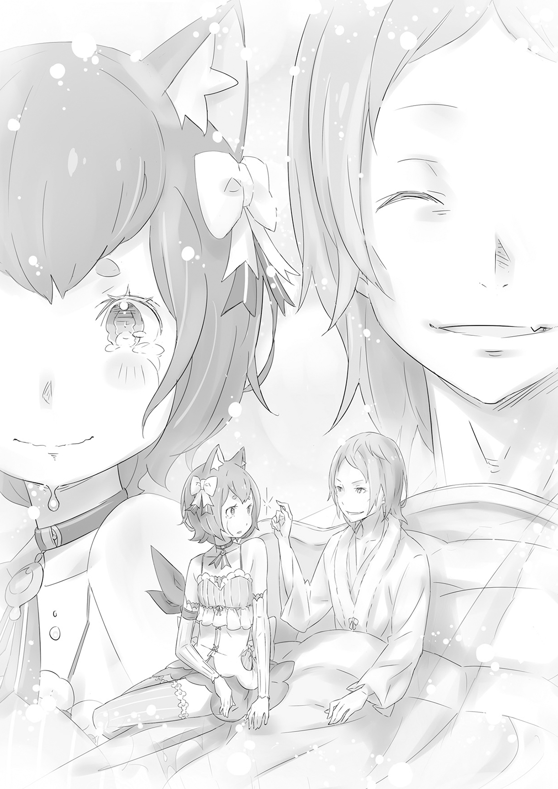
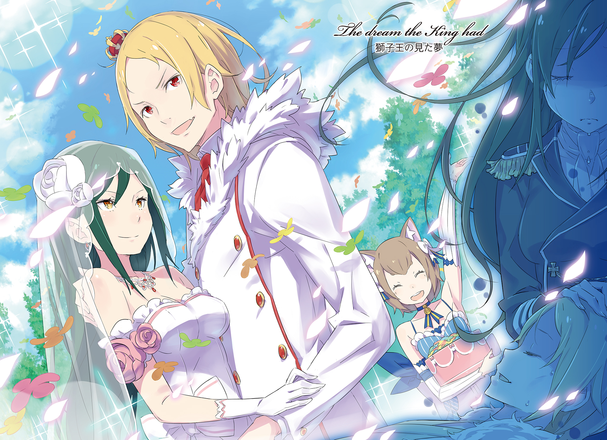
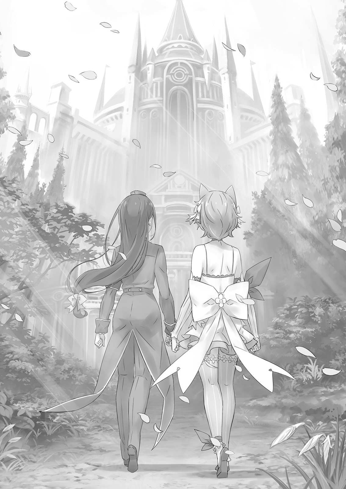

Мечта Короля-Льва

Внезапной болезни Фурье Лугуники уделили сравнительно мало внимания в королевстве Лугуника.

Член королевской семьи заболел, а к этому отнеслись легкомысленно. Обычно такое и представить было нельзя, но в тот момент это объяснялось особыми обстоятельствами в королевстве.

— Фурье был не единственным членом королевской семьи, сражённым недугом.

Более того, заболели абсолютно все члены королевской семьи Лугуника. Отец Фурье, действующий король Рандхал Лугуника, разумеется, был среди них. Симптомы у всех проявлялись по-разному, но с болезнью, чьё название и происхождение никому не были известны, нельзя было полагаться на простые догадки. За всю свою историю королевство ещё не сталкивалось с подобным и содрогалось от надвигающегося кризиса.

— Мой испытательный срок наконе-е-ец закончился, и я стал полноправным членом гвардии, но капитан просто ужасен! Он ведёт себя совсем не так, как раньше! Какой задира!

— Мм, я так и думал. Только подумаешь, что Маркос серьёзен, как и выглядит, а у него оказывается есть и озорная сторона. Я полагал, вы двое поладили бы.

— Ваше Высочество, вы меня слушаете? Злой старший офицер королевской гвардии издевается над Ферри. Я ищу здесь утешения! Глаза его наполнились слезами, а голос дрожал, но это лишь вызвало улыбку у Фурье.

Феррис беспомощно покачал головой, видя веселье Фурье. Затем он поднёс воды к постели принца и приложил кувшин к губам Фурье. Юноша с трудом приподнялся, и Феррис услышал, как вода из кувшина потекла по его горлу.

— Прости, что постоянно доставляю тебе столько хлопот. В последнее время ты почти как мой личный слуга.

— Не беспокойтесь, не беспокойтесь! В последнее время всякие мужланы только и делают, что пристают к Ферри, чтобы подлечил их царапины после тренировки, мяу, просто потому, что считают меня милашкой. Я бы гораздо охотнее был с вами, Ваше Высочество. И леди Круш в последнее время ведёт себя не очень-то дружелюбно…

— Да, она, должно быть, очень занята. Я не видел её уже несколько дней, и мне становится одиноко. Возможно, это связано с моим разочарованием от невозможности двигаться. Эта проклятая болезнь.

— …

Фурье вытер влажные губы рукавом, затем уткнулся в подушку и слабо улыбнулся. В его улыбке, как всегда, виднелись характерные клыки, но в ней не было энергии. Это была вымученная улыбка, чтобы скрыть от Ферриса острую боль, пронзавшую его грудь.

Фурье был истощён. Его сияющие золотые волосы потускнели, а глаза, красные, как закатное солнце, казались какими-то блёклыми. Он говорил безжизненно и часто страдал от приступов кашля. Прежде всего, у него больше не было сил даже ходить. Последний месяц он был полностью прикован к постели.

— Всё началось в день происшествия в доме Аргайлов. После того как особняк сгорел дотла, Фурье вышел из своей драконьей повозки и тут же рухнул без сил. Это зрелище заставило Ферриса отбросить все свои эмоции и сосредоточиться на исцелении принца.

Фурье, казалось, страдал от боли. Феррис передал ему жизненную силу, усадил в повозку и со всей поспешностью вернулся в замок. Именно там они впервые узнали мрачную правду о том, что вся королевская семья больна.

После этого все больные, включая Фурье, были прикованы к постели в королевских покоях. Болезнь продолжалась без существенных изменений, но её патология оставалась загадкой — даже Феррис не мог понять, что её вызывает. Даже Феррис, которому не было равных в искусстве использования маны для лечения болезней.

Признаки были. Сам Феррис видел приступы кашля у Фурье и его периодическое недомогание. В поместье Карстен он стонал от боли, но отказался позволить Феррису осмотреть его.

В то время Феррис был так поглощён мыслями о себе и Круш, что упустил это из виду. И только теперь, когда ему стало удобнее, он находился рядом с принцем, пытаясь всё исправить. Феррис так ненавидел себя, что хотел просто исчезнуть.

— Феррис, разве ты не должен?.. Разве ты не должен быть с моим отцом, а не со мной? Ты наследник величайшего целителя королевства. Это твой долг.

— Всё в порядке. Я удостоверяюсь, что сделал всё необходимое, прежде чем прийти к Вашему Высочеству. Не думайте ошибочно, что я ставлю вас выше короля.

— Понятно, это просто моё недоразумение. Как неловко!.. Круш будет смеяться надо мной.

Улыбка Фурье, когда он произнёс имя Круш, была одинокой. Люди становятся более склонными к одиночеству, когда их тело ослабевает от болезни. Даже Фурье, само воплощение энтузиазма.

— Леди Круш… — Феррис взял руку Фурье в свою, нежно погладил её и прошептал имя, словно молитву.

Он знал, что Круш невероятно занята. Она была одной из самых высокопоставленных дворянок, и пока вся королевская семья была недееспособна, у неё не было ни минуты свободной. И всё же, даже так, Феррис не мог не думать…

«Хоть бы она пришла утешить этого милого, одинокого, драгоценного человека».

Он не мог сделать это в одиночку. Он не мог заменить Круш. Феррис так дорожил Фурье, и всё же снова был не в силах дать принцу необходимую ему поддержку. Бессилие постоянно терзало сердце Ферриса, угрожая разбить его.

— …Удручённый вид тебе не идёт. Голос Фурье настиг Ферриса в его самобичевании, и тогда самоосуждение ударило его, словно молния. Мысленно стиснув зубы, он выдавил улыбку для Фурье.

— Ой, да я не удручён. Ферри чувствует себя прекрасно — просто прекрасно!

Только не начать плакать. Не здесь, не сейчас. Пусть он был бессилен, но у него была своя гордость. Он не мог исцелить болезнь Фурье, но мог выдавить улыбку.

Если это всё, что он мог сделать, то он сделает это во что бы то ни стало.

— Боже, Ваше Высочество! Если вы будете только есть, пить, а потом сразу спать, то растолстеете!..

— И тогда… Круш больше не будет… меня любить…

Всё, что он мог сделать, — это напоминать принцу о повседневных вещах, чтобы, возможно, Фурье мог вернуться к ним в своих снах.

В зале королевских собраний Круш Карстен уже очень, очень долгое время не могла ни о чём думать. Уже несколько дней влиятельные и знатные люди королевства вместе с Советом Старейшин, организацией, по сути, выполнявшей роль мозга королевства, обсуждали, что делать с охватившей их страну смутой.

Круш ужасно устала от собраний, на которых она была обязана присутствовать как герцогиня. Они разговаривали так долго, что она знала в мельчайших подробностях лицо каждого присутствующего дворянина.

Им приходилось иметь дело с ритуалами, где ожидалось присутствие короля, одновременно пытаясь предотвратить утечку информации о текущей ситуации к трём великим мировым державам. Им приходилось выполнять все обязанности, которые обычно лежали на каждом члене королевской семьи, и всё это — пытаясь понять, что делать с болезнью, происхождение которой оставалось неясным. И вдобавок ко всему, у каждого из дворян были свои обычные дела в их владениях. Это привело к такому уровню замешательства и истощения, которого мало кто из них мог припомнить.

Но теперь, спустя месяц после начала всего этого, состояние королевской семьи, казалось, наконец перестало ухудшаться. Именно это они только начали обсуждать, когда—

— Первый принц Забинель мёртв, вы говорите?..

Слёзный доклад, принесённый заклинателем из Королевской Академии Целительства, был более чем достаточен, чтобы вновь повергнуть зал в состояние, близкое к панике. Первый принц Забинель Лугуника был первым из подтверждённых случаев болезни в королевском замке. Следовательно, поразившая его болезнь могла развиваться быстрее всего…

— Это слишком внезапно! Как такое может быть? Как Его Высочество мог так сильно заболеть?

— Невозможно! Я встречался с ним только вчера, и он… Он не подавал никаких признаков того, что так близок к концу…

Те, кто был особенно близок к Забинелю, оплакивали внезапную новость о его кончине. Но не только они остались с разинутыми ртами от этого доклада. Все в зале были шокированы.

Один человек умер от болезни, поразившей всю королевскую семью. И до сих пор никто не знал ни причины, ни способа лечения.

— Высочество… — Круш тоже ощутила укол боли от этой новости. Обычно она так тщательно следила за своей осанкой, но теперь ей казалось, что она вот-вот сломается пополам от тревоги, разрывающей её изнутри. Она могла думать только о Фурье, лежащем на смертном одре и слабо улыбающемся, когда она приходила его навестить.

— Мы должны рассмотреть возможность того, что и Его Величество покинет нас. Даже когда она кусала губу, Круш услышала хриплый голос. Она подняла глаза и увидела, что все, кто слышал, сосредоточили своё внимание на центре зала, где стоял Миклотов, представитель Совета Старейшин.

— Сэр Миклотов, плохая шутка! Его Величество? Покинет нас?

— Мм. Неизбежного не избежать, как бы усердно мы ни отворачивались от реальности. Сейчас мы не можем позволить себе быть оптимистами. Иначе мы не сможем исполнить обязанности самого драгоценного престола в нашей стране. Разве я не прав?

— Нгх…

— Теперь мы видим, как быстро может измениться состояние — а это значит, что даже завтра мы можем столкнуться с худшим. Когда это произойдёт, это потрясёт королевство, и наша роль — поддержать нацию в это время. Мы не должны отворачиваться от народа.

Резкое заявление Миклотова успокоило тех, кто считал его слова неуважительными. Его слова, возможно, были беспощадны по отношению к лидеру королевства, но именно это делало их ещё более необходимыми.

Таким образом, Круш первой отбросила личные чувства и высказалась от имени мудреца. — Сэр Миклотов прав. Если что-нибудь случится с Его Величеством, королевство не исчезнет. Именно нам придётся что-то с этим делать.

Круш была одной из немногих присутствующих герцогского ранга, но у неё было сравнительно мало опыта, и она ещё не утвердилась. Тем не менее, её выступление помогло остальным дворянам начать думать так же.

— Я благодарен за вашу поддержку, — сказал Миклотов. — Естественно, я всё ещё надеюсь и молюсь, чтобы Его Высочество и семья Его Высочества благополучно пережили это испытание. Пожалуйста, не поймите меня неправильно в этом вопросе.

Он предложил собранию начать обсуждение того, что делать с королевством в случае отсутствия короля — и напоследок бросил многозначительный взгляд на Круш. Возможно, он выражал свою благодарность за то, что она первой его поддержала. Но она этого не видела; она уже рухнула на своё место.

При таком положении дел она не сможет заглянуть к Фурье. Она была так скована своими дворянскими обязанностями, что у неё даже не было времени его увидеть. Она не могла позволить этому драгоценному, ограниченному времени пропасть даром. Вот что она говорила себе, даже когда долг заставлял её оставаться на собрании.

— …Круш, это ты?

Круш была несколько удивлена, увидев, что Фурье открыл глаза, почувствовав, как она вошла в его комнату. Она старалась идти как можно тише, чтобы не потревожить его сон. Он не только смог определить, что кто-то здесь есть, но даже узнал, кто это был.

— Вы удивляете меня, Ваше Высочество. У меня такое чувство, что я ничего не могу от вас скрыть.

— И… возможно, не можешь. Просто мы так хорошо знаем друг друга. Даже с закрытыми глазами, даже в глубине сна, я знаю, что это ты… Прошло некоторое время. Ты была здорова?

— Я была ужасно занята, но со здоровьем у меня всё в порядке. У вас сегодня хороший цвет лица, Ваше Высочество. Это облегчение. Круш села на стул у кровати и внимательно посмотрела на лицо Фурье.

Её последний визит был всего несколько дней назад, но сейчас он казался ещё худее. А Фурье никогда не был особо крепким. Он уже сжёг весь жир; теперь его тело пожирало само себя. Скулы его слегка выпирали. Невозможно было не видеть, как болезнь опустошает его.

— Круш… я хочу… почувствовать твоё прикосновение.

— Да, Ваше Высочество. С вашего позволения. Она осторожно просунула руку под простыни и взяла дрожащую руку Фурье. Его пальцы всегда были тонкими, но теперь они были отчаянно хрупкими. Она потёрла его ладонь и переплела свои пальцы с его.

— Ах. Прикосновение твоих пальцев приятно, — сказал он. — Женская рука.

— Рука Вашего Высочества кажется довольно тонкой для мужчины. Никогда бы не подумала, что вы так долго упражнялись с мечом.

— Меч… Да, меч… Полагаю, я единственный, кто мог бы тебя одолеть. Хотя я уже много дней пренебрегаю тренировками.

— Ваше Высочество наверняка быстро оправится от нескольких дней отдыха. Хотя говорят, что на восполнение одного пропущенного дня требуется три дня работы.

— Ты говоришь мне работать в три раза дольше, чем я отдыхал?.. Беспощадно! А потом, как и часто прежде, он закашлялся. Круш поспешно повернула его на бок и нежно тёрла его спину, пока приступ не прошёл. Его дыхание было таким тяжёлым, а спина казалась такой маленькой.

— Ах, да, а что насчёт?.. Что насчёт Аргайлов? И Ферриса? Всё ли идёт хорошо? Когда Круш ничего не ответила, Фурье заговорил, словно ему только что пришла в голову мысль.

Почувствовав спасение от смены темы, Круш кивнула и сказала: — Да. Благодаря вашему содействию, Ваше Высочество. Я рада сообщить, что случившееся в поместье Аргайлов не вышло за пределы узкого круга. Смерть матери и отца Ферриса называют несчастным случаем. Так что Феррис—

— Может спокойно унаследовать имя Аргайлов. Хорошо. Это хорошо. Он может говорить, что не хочет этого, но он не может отбросить всё, с чем родился. Он не должен.

— Как вы думаете, он сможет это принять?

— Конечно — ведь он мой друг и твой рыцарь! Фурье полуобернулся к ней и улыбнулся, показав зубы. Он чуть снова не закашлялся, но сдержал кашель в горле. От этого у него на глаза навернулись слёзы, но он продолжал улыбаться. Увидев это, Круш обнаружила, что не может вымолвить ни слова. Но она собрала все свои силы, чтобы улыбнуться в ответ.

Это никогда не было её особым талантом, но Фурье часто хотел видеть её улыбку.

— Мм… Я знал… твоя улыбка… прекрасна.

Ей не следовало оставлять всё веселье Феррису. Ей следовало хотя бы научиться заставлять себя улыбаться. Круш старалась жить без сожалений, но об одном она очень жалела.

За последние несколько месяцев Феррису становилось всё труднее поверить, что он — один из Рыцарей Королевской Гвардии. Он ходил в академию целителей, чтобы проверить состояние членов королевской семьи и ухаживать за Фурье. Какое отношение всё это имело к работе рыцаря? Это больше походило на то, чем занимался бы заклинатель из Королевской Академии Целительства.

— Третий принц скончался прошлой ночью. Это уже седьмой человек…

Ещё один ушёл, все усилия целителей были напрасны. Феррис не хотел слышать имя ещё одного умершего члена королевской семьи, но в академии новости доходили до него, хотел он того или нет.

Семь жертв, и они до сих пор не знали причины болезни. Всё, что они узнали, — это то, что как только у пациента поднималась температура и он впадал в кому, ему уже нельзя было помочь. Всё это, и лишь одно бесполезное знание.

— …

Опечаленный, Феррис вышел из палаты короля после очередного дня безуспешных попыток применить различные лечебные магии. Он всегда относился к этому месту с благоговением, но, проведя там так много времени, он больше не чувствовал тревоги. Его первоначальное чувство, нечто вроде священного ужаса, давно уступило место ощущению бессилия.

Феррис нёс чёрную книгу, идя по коридорам королевского замка. Она была покрыта кровью и отпечатками пальцев. В некотором смысле, её можно было назвать подарком от его отца.

[Таинство Бессмертного Короля]…

Тайное заклинание, разработанное ведьмой, которое могло воскрешать мёртвых, даруя трупам способность снова ходить. Его отец не смог успешно воспроизвести заклинание, но если бы это удалось, можно было бы спасти даже тех, кто ушёл…

— Ваше Высочество… Если что-нибудь случится с Вашим Высочеством…

Феррис подумал о Фурье, который с каждым днём становился всё худее и слабее, и, не в первый раз, представил, как ему удаётся заставить таинство сработать. Смерть Фурье, среди всех прочих, была той, от которой он просто не мог отвернуться.

Ему понадобилось бы чудо, чтобы спасти четвёртого принца. А чудес, когда он о них просил, похоже, никогда не случалось. Таинство было единственным, что приходило Феррису на ум.

Когда он вошёл в палату Фурье, прикованный к постели принц слабо рассмеялся и сказал: — Феррис, макияж сработал прекрасно. Круш подумала, что у меня хороший цвет лица… Ха-ха, мы точно обвели её вокруг пальца. Она такая доверчивая.

Макияж был тем, что Феррис нанёс, чтобы бледность Фурье выглядела более здоровой. Фурье умолял Ферриса не позволять ему выглядеть плохо перед Круш, когда она придёт в гости. Феррис мучительно осознавал, что это не имело ничего общего с гордостью Фурье, а было проявлением его заботы о Круш.

Феррис ничего не сказал. Фурье заговорил так, словно мог читать мысли мальчика. — Ничто… не беспокоит тебя с рыцарями, Феррис? Не забывай опираться на своего друга… Да, на Юлиуса. Ты иногда пытаешься взвалить на себя слишком много.

В последнее время бывали моменты, когда Феррис не был уверен, кто кого утешает во время этих визитов.

— Мои… Мои друзья. Вы, Ваше Высочество… Вы мой единственный друг. Разве нет? Поэтому, когда вы не чувствуете себя сильным, я остаюсь… один.

— Конечно… нет. Не волнуйся, Феррис. Ты добрый, и в глубине души ты сильный. Все любят тебя… и подружатся с тобой, как и я. Возможно, я был твоим первым другом, но не позволяй мне быть последним. Помни это: не заставляй себя быть в одиночестве.

— Ваше Высочество…

Почему он говорил так, будто это конец? Это был не конец. И как он мог так тонко чувствовать, что ощущает Феррис? В последнее время слова Фурье обладали настоящей силой. Не мирской силой, а пронзительной силой истины. Это пугало Ферриса.

— Ваше Высочество!.. Ваше Высочество, если что-нибудь случится с вами… я…

— Вернёшь меня к жизни? Пожалуйста, не говори таких вещей.

— …

Фурье прочитал его как открытую книгу. Он лежал на кровати и не мог видеть книгу в руке Ферриса. Тем не менее, он точно угадал, что задумал Феррис, и отверг это.

— Я — это я, понимаешь. Моя жизнь началась, когда я начался, и она должна закончиться, когда я закончусь. Чтобы она продолжалась после того, как я закончусь — это неправильно.

— Но… но почему? Разве это так странно, что я хочу, чтобы ты жил? Что я хочу, чтобы тот, кто так важен для меня, был жив?

Только произнеся эти слова, Феррис понял, что они были точно такими же, как те, что бормотал его отец над трупом его матери. Если не слово в слово, то, по крайней мере, дух был идентичен.

— Не скорби, Феррис. Твоё сердце драгоценно. Гордись своими способностями… У тебя самая добрая сила во всём мире. Считай не раны, которые ты не смог исцелить, а то, что ты смог спасти. Не пытайся всё время оглядываться назад, идя вперёд… Я не позволю этого.

— Ваше Высочество…

Медленно, так медленно, Фурье сел в своей постели. Он так исхудал, что больше не мог стоять самостоятельно, но он хотел, чтобы Феррис увидел искру жизни, горящую в нём. Алые глаза вновь обрели некоторую долю своей прежней силы.

— И в любом случае, — продолжил он, — я ещё могу победить эту штуку. Я… Да. Я твой друг и четвёртый принц Королевства Лугуника. Я даже победил Круш в битве на мечах. Маленькая болезнь должна быть… проще простого.

Фурье поднял руку и нежно коснулся лба Ферриса. Его прикосновение было таким лёгким, но палец был тёплым.

— Не оставляй свой долг члена королевской гвардии… Это я добился, чтобы тебя назначили рыцарем Круш. Не предавай клятву, которую мы дали друг другу. Обещание, которое мы дали… как друзья. Делая долгие вдохи, Фурье снова улыбнулся и откинулся на подушки. — Я устал от всех этих разговоров. Но я смог улыбнуться с тобой впервые за долгое время. Это хорошо.

Феррис не улыбался. Всё, что он делал перед Фурье в тот день, — это плакал. Но Фурье никогда не говорил неправды. То, что он говорил, иногда казалось ошибочным, но всегда оказывалось правдой.

— Было весело, Феррис.

Поэтому Феррис сделал всё возможное, чтобы заставить свои застывшие щёки улыбнуться.

— Верно. Было весело, не так ли, Ваше Высочество?

— День был ясный, но ветерок нёс с собой прохладу.

— Круш… я бы хотел ненадолго выйти на улицу. Не могла бы ты помочь мне?

— Конечно, Ваше Высочество. С вашего позволения…

— Ох! Ты сама понесёшь меня? Ха-ха! А ты и впрямь сильная женщина. Я снова удивлён.

Во внутреннем саду королевского замка Лугуники пышно цвели сезонные цветы. Но из-за суеты и тревог последних нескольких месяцев это буйство красок оставалось в одиночестве.

— Что ж, без толпы даже хорошо. Так лучше любоваться цветами — их видно гораздо отчётливее. Не так ли?

— И правда. Ваше Высочество всегда так умело находит во всём светлую сторону.

— Верно? Я и у тебя с Феррисом знаю немало хороших сторон. В этом, по крайней мере, я не уступлю Меккарту.

Круш опустилась на колени в углу сада, позволив Фурье положить голову ей на колени, пока ветерок обдувал их обоих. Фурье сонно прикрыл глаза, сад расплывался перед его затуманенным взором.

— Мы с тобой в детстве приходили сюда любоваться цветами. Помнишь, Круш?

— Помню. Я сопровождала отца в замок, и когда мне становилось скучно, всегда приходила сюда… а ты всегда встречал меня. Это так утешало моё детское сердце.

— Впервые я увидел тебя…

— Я никогда этого не забуду. Ты буквально свалился с неба! Я была потрясена.

Их разговор о прошлом расцвёл.

Круш улыбнулась воспоминаниям, но Фурье мягко покачал головой.

— На самом деле, ты ошибаешься. Впервые я увидел тебя раньше… Я заметил тебя в этом саду, издалека. Ты рассматривала молодой бутон.

— …Я не знала. Как неловко.

— Вовсе нет. Ты сразу же покорила меня. Моё сердце забилось быстрее, щёки загорелись, и всё, что я мог — стоять и смотреть на тебя. После этого я всегда искал тебя… По правде говоря, наша встреча не была простой случайностью. Хе-хе. Держу пари, ты удивилась.

— Да, очень.

Глаза Фурье смешно сморщились, и он рассмеялся, показав зубы.

Круш нежно провела пальцами по золотистым волосам, лежащим у неё на коленях, ласково похлопала по бледным щекам.

— Кстати об удивлении, позволь мне признаться в своих грандиозных планах на будущее…

— Да, Ваше Высочество. Пожалуйста, удивите меня снова. Пожалуйста, расскажите.

— Хорошо. Слушай внимательно. Я… Я намеревался сделать тебя своей королевой.

— …

— Я бы сделал тебя своей королевой, а Феррис стал бы нашим рыцарем. И тогда… тогда мы трое всегда могли бы быть вместе. Это было бы несравненным счастьем. Что ты об этом думаешь?

— Вы… Вы определённо умеете меня удивлять…

Круш почувствовала, как у неё перехватило голос, и поняла, что не может на него смотреть.

Фурье, с нежной улыбкой на лице, внимательно прислушивался к ноткам радости в её голосе.

— Мы… через многое прошли, не так ли? Я так отчаянно хотел твоего внимания… Хех! Из-за этого я доставил тебе и Феррису немало хлопот.

— …Ваше Высочество. Мне никогда не было в тягость делать то, что вы…

— Скажи мне, Круш… Как я справился?

— Ваше Высочество?

— Смог ли я… быть Королём-Львом, достойным твоей преданности?..

— …

Когда-то они дали обещание. Поклялись теми днями, что были наполнены смехом.

От вопроса Фурье дыхание Круш стало прерывистым.

— Твоя преданность была… драгоценна, — сказал он. — Я очень ею дорожил. Не… Никогда не забывай об этом.

Фурье улыбнулся, словно гордясь собой, и поднял руку. Он коснулся щеки Круш, стирая горячие слёзы, что текли по ней, и провёл пальцами по линии её губ.

— Круш.

— Да, Ваше Высочество.

— Я… лю…

— …

Подул порыв холодного ветра, теребя волосы Фурье и Круш.

— Ваше Высочество?

— …

— Ваше Высочество, вы устали?

— …

— Ваше Высочество, я знаю, как вы трудились и боролись. Пожалуйста, покойтесь с миром.

— …

— И последнее…

Ветер продолжал дуть. Но Круш, со слезами, застилавшими взор, не видела его, даже со своим даром. Там, в саду, Круш крепко прижала к себе Фурье и прошептала.

— Как бы я хотела увидеть будущее, о котором ты мечтал…

Жестокая ирония заключалась в том, что смерть Фурье Лугуники была воспринята почти как незначительная деталь на фоне кончины короля Рандхала Лугуники.

Собрание погрузилось в уныние, ведь худшие опасения подтвердились. Круш же охватило чувство утраты и апатии. Фурье был для неё настолько важен, что его потеря стала таким же шоком и мучением, как если бы она лишилась половины своего тела.

Даже сейчас, закрывая глаза, она видела его последнюю улыбку. Образ того, как он испускал последний вздох, навсегда врезался в её память.

И напоследок, чувства, которые он так и не успел высказать до конца, растворились в воздухе.

— Но мы не можем вечно сидеть с печальными лицами.

Миклотов первым нарушил гнетущую атмосферу. Старый мудрец посмотрел в лицо каждому из понурых дворян, пытаясь их расшевелить.

— …Верно, — сказал кто-то. — Сейчас не время. Покойный Его Величество огорчился бы, увидев нас такими.

Раздался хор согласных голосов. Настроение передалось остальным, и Круш поняла, что у неё нет иного выбора, кроме как поднять голову и заставить себя улыбнуться. Оставаться здесь с опущенной головой было бы величайшим предательством того, чего хотел Фурье.

Она представила его улыбающееся лицо, вспомнила, как он всегда старался видеть во всём хорошее.

— Королевская родословная прервалась. Мы лишились договора с драконом. Не может быть большей трагедии для Королевства Лугуника, Друга Драконов.

От этих слов образ в её сознании рассыпался.

Круш подняла голову, не веря своим ушам, пока кто-то перед ней схватился за голову.

— Как могла исчезнуть вся королевская семья? Что сделает дракон? Если мы лишимся договора, это станет катастрофой для нашей страны. Учитывая, насколько плохи сейчас наши отношения с Империей и Святым Королевством!..

«О чём он говорит?..»

— Есть ещё вопрос сохранённой драконьей крови. Всегда есть вероятность, что её потребуют вернуть. Чтобы обезопасить себя, мы можем счесть нужным использовать её…

«О чём вы все говорите?..»

Круш безучастно смотрела, слушая обсуждение мрачных участников собрания. Всё, о чём они говорили, сводилось к вопросу о том, что предпримет дракон теперь, когда королевская семья пресеклась. Королевство Лугуника находилось под благословением дракона, не раз спасавшего его от кризисов. Их страх был обоснован; Круш, как и все остальные, понимала, что они зависят от дракона. Но неужели это первое, о чём стоило сокрушаться?

Если бы они хотели обсудить будущее королевства, это было бы нормально. Если бы они беспокоились о переговорах с другими странами теперь, когда короля не стало, она могла бы их простить. Но обсуждать, как манипулировать драконом — неужели это первое, что пришло им в голову?

С растущим отвращением Круш осенило: никто из этих людей на самом деле не был опечален тем, что королевская линия прервалась. Их беспокоили лишь последствия — оставит ли их дракон. Они были в ужасе от мысли, что их вышвырнут из колыбели драконьих благословений. Смерть короля, конец королевской семьи — всё это было вторичным.

«Для них смерть Фурье — всего лишь сноска».

Ужасно было то, что если бы Круш не была так близка с Фурье, она, без сомнения, разделяла бы те же страхи, что и остальные. Её душа была бы такой же равнодушной, как и их.

Такой образ жизни, больше всего на свете, вызывал у Круш отвращение. Она едва могла это выносить, пока он отбрасывал тёмную тень на её сердце.

— Есть дело, которым я должен поделиться со всеми вами.

Слова прервали шум в зале собраний, и все взгляды обратились к говорящему.

Это был барон Лейп Бариэль. Он не принадлежал к высшей знати, но был фаворитом Его Величества Рандхала и очень ценился покойным королём. Когда Лип привлёк достаточно внимания толпы, он дрожащим голосом сделал объявление.

— На Драконьей Скрижали появилась новая надпись. Дракон уже открыл судьбу королевства.

Это вызвало новый переполох в зале собраний. Драконья Скрижаль была камнем, даром от дракона и одним из сокровищ королевства. Она записывала будущее нации. Несколько раз в прошлом камень предупреждал королевство о грядущих угрозах, и они могли заранее подготовиться.

Не успели они поразмыслить о том, как сильно нуждаются в драконе, как им самым болезненным образом напомнили о его силе. Игнорируя чувства Круш и остальных, Лейп торопливо начал читать надпись.

— Там сказано: „Посему, с концом королевского рода, королевство найдёт пять кандидатов, избранных Драконьими Камнями, и с новой жрицей договор будет заключён заново”.

— Драконья Скрижаль велит нам избрать нового короля?.. Но как нам найти этих пятерых кандидатов?!

— Есть знаки отличия, — горячо ответил Лейп, — камни, передаваемые королевским домом Лугуники, указывающие на их договор с драконом. На знаках отличия есть эти камни, и они засияют в руках того, кто достоин быть кандидатом!

По знаку Лейпа в круглый зал собраний вкатили тележку. На ней лежали мерцающие драгоценные камни — знаки отличия Королевства Лугуника с Драконьими Камнями.

— Если знак отличия признает в вас верного вассала, способного истинно вести королевство, он изберёт вас. Разве Драконья Скрижаль лжёт? Пусть каждый из вас пройдёт испытание по очереди.

Один из помощников Лейпа прошёл между сидящими в зале, поднося знак отличия каждому. Некоторые покрывались холодным потом, глядя на него. Другие сглатывали. Если он засияет в их руке, откроется путь к трону.

Знак отличия положили и перед Круш. Говорили, дракон ищет тех, кто предан королевству. Если так, то её, такую, какая она сейчас, точно не выберут. Но если…

— Тогда начнём испытание, — сказал Миклотов. Первым пошёл Совет Старейшин, взяв знак отличия в руки. Но в потемневшем камне ничего не изменилось. Раздались тихие вздохи и едва слышные звуки разочарования. Так началось испытание знаком отличия, продвигаясь от совета вовне. Разочарование за разочарованием, и вот настала очередь Круш.

Знак отличия представлял собой треугольный обсидиановый камень с вырезанным на нём золотым драконом. В самом центре находился красный самоцвет, называемый Драконьим Камнем — камень, что высмеивал тщетные амбиции тех, кто не был достоин править.

«Дракон? Кому какое дело до?..» — прошептала Круш одними губами, беря знак отличия. Она протянула его на ладони, чтобы все видели. И тогда…

— Ох…

Это вырвалось у Миклотова, на чьём обычно безмятежном лице отразилось непривычное удивление. Все остальные в зале явно чувствовали то же самое.

Знак отличия в руке Круш ярко сиял.

«Значит, даже я, такая неумелая, могу что-то сделать для нашего королевства».

Она не почувствовала шока. Её сердце было слишком спокойно для этого. Осознав это, Круш подняла голову и закрыла глаза.

И в темноте ей показалось, что она видит последнюю улыбку Фурье.

Когда Феррис узнал о королевских выборах и о том, что Круш стала одной из избранных кандидаток, он обыскал весь замок в её поисках, пока не нашёл её в саду.

— Госпожа Круш.

Стоя перед цветами, она выглядела такой хрупкой, что он помедлил её окликнуть. И неудивительно. Именно здесь она провела последние мгновения с Фурье. Это было самое святое место в сердце Круш, единственное место, куда даже Феррис не мог войти.

Он ощутил боль собственного бессилия так остро, словно клинок вонзился ему в грудь. Если бы только он мог подбежать к ней, обнять за плечи и сотворить какое-нибудь заклинание, чтобы исцелить её сердце.

— Феррис, это ты? Молодец, что нашёл меня здесь.

Она сказала это, не оборачиваясь к Феррису, который закусил губу от чувства беспомощности.

Время от времени налетал ветер, подхватывая длинные волосы Круш. Феррис смотрел, как развеваются её волосы, и сказал: — Я слышал про Драконью Скрижаль. Говорят, вы одна из кандидаток на трон, госпожа Круш.

— Да, похоже на то. Кажется, дракон отнёсся ко мне благосклонно.

Феррис едва мог сохранять спокойствие под этими ударами судьбы. Он вступил в королевскую гвардию, его мать и отец умерли, он потерял Фурье, связь с которым так много для него значила. Теперь Круш, его гавань в любой шторм, оказалась втянута в какие-то королевские выборы. Неужели для него не осталось ничего надёжного и стабильного?

— Что я могу сделать для вас, госпожа Круш? Я не знаю, что делать…

Он не хотел доставлять ей лишних хлопот, но не мог скрыть дрожь в голосе. Феррис был слишком маленьким сосудом, чтобы удержать бушевавшие в нём эмоции. Слёзы застилали ему глаза, и ему хотелось убежать из сада.

— Феррис, посмотри на меня. — Голос Круш заставил его вздрогнуть.

Он услышал шаги, а затем в поле его опущенного взгляда появились две ноги. Он поднял голову и встретился взглядом с Круш. Магия её янтарных глаз пленила его.

— Феррис, позволь мне поклясться тебе первому — я действительно хочу стать королём.

— Госпожа… Круш… — Феррис затаил дыхание от её твёрдого заявления.

Она говорила ему, что стремится победить на королевских выборах и в конечном итоге занять трон. Феррис не мог больше ничего сказать, но Круш огляделась и произнесла: — Впервые я встретила Его Высочество в этом саду. Мы часто разговаривали здесь и вместе смотрели на цветы. — Она говорила мягко; её глаза показывали, что она вспоминает что-то давно минувшее.

Феррису не нужно было спрашивать, кого она вспоминает.

— Со временем Его Высочество стал заходить в наш особняк. Я тебе никогда не говорила, да? До встречи с Его Высочеством я всегда завязывала волосы сзади. Теперь я просто использую ленту, чтобы они выглядели аккуратно.

— Никогда не знал. Почему вы перестали их завязывать?

— Его Высочество сказал мне быть верной себе. Так я и поступила. Я выбрала ленту, которую дала тебе, но… всё началось с Его Высочества.

Феррис неосознанно коснулся белой ленты, которую дала ему Круш и которую он до сих пор носил в волосах.

Она делилась с ним одним воспоминанием за другим, вещами, которых он не знал, — но одно за другим они становились воспоминаниями, которые он разделял с Круш. Связь настолько прекрасная и живая, что он не мог сдержать потока слёз или океана улыбок.

— Феррис, время, которое мы… которое Его Высочество, ты и я провели вместе… я очень ценю.

С того дня, как Круш увела Ферриса из особняка Аргиль и впервые отнеслась к нему по-человечески, он всегда был с ней, и его круг общения вскоре расширился, включив в себя и Фурье. Значительная часть его жизни состояла из них двоих.

— Но существование дракона обесценивает это драгоценное для нас время, — продолжала она. — Для многих Его Высочество существовал лишь как способ продления договора. Они не скорбят о его смерти, не по-настоящему. — Феррис напрягся; в глазах Круш заплясал огонь.

Что она увидела? Что произошло за то время, пока Феррис не мог быть с ней?

— Но он существовал, достаточно, чтобы врезаться в моё и твоё сердце. Фурье Лугуника действительно жил.

Правой рукой она коснулась своей груди, а левой — его. Это было лишь лёгкое прикосновение пальцев, но Феррису показалось, что их жар мог сжечь всё его тело. Огонь её решимости поглотит все посторонние мысли.

— Человек, который был моим Королём-Львом, жил. Я никому не позволю утверждать обратное.

Договор с драконом, оберегавший королевство, защищал народ очень долго. Но он сделал их сердца слабыми, настолько, что они были готовы игнорировать смерть этого доброго юноши, которого любили все, кто его встречал. Сердца людей стали настолько хрупкими, что смерть Фурье была почти забыта перед лицом договора с драконом.

— Его смерть принадлежит ему. Мой Король-Лев во мне и сейчас. Я всё ещё вижу сон, который видел мой король — и только я могу его осуществить.

Никто больше не видел, насколько исказилась жизнь королевства. Все заискивали перед драконом, выпрашивали у него милости, полагались на его помощь, и в процессе все забыли, как ходить самостоятельно.

— Ни один правитель, кроме меня, не попытается это исправить, ибо никто не помнит тех, кто стремился быть истинными королями. Так что это предстоит сделать нам.

— Госпожа Круш, — прошептал Феррис.

Круш протянула ему кинжал, который сняла с пояса. Он взял его и обнаружил, что на нём выгравирован символ Короля-Льва. Это была драгоценная реликвия Дома Карстен.

— У Его Высочества была мечта — чтобы ты, я и он, мы трое, вместе строили будущее.

— Мы трое… Я, Его Высочество и вы, госпожа Круш?..

Ощутив поразительную тяжесть кинжала в руке, Феррис наконец понял, что он должен делать рядом с Круш и Его Высочеством, чтобы помочь им в их решимости. Теперь у него была только Круш. Она была всем.

— Его Высочество любил это место, — мрачно сказала Круш, — и именно здесь он провёл свои последние мгновения. Поэтому я клянусь ему здесь: я сделаю тебя своим рыцарем.

Услышав это, Феррис безмолвно опустился на колени и протянул кинжал. Круш взяла его, обнажила и коснулась Ферриса сначала левого плеча, затем правого, плашмя клинком. Затем она вернула ему нож, завершая ритуал вассальной присяги.

Никто не знал, что в тот день там было даровано рыцарство — кроме одного, а возможно, и двух присутствовавших Королей-Львов. И это было начало, а для них двоих — ещё и продолжение мечты их Короля-Льва.

Круш оглянулась через плечо. — Мы идём, Феррис. Вернуть наше королевство у дракона и воплотить мечту Его Высочества в жизнь.

— Да, госпожа Круш. Ведите меня, и я последую. Мы узнаем, куда приведёт нас мечта Его Высочества. — Без колебаний он присоединился к ней. Первая из кандидаток на престол, самая крепко связанная со своим рыцарем, гордо удалилась. Наблюдали за ними лишь цветы в том саду, где всё началось.

Мягко покачиваясь на ветру, одинокий бутон спокойно ждал подходящего момента, чтобы расцвести.

《Конец》
