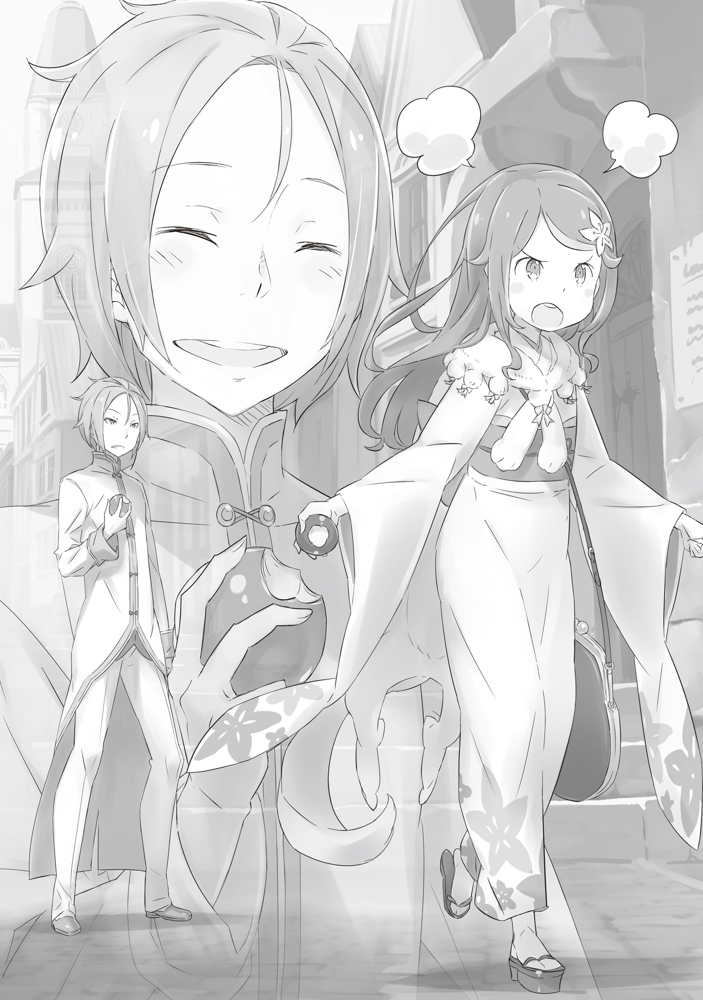

Это был довольно приятный и солнечный день.

???: Так тоскливо в такой день мотаться туда-сюда из офиса! Хочу прогуляться, айда со мной!

В этот момент послышался протест, а также звук ударившейся о стол связки бумаг. Юлиус, который сосредоточенно занимался чтением в углу комнаты, не смог сдержать смешка.

???: Ой, Юлиус? Ты слышал, что я сказала?

Юлиус: Да, конечно. Простите, я потерялся в вашей красоте.

???: Посмотри на себя, ты говоришь об этом без малейшего чувства вины. Я не такая, как эти девушки из Лугуники, которые клюют на твои пикаперские уловки.

Анастасия, девушка, предложившая прогулку, уже была сварлива и начала дуться на замечание Рыцаря. У нее был типичный карарагский акцент, но пусть вас не обманывает милая внешность и невинные манеры. Девушка по имени Анастасия Хосин была, с точки зрения Юлиуса, одной из самых влиятельных фигур в Королевстве на сегодняшний день.

Юлиус: Что ж, в любом случае, я с радостью приму ваше приглашение. А Мими и Хетаро тоже пойдут?

Анастасия: Нет, сегодня никаких телохранителей. Я хочу прогуляться с тобой наедине, Юлиус.

???: Эй, я это слышала! Это предательство! Измена!

Мими, подслушав разговор, не собиралась оставаться в стороне.

Анастасия: Это «измена», Мими. Я оденусь, ты можешь немного подождать?

Юлиус: Конечно, госпожа. Сколько угодно.

С этими словами Анастасия махнула рукой и вышла из комнаты. Обычно дамам требуется значительное время, чтобы одеться, и, хотя президент Торговой Компании Хосин ценит эффективность превыше всего, она не пренебрегала силой хорошего внешнего вида. А это значит, что дело затянется…

Юлиус: Мими, давай подождем Анастасию-сама в гостиной, хорошо? Не могла бы ты пойти и попросить их приготовить нам чай?

Мими: Да, так точно! Предоставьте это Мими!

Наблюдая за тем, как взволнованная девочка выходит из комнаты, Юлиус начал готовиться к встрече с Анастасией. Если дамы наряжаются для выхода в свет, то и мужчины должны готовиться к тому, чтобы им соответствовать, быть достойными их общества.

Когда Юлиус, переодевшись, вошел в гостиную, Мими сидела за столом, на котором были поданы сладости и чай, и беспокойно покачивала ножками. Когда она поняла, что Рыцарь прибыл, лицо девочки расплылось в широкой улыбке, но вскоре она нахмурилась, схватившись за нос.

Мими: Угн? Юлиус? Почему от тебя так воняет?

Юлиус: Я побрызгался духами. Тебя это беспокоит?

Мими: Нет! Просто я немного испугалась! Я не очень хорошо умею диффе-… диффере-… дифференци-… дифференцировать людей по их лицам!

Затем Юлиус сел напротив Мими, которая наслаждалась сладостями, лежащими на столе, и, заинтригованный ее комментарием, спросил,

Юлиус: Значит ли это, что вы, ребята, определяете нас по запаху?

Мими: Если ты один и ты тот, кого я знаю, я могу определить это взглядом. Но когда вокруг много людей, это становится довольно тяжело. Тогда приходится определять по запаху!

Юлиус: Хм, понятно… Я удивлен, что вы, кошачьи полулюди, так сильно полагаетесь на обоняние. Я предполагаю, что то же самое относится и к Капитану Рикардо, поскольку он является кобольдом.

Хотя, говоря о нем, неудивительно, что он кобольд лишь наполовину, поскольку они, как известно, невысокого роста, а Рикардо был более двух метров.

Вспомнив этого здоровяка, который все время громко разговаривал с характерным карарагским акцентом, Юлиус задал еще один вопрос.

Юлиус: Ты и твои братья тоже из Карараги, верно? Тогда почему у вас троих нет характерного карарагского акцента?

Мими: А, насчет этого. Это хороший, хороший вопрос!

Мими кивнула, а затем пояснила,

Мими: Это благодаря Великому Старейшине! Мими, Хетаро и Тиви научились говорить и сражаться у Великого Старейшины!

Юлиус: Великий Старейшина…?

Мими: Он был стариком, который показал нам, как надо жить! И умер он тоже очень круто!

Из-за того, как говорил котенок, это прозвучало не так серьезно, как должно было бы, поскольку нетрудно было представить, что этот человек был для тройняшек чем-то вроде приемного отца. К тому же, судя по всему, он был достаточно сильным старейшиной, чтобы довести их до уровня вице-капитанов такого отряда, как «Железный Клык».

И как раз в тот момент, когда разговор подошел к концу, в комнате появилась Анастасия.

Анастасия: Извини, что заставила ждать. Я готова.

Она переоделась в традиционный карарагский костюм под названием «кимоно». Это было длинное платье из белой ткани с анисовыми цветочными узорами. Конечно, такую одежду в Лугунике редко встретишь, но Анастасия выглядела в ней великолепно.

Юлиус: Мне кажется, я никогда не устану повторять, как хорошо вы выглядите в своих нарядах, госпожа. Они словно были созданы специально для вас.

Анастасия: Боже, он не знает, когда нужно сдаваться… Что ж, не то чтобы меня это беспокоило.

Жадно улыбнувшись, Анастасия смутилась.

Анастасия: Мими, я иду на прогулку с Юлиусом, будь паинькой. Я не хочу найти что-нибудь грязное или сломанное, когда вернусь.

Мими: Хихи! Легкотня! Это специальность Мими!

Сцена с маленькой девочкой, бьющейся о стол, не внушала особого доверия, но в тот момент оставалось только молиться и предоставить все остальное слугам. Юлиус протянул руку Анастасии, и та мягко ее приняла.

Юлиус: Госпожа… Вы уверены, что вам стоит быть в шарфе? Мне кажется, вам будет жарко, учитывая сегодняшнюю погоду.

Как заметил Рыцарь, несмотря на кимоно, на ней все еще был лисий шарф, который, по-видимому, являлся ее любимым. Несмотря на то, что это был красивый шарф, причем явно высочайшего качества, носить его в столь жаркие дни не имело смысла.

Анастасия: Ах, что ж, ты прав, однако… мне это не мешает.

Юлиус: …Понятно. И куда мы сегодня направляемся?

Почувствовав, что это деликатный вопрос, Юлиус не стал настаивать и сменил тему разговора. Шарф мог быть чем угодно, от простого амулета до могущественного Метеора. Возможно, когда между ними возникнет большее доверие, Анастасия раскроет правду.

Анастасия: Поистине «Безупречный Рыцарь»…

Прошептала она сама себе.

Анастасия: На сегодня у меня нет ни плана, ни цели! Все, чего я хочу, — это немного проветрить голову! Это миссия чрезвычайной важности, понимаешь?

С этой предпосылки и началась прогулка Анастасии и Юлиуса. Конечно, с самого начала «Безупречный Рыцарь» не беспокоился о «миссии», учитывая, что они находились в столице, в самом большом городе Королевства. Анастасии было достаточно зайти в торговый квартал, чтобы забыть о своих проблемах среди всех этих магазинов и лавок.

Владелец ларька: В чем дело, маленькая леди? У вас проблемы с моими аблоками?

Анастасия: Нет, это у меня проблемы с вами, торгашом! Вы никогда не задумывались, что ваше страшное лицо и хриплый голос отпугивают покупателей? Аблочки плачут!

Владелец ларька: Грр…! Ты соплячка…!

Даже сейчас она спорила с торговцем фруктов, на лице которого был огромный шрам. К счастью, этот парень оказался здравомыслящим человеком, и Юлиус решил, что ему нет необходимости вмешиваться.

Юлиус: Что ж… Похоже, она не слишком заботится о том, чтобы не привлекать к себе внимания.

Рыцарь рассмеялся, глядя на сцену, которую устроила его спутница.

Хотя она и занимала более чем особое положение, будучи Кандидаткой на трон, об этом еще мало кто знал, так что к этому вопросу следовало подходить с большой осторожностью.

Анастасия: Фух… В конце концов, он оказался на удивление разумным человеком.

Анастасия сказала это, вернувшись из фруктового ларька.

Юлиус: Если у него хватит гибкости воспринимать критику, то у него есть все шансы на процветание.

Анастасия: Ну, этого я не могу сказать… Нельзя забывать о таланте или его отсутствии…

То, на что намекнула девушка, было ясно — у этого торговца фруктами не было никаких способностей к профессии продавца.

Юлиус: Если говорить только о внешности, то Лидер Королевской Гвардии Маркос тоже внушает страх.

Анастасия: Верно, этот торгаш фруктов смог бы составить конкуренцию вашему Лидеру…

Девушка улыбнулась шутке Юлиуса, демонстрируя всю свою любезность, которая усилилась благодаря кимоно. Она обладала внешностью, которая, несомненно, привлекала взгляды мужчин, и, как бы ей ни нравилось говорить, что Мими очаровательна, она не осталась в стороне. А может быть, она это прекрасно понимала и использовала свой яд в собственных интересах.

Анастасия: Что? У меня что-то на лице?

На этот вопрос Юлиус качнул головой в сторону. Независимо от истинной природы Анастасии, «Безупречный Рыцарь» уже принял свое решение. Вот только он все еще не был уверен, что загадочная девушка из Карараги выберет его в ответ.

Анастасия: И вот ты снова делаешь это напряженно-задумчивое лицо. Чрезмерные размышления лишь привлекают насекомых, понимаешь?

При этих словах Юлиус рефлекторно поднес руку к лицу, но тут же понял, что его одурачила Анастасия, которая тут же расплылась в невинной улыбке.

Анастасия: Я не говорю тебе не думать, но нет смысла размышлять о чем-то, если ты не можешь найти ответ. Раз уж я вывела тебя на прогулку, может, хоть немножко расслабишься?

Юлиус: Расслабиться…? Погодите, а сегодняшняя прогулка случайно не из-за меня…?

Глаза Юлиуса расширились от удивления.

Анастасия: Знала, что ты не заметишь. Я видела, что ты не продвинулся ни на одну страницу своей книги. Вот, съешь это аблоко.

Юлиус, потеряв дар речи, покорно принял предложенный фрукт. Юлиус почувствовал себя так, словно его отругали, что он не единственный, кто обращает внимание на других, и ему даже стало немного стыдно за то, что он потерял себя из виду.

Анастасия: Знаешь, я хочу видеть, как ты время от времени становишься самим собой, не выдавая себя за кого-то другого. Это и было тайной целью сегодняшней прогулки.

Сказав это, она потерла аблоко о свою одежду и откусила кусочек, совершенно не обращая внимания на кожуру. Это был не совсем подобающий леди способ есть, но, поддавшись ее влиянию, Юлиус сделал то же самое и почувствовал, как сок наполняет его рот.

Юлиус: Госпожа…

Анастасия: Хмм?

Юлиус: Это аблоко совсем еще зеленое, не так ли?

Анастасия: О, правда! Боже, этот тип! Даже аблоки у него плохие!

Разъяренная, девушка тут же развернулась и направилась прямо к торговцу фруктами со шрамом на лице. Не самый «Безупречный Рыцарь», глядя ей вслед и чувствуя во рту слегка кисловатый привкус, по какой-то причине не смог удержаться от внезапного желания рассмеяться.

По крайней мере, это, без позирования, был его настоящий смех, который исполнил тайную цель Анастасии, пока она не смотрела.

《Конец》
